首先需要引出内核内存管理框图

那可能第一个需要讲的概念就是虚拟地址，并且我们是否需要讲内核 内存管理的初始化过程（这个应该在内核管理框图前讲），虚拟内存管理（第二章）我们可以回答下面问题

-   那么到底什么是虚拟内存地址 ？

-   Linux 内核为啥要引入虚拟内存而不直接使用物理内存 ？

-   虚拟内存空间到底长啥样？

-   内核如何管理虚拟内存？

-   什么又是物理内存地址 ？如何访问物理内存？

可以引入的图

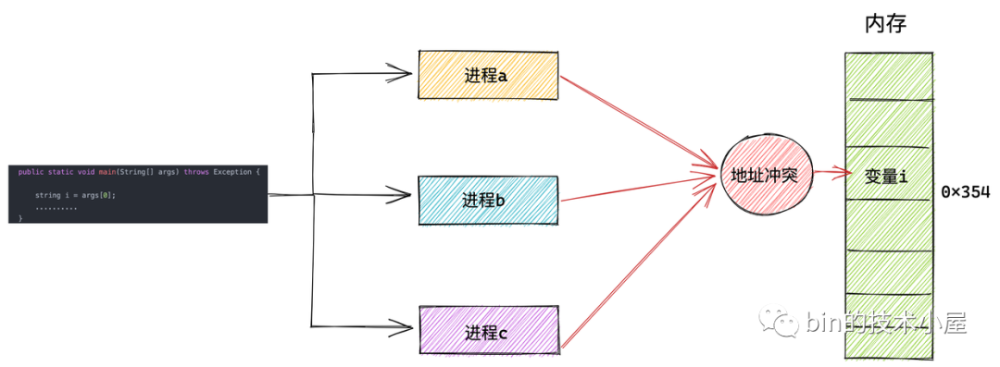

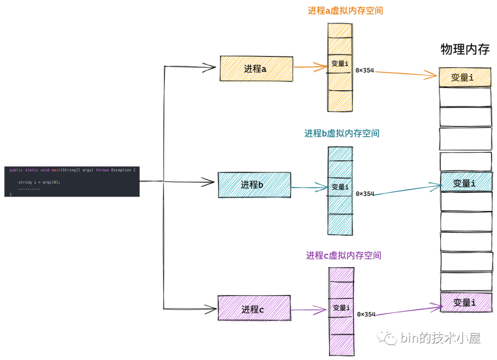

可以讲讲进程虚拟内存空间，用户态空间


代码段：程序编译成的二进制文件，机器码

数据段：初始化了的全局变量和静态变量

bss段：未初始化的全局变量被加载进内存之后，初始化为0

上述的全局变量和静态变量都在编译期确定，运行期间需要动态申请的内存

堆：存放动态申请的内存

动态链接库也有自己对应的代码段，数据段，BSS段，还有用于内存文件映射的系统调用 mmap，会将文件与内存进行映射，那么映射的这块内存（虚拟内存）也需要在虚拟地址空间中有一块区域存储。

这些动态链接库中的代码段，数据段，BSS 段，以及通过 mmap 系统调用映射的共享内存区，在虚拟内存空间的存储区域叫做文件映射与匿名映射区。

最后我们在程序运行的时候要调用各种函数吧，那么调用函数过程中使用到的局部变量和函数参数也需要一块内存区域来保存。这一块区域在虚拟内存空间中叫做栈。

我们看到内核根据进程运行的过程中所需要不同种类的数据而为其开辟了对应的地址空间。分别为：

-   用于存放进程程序二进制文件中的机器指令的代码段

-   用于存放程序二进制文件中定义的全局变量和静态变量的数据段和 BSS 段。

-   用于在程序运行过程中动态申请内存的堆。

-   用于存放动态链接库以及内存映射区域的文件映射与匿名映射区。

-   用于存放函数调用过程中的局部变量和函数参数的栈。

这些只是一个大概的规划，那么在真实的 Linux 系统中，进程的虚拟内存空间的具体规划又是如何的呢？

32g


1.  就是前边提到的由高 16 位空闲地址造成的 canonical address 空洞。在这段范围内的虚拟内存地址是不合法的，因为它的高 16 位既不全为 0 也不全为 1，不是一个 canonical address，所以称之为 canonical address 空洞。

2.  在代码段跟数据段的中间还有一段不可以读写的保护段，它的作用是防止程序在读写数据段的时候越界访问到代码段，这个保护段可以让越界访问行为直接崩溃，防止它继续往下运行。

3.  用户态虚拟内存空间与内核态虚拟内存空间分别占用 128T，其中低128T 分配给用户态虚拟内存空间，高 128T 分配给内核态虚拟内存空间。

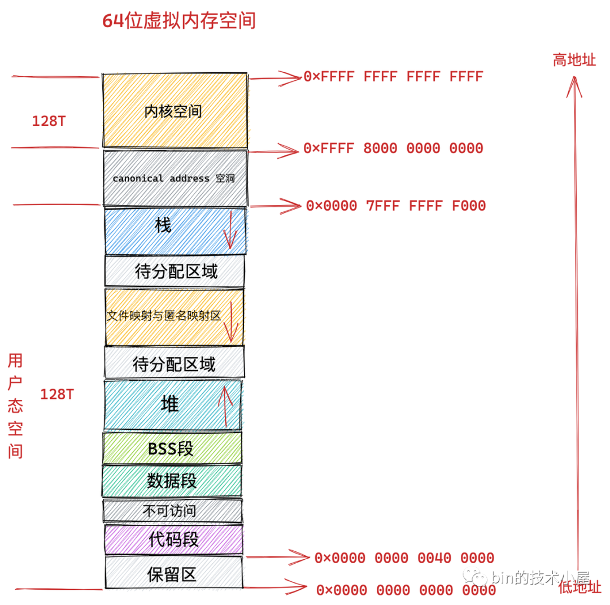

接下来，进程的虚拟内存空间管理，

那就离不开进程在内核中的描述符 task\_struct 结构。

```
struct task_struct {
        // 进程id
	    pid_t				pid;
        // 用于标识线程所属的进程 pid
	    pid_t				tgid;
        // 进程打开的文件信息
        struct files_struct		*files;
        // 内存描述符表示进程虚拟地址空间
        struct mm_struct		*mm;

        .......... 省略 .......
}
```

在进程描述符 task\_struct 结构中，有一个专门描述进程虚拟地址空间的内存描述符 mm\_struct 结构，这个结构体中包含了前边几个小节中介绍的进程虚拟内存空间的全部信息。

每个进程都有唯一的 mm\_struct 结构体，也就是前边提到的每个进程的虚拟地址空间都是独立，互不干扰的。

当我们调用 fork() 函数创建进程的时候，表示进程地址空间的 mm\_struct 结构会随着进程描述符 task\_struct 的创建而创建。

```
long _do_fork(unsigned long clone_flags,
	      unsigned long stack_start,
	      unsigned long stack_size,
	      int __user *parent_tidptr,
	      int __user *child_tidptr,
	      unsigned long tls)
{
        ......... 省略 ..........
	struct pid *pid;
	struct task_struct *p;

        ......... 省略 ..........
    // 为进程创建 task_struct 结构，用父进程的资源填充 task_struct 信息
	p = copy_process(clone_flags, stack_start, stack_size,
			 child_tidptr, NULL, trace, tls, NUMA_NO_NODE);

         ......... 省略 ..........
}
```


### 那么用户态的地址空间和内核态的地址空间在内核中是如何被划分的呢？

这就用到了进程的内存描述符 mm\_struct 结构体中的 task\_size 变量，task\_size 定义了用户态地址空间与内核态地址空间之间的分界线。

    struct mm_struct {
        unsigned long task_size;	/* size of task vm space */
    }


通过前边小节的内容介绍，我们知道在 32 位系统中用户态虚拟内存空间为 3 GB，虚拟内存地址范围为：0x0000 0000 - 0xC000 000 。

内核态虚拟内存空间为 1 GB，虚拟内存地址范围为：0xC000 000 - 0xFFFF FFFF。


32 位系统中用户地址空间和内核地址空间的分界线在 0xC000 000 地址处，那么自然进程的 mm\_struct 结构中的 task\_size 为 0xC000 000。

我们来看下内核在 `/arch/x86/include/asm/page_32_types.h` 文件中关于 TASK\_SIZE 的定义。

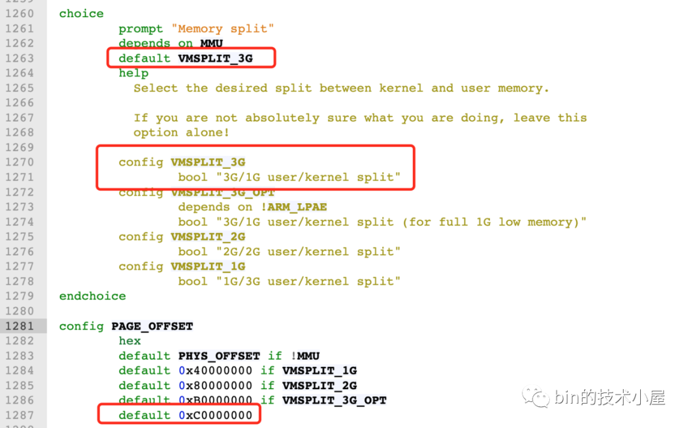

而在 64 位系统中，只使用了其中的低 48 位来表示虚拟内存地址。其中用户态虚拟内存空间为低 128 T，虚拟内存地址范围为：0x0000 0000 0000 0000 - 0x0000 7FFF FFFF F000 。

内核态虚拟内存空间为高 128 T，虚拟内存地址范围为：0xFFFF 8000 0000 0000 - 0xFFFF FFFF FFFF FFFF 。

64 位系统中用户地址空间和内核地址空间的分界线在 0x0000 7FFF FFFF F000 地址处，那么自然进程的 mm\_struct 结构中的 task\_size 为 0x0000 7FFF FFFF F000 。

我们来看下内核在 `/arch/x86/include/asm/page_64_types.h` 文件中关于 TASK\_SIZE 的定义。

    #define TASK_SIZE		(test_thread_flag(TIF_ADDR32) ? \
    					IA32_PAGE_OFFSET : TASK_SIZE_MAX)
    
    #define TASK_SIZE_MAX		task_size_max()
    
    #define task_size_max()		((_AC(1,UL) << __VIRTUAL_MASK_SHIFT) - PAGE_SIZE)
    
    #define __VIRTUAL_MASK_SHIFT	47


​    

我们来看下在 64 位系统中内核如何来计算 TASK\_SIZE，在 task\_size\_max() 的计算逻辑中 1 左移 47 位得到的地址是 0x0000800000000000，然后减去一个 PAGE\_SIZE （默认为 4K），就是 0x00007FFFFFFFF000，共 128T。所以在 64 位系统中的 TASK\_SIZE 为 0x00007FFFFFFFF000 。

> 这里我们可以看出，64 位虚拟内存空间的布局是和物理内存页 page 的大小有关的，物理内存页 page 默认大小 PAGE\_SIZE 为 4K。

PAGE\_SIZE 定义在 `/arch/x86/include/asm/page_types.h`文件中：

    /* PAGE_SHIFT determines the page size */
    #define PAGE_SHIFT		12
    #define PAGE_SIZE		(_AC(1,UL) << PAGE_SHIFT)


而内核空间的起始地址是 0xFFFF 8000 0000 0000 。在 0x00007FFFFFFFF000 - 0xFFFF 8000 0000 0000 之间的内存区域就是我们在 《4.2 64 位机器上进程虚拟内存空间分布》小节中介绍的 canonical address 空洞。

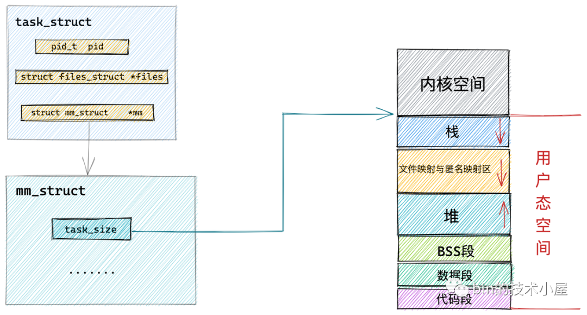

### 内核如何布局进程虚拟内存空间

前边我们提到，内核中采用了一个叫做内存描述符的 mm\_struct 结构体来表示进程虚拟内存空间的全部信息。在本小节中笔者就带大家到 mm\_struct 结构体内部去寻找下相关的线索。

    struct mm_struct {
        unsigned long task_size;    /* size of task vm space */
        unsigned long start_code, end_code, start_data, end_data;
        unsigned long start_brk, brk, start_stack;
        unsigned long arg_start, arg_end, env_start, env_end;
        unsigned long mmap_base;  /* base of mmap area */
        unsigned long total_vm;    /* Total pages mapped */
        unsigned long locked_vm;  /* Pages that have PG_mlocked set */
        unsigned long pinned_vm;  /* Refcount permanently increased */
        unsigned long data_vm;    /* VM_WRITE & ~VM_SHARED & ~VM_STACK */
        unsigned long exec_vm;    /* VM_EXEC & ~VM_WRITE & ~VM_STACK */
        unsigned long stack_vm;    /* VM_STACK */
    
           ...... 省略 ........
    }


内核中用 mm\_struct 结构体中的上述属性来定义上图中虚拟内存空间里的不同内存区域。

start\_code 和 end\_code 定义代码段的起始和结束位置，程序编译后的二进制文件中的机器码被加载进内存之后就存放在这里。

start\_data 和 end\_data 定义数据段的起始和结束位置，二进制文件中存放的全局变量和静态变量被加载进内存中就存放在这里。

后面紧挨着的是 BSS 段，用于存放未被初始化的全局变量和静态变量，这些变量在加载进内存时会生成一段 0 填充的内存区域 （BSS 段）， BSS 段的大小是固定的，

下面就是 OS 堆了，在堆中内存地址的增长方向是由低地址向高地址增长， start\_brk 定义堆的起始位置，brk 定义堆当前的结束位置。

> 我们使用 malloc 申请小块内存时（低于 128K），就是通过改变 brk 位置调整堆大小实现的。

接下来就是内存映射区，在内存映射区内存地址的增长方向是由高地址向低地址增长，mmap\_base 定义内存映射区的起始地址。进程运行时所依赖的动态链接库中的代码段，数据段，BSS 段以及我们调用 mmap 映射出来的一段虚拟内存空间就保存在这个区域。

start\_stack 是栈的起始位置在 RBP 寄存器中存储，栈的结束位置也就是栈顶指针 stack pointer 在 RSP 寄存器中存储。在栈中内存地址的增长方向也是由高地址向低地址增长。

arg\_start 和 arg\_end 是参数列表的位置， env\_start 和 env\_end 是环境变量的位置。它们都位于栈中的最高地址处。

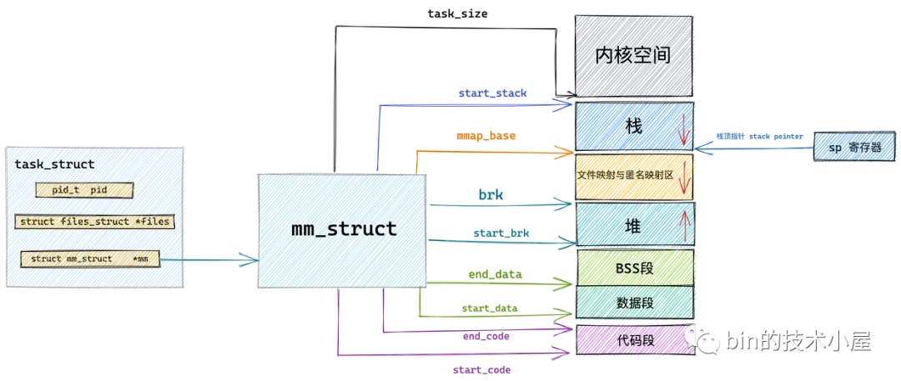

==在 mm\_struct 结构体中除了上述用于划分虚拟内存区域的变量之外，还定义了一些虚拟内存与物理内存映射内容相关的统计变量，操作系统会把物理内存划分成一页一页的区域来进行管理，所以物理内存到虚拟内存之间的映射也是按照页为单位进行的。==


### 内核如何管理虚拟内存区域

而在划分出的这些虚拟内存空间中如上图所示，里边又包含了许多特定的虚拟内存区域，比如：代码段，数据段，堆，内存映射区，栈。那么这些虚拟内存区域在内核中又是如何表示的呢？

本小节中，笔者将为大家介绍一个新的结构体 vm\_area\_struct，正是这个结构体描述了这些虚拟内存区域 VMA（virtual memory area）。

    struct vm_area_struct {
    
    	unsigned long vm_start;		/* Our start address within vm_mm. */
    	unsigned long vm_end;		/* The first byte after our end address
    					   within vm_mm. */
    	/*
    	 * Access permissions of this VMA.
    	 */
    	pgprot_t vm_page_prot;
    	unsigned long vm_flags;	
    
    	struct anon_vma *anon_vma;	/* Serialized by page_table_lock */
        struct file * vm_file;		/* File we map to (can be NULL). */
    	unsigned long vm_pgoff;		/* Offset (within vm_file) in PAGE_SIZE
    					   units */	
    	void * vm_private_data;		/* was vm_pte (shared mem) */
    	/* Function pointers to deal with this struct. */
    	const struct vm_operations_struct *vm_ops;
    }


每个 vm\_area\_struct 结构对应于虚拟内存空间中的唯一虚拟内存区域 VMA，vm\_start 指向了这块虚拟内存区域的起始地址（最低地址），vm\_start 本身包含在这块虚拟内存区域内。vm\_end 指向了这块虚拟内存区域的结束地址（最高地址），而 vm\_end 本身包含在这块虚拟内存区域之外，所以 vm\_area\_struct 结构描述的是 \[vm\_start，vm\_end) 这样一段左闭右开的虚拟内存区域。

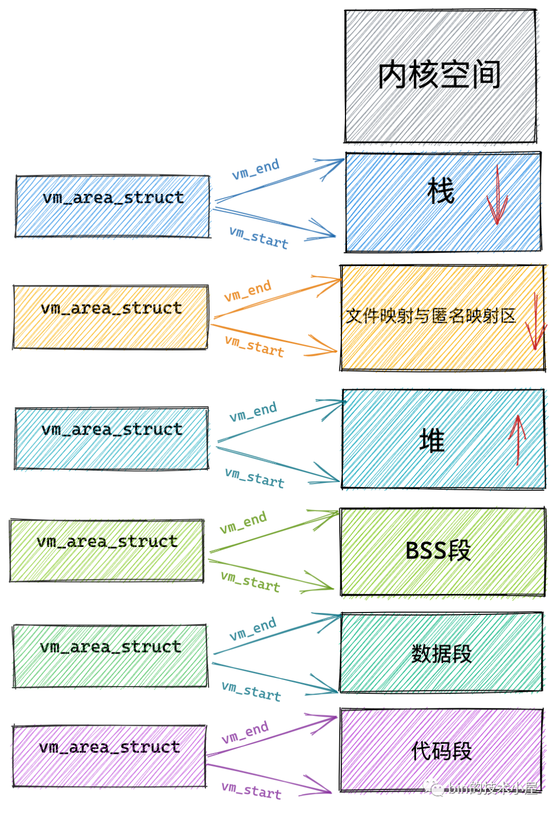


### 虚拟内存区域在内核中是如何被组织的

在上一小节中，我们介绍了内核中用来表示虚拟内存区域 VMA 的结构体 struct vm\_area\_struct ，并详细为大家剖析了 struct vm\_area\_struct 中的一些重要的关键属性。

现在我们已经熟悉了这些虚拟内存区域，那么接下来的问题就是在内核中这些虚拟内存区域是如何被组织的呢？


我们继续来到 struct vm\_area\_struct 结构中，来看一下与组织结构相关的一些属性：

    struct vm_area_struct {
    
    	struct vm_area_struct *vm_next, *vm_prev;
    	struct rb_node vm_rb;
        struct list_head anon_vma_chain; 
    	struct mm_struct *vm_mm;	/* The address space we belong to. */
    	
        unsigned long vm_start;     /* Our start address within vm_mm. */
        unsigned long vm_end;       /* The first byte after our end address
                           within vm_mm. */
        /*
         * Access permissions of this VMA.
         */
        pgprot_t vm_page_prot;
        unsigned long vm_flags; 
    
        struct anon_vma *anon_vma;  /* Serialized by page_table_lock */
        struct file * vm_file;      /* File we map to (can be NULL). */
        unsigned long vm_pgoff;     /* Offset (within vm_file) in PAGE_SIZE
                           units */ 
        void * vm_private_data;     /* was vm_pte (shared mem) */
        /* Function pointers to deal with this struct. */
        const struct vm_operations_struct *vm_ops;
    }


在内核中其实是通过一个 struct vm\_area\_struct 结构的双向链表将虚拟内存空间中的这些虚拟内存区域 VMA 串联起来的。

vm\_area\_struct 结构中的 vm\_next ，vm\_prev 指针分别指向 VMA 节点所在双向链表中的后继节点和前驱节点，内核中的这个 VMA 双向链表是有顺序的，所有 VMA 节点按照低地址到高地址的增长方向排序。

双向链表中的最后一个 VMA 节点的 vm\_next 指针指向 NULL，双向链表的头指针存储在内存描述符 struct mm\_struct 结构中的 mmap 中，正是这个 mmap 串联起了整个虚拟内存空间中的虚拟内存区域。

    struct mm_struct {
        struct vm_area_struct *mmap;		/* list of VMAs */
    }


在每个虚拟内存区域 VMA 中又通过 struct vm\_area\_struct 中的 vm\_mm 指针指向了所属的虚拟内存空间 mm\_struct。

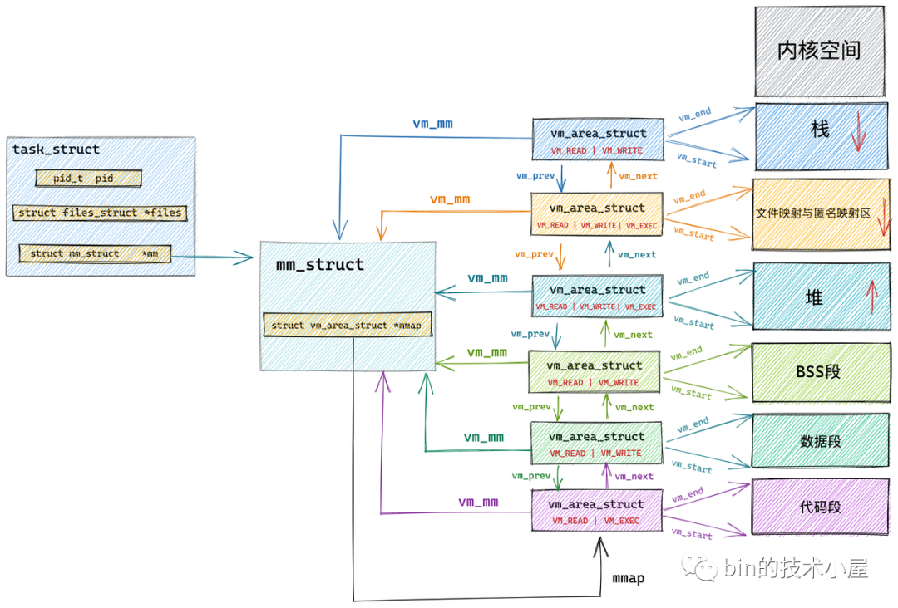

我们可以通过 `cat /proc/pid/maps` 或者 `pmap pid` 查看进程的虚拟内存空间布局以及其中包含的所有内存区域。这两个命令背后的实现原理就是通过遍历内核中的这个 vm\_area\_struct 双向链表获取的。

内核中关于这些虚拟内存区域的操作除了遍历之外还有许多需要根据特定虚拟内存地址在虚拟内存空间中查找特定的虚拟内存区域。

尤其在进程虚拟内存空间中包含的内存区域 VMA 比较多的情况下，使用红黑树查找特定虚拟内存区域的时间复杂度是 O( logN ) ，可以显著减少查找所需的时间。

所以在内核中，同样的内存区域 vm\_area\_struct 会有两种组织形式，一种是双向链表用于高效的遍历，另一种就是红黑树用于高效的查找。

每个 VMA 区域都是红黑树中的一个节点，通过 struct vm\_area\_struct 结构中的 vm\_rb 将自己连接到红黑树中。

而红黑树中的根节点存储在内存描述符 struct mm\_struct 中的 mm\_rb 中：

    struct mm_struct {
         struct rb_root mm_rb;
    }


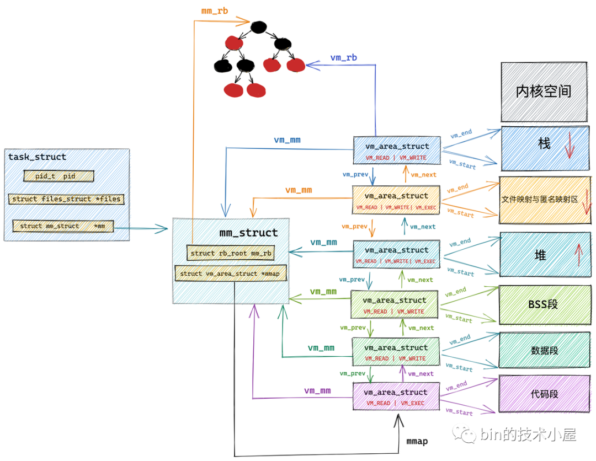


## 物理内存

### 从 CPU 角度看物理内存模型

 FLATMEM 平坦内存模型

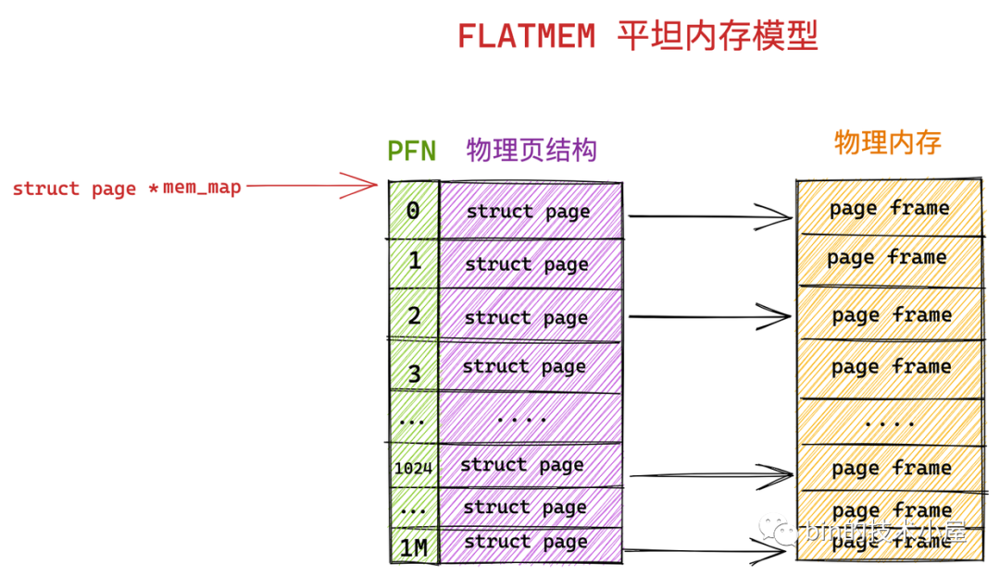

DISCONTIGMEM 非连续内存模型

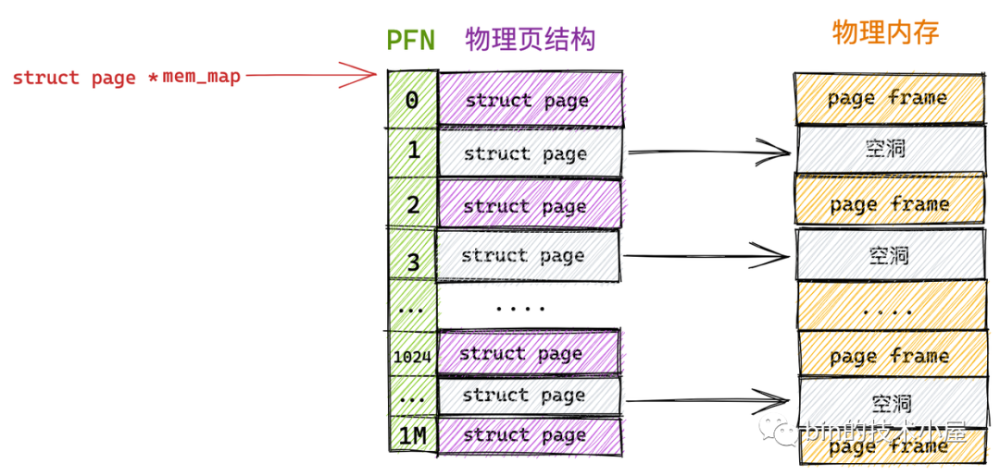

SPARSEMEM 稀疏内存模型

随着内存技术的发展，内核可以支持物理内存的热插拔了（后面笔者会介绍），这样一来物理内存的不连续就变为常态了，在上小节介绍的 DISCONTIGMEM 内存模型中，其实每个 node 中的物理内存也不一定都是连续的。

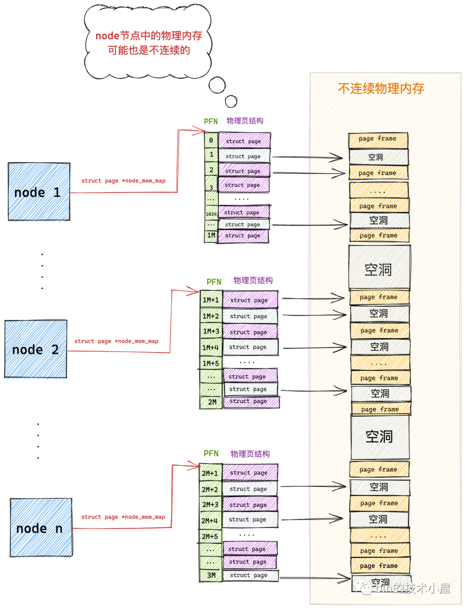

而且每个 node 中都有一套完整的内存管理系统，如果 node 数目多的话，那这个开销就大了，于是就有了对连续物理内存更细粒度的管理需求，为了能够更灵活地管理粒度更小的连续物理内存，SPARSEMEM 稀疏内存模型就此登场了。

SPARSEMEM 稀疏内存模型的核心思想就是对粒度更小的连续内存块进行精细的管理，用于管理连续内存块的单元被称作 section 。物理页大小为 4k 的情况下， section 的大小为 128M ，物理页大小为 16k 的情况下， section 的大小为 512M。

在内核中用 struct mem\_section 结构体表示 SPARSEMEM 模型中的 section。

    struct mem_section {
    	unsigned long section_mem_map;
            ...
    }


由于 section 被用作管理小粒度的连续内存块，这些小的连续物理内存在 section 中也是通过数组的方式被组织管理，每个 struct mem\_section 结构体中有一个 section\_mem\_map 指针用于指向 section 中管理连续内存的 page 数组。

SPARSEMEM 内存模型中的这些所有的 mem\_section 会被存放在一个全局的数组中，并且每个 mem\_section 都可以在系统运行时改变 offline / online （下线 / 上线）状态，以便支持内存的热插拔（hotplug）功能。

    #ifdef CONFIG_SPARSEMEM_EXTREME
    extern struct mem_section *mem_section[NR_SECTION_ROOTS];


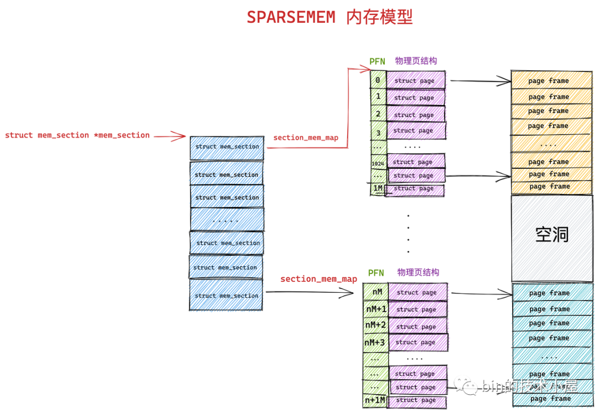

在 SPARSEMEM 稀疏内存模型下 page\_to\_pfn 与 pfn\_to\_page 的计算逻辑又发生了变化。

-   在 page\_to\_pfn 的转换中，首先需要通过 page\_to\_section 根据 struct page 结构定位到 mem\_section 数组中具体的 section 结构。然后在通过 section\_mem\_map 定位到具体的 PFN。

> 在 struct page 结构中有一个 `unsigned long flags` 属性，在 flag 的高位 bit 中存储着 page 所在 mem\_section 数组中的索引，从而可以定位到所属 section。

-   在 pfn\_to\_page 的转换中，首先需要通过 \_\_pfn\_to\_section 根据 PFN 定位到 mem\_section 数组中具体的 section 结构。然后在通过 PFN 在 section\_mem\_map 数组中定位到具体的物理页 Page 。

> PFN 的高位 bit 存储的是全局数组 mem\_section 中的 section 索引，PFN 的低位 bit 存储的是 section\_mem\_map 数组中具体物理页 page 的索引。

    #if defined(CONFIG_SPARSEMEM)
    /*
     * Note: section's mem_map is encoded to reflect its start_pfn.
     * section[i].section_mem_map == mem_map's address - start_pfn;
     */
    #define __page_to_pfn(pg)					\
    ({	const struct page *__pg = (pg);				\
    	int __sec = page_to_section(__pg);			\
    	(unsigned long)(__pg - __section_mem_map_addr(__nr_to_section(__sec)));	\
    })
    
    #define __pfn_to_page(pfn)				\
    ({	unsigned long __pfn = (pfn);			\
    	struct mem_section *__sec = __pfn_to_section(__pfn);	\
    	__section_mem_map_addr(__sec) + __pfn;		\
    })
    #endif


从以上的内容介绍中，我们可以看出 SPARSEMEM 稀疏内存模型已经完全覆盖了前两个内存模型的所有功能，因此稀疏内存模型可被用于所有内存布局的情况。
