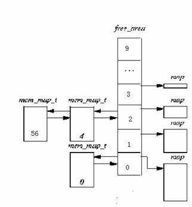
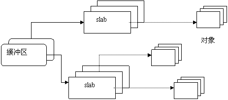
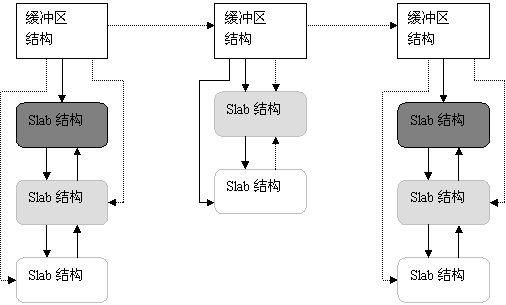

# 深入分析Linux内核源码——6.3 内存的分配和回收

## 6.3 内存的分配和回收

   在内存初始化完成以后，内存中就常驻有内核映象（内核代码和数据）。以后，随着用户程序的执行和结束，就需要不断地分配和释放物理页面。内核应该为分配一组连续的页面而建立一种稳定、高效的分配策略。为此，必须解决一个比较重要的内存管理问题，即**外碎片问题**。频繁地请求和释放不同大小的一组连续页面，必然导致在已分配的内存块中分散许多小块的空闲页面。由此带来的问题是，即使这些小块的空闲页面加起来足以满足所请求的页面，但是要分配一个大块的连续页面可能就根本无法满足。Linux采用著名的**伙伴（Buddy）系统算法来解决外碎片问题**。

   但是请注意，**在Linux中，CPU不能按物理地址来访问存储空间，而必须使用虚拟地址**；因此，对于内存页面的管理，通常是先在虚存空间中分配一个虚存区间，然后才根据需要为此区间分配相应的物理页面并建立起映射，也就是说，虚存区间的分配在前，而物理页面的分配在后，但是为了承接上一节的内容，我们先介绍内存的分配和回收，然后再介绍用户进程虚存区间的建立。

### 6.3.1伙伴算法

####  1．原理

​		Linux的伙伴算法把所有的空闲页面分为10个块组，每组中块的大小是2的幂次方个页面，例如，第0组中块的大小都为20 （1个页面），第1组中块的大小为都为2^1（2个页面），第9组中块的大小都为29（512个页面）。也就是说，每一组中块的大小是相同的，且这同样大小的块形成一个链表。

我们通过一个简单的例子来说明该算法的工作原理。
假设要求分配的块其大小为128个页面（由多个页面组成的块我们就叫做**页面块**）。该算法先在块大小为128个页面的链表中查找，看是否有这样一个空闲块。如果有，就直接分配；如果没有，该算法会查找下一个更大的块，具体地说，就是在块大小为256个页面的链表中查找一个空闲块。如果存在这样的空闲块，内核就把这256个页面分为两等份，一份分配出去，另一份插入到块大小为128个页面的链表中。如果在块大小为256个页面的链表中也没有找到空闲页块，就继续找更大的块，即512个页面的块。如果存在这样的块，内核就从512个页面的块中分出128个页面满足请求，然后从384个页面中取出256个页面插入到块大小为256个页面的链表中。然后把剩余的128个页面插入到块大小为128个页面的链表中。如果512个页面的链表中还没有空闲块，该算法就放弃分配，并发出出错信号。

​		以上过程的逆过程就是块的释放过程，这也是该算法名字的来由。满足以下条件的两个块称为**伙伴**：

1、      两个块的大小相同

2、      两个块的物理地址连续

​		伙伴算法把满足以上条件的两个块合并为一个块，该算法是迭代算法，如果合并后的块还可以跟相邻的块进行合并，那么该算法就继续合并。

2．数据结构

在6.2.5节中所介绍的管理区数据结构struct zone\_struct中，涉及到空闲区数据结构：

free\_area\_t free\_area\[MAX\_ORDER\];

我们再次对free\_area\_t给予较详细的描述。

```C
#difine   MAX_ORDER  10

    type struct free_area_struct {

           struct list_head   free_list;

                 unsigned  int    *map;

     } free_area_t
```

  其中list\_head域是一个通用的双向链表结构，链表中元素的类型将为mem\_map\_t(即struct page结构)。Map域指向一个**位图**，其大小取决于现有的页面数。free\_area第k项**位图的每一位**，描述的就是大小为2k个页面的两个伙伴块的状态。如果位图的某位为0，表示一对兄弟块中或者两个都空闲，或者两个都被分配，如果为1，肯定有一块已被分配。当兄弟块都空闲时，内核把它们当作一个大小为2k+1的单独快来处理。如图6.9给出该数据结构的示意图：

  

​		图6.9 伙伴系统使用的数据结构

 图6.9中，free\_aea数组的元素0包含了一个空闲页（页面编号为0）；而元素2则包含了两个以4个页面为大小的空闲页面块，第一个页面块的起始编号为4，而第二个页面块的起始编号为56。

我们曾提到，当需要分配若干个内存页面时，用于DMA的内存页面必须是连续的。其实为了便于管理，从伙伴算法可以看出，**只要请求分配的块大小不超过512个页面（一个页面4KB,512个是2M），内核就尽量分配连续的页面**。

### 6.3.2 物理页面的分配和释放

​		当一个进程请求分配连续的物理页面时，可以通过调用alloc\_pages()来完成。Linux2.4版本中有两个alloc\_pages() ，一个在mm/numa.c中，另一个在mm/page\_alloc,c中       ，编译时根据所定义的条件选项CONFIG\_DISCONTIGMEM来进行取舍。

1．非一致存储结构（NUMA）中页面的分配。

CONFIG\_DISCONTIGMEM条件编译的含义是“不连续的存储空间”，Linux把不连续的存储空间也归类为非一致存储结构（NUMA）。这是因为，不连续的存储空间本质上是一种广义的NUMA，因为那说明在最低物理地址和最高物理地址之间存在着空洞，而有空洞的空间当然是“不一致”的。所以，在地址不连续的物理空间也要像结构不一样的物理空间那样划分出若干连续且均匀的“节点”。因此，在存储结构不连续的系统中，每个模块都由若干个节点，因而都有个pg\_data\_t数据结构队列。  我们先来看mm/numa.c中的alloc\_page()函数：

```C
/*

  * This can be refined. Currently, tries to do round robin, instead

  * should do concentratic circle search, starting from current node.

  */

struct page * _alloc_pages(unsigned int gfp_mask, unsigned int order)

{

         struct page *ret = 0;

         pg_data_t *start, *temp;

#ifndef CONFIG_NUMA

         unsigned long flags;

         static pg_data_t *next = 0;

#endif

 

         if (order >= MAX_ORDER)

                 return NULL;

#ifdef CONFIG_NUMA

         temp = NODE_DATA(numa_node_id());

#else

         spin_lock_irqsave(&node_lock, flags);

         if (!next)  next = pgdat_list;

         temp = next;

         next = next->node_next;

         spin_unlock_irqrestore(&node_lock, flags);

#endif

         start = temp;

         while (temp) {

                 if ((ret = alloc_pages_pgdat(temp, gfp_mask, order)))

                         return(ret);

                 temp = temp->node_next;

         }

         temp = pgdat_list;

         while (temp != start) {

                 if ((ret = alloc_pages_pgdat(temp, gfp_mask, order)))

                         return(ret);

                 temp = temp->node_next;

         }

         return(0);

  }
```

对该函数的说明如下：

·     该函数有两个参数。gfp\_mask表示采用哪种分配策略。参数order表示所需物理块的大小，可以是1、2、3直到2MAX\_ORDER-1(order 申请页面的阶数

MAX\_ORDER是一个宏，定义了buddy系统最大的阶数，大于这个阶数的申请是注定失败的。系统缺省定义是11，也就是说2^11 = 2048个pages。这个值可以通过架构特定的配置FORCE\_MAX\_ZONEORDER来修改缺省值，一般来说我们不需要更改这个值。要注意的是GPU VPU等申请的连续内存区比较大，并且这些驱动不会频繁分配释放，系统不会通过buddy系统分配内存，而是使用预留内存的方式。

)。

·     如果定义了CONFIG\_NUMA，也就是在NUMA结构的系统中，可以通过NUMA\_DATA（）宏找到CPU所在节点的pg\_data\_t数据结构队列，并存放在临时变量temp中。

·     如果在不连续的UMA结构中，则有个pg\_data\_t数据结构的队列pgdat\_list，pgdat\_list就是该队列的首部。因为队列一般都是临界资源，因此，在对该队列进行两个以上的操作时要加锁。

·     分配时轮流从各个节点开始，以求各节点负荷的平衡。函数中有两个循环，其形式基本相同，也就是，对节点队列基本进行两遍扫描，直至在某个节点内分配成功，则跳出循环，否则，则彻底失败，从而返回0。对于每个节点，调用alloc\_pages\_pgdat（）函数试图分配所需的页面。

2. 一致存储结构(UMA)中页面的分配

   连续空间UMA结构的alloc\_page()是在include/linux/mm.h中定义的：


```C
 #ifndef CONFIG_DISCONTIGMEM

     static inline struct page * alloc_pages(unsigned int gfp_mask, unsigned int order)

{

         /*

          * Gets optimized away by the compiler.

          */

         if (order >= MAX_ORDER)

                 return NULL;

         return __alloc_pages(gfp_mask, order,

                 contig_page_data.node_zonelists+(gfp_mask & GFP_ZONEMASK));

    }

    #endif
```

从这个函数的定义可以看出，alloc\_page()是\_alloc\_pages（）的封装函数，而\_alloc\_pages（）才是伙伴算法的核心。这个函数定义于mm/page\_alloc.c中，我们先对此函数给予概要描述。

\_alloc\_pages（）在管理区链表zonelist中依次查找每个区，从中找到满足要求的区，然后用伙伴算法从这个区中分配给定大小（2 order个）的页面块。如果所有的区都没有足够的空闲页面，则调用swapper或 bdflush内核线程，把脏页写到磁盘以释放一些页面。

在\_\_alloc\_pages()和虚拟内存（简称VM）的代码之间有一些复杂的接口（后面会详细描述）。每个区都要对刚刚被映射到某个进程VM的页面进行跟踪，被映射的页面也许仅仅做了标记，而并没有真正地分配出去。因为根据虚拟存储的分配原理，对物理页面的分配要尽量推迟到不能再推迟为止，也就是说，当进程的代码或数据必须装入到内存时，才给它真正分配物理页面。

   搞清楚页面分配的基本原则后，我们对其代码具体分析如下：

```C
/*

     * This is the 'heart' of the zoned buddy allocator:

     */

struct page * __alloc_pages(unsigned int gfp_mask, unsigned int order, zonelist_t *zonelist)

{

              unsigned long min;

              zone_t **zone, * classzone;

              struct page * page;

        int freed;
                    zone = zonelist->zones;

              classzone = *zone;

                min = 1UL << order;

              for (;;) {

                     zone_t *z = *(zone++);

                     if (!z)

                              break;
                                   min += z->pages_low;

                 if (z->free_pages > min) {

                         page = rmqueue(z, order);

                         if (page)

                                 return page;

                 }

        }
```


这是对一个分配策略中所规定的所有页面管理区的循环。循环中依次考察各个区中空闲页面的总量，如果总量尚大于“最低水位线”与所请求页面数之和，就调用rmqueue（）试图从该区中进行分配。如果分配成功，则返回一个page结构指针，指向页面块中第一个页面的起始地址。

```C
classzone->need_balance = 1;

         mb();

         if (waitqueue_active(&kswapd_wait))

                 wake_up_interruptible(&kswapd_wait);
```

​		如果发现管理区中的空闲页面总量已经降到最低点，则把zone\_t结构中需要重新平衡的标志（need\_balance）置1，而且如果内核线程kswapd在一个等待队列中睡眠，就唤醒它，让它收回一些页面以备使用（可以看出，need\_balance是和kswapd配合使用的）。

```C
zone = zonelist->zones;

         min = 1UL << order;

         for (;;) {

                 unsigned long local_min;

                 zone_t *z = *(zone++);

                 if (!z)

                         break;
                              local_min = z->pages_min;

                 if (!(gfp_mask & __GFP_WAIT))

                         local_min >>= 2;

                 min += local_min;

                 if (z->free_pages > min) {

                         page = rmqueue(z, order);

                         if (page)

                                 return page;

                 }

         }
```


 

 如果给定分配策略中所有的页面管理区都分配失败，那只好把原来的“最低水位”再向下调（除 以4），然后看是否满足要求（z->free\_pages > min），如果能满足要求，则调用rmqueue（）进行分配。

```C
 /* here we're in the low on memory slow path */
```


​     
​    
    rebalance:
    
             if (current->flags & (PF_MEMALLOC | PF_MEMDIE)) {
    
                    zone = zonelist->zones;
    
                     for (;;) {
    
                             zone_t *z = *(zone++);
    
                             if (!z)
    
                                     break;
                                                              page = rmqueue(z, order);
    
                             if (page)
    
                                     return page;
    
                    }
    
                     return NULL;
    
               }

 如果分配还不成功，这时候就要看是哪类进程在请求分配内存页面。其中PF\_MEMALLOC和PF\_MEMDIE是进程的task\_struct结构中flags域的值，对于正在分配页面的进程（如kswapd内核线程），则其PF\_MEMALLOC的值为1（一般进程的这个标志为0），而对于使内存溢出而被杀死的进程，则其PF\_MEMDIE为1。不管哪种情况，都说明必须给该进程分配页面（想想为什么）。因此，继续进行分配。

    /* Atomic allocations - we can't balance anything */
    
             if (!(gfp_mask & __GFP_WAIT))
    
                     return NULL;

如果请求分配页面的进程不能等待，也不能被重新调度，只好在没有分配到页面的情况下“空手”返回。

    page = balance_classzone(classzone, gfp_mask, order, &freed);
    
             if (page)
    
                     return page;

如果经过几番努力，必须得到页面的进程（如kswapd）还没有分配到页面，就要调用balance\_classzone（）函数把当前进程所占有的局部页面释放出来。如果释放成功，则返回一个page结构指针，指向页面块中第一个页面的起始地址。

         zone = zonelist->zones;
    
             min = 1UL << order;
    
            for (;;) {
    
                     zone_t *z = *(zone++);
    
                    if (!z)
    
                             break;
                                             min += z->pages_min;
    
                     if (z->free_pages > min) {
    
                            page = rmqueue(z, order);
    
                            if (page)
    
                                     return page;
    
                     }
    
             }

继续进行分配。

```
 /* Don't let big-order allocations loop *

         if (order > 3)

                return NULL;

 

        /* Yield for kswapd, and try again */

         current->policy |= SCHED_YIELD;

         __set_current_state(TASK_RUNNING);

        schedule();

         goto rebalance;

       }
```

   在这个函数中，频繁调用了rmqueue（）函数，下面我们具体来看一下这个函数内容：

 （1）rmqueue（）函数

该函数试图从一个页面管理区分配若干连续的内存页面。这是最基本的分配操作，其具体代码如下：

```
static struct page * rmqueue(zone_t *zone, unsigned int order)

{

         free_area_t * area = zone->free_area + order;

         unsigned int curr_order = order;

         struct list_head *head, *curr;

         unsigned long flags;

         struct page *page;

 

        spin_lock_irqsave(&zone->lock, flags);

         do {

                 head = &area->free_list;

                 curr = memlist_next(head);

 

                 if (curr != head) {

                         unsigned int index;

 

                         page = memlist_entry(curr, struct page, list);

                         if (BAD_RANGE(zone,page))

                                 BUG();

                         memlist_del(curr);

                         index = page - zone->zone_mem_map;

                         if (curr_order != MAX_ORDER-1)

                                 MARK_USED(index, curr_order, area);

                         zone->free_pages -= 1UL << order;

 

                         page = expand(zone, page, index, order, curr_order, area);

                         spin_unlock_irqrestore(&zone->lock, flags);

 

                         set_page_count(page, 1);

                         if (BAD_RANGE(zone,page))

                                 BUG();

                         if (PageLRU(page))

                                 BUG();

                         if (PageActive(page))

                                 BUG();

                         return page;   

                 }

                 curr_order++;

                 area++;

         } while (curr_order < MAX_ORDER);

         spin_unlock_irqrestore(&zone->lock, flags);

 

         return NULL;

 }
```


对该函数的解释如下：

·     参数zone指向要分配页面的管理区，order表示要求分配的页面数为2 order。

·     do循环从free\_area数组的第order个元素开始，扫描每个元素中由page结构组成的双向循环空闲队列。如果找到合适的页块，就把它从队列中删除，删除的过程是不允许其他进程、其他处理器来打扰的。所以要用spin\_lock\_irqsave（）将这个循环加上锁。

·     首先在恰好满足大小要求的队列里进行分配。其中memlist\_entry(curr, struct page, list)获得空闲块的第一个页面的地址，如果这个地址是个无效的地址，就陷入BUG()。如果有效，memlist\_del(curr)从队列中摘除分配出去的页面块。如果某个页面块被分配出去，就要在frea\_area的位图中进行标记，这是通过调用MARK\_USED（）宏来完成的。

·     如果分配出去后还有剩余块，就通过expand（）获得所分配的页块,而把剩余块链入适当的空闲队列中。

·     如果当前空闲队列没有空闲块，就从更大的空闲块队列中找。

 （2）expand（）函数

 该函数源代码如下：

    static inline struct page * expand (zone_t *zone, struct page *page,
    
              unsigned long index, int low, int high, free_area_t * area)
    
      {
    
             unsigned long size = 1 << high;
    
     
    
             while (high > low) {
    
                     if (BAD_RANGE(zone,page))
    
                             BUG();
    
                     area--;
    
                     high--;
    
                     size >>= 1;
    
                     memlist_add_head(&(page)->list, &(area)->free_list);
    
                     MARK_USED(index, high, area);
    
                     index += size;
    
                     page += size;
    
             }
    
             if (BAD_RANGE(zone,page))
    
                     BUG();
    
             return page;
    
      }

   对该函数解释如下：

·      参数zone指向已分配页块所在的管理区；page指向已分配的页块；index是已分配的页面在mem\_map中的下标； low表示所需页面块大小为2 low，而high表示从空闲队列中实际进行分配的页面块大小为2high；area是free\_area\_struct结构，指向实际要分配的页块。

·      通过上面介绍可以知道，返回给请求者的块大小为2low个页面，并把剩余的页面放入合适的空闲队列，且对伙伴系统的位图进行相应的修改。例如，假定我们需要一个2页面的块，但是，我们不得不从order为3（8个页面）的空闲队列中进行分配，又假定我们碰巧选择物理页面800作为该页面块的底部。在我们这个例子中，这几个参数值为：

page == mem\_map+800

index == 800

   low == 1

   high == 3

​		area == zone->free\_area+high ( 也就是frea\_area数组中下标为3的元素)

·      首先把size初始化为分配块的页面数(例如，size = 1<<3 == 8)

·      while循环进行循环查找。每次循环都把size减半。如果我们从空闲队列中分配的一个块与所要求的大小匹配，那么low = high，就彻底从循环中跳出，返回所分配的页块。

·      如果分配到的物理块所在的空闲块大于所需块的大小（即2 high\>2low），那就将该空闲块分为两半（即area--;high--; size >>= 1）,然后调用memlist\_add\_head（）把刚分配出去的页面块又加入到低一档（物理块减半）的空闲队列中，准备从剩下的一半空闲块中重新进行分配，并调用MARK\_USED（）设置位图。

·      在上面的例子中，第1次循环，我们从页面800开始，把页面大小为4（即2high--）的块其首地址插入到frea\_area\[2\]中的空闲队列；因为low<high，又开始第2次循环，这次从页面804开始，把页面大小为2的块插入到frea\_area\[1\]中的空闲队列，此时，page＝806，high=low＝1，退出循环，我们给调用者返回从806页面开始的一个2页面块。

·      从这个例子可以看出，这是一种巧妙的分配算法。

3． 释放页面

   从上面的介绍可以看出,页面块的分配必然导致内存的碎片化，而页面块的释放则可以将页面块重新组合成大的页面块。页面的释放函数为\_\_free\_pages(page struct \*page, unsigned long order) ，该函数从给定的页面开始，释放的页面块大小为2order。原函数为:

```
void __free_pages(page struct *page, unsigned long order)

{

          if (!PageReserved(page) && put_page_testzero(page))

           __free_pages_ok(page, order);

}
```

其中比较巧妙的部分就是调用put\_page\_testzero()宏,该函数把页面的引用计数减1,如果减1后引用计数为0，则该函数返回1。因此，如果调用者不是该页面的最后一个用户，那么，这个页面实际上就不会被释放。另外要说明的是不可释放保留页PageReserved，这是通过PageReserved（）宏进行检查的。

如果调用者是该页面的最后一个用户，则\_\_free\_pages() 再调用 \_\_free\_pages\_ok()。\_\_free\_pages\_ok（）才是对页面块进行释放的实际函数，该函数把释放的页面块链入空闲链表，并对伙伴系统的位图进行管理，必要时合并伙伴块。这实际上是expand()函数的反操作，我们对此不再进行详细的讨论。

### 6.3.3 Slab分配机制

   采用伙伴算法分配内存时，每次至少分配一个页面。但当请求分配的内存大小为几十个字节或几百个字节时应该如何处理？如何在一个页面中分配小的内存区，小内存区的分配所产生的内碎片又如何解决？

   Linux2.0采用的解决办法是建立了13个空闲区链表，它们的大小从32字节到132056字节。从Linux2.2开始，MM的开发者采用了一种叫做slab的分配模式，该模式早在1994年就被开发出来，用于Sun Microsystem Solaris 2.4操作系统中。Slab的提出主要是基于以下考虑：

·      内核对内存区的分配取决于所存放数据的类型。例如，当给用户态进程分配页面时，内核调用get\_free\_page()函数，并用0填充这个页面。 而给内核的数据结构分配页面时，事情没有这么简单，例如，要对数据结构所在的内存进行初始化、在不用时要收回它们所占用的内存。因此，**Slab中引入了对象这个概念，所谓对象就是存放一组数据结构的内存区**，其方法就是构造或析构函数，构造函数用于初始化数据结构所在的内存区，而析构函数收回相应的内存区。但为了便于理解，你也可以把对象直接看作内核的数据结构。为了避免重复初始化对象，**Slab分配模式并不丢弃已分配的对象，而是释放但把它们依然保留在内存中**。当以后又要请求分配同一对象时，就可以从内存获取而不用进行初始化，这是在Solaris 中引入Slab的基本思想。

实际上，Linux中对Slab分配模式有所改进，**它对内存区的处理并不需要进行初始化或回收**。出于效率的考虑，Linux并不调用对象的构造或析构函数，而是把指向这两个函数的指针都置为空。Linux中引入Slab的主要目的是**为了减少对伙伴算法的调用次数**。

·      实际上，内核经常反复使用某一内存区。例如，只要内核创建一个新的进程，就要为该进程相关的数据结构（task\_struct、打开文件对象等）分配内存区。当进程结束时，收回这些内存区。因为进程的创建和撤销非常频繁，因此，**Linux的早期版本把大量的时间花费在反复分配或回收这些内存区上。从Linux2.2开始，把那些频繁使用的页面保存在高速缓存中并重新使用。**

·      可以根据对内存区的使用频率来对它分类。对于预期频繁使用的内存区，可以创建一组特定大小的**专用缓冲区**进行处理，以避免内碎片的产生。对于较少使用的内存区，可以创建一组**通用缓冲区**（如Linux2.0中所使用的2的幂次方）来处理，即使这种处理模式产生碎片，也对整个系统的性能影响不大。

·      硬件高速缓存的使用，又为尽量减少对伙伴算法的调用提供了另一个理由，因为对伙伴算法的每次调用都会“弄脏”硬件高速缓存，因此，这就增加了对内存的平均访问次数。

**Slab分配模式把对象分组放进缓冲区**（尽管英文中使用了Cache这个词，但实际上指的是内存中的区域，而不是指硬件高速缓存）。因为缓冲区的组织和管理与硬件高速缓存的命中率密切相关，因此，Slab缓冲区并非由各个对象直接构成，而是由一连串的“**大块（Slab）**”构成，而每个大块中则包含了若干个同种类型的对象，这些对象或已被分配，或空闲，如图6.12所示。一般而言，对象分两种，**一种是大对象，一种是小对象**。所谓小对象，是指在一个页面中可以容纳下好几个对象的那种。例如，一个inode结构大约占300多个字节，因此，一个页面中可以容纳8个以上的inode结构，因此，inode结构就为小对象。Linux内核中把小于512字节的对象叫做小对象。

 


图6.10 Slab的组成

实际上，缓冲区就是主存中的一片区域，把这片区域划分为多个块，每块就是一个Slab，每个Slab由一个或多个页面组成，每个Slab中存放的就是对象。

因为Slab分配模式的实现比较复杂，我们不准备对其进行详细的分析，只对主要内容给予描述。

1． Slab的数据结构

Slab分配模式有两个主要的数据结构，一个是描述缓冲区的结构kmem\_cache\_t，一个是描述Slab的结构kmem\_slab\_t，下面对这两个结构给予简要讨论：

（1）Slab

Slab是Slab管理模式中最基本的结构。它由一组连续的物理页面组成，对象就被顺序放在这些页面中。其数据结构在mm/slab.c中定义如下：

 

     /*
    
      * slab_t
    
      *
    
      * Manages the objs in a slab. Placed either at the beginning of mem allocated
    
      * for a slab, or allocated from an general cache.
    
      * Slabs are chained into three list: fully used, partial, fully free slabs.
    
      */
    
       typedef struct slab_s {
    
             struct list_head        list;
    
             unsigned long           colouroff;
    
             void                   *s_mem;         /* including colour offset */
    
             unsigned int            inuse;          /* num of objs active in slab */
    
             kmem_bufctl_t           free;
    
      } slab_t;


这里的链表用来将前一个Slab和后一个Slab链接起来形成一个双向链表，colouroff为该Slab上着色区的大小，指针s\_mem指向对象区的起点，inuse是Slab中所分配对象的个数。最后，free的值指明了空闲对象链中的第一个对象，kmem\_bufctl\_t其实是一个整数。Slab结构的示意图如图6.11所示：  

  
               图6.11 Slab结构示意图  

对于小对象， 就把Slab的描述结构slab\_t放在该Slab中；对于大对象，则把Slab结构游离出来，集中存放。关于Slab中的着色区再给予具体描述：

·      每个Slab的首部都有一个小小的区域是不用的，称为“着色区（coloring area）”。**着色区的大小使Slab中的每个对象的起始地址都按高速缓存中的”缓存行（cache line）”大小进行对齐**（80386的一级高速缓存行大小为16字节，Pentium为32字节）。因为Slab是由1个页面或多个页面（最多为32）组成，因此，每个Slab都是从一个页面边界开始的，它自然按高速缓存的缓冲行对齐。但是，Slab中的对象大小不确定，设置着色区的目的就是将Slab中第一个对象的起始地址往后推到与缓冲行对齐的位置。因为一个缓冲区中有多个Slab，因此，应该把每个缓冲区中的各个Slab着色区的大小尽量安排成不同的大小，这样可以使得在不同的Slab中，处于同一相对位置的对象，让它们在高速缓存中的起始地址相互错开，这样就可以**改善高速缓存的存取效率**。

·      每个Slab上最后一个对象以后也有个小小的废料区是不用的，这是对着色区大小的补偿，其大小取决于着色区的大小，以及Slab与其每个对象的相对大小。但**该区域与着色区的总和对于同一种对象的各个Slab是个常数**。

·      每个对象的大小基本上是所需数据结构的大小。只有当数据结构的大小不与高速缓存中的缓冲行对齐时，才增加若干字节使其对齐。所以，一个Slab上的所有对象的起始地址都必然是按高速缓存中的缓冲行对齐的。

(2)缓冲区

 每个缓冲区管理着一个Slab链表，Slab按序分为三组。**第一组是全满的Slab（没有空闲的对象），第二组Slab中只有部分对象被分配，部分对象还空闲，最后一组Slab中的对象全部空闲**。之所以这样分组，是为了对Slab进行有效的管理。每个缓冲区还有一个**轮转锁**（spinlock），在对链表进行修改时用这个轮转锁进行同步。类型kmem\_cache\_s在mm/slab.c中定义如下：

```
 struct kmem_cache_s {

/* 1) each alloc & free */

         /* full, partial first, then free */

        struct list_head        slabs_full;

         struct list_head        slabs_partial;

         struct list_head        slabs_free;

         unsigned int            objsize;

         unsigned int            flags;  /* constant flags */

         unsigned int            num;    /* # of objs per slab */

         spinlock_t              spinlock;

#ifdef CONFIG_SMP

         unsigned int            batchcount;

#endif
```

/\* 2) slab additions /removals \*/

     /* order of pgs per slab (2^n) */
    
             unsigned int            gfporder;


​     
​    
             /* force GFP flags, e.g. GFP_DMA */
    
             unsigned int            gfpflags;


​     
​    
             size_t                  colour;         /* cache colouring range */
    
             unsigned int            colour_off;     /* colour offset */
    
             unsigned int            colour_next;    /* cache colouring */
    
             kmem_cache_t            *slabp_cache;
    
             unsigned int            growing;
    
             unsigned int            dflags;         /* dynamic flags */


​     
​    
             /* constructor func */
    
             void (*ctor)(void *, kmem_cache_t *, unsigned long);


​     
​    
             /* de-constructor func */
    
             void (*dtor)(void *, kmem_cache_t *, unsigned long);


​     
​    
             unsigned long           failures;

/\* 3) cache creation/removal \*/

    char                    name[CACHE_NAMELEN];
    
             struct list_head        next;
    
    #ifdef CONFIG_SMP

/\* 4) per-cpu data \*/

             cpucache_t              *cpudata[NR_CPUS];
    
    #endif
    
    …..
    
    };


然后定义了kmem\_cache\_t，并给部分域赋给了初值：

    static kmem_cache_t cache_cache = {
    
             slabs_full:     LIST_HEAD_INIT(cache_cache.slabs_full),
    
             slabs_partial:  LIST_HEAD_INIT(cache_cache.slabs_partial),
    
             slabs_free:     LIST_HEAD_INIT(cache_cache.slabs_free),
    
             objsize:        sizeof(kmem_cache_t),
    
             flags:          SLAB_NO_REAP,
    
             spinlock:       SPIN_LOCK_UNLOCKED,
    
             colour_off:     L1_CACHE_BYTES,
    
             name:           "kmem_cache",
    
    };

对该结构说明如下：

·      该结构中有三个队列slabs\_full、slabs\_partial以及slabs\_free，分别指向满Slab、半满Slab和空闲Slab，另一个队列next则把所有的**专用缓冲区**链成一个链表。

·      除了这些队列和指针，该结构中还有一些重要的域：objsize是原始的数据结构的大小，这里初始化为kmem\_cache\_t的大小；num表示每个Slab上有几个缓冲区；gfporder则表示每个Slab大小的对数，即每个Slab由2gfporder个页面构成。

·      如前所述，着色区的使用是为了使同一缓冲区中不同Slab上的对象区的起始地址相互错开，这样有了利于改善高速缓存的效率。colour\_off表示颜色的偏移量，colour表示颜色的数量；一个缓冲区中颜色的数量取决于Slab中对象的个数、剩余空间以及高速缓存行的大小。所以，对每个缓冲区都要计算它的颜色数量，这个数量就保存在colour中，而下一个Slab将要使用的颜色则保存在colour\_next中。当colour\_next达到最大值时，就又从0开始。着色区的大小可以根据（colour\_off´colour）算得。例如，如果colour 为5，colour\_off为8，则第一个Slab的颜色将为0，Slab中第一个对象区的起始地址（相对）为0，下一个Slab中第一个对象区的起始地址为8，再下一个为16，24，32，0…等。

·      cache\_cache变量实际上就是缓冲区结构的头指针。

 由此可以看出，缓冲区结构kmem\_cache\_t相当于Slab的总控结构，缓冲区结构与Slab结构之间的关系如图6.12所示：

  
             图6.12缓冲区结构kmem\_cache\_t与Slab结构slab\_t之间的关系  
         

   在图6.12中，深灰色表示全满的Slab，浅灰色表示含有空闲对象的Slab，而无色表示空的Slab。缓冲区结构之间形成一个单向链表，Slab结构之间形成一个双向链表。另外，缓冲区结构还有分别指向满、半满、空闲Slab结构的指针。

2．**专用缓冲区的建立和撤销**

   专用缓冲区是通过kmem\_cache\_create（）函数建立的，函数原型为：

      kmem_cache_t *kmem_cache_create(const char *name, size_t size, size_t offset,
    
               unsigned long c_flags,
    
               void (*ctor) (void *objp, kmem_cache_t *cachep, unsigned long flags),
    
               void (*dtor) (void *objp, kmem_cache_t *cachep, unsigned long flags))

对其参数说明如下：

name： 缓冲区名 ( 19 个字符)

size： 对象大小

offset ：所请求的着色偏移量。

c\_flags ：对缓冲区的设置标志：

  SLAB_HWCACHE_ALIGN：表示与第一个高速缓存中的缓冲行边界（16或32字节）对齐。   

  SLAB_NO_REAP：不允许系统回收内存

  SLAB_CACHE_DMA：表示Slab使用的是DMA内存

ctor ：构造函数（一般都为NULL)

dtor ：析构函数（一般都为NULL)

objp ：指向对象的指针

cachep ：指向缓冲区

对**专用缓冲区的创建过程**简述如下：

kmem\_cache\_create（）函数要进行一系列的计算，以确定最佳的Slab构成。包括：每个Slab由几个页面组成，划分为多少个对象；Slab的描述结构slab\_t应该放在Slab的外面还是放在Slab的尾部；还有“颜色”的数量等等。并根据调用参数和计算结果设置kmem\_cache\_t结构中的各个域，包括两个函数指针ctor和dtor。最后，将kmem\_cache\_t结构插入到cache\_cache的next队列中。

   但请注意，函数kmem\_cache\_create（）所创建的缓冲区中还没有包含任何Slab，因此，也没有空闲的对象。只有以下两个条件都为真时，才给缓冲区分配Slab：

（1） 已发出一个分配新对象的请求；

（2） 缓冲区不包含任何空闲对象；

 当这两个条件都成立时，Slab分配模式就调用kmem\_cache\_grow（）函数给缓冲区分配一个新的Slab。其中，该函数调用kmem\_gatepages()从伙伴系统获得一组页面；然后又调用kmem\_cache\_slabgmt()获得一个新的Slab结构；还要调用kmem\_cache\_init\_objs()为新Slab中的所有对象申请构造方法（如果定义的话）；最后，调用kmem\_slab\_link\_end()把这个Slab结构插入到缓冲区中Slab链表的末尾。

 **Slab分配模式的最大好处就是给频繁使用的数据结构建立专用缓冲区**。但到目前的版本为止，Linux内核中多数专用缓冲区的建立都用NULL作为构造函数的指针，例如，为虚存区间结构vm_area_struct建立的专用缓冲区vm_area_cachep：

 vm\_area\_cachep = kmem\_cache\_create("vm\_area\_struct",

     vm_area_cachep = kmem_cache_create("vm_area_struct",
    
                             sizeof(struct vm_area_struct), 0,
    
                             SLAB_HWCACHE_ALIGN, NULL, NULL);

就把构造和析构函数的指针置为NULL，也就是说，内核并没有充分利用Slab管理机制所提供的好处。为了说明如何利用专用缓冲区，我们从内核代码中选取一个构造函数不为空的简单例子，这个例子与网络子系统有关，在net/core/buff.c中定义：

```
 void __init  skb_init(void)

{

   int  i;

           skbuff_head_cache = kmem_cache_create("skbuff_head_cache",

                                              sizeof(struct sk_buff),

                                               0,

                                               SLAB_HWCACHE_ALIGN,

                                               skb_headerinit, NULL);

         if (!skbuff_head_cache)

                 panic("cannot create skbuff cache");

 

         for (i=0; i<NR_CPUS; i++)

                 skb_queue_head_init(&skb_head_pool[i].list);

      }
```

从代码中可以看出，skb\_init（）调用kmem\_cache\_create（）为网络子系统建立一个sk\_buff数据结构的专用缓冲区，其名称为“skbuff\_head\_cache”（ 你可以通过读取**/proc/slabinfo文件**得到所有缓冲区的名字）。调用参数offset为0，表示第一个对象在Slab中的位移并无特殊要求。但是参数flags为SLAB\_HWCACHE\_ALIGN，表示Slab中的对象要与高速缓存中的缓冲行边界对齐。对象的构造函数为skb\_headerinit（），而析构函数为空，也就是说，在释放一个Slab时无需对各个缓冲区进行特殊的处理。

当从内核卸载一个模块时，同时应当撤销为这个模块中的数据结构所建立的缓冲区，这是通过调用kmem\_cache\_destroy()函数来完成的。从Linux2.4.16内核代码中进行查找，对这个函数的调用非常少。

3．通用缓冲区

在内核中初始化开销不大的数据结构可以合用一个通用的缓冲区。通用缓冲区非常类似于物理页面分配中的大小分区，最小的为32，然后依次为64、128、…直至128K（即32个页面），但是，对通用缓冲区的管理又采用的是Slab方式。从通用缓冲区中分配和释放缓冲区的函数为：

```
void *kmalloc(size_t size, int flags);

Void  kree(const void *objp);
```

​		因此，当**一个数据结构的使用根本不频繁时，或其大小不足一个页面时**，就没有必要给其分配专用缓冲区，而应该调用kmalloc()进行分配。如果数据结构的大小接近一个页面，则干脆通过**alloc\_page()**为之分配一个页面。

​		事实上，在内核中，尤其是驱动程序中，有大量的数据结构仅仅是一次性使用，而且所占内存只有几十个字节，因此，一般情况下调用kmalloc()给内核数据结构分配内存就足够了。另外，因为，在Linux2.0以前的版本一般都调用kmalloc()给内核数据结构分配内存，因此，调用该函数的一个优点是（让你开发的驱动程序）能保持向后兼容。

### 6.3.4 内核空间非连续内存区的管理

   我们说，任何时候，CPU访问的都是虚拟内存，那么，在你编写驱动程序，或者编写模块时，Linux给你分配什么样的内存？它处于4G空间的什么位置？这就是我们要讨论的非连续内存。

   首先，非连续内存处于**3G到4G之间，也就是处于内核空间**，如图6.13所示：

high_memory

 PAGE_OFFSET              VMALLOC_START             4GB


​									 8MB   内存区           4KB  内存区

 

​              图6.13 从PAGE_OFFSET开始的内核地址区间

   图中，PAGE_OFFSET为3GB，high_memory为保存物理地址最高值的变量，VMALLOC_START为非连续区的的起始地址，定义于include／i386/pgtable.h中：

```
  #define VMALLOC_OFFSET  (8*1024*1024)

    #define VMALLOC_START   (((unsigned long) high_memory + 2*VMALLOC_OFFSET-1) & \~(VMALLOC_OFFSET-1))
```

 		在物理地址的末尾与第一个内存区之间插入了一个8MB（VMALLOC_OFFSET）的区间，这是一个安全区，目的是为了“捕获”对非连续区的非法访问。出于同样的理由，在其他非连续的内存区之间也插入了4K大小的安全区。每个非连续内存区的大小都是**4096的倍数**。

 1．非连续区的数据结构

   描述非连续区的数据结构为struct vm\_struct，定义于include/linux/vmalloc.h中：

    struct vm_struct {
    
                  unsigned long flags;
    
                  void * addr;
    
                  unsigned long size;
    
                  struct vm_struct * next;
    
    };
    
      struct vm_struct * vmlist;

非连续区组成一个单链表，链表第一个元素的地址存放在变量vmlist中。Addr域是内存区的起始地址；size是内存区的大小加4096(安全区的大小)。

2．创建一个非连续区的结构 

  函数get\_vm\_area（）创建一个新的非连续区结构，其代码在mm/vmalloc.c中：

    struct vm_struct {
    
                  unsigned long flags;
    
                  void * addr;
    
                  unsigned long size;
    
                  struct vm_struct * next;
    
    };
    
      struct vm_struct * vmlist;


   这个函数比较简单，就是在单链表中插入一个元素。其中调用了kmalloc()和kfree()函数,分别用来为vm\_struct结构分配内存和释放所分配的内存。

3．分配非连续内存区

  vmalloc（）函数给内核分配一个非连续的内存区，在/include/linux/vmalloc.h中定义如下：

```
  static inline void * vmalloc (unsigned long size)

  {

         return __vmalloc(size, GFP_KERNEL | __GFP_HIGHMEM, PAGE_KERNEL);

  }
```

  vmalloc（）最终调用的是\_\_vmalloc（）函数，该函数的代码在mm/vmalloc.c中：
    

    void * __vmalloc (unsigned long size, int gfp_mask, pgprot_t prot)
    
     {
    
            void * addr;
    
            struct vm_struct *area;
    
     
    
             size = PAGE_ALIGN(size);
    
             if (!size || (size >> PAGE_SHIFT) > num_physpages) {
    
                     BUG();
    
                    return NULL;
    
             }
    
             area = get_vm_area(size, VM_ALLOC);
    
             if (!area)
    
                     return NULL;
    
             addr = area->addr;
    
             if (vmalloc_area_pages(VMALLOC_VMADDR(addr), size, gfp_mask, prot)) {
    
                     vfree(addr);
    
                     return NULL;
    
             }
    
            return addr;
    
      }

函数首先把size参数取整为页面大小（4096）的一个倍数，也就是按页的大小进行对齐，然后进行有效性检查，如果有大小合适的可用内存，就**调用get_vm_area（）获得一个内存区的结构。但真正的内存区还没有获得，函数vmalloc_area_pages（）真正进行非连续内存区的分配**：

     inline int vmalloc_area_pages (unsigned long address, unsigned long size,
    
                                   int gfp_mask, pgprot_t prot)
    
      {
    
             pgd_t * dir;
    
             unsigned long end = address + size;
    
             int ret;
    
     
    
             dir = pgd_offset_k(address);
    
             spin_lock(&init_mm.page_table_lock);
    
     do {
    
                       pmd_t *pmd;
    
                    
    
                     pmd = pmd_alloc(&init_mm, dir, address);
    
                     ret = -ENOMEM;
    
                     if (!pmd)
    
                            break;
    
     
    
                     ret = -ENOMEM;
    
                     if (alloc_area_pmd(pmd, address, end - address, gfp_mask, prot))
    
                             break;
    
     
    
                     address = (address + PGDIR_SIZE) & PGDIR_MASK;
    
                     dir++;
    
     
    
                     ret = 0;
    
             } while (address && (address < end));
    
             spin_unlock(&init_mm.page_table_lock);
    
             return ret;
    
         }


  该函数有两个主要的参数，address表示内存区的起始地址，size表示内存区的大小。内存区的末尾地址赋给了局部变量end。其中还调用了几个主要的函数或宏：

·   pgd_offset_k（）宏导出这个内存区起始地址在页目录中的目录项；

·   pmd_alloc（）为新的内存区创建一个中间页目录；

·   alloc_area_pmd（）为新的中间页目录分配所有相关的页表，并更新页的总目录；该函数调用pte_alloc_kernel()函数来分配一个新的页表，之后再调用alloc_area_pte（）为页表项分配具体的物理页面。

 从vmalloc_area_pages（）函数可以看出，该函数实际建立起了非连续内存区到物理页面的映射。

4．**kmalloc()与vmalloc()的区别**

  kmalloc()与vmalloc() 都是在内核代码中提供给其他子系统用来分配内存的函数，但二者有何区别？

  从前面的介绍已经看出，这两个函数所分配的内存都处于内核空间，即从3GB～4GB；但位置不同，**kmalloc()分配的内存处于3GB～high_memory之间，而vmalloc()分配的内存在VMALLOC_START～4GB之间，也就是非连续内存区**。一般情况下在驱动程序中都是调用kmalloc()来给数据结构分配内存，而vmalloc()用在为活动的交换区分配数据结构，为某些I/O驱动程序分配缓冲区，或为模块分配空间，例如在include/asm-i386/module.h中定义了如下语句：

 \#define module_map(x)      vmalloc(x)

 其含义就是把模块映射到非连续的内存区。

 与kmalloc()和vmalloc()相对应，两个释放内存的函数为kfree()和vfree()。

## 参考

[深入分析Linux内核源码——6.3 内存的分配和回收_linux物理页面分配和回收-CSDN博客](https://blog.csdn.net/bytxl/article/details/38929145?ops_request_misc=%7B%22request%5Fid%22%3A%22C0EF8D4B-0B28-482B-B534-2E727E3EEBDA%22%2C%22scm%22%3A%2220140713.130102334..%22%7D&request_id=C0EF8D4B-0B28-482B-B534-2E727E3EEBDA&biz_id=0&utm_medium=distribute.pc_search_result.none-task-blog-2~all~sobaiduend~default-2-38929145-null-null.142^v100^pc_search_result_base5&utm_term=linux内核内存管理源码&spm=1018.2226.3001.4187)