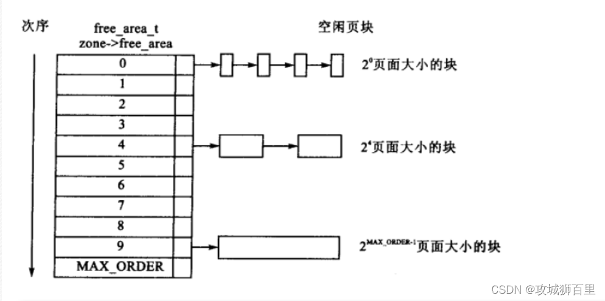

# 【Linux 内核源码分析】内存管理——伙伴分配器

在Linux操作系统中，内存分配通常由内核中的[内存管理](https://so.csdn.net/so/search?q=%E5%86%85%E5%AD%98%E7%AE%A1%E7%90%86&spm=1001.2101.3001.7020)模块完成。以下是三个主要的内存分配器：

-   **伙伴系统 (Buddy System)**：这是内核中最基本的分配器，用于分配物理内存。伙伴系统将内存块组织成不同大小的伙伴，以便有效地分配和回收内存。它适用于分配较大的内存块。
    
-   **slab分配器**：slab分配器是一个对象缓存，用于高效地分配和回收小块内存。它将内存组织成缓存，每个缓存包含相同大小的对象。slab分配器特别适合为内核对象分配内存，如进程描述符、文件描述符等。
    
-   **vmalloc/vmemmap**：vmalloc是一个用于虚拟内存分配的分配器。它主要用于分配大块内存，并且不要求物理连续性，而是提供虚拟连续的内存区域。vmalloc用于那些不需要直接物理访问的内存分配，例如为堆栈和堆分配内存。
    

### 伙伴分配器

伙伴分配器是Linux内核中用于物理内存分配的一个重要机制。它的设计目标是为了有效地分配和回收内存块，同时尽量减少内存碎片。伙伴分配器将内存块组织成一系列的伙伴对，每个伙伴对由两个大小相同的内存块组成。

以下是伙伴分配器的一些关键特点：

-   算法简单高效：伙伴分配器的算法相对简单，易于理解和实现。它使用了一个简单的规则来分配和回收内存块，即如果一个内存块没有伙伴（即没有相邻的同尺寸内存块），那么它可以分配给用户；否则，它将与它的伙伴合并，形成一个更大的内存块。
    
-   支持内存节点和区域：伙伴分配器支持内存节点（Node）和内存区域（Zone）的概念。内存节点是物理内存的逻辑分区，而内存区域是内存节点的子集，它们有不同的属性，如可用性和容量。
    
-   预防内存碎片：伙伴分配器通过合并相邻的空闲内存块来减少内存碎片。如果一个内存块没有伙伴，那么它可以分配给用户；否则，它将与它的伙伴合并，形成一个更大的内存块。这样可以避免在分配和回收过程中产生小的、难以利用的内存碎片。
    
-   针对分配单页做了性能优化：伙伴分配器对分配单个物理页的情况进行了优化。它维护了一个空闲物理页的链表，以便快速分配和回收单个物理页。
    
-   减少处理器锁竞争：为了减少处理器在访问内存分配数据结构时的竞争，伙伴分配器在每个处理器上维护了一个本地页分配集合。这样，每个处理器都可以独立地分配和回收内存，从而提高了多处理器系统的性能。
    

#### 1.伙伴分配器原理

伙伴分配器是一种用于物理内存分配的算法，当需要分配内存时，总是尝试分配整个页块（page block），如果一个页块是空闲的，就分配它；如果需要的内存大于一个页块，就查找是否有两个空闲的页块可以合并；如果需要的内存小于一个页块，就尝试将一个较大的空闲页块分成两半，其中一半用于分配，另一半保持空闲，并与原页块成为伙伴关系。

以下是伙伴分配器的一些工作原理：

1.  **页块和阶**：伙伴分配器将连续的物理页组织成页块，每个页块包含2^n 个连续的页（n是阶数）。例如，一个4阶的页块包含2^4 = 16个连续的页。
    
2.  **阶数**：伙伴分配器使用阶（order）来描述页块的大小。阶数n从0开始，其中0阶对应1个物理页，每增加1阶，页块的大小翻一倍。最高阶数通常是系统物理内存的页块大小。
    
3.  **内存分配**：当需要分配内存时，系统会请求一定数量的页。伙伴分配器会尝试从当前空闲的页块中分配，如果找不到合适的空闲页块，它会检查是否有两个空闲的页块可以合并以满足请求。
    
4.  **伙伴关系**：两个页块被称为伙伴，当且仅当它们满足以下条件：
    
    -   它们是相邻的，即物理地址是连续的。
    -   它们的第一页的物理页号必须是2^n 的整数倍（n是阶数）。
    -   如果将它们合并成一个更大的页块，那么合并后的页块的第一页的物理页号必须是2^(n+1) 的整数倍。
5.  **合并空闲页块**：当一个页块被释放时，伙伴分配器会检查该页块的伙伴是否也是空闲的。如果是，那么这两个页块将会被合并，形成一个更大的空闲页块。
    
6.  **对半切分**：如果需要分配的内存小于一个页块，伙伴分配器会尝试将一个较大的空闲页块对半切分，产生两个大小相等的新页块。其中一个用于分配，另一个保持空闲，并与原页块成为伙伴关系。
    

通过这种方式，伙伴分配器可以有效地减少内存碎片，并确保内存分配的高效性。它特别适合在处理大块内存分配时使用，因为在大多数情况下，可以直接分配整个页块，而不需要进行复杂的搜索和合并操作。

#### 2.伙伴分配器的优缺点

它在物理内存分配中具有以下优点和缺点：

**优点：**

1.  **减少内存碎片**：伙伴分配器通过合并相邻的空闲内存块来减少内存碎片。这有助于提高内存的使用效率，尤其是在分配和回收大量内存块时。
    
2.  **高效的内存分配**：伙伴分配器使用了一种基于2^n的分配策略，其中n是内存块的大小。这种策略允许快速找到合适大小的内存块进行分配，从而提高了内存分配的效率。
    
3.  **适应不同大小的内存请求**：伙伴分配器能够处理从小到整个页块大小的内存请求。它通过将页块分割成更小的部分来满足小内存请求，同时保持了大内存请求的分配效率。
    
4.  **易于实现和理解**：伙伴分配器的算法相对简单，易于实现和理解。这使得内核开发者能够更容易地维护和优化伙伴分配器的代码。
    

**缺点：**

1.  **内存浪费**：伙伴分配器在分配内存时，总是以2n个连续页的形式进行。这意味着如果应用程序请求的内存大小不是2n的倍数，那么可能会浪费一部分内存。这种浪费在内存紧张的情况下可能会成为一个问题。
    
2.  **对释放内存的要求**：伙伴分配器要求在释放内存时，必须提供正确的阶数信息。如果应用程序没有正确地记录内存分配的阶数，可能会导致内存泄漏或系统崩溃。
    
3.  **不适用于小内存分配**：由于伙伴分配器最小分配单位是页块，对于小内存分配（例如一个或几个页），它可能会导致内存浪费，因为总是会分配一个完整的页块。
    
4.  **性能与内存大小的关系**：伙伴分配器的性能与内存的大小有关。在内存较小的系统中，伙伴分配器可能需要更频繁地合并内存块，从而影响性能。
    

为了解决伙伴分配器的一些缺点，特别是内存浪费和性能问题，Linux内核引入了slab分配器。slab分配器专门用于分配小块内存，它使用了一种缓存机制，可以更有效地利用内存空间。然而，伙伴分配器仍然在Linux内核中用于大块内存的分配，因为它在大块内存分配上的效率和减少内存碎片的能力是其他分配器难以比拟的。

#### 3.伙伴分配器的分配释放流程

伙伴分配器的分配和释放流程如下所述：

**分配流程：**

1.  **检查本地空闲列表**：当进程请求分配物理页时，伙伴分配器首先检查本地空闲列表中是否有空闲的页块可以满足请求。
    
2.  **查找合适的页块**：如果本地空闲列表中没有合适的页块，伙伴分配器会尝试从更高阶的页块中分配。它会从最高阶（通常是内存的页块大小）开始向下检查，直到找到一个可以满足请求的页块。
    
3.  **合并页块**：如果需要分配的页块大小大于当前空闲列表中的最大页块，伙伴分配器会尝试将相邻的空闲页块合并。这个过程会一直持续到找到一个足够大的空闲页块或者达到最低阶（通常是1阶）。
    
4.  **分配页块**：一旦找到合适的页块，伙伴分配器会将其分配给进程。如果该页块是通过分裂得到的，分配器会更新相应的空闲链表。
    

**释放流程：**

1.  **检查伙伴关系**：当进程释放一个页块时，伙伴分配器会检查该页块的伙伴是否也是空闲的。
    
2.  **合并页块**：如果伙伴是空闲的，伙伴分配器会将这两个页块合并成一个更大的页块，并更新空闲链表。
    
3.  **向上合并**：如果合并后的页块与相邻的空闲页块形成更大的空闲页块，伙伴分配器会继续尝试向上合并，直到找到一个合适的伙伴或者达到最高阶。
    
4.  **更新空闲列表**：伙伴分配器会更新空闲链表，以反映新的空闲页块信息。
    

在实际操作中，伙伴分配器会维护一个或多个空闲链表，这些链表按照页块的大小进行组织。分配和释放操作都需要在相应的链表中进行查找和更新。

#### 4.伙伴分配器的数据结构

伙伴分配器主要使用以下数据结构：

1.  **分区（Zone）**：分区是内存管理的基本单位，它代表物理内存的一个连续区域。分区可以分为不同的类型，如DMA分区、Normal分区和HighMem分区。伙伴分配器通常在一个分区中操作。
    
2.  **空闲链表（Free Lists）**：为了提高内存分配的效率，伙伴分配器维护了多个空闲链表，每个链表对应一个特定的页块大小。这些链表通常称为“空闲链表”，它们按照页块的大小进行组织。
    
3.  **页框（Page Frame）**：页框是物理内存的单位，它的大小通常等于页的大小。伙伴分配器使用页框来分配和回收内存。
    
4.  **页框数组（Page Frame Array）**：为了快速访问页框信息，伙伴分配器使用一个数组来存储每个页框的状态和属性。这个数组称为“页框数组”或“页表”。
    
5.  **伙伴数组（Buddy Array）**：伙伴分配器还维护了一个伙伴数组，用于快速找到给定页框的伙伴。这个数组通常与页框数组一起使用。
    
6.  **空闲链表指针**：每个分区都有指向其空闲链表的指针，这些链表用于跟踪不同阶数（order）的空闲页块。
    
7.  **伙伴关系信息**：为了支持伙伴关系，伙伴分配器需要维护每个页框的伙伴信息。这通常包括伙伴的物理地址和阶数。
    



伙伴分配器相关的代码主要分布在以下几个文件中：

1. **include/linux/mm.h**：

   ```
   struct pglist_data {
       struct free_area free_area[MAX_ORDER];
       struct zone zones[MAX_ZONE_ORDER];
       struct zone *zone_array;
       /* ... other members ... */
   };
   
   struct zone {
       struct free_area free_area[MAX_ORDER];
       struct list_head free_list[MAX_ORDER];
       struct list_head active_list[MAX_ORDER];
       /* ... other members ... */
   };
   
   struct free_area {
       struct list_head list;
       unsigned long count;
   };
   
   ```

   

2. **mm/memory.c**：

   ```
   void __init init_bootmem_data(void)
   {
       pgdat = kmem_cache_alloc(pgdat_cache, GFP_KERNEL);
       /* ... initialization code ... */
   }
   
   void __init init_bootmem(void)
   {
       pgdat = kmem_cache_alloc(pgdat_cache, GFP_KERNEL);
       /* ... initialization code ... */
   }
   
   ```

   

3. **mm/page\_alloc.c**：

   ```
   void __init init_page_alloc(void)
   {
       pgdat = kmem_cache_alloc(pgdat_cache, GFP_KERNEL);
       /* ... initialization code ... */
   }
   
   void *alloc_pages(gfp_t gfp_flags, unsigned int order)
   {
       struct page *page;
       /* ... allocation logic ... */
       return page;
   }
   
   void free_pages(struct page *page, unsigned int order)
   {
       /* ... freeing logic ... */
   }
   
   ```

   

4.  **mm/page\_alloc.h**：

    ```
    struct page {
        struct list_head lru;
        unsigned long flags;
        /* ... other members ... */
    };
    
    ```

`struct pglist_data` 包含了所有分区的信息，包括空闲区域的信息。`struct zone` 定义了每个分区中的空闲链表和活动链表。`struct free_area` 定义了每个链表的节点结构。`init_bootmem_data()` 和 `init_bootmem()` 函数负责伙伴分配器的初始化。`alloc_pages()` 和 `free_pages()` 函数用于分配和释放物理页。`struct page` 定义了页框的数据结构。

`GFP_ZONE_TABLE` 定义了区域类型映射表的标志组合，这些标志组合用于指示内存分配应该在哪个区域类型中进行。区域类型可以是DMA、Normal或HighMem等。`GFP_ZONES_SHIFT` 是一个常数，它表示区域类型在标志组合中占用的位数。

内核使用`GFP_ZONE_TABLE` 来将每种标志组合映射到32位整数的某个位置。这个映射表的偏移是由标志组合乘以`GFP_ZONES_SHIFT` 得到的。从该偏移开始，接下来的`GFP_ZONES_SHIFT` 个二进制位用于存储区域类型信息。

    // 定义了一个宏 GFP_ZONE_TABLE，表示将不同的内存区域标志按位合并成一个整数值
    #define GFP_ZONE_TABLE ( \
     (ZONE_NORMAL << 0 * GFP_ZONES_SHIFT) \
     | (OPT_ZONE_DMA << ___GFP_DMA * GFP_ZONES_SHIFT) \
     | (OPT_ZONE_HIGHMEM << ___GFP_HIGHMEM * GFP_ZONES_SHIFT) \
     | (OPT_ZONE_DMA32 << ___GFP_DMA32 * GFP_ZONES_SHIFT) \
     | (ZONE_NORMAL << ___GFP_MOVABLE * GFP_ZONES_SHIFT) \
     | (OPT_ZONE_DMA << (___GFP_MOVABLE | ___GFP_DMA) * GFP_ZONES_SHIFT) \
     | (ZONE_MOVABLE << (___GFP_MOVABLE | ___GFP_HIGHMEM) * GFP_ZONES_SHIFT)\
     | (OPT_ZONE_DMA32 << (___GFP_MOVABLE | ___GFP_DMA32) * GFP_ZONES_SHIFT)\
    )
    
    // 定义了一些辅助宏，表示不同的内存区域标志
    #define ___GFP_DMA  0x01u         // 表示DMA区域
    #define ___GFP_HIGHMEM  0x02u     // 表示高内存区域
    #define ___GFP_DMA32  0x04u       // 表示DMA32区域
    #define ___GFP_MOVABLE  0x08u     // 表示可移动区域


​    

#### 5.备用区域列表

备用区域（Alternative Zones）是一个优化机制，用于提高内存分配的效率。当内核尝试在首选的内存节点或区域中分配内存时，如果请求无法满足，备用区域机制允许从其他内存节点或区域的相同类型中借用物理页来满足分配请求。

备用区域的借用规则如下：

1.  **同节点借用**：一个内存节点的某个区域类型可以从中借用物理页，例如，节点0的普通区域可以从节点1的普通区域借用物理页。
    
2.  **高区域类型借用低区域类型**：高区域类型的（如Normal）可以从低区域类型（如DMA）借用物理页。
    
3.  **低区域类型不可借用高区域类型**：相反，低区域类型（如DMA）不能从高区域类型借用物理页。
    

这些规则的目的是确保内存分配的效率和一致性，同时避免由于借用导致的性能问题。

在内存节点的结构体`pg_data_t`中，有一个名为`node_zonelists`的成员，它定义了备用区域列表。这个列表用于跟踪哪些区域可以作为备用的来源，以及哪些区域可以从其他区域借用物理页。

备用区域机制的使用可以减少内存分配过程中的搜索时间，特别是在内存压力较大或者内存节点分布不均匀的情况下。然而，使用备用区域也需要遵守一定的规则和限制，以确保内存管理的正确性和稳定性。

#### 6.伙伴分配器的结构

内核源码如下：

    // 定义了一个名为pglist_data的数据结构，表示内存页列表数据。
    typedef struct pglist_data {
     struct zone node_zones[MAX_NR_ZONES]; // 内存区域数组，用于存储每个节点包含的不同类型的内存区域信息
     struct zonelist node_zonelists[MAX_ZONELISTS]; // 备用区域数组，用于支持备用区域列表
    
     int nr_zones; // 该节点包含的内存区域数量
     // ... 其他成员变量和方法 ...
    } pg_data_t;
    
    // 定义了一个名为zonelist的数据结构，表示备用区域列表。
    struct zonelist {
     struct zoneref _zonerefs[MAX_ZONES_PER_ZONELIST + 1]; // 包含多个zone引用的数组
    };
    
    // 定义了一个名为zoneref的数据结构，表示zone引用。
    struct zoneref {
     struct zone *zone; // 指向具体内存区域（zone）的指针
     int zone_idx; // 成员zone指向内存区域（zone）所属类型的索引
    };
    
    // 定义了一个枚举类型，表示备用区域列表类型。
    enum {
     ZONELIST_FALLBACK,    // 包含所有内存节点的备用区域列表（通常情况下）
    #ifdef CONFIG_NUMA
     /*
      * The NUMA zonelists are doubled because we need zonelists that
      * restrict the allocations to a single node for __GFP_THISNODE.
      */
     ZONELIST_NOFALLBACK,  // 只包含当前节点的备用区域列表（NUMA架构专用）
    #endif
     MAX_ZONELISTS         // 备用区域列表数量的上限
    };


​    

UMA系统（Uniform Memory Access）和NUMA系统（Non-Uniform Memory Access）是两种不同的内存架构设计。UMA系统中，所有处理器都可以直接访问相同的物理内存，而NUMA系统中，内存被分割为多个节点，每个节点有自己的本地内存，并且不同节点之间的访问延迟可能不同。

1.  UMA系统中只有一个备用区域列表：在UMA系统中，备用区域列表按照区域类型从高到低顺序排列。假设UMA系统包含普通区域和DMA区域，则备用区域列表为：(普通区域、DMA区域)。
    
2.  NUMA系统中每个内存节点有两个备用区域列表：在NUMA系统中，每个内存节点有两个备用区域列表。其中一个是包含所有节点的备用区域列表(ZONELIST\_FALLBACK)，另一个仅包含当前节点的备用区域列表(ZONELIST\_NOFALLBACK)。
    
3.  ZONELIST\_FALLBACK排序方法：ZONELIST\_FALLBACK列表具有两种排序方法可选：  
    a. 节点优先顺序：首先按照节点距离从小到大进行排序，在每个节点里根据区域类型从高到低排序。这样选择时会优先选择距离近的内存，但是会在高区域耗尽之前使用低区域。  
    b. 区域优先顺序：首先按照区域类型从高到低进行排序，在每个区域类型里根据节点距离从小到大排序。这样选择时会减少低区域耗尽的概率，但不能保证优先选择距离近的内存。
    
4.  默认排序方法：默认情况下，系统会自动选择最优的排序方法。例如，在64位系统中，由于需要DMA和DMA32区域的备用相对较少，所以选择节点优先顺序；而在32位系统中，则选择区域优先顺序。
    

#### 7.内存区域水线

在Linux内核内存管理中，内存区域水线（watermarks）是一种用于管理内存区域中可用物理页数量的机制。水线可以帮助内核判断何时需要从备用区域借用物理页，以及何时需要回收内存以保持内存区域的可用性。

每个内存区域都有三个水线：高水线（high）、低水线（low）和最低水线（min）。这些水线是通过对内存区域的物理页情况进行分析后计算出来的。计算通常在内存区域初始化时进行，这些水线值会被存储在`struct zone`结构的`watermark`数组中。

以下是每个水线的简要说明：

1.  **高水线**：如果内存区域的空闲页数大于高水线，说明该内存区域有足够多的空闲内存，可以被认为是“充足”的。在这种情况下，内核可以认为该区域有足够的资源来满足分配请求，而不需要从备用区域借用物理页。
    
2.  **低水线**：如果内存区域的空闲页数小于低水线，说明内存区域的内存开始变得紧张，可以被认为是“轻微不足”。在这种情况下，内核可能会开始考虑从备用区域借用物理页来满足分配请求。
    
3.  **最低水线**：如果内存区域的空闲页数小于最低水线，说明内存区域的内存严重不足，可以被认为是“严重不足”。在这种情况下，内核会采取更积极的措施，如回收内存或从备用区域大量借用物理页，以防止内存耗尽。
    

内核通过比较当前内存区域的空闲页数与这些水线值来决定是否需要借用物理页。例如，如果当前内存区域的空闲页数低于低水线，内核可能会尝试从备用区域借用物理页来满足分配请求，同时调整内存区域的水线值以反映新的内存状态。

    #define min_wmark_pages(z) (z->watermark[WMARK_MIN])
    // 获取给定内存区域z的最小水位线页数
    
    #define low_wmark_pages(z) (z->watermark[WMARK_LOW])
    // 获取给定内存区域z的低水位线页数
    
    #define high_wmark_pages(z) (z->watermark[WMARK_HIGH])
    // 获取给定内存区域z的高水位线页数


    struct zone {
        /* 只读字段 */
        /* 使用 _wmark_pages(zone) 宏访问的区域水位线 */
        unsigned long watermark[NR_WMARK];  // 页分配器使用的水位线数组


定义了一个名为`struct zone`的结构体。它包含一个只读的数组字段`watermark`，用于存储页分配器使用的水位线。水位线表示内存分配器在不同情况下应该如何管理内存。它是通过索引访问的，具体来说，可以使用 `_wmark_pages(zone)` 宏来访问该数组。

该数组的大小由常量 `NR_WMARK` 决定，因此我们可以看出 `watermark` 是一个固定长度的数组。

        enum zone_watermarks {
            WMARK_MIN,   // 最小水位线
            WMARK_LOW,   // 低水位线
            WMARK_HIGH,  // 高水位线
            NR_WMARK     // 水位线数量
        };


定义了一个枚举类型`enum zone_watermarks`，它包含四个枚举常量：`WMARK_MIN`、`WMARK_LOW`、`WMARK_HIGH`和 `NR_WMARK`。

        unsigned long managed_pages;          // 伙伴分配器管理的物理页数量
        unsigned long spanned_pages;          // 当前区域跨越的总页数，包括空洞
        unsigned long present_pages;          // 当前区域存在的物理页数量，不包括空洞


        spanned_pages = zone_end_pfn - zone_start_pfn;                              // 区域结束的物理页减去起始页=当前区域跨越的总页数（包括空洞）
        present_pages = spanned_pages - absent_pages(pages in holes);               // 当前区域跨越的总页数-空洞页数=当前区域可用物理页数
        managed_pages = present_pages - reserved_pages;                             // 当前区域可用物理页数-预留的页数=伙伴分配器管理物理页数


正常情况下，紧急保留内存不会被其他进程使用，除非在内存严重不足的紧急情况下。在这种情况下，一些进程可能会请求使用紧急保留内存，它们承诺如果获得这部分内存，就能够释放更多的内存。这种策略有助于在内存耗尽时找到内存碎片并重新分配它们，以避免系统崩溃。

为了监控和管理内存区域的水位线，内核提供了`/proc/zoneinfo`文件。通过这个文件，系统管理员或开发者可以查看各个内存区域的水位线信息和物理页的使用情况。这有助于监控内存管理系统的性能，并在出现内存不足的情况时进行诊断和调整。

`/proc/zoneinfo`文件的内容是动态变化的，反映了系统当前的内存状态。

#### 8.伙伴分配器分配过程分析

伙伴分配器的工作原理是基于分页大小（通常是2的幂）的，它将内存中的空闲页组织成一组链表，每个链表对应一个分页大小。当应用程序请求内存时，伙伴分配器会尝试从与请求大小最匹配的链表中分配内存。

以下是伙伴分配器分配过程的一个简化分析：

1. 当内核接收到请求分配内存的请求时，它会调用`alloc_pages`函数。

2. `alloc_pages`函数会调用`alloc_pages_current`函数，后者会尝试在当前进程的页表中分配内存。

3. 如果当前进程的页表中没有足够的空闲页，`alloc_pages_current`会调用`__alloc_pages_nodemask`函数，这是伙伴分配器的核心函数。

4. `__alloc_pages_nodemask`函数会根据请求的内存大小（通常是2的幂），尝试从对应的空闲页块链表中分配内存。例如，如果请求的是128个页，它会首先检查128个页的链表是否有空闲页块。

5. 如果128个页的链表没有空闲页块，伙伴分配器会尝试从256个页的链表中分配内存。如果有空闲块，它将256个页的页块分成两份，一份用于满足请求，另一份作为128个页的页块插入到128个页的链表中。

6.  如果256个页的链表也没有空闲页块，伙伴分配器会继续检查512个页的链表，并重复上述过程，直到找到合适的页块或者所有的链表都被检查完。

    ```
    /* The ALLOC_WMARK bits are used as an index to zone->watermark */
    #define ALLOC_WMARK_MIN  WMARK_MIN //使用最低水线
    #define ALLOC_WMARK_LOW  WMARK_LOW //使用低水线
    #define ALLOC_WMARK_HIGH WMARK_HIGH //使用高水线
    #define ALLOC_NO_WATERMARKS 0x04   //完全不检查水线
    #define ALLOC_WMARK_MASK (ALLOC_NO_WATERMARKS-1)//得到水位线的掩码
    #ifdef CONFIG_MMU
    #define ALLOC_OOM  0x08 //允许内存耗尽
    #else
    #define ALLOC_OOM  ALLOC_NO_WATERMARKS//允许内存耗尽
    #endif
    #define ALLOC_HARDER  0x10 //试图更努力分配
    #define ALLOC_HIGH   0x20 //调用者是高优先级
    #define ALLOC_CPUSET  0x40 //检查 cpuset 是否允许进程从某个内存节点分配页
    #define ALLOC_CMA   0x80 //允许从CMA（连续内存分配器）迁移类型分配
    ```
    
    

上面的代码片段定义了`alloc_pages`函数的第一个参数中的分配标志位。这些标志位用于表示内存分配的允许情况，不同的标志位对应着不同的情况和行为。而`alloc_pages`函数的第二个参数则表示分配的页面的阶数，即需要分配的页面的数量级。

    static inline struct page *
    alloc_pages(gfp_t gfp_mask, unsigned int order)
    {
      return alloc_pages_current(gfp_mask, order);
    }
    
    struct page *alloc_pages_current(gfp_t gfp, unsigned order)
    {
      struct mempolicy *pol = &default_policy; //默认memory policy
      struct page *page;
    
      if (!in_interrupt() && !(gfp & __GFP_THISNODE))
        pol = get_task_policy(current); //获取当前进程的内存策略
    
      if (pol->mode == MPOL_INTERLEAVE) //如果内存策略选择了交错模式
        page = alloc_page_interleave(gfp, order, interleave_nodes(pol)); //调用交错分配函数
      else
        page = __alloc_pages_nodemask(gfp, order,
          policy_node(gfp, pol, numa_node_id()),
          policy_nodemask(gfp, pol)); //调用节点掩码分配函数
    
      return page;
    }


`alloc_pages`函数是内存分配函数，用于分配一定数量的页面，其第一个参数`gfp_mask`表示内存分配时的标志位，第二个参数`order`表示需要分配的页面的阶数。函数内部首先调用了`alloc_pages_current`函数来实现真正的内存分配操作。

`alloc_pages_current`函数会根据当前进程的内存分配策略进行内存分配。如果内存策略选择了交错模式，则会调用`alloc_page_interleave`函数来实现交错分配；否则，则会调用`__alloc_pages_nodemask`函数来实现节点掩码分配。最终返回分配到的`page`对象。

    struct page *
    __alloc_pages_nodemask(gfp_t gfp_mask, unsigned int order, int preferred_nid,
           nodemask_t *nodemask)
    {
      ...
      /* First allocation attempt */ //快速路径分配函数
      page = get_page_from_freelist(alloc_mask, order, alloc_flags, &ac);
      if (likely(page))
        goto out;
      ...
      //快速路径分配失败，会调用下面的慢速分配函数
      page = __alloc_pages_slowpath(alloc_mask, order, &ac);
    
    out:
      if (memcg_kmem_enabled() && (gfp_mask & __GFP_ACCOUNT) && page &&
          unlikely(memcg_kmem_charge(page, gfp_mask, order) != 0)) {
        __free_pages(page, order);
        page = NULL;
      }
    
      trace_mm_page_alloc(page, order, alloc_mask, ac.migratetype);
    
      return page;
    }


`__alloc_pages_nodemask`函数负责节点掩码分配，它会首先尝试使用快速路径分配函数`get_page_from_freelist`进行内存分配，如果快速分配失败，则会调用慢速分配函数`__alloc_pages_slowpath`进行内存分配。最后进行内存计费和分配跟踪，并返回分配到的`page`对象。

`get_page_from_freelist`是伙伴分配器中的一个核心函数，用于从空闲页面链表（free list）中获取可用的页面来进行内存分配。在伙伴系统中，内存会被按照2的次方进行分割成不同大小的块，形成多个伙伴系统。当需要分配一定数量的页面时，伙伴分配器会根据请求的页面数找到对应的伙伴系统，然后从该系统的空闲页面链表中找到合适大小的空闲页面进行分配。

快速分配函数`get_page_from_freelist`通常会首先尝试从当前CPU的本地缓存中获取可用的空闲页面，如果本地缓存中没有符合条件的页面，则会向全局的空闲页面链表（free list）查找可用页面。这种方式能够提高内存分配的效率，避免频繁的访问全局的空闲页面链表，减少锁竞争和性能开销。

在伙伴系统中，分配到的页面可能需要经过合并或拆分等操作，以满足请求的页面大小。`get_page_from_freelist`函数会负责处理这些细节，并最终返回一个符合要求的空闲页面给调用者，用于进程的内存分配操作。

    static struct page *
    get_page_from_freelist(gfp_t gfp_mask, unsigned int order, int alloc_flags,
          const struct alloc_context *ac)
    {
     struct zoneref *z = ac->preferred_zoneref;
     struct zone *zone;
     struct pglist_data *last_pgdat_dirty_limit = NULL;
    
     // 扫描备用区域列表中每一个满足条件的区域：区域类型小于等于首选区域类型
     for_next_zone_zonelist_nodemask(zone, z, ac->zonelist, ac->high_zoneidx,
            ac->nodemask) {
      struct page *page;
      unsigned long mark;
    
      if (cpusets_enabled() &&   // 如果编译了cpuset功能  
       (alloc_flags & ALLOC_CPUSET) && // 如果设置了ALLOC_CPUSET
       !__cpuset_zone_allowed(zone, gfp_mask)) // 如果cpu设置了不允许从当前区域分配内存
        continue;       // 那么不允许从这个区域分配，进入下个循环
      
      if (ac->spread_dirty_pages) {// 如果设置了写标志位，表示要分配写缓存
       // 那么要检查内存脏页数量是否超出限制，超过限制就不能从这个区域分配
       if (last_pgdat_dirty_limit == zone->zone_pgdat)
        continue;
    
       if (!node_dirty_ok(zone->zone_pgdat)) {
        last_pgdat_dirty_limit = zone->zone_pgdat;
        continue;
       }
      }
    
      mark = zone->watermark[alloc_flags & ALLOC_WMARK_MASK];// 检查允许分配水线
      // 判断（区域空闲页-申请页数）是否小于水线
      if (!zone_watermark_fast(zone, order, mark,
               ac_classzone_idx(ac), alloc_flags)) {
       int ret;
    
       /* Checked here to keep the fast path fast */
       BUILD_BUG_ON(ALLOC_NO_WATERMARKS < NR_WMARK);
       // 如果没有水线要求，直接选择该区域
       if (alloc_flags & ALLOC_NO_WATERMARKS)
        goto try_this_zone;
    
       // 如果没有开启节点回收功能或者当前节点和首选节点距离大于回收距离
       if (node_reclaim_mode == 0 ||
           !zone_allows_reclaim(ac->preferred_zoneref->zone, zone))
        continue;
    
       // 从节点回收“没有映射到进程虚拟地址空间的内存页”，然后检查水线
       ret = node_reclaim(zone->zone_pgdat, gfp_mask, order);
       switch (ret) {
       case NODE_RECLAIM_NOSCAN:
        /* did not scan */
        continue;
       case NODE_RECLAIM_FULL:
        /* scanned but unreclaimable */
        continue;
       default:
        /* did we reclaim enough */
        if (zone_watermark_ok(zone, order, mark,
          ac_classzone_idx(ac), alloc_flags))
         goto try_this_zone;
    
        continue;
       }
      }
    
    try_this_zone:// 满足上面的条件了，开始分配
      // 从当前区域分配页
      page = rmqueue(ac->preferred_zoneref->zone, zone, order,
        gfp_mask, alloc_flags, ac->migratetype);
      if (page) {
       // 分配成功，初始化页
       prep_new_page(page, order, gfp_mask, alloc_flags);
    
       /*
        * If this is a high-order atomic allocation then check
        * if the pageblock should be reserved for the future
        */
       // 如果这是一个高阶的内存并且是ALLOC_HARDER，需要检查以后是否需要保留
       if (unlikely(order && (alloc_flags & ALLOC_HARDER)))
        reserve_highatomic_pageblock(page, zone, order);
    
       return page;
      } else {
    #ifdef CONFIG_DEFERRED_STRUCT_PAGE_INIT
       /* Try again if zone has deferred pages */
       // 如果分配失败，延迟分配
       if (static_branch_unlikely(&deferred_pages)) {
        if (_deferred_grow_zone(zone, order))
         goto try_this_zone;
       }
    #endif
      }
     }
    
     return NULL;
    }


​    

每个区域（zone）都包含了伙伴系统维护的各种大小的队列，用来管理空闲页面。当需要分配页面时，会通过调用 `rmqueue` 函数来从合适大小的队列中获取页面。具体来说，在上面提到的代码中，`rmqueue` 函数实际上是一个宏，会展开为`__rmqueue` 函数的调用。

`__rmqueue` 函数的作用是从指定的区域中的伙伴系统中找到合适大小的空闲页块，并将其取出来。如果在当前区域找不到足够大小的空闲页块，会继续调用`__rmqueue_smallest` 函数尝试在其他区域中查找更小的空闲页块。

因此，整个调用链可以清楚地展示了伙伴系统在内存分配过程中的逻辑：首先在当前区域中查找合适大小的空闲页块，如果找不到则尝试在其他区域中查找更小的空闲页块，以此确保能够高效地满足内存分配请求。这种基于伙伴系统的内存管理方式能够提高内存分配和释放的效率，减少内存碎片化问题。

    static inline
    struct page *__rmqueue_smallest(struct zone *zone, unsigned int order,
                int migratetype)
    {
      unsigned int current_order;
      struct free_area *area;
      struct page *page;
    
      // 在首选列表中找到适当大小的页面
      for (current_order = order; current_order < MAX_ORDER; ++current_order) {
        area = &(zone->free_area[current_order]);
        page = list_first_entry_or_null(&area->free_list[migratetype],
                  struct page, lru);
        if (!page)
          continue;
        
        // 删除该页面并更新相关信息
        list_del(&page->lru);
        rmv_page_order(page);
        area->nr_free--;
        
        // 扩展页面并设置迁移类型
        expand(zone, page, order, current_order, area, migratetype);
        set_pcppage_migratetype(page, migratetype);
        
        return page;
      }
    
      // 如果没有找到合适的页面，则返回空指针
      return NULL;
    }


​    

在伙伴系统中如何进行内存分配的过程：

1. 从当前的 order（指数）开始，在伙伴系统的 free\_area 中查找大小为2^order的页块。

2. 如果链表的第一个不为空，即找到了符合条件的页块；如果为空，则需要到更大的 order 的页块链表中继续寻找。

3. 找到符合条件的页块后，除了将该页块从链表中取下来，还需要将多余部分放回到其他页块链表中。这个过程就是通过 expand 函数来完成的。

4.  在这个过程中，area 是指伙伴系统中的表中的前一项，前一项里的页块大小是当前项的页块大小除以2。size 右移一位也就是除以2，表示将当前页块大小减半。list\_add 是将多余的页块加入到相应的链表中。nr\_free++ 则是对空闲页块数量进行计数增加的操作。

    ```
    static inline struct page *
    __alloc_pages_slowpath(gfp_t gfp_mask, unsigned int order,
          struct alloc_context *ac)
    {
     bool can_direct_reclaim = gfp_mask & __GFP_DIRECT_RECLAIM;
     const bool costly_order = order > PAGE_ALLOC_COSTLY_ORDER;
     struct page *page = NULL;
     unsigned int alloc_flags;
     unsigned long did_some_progress;
     enum compact_priority compact_priority;
     enum compact_result compact_result;
     int compaction_retries;
     int no_progress_loops;
     unsigned int cpuset_mems_cookie;
     int reserve_flags;
    
     /*
      * 我们还要进行合理性检查，以捕获不在原子上下文中使用的原子保留的滥用情况。
      */
     if (WARN_ON_ONCE((gfp_mask & (__GFP_ATOMIC|__GFP_DIRECT_RECLAIM)) ==
        (__GFP_ATOMIC|__GFP_DIRECT_RECLAIM)))
      gfp_mask &= ~__GFP_ATOMIC;
    
    retry_cpuset:
     compaction_retries = 0;
     no_progress_loops = 0;
     compact_priority = DEF_COMPACT_PRIORITY;
     // 后面可能会检查cpuset是否允许当前进程从哪些内存节点申请页
     cpuset_mems_cookie = read_mems_allowed_begin();
    
     /*
      * 快速路径使用保守的alloc_flags，在唤醒kswapd之前成功，避免精确设置alloc_flags的成本。因此现在就这么做。
      */
     // 把分配标志位转化为内部的分配标志位
     alloc_flags = gfp_to_alloc_flags(gfp_mask);
    
     /*
      * 我们需要重新计算zonelist迭代器的起始点，因为在快速路径中可能已经使用了不同的nodemask，或者进行了cpuset修改并且正在重试 - 否则我们可能会无限地遍历非合格的区域。
      */
     // 获取首选的内存区域，因为在快速路径中使用了不同的节点掩码，避免再次遍历不合格的区域。
     ac->preferred_zoneref = first_zones_zonelist(ac->zonelist,
         ac->high_zoneidx, ac->nodemask);
     if (!ac->preferred_zoneref->zone)
      goto nopage;
     
     // 异步回收页，唤醒kswapd内核线程进行页面回收
     if (gfp_mask & __GFP_KSWAPD_RECLAIM)
      wake_all_kswapds(order, gfp_mask, ac);
    
     /*
      * 调整后的alloc_flags可能会立即成功，因此首先尝试
      */
     // 调整alloc_flags后可能会立即申请成功，所以先尝试一下
     page = get_page_from_freelist(gfp_mask, order, alloc_flags, ac);
     if (page)
      goto got_pg;
    
     /*
      * 对于昂贵的分配，优先尝试直接压缩，因为很可能我们有足够的基本页面，不需要回收。对于不可移动的高阶分配，也要这样做，因为压缩会尝试通过从相同迁移类型的块中迁移来避免永久碎片化。
      * 不要尝试允许忽略水印的分配，因为尚未发生ALLOC_NO_WATERMARKS的尝试。
      */
     // 申请阶数大于0，不可移动的位于高阶的，忽略水位线的
     if (can_direct_reclaim &&
       (costly_order ||
          (order > 0 && ac->migratetype != MIGRATE_MOVABLE))
       && !gfp_pfmemalloc_allowed(gfp_mask)) {
      // 直接页面回收，然后进行页面分配
      page = __alloc_pages_direct_compact(gfp_mask, order,
          alloc_flags, ac,
          INIT_COMPACT_PRIORITY,
          &compact_result);
      if (page)
       goto got_pg;
    
      /*
       * 对于具有__GFP_NORETRY的昂贵分配进行检查，包括THP页面错误分配
       */
      if (costly_order && (gfp_mask & __GFP_NORETRY)) {
       /*
        * 如果对于高阶分配而言推迟了压缩，
        * 那是因为最近同步压缩失败了。如果
        * 这种情况发生，并且调用者请求了THP
        * 分配，我们不想严重干扰
        * 系统，所以我们失败分配而不是进入
        * 直接回收。
        */
       if (compact_result == COMPACT_DEFERRED)
        goto nopage;
    /*
     * 看起来值得尝试回收/压缩，但同步压缩可能非常昂贵，所以继续使用异步压缩。
     */
    // 同步压缩非常昂贵，所以继续使用异步压缩
    compact_priority = INIT_COMPACT_PRIORITY;
    }
    
    retry:
    /* 确保在循环时 kswapd 不会意外进入睡眠状态 */
    // 如果页回收线程意外睡眠则再次唤醒
    if (gfp_mask & __GFP_KSWAPD_RECLAIM)
    wake_all_kswapds(order, gfp_mask, ac);
    
    // 如果调用者承若给我们紧急内存使用，我们就忽略水线
    reserve_flags = __gfp_pfmemalloc_flags(gfp_mask);
    if (reserve_flags)
    alloc_flags = reserve_flags;
    
    /*
     * 如果可以忽略内存策略，则重置 nodemask 和 zonelist 迭代器。
     * 这些分配是高优先级的，系统导向而非用户导向。
     */
    // 如果可以忽略内存策略，则重置 nodemask 和 zonelist
    if (!(alloc_flags & ALLOC_CPUSET) || reserve_flags) {
    ac->nodemask = NULL;
    ac->preferred_zoneref = first_zones_zonelist(ac->zonelist,
    ac->high_zoneidx, ac->nodemask);
    }
    
    /* 尝试使用可能调整的 zonelist 和 alloc_flags */
    // 尝试使用可能调整的区域备用列表和分配标志
    page = get_page_from_freelist(gfp_mask, order, alloc_flags, ac);
    if (page)
    goto got_pg;
    
    /* 如果调用者不愿意回收，我们无法平衡任何东西 */
    // 如果不可以直接回收，则申请失败
    if (!can_direct_reclaim)
    goto nopage;
    
    /* 避免直接回收的递归 */
    if (current->flags & PF_MEMALLOC)
    goto nopage;
    
    /* 尝试直接回收然后分配 */
    // 直接页面回收，然后进行页面分配
    page = __alloc_pages_direct_reclaim(gfp_mask, order, alloc_flags, ac,
    &did_some_progress);
    if (page)
    goto got_pg;
    
    /* 尝试直接压缩然后分配 */
    // 进行页面压缩，然后进行页面分配
    page = __alloc_pages_direct_compact(gfp_mask, order, alloc_flags, ac,
    compact_priority, &compact_result);
    if (page)
    goto got_pg;
    
    /* 如果明确要求不循环 */
    // 如果调用者要求不要重试，则放弃
    if (gfp_mask & __GFP_NORETRY)
    goto nopage;
    
    /*
     * 除非是 __GFP_RETRY_MAYFAIL，否则不要重试代价高昂的高阶分配
     */
    // 不要重试代价高昂的高阶分配，除非它们是__GFP_RETRY_MAYFAIL
    if (costly_order && !(gfp_mask & __GFP_RETRY_MAYFAIL))
    goto nopage;
    
    // 重新尝试回收页
    if (should_reclaim_retry(gfp_mask, order, ac, alloc_flags,
    did_some_progress > 0, &no_progress_loops))
    goto retry;
    
    /*
     * 如果申请阶数大于 0，判断是否需要重新尝试压缩
     */
    if (did_some_progress > 0 &&
    should_compact_retry(ac, order, alloc_flags,
    compact_result, &compact_priority,
    &compaction_retries))
    goto retry;
    
    /* 在开始 OOM 杀死之前处理可能的 cpuset 更新竞争 */
    // 如果 cpuset 允许修改内存节点申请就修改
    if (check_retry_cpuset(cpuset_mems_cookie, ac))
    goto retry_cpuset;
    
    /* 回收失败，开始杀死进程 */
    // 使用 oom 选择一个进程杀死
    page = __alloc_pages_may_oom(gfp_mask, order, ac, &did_some_progress);
    if (page)
    goto got_pg;
    
    /* 避免因没有水印的分配而无休止地循环 */
    // 如果当前进程是 oom 选择的进程，并且忽略了水线，则放弃申请
    if (tsk_is_oom_victim(current) &&
    (alloc_flags == ALLOC_OOM ||
    (gfp_mask & __GFP_NOMEMALLOC)))
    goto nopage;
    
    /* 只要 OOM 杀手在取得进展，就重试 */
    // 如果 OOM 杀手正在取得进展，则再试一次
    if (did_some_progress) {
    no_progress_loops = 0;
    goto retry;
    }
    
    nopage:
    /* 在失败之前处理可能的 cpuset 更新竞争 */
    if (check_retry_cpuset(cpuset_mems_cookie, ac))
    goto retry_cpuset;
    
    /*
     * 确保 __GFP_NOFAIL 请求不会泄露，并且始终重试
     */
    if (gfp_mask & __GFP_NOFAIL) {
    /*
    * 所有现有 __GFP_NOFAIL 的用户都是可阻塞的，因此对于那些实际需要 GFP_NOWAIT 的新用户发出警告
    */
    if (WARN_ON_ONCE(!can_direct_reclaim))
    goto fail;
    
    /*
    * 在这种情况下的 PF_MEMALLOC 请求相当奇怪，因为我们无法回收任何东西，只能循环等待别人为我们做事
    */
    WARN_ON_ONCE(current->flags & PF_MEMALLOC);
    
    /*
    * 非失败的昂贵阶数是一个硬性要求，我们并不做好准备，让我们警告这些用户，以便我们可以识别它们并将其转换为其他内容
    */
    WARN_ON_ONCE(order > PAGE_ALLOC_COSTLY_ORDER);
    
    /*
    * 通过让它们访问内存备用来帮助非失败分配，但不要使用 ALLOC_NO_WATERMARKS，因为这可能消耗整个内存备用，这只会使情况变得更糟
    */
    // 允许它们访问内存备用列表
    page = __alloc_pages_cpuset_fallback(gfp_mask, order, ALLOC_HARDER, ac);
    if (page)
    goto got_pg;
    
    cond_resched();
    goto retry;
    }
    fail:
    warn_alloc(gfp_mask, ac->nodemask,
    "page allocation failure: order:%u", order);
    got_pg:
    return page;
    }
    
    
    ```
    
    

**参考：[Linux内核源码分析（内存调优/文件系统/进程管理/设备驱动/网络协议栈）教程](https://xxetb.xet.tech/s/3jDmTD)**

[**Linux内核源码系统性学习**](https://sourl.cn/FurrhR)


## 参考

[【Linux 内核源码分析】内存管理——伙伴分配器_linux内存分配器-CSDN博客](https://blog.csdn.net/weixin_52622200/article/details/136256898?ops_request_misc=%7B%22request%5Fid%22%3A%22C0EF8D4B-0B28-482B-B534-2E727E3EEBDA%22%2C%22scm%22%3A%2220140713.130102334..%22%7D&request_id=C0EF8D4B-0B28-482B-B534-2E727E3EEBDA&biz_id=0&utm_medium=distribute.pc_search_result.none-task-blog-2~all~sobaiduend~default-1-136256898-null-null.142^v100^pc_search_result_base5&utm_term=linux内核内存管理源码&spm=1018.2226.3001.4187)