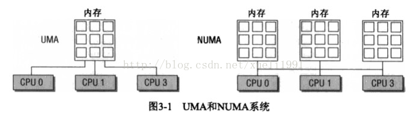

# 深入理解linux内核架构（内存管理）

1：在内核使用高端内存页之前，必须使用下文讨论的kmap和kunmap函数将其映射到内存虚拟地址空间中。

2：UMA计算机（一致内存访问，uniform memory access）将可用内存以连续方式组织起来。

3：NUMA计算机（非一致性内存访问，non-uniform memory access）系统的各个CPU都有本地内存，可支持特别快速的访问，各个处理器之间通过总线连接起来，以支持其他CPU的本地内存的访问。

  

  

4：内核会区分三种配置选项：FLATTMEM,DISCONTIGMEM,SPARSEMEM,DISCONTIGMEM.

  

  

5：内存划分为结 点。每个节点关联到系统中的一个处理器。在内核中表示为pg\_data\_t的实例。

6：各个结点又划分为 内存域，是内存域的进一步细分。

7：

注：zonelist：指向zonelist数据结构的指针，该数据结构按照优先次序描述了适于内存分配的内存管理区。

8：

  

  

1）ZONE\_DMA标记适合DMA的内存域。

2）ZONE\_DMA32标记了使用32位地址字可寻址，适合DMA的内存域。

3）ZONE\_NORMAL标记了可直接映射到内核段的普通内存域，这是在所有体系结构上保证都会存在的唯一内存域，但无法保证该地址范围对应了实际的物理内存。

4）ZONE\_HIGHMEM标记了超出内核段的物理内存。

5）伪内存域ZONE\_MOVABLE.

6）MAX\_NR\_ZONES充当结束标志，在内核想要迭代系统中的所有内存域时，会用到该常量。

7）各个内存域都关联了一个数组，用来组织属于该内存域的物理内存页（页帧）。对每个页帧，都分配一个struct page实例以及所需的管理数据。

8）每个节点都提供了一个备用列表（借助struct zonelist）。该列表包含了其他节点（和相关的内存域），可用于代替当前节点分配内存。

  

3.2.2数据结构

1）结点管理

     pg\_data\_t用于表示节点的基本元素。

  

  

1.  `<mmzone.h>`
    
3.  `typedef struct pglist_data{`
    
4.          `struct zone node_zones[MAX_NR_ZONES];`
    
5.          `struct zonelist node_zonelists[MAX_ZONELISTS];`
    
6.          `int nr_zones;`
    
7.          `struct page*node_mem_map;`
    
8.          `struct bootmem_data *bdata;`

10.          `unsigned long node_start_pfn;`
    
11.          `unsigned long node_present_pages;/*物理内存页的总数*/`
    
12.          `unsighed long node_spanned_pages;/*物理内存页的总数，包含洞在内*/`

14.          `int node_id;`
    
15.          `struct pglist_data *pgdat_next;`
    
16.          `wait_queue_head_t kswapd_wait;`
    
17.          `struct task_struct *ksward;`
    
18.          `int ksward_max_order;`
    
19.  `}pg_data_t;`

注：1）node\_zones是一个数组，包含了节点中各内存域的数据结构。

       2）node\_zonelists指定了备用节点及其内存域的列表，以便在当前节点没有可用空间时，在备用节点分配内存。
    
       3）节点中不同内存域的数目保存在nr\_zones中
    
       4）node\_mem\_map是指向page实例数组的指针，用于描述节点的所有物理内存页，它包含了节点中所有内存域的页。
    
       5）bdata指向自举内存分配器数据结构的实例。
    
       6）node\_start\_pfn是该NUMA节点第一个页帧的逻辑编号。所有页帧是依次编号的，每个页帧的号码都是全局唯一的。
    
             在UMA中总是0.
    
       7）node\_present\_pages指定了节点中页帧的数目，node\_spanned\_pages则给出了该节点以页帧 为单位计算的长度。
    
       8）node\_id是全局节点ID。
    
       9）pgdat\_next连接到下一个内存节点，系统中所有的内存节点都通过单链表连接起来，其末尾通过空指针标记。
    
      10）kswapd\_wait是交换守护进程（swap daemon）的等待队列，将在页帧换出节点时会用到。
    
              kswapd指向负责该节点的交换守护进程的task\_struct.
    
              kswapd\_max\_order用于页交换子系统的实现，用来定义需要释放的区域的长度。
    
      11）节点的内存域保存在node\_zones\[MAX\_NR\_ZONES\].该数组总是有3项。即使节点没有那么多内存域，若不足3个，则其余的数组项用0填充。

   

   

1.  `<nodemask.h>`
    
2.  `enum node_states{`
    
3.       `N_POSSIBLES,                   /*节点在某个时候可能变成联机*/`
    
4.       `N_ONLINE,                      /*节点是联机的*/`
    
5.       `N_NORMAL_MEMORY,               /*几点有普通内存域*/`
    
6.  `#ifdef CONFIG_HIGHMEM`
    
7.       `N_HIGH_MEMORY,                 /*节点有普通或高端内存域*/`
    
8.  `#else`
    
9.       `N_HIGH_MEMORY = N_NORMAL_MEMORY,`
    
10.  `#endif`
    
11.       `N_CPU,                         /*节点有一个或者多个CPU*/`
    
12.       `NR_NODE_STATES`
    
13.  `};`

注：如果节点有普通或高端内存则使用N\_HIGH\_MEMORY,仅当节点没有高端内存才设置N\_NORMAL\_MEMORY.

2）内存域

内核使用zone结构来描述内存域。

   

1.  `<mmzone.h>`
    
2.  `struct zone{`
    
3.     `/*通常由页分配器访问的字段*/`
    
4.      `unsigned long pages_min,pages_low,pages_high;        注：`1）若空闲页的数目多于pages\_high,则内存域的状态是理想的
    
5.                                                               `2）若空闲页的数目低于pages_low,则内核开始将页换出到硬盘`
    
6.                                                               `3）若空闲页的数目低于pages_min，内存域急需空闲页，需页回收` 
    
7.                                                               `4）数据结构中水印值得填充由init_per_zone_pages_min处理。`
    
8.                                                               `5）setup_per_zone_pages_min设置struct zone的pages_min,`
    
9.                                                                  `pages_low,pages_high成员。`    

12.      `unsigned long lowmem_reserve[MAX_NR_ZONES];          注：`该数组分别为各种内存域指定了若干项，用于一些无论如何都不能失败                                                             的关键性内存分配。
    
13.      `struct per_cpu_pageset pageset[NR_CPUS];             注：该数组用于实现每个CPU的热/冷页帧列表。内核使用这些列表保存可                                                              用于满足实现的“新鲜”页。`
    
14.                                                               `热页帧：在高速缓存中，可以快速访问，`
    
15.                                                               `冷页帧：不在高速缓存中的页帧`
    
16.                                                               `NR_CPUS是一个可以在编译时间配置的宏常数。`
    
17.  注：数组元素的类型为per\_cpu\_pageset
18.       

​          
​          
​    
​           
​           
​    
    1.  `<mmzone.h>`
        
    2.  `struct per_cpu_pageset{`
        
    3.         `struct per_cpu_pages pcp[2];/*索引0对应热页，索引1对应冷页*/`
        
    4.  `}__cacheline_aligned_in_smp;`

​    
​         
​         
​    
​         
​         
​    
​          
          注：该结构由一个带有数组项的数组构成，第一项管理热页。第二页管理冷页。

​         
​    
​         
​         
​    
​          
              有用的数据保存在per\_cpu\_pages中。

​         
​    
​         
​         
​    
​          
​          
​    
​           
​           
​    
    1.  `<mmzones.h>`
        
    2.  `struct per_cpu_pages{`
        
    3.         `int count;                     /*与该列表相关的页的数目*/`
        
    4.         `int high;                      /*high是页数上限水印，在需要的时候清空列表。若count的值超出high，即列表中的                                        页数太多*/`
        
    5.         `int batch;                     /*添加/删除多项页的时候，块的大小*/`
        
    6.         `struct list_head list;         /*list是页的双链表，保存当前CPU的冷页或者热页*/`
        
    7.  `}`

​    
​         
​         
​    
​         
​         
​    
​          
​            
​         
​         
​    

   

2.     `/*`
    
3.      `*不同长度的空闲区域`
    
4.      `*/`
    
5.      `spinlock_t           lock;`
    
6.      `struct free_area     free_area[MAX_OEDER];           注：是同名数据结构的数组，用于实现伙伴系统，每个数组元素都表示某种                                                             固定长度的一些连续的内存区。对于包含在每个区域中的空闲内存页                                                              的管理。free_area是一个起点。`
    
7.      `ZONE_PAGGING(_pad1_)`

9.            `/*通常由页面收回扫描程序访问的字段*/`
    
10.      `spinlock_t           lru_lock;`
    
11.      `struct list_head     active_list;                     注：是活动页的集合`
    
12.      `struct list_head     inactive_list;                   注：`是不活动页的集合
    
13.      `unsighed long        nr_scan_active;                  注：回收内存时需要扫描的活动页的数目`
    
14.      `unsighed long        nr_scan_inactive;                注：`回收内存时需要扫描的不活动页的数目
    
15.      `unsighed long        pages_scanned;                   注：上次回收以来扫描过的页`
    
16.      `unsighed long        flags；                          注：描述内存域当前状态`
    
17.                                                                

​    
​          
​          
​    
​           
​           
​    
    1.  `<mmzone.h>`
    2.  `typedef  enum {`
    3.           `ZONE_ALL_UNERCLAIMABLE,         /*所有的页都已经钉住,不能回收*/`
    4.           `ZONE_RECLAIM_LOCKED,            /*防止并发回收*/`
    5.           `ZONE_OOM_LOCKED,                /*内存域即可被回收*/`
    6.  `}zone_flags_t;`

​         
​         
​    

19.      `/*内存域统计量*/`
    
20.      `atmoic_long_t        vm_stat[NR_VM_STAT_ITEMS];       注：维护了大量有关内存域的统计信息。辅助函数zone_page_state用来                                                              读取vm_stat中的信息`
    
21.      `int prev_priority;                                    注：存储了上一次扫描操作扫描该内存域的优先级。扫描操作是由try_to                                                              _free_pages进行的，直至释放了足够多的页帧。`
    
22.      `ZONE_PAGGING(_pad2_)`
    
23.      `/*很少使用或大多数情况下只读的字段*/`
    
24.      `wait_queue_head_t    *wait_table;                     注：是一个等待队列，可用于等待某一页变为可用进程。进程排成一个队`    
    
25.      `unsighed long        wait_table_hash_nr_entries;`          列，等待某些条件， 在条件为真时，内核会通知进程恢复工作。
    
26.      `unsighed long        wait_table_bits;`

28.      `/*支持不连续内存模型的字段*/`
    
29.       `struct pglist_data  *zone_pgdat;                     注：内存域和父节点之间的关联由zone_pgdat建立，zone_pgdat指向对                                                               应的pg_list_data实例`
    
30.       `unsighed long       zone_start_pfn;                  注：内存域第一个页帧的索引`
    
31.       `unsighed long       spanned_pages;                       /*总长度，包括空洞*/`
    
32.       `unsighed long       present_pages;                       /*总长度，不包括空洞*/实际上可用的页数目`
    
33.       `/*`
    
34.        `*很少使用的字段`
    
35.        `*/`
    
36.        `char               *name;                           注：是一个字符串，保存该内存域的惯用名称。3个选项可用，Normal，`
    
37.                                                                `DMA,HighMem`
    
38.  `}__cacheline_maxaligned_in_smp;`

3.内存域水印的计算

在计算水印之前，内核首先确定需要为关键性分配保留的内存空间的最小值。该值随可用内存的大小而非线性增长，并保留在全局变量min\_free\_kbytes中。

  

  

注：1）高端内存域的下界SWAP\_CLUSTER\_MAX.

        2)它定义了分组的大小。
    
        3）setup\_per\_zone\_lowmem\_reserve计算出lowmem\_reserve

5.页帧

1）页帧代表系统内存的最小单位，对内存中的每个页都会创建struct page的一个实例。

2）page的定义

   

1.  `<mm.h>`
    
2.  `struct page{`
    
3.         `unsigned long flags;                               /*原子标志，用于描述页的属性，有些情况下会异步更新*/`
    
4.         `atomic_t _count;                                   /*使用计数，表示内核中引用该页的次数。若_count=0，page实例当前                                                           不可用，可以删除。若_count>0，该实例不会从内存中删除*/`                               
    
5.         `union{`
    
6.                  `atomic_t _mapcount;                       /*内存管理子系统中映射的页表项计数，用于表示页是否已经被映射，还                                                            用于限制逆向映射搜索。在页表中有多少项指向该页。*/`
    
7.                                                            `注：atomic_t是个32个比特位，允许以原子方式修改其值，即不受并发访                                                              问的影响。`                                               
    
8.                  `unsigned int inuse;                       /*用于slub分配器，对象的数目*/`
    
9.         `};`
    
10.         `union{`
    
11.              `struct{`
    
12.                        `unsigned long private;              /*由映射私有，不透明数据,内存管理会忽略该数据`
    
13.                                                              `1）PagePrivate，通常用buffer_heads；`
    
14.                                                              `2)PageSwapCache,则用于swp_entry_t;`
    
15.                                                              `3)PG_buddy,则用于表示伙伴系统中的阶。*/`
    
16.                        `struct address_space *mapping;      /*如果最低位为0，则指向inode address_space,或为NULL。`
    
17.                                                              `如果页映射为匿名内存，最低位置位，即mapping=1，该指针指向`
    
18.                                                              `anon_vma对象`
    
19.                                                              `mapping指定了页帧所在的地址空间`
    
20.                                                              `mapping不仅能够保存一个指针，还能包含一些额外的信息，用于判断                                                             页是否属于未关联到地址空间的某个匿名内存区*/`
    
21.                                                             `注：对该指针的使用时可能的，因为address_space实例总是对齐到`
    
22.                                                              `sizeof（long）。如果该指针指向address_space实例，则可以直接使                                                            用，如果使用了技巧将最低位设置为1，内核可以使用以下操作来恢复                                                             指针。`
    
23.                                                              `anon_vma=(struct anon_vma*)(mapping-PAGE_MAPPING_ANON)`
    
24.                    `};`
    
25.              `...`
    
26.              `struct kmem_cache *slab;                      /*用于slub分配器，指向slab的指针*/`
    
27.              `struct page *first_page;                      /*用于符合页的尾页，指向首页*/`
    
28.              `};`
    
29.         `union{`
    
30.              `pgoff_t index;                                /*在映射内的偏移量。index是页帧在映射内部的偏移量*/`
    
31.              `void *freelist;`                               
    
32.              `};`
    
33.         `struct list_head lru;                              /*换出页列表，lru是一个表头，用于在各种链表上维护该页，以便将页                                                             按照不同类别分组，最重要的类别是活动不活动页。*/`
    
34.  `#if defined(WANT_PAGE_VIRTUAL)`
    
35.         `void *virtual;                                     /*内核虚拟地址*/用于高端内存区域中的页，既无法直接映射到内核内存                                                           中的页。virtual用于存储该页的虚拟地址。`
    
36.  `#endif                                                    /*WANT_PAGE_VIRTUAL*/`                                      
    
37.  };

PG\_locked常数定义了标志中用于指定页锁定与否的比特位置

    1）PageLocked查询比特位是否置位。
    
    2）SetPageLocked设置PG\_locked位，不考虑先前的状态。
    
    3）TestSetPageLocked设置比特位，而且返回原值。
    
    4）ClearPageLocked清楚比特位，不考虑先前的状态。
    
    5）TestClearPageLocked清除比特位，返回原值。

PG\_locked指定了页是否锁定，如果该比特位置位，内核的其他部分不允许访问该页，这防止了内存管理出现竞态条件。

PG\_error:若该页的I/O操作期间发生错误。

PG\_referenced和PG\_active控制了系统使用该页的活跃程度

PG\_uptodate表示页的数据已经从块设备读取，期间没有出错。

PG\_dirty:脏位，即与磁盘上的数据相比，页的内容已经被改变。

PG\_lru实现页面回收和切换，内核使用两个最近最少使用（least recently used，lru）链表来区别活动和不活动页，如果页在其中一个链表中，则设置该比特位。

PG\_active:如果页在活动链表中，则设置该比特位。

PG\_highmem:表示页在高端内存中，无法持久映射到内存中。

PG\_private:如果page结构的private成员非空，设置该位。用于I/O的页，可使用该字段将页细分为多个缓冲区，但内核的其他部分也有各种不同的方法，将私有数据附加到页上。

PG\_writeback:如果页的内容处于向块设备回写的过程中。

PG\_slab:页时slab分配器的一部分。

PG\_swapcache:页处于交换缓存。此时，private包含一个类型为swap\_entry\_t的项。

PG\_reclaim:可用的内存数量变少时，内核试图周期性的回首页，即剔除不活动，未用的页。内核决定回收某个特定的页之后，设置该位。

PG\_buddy:如果页空闲且包含在伙伴系统的列表中，设置该位，伙伴系统是页分配机制的核心。

PG\_compound表示该页属于一个更大的复合页，符合页有多个毗邻的普通页组成，

PageXXX（page）会检查页是否设置了PG\_XXX位，

SetPageXXX在某个比特位没有设置的情况下，设置该比特位，并返回原值。

ClearPageXXX无条件的清除某个特定的比特位。

TestClearPageXXX清除某个设置的比特位，并返回原值。

  

3.3页表

1）页表用于建立用户进程的虚拟地址空间和系统物理内存（内存，页帧）之间的关联。  

2）页表用于向每个进程提供一致的虚拟地址空间。应用程序看到的地址空间是一个连续的内存区，该表也将虚拟内存页映射到物理内存，因而支持共享内存的实现，还可以在不额外增加物理内存的情况下，将页换出到块设备来增加有效的可用内存空间。

3）页表管理分为两个部分，第一部分依赖于体系结构，第二部分是体系结构无关的。

  

3.3.1数据结构

1）void \*数据类型用于定义可能指向内存中任何字节位置的指针。

2）内存源代码假定void \*和unsigned long类型所需的比特位相同，他们之间可以进行强制类型转换

     sizeof（void \*） = = sizeof（unsigned long）

1.内存地址的分解

BITS\_PER\_LONG定义用于unsigned long变量的比特位数目，因而也适用于指向虚拟地址空间的通用指针。

  

  

注：1）PAGE\_SHIFT:指针末端的几个比特位，用于指定所选页帧内部的位置，比特位的具体数目由PAGE\_SHIFT指定。

        2）PMD\_SHIFT:指定了页内偏移量和最后一级页表项所需比特位的总数，该值减去PAGE\_SHIFT,可得最后一级页表项索引所需比特位的数目。该值表明了一个中间层页表项管理的部分地址空间的大小，即2^(PMD\_SHIFT)字节。
    
       3）PUD\_SHIFT由PMD\_SHIFT加上中间层页表索引所需的比特位长度，而PGDIR\_SHIFT则由PUD\_SHIFT加上上层页表索引所需的比特位长度
    
       4）对全局页目录中的一项所能寻址的部分地址空间长度计算以2为底的对数，即为PGDIR\_SHIFT.
    
       5）宏定义：PTRS\_PER\_PGD指定了全局页目录中项的数目
    
                            PTRS\_PER\_PMD对应于中间页目录
    
                            PTRS\_PER\_PUD对应于上层页目录中项的数目
    
                            PTRS\_PER\_PTE则是页表中项的数目

PTRS\_PER\_XXX指定了给定目录项能够代表多少指针。

#define PAGE\_SIZE (1UL<<PAGE\_SHIFT)

#define PAGE\_MASK (~(PAGE\_SIZE -1))

这里显示的是#define的另一个用途，预处理指令"#define"不仅可以定义常量，还可以定义表达式。这里的“1UL”代表的就是无符号长整形的

意思，将“1”左移PAGE\_SHIFT位实际就是2的PAGE\_SHIFT次方。可以看到，在Linux内核中，若想要表达2的N次方，通常使用位移操作来实现

。             

PAGE\_MASK是用于产生页表掩码的，当PAGE\_SHIFT为12时，PAGE\_SIZE的值就为0x1000，而PAGE\_MASK是将PAGE\_SIZE先减1，再取反，

因此，它的值为0xfffff000.一个线性地址通过和它想与可以屏蔽掉所有的偏移位（Offset字段）。

  

2.页表的格式

1）pgd\_t用于全局页目录项  

2）pud\_t用于上层页目录项

3）pmd\_t用于中间页目录项

4）pte\_t用于直接页表项

注：pmd\_offset需要全局页目录项（src \_pgd）和一个内存地址作为参数。它从某个中间页目录项返回一项。

       src\_pgd = pmd\_offset(src\_pgd, address)
    
       内核使用32或者64位类型来表示页表项，这意味着并非表项的所有比特位都存储了有用的数据，即下一级表的基地址，多余的比特位用于保存额外的信息。

  

3.特定于PTE的信息

1）最后一级页表中的项不仅包含了指向页的内存位置的指针，还在上述的多余比特位包含了与页有关的附加信息。  

     \_PAGE\_PRESENT指定了虚拟内存页是否存在于内存中。
    
    \_PAGE\_ACCESSED:CPU每次访问页时，会定期检查该比特位。以确认页使用的活跃程度。在读或者写之后会设置该比特位。
    
    \_PAGE\_DIRTY:表示该页是否是脏的，即页的内容是否已经修改过。
    
    \_PAGE\_FILE:数值与\_PAGE\_DIRTY相同，但用于不同的上下文中，即页不在内存的时候。显然，不存在的页不可能是脏的，因此可以重新解释该比特位，如果没有设置，则该项指向一个换出页的位置。
    
    \_PAGE\_USER,则允许用户空间代码访问该页，否则只有内核才可以访问。
    
    \_PAGE\_READ,\_PAGE\_WRITE，\_PAGE\_EXECUTE:指定了普通的用户进程是否允许读取，写入，执行该页中的机器代码。
    
    \_PAGE\_BIT\_NX:用于将页标记为不可执行的。
    
    pte\_present检查页表指向的页是否存在于内存中
    
    pte\_dirty检查与页表项相关的页是否是脏的，及其内容在上次内核检查之后是否已经被修改过。
    
    pte\_write检查内核是否写入到页
    
    pte\_file用于非线性映射，通过操作页表提供了文件内容的一种不同视图。在pte\_present返回false时，才能调用pte\_file

  

  

  

  

3.3.2.页表项的创建和操作

  

  

3.4初始化内存管理  

3.4.1建立数据结构

1）先决条件

     内存在mm/page\_alloc.c中定义了一个pg\_data\_t实例（称作contig\_page\_data）管理所有的系统内存。

​     
​     

1.  `<mmzone.h>`
    
2.  `#define NONE_DATA(nid) (&contig_page_data)`
    

注：尽管该宏有一个形式参数用于选择NUMA节点，但在UMA系统中只有一个伪节点，因此总是返回到同样的数据。

 2）系统启动

  

  

  

  

注：

  

3）节点和内存域初始化

     build\_all\_zonelists建立管理节点及其内存域所需的数据结构

​    
​    

1.  `mm/page_alloc.c`
    
2.  `static int __build_all_zonelists(void *dummy)     /*由于UMA系统只有一个节点，build_zonelists只调用了一次，就对内存建立了内                                                    存域列表`
    
3.                                                      `NUMA系统调用该函数的次数等同于节点的数目，每次调用对一个不同节点生成内                                                     存域数据*`/
    
4.  `{`
    
5.     `int nid;`
    
6.     `for_each_online_node(nid){                      /*遍历了系统中所有的活动节点*/`
    
7.              `pg_data_t *pgdat = NODE_DATA(nid);     /*返回contig_page_data地址*/`
    
8.              `build_zonelists(pgdat);                /*需要一个指向pgdat_t实例的指针作为参数，其中包含了节点内存配置的所有现                                                     存信息，而新建的数据结构也会放置在其中*/`
    
9.  `...`
    
10.             `}`
    
11.             `return 0;`
    
12.  `}`

内存想要分配高端内存，先在当前节点的高端内存中找到一个大小适当的空闲段，若失败，则查看该节点的普通内存域，如果还失败，  

则试图在该节点的DMA内存域执行分配。如果在3个本地内存域都无法找到空闲内存，则查看其他节点。

高端内存是最廉价的，因为内核没有任何部分依赖于该内存域分配的内存。

许多内核数据必须保存在普通内存域，而不能放置在高端内存域，所以只要高端内存没用尽，都不会从普通内存域分配内存。

最昂贵的是DMA内存域，因为它用于外设和系统之间的数据传输。

​    

1.  `<mmzone.h>`
    
2.  `typedef struct pglist_data{`
    
3.  `...`
    
4.          `struct zonelist node_zonelists[MAX_ZONELISTS];             /*对每种可能的内存域类型，都配置了一个独立的数组项，数`                                                                     组项包含了类型为zonelist的一个备用列表。
    
5.                                                                      \*/
6.  `...`
    
7.  `}pg_data_t;                                                        /*建立备用层次结构的任务委托给build_zonelists,该函数                                                                     为每个NUMA节点都创建了相应的数据结构，他需要指向相关                                                                     的pg_data_t实例的指针作为参数。*/`
    
8.  `#define MAX_ZONES_PER_ZONELIST (MAX_NUMNODES *MAX_NR_ZONES)        /*`该备用列表必须包含所有节点的所有域，因此由
    
9.                                                                      MAX\_NUMNODES \*MAX\_NZ\_ZONES项组成，外加一个用于标记列                                                                    别结束的空指针\*/
10.  `struct zonelist{                                                   /*一个大的外部循环首先迭代所有的节点内存域，每个循环在`
    
11.                                                                      `zonelist数组中找到第i个zonelist，对第i个内存域计算备                                                                     用列表*/`
    
12.  `...`
    
13.         `struct zone *zones[MAX_ZONES_PER_ZONELIST + 1];//NULL分离`
    
14.  `}`

​     
​     

1.  `mm/page_alloc.c`
    
2.  `static void __init build_zonelists(pg_data_t *pgdat)`
    
3.  `{`
    
4.      `int node, local_node;`
    
5.      `enum zone_type i, j;`

7.      `local_node = pgdat->node_id;`
    
8.      `for (i = 0; i < MAX_NR_ZONES; i++){`
    
9.           `struct zonelist *zonelist;`
    
10.           `zonelist = pgdat->node_zonelists + i;        /*node_zonelists的数组元素通过指针操作寻址，实际工作则委托给build_                                                       zonelist_node.在调用时，它首先生成本地节点内分配内存时的备用次序。*/`
    
11.           `j = (pgdat,zonelist,0,i);`
    
12.  `...`
    
13.  `}`

​      
​      

1.  `mm/page_alloc.c`
    
2.  `static int __init build_zonelists_node(pg_data_t *pgdat,struct zonelist *zonelist,int nr_zones,`
    
3.                                         `enum zone_type zone_type)`
    
4.                                                        `/*1）nr_zone表示从备用列表中的哪个位置开始填充新项。`
    
5.                                                          `2）`备用列表的各项是借助于zone\_type参数排序的，该参数指定了最先选择                                                           哪个内存域，该参数的初始值是外层循环的控制变量i，其值可能是
    
6.                                                             ZONE\_HIGHMEM ，ZONE\_NORMAL,ZONE\_DMA或者ZONE\_DMA32.
7.                                                          3）内核在build\_zonelists中按分配代价从昂贵到低廉的次序，迭代了节                                                            点中所有的内存域。
8.                                                          4）在build\_zonelists\_node中，则按照分配代价从低廉到昂贵的次序，迭                                                           代了分配代价不低于当前内存域的内存域。\*/
9.  `{`
    
10.         `struct zone*zone;`
    
11.         `do{`
    
12.                `zone = pgdat->node_zones + zone_type;`
    
13.                `if (populated_zone(zone)){             /*在build_zonelists_node的每一步中，都对所选的内存域调用populated_z                                                       one,确认zone->present_pages大于0，即确认内存域中确实有页存在。将指                                                       向zone实例的指针添加到zonelist->zones中的当前位置，后备列表的当前                                                        位置保存在nr_zone*/`
    
14.                    `zonelist->zones[nr_zones++] = zone;`
    
15.                `}`
    
16.                `zone_type--;                           /*在每一步结束时，都将内存域类型减1，即设置为一个更昂贵的内存域类型*/`
    
17.           `}while(zone_type >= 0);`
    
18.            `return nr_zones;`
    
19.  `}`

​       
​       

1.  `在build_zonelists_node时，会执行以下赋值`
    
2.          `zonelist->zones[0] = ZONE_HIGHMEM;`
    
3.          `zonelist->zones[1] = ZONE_NORMAL;`
    
4.          `zonelist->zones[2] = ZONE_DMA;`

  

第一步之后，列表中的分配目标是高端内存，接下来是第二个节点的普通和DMA内存域。

​    

1.  `mm/page_alloc.c`
    
2.  `static void __init build_zonelist(pg_data_t *pgdat)`
    
3.  `{`
    
4.  `...`
    
5.        `for (node = local_node + 1;node < MAX_NUMNODES;node++){`
    
6.                `j = build_zonelist_node(NODE_DATA(node)，zonelist， j， i)； /*依次迭代大于当前节点编号的所有节点`\*/
    
7.        `}`
    
8.        `for (node = 0;node < local_node;node++){                             /*对所有编号小于当前节点的节点生成备用列表项*/`
    
9.                `j = build_zonelists_node(NODE_DATA(node)，j，i)；`
    
10.        `}`
    
11.        `zonelist->zones[j] = NULL;`
    
12.    `}`
    
13.  `}`

注：1）第一个循环依次迭代大于当前节点编号的所有节点。

        2）有四个节点编号副本为0,1,2,3.此时只剩下节点3
    
        3）新的项通过build\_zonelists\_node被加到备用列表，此时j的作用就体现出来了。在本地节点的备用目标找到之后，该变量的值是3，该值用作新项的起始位置。
    
        4）如果节点3也由内存域组成，备用列表在第二个循环之后情况如图3-9的第二步所示。
    
        5）如果这些节点也有3个内存域，则循环完之后备用列表的情况如图3-9下半部分所示。
    
        6）列表的最后一项赋值为空指针，显示标记列表结束。
    
        7） 对总数N个节点中节点m来说，内核生成备用列表时，选择备用节点的顺序总是：m，m+1,m+2，......,N-1,0,1，.......m-1

  

  

3.4.2特定于体系结构的设置

1）内核在内存中的布局

1）配置选项PHYSICAL\_START用于确定内核在内存中的位置，会受到配置选项PHYSICAL\_ALIGN设置的物理对齐方式的影响。  

2）内核可以连编为可重定位二进制程序，在这种情况下完全忽略编译时给定的物理起始地址。

  

  

注：1）前4KB是第一个页帧，通常留给BIOS使用。

        2）使用0x100000作为起始地址，这对应于第二兆字节的开始处。
    
        3）内核占据的内存分为几个段，其边界保存在变量中。
    
              1）\_text和\_etext是代码段的起始和结束地址，包含了编译后的内核代码。
    
              2）数据段位于\_etext和\_edata之间，保存了大部分内核变量。
    
              3）初始化数据在内核启动过程结束后不再需要，保存在最后一段，从\_edata到\_end.
    
              4）在内核初始化完成后，其中的大部分数据都可以从内存删除，给应用程序留出更多空间。这一段内存区划分为更小的子区间，以控制哪些可以删除，哪些不能删除。
    
              5）只有起始地址\_text总是相同的。
    
              6）每次编译内核时，都生成一个文件System.map并保存在源代码目录下，除了所有其他（全局）变量，内核定义的函数和例程的地址，该文件还包含以上常量。

   

   

1.  `$cat System.map    查看_text,_etext,_edata`
    
2.  `$cat /proc/iomem   查看物理内存划分的各个段的信息`
    

2.初始化步骤   

  

  

注：1）该图只包括与内存管理相关的函数调用。

       2）start\_kernel内部调用setup\_arch
    
       3）调用machine\_specific\_memory\_setup,创建一个列表，包括系统占据的内存区和空闲内存区
    
       4）内核提供了一个特定于机器的函数，定义在include/asm-x86/mach-type/setup.c.type中，type可以是default，voyager或者visws。
    
       5）在系统启动时，找到的内存区由内核函数print\_memory\_map显示。
    
       6）内核接下来用parse\_cmdline\_early分析命令行，主要关注类似mem=XXX\[KkmM\]， high mem=XXX\[KkmM\]，

memmap=XXX\[KkmM\]， @ XXX\[KkmM\]之类的参数。

       7）highmem允许修改检测到的高端内存域长度值。
    
       8）下一个主要步骤在setup\_memory中进行。一个用于不连续内存系统（在arch/x86/mm/disconting\_32.c），一个是连续内存系统（ 在arch/x86/kernel/setup\_32.c ）
    
             1）确定（每个节点）可用的物理内存页的数目
    
             2）初始化bootmem分配器
    
             3）接下来分配各种内存区
    
       9）paging\_init初始化内核页表并启用内核分页。
    
               （1）pagetable\_init该函数确保了直接映射到内核地址空间的物理内存被初始化。
    
      11)低端内存中的所有页帧都直接映射到PAGE\_OFFSET之上的虚拟内存区。这使得内核无需处理页表，即可寻址相当一部分可用内存。
    
      12)调用zone\_sizes\_init会初始化系统中所有节点的pgdat\_t实例。
    
               （1）使用add\_active\_range,对可用的物理内存建立一个相对简单的列表。
    
               （2）体系结构无关的函数free\_area\_init\_nodes接下来使用该信息建立完备的内核数据结构。

  

AMD64计算机内存有关的初始化次序

  

  

注：1）基本的内容设置并不需要任何特定于计算机类型的处理，总是可以调用setup\_memory\_region完成。

       2）调用add\_active创建可用内存的一个简单列表
    
       3）内核接下来调用init\_memory\_mapping将可用的物理内存直接映射到虚拟地址空间中从PAGE\_OFFSET开始的内核部分。
    
       4）contig\_initmem\_init负责激活bootmem分配器。
    
       5）最后一个函数paging\_init,它并不初始化分页机制，只是处理一些稀疏内存系统的设置例程。
    
                 该函数调用free\_area\_init\_nodes,负责初始化内核管理物理页帧的数据结构。这是一个体系结构无关的函数，依赖于前面add\_active\_range提供的信息。

  

3.分页机制的初始化

1）paging\_init负责建立只能用于内核的页表，用户空间无法访问。

2）内核总是将总4GB可用虚拟空间按3:1的比例划分，低端3GB用于用户态应用程序，而高端的1GB则用于内核。     

3）在用户应用程序的执行切换到核心态时，内核必须装载在一个可靠的环境中，因此有必要将地址空间的一部分分配给内核专用。

4）物理内存页则映射到内核地址空间的起始处，以便内核直接使用。而无需复杂的页表操作。

  

     虽然用于用户层过程的虚拟地址部分随进程切换而改变，但是内核部分总是相同的。

  

  

     （1）地址空间的划分
    
              按3:1的比例划分地址空间，内核地址空间自身又分为各个段。

  

​                

注：该图给出了用来管理虚拟地址空间的第4个G字节的页表项的结构，它表明了虚拟地址空间的各个区域的用途，这与物理内存的分配无关。

​    

1.  `简单的说：`
    
2.  `kmalloc和vmalloc是分配的是内核的内存,malloc分配的是用户的内存`
    
3.  `kmalloc保证分配的内存在物理上是连续的,vmalloc保证的是在虚拟地址空间上的连续,malloc不保证任何东西(这点是自己猜测的,不一定正确)`
    
4.  `kmalloc能分配的大小有限,vmalloc和malloc能分配的大小相对较大。内存只有在要被DMA访问的时候才需要物理上连续`
    
5.  `vmalloc比kmalloc要慢`
    
7.  `详细的解释：`
    
8.        `对于提供了MMU（存储管理器，辅助操作系统进行内存管理，提供虚实地址转换等硬件支持）的处理器而言，Linux提供了复杂的存储管理系统，使得进程所能访问的内存达到4GB。`
    
9.        `进程的4GB内存空间被人为的分为两个部分--用户空间与内核空间。用户空间地址分布从0到3GB(PAGE_OFFSET，在0x86中它等于0xC0000000)，3GB到4GB为内核空间。`
    
10.        `内核空间中，从3G到vmalloc_start这段地址是物理内存映射区域（该区域中包含了内核镜像、物理页框表mem_map等等），比如我们使用 的 VMware虚拟系统内存是160M，那么3G～3G+160M这片内存就应该映射物理内存。在物理内存映射区之后，就是vmalloc区域。对于 160M的系统而言，vmalloc_start位置应在3G+160M附近（在物理内存映射区与vmalloc_start期间还存在一个8M的gap 来防止跃界），vmalloc_end的位置接近4G(最后位置系统会保留一片128k大小的区域用于专用页面映射)`
    
11.        `kmalloc和get_free_page申请的内存位于物理内存映射区域，而且在物理上也是连续的，它们与真实的物理地址只有一个固定的偏移，因此存在较简单的转换关系，virt_to_phys()可以实现内核虚拟地址转化为物理地址：`
    
12.     `#define __pa(x) ((unsigned long)(x)-PAGE_OFFSET)`
    
13.     `extern inline unsigned long virt_to_phys(volatile void * address)`
    
14.     `{`
    
15.         　`return __pa(address);`
    
16.     `}`
    
17.  `上面转换过程是将虚拟地址减去3G（PAGE_OFFSET=0XC000000）。`
    
18.  `与之对应的函数为phys_to_virt()，将内核物理地址转化为虚拟地址：`
    
19.     `#define __va(x) ((void *)((unsigned long)(x)+PAGE_OFFSET))`
    
20.     `extern inline void * phys_to_virt(unsigned long address)`
    
21.     `{`
    
22.         　`return __va(address);`
    
23.     `}`
    
24.  `virt_to_phys()和phys_to_virt()都定义在include/asm-i386/io.h中。`
    
25.  `而vmalloc申请的内存则位于vmalloc_start～vmalloc_end之间，与物理地址没有简单的转换关系，虽然在逻辑上它们也是连续的，但是在物理上它们不要求连续。`
    
26.  `我们用下面的程序来演示kmalloc、get_free_page和vmalloc的区别：`
    
27.  `#include <linux/module.h>`
    
28.  `#include <linux/slab.h>`
    
29.  `#include <linux/vmalloc.h>`
    
30.  `MODULE_LICENSE("GPL");`
    
31.  `unsigned char *pagemem;`
    
32.  `unsigned char *kmallocmem;`
    
33.  `unsigned char *vmallocmem;`
    
34.  `int __init mem_module_init(void)`
    
35.  `{`
    
36.  `//最好每次内存申请都检查申请是否成功`
    
37.  `//下面这段仅仅作为演示的代码没有检查`
    
38.  `pagemem = (unsigned char*)get_free_page(0);`
    
39.  `printk("<1>pagemem addr=%x", pagemem);`
    
40.  `kmallocmem = (unsigned char*)kmalloc(100, 0);`
    
41.  `printk("<1>kmallocmem addr=%x", kmallocmem);`
    
42.  `vmallocmem = (unsigned char*)vmalloc(1000000);`
    
43.  `printk("<1>vmallocmem addr=%x", vmallocmem);`
    
44.  `return 0;`
    
45.  `}`
    
46.  `void __exit mem_module_exit(void)`
    
47.  `{`
    
48.  `free_page(pagemem);`
    
49.  `kfree(kmallocmem);`
    
50.  `vfree(vmallocmem);`
    
51.  `}`
    
52.  `module_init(mem_module_init);`
    
53.  `module_exit(mem_module_exit);`
    
54.  `我们的系统上有160MB的内存空间，运行一次上述程序，发现pagemem的地址在0xc7997000（约3G+121M）、kmallocmem 地址在0xc9bc1380（约3G+155M）、vmallocmem的地址在0xcabeb000（约3G+171M）处，符合前文所述的内存布局。`

注：1）地址空间的第一段用于将系统的所有物理内存页映射到内核的虚拟地址空间中，由于内核地址空间从偏移量0xc0000000开始，及经常提到的3GB，每个虚拟地址x都对应于物理地址x-0xc0000000，因此这是一个简单的线性平移。  

       2）直接映射区域从0xc0000000到high\_memory地址。
    
       3）若物理内存超过896MB，则内核无法直接映射全部的物理内存，该值可能比此前提到的最大限制1GB还小，因为内核必须保留地址空间的最后128MB用于其他目的。
    
       4）将这128MB+直接映射的896MB内存，则得到内核虚拟地址空间的总数为1024MB=1GB。
    
       5）内核使用两个经常使用的缩写normal和highmem，来区分是否可以直接映射的页帧。
    
       6）内核移植的每个体系结构必须提供两个宏，用于一致映射的内核虚拟内存部分，进行物理和虚拟地址之间的转换。
    
            \_\_pa(vaddr)返回与虚拟地址vaddr相关的物理地址
    
            \_\_va(vaddr)则计算出对于物理地址paddr的虚拟地址
    
           - - - - - - - - 两个函数都用void指针和unsigned long操作。只能用于其中的一直映射部分，不适用于处理虚拟地址空间的任意地址。

​     
​     

1.  `页帧映射到从PAGE_OFFSET开始的虚拟地址空间。`
    
2.  `include/asm-x86/page_32.h`
    
3.  `#define __pa(x) ((unsigned long)(x)-PAGE_OFFSET)               /*` \_\_pa(vaddr)返回与虚拟地址vaddr相关的物理地址\*/
    
4.  `#define __va(x) ((void *)((unsigned long)(x)+PAGE_OFFSET))     /*`\_\_va(vaddr)则计算出对于物理地址paddr的虚拟地址\*/
    

内核最后的128MB

（1）虚拟内存中连续，但物理内存中不连续的内存区，可以在vmalloc区域分配。该机制通常用于用户过程，内核自身会试图尽力避免非连续的物理地址。

（2） 持久映射用于将高端内存域中的非持久页映射到内核中。

（3） 固定映射是与物理地址空间中的固定页关联的虚拟地址空间项，但具体关联的页帧可以自由选择。

\_\_VMALLOC\_RESREVE设置了vmalloc区域的长度

MAXMEM则表示内核可以直接寻址的物理内存的最大可能数量。

​      

1.  `直接映射的边界由high_memory指定`
    
2.  `arch/x86/kernel/setup_32.c`
    
3.  `static unsigned long __init setup_memory(void)`
    
4.  `{`
    
5.  `...`
    
6.  `#ifdef CONFIG_HIGHMEM`
    
7.         `high_memory = (void *) __va(highstart_pfn * PAGE_SIZE-1)+1;`
    
8.  `#else`
    
9.         `high_memory = (void *) __va(max_low_pfn *PAGE_SIZE-1)+1;     /*max_low_pfn指定了物理内存数量小于896MB的系统上的`
    
10.                                                                       `内存页的数目。该值的上界受限于896MB可容纳的最大页数`
    
11.                                                                      `（具体的计算在find_max_low_pfn给出）。如果启用高端`
    
12.                                                                       `内存的支持，则high-memory表示两个内存区之间的边界，`
    
13.                                                                       `总是896MB*/`
    
14.  `#endif`
    
15.  `...`
    
16.  `}`

若VMALLOC\_OFFSET取最小值，那么在直接映射的所有内存页和用于非连续分配的区域之间，会出现一个缺口。

​      

1.  `include/asm-x86/pgtable_32.h`
    
2.  `#define VMALLOC_OFFSET (8*1024*1024)`
    

这个缺口可用作针对任何内核故障的保护措施，如果访问越界地址，则访问失败并产生一个异常。

​      

1.  `VMALLOC_START和VMALLOC_END定义了vmalloc区域的开始和结束，该区域用于物理上不连续的内核映射。`
    
2.  `#define VMALLOC_START (((unsigned long) high_memory + 2*VMALLOC_OFFSET-1) & ~(VMALLOC_OFFSET-1))`
    
3.  `#ifdef CONFIG_HIGHMEM`
    
4.  `#define VMALLOC_END (PKMAP_BASE-2*PAGE_SIZE)`
    
5.  `#else`
    
6.  `#define VMALLOC_END (FIXADDR_START-2*PAGE_SIZE)`
    
7.  `#endif`
    

注：1）vmalloc区域的起始地址。取决于在直接映射物理内存时，使用了多少虚拟地址空间内存。

       2）两个区域之间至少为VMALLOC\_OFFSET的一个缺口，而且vmalloc区域从可被VMALLOC\_OFFSET整除的地方开始。
    
       3）vmalloc区域在何处结束取决于是否启用了高端内存支持。如果没有启用，那么就不需要持久映射区域，因为整个物理内存都可以直接映射。
    
      4）根据不同的配置，该区域结束于持久内核映射或者固定映射区域的起始处。

  

  

注：PKMAP\_BASE定义了其起始地址

       LAST\_PKMAP定义了容纳该映射所需的页数。
    
      最后一个内存段由固定映射占据，这些地址指向物理内存中的随机位置，固定映射区域延伸到虚拟地址空间的顶端。

  

  

   

\*\*\*备选划分方式

\*\*\*划分虚拟地址空间

  

  

  

  

注：1）pagetable\_init首先初始化系统的页表，以swapper\_pg\_dir为基础（该变量此前用于保存临时数据） 。

            \*\*\*对超大页的支持，这些特别标记的页，其长度为4MB,而不是普通的4KB。该选项用于不会换出的内核页。增加页的大小，意味着需要的页表项变少，这对地址转换后备缓冲器（TLB）的影响是正面的，可以减少其中来自内核的缓存项 。
    
            \*\*\*如有可能，内核页会设置另一个属性（\_PAGE\_GLOBAL）,这也是\_\_PAGE\_KERNEL和\_\_PAGE\_KERNEL\_EXEC变量中\_\_PAGE\_GLOBAL比特位已经置位的原因。这些变量指定内核身份分配页帧时的标志集，因此这些设置会自动的应用到内核页。
    
           在上下文切换期间，设置了\_PAGE\_GLOBAL位的项，对应的TLB缓存项不从TLB刷出。内核总是出现在虚拟地址空间中同样的位置。
    
            \*\*\*借助于kernel\_physical\_mapping\_init,将物理内存页（或前896MB）映射到虚拟地址空间中从PAGE\_OFFSET开始的位置。内核接下来扫描各个页目录项的所有相关项，将指针设置为正确的值。
    
            \*\*\*接下来建立固定映射项和持久内核映射对应的内存区。
    
            在用pagetable\_init完成页表中初始化之后，则将CR3寄存器设置为指向全局页目录（swapper\_pg\_dir）的指针，此时必须激活新的页。
    
            \*\*\*由于TLB缓存项仍然包括启动时分配的一些内存地址数据，此时也必须刷出。\_\_flush\_all\_tlb可完成所需的工作。与上下文切换期间相反，设置了\_\_PAGE\_GLOBAL位的页也要刷出。
    
           kmap\_init初始化全局变量kmap\_pte.
    
            \*\*\*在从高端内存域将页映射到内核地址空间时，会使用该变量存入相应内存区的页表项。
    
            \*\*\*用于高端内存内核映射的第一个固定映射内存区的地址保存在全局变量kmem\_vstart中。

\*\*\*冷热缓存的初始化

      per-CPU（或冷热）缓存，我们来处理相关数据结构的初始化，以及用于控制缓存填充行为的“水印”的计算。
    
      zone\_pcp\_init负责初始化该缓存。
    
      该函数由free\_area\_init\_nodes调用。

​      
​      

1.  `mm/page_alloc.c`
    
2.  `static __devinit void zone_pcp_init(struct zone *zone)      /*负责初始化该缓存*/`
    
3.  `{`
    
4.         `int cpu；`
    
5.         `unsigned long batch = zone_batchsize(zone);          /*算出批量大小（用于计算最小和最大填充水平的基础）后，代码将遍                                                              历所有的CPU，同时调用setup_pageset*/`
    
6.         `for (cpu = 0;cpu<NR_CPUS;cpu++){`
    
7.                  `setup_pageset(zone_pcp(zone,cpu),batch);    /*遍历所有的CPU，调用setup_pageset填充每个per_cpu_pageset实                                                               例的常量。在调用该函数时，使用了zone_pcp宏来选择与当前CPU相                                                              关的内存域的pageset实例。/`

9.         `}`
    
10.         `if (zone->present_pages)`
    
11.                  `printk(KERN_DEBUG "%s zone:%lu pages,LIFO batch:%lu\n",zone->name,zone->present_pages,batch)`

​       
​       

1.  `mm/page_alloc.c`
    
2.  `static int __devinit zone_batchsize(struct zone *zone)`
    
3.  `{`
    
4.         `int batch;`
    
5.         `batch = zone->present_pages / 1024;`
    
6.         `if (batch * PAGE_SIZE > 512 * 1024)`
    
7.             `batch = (512 * 1024) / PAGE_SIZE;`
    
8.         `batch /= 4;`
    
9.         `if (batch < 1)`
    
10.             `batch = 1;`
    
11.         `batch = (1 << (fls(batch + batch/2)-1))-1;      /*移位操作确保计算结果具有2^n-1的形式。fls是一个特定计算机的操作，                                                          用于算出一个值中置位的最低比特位。*/`
    
12.         `return batch;`
    
13.  `}`

注：内存域中的内存数量超出512MB时，批量大小并不增长。

​      

1.  `mm/page_alloc.c`
    
2.  `inline void setup_pageset(struct_cpu_pageset *p,unsigned long batch)`
    
3.  `{`
    
4.         `struct per_cpu_pages *pcp;`
    
5.         `memset(p,0,sizeof(*p));`
    
6.         `pcp = &p->pcp[0];                /*热页。对热页来说，下限为0，上限为6*batch，缓存中页的平均数量大约是4*batch`
    
7.                                            `batch*4相当于内存域中页数的千分之一（这也是zone_batchsize试图将批量大小优化到总                                           页数0.25%的原因。）*/`
    
8.         `pcp->count = 0;`
    
9.         `pcp->high = 6*batch;`
    
10.         `pcp->batch = max(1UL,1*batch);   /*无符号长整形1*/`
    
11.         `INIT_LIST_HEAD(&pcp->list);`
    
12.         `pcp = &p->pcp[1];                /*冷页。冷页列表的水印稍低一点。因为冷页并不放置到缓存中，只用于一些不太关注性能的操                                          作，其上限值是batch值的两倍。*/`
    
13.         `pcp->sount = 0;`
    
14.         `pcp->high = 2*batch;`
    
15.         `pcp->batch = max(1UL,batch/2);    /*决定了再重新填充列表时，有多少页会立即使用。一般会向列表中添加连续的多页，而不是                                           单页。*/`
    
16.         `INIT_LIST_HEAD(&pcp->list);`
    
17.  `}`
    
18.                                           `/*在zone_pcp_init结束后，会输出各个内存域的页数以及计算的批量的大小，从启动日志可                                            以看到。*/`

\*\*\*注册活动内存区

各个体系结构只需要注册所有活动内存的一个简单表，通用代码则据此生成主数据结构。

任何一个体系结构，如果打算利用内核提供的一般性框架，则需要设置配置选项ARCH\_POPULATES\_NODE\_MAP,在注册所有活动内存区之后，其余的工作由通用的内核代码完成。

活动内存区就是不包含空洞的内存区，必须使用add\_active\_range在全局变量early\_node\_map中注册内存区。

  

​      

1.  `mm/page_alloc.c`
    
2.  `static struct node_active_region __meminitdata early_node_map[MAX_ACTIVE_REGIONS]; /*不同内存区的最大数目由`                                  
    
3.                                                                                       `MAX_ACTIVE_REGION给出。该值可以由`
    
4.                                                                                       `特定于体系结构的代码使用`  
    
5.                                                                                      `CONFIG_MAX_ACTIVE_REGIONS设置。/`
    
6.  `static int __meminitate nr_nodemap_entries;                                        /*当前注册的内存区数目记载在`
    
7.                                                                                        `nr_nodemap_entries中。*/`

​       
​       

1.  `<mmzone.h>`
    
2.  `struct node_active_region{`
    
3.         `unsigned long start_pfn;     /*start_pfn标记了连续内存区中的第一个页帧*/`
    
4.         `unsigned long end_pfn;       /*end_pfn标记了连续内存区中的最后一个页帧*/`
    
5.         `int nid;                     /*nid是该内存区所属节点的NUMA ID。UMA设置为0*/`
    
6.  `}`
    

    ​    
    ​    

1.  `活动内存区是使用add_active_range注册的。`
    
2.  `mm/page_alloc.c`
    
3.  `void __init add_active_range(unsigned int nid,unsigned long start_pfn,unsigned long end_pfn)`
    
4.         `注：在注册两个毗邻的内存区时，add_active_region会确保将他们合并为一个。此外该函数不提供其他的额外的功能特性。`

\*\*\*在IA-32上注册内存区

除了调用add\_active\_range之外，zone\_size\_init函数以页帧为单位，存储了不同内存区的边界。

​      

1.  `arch/x86/kernel/setup_32.c`
    
2.  `void __init zone_sizes_init(void)`
    
3.  `{`
    
4.         `unsigned long max_zone_pfns[MAX_NR_ZONES];`
    
5.         `memset (max_zone_pfns, 0,sizeof(max_zone_pfns));`
    
6.         `max_zone_pfns[ZONE_DMA] = virt_to_phys((char *)MAX_DMA_ADDRESS >> PAGE_SHIFT;  /*DMA操作的最高内存地址。该常数声` 
    
7.                                                                                          `明为PAGE_OFFSET+0X1000000`
    
8.                                                                           `物理内存页映射到从PAGE_OFFSET开始的虚拟地址空间                                                                         ，而物理内存的前16MB适合于DMA操作，16进制表示就                                                                          是前0x1000000字节。用virt_to_phys转换，可以获得                                                                         物理内存地址，而右移PAGE_SHIFT位则相当于除以页的                                                                         大小。计算到最后得到适用于DMA的页数。*/`

10.         `max_zone_pfns[ZONE_NORMAL] = max_low_pfn；                        /*全局变量，指定了低端内存中最高的页号。*/`
    
11.  `#ifdef CONFIG_HIGHMEM`
    
12.         `max_zone_pfns[ZONE_HIGHMEM] = highend_pfn；`                       /\*全局变量，指定了低端内存中最高的页号。\*/
    
13.         `add_active_range(0, 0,highend_pfn);`
    
14.  `#else`
    
15.         `add_active_range(0, 0,max_low_pfn);`
    
16.  `#endif`
    
17.         `free_area_init_nodes(max_zone_pfns);                               /*合并early_mem_map和max_zone_pfns中的信息。                                                                           分别选择各个内存域中的活动内存页区，并构建体                                                                             系结构无关的数据结构*/`
    
18.  }
19.          

​             
​             
​    
​              
​              
​    
    1.  `max_zone_pfns值得设置由paging_init处理`
        
    2.  `arch/x86/mm/init_64.c`
        
    3.  `void __init paging_init(void)`
        
    4.  `{`
        
    5.         `unsigned long max_zone_pfns[MAX_NR_ZONES];`
        
    6.         `memset(max_zone_pfns,0,sizeof(max_zone_pfns));`
        
    7.         `max_zone_pfns[ZONE_DMA] = MAX_DMA_PFN;`
        
    8.         `max_zone_pfns[ZONE_DMA32] = MAX_DMA32_PFN;`
        
    9.         `max_zone_pfns[ZONE_NORMAL] = end_pfn;`
        
    10.  `...`
        
    11.         `free_area_init_nodes(max_zone_pfns);`
        
    12.  `}`
        
    13.              

​        
​                     
​                     
​        
​                      
​                      
​        
        1.  `16位和32位DMA内存域的页帧边界保存在处理符号中，分别对应于16MB和4GB转换为页帧的值：`
        2.  `include/asm-x86/dms_64.h`
        3.  `/* 16MB ISA DMA内存域 */`
        4.  `##define MAX_DMA_PFN((16*1024*1024) >> PAGE_SHIFT)`
        5.  `/* 4GB PCI/AGP硬件总线主控器内存域 */`
        6.  `#define MAX_DMA_PFN ((4UL*1024*1024*1024) >> PAGE_SHIFT)`
        7.  `end_pfn检测到的最大页帧号。由于AMD64并不需要高端内存域，max_zone_pfns中对应的项是NULL`

​                    
​                    
​        
​                    
​                    
​        
​                     
​                       
​                    
​                    
​        
​    
​            
​            
​    

\*\*\*在AMD64上注册内存区

在AMD64上注册内存区的工作分为两个函数，活动内存区的注册如下：

​     

1.  `arch/x86/kernel/e820_64.c`
    
2.  `e820_register_active_regions(int nid,unsigned long start_pfn,unsigned long end_pfn)`
    
3.  `{`
    
4.       `unsigned long ei_startpfn;`
    
5.       `unsigned long ei_endpfn;`
    
6.       `int i;`
    
7.       `for(i = 0;i<e820.nr_map;i++)`
    
8.       `if (e820_find_active_region(&e820.map[i],start_pfn,end_pfn.&ei_startpfn,&ei_endpfn))`
    
9.          `add_active_range(nid,ei_startpfn,ei_endpfn);`
    
10.  `}`
           
           

5.AMD64地址空间的设置

处理器必须隐藏对未实现的地址空间的访问。一种做法是禁止使用超出物理地址空间的虚拟地址。

硬件所采用的方案， 符号扩展（sign extension）

  

  

注：1）虚拟地址的低47位，即\[0,46\],可以任意设置。

        2）比特位\[47,63\]的值总是相同的：或者全0，或者全1.此类地址称之为规范的。
    
        3）整个空间划分为3部分，下半部，上半部，二者之间的禁用区。
    
        4）上下两部分共同构成跨越2^48字节的一个地址空间。
    
        5）地址空间的下半部是\[0x0,0x0000 7FFF FFFF FFFF\]
    
        6 ) 地址空间的上半部是\[0xFFF 800 0000 0000,0XFFFF FFFF FFFF FFFF\].
    
        7）0x0000 7FFF FFFF FFFF是一个二进制数，低47位都是1，其他位都是0，因此是非可寻址区域之前的最后一个地址。
    
        8）0xFFFF 8000 0000 0000中，比特位\[47,63\]置位，从而是上半部的第一个有效地址。

  

  

注：1）可访问的地址空间的整个下半部用作用户空间，而整个上半部专用于内核。

       2）内核地址空间起始于一个起防护作用的空洞，以防止偶然访问地址空间的非规范部分。
    
       3）若出现这种情况，处理器会引发一个一般性保护异常（general protection exception）
    
       4）物理内存页则一致性映射到从PAGE\_OFFSET开始的内核空间
    
       5）2^46字节（由MAXMEM指定）专用于物理页帧。

​      
​      

1.  `include/asm-x86/pgtable_64.h`
    
2.  `#define __AC(X,Y)  (X##Y)`                          
    
3.  `#define _AC(X,Y)   __AC(X,Y)                       /*_用于对给定的常数标记后缀。eg._AC(17,UL)变为（17UL）相当于把常数标记为`
    
4.                                                       `unsigned long类型。*/`
    
5.  `#define __PAGE_OFFSET _AC(0xffff810000000000,UL)`
    
6.  `#define PAGE_OFFSET __PAGE_OFFSET`
    
7.  `#define MAXMEM _AC(0X3fffffffffff，UL)`
    
    
    
       

1.  `另一个防护性空洞位于一致性映射区和vmalloc内存区之间，后者的范围从VMALLOC_START到VMALLOC_END`
    
2.  `虚拟内存映射（virtual memory map，VMM）内存区紧接着vmalloc内存区之后。`
    
3.  `只有内核使用了稀疏内存模型。`
    
4.  `VMM内存区的页表进行特定的设置，使得物理内存中所有的struct page 实例都映射到没有空洞的内存区中。`
    
5.  `include/asm-x86/pgtable_64.h`
    
6.  `#define VMALLOC_START _AC(0Xffffc20000000000,UL)`
    
7.  `#define VMALLOC_END _AC(0xffffe1ffffffffff，UL)`
    

    ​    
    ​    

1.  `include/asm-x86/page_64.h`
    
2.  `#define __PHYSICAL_START       CONFIG_PHYSICAL_START`
    
3.  `#define __KERNEL_ALIGN         0x200000`
    
5.  `#define __START_KERNEL         (__START_KERNEL_map + __PHYSICAL_START)`
    
6.  `#define __START_KERNEL_map      _AC(0xffffffff80000000,UL)`
    
7.  `#define KERNEL_TEXT_SIZE       (40*1024*1024)`
    
8.  `#define KERNEL_TEXT_START       _AC(0xffffffff80000000,UL)`
    
10.  `映射模块的内存区从MODULES_VADDR到MODULES_END`
    
11.  `#define MODULES_VADDR _AC(0xffffffff88000000，UL)`
    
12.  `#deifne MODULES_END _AC(0xfffffffffffff00000,UL)`
    
13.  `#define MODULES_LEN(MODULES_END - MODULES_VADDR)                         /*该内存区可用的内存数量由MODULES_LEN计算*/`

3.4.3启动过程期间的内存管理

1）bootmem分配器用于在启动阶段早期分配内存。

2） 最先适配（first-fit)分配器用于在启动阶段管理内存。

             该分配器使用一个位图来管理页，位图比特位的数目与系统中物理内存页的数目相同，比特位为1，表示已用页，比特位为 
    
             0，表示空闲页。

3） 最先最佳（first-best）或者最先适配位置

            在需要分配内存时，分配器逐位扫描位图，直到找到一个能提供足够连续页的位置，
    
            该过程不高效。每次分配都从头扫描比特链，因此在内核完全初始化后，不能将该分配器用于内存管理。

1.数据结构

1）内核（为系统中的每个节点都）提供了一个bootmem\_data结构的实例来管理一些数据。

2）该结构所需的内存无法动态分配，必须在编译时分配给内核。

3）内存不连续的系统可能需要多个bootmem分配器。如果物理地址空间中散步着空洞，也可以为每个连续内存区注册一个bootmem分配器。

​      

1.  `<bootmem.h>`
    
2.  `typedef struct bootmem_data{`
    
3.          `unsigned long node_boot_start;   /*保存了系统中第一个页的编号，大多数体系结构下都是0*/`
    
4.          `unsigned long node_low_pfn;      /*可以直接管理的物理地址空间中最后一页的编号，即ZONE_NORMAL的结束页*/`
    
5.          `void *node_bootmem_map;          /*指向存储分配位图的内存区的指针。*/`
    
6.          `unsigned long last_offset;       /*如果没有请求分配整个页，则last_offset用作该页内部的偏移量。这使得bootmem分配                                           器可以分配小于一整页的内存区*/`
    
7.          `unsigned long last_pos;          /*是上一次分配的页的编号。*/`
    
8.          `unsigned long last_success;      /*指定位图中上一次成功分配内存的位置，新的分配将由此开始。*/`

10.          `struct list_head list;`
    
11.  `}bootmem_data_t;`

注册新的自举分配器可使用init\_bootmem\_core,所有注册的分配器保存在一个链表中，表头是全局变量bdata\_list

在UMA系统上，只需一个bootmem\_t实例，即contig\_bootmem\_data.它通过bdata成员与contig\_page\_data关联起来

​      

1.  `mm/page_alloc.c`
    
2.  `static bootmem_data_t contig_bootmem_data;`
    
3.  `struct pglist_data contig_page_data = {.bdata = &contig_bootmem_data};`
    

\*\*\*初始化

IA-32使用setup\_memory,该函数又调用setup\_memory,该函数又调用setup\_bootmem\_allocator来初始化bootmem分配器。而AMD64则使用contig\_initmem\_init

  

  

注：1）setup\_memory分析检测到的内存区，以找到低端内存区中最大的页帧号。

        2）全局变量max\_low\_pfn保存了可映射的最高页的编号。
    
        3 )setup\_bootmem\_allocator负责发起所有有必要的步骤，已初始化bootmem分配器。他首先调用函数init\_bootmem,该函数是 init\_bootmem\_core的一个前端。
    
        4） init\_bootmem\_core 的目的在于执行bootmem分配器的第一个初始化步骤。

  

  

  

  

  

3对内核的接口（Application Programming Interface,API）

\*\*\*分配内存

1）alloc\_bootmem(size)和alloc\_bootmem\_pages(size)指按指定大小在ZONE\_NORMAL内存域分配内存。

               ————数据是对齐的，这使得内存或者 从可适用于L1高速缓存的理想位置开始，或者从边界开始。
    
               ———— \_pages是指数据的对齐方式。

2）alloc\_bootmem\_low和alloc\_bootmem\_low\_pages在ZONE\_DMA内存域分配内存。

3）基本上NUMA系统的API相同，但函数名增加了\_node后缀，与UMA系统的函数相比，还需要一个额外的参数，指定用于内存分配的节点。

4）这些函数都是\_\_alloc\_bootmem的前端，后者将实际工作委托给\_\_alloc\_bootmem\_nopanic.

               ————这些分配器都保存在一个全局链表中，\_\_alloc\_bootmem\_core会遍历所有的分配器，直至分配成功为止。

5）在NUMA系统上，\_alloc\_bootmem\_node则用于实现该API函数，首先工作传递到\_alloc\_bootmem\_core,尝试该节点的bootmem分配器进行分配，如果失败，则后退到\_alloc\_bootmem,并将尝试所有节点。

  

​    

1.  `mm/bootmem.c`
    
2.  `void *_init _alloc_bootmem(unsigned long size,unsigned long align,unsigned long goal)`
    
3.                                  `/*size是所需内存区的长度，align表示数据的对齐方式。goal指定了开始搜索适当空闲内存区的起始地址。*/`

​     
​     

1.  `<bootmem.h>`
    
2.  `#define alloc_bootmem(x) __alloc_bootmem((x),SMP_CACHE_BYTES, __pa(MAX_DMA_ADDRESS))/*所需分配内存的长度（x）未做任何改变直接传递`
    
3.                                                                                        `给_alloc_bootmem,但内核对齐方式有两个选`
    
4.                                                                                        `项`
    
5.                                                                                       `*/`
    
6.  `#define alloc_bootmem_low(x) __alloc_bootmem((x),SMP_CACHE_BYTES,0)                 /*SMP_CACHE_BYTES会对齐数据，使之在大多数`
    
7.                                                                                        `体系结构上能够理想的置于L1高速缓存中。*/`
    
8.  `#define alloc_bootmem_pages(x) __alloc_bootmem((x),PAGE_SIZE,__pa(MAX_DMA_ADDRESS)) /*PAGE_SIZE将数据对齐到页边界*/`
    
9.  `#define alloc_bootmem_low_pages(x) _alloc_bootmem((x),PAGE_SIZE,0)                  /*后一种对齐方式是用于分配一个或多个整页*/`
    

注：1）低端DMA内存与普通内存的区别在于其起始地址，搜索适用于DMA的内存从地址0开始，而请求普通内存时则从MAX\_DMA\_ADDRESS向上(\_pa将内存地址转换为页号）

        \_alloc\_bootmem\_core函数
    
     （1）从goal开始，扫描位图，查找满足分配请求的空闲内存区。
    
     （2）如果目标页紧接着上一次分配的页，即bootmem\_data->last\_pos,内核会检查bootmem\_data->last\_offset,判断所需的内存（包括对齐数据所需的空间）是否能够在上一页分配或从上一页开始分配。
    
     （3）新分配的页在位图对应的比特位设置1，最后一页的数目也保存在bootmem\_data->last\_pos.如果该页未完全分配，则相应的偏移量保存在bootmem\_data->last\_offset,否则该值设置为0.

\*\*\*释放内存

内核提供了free\_bootmem函数来释放内存。它需要两个参数，需要释放的内存区的起始地址和长度。

​    

1.  `<bootmem.h>`
    
2.  `void free_bootmem(unsigned long addr,unsigned long size);`
    
3.  `void free_bootmem_node(pg_data_t *pgdat,unsigned long addr,unsigned long size);`
    

1）两个版本都将其工作委托给\_\_free\_bootmem\_core.因为bootmem分配器没有保存有关页划分的任何信息。

2）内核使用\_\_free\_bootmem\_core首先计算完全包含在该内存区中，将被释放的页。

3）位图中对应的项设置为0，完成的页的释放。

  

4.停用bootmem分配器

(UMA) free\_all\_bootmem&(NUMA)free\_all\_bootmem\_node

1）扫描bootmem分配器的页位图，释放每个未使用的页。

2）到伙伴系统的接口是\_\_free\_pages\_bootmem函数，该函数对每个空闲页调用。

3）该函数依赖于标准函数\_\_free\_page

4）它使得这些页并入伙伴系统的数据结构，在其中作为空闲页管理，可用于分配。

5）在页位图已经完全扫描之后，它占据的内存空间也必须释放，此后，只有伙伴系统可用于内存分配。

  

5释放初始化数据

1）内核提供了两个属性（\_\_init和\_\_initcall）用于标记初始化函数和数据，这些必须置于函数或数据的声明之前。

  

  

3.5物理内存的管理

3.5.1伙伴系统的结构

系统内存中的每个物理内存页（页帧），都对应于一个struct page实例。每个内存域都关联了一个struct zone实例。其中保存了用于管理伙伴数据的主要数组。

​    

1.  `<mmzone.h>`
    
2.  `struct zone{`
    
3.  `...`
    
4.      `/*`
    
5.       `*不同长度的空闲区域`
    
6.       `*/`
    
7.       `struct free_area free_area[MAX_ORDER];        /*free_area[]数组中的各个元素的索引也解释为阶，用于指定对应链表中的连续内存区                                                     包含多少个页帧。eg.第0个链表包含的内存区为单页（2^0=1）...第3个管理的内存区                                                     为4页，以此类推*/`
    
8.  `...`
    
9.  `};`
    
10.  `free_area是一个辅助数据结构`
    
11.  `定义：`
    
12.  `struct free_area{`
    
13.         `struct list_head free_list[MIGRATE_TYPES];  /*用于连续空闲页的链表，页表包含大小相同的连续内存区*/`
    
14.         `unsigned long nr_free;                      /*指定了当前内存区中空闲页块的数目*/`
    
15.  `};`

内存块的长度是2^order,其中order的范围从0到MAX\_ORDER.

​     

1.  `<mmzone.h>`
    
2.  `#ifndef CONFIG_FORCE_MAX_ZONEORDER`
    
3.  `#define MAX_ORDER 11                               /*该常数通常是11，即一次分配可以请求的页数最大是2^11=2048*/`
    
4.  `#else`
    
5.  `#define MAX_ORDER CONFIG_FORCE_MAX_ZONEORDER`
    
6.  `#endif`
    
7.  `#define MAX_ORDER_NR_PAGES(1<<(MAX_ORDER-1))`
    

内存区中第一页内的链表元素，可用于将内存区维持在链表中。

  

  

注：1）伙伴不必是彼此连接的。

        2）若一个内存区在分配期间分解为两半，内核会自动将未用的一半加入到对应的链表中。若某个时刻，由于内存的释放，两个内存区都处于空闲状态，可通过其地址判断其是否为伙伴。
    
        3）基于伙伴系统的内存管理专注于某个节点的某个内存域。DMA或者高端内存域。但所有的内存域和节点的伙伴系统都通过备用分配列表连接起来。
    
        4）在首选的内存域或节点无法满足内存分配请求时，首先尝试同一个节点的另一个内存域，接下来再尝试另一个节点，直至满足请求。

  

  

  

**3.5.2避免碎片**

反碎片（anti-fragmentation）：试图从一开始尽可能防止碎片。

工作原理：

       1）不可移动页。在内存中有固定的位置，不能移动到其他的地方。
    
       2）可回收页。不能直接移动，但可以删除，其内容可以从某些源重新生成。
    
       3）可移动页。可以随意的移动。属于用户空间应用程序的页属于该类别。它们是通过页表映射的，如果他们复制到新的位置，页表项可以相应的更新，应用程序不会注意到任何事。

​    
​    

1.  `<mmzone.h>`
    
2.  `#define MIGRATE_UNMOVABLE 0`
    
3.  `#define MIGRATE_RECLAIMABLE 1`
    
4.  `#define MIGRATE_MOVABLE 2`
    
5.  `#define MIGRATE_RESERVE 3`
    
6.  `#define MIGRATE_ISOLATE 4 /*不能从这里分配*/`
    
7.  `#define MIGRATE_TYPES 5   /*表示迁移类型的数目，不代表具体的区域*/`
    
    
    
     

1.  `对伙伴系统数据结构的调整，是将空闲列表分解为MIGRATE_TYPE个列表`
    
2.  `<mmzone.h>`
    
3.  `struct free_area{`
    
4.         `struct list_head free_list[MIGRATE_TYPES];`
    
5.         `unsigned long nr_free; /*统计了所有列表上空闲页的数目，每一种迁移类型都对应于一个空闲列表*/`
    
6.  `};`
    
    
    
      

1.  `mm/page_alloc.c`
    
2.  `/*`
    
3.   `*该数组描述了指定迁移类型的空闲列表耗尽时，其他空闲列表在备用列表中的次序。`
    
4.   `*/`
    
5.  `static int fallbacks[MIGRATE_TYPES][MIGRATE_TYPES-1]={`
    
6.         `[MIGRATE_UNMOVABLE]    = {MIGRATE_RECLAIMABLE,MIGRATE_MOVABLE,MIGRATE_RESERVE},`
    
7.         `[MIGRATE_RECLAIMABLE]  = {MIGRATE_UNMOVABLE,MIGRATE_MOVABLE,MIGRATE_RESERVE},`
    
8.         `[MIGRATE_MOVABLE]      = {MIGRATE_RECLAIMABLE,MIGRATE_UNMOVABLE,MIGRATE_RESERVE},`
    
9.         `[MIGRATE_RESERVE]      = {MIGRATE_RESERVE,MIGRATE_RESERVE,MIGRATE_RESERVE},`
    
10.  `}`
    
11.  `/*该数据结构大体上是自明的：在内核想要分配不可移动页时，如果对应链表为空，则后退到可回收页链表，接下来到可移动页链表，最后到紧急分配链表*/`

## 参考

[深入理解linux内核架构（内存管理）_linux 深入理解内存-CSDN博客](https://blog.csdn.net/xueli1991/article/details/56013275/?ops_request_misc=&request_id=&biz_id=102&utm_term=详解Linux内核内存管理架构&utm_medium=distribute.pc_search_result.none-task-blog-2~all~sobaiduweb~default-2-56013275.142^v100^pc_search_result_base5&spm=1018.2226.3001.4187)