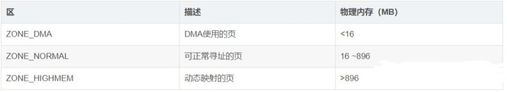
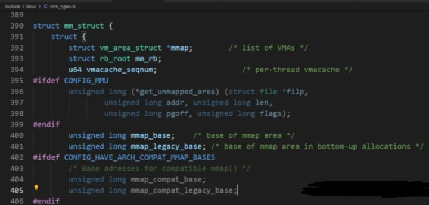
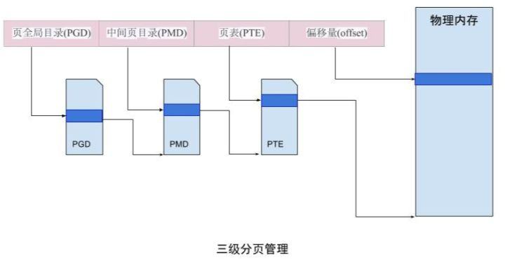
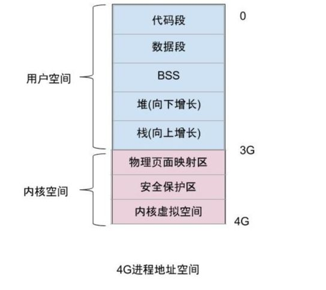
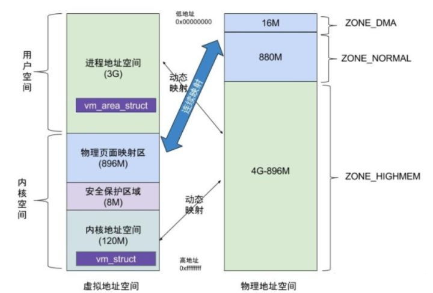
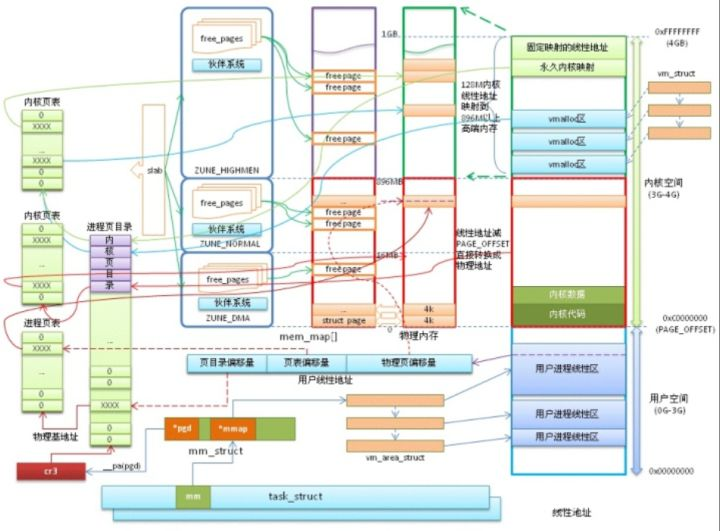

# 一文读懂Linux内核分析-内存管理详解图(秒懂)

### 一、内核空间

#### 1、页

-   页(page)是内核的[内存管理](https://so.csdn.net/so/search?q=%E5%86%85%E5%AD%98%E7%AE%A1%E7%90%86&spm=1001.2101.3001.7020)基本单位。（linux/mm\_types.h）
    

    struct page { unsigned long flags;      // 页标志符   struct address_space *mapping; // 该页所在地址空间描述符结构指针  atomic_t _mapcount; // 页映射计数..............................................................} _struct_page_alignment;

1.  flags：页标志包含是不是脏的，是否被锁定等等，每一位单独表示一种状态，可同时表示出32种不同状态，定义在<linux/page-flags.h>
    
2.  \_count：计数值为-1表示未被使用。
    
3.  virtual：页在[虚拟内存](https://so.csdn.net/so/search?q=%E8%99%9A%E6%8B%9F%E5%86%85%E5%AD%98&spm=1001.2101.3001.7020)中的地址，对于不能永久映射到内核空间的内存(比如高端内存)，该值为NULL；需要事必须动态映射这些内存。
    

-   尽管处理器的最小可寻址单位通常为字或字节，但内存管理单元([MMU](https://so.csdn.net/so/search?q=MMU&spm=1001.2101.3001.7020)，把虚拟地址转换为物理地址的硬件设备)通常以页为单位处理。内核用struct page结构体表示每个物理页，struct page结构体占40个字节，假定系统物理页大小为4KB，对于4GB物理内存，1M个页面，故所有的页面page结构体共占有内存大小为40MB，相对系统4G，这个代价并不高。
    

#### 2、区（zone）

-   内核把页划分在不同的区(zone)
    
-   总共3个区，具体如下：
    

1.  执行DMA操作的内存必须从ZONE\_DMA区分配
    
2.  一般内存，既可从ZONE\_DMA，也可从ZONE\_NORMAL分配，但不能同时从两个区分配；
    

#### 3、页分配与释放

-   下面列举所有的页为单位进行连续物理内存分配，也称为低级页分配器：
    

1.  get\_zeroed\_page：对于用户空间，这个方法能保障系统敏感数据不会泄露
    
2.  page\_address: 把给定的页转换成逻辑地址
    

>  资料直通车：[Linux内核源码技术学习路线+视频教程内核源码](https://blog.csdn.net/youzhangjing_/article/details/125017708?ops_request_misc=&request_id=&biz_id=102&utm_term=%E8%AF%A6%E8%A7%A3Linux%E5%86%85%E6%A0%B8%E5%86%85%E5%AD%98%E7%AE%A1%E7%90%86%E6%9E%B6%E6%9E%84&utm_medium=distribute.pc_search_result.none-task-blog-2~all~sobaiduweb~default-1-125017708.142^v100^pc_search_result_base5&spm=1018.2226.3001.4187)
>
>  学习直通车：[Linux内核源码内存调优文件系统进程管理设备驱动/网络协议栈](https://ke.qq.com/course/4032547?flowToken=1042639 "Linux内核源码内存调优文件系统进程管理设备驱动/网络协议栈")

#### 4、字节分配与释放

-   kmalloc，vmalloc分配都是以字节为单位
    

(1) kmalloc

    void * kmalloc(size_t size, gfp_t flags)

-   该函数返回的是一个指向内存块的指针，其内存块大小至少为size,所分配的内存在物理内存中连续且保持原有的数据(不清零)
    
-   其中部分flags取值说明：
    

1.  GFP\_USER： 用于用户空间的分配内存，可能休眠；
    
2.  GFP\_KERNEL：用于内核空间的内存分配，可能休眠；
    
3.  GFP\_ATOMIC：用于原子性的内存分配，不会休眠；典型原子性场景有中断处理程序，软中断，tasklet等
    

-   kmalloc内存分配最终总是调用\_\_get\_free\_pages 来进行实际的分配，故前缀都是GFP\_开头。 kmalloc分最多只能分配32个page大小的内存，每个page=4k，也就是128K大小，其中16个字节用来记录页描述结构。
    
-   kmalloc分配的是常驻内存，不会被交换到文件中。最小分配单位是32或64字节。
    

#### kzalloc

-   kzalloc()等价于先用 kmalloc() 申请空间， 再用memset()来初始化，所有申请的元素都被初始化为0。
    

    static inline void *kzalloc(size_t size, gfp_t flags){    return kmalloc(size, flags | __GFP_ZERO); //通过或标志位__GFP_ZERO，初始化元素为0}

#### vmalloc

    void * vmalloc(unsigned long size)

-   该函数返回的是一个指向内存块的指针，其内存块大小至少为size,所分配的内存是逻辑上连续的。kmalloc不同，该函数乜有flags,默认是可以休眠的。
    

#### 小结：

#### 5、slab层 slab分配器的作用：

1.  对于频繁地分配和释放的数据结构，会缓存它；
    
2.  频繁分配和回收比如导致内存碎片，为了避免，空闲链表的缓存会连续的存放，已释放的数据结构又会放回空闲链表，不会导致碎片；
    
3.  让部分缓存专属单个处理器，分配和释放操作可以不加SMP锁；
    

-   slab层把不同的对象划分为高速缓存组，每个高速缓存组都存放不同类型的对象，每个对象类型对应一个高速缓存。kmalloc接口监理在slab层只是，使用一组通用高速缓存。 每个高速缓存都是用kmem\_cache结构来表示
    

1.  kmem\_cache\_crreate：创建高速缓存
    
2.  kmem\_cache\_destroy: 撤销高速缓存
    
3.  kmem\_cache\_alloc: 从高速缓存中返回一个指向对象的指针
    
4.  kmem\_cache\_free：释放一个对象
    

-   实例分析： 内核初始化期间，/kernel/fork.c的fork\_init()中会创建一个名叫task\_struct的高速缓存； 每当进程调用fork（）时，会通过dup\_task\_struct()创建一个新的进程描述符，并调用do\_fork(),完成从高速缓存中获取对象。
    

#### 6、栈的静态分配

-   当设置单页内核栈，那么每个进程的内核栈只有一页大小，这取决于编译时配置选项。 好处：
    

1.  可以减少每个进程内存的消耗；
    
2.  随着机器运行时间的增加，寻找两个未分配的、连续的页越来越困难，物理内存碎片化不断加重，那么给每个新进程分配虚拟内存的压力也增大；
    
3.  每个进程的调用链在自己的内核栈中，当单页栈选项被激活时，中断处理程序可获得自己的栈；
    

-   任意函数必须尽量节省栈资源， 方法就是所有函数让局部变量所占空间之和不要超过几百字节。
    

#### 7、高端内存的映射

-   高端内存中的页不能永久地映射到内核地址空间。
    

1.kmap：把给定page结构映射到内核地址空间；

-   当page位于低端内存，函数返回该页的虚拟地址
    
-   当page位于高端内存，建立一个永久映射，再返回地址
    

2.kunmap: 永久映射的数量有限，应通过kunmap及时解除映射

3.kmap\_atomic: 临时映射

4.kunmap\_atomic: 解除临时映射

#### 8、每个CPU数据

1.  alloc\_percpu: 给系统的每个处理器分配一个指定类型对象的实例，以单字节对齐；
    
2.  free\_percpu: 释放每个处理器的对象实例；
    
3.  get\_cpu\_var: 返回一个执行当前处理器数据的特殊实例，同时会禁止内核抢占
    
4.  put\_cpu\_var: 会重新激活内核抢占
    

-   使用每个CPU数据好处：
    

1.  减少了数据锁定，每个CPU访问自己CPU数据
    
2.  大大减少缓存失效，失效往往发生在一个处理器操作某个数据，而其他处理器缓存了该数据，那么必须清理或刷新缓存。持续不断的缓存失效称为缓存抖动。
    

#### 9、小结

-   分配函数选择：
    

1.  连续的物理页，使用低级页分配器 或kmalloc();
    
2.  高端内存分配，使用alloc\_pages(),返回page结构指针； 想获取地址指针，应使用kmap(),把高端内存映射到内核的逻辑地址空间；
    
3.  仅仅需要虚拟地址连续页，使用vmalloc()，性能有所损失；
    
4.  频繁创建和撤销大量数据结构，考虑建立slab高速缓存。
    

### 二、用户空间

-   用户空间中进程的内存，往往称为进程地址空间。Linux采用虚拟内存技术。
    

#### 1、地址空间

-   每个进程都有一个32位或64位的地址空间，取决于体系结构。 一个进程的地址空间与另一个进程的地址空间即使有相同的内存地址，也彼此互不相干，对于这种共享地址空间的进程称之为线程。一个进程可寻址4GB的虚拟内存（32位地址空间中），但不是所有虚拟地址都有权访问。对于进程可访问的地址空间称为内存区域。每个内存区域都具有对相关进程的可读、可写、可执行属性等相关权限设置。
    
-   内存区域可包含的对象：
    

1.  代码段(text section)： 可执行文件代码
    
2.  数据段(data section)： 可执行文件的已初始化全局变量（静态分配的变量和全局变量）。
    
3.  bss段：程序中未初始化的全局变量，零页映射（页面的信息全部为0值）。
    
4.  进程用户空间栈的零页映射（进程的内核栈独立存在并由内核维护）
    
5.  每一个诸如C库或动态连接程序等共享库的代码段、数据段和bss也会被载入进程的地址空间
    
6.  任何内存映射文件
    
7.  任何共享内存段
    
8.  任何匿名的内存映射（比如由malloc()分配的内存）
    

-   这些内存区域不能相互覆盖，每一个进程都有不同的内存片段。
    

#### 2、内存描述符

-   内存描述符由mm\_struct结构体表示，(linux/sched.h)
    

1.  mm\_users：代表正在使用该地址的进程数目，当该值为0时mm\_count也变为0；
    
2.  mm\_count: 代表mm\_struct的主引用计数，当该值为0说明没有任何指向该mm\_struct结构体的引用，结构体会被撤销。
    
3.  mmap和mm\_rb：描述的对象都是相同的
    

-   mmap以链表形式存放， 利于高效地遍历所有元素
    
-   mm\_rb以红黑树形式存放，适合搜索指定元素
    
-   mmlist：所有的mm\_struct结构体都通过mmlist连接在一个双向链表中，该链表的首元素是init\_mm内存描述符，它代表init进程的地址空间。
    
-   在进程的进程描述符（<linux/sched.h>中定义的task\_struct结构体）中，mm域记录该进程使用的内存描述符。故current->mm代表当前进程的内存描述符。
    
-   fork()函数 利用copy\_mm函数复制父进程的内存描述符，子进程中的mm\_struct结构体通过allcote\_mm()从高速缓存中分配得到。通常，每个进程都有唯一的mm\_struct结构体，即唯一的进程地址空间。
    
-   当子进程与父进程是共享地址空间，可调用clone()，那么不再调用allcote\_mm()，而是仅仅是将mm域指向父进程的mm，即 tsk->mm = current->mm。
    
-   相反地，撤销内存是exit\_mm()函数，该函数会进行常规的撤销工作，更新一些统计量。
    

#### 3、内核线程

1.  没有进程地址空间，即内核线程对应的进程描述符中mm=NULL
    
2.  内核线程直接使用前一个进程的内存描述符，仅仅使用地址空间中和内核内存相关的信息
    

#### 4、虚拟内存区域(VMA)

-   虚拟内存区域由vm\_area\_struct结构体描述， 指定地址空间内连续区间的一个独立内存范围。 每个VMA代表不同类型的内存区域。linux/mm\_types.h
    

    struct vm_area_struct {    struct mm_struct * vm_mm;  //内存描述符    unsigned long  vm_start;   //区域的首地址    unsigned long vm_end;      //区域的尾地址    struct vm_area_struct * vm_next; //VMA链表    pgrot t_vm_page_prot;   //访问控制权限    unsigned long vm_flags;   //保护标志位和属性标志位    struct rb_node_ vm_rb;   //VMA的红黑树结构    ...    struct vm_operations_struct * vm_ops; //相关的操作表    struct file * vm_file; //指向被映射的文件的指针    void * vm_private_data; //设备驱动私有数据，与内存管理无关。}

-   每个内存描述符对应于进程地址空间的唯一区间，vm\_end - vm\_start便是内存区间的长度。
    

#### 5、VMA操作

    struct vm_operations_struct {    void (*open) (struct vm_area_struct * area);    void (*close) (struct vm_area_struct * area);    struct page * (*nopage)(struct vm_area_struct *area, unsigned long address, int write_access);    ...}

#### 6、查看进程内存空间

    cat /proc/<pid>/maps

-   每行数据格式： 开始-结束 访问权限 偏移 主设备号：次设备号 i节点 文件
    

1.  设备表示为00：00, 索引节点标示页为0，这个区域就是零页（所有数据全为零）
    
2.  数据段和bss具有可读、可写但不可执行权限；而堆栈可读、可写、甚至可执行
    

-   也可通过工具pmap
    

    pmap <pid>

#### 7、内存区域操作

-   find\_vma 查看mm\_struct所属于的VMA，搜索第一个vm\_end大于addr的内存区域
    

    struct vm_area_struct *find_vma(struct mm_struct *mm, usigned long addr)

1.  检查mmap\_cache，查看缓存VMA是否包含所需地址，如果没有找到，进入2
    
2.  通过红黑树搜索；
    

-   find\_vma\_prev 查看mm\_struct所属于的VMA，搜索第一个vm\_end小于addr的内存区域
    
-   struct vm\_area\_struct \* find\_vma\_prev(struct mm\_struct \*mm, unsigned long addr, struct vm\_area\_struct \*\*pprev) mmap
    

1.  内核使用do\_mmap()创建一个新的线性地址区间，如果创建的地址区间和一个已存在的相邻地址区间有相同的访问权限，则将两个区间合并为一个。
    
2.  mmap()系统调用获取内核函数do\_mmap()的功能。
    
3.  do\_mummap()从特定的进程地址空间中删除指定地址区间
    
4.  mummap()与 mmap功能相反。
    

页表

-   应用程序操作的对象时映射到物理内存之上的虚拟内存，而处理器直接操作的是物理内存。故应用程序访问一个虚拟地址时，需要将虚拟地址转换为物理地址，然后处理器才能解析地址访问请求，这个转换工作通过查询页表完成。
    
-   Linux使用三级页表完成地址转换。
    

1.  顶级页表：页全局目录(PGD)，指向二级页目录；
    
2.  二级页表：中间页目录(PMD)，指向PTE中的表项；
    
3.  最后一级：页表(PTE)，指向物理页面。
    

-   多数体系结构，搜索页表工作由硬件完成。每个进程都有自己的页表(线程会共享页表)。为了加快搜索，实现了翻译后缓冲器(TLB)，作为将虚拟地址映射到物理地址的硬件缓存。还有写时拷贝方式共享页表，当fork()时，父子进程共享页表，只有当子进程或父进程试图修改特定页表项时，内核才创建该页表项的新拷贝，之后父子进程不再共享该页表项。可见，利用共享页表可以消除fork()操作中页表拷贝所带来的消耗。
    

#### 进程与内存

-   所有进程都必须占用一定数量的内存，这些内存用来存放从磁盘载入的程序代码，或存放来自用户输入的数据等。内存可以提前静态分配和统一回收，也可以按需动态分配和回收。
    
-   对于普通进程对应的内存空间包含5种不同的数据区：
    

1.  代码段
    
2.  数据段
    
3.  BSS段
    

-   堆：动态分配的内存段，大小不固定，可动态扩张(malloc等函数分配内存)，或动态缩减(free等函数释放)；
    
-   栈：存放临时创建的局部变量；
    

#### 进程内存空间

-   Linux采用虚拟内存管理技术，每个进程都有各自独立的进程地址空间(即4G的线性虚拟空间)，无法直接访问物理内存。这样起到保护操作系统，并且让用户程序可使用比实际物理内存更大的地址空间。
    

1.  4G进程地址空间被划分两部分，内核空间和用户空间。用户空间从0到3G，内核空间从3G到4G；
    
2.  用户进程通常情况只能访问用户空间的虚拟地址，不能访问内核空间虚拟地址。只有用户进程进行系统调用(代表用户进程在内核态执行)等情况可访问到内核空间；
    
3.  用户空间对应进程，所以当进程切换，用户空间也会跟着变化；
    
4.  内核空间是由内核负责映射，不会跟着进程变化；内核空间地址有自己对应的页表，用户进程各自有不同额页表。
    

#### 内存分配

-   进程分配内存，陷入内核态分别由brk和mmap完成，但这两种分配还没有分配真正的物理内存，真正分配在后面会讲。
    
-   brk： 数据段的最高地址指针\_edata往高地址推
    

1.  当malloc需要分配的内存<M\_MMAP\_THRESHOLD（默认128k）时，采用brk;
    
2.  brk分配的内存需高地址内存全部释放之后才会释放。(由于是通过推动指针方式)
    
3.  当最高地址空间的空闲内存大于M\_TRIM\_THRESHOLD时(默认128k)，执行内存紧缩操作；
    

-   do\_mmap：在堆栈中间的文件映射区域找空闲的虚拟内存
    

1.  当malloc需要分配的内存>M\_MMAP\_THRESHOLD（默认128k）时，采用do\_map();
    
2.  mmap分配的内存可以单独释放
    

#### 8、物理内存

1.  物理内存只有进程真正去访问虚拟地址，发生缺页中断时，才分配实际的物理页面，建立物理内存和虚拟内存的映射关系。
    
2.  应用程序操作的是虚拟内存；而处理器直接操作的却是物理内存。当应用程序访问虚拟地址，必须将虚拟地址转化为物理地址，处理器才能解析地址访问请求。
    
3.  物理内存是通过分页机制实现的
    
4.  物理页在系统中由也结构struct page描述，所有的page都存储在数组mem\_map\[\]中，可通过该数组找到系统中的每一页。
    

#### 9、虚拟内存 转化为 真实物理内存：

1.  虚拟进程空间：通过查询进程页表，获取实际物理内存地址；
    
2.  虚拟内核空间：通过查询内核页表，获取实际物理内存地址；
    
3.  物理内存映射区：物理内存映射区与实际物理去偏移量仅PAGE\_OFFSET，通过通过virt\_to\_phys()转化；
    

虚拟内存与真实物理内存映射关系：

-   其中物理地址空间中除了896M(ZONE\_DMA + ZONE\_NORMAL)的区域是绝对的物理连续，其他内存都不是物理内存连续。在虚拟内核地址空间中的安全保护区域的指针都是非法的，用于保证指针非法越界类的操作，vm\_struct是连续的虚拟内核空间，对应的物理页面可以不连续，地址范围(3G + 896M + 8M) ~ 4G；另外在虚拟用户空间中 vm\_area\_struct同样也是一块连续的虚拟进程空间，地址空间范围0~3G。
    
-   碎片问题
    
-   外部碎片：未被分配的内存，由于太多零碎的不连续小内存，无法满足当前较大内存的申请要求；
    

1.  原因：频繁的分配与回收物理页导致大量的小块内存夹杂在已分配页面中间；
    
2.  解决方案：伙伴算法有所改善
    

-   内部碎片：已经分配的内存，却不能被利用的内存空间；
    

1.  缘由：所有内存分配必须起始可被4、8或16(体系结构决定)整除的地址或者MMU分页机制限制；
    
2.  解决方案：slab分配器有所改善
    
3.  实例：请求一个11Byte的内存块，系统可能会分配12Byte、16Byte等稍大一些的字节，这些多余空间就产生碎片
    

整体内存图总结如下：

## 参考

[一文读懂Linux内核分析-内存管理详解图(秒懂)_linux内存管理-CSDN博客](https://blog.csdn.net/youzhangjing_/article/details/125017708?ops_request_misc=&request_id=&biz_id=102&utm_term=详解Linux内核内存管理架构&utm_medium=distribute.pc_search_result.none-task-blog-2~all~sobaiduweb~default-1-125017708.142^v100^pc_search_result_base5&spm=1018.2226.3001.4187)