# 详细讲解Linux内核源码内存管理（值得收藏）

Linux的内存管理是一个非常复杂的过程，主要分成两个大的部分：内核的内存管理和进程[虚拟内存](https://so.csdn.net/so/search?q=%E8%99%9A%E6%8B%9F%E5%86%85%E5%AD%98&spm=1001.2101.3001.7020)。内核的内存管理是Linux内存管理的核心，所以我们先对内核的内存管理进行简介。

### 一、物理内存模型

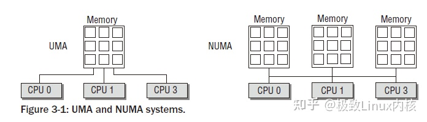

物理内存模型主要分为两种：UMA（Uniform Memory Access）和NUMA（Non-Uniform Memory Access）。UMA模型是指物理内存是连续的，SMP系统中的每个处理器访问各个内存区都是同样快的；而NUMA模型则是指SMP中的每个CPU都有自己的物理内存区，虽然CPU可以访问其他CPU的内存区，但是要比方位自己的内存区慢得多。我们一般使用的物理模型都是UMA模型。为了NUMA模型，Linux提供了三种可能的内存布局配置：Flat Memory, Sparse Memory, Discontiguous Memory。

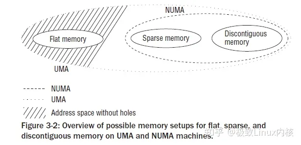

Flat Memory就是简单的线性组织物理内存，一般没有内存空洞的UMA架构都采用这种配置。对于NUMA模型，一般只能采用后两者，而后两者的区别主要在于：Sparse Memory配置一般认为是试验性的，不是那么稳定，但是有一些新的功能和性能优化，而Discontiguous Memory配置一般认为是稳定的，但不具有内存热插拔之类的新特性。

> **【文章福利】**小编推荐自己的Linux内核技术交流群： [【977878001】](https://link.zhihu.com/?target=https%3A//jq.qq.com/%3F_wv%3D1027%26k%3DvkcwSVb6 "【977878001】")整理一些个人觉得比较好得学习书籍、视频资料共享在群文件里面，有需要的可以自行添加哦！！！前100进群领取，额外赠送一份 **价值699的内核资料包**（含视频教程、电子书、实战项目及代码）

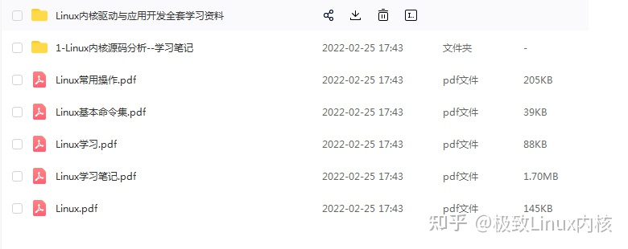

**内核资料直通车：**[Linux内核源码技术学习路线+视频教程代码资料https://link.zhihu.com/?target=https%3A//docs.qq.com/doc/DUGZVQk1qWVBHTEl3](https://link.zhihu.com/?target=https%3A//docs.qq.com/doc/DUGZVQk1qWVBHTEl3 "Linux内核源码技术学习路线+视频教程代码资料")

 **学习直通车（腾讯课堂免费报名）**[Linux内核源码/内存调优/文件系统/进程管理/设备驱动/网络协议栈-学习视频教程-腾讯课堂是不是学完操作系统原理后觉得纸上谈兵不过瘾？是不是面对浩若烟海的Linux内核源代码迷失在代码的海洋里不知所措？这门课可以带您用理论结合实践的方法一步一步抓住Linux内核最核心的部分代码，理解Linux操作系统运行的基本过程及涉及的核心机制。https://ke.qq.com/course/4032547?flowToken=1044374](https://ke.qq.com/course/4032547?flowToken=1044374 "Linux内核源码/内存调优/文件系统/进程管理/设备驱动/网络协议栈-学习视频教程-腾讯课堂")

### 二、物理内存组织

物理内存的组织主要分为两个部分：节点（node）和内存与内存域（zone）。node主要针对NUMA设计，在NUMA的SMP系统中，每个处理器都有一个自己的node，而在UMA模型中则只有一个node。对于每个node中的内存，Linux分成了若干内存域，定义在mmzone.h的zone\_type中，常用的有ZONE\_DMA、ZONE\_DMA32、ZONE\_NORMAL、ZONE\_HIGHMEM和ZONE\_MOVABLE。其中ZONE\_NORMAL是最为常用的，表示内核能够直接映射的一般内存区域；ZONE\_DMA表示DMA内存区；ZONE\_DMA32表示64位系统中对于32位DMA设备使用的内存；ZONE\_HIGHMEM表示在32位系统中，高地址内存的区域；ZONE\_MOVABLE与伙伴系统的内存碎片消除有关。后文会详细介绍相关部分。

在物理内存管理过程中有一些名词：

Page Frame（页帧，或称页框）：是系统内存管理的最小单位，系统中每个页框都是struct page的一个实例。IA-32系统的页框大小是4KB。

Hot-n-Code Pages（冷热页）：是指内存管理中对页框的分类，访问较多的或者近期访问的为热页，否则为冷页。该标记主要与内存换出（memory swap）相关。

Page Table（页表）：是内存寻址过程中的辅助数据结构。层次化的页表对于大地之空间的快速、高效管理很有意义。Linux一般支持四级页表：PGD（Page Global Directory）、PUD（Page Upper Directory）、PMD（Page Middle Directory）和PTE（Page Table Entry）。IA-32体系中默认只是用了两级分页系统，即只有PGD和PTE。

### 三、X86架构下的内存布局

内核在内存中的布局

Linux的内核在初始化的时候会被加载到内存区的固定位置（在此我们不讨论可重定位内核的情况），而内核所占用的内存区域的布局是固定的，如图：

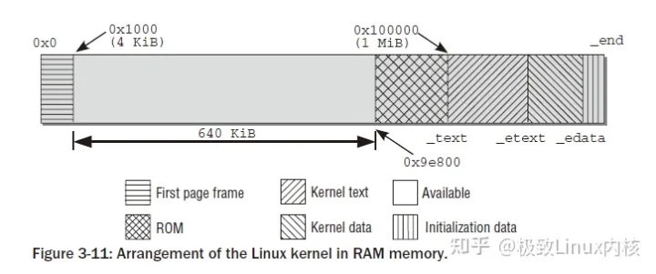

内存第一个页框不实用，主要被BIOS用来初始化；之后的连续640KB内存也不被内核使用，主要用来映射各种ROM（通常是BIOS和显卡ROM）；再之后的空间是闲置的，原因是内核要被放在连续的内存空间。在0x100000开始为内核部分，分别是代码段、数据段和附加段。

IA-32架构的布局

IA-32架构可以访问4GB的地址空间（不考虑PAE），常规情况下会将4GB线性空间划分成3:1的两部分：低地址的3/4部分为用户空间，而高地址的1GB是内核空间，即内核地址空间从偏移量0xC0000000开始，每个虚拟地址x都对应于物理地址x-0xC0000000。这样的设计加快了内核空间寻址的速度（简单的减法操作）。在进程切换的过程中，只有用户空间的低3GB内存对应的页表会被切换，高地址空间会公用内核页表。

IA-32架构的这种设计存在着一个问题：既然内核只能处理1GB的空间（事实上，内核处理的空间还不足1GB，后面会详细说明），那么如果物理内存大于1GB，剩下的内存将如何处理？这种情况下，内核将无法直接映射全部物理内存，这样就用到了上面所说的高地址内存域（ZONE\_HIGHMEM）。具体的内存分配如下图：

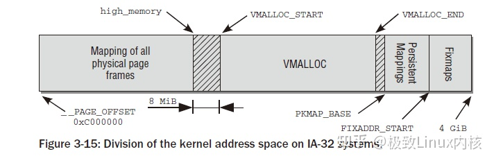

能够看到内核区域的映射从\_\_PAGE\_OFFSET（0xC00000）开始，即3GiB位置开始映射到4GiB，开始的一段用来直接映射，而后面有128MB的VMALLOC空间（这部分空间的使用后文将讲到），再之后有永久映射和固定映射的空间（从PKMAP\_BASE开始）。所以事实上物理内存能够直接映射的空间为1GB-VMALLOC-固定映射-永久映射，所以真正大约只有850MB多一点，也就是说，物理内存中只有前850多MB是可以直接映射到内核空间的，对于超过的部分来说，将作为高地址空间（HIGHMEM）。高地址空间可以在VMALLOC、永久映射和固定映射部分使用到。

到这里可能会有这样一个疑问：如果内核只能处理896MB的空间，那么如果内存很大（比如3GB），剩下的空间的利用率和利用效率岂不是很低？对于这个问题我们需要注意：这里我们所讲述的：1、这里的内存都是内核在内核区的1GB空间里对物理内存的访问，用户对物理内存的访问不是通过直接映射来访问的，还有另外一套机制；2、这里的内存仅仅是通过直接映射得到的内存，内核还可以通过其他的方式访问到较高地址的内存。

还有一个普遍的疑问就是：内核直接映射占用了800多MB的空间，那么如果我们又3GB的物理内存，是不是只有2GB多一点的实际可用内存呢？这个说法是错误的，上图所描述的只是内核在线性地址空间的分布情况，其中的任何区域如果没有真正的物理内存与之映射的话是不会真正占用物理内存的，而物理内存在分配的过程中（用户申请内存、VMALLOC部分等），更倾向于先分配高地址内存，在高地址内存耗尽的情况下才会使用低850MB内存。

AMD64架构的布局

AMD64架构采用了与IA-32完全不同的布局模式。由于64位的寻址空间的64位长，而在真正的实现过程中64位长寻址会造成较大的开销，所以Linux目前仅适用了48位长的地址空间，但是为了向后兼容仍然适用64位地址空间表示。在布局方面考虑，如果单纯采用48位类似IA-32的布局方式的话，则很难保证向后兼容性。所以AMD64架构下的内存布局Linux采用了一种特殊的方式，如图：

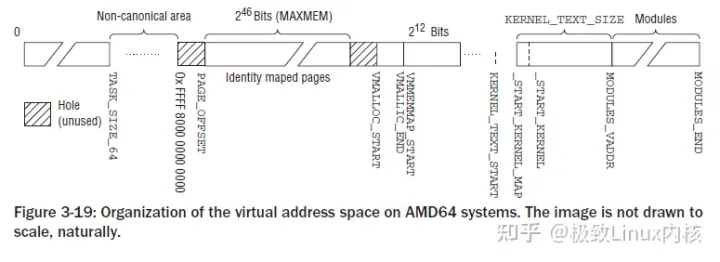

Linux将内存分成了高地址部分和低地址部分两部分，即下半部空间0~0x0000 7FFF FFFF FFFF和上半部空间0xFFFF 8000 0000 0000~0xFFFF FFFF FFFF FFFF。可以看到虚拟地址的低47位，即\[0,46\]为有效位，\[47,63\]的值总是相同的：或者全为0或者全为1。除此之外的值都是无效的。这样在虚拟内存空间中就将内存分成了两个部分：内存空间的下半部和上半部。下半部为用户空间，上半部为内核空间。我们考虑内核空间部分，下半部的前MAXMEM大小（64TB）为直接映射地址，之后有一个空洞，主要目的是处理内存访问越界；再之后是大小为32TB的VMALLOC空间，在之后是VMMEMMAP空间、KERNEL TEXT段空间以及Modules空间。

在这里我们不仔细讲述AMD64架构的布局，以后的部分则主要关注于IA-32架构。

### 四、启动过程期间的内存管理

在启动过程中，尽管内存管理尚未初始化，但内核仍然需要分配内存以创建各种数据结构。bootmem分配器用于在启动阶段早期分配内存。由于对这部分内存分配集中于简单性方面而不是性能和通用性，因此使用的是最先适配（first-fit）分配器。该分配器使用一个位图来管理页，位图中的1表示页已使用，0表示未使用。在需要分配内存时，分配器扫描位图，直到找到一个能够提供足够连续页的为之，即最先最佳（first-best）或最先适配位置。

在这个分配过程中，需要处理一些不可分配的页面，如IA-32系统中的0页。另外对于IA-32系统，bootmem仅仅使用了低地址部分，对于高地址部分的操作过于麻烦，所以在这里被放弃了。

在这个部分有一个很有意思的事情。我们在编写内核模块的时候，对于模块的初始化函数会使用\_\_init标记或者\_\_init\_data标记。对于被这两个关键字标记的函数和数据，是只有在初始化阶段才用到的，在bootmem退出的时候会全部被回收。而这部分代码和数据再内核链接的过程中将会被放在.init.text段和.init.data段，并统一放在内核的尾部，在启动结束后便于回收。

### 五、物理内存的管理

#### 1、伙伴系统

物理内存管理中伙伴系统是最为重要的一个系统，伙伴系统也基于一种相对简单然而令人吃惊的强大算法，到目前已经使用了几乎40年。伙伴系统在这里不再赘述，简单谷歌一下就可以查到该算法的描述（实在是很简单）。在这里主要讲一下Linux Kernel的伙伴系统以及在2.6.24之后版本的系统中对伙伴系统的改良。

在上文中已经说到，物理内存的惯例分为若干个node，每个node中又有若干个zone。对于每个zone，都会有对应的伙伴系统，如下图所示：

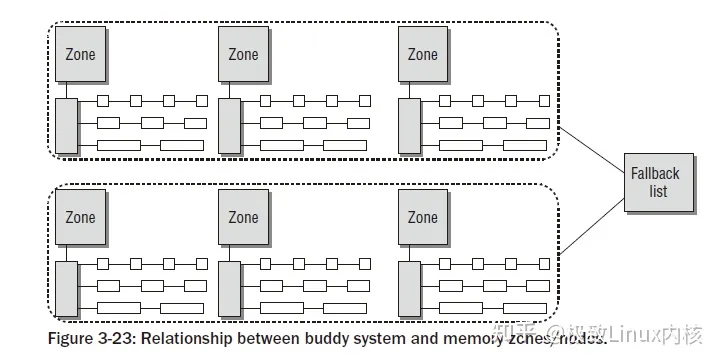

上图中的Fallback list指的是：在多个node的系统中，如果某个node的内存空间不够，则会在Fallback List中指定的node中分配内存。

我们可以执行cat /proc/buddyinfo，能够看到大约如下所示的信息：

-   /proc/buddyinfo:
-   wolfgang@meitner> cat /proc/buddyinfo
-   Node 0, zone DMA 3 5 7 4 6 3 3 3 1 1 1
-   Node 0, zone DMA32 130 546 695 271 107 38 2 2 1 4 479
-   Node 0, zone Normal 23 6 6 8 1 4 3 0 0 0 0

显示的三个域则是我们使用到的内存域。

伙伴系统会出现一个很常见的问题：在系统使用较长时间之后，内存中经常出现较多碎片。对于这种情况，内核将内存页面分成五种类型：

-   MIGRATE\_UNMOVABLE
-   MIGRATE\_RECLAIMABLE
-   MIGRATE\_RESERVE
-   MIGRATE\_MOVABLE
-   MIGRATE\_ISOLATE

其中MIGRATE\_RESERVE所表示的内存是被系统保留以备急用的；MIGRATE\_UNMOVABLE是不可移动的，如BIOS信息页；MIGRATE\_RECLAIMABLE在swap系统中使用；MIGRATE\_ISOLATE表示不能从这里分配的内存；MIGRATE\_MOVABLE表示可以移动的内存。对于内核来说，MIGRATE\_MOVABLE部分的内存可以采用某种算法来进行移动，使得内存中的碎片减少。另外内核还维护了一个fallback list，来表示如果在某个类型中分配页面未成功，会在哪些类型的页面中来分配。

具体的信息可以在/proc/pagetypeinfo中看到

#### 2、伙伴系统的内存分配API

基本上从如下两张图就能够看出来：

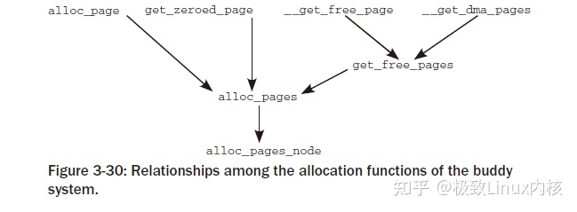

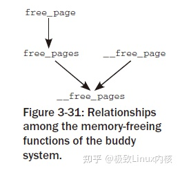

对于其中的函数命名基本都是自明的，主要的差别在于：对于双下划线开头的函数（\_\_get\_free\_page, \_\_free\_page等）返回值或者参数为struct page \*，而其他的函数返回值为unsigned long，即线性地址地址。

#### 3、内核中不连续页的分配

根据上文的讲述，我们知道物理上连续的映射对内核是最好的，但并不是总能成功的使用。所以内核提供了类似用户空间访问内存一样的机制（vmalloc）来进行对内核中不连续页的分配。这一部分就是上文中所说的vmalloc区域。这部分主要是一个vmalloc函数：

<vmalloc.h>

    void *vmalloc(unsigned long size);

在该函数的实现过程中，需要先申请一部分虚拟内存空间vm\_area，然后将这部分空间映射到vmalloc区域中。对于映射的物理内存，内核更倾向于使用高地址空间（ZONE\_HIGHMEM），来节省宝贵的地地址空间。对于不同vmalloc调用申请的vm\_area之间，会有一个hole来隔离，以避免越界访问。

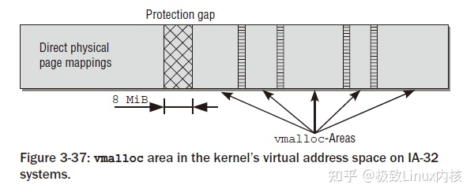

注意vmalloc系统底层也是使用伙伴系统来分配内存，所以申请内存的大小只能是整页的（页大小对齐）。

在这部分有一个有意思的事情：vmalloc区域在IA-32中预设的大小是128MB，这部分内存一般会被内核模块使用。vmalloc区域的大小是可以定制的，在新版内核中可以在内核启动选项中加入vmalloc=xxxMB的方式来修改，或者修改内核代码对应的宏：

    unsigned int __VMALLOC_RESERVE = 128 << 20;

如果修改了vmalloc区域的大小，那么内核能够直接映射的区域将会缩小，即kmalloc能够使用的内存将会变少（kmalloc使用slab allocator分配，后文将会介绍），但是内核真正使用的物理内存和vmalloc区域的大小没有直接关系。所以在内核模块的编写过程中，要根据需求来使用vmalloc和kmalloc，而了解他们的内存分配机制是很有好处的。

#### 4、内核映射

尽管vmalloc函数族可用于从高端内存向内核映射页框，但这并不是这些函数的实际用途。内核提供了其他函数用于将ZONE\_HIGHMEM页框显式的映射到内核空间。

如果需要长期的将高端页框映射到内核地址空间中，即持久映射，需要使用kmap函数，映射的空间指向上文图中所指Persistent Mapings。内核使用kunmap接触映射。持久映射kmap函数不能用于处理中断处理程序，因为kmap过程可能进入睡眠状态。

为了能够原子的执行映射过程（逻辑上称为kmap\_atomic），内核提供了临时映射机制，也被称作固定映射，页面也会被映射到Fixmaps区域。映射的API分别是kmap\_atomic和kunmap\_atomic。固定映射可以用在中断处理程序中。

对于不支持高端内存的体系结构（如64位体系结构），则将以上若干映射函数通过预编译选项指向了对应的兼容函数。事实上对于这些体系结构的映射，都是简单的返回对应的内存地址即可，因为内核可以在直接映射区域简单的找到对应的地址。

### 六、slab分配器

上面所描述的物理内存管理机制中，最小粒度的内存管理单元是页框，大小一般是4KB，而在内存中无论何时申请内存都分配一个页面是不合适的方式，所以引入了新的管理机制，即slab分配器。Slab是Sun公司的一个雇员Jeff Bonwick在Solaris 2.4中设计并实现的。slab分配器将大小相同的内核对象放在一起，当对象被free了之后并不是直接还给伙伴系统，而是将这部分对象的页面保存下来，在下一次该类对象的内存申请时分配给新的对象。这种机制的优势在于：1、能够按照CPU缓存的大小来组织分配对象的位置，一般来说，都会将若干个相同的对象放在一个cacheline中，并且对象占用的内存不会跨越两个cacheline。这样的设计能够保证slab分配器分配的对象能够较多时间的存在于CPU缓存中。2、采用LIFO方式管理对象。这种做法基于：最近释放的对象空间是最有可能存在于cache中的。这也能够有效的利用cache。

各个缓存管理的对象，会合并为较大的组，覆盖一个或者多个连续的页框。这种组称作slab，每个缓存由几个这种slab组成。这也是slab分配器命名的由来。

#### 1、slab、slob、slub分配器

Linux内核中目前支持三种分配器，其中slab前文已经简单介绍过了，另外两种分配器是备选分配器，可以在内核编译选项中指定。由于对上层提供的API是固定的，仅仅是底层实现不同，所以Kernel开发者不必去考虑底层的分配情况。

slab分配器虽然有很大的优势，但是其存在两个问题：1、在较小的内存系统下，slab分配器过于复杂。如嵌入式环境下slab显得有些过于庞大。2、在内存很大的巨型机上，slab分配器本身的数据结构所占用的内存空间过大，最大的可高达2GB以上。

对于前一种情况，设计了slob分配器，它围绕一个simple linked list of block展开（也是slob的由来），在分配内存的时候，采用了最先适配算法（first-fit）。

对于后一种情况，设计了slub分配器，slub分配器将页框打包为组，并通过struct page中未使用的字段来管理这些组，试图最小化内存开销。slub分配器事实上是基于slab分配器的一种优化结构。在大型机上slub分配器上有着更好的性能。

#### 2、slab分配器的原理

内核中一般的内存分配和释放的函数有kmalloc、kzalloc、kcalloc。这三个函数的区别是：kmalloc仅仅申请一片空间，kzalloc在申请一篇空间之后将其置0。kcalloc很少用，即对数组进行空间分配并置0。

所有活动的slab缓存可以通过cat /proc/slabinfo来看到。

slab分配器由一个紧密交织的数据和内存结构的网络组成，主要可以分为如图的两部分：保存管理型数据的缓存对象和保存被管理对象的各个slab。

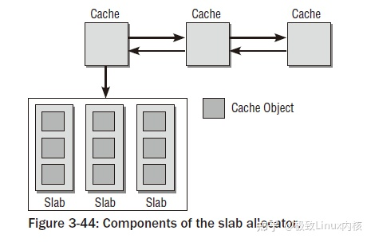

每个slab缓存只负责一种对象类型，或者提供一般性的缓冲区。下图中给出了缓存的精细结构：

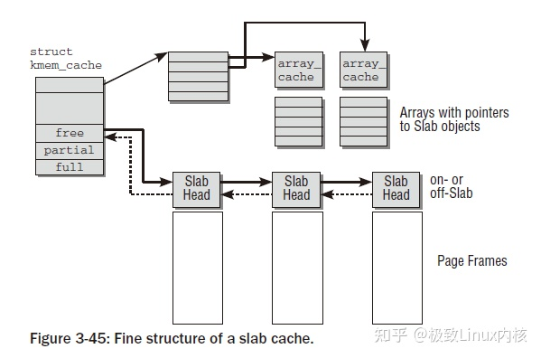

可以看到对于每个slab缓存，都会保存成一个struct kmem\_cache，每个结构里面包含一个穿在一起的链表，以及三个链表头：free、partial、full，分别表示空闲链、部分空闲链和满链。含义和字面意思相同。对象在slab中并不是连续排列的，用户可以要求对象按硬件缓存对齐，也可以要求按照BYTES\_PER\_WORD对齐，该值表示void指针所需的字节的数目。

创建新的slab缓存需要调用kmem\_cache\_create函数，返回struct kmem\_cache结构。创建缓存的时候需要制定缓存的可读name（会出现在/proc/slabinfo中），还需要制定被管理对象以字节计的长度（size），在对齐数据时使用的偏移量（align），以及flags标志。另外还需要制定构造/析构函数ctor/dtor。

分配对象时调用kmem\_cache\_alloc，函数需要指定创建过的slab缓存，以及flags。内核支持的所有GFP\_xxx宏都可以用于指定标志。

下图显示了分配对象的过程：

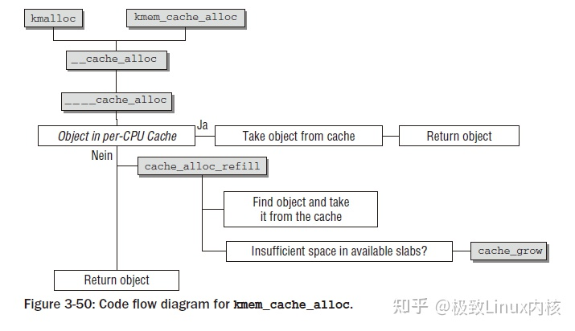

#### 3、通用缓存

如果不涉及对象缓存，而是传统意义上的分配/释放内存，则需要调用kmalloc和kfree函数，而这两个函数的后端依然是使用slab分配器进行分配的。kmalloc的基础是一个数组，其中是一些分别用于不同内存长度的slab缓存，数组项是cache\_sizes的实例。该数据结构定义如下：

<slab\_def.h>

    struct cache_sizes {     size_t cs_size;     kmem_cache_t *cs_cachep;     kmem_cache_t *cs_dmacachep; #ifdef CONFIG_ZONE_DMA     struct kmem_cache *cs_dmacachep; #endif }

cs\_size指定了该项负责的内存区的长度。每个长度对应两个slab缓存，其中之一提供适合DMA访问的内存。通过cat /proc/slabinfo中能够看到，kmalloc-xxx和dma-kmalloc-xxx就是这一部分提供的。

kmalloc定义在<slab\_def.h>，该函数首先检查所需的缓存是否用常数来指定，如果是这种情况，所需的缓存可以在编译时静态确定，这可以提高速度（内核的优化真是无所不用其极！！）。否则，该函数调用\_\_kmalloc查找长度匹配的缓存，后者是\_\_do\_kmalloc的前端，提供参数转换功能。

mm/slab.c

    void *__do_kmalloc(size_t size, gfp_t flags) {     kmem_cache_t *cachep;     cachep = __find_general_cachep(size, flags);     if (unlikely(ZERO_OR_NULL_PTR(cachep)))         return NULL;     return __cache_alloc(cachep, flags); }

\_\_find\_general\_cachep在上文提到的缓存中找到适当的一个，之后使用\_\_cache\_alloc函数完成最终的分配。

#### 七、处理器高速缓存和TLB控制

在这里简单的总结一些Kernel中和TLB/高速缓存相关的函数，具体TLB的实现机制与体系架构相关性很大，就不详细总结了。

flush\_tlb\_all和flush\_cache\_all刷出整个TLB/高速缓存。此操作只在操纵内核页表时需要，因为此类修改不仅影响所有进程，而且影响系统中的所有处理器。

flush\_tlb\_mm(struct mm\_struct \*mm)和flush\_cache\_mm刷出所有属于地址空间mm的TLB/高速缓存项。

flush\_tlb\_range(struct vm\_area\_struct \*vma, unsigned long start, unsigned long end)和flush\_cache\_range(vma, start, end)刷出地址范围vma->vm\_mm中虚拟地址start和end之间的所有TLB/高速缓存项。

flush\_tlb\_page(struct vm\_area\_struct \*vma, unsigned long page)

和flush\_cache\_page(vma, page)刷出虚拟地址在\[page, page + PAGE\_SIZE\]范围内所有的TLB/高速缓存项。

update\_mmu\_cache(struct vm\_area\_struct \*vma, unsigned long address, pte\_t pte)在处理页失效之后调用。它在处理器的内存管理单元MMU中加入信息，是的虚拟地址address由页表项pte描述。仅当存在外部MMU时才需要该函数，通常MMU集成在处理器内部。

此外，flush\_cache\_和flush\_tlb\_函数常常成对出现，例如，在使用fork进程复制进程的地址空间时，则：1、刷出高速缓存，2、操作内存，3、刷出TLB。这个顺序很重要，因为

如果顺序相反，那么在TLB刷出之后，正确信息提供之前，多处理器系统中的另一个CPU可能从进程的页表项取得错误的信息。

在刷出高速缓存时，某些体系结构需要依赖TLB中的“虚拟->物理”转换规则。flush\_tlb\_mm必须在flush\_cache\_mm之后执行以确保这一点。

小结

这部分东西实在是太多，简单的总结一下就已经这么多了。在这里对以上的内容进行一个简单的概括。

在内核进入正常运行之后，内存管理分为两个层次：伙伴系统负责物理页框的管理。在伙伴系统之上，所有的内存管理都基于此，主要分为：slab分配器处理小块内存；vmalloc模块为不连续物理页框提供映射；永久映射区域和固定映射区域提供对高地址物理页框的访问。

内存管理的初始化很具有挑战性，内核通过引入一个非常简单的自举内存分配器（bootmem）解决了该问题，该分配器在正式的分配机制（伙伴系统）启用后停用。

最后提醒注意的是，以上所有总结的内容都是物理内存的管理，内核如何管理虚拟地址空间将在另外的日志中总结。

## 参考

[详细讲解Linux内核源码内存管理（值得收藏）_linux内存管理源码解析-CSDN博客](https://blog.csdn.net/m0_74282605/article/details/127731513?ops_request_misc=%7B%22request%5Fid%22%3A%22AD767732-B04F-4E77-9B4B-F2CAD1B6A46D%22%2C%22scm%22%3A%2220140713.130102334.pc%5Fall.%22%7D&request_id=AD767732-B04F-4E77-9B4B-F2CAD1B6A46D&biz_id=0&utm_medium=distribute.pc_search_result.none-task-blog-2~all~first_rank_ecpm_v1~rank_v31_ecpm-5-127731513-null-null.142^v100^pc_search_result_base5&utm_term=详解Linux内核内存管理架构&spm=1018.2226.3001.4187)