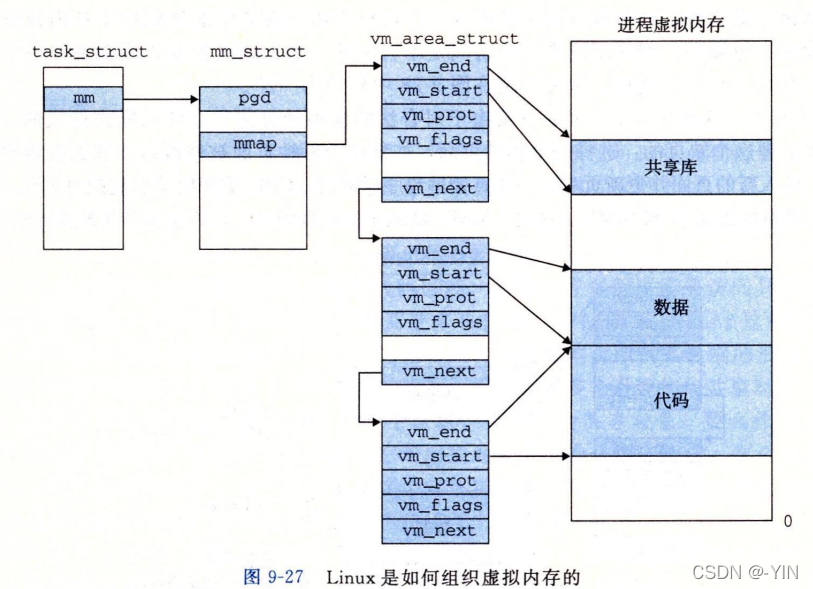

# Linux 内存管理 详解（虚拟内存、物理内存，进程地址空间）

计算机硬件的五大组成部分为：控制器， 运算器， 存储器， 输入和输出设备。

## 存储系统

> **存储器**：用来存放所有数据和程序的记忆部件，它的基本功能是按指定的地址存（写）入或者取（读）出信息。 计算机中的存储器可分成两大类：一类是**内存储器**，简称内存或主存；另一类是**外存储器**（辅助存储器），简称外存或辅存。 存储器由若干个存储单元组成，每个存储单元都有一个地址，计算机通过地址对存储单元进行读写。处理器可以直接访问内存但不能直接访问外存，需要通过相应的I/O设备才能使外存和内存交换。

一个作业必须把它的程序和数据存放在内存（主存）中才能运行。在多道程序系统中有多个程序以及相关数据放入内存中。操作系统不但要管理，保护这些数据，操作系统本身也要存放在内存中运行。  
因此内存以及与存储器有关的管理时支持操作系统运行硬件环境中一个重要方面。

### 存储器的层次结构

 

## Linux的内存管理

操作系统会提供一种机制，将不同进程的[虚拟地址](https://so.csdn.net/so/search?q=%E8%99%9A%E6%8B%9F%E5%9C%B0%E5%9D%80&spm=1001.2101.3001.7020)和不同内存的物理地址映射起来。

如果程序要访问虚拟地址的时候，由操作系统转换成不同的物理地址，这样不同的进程运行的时候，写入的是不同的物理地址，这样就不会冲突了。

于是，这里就引出了两种地址的概念：

1.  程序所使用的内存地址叫做**虚拟内存地址**（_Virtual Memory Address_）
2.  实际存在硬件里面的空间地址叫**物理内存地址**（_Physical Memory Address_）。

> > 

Linux 采用虚拟存储技术，虚拟地址空间可达到 4GB

### 物理内存

> **寄存器**: 具有与处理机相同的速度与CPU协调工作，故对寄存器的访问速度最快，但价格却十分昂贵，因此容量不可能做得很大。用于加速存储器的访问速度，如用寄存器存放操作数，或用作地址寄存器加快地址转换速度等。  
> **高速缓存**: 根据程序执行的局部性原理将主存中一些经常访问的信息存放在高速缓存中，减少访问主存储器的次数，可大幅度提高程序执行速度。  
> **主存储器**: 内存，保存进程运行时的程序和数据。CPU与外围设备交换的信息一般也依托于主存储器地址空间。为缓和主存储器的访问速度远低于CPU执行指令的速度，在计算机系统中引入了寄存器和高速缓存。  
> **磁盘**: 将频繁使用的一部分磁盘数据和信息，暂时存放在磁盘缓存中，可减少访问磁盘的次数。它依托于固定磁盘，提供对主存储器存储空间的扩充，即利用主存中的存储空间，来暂存从磁盘中读/写入的信息。  
> **磁带**: 这种介质经常用于磁盘的备份，并H可以保存作常大量的数据集。在访门磁带前，首先要把磁带装到磁带机上，可以人工安装也可用机器人安装(在大型数据库中通常安装有白动磁带处理设备)。然后，磁带町能还需要向前绕转以便读取所请求的数捌块。

 

#### 物理内存管理

目前计算机系统有两种体系结构：

> 一致性内存访问 **UMA**（Uniform Memory Access）也可以称为对称多处理器SMP（Symmetric Multi-Process）。意思是所有的处理器访问内存花费的时间是一样的。也可以理解整个内存只有一个node。（但事实上严格意义的UMA结构几乎不存在）  
>
>
> **非一致性内存访问 NUMA**（Non-Uniform Memory Access）意思是内存被划分为各个node，访问一个node花费的时间取决于CPU离这个node的距离。每一个cpu内部有一个本地的node，访问本地node时间比访问其他node的速度快

所以`Linux`为了对 NUMA 进行描述，从Linux2.4开始引入了存储节点，把访问时间相同的存储空间称为一个存储节点。进而 Linux 将物理内存划分为三个层次来管理：存储节点，管理区，页面。

**ZONE**  
Linux 2.6把每个内存节点的物理内在划分为3个管理区(zone)。

1.  ZONE\_ DMA: 可以用来DMA操作的页。 ( <16MB)
2.  ZONE\_NORMAL :正常规则映射的页。 (16MB~896MB)
3.  ZONE\_ HIGHMEM: 高内存地址的页，并不永久性映射。 ( >896MB)  
    

**页 page**

> 内核把物理页作为内存管理的基本单位。尽管处理器的最小可寻址单位通常为字(甚至字节)，但是，**内存管理单元(MMU**，管理内存并把虚拟地址转换为物理地址的硬件)通常以页为单位进行处理。正因为如此，MMU以页(page) 大小为单位来管理系统中的页表(这也是页表名的来由)。从[虚拟内存](https://so.csdn.net/so/search?q=%E8%99%9A%E6%8B%9F%E5%86%85%E5%AD%98&spm=1001.2101.3001.7020)的角度来看，页就是最小单位。

代表一个物理页，在内核中一个物理页用一个struct page表示。  

> 首先，Linux维护一个页描述符数组，称为`mem_map`, 其中页描述符是`page`类型的,而且系统当中的每个物理贞框都有一个页描述符。 每个页描述符都有个指针，在页面非空闲时指向它所属的地址空间，另有一对指针可以使得它跟其他描述符形成双向链表，来记录所有的空闲页框和一些其他的城。下图中，页面150的页描述符包含一个到其所属地址空间的映射。页面70、 页山80、页面200是空闲的，它们是被链接在一起的。 页描述符的大小是32字节，因此整个`mem_ map`消耗了不到1 %的物理内存(对于4KB的页框)。  
> 因为物理内存被分成区域，所以Linux为每个区域维护一个区域描述符。区城描述符包含了每个区域中内存利用情况的信息。  
> 此外，区域描述符包含一个空闲区数组。该数组中的第i个元素标记了2i个空闲页的第一个块的第一个页捕述符。既然可能有多块2i个空闲页，Linux使 用页描述符的指针对把这些页面链接起来。这个信息在Linux的内存分配操作中使用。free\_ areal0\]标记所有仅由一 个页框组成的物理内任空闲区，现在指向页面70，三个空闲区当中的第一个。其他大小为一个页面的空闲块也可通过页描述符中的链到达。 —— 《现代操作系统第三版》 431页  
> 

 

### 虚拟内存

先小看一道问题，是否能清楚了解这些概念呢？

> 下列关于虚拟存储的叙述中，正确的是（）。  
> A 虚拟存储只能基于连续分配技术  
> B 虚拟存储只能基于非连续分配技术  
> C 虚拟存储容量只受外存容量的限制  
> D 虚拟存储容量只受内存容量的限制

> 解析：本质上就是进程的虚拟地址空间，被称虚拟存储。  
> 装入程序时，只将程序的一部分装入内存，而将其余部分留在外存，就可以启动程序执行。  
> 采用连续分配方式，会使相当部分内存空间都处于暂时或“永久"的空闲状态，造成内存资源的严重浪费，也无法从逻辑上扩大内存容量，因此虛拟内容的实现只能建立在离散分配的内存管理的基础上。  
> **虚拟存储器容量既不受外存容量限制，又不受内存容量限制，而是由CPU的寻址范围决定的**。因此选B

**虚拟寻址**  
操作系统引入了虚拟内存，进程持有的虚拟地址会通过 CPU 芯片中的内存管理单元（MMU）的映射关系，来转换变成物理地址，然后再通过物理地址访问内存

> CPU通过生成一个虚拟地址(Virtual Address，VA)来访问主存，这个虚拟地址在被送到内存之前先转换成适当的物理地址。将一个虚拟地址转换为物理地址的任务叫做地址翻译( address translation)。 就像异常处理一样，地址翻译需要CPU硬件和操作系统之间的紧密合作。CPU芯片上叫做**内存管理单元 MMU**(Memory Management Unit,)的专用硬件，利用存放在主存中的查询表来动态翻译虚拟地址，该表的内容由操作系统管理。  
> 

[虚拟内存和物理内存映射方式：分段式和分页式、段页式（图解）](https://xiaolincoding.com/os/3_memory/vmem.html#%E5%86%85%E5%AD%98%E5%88%86%E6%AE%B5)  
 

虚拟内存的管理是以进程为基础，每个进程都有各自的虚拟地址空间，每个进程的内核空间是所有进程所共享的。 在**Linux**中虚拟地址空间主要是由最高层的 `mm_struct` 和 较高层次的 `vm_ area_ struct` 结构来描述的。

>   
> 任务结构中的一个条目指向`mm_ struct`， 它描述了虛拟内存的当前状态。我们感兴趣的  
> 两个字段是`pgd`和`mmap`,其中`pgd`指向第一级页表(页全局目录)的基址，而mmap指向一个  
> `vm_ area_ struct`( 区域结构)的链表，其中每个`vm_ area_ struct` 都描述了当前虛拟地址空.  
> 间的一个区域。当内核运行这个进程时，就将`pgd`存放在CR3控制寄存器中。  
> 为了我们的目的，一个具体区域的区域结构包含下面的字段:  
> ●vmstart:指向这个区域的起始处。  
> ●vm\_end:指向这个区域的结束处。  
> ●vmprot:描述这个区域内包含的所有页的读写许可权限。  
> ●vm\_ flags:描述这个区域内的页面是与其他进程共享的，还是这个进程私有的(还  
> 描述了其他一些信息)。  
> ●vm next:指向链表中下一个区域结构。  
> ——《深入理解计算机系统第三版》 531页

   
   
 

#### 虚拟地址空间

程序：是**静态**的，一些预先编译好的指令和数据集合的文件。  
进程：是**动态**的是程序运行时的一个过程，是系统资源分配的独立基本单位。

每个程序运行起来都有自己独立的虚拟地址空间，空间大小由CPU的位数决定  

> 用户空间：  
> （1）**代码段**.text：存放程序**执行代码**的一块内存区域。只读，代码段的头部还会包含一些只读的**常数变量**。  
>
> （2）**数据段**.data：存放程序中已初始化的全局变量和静态变量的一块内存区域。  
>
> （3）**BSS 段**.bss：存放程序中未初始化的全局变量和静态变量的一块内存区域。  
>
> （4） **堆区**：程序运行时动态申请内存用。堆从**低**地址向**高**地址增长。  
>
> （5） **栈区**：存储局部变量，函数参数、返回值。栈从**高**地址向**低**地址增长。是一块连续的空间。  
>
> （5）内存映射段：是是高效的I/O映射方式，用于装载一个共享的动态内存库。用户可使用系统接口创建共享共享内存，做进程间通信。

> 内核空间：DMA区、常规区(NORMAL)、高位区(HIGHMEN)。

—————————————————————————————————————  
❏什么时候从**用户态进入内核态**：其中，系统调用是主动的，另外两种是被动的。  
  a、系统调用。 （直接调用系统接口或通过库函数调用）  
  b、异常。（ 捕捉信号处理异常 `signal`）  
  c、设备中断。  

—————————————————————————————————————  
 

    //  Linux 进程地址空间代码
    #include <stdio.h>
    #include <stdlib.h>
    
    int val = 100;
    int unval;
    int main(int argc, char *argv[], char *env[])
    {
        printf(" code address: %p\n ",main);    //代码区
        printf(" init address: %p\n",&val);      //已初始化数据区
        printf(" uninit address: %p\n",&unval);  //未初始化数据区
        char *heap = (char*)malloc(10);       
        printf(" heap address: %p\n",heap);     //堆区
        printf(" stack address: %p\n", &heap);     //栈区
    
        printf(" command line arg address: %p\n", argv[0]);
        printf(" command line arg address: %p\n", argv[argc-1]);
        printf(" env address: %p\n", env[0]);
        return 0;
    }

运行结果：  
  
   
   
   
通过父子进程输出相同地址，但变量值不同简单佐证进程使用的是虚拟地址

##### (写时拷贝)

    //
    #include <stdio.h>
    #include <unistd.h>
    
    int g_val = 0;
    int main()
    {
        pid_t p = fork();  ///创建父子进程
        if(p < 0){
            perror("fork\n");
            return 0;
        }
        else if(p == 0){  //子进程
            g_val = 99;  //改变全局变量值
            printf("i am clild %d, g_val is : %d, in %p\n", getpid(), g_val, &g_val);
        }
        else{
            sleep(2);  //睡眠两秒
            printf("i am parent %d, g_val is : %d, in %p\n", getpid(), g_val, &g_val);
        }
        return 0;
    }

  
  
上述代码发生写时拷贝（Copy On Write）  
`fork()`产生新进程速度很快，创建出的两个进程共享代码和数据，共用同一块写时拷贝的内存空间；两个进程可以所以读取内存，但**当一方试图对内存进行修改时，内存就复制一份提供给修改方单独使用**，此时父子进程通过各自的页表，指向不同的物理地址。 (原理如下图)

 

**进程分配内存方式**（堆空间）：两个系统调用  
  
1.`int brk(void* addr)`  
实际作用就是设置进程数据段的结束地址，即改变数据段大小。

2\. `int mmap(void* addr, size_t length)`  
作用是向操作系统申请一段虚拟地址空间。（这块虚拟地址空间可以映射到某个文件），当它不在映射文件时我们又称这块空间为匿名空间（可以用来作为堆空间）

   
   
 

#### 和物理地址映射关系

首先了解一下以下几种地址概念  
[linux内存管理—虚拟地址、逻辑地址、线性地址、物理地址的区别](https://blog.csdn.net/yusiguyuan/article/details/9664887?spm=1001.2101.3001.6650.1&utm_medium=distribute.pc_relevant.none-task-blog-2~default~CTRLIST~Rate-1.pc_relevant_default&depth_1-utm_source=distribute.pc_relevant.none-task-blog-2~default~CTRLIST~Rate-1.pc_relevant_default&utm_relevant_index=2)（这篇大佬博客讲的很详细，可以参考学习一下）

**逻辑地址**(logical address )：段基址(段地址)和段内偏移量(偏移地址)

> 包含在机器语言指令中用来指定一个操作数或一条指令的地址。这种寻址方式在80x86著名的分段结构中表现得尤为具体,它促使MS- DOS或Windows程序员把程序分成若干段。每一一个逻辑地址都由一个段(segment)和偏移量(ofiset或displacement)组成，偏移量指明了从段开始的地方到实际地址之间的距离。

**线性地址**(linear address )(也称虚拟地址virtual address): 段基址(段地址)`+`段内偏移量(偏移地址)  
当程序加载到内存运行，就从逻辑地址转变为虚拟地址，也就是CPU所看到的地址

> 是一个32位无符号整数，可以用来表示高达4GB的地址，也就是，高达4 294 967  
> 296个内存单元。线性地址通常用土六进制数字表示，值的范围从0x0000000到  
> 0xfffffff.

> **注意**:与段相关的线性地址从0开始，达到232-1 的寻址限长。这就意味着在用户态或内  
> 核态下的所有进程可以使用相同的逻辑地址。  
> 所有**段都从00000000开始**，这可以得出另一个重要结论，那就是**在Linux下逻辑地址  
> 与线性地址是一致的**,即逻辑地址的偏移量字段的值与相应的线性地址的值总是一致的。 （来自《深入理解Linux内核第三版》p47）

**虚拟内存与物理内存存在映射关系操作系统为每一个进程维护了一个从虚拟地址到物理地址的映射关系的数据结构，叫页表**； Linux每一页大小为4KB

> 

Linux页表结构是与平台无关的，并且设计成适用于提供对三级分页的硬件支持的64 位Alpha处理器。。页表中的每一项都记录了这个页的基地址。通过页表寻址完成虚拟地址和物理地址的转换。

> 

Linux使用三级页表结构，由下面几种类型的表组成( 每个表的大小都是一页):  
●**页目录 (PGD)**:一个活动进程有一个页目录，页目录为一页尺寸。页目录中的每一项指向页中间目录中的一顶。每个活动进程的页目录都必须在内存中。  
●**页中间目录 (PMD)**:页中间目录可能跨越多个页。页中间目录中的每一项指向页表中的一页。  
●**页表 (PTE)**:页表也可以跨越多个页。每个页表项指向该进程的一个虚拟页。

为使用这个三级页表结构，Linux 中的虚拟地址被看做是由4个域组成，如图8.25所示。靠左也最重要的城作为页目录的索引，接下来的域作为页中间目录的索引,第三个域作为页表的索引，第四个域给出在内存中被选中页中的偏移量。

转换方法：

> **逻辑地址**转**虚拟地址**（线性地址）：段基址 + 段内偏移 = 线性地址

> **虚拟地址**转**物理地址**： 页目录号 + 页表号 + 页内偏移，它们分别对应了32位线性地址10位 + 10位 + 12位  
> 

##### 页表

**是什么？**  
这些功能是由软硬件联合提供的，包括操作系统软件、MMU(内存管理单元)中的地  
址翻译硬件和一一个存放在物理内存中叫做**页表**(pagetable)的数据结构，页表将**虚拟页映射到物理页**。每次地址翻译硬件将-一个虚拟地址转换为物理地址时，都会读取页表。操作系统负责维护页表的内容，以及在磁盘与DRAM之间来回传送页。

页表是虚拟内存的概念是操作系统虚拟内存到物理内存的映射表

**为什么存在页表**？

原因：  
如果将每一个虚拟内存的 Byte 都对应到物理内存的地址，每个条目最少需要 8字节（32位虚拟地址->32位物理地址），在 4G 内存的情况下，就需要 32GB 的空间来存放对照表，那么这张表就大得真正的物理地址也放不下了，于是操作系统引入了页（Page）的概念。

在系统启动时，操作系统将整个物理内存以 4K 为单位，划分为各个页。之后进行内存分配时，都以页为单位，那么虚拟内存页对应物理内存页的映射表就大大减小了，4G 内存，只需要 8M 的映射表即可，一些进程没有使用到的虚拟内存，也并不需要保存映射关系，而且Linux 还为大内存设计了多级页表，可以进一页减少了内存消耗。

##### 虚拟内存优缺点

> 优点：  
> （1）扩大地址空间。每个进程独占一个4G空间，虽然真实物理内存没那么多。  
> （2）内存保护：防止不同进程对物理内存的争夺和践踏，可以对特定内存地址提供写保护，防止恶意篡改。  
> （3）可以实现内存共享，方便进程通信。  
> （4）可以避免内存碎片，虽然物理内存可能不连续，但映射到虚拟内存上可以连续。

> 缺点：  
> （1）虚拟内存需要额外构建数据结构，占用空间。  
> （2）虚拟地址到物理地址的转换，增加了执行时间。  
> （3）页面换入换出耗时。  
> （4）一页如果只有一部分数据，浪费内存。

 

#### 「在 4GB 物理内存的机器上，申请 8G 内存会怎么样？」

32 位系统的内核空间占用 1G，位于最高处，剩下的 3G 是用户空间；  
64 位系统的内核空间和用户空间都是 128T，分别占据整个内存空间的最高和最低处，剩下的中间部分是未定义的。

> 因为 32 位操作系统，进程最多只能申请 3 GB 大小的虚拟内存空间，所以进程申请 8GB 内存的话，在申请虚拟内存阶段就会失败（我手上没有 32 位操作系统测试，我估计失败的原因是 OOM）。

> 64 位操作系统，进程可以使用 128 TB 大小的虚拟内存空间，所以进程申请 8GB 内存是没问题的，因为进程申请内存是申请虚拟内存，只要不读写这个虚拟内存，操作系统就不会分配物理内存。  
>   
> [具体验证过程](https://xiaolincoding.com/os/3_memory/alloc_mem.html#%E5%AE%9E%E9%AA%8C%E4%BA%8C-%E6%9C%89%E5%BC%80%E5%90%AF-swap-%E6%9C%BA%E5%88%B6)

   
   
 

参考书籍：  
《深入理解Linux内核第三版》  
《深入理解计算机系统第三版》  
《操作系统教程第二版》  
《LINUX内核设计与实现》

## 参考

[Linux 内存管理 详解（虚拟内存、物理内存，进程地址空间）_linux内存管理-CSDN博客](https://blog.csdn.net/weixin_45910068/article/details/124209126?ops_request_misc=%7B%22request%5Fid%22%3A%22309FCC03-780D-44B1-B045-E372B835E0DF%22%2C%22scm%22%3A%2220140713.130102334.pc%5Fall.%22%7D&request_id=309FCC03-780D-44B1-B045-E372B835E0DF&biz_id=0&utm_medium=distribute.pc_search_result.none-task-blog-2~all~first_rank_ecpm_v1~rank_v31_ecpm-16-124209126-null-null.142^v100^pc_search_result_base5&utm_term=linux内核内存管理详解&spm=1018.2226.3001.4187)