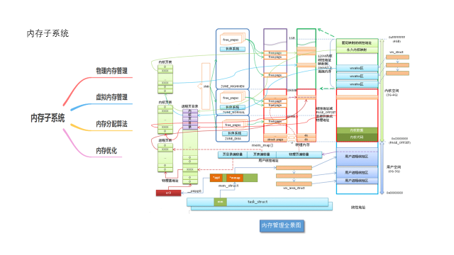
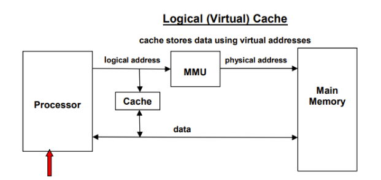
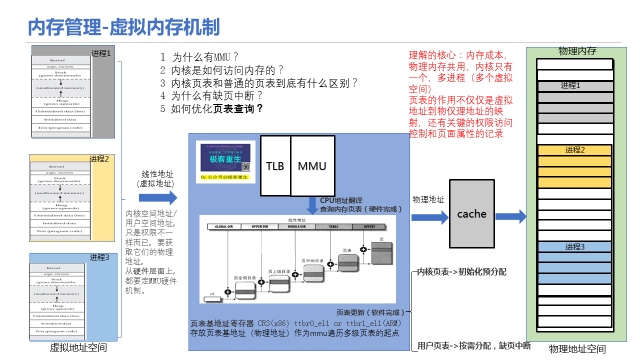
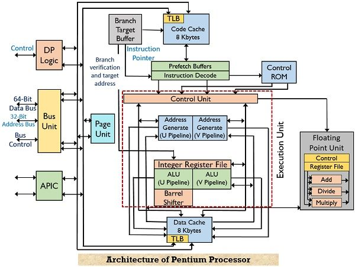
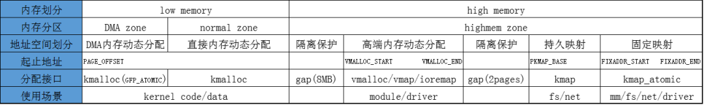
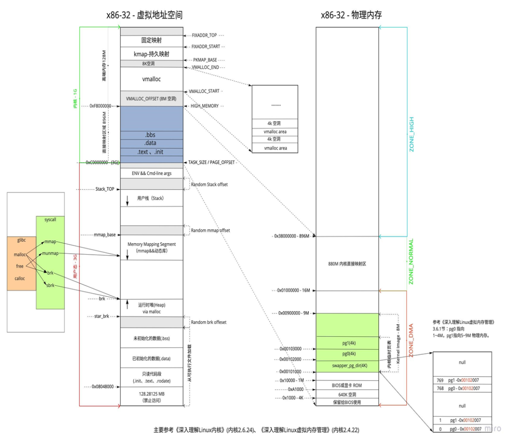
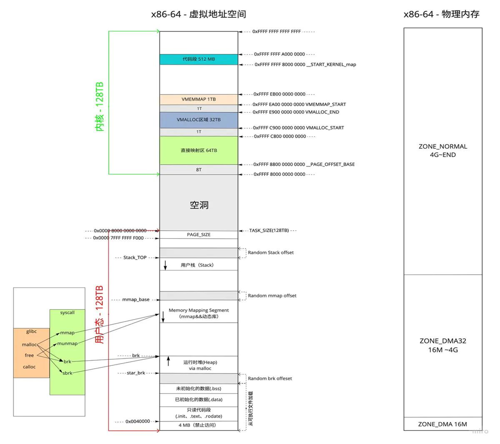
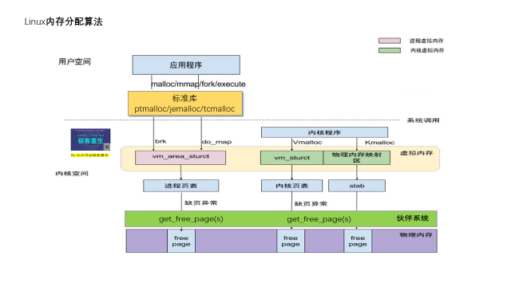
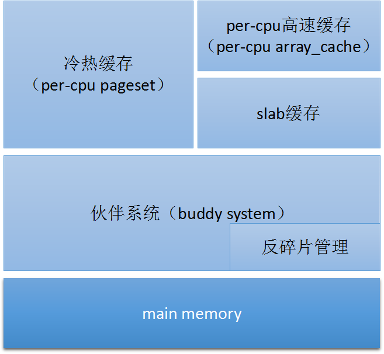
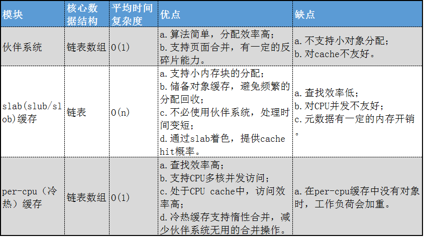

# Linux内核内存管理架构详解

内存管理子系统可能是linux内核中最为复杂的一个子系统，其支持的功能需求众多，如页面映射、页面分配、页面回收、页面交换、冷热页面、紧急页面、页面碎片管理、页面缓存、页面统计等，而且对性能也有很高的要求。本文从内存管理[硬件架构](https://so.csdn.net/so/search?q=%E7%A1%AC%E4%BB%B6%E6%9E%B6%E6%9E%84&spm=1001.2101.3001.7020)、地址空间划分和内存管理软件架构三个方面入手，尝试对内存管理的软硬件架构做一些宏观上的分析总结。

 **内存管理硬件架构**

因为内存管理是内核最为核心的一个功能，针对内存管理性能优化，除了软件优化，硬件架构也做了很多的优化设计。下图是一个目前主流处理器上的存储器层次结构设计方案。

从图中可以看出，对于逻辑cache架构读写内存，硬件设计了3条优化路径。

1）首先L1 cache支持虚拟地址寻址，保证CPU出来的虚拟地址（VA）不需要转换成物理地址（PA）就可以用来直接查找L1 cache，提高cache查找效率。当然用VA查找cache，有安全等缺陷，这需要CPU做一些特别的设计来进行弥补，具体可以阅读《计算机体系结构：量化研究方法》了解相关细节。

2）如果L1 cache没有命中，这就需要进行地址转换，把VA转换成PA。linux的内存映射管理是通过页表来实现的，但是页表是放在内存中的，如果每次地址转换过程都需要访问一次内存，其效率是十分低下的。这里CPU通过TLB硬件单元（在MMU中）来加速地址转换。

3）获得PA后，在L2 cache中再查找缓存数据。L2 cache一般比L1 cache大一个数量级，其查找命中率也更高。如果命中获得数据，则可避免去访问内存，提高访问效率。

 可见，为了优化内存访问效率，现代处理器引入多级cache、TLB等硬件模块。每个硬件模块内部还有大量的设计细节，这里不再深入，如有兴趣可以阅读《计算机体系结构：量化研究方法》等书籍进一步了解。

**内存映射空间划分**

根据不同的内存使用方式和使用场景需要，内核把内存映射地址空间划分成多个部分，每个划分空间都有自己的起止地址、分配接口和使用场景。下图是一个常见的32位地址空间划分结构。

-   **DMA内存动态分配地址空间：**
    
    一些DMA设备因为其自身寻址能力的限制，不能访问所有内存空间。如早期的ISA设备只能在24位地址空间执行DMA，即只能访问前16MB内存。所以需要划分出DMA内存动态分配空间，即DMA zone。其分配通过加上GFP\_ATOMIC控制符的kmalloc接口来申请。
    
-   **直接内存动态分配地址空间**：
    
    因为访问效率等原因，内核对内存采用简单的线性映射，但是因为32位CPU的寻址能力（4G大小）和内核地址空间起始的设置（3G开始），会导致内核的地址空间资源不足，当内存大于1GB时，就无法直接映射所有内存。无法直接映射的地址空间部分，即highmem zone。在DMA zone和highmem zone中间的区域即normal zone，主要用于内核的动态内存分配。其分配通过kmalloc接口来申请。
    
-   **高端内存动态分配地址空间：**
    
    高端内存分配的内存是虚拟地址连续而物理地址不连续的内存，一般用于内  核动态加载的模块和驱动，因为内核可能运行了很久，内存页面碎片情况严  重，如果要申请大的连续地址的内存页会比较困难，容易导致分配失败。根  据应用需要，高端内存分配提供多个接口:
    

      vmalloc：指定分配大小，page位置和虚拟地址隐式分配；

      vmap：指定page位置数组，虚拟地址隐式分配；

      ioremap：指定物理地址和大小，虚拟地址隐式分配。

-   **持久映射地址空间**：
    
    内核上下文切换会伴随着TLB刷新，这会导致性能下降。但一些使用高端内存的模块对性能也有很高要求。持久映射空间在内核上下文切换时，其TLB不刷新，所以它们映射的高端地址空间寻址效率较高。其分配通过kmap接口来申请。kmap与vmap的区别是：vmap可以映射一组page，即page不连续，但虚拟地址连续，而kmap只能映射一个page到虚拟地址空间。kmap主要用于fs、net等对高端内存访问有较高性能要求的模块中。
    
-   **固定映射地址空间：**
    
    持久映射的问题是可能会休眠，在中断上下文、自旋锁临界区等不能阻塞的场景中不可用。为了解决这个问题，内核又划分出固定映射，其接口不会休眠。固定映射空间通过kmap\_atomic接口来映射。kmap\_atomic的使用场景与kmap较为相似，主要用于mm、fs、net等对高端内存访问有较高性能要求而且不能休眠的模块中。
    

不同的CPU体系架构在地址空间划分上不尽相同，但为了保证CPU体系差异对外部模块不可见，内存地址空间的分配接口的语义是一致的。

因为64位CPU一般都不需要高端内存（当然也可以支持），在地址空间划分上与32位CPU的差异较大，下图是一个X86\_64的内核地址空间划分图:

**内存管理；软件架构**                   

内核内存管理的核心工作就是内存的分配回收管理，其内部分为2个体系：页管理和对象管理。页管理体系是一个两级的层次结构，对象管理体系是一个三级的层次结构，分配成本和操作对CPU cache和TLB的负面影响，从上而下逐渐升高。

**页管理层次结构**：由冷热缓存、伙伴系统组成的两级结构。负责内存页的缓存、分配、回收。

**对象管理层次结构**：由per-cpu高速缓存、slab缓存、伙伴系统组成的三级结构。负责对象的缓存、分配、回收。这里的对象指小于一页大小的内存块。

除了内存分配，内存释放也是按照此层次结构操作。如释放对象，先释放到per-cpu缓存，再释放到slab缓存，最后再释放到伙伴系统。

框图中有三个主要模块，即伙伴系统、slab分配器和per-cpu（冷热）缓存。他们的对比分析如下。

## 参考

[Linux内核内存管理架构详解_linux 储运内核-CSDN博客](https://blog.csdn.net/huanxiajioabu/article/details/136477862?ops_request_misc=&request_id=&biz_id=102&utm_term=详解Linux内核内存管理架构&utm_medium=distribute.pc_search_result.none-task-blog-2~all~sobaiduweb~default-0-136477862.142^v100^pc_search_result_base5&spm=1018.2226.3001.4187)