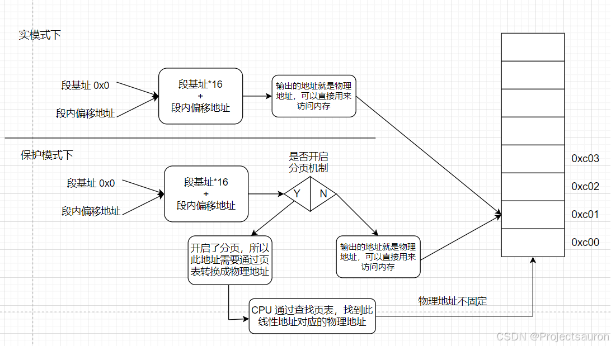
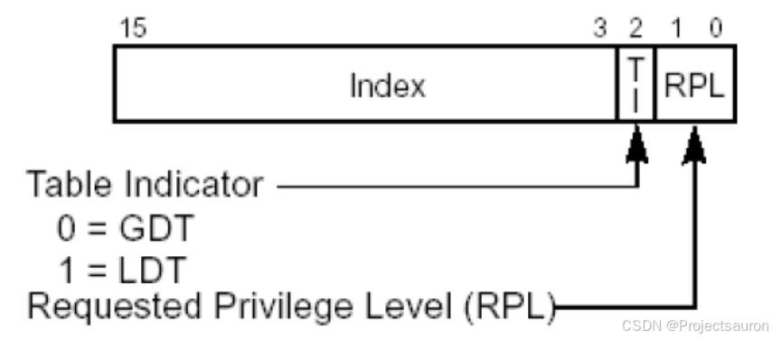
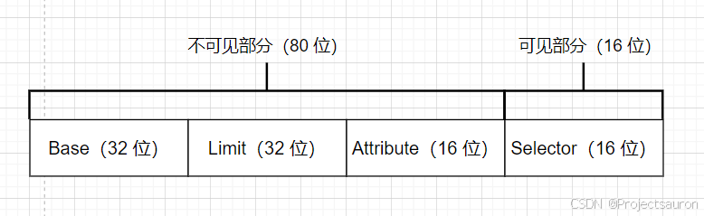
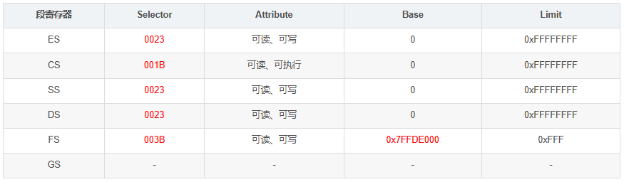
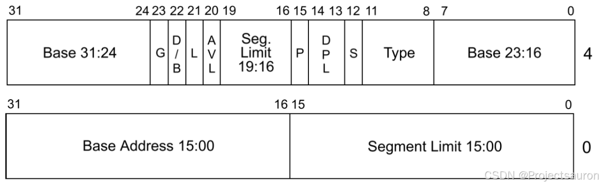
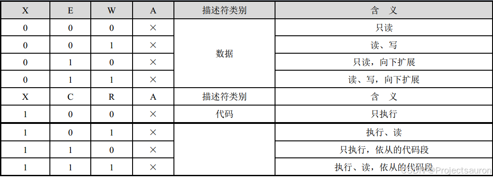
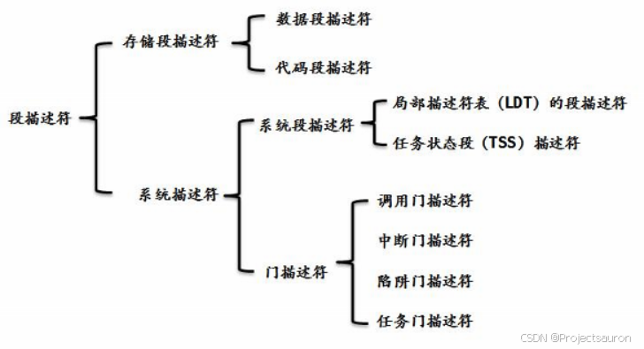
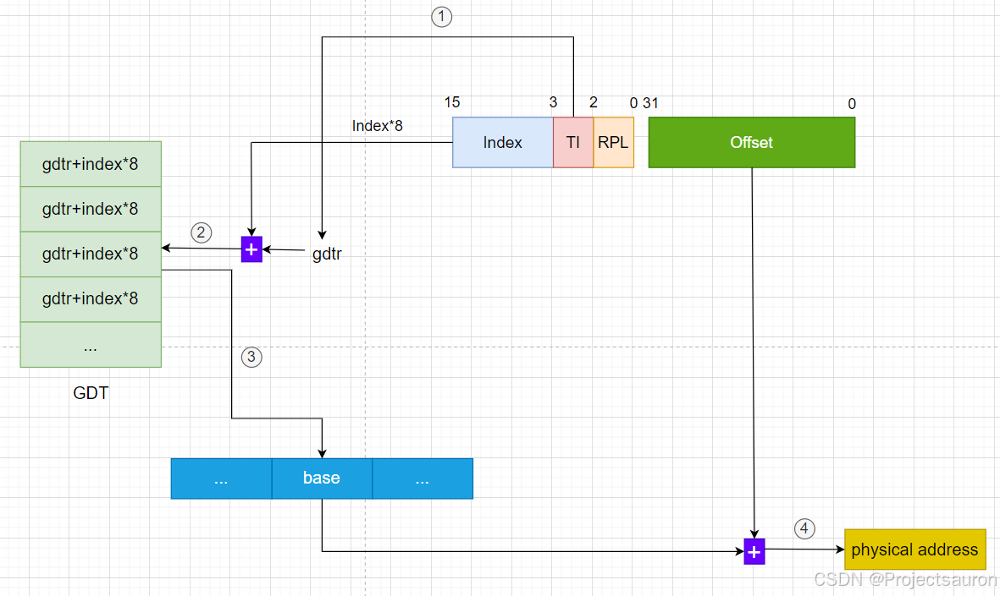
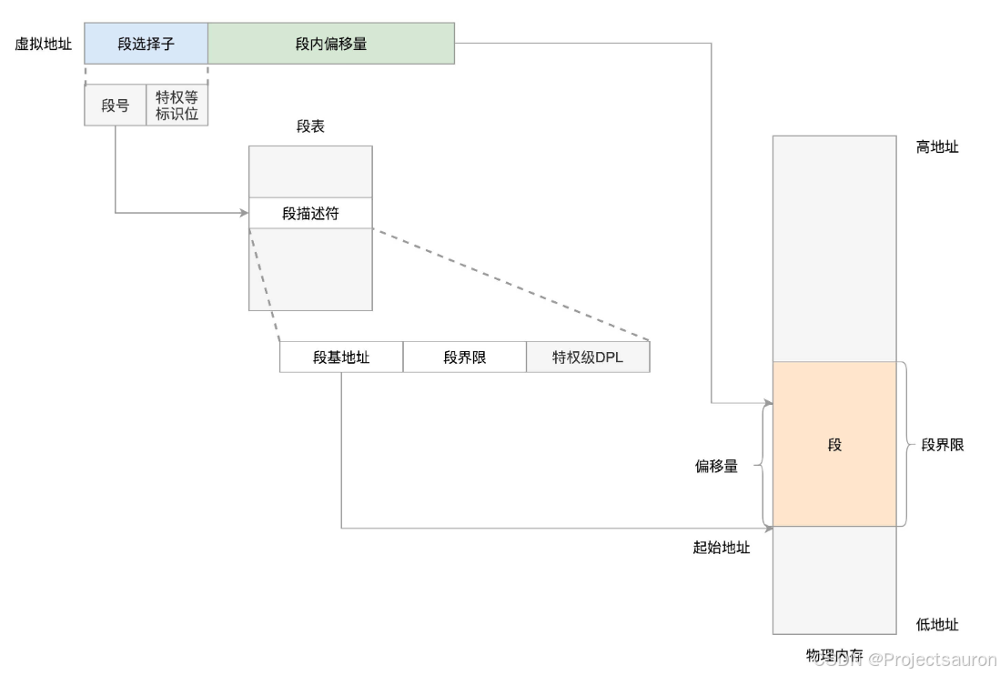
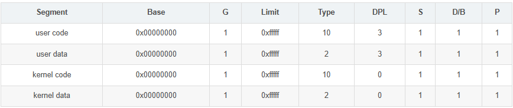

# Linux 内存管理（一）之分段机制

#### 目录

-   [前言](https://blog.csdn.net/Teminator_/article/details/140531630#_4)
-   [一、内存地址](https://blog.csdn.net/Teminator_/article/details/140531630#_12)
-   -   [1、逻辑地址（logical address）](https://blog.csdn.net/Teminator_/article/details/140531630#1logical_address_14)
    -   [2、线性地址（linear address）](https://blog.csdn.net/Teminator_/article/details/140531630#2linear_address_20)
    -   [3、 物理地址（physical address）](https://blog.csdn.net/Teminator_/article/details/140531630#3_physical_address_31)
    -   [4、三者间的关系](https://blog.csdn.net/Teminator_/article/details/140531630#4_35)
-   [二、硬件中的分段](https://blog.csdn.net/Teminator_/article/details/140531630#_41)
-   -   [1、段选择符和段寄存器](https://blog.csdn.net/Teminator_/article/details/140531630#1_43)
    -   -   [1.1 段选择符](https://blog.csdn.net/Teminator_/article/details/140531630#11__45)
        -   [1.2 段寄存器](https://blog.csdn.net/Teminator_/article/details/140531630#12__56)
    -   [2、段描述符](https://blog.csdn.net/Teminator_/article/details/140531630#2_84)
    -   -   [2.1 快速访问段描述符](https://blog.csdn.net/Teminator_/article/details/140531630#21__123)
-   [三、Linux 中的分段](https://blog.csdn.net/Teminator_/article/details/140531630#Linux__139)
-   [四、总结](https://blog.csdn.net/Teminator_/article/details/140531630#_165)

* * *

## 前言

Linux操作系统采用了分段机制来实现进程的内存管理。分段允许进程以逻辑上连续的方式访问内存，而无需将整个进程存储在连续的物理内存地址上。

本文将介绍 Linux 的分段机制，包括分段的基本概念、分段表的组织方式和进程访问内存的原理。我们还将讨论 Linux 中的段选择子和段描述符，以及如何使用它们来管理进程的内存空间。

* * *

## 一、内存地址

### 1、逻辑地址（logical address）

逻辑地址是由程序生成的地址。在程序运行时，每个程序都会有自己的逻辑地址空间。逻辑地址是相对于程序自身的地址，程序可以使用逻辑地址来访问自己的数据和代码。

每一个逻辑地址都由一个段（_segment_）和偏移量（_offset_）组成，偏移量指明了从段开始的地方到实际地址之间的距离。

### 2、线性地址（linear address）

线性地址是操作系统对逻辑地址进行转换后得到的地址，也可以叫做虚拟地址（_virtual address_）。是一个 32 位无符号整数，可以用来表示高达 4294967296 4294967296 4294967296（4GB）个内存单元。线性地址通常用十六机制数字表示，值的范围从 0 x 00000000 0x00000000 0x00000000 到 0 x f f f f f f f f 0xffffffff 0xffffffff。

线性地址的值等于`段基址+段内偏移地址`。不过，在 CPU 的实模式（_Real Mode_）和保护模式（_Protected Mode_）下又有所不同：

-   在实模式下，其值经过段部件的处理，直接输出的就是物理地址，CPU 可以直接用此地址访问内存。
-   而在保护模式下，上述中的段基址就不再是真正的地址，而是一个称为段选择子的东西。通过段选择子便能在 GDT 中找到相应的段描述符，这样便得到了段基址。
    -   若没有开启分页功能，此线性地址就被当作物理地址来用，可直接访问内存。
    -   若开启了分页功能，线性地址则还要经过 CPU 页部件转换成具体的物理地址，这样 CPU 才能将其送上地址总线去访问内存。

### 3、 物理地址（physical address）

物理地址是真正的硬件地址，是实际的内存地址。用于内存芯片级内存单元寻址。它们从微处理器的地址引脚发送到内存总线上的电信号相对应。物理地址由 32 位或 36 位无符号整数表示。

### 4、三者间的关系

## 二、硬件中的分段

### 1、段选择符和段寄存器

#### 1.1 段选择符

一个逻辑地址由两部分组成：一个段标识符和一个指定段内相对地址的偏移量，前面已经介绍过。段标识符是一个 16 位长的字段，称为段选择符（_Segment Selector_），偏移量是一个 32 位长的字段。

  
其各个字段的含义如下：

-   **Index**：索引号，指定了放在 GDT 或 LDT 中的相应段描述符的入口。处理器将索引号乘以 8 （这里乘以 8 是因为一个段描述符是 8 字节长）在加上 GDT 或者 LDT 的基地址，就是要加载的段描述符。
-   **TI**：_Table Indicator_ 标志，指明段选择符是在 GDT （TI=0）中还是在 LDT 中（TI=1）。
-   **RPL**：请求特权级：当相应的段选择符装入到 cs 寄存器中时，指示出 CPU 当前的特权级；它还可以用与在访问数据段时有选择地削弱处理器的特权级。

#### 1.2 段寄存器

段寄存器的目的是存放段选择符。有 6 个段寄存器：cs，ss，ds，es，fs 和 gs，程序可以把同一个段寄存器用于不同的目的，方法是先将其值保存在内存中，用完再恢复。

其中，3 个寄存器有专门的用途：

-   **cs**：代码段寄存器，指向程序指令的段。
-   **ss**：栈段寄存器，指向包含当前程序栈的段。
-   **ds**：数据段寄存器，指向包含静态数据或者全局数据段。

其他 3 个段寄存器用作一般用途，可以指向任意的数据段。

`红色数据在不同环境下，数值可能不一样。`

> 读一个段寄存器只读 16 位，写一个段寄存器写 96 位。  
>
>
> 例如 `mov dword ptr ds:[0x123456], eax`，其实我们真正读写的地址是：`ds.base + 0x123456`。并不是 0x123456，不过正好的是 ds 段寄存器的基址是 0 而已。

### 2、段描述符

每个段由一个 8 字节的描述符（_Segment Descriptor_）表示，它描述了段的特征。段描述符放在全局描述符表（_Global Descriptor Table_，_GDT_）或局部描述符表（_Local Descriptor Table_，_LDT_）中。

  
下面是各个字段的含义：

-   **Base**：包含段的首字节的线性地址。
-   **G**：粒度标志：如果该位清 0，则段大小以字节为单位，否则以 4096 字节的倍数计。
-   **D/B**：取决于是代码段还是数据段。D/B 的含义在两种情况下稍微有所区别，但是如果段偏移量的地址是 32 位长，就基本上把它置为 1，如果这个偏移量是 16 位长，它被清 0。
-   **L**：64 位代码段标志，保留此位给 64 位处理器使用。目前，我们将此位置“0”即可。
-   **AVL**：可以由操作系统使用，但是被 Linux 忽略。
-   **P**：_Segment-Present_ 标志：等于 0 表示段当前不在主存中。Linux 总是把这个标志(第 47 位)设为 1，因为它从来不把整个段交换到磁盘上去。
    -   如果代码段描述符的 D 位是 0，那么，当处理器在这个段上执行时，将使用 16位的指令指针寄存器 IP 来取指令，否则使用 32 位的 EIP。
-   **DPL**：描述符特权级(_Descriptor Privilege Level_)：用于限制对这个段的存取。它表示为访问这个段而要求的CPU最小的优先级。
-   **S**：系统标志：如果它被清 0，则这是一个系统段，存储诸如 LDT 这种关键的数据结构，否则它是一个普通的代码段或数据段。
-   **Limit**：存放段中最后一个内存单元的偏移量，从而决定段的长度。如果 G 被置为 0，则一个段的大小在 1 个字节到 1MB 之间变化;否则，将在 4KB 到 4GB 之间变化。

* * *

-   **Type**：描述了段的类型特征和它的存取权限。

对于数据段来说， 这 4 位分别是 `X、 E、 W、 A` 位；而对于代码段来说，这 4 位则分别是 `X、 C、 R、 A` 位。如下：

-   **X**：表示是否可以执行（ Executable）。
    -   数据段总是不可执行的，X＝0；
    -   代码段总是可以执行的，X＝1。
-   **W**：指示段的读写属性，或者说段是否可写：
    -   W＝0 的段是不允许写入的，否则会引发处理器异常中断；
    -   W＝1 的段是可以正常写入的。
-   **A**：是已访问位，用于指示它所指向的段最近是否被访问过。在描述符创建的时候，应该清零。之后，每当该段被访问时，处理器自动将该位置“1”。
-   **E**：指示段的扩展方向。
    -   E＝0 是向上扩展的，也就是向高地址方向扩展的，是普通的数据段；
    -   E＝1 是向下扩展的，也就是向低地址方向扩展的，通常是堆栈段。
-   **C**：指示段是否为特权级依从的（ Conforming）。
    -   C＝0 表示非依从的代码段，这样的代码段可以从与它特权级相同的代码段调用，或者通过门调用；
    -   C＝1 表示允许从低特权级的程序转移到该段执行。

* * *

#### 2.1 快速访问段描述符

为了加速逻辑地址到线性地址的转换，80x86 处理器提供了一种附加的非编程的寄存器（不能被程序员所设置的寄存器）供六个可编程的段寄存器使用。每一个非编程的寄存器含有 8 个字节的段描述符，由相应的段寄存器中的段选择符来指定。

每当一个段选择符被装入段寄存器时，相应的段描述符就由内存装入到对应的非编程寄存器。从这时起，针对那个段的逻辑地址转换就可以不访问主存中的 GDT 或 LDT，处理器只需直接引用存放段描述符的 CPU 非编程寄存器即可。当且仅当，段寄存器中的段选择符改变时，才有必要访问 GDT 或 LDT。

  

下面来看一下，如果使用分段机制，怎么使虚拟地址空间转到对应的物理地址空间。转换过程如下图所示：  

1.  首先根据段选择符中的 TI 字段判断段描述符在 GDT 还是 LDT 中（这里以 GDT 为例，即 TI=0）。
2.  然后将段选择符中的 Index\*8 与 gdtr 相加，得到对应段描述符在 GDT 中的位置。
3.  然后根据得到的段描述符中的 Base 字段加上段内偏移地址，最终得到物理地址。

> 有关 GDT 的内容会在下一节进行介绍：[Linux 内存管理（二）之GDT与LDT](https://blog.csdn.net/Teminator_/article/details/140520464)。

## 三、Linux 中的分段

最开始的时候，操作系统不支持分段，内存的换入换出都是以整个进程的内存空间为单位，导致系统非常的耗时，同时利用率也不高，当内存不足，很容易导致内存交换失败。后来有了分段技术，把内存空间分成多个模块：代码段、数据段，或者是一个大的数据块，段成了内存交换的单位，在一定程度上增加了内存利用率。那时候还没有分页技术，虚拟地址（线性地址）是直接映射到物理空间的。

引入分页机制后，目前 2.6 版的 Linux 只有在 80x86 结构下才需要使用分段。分段和分页在某些方面是冗余的，因为它们都可以把物理地址空间分割成不同部分：分段给每个进程分配不同的逻辑地址空间，而分页可以把相同的逻辑地址空间映射到不同的物理地址上。因此，Linux优先采用了分页（分页操作系统），基于以下原因：

-   内存管理更简单：所有进程使用相同段寄存器值，也就是相同的线性地址集。
-   出于兼容大部分硬件架构的考虑，RISC架构对分段支持的不是很好。

那么 Linux 内核是怎么支持分段机制的呢？原理和上节相同：  
  下面是四个主要的 Linux 段的段描述符字段的值：

> 注意，与段相关的线性地址从 0 开始，达到 2 32 − 1 2^{32}-1 232−1 的寻址限长。这就意味着在用户态或内核态下的所有进程可以使用相同的逻辑地址。

相应的段选择符由宏 `__USER_CS`、`__USER_DS`、`__KERNEL_CS` 和 `__KERNEL_DS` 分别定义。例如，为了对内核代码段寻址，内核只需要把 `__KERNEL_CS` 宏产生的值装进 cs 段寄存器即可。

所有段都从 0 x 00000000 0x00000000 0x00000000 开始，这可以得出另一个重要结论，那就是`在 Linux 下逻辑地址与线性地址是一致的`，即逻辑地址的偏移量字段的值与相应的线性地址的值总是一致的。

## 四、总结

现在大致了解了分段的基本原理，系统运行时，地址空间中不同段被重定位到物理内存中，与之前的整个物理地址空间中只有一个基地址＋偏移量的方式相比，大量的节省了物理内存。同时分段管理就是将一个程序按照逻辑单元分成多个程序段，每一个段使用自己单独的虚拟地址空间。

但是，由于使用分段机制，内存会被分成多个不同大小的段，这可能导致内存碎片化。碎片化会降低内存的利用效率，同时也会增加内存的管理难度。而且由于不同段的地址空间不同，数据共享需要额外的处理和管理机制。这可能导致额外的开销和复杂性。

为了解决分段机制的一些局限性，如上述的地址空间碎片化和数据共享的复杂性，Linux 在 2.4 版本中引入了分页机制，后面的章节我们会接着讨论。

## 参考

[Linux 内存管理（一）之分段机制_linux 分段-CSDN博客](https://blog.csdn.net/Teminator_/article/details/140531630)