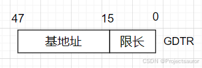
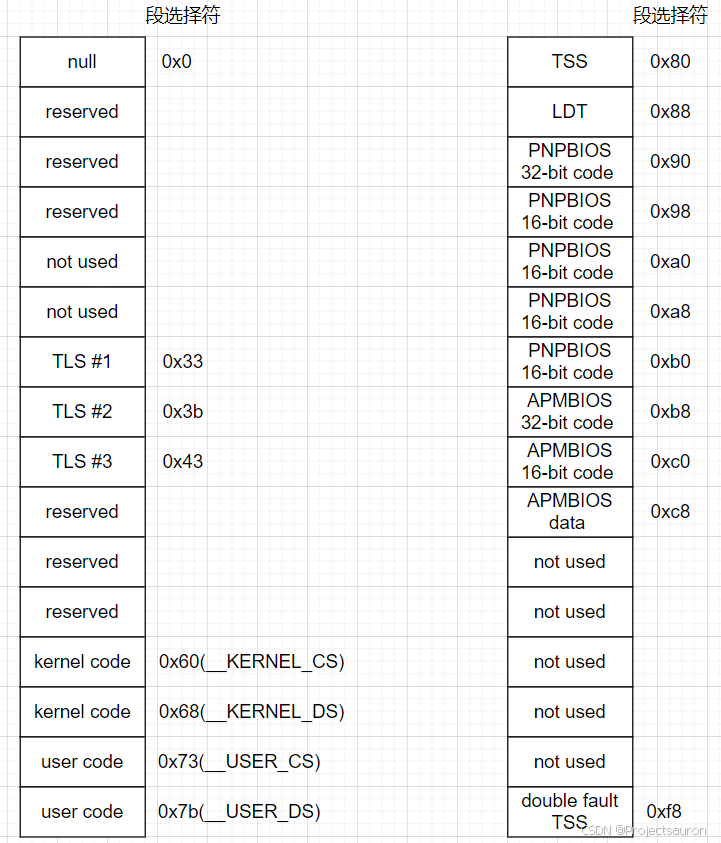
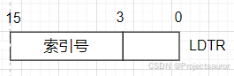
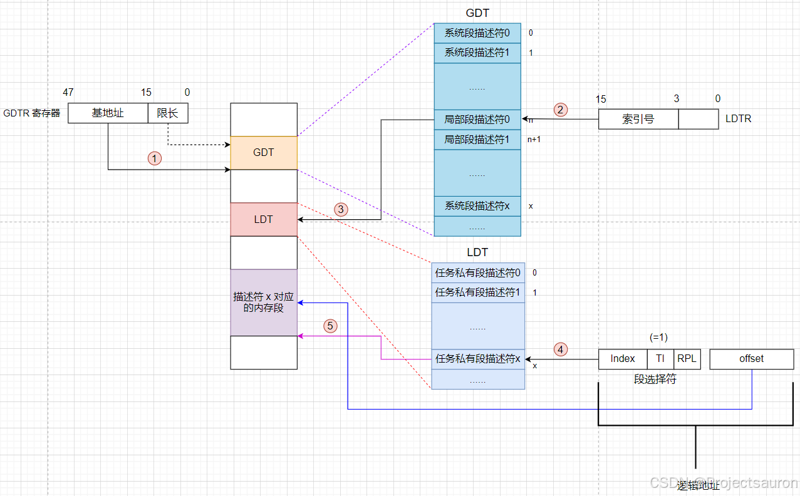
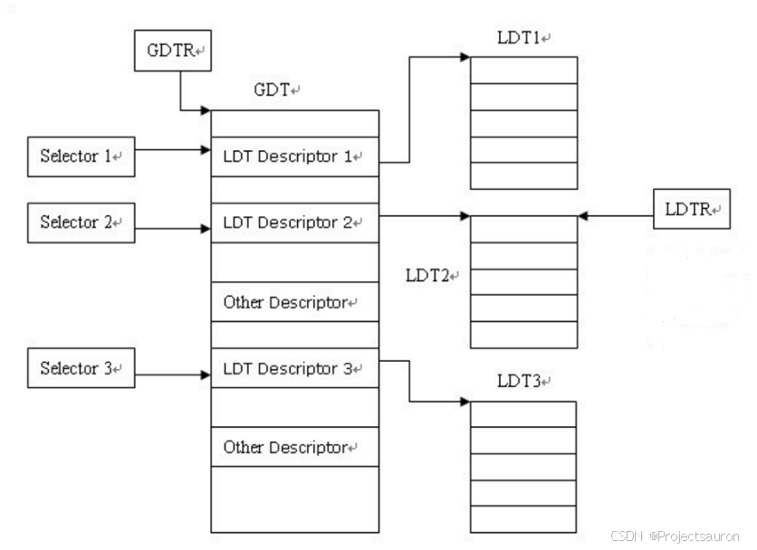

# Linux 内存管理（二）之GDT与LDT

#### 目录

-   [前言](https://blog.csdn.net/Teminator_/article/details/140520464#_4)
-   [一、GDT](https://blog.csdn.net/Teminator_/article/details/140520464#GDT_8)
-   -   [1、什么是 GDT](https://blog.csdn.net/Teminator_/article/details/140520464#1_GDT_10)
    -   [2、GDT 的作用](https://blog.csdn.net/Teminator_/article/details/140520464#2GDT__20)
    -   [3、GDT 的结构](https://blog.csdn.net/Teminator_/article/details/140520464#3GDT__23)
    -   [4、基于 GDT 的内存寻址](https://blog.csdn.net/Teminator_/article/details/140520464#4_GDT__108)
-   [二、LDT](https://blog.csdn.net/Teminator_/article/details/140520464#LDT_112)
-   -   [1、什么是 LDT](https://blog.csdn.net/Teminator_/article/details/140520464#1_LDT_114)
    -   [2、LDT 的作用](https://blog.csdn.net/Teminator_/article/details/140520464#2LDT__127)
    -   [3、基于 LDT 的内存寻址](https://blog.csdn.net/Teminator_/article/details/140520464#3_LDT__135)
-   [三、总结](https://blog.csdn.net/Teminator_/article/details/140520464#_145)

* * *

## 前言

在 Linux 系统中，GDT（_Global Descriptor Table_）和 LDT（_Local Descriptor Table_）是用来管理和定义内存段（_segment_）的[数据结构](https://so.csdn.net/so/search?q=%E6%95%B0%E6%8D%AE%E7%BB%93%E6%9E%84&spm=1001.2101.3001.7020)。它们是在 x86 架构下操作系统使用的关键概念，用于实现内存保护和虚拟内存管理。

## 一、GDT

### 1、什么是 GDT

全局描述符表（_Global Descriptor Table_，_GDT_）。在单处理器系统中只有一个 GDT，而在多处理器系统中每个 CPU 对应一个 GDT。

GDT 可以放置在内存的任何位置。当程序员通过段寄存器引用一个段描述符时，CPU 必须知道 GDT 的入口地址，即基地址放在何处。为此，Intel 的设计者提供了一个 GDTR 寄存器，用于存放GDT的基地址。程序员将 GDT 设定在内存的某个位置后，可以通过 LGDT 指令将 GDT 的基地址加载到 GDTR 寄存器中。从此，CPU 便根据 GDTR 寄存器中的内容作为 GDT 的入口来访问 GDT。

GDTR 寄存器长度为 6 字节，前两个字节为 GDT 界限，后 4 个字节为 GDT 表的基地址。所以说，GDT 最多只能拥有 8192 个描述符（ 65536 / 8 65536 / 8 65536/8）。

### 2、GDT 的作用

GDT 是用来管理和定义操作系统中所有内存段的数据结构。在操作系统加载时，会初始化 GDT，然后使用 GDT 中的描述符来设置每个段的基地址、段限长和访问权限等信息。这些描述符将用于处理内存分页、保护模式和特权级等操作。

### 3、GDT 的结构

所有的 GDT 都存放在 `cpu_gdt_table` 数组中，而所有 GDT 的地址和它们的大小（当初始化 gdtr 寄存器时使用）被存放在 `cpu_gdt_descr` 数组中。这两个数组都在文件 `arch/i386/kernel/head.S` 中，如下：

    cpu_gdt_descr:
    	.word GDT_ENTRIES*8-1
    	.long cpu_gdt_table
    
    ......
    
    ENTRY(cpu_gdt_table)
    	.quad 0x0000000000000000	/* NULL descriptor */
    	.quad 0x0000000000000000	/* 0x0b reserved */
    	.quad 0x0000000000000000	/* 0x13 reserved */
    	.quad 0x0000000000000000	/* 0x1b reserved */
    	.quad 0x0000000000000000	/* 0x20 unused */
    	.quad 0x0000000000000000	/* 0x28 unused */
    	.quad 0x0000000000000000	/* 0x33 TLS entry 1 */
    	.quad 0x0000000000000000	/* 0x3b TLS entry 2 */
    	.quad 0x0000000000000000	/* 0x43 TLS entry 3 */
    	.quad 0x0000000000000000	/* 0x4b reserved */
    	.quad 0x0000000000000000	/* 0x53 reserved */
    	.quad 0x0000000000000000	/* 0x5b reserved */
    
    	.quad 0x00cf9a000000ffff	/* 0x60 kernel 4GB code at 0x00000000 */
    	.quad 0x00cf92000000ffff	/* 0x68 kernel 4GB data at 0x00000000 */
    	.quad 0x00cffa000000ffff	/* 0x73 user 4GB code at 0x00000000 */
    	.quad 0x00cff2000000ffff	/* 0x7b user 4GB data at 0x00000000 */
    
    	.quad 0x0000000000000000	/* 0x80 TSS descriptor */
    	.quad 0x0000000000000000	/* 0x88 LDT descriptor */
    
    	/* Segments used for calling PnP BIOS */
    	.quad 0x00c09a0000000000	/* 0x90 32-bit code */
    	.quad 0x00809a0000000000	/* 0x98 16-bit code */
    	.quad 0x0080920000000000	/* 0xa0 16-bit data */
    	.quad 0x0080920000000000	/* 0xa8 16-bit data */
    	.quad 0x0080920000000000	/* 0xb0 16-bit data */
    	/*
    	 * The APM segments have byte granularity and their bases
    	 * and limits are set at run time.
    	 */
    	.quad 0x00409a0000000000	/* 0xb8 APM CS    code */
    	.quad 0x00009a0000000000	/* 0xc0 APM CS 16 code (16 bit) */
    	.quad 0x0040920000000000	/* 0xc8 APM DS    data */
    
    	.quad 0x0000000000000000	/* 0xd0 - unused */
    	.quad 0x0000000000000000	/* 0xd8 - unused */
    	.quad 0x0000000000000000	/* 0xe0 - unused */
    	.quad 0x0000000000000000	/* 0xe8 - unused */
    	.quad 0x0000000000000000	/* 0xf0 - unused */
    	.quad 0x0000000000000000	/* 0xf8 - GDT entry 31: double-fault TSS */

如下是 GDT 的布局示意图。每个 GDT 包含 18 个段描述符和 14 空的，未使用的，或保留的项。

> 插入未使用的项的目的是为了使经常一起访问的描述符能够处于同一个 32 字节的硬件高速缓存行中。

每一个 GDT 中包含的 18 个段描述符指向下列的段：

-   **null**：在初始化 GDT 时，为了方便计算，将第一项设置为空。这样，在访问段选择子时，如果选择子的值为 0，就会指向 null 描述符。操作系统就可以通过检查是否为 null 描述符来判断是否存在错误。此外，null 描述符也可以用作默认的段选择子，以确保在初始化之前没有正确的段选择子被使用。
-   3 个局部线程存储(_Thread-Local Storage_，_TLS_)段：这种机制允许多线程应用程序使用最多 3 个局部于线程的数据段（一块独立于线程的内存空间），每个线程可以在自己的内存空间中访问和修改自己的数据，而不会影响其他线程的数据。系统调用 `set_thread area()` 和 `get thread area()` 分别为正在执行的进程创建和撤消一个 TLS 段。
-   用户态和内核态下的代码段和数据段共四个。（见：[Linux 内存管理（一）之分段机制](https://blog.csdn.net/Teminator_/article/details/140531630)）
-   任务状态段（**TSS**，_Task State Segment_）：TSS 中保存着任务的寄存器状态、栈指针等信息，当操作系统进行任务切换时，会将当前任务的寄存器状态保存到当前任务的 TSS 中，然后加载下一个任务的 TSS，恢复其寄存器状态，从而实现任务的切换。
-   与支持即插即用(**PnP**)功能的 BIOS 服务程序相关的 5 个段:在前一种情况下，就像前述与AMP相关的3个段的情况一样，由于BIOS例程使用段，所以当Linux的PnP设备驱动程序调用BIOS函数来检测PnP设备使用的资源时，就可以使用自定义的代码段和数据段。

> _PnP_ （_Plug and Play_ ，即插即用），旨在使设备的安装和配置过程更加自动化和简化。Plug and Play 技术允许设备在被连接到计算机后，自动被识别并配置，而无需手动进行繁琐的设置和安装步骤。

-   与高级电源管理(**AMP**)相关的 3 个段:由于 BIOS 代码使用段，所以当 Linux APM 驱动程序调用 BIOS 函数来获取或者设置 APM 设备的状态时，就可以使用自定义的代码段和数据段。

> _AMP_（_Active Management Technology_） 是一种由 Intel 提供的远程管理和监控技术，它允许管理员通过网络远程控制和管理计算机，无需操作系统的支持。AMP 段提供了与 Active Management Technology 相关的功能和接口。

-   **double fault TSS**：被内核用来处理“双重错误"异常的特殊 TSS 段。（处理一个异常时可能会引发另一个异常，在这种情况下产生双重错误。）

  

如前所述，系统中每个处理器都有一个 GDT 副本。除少数几种情况以外，所有 GDT 的副本都存放相同的表项，比如：

1.  首先，每个处理器都有它自己的 TSS 段，因此其对应的 GDT 项不同。
2.  其次，GDT 中只有少数项可能依赖于 CPU 正在执行的进程（LDT 和 TLS 段描述符）。
3.  最后，在某些情况下，处理器可能临时修改 GDT 副本里的某个项，例如，当调用 APM 的 BIOS 例程时就会发生这种情况。

### 4、基于 GDT 的内存寻址

该部分在前面已经比较详细地介绍了，可以看：[Linux 内存管理（一）之分段机制](https://blog.csdn.net/Teminator_/article/details/140531630)。

## 二、LDT

### 1、什么是 LDT

局部描述符表（_Local Descriptor Table_，_LDT_）和前面提到的 LDT 类似，不过有以下区别：

1.  GDT 是全局的，为整个系统定义了全局的段描述符。它包含了系统中所有进程和线程所使用的公共段描述符；LDT 是进程本地的，为每个进程定义了私有的段描述符。
2.  LDT 表存放在 LDT 类型的段之中，此时 GDT 必须含有 LDT 的段描述符。
3.  LDT 本身是一个段，而 GDT 是线性地址空间的一个数据结构。

查找 GDT 在线性地址中的基地址，需要借助 GDTR；而查找 LDT 相应基地址，需要的是 GDT 中的段描述符。访问 LDT 需要使用段选择符，为了减少访问 LDT 时候的段转换次数，LDT 的段选择符，段基址，段限长都要放在 LDTR 寄存器之中。  

注意，此时 LDTR 高 13 位存放的是对应 LDT 段描述符在 GDT 中的索引号。

### 2、LDT 的作用

LDT 的作用是实现进程的虚拟内存隔离和保护。每个进程都可以拥有自己的 LDT，并且通过任务状态段来引用和切换不同的 LDT。

通过 LDT，每个进程可以定义自己的代码段、数据段、堆栈段等。这样，不同进程之间的内存可以隔离开来，一个进程无法直接访问其他进程的内存。

大多数用户态下的 Linux 程序不使用局部描述符表，这样内核就定义了一个缺省的 LDT 供大多数进程共享。缺省的局部描述符表存放在 `default_ldt` 数组中。它包含 5 个项但内核仅仅有效地使用了其中的两个项：用于 **iBCS** 执行文件的调用门和 **Solaris/x86** 可执行文件的调用门。（调用门是 80x86 微处理器提供的一种机制，用于在调用预定义函数时改变 CPU 的特权级。）

### 3、基于 LDT 的内存寻址

1.  首先从 GDTR 寄存器中获取 GDT 的基址。
2.  然后从 LDTR 寄存器中获取对应 LDT 段描述符在 GDT 中的索引号。
3.  从上一步得到的 LDT 段描述符得到 LDT 段基址。
4.  用段选择符高 13 位位置索引值（注意要乘以8）从 LDT 段中得到段描述符。
5.  段描述符符包含段的基址、限长、优先级等各种属性，这就得到了段基址，再加上偏移地址得到最后的线性地址。

## 三、总结

GDT 和 LDT 的结构关系如下：  
  
对于操作系统来说，每个系统必须定义一个 GDT，用于系统中的所有任务和程序。可选择性定义若干个 LDT。GDT 本身不是一个段，而是线性地址空间的一个数据结构；GDT 的线性基地址和长度必须加载进 GDTR 之中。因为每个描述符长度是 8，所以 GDT 的基地址最好进行 8 字节对齐。

然而，随着技术的发展，现代操作系统更倾向于使用页表和虚拟内存管理来实现进程的隔离和保护。当然理解 GDT 和 LDT 可以帮助我们更深入了解操作系统的底层机制。这些内容将在后面继续讨论。

## 参考

[Linux 内存管理（二）之GDT与LDT_gdt和ldt-CSDN博客](https://blog.csdn.net/Teminator_/article/details/140520464)