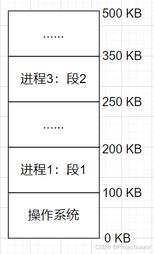
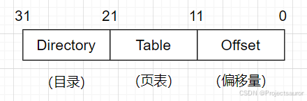
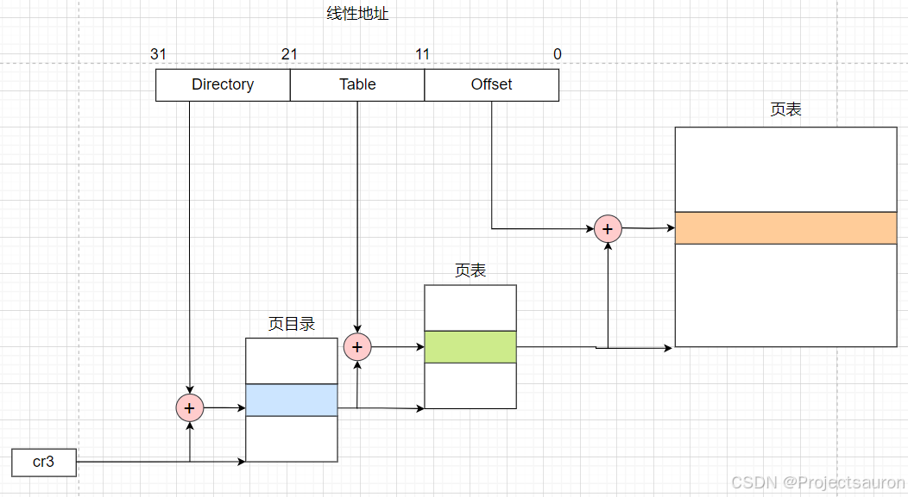
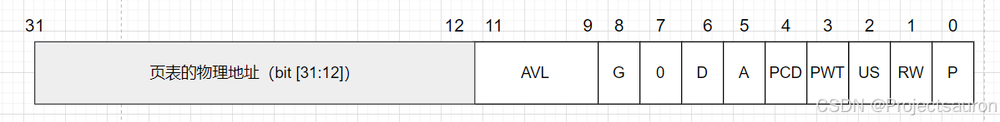
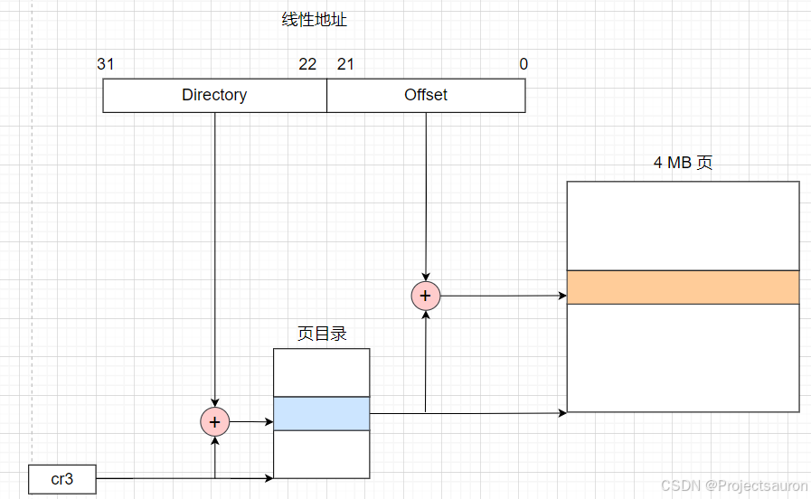
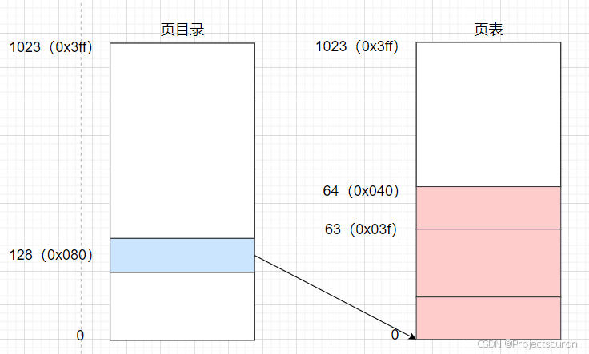
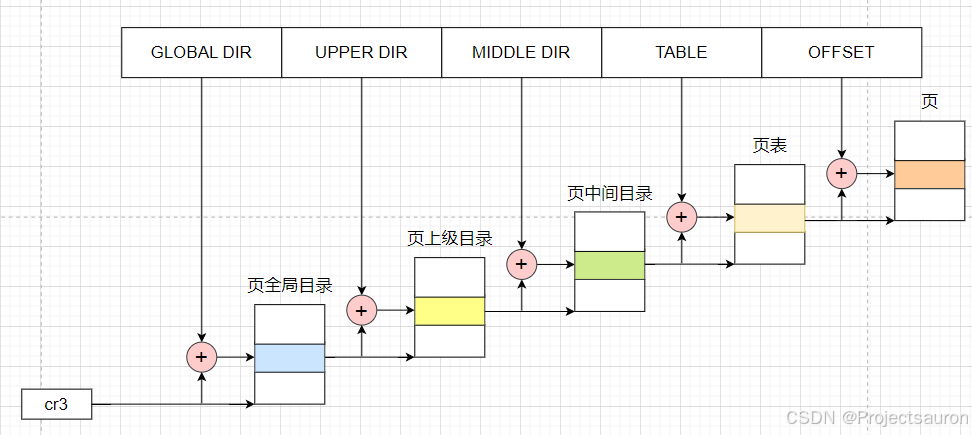
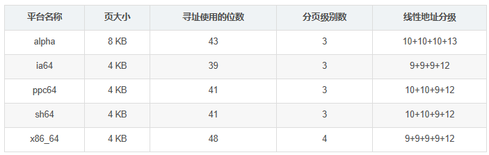
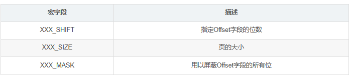

# Linux 内存管理（三）之分页机制

#### 目录

-   [前言](https://blog.csdn.net/Teminator_/article/details/140571528#_4)
-   [一、分页机制的由来](https://blog.csdn.net/Teminator_/article/details/140571528#_13)
-   -   [1、内存碎片](https://blog.csdn.net/Teminator_/article/details/140571528#1_15)
    -   [2、解决方案](https://blog.csdn.net/Teminator_/article/details/140571528#2_27)
-   [二、硬件中的分页](https://blog.csdn.net/Teminator_/article/details/140571528#_35)
-   -   [1、常规分页](https://blog.csdn.net/Teminator_/article/details/140571528#1_48)
    -   [2、页目录项和页表项](https://blog.csdn.net/Teminator_/article/details/140571528#2_67)
    -   [3、扩展分页](https://blog.csdn.net/Teminator_/article/details/140571528#3_94)
    -   [4、常规分页举例](https://blog.csdn.net/Teminator_/article/details/140571528#4_103)
-   [三、Linux 中的分页](https://blog.csdn.net/Teminator_/article/details/140571528#Linux__121)
-   -   [1、四级分页模型](https://blog.csdn.net/Teminator_/article/details/140571528#1_123)
    -   [2、软件定义](https://blog.csdn.net/Teminator_/article/details/140571528#2_147)
    -   -   [2.1 页表类型定义](https://blog.csdn.net/Teminator_/article/details/140571528#21__149)
        -   [2.2 页表描述宏](https://blog.csdn.net/Teminator_/article/details/140571528#22__291)
        -   [2.3 页表处理函数](https://blog.csdn.net/Teminator_/article/details/140571528#23__305)
        -   -   [2.3.1 查询页表项中任意一个标志的当前值](https://blog.csdn.net/Teminator_/article/details/140571528#231__313)
            -   [2.3.2 设置页表项中各标志的值](https://blog.csdn.net/Teminator_/article/details/140571528#232__323)
            -   [2.3.3 对页表项操作的宏](https://blog.csdn.net/Teminator_/article/details/140571528#233__342)

* * *

## 前言

在早期的操作系统中，分段机制被广泛采用，但随着技术的发展，[分页机制](https://so.csdn.net/so/search?q=%E5%88%86%E9%A1%B5%E6%9C%BA%E5%88%B6&spm=1001.2101.3001.7020)逐渐成为主流选择。接下来，我们将深入探讨分页机制的原理、工作方式以及与其他内存管理机制的比较。

> 分段机制部分的内容可以看：[Linux 内存管理（一）之分段机制](https://blog.csdn.net/Teminator_/article/details/140531630)。

> 本文涉及到的 cr0、cr2、cr3、cr4 这四个控制寄存器可以参考：[x86/x86\_64 下的 CPU 控制寄存器](https://blog.csdn.net/Teminator_/article/details/140577443)

> 本文还提及了 PAE（物理地址扩展），可以参考 [Linux 内存管理（四）之物理地址扩展（PAE）](https://blog.csdn.net/Teminator_/article/details/140590498)。

## 一、分页机制的由来

### 1、内存碎片

内存碎片（_Memory Fragmentation_）是指内存中存在的未被利用或浪费的空间，它分为两种形式：内部碎片（_Internal Fragmentation_）和外部碎片（_External Fragmentation_）。

-   内部碎片发生在内存块被分配出去后，剩余的未使用空间无法被其他请求利用。
-   外部碎片则是指多次内存分配和释放后，内存中留下许多小的、不连续的空闲区域，这些区域太小，无法满足新的内存请求，尽管总的空闲内存量可能足够。

如图，如果到达了一个 160KB 的内存请求。由于两块空闲内存区域的大小（150KB 和 50KB）都比请求尺寸 160KB 要小，所以 160KB 的内存请求不能满足，尽管总空闲内存的大小为 150 K B + 50 K B = 200 K B > 160 K B 150KB+50KB=200KB>160KB 150KB+50KB\=200KB\>160KB。

这就是内存碎片，虽然总的空闲内存很大，但是是由一堆分散在物理内存多个位置的小区域组成，这些小区域由于不能满足进程的段尺寸要求而无法使用，从而造成空间浪费。  

### 2、解决方案

处理内存碎片的直观方法是将空闲区域合并，即通过移动整理将很多零散的空闲区域合并成一整块空闲区域，这个过程被称为 **内存紧缩**（内存碎片化处理）。内存紧缩虽然可以解决内存碎片问题，但其缺点很明显：紧缩一遍内存需要花费一定时间——就算内存读写速度可以达到 10GBps，对一个 10GB 大小的内存紧缩一遍需要的时间也超过 2s。内存紧缩的时候，操作系统中的所有进程不能执行任何动作，这种情况下 2s 的时间开销并不算小。

再回到前面的例子，现在有 150KB 和 50KB 两块空闲内存区域，内存请求的尺寸是 160KB。如果要是能将内存请求打散，比如以 10KB 为单位打散，那么 160KB 请求就是 16 片，150KB 的空闲内存区域能满足 15 片请求，然后在 50KB 空闲内存区域上分配 1 片，160KB 的内存请求就能全部满足。这就是 **内存离散化**，即将内存分割成固定大小的小片。内存请求到达时，根据请求尺寸计算出总共需要的小片个数，然后在内存中(任意位置)找出同样数量的小片分配给内存请求。这个时候就不会再有内存碎片问题了——多个小区域合起来很大，但每个小区域本身又太小、无法分配。现在内存分配本身就是以小区域(小片)为单位的。

这就是分页机制的基本思想，这里的小片就是内存页，因此，分页机制是解决内存碎片问题而提出的重要方法，可以有效提高内存的空间使用效率，所以通常的操作系统都支持分页机制。

## 二、硬件中的分页

分页单元（_paging unit_）把线性地址转换成物理地址。其中的一个关键任务是把所请求的访问类型与线性地址的访问权限相比较,如果这次内存访问是无效的，就产生一个缺页异常。

为了效率起见，线性地址被分成以固定长度为单位的组，称为页（_page_）。页内部连续的线性地址被映射到连续的物理地址中。这样，内核可以指定一个页的物理地址和其存取权限，而不用指定页所包含的全部线性地址的存取权限。

分页单元把所有的 RAM 分成固定长度的页框（_page frame_）(有时叫做物理页)。每一个页框包含一个页，也就是说`一个页框的长度与一个页的长度一致`。页框是主存的一部分，因此也是一个存储区域。

> 区分一页和一个页框是很重要的，前者只是一个数据块，可以存放在任何页框或磁盘中。

把线性地址映射到物理地址的数据结构称为页表（_page table_）。页表存放在主存中，并在启用分页单元之前必须由内核对页表进行适当的初始化。

从 80386 开始，所有的 80x86 处理器都支持分页，它通过设置 cr0 存器的 PG 标志启用。当 PG=0 时，线性地址就被解释成物理地址。

### 1、常规分页

从 80386 起，Intel 处理器的分页单元处理 4KB 的页，32 位的线性地址被分成 3 个域，如下图：

线性地址的转换分两步完成，每一步都基于一种转换表，第一种转换表称为页目录表（_page directory_），第二种转换表称为页表（_page table_）。

使用这种二级模式的目的在于减少每个进程页表所需 RAM 的数量。如果使用简单的一级页表，那将需要高达 2 20 2^{20} 220 个表项（也就是，在每项 4 个字节时，需要 4MB RAM）来表示每个进程的页表，即使一个进程并不使用那个范围内的所有地址。二级模式通过只为进程实际使用的那些虚拟内存区请求页表来减少内存容量。

每个活动进程必须有一个分配给它的页目录。不过，没有必要马上为进程的所有页表都分配 RAM。只有在进程实际需要一个页表时才给该页表分配 RAM 会更为有效率。

如下是 80x86 处理器的分页过程：

> 正在使用的页目录的物理地址存放在控制寄存器 CR3 中。

Directory 字段和 Table 字段都是 10 位长，因此页目录和页表都可以多达 1024项。那么一个页目录可以寻址到高达 1024 ∗ 1024 ∗ 4096 = 2 32 1024\*1024\*4096=2^{32} 1024∗1024∗4096\=232 个存储单元。

### 2、页目录项和页表项

每一个用户程序都有自己的页目录和页表。`页目录项和页表项有同样的结构`，每项都包含下面的字段：

-   **P**：存在位（_Present_）。
    -   如果被置为 1，所指的页(或页表)就在主存中；
    -   如果该标志为 0，则这一页不在主存中，此时这个表项剩余的位可由操作系统用于自己的目的。如果执行一个地址转换所需的页表项或页目录项中 Present 标志被清 0，那么分页单元就把该线性地址存放在控制寄存器 cr2 中，并产生 14 号异常：缺页异常。
-   **RW**：读写位（_Read/Write_），含有页或页表的存取权限（Read/Write或Read）。
    -   当 RW = 1 时，对应的物理页可以被读取和写入。
    -   当 RW = 0 时，对应的物理页只能被读取。
-   **US**：用户/特权标志位（_User/Supervisor_），含有访问页或页表所需的特权级。
    -   当 US = 1 时，对应的物理页可以被用户态程序访问。
    -   当 US = 0 时，对应的物理页只能被特权态程序访问。
-   **PWT**：页级写穿标志位（_Page-level Write-Through_），用于设置页表或页表项的写策略。
    -   当 PWT = 1 时，表示采用写透方式进行写入。写透策略意味着每次写入都会直接写入到内存中。
    -   当 PWT = 0 时，表示采用写回（_write-back_）方式进行写入。写回策略是一种延迟写入的方式，即数据只有在被替换出缓存时才会被写回到内存中。
-   **PCD**：页级高速缓存禁用标志位（_Page-level Cache Disable_），用于禁用页表或页表项的缓存。
    -   当 PCD = 1 时，对应的页表或页表项将被禁止缓存，每次访问都需要从内存中读取。（禁用缓存可以防止CPU缓存中的旧数据被访问。）
    -   当 PCD = 0 时，对应的页表或页表项可以使用缓存。
-   **A**：访问位（_Accessed_），每当分页单元对相应页框进行寻址时就设置这个标志。当选中的页被交换出去时这一标志就可以由操作系统使用。`分页单元从来不重置这个标志,而是必须由操作系统去做`。
    -   当 Accessed = 1 时，表示该页面已被访问。
-   **D**：脏位（_Dirty_），只应用于页表项中。每当对一个页框进行写操作时就设置这个标志。与 Accessed 标志一样,当选中的页被交换出去时,这一标志就可以由操作系统使用。`分页单元从来不重置这个标志，而是必须由操作系统去做`。
    -   当 dirty = 1 时，表示对应的物理页内容被修改过，需要写回到内存中。
-   **G**：全局标志（_Global_），用于标识页表项是否为全局页表项。全局页表项可以在所有进程共享，即使在切换进程时不需要刷新 TLB（转换后备缓冲器）中的缓存。`只有在 cr4 寄存器的页全局启用（Page Global Enable，PGE）标志置位时这个标志才起作用。`
-   **AVL**：该字段保留专供程序使用。处理器不会修改这几位，以后的升级处理器也不会。

### 3、扩展分页

从 Pentium 模型开始，80x86 微处理器引入了扩展分页（_extended paging_），它允许页框大小为 4MB 而不是 4KB（如下图）。扩展分页用于把大段连续的线性地址转换成相应的物理地址，在这些情况下，内核可以不用中间页表进行地址转换，从而节省内存并保留 TLB 项。

  
扩展分页和正常分页的页目录项基本相同，不过，20 位物理地址字段只有最高 10 位是有意义的。这是因为每一个物理地址都是在以 4MB 为边界的地方开始的，故这个地址的最低 22 位为 0。

> 通过设置 cr4 处理器寄存器的 PSE 标志能使扩展分页与常规分页共存。

### 4、常规分页举例

现在假定内核已给一个正在运行的进程分配的线性地址空间范围是 0 x 20000000 0x20000000 0x20000000 到 0 x 2003 f f f f 0x2003ffff 0x2003ffff。

首先从分配给进程的线性地址的最高 10 位（`Directory` 字段）开始这两个地址都以 2 开头后面跟着 0，因此高 10 位有相同的值，即 ( 0 x 080 ) 16 (0x080)\_{16} (0x080)16 或 ( 128 ) 10 (128)\_{10} (128)10。因此，这两个地址的 `Directory` 字段都指向进程页目录的第 129 项。相应的目录项中必须包含分配给该进程的页表的物理地址。如果没有给这个进程分配其它的线性地址，则页目录的其余 1023 项都填为 0。

中间 10 位的值（即 Table 字段的值）范围从 0 到 0x03f，或十进制的从 0 到 63。因而只有页表的前 64 个表项是有意义的，其余 960 个表项都填 0。

假设进程需要读线性地址 0 x 20021406 0x20021406 0x20021406 中的字节。这个地址由分页单元按下面的方法处理：

1.  `Directory` 字段的 0x80 用于选择页目录的第 0x80 目录项，此目录项指向和该进程的页相关的页表。
2.  `Table` 字段 0x21 用于选择页表的第 0x21 表项，此表项指向包含所需页的页框。
3.  最后，`Offset` 字段 0x406 用于在目标页框中读偏移量为 0x406 中的字节。

如果页表第 0x21 表项的 `Present` 标志为 0，则此页就不在主存中；在这种情况下，分页单元在线性地址转换的同时产生一个缺页异常。无论何时，当进程试图访问限定在 0 x 20000000 0x20000000 0x20000000 到 0 x 2003 f f f f 0x2003ffff 0x2003ffff 范围之外的线性地址时，都将产生一个缺页异常，因为这些页表项都填充了 0，尤其是它们的 `Present` 标志都被清 0。

## 三、Linux 中的分页

### 1、四级分页模型

Linux 采用了一种同时适用于 32 位和 64 位系统的普通分页模型。两级页表对 32 位系统来说已经足够了，但 64 位系统需要更多数量的分页级别。直到 2.6.10 版本，Linux 采用三级分页的模型。从 2.6.11 版本开始，采用了四级分页模型。四种页表如下所示：

-   页全局目录（_Page Global Directory_，_PGD_）
-   页上级目录（_Page Upper Directory_，_PUD_）
-   页中间目录（_Page Middle Directory_，_PMD_）
-   页表（_Page Table_，_PTE_）

  
对于没有启用物理地址扩展的 32 位系统，两级页表已经足够了。Linux 通过使“页上级目录”位和“页中间目录”位全为 0，从根本上取消了页上级目录和页中间目录字段。不过，页上级目录和页中间目录在指针序列中的位置被保留，以便同样的代码在 32 位系统和 64 位系统下都能使用。内核为页上级目录和页中间目录保留了一个位置，这是通过把它们的页目录项数设置为 1，并把这两个目录项映射到页全局目录的一个适当的目录项而实现的。

启用了物理地址扩展的 32 位系统使用了三级页表。Linux 的页全局目录对应 80x86 的页目录指针表（PDPT），取消了页上级目录，页中间目录对应 80x86 的页目录，Linux 的页表对应 80x86 的页表。

最后，64 位系统使用三级还是四级分页取决于硬件对线性地址的位的划分。如下表，是一些 64 位系统的分页级别：

### 2、软件定义

#### 2.1 页表类型定义

Linux 分别采用 `pgd_t`、`pmd_t`、`pud_t` 和 `pte_t` 四种数据结构来表示页全局目录项、页上级目录项、页中间目录项和页表项。这四种 数据结构本质上都是无符号长整型 `unsigned long`。

Linux 为了更严格数据类型检查，将无符号长整型 `unsigned long` 分别封装成四种不同的页表项。如果不采用这种方法，那么一个无符号长整型数据可以传入任何一个与四种页表相关的函数或宏中，这将大大降低程序的健壮性。

`pgprot_t` 是另一个 64 位（PAE 激活时）或 32 位（PAE 禁用时）的数据类型，它表示与一个单独表项相关的保护标志。

上述的几个类型定义在目录 `/arch/x86/include/asm/pgtable_types.h` 下：

    typedef struct { pgdval_t pgd; } pgd_t;
    
    static inline pgd_t native_make_pgd(pgdval_t val)
    {
    	return (pgd_t) { val };
    }
    
    static inline pgdval_t native_pgd_val(pgd_t pgd)
    {
    	return pgd.pgd;
    }
    
    static inline pgdval_t pgd_flags(pgd_t pgd)
    {
    	return native_pgd_val(pgd) & PTE_FLAGS_MASK;
    }
    
    #if CONFIG_PGTABLE_LEVELS > 3
    typedef struct { pudval_t pud; } pud_t;
    
    static inline pud_t native_make_pud(pmdval_t val)
    {
    	return (pud_t) { val };
    }
    
    static inline pudval_t native_pud_val(pud_t pud)
    {
    	return pud.pud;
    }
    #else
    #include <asm-generic/pgtable-nopud.h>
    
    static inline pudval_t native_pud_val(pud_t pud)
    {
    	return native_pgd_val(pud.pgd);
    }
    #endif
    
    #if CONFIG_PGTABLE_LEVELS > 2
    typedef struct { pmdval_t pmd; } pmd_t;
    
    static inline pmd_t native_make_pmd(pmdval_t val)
    {
    	return (pmd_t) { val };
    }
    
    static inline pmdval_t native_pmd_val(pmd_t pmd)
    {
    	return pmd.pmd;
    }
    #else
    #include <asm-generic/pgtable-nopmd.h>
    
    static inline pmdval_t native_pmd_val(pmd_t pmd)
    {
    	return native_pgd_val(pmd.pud.pgd);
    }
    #endif
    
    static inline pudval_t pud_pfn_mask(pud_t pud)
    {
    	if (native_pud_val(pud) & _PAGE_PSE)
    		return PHYSICAL_PUD_PAGE_MASK;
        else
            return PTE_PFN_MASK;
    }
    
    static inline pudval_t pud_flags_mask(pud_t pud)
    {
    	return ~pud_pfn_mask(pud);
    }
    
    static inline pudval_t pud_flags(pud_t pud)
    {
    	return native_pud_val(pud) & pud_flags_mask(pud);
    }
    
    static inline pmdval_t pmd_pfn_mask(pmd_t pmd)
    {
    	if (native_pmd_val(pmd) & _PAGE_PSE)
        	return PHYSICAL_PMD_PAGE_MASK;
        else
            return PTE_PFN_MASK;
    }
    
    static inline pmdval_t pmd_flags_mask(pmd_t pmd)
    {
    	return ~pmd_pfn_mask(pmd);
    }
    
    static inline pmdval_t pmd_flags(pmd_t pmd)
    {
    	return native_pmd_val(pmd) & pmd_flags_mask(pmd);
    }
    
    static inline pte_t native_make_pte(pteval_t val)
    {
    	return (pte_t) { .pte = val };
    }
    
    static inline pteval_t native_pte_val(pte_t pte)
    {
    	return pte.pte;
    }
    
    static inline pteval_t pte_flags(pte_t pte)
    {
    	return native_pte_val(pte) & PTE_FLAGS_MASK;
    }

对应的 64 位数据类型定义在目录 `arch/x86/include/asm/pgtable_64_types.h` 下。

    #ifndef __ASSEMBLY__
    #include <linux/types.h>
    
    /*
     * These are used to make use of C type-checking..
     */
    typedef unsigned long   pteval_t;
    typedef unsigned long   pmdval_t;
    typedef unsigned long   pudval_t;
    typedef unsigned long   pgdval_t;
    typedef unsigned long   pgprotval_t;
    
    typedef struct { pteval_t pte; } pte_t;
    
    #endif  /* !__ASSEMBLY__ */

#### 2.2 页表描述宏

参照目录 `arch/x86/include/asm/pgtable_64`。

linux中使用下列宏简化了页表处理，对于每一级页表都使用有以下三个关键描述宏：

`PTRS_PER_PTE`，`PTRS_PER_PMD`，`PTRS_PER_PUD` 以及 `PTRS_PER_PGD` 用于计算页表、页中间目录、页上级目录和页全局目录表中表项的个数。当 PAE 被禁止时，它们产生的值分别为 1024，1，1 和 1024。当 PAE 被激活时，产生的值分别为 512，512，1 和 4。

#### 2.3 页表处理函数

内核还提供了许多宏和函数用于读或修改页表表项：

-   如果相应的表项值为0，那么，宏 `pte_none`、`pmd_none`、`pud_none` 和 `pgd_none` 产生的值为 1，否则产生的值为 0。
-   宏 `pte_clear`、`pmd_clear`、`pud_clear` 和 `pgd_clear` 清除相应页表的一个表项，由此禁止进程使用由该页表项映射的线性地址。`ptep_get_and_clear()` 函数清除一个页表项并返回前一个值。
-   `set_pte`，`set_pmd`，`set_pud` 和 `set_pgd` 向一个页表项中写入指定的值。`set_pte_atomic` 与 `set_pte` 作用相同，但是当 PAE 被激活时它同样能保证 64 位的值能被原子地写入。

##### 2.3.1 查询页表项中任意一个标志的当前值

-   **pte\_user()**：读 User/Supervisor 标志
-   **pte\_read()**：读 User/Supervisor 标志（表示 80x86 处理器上的页不受读的保护）
-   **pte\_write()**：读 Read/Write 标志
-   **pte\_exec()**：读 User/Supervisor 标志（ 80x86 处理器上的页不受代码执行的保护）
-   **pte\_dirty()**：读 Dirty 标志
-   **pte\_young()**：读 Accessed 标志
-   **pte\_file()**：读 Dirty 标志（当 Present 标志被清除而 Dirty 标志被设置时，页属于一个非线性磁盘文件映射）

##### 2.3.2 设置页表项中各标志的值

-   **mk\_pte\_huge()**：设置页表项中的 Page Size 和 Present 标志
-   **pte\_wrprotect()**：清除 Read/Write 标志
-   **pte\_rdprotect()**：清除 User/Supervisor 标志
-   **pte\_exprotect()**：清除 User/Supervisor 标志
-   **pte\_mkwrite()**：设置 Read/Write 标志
-   **pte\_mkread()**：设置 User/Supervisor 标志
-   **pte\_mkexec()**：设置 User/Supervisor 标志
-   **pte\_mkclean()**：清除 Dirty 标志
-   **pte\_mkdirty()**：设置 Dirty 标志
-   **pte\_mkold()**：清除 Accessed 标志（把此页标记为未访问）
-   **pte\_mkyoung()**：设置 Accessed 标志（把此页标记为访问过）
-   **pte\_modify(p,v)**：把页表项 p 的所有访问权限设置为指定的值
-   **ptep\_set\_wrprotect()**：与 pte\_wrprotect() 类似，但作用于指向页表项的指针
-   **ptep\_set\_access\_flags()**：如果 Dirty 标志被设置为 1 则将页的访问权设置为指定的值，并调用 flush\_tlb\_page() 函数 ptep\_mkdirty() 与 pte\_mkdirty() 类似，但作用于指向页表项的指针。
-   **ptep\_test\_and\_clear\_dirty()**：与 pte\_mkclean() 类似，但作用于指向页表项的指针并返回 Dirty 标志的旧值
-   **ptep\_test\_and\_clear\_young()**：与 pte\_mkold() 类似，但作用于指向页表项的指针并返回 Accessed 标志的旧值

##### 2.3.3 对页表项操作的宏

-   **pgd\_index(addr)**：找到线性地址 addr 对应的的目录项在页全局目录中的索引（相对位置）
-   **pgd\_offset(mm, addr)**：接收内存描述符地址 mm 和线性地址 addr 作为参数。这个宏产生地址addr 在页全局目录中相应表项的线性地址；通过内存描述符 mm 内的一个指针可以找到这个页全局目录
-   **pgd\_offset\_k(addr)**：产生主内核页全局目录中的某个项的线性地址，该项对应于地址 addr
-   **pgd\_page(pgd)**：通过页全局目录项 pgd 产生页上级目录所在页框的页描述符地址。在两级或三级分页系统中，该宏等价于 pud\_page() ，后者应用于页上级目录项
-   **pud\_offset(pgd, addr)**：参数为指向页全局目录项的指针 pgd 和线性地址 addr 。这个宏产生页上级目录中目录项 addr 对应的线性地址。在两级或三级分页系统中，该宏产生 pgd ，即一个页全局目录项的地址
-   **pud\_page(pud)**：通过页上级目录项 pud 产生相应的页中间目录的线性地址。在两级分页系统中，该宏等价于 pmd\_page() ，后者应用于页中间目录项
-   **pmd\_index(addr)**：产生线性地址 addr 在页中间目录中所对应目录项的索引（相对位置）
-   **pmd\_offset(pud, addr)**：接收指向页上级目录项的指针 pud 和线性地址 addr 作为参数。这个宏产生目录项 addr 在页中间目录中的偏移地址。在两级或三级分页系统中，它产生 pud ，即页全局目录项的地址
-   **pmd\_page(pmd)**：通过页中间目录项 pmd 产生相应页表的页描述符地址。在两级或三级分页系统中， pmd 实际上是页全局目录中的一项mk\_pte(p,prot)接收页描述符地址 p 和一组访问权限 prot 作为参数，并创建相应的页表项
-   **pte\_index(addr)**：产生线性地址 addr 对应的表项在页表中的索引（相对位置）
-   **pte\_offset\_kernel(dir,addr)**：线性地址 addr 在页中间目录 dir 中有一个对应的项，该宏就产生这个对应项，即页表的线性地址。另外，该宏只在主内核页表上使用
-   **pte\_offset\_map(dir, addr)**：接收指向一个页中间目录项的指针 dir 和线性地址 addr 作为参数，它产生与线性地址 addr 相对应的页表项的线性地址。如果页表被保存在高端存储器中，那么内核建立一个临时内核映射，并用 pte\_unmap 对它进行释放。 pte\_offset\_map\_nested 宏和 pte\_unmap\_nested 宏是相同的，但它们使用不同的临时内核映射
-   **pte\_page( x )**：返回页表项 x 所引用页的描述符地址
-   **pte\_to\_pgoff( pte )**：从一个页表项的 pte 字段内容中提取出文件偏移量，这个偏移量对应着一个非线性文件内存映射所在的页
-   **pgoff\_to\_pte(offset )**：为非线性文件内存映射所在的页创建对应页表项的内容

## 参考

[Linux 内存管理（三）之分页机制_linux内存分页-CSDN博客](https://blog.csdn.net/Teminator_/article/details/140571528)