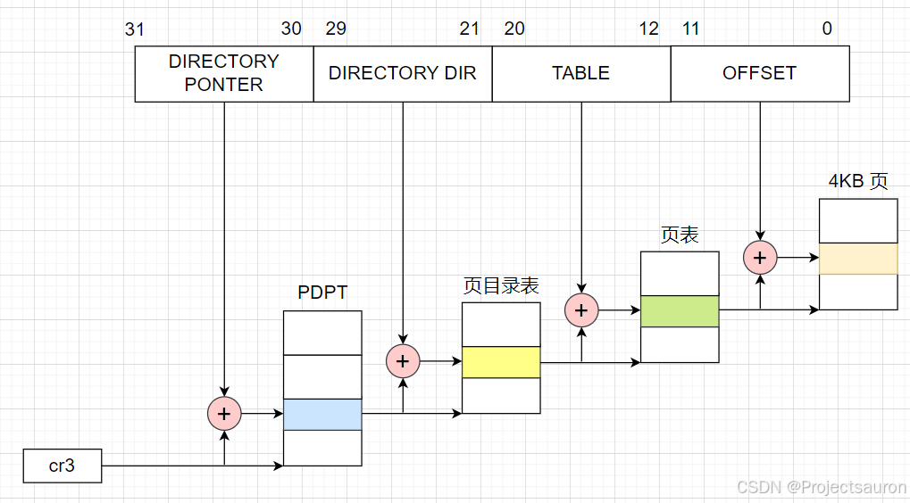
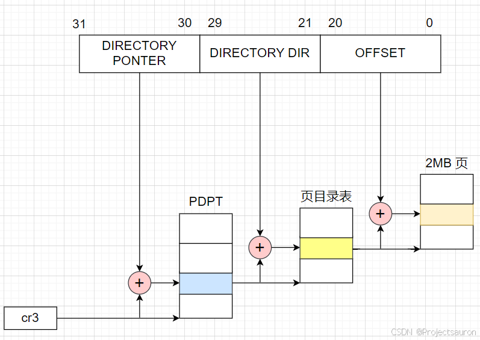

# Linux 内存管理（四）之物理地址扩展（PAE）

#### 目录

-   [前言](https://blog.csdn.net/Teminator_/article/details/140590498#_4)
-   [一、什么是 PAE](https://blog.csdn.net/Teminator_/article/details/140590498#_PAE_11)
-   [二、PAE 的作用](https://blog.csdn.net/Teminator_/article/details/140590498#PAE__17)
-   -   [1、PAE 下的页表结构](https://blog.csdn.net/Teminator_/article/details/140590498#1PAE__23)
-   [总结](https://blog.csdn.net/Teminator_/article/details/140590498#_56)

* * *

## 前言

在 32 位操作系统中，使用 32 位的寻址空间，最多只能表示 2 32 2^{32} 232 个不同的地址，即 4GB 的地址空间。这意味着无论实际物理内存有多大，操作系统最多只能寻址 4GB 的物理内存。

然而，在实际应用中，特别是在[服务器](https://so.csdn.net/so/search?q=%E6%9C%8D%E5%8A%A1%E5%99%A8&spm=1001.2101.3001.7020)和高性能计算领域，需要处理大型数据集和运行大规模应用程序的情况下，4GB 的内存往往不够用。因此，引入 PAE 机制可以扩展物理地址空间，使操作系统能够支持更大的物理内存。

> 有关 Linux 分页机制的部分可以参考 [Linux 内存管理（三）之分页机制](https://blog.csdn.net/Teminator_/article/details/140571528)。

## 一、什么是 PAE

PAE（_Physical Address Extension_，物理地址扩展）是一种扩展物理地址寻址空间的技术，它允许 32 位的 x86 计算机处理超过 4GB 物理内存的容量。在 PAE 技术的支持下，可以使用 32 位的内核和 64 位的 CPU，全面兼容各种物理地址大于 4GB 的计算设备。因此，它被广泛应用于[高性能计算](https://so.csdn.net/so/search?q=%E9%AB%98%E6%80%A7%E8%83%BD%E8%AE%A1%E7%AE%97&spm=1001.2101.3001.7020)、服务器集群、虚拟化等领域。

通过设置 cr4 控制寄存器中第五位 PAE 标志激活 PAE。页目录项中的页大小标志 PS 启用大尺寸页（在 PAE 启用时为 2M）。

## 二、PAE 的作用

PAE 机制通过使用 36 位的物理寻址空间，可以支持更大的物理内存，最多可达到 64GB。PAE 通过在 32 位寄存器中使用额外的 4 位来扩展地址，也就是把 32 位线性地址装换为 36 位物理地址，这样就可以访问更多的物理内存。

这也意味着每个进程仍然可以访问 4GB 的虚拟内存空间，但系统现在能够管理更大的物理内存空间。在原来的情况下，多个进程需要共享有限的 3GB 物理内存，这会导致内存压力增大。通过扩展物理内存空间，PAE 降低了多进程间竞争物理内存的概率，从而改善了系统的性能和稳定性。

### 1、PAE 下的页表结构

64GB 的 RAM 被分为 2 24 2^{24} 224 个页框，页表项的物理地址字段从 20 位扩展到了 24 位。因为 PAE 页表项必须包含 12 个标志位和 24 个物理地址位，总数之和为 36，页表项大小从 32 位变为 64 位增加了一倍。结果，一个 4KB 的页表包含 512 个表项而不是 1024 个表项。

在开启 PAE 的情况下使用的是三级页表，第一级是新引入的 PDPT（_Page Directory Pointer Table_，页目录指针表，相当于PGD了），它由 4 个 64 位表项组成，第二级是 PMD，第三级是 PTE。PDPT 只有 4 个 表项，每个对应 1GB RAM，每个表项是 64 位。

> 在 4KB 的 page 设置的情况下，每个 page 只能存 512 个 entry（无论是目录表项，还是页表项），表示 0-511 这个范围，需要占线性地址中的 9 位；同理，由于页目录项与页表项具有同样的结构，高一级的页目录表中也仅能包含 512 个页表项（目录项），同样占用了 32 位线性地址中的 9 位。  
>
> 此时，线性地址剩余位数为：32 位（总位数）- 12 位（页内偏移量）- 9 位（指示页表中的索引）- 9 位（指示页目录表中的索引）= 2 位。而这剩余的 2 位就是用来指向 PDPT 中 4 个表项中的一个。

cr3 控制寄存器包含一个 27 位的页目录指针表基地址字段。因为 PDPT 存放在 RAM 的前 4GB 中，并在 32 字节的倍数上对齐，因此 27 位足以表示这种表的基地址。

如下是启用 PAE 下 4K 分页（页目录项中的 PS 标志清 0）的页表结构：  

线性地址分配如下：

-   **cr3**：指向一个 PDPT
-   **位 31-30**：指向 PDPT 中 4 个项中的一个
-   **位 29-21**：指向页目录中 512 个项中的一个
-   **位 20-12**：指向页表中 512 项中的一个
-   **位 11-0**：4KB 页中的偏移量

如下是启用 PAE 下 2MB 分页（页目录项中的 PS 标志清 0）的页表结构：

线性地址分配如下：

-   **cr3**：指向一个 PDPT
-   **位 31-30**：指向 PDPT 中 4 个项中的一个
-   **位 29-21**：指向页目录中 512 个项中的一个
-   **位 20-0**：2MB 页中的偏移量

## 总结

总结一下，Linux 的 PAE 机制为系统提供了更大的物理内存支持，使其能够突破 32 位寻址的限制。通过将内核的物理地址空间扩展到 36 位，PAE 允许系统最多支持 64GB 的物理内存。这一机制的引入，使得 Linux 能够在处理大规模的数据和运行内存密集型任务时更加高效和稳定。

## 参考

[Linux 内存管理（四）之物理地址扩展（PAE）_linux pae-CSDN博客](https://blog.csdn.net/Teminator_/article/details/140590498)