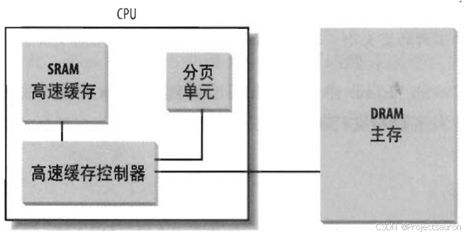
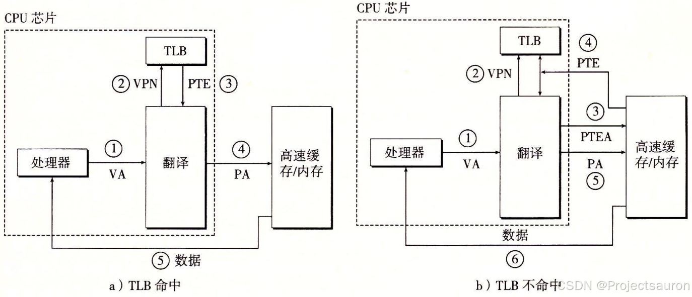

# Linux 内存管理（五）之转换后援缓存器（TLB）

#### 目录

-   [前言](https://blog.csdn.net/Teminator_/article/details/140619299#_4)
-   [一、高速缓存](https://blog.csdn.net/Teminator_/article/details/140619299#_8)
-   [二、TLB 的作用](https://blog.csdn.net/Teminator_/article/details/140619299#TLB__28)
-   [三、TLB 的工作原理](https://blog.csdn.net/Teminator_/article/details/140619299#TLB__36)
-   -   [1、TLB 表项](https://blog.csdn.net/Teminator_/article/details/140619299#1TLB__38)
    -   [2、TLB 组成](https://blog.csdn.net/Teminator_/article/details/140619299#2TLB__46)
    -   [3、TLB 原理](https://blog.csdn.net/Teminator_/article/details/140619299#3TLB__55)
-   [三、TLB 的歧义问题](https://blog.csdn.net/Teminator_/article/details/140619299#TLB__68)
-   [总结](https://blog.csdn.net/Teminator_/article/details/140619299#_75)

* * *

## 前言

在传统的[地址转换](https://so.csdn.net/so/search?q=%E5%9C%B0%E5%9D%80%E8%BD%AC%E6%8D%A2&spm=1001.2101.3001.7020)方式中，每次访问内存时，CPU 都需要通过页表来查找虚拟地址到物理地址的映射关系。这个过程需要多次内存访问，从而导致较大的延迟。为了减少这种延迟，引入了一种叫做 TLB 的缓存机制，将最近使用过的映射关系存储在高速缓存中。

## 一、高速缓存

TLB 实际上就是一种高速缓存，所以讲解 TLB 之前我们先来看一下什么是高速缓存。

为了缩小 [CPU](https://so.csdn.net/so/search?q=CPU&spm=1001.2101.3001.7020) 和 RAM 之间的速度不匹配，引入了硬件高速缓存内存（_**hardware cachememory**_)。80x86 体系结构中引入了一个叫行的新单位。

> 硬件高速缓存基于著名的局部性原理（_**locality principle**_），该原理既适用程序结构和也适用数据结构。由于程序的循环结构及相关数组可以组织成线性数组，所以最近最常用的相邻地址在最近的将来又被用到的可能性极大。

  
当访问一个 RAM 存储单元时，CPU 从物理地址中提取出子集的索引号并把子集中所有行的标签与物理地址的高几位相比较。如果发现某一个行的标签与这个物理地址的高位相同，则 CPU 命中一个高速缓存（_**cache hit**_）；否则，高速缓存没有命中（_**cache miss**_）。

当命中一个高速缓存时，高速缓存控制器进行不同的操作,具体取决于存取类型。

-   对于读操作，控制器从高速缓存行中选择数据并送到 CPU 寄存器；不需要访问 RAM 因而节约了 CPU 时间。
-   对于写操作，控制器可能采用以下两个基本策略之一，分别称之为 `通写`（_**write-through**_）和 `回写`（_**write-back**_）。
    -   在通写中，控制器总是既写 RAM 也写高速缓存行，为了提高写操作的效率关闭高速缓存。
    -   回写方式只更新高速缓存行，不改变 RAM 的内容，提供了更快的功效。当然，回写结束以后，RAM 最终必须被更新。只有当 CPU 执行一条要求刷新高速缓存表项的指令时或者当一个 FLUSH 硬件信号产生时（通常在高速缓存不命中之后），高速缓存控制器才把高速缓存行写回到 RAM 中。

当高速缓存没有命中时，高速缓存行被写回到内存中，如果有必要的话，把正确的行从 RAM 中取出放到高速缓存的表项中。

## 二、TLB 的作用

由于 CPU 首先接到的是由程序传来的虚拟内存地址，所以 CPU 必须先到物理内存中取[页表](https://so.csdn.net/so/search?q=%E9%A1%B5%E8%A1%A8&spm=1001.2101.3001.7020)，然后对应程序传来的虚拟页面号，在表里找到对应的物理页面 号，最后才能访问实际的物理内存地址，也就是说整个过程中 CPU 必须访问两次物理内存（实际上访问的次数更多）。

为了减少因为 MMU 导致的处理器性能下降，引入了 TLB（_**Translation Lookaside Buffer**_，转换后援缓存器），也可简称为“快表”。

简单地说，TLB 就是页表的 Cache，其中存储了当前最可能被访问到的页表项，其内容是部分页表项的一个副本。只有在 TLB 无法完成地址翻译任务时，才会到内存中查询页表，这样就减少了页表查询导致的处理器性能下降。

## 三、TLB 的工作原理

### 1、TLB 表项

TLB 每一行都保存着一个页表项。TLB 中的项由两部分组成：标识和数据。标识中存放的是虚拟页号（_**Virtual Page Number**_，_**VPN**_），而数据部分中物理页号（_**Physical Page Number**_，_**PPN**_）、存储保护信息以及其他一些辅助信息。

> TLB 和 CPU 里的一级、二级缓存（Cache）之间不存在本质的区别，只不过 TLB 缓存页表数据，而 Cache 缓存实际数据。

下图为虚拟地址中用以访问 TLB 的组成部分：  

### 2、TLB 组成

TLB 在 x86 体系的 CPU 里的实际应用最早是从 Intel 的 486CPU 开始的，在 x86 体系的 CPU 里边，一般都设有如下 4 组 TLB：

1.  第一组：缓存一般页表（4K 字节页面）的指令页表缓存（_**Instruction-TLB**_）；
2.  第二组：缓存一般页表（4K 字节页面）的数据页表缓存（_**Data-TLB**_）；
3.  第三组：缓存大尺寸页表（2M/4M 字节页面）的指令页表缓存（_**Instruction-TLB**_）；
4.  第四组：缓存大尺寸页表（2M/4M 字节页面）的数据页表缓存（_**Data-TLB**_）；

### 3、TLB 原理

TLB工作的基本原理如下：

1.  当 CPU 执行指令时，会生成虚拟地址。这个虚拟地址包含了一个页号和一个页内偏移量。
2.  CPU 首先检查 TLB 是否包含了虚拟页号和物理页号的映射关系。如果 TLB 中有，那么 CPU 可以直接从 TLB 中获取物理页号。
3.  如果 TLB 中没有虚拟页号和物理页号的映射关系，就称为 TLB 缺失（_**TLB miss**_）。在这种情况下，CPU 需要访问页表来查找这个映射关系。如果有相应的映射关系，则称为 TLB 命中（_**TLB Hit**_）。
4.  CPU 将虚拟页号发送到 MMU，MMU 会根据页表的内容找到对应的物理页号。
5.  一旦找到了物理页号，CPU 会将这个映射关系加载到 TLB 中，以便以后的访问可以直接从 TLB 中获取物理页号。
6.  CPU 将从 TLB 中获取的物理页号与页内偏移量组合成物理地址，然后进行内存访问。

## 三、TLB 的歧义问题

不同的进程之间看到的虚拟地址范围是一样的，所以多个进程下，不同进程的相同的虚拟地址可以映射不同的物理地址。这就会造成歧义问题。

例如，进程 A 将地址 0x2000 映射物理地址 0x4000。进程 B 将地址 0x2000 映射物理地址 0x5000。当进程 A 执行的时候将 0x2000 对应 0x4000 的映射关系缓存到 TLB 中。当切换 B 进程的时候，B 进程访问 0x2000 的数据，会由于命中 TLB 从物理地址 0x4000 取数据。这就造成了歧义。

不过，每个进程都有自己独立的页表，将虚拟地址映射到特定的物理地址。当进程切换时，操作系统会切换页表，从而实现不同进程间虚拟地址到物理地址的映射。这样，就不会发生进程 B 命中进程 A 的 TLB 表项的情况了。

## 总结

TLB 本质上就是一块高速缓存。TLB 缓存虚拟地址和其映射的物理地址。硬件存在 TLB 后，虚拟地址到物理地址的转换过程发生了变化。虚拟地址首先发往 TLB 确认是否命中 cache，如果 TLB hit 直接可以得到物理地址。否则，一级一级查找页表获取物理地址。并将虚拟地址和物理地址的映射关系缓存到 TLB 中。

## 参考

[Linux 内存管理（五）之转换后援缓存器（TLB）_linux tlb-CSDN博客](https://blog.csdn.net/Teminator_/article/details/140619299)