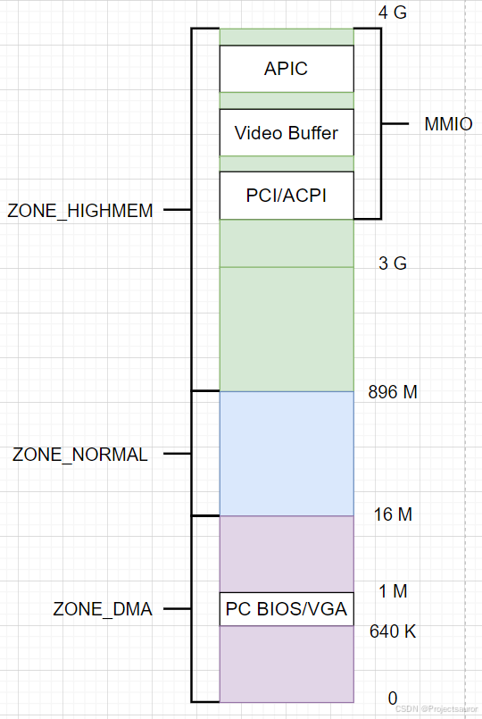
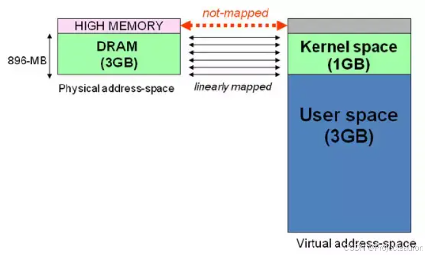
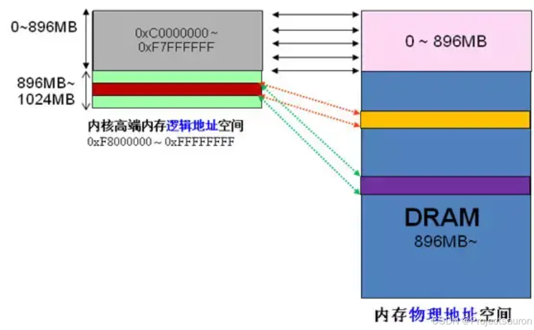
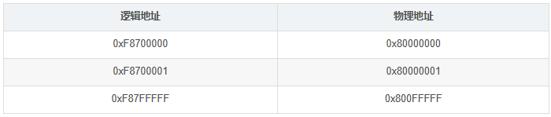

# Linux 内存管理（六）之内存管理区

#### 目录

- [前言](https://blog.csdn.net/Teminator_/article/details/140644067#_4)
- [一、x86 上的内存区域划分](https://blog.csdn.net/Teminator_/article/details/140644067#x86__10)
- [二、管理区结构](https://blog.csdn.net/Teminator_/article/details/140644067#_36)
- - [1、struct zone](https://blog.csdn.net/Teminator_/article/details/140644067#1struct_zone_38)
  - [2、ZONE_PADDING](https://blog.csdn.net/Teminator_/article/details/140644067#2ZONE_PADDING_73)
- [三、高端内存](https://blog.csdn.net/Teminator_/article/details/140644067#_109)
- - [1、高端内存的由来](https://blog.csdn.net/Teminator_/article/details/140644067#1_111)
  - [2、高端内存的访问](https://blog.csdn.net/Teminator_/article/details/140644067#2_126)
  - [3、高端内存的划分](https://blog.csdn.net/Teminator_/article/details/140644067#3_146)
- [总结](https://blog.csdn.net/Teminator_/article/details/140644067#_178)

## 前言

为了支持 NUMA 模型，也即 [CPU](https://so.csdn.net/so/search?q=CPU&spm=1001.2101.3001.7020) 对不同内存单元的访问时间可能不同，此时系统的物理内存被划分为几个节点，一个节点对应一个内存簇 bank，即每个内存簇被认为是一个节点。接着各个节点又被划分为内存管理区域，接下来将对内存管理区域进行讨论。

> 非一致内存访问（_**Non-Uniform MemoryAccess**_，_**NUMA**_）模型，是一种内存架构模型，用于多处理器系统中的内存访问。在 NUMA 系统中，每个处理器或处理器组件（如核心）都有自己的本地内存，并且可以访问其他处理器的远程内存。

## 一、x86 上的内存区域划分

在一个理想的计算机体系结构中，一个页框就是一个内存存储单元，可用于任何事情：存放内核数据和用户数据、缓冲磁盘数据等等。任何种类的数据页都可以存放在任何页框中，没有什么限制。

但是，实际的计算机体系结构有硬件的制约，这限制了页框可以使用的方式。尤其是 Linux 内核必须处理 80x86 体系结构的两种硬件约束：

-   ISA 总线的直接内存存取（DMA）处理器有一个严格的限制：它们只能对 RAM 的前 16MB 寻址。
-   在具有大容量 RAM 的现代 32 位计算机中，CPU 不能直接访问所有的物理内存，因为线性地址空间太小。

为了应对这两种限制，Linux 2.6 把每个内存节点的物理内在划分为 3 个管理区（zone）在 80x86 UMA 体系结构中的管理区为：

-   _**ZONE DMA**_：包含低于 16 MB 的内存页框。
-   _**ZONE NORMAL**_：包含高于 16MB 且低于 896MB 的内存页框。
-   _**ZONE HIGHMEM**_：包含从 896MB 开始高于 896MB 的内存页框。

  
内存区域类型结构定义在 `include/linux/mmzone.h`，其基本信息如下所示：

    #define ZONE_DMA		0
    #define ZONE_NORMAL		1
    #define ZONE_HIGHMEM 	2

不同的管理区的用途是不一样的，`ZONE_DMA` 类型的内存区域在物理内存的低端，主要是 ISA 设备只能用低端的地址做 DMA 操作。`ZONE_NORMAL` 类型的内存区域直接被内核映射到线性地址空间上面的区域，`ZONE_HIGHMEM` 将保留给系统使用，是系统中预留的可用内存空间，不能被内核直接映射。

## 二、管理区结构

### 1、struct zone

一个管理区（_**zone**_）由 `struct zone` 结构体来描述，zone 对象用于跟踪诸如页面使用情况的统计数、空闲区域信息和锁信息。里面保存着内存使用状态信息，如 page 使用统计，未使用的内存区域，互斥访问的锁等。

该结构体定义在 `include/linux/mmzone.h` 中，而其中各个字段的含义如下：

-   **free pages**：管理区中空闲页的数目。
-   **pages\_min**：管理区中保留页的数目。
-   **pages\_low**：回收页框使用的下界，同时也被管理区分配器作为阈值使用。
-   **pages\_high**：回收页框使用的上界，同时也被管理区分配器作为阈值使用。
-   **lowmem\_reserve**：指明在处理内存不足的临界情况下每个管理区必须保留的页框数 0。
-   **pageset**：数据结构用于实现单一页框的特殊高速缓存。
-   **lock**：保护该描述符的自旋锁。
-   **free\_area**：标识出管理区中的空闲页框块。
-   **lru\_lock**：活动以及非活动链表使用的自旋锁。
-   **active\_list**：管理区中的活动页链表。
-   **inactive\_list**：管理区中的非活动页链表。
-   **nr\_scan\_active**：回收内存时需要扫描的活动页数目。
-   **nr\_scan\_inactive**：回收内存时需要扫描的非活动页数目。
-   **nr\_active**：管理区的活动链表上的页数目。
-   **nr\_inactive**：管理区的非活动链表上的页数目。
-   **pages\_scaned**：管理区内回收页框时使用的计数器。
-   **all\_unreclaimable**在管理区中填满不可回收页时此标志被置位。
-   **temp\_priority**：临时管理区的优先级。
-   **prev\_priority**：管理区优先级，范围在 12 和 0 之间。
-   **wait\_table**：进程等待队列的散列表，这些进程正在等待管理区中的某页。
-   **wait\_table\_size**：等待队列散列表的大小。
-   **wait\_table\_bits**：等待队列散列表数组大小，值为 2 o r d e r 2^{order} 2order。
-   **zone\_pgdat**：内存节点。
-   **zone\_mem\_map**：指向管理区的第一个页描述符的指针。
-   **zone\_start\_pfn**：管理区第一个页框的下标。
-   **spanned\_pages**：以页为单位的管理区的总大小，包括洞。
-   **present\_pages**：以页为单位的管理区的总大小，不包括洞。
-   **name**：指针指向管理区的传统名称：“DMA"，“NORMAL" 或 “HighMem"。

### 2、ZONE\_PADDING

`ZONE_PADDING` 用于将数据保存在高速缓冲行。

`zone` 比较特殊的地方是它由 `ZONE_PADDING` 分隔的几个部分。这是因为堆 `zone` 结构的访问非常频繁。在多处理器系统中，通常会有不同的 CPU 试图同时访问结构成员。因此使用锁可以防止他们彼此干扰，避免错误和不一致的问题。由于内核堆该结构的访问非常频繁，因此会经常性地获取该结构的两个自旋锁：`zone->lock` 和 `zone->lru_lock`。

那么数据保存在 CPU 高速缓存中，就会处理得更快速。高速缓冲分为行，每一行负责不同的内存区。内核使用`ZONE_PADDING` 宏生成”填充”字段添加到结构中，以确保每个自旋锁处于自身的缓存行中。

该宏同样定义在目录 `include/linux/mmzone.h` 下：

    #if defined(CONFIG_SMP)
        struct zone_padding
        {
                char x[0];
        } ____cacheline_internodealigned_in_smp;
        #define ZONE_PADDING(name)      struct zone_padding name;
    
    #else
        #define ZONE_PADDING(name)
    #endif

内核还用了 `____cacheline_internodealigned_in_smp`，来实现最优的高速缓存行对其方式。该宏定义在 `include/linux/cache.h`：

    #if !defined(____cacheline_internodealigned_in_smp)
        #if defined(CONFIG_SMP)
            #define ____cacheline_internodealigned_in_smp \
            __attribute__((__aligned__(1 << (INTERNODE_CACHE_SHIFT))))
        #else
            #define ____cacheline_internodealigned_in_smp
        #endif
    #endif

## 三、高端内存

### 1、高端内存的由来

> 有关 Linux 分段机制和分页机制的介绍可以参考：  
>
> [Linux 内存管理（一）之分段机制](https://blog.csdn.net/Teminator_/article/details/140531630)  
> [Linux 内存管理（三）之分页机制](https://blog.csdn.net/Teminator_/article/details/140571528)

当内核模块代码或线程访问内存时，代码中的内存地址都为逻辑地址，而对应到真正的物理内存地址，需要地址一对一的映射，如逻辑地址 0xc0000003 对应的物理地址为 0×3，0xc0000004 对应的物理地址为 0×4… …，逻辑地址与物理地址对应的关系为:

    物理地址 = 逻辑地址 – 0xC0000000

假设按照上述简单的地址映射关系，那么内核逻辑地址空间访问为 0xc0000000 ~ 0xffffffff，那么对应的物理内存范围就为 0×0~0×40000000，即只能访问 1G 物理内存。若机器中安装 4G 物理内存，那么内核就只能访问前 1G 物理内存，后面 3G 物理内存将会无法访问。而这无法访问到的 3G 内存就是高端内存，也就是前面所讲的 `ZONE HIGHMEM`。  

### 2、高端内存的访问

高端内存 `HIGH_MEM` 地址空间范围为 0xF8000000~0xFFFFFFFF（896MB～1024MB）。

当内核想访问高于 896MB 物理地址内存时，从 0xF8000000~0xFFFFFFFF 地址空间范围内找一段相应大小空闲的逻辑地址空间。借用这段逻辑地址空间，建立映射到想访问的那段物理内存（即填充内核 PTE 页面表），临时用一会，用完后归还。这样别人也可以借用这段地址空间访问其他物理内存，实现了使用有限的地址空间，访问所有所有物理内存。

因此，传统和 x86\_32 位系统中，前 16M 划分给 `ZONE_DMA`，该区域包含的页框可以由老式的基于 ISAS 的设备通过 DMA 使用”直接内存访问”，`ZONE_DMA` 和 `ZONE_NORMAL` 区域包含了内存的常规页框，通过把他们线性的映射到现行地址的第 4 个 GB，内核就可以直接进行访问，相反 `ZONE_HIGHME` 包含的内存页不能由内核直接访问，尽管他们也线性地映射到了现行地址空间的第 4 个 GB。在 64 位体系结构中，线性地址空间的大小远远好过了系统的实际物理地址，内核可知直接将所有的物理内存映射到线性地址空间，因此 64 位体系结构上 `ZONE_HIGHMEM` 区域总是空的。

例如内核想访问 2G 开始的一段大小为 1MB 的物理内存，即物理地址范围为 0×80000000 ~ 0x800FFFFF。访问之前先找到一段 1MB 大小的空闲地址空间，假设找到的空闲地址空间为 0xF8700000 ~ 0xF87FFFFF，用这 1MB 的逻辑地址空间映射到物理地址空间 0×80000000 ~ 0x800FFFFF 的内存。映射关系如下：

当内核访问完 0x80000000~0x800FFFFF 物理内存后，就将 0xF8700000~0xF87FFFFF 内核线性空间释放。这样其他进程或代码也可以使用 0xF8700000~0xF87FFFFF 这段地址访问其他物理内存。

### 3、高端内存的划分

Linux 内核将高端内存划分为 3 部分：

-   `VMALLOC_START` ~ `VMALLOC_END`
-   `KMAP_BASE` ~ `FIXADDR_START`
-   `FIXADDR_START` ~ 0xFFFFFFFF

对于高端内存，可以通过 `alloc_page()` 或者其它函数获得对应的 page，但是要想访问实际物理内存，还得把 page 转为线性地址才行，这个过程称为高端内存映射。

对应高端内存的 3 部分，高端内存映射有三种方式：

1.  映射到”内核动态映射空间”（_**noncontiguous memory allocation**_）

通过 `vmalloc()`，在”内核动态映射空间”申请内存的时候，就可能从高端内存获得页面，因此说高端内存有可能映射到”内核动态映射空间”中。

2.  永久内核映射（_**permanent kernel mapping**_）

内核专门为此留出一块线性空间，从 `PKMAP_BASE` 到 `FIXADDR_START` ，用于映射高端内存。这个空间起叫”内核永久映射空间”或者”永久内核映射空间”。

永久内核映射允许内核建立高端页框到内核地址空间的长期映射。它们使用主内核页表中一个专门的页表，其地址存放在 `pkmap_page_table` 变量中。页表中的表项数由 `LAST_PKMAP` 宏产生。页表照样包含 512 或 1024 项，这取决于 PAE 是否被激活。（PAE 参见：[Linux 内存管理（四）之物理地址扩展（PAE）](https://blog.csdn.net/Teminator_/article/details/140590498)）

3.  临时内核映射（_**temporary kernel mapping**_）

内核在 `FIXADDR_START` 到 `FIXADDR_TOP` 之间保留了一些线性空间用于特殊需求。这个空间称为”固定映射空间”在这个空间中，有一部分用于高端内存的临时映射。

在高端内存的任一页框都可以通过一个“窗口”（为此而保留的一个页表项）映射到内核地址空间。留给临时内核映射的窗口数是非常少的。

每个 CPU 都有它自己的包含 13 个窗口的集合,它们用 `enum km_type` 数据结构表示。该数据结构中定义的每个符号，如 `KMBOUNCEREAD`、`KMUSERO` 或 `KMPTO`，标识了窗口的线性地址。

内核必须确保同一窗口永不会被两个不同的控制路径同时使用。因此，`km_type` 结构中的每个符号只能由一种内核成分使用，并以该成分命名。最后一个符号 `KTYPENR` 本身并不表示一个线性地址，但由每个 `CPU` 用来产生不同的可用窗口数。

## 总结

一些体系结构其内存的物理寻址范围比虚拟寻址范围大的多。这样，就有一些内存不能永久地映射在内核空间上。为了解决这些制约条件，Linux 将内存划分为：`ZONE_DMA` 、`ZONE_NOMAL` 、`ZONE_HIGHEM` 。

## 参考

[Linux 内存管理（六）之内存管理区_zone padding-CSDN博客](https://blog.csdn.net/Teminator_/article/details/140644067)