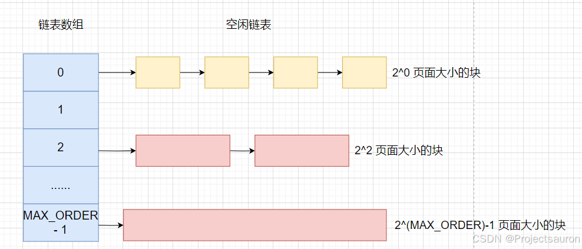
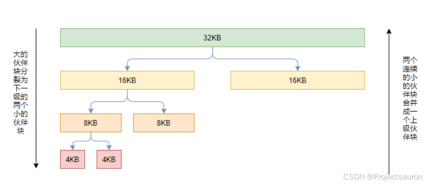
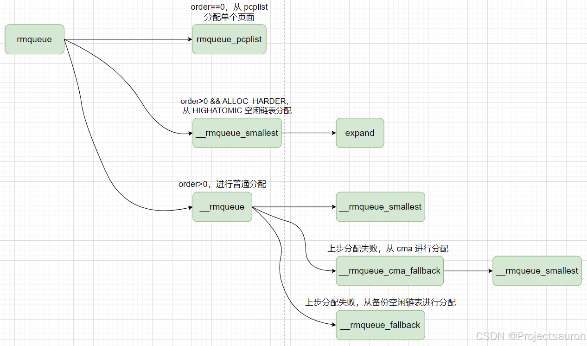

# Linux 内存管理（七）之伙伴系统算法

#### 目录

- [前言](https://blog.csdn.net/Teminator_/article/details/140670858#_4)
- [一、伙伴系统的由来](https://blog.csdn.net/Teminator_/article/details/140670858#_10)
- [二、伙伴系统](https://blog.csdn.net/Teminator_/article/details/140670858#_21)
- - [1、基本思想](https://blog.csdn.net/Teminator_/article/details/140670858#1_23)
  - [2、工作原理](https://blog.csdn.net/Teminator_/article/details/140670858#2_39)
  - [3、伙伴系统信息查看](https://blog.csdn.net/Teminator_/article/details/140670858#3_57)
- [三、内核实现](https://blog.csdn.net/Teminator_/article/details/140670858#_70)
- - [1、数据结构](https://blog.csdn.net/Teminator_/article/details/140670858#1_72)
  - [2、分配块](https://blog.csdn.net/Teminator_/article/details/140670858#2_86)
  - - [2.1 requeue](https://blog.csdn.net/Teminator_/article/details/140670858#21_requeue_88)
    - [2.2 __rmqueue_smallest](https://blog.csdn.net/Teminator_/article/details/140670858#22___rmqueue_smallest_181)
    - [2.3 总结](https://blog.csdn.net/Teminator_/article/details/140670858#23__241)
  - [3、释放块](https://blog.csdn.net/Teminator_/article/details/140670858#3_246)

## 前言

伙伴系统算法是一种用来管理分配和[释放内存](https://so.csdn.net/so/search?q=%E9%87%8A%E6%94%BE%E5%86%85%E5%AD%98&spm=1001.2101.3001.7020)的算法，它在 Linux 内核中被广泛使用。其设计目标是高效地管理内存碎片，并且具有快速的分配和释放速度。

接下来将详细探讨一下 Linux 中的伙伴系统算法。

## 一、伙伴系统的由来

在 [Linux 内存管理（三）之分页机制](https://blog.csdn.net/Teminator_/article/details/140571528) 一文中，我曾提到过内存碎片，频繁地请求和释放不同大小的一组连续页框，必然导致在已分配页框的块内分散了许多小块的空闲页框。由此带来的问题是，即使有足够的空闲页框可以满足请求，但要分配一个大块的连续页框就可能无法满足。

从本质上说，避免外碎片的方法有两种：

-   利用分页单元把一组非连续的空闲页框映射到连续的线性地址区间。
-   开发一种适当的技术来记录现存的空闲连续页框块的情况，以尽量避免为满足对小块的请求而分割大的空闲块。

而今天要讨论的 伙伴系统采用的是第二种方法。

## 二、伙伴系统

### 1、基本思想

Linux 采用著名的伙伴系统（_**buddy system**_）算法来解决外碎片问题。把所有的空闲页框分组为 11 个块链表，每个块链表分别包含大小为 1,2,4,8,16,32,64,128,256,512 和 1024 个连续的页框。对 1024 个页框的最大请求对应着 4MB 大小的连续 RAM块。每个块的第一个页框的物理地址是该块大小的整数倍。例如，大小为 16 个页框的块，其起始地址是 16 ∗ 2 12 16\*2^{12} 16∗212（ 2 12 = 4096 2^{12}=4096 212\=4096，这是一个常规页的大小）的倍数。

`MAX_ORDER` 通常定义为 11，即内核管理的最大的连续空闲物理内存为 2 ( 11 − 1 ) = 4 M B 2^{(11 - 1)} = 4MB 2(11−1)\=4MB.

    /* Free memory management - zoned buddy allocator.  */
    #ifndef CONFIG_FORCE_MAX_ZONEORDER
    #define MAX_ORDER 11
    #else
    #define MAX_ORDER CONFIG_FORCE_MAX_ZONEORDER
    #endif

### 2、工作原理

下面通过一个简单的例子来说明该算法的工作原理。

假设要请求一个 256 个页框的块。算法先在 256 个页框的链表中检查是否有一个空闲块。如果没有这样的块，算法会查找下一个更大的页块，也就是，在 512 个页框的链表中找一个空闲块。如果存在这样的块，内核就把 256 的页框分成两等份，一半用作满足请求，另一半插入到 256 个页框的链表中。如果在 512 个页框的块链表中也没找到空闲块，就继续找更大的块——1024 个页框的块。如果这样的块存在，内核把 1024 个页框块的 256 个页框用作请求，然后从剩余的 768 个页框中拿 512 个插入到 512 个页框的链表中，再把最后的 256 个插入到 256 个页框的链表中。如果 1024 个页框的链表还是空的，算法就放弃并发出错信号。

> 简而言之，就是当程序释放内存时，操作系统首先将该内存回收，然后检查与该内存相邻的内存是否是同样大小并且同样处于空闲的状态，如果是，则将这两块内存合并，然后程序递归进行同样的检查。

以上过程的逆过程就是页框块的释放过程，也是该算法名字的由来。内核试图把大小为 b 的一对空闲伙伴块合并为一个大小为 2b 的单独块。满足以下条件的两个块称为伙伴：

-   两个块具有相同的大小，记作 b。
-   它们的物理地址是连续的。
-   第一块的第一个页框的物理地址是 2 ∗ b ∗ 2 12 2\*b\*2^{12} 2∗b∗212 的倍数。

该算法是迭代的，如果它成功合并所释放的块，它会试图合并 2b 的块，以再次试图形成更大的块。

### 3、伙伴系统信息查看

通过命令 `cat /proc/buddyinfo` 可以查看当前系统的伙伴系统信息：

    [projectsauron]:~$ cat /proc/buddyinfo
    Node 0, zone      DMA      0      0      0      0      0      0      0      1      0      1      3 
    Node 0, zone    DMA32     12    245   1006    680    443    226     62     17      7      3    325 
    Node 0, zone   Normal     80     83     44     15     23     11      3      2      2      1      2

从左向右分别对应 order0~order10。

## 三、内核实现

### 1、数据结构

在 [Linux 内存管理（六）之内存管理区](https://blog.csdn.net/Teminator_/article/details/140644067) 中介绍过的 zone 结构体中的字段：`free_area[MAX_ORDER]` 数组用于保存每一阶的空闲内存块链表。

    struct free_area {
    	struct list_head   free_list[MIGRATE_TYPES];
        unsigned long      nr_free;
    };

-   **free\_list**：用于连接包含大小相同的连续内存区域的页链表。
-   **nr\_free**：该区域中空闲页表的数量。

### 2、分配块

#### 2.1 requeue

`rmqueue()` 函数用来在管理区中找到一个空闲块。如果页框被成功分配，`rmqueue()` 函数就返回第一个被分配页框的页描述符。否则，函数返回 NULL。

    /*
     * Allocate a page from the given zone. Use pcplists for order-0 allocations.
     */
    static inline
    struct page *rmqueue(struct zone *preferred_zone,
    			struct zone *zone, unsigned int order,
    			gfp_t gfp_flags, unsigned int alloc_flags,
    			int migratetype)
    {
    	unsigned long flags;
    	struct page *page;
    
    	/************************** 1 **************************/
    	if (likely(order == 0)) {                 
    		/*
    		 * MIGRATE_MOVABLE pcplist could have the pages on CMA area and
    		 * we need to skip it when CMA area isn't allowed.
    		 */
    		if (!IS_ENABLED(CONFIG_CMA) || alloc_flags & ALLOC_CMA ||
    				migratetype != MIGRATE_MOVABLE) {
    			page = rmqueue_pcplist(preferred_zone, zone, gfp_flags,
    					migratetype, alloc_flags);
    			goto out;
    		}
    	}
    
    	/*
    	 * We most definitely don't want callers attempting to
    	 * allocate greater than order-1 page units with __GFP_NOFAIL.
    	 */
    	WARN_ON_ONCE((gfp_flags & __GFP_NOFAIL) && (order > 1));
    	spin_lock_irqsave(&zone->lock, flags);
    
    	do {
    		page = NULL;
    		/*
    		 * order-0 request can reach here when the pcplist is skipped
    		 * due to non-CMA allocation context. HIGHATOMIC area is
    		 * reserved for high-order atomic allocation, so order-0
    		 * request should skip it.
    		 */
    		 /************************** 2 **************************/
    		if (order > 0 && alloc_flags & ALLOC_HARDER) {            
    			page = __rmqueue_smallest(zone, order, MIGRATE_HIGHATOMIC);
    			if (page)
    				trace_mm_page_alloc_zone_locked(page, order, migratetype);
    		}
    		if (!page)
    		/************************** 3 **************************/
    			page = __rmqueue(zone, order, migratetype, alloc_flags);     
    		/************************** 4 **************************/ 
    	} while (page && check_new_pages(page, order));           
    	spin_unlock(&zone->lock);
    	if (!page)
    		goto failed;
    	__mod_zone_freepage_state(zone, -(1 << order),
    				  get_pcppage_migratetype(page));              
    
    	__count_zid_vm_events(PGALLOC, page_zonenum(page), 1 << order);
    	zone_statistics(preferred_zone, zone);
    	local_irq_restore(flags);
    
    out:
    	/* Separate test+clear to avoid unnecessary atomics */
    	/************************** 5 **************************/ 
    	if (test_bit(ZONE_BOOSTED_WATERMARK, &zone->flags)) {     
    		clear_bit(ZONE_BOOSTED_WATERMARK, &zone->flags);
    		wakeup_kswapd(zone, 0, 0, zone_idx(zone));
    	}
    
    	VM_BUG_ON_PAGE(page && bad_range(zone, page), page);
    	return page;
    
    failed:
    	local_irq_restore(flags);
    	return NULL;
    }

​    

> 下面的序号对应上述代码中注释内的序号

1.  当 `order == 0` 时，表示分配单个页面，调用 `rmqueue_pcplist()` 函数，实施的是 PCP 分配机制。PCP 即 `per_cpu_pages`，它是一个 `per_cpu` 变量，该变量中有一个单页面的链表，存放部分单个的物理页面，当系统需要单个物理页面时，直接从该 `per_cpu` 变量的链表中获取物理页面，这样能够做到更高的效率。
2.  调用 `__rmqueue_smallest` 函数分割”块“，这里的 `migratetype` 是 `MIGRATE_HIGHATOMIC`。`ALLOC_HARDER` 表示 尽力分配，一般在 `gfp_mask` 设置了 `__GFP_ATOMIC` 时会使用。如果页面分配失败，则尽可能分配`MIGRATE_HIGHATOMIC` 类型的空闲页面。
3.  如果上面都没有分配到 page， 那么就调用 `__rmqueue` 函数分配内存。在 `__rmqueue` 函数中首先也是调用`__rmqueue_smallest` 函数分割”块“， 如果 `__rmqueue_smallest` 函数分配内存失败，就会调用 `__rmqueue_fallback` 函数，该函数会从伙伴系统的备份空闲链表中借用内存。
4.  `check_new_pages()` 函数判断新分配出来的页面是否成功。主要检查 page 的 `__mapcount` 是否为 0，并且设置 page 的 `_refcount` 为 0。
5.  这里主要是优化内存外碎片。如果 `&zone->flags` 设置了 `ZONE_BOOSTED_WATERMARK` 标志位，就会唤醒 `kswapd` 线程回收内存。

#### 2.2 \_\_rmqueue\_smallest

    static __always_inline
    struct page *__rmqueue_smallest(struct zone *zone, unsigned int order,
    						int migratetype)
    {
    	unsigned int current_order;
    	struct free_area *area;
    	struct page *page;
    
    	/* Find a page of the appropriate size in the preferred list */
    	/************************** 1 **************************/
    	for (current_order = order; current_order < MAX_ORDER; ++current_order) {
    		area = &(zone->free_area[current_order]);
    		page = get_page_from_free_area(area, migratetype);
    		if (!page)
    			continue;
    		del_page_from_free_list(page, zone, current_order);
    		/************************** 2 **************************/
    		expand(zone, page, order, current_order, migratetype); 
    		set_pcppage_migratetype(page, migratetype);
    		return page;
    	}
    
    	return NULL;
    }

1.  从 `current order` 开始查找 zone 的空闲链表。如果当前的 order 中没有空闲对象，那么就会查找上一级 order。
2.  `del_page_from_free_list` 函数只会将空闲的对象摘出链表， 真正分配的功能在 `expand()` 函数实现。`expand()` 会将空闲链表上的页面块分配一部分后，将剩余的空闲部分挂在 zone 上更低 order 的页面块链表上。

    static inline void expand(struct zone *zone, struct page *page,
    	int low, int high, int migratetype)
    {
    	unsigned long size = 1 << high;
    
    	while (high > low) {
    		high--;
    		size >>= 1;
    		VM_BUG_ON_PAGE(bad_range(zone, &page[size]), &page[size]);
    	
    		/*
    		 * Mark as guard pages (or page), that will allow to
    		 * merge back to allocator when buddy will be freed.
    		 * Corresponding page table entries will not be touched,
    		 * pages will stay not present in virtual address space
    		 */
    		if (set_page_guard(zone, &page[size], high, migratetype))
    			continue;
    	
    		add_to_free_list(&page[size], zone, high, migratetype);
    		set_buddy_order(&page[size], high);
    	}
    }
    

这里的 high 就是 `current_order`，如果分配的页面块大于需求的页面块，那么就将 order 降一级， 最后通过`add_to_free_list` 把剩余的空闲内存添加到低一级的空闲链表中。

#### 2.3 总结

总的申请页面流程如下：  

### 3、释放块

释放页面的函数是 `free_page()`。

    static inline void free_the_page(struct page *page, unsigned int order)
    {
    	if (order == 0)		/* Via pcp? */
    		free_unref_page(page);
    	else
    		__free_pages_ok(page, order, FPI_NONE);
    }
    
    void __free_pages(struct page *page, unsigned int order)
    {
    	if (put_page_testzero(page))
    		free_the_page(page, order);
    	else if (!PageHead(page))
    		while (order-- > 0)
    			free_the_page(page + (1 << order), order);
    }

和分配页面流程类似， 释放页面会分两种情况：

1.  order == 0，`free_unref_page()` 释放单个页面。 在该函数中首先会调用 `local_irq_save()` 关闭本地中断，因为中断可能会触发页面分配，pcp 链表可能会被改变。`free_unref_page_commit()` 会释放单个页面到 pcp 链表中。
2.  order > 0，最终会调用到 `__free_one_page()` 释放多个页面。`__free_one_page()` 既可以释放页面到伙伴系统，也可以处理空闲页面的合并。（该函数使用的方式就是前面所提到的合并块的思路）

## 参考

[Linux 内存管理（七）之伙伴系统算法_linux伙伴系统算法-CSDN博客](https://blog.csdn.net/Teminator_/article/details/140670858)