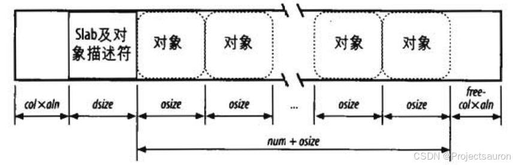
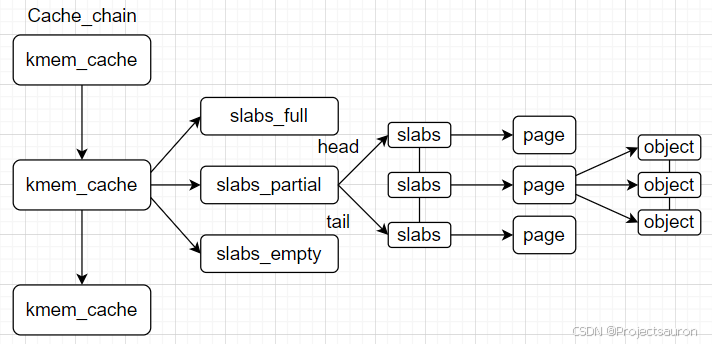

#### 目录

-   [前言](https://blog.csdn.net/Teminator_/article/details/140779470#_4)
-   [一、为什么要引入 slab 算法](https://blog.csdn.net/Teminator_/article/details/140779470#_slab__8)
-   [二、slab 算法的工作机制](https://blog.csdn.net/Teminator_/article/details/140779470#slab__17)
-   -   [1、普通和专用高速缓存](https://blog.csdn.net/Teminator_/article/details/140779470#1_19)
    -   [2、slab 和 buddy system 的关系](https://blog.csdn.net/Teminator_/article/details/140779470#2slab__buddy_system__28)
    -   [3、slab 分配器基本概念](https://blog.csdn.net/Teminator_/article/details/140779470#3slab__34)
    -   -   [3.1 slab](https://blog.csdn.net/Teminator_/article/details/140779470#31_slab_36)
        -   [3.2 object](https://blog.csdn.net/Teminator_/article/details/140779470#32_object_42)
        -   [3.3 cache](https://blog.csdn.net/Teminator_/article/details/140779470#33_cache_48)
    -   [4、slab 的基本思想](https://blog.csdn.net/Teminator_/article/details/140779470#4slab__52)
    -   [5、对齐内存中的对象](https://blog.csdn.net/Teminator_/article/details/140779470#5_62)
    -   [6、slab 着色](https://blog.csdn.net/Teminator_/article/details/140779470#6slab__68)
-   [三、slab 的数据结构](https://blog.csdn.net/Teminator_/article/details/140779470#slab__90)
-   -   [1、slab 的结构图](https://blog.csdn.net/Teminator_/article/details/140779470#1slab__92)
    -   [2、slab 结构解释](https://blog.csdn.net/Teminator_/article/details/140779470#2slab__97)
    -   -   [2.1 cache\_chain](https://blog.csdn.net/Teminator_/article/details/140779470#21_cache_chain_99)
        -   [2.2 kmem\_cache](https://blog.csdn.net/Teminator_/article/details/140779470#22_kmem_cache_103)
        -   [2.3 slabs\_full、slabs\_partial、slabs\_empty](https://blog.csdn.net/Teminator_/article/details/140779470#23_slabs_fullslabs_partialslabs_empty_146)
        -   [2.4 cache\_cache](https://blog.csdn.net/Teminator_/article/details/140779470#24_cache_cache_156)

* * *

## 前言

在上一节 [Linux 内存管理（七）之伙伴系统算法](https://blog.csdn.net/Teminator_/article/details/140670858) 中，我们学习了 Linux 内核如何使用[伙伴系统](https://so.csdn.net/so/search?q=%E4%BC%99%E4%BC%B4%E7%B3%BB%E7%BB%9F&spm=1001.2101.3001.7020)算法以页为单位管理内存，进行内存分配。这一节，将要提到的 slab 算法也是一种内存分配算法。

## 一、为什么要引入 slab 算法

Linux 内存以页为单位进行内存管理，伙伴系统算法以 2 n 2^n 2n 次方个页面来进行内存分配管理，最小为 2 0 2^0 20，也就是一页，最大为 2 11 2^{11} 211，就是 4MB 大小的连续内存空间。但是页的粒度还是太大，Linux 下是 4KB 大小，也就是 4096 个字节，而内核本身有很多数据结构时时刻刻都需要分配或者释放，这些数据的大小又往往小于 4KB 大小，一般只有几个几十个字节这样的大小。而且大多数情况下，需要的内存大小都不是按页对齐的

比方最常用到的 task\_struct（进程描述符）结构体和 mm\_struct（内存描述符）结构体，其中，`sizeof task_struct = 9152`，`sizeof mm_struct = 2064`。这样一来如果所有的这些数据结构都按照页来分配存储和管理，那么内存中将会有大量的内存碎片。

一种更好的算法源自 slab 分配器模式，该模式最早用于 Sun 公司的 Solaris2.4 操作系统中。这就是 slab 算法。

由上可知，slab 分配需要解决的就是是内存的内部碎片问题。

## 二、slab 算法的工作机制

### 1、普通和专用高速缓存

高速缓存被分为两种类型：普通和专用。普通高速缓存只由 slab 分配器用于自己的目的而专用高速缓存由内核的其余部分使用。

普通高速缓存是：

-   第一个高速缓存叫做 `kmem_cache`，包含由内核使用的其余高速缓存的高速缓存描述符。`cache_cache` 变量包含第一个高速缓存的描述符。
-   另外一些高速缓存包含用作普通用途的内存区。内存区大小的范围一般包括 13 个几何分布的内存区。一个叫做 `malloc sizes` 的表（其元素类型为 `cache_sizes`）分别指向 26 个高速缓存描述符，与其相关的内存区大小为32, 64, 128, 256, 512, 1024, 2048, 4096, 8192, 16384, 32768, 65536 和 131072 字节。对于每种大小，都有两个高速缓存：一个适用于 ISA DMA 分配，另一个适用于常规分配。

### 2、slab 和 buddy system 的关系

slab 系统与 buddy 系统所要解决的问题是互补的，一个解决外部碎片一个解决内部碎片，但事实上，slab 在新建 cache 时同样需要用到 buddy 来为之分配页面，而在释放 cache 时也需要 buddy 来回收这此页面。也就是说，`slab 是依赖于 buddy 系统的`。

在某些情况下内核模块可能需要频繁的分配和释放相同的内存对象，这时候 slab 可以作为内核对象的缓存，当 slab 对象被释放时，slab 分配器并不会把对象占用的物理空间还给伙伴系统。这样的好处是当内核模块需要再次分配内存对象时，不需要那么麻烦的向伙伴系统申请，而是可以直接在 slab 链表中分配一个合适的对象。

### 3、slab 分配器基本概念

#### 3.1 slab

slab 是 slab 分配器从伙伴系统申请页面的基本单位。然而 slab 的大小不是固定的，slab 从属于某个 kmem cache 实例，不同的 kmem cache 实例，其 slab 的大小是不同的。slab 的大小必须是 2 o r d e r 2^{order} 2order 个 pages，order 不能超过伙伴系统所支持的最大的 order。

slab 内存分配器从伙伴系统分配了 slab 之后，会将其挂在对应的 `kmem cache` 实例的 node 节点。

#### 3.2 object

object 是 slab 分配器对外提供的申请内存的基本单位。slab 分配器从伙伴系统申请了 buddy 之后，会将其拆分成一个个的 object，并缓存在 `kmem cache` 实例的 `cpu_cache` 中，用户申请内存时，其实获取的就是一个个object。

一旦 object 缓存耗尽，就会重新从伙伴系统申请 slab，并再次将其拆分成 object，放入 `kmem cache`。

#### 3.3 cache

slab 分配器中的 cache 跟硬件 cache 无关，是一个纯软件的概念。slab 内存分配器有两种 cache：一个是 slab 的 cache，一个是 object 的 cache。slab 内存分配器从伙伴系统获取页面后，会将其加入 `kmem cache` 的 node 节点，这个就是 slab 的 cache；将 slab 拆分成多个 object，并将 object 加入`kmem cache` 的 `cpu_cache` 内存池，这个就是 object 的 cache；可以看到这两种 cache 实际是对共同的物理页面的两种缓存形式。

### 4、slab 的基本思想

在内核中，经常会使用一些链表，链表中会申请许多相同结构的结构体，比如文件对象，进程对象等等，如果申请比较频繁，那么就为它们建立一个内存池，内存池中都是相同结构的结构体，当想申请这种结构体时，直接从这种内存池中取一个结构体出来。一个物理页就可以作用这种内存池的载体，进而进行充分利用，减少了内部碎片的产生。

所以 slab 的基本思想是，先利用页面分配器分配出单个或者一组连续的物理页面，然后在此基础上将整块页面分割成多个相等的小内存单元，以满足小内存空间分配的需要。也就是用`对象`的概念来管理内存。

而所谓的对象就是存放一组数据结构的内存区，为便于理解可把对象看作内核中的数据结构（例如：`task_struct`, `file_struct` 等）。

相同类型的对象归为一类，每当要申请这样一个对象时，slab 分配器就从一个 slab 列表中分配一个这样大小的单元出去，而当要释放时，将其重新保存在该列表中，而不是直接返回给伙伴系统，从而避免内部碎片。

### 5、对齐内存中的对象

slab 分配器所管理的对象可以在内存中进行对齐，也就是说，存放它们的内存单元的起始物理地址是一个给定常量的倍数，通常是 2 的倍数。这个常量就叫对齐因子（_**alignment factor**_）。

slab 分配器所允许的最大对齐因子是 4096，即页框大小。这就意味着通过访问对象的物理地址或线性地址就可以对齐对象。在这两种情况下，只有最低的 12 位才可以通过对齐来改变。

### 6、slab 着色

同一硬件高速缓存行可以映射 RAM 中很多不同的块，相同大小的对象倾向于存放在高速缓存内相同的偏移量处。在不同的 slab 内具有相同偏移量的对象最终很可能映射在同一高速缓存行中。高速缓存的硬件可能因此而花费内存周期在同一高速缓存行与 RAM 内存单元之间来来往往传送两个对象,而其他的高速缓存行并未充分使用。slab 分配器通过一种叫做 slab 着色（_**slab coloring**_）的策略尽量降低高速缓存的这种行为：把叫做颜色（_**color**_）的不同随机数分配给 slab。

在 slab 内放置对象就有很多种可能的方式。方式的选择取决于对下列变量所做的决定：

-   **num**：可以在 slab 中存放的对象个数（其值在高速缓存描述符的 num 字段中）。
-   **osize**：对象的大小，包括对齐的字节。
-   **dsize**：slab 描述符的大小加上所有对象描述符的大小，就等于硬件高速缓存行大小的最小倍数。如果 slab 描述符和对象描述符都存放在 slab 的外部，那么这个值等于 0。
-   **free**：在 slab 内未用字节（没有分配给任一对象的字节）的个数。

一个 slab 中的总字节长度可以表示为如下表达式： s l a b 的长度 = ( n u m ∗ o s i z e ) + d s i z e + f r e e slab 的长度=(num \* osize)+dsize +free slab的长度\=(num∗osize)+dsize+free。

slab 分配器利用空闲未用的字节 free 来对 slab 着色。具有不同颜色的 slab 把 slab 的第一个对象存放在不同的内存单元，同时满足对齐约束。可用颜色的个数是 f r e e / a l n free/aln free/aln（这个值存放在高速缓存描述符的 colour 字段）。因此，第一个颜色表示为 0，最后一个颜色表示为 ( f r e e / a l n ) − 1 (free/aln)-1 (free/aln)−1。

如果用颜色 col 对一个 slab 着色，那么，第一个对象的偏移量（相对于 slab 的起始地址）就等于 c o l ∗ a l n + d s i z e col\*aln+dsize col∗aln+dsize 字节。下图显示了 slab 内对象的布局对 slab 颜色的依赖情况。着色本质上导致把 slab 中的一些空闲区域从末尾移到开始。

只有当 free 足够大时，着色才起作用。显然，如果对象没有请求对齐，或者如果 slab 内的未用字节数小于所请求的对齐（ f r e e ≤ a l n free \\leq aln free≤aln），那么，唯一可能着色的 slab 就是具有颜色 0 的 slab，也就是说，把这个 slab 的第一个对象的偏移量赋为 0。

## 三、slab 的数据结构

### 1、slab 的结构图

  
每个 `kmem_cache` 都是链接在一起形成一个全局的双向链表，由 cache 指向该链表，系统可以从 `Cache_chain` 开始扫描每个 `kmem_cache`，来找到一个大小最合适的 `kmem_cache`，然后从该 `kmem_cache` 中分配一个对象。

### 2、slab 结构解释

#### 2.1 cache\_chain

最高层是 `cache_chain`，这是一个 slab 缓存的链接列表。可以用来查找最适合所需要的分配大小的缓存（遍历列表）。`cache_chain` 的每个元素都是一个 `kmem_cache` 结构的引用（称为一个 cache）。它定义了一个要管理的给定大小的对象池。

#### 2.2 kmem\_cache

结构体定义如下：

    /*
     * Slab cache management.
     */
    struct kmem_cache {
        // slab cache 的管理标志位，用于设置 slab 的一些特性
        // 比如：slab 中的对象按照什么方式对齐，对象是否需要 POISON  毒化，是否插入 red zone 在对象内存周围，是否追踪对象的分配和释放信息 等等
        slab_flags_t flags;
        // slab 对象在内存中的真实占用，包括为了内存对齐填充的字节数，red zone 等等
        unsigned int size;  /* The size of an object including metadata */
        // slab 中对象的实际大小，不包含填充的字节数
        unsigned int object_size;/* The size of an object without metadata */
        // slab 对象池中的对象在没有被分配之前，我们是不关心对象里边存储的内容的。
        // 内核巧妙的利用对象占用的内存空间存储下一个空闲对象的地址。
        // offset 表示用于存储下一个空闲对象指针的位置距离对象首地址的偏移
        unsigned int offset;    /* Free pointer offset */
        // 表示 cache 中的 slab 大小，包括 slab 所需要申请的页面个数，以及所包含的对象个数
        // 其中低 16 位表示一个 slab 中所包含的对象总数，高 16 位表示一个 slab 所占有的内存页个数。
        struct kmem_cache_order_objects oo;
        // slab 中所能包含对象以及内存页个数的最大值
        struct kmem_cache_order_objects max;
        // 当按照 oo 的尺寸为 slab 申请内存时，如果内存紧张，会采用 min 的尺寸为 slab 申请内存，可以容纳一个对象即可。
        struct kmem_cache_order_objects min;
        // 向伙伴系统申请内存时使用的内存分配标识
        gfp_t allocflags; 
        // slab cache 的引用计数，为 0 时就可以销毁并释放内存回伙伴系统重
        int refcount;   
        // 池化对象的构造函数，用于创建 slab 对象池中的对象
        void (*ctor)(void *);
        // 对象的 object_size 按照 word 字长对齐之后的大小
        unsigned int inuse;  
        // 对象按照指定的 align 进行对齐
        unsigned int align; 
        // slab cache 的名称， 也就是在 slabinfo 命令中 name 那一列
        const char *name;  
    };

​    

#### 2.3 slabs\_full、slabs\_partial、slabs\_empty

每个缓存都包含了一个 slabs 列表，这是一段连续的内存块（通常都是页面）。其中每个 `kmem_cache` 有三条链表：

-   **slabs\_full** 表示该链表中每个 slab 的 object 对象都已经分配完了
-   **slabs\_partial** 表示该链表中的 slab 的 object 对象部分分配完了
-   **slabs\_empty** 表示该链表中的 object 对象全部没有分配出去（空 slab，未分配）

对象的分配和释放都是在 slab 中进行的，所以 slab 可以在三条链表中移动，如果 slab 中的 object 都分配完了，则会移到 full 链表中；如果分配了一部分 object，则会移到 partial 链表中；如果所有 object 都释放了，则会移动到 empty 链表中；其中当系统内存紧张的时候，slabs\_empty 链表中的 slab 可能会被返回给系统。

#### 2.4 cache\_cache

所有的 `kmem_cache` 结构都是从 `cache_cache` 分配的：

    static kmem_cache_t cache_cache = {
         slabs_full:     LIST_HEAD_INIT(cache_cache.slabs_full),
         slabs_partial:  LIST_HEAD_INIT(cache_cache.slabs_partial),
         slabs_free:     LIST_HEAD_INIT(cache_cache.slabs_free),
         objsize:        sizeof(kmem_cache_t),
         flags:          SLAB_NO_REAP,
         spinlock:       SPIN_LOCK_UNLOCKED,
         colour_off:     L1_CACHE_BYTES,
         name:           "kmem_cache",
    };

​    
    struct cache_size{
    	size_t cs_size;
    	struct kmem_cache *cs_cachep;
    }
    
    struct cache_size malloc_sizes[] = { 
    	{.cs_size = 32},
    	{.cs_size = 64},
    	{.cs_size = 128},
    	{.cs_size = 256},
    	................
    	{.cs_size = ~0UL},
    };

​    

在系统初始化时，内核会调用 `kmem_cache_init` 函数对 `malloc_size` 数组进行遍历，对数组中的每个元素都调用 `kmem_cache_create()` 函数在 `cache_cache` 中分配一个 `struct kmem_cache` 实例，并且把 `kmem_cache` 所在的地址赋值给 `cache_size` 中的 `cs_cachep` 指针。

## 参考

[Linux 内存管理（八）之 slab 分配器_linux slab-CSDN博客](https://blog.csdn.net/Teminator_/article/details/140779470)