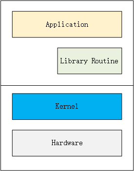
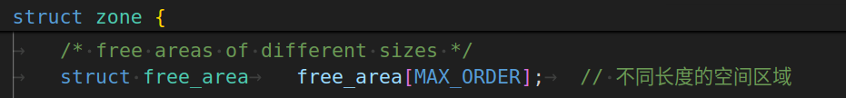
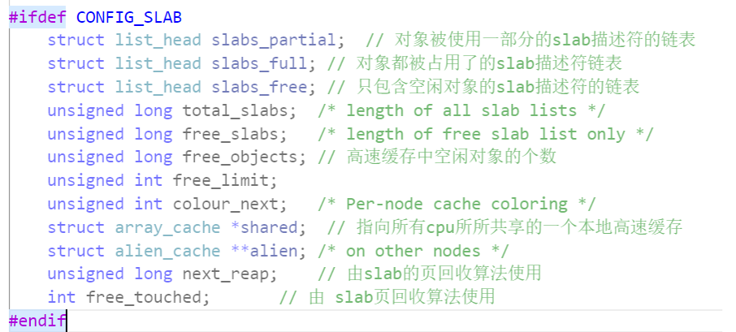

# Linux 内核源码分析---内存管理

## 内存管理架构

内存管理子系统架构可以分为：用户空间、内核空间及硬件部分3个层面：

-   **用户空间**：应用程序使用`malloc()`申请内存资源`/free()`释放内存资源。
-   **内核空间**：内核总是驻留在内存中，是操作系统的一部分。内核空间为内核保留，不允许应用程序读写该区域的内容或直接调用内核代码定义的函数。
-   **硬件**：处理器包含一个内存管理单元（Memory Management Uint,MMU）的部件，负责把虚拟地址转换为物理地址。

Linux内核的核心功能：  
  
Linux 内核只是 [Linux 操作系统](https://so.csdn.net/so/search?q=Linux%20%E6%93%8D%E4%BD%9C%E7%B3%BB%E7%BB%9F&spm=1001.2101.3001.7020)一部分。**对下，它管理系统的所有硬件设备；对上，它通过系统调用，向 Library Routine（例如C库）或者其它应用程序提供接口**。  
因此，其核心功能就是：管理硬件设备，供应用程序使用。现代系统标准组成：CPU、Memory(内存和外存)、I/O 设备、网络设备和其它外围设备。  
[https://blog.csdn.net/changexhao/article/details/78321295](https://blog.csdn.net/changexhao/article/details/78321295)

  
1.**`malloc`函数和`free`函数**  
**头文件**：`#include<stdlib.h>` 或者 `#include<malloc.h>`  
**原型**：  
`extern void * malloc(unsigned int num_byte);` 注意：**malloc 所分配的是一块连续的内存**。  
**功能**：分配长度为`num_byte`字节的内存块  
**参数**：需要分配的内存字节数，如果内存池中的可用内存可以满足这个需求，`malloc`就返回一个指向被分配的内存块起始位置的指针  
**返回值**：如果分配成功则返回指向被分配内存的指针，否则返回空指针`NULL`。

`void free( void * pointer);`  
**功能**：释放内存  
**参数**：`free`函数的参数要么是NULL，要么是一个先前从`malloc`、`calloc`或`realloc`返回的值。向`free`传递一个`NULL`参数不会产生任何效果。

2.**`new`和`delete`操作符**  
在C++中，new是用来动态开辟内存的，delete是用来释放所动态开辟的内存。  
malloc 和 new 的第一个区别，malloc是函数， **new是一个操作符** 。当然，成对出现的free 是函数，delete 是操作符。  
new 动态开辟空间时，并**不需要计算所开辟空间类型的大小**。因为后面跟着类型，new会自动计算出类型的大小。  
在申请自定义类型的空间时，**new会调用构造函数**，delete会调用析构函数，而malloc与 free不会 。

**new的底层其实就是用malloc进行实现的开辟空间， delete的底层实现是通过free函数进行实现的**

3.**`ptmalloc/jemalloc/tcmalloc`: malloc 的底层实现**  
ptmalloc(glibc标配)、tcmalloc(google)、jemalloc(facebook)  
`ptmalloc`作为基础库是最为稳定的内存管理器，无论在什么环境下都能适应，但是分配效率相对较低。  
`tcmalloc`针对多核情况有所优化，性能有所提高，但是内存占用稍高，大内存分配容易出现CPU飙升。  
`jemalloc`的内存占用更高，但是在多核多线程下的表现也最为优异。

4.**`brk（sbrk）`和`mmap`函数**  
linux系统向用户提供申请的内存有`brk(sbrk)`和`mmap`函数。  
`brk()` 和 `sbrk()` 两者的作用是扩展 heap 的上界 `brk`  
`brk()` 的参数设置为新的 `brk` 上界地址，成功返回`1`，失败返回`0`；  
`sbrk()` 的参数为申请内存的大小，返回 heap 新的上界 `brk` 的地址；

5.`mmap()`  
`mmap`的**第一种用法是映射磁盘文件到内存中**；**第二种用法是匿名映射，不映射磁盘文件，而向映射区申请一块内存**。  
`malloc` 使用的是 `mmap` 的第二种用法（匿名映射）；`munmap`函数用于释放内存

    #include <stdio.h>
    #include <stdlib.h>
    #include <unistd.h>
    
    #define MAX 1024
    
    int main(int argc, char const *argv[])
    {
        int *p = sbrk(0);
        int *old = p;
    
        p = sbrk(MAX*MAX);
        if((void*)(-1) == p){
    
                perror("sbrk error.\n");
                exit(EXIT_FAILURE);
        }
        printf("old : %p\n p = %p\n", p, old);
    
        int *new = sbrk(0);
        printf("new : %p\n", new);
    
        printf("\npid = %d\n\n",getpid());
        while(1);
        sbrk(-MAX*MAX);
        return 0;
    }

​    

## 虚拟地址空间布局架构

因为目前应用程序没有那么大的内存需求，所以 ARM64 处理器不支持完全的 64 位虚拟地址。在**ARM64架构的Linux内核中，内核虚拟地址和用户虚拟地址的宽度相同。**  
  
**所有进程共享内核虚拟地址空间**，每个进程有独立的用户虚拟地址空间，同一个线程组的用户线程共享用户虚拟地址空间，内核线程没有用户虚拟地址空间。

Linux 内核使用内存描述符`mm_struct`，描述进程的用户虚拟地址空间：

    struct mm_struct {
    	struct {
    		struct vm_area_struct *mmap;	// 虚拟内存区域链表
    		struct rb_root mm_rb;	// 虚拟内存区域红黑树
    		u64 vmacache_seqnum;                   /* per-thread vmacache */
    #ifdef CONFIG_MMU	// 在内存映射区域找到一个没有映射的区域
    		unsigned long (*get_unmapped_area) (struct file *filp,
    				unsigned long addr, unsigned long len,
    				unsigned long pgoff, unsigned long flags);
    #endif
    		unsigned long mmap_base;	// 内存映射区域的起始地址
    		unsigned long mmap_legacy_base;	/* base of mmap area in bottom-up allocations */
    #ifdef CONFIG_HAVE_ARCH_COMPAT_MMAP_BASES
    		/* Base addresses for compatible mmap() */
    		unsigned long mmap_compat_base;
    		unsigned long mmap_compat_legacy_base;
    #endif
    		unsigned long task_size;	// 用户虚拟地址空间的长度
    		unsigned long highest_vm_end;	/* highest vma end address */
    		pgd_t * pgd;	// 指向页全局目录，即第一级目录
    
    #ifdef CONFIG_MEMBARRIER
    		/**
    		 * @membarrier_state: Flags controlling membarrier behavior.
    		 *
    		 * This field is close to @pgd to hopefully fit in the same
    		 * cache-line, which needs to be touched by switch_mm().
    		 */
    		atomic_t membarrier_state;	
    #endif
    
    		/**
    		 * @mm_users: The number of users including userspace.
    		 *
    		 * Use mmget()/mmget_not_zero()/mmput() to modify. When this
    		 * drops to 0 (i.e. when the task exits and there are no other
    		 * temporary reference holders), we also release a reference on
    		 * @mm_count (which may then free the &struct mm_struct if
    		 * @mm_count also drops to 0).
    		 */
    		atomic_t mm_users;	// 共享一个用户虚拟地址空间的进程的数量，也就是线程组包含的进程的数量
    
    		/**
    		 * @mm_count: The number of references to &struct mm_struct
    		 * (@mm_users count as 1).
    		 *
    		 * Use mmgrab()/mmdrop() to modify. When this drops to 0, the
    		 * &struct mm_struct is freed.
    		 */
    		atomic_t mm_count;	// 内存描述符的引用计数
    
    #ifdef CONFIG_MMU
    		atomic_long_t pgtables_bytes;	/* PTE page table pages */
    #endif
    		int map_count;			/* number of VMAs */
    
    		spinlock_t page_table_lock; /* Protects page tables and some
    					     * counters
    					     */
    		/*
    		 * With some kernel config, the current mmap_lock's offset
    		 * inside 'mm_struct' is at 0x120, which is very optimal, as
    		 * its two hot fields 'count' and 'owner' sit in 2 different
    		 * cachelines,  and when mmap_lock is highly contended, both
    		 * of the 2 fields will be accessed frequently, current layout
    		 * will help to reduce cache bouncing.
    		 *
    		 * So please be careful with adding new fields before
    		 * mmap_lock, which can easily push the 2 fields into one
    		 * cacheline.
    		 */
    		struct rw_semaphore mmap_lock;
    
    		struct list_head mmlist; /* List of maybe swapped mm's.	These
    					  * are globally strung together off
    					  * init_mm.mmlist, and are protected
    					  * by mmlist_lock
    					  */

​    
    		unsigned long hiwater_rss; // 进程所拥有的最大页框数
    		unsigned long hiwater_vm;  // 进程线性区中最大页数
    
    		unsigned long total_vm;	   // 进程地址空间的大小（页数）
    		unsigned long locked_vm;   /* Pages that have PG_mlocked set */
    		atomic64_t    pinned_vm;   /* Refcount permanently increased */
    		unsigned long data_vm;	   /* VM_WRITE & ~VM_SHARED & ~VM_STACK */
    		unsigned long exec_vm;	   /* VM_EXEC & ~VM_WRITE & ~VM_STACK */
    		unsigned long stack_vm;	   /* VM_STACK */
    		unsigned long def_flags;
    
    		/**
    		 * @write_protect_seq: Locked when any thread is write
    		 * protecting pages mapped by this mm to enforce a later COW,
    		 * for instance during page table copying for fork().
    		 */
    		seqcount_t write_protect_seq;
    
    		spinlock_t arg_lock; /* protect the below fields */
    
    		// 代码段的起始地址和结束地址，数据段的起始地址和结束地址
    		unsigned long start_code, end_code, start_data, end_data;
    		// 堆的起始地址和结束地址，栈的起始地址
    		unsigned long start_brk, brk, start_stack;
    		// 参数字符串的起始地址和结束地址，环境变量的起始地址和结束地址
    		unsigned long arg_start, arg_end, env_start, env_end;
    
    		unsigned long saved_auxv[AT_VECTOR_SIZE]; /* for /proc/PID/auxv */
    
    		/*
    		 * Special counters, in some configurations protected by the
    		 * page_table_lock, in other configurations by being atomic.
    		 */
    		struct mm_rss_stat rss_stat;
    
    		struct linux_binfmt *binfmt;
    
    		/* Architecture-specific MM context */
    		mm_context_t context;	// 处理器架构特定的内存管理上下文
    
    		unsigned long flags; /* Must use atomic bitops to access */
    
    		struct core_state *core_state; /* coredumping support */
    
    #ifdef CONFIG_AIO
    		spinlock_t			ioctx_lock;
    		struct kioctx_table __rcu	*ioctx_table;
    #endif
    #ifdef CONFIG_MEMCG
    		/*
    		 * "owner" points to a task that is regarded as the canonical
    		 * user/owner of this mm. All of the following must be true in
    		 * order for it to be changed:
    		 *
    		 * current == mm->owner
    		 * current->mm != mm
    		 * new_owner->mm == mm
    		 * new_owner->alloc_lock is held
    		 */
    		struct task_struct __rcu *owner;
    #endif
    		struct user_namespace *user_ns;
    
    		/* store ref to file /proc/<pid>/exe symlink points to */
    		struct file __rcu *exe_file;
    #ifdef CONFIG_MMU_NOTIFIER
    		struct mmu_notifier_subscriptions *notifier_subscriptions;
    #endif
    #if defined(CONFIG_TRANSPARENT_HUGEPAGE) && !USE_SPLIT_PMD_PTLOCKS
    		pgtable_t pmd_huge_pte; /* protected by page_table_lock */
    #endif
    #ifdef CONFIG_NUMA_BALANCING
    		/*
    		 * numa_next_scan is the next time that the PTEs will be marked
    		 * pte_numa. NUMA hinting faults will gather statistics and
    		 * migrate pages to new nodes if necessary.
    		 */
    		unsigned long numa_next_scan;
    
    		/* Restart point for scanning and setting pte_numa */
    		unsigned long numa_scan_offset;
    
    		/* numa_scan_seq prevents two threads setting pte_numa */
    		int numa_scan_seq;
    #endif
    		/*
    		 * An operation with batched TLB flushing is going on. Anything
    		 * that can move process memory needs to flush the TLB when
    		 * moving a PROT_NONE or PROT_NUMA mapped page.
    		 */
    		atomic_t tlb_flush_pending;
    #ifdef CONFIG_ARCH_WANT_BATCHED_UNMAP_TLB_FLUSH
    		/* See flush_tlb_batched_pending() */
    		bool tlb_flush_batched;
    #endif
    		struct uprobes_state uprobes_state;
    #ifdef CONFIG_HUGETLB_PAGE
    		atomic_long_t hugetlb_usage;
    #endif
    		struct work_struct async_put_work;
    
    #ifdef CONFIG_IOMMU_SUPPORT
    		u32 pasid;
    #endif
    	} __randomize_layout;
    
    	/*
    	 * The mm_cpumask needs to be at the end of mm_struct, because it
    	 * is dynamically sized based on nr_cpu_ids.
    	 */
    	unsigned long cpu_bitmap[];
    };

一个进程的虚拟地址空间主要由两个数据结构进行描述：一个是最高层次的`mm_struct`，较高层次的`vm_area_struct`。  
最高层次`mm_struct`结构描述一个进程整个虚拟地址空间。较高层次结构`vm_area_struct`描述虚拟地址空间的一个区间(称为虚拟区)。每个进程只有一个`mm_struct`结构，在每个进程的`task_struct`结构中，有一个专门用来指向该进程的结构。`mm_struct` 结构是对整个用户空间的描述。

内核管理进程地址空间使用的数据结构是`struct vm_area_struct`，简称VMA。对于每个进程的内存描述符`mm_struct mm`，都有各自的VMA，通过`mm->mmap`链表将进程所有的VMA管理起来，同时会记录到`mm->mm_rb`红黑树，用于高效查找合并VMA等操作。

    /*
     * This struct describes a virtual memory area. There is one of these
     * per VM-area/task. A VM area is any part of the process virtual memory
     * space that has a special rule for the page-fault handlers (ie a shared
     * library, the executable area etc).
     */
    struct vm_area_struct {
    	/* The first cache line has the info for VMA tree walking. */
    
    	// 分别用来保存该虚拟地址空间的首地址和末地址后第一个字节的地址
    	unsigned long vm_start;		/* Our start address within vm_mm. */
    	unsigned long vm_end;		/* The first byte after our end address
    					   within vm_mm. */
    
    	/* linked list of VM areas per task, sorted by address */
    	struct vm_area_struct *vm_next, *vm_prev;	// 分别 VMA 链表的前后成员连接操作
    
    	// 如果采用链表组织化，会影响它的搜索问题，解决此问题采用红黑树
    	// 每个进程结构体 mm_struct 中都创建一颗红黑树，将VMA作为一个节点加入到红黑树当中，这样可以提升搜索速度
    	struct rb_node vm_rb;
    
    	/*
    	 * Largest free memory gap in bytes to the left of this VMA.
    	 * Either between this VMA and vma->vm_prev, or between one of the
    	 * VMAs below us in the VMA rbtree and its ->vm_prev. This helps
    	 * get_unmapped_area find a free area of the right size.
    	 */
    	unsigned long rb_subtree_gap;
    
    	/* Second cache line starts here. */
    
    	struct mm_struct *vm_mm;	// 指向内存描述符，即虚拟内存区域所属的用户虚拟地址空间
    
    	/*
    	 * Access permissions of this VMA.
    	 * See vmf_insert_mixed_prot() for discussion.
    	 */
    	pgprot_t vm_page_prot;	// 保护位，即访问权限
    	
    	/**
    	 * #define VM_NONE		0x00000000
    	 * #define VM_READ		0x00000001	currently active flags 
    	 * #define VM_WRITE		0x00000002
    	 * #define VM_EXEC		0x00000004
    	 * #define VM_SHARED	0x00000008
    	 */
    	unsigned long vm_flags;		/* Flags, see mm.h. */
    
    	/*
    	 * For areas with an address space and backing store,
    	 * linkage into the address_space->i_mmap interval tree.
    	 */
    	/*为了支持查询一个文件区间被映射到哪些虚拟内存区域，
    	把一个文件映射到的所有虚拟内存区域加入该文件的地址空间结构
    	address_space 的成员 i_mmap 指向的区域树*/
    	struct {
    		struct rb_node rb;
    		unsigned long rb_subtree_last;
    	} shared;
    
    	/*
    	 * A file's MAP_PRIVATE vma can be in both i_mmap tree and anon_vma
    	 * list, after a COW of one of the file pages.	A MAP_SHARED vma
    	 * can only be in the i_mmap tree.  An anonymous MAP_PRIVATE, stack
    	 * or brk vma (with NULL file) can only be in an anon_vma list.
    	 */
    	// 把虚拟内存区域关联的所有 anon_vma 实例串联起来，
    	// 一个虚拟内存区域会关联到父进程的 anon_vma 实例和自己的anon_vma实例
    	struct list_head anon_vma_chain; /* Serialized by mmap_lock &
    					  * page_table_lock */
    
    	// 指向一个anon_vma实例，结构 anon_vma 用来组织匿名页被映射到的所有的虚拟地址空间
    	struct anon_vma *anon_vma;	/* Serialized by page_table_lock */
    	
    	/* Function pointers to deal with this struct. */
    	const struct vm_operations_struct *vm_ops;	// 虚拟内存操作集合
    
    	/* Information about our backing store: */
    	unsigned long vm_pgoff;		// 文件偏移，单位是页
    	struct file * vm_file;		// 文件，如果是私有的匿名映射，该成员是空指针。
    	void * vm_private_data;		// 指向内存区的私有数据
    
    #ifdef CONFIG_SWAP
    	atomic_long_t swap_readahead_info;
    #endif
    #ifndef CONFIG_MMU
    	struct vm_region *vm_region;	/* NOMMU mapping region */
    #endif
    #ifdef CONFIG_NUMA
    	struct mempolicy *vm_policy;	/* NUMA policy for the VMA */
    #endif
    	struct vm_userfaultfd_ctx vm_userfaultfd_ctx;
    } __randomize_layout;

**ARM64处理器架构内核地址空间布局：**  

## 内存映射原理

**物理地址**是处理器在系统总线上看到的地址。使用精简指令集计算机(RISC:Reduced Instruction Set Computer RISC)的处理器通常只实现一个物理地址空间外围设备和物理内存使用统一的物理地址空间。有些处理器架构把分配给外围设备的物理地址区域称为**设备内存**。

处理器通过外围设备控制器的寄存器访问外围设备，**寄存器分为控制寄存器，状态寄存器和数据寄存器三大类**。外围设备的寄存器通常被_连续地编址_，处理器对外围设备寄存编址方式分为两种：I/O映射方式( l/O-mapped)，内存映射方式(memory-mapped)。

应用程序只能通过虚拟地址访问外设寄存器，内核提供API函数来把外设寄存器的物理地址映射到虚拟地址空间。 ARM64 架构(**物理地址宽度最大支持48位**)分为两种内存类型：  
**正常内存(Normal Memory)**：包括物理内存和只读存储器(ROM);  
**设备内存(Device Memory)**：指分配给外围设备寄存器的物理地址区域。设备内存共享属性总是外部共享，缓存属性总是不可缓存(必须绕过处理器的缓存)

内存映射即在进程的虚拟地址空间中创建一个映射，分为两种：  
1.**文件映射**：文件支持的内存映射，把文件的一个区间映射到进程的虚拟地址空间，数据源是存储设备上的文件。  
2.**匿名映射**：没有文件支持的内存映射，把物理内存映射到进程的虚拟地址空间，没有数据源。

创建内存映射时，在进程的用户虚拟地址空间中分配一个虚拟内存区域。内核采用延迟分配物理内存的策略，在进程第一次访问虚拟页的时候，产生缺页异常。  
如果是文件映射，那么分配物理页，把文件指定区间的数据读到物理页中，然后在页表中把虚拟页映射到物理页。  
如果是匿名映射，就分配物理页，然后在页表中把虚拟页映射到物理页。

虚拟内存区域分配给进程的一个虚拟地址范围，内核使用结构体 `vm_area_struct` 描述虚拟内存区域。

系统调用`mmap()`：进程创建匿名的内存映射，把内存的物理页映射到进程的虚拟地址空间。进程把文件映射到进程的虚拟地址空间，可以像访问内存一样访问文件，不需要调用系统调用`read()/write()`访问文件，从而_避免用户模式和内核模式之间的切换，提高读写文件速度_。两个进程针对同一个文件创建共享的内存映射，实现共享内存。

两个进程可以使用共享的文件映射实现共享内存。**匿名映射通常是私有映射，共享的匿名映射只可能出现在父进程和子进程之间**。在进程的虚拟地址空间中，代码段和数据段是私有的文件映射未初始化数据段、堆栈是私有的匿名映射。

**修改过的脏页面不会立即更新到文件中，可以调用`msync`来强制同步写入文件。**

应用程序通常使用C标准库提供的函数`malloc()`申请内存。glibc 库的内存分配器`ptmalloc`使用`brk`或`mmap`向内核以页为单位申请虚拟内存，然后把页划分成小内存块分配给应用程序。默认的阈值是`128kb`，如果应用程序申请的内存长度小值，`ptmalloc`分配器使用`brk`向内核申请虚拟内存，否则`ptmaloc`分配器使用`mmap`向内核申请虚拟内存。应用程序可以直接使用mmap向内核申请虚拟内存。

**mmap 内存映射原理三个阶段：**  
1、进程启动映射过程，并且在虚拟地址空间中为映射创建虚拟映射区域；  
2、调用内核空间的系统调用函数mmap(不同于用户空间函数)，实现文件物理地址和进程虚拟的一一映射关系；  
3、进程发起对这片映射空间的访问，引发缺页异常，实现文件内容到物理内存(主存)的拷贝。

**系统调用`mmap()`用于共享内存的两种方式：**  
1.使用普通文件提供的内存映射：适用于任何进程之间；此时，需要打开或创建一个文件，然后再调用`mmap()`；  
2.使用特殊文件提供匿名内存映射：适用于具有亲缘关系的进程之间；由于父子进程特殊的亲缘关系，在父进程中先调用`mmap()`，然后调用`fork()`。那么在调用`fork()`之后，子进程继承父进程匿名映射后的地址空间，同样也继承`mmap()`返回的地址，这样，父子进程就可以通过映射区域进行通信了。注意，这里不是一般的继承关系。一般来说，子进程单独维护从父进程继承下来的一些变量。而**mmap()返回的地址，却由父子进程共同维护**。

`int munmap( void * addr, size_t len )` 在进程地址空间中解除一个映射关系，`addr`是调用`mmap()`时返回的地址，`len`是映射区的大小。当映射关系解除后，对原来映射地址的访问将导致段错误发生。  
  
1、`vma = find_vma(mm, start);` 根据起始地址找到要删除的第一个虚拟内存区域vma；  
2、如果只删除虚拟内存区域vam的部分，那么分裂虚拟内存区域vma；  
3、根据结束地址找到要删除 的最后一个虚拟内存区域vma  
4、如果只删除虚拟内存区域last的一部分，那么分裂虚拟内存区域vma；  
5、针对所有删除目标，如果虚拟内存区域被锁定在内存中(不允许换出到交换区)，调用函数解除锁定。  
6、调用此函数，把所有删除目标从进程虚拟内存区域链表和树中删除，单独组成一条临时的链表。  
7、调用此函数，针对所有删除目标，在进程的页表中删除映射，并且从处理器的页表缓存中删除映射。  
8、调用此函数执行处理器架构特定的处理操作；  
9、调用此函数，删除所有目标。

一般说来，进程在映射空间的对共享内容的改变并不直接写回到磁盘文件中，往往在调用 `munmap()` 后才执行该操作。可以通过调用`msync()`实现磁盘上文件内容与共享内存区的内容一致。`int msync ( void * addr , size_t len, int flags)`

[https://cloud.tencent.com/developer/article/2352778](https://cloud.tencent.com/developer/article/2352778)

## 物理内存组织结构

目前多处理器系统有两种体系结构：  
1）**非一致内存访问（Non-Unit Memory Access，NUMA）**：指内存被划分成多个内存节点的多处理器系统。访问一个内存节点花费的时间取决于处理器和内存节点的距离。  
2）**对称多处理器（Symmetric Multi-Processor，SMP）**：即一致内存访问（Uniform Memory Access，UMA），所有处理器访问内存花费的时间是相同。

**内存模型是从处理器角度看到的物理内存分布**，内核管理不同内存模型的方式存差异。  
内存管理子系统支持3种内存模型：  
1）**平坦内存（Flat Memory）**：内存的物理地址空间是连续的，没有空洞；  
2）**不连续内存（Discontiguous Memory）**：内存的物理地址空间存在空洞，这种模型可以高效地处理空洞；  
3）**稀疏内存（Space Memory）**：内存的物理地址空间存在空洞，如果要支持内存热插拔，只能选择稀疏内存模型。

### 三级结构

内存管理子系统使用**节点(node)**、**区域(zone)**、**页(page)** 三级结构描述物理内存。  

**1.内存节点**\------>分为两种情况：  
（1）NUMA 体系的内存节点，根据处理器和内存的距离划分；  
（2）在具有不连续内存的 NUMA 系统中，表示比区域的级别更高的内存区域，根据物理地址是否连续划分，每块物理地址连续的内存是一个内存节点。`include/linux/mmzone.h`

    typedef struct pglist_data {
    	/*
    	 * node_zones contains just the zones for THIS node. Not all of the
    	 * zones may be populated, but it is the full list. It is referenced by
    	 * this node's node_zonelists as well as other node's node_zonelists.
    	 */
    	struct zone node_zones[MAX_NR_ZONES];	// 内存区域数组
    
    	/*
    	 * node_zonelists contains references to all zones in all nodes.
    	 * Generally the first zones will be references to this node's
    	 * node_zones.
    	 */
    	struct zonelist node_zonelists[MAX_ZONELISTS];	// 备用区域列表
    
    	int nr_zones;	// 该节点包含的内存区域数量
    #ifdef CONFIG_FLATMEM	/* means !SPARSEMEM */
    	struct page *node_mem_map;	// 页描述符数组
    #ifdef CONFIG_PAGE_EXTENSION
    	struct page_ext *node_page_ext;	// 页的扩展属性
    #endif
    #endif
    #if defined(CONFIG_MEMORY_HOTPLUG) || defined(CONFIG_DEFERRED_STRUCT_PAGE_INIT)
    	/*
    	 * Must be held any time you expect node_start_pfn,
    	 * node_present_pages, node_spanned_pages or nr_zones to stay constant.
    	 * Also synchronizes pgdat->first_deferred_pfn during deferred page
    	 * init.
    	 *
    	 * pgdat_resize_lock() and pgdat_resize_unlock() are provided to
    	 * manipulate node_size_lock without checking for CONFIG_MEMORY_HOTPLUG
    	 * or CONFIG_DEFERRED_STRUCT_PAGE_INIT.
    	 *
    	 * Nests above zone->lock and zone->span_seqlock
    	 */
    	spinlock_t node_size_lock;
    #endif
    	unsigned long node_start_pfn;	// 该节点的起始物理页号
    	unsigned long node_present_pages; // 物理页总数
    	unsigned long node_spanned_pages; // 物理页范围的总长度，包括空洞
    	int node_id;	// 节点标识符
    	wait_queue_head_t kswapd_wait;
    	wait_queue_head_t pfmemalloc_wait;
    	struct task_struct *kswapd;	/* Protected by
    					   mem_hotplug_begin/end() */
    	int kswapd_order;
    	enum zone_type kswapd_highest_zoneidx;
    
    	int kswapd_failures;		/* Number of 'reclaimed == 0' runs */
    
    #ifdef CONFIG_COMPACTION
    	int kcompactd_max_order;
    	enum zone_type kcompactd_highest_zoneidx;
    	wait_queue_head_t kcompactd_wait;
    	struct task_struct *kcompactd;
    	bool proactive_compact_trigger;
    #endif
    	/*
    	 * This is a per-node reserve of pages that are not available
    	 * to userspace allocations.
    	 */
    	unsigned long		totalreserve_pages;
    
    #ifdef CONFIG_NUMA
    	/*
    	 * node reclaim becomes active if more unmapped pages exist.
    	 */
    	unsigned long		min_unmapped_pages;
    	unsigned long		min_slab_pages;
    #endif /* CONFIG_NUMA */
    
    	/* Write-intensive fields used by page reclaim */
    	ZONE_PADDING(_pad1_)
    
    #ifdef CONFIG_DEFERRED_STRUCT_PAGE_INIT
    	/*
    	 * If memory initialisation on large machines is deferred then this
    	 * is the first PFN that needs to be initialised.
    	 */
    	unsigned long first_deferred_pfn;
    #endif /* CONFIG_DEFERRED_STRUCT_PAGE_INIT */
    
    #ifdef CONFIG_TRANSPARENT_HUGEPAGE
    	struct deferred_split deferred_split_queue;
    #endif
    
    	/* Fields commonly accessed by the page reclaim scanner */
    
    	/*
    	 * NOTE: THIS IS UNUSED IF MEMCG IS ENABLED.
    	 *
    	 * Use mem_cgroup_lruvec() to look up lruvecs.
    	 */
    	struct lruvec		__lruvec;
    
    	unsigned long		flags;
    
    	ZONE_PADDING(_pad2_)
    
    	/* Per-node vmstats */
    	struct per_cpu_nodestat __percpu *per_cpu_nodestats;
    	atomic_long_t		vm_stat[NR_VM_NODE_STAT_ITEMS];
    } pg_data_t;

`node_mem_map` 此成员指向页描述符数组，每个物理页对应一个页描述符`Node`是内存管理最顶层的结构，在NUMA架构下，CPU 平均划分为多个`Node`，每个`Node`有自己的内存控制器及内存插槽。CPU 访问自己`Node`上内存速度快，而访问其他 CPU 所关联`Node`的内存速度慢。  
**UMA 被当做只一个 Node 的 NUMA 系统。**

**2.内存区域**：内存节点被划分为内存区域。`include/linux/mmzone.h`

    struct zone {
    	/* Read-mostly fields */
    
    	/* zone watermarks, access with *_wmark_pages(zone) macros */
    	unsigned long _watermark[NR_WMARK];
    	unsigned long watermark_boost;
    
    	unsigned long nr_reserved_highatomic;
    
    	/*
    	 * We don't know if the memory that we're going to allocate will be
    	 * freeable or/and it will be released eventually, so to avoid totally
    	 * wasting several GB of ram we must reserve some of the lower zone
    	 * memory (otherwise we risk to run OOM on the lower zones despite
    	 * there being tons of freeable ram on the higher zones).  This array is
    	 * recalculated at runtime if the sysctl_lowmem_reserve_ratio sysctl
    	 * changes.
    	 */
    	long lowmem_reserve[MAX_NR_ZONES];	// 页分配器使用，当前区域保留多少页不能借给高的区域类型
    
    #ifdef CONFIG_NUMA
    	int node;
    #endif
    	struct pglist_data	*zone_pgdat;	// 指向内存节点的pglist_data实例
    	struct per_cpu_pages	__percpu *per_cpu_pageset;	// 每处理页集合
    	struct per_cpu_zonestat	__percpu *per_cpu_zonestats;
    	/*
    	 * the high and batch values are copied to individual pagesets for
    	 * faster access
    	 */
    	int pageset_high;
    	int pageset_batch;
    
    #ifndef CONFIG_SPARSEMEM
    	/*
    	 * Flags for a pageblock_nr_pages block. See pageblock-flags.h.
    	 * In SPARSEMEM, this map is stored in struct mem_section
    	 */
    	unsigned long		*pageblock_flags;
    #endif /* CONFIG_SPARSEMEM */
    
    	/* zone_start_pfn == zone_start_paddr >> PAGE_SHIFT */
    	unsigned long		zone_start_pfn;	// 起始物理地址
    
    	/*
    	 * spanned_pages is the total pages spanned by the zone, including
    	 * holes, which is calculated as:
    	 * 	spanned_pages = zone_end_pfn - zone_start_pfn;
    	 *
    	 * present_pages is physical pages existing within the zone, which
    	 * is calculated as:
    	 *	present_pages = spanned_pages - absent_pages(pages in holes);
    	 *
    	 * present_early_pages is present pages existing within the zone
    	 * located on memory available since early boot, excluding hotplugged
    	 * memory.
    	 *
    	 * managed_pages is present pages managed by the buddy system, which
    	 * is calculated as (reserved_pages includes pages allocated by the
    	 * bootmem allocator):
    	 *	managed_pages = present_pages - reserved_pages;
    	 *
    	 * cma pages is present pages that are assigned for CMA use
    	 * (MIGRATE_CMA).
    	 *
    	 * So present_pages may be used by memory hotplug or memory power
    	 * management logic to figure out unmanaged pages by checking
    	 * (present_pages - managed_pages). And managed_pages should be used
    	 * by page allocator and vm scanner to calculate all kinds of watermarks
    	 * and thresholds.
    	 *
    	 * Locking rules:
    	 *
    	 * zone_start_pfn and spanned_pages are protected by span_seqlock.
    	 * It is a seqlock because it has to be read outside of zone->lock,
    	 * and it is done in the main allocator path.  But, it is written
    	 * quite infrequently.
    	 *
    	 * The span_seq lock is declared along with zone->lock because it is
    	 * frequently read in proximity to zone->lock.  It's good to
    	 * give them a chance of being in the same cacheline.
    	 *
    	 * Write access to present_pages at runtime should be protected by
    	 * mem_hotplug_begin/end(). Any reader who can't tolerant drift of
    	 * present_pages should get_online_mems() to get a stable value.
    	 */
    	atomic_long_t		managed_pages;	// 伙伴分配器管理的物理页的数量
    	unsigned long		spanned_pages;	// 当前区域跨越的总页数，包括空洞
    	unsigned long		present_pages;	// 当前区域存在的物理页的数量，不包括空洞
    #if defined(CONFIG_MEMORY_HOTPLUG)
    	unsigned long		present_early_pages;
    #endif
    #ifdef CONFIG_CMA
    	unsigned long		cma_pages;
    #endif
    
    	const char		*name;	// 区域名称
    
    #ifdef CONFIG_MEMORY_ISOLATION
    	/*
    	 * Number of isolated pageblock. It is used to solve incorrect
    	 * freepage counting problem due to racy retrieving migratetype
    	 * of pageblock. Protected by zone->lock.
    	 */
    	unsigned long		nr_isolate_pageblock;
    #endif
    
    #ifdef CONFIG_MEMORY_HOTPLUG
    	/* see spanned/present_pages for more description */
    	seqlock_t		span_seqlock;
    #endif
    
    	int initialized;
    
    	/* Write-intensive fields used from the page allocator */
    	ZONE_PADDING(_pad1_)
    
    	/* free areas of different sizes */
    	struct free_area	free_area[MAX_ORDER];	// 不同长度的空间区域
    
    	/* zone flags, see below */
    	unsigned long		flags;
    
    	/* Primarily protects free_area */
    	spinlock_t		lock;
    
    	/* Write-intensive fields used by compaction and vmstats. */
    	ZONE_PADDING(_pad2_)
    
    	/*
    	 * When free pages are below this point, additional steps are taken
    	 * when reading the number of free pages to avoid per-cpu counter
    	 * drift allowing watermarks to be breached
    	 */
    	unsigned long percpu_drift_mark;
    
    #if defined CONFIG_COMPACTION || defined CONFIG_CMA
    	/* pfn where compaction free scanner should start */
    	unsigned long		compact_cached_free_pfn;
    	/* pfn where compaction migration scanner should start */
    	unsigned long		compact_cached_migrate_pfn[ASYNC_AND_SYNC];
    	unsigned long		compact_init_migrate_pfn;
    	unsigned long		compact_init_free_pfn;
    #endif
    
    #ifdef CONFIG_COMPACTION
    	/*
    	 * On compaction failure, 1<<compact_defer_shift compactions
    	 * are skipped before trying again. The number attempted since
    	 * last failure is tracked with compact_considered.
    	 * compact_order_failed is the minimum compaction failed order.
    	 */
    	unsigned int		compact_considered;
    	unsigned int		compact_defer_shift;
    	int			compact_order_failed;
    #endif
    
    #if defined CONFIG_COMPACTION || defined CONFIG_CMA
    	/* Set to true when the PG_migrate_skip bits should be cleared */
    	bool			compact_blockskip_flush;
    #endif
    
    	bool			contiguous;
    
    	ZONE_PADDING(_pad3_)
    	/* Zone statistics */
    	atomic_long_t		vm_stat[NR_VM_ZONE_STAT_ITEMS];
    	atomic_long_t		vm_numa_event[NR_VM_NUMA_EVENT_ITEMS];
    } ____cacheline_internodealigned_in_smp;
    
    enum pgdat_flags {
    	PGDAT_DIRTY,			/* reclaim scanning has recently found
    					 * many dirty file pages at the tail
    					 * of the LRU.
    					 */
    	PGDAT_WRITEBACK,		/* reclaim scanning has recently found
    					 * many pages under writeback
    					 */
    	PGDAT_RECLAIM_LOCKED,		/* prevents concurrent reclaim */
    };

**每个内存区域使用一个`zone`结构体描述**

    struct zone {
    	/* Read-mostly fields */
    
    	/* zone watermarks, access with *_wmark_pages(zone) macros */
    	unsigned long _watermark[NR_WMARK];
    	unsigned long watermark_boost;
    
    	unsigned long nr_reserved_highatomic;
    
    	/*
    	 * We don't know if the memory that we're going to allocate will be
    	 * freeable or/and it will be released eventually, so to avoid totally
    	 * wasting several GB of ram we must reserve some of the lower zone
    	 * memory (otherwise we risk to run OOM on the lower zones despite
    	 * there being tons of freeable ram on the higher zones).  This array is
    	 * recalculated at runtime if the sysctl_lowmem_reserve_ratio sysctl
    	 * changes.
    	 */
    	long lowmem_reserve[MAX_NR_ZONES];	// 页分配器使用，当前区域保留多少页不能借给高的区域类型
    
    #ifdef CONFIG_NUMA
    	int node;
    #endif
    	struct pglist_data	*zone_pgdat;	// 指向内存节点的pglist_data实例
    	struct per_cpu_pages	__percpu *per_cpu_pageset;	// 每处理页集合
    	struct per_cpu_zonestat	__percpu *per_cpu_zonestats;
    	/*
    	 * the high and batch values are copied to individual pagesets for
    	 * faster access
    	 */
    	int pageset_high;
    	int pageset_batch;
    
    #ifndef CONFIG_SPARSEMEM
    	/*
    	 * Flags for a pageblock_nr_pages block. See pageblock-flags.h.
    	 * In SPARSEMEM, this map is stored in struct mem_section
    	 */
    	unsigned long		*pageblock_flags;
    #endif /* CONFIG_SPARSEMEM */
    
    	/* zone_start_pfn == zone_start_paddr >> PAGE_SHIFT */
    	unsigned long		zone_start_pfn;	// 起始物理地址
    
    	/*
    	 * spanned_pages is the total pages spanned by the zone, including
    	 * holes, which is calculated as:
    	 * 	spanned_pages = zone_end_pfn - zone_start_pfn;
    	 *
    	 * present_pages is physical pages existing within the zone, which
    	 * is calculated as:
    	 *	present_pages = spanned_pages - absent_pages(pages in holes);
    	 *
    	 * present_early_pages is present pages existing within the zone
    	 * located on memory available since early boot, excluding hotplugged
    	 * memory.
    	 *
    	 * managed_pages is present pages managed by the buddy system, which
    	 * is calculated as (reserved_pages includes pages allocated by the
    	 * bootmem allocator):
    	 *	managed_pages = present_pages - reserved_pages;
    	 *
    	 * cma pages is present pages that are assigned for CMA use
    	 * (MIGRATE_CMA).
    	 *
    	 * So present_pages may be used by memory hotplug or memory power
    	 * management logic to figure out unmanaged pages by checking
    	 * (present_pages - managed_pages). And managed_pages should be used
    	 * by page allocator and vm scanner to calculate all kinds of watermarks
    	 * and thresholds.
    	 *
    	 * Locking rules:
    	 *
    	 * zone_start_pfn and spanned_pages are protected by span_seqlock.
    	 * It is a seqlock because it has to be read outside of zone->lock,
    	 * and it is done in the main allocator path.  But, it is written
    	 * quite infrequently.
    	 *
    	 * The span_seq lock is declared along with zone->lock because it is
    	 * frequently read in proximity to zone->lock.  It's good to
    	 * give them a chance of being in the same cacheline.
    	 *
    	 * Write access to present_pages at runtime should be protected by
    	 * mem_hotplug_begin/end(). Any reader who can't tolerant drift of
    	 * present_pages should get_online_mems() to get a stable value.
    	 */
    	atomic_long_t		managed_pages;	// 伙伴分配器管理的物理页的数量
    	unsigned long		spanned_pages;	// 当前区域跨越的总页数，包括空洞
    	unsigned long		present_pages;	// 当前区域存在的物理页的数量，不包括空洞
    #if defined(CONFIG_MEMORY_HOTPLUG)
    	unsigned long		present_early_pages;
    #endif
    #ifdef CONFIG_CMA
    	unsigned long		cma_pages;
    #endif
    
    	const char		*name;	// 区域名称
    
    #ifdef CONFIG_MEMORY_ISOLATION
    	/*
    	 * Number of isolated pageblock. It is used to solve incorrect
    	 * freepage counting problem due to racy retrieving migratetype
    	 * of pageblock. Protected by zone->lock.
    	 */
    	unsigned long		nr_isolate_pageblock;
    #endif
    
    #ifdef CONFIG_MEMORY_HOTPLUG
    	/* see spanned/present_pages for more description */
    	seqlock_t		span_seqlock;
    #endif
    
    	int initialized;
    
    	/* Write-intensive fields used from the page allocator */
    	ZONE_PADDING(_pad1_)
    
    	/* free areas of different sizes */
    	struct free_area	free_area[MAX_ORDER];	// 不同长度的空间区域
    
    	/* zone flags, see below */
    	unsigned long		flags;
    
    	/* Primarily protects free_area */
    	spinlock_t		lock;
    
    	/* Write-intensive fields used by compaction and vmstats. */
    	ZONE_PADDING(_pad2_)
    
    	/*
    	 * When free pages are below this point, additional steps are taken
    	 * when reading the number of free pages to avoid per-cpu counter
    	 * drift allowing watermarks to be breached
    	 */
    	unsigned long percpu_drift_mark;
    
    #if defined CONFIG_COMPACTION || defined CONFIG_CMA
    	/* pfn where compaction free scanner should start */
    	unsigned long		compact_cached_free_pfn;
    	/* pfn where compaction migration scanner should start */
    	unsigned long		compact_cached_migrate_pfn[ASYNC_AND_SYNC];
    	unsigned long		compact_init_migrate_pfn;
    	unsigned long		compact_init_free_pfn;
    #endif
    
    #ifdef CONFIG_COMPACTION
    	/*
    	 * On compaction failure, 1<<compact_defer_shift compactions
    	 * are skipped before trying again. The number attempted since
    	 * last failure is tracked with compact_considered.
    	 * compact_order_failed is the minimum compaction failed order.
    	 */
    	unsigned int		compact_considered;
    	unsigned int		compact_defer_shift;
    	int			compact_order_failed;
    #endif
    
    #if defined CONFIG_COMPACTION || defined CONFIG_CMA
    	/* Set to true when the PG_migrate_skip bits should be cleared */
    	bool			compact_blockskip_flush;
    #endif
    
    	bool			contiguous;
    
    	ZONE_PADDING(_pad3_)
    	/* Zone statistics */
    	atomic_long_t		vm_stat[NR_VM_ZONE_STAT_ITEMS];
    	atomic_long_t		vm_numa_event[NR_VM_NUMA_EVENT_ITEMS];
    } ____cacheline_internodealigned_in_smp;
    
    enum pgdat_flags {
    	PGDAT_DIRTY,			/* reclaim scanning has recently found
    					 * many dirty file pages at the tail
    					 * of the LRU.
    					 */
    	PGDAT_WRITEBACK,		/* reclaim scanning has recently found
    					 * many pages under writeback
    					 */
    	PGDAT_RECLAIM_LOCKED,		/* prevents concurrent reclaim */
    };

**3.物理页**：每个物理页对应一个 `page` 结构体，称为页描述符，内存节点的`pglist_data`实例的成员  
`node_mem_map`指向该内存节点包含的所有物理页的页描述符组成的数组。`include/linux/mm_types.h`

**页是内存管理当中的最小单位**，页面中的内存其物理地址是**连续的**，每个物理页由`struct page`描述。为了节省内存，`struct page`是个联合体。  
页，又称为页帧，在内核当中，**内存管理单元MMU(负责虚拟地址和物理地址转换的硬件)是把物理页page作为内存管理的基本单位**。体系结构不同，支持的页大小也相同。

    struct page {
    	unsigned long flags;		/* Atomic flags, some possibly
    					 * updated asynchronously */
    	/*
    	 * Five words (20/40 bytes) are available in this union.
    	 * WARNING: bit 0 of the first word is used for PageTail(). That
    	 * means the other users of this union MUST NOT use the bit to
    	 * avoid collision and false-positive PageTail().
    	 */
    	union {
    		struct {	/* Page cache and anonymous pages */
    			/**
    			 * @lru: Pageout list, eg. active_list protected by
    			 * lruvec->lru_lock.  Sometimes used as a generic list
    			 * by the page owner.
    			 */
    			struct list_head lru;
    			/* See page-flags.h for PAGE_MAPPING_FLAGS */
    			struct address_space *mapping;
    			pgoff_t index;		/* Our offset within mapping. */
    			/**
    			 * @private: Mapping-private opaque data.
    			 * Usually used for buffer_heads if PagePrivate.
    			 * Used for swp_entry_t if PageSwapCache.
    			 * Indicates order in the buddy system if PageBuddy.
    			 */
    			unsigned long private;
    		};
    		struct {	/* page_pool used by netstack */
    			/**
    			 * @pp_magic: magic value to avoid recycling non
    			 * page_pool allocated pages.
    			 */
    			unsigned long pp_magic;
    			struct page_pool *pp;
    			unsigned long _pp_mapping_pad;
    			unsigned long dma_addr;
    			union {
    				/**
    				 * dma_addr_upper: might require a 64-bit
    				 * value on 32-bit architectures.
    				 */
    				unsigned long dma_addr_upper;
    				/**
    				 * For frag page support, not supported in
    				 * 32-bit architectures with 64-bit DMA.
    				 */
    				atomic_long_t pp_frag_count;
    			};
    		};
    		struct {	/* slab, slob and slub */
    			union {
    				struct list_head slab_list;
    				struct {	/* Partial pages */
    					struct page *next;
    #ifdef CONFIG_64BIT
    					int pages;	/* Nr of pages left */
    					int pobjects;	/* Approximate count */
    #else
    					short int pages;
    					short int pobjects;
    #endif
    				};
    			};
    			struct kmem_cache *slab_cache; /* not slob */
    			/* Double-word boundary */
    			void *freelist;		/* first free object */
    			union {
    				void *s_mem;	/* slab: first object */
    				unsigned long counters;		/* SLUB */
    				struct {			/* SLUB */
    					unsigned inuse:16;
    					unsigned objects:15;
    					unsigned frozen:1;
    				};
    			};
    		};
    		struct {	/* Tail pages of compound page */
    			unsigned long compound_head;	/* Bit zero is set */
    
    			/* First tail page only */
    			unsigned char compound_dtor;
    			unsigned char compound_order;
    			atomic_t compound_mapcount;
    			unsigned int compound_nr; /* 1 << compound_order */
    		};
    		struct {	/* Second tail page of compound page */
    			unsigned long _compound_pad_1;	/* compound_head */
    			atomic_t hpage_pinned_refcount;
    			/* For both global and memcg */
    			struct list_head deferred_list;
    		};
    		struct {	/* Page table pages */
    			unsigned long _pt_pad_1;	/* compound_head */
    			pgtable_t pmd_huge_pte; /* protected by page->ptl */
    			unsigned long _pt_pad_2;	/* mapping */
    			union {
    				struct mm_struct *pt_mm; /* x86 pgds only */
    				atomic_t pt_frag_refcount; /* powerpc */
    			};
    #if ALLOC_SPLIT_PTLOCKS
    			spinlock_t *ptl;
    #else
    			spinlock_t ptl;
    #endif
    		};
    		struct {	/* ZONE_DEVICE pages */
    			/** @pgmap: Points to the hosting device page map. */
    			struct dev_pagemap *pgmap;
    			void *zone_device_data;
    			/*
    			 * ZONE_DEVICE private pages are counted as being
    			 * mapped so the next 3 words hold the mapping, index,
    			 * and private fields from the source anonymous or
    			 * page cache page while the page is migrated to device
    			 * private memory.
    			 * ZONE_DEVICE MEMORY_DEVICE_FS_DAX pages also
    			 * use the mapping, index, and private fields when
    			 * pmem backed DAX files are mapped.
    			 */
    		};
    
    		/** @rcu_head: You can use this to free a page by RCU. */
    		struct rcu_head rcu_head;
    	};
    
    	union {		/* This union is 4 bytes in size. */
    		/*
    		 * If the page can be mapped to userspace, encodes the number
    		 * of times this page is referenced by a page table.
    		 */
    		atomic_t _mapcount;
    
    		/*
    		 * If the page is neither PageSlab nor mappable to userspace,
    		 * the value stored here may help determine what this page
    		 * is used for.  See page-flags.h for a list of page types
    		 * which are currently stored here.
    		 */
    		unsigned int page_type;
    
    		unsigned int active;		/* SLAB */
    		int units;			/* SLOB */
    	};
    
    	/* Usage count. *DO NOT USE DIRECTLY*. See page_ref.h */
    	atomic_t _refcount;
    
    #ifdef CONFIG_MEMCG
    	unsigned long memcg_data;
    #endif
    
    	/*
    	 * On machines where all RAM is mapped into kernel address space,
    	 * we can simply calculate the virtual address. On machines with
    	 * highmem some memory is mapped into kernel virtual memory
    	 * dynamically, so we need a place to store that address.
    	 * Note that this field could be 16 bits on x86 ... ;)
    	 *
    	 * Architectures with slow multiplication can define
    	 * WANT_PAGE_VIRTUAL in asm/page.h
    	 */
    #if defined(WANT_PAGE_VIRTUAL)
    	void *virtual;			/* Kernel virtual address (NULL if
    					   not kmapped, ie. highmem) */
    #endif /* WANT_PAGE_VIRTUAL */
    
    #ifdef LAST_CPUPID_NOT_IN_PAGE_FLAGS
    	int _last_cpupid;
    #endif
    } _struct_page_alignment;

## 引导内存分配器原理

_因为内核里面有很多内存结构体，不可能在静态编译阶段就静态初始化所有的这些内存结构体_。另外，在系统启动过程中，**系统启动后的物理内存分配器本身也需要初始化**，如伙伴分配器，那么伙伴分配器如何获取内存来初始化自己呢 ？为了达到这个目标，需要先实现一个满足要求的但是可能效率不高的笨家伙，引导内存分配器。用它来负责系统初始化初期的内存管理，最重要的，用它来**初始化我们内存的数据结构**，直到我们真正的内存管理器被初始化完成并能投入使用，我们将旧的内存管理器丢掉。

[linux内存管理（五）-引导内存分配器](http://t.csdnimg.cn/5LhDG)

### bootmem 分配器

在内核初始化的过程中需要分配内存，内核提供临时的引导内存分配器，在页分配器和块分配器初始化完成之后，把空闲的物理页交给页分配器管理，丢弃引导内存分配器。  
  
**每个内存节点有一个 bootmem data 实例**  

**bootmem 分配器的算法：**  
a. 只把低端内存添加到 bootmem 分配器，低端内存是可以直接映射到内核虚拟地址空间的物理内存；  
b. 使用一个**位图**记录哪些物理面被分配，如果物理页被分配，把这个物理页对应的位设置为`1`；  
c. 采用最先适配算法，扫描位图，找到第一个足够大的空闲内存块；  
d. 为了支持分配小于一页的内存块，记录上次分配的内存块的结束位置后面一个字节的偏移和后面一页的索引，下次分配的时候从上次分配的位置后面开始尝试。如果上次分配的最后一个物理页剩余空间足够，可以直接在这个物理页上分配内存。

bootmem 分配器对外提供分配内存函数 `alloc_bootmem`，释放内存的函数是`free_bootmem`。ARM64架构内核不使用 bootmem 分配器，但是其他处理器架构还在使用bootmem分配器。

### memblock 分配器

    struct memblock {
    	bool bottom_up;  // 分配内存的方式，值为真表示从低地址向上分配，值为假表示从高地址向下分配
    	phys_addr_t current_limit;	//可分配内存的最大物理地址
    	struct memblock_type memory;	// 内存类型（包括已分配的内存和未分配的内存）
    	struct memblock_type reserved;	// 预留类型（已分配的内存）
    };

物理内存类型和内存类型区别：  
内存类型是物理内存类型的子集，在引导内核时可以使用内核参数"`mem=nn[KMG]`"，指定可用内存的大小，导致内核不能看见所有的内存；  
物理内在类型总是包含所有内存范围，内存类型只包含内核参数"`mem=`"指定的可用内在范围。

    /**
     * struct memblock_region - represents a memory region
     * @base: base address of the region
     * @size: size of the region
     * @flags: memory region attributes
     * @nid: NUMA node id
     */
    struct memblock_region {
    	phys_addr_t base;	// 起始物理地址
    	phys_addr_t size;	// 长度
    	enum memblock_flags flags;	// 标志
    #ifdef CONFIG_NUMA	// 节点编号
    	int nid;
    #endif
    };

    /**
     * struct memblock_type - collection of memory regions of certain type
     * @cnt: number of regions
     * @max: size of the allocated array
     * @total_size: size of all regions
     * @regions: array of regions
     * @name: the memory type symbolic name
     */
    struct memblock_type {
    	unsigned long cnt;	// 当前管理集合中记录的内存区域个数
    	unsigned long max;	// 当前管理集合中记录的内存区域的最大个数，最大值是INIT_PHYSMEM_REGIONS
    	phys_addr_t total_size;	// 所有内存块区域的总长度
    	struct memblock_region *regions;	// 执行内存区域结构的指针
    	char *name;	// 内存块类型的名称
    };

    /**
     * struct memblock_region - represents a memory region
     * @base: base address of the region
     * @size: size of the region
     * @flags: memory region attributes
     * @nid: NUMA node id
     */
    struct memblock_region {
    	phys_addr_t base;	// 起始物理地址
    	phys_addr_t size;	// 长度
    	enum memblock_flags flags;	// 标志
    #ifdef CONFIG_NUMA	// 节点编号
    	int nid;
    #endif
    };
    
    /**
     * enum memblock_flags - definition of memory region attributes
     * @MEMBLOCK_NONE: no special request
     * @MEMBLOCK_HOTPLUG: hotpluggable region
     * @MEMBLOCK_MIRROR: mirrored region
     * @MEMBLOCK_NOMAP: don't add to kernel direct mapping and treat as
     * reserved in the memory map; refer to memblock_mark_nomap() description
     * for further details
     */
    enum memblock_flags {
    	MEMBLOCK_NONE		= 0x0,	/* No special request */
    	MEMBLOCK_HOTPLUG	= 0x1,	/* hotpluggable region */
    	MEMBLOCK_MIRROR		= 0x2,	/* mirrored region */
    	MEMBLOCK_NOMAP		= 0x4,	/* don't add to kernel direct mapping */
    };

**`memblock`，`memblock_type` 和 `memblock_region` 三个数据结构之间的关系：**  

**ARM64内核初始化memblock分配器流程：**  
在源文件`mm/memblock.c`定义全局变量 memblock，把成员`bottom_up`初始化为假，表示从高地址向下分配。

  
ARM64内核初始化 memblock 分配器过程：  
a.解析设备树二进制文件中的节点`/memory`，把所有物理内存范围添加到`memblock`；  
b.在函数`arm64_memblock_init` 中初始化 memblock；

简单来说，就会说定义了两种类型：`memory` & `reserve`：

1.  将所有需要被管理的`memory`部分添加到memblock中；
2.  其中已经被分配的，添加到`reserve`中，如果后续被`alloc`的部分也是添加到`reserve`中；
    -   这里需要注意一点是，这里处理的都是物理地址，即`alloc`的话也是物理地址，分配到了但是无法使用哦；
3.  提供分配释放、查找使用、debug等相关接口使用；
4.  add逻辑这里需要特别说明下，目前从code中来看最多支持128个region：
    1.  add时需要检查是否出现重叠；
    2.  插入新添加的地址范围；
    3.  对相邻的region合并；

[https://blog.csdn.net/xiaoqiaoq0/article/details/108088787](https://blog.csdn.net/xiaoqiaoq0/article/details/108088787)

**memblock 内存分配器原理**  
主要维护两种内存：  
第一种内存是系统可用的物理内存，即系统实际含有的物理内存，其值从DTS中进行配置，通过uboot实际探测之后传入到内核；第二种内存是内核预留给操作系统的内存，这部分内存作为特殊功能使用，不能作为共享内存使用。

**memblock 分配器编程接口：**  
**添加内存** ：`memblock_add` 函数，将 内存块区域 添加到 memblock.memory 成员中 , 即 插入一块可用的物理内存；  

**删除内存** ：`memblock_remove` 函数，删除 内存块区域；  

**分配内存** ：`memblock_alloc` 函数，申请分配内存；  

**释放内存** ： `memblock_free` 函数，释放之前分配的内存；  

### **bootmem 和 memblock 的比较**

1.bootmem 是通过**位图**来管理，位图存在低地址段，而 memblock 是在高地址管理内存，维护**两个链表**，即 memory 和 reserved；  
memory 链表维护系统的内存信息(在初始化阶段通过 bios 获取的)，对于任何内存分配，先去查找 memory 链表，然后在 reserve 链表上记录（新增一个节点，或者合并）；  
2.bootmem 和 memblock 都是就近查找可用的内存， bootmem 是从低到高找， memblock 是从高往低找。  
在 boot 传递给 kernel memory bank 相关信息后，kernel 这边会以 memblcok 的方式保存这些信息，当伙伴系统没有起来之前，在内核中也是要有一套机制来管理 memory 的申请和释放。linux 内核可以通过宏定义选择 nobootmem 或者 bootmem 来在伙伴起来之前管理内存。这两种机制对提供的API是一致的，因此对用户是透明的。

早期使用的引导内存分配器是 bootmem，目前正在使用 memblock 取代 bootmem。如果开启配置宏 `CONFIG_NO_BOOTMEM`，memblock 就会取代 bootmem。为了保证兼容性，bootmem 和 memblock 提供了相同的接口。

## 伙伴分配器

当系统内核初始化完毕后，就会**丢弃引导内存分配器，使用页分配器管理物理页**，当使用的页分配器是**伙伴分配器**，伙伴分配器的特点是算法简单且高效。

连续的物理页称为**页块（page block）**。**阶（order）** 是伙伴分配器的一个专业术语，是页的数量单位， 2 n 2^n 2n 个连续页称为 n n n 阶页块。  
物理内存被分成11个order：`0 ~ 10`，每个 order 中连续 page 的个数是2order，如果一个 order 中可用的 memory size 小于期望分配的 size，那么更大 order 的内存块会被对半切分，切分之后的两个小块互为 **buddies**。其中一个子块用于分配，另一个空闲的。这些块在必要时会连续减半，直到达到所需大小的 memory 块为止，当一个 block 被释放之后，会检查它的 buddies 是否也是空闲的，如果是，那么这对 buddies 将会被合并。

满足以下条件的两个 n n n 阶页块称为**伙伴**（buddy -->英 \[ˈbʌdi\]）：  
1、两个页块是相邻的，即物理地址是连续的；  
2、页块的第一页的物理页页号必须是 2 n 2^n 2n 的整数倍；  
3、如果合并成 ( n + 1 ) (n+1) (n+1) 阶页块，第一页的物理页号必须是 2 ( n + 1 ) 2^{(n+1)} 2(n+1) 的整数倍。

**伙伴分配器的分配释放流程**  
伙伴分配器分配和释放物理页的数量单位为阶。分配 n n n 阶页块的过程如下：  
1、查看是否有空闲的 n n n 阶页块，如果有直接分配；否则，继续执行下一步；  
2、查看是否存在空闲的（ n + 1 n+1 n+1）阶页块，如果有，把（ n + 1 n+1 n+1）阶页块分裂为两个 n n n 阶页块，一个插入空闲 n n n 阶页块链表，另一个分配出去；否则继续执行下一步。  
3、查看是否存在空闲的（ n + 2 n+2 n+2）阶页块，如果有把（ n + 2 n+2 n+2）阶页块分裂为两个（ n + 1 n+1 n+1）阶页块，一个插入空闲（ n + 1 n+1 n+1）阶页块链表，另一个分裂为两个 n n n 阶页块，一个插入空间 n n n 阶页块链表，另一个分配出去；如果没有，继续查看更高阶是否存在空闲页块。

**伙伴分配器的优缺点**  
**优**：由于将物理内存按照页帧 PFN 将不同的 page 放入到不同 order 中，根据需要分配内存的大小，计算当前这次分配应该在哪个 order 中去找空闲的内存块，如果当前 order 中没有空闲，则到更高阶的 order 中去查找，因此分配的效率比 boot、memory 的线性扫描 bitmap 要快很多。  
**缺**：释放 page 的时候调用方必须记住之前该 page 分配的 order，然后释放从该 page 开始的 `2^order` 个page，这对于调用者来说有点不方便；因为 buddy allocator 每次分配必须是 `2^order` 个 page 同时分配，这样当实际需要内存大小小于`2^order` 时，就会造成内存浪费，所以 Linux 为了解决 buddy allocator 造成的内部碎片问题，后面会引入slab分配器。

### 数据结构

分区的伙伴分配器专注于某个内存节点的某个区域。内存区域的结构体成员 `free_area` 用来维护空闲页块，数组下标对应页块的阶数。

支持内存节点和区域，称为分区的伙伴分配器(zond buddy allocator)；  
为了预防内存碎片，把物理根据可移动性分组；  
针对分配单页做了性能优化，为了减少处理器宰的锁竞争，在内存区域增加`1`个每处理器页集合

  

`MAX_ORDER` 是最大除数，实际上是可分配的最大除数加 `1`，默认值是 `11`，意味着伙伴分配器一次最多可以分配 2 10 2^{10} 210 页。  
`CONFIG_FORCE_MAX_ZONEORDER` 指定最大除数；

### 根据分配标志获取首选区域类型

申请页时，最低的 4 个标志位用来指定首选的内存区域类型  
**标志组合**：  
  
**区域类型**：

    enum zone_type {
    	/*
    	 * ZONE_DMA and ZONE_DMA32 are used when there are peripherals not able
    	 * to DMA to all of the addressable memory (ZONE_NORMAL).
    	 * On architectures where this area covers the whole 32 bit address
    	 * space ZONE_DMA32 is used. ZONE_DMA is left for the ones with smaller
    	 * DMA addressing constraints. This distinction is important as a 32bit
    	 * DMA mask is assumed when ZONE_DMA32 is defined. Some 64-bit
    	 * platforms may need both zones as they support peripherals with
    	 * different DMA addressing limitations.
    	 */
    #ifdef CONFIG_ZONE_DMA
    	ZONE_DMA,	// Direct Memory Access, 意思是直接内存访问。如果有些设备不能直接访问所有内存，需要使用 DMA 区域。
    #endif
    #ifdef CONFIG_ZONE_DMA32
    	// /*64位系统，如果既要支持只能直接访问16MB以下的内存设备，
    	// 又要支持只能直接访问4GB以下内存的32设备，必须使用此DMA32区域*/
    	ZONE_DMA32,	// 
    #endif
    	/*
    	 * Normal addressable memory is in ZONE_NORMAL. DMA operations can be
    	 * performed on pages in ZONE_NORMAL if the DMA devices support
    	 * transfers to all addressable memory.
    	 */
    	/*普通区域
    	直接映射到内核虚拟地址空间的内存区域，又称为普通区域，直接映射区域，又称为线性映射区域
    	*/
    	ZONE_NORMAL,
    #ifdef CONFIG_HIGHMEM
    	/*
    	 * A memory area that is only addressable by the kernel through
    	 * mapping portions into its own address space. This is for example
    	 * used by i386 to allow the kernel to address the memory beyond
    	 * 900MB. The kernel will set up special mappings (page
    	 * table entries on i386) for each page that the kernel needs to
    	 * access.
    	 */
    	// /*高端内存区域
    	// 此区域是32位时代的产物，内核和用户地址空问按1:3划分，内核地址空间只有1GB，不能把1GB以上的内存直接
    	// 映射到内核地址。*/
    	ZONE_HIGHMEM,
    #endif
    	/*
    	 * ZONE_MOVABLE is similar to ZONE_NORMAL, except that it contains
    	 * movable pages with few exceptional cases described below. Main use
    	 * cases for ZONE_MOVABLE are to make memory offlining/unplug more
    	 * likely to succeed, and to locally limit unmovable allocations - e.g.,
    	 * to increase the number of THP/huge pages. Notable special cases are:
    	 *
    	 * 1. Pinned pages: (long-term) pinning of movable pages might
    	 *    essentially turn such pages unmovable. Therefore, we do not allow
    	 *    pinning long-term pages in ZONE_MOVABLE. When pages are pinned and
    	 *    faulted, they come from the right zone right away. However, it is
    	 *    still possible that address space already has pages in
    	 *    ZONE_MOVABLE at the time when pages are pinned (i.e. user has
    	 *    touches that memory before pinning). In such case we migrate them
    	 *    to a different zone. When migration fails - pinning fails.
    	 * 2. memblock allocations: kernelcore/movablecore setups might create
    	 *    situations where ZONE_MOVABLE contains unmovable allocations
    	 *    after boot. Memory offlining and allocations fail early.
    	 * 3. Memory holes: kernelcore/movablecore setups might create very rare
    	 *    situations where ZONE_MOVABLE contains memory holes after boot,
    	 *    for example, if we have sections that are only partially
    	 *    populated. Memory offlining and allocations fail early.
    	 * 4. PG_hwpoison pages: while poisoned pages can be skipped during
    	 *    memory offlining, such pages cannot be allocated.
    	 * 5. Unmovable PG_offline pages: in paravirtualized environments,
    	 *    hotplugged memory blocks might only partially be managed by the
    	 *    buddy (e.g., via XEN-balloon, Hyper-V balloon, virtio-mem). The
    	 *    parts not manged by the buddy are unmovable PG_offline pages. In
    	 *    some cases (virtio-mem), such pages can be skipped during
    	 *    memory offlining, however, cannot be moved/allocated. These
    	 *    techniques might use alloc_contig_range() to hide previously
    	 *    exposed pages from the buddy again (e.g., to implement some sort
    	 *    of memory unplug in virtio-mem).
    	 * 6. ZERO_PAGE(0), kernelcore/movablecore setups might create
    	 *    situations where ZERO_PAGE(0) which is allocated differently
    	 *    on different platforms may end up in a movable zone. ZERO_PAGE(0)
    	 *    cannot be migrated.
    	 * 7. Memory-hotplug: when using memmap_on_memory and onlining the
    	 *    memory to the MOVABLE zone, the vmemmap pages are also placed in
    	 *    such zone. Such pages cannot be really moved around as they are
    	 *    self-stored in the range, but they are treated as movable when
    	 *    the range they describe is about to be offlined.
    	 *
    	 * In general, no unmovable allocations that degrade memory offlining
    	 * should end up in ZONE_MOVABLE. Allocators (like alloc_contig_range())
    	 * have to expect that migrating pages in ZONE_MOVABLE can fail (even
    	 * if has_unmovable_pages() states that there are no unmovable pages,
    	 * there can be false negatives).
    	 */
    	/*可移动区域它，是一个伪内存区域，用来防止内存碎片*/
    	ZONE_MOVABLE,
    #ifdef CONFIG_ZONE_DEVICE
    	/*设备区域，为支持持久内存热插拔增加的内存区域，每一个内存区域用一个zone结构体来描述*/
    	ZONE_DEVICE,
    #endif
    	__MAX_NR_ZONES
    
    };

  
内核使用宏 `GFP_ZONE_TABLE` 定义了标志组合到区域类型的映射表，其中 `GFP_ZONES_SHIFT` 是区域类型占用的位数，`GFP_ZONE_TABLE` 把每种标志组合映射到 `32` 位整数的某个位置，偏移是(`标志组合 * 区域类型位数`)，从这个偏移开始的`GFP_ZONES_SHIFT` 个二进制伴存放区域类型。

### 备用区域列表

如果首选的内存节点或区域不能满足分配请求，可以从备用的内存区域借用物理页。借用必须遵守相应的规则。

**借用必须遵守规则**：  
一个内存节点的某个区域类型可以从另一个内存节点的相同区域类型借用物理页，比如节点 0 的普通区域可以从节点 1 的普通区域借用物理页；  
**高区域类型可以从低区域类型借用物理页**，比如普通区域可以从 DMA 区域借用物理页；  
**低区域类型不能从高区域类型借用物理页**，比如 DMA 区域不能从普通区域借用物理页。

  
  
  
UMA 系统**只有一个备用区域列表**，按区域类型从高到低排序。假设UMA系统包含普通区域和DMA区域，那么备用区域列表：(普通区域，MDA区域)。  
UMA系统每个内存节点有两个备用区域列表：一个包含所有内存节点的区域，另一个只包含当前内存节点的区域。

**包含所有内存节点的备用区域列表有两种排序方法：**  
**a.节点优先顺序**  
先根据节点距离从小到大排序，然后在每个节点里面根据区域类型**从高到低**排序；  
**优点**是优先选择距离近的内存；  
**缺点**是在高区域耗尽以前使用低区域。  
**b.区域优先顺序**  
先根据区域类型**从高到低**排序，然后在每个区域类型里面根据节点距离从小到大排序；  
**优点**是减少低区域耗尽的统率；  
**缺点**是不能保证优先选择距离近的内存。

默认的排序方法就是自动选择最优的排序方法：比如是 64 位系统，因为需要 DMA 和 DMA32 区域的备用相对少，所以选择节点优先顺序；如果是32位系统，选择区域优先顺序。

### 区域水线

首选的内存区域什么情况下从备用区域借用物理页呢？每个内存区域有3个水线：  
**a.高水线（high）**：如果内存区域的空闲页数大于高水线，说明内存区域的内存充足；  
**b.低水线（low）**：如果内存区域的空闲页数小于低水线，说明内存区域的内存轻微不足；  
**c.最低水线（min）**：如果内存区域的空闲页数小于最低水线，说明内存区域的内存严重不足。  

### 分配与释放页

**分配页：** 在 Linux 内核中，所有分配页的函数最终都会调用到`__alloc_pages_nodemask`，此函  
数被称为**分区的伙伴分配器**的心脏。

  

1、根据分配标志位得到首选区域类型和迁移类型；  
2、执行**快速路径**，使用低水线尝试第一次分配；  
3、如果快速路径分配失败，才执行**慢速路径**。

快速分配路径下（`WMARK_LOW` ）的失败意味着此时系统中的空闲内存已经不足了，所以在慢速分配路径下内核需要改变内存分配策略，采用更加激进的方式来进行内存分配，首先会把内存分配水位线降低到 `WMARK_MIN` 之上，然后将内存分配策略调整为更加容易促使内存分配成功的策略

-   **快速路径 fast path**：该路径的下，内存分配的逻辑比较简单，主要是在 `WMARK_LOW` 水位线之上快速的扫描一下各个内存区域中是否有足够的空闲内存能够满足本次内存分配，如果有则立马从伙伴系统中申请，如果没有立即返回。
-   **慢速路径 slow path**：慢速路径下的内存分配逻辑就变的非常复杂了，其中包含了内存分配的各种异常情况的处理，并且会根据 `GFP_`，`ALLOC_` 等各种内存分配策略掩码进行不同分支的处理，整个链路非常庞大且繁杂。

**释放页**：页分配器提供释放页的接口：`void __free_pages(struct page *page, unsigned int order)`，第一个参数是第一个物理页的 page 实例的地址，第二个参数是阶数。

## Slab 分配器

为解决伙伴分配器小块内存分配时遇到的问题，linux内核提出了slab分配机制，该内存分配器不是按页进行内存分配，而是**按字节来分配**的。

为每种对象类型创建一个内存缓存，每个内存缓存由多个大块组成，**一个大块是一个或多个连续的物理页，每个大块包含多个对象**。  

slab 采用面向对象的思想，基于对象类型管理内存，每种对象被划分为一个类，比如进程描述符（task\_struct）是一个类，每个进程描述符实现是一个对象。

**基本思想**：将内核中经常使用的对象放到 slab 缓存中，并且由系统保持为初始的可利用状态。比如进程描述符，内核中会频繁对此数据进行申请和释放。当一个新进程创建时，内核会直接从 slab 分配器的 slab 缓存中获取一个已经初始化了的对象；当进程结束时，该结构所占的页框并不被释放，而是重新返回 slab 分配器中。如果没有基于对象的 slab 分配器，内核将花费更多的时间去分配、初始化以及释放一个对象。  

**slab 分配器有以下三个基本目标：**  
1.减少伙伴算法在分配小块连续内存时所产生的内部碎片；  
2.将频繁使用的对象缓存起来，减少分配、初始化和释放对象的时间开销。  
3.通过着色技术调整对象以更好的使用硬件高速缓存；  

[https://blog.csdn.net/u010923083/article/details/116518248](https://blog.csdn.net/u010923083/article/details/116518248)

**接口：**

**分配内存**：`void*kmalloc(size t size,gfp_t flags);`  
**重新分配内存**：`void *krealloc(const void *p, size tnew size, gfp_t flags);`  
**释放内存**：`void kfree(const void* objp);`

### slab 数据结构

每个内存缓存对应一个 `kmem_cache` 实例；  
每个内存节点对应一 个`kmem_cache_node` 实例；  
`kmem_cache` 实例的成员 `cpu_slab` 指向 `array_cache` 实例，每个处理器对应一个 `array_cache` 实例，称为数组缓存，用来缓存刚刚释放的对象，分配时首先从当前处理器的数据缓存分配，避免每次都要从 slab 分配，减少链表操作的锁操作，提高分配的速度。

**高速缓存描述符数据结构：struct kmem\_cache。**

    // 高速缓存描述
    struct kmem_cache {
    	// 为了提高效率，每个CPU都有一个slab空闲对象缓存
    	struct array_cache __percpu *cpu_cache;
    
    /* 1) Cache tunables. Protected by slab_mutex */
    	unsigned int batchcount;	// 从本地高速缓存批量移入或移出对象的数量
    	unsigned int limit;			// 本地高速缓存中空闲对象的最大数量
    	unsigned int shared;
    
    	unsigned int size;
    	struct reciprocal_value reciprocal_buffer_size;
    /* 2) touched by every alloc & free from the backend */
    
    	slab_flags_t flags;		/* constant flags */
    	unsigned int num;			// 每个slab的obj对象个数
    
    /* 3) cache_grow/shrink */
    	/* order of pgs per slab (2^n) */
    	unsigned int gfporder;	// 每个slab中连续页框的数量
    
    	/* force GFP flags, e.g. GFP_DMA */
    	gfp_t allocflags;
    
    	size_t colour;			/* cache colouring range */	// slab使用的颜色个数
    	unsigned int colour_off;	/* colour offset */		// slab颜色偏移
    	struct kmem_cache *freelist_cache;
    	unsigned int freelist_size;
    
    	/* constructor func */
    	void (*ctor)(void *obj);
    
    /* 4) cache creation/removal */
    	const char *name;
    	struct list_head list;
    	int refcount;
    	int object_size;
    	int align;
    
    /* 5) statistics */
    #ifdef CONFIG_DEBUG_SLAB
    	unsigned long num_active;
    	unsigned long num_allocations;
    	unsigned long high_mark;
    	unsigned long grown;
    	unsigned long reaped;
    	unsigned long errors;
    	unsigned long max_freeable;
    	unsigned long node_allocs;
    	unsigned long node_frees;
    	unsigned long node_overflow;
    	atomic_t allochit;
    	atomic_t allocmiss;
    	atomic_t freehit;
    	atomic_t freemiss;
    
    	/*
    	 * If debugging is enabled, then the allocator can add additional
    	 * fields and/or padding to every object. 'size' contains the total
    	 * object size including these internal fields, while 'obj_offset'
    	 * and 'object_size' contain the offset to the user object and its
    	 * size.
    	 */
    	int obj_offset;
    #endif /* CONFIG_DEBUG_SLAB */
    
    #ifdef CONFIG_KASAN
    	struct kasan_cache kasan_info;
    #endif
    
    #ifdef CONFIG_SLAB_FREELIST_RANDOM
    	unsigned int *random_seq;
    #endif
    
    	unsigned int useroffset;	/* Usercopy region offset */
    	unsigned int usersize;		/* Usercopy region size */
    	// 内存节点实例个数
    	struct kmem_cache_node *node[MAX_NUMNODES];
    };

`kmem_cache` 实例的成员`cpu_slab`指向`array_cache`实例，每个处理器对应一个`array_cache`实例，称为**数组缓存**，用来缓存刚刚释放的对象，分配时首先从当前处理器的数据缓存分配，避免每次都要从slab分配，减少链表操作的锁操作，提高分配的速度。  
  
  
每个 slab 由一个或多个连续的物理页组成，页的阶数是 `kmem_cache.gfporder`，如果阶数大于`0`，组成一个复合页。slab 被划分为多个对象，大多数情况下 slab 长度不是对象长度的整数倍。

**空间对象链表**：每个 slab 需要一个空闲对象链表，从而把所有空闲对象链接起来，空闲对象链表是用数组实现，数组的元素个数是slab对象数量，数组存放空闲对象的索引。  

### 每处理器数组缓存

**内存缓存为每个处理器创建一个数组缓存（结构体array\_cache）**。释放对象时，把对象存放到当前处理器对应的数组缓存中；分配对象的时候，先从当前处理器的数组缓存分配对象，采用**后进先出**（LIFO）原则，可以提高性能。  

-   刚释放的对象很可能还在处理器的缓存中，可以更好地利用处理器的缓存；
-   减少对链表操作；
-   避免处理器之间互斥，减少自旋锁操作。

1、**分配对象的时候**，先从当前处理器的数组缓存分配对象，如果数组缓存是空的，那么批量分配对象以重新填充数组缓存，批量值就是数组缓存的成员 `batchcount`。  
2、**释放对象的时候**，如果数组缓存是满的，那么先把数组缓存中的对象地址批量归还给 slab，批量值是数组缓存的成员 `batchcount`，然后把正在释放的对象存放到数组缓存中。

### 回收内存

对于所有对象空间的 slab，没有立即释放，而是放在空闲 slab 链表中。**只有内存节点上空闲对象的数量超过限制，才开始回收空闲 slab，直到空闲对象的数量小于或等于限制**。  
  
**节点 n 的空闲对象数量限制 = (1+节点的处理器数量) \* `kmem cache.batchcount` + `keme cache.num`。**

slab 分配器定期回收对象和空闲 slab，实现方法是在每个处理器上向全局工作队列添加 1 个延迟工作项，工作项的处理函数是`cache_reap`。

**1、每个处理器每隔 2 秒针对每个内存缓存执行；**  
回收节点 n 对应的远程节点数组缓存中的对象；  
如果过去 2 秒没有从当前处理器的数组缓存分配对象，那么回收数组缓存中的对象；  
**2、每个处理器隔 4 秒针对每个内存缓存执行**  
如果过去 4 秒没有从共享数组缓存分配对象，那么回收共享数组缓存中的对象；  
如果过去 4 秒没有从空闲 slab 分配对象，那么回收空闲 slab。

## 不连续页分配器及页表

**系统接口：**  
`void *vmalloc(unsigned long size);` 分配不连续的物理页并且把物理页映射到连续的虚拟地址空间；  
`void vfree (const void * addr);` 释放vmalloc分配的物理页和虚拟地址空间；

`void *vmap(struct type **pages, unsigned int count, unsigned long flags, pgprot_t prot);`把已经分配的不连续物理而映射到连续的虚拟地址空间。  
`void vunmap(const void *addr);`释放使用 vmap 分配的虚拟地址空间。

**内核提供接口函数：**  
`void *kvmalloc(size t size,gfp t flags);`首先尝试使用 kmalloc 分配内存块，如果失败，那么使用 vmalloc 函数分配不连续的物理页；  
`void kvfree (const void * addr);`如果内存块是是使用 vmalloc 分配的，那么使用 vfree 释放，否则使用 kfree 释放。

**Linux 中常用内存分配函数：**  
用户空间(`malloc/calloc/realloc/free`)。不保证物理连续。大小限制(堆申请)。单位为字节。场景：`caloc` 初始化为 0，`realloc` 改变内存大小。  
`mmap/munmap` – 场景：将文件利用虚拟内存技术映射到内存当中。  
`brk/sbrk` – 场景：虚拟内存到内存的映射。

内核空间(`vmalloc/free`)。虚拟连续/物理不连续。大小限制(vmalloc区)单位为页(vmalloc区域)。场景:可能睡眠，不能从中断上下文中调用，或其他不允许阻塞情况下调用。  
`slab(kmaloc/kcalloc/krealloc/kfree)`。物理连续。大小限制(64b-4mb)。单位为 2 o r d e r 2^{order} 2order字节(Normal区域)。场景：大小有限，不如`vmaloc/malloc`大。还有一个叫做`kmem_cache_create`(物理连续。64-4mb。字节大小需要对齐(Norma|区域)。场景:便于固定大小数据的频繁分配和释放，分配时从缓存池中获取地址，释放时也不一定真正释放内存，通过slab进行管理)。  
伙伴系统(`_get free_page / _get_free_pages`。物理连续。4mb(1024页)，单位为页(Normal区域)。场景`_get_free_pages`，但是限定不能使用`HIGHMEM`)  
`alloc_page/alloc_pages/free_pages`，物理连续。`4mb`，单位为页(`Normal/malloc`都可以)。场景：配置定义最大页面数 2 11 2^{11} 211 一次能分配到的最大页面数是`1024`。

**内核源码数据结构**  
  

### 技术原理

ARM64架构定义如下，  
  

`MODULES_END`是内核模块区域的结束地址；`PAGE_OFFSET` 是线性映射区域的起始地址；`PUD_SIZE` 是一个页上层目录表项映射的地址空间长度：`VMEMMAP_SIZE` 是 vmemmap 区域的长度。

`vmalloc 虚拟地址空间的起始地址 = 内核模块区域的结束地址`  
`vmalloc 虚拟地址空间的结束地址 = 线性映射区域的起始地址 - 一个页上层目录表项映射的地址空间长度 - vmemmap区域的长度 - 64KB`

vmalloc 函数执行过程分为三步：  
**1、** 分配虚拟内存区域；  
**2、** 分配物理页；  
**3、** 在内核的页表中把虚拟贡映射到物理页；

**内核的页表就是 `0` 号内核线程的页表。**

函数 `vmap` and `vmaloc` 区别在于不需要分配物理页。

### 页表

页表是一种特殊的数据结构，放在系统空间的页表区，**存放逻辑页与物理页帧的对应关系**。  
每一个进程都拥有一个自己的页表，PCB（进程控制块）表中有指针指向页表。

**物理地址**： 物理地址就是内存单元的绝对地址，比如一个 128MB 的 DRAM 内存条插在计算机上，物理地址 0x0000 就表示内存条的第 1 个存储单元，0x0010 就表示内存条的第 17 个存储单元，不管 CPU 内部怎么处理内存地址，最终访问的都是内存单元的物理地址。  
**虚拟地址**：虚拟地址是操作系统给运行在用户态的应用程序看到的假地址，每一个虚拟地址，如果有一个对应的物理地址，那么就是一个合法的虚拟地址，应用程序实际访问的是其对应的物理地址；否则就是一个非法的虚拟地址。一旦应用程序访问非法的虚拟地址，CPU 当然就会产生异常了。一旦出现这样的异常，操作系统就会及时进行处理，甚至是杀死掉这个应用程序。虚拟地址与物理地址的对应关系，一般是通过页表来实现。

`分页逻辑地址 = P页号.D页内位移`，`分页物理地址 = F页帧号.D页内位移`；  
`P = 线性逻辑地址/页面大小`；`D = 线性逻辑地址 -P * 页面大小`。

CPU 并不是直接访问物理内存地址，而是通过虚拟地址空间来间接的访问物理内存地址。  
虚拟地址空间是操作系统为每个正在执行的进程分配一个逻辑地址，比如在32位系统，范围`0 - 4G-1`。  
操作系统通过将虚拟地址空间和物理内存地址之间建立映射关系，让CPU能够间接访问物理内存地址。

一般情况将虚拟地址空间以 `512 byte - 8K`，作为一个单位，称为**页**，并从 0 开始依次对它进行页编号。这个大小就称为**页面**。**将物理地址按照同样大小，作为一个单位，称为框或者是块**。也从 0 开始依次进行对每个框编号。OS 通过维护一张表，这张表记录每一对页和框的映射关系。windows 系统页面大小为 `4KB`。

系统为每个进程建立一个页表，在进程逻辑地址空间中每一页，依次在页表中有一个表项，记录该页对应的物理通过查找页表就可以很容易地找到该页在内存中的位置。**页表具有逻辑地址到物理地址映射作用**。

**ARM64处理器页表**：Linux 内核把页表直接分为 4 级：**页全局目录(PGD)**、**页上层目录(PUD)**、**页中间目录(PMD)**、**直接页表（PT）**。如果选择三级(页全局目录、页中间目录、直接页表)。如果选择二级（页全局目录和直接页表）。

根据页目录的起始地址和页目录索引得到页目录表项的地址，然后再从表项得到页下级目录的起始地址；根据直接页表的起始地址和直接页表索引得到页表项的地址，然后从表项得到页帧号；把页帧号和页内偏移组合形成物理地址。

## 用户空间缺页异常

在**实际需要某个虚拟内存区域的数据之前，虚拟和物理内存之间的关联不会建立**。如果进程访问的虚拟地址空间部分尚未与页帧关联，处理器自动地引发一个**缺页异常**，内核必须处理此异常。

缺页处理的实现因处理器的不同而有所不同。由于CPU采用了不同的内存管理概念，生成缺页异常的细节也不太相同。因此，**缺页异常的处理例程在内核代码中位于特定于体系结构的部分**。

### 用户空间页错误异常

在结束对缺页异常的特定于体系结构的分析之后，**确认异常是在允许的地址触发**，内核必须确定将所需数据读取到物理内存的适当方法。该任务委托给`handle_mm_fault`，它不依赖于底层体系结构，而是在内存管理的框架下、独立于系统而实现。该函数确认在各级页目录中，通向对应于异常地址的页表项的各个页目录项都存在。

如果页错误异常处理程序确认虚拟地址属于分配给进程的虚拟内存区域，并且虚拟内存区域授予触发页错误异常的访问权限，就会运行到函数`handle_mm_fault`。

CPU 通过**地址总线**可以访问连接在地址总线上的**所有**外设，包括物理内存、IO设备等等，但是**从 CPU 发出的访问地址并非是这些外设在地址总线上的物理地址，而是一个虚拟地址**，**由 MMU 将虚拟地址转化成物理地址再从地址总线上发出**，MMU 上的这种虚拟地址和物理地址的关系是需要创建的，并且MMU还可以设置这个物理面是否可以进行写操作，当没有创建一个虚拟地址到物理地址的映射，或者创建这样的映射，但是那个物理面**不可写的时候**，MMU 将会通知 CPU 产生一个**缺页异常**。

**缺页异常处理函数 `_do_page_fault`**

    static noinline void
    __do_page_fault(struct pt_regs *regs, unsigned long error_code,
    		unsigned long address)
    {
    	struct vm_area_struct *vma; //定义结构体指针变量：表示独立的虚拟内存区域
    	struct task_struct *tsk; //进程描述符
    	struct mm_struct *mm; //进程对应的内存描述符
    	int fault, major = 0;
    	unsigned int flags = FAULT_FLAG_ALLOW_RETRY | FAULT_FLAG_KILLABLE;
    
    	// 获取当前 CPU 正在运行的进程的进程描述符
    	// 然后获取进程的内存描述符
    	tsk = current;
    	mm = tsk->mm;
    
    	/*
    	 * Detect and handle instructions that would cause a page fault for
    	 * both a tracked kernel page and a userspace page.
    	 */
    	if (kmemcheck_active(regs))
    		kmemcheck_hide(regs);
    	prefetchw(&mm->mmap_sem);
    
    	if (unlikely(kmmio_fault(regs, address)))
    		return;
    
    	/*
    	 * We fault-in kernel-space virtual memory on-demand. The
    	 * 'reference' page table is init_mm.pgd.
    	 *
    	 * NOTE! We MUST NOT take any locks for this case. We may
    	 * be in an interrupt or a critical region, and should
    	 * only copy the information from the master page table,
    	 * nothing more.
    	 *
    	 * This verifies that the fault happens in kernel space
    	 * (error_code & 4) == 0, and that the fault was not a
    	 * protection error (error_code & 9) == 0.
    	 */
    	// 缺页的地址如果位于内核空间，并不代表异常发生于内核空间，有可能是用户状态访问了内核空间的地址
    	if (unlikely(fault_in_kernel_space(address))) {
    		if (!(error_code & (PF_RSVD | PF_USER | PF_PROT))) {
    			// 检查发生缺页地址是否在 vmalloc 区，如果是则进行相应处理，主要是从内核的主页表向进程页表同步数据
    			if (vmalloc_fault(address) >= 0)
    				return;
    
    			if (kmemcheck_fault(regs, address, error_code))
    				return;
    		}
    
    		/* spurious_fault 检查是否是TLB（转换后备缓冲区，又称页表缓存）所导致的性能延迟 */
    		if (spurious_fault(error_code, address))
    			return;
    
    		/* kprobes don't want to hook the spurious faults: */
    		if (kprobes_fault(regs))
    			return;
    		/*
    		 * Don't take the mm semaphore here. If we fixup a prefetch
    		 * fault we could otherwise deadlock:
    		 */
    		// 由于异常地址位于内核态，出发内核异常，因为 vmalloc 区的缺页异常，内核态的缺页异常
    		// 只能发生在 vmalloc 区，如果不是，那就是内核异常
    		bad_area_nosemaphore(regs, error_code, address, NULL);
    
    		return;
    	}
    
    	/* kprobes don't want to hook the spurious faults: */
    	if (unlikely(kprobes_fault(regs)))
    		return;
    
    	if (unlikely(error_code & PF_RSVD))
    		pgtable_bad(regs, error_code, address);
    
    	if (unlikely(smap_violation(error_code, regs))) {
    		bad_area_nosemaphore(regs, error_code, address, NULL);
    		return;
    	}
    
    	/*
    	 * If we're in an interrupt, have no user context or are running
    	 * in a region with pagefaults disabled then we must not take the fault
    	 */
    	if (unlikely(faulthandler_disabled() || !mm)) {
    		bad_area_nosemaphore(regs, error_code, address, NULL);
    		return;
    	}
    
    	/*
    	 * It's safe to allow irq's after cr2 has been saved and the
    	 * vmalloc fault has been handled.
    	 *
    	 * User-mode registers count as a user access even for any
    	 * potential system fault or CPU buglet:
    	 */
    	//可以缩短因缺页异常所导致的关闭中断
    	if (user_mode(regs)) {
    		local_irq_enable();
    		error_code |= PF_USER;
    		flags |= FAULT_FLAG_USER;
    	} else {
    		if (regs->flags & X86_EFLAGS_IF)
    			local_irq_enable();
    	}
    
    	perf_sw_event(PERF_COUNT_SW_PAGE_FAULTS, 1, regs, address);
    
    	if (error_code & PF_WRITE)
    		flags |= FAULT_FLAG_WRITE;
    	if (error_code & PF_INSTR)
    		flags |= FAULT_FLAG_INSTRUCTION;
    
    	/*
    	 * When running in the kernel we expect faults to occur only to
    	 * addresses in user space.  All other faults represent errors in
    	 * the kernel and should generate an OOPS.  Unfortunately, in the
    	 * case of an erroneous fault occurring in a code path which already
    	 * holds mmap_sem we will deadlock attempting to validate the fault
    	 * against the address space.  Luckily the kernel only validly
    	 * references user space from well defined areas of code, which are
    	 * listed in the exceptions table.
    	 *
    	 * As the vast majority of faults will be valid we will only perform
    	 * the source reference check when there is a possibility of a
    	 * deadlock. Attempt to lock the address space, if we cannot we then
    	 * validate the source. If this is invalid we can skip the address
    	 * space check, thus avoiding the deadlock:
    	 */
    	if (unlikely(!down_read_trylock(&mm->mmap_sem))) {
    		// 缺页发生在内核上下文，此情况发生缺页的地址只能位于用户态地址空间
    		if ((error_code & PF_USER) == 0 &&
    		    !search_exception_tables(regs->ip)) {
    			bad_area_nosemaphore(regs, error_code, address, NULL);
    			return;
    		}
    retry:	//如果发生在用户态或者是有 exception table，说明不是内核异常
    		down_read(&mm->mmap_sem);
    	} else {
    		/*
    		 * The above down_read_trylock() might have succeeded in
    		 * which case we'll have missed the might_sleep() from
    		 * down_read():
    		 */
    		might_sleep();
    	}
    
    	// 在当前进程的地址空间中查找发生异常的地址对应的VMA
    	vma = find_vma(mm, address);
    	// 如果没有找到VMA，则释放信号量
    	if (unlikely(!vma)) {
    		bad_area(regs, error_code, address);
    		return;
    	}
    	// 找到 VMA，并且发生异常的虚拟地址位 VMA 的有效范围内，则为正常的缺页异常，请求调页，分配物理内存
    	if (likely(vma->vm_start <= address))
    		goto good_area;
    
    	// 如果异常地址不是位于紧挨着堆栈区域，同时又没有相应 VMA，则进程访问造成非法地址，进入 bad_area处理
    	if (unlikely(!(vma->vm_flags & VM_GROWSDOWN))) {
    		bad_area(regs, error_code, address);
    		return;
    	}
    	if (error_code & PF_USER) {
    		/*
    		 * Accessing the stack below %sp is always a bug.
    		 * The large cushion allows instructions like enter
    		 * and pusha to work. ("enter $65535, $31" pushes
    		 * 32 pointers and then decrements %sp by 65535.)
    		 */
    		if (unlikely(address + 65536 + 32 * sizeof(unsigned long) < regs->sp)) {
    			bad_area(regs, error_code, address);
    			return;
    		}
    	}
    	// 表示缺页异常地址位于堆栈区，需要扩展堆栈，
    	// 说明（堆栈区的虚拟地址空间也是动态分配和扩展的，而不是一开始就分配好的）
    	if (unlikely(expand_stack(vma, address))) {
    		bad_area(regs, error_code, address);
    		return;
    	}
    
    	/*
    	 * Ok, we have a good vm_area for this memory access, so
    	 * we can handle it..
    	 */
    	// TODO：正常的缺页异常，进行请求调页，分配物理内存
    good_area:
    	if (unlikely(access_error(error_code, vma))) {
    		bad_area_access_error(regs, error_code, address, vma);
    		return;
    	}
    
    	/*
    	 * If for any reason at all we couldn't handle the fault,
    	 * make sure we exit gracefully rather than endlessly redo
    	 * the fault.  Since we never set FAULT_FLAG_RETRY_NOWAIT, if
    	 * we get VM_FAULT_RETRY back, the mmap_sem has been unlocked.
    	 */
    	// 从 handle_mm_fault 开始部分，是所有处理器架构共用部分
    	// 负责处理用户空间的缺页错误异常
    	fault = handle_mm_fault(vma, address, flags);
    	major |= fault & VM_FAULT_MAJOR;
    
    	/*
    	 * If we need to retry the mmap_sem has already been released,
    	 * and if there is a fatal signal pending there is no guarantee
    	 * that we made any progress. Handle this case first.
    	 */
    	if (unlikely(fault & VM_FAULT_RETRY)) {
    		/* Retry at most once */
    		if (flags & FAULT_FLAG_ALLOW_RETRY) {
    			flags &= ~FAULT_FLAG_ALLOW_RETRY;
    			flags |= FAULT_FLAG_TRIED;
    			if (!fatal_signal_pending(tsk))
    				goto retry;
    		}
    
    		/* User mode? Just return to handle the fatal exception */
    		if (flags & FAULT_FLAG_USER)
    			return;
    
    		/* Not returning to user mode? Handle exceptions or die: */
    		no_context(regs, error_code, address, SIGBUS, BUS_ADRERR);
    		return;
    	}
    
    	up_read(&mm->mmap_sem);
    	if (unlikely(fault & VM_FAULT_ERROR)) {
    		mm_fault_error(regs, error_code, address, vma, fault);
    		return;
    	}
    
    	/*
    	 * Major/minor page fault accounting. If any of the events
    	 * returned VM_FAULT_MAJOR, we account it as a major fault.
    	 */
    	if (major) {
    		tsk->maj_flt++;
    		perf_sw_event(PERF_COUNT_SW_PAGE_FAULTS_MAJ, 1, regs, address);
    	} else {
    		tsk->min_flt++;
    		perf_sw_event(PERF_COUNT_SW_PAGE_FAULTS_MIN, 1, regs, address);
    	}
    
    	//VM86模式（兼容老旧的环境）做一些相关性的检查
    	check_v8086_mode(regs, address, tsk);
    }

### 用户空间页错误异常

用户空间页错误异常是指**进程访问用户虚拟地址生成的页错误异常**，分为两种情况：  
1.进程在用户模式下访问用户虚拟地址，生成页错误异常。  
2.进程在内核模式下访问用户虚拟地址，生成页错误异常。进程通过系统调用进入内核模式，系统调用传入用户空间的缓冲区，进程在内核模式下访问用户空间的缓冲区。

如果虚拟内存区域使用标准巨型页，则调用函数`hugetlb_fault`处理标准巨型页的页错误异常。如果虚拟内存区域使用普通页，则调用`_handle_mm_fault`处理普通页的页错误异常。

    static int __handle_mm_fault(struct vm_area_struct *vma, unsigned long address,
    		unsigned int flags)
    {
    	struct vm_fault vmf = {
    		.vma = vma,
    		.address = address & PAGE_MASK,
    		.flags = flags,
    		.pgoff = linear_page_index(vma, address),
    		.gfp_mask = __get_fault_gfp_mask(vma),
    	};
    	struct mm_struct *mm = vma->vm_mm;
    	pgd_t *pgd;
    	p4d_t *p4d;
    	int ret;
    
    	// 在页全局目录中查找虚拟地址对应的表项
    	pgd = pgd_offset(mm, address);
    	// 在页的四级目录中查找虚拟地址对应的表项，如果页四级目录不存在，那么先创建四级目录
    	p4d = p4d_alloc(mm, pgd, address);
    	if (!p4d)
    		return VM_FAULT_OOM;
    
    	// 在页上层目录中查找虚拟地址对应的表项，如果页上层目录不存在，那么先创建页上层目录
    	vmf.pud = pud_alloc(mm, p4d, address);
    	if (!vmf.pud)
    		return VM_FAULT_OOM;
    	if (pud_none(*vmf.pud) && transparent_hugepage_enabled(vma)) {
    		ret = create_huge_pud(&vmf);
    		if (!(ret & VM_FAULT_FALLBACK))
    			return ret;
    	} else {
    		pud_t orig_pud = *vmf.pud;
    
    		barrier();
    		if (pud_trans_huge(orig_pud) || pud_devmap(orig_pud)) {
    			unsigned int dirty = flags & FAULT_FLAG_WRITE;
    
    			/* NUMA case for anonymous PUDs would go here */
    
    			if (dirty && !pud_write(orig_pud)) {
    				ret = wp_huge_pud(&vmf, orig_pud);
    				if (!(ret & VM_FAULT_FALLBACK))
    					return ret;
    			} else {
    				huge_pud_set_accessed(&vmf, orig_pud);
    				return 0;
    			}
    		}
    	}
    
    	vmf.pmd = pmd_alloc(mm, vmf.pud, address);
    	if (!vmf.pmd)
    		return VM_FAULT_OOM;
    	if (pmd_none(*vmf.pmd) && transparent_hugepage_enabled(vma)) {
    		ret = create_huge_pmd(&vmf);
    		if (!(ret & VM_FAULT_FALLBACK))
    			return ret;
    	} else {
    		pmd_t orig_pmd = *vmf.pmd;
    
    		barrier();
    		if (pmd_trans_huge(orig_pmd) || pmd_devmap(orig_pmd)) {
    			if (pmd_protnone(orig_pmd) && vma_is_accessible(vma))
    				return do_huge_pmd_numa_page(&vmf, orig_pmd);
    
    			if ((vmf.flags & FAULT_FLAG_WRITE) &&
    					!pmd_write(orig_pmd)) {
    				ret = wp_huge_pmd(&vmf, orig_pmd);
    				if (!(ret & VM_FAULT_FALLBACK))
    					return ret;
    			} else {
    				huge_pmd_set_accessed(&vmf, orig_pmd);
    				return 0;
    			}
    		}
    	}
    
    	return handle_pte_fault(&vmf); //直接处理页表
    }

​    

**函数`handle_pte_fault`处理直接页表源码流程如下**：

    static int handle_pte_fault(struct vm_fault *vmf)
    {
    	pte_t entry;
    
    	// 直接页表当中查找虚拟地址对应的表项
    	if (unlikely(pmd_none(*vmf->pmd))) {
    		// 如果页中间目录表项是空表项，说明直接页表不存在，则把 vmf->pte 设置成空指针
    		vmf->pte = NULL;
    	} else { 
    		// 如果页中间目录表项不是空表项，说明直接页表存在，那么在直接页表中查找虚拟地址对应的表项
    		// vmf->pte 存放表项的地址，vmf->orig_pte 存放页表项的值，如果页表项是空表项，vmf->pte 没必要存放表项的地址，设置成空指针
    		if (pmd_devmap_trans_unstable(vmf->pmd))
    			return 0;
    		/*
    		 * A regular pmd is established and it can't morph into a huge
    		 * pmd from under us anymore at this point because we hold the
    		 * mmap_sem read mode and khugepaged takes it in write mode.
    		 * So now it's safe to run pte_offset_map().
    		 */
    		vmf->pte = pte_offset_map(vmf->pmd, vmf->address);
    		vmf->orig_pte = *vmf->pte;
    
    		/*
    		 * some architectures can have larger ptes than wordsize,
    		 * e.g.ppc44x-defconfig has CONFIG_PTE_64BIT=y and
    		 * CONFIG_32BIT=y, so READ_ONCE or ACCESS_ONCE cannot guarantee
    		 * atomic accesses.  The code below just needs a consistent
    		 * view for the ifs and we later double check anyway with the
    		 * ptl lock held. So here a barrier will do.
    		 */
    		barrier();
    		if (pte_none(vmf->orig_pte)) {
    			pte_unmap(vmf->pte);
    			vmf->pte = NULL;
    		}
    	}
    
    	// 如果页表项不存在（直接页表不存在或者页表项是空表项）
    	if (!vmf->pte) {
    		// 如果是私有匿名映射，则调用此函数 do_anonymous_page 处理匿名页的缺页异常
    		if (vma_is_anonymous(vmf->vma))
    			return do_anonymous_page(vmf);
    		else
    		// 如果是文件映射或者共享匿名映射，调用函数处理文件页的缺页异常
    			return do_fault(vmf);
    	}
    
    	// 如果页表项存在，但是页不在物理内存当中，说明页被换出到s wap 区，调用此函数处理
    	// 把页从交换区读到内存中
    	if (!pte_present(vmf->orig_pte))
    		return do_swap_page(vmf);
    
    	if (pte_protnone(vmf->orig_pte) && vma_is_accessible(vmf->vma))
    		return do_numa_page(vmf);
    
    	// 开始处理“页表项存在，并且页在物理内存中”这种情况，页错误异常是由访问权限触发的
    	vmf->ptl = pte_lockptr(vmf->vma->vm_mm, vmf->pmd);
    	// 获取页表锁的地址，页表锁有两种实现方式：粗粒度的锁（一个进程一个页表锁）
    	// 细粒度的锁（每个直接页表一个锁）
    	spin_lock(vmf->ptl);	// 锁住页表
    	entry = vmf->orig_pte;
    	
    	// 重新读取页表项的值
    	if (unlikely(!pte_same(*vmf->pte, entry)))
    		goto unlock;
    	// 如果页错误异常是由写操作触发
    	if (vmf->flags & FAULT_FLAG_WRITE) {
    		// 如果页表项没有写权限，调用函数 do_wp_page 执行写时复制
    		if (!pte_write(entry))
    			return do_wp_page(vmf);
    		// 如果页表项有写权限，那么设备页表项的脏标志位，表示页的数据被修改
    		entry = pte_mkdirty(entry);
    	}
    
    	// 设置页表项的访问标志位，表示这个页刚刚被访问过
    	entry = pte_mkyoung(entry);
    
    	// 设置页表项
    	if (ptep_set_access_flags(vmf->vma, vmf->address, vmf->pte, entry,
    				vmf->flags & FAULT_FLAG_WRITE)) {
    
    		// 如果页表项发生变化，调用函数 update_mmu_cache 以更新处理器的内存管理单元的页表缓存
    		update_mmu_cache(vmf->vma, vmf->address, vmf->pte);
    	} else {
    		/*
    		 * This is needed only for protection faults but the arch code
    		 * is not yet telling us if this is a protection fault or not.
    		 * This still avoids useless tlb flushes for .text page faults
    		 * with threads.
    		 */
    		if (vmf->flags & FAULT_FLAG_WRITE)
    			flush_tlb_fix_spurious_fault(vmf->vma, vmf->address);
    	}
    unlock:	// 释放页表的锁
    	pte_unmap_unlock(vmf->pte, vmf->ptl);
    	return 0;
    }

### 匿名页的缺页异常

发生匿名页缺页异常的情况：  
1.函数的局部变量比较大，或者函数调用的层次比较深，导致当前栈不够用，需要扩大栈；  
2.进程调用 malloc，从堆申请了内存块，只分配虚拟内存区域，还没有映射到物理页，第一次访问时触发缺页异常；  
3.进程直接调用 mmap，创建匿名的内存映射，只分配了虚拟内存区域，还没有映射到物理页，第一次访问时触发缺页异常。

    static int do_anonymous_page(struct vm_fault *vmf) // do_anonymous_page 处理私有匿名页的缺页异常
    {
    	struct vm_area_struct *vma = vmf->vma;
    	struct mem_cgroup *memcg;
    	struct page *page;
    	pte_t entry;
    
    	/* 没有-->vm_ops的文件映射 */
    	if (vma->vm_flags & VM_SHARED)
    		return VM_FAULT_SIGBUS;
    
    	/*
    	 * Use pte_alloc() instead of pte_alloc_map().  We can't run
    	 * pte_offset_map() on pmds where a huge pmd might be created
    	 * from a different thread.
    	 *
    	 * pte_alloc_map() is safe to use under down_write(mmap_sem) or when
    	 * parallel threads are excluded by other means.
    	 *
    	 * Here we only have down_read(mmap_sem).
    	 */
    	//如果直接页表不存在，那么分配页表
    	if (pte_alloc(vma->vm_mm, vmf->pmd, vmf->address))
    		return VM_FAULT_OOM;
    
    	/* See the comment in pte_alloc_one_map() */
    	if (unlikely(pmd_trans_unstable(vmf->pmd)))
    		return 0;
    
    	/* 如果是读操作，直接映射到零页 */
    	//如果缺页异常是由读操作触发的，并且进程允许使用零页，那么我们就把虚拟页映射到一个专用的零页
    	if (!(vmf->flags & FAULT_FLAG_WRITE) &&
    			!mm_forbids_zeropage(vma->vm_mm)) {
    		//生成特殊的页表项，映射到专用的零页
    		entry = pte_mkspecial(pfn_pte(my_zero_pfn(vmf->address),
    						vma->vm_page_prot));
    		//在直接页表当中查找虚拟地址对应的表项，并且锁住页表
    		vmf->pte = pte_offset_map_lock(vma->vm_mm, vmf->pmd,
    				vmf->address, &vmf->ptl);

​    
    		//如果页表项不是空表项，说明其他处理器可能正在修改同一个页表项
    		if (!pte_none(*vmf->pte))
    			goto unlock;
    		/* Deliver the page fault to userland, check inside PT lock */
    		if (userfaultfd_missing(vma)) {
    			pte_unmap_unlock(vmf->pte, vmf->ptl);
    			return handle_userfault(vmf, VM_UFFD_MISSING);
    		}
    
    		//跳转到标号setpte去设置页表项
    		goto setpte;
    	}
    
    	/* 分配我们自己的私有页 */
    	if (unlikely(anon_vma_prepare(vma)))
    		goto oom;
    
    	//分配物理页，优先从高端内存区域分配，并且用零初始化
    	page = alloc_zeroed_user_highpage_movable(vma, vmf->address);
    	if (!page)
    		goto oom;
    
    	if (mem_cgroup_try_charge(page, vma->vm_mm, GFP_KERNEL, &memcg, false))
    		goto oom_free_page;
    
    	/*
    	 * The memory barrier inside __SetPageUptodate makes sure that
    	 * preceeding stores to the page contents become visible before
    	 * the set_pte_at() write.
    	 */
    
    	//设置页描述符的标志位，表示物理页包含有效的数据
    	__SetPageUptodate(page);
    
    	//使用页帧号和访问权限生成页表项
    	entry = mk_pte(page, vma->vm_page_prot);
    
    	//如果虚拟内存区域有写权限，设置页表项的脏标志位和写权限，脏标志位表示页的数据被修改过
    	if (vma->vm_flags & VM_WRITE)
    		entry = pte_mkwrite(pte_mkdirty(entry));
    
    	vmf->pte = pte_offset_map_lock(vma->vm_mm, vmf->pmd, vmf->address,
    			&vmf->ptl);
    
    	//如果页表项不是空表项，说明其他处理器可能正在修改同一个页表项
    	if (!pte_none(*vmf->pte))
    		goto release;
    
    	/* Deliver the page fault to userland, check inside PT lock */
    	if (userfaultfd_missing(vma)) {
    		pte_unmap_unlock(vmf->pte, vmf->ptl);
    		mem_cgroup_cancel_charge(page, memcg, false);
    		put_page(page);
    		return handle_userfault(vmf, VM_UFFD_MISSING);
    	}
    
    	inc_mm_counter_fast(vma->vm_mm, MM_ANONPAGES);
    	page_add_new_anon_rmap(page, vma, vmf->address, false);
    	mem_cgroup_commit_charge(page, memcg, false, false);
    
    	//把物理页添加到活动LRU（最近最少使用）链表或不可回收LRU链表中，页回收算法需要从LRU链表选择需要回收的物理页
    	lru_cache_add_active_or_unevictable(page, vma);
    setpte:
    
    	//设置页表项
    	set_pte_at(vma->vm_mm, vmf->address, vmf->pte, entry);
    
    	/* 不需要从页表缓存删除页表项，因为以前虚拟页没有映射到物理页 */
    	update_mmu_cache(vma, vmf->address, vmf->pte);
    unlock:
    
    	//释放页表的锁
    	pte_unmap_unlock(vmf->pte, vmf->ptl);
    	return 0;
    release:
    	mem_cgroup_cancel_charge(page, memcg, false);
    	put_page(page);
    	goto unlock;
    oom_free_page:
    	put_page(page);
    oom:
    	return VM_FAULT_OOM;
    }

### 文件页的缺页异常

1.启动程序的时候，内核为程序的代码段和数据段创建私有的文件映射，映射到进程的虚拟地址空间，第一次访问的时候触发文件页的缺页异常；  
2.进程使用 `mmap` 创建文件映射，把文件的一个区间映射到进程的虚拟地址空间，第一次访问的时候触发文件页的缺页异常。

函数`do_fault`处理文件页和共享匿名页的缺页异常：

    static int do_fault(struct vm_fault *vmf)
    {
    	struct vm_area_struct *vma = vmf->vma;
    	int ret;
    
    	// 如果虚拟内存区域没有提供处理页错误异常方法vma->vm_ops->fault,返回错误号VM_FAULT_SIGBUS 
    	if (!vma->vm_ops->fault)
    		ret = VM_FAULT_SIGBUS;
    	
    	// 如果缺页异常是由读私有文件页触发的，调用函数 do_read_fault
    	else if (!(vmf->flags & FAULT_FLAG_WRITE))
    		ret = do_read_fault(vmf);
    	
    	// 如果缺页异常是由写私有文件页触发的，调用函数 do_cow_fault 来处理写私有文件页错误，执行写时复制
    	else if (!(vma->vm_flags & VM_SHARED))
    		ret = do_cow_fault(vmf);
    	
    	// 如果缺页异常是由写共享文件页触发的，调用函数 do_shared_fault
    	else
    		ret = do_shared_fault(vmf);
    
    	/* preallocated pagetable is unused: free it */
    	if (vmf->prealloc_pte) {
    		pte_free(vma->vm_mm, vmf->prealloc_pte);
    		vmf->prealloc_pte = NULL;
    	}
    	return ret;
    }

**1、处理读文件页错误，具体处理读文件页错误的方法如下：**

-   把文件页从存储设备上的文件系统读到文件的缓存 （每个文件有一个缓存，因为以页为单位，所以称为页缓存）中。
-   设置进程的页表项，把虚拟页映射到文件的页缓存的物理页。

函数`do_read_fault`处理读文件页错误：

    static int do_read_fault(struct vm_fault *vmf)
    {
    	struct vm_area_struct *vma = vmf->vma;
    	int ret = 0;
    
    	/*
    	为了减少页错误异常的次数，如果正在访问的文件页后面的几个文件页也被映射到进程的虚拟地址空间，那么预先读取到页缓存中
    	全局变量fault_around_bytes控制总长度，默认值是64KB，如果页长度是4KB，就一次读取16页
    	 */
    	if (vma->vm_ops->map_pages && fault_around_bytes >> PAGE_SHIFT > 1) {
    		ret = do_fault_around(vmf);
    		if (ret)
    			return ret;
    	}
    
    	//把文件页读到文件的页缓存中
    	ret = __do_fault(vmf);
    	if (unlikely(ret & (VM_FAULT_ERROR | VM_FAULT_NOPAGE | VM_FAULT_RETRY)))
    		return ret;
    
    	//设置页表项，把虚拟页映射到文件的页缓存中的物理页
    	ret |= finish_fault(vmf);
    	unlock_page(vmf->page);
    	if (unlikely(ret & (VM_FAULT_ERROR | VM_FAULT_NOPAGE | VM_FAULT_RETRY)))
    		put_page(vmf->page);
    	return ret;
    }

**给定一个虚拟内存区域vma，函数`filemap_fault`读文件页的方法如下：**

-   根据`vma->vm_file`得到文件的打开实例`file`；
-   根据`file->f_mapping`得到文件的地址空间`mapping`；
-   使用地址空间操作集合中的readpage方法（`mapping->a_ops->readpage`）把文件页读到内存中。

函数`finish_fault`负责设备项表项，把主要工作委托给函数`alloc_set_pte`：

    int alloc_set_pte(struct vm_fault *vmf, struct mem_cgroup *memcg,
    		struct page *page)
    {
    	struct vm_area_struct *vma = vmf->vma;
    	bool write = vmf->flags & FAULT_FLAG_WRITE;
    	pte_t entry;
    	int ret;
    
    	if (pmd_none(*vmf->pmd) && PageTransCompound(page) &&
    			IS_ENABLED(CONFIG_TRANSPARENT_HUGE_PAGECACHE)) {
    		/* THP on COW? */
    		VM_BUG_ON_PAGE(memcg, page);
    
    		ret = do_set_pmd(vmf, page);
    		if (ret != VM_FAULT_FALLBACK)
    			return ret;
    	}
    
    	// 如果直接页表不存在，那么直接分配页表，根据虚拟地址在直接页表中查找页表项，并且锁住页表
    	if (!vmf->pte) {
    		ret = pte_alloc_one_map(vmf);
    		if (ret)
    			return ret;
    	}
    
    	// 锁住页表后重新检查
    	if (unlikely(!pte_none(*vmf->pte)))
    		return VM_FAULT_NOPAGE;
    
    	// 如果在锁住页表以后发现页表项不是空表项，说明其他处理器修改了同一页表项，那么当前处理器放弃处理
    	flush_icache_page(vma, page);
    
    	// 使用页帧号和访问权限生成页表项的值
    	entry = mk_pte(page, vma->vm_page_prot);
    	if (write)
    		entry = maybe_mkwrite(pte_mkdirty(entry), vma);
    	// 写时复制的页
    	if (write && !(vma->vm_flags & VM_SHARED)) {
    		inc_mm_counter_fast(vma->vm_mm, MM_ANONPAGES);
    		page_add_new_anon_rmap(page, vma, vmf->address, false);
    		mem_cgroup_commit_charge(page, memcg, false, false);
    
    		// 把物理页添加到活动 LRU 链表或不可回收 LRU 链表中
    		lru_cache_add_active_or_unevictable(page, vma);
    	} else {
    		inc_mm_counter_fast(vma->vm_mm, mm_counter_file(page));
    		page_add_file_rmap(page, false);
    	}
    
    	// 设置页表项
    	set_pte_at(vma->vm_mm, vmf->address, vmf->pte, entry);
    
    	// 一个不存在的页不会被缓存，更新处理器的页表缓存
    	update_mmu_cache(vma, vmf->address, vmf->pte);
    
    	return 0;
    }

**2、处理写私有文件页错误的方法**

-   把文件页从存储设备上的文件系统读到文件的页缓存中；
-   执行写时复制，为文件的页缓存中的物理页创建一个副本，这个副本是进程的私有匿名页，和文件脱离系统，修改副本不会导致文件变化；
-   设备进程的页表项，把虚拟页映射到副本；

函数`do_cow_fault`处理写私有文件页错误：

    static int do_cow_fault(struct vm_fault *vmf)
    {
    	struct vm_area_struct *vma = vmf->vma;
    	int ret;
    
    	// 关联一个实例到虚拟内存区域
    	if (unlikely(anon_vma_prepare(vma)))
    		return VM_FAULT_OOM;
    
    	// 后面会用到写时复制，所以预先为副本分配一个物理页
    	vmf->cow_page = alloc_page_vma(GFP_HIGHUSER_MOVABLE, vma, vmf->address);
    	if (!vmf->cow_page)
    		return VM_FAULT_OOM;
    
    	if (mem_cgroup_try_charge(vmf->cow_page, vma->vm_mm, GFP_KERNEL,
    				&vmf->memcg, false)) {
    		put_page(vmf->cow_page);
    		return VM_FAULT_OOM;
    	}
    
    	// 把文件页读取文件的页缓存中
    	ret = __do_fault(vmf);
    	if (unlikely(ret & (VM_FAULT_ERROR | VM_FAULT_NOPAGE | VM_FAULT_RETRY)))
    		goto uncharge_out;
    	if (ret & VM_FAULT_DONE_COW)
    		return ret;
    
    	// 把文件页缓存中物理页的数据复制到副本物理页
    	copy_user_highpage(vmf->cow_page, vmf->page, vmf->address, vma);
    	// 设置副本页描述符的标志位，表示物理页包含有效的数据
    	__SetPageUptodate(vmf->cow_page);
    
    	// 设置页表项，把虚拟页映射到副本物理页
    	ret |= finish_fault(vmf);
    	unlock_page(vmf->page);
    	put_page(vmf->page);
    	if (unlikely(ret & (VM_FAULT_ERROR | VM_FAULT_NOPAGE | VM_FAULT_RETRY)))
    		goto uncharge_out;
    	return ret;
    uncharge_out:
    	mem_cgroup_cancel_charge(vmf->cow_page, vmf->memcg, false);
    	put_page(vmf->cow_page);
    	return ret;
    }

**3、处理写共享文件页错误**

-   把文件页从存储设备上的文件系统读到文件的页缓存中；
-   设备进程的页表项，把虚拟页映射到文件的页缓存中的物理页；

    static int do_shared_fault(struct vm_fault *vmf)
    {
    	struct vm_area_struct *vma = vmf->vma;
    	int ret, tmp;
    
    	//把文件页读到文件的页缓存中
    	ret = __do_fault(vmf);
    	
    	//如果创建内存映射的时候文件所属的文件系统注册了虚拟内存操作集合中的page-write方法
    	//调用这个方法通知文件系统“页即将变成可写的”
    	if (unlikely(ret & (VM_FAULT_ERROR | VM_FAULT_NOPAGE | VM_FAULT_RETRY)))
    		return ret;
    	
    	/*
    	 * Check if the backing address space wants to know that the page is
    	 * about to become writable
    	 */
    	if (vma->vm_ops->page_mkwrite) {
    		unlock_page(vmf->page);
    		tmp = do_page_mkwrite(vmf);
    		if (unlikely(!tmp ||
    				(tmp & (VM_FAULT_ERROR | VM_FAULT_NOPAGE)))) {
    			put_page(vmf->page);
    			return tmp;
    		}
    	}
    	
    	//设置页表项，把虚拟页映射到文件的页缓存中的物理页
    	ret |= finish_fault(vmf);
    	if (unlikely(ret & (VM_FAULT_ERROR | VM_FAULT_NOPAGE |
    					VM_FAULT_RETRY))) {
    		unlock_page(vmf->page);
    		put_page(vmf->page);
    		return ret;
    	}
    	
    	// 设置页的脏标志位，表示页的数据被修改。如果文件所属文件系统没有注册虚拟内存操作集合方法
    	// 那么更新方法的修改时间
    	fault_dirty_shared_page(vma, vmf->page);
    	return ret;
    }
    

## 页表缓存（TLB）与巨型页

### 页表缓存(TLB)

为了改进虚拟地址到物理地址的转换速度，避免每次转换都需要查询内存中的页表，处理器厂商在内存管理单元(MMU)里增加一个TLB(Translation Lookaside Buffer)的高速缓存，TLB为 **页表缓存**

TLB 为 CPU的一种缓存，**由存储器管理单元用于改进虚拟地址到物理地址的转译速度**。  
TLB 用于缓存一部分标签页表条目。TLB 可介于 CPU 和 CPU 缓存之间，或在 CPU 缓存和主存之间，这取决于缓存使用的是物理寻址或是虚拟寻址。

**1.TLB表项格式**  
不同处理器架构的 TLB 表项的格式不同。  
ARM64 处理器的每条 TLB 表项**不仅包含虚拟地址和物理地址**，**也包含属性：内存类型、缓存策略、访问权限、地址空间标识符((ASID)及虚拟机标识符(VMID)**。

地址空间标识符区分不同进程的页表项，虚拟机标识符区分不同虚拟机的页表项。

**2.TLB管理**  
若**内核修改了可能缓存在TLB里面的页表项**，那么内核必须**负责使用旧的TLB表项失效**，内核定义每种处理器架构必须实现的函数。`arch\arm64\include\asm\tlbflush.h`

    static inline void flush_tlb_all(void); // 使所有的TLB表项失效
    
    // 使指定用户地址空间的所有TLB表项失效，参数mm是进程的内存描述符
    static inline void flush_tlb_mm(struct mm_struct *mm);
    
    // 使指定用户地址空间的某个范围TLB表项失效，
    // 参数vma虚拟内存区域，start是起始地址，end是结束地址。
    static inline void flush_tlb_range(struct vm_area_struct *vma,
    				   unsigned long start, unsigned long end);
    
    // 使指定用户地址空间里面的指定虚拟页的TLB表项失效，
    // 参数vma是虚拟内存区域，uaddr是一个虚拟页中的任意虚拟地址
    static inline void flush_tlb_page(struct vm_area_struct *vma,
    				  unsigned long uaddr);
    
    // 使内核的某个虚拟地址范围的TLB表项失效，参数start是起始地址，end是结束地址
    static inline void flush_tlb_kernel_range(unsigned long start, unsigned long end);
    
    // 内核把进程从一个处理器迁移到另一个处理器以后，调用该函数以更新页表缓存或上下文特定信息
    void tlb_migrate_finish(struct mm_struct *mm);

**当 TLB 没有命中时，ARM64 处理器的内存管理单元自动遍历内存中的页表，把页表复制到 TLB**，不需要软件把页表写到 TLB，所以 ARM64 架构没有提供写TLB的指令。

**3.ARM64架构提供一条TLB失效指令**

    TLBI <type> <level> {IS} {,<Xt>}

字段常见选项  
**<type>：**

-   `ALL`：所有表项
-   `VMALL`：当前虚拟机的阶段1所有的表项，即表项的VMID是当前虚拟机的VMID，虚拟机里面运行客户操作系统的虚拟地址转换成物理地址分成两个阶段，第1阶段把虚拟地址转换成中间物理地址，第2阶段把中间物理地址转换成物理地址。
-   `ASID`：匹配寄存器Xt指定的ASID的表项。
-   `VA`：匹配寄存器Xt指定的虚拟地址和ASID的表项。
-   `VAA`：匹配寄存器Xt指定的虚拟地址并且ASID可以是任意值的表项。

**<level>：**  
`E1`：异常级别1。`E2`：异常级别2。`E3`：异常级别3。  
**<IS>：**  
字段`{IS}`表示内部共享，即多个核共享 ，如果不使用字段IS，表示非共享，只被一个核使用。  
**<Xt>：**  
字段`Xt`是X0-X31中的任何一个寄存器。

    // 使所有核的所有TLB表项失效
    static inline void flush_tlb_all(void)
    {
        // 确保屏障之前的存储指令执行完毕，dsb是数据同步的屏障
    	dsb(ishst);
        // 是所有核上匹配VMID，阶段1和异常级别1的所有TLB表项失效
    	__tlbi(vmalle1is);
        // 确保之前的TLB失效指令执行完毕，ish表示数据同步屏障指令对所有和起作用
    	dsb(ish);
        // 指令同步屏障，冲刷处理器流水线，重新读取屏障指令后面的所有指令
    	isb();
    }
    
    // 宏展开
    static inline void flush_tlb_all(void)
    {
         asm volatile("dsb ishst" : : : "memory");
         asm ("tlbi vmalle1is" : :);
         asm volatile("dsb ish" : : : "memory");
         asm volatile("isb" : : : "memory");
    }
    
    /*
    此函数和flush_tlb_all区别在于:
    1、指令dsb中字段ish换成nsh，nsh是非共享(non-shareable)，表示数据同步屏障指令仅仅在当前核起作用;
    2、指令tlbi没有携带字段is，表示仅仅使当前核的TLB表项失效。
    */
    static inline void local_flush_tlb_all(void)
    {
    	dsb(nshst);
    	__tlbi(vmalle1);
    	dsb(nsh);
    	isb();
    }

**4.地址空间标识符**  
为了减少在进程切换时清空页表缓存的需要，ARM64处理器的 **页表缓存（TLB）** 使用 **非全局（not global, nG） 位**_区分内核和进程的页表项_，使用 **地址空间标识符（Address Space Identifer, ASID）** 区分_不同进程的页表项_。

ARM64处理器 ASID 长度是由具体实现定义的，可以选择8位或者16位，寄存器`ID_AA64MMFRO_EL1`（AArch64内存模型特性寄存器0，AArch64 Memory Model FeatureRegister 0）的字段`ASIDBits`存放处理器支持的ASID长度。

平时为了方便描述，假设 ASID 长度是 `8` 位，ASID只有 `256` 个值，其中 `0` 是保留值，可分配 ASID 范围是 `1-255`，进程的数量可能超过 `255` 个，两个进程 ASID 可能相同，如何解决此问题，内核引入ASID版本号：  
a.每个进程有一个 `64` 位的软件ASID，低 `8` 位存放硬件 ASID，高 `56` 位存放ASID版本号；  
b.`64` 位全局变量的高`56`位保存全局 ASID 版本号；  
c.当进程被调度时，比较进程的ASID版本号和全局ASID版本号，如果版本号相同，直接使用上次分配的硬件ASID。否则需要给进程重新分配硬件ASID。

引入 ASID 版本号好处在哪里：避免每次进程切换都需要清空页表缓存 ，只需要在硬件ASID回绕时把处理器的页表缓存清空。

内存描述符的成员 `context` 存放架构特定的内存管理上下文，数据类型是结构体`mm_context_t`。

    #ifndef __ASM_MMU_H
    #define __ASM_MMU_H
    
    typedef struct {
    	atomic64_t	id; // 成员id存放内核给进程分配的软件ASID
    	void		*vdso;
    	unsigned long	flags;
    } mm_context_t;

处理器给进程分配ASID时，如果ASID分配完了（变为0），那么把全局ASID版本号加1，重新从1开始分配ASID，针对每个处理器，使用该处理器的`reserved_asids`保存该处理器正在执行的进程的ASID，并且把该处理器的active\_asids设置为0。  
`active_asids`为`0`具有特殊含义，说明全局ASID版本号变化，ASID从255回绕到1。

[https://blog.csdn.net/qq\_53111905/article/details/126188236](https://blog.csdn.net/qq_53111905/article/details/126188236)

当全局 ASID 版本号加`1`时，每个处理器需要清空页表缓存，位图`tlb_flush_pending`保存需要清空页表缓存的处理器集合。

    static u32 asid_bits; // 保存ASID长度
    static DEFINE_RAW_SPINLOCK(cpu_asid_lock);
    
    static atomic64_t asid_generation; // 高56位保存全局ASID版本号
    static unsigned long *asid_map; // 位图asid_map记录哪些ASID被分配
    
    static DEFINE_PER_CPU(atomic64_t, active_asids); // 保存处理器正在使用的ASID
    static DEFINE_PER_CPU(u64, reserved_asids); // 保留的ASID，用来在全局ASID版本号加1时保存处理器正在执行的进程的ASID
    static cpumask_t tlb_flush_pending;

​    

**5.虚拟机标识符**  
虚拟机里面运行的客户操作系统的虚拟地址换成物理地址分两个阶段：  
**第1阶段把虚拟地址转换成中间物理地址**，由**客户操作系统的内存控制**，和非虚拟化的转换过程相同；  
**第2阶段把中间物理地址转换成物理地址**，由**虚拟机监控器控制**，虚拟机监控器为每个虚拟机维护一个转换表，分配一个虚拟机标识符（Virtual Machine Identifier, VMID），寄存器 VTTBR\_EL2（虚拟化转换表基准寄存器，Virtualization Translation Table Base Register）存放当前虚拟机的阶段2转换表的物理地址。

### 巨型页

当运行内存需求量较大的应用程序时，如果使用长度为 `4KB` 的页，将会产生较多的 TLB 未命中和缺页异常，严重影响应用程序的性能。**如果使用长度为 `2MB` 甚至更大的巨型页，可以大幅减少 TLB 未命中和缺页异常的数量，大幅提高应用程序的性能**。这才是内核引入巨型页（Huge Page）的真正原因。

巨型页首先需要处理器能够支持，然后需要内核支持，内核有两种实现方式：  
• 使用 hugetlbfs 伪文件系统实现巨型页；  
• 透明巨型页。

> **hugetlbfs 文件系统**是一个**假的的文件系统**，只是利用了文件系统的编程接口。使用 hugetlbfs 文件系统实现的巨型页称为传统巨型页、或者称标准巨型页。  
> **标准巨型页的优点**是预先分配巨型页到巨型页池，进程申请巨型页的时候从巨型池取，成功的概率很高，**缺点**是应用程序需要使用文件系统的编程接口。  
> **透明巨型页（临时巨型页）的优点**是对应用程序透明，**缺点**是动态分配，在内存碎片化的时候分配成功的概率很低。

**1.处理器对巨型页的支持**  
ARM64处理器支持巨型页的方式有两种：  
• 通过块描述符支持巨型页；  
• 通过页/块描述符的连续位支持巨型页。

如果页长度是4KB，那么使用 4级转换表，0 级转换表不能使用块描述符，1 级转换表的块描述符指向 1GB(32\*32MB=1GB) 巨型页，2 级转换表的块描述符指向2MB（128\*16KB=2MB）巨型页。  
  
页长度为4KB，那么使用4级转换表，1级转换表的块描述符不能使用连续位；2 级转换表的块描述符支持16个连续块，即支持（16\*2MB=32MB）巨型页，3级转换表的页描述符支持16个连续页，即支持（16\*4KB=64K）巨型页。

**2.标准巨型页**  
通过文件`cat /proc/sys/nr_hugepages`指定巨型页池中永久巨型页的数量；  
通过文件`cat /proc/sys/vm/nr_overcommit_hugepages`指定巨型页池中临时巨型页的数量，当永久巨型页用完的时候，可以从页分配器申请临时巨型页。  
`nr_hugepages`是巨型页池的最小长度；  
（`nr_hugepages + nr_overcommit_hugepages`）是巨型页池的最大长度，这两个参数默认值都是`0`，至少要设置一个，否则分配巨型页会失败。  
  
**3.查看巨型页信息**  
通过文件执行：`cat /proc/meminfo`  
  
**4.巨型页池**  
内核使用巨型页池管理巨型页。有的处理器架构支持多种巨型页长度，每种巨型页长度对应一个巨型页池，也有一个默认的巨型页长度，**默认只创建巨型页长度是默认长度的巨型页池**。

比如 ARM64 架构在页长度位 4kb 的时候支持巨型页长度是1GB 32MB 2MB 64KB，默认的巨型页查高度是2MB，默认只有创建巨型页长度是2MB的巨型页池。

    // 全局变量hugetlb_max_hstate是巨型页池的数量
    int hugetlb_max_hstate __read_mostly;
    // 全局变量是默认巨型页池的索引
    unsigned int default_hstate_idx;
    // 全局数组hstates是巨型页池数组
    struct hstate hstates[HUGE_MAX_HSTATE];

巨型页池中的巨型页可以分为两种：  
**永久巨型页**：是保留的，不能有其他用途，被预先分配到巨型页池，当进程释放永久巨型页的时候，永久巨型页被归还到巨型页池；  
**临时巨型页**：也称为多余的巨型页，当永久巨型页用完之后，可以从页分配器分配临时巨型页；进程释放临时巨型页的时候，直接释放到页分配器。当设备长时间运行之后，内存可能碎片化，分配临时巨型页可能会失败。

`hugetlb` 相当于 hugepages 页面管理者，页面的分配及释放，都是由此模块负责。  
`hugetlbfs` 则用于向用户提供一套基于文件系统的巨型页使用界面，下层功能的实现，主要依赖 hugetlb。

## 页回收机制

当我们申请分配页的时候，页分配器**首先尝试使用低水线分配页**。如果使用低水线分配失败，说明内存轻微不足，页分配器将会唤醒内存节点的页回收内核线程，异步回收页，**然后尝试使用最低水线分配页**。如果使用最低水线分配失败，说明内存严重不足，页分配器会直接回收。

针对不同的物理页，采用不同的回收策略：**交换支持的页和存储设备支持的文件页**。

**回收物理页的原则：**  
1.Linux 内核使用 LRU（Least Recently Used，最近最少使用）算法选择最近最少使用的物理页；  
2.回收物理页的时候，_如果物理页被映射到进程的虚拟地址空间，那么需要从页表中删除虚拟页到物理页的映射_。

> 怎么知道物理页被映射到哪些虚拟页?  
> 需要通过反向映射的数据结构，虚拟页映射到物理页是正向映射，物理页映射到虚拟页是反向映射。

### 数据结构

**1、LRU（最近最少使用）链表**  
页回收算法使用 LRU 算法选择回收的页。每个内存节点的`pglist_data`实例就有一个成员`lruvec`，称为**LRU向量**，LRU 向量包含 `5` 条 LRU 链表。

> LRU向量包含5条LRU链表?  
> 不活动匿名页 LRU 链表，用来链接不活动的匿名页，即最近访问频率低的匿名页；  
> 活动匿名页 LRU 链表，用来链接活动的匿名页，即最近访问频率高的匿名页；  
> 不活动文件页 LRU 链表，用来链接不活动的文件页，即最近访问频率低的文件页；  
> 活动文件页 LRU 链表，用来链接活动的文件页，即最近访问频率高的文件页；  
> 不可回收 LRU 链表，用来链接使用 mlock 锁定在内存中、不允许回收的物理页。

**在 LRU 链表中，物理页的页描述符特征：**  
页描述符设置`PG_lru`标志位，表示物理页在LRU链表中；  
页描述符通过成员`lru`加入LRU链表；  
如果是交换支持的物理页，页描述符会设置`PG_swapbacked`标志位；  
如果是活动的物理页，页描述符会设置`PG_active`标志位；  
如果是不可回收的物理页，页描述符会设置`PG_unevictable`标志位。

**每条 LRU 链表中的物理页按访问时间从大到小排序**，链表首部的物理页的访问时间离当前最近的，物理页从 LRU 链表首部加入，页回收算法从活动LRU链表的尾部取物理页回收，从活动LRU链表的尾部取物理页并移动到不活动的LRU链表中。

LRU 是双向链表，内核根据页面类型(匿名和文件)与活跃性(活跃和不活跃)，分成 5 种类型的 LRU 链表：  
  
**如何确定页的活动程序?**  
如果是页表映射的匿名页或文件页，根据页表项中的访问标志位确定页的活动程序；  
如果是没有页表映射的文件页，进程通过系统调用`read`或`write`访问文件，文件系统在文件的页缓存中查找文件页，为文件页的页描述符设置访问标志位就可以。

**2、反向映射**  
回收页表映射的匿名页或文件页时，需要从页表中删除映射，内核需要知道物理页被映射到哪些进程的虚拟地址空间，需要实现物理页到虚拟页的反向映射。  

**匿名页的反向映射视图之间结构关系**  

### 发起页回收

申请分配页的时候，页分配器首先尝试使用低水线分配页，如果使用低水线分配失败，说明内存轻微不足，页分配器将会唤醒所有符合分配条件的内存节点的页回收线程，异步回收页，然后尝试使用最低水线分配页。如果分配失败，说明内存严重不足，页分配器将会直接回收页。如果直接回收页失败，那么判断是否应该重新尝试回收页。  

**1、异步回收**  
每个内存节点有一个页回收线程，如果内存节点的所有内存区域的空闲页数小于高水线，页回收线程就反复尝试回收页，调用函数`shrink_node`以回收内存节点中的页。

    static inline struct page *
    __alloc_pages_slowpath(gfp_t gfp_mask, unsigned int order,
    						struct alloc_context *ac)
    {
    	bool can_direct_reclaim = gfp_mask & __GFP_DIRECT_RECLAIM;
    	const bool costly_order = order > PAGE_ALLOC_COSTLY_ORDER;
    	struct page *page = NULL;
    	unsigned int alloc_flags;
    	unsigned long did_some_progress;
    	enum compact_priority compact_priority;
    	enum compact_result compact_result;
    	int compaction_retries;
    	int no_progress_loops;
    	unsigned long alloc_start = jiffies;
    	unsigned int stall_timeout = 10 * HZ;
    	unsigned int cpuset_mems_cookie;
    
    	/*
    	 * In the slowpath, we sanity check order to avoid ever trying to
    	 * reclaim >= MAX_ORDER areas which will never succeed. Callers may
    	 * be using allocators in order of preference for an area that is
    	 * too large.
    	 */
    	if (order >= MAX_ORDER) {
    		WARN_ON_ONCE(!(gfp_mask & __GFP_NOWARN));
    		return NULL;
    	}
    
    	/*
    	 * We also sanity check to catch abuse of atomic reserves being used by
    	 * callers that are not in atomic context.
    	 */
    	if (WARN_ON_ONCE((gfp_mask & (__GFP_ATOMIC|__GFP_DIRECT_RECLAIM)) ==
    				(__GFP_ATOMIC|__GFP_DIRECT_RECLAIM)))
    		gfp_mask &= ~__GFP_ATOMIC;
    
    retry_cpuset:
    	compaction_retries = 0;
    	no_progress_loops = 0;
    	compact_priority = DEF_COMPACT_PRIORITY;
    	cpuset_mems_cookie = read_mems_allowed_begin();
    
    	/*
    	 * The fast path uses conservative alloc_flags to succeed only until
    	 * kswapd needs to be woken up, and to avoid the cost of setting up
    	 * alloc_flags precisely. So we do that now.
    	 */
    	// 降低水印 ALLOC_WMARK_MIN 重新构建分配标志
    	alloc_flags = gfp_to_alloc_flags(gfp_mask);
    
    	/*
    	 * We need to recalculate the starting point for the zonelist iterator
    	 * because we might have used different nodemask in the fast path, or
    	 * there was a cpuset modification and we are retrying - otherwise we
    	 * could end up iterating over non-eligible zones endlessly.
    	 */
    	ac->preferred_zoneref = first_zones_zonelist(ac->zonelist,
    					ac->high_zoneidx, ac->nodemask);
    	if (!ac->preferred_zoneref->zone)
    		goto nopage;
    
    	// 如果设置了 __GFP_KSWAPD_RECLAIM 唤醒交换线程
    	if (gfp_mask & __GFP_KSWAPD_RECLAIM)
    		wake_all_kswapds(order, ac);
    
    	/*
    	 * The adjusted alloc_flags might result in immediate success, so try
    	 * that first
    	 */
    	 // 使用调整之后分配标志尝试重新分配
    	page = get_page_from_freelist(gfp_mask, order, alloc_flags, ac);
    	if (page)
    		goto got_pg;
    
    	/*
    	 * For costly allocations, try direct compaction first, as it's likely
    	 * that we have enough base pages and don't need to reclaim. For non-
    	 * movable high-order allocations, do that as well, as compaction will
    	 * try prevent permanent fragmentation by migrating from blocks of the
    	 * same migratetype.
    	 * Don't try this for allocations that are allowed to ignore
    	 * watermarks, as the ALLOC_NO_WATERMARKS attempt didn't yet happen.
    	 */
    	 // 如果前面分配到内存可能会出现内存碎片的原因，
    	 // 调用函数 _alloc_pages_direct_compact 尝试内存压缩，进行页迁移操作，最后再尝试分配
    	if (can_direct_reclaim &&
    			(costly_order ||
    			   (order > 0 && ac->migratetype != MIGRATE_MOVABLE))
    			&& !gfp_pfmemalloc_allowed(gfp_mask)) {
    		page = __alloc_pages_direct_compact(gfp_mask, order,
    						alloc_flags, ac,
    						INIT_COMPACT_PRIORITY,
    						&compact_result);
    		if (page)
    			goto got_pg;
    
    		/*
    		 * Checks for costly allocations with __GFP_NORETRY, which
    		 * includes THP page fault allocations
    		 */
    		if (costly_order && (gfp_mask & __GFP_NORETRY)) {
    			/*
    			 * If compaction is deferred for high-order allocations,
    			 * it is because sync compaction recently failed. If
    			 * this is the case and the caller requested a THP
    			 * allocation, we do not want to heavily disrupt the
    			 * system, so we fail the allocation instead of entering
    			 * direct reclaim.
    			 */
    			if (compact_result == COMPACT_DEFERRED)
    				goto nopage;
    
    			/*
    			 * Looks like reclaim/compaction is worth trying, but
    			 * sync compaction could be very expensive, so keep
    			 * using async compaction.
    			 */
    			compact_priority = INIT_COMPACT_PRIORITY;
    		}
    	}
    
    retry:
    	/* Ensure kswapd doesn't accidentally go to sleep as long as we loop */
    	// 确保交换线程没有任何意外
    	if (gfp_mask & __GFP_KSWAPD_RECLAIM)
    		wake_all_kswapds(order, ac);
    
    	// 对 gfp_mask 进行分析看是否可以无水印分配
    	if (gfp_pfmemalloc_allowed(gfp_mask))
    		alloc_flags = ALLOC_NO_WATERMARKS;
    
    	/*
    	 * Reset the zonelist iterators if memory policies can be ignored.
    	 * These allocations are high priority and system rather than user
    	 * orientated.
    	 */
    	 // 尝试内存分配，分配标志可能还有一些潜在调整空间等
    	if (!(alloc_flags & ALLOC_CPUSET) || (alloc_flags & ALLOC_NO_WATERMARKS)) {
    		ac->zonelist = node_zonelist(numa_node_id(), gfp_mask);
    		ac->preferred_zoneref = first_zones_zonelist(ac->zonelist,
    					ac->high_zoneidx, ac->nodemask);
    	}
    
    	/* Attempt with potentially adjusted zonelist and alloc_flags */
    	// 操作内存回收，如果分配的进程就是内存回收进程就退出进出避免递归操作
    	page = get_page_from_freelist(gfp_mask, order, alloc_flags, ac);
    	if (page)
    		goto got_pg;
    
    	/* Caller is not willing to reclaim, we can't balance anything */
    	if (!can_direct_reclaim)
    		goto nopage;
    
    	/* Make sure we know about allocations which stall for too long */
    	if (time_after(jiffies, alloc_start + stall_timeout)) {
    		warn_alloc(gfp_mask & ~__GFP_NOWARN, ac->nodemask,
    			"page allocation stalls for %ums, order:%u",
    			jiffies_to_msecs(jiffies-alloc_start), order);
    		stall_timeout += 10 * HZ;
    	}
    
    	/* Avoid recursion of direct reclaim */
    	if (current->flags & PF_MEMALLOC)
    		goto nopage;
    
    	/* Try direct reclaim and then allocating */
    	// 直接内存回收之后分配所需内存
    	page = __alloc_pages_direct_reclaim(gfp_mask, order, alloc_flags, ac,
    							&did_some_progress);
    	if (page)
    		goto got_pg;
    
    	/* Try direct compaction and then allocating */
    	// 内存压缩之后分配内存
    	page = __alloc_pages_direct_compact(gfp_mask, order, alloc_flags, ac,
    					compact_priority, &compact_result);
    	if (page)
    		goto got_pg;
    
    	/* Do not loop if specifically requested */
    	// 如果设置 _GFP_NORETRY 就停止 retry
    	if (gfp_mask & __GFP_NORETRY)
    		goto nopage;
    
    	/*
    	 * Do not retry costly high order allocations unless they are
    	 * __GFP_REPEAT
    	 */
    	if (costly_order && !(gfp_mask & __GFP_REPEAT))
    		goto nopage;
    
    	if (should_reclaim_retry(gfp_mask, order, ac, alloc_flags,
    				 did_some_progress > 0, &no_progress_loops))
    		goto retry;
    
    	/*
    	 * It doesn't make any sense to retry for the compaction if the order-0
    	 * reclaim is not able to make any progress because the current
    	 * implementation of the compaction depends on the sufficient amount
    	 * of free memory (see __compaction_suitable)
    	 */
    	// 检查是否有必要做内存压缩操作
    	if (did_some_progress > 0 &&
    			should_compact_retry(ac, order, alloc_flags,
    				compact_result, &compact_priority,
    				&compaction_retries))
    		goto retry;
    
    	/*
    	 * It's possible we raced with cpuset update so the OOM would be
    	 * premature (see below the nopage: label for full explanation).
    	 */
    	 // 尝试杀死一些进程来满足内存压缩
    	if (read_mems_allowed_retry(cpuset_mems_cookie))
    		goto retry_cpuset;
    
    	/* Reclaim has failed us, start killing things */
    	page = __alloc_pages_may_oom(gfp_mask, order, ac, &did_some_progress);
    	if (page)
    		goto got_pg;
    
    	/* Avoid allocations with no watermarks from looping endlessly */
    	if (test_thread_flag(TIF_MEMDIE) &&
    	    (alloc_flags == ALLOC_NO_WATERMARKS ||
    	     (gfp_mask & __GFP_NOMEMALLOC)))
    		goto nopage;
    
    	/* Retry as long as the OOM killer is making progress */
    	if (did_some_progress) {
    		no_progress_loops = 0;
    		goto retry;
    	}
    
    nopage:
    	/*
    	 * When updating a task's mems_allowed or mempolicy nodemask, it is
    	 * possible to race with parallel threads in such a way that our
    	 * allocation can fail while the mask is being updated. If we are about
    	 * to fail, check if the cpuset changed during allocation and if so,
    	 * retry.
    	 */
    	if (read_mems_allowed_retry(cpuset_mems_cookie))
    		goto retry_cpuset;
    
    	/*
    	 * Make sure that __GFP_NOFAIL request doesn't leak out and make sure
    	 * we always retry
    	 */
    	if (gfp_mask & __GFP_NOFAIL) {
    		/*
    		 * All existing users of the __GFP_NOFAIL are blockable, so warn
    		 * of any new users that actually require GFP_NOWAIT
    		 */
    		if (WARN_ON_ONCE(!can_direct_reclaim))
    			goto fail;
    
    		/*
    		 * PF_MEMALLOC request from this context is rather bizarre
    		 * because we cannot reclaim anything and only can loop waiting
    		 * for somebody to do a work for us
    		 */
    		WARN_ON_ONCE(current->flags & PF_MEMALLOC);
    
    		/*
    		 * non failing costly orders are a hard requirement which we
    		 * are not prepared for much so let's warn about these users
    		 * so that we can identify them and convert them to something
    		 * else.
    		 */
    		WARN_ON_ONCE(order > PAGE_ALLOC_COSTLY_ORDER);
    
    		/*
    		 * Help non-failing allocations by giving them access to memory
    		 * reserves but do not use ALLOC_NO_WATERMARKS because this
    		 * could deplete whole memory reserves which would just make
    		 * the situation worse
    		 */
    		page = __alloc_pages_cpuset_fallback(gfp_mask, order, ALLOC_HARDER, ac);
    		if (page)
    			goto got_pg;
    
    		cond_resched();
    		goto retry;
    	}
    fail:
    	warn_alloc(gfp_mask, ac->nodemask,
    			"page allocation failure: order:%u", order);
    got_pg:
    	return page;
    }

**2、直接回收**  
针对备用区域列表中符合分配条件的每个内存区域，调用函数`shrink_node`来回收内存区域所属的内存节点中的页。回收页是以内存节点为单位执行的，函数`shrink_node`负责回收内存节点中的页。

直接内存回收发生在慢速分配当中，首先唤醒所有`node`结点的`kswap`内核线程，然后才会调用 `get_page_from_freelist()` 尝试用min阀值从`zonelist`的`zone`中获取 连续页框，如果失败，对`zonelist`的`zone`进行异步压缩，异步压缩之后再次调用`get_page_from_freelist()`尝试用`min`阀值从`zonelist`的`zone`中获取连续页框，如是还是失败，就会进入到直接内存回收。

在进行直接内存回收时，进程是有可能加入到`node`的`pgdat->pfmemalloc_wait`这个等待队列中，当`kswap`进行内存回收之后，如果`node`空闲内存达到平衡状态，那么就会唤醒p`gdat->pfmemaloc_wait`中的进程其实也是加入到`pgdat->pfmemalloc_wait`这个等待队列的进程，自身就不会进行直接内存回收，而是让`kswapd`进行，之后`kswapd`会唤醒它们即可。

**`alloc_pages_direct_compact`\----->直接页面回收，然后进行页面分配**

    __alloc_pages_direct_compact(gfp_t gfp_mask, unsigned int order,
    		unsigned int alloc_flags, const struct alloc_context *ac,
    		enum compact_priority prio, enum compact_result *compact_result)
    {
    	struct page *page;
    	unsigned int noreclaim_flag;
    
    	if (!order)
    		return NULL;
    
    	noreclaim_flag = memalloc_noreclaim_save();
    	*compact_result = try_to_compact_pages(gfp_mask, order, alloc_flags, ac,
    									prio);
    	memalloc_noreclaim_restore(noreclaim_flag);
    
    	if (*compact_result <= COMPACT_INACTIVE)
    		return NULL;
    
    	/*
    	 * At least in one zone compaction wasn't deferred or skipped, so let's
    	 * count a compaction stall
    	 */
    	count_vm_event(COMPACTSTALL);
    
    	page = get_page_from_freelist(gfp_mask, order, alloc_flags, ac);
    
    	if (page) {
    		struct zone *zone = page_zone(page);
    
    		zone->compact_blockskip_flush = false;
    		compaction_defer_reset(zone, order, true);
    		count_vm_event(COMPACTSUCCESS);
    		return page;
    	}
    
    	/*
    	 * It's bad if compaction run occurs and fails. The most likely reason
    	 * is that pages exist, but not enough to satisfy watermarks.
    	 */
    	count_vm_event(COMPACTFAIL);
    
    	cond_resched();
    
    	return NULL;
    }

**3、判断是否应该重试回收页**  
函数`should_reclaim_retry`判断是否应该重试回收页，如果直接回收`16`次全都失败，或者即使回收所有可回收的页，也还是无法满足水线，则应该放弃重试回收。

### 回收不活动页

**负责回收不活动页 `shrink_inactive_list()`：**

    static noinline_for_stack unsigned long
    shrink_inactive_list(unsigned long nr_to_scan, struct lruvec *lruvec,
    		     struct scan_control *sc, enum lru_list lru)
    {
    	LIST_HEAD(page_list);
    	unsigned long nr_scanned;
    	unsigned long nr_reclaimed = 0;
    	unsigned long nr_taken;
    	struct reclaim_stat stat = {};
    	isolate_mode_t isolate_mode = 0;
    	int file = is_file_lru(lru);
    	struct pglist_data *pgdat = lruvec_pgdat(lruvec);
    	struct zone_reclaim_stat *reclaim_stat = &lruvec->reclaim_stat;
    
    	while (unlikely(too_many_isolated(pgdat, file, sc))) {	// 如果隔离的页太多啦，就进入睡眠状态
    		congestion_wait(BLK_RW_ASYNC, HZ/10);
    
    		/* We are about to die and free our memory. Return now. */
    		if (fatal_signal_pending(current))
    			return SWAP_CLUSTER_MAX;
    	}
    
    	lru_add_drain();	// 将 LRU 缓存中的页释放到各个 LRU 链表当中去
    
    	if (!sc->may_unmap)
    		isolate_mode |= ISOLATE_UNMAPPED;
    
    	spin_lock_irq(&pgdat->lru_lock);
    
    	// 1-调用此函数，从不活动页链表的尾部取指定页数添加到临时链表之 page_list 中。
    	nr_taken = isolate_lru_pages(nr_to_scan, lruvec, &page_list,
    				     &nr_scanned, sc, isolate_mode, lru);
    
    	// 下面全部代码做相关统计信息更新操作
    	__mod_node_page_state(pgdat, NR_ISOLATED_ANON + file, nr_taken);
    	reclaim_stat->recent_scanned[file] += nr_taken;
    
    	if (global_reclaim(sc)) {
    		if (current_is_kswapd())
    			__count_vm_events(PGSCAN_KSWAPD, nr_scanned);
    		else
    			__count_vm_events(PGSCAN_DIRECT, nr_scanned);
    	}
    	spin_unlock_irq(&pgdat->lru_lock);
    
    	if (nr_taken == 0)
    		return 0;
    	// 2-调用此函数，来处理临时链表 page_1ist 中的所有页。
    	nr_reclaimed = shrink_page_list(&page_list, pgdat, sc, 0,
    				&stat, false);
    
    	spin_lock_irq(&pgdat->lru_lock);
    
    	if (global_reclaim(sc)) {
    		if (current_is_kswapd())
    			__count_vm_events(PGSTEAL_KSWAPD, nr_reclaimed);
    		else
    			__count_vm_events(PGSTEAL_DIRECT, nr_reclaimed);
    	}
    
    	// 3-调用此函数，有些不活动页可能被转换成活动页，有些不活动页可能保留在不活动页链表中,
    	// 调用该函数把这些不活动页放回到对应链表当中。
    	putback_inactive_pages(lruvec, &page_list);
    
    	__mod_node_page_state(pgdat, NR_ISOLATED_ANON + file, -nr_taken);
    
    	spin_unlock_irq(&pgdat->lru_lock);
    
    	mem_cgroup_uncharge_list(&page_list);
    
    	// 4-调用此函数，释放引用计数变为 0 的页，作为缓存冷页释放
    	free_hot_cold_page_list(&page_list, true);
    
    	/*
    	 * If reclaim is isolating dirty pages under writeback, it implies
    	 * that the long-lived page allocation rate is exceeding the page
    	 * laundering rate. Either the global limits are not being effective
    	 * at throttling processes due to the page distribution throughout
    	 * zones or there is heavy usage of a slow backing device. The
    	 * only option is to throttle from reclaim context which is not ideal
    	 * as there is no guarantee the dirtying process is throttled in the
    	 * same way balance_dirty_pages() manages.
    	 *
    	 * Once a zone is flagged ZONE_WRITEBACK, kswapd will count the number
    	 * of pages under pages flagged for immediate reclaim and stall if any
    	 * are encountered in the nr_immediate check below.
    	 */
    	if (stat.nr_writeback && stat.nr_writeback == nr_taken)
    		set_bit(PGDAT_WRITEBACK, &pgdat->flags);
    
    	/*
    	 * Legacy memcg will stall in page writeback so avoid forcibly
    	 * stalling here.
    	 */
    	if (sane_reclaim(sc)) {
    		/*
    		 * Tag a zone as congested if all the dirty pages scanned were
    		 * backed by a congested BDI and wait_iff_congested will stall.
    		 */
    		if (stat.nr_dirty && stat.nr_dirty == stat.nr_congested)
    			set_bit(PGDAT_CONGESTED, &pgdat->flags);
    
    		/*
    		 * If dirty pages are scanned that are not queued for IO, it
    		 * implies that flushers are not doing their job. This can
    		 * happen when memory pressure pushes dirty pages to the end of
    		 * the LRU before the dirty limits are breached and the dirty
    		 * data has expired. It can also happen when the proportion of
    		 * dirty pages grows not through writes but through memory
    		 * pressure reclaiming all the clean cache. And in some cases,
    		 * the flushers simply cannot keep up with the allocation
    		 * rate. Nudge the flusher threads in case they are asleep, but
    		 * also allow kswapd to start writing pages during reclaim.
    		 */
    		if (stat.nr_unqueued_dirty == nr_taken) {
    			// 用来唤醒一个或者多个 flusher 线程，将数据写回磁盘
    			wakeup_flusher_threads(0, WB_REASON_VMSCAN);
    			set_bit(PGDAT_DIRTY, &pgdat->flags);
    		}
    
    		/*
    		 * If kswapd scans pages marked marked for immediate
    		 * reclaim and under writeback (nr_immediate), it implies
    		 * that pages are cycling through the LRU faster than
    		 * they are written so also forcibly stall.
    		 */
    		if (stat.nr_immediate && current_may_throttle())
    			congestion_wait(BLK_RW_ASYNC, HZ/10);
    	}
    
    	/*
    	 * Stall direct reclaim for IO completions if underlying BDIs or zone
    	 * is congested. Allow kswapd to continue until it starts encountering
    	 * unqueued dirty pages or cycling through the LRU too quickly.
    	 */
    	if (!sc->hibernation_mode && !current_is_kswapd() &&
    	    current_may_throttle())
    		wait_iff_congested(pgdat, BLK_RW_ASYNC, HZ/10);
    
    	trace_mm_vmscan_lru_shrink_inactive(pgdat->node_id,
    			nr_scanned, nr_reclaimed,
    			stat.nr_dirty,  stat.nr_writeback,
    			stat.nr_congested, stat.nr_immediate,
    			stat.nr_activate, stat.nr_ref_keep,
    			stat.nr_unmap_fail,
    			sc->priority, file);
    	return nr_reclaimed;	// 返回回收了多少个页
    }

回收不活动页的主要工作由函数 `shrink_page_list()` 实现：  

    /*
     * shrink_page_list() returns the number of reclaimed pages
     */
    static unsigned long shrink_page_list(struct list_head *page_list,
    				      struct pglist_data *pgdat,
    				      struct scan_control *sc,
    				      enum ttu_flags ttu_flags,
    				      struct reclaim_stat *stat,
    				      bool force_reclaim)
    {
    	LIST_HEAD(ret_pages);
    	LIST_HEAD(free_pages);
    	int pgactivate = 0;
    	unsigned nr_unqueued_dirty = 0;
    	unsigned nr_dirty = 0;
    	unsigned nr_congested = 0;
    	unsigned nr_reclaimed = 0;
    	unsigned nr_writeback = 0;
    	unsigned nr_immediate = 0;
    	unsigned nr_ref_keep = 0;
    	unsigned nr_unmap_fail = 0;
    
    	cond_resched();
    
    	// 遍历链表 page_list 直到为空
    	while (!list_empty(page_list)) {
    		struct address_space *mapping;
    		struct page *page;
    		int may_enter_fs;
    		enum page_references references = PAGEREF_RECLAIM_CLEAN;
    		bool dirty, writeback;
    
    		cond_resched();
    
    		page = lru_to_page(page_list);
    		list_del(&page->lru);
    		// 如果页被锁住就路过该页就可以啦
    		if (!trylock_page(page))
    			goto keep;
    
    		VM_BUG_ON_PAGE(PageActive(page), page);
    
    		sc->nr_scanned++;	// 增加扫描计数操作
    
    		// 如果是 page_evictable 页就尝试设置 ACTIVEATE 并放到 RET_PGAES 中
    		if (unlikely(!page_evictable(page)))
    			goto activate_locked;
    
    		// 如果页是映射到进程的，但是不允许回收映射了的页就将页解锁后放到 RETPAGES 中
    		if (!sc->may_unmap && page_mapped(page))
    			goto keep_locked;
    
    		/* Double the slab pressure for mapped and swapcache pages */
    		// 如果是映射页或者交换缓存中的页就 DOUBLE 扫描计数，这说明可扫描的页不应该尽快结束页扫描
    		// 否则会影响系统性能
    		if ((page_mapped(page) || PageSwapCache(page)) &&
    		    !(PageAnon(page) && !PageSwapBacked(page)))
    			sc->nr_scanned++;
    
    		// 标志是否允许文件系统操作
    		may_enter_fs = (sc->gfp_mask & __GFP_FS) ||
    			(PageSwapCache(page) && (sc->gfp_mask & __GFP_IO));
    
    		/*
    		 * The number of dirty pages determines if a zone is marked
    		 * reclaim_congested which affects wait_iff_congested. kswapd
    		 * will stall and start writing pages if the tail of the LRU
    		 * is all dirty unqueued pages.
    		 */
    		// 判断页是否为脏页或者处理回写当中
    		page_check_dirty_writeback(page, &dirty, &writeback);
    		if (dirty || writeback)
    			nr_dirty++;

​    
    		if (dirty && !writeback)
    			nr_unqueued_dirty++;
    
    		/*
    		 * Treat this page as congested if the underlying BDI is or if
    		 * pages are cycling through the LRU so quickly that the
    		 * pages marked for immediate reclaim are making it to the
    		 * end of the LRU a second time.
    		 */
    
    		// 如果是文件映射返回页 MAPPING，如果是匿名映射返回 NULL，
    		// 如果在交换缓存当中中返回 SWAPPER SPACE
    		mapping = page_mapping(page);
    		if (((dirty || writeback) && mapping &&
    		     inode_write_congested(mapping->host)) ||
    		    (writeback && PageReclaim(page)))
    			nr_congested++;
    
    		/*
    		 * If a page at the tail of the LRU is under writeback, there
    		 * are three cases to consider.
    		 *
    		 * 1) If reclaim is encountering an excessive number of pages
    		 *    under writeback and this page is both under writeback and
    		 *    PageReclaim then it indicates that pages are being queued
    		 *    for IO but are being recycled through the LRU before the
    		 *    IO can complete. Waiting on the page itself risks an
    		 *    indefinite stall if it is impossible to writeback the
    		 *    page due to IO error or disconnected storage so instead
    		 *    note that the LRU is being scanned too quickly and the
    		 *    caller can stall after page list has been processed.
    		 *
    		 * 2) Global or new memcg reclaim encounters a page that is
    		 *    not marked for immediate reclaim, or the caller does not
    		 *    have __GFP_FS (or __GFP_IO if it's simply going to swap,
    		 *    not to fs). In this case mark the page for immediate
    		 *    reclaim and continue scanning.
    		 *
    		 *    Require may_enter_fs because we would wait on fs, which
    		 *    may not have submitted IO yet. And the loop driver might
    		 *    enter reclaim, and deadlock if it waits on a page for
    		 *    which it is needed to do the write (loop masks off
    		 *    __GFP_IO|__GFP_FS for this reason); but more thought
    		 *    would probably show more reasons.
    		 *
    		 * 3) Legacy memcg encounters a page that is already marked
    		 *    PageReclaim. memcg does not have any dirty pages
    		 *    throttling so we could easily OOM just because too many
    		 *    pages are in writeback and there is nothing else to
    		 *    reclaim. Wait for the writeback to complete.
    		 *
    		 * In cases 1) and 2) we activate the pages to get them out of
    		 * the way while we continue scanning for clean pages on the
    		 * inactive list and refilling from the active list. The
    		 * observation here is that waiting for disk writes is more
    		 * expensive than potentially causing reloads down the line.
    		 * Since they're marked for immediate reclaim, they won't put
    		 * memory pressure on the cache working set any longer than it
    		 * takes to write them to disk.
    		 */
    		// 页处于回写中，下面就处理都为绕这个问题进行操作
    		if (PageWriteback(page)) {
    			/* Case 1 above */
    			if (current_is_kswapd() &&
    			    PageReclaim(page) &&
    			    test_bit(PGDAT_WRITEBACK, &pgdat->flags)) {
    				nr_immediate++;
    				goto activate_locked;
    
    			/* Case 2 above */
    			} else if (sane_reclaim(sc) ||
    			    !PageReclaim(page) || !may_enter_fs) {
    				/*
    				 * This is slightly racy - end_page_writeback()
    				 * might have just cleared PageReclaim, then
    				 * setting PageReclaim here end up interpreted
    				 * as PageReadahead - but that does not matter
    				 * enough to care.  What we do want is for this
    				 * page to have PageReclaim set next time memcg
    				 * reclaim reaches the tests above, so it will
    				 * then wait_on_page_writeback() to avoid OOM;
    				 * and it's also appropriate in global reclaim.
    				 */
    				SetPageReclaim(page);
    				nr_writeback++;
    				goto activate_locked;
    
    			/* Case 3 above */
    			} else {
    				unlock_page(page);
    				wait_on_page_writeback(page);
    				/* then go back and try same page again */
    				list_add_tail(&page->lru, page_list);
    				continue;
    			}
    		}
    
    		// 如果没有设置强制回收，则就检查页的访问情况。
    		if (!force_reclaim)
    			references = page_check_references(page, sc);
    
    		switch (references) {
    		case PAGEREF_ACTIVATE:
    			goto activate_locked;	// 如果页近期两次被访问过就深度设置 ACTIVEATE 并放到 RET_PAGES 中
    		case PAGEREF_KEEP:
    			nr_ref_keep++;
    			goto keep_locked;
    		case PAGEREF_RECLAIM:
    		case PAGEREF_RECLAIM_CLEAN:
    			; /* try to reclaim the page below */
    		}
    
    		/*
    		 * Anonymous process memory has backing store?
    		 * Try to allocate it some swap space here.
    		 * Lazyfree page could be freed directly
    		 */
    		// 如果是匿名页而且不在交换缓存中就将它添加到交换缓存
    		if (PageAnon(page) && PageSwapBacked(page) &&
    		    !PageSwapCache(page)) {
    			if (!(sc->gfp_mask & __GFP_IO))
    				goto keep_locked;
    			if (!add_to_swap(page, page_list))
    				goto activate_locked;
    			may_enter_fs = 1;
    
    			/* Adding to swap updated mapping */
    			mapping = page_mapping(page);
    		} else if (unlikely(PageTransHuge(page))) {
    			/* Split file THP */
    			if (split_huge_page_to_list(page, page_list))
    				goto keep_locked;
    		}
    
    		VM_BUG_ON_PAGE(PageTransHuge(page), page);
    
    		/*
    		 * The page is mapped into the page tables of one or more
    		 * processes. Try to unmap it here.
    		 */
    		// 如果页有被映射到进程就尝试解除映射
    		if (page_mapped(page)) {
    			if (!try_to_unmap(page, ttu_flags | TTU_BATCH_FLUSH)) {
    				nr_unmap_fail++;
    				goto activate_locked;
    			}
    		}
    
    		if (PageDirty(page)) {
    			/*
    			 * Only kswapd can writeback filesystem pages
    			 * to avoid risk of stack overflow. But avoid
    			 * injecting inefficient single-page IO into
    			 * flusher writeback as much as possible: only
    			 * write pages when we've encountered many
    			 * dirty pages, and when we've already scanned
    			 * the rest of the LRU for clean pages and see
    			 * the same dirty pages again (PageReclaim).
    			 */
    			 /**
    				1.非 DSWAPD 进程，只有 KSWPAD 才能够文件系统操作，否则可能递归导致溢出
    				2.不是正在回收的页;
    				3.不是正在做大量脏页回写操作。
    			 */
    			if (page_is_file_cache(page) &&
    			    (!current_is_kswapd() || !PageReclaim(page) ||
    			     !test_bit(PGDAT_DIRTY, &pgdat->flags))) {
    				/*
    				 * Immediately reclaim when written back.
    				 * Similar in principal to deactivate_page()
    				 * except we already have the page isolated
    				 * and know it's dirty
    				 */
    				inc_node_page_state(page, NR_VMSCAN_IMMEDIATE);
    				SetPageReclaim(page);
    
    				goto activate_locked;
    			}
    
    			if (references == PAGEREF_RECLAIM_CLEAN)
    				goto keep_locked;	// 近期有被访问过的而且变脏就 RET_PAGES 中
    			if (!may_enter_fs)
    				goto keep_locked;	// 不允许文件系统相关操作
    			if (!sc->may_writepage)
    				goto keep_locked;	// 不允许回写
    
    			/*
    			 * Page is dirty. Flush the TLB if a writable entry
    			 * potentially exists to avoid CPU writes after IO
    			 * starts and then write it out here.
    			 */
    			try_to_unmap_flush_dirty();
    			switch (pageout(page, mapping, sc)) {	// 将页写出操作
    			case PAGE_KEEP:
    				goto keep_locked;
    			case PAGE_ACTIVATE:
    				goto activate_locked;
    			case PAGE_SUCCESS:
    				if (PageWriteback(page))
    					goto keep;
    				if (PageDirty(page))
    					goto keep;
    
    				/*
    				 * A synchronous write - probably a ramdisk.  Go
    				 * ahead and try to reclaim the page.
    				 */
    				if (!trylock_page(page))
    					goto keep;
    				if (PageDirty(page) || PageWriteback(page))
    					goto keep_locked;
    				mapping = page_mapping(page);
    			case PAGE_CLEAN:
    				; /* try to free the page below */
    			}
    		}
    
    		/*
    		 * If the page has buffers, try to free the buffer mappings
    		 * associated with this page. If we succeed we try to free
    		 * the page as well.
    		 *
    		 * We do this even if the page is PageDirty().
    		 * try_to_release_page() does not perform I/O, but it is
    		 * possible for a page to have PageDirty set, but it is actually
    		 * clean (all its buffers are clean).  This happens if the
    		 * buffers were written out directly, with submit_bh(). ext3
    		 * will do this, as well as the blockdev mapping.
    		 * try_to_release_page() will discover that cleanness and will
    		 * drop the buffers and mark the page clean - it can be freed.
    		 *
    		 * Rarely, pages can have buffers and no ->mapping.  These are
    		 * the pages which were not successfully invalidated in
    		 * truncate_complete_page().  We try to drop those buffers here
    		 * and if that worked, and the page is no longer mapped into
    		 * process address space (page_count == 1) it can be freed.
    		 * Otherwise, leave the page on the LRU so it is swappable.
    		 */
    		if (page_has_private(page)) {
    			if (!try_to_release_page(page, sc->gfp_mask))
    				goto activate_locked;
    			if (!mapping && page_count(page) == 1) {
    				unlock_page(page);
    				if (put_page_testzero(page))
    					goto free_it;
    				else {
    					/*
    					 * rare race with speculative reference.
    					 * the speculative reference will free
    					 * this page shortly, so we may
    					 * increment nr_reclaimed here (and
    					 * leave it off the LRU).
    					 */
    					nr_reclaimed++;
    					continue;
    				}
    			}
    		}
    
    		if (PageAnon(page) && !PageSwapBacked(page)) {
    			/* follow __remove_mapping for reference */
    			if (!page_ref_freeze(page, 1))
    				goto keep_locked;
    			if (PageDirty(page)) {
    				page_ref_unfreeze(page, 1);
    				goto keep_locked;
    			}
    
    			count_vm_event(PGLAZYFREED);
    		} else if (!mapping || !__remove_mapping(mapping, page, true))
    			goto keep_locked;
    		/*
    		 * At this point, we have no other references and there is
    		 * no way to pick any more up (removed from LRU, removed
    		 * from pagecache). Can use non-atomic bitops now (and
    		 * we obviously don't have to worry about waking up a process
    		 * waiting on the page lock, because there are no references.
    		 */
    		__ClearPageLocked(page);
    free_it:
    		nr_reclaimed++;
    
    		/*
    		 * Is there need to periodically free_page_list? It would
    		 * appear not as the counts should be low
    		 */
    		// 将页挂到 free_pages 中等等释放掉
    		list_add(&page->lru, &free_pages);
    		continue;
    
    activate_locked:
    		/* Not a candidate for swapping, so reclaim swap space. */
    		if (PageSwapCache(page) && (mem_cgroup_swap_full(page) ||
    						PageMlocked(page)))
    			try_to_free_swap(page);
    		VM_BUG_ON_PAGE(PageActive(page), page);
    		if (!PageMlocked(page)) {
    			SetPageActive(page);
    			pgactivate++;
    		}
    keep_locked:
    		unlock_page(page);
    keep:
    		list_add(&page->lru, &ret_pages);
    		VM_BUG_ON_PAGE(PageLRU(page) || PageUnevictable(page), page);
    	}
    
    	mem_cgroup_uncharge_list(&free_pages);
    	try_to_unmap_flush();
    
    	// 释放空闲页，没有释放成功会通过 free_pages 返回
    	free_hot_cold_page_list(&free_pages, true);
    
    	list_splice(&ret_pages, page_list);
    	count_vm_events(PGACTIVATE, pgactivate);
    
    	if (stat) {
    		stat->nr_dirty = nr_dirty;
    		stat->nr_congested = nr_congested;
    		stat->nr_unqueued_dirty = nr_unqueued_dirty;
    		stat->nr_writeback = nr_writeback;
    		stat->nr_immediate = nr_immediate;
    		stat->nr_activate = pgactivate;
    		stat->nr_ref_keep = nr_ref_keep;
    		stat->nr_unmap_fail = nr_unmap_fail;
    	}
    	return nr_reclaimed;
    }

**不活动页转换成活动页的情况操作：**  
1、页表映射的页；  
2、没有页表映射的文件页；

**不活动页保留在不活动页链表中或者回收的情况操作：**  
1、页表映射的不活动页；  
2、没有页表映射的文件页；

### 页交换

**页交换（swap）的原理**：当内存不足的时候，把最近很少访问的没有存储设备支持的物理页的数据暂时保存到交换区，释放内存空间，当交换区中存储的页被访问的时候，再把数据从交换区读到内存中。其中交换区可以是一个磁盘分区，也可以是存储设备上的一个文件。

**目前常用的存储设备**：机械硬盘、固态硬盘及NAND闪存。

固态硬盘使用 NAND 内存作为存储介质，固态硬件当中的控制器支行闪存转换层固化程序，把闪存转换成块设备，使固态硬盘对外表现为块设备。

**NAND闪存特点**：写入数据之前需要把擦除块擦除，每个擦除块的擦除次数有限，频繁地写数据会缩短闪存的寿命。  
如果设备使用固态硬盘或者是 NAND 闪存存储数据，不适合启用交换区；如果设备使用机械硬盘存储数据，可以启用交换区。

**1.交换区格式**  
交换区的第一页是交换区首部，内核使用数据结构`swap_header`描述交换区首部：

    union swap_header {
    	// MAGIC 结构部分只是用来辨认里面典型 MAGIC
    	struct {
    		char reserved[PAGE_SIZE - 10];
    		char magic[10];			/* SWAP-SPACE or SWAPSPACE2 */
    	} magic;
    	struct {
    		char		bootbits[1024];	// 保留用来存放像 DISK LABLE 这些信息
    		__u32		version;		// 局部版本
    		__u32		last_page;		// 上次可用的页
    		__u32		nr_badpages;	// SWAP AREA 中已知的 BAD PAGES 的个数
    		unsigned char	sws_uuid[16];
    		unsigned char	sws_volume[16];
    		__u32		padding[117];	// 磁盘的一个段一般为 512 个字节
    		__u32		badpages[1];
    	} info;
    };

内核定义了交换区信息数组 `swap_info`，每个数组项存储一个交换区的信息。数组项的数量是在编译时由宏 `MAX_SWAPFILES` 指定的，通常是`32`，说明最多可以启用`32`个交换区。  
  
**交换区按优先级从高到低排序**，首先从优先级高的交换区分配槽位。对于优先级相同的交换区轮流从每个交换区分配槽位，每次从交换区分配槽位之后，把交换区移到优先级相同的交换区的最后面位置。

**交换区间（swap extent）** 用来把交换区的连续槽位映射到连续的磁盘块。如果交换区是磁盘分区，因为磁盘分区的块是连续的，所以只需要一个交换区间。如果交换区是文件，因为文件对应的磁盘块不一定是连续的，所以对于每个连续的磁盘块范围，需要使用一个交换区间来存储交换区的连续槽位和磁盘块范围的映射关系。

**描述交换区信息结构体：`swap_info_struct`**  

    /*
     * A swap extent maps a range of a swapfile's PAGE_SIZE pages onto a range of
     * disk blocks.  A list of swap extents maps the entire swapfile.  (Where the
     * term `swapfile' refers to either a blockdevice or an IS_REG file.  Apart
     * from setup, they're handled identically.
     *
     * We always assume that blocks are of size PAGE_SIZE.
     */
    struct swap_extent {
    	struct list_head list;
    	pgoff_t start_page;
    	pgoff_t nr_pages;
    	sector_t start_block;
    };

**交换槽位缓存**  
为了加快为换出页分配交换槽位的速度，每个处理器有一个交换槽位缓存 `swap_slots_cache` 数据结构。

    struct swap_slots_cache {
    	bool		lock_initialized;
    	struct mutex	alloc_lock; /* protects slots, nr, cur */
    	swp_entry_t	*slots;
    	int		nr;
    	int		cur;
    	spinlock_t	free_lock;  /* protects slots_ret, n_ret */
    	swp_entry_t	*slots_ret;
    	int		n_ret;
    };

`slots` 指向交换槽位的数组；`nr` 是空闲槽位的数量；`cur` 是当前已经分配的槽位数量，也是下次分配的数组索引；成功 `alloc_lock` 用来保护 `slots,nr,dur` 三个成员。

为换出页分配交换槽位的时候，**首先从当前处理器的交换槽位缓存分配**，如果交换槽位缓存没有空闲槽位，那么从交换区分配槽位以重新填充交换槽位缓存。

**交换项**  
内核定义数据类型 `swp_entry_t` 以存储换出在交换区中的位置，我们称为**交换项**，高 `7` 位存储交换区的索引，其他位存储页在交换区中的偏移（单位为页）。

    /*
     * A swap entry has to fit into a "unsigned long", as the entry is hidden
     * in the "index" field of the swapper address space.
     */
    typedef struct {
    	unsigned long val;
    } swp_entry_t;

**交换缓存**  
每个交换区有若干个交换缓存， 2 14 2^{14} 214 页对应一个交换缓存，交换缓存的数量是（交换区的总页数/ 2 14 2^{14} 214)。  

**为什么需要交换缓存？**  
换出页可能由多个进程共享，进程的页表项存储页在交换区中的位置。当某个进程访问页的数据时，把页从交换区换入内存中，把页表项指向内存页。

## 反碎片化技术

内存碎片可分为内部碎片和外部碎片：  
1.**内部碎片**指内存页里面的碎片；  
2.**外部碎片**指空闲的内存页分散，很难找到一组物理地址连续的空闲内存页，无法满足超过一页的内存分配请示。

**对于内核来说，外部碎片是一个问题，内核有时候需要分配超过一页的物理内存，因为内核使用线性映射区域的虚拟地址，所以必须分配连续的物理页。**如果进程使用巨型页，外部碎片是一个问题，因为巨型页需要连续的物理页。

为解决外部碎片问题，内核引入反碎片技术。  
**虚拟可移动区域** 和 **根据可移动性分组** 是 预防外部碎片的技术，成块回收和内存碎片整理是在出现外部碎片以后消除外部碎片的技术。

> **成块回收**：不是一个完整的解决方案，它只是缓解了碎片问题。成块回收，就是尝试成块回收目标页相邻的页面，以形成一块满足需求的高阶连续页块。这种方法有其局限性，就是成块回收时没有考虑被连带回收的页面可能是“热页”，即被高强度使用的页，这对系统性能是损伤。

### 虚拟可移动区域

**可移动区域（ZONE\_MOVABLE）** 是一个伪内存区域，基本思想：把物理内存分为两个区域，一个区域用于**分配不可移动**的页，另一个区域用于**分配可移动**的页，防止不可移动的页向可移动的页区域引入碎片。

> **不可移动页面 unmoveable**：在内存中位置必须固定，无法移动到其他地方，核心内核分配的大部分页面都属于这一类；  
> **可回收页面 reclaimable**：不能直接移动，但是可以回收，因为还可以从某些源重建页面，比如映射文件的数据属于这种类别，kswapd会按照一定的规则，周期性的回收这类页面；  
> **可移动页面 movable**：可以随意的移动。属于用户空间应用程序的页属于此类页面，它们是通过页表映射的，因此我们只需要更新页表项，并把数据复制到新位置就可以了，当然，一个页面可能被多个进程共享，对应着多个页表项。

**区域大小设置**：  
1.内核引导参数`kernelcore=nn[KMGTPE]`（`K`表示单位是`KB`，`M`表示单位是`MB`）指定不可移动区域的大小；也可以使用`kernelcore=mirror`指定使用镜像的内存作为不可移动区域，使用其他内存作为可移动区域。  
2.内核引导参数`movablecore=nn[KMG]`指定可移动区域的大小；  
3.如果同时指定参数`kernelcore`和`movablecore`，那么不可移动区域的大小取参数`kernelcore`和（`物理内存容量 − 参数movablecore`）的最大值。

在NUMA系统上，宏`CONFIG_MOVABLE_NODE`，并指定内核引导参数`movable_node`，那么忽略内核引导参数`kernelcore`和`movablecore`，**所有可以热插拔的物理内存都可作为移动区域**。

**可移动区域没有包含任何物理内存**，是虚拟的内存区域。可移动区域借用最高内存区域的内存，32位系统通常是高端内存区域（`ZONE_HIGHMEM`），64位系统最高内存区域通常是（`ZONE_NORMAL`）。

**解析内核引导参数**  
1.函数`cmdline_parse_kernelcore`解析内核引导参数`kernelcore`：  

2.函数`cmdline_parse_movablecore`解析内核引导参数`movablecore`，使用全局变量`required_movablecore`保存可移动区域的大小：  
  
  
**确定可移动区域的范围**：函数`find_zone_movable_pfns_for_nodes`确定可移动区域的范围。

    static void __init find_zone_movable_pfns_for_nodes(void)
    {
    	int i, nid;
    	unsigned long usable_startpfn;
    	unsigned long kernelcore_node, kernelcore_remaining;
    	/* save the state before borrow the nodemask */
    	nodemask_t saved_node_state = node_states[N_MEMORY];
    	unsigned long totalpages = early_calculate_totalpages();
    	int usable_nodes = nodes_weight(node_states[N_MEMORY]);
    	struct memblock_region *r;
    
    	/* Need to find movable_zone earlier when movable_node is specified. */
    	// 确定可移动区域从哪个内存区域借用物理页
    	// 查找包含物理页的最高内存区域，全局变量movable_zone保存借用区域的索引。
    	find_usable_zone_for_movable();	
    
    	/*
    	 * If movable_node is specified, ignore kernelcore and movablecore
    	 * options.
    	 */
    	if (movable_node_is_enabled()) {
    		for_each_memblock(memory, r) {
    			if (!memblock_is_hotpluggable(r))
    				continue;
    
    			nid = r->nid;
    
    			usable_startpfn = PFN_DOWN(r->base);
    			zone_movable_pfn[nid] = zone_movable_pfn[nid] ?
    				min(usable_startpfn, zone_movable_pfn[nid]) :
    				usable_startpfn;
    		}
    
    		goto out2;
    	}
    
    	/*
    	 * If kernelcore=mirror is specified, ignore movablecore option
    	 */
    	if (mirrored_kernelcore) {
    		bool mem_below_4gb_not_mirrored = false;
    
    		for_each_memblock(memory, r) {
    			if (memblock_is_mirror(r))
    				continue;
    
    			nid = r->nid;
    
    			usable_startpfn = memblock_region_memory_base_pfn(r);
    
    			if (usable_startpfn < 0x100000) {
    				mem_below_4gb_not_mirrored = true;
    				continue;
    			}
    
    			zone_movable_pfn[nid] = zone_movable_pfn[nid] ?
    				min(usable_startpfn, zone_movable_pfn[nid]) :
    				usable_startpfn;
    		}
    
    		if (mem_below_4gb_not_mirrored)
    			pr_warn("This configuration results in unmirrored kernel memory.");
    
    		goto out2;
    	}
    
    	/*
    	 * If movablecore=nn[KMG] was specified, calculate what size of
    	 * kernelcore that corresponds so that memory usable for
    	 * any allocation type is evenly spread. If both kernelcore
    	 * and movablecore are specified, then the value of kernelcore
    	 * will be used for required_kernelcore if it's greater than
    	 * what movablecore would have allowed.
    	 */
    	if (required_movablecore) {
    		unsigned long corepages;
    
    		/*
    		 * Round-up so that ZONE_MOVABLE is at least as large as what
    		 * was requested by the user
    		 */
    		required_movablecore =
    			roundup(required_movablecore, MAX_ORDER_NR_PAGES);
    		required_movablecore = min(totalpages, required_movablecore);
    		corepages = totalpages - required_movablecore;
    
    		required_kernelcore = max(required_kernelcore, corepages);
    	}
    
    	/*
    	 * If kernelcore was not specified or kernelcore size is larger
    	 * than totalpages, there is no ZONE_MOVABLE.
    	 */
    	if (!required_kernelcore || required_kernelcore >= totalpages)
    		goto out;
    
    	/* usable_startpfn is the lowest possible pfn ZONE_MOVABLE can be at */
    	usable_startpfn = arch_zone_lowest_possible_pfn[movable_zone];
    
    restart:
    	/* Spread kernelcore memory as evenly as possible throughout nodes */
    	kernelcore_node = required_kernelcore / usable_nodes;
    	for_each_node_state(nid, N_MEMORY) {
    		unsigned long start_pfn, end_pfn;
    
    		/*
    		 * Recalculate kernelcore_node if the division per node
    		 * now exceeds what is necessary to satisfy the requested
    		 * amount of memory for the kernel
    		 */
    		if (required_kernelcore < kernelcore_node)
    			kernelcore_node = required_kernelcore / usable_nodes;
    
    		/*
    		 * As the map is walked, we track how much memory is usable
    		 * by the kernel using kernelcore_remaining. When it is
    		 * 0, the rest of the node is usable by ZONE_MOVABLE
    		 */
    		kernelcore_remaining = kernelcore_node;
    
    		/* Go through each range of PFNs within this node */
    		for_each_mem_pfn_range(i, nid, &start_pfn, &end_pfn, NULL) {
    			unsigned long size_pages;
    
    			start_pfn = max(start_pfn, zone_movable_pfn[nid]);
    			if (start_pfn >= end_pfn)
    				continue;
    
    			/* Account for what is only usable for kernelcore */
    			if (start_pfn < usable_startpfn) {
    				unsigned long kernel_pages;
    				kernel_pages = min(end_pfn, usable_startpfn)
    								- start_pfn;
    
    				kernelcore_remaining -= min(kernel_pages,
    							kernelcore_remaining);
    				required_kernelcore -= min(kernel_pages,
    							required_kernelcore);
    
    				/* Continue if range is now fully accounted */
    				if (end_pfn <= usable_startpfn) {
    
    					/*
    					 * Push zone_movable_pfn to the end so
    					 * that if we have to rebalance
    					 * kernelcore across nodes, we will
    					 * not double account here
    					 */
    					zone_movable_pfn[nid] = end_pfn;
    					continue;
    				}
    				start_pfn = usable_startpfn;
    			}
    
    			/*
    			 * The usable PFN range for ZONE_MOVABLE is from
    			 * start_pfn->end_pfn. Calculate size_pages as the
    			 * number of pages used as kernelcore
    			 */
    			size_pages = end_pfn - start_pfn;
    			if (size_pages > kernelcore_remaining)
    				size_pages = kernelcore_remaining;
    			zone_movable_pfn[nid] = start_pfn + size_pages;
    
    			/*
    			 * Some kernelcore has been met, update counts and
    			 * break if the kernelcore for this node has been
    			 * satisfied
    			 */
    			required_kernelcore -= min(required_kernelcore,
    								size_pages);
    			kernelcore_remaining -= size_pages;
    			if (!kernelcore_remaining)
    				break;
    		}
    	}
    
    	/*
    	 * If there is still required_kernelcore, we do another pass with one
    	 * less node in the count. This will push zone_movable_pfn[nid] further
    	 * along on the nodes that still have memory until kernelcore is
    	 * satisfied
    	 */
    	usable_nodes--;
    	if (usable_nodes && required_kernelcore > usable_nodes)
    		goto restart;
    
    out2:
    	/* Align start of ZONE_MOVABLE on all nids to MAX_ORDER_NR_PAGES */
    	for (nid = 0; nid < MAX_NUMNODES; nid++)
    		zone_movable_pfn[nid] =
    			roundup(zone_movable_pfn[nid], MAX_ORDER_NR_PAGES);
    
    out:
    	/* restore the node_state */
    	node_states[N_MEMORY] = saved_node_state;
    }

确定每个内存节点中可移动区域的起始物理页号，使用全局数组`zone_movable_pfn[MAX_NUMNODES]`保存，分3种情况：  
1.使用可以热插拔的物理内存作为可移动区域；  
2.使用镜像内存作为不可移动区域，使用其他内存作为可移动区域；  
3.如果管理员配置了不可移动区域或可移动区域的大小，处理如下：如果同时指定参数`kernelcore`和`movablecore`，那么不可移动区域的大小取参数`kernelcore`和（`物理内存容量 − 参数movablecore`）的最大值；**把不可移动区域的内存按比例分布到所有内存节点上**。

_从可移动区域分配物理_：申请物理页的时候，如果同时指定了分配标志`__GFP_HIGHMEM`和`__GFP_MOVABLE`页分配器的核心函数`__alloc_pages_nodemask`计算出首选的内存区域是可移动区域。首先尝试从可移动区域分配物理页，如果可移动区域分配失败，从备用区域借用物理页 。

### 内存碎片整理

从内存区域的**底部扫描已分配的可移动页**，从内存区域的**顶部扫描空闲页**，把**底部的可移动页移动到顶部空闲页**，在**底部形成连续的空闲页**。

文件`proc/sys/vm/extfrag_threshold`：用来**设置外部碎片的阈值**，取值范围是0-1000，默认值是500。这个参数影响内核在申请连续页失败的时候选择直接回收页还是选择内存碎片整理。

内核计算出内存区域的**碎片指数**，**碎片指数趋向 0 表示分配失败是因为内存不足，碎片指数趋向 1000 表示分配失败是因为内存碎片**。如果碎片指数小于或等于外部碎片的阈值，选择直接回收页；如果碎片指数大于阈值，那么选择内存碎片整理。

**整理算法：**  
1.首先从内存区域**底部向顶部以页块为扫描单位**，在页块内部起始页向结束页扫描，把这个页块里面的**可移动页组成一条链表**；  
2.然后从内存区域**顶部向底部以页块为单位扫描**，在页块内部从起始页向结束页扫描，把**空闲页组成一条链表**；  
3.最后把**底部的可移动页的数据复制到顶部的空闲页**，**修改进程的页表**，**把虚拟页映射到新物理页**。

**内存碎片整理优先级：**  
（1）`COMPACT_PRIO_SYNC_FULL`：完全同步模式，**允许阻塞，允许把脏的文件页回写到存储设备上，并且等待回写完成**。  
（2）`COMPACT_PRIO_SYNC_LIGHT`：轻量级同步模式，允许大多数操作阻塞，但是**不允许把脏的文件页回写到存储设备上**（因为可能需要等待很长的时间）。  
（3）`COMPACT_PRIO_ASYNC`：异步模式，**不允许阻塞**。

成本：完全同步模式>轻量级同步>异步模式

**碎片整理的开始时机：**  
（1）**页分配器使用最低水线分配页失败以后**，如果调用者允许直接回收页和写存储设备，并且是最昂贵的分配或者申请不可移动类型的连续页，那么在尝试直接回收页之前，先尝试执行**异步模式**的内存碎片整理。  
（2）**页分配器直接回收以后连续分配页仍然失败**，如果调用者允许写存储设备，尝试执行**轻量级同步模式**的内存碎片整理。  
（3）每个内存节点有一个页回收线程和一个内存碎片整理线程，**页回收线程准备睡眠小段时间的时候，唤醒内存碎片整理线程**，内存碎片整理线程执行**轻量级同步模式**的内存碎片整理。  
（4）系统管理员向文件`/proc/sys/vm/compact_memory`写入任何整数值的时候，在所有内存节点的所有区域上执行**完全同步**的内存碎片整理。

**碎片整理结束条件**：  
（1）如果迁移扫描器和空闲扫描器相遇，那么内存碎片整理结束；  
（2）如果迁移扫描器和空闲扫描器没有相遇，但是申请或备用的迁移类型至少有一个足够大的空闲页块，那么内存碎片整理结束。

**内存碎片整理成功的标准是：（空闲页数 − 申请页数）大于或等于水线，并且申请或备用的迁移类型至少有一个足够大的空闲页块。**

**判断一个内存区域是否适合执行内存碎片整理的标准**  
（1）如果管理员通过写文件`/proc/sys/vm/compact_memory`触发内存碎片整理，那么这个内存区域强制执行内存碎片；  
（2）如果内存区域同时满足以下三个条件，适合执行内存碎片整理

-   如果（空闲页数-申请页数）低于水线，或者虽然大于或等于水线，但是没有一个足够大的空闲页块
-   如果（空闲页数-2倍申请页数）大于或等于水线，说明有足够的空闲页作为迁移目的地，那么这个内存区域适合执行内存碎片整理；
-   对于昂贵的分配（阶数大于3）计算碎片指数，如果碎片指数范围\[0,外部碎片的阈值\]以内，说明内存分配失败是内存不足导致的，不是外部碎片导致的，那么这个内存区域不适合执行内存碎片整理；

（3）碎片计算

-   如果不存在空闲页块，那么碎片指数=0；
-   如果至少存在一个足够大的空闲页块，那么碎片指数=-1000
-   其他情况：`碎片指数=1000-（1000+1000*空闲页数/申请页数）/空闲页块总数`；

**碎片阈值是内存不足和外部碎片的分界线**：如果碎片指数小于或等于阈值，分配失败的内存不足，应该直接回收页；如果碎片指数大于阈值，分配失败原因是外部碎片，应该执行碎片整理。

  
[http://t.csdnimg.cn/qyS3A](http://t.csdnimg.cn/qyS3A)  
[http://t.csdnimg.cn/HpgTb](http://t.csdnimg.cn/HpgTb)

[零声教育的视频：Linux内核源码](https://ke.qq.com/course/4032547#term_id=104185168)  
学不完了。。。

## 参考

[Linux 内核源码分析---内存管理_linux内核内存管理源码分析-CSDN博客](https://blog.csdn.net/FDS99999/article/details/140412125?spm=1001.2014.3001.5506)