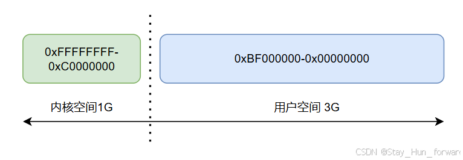
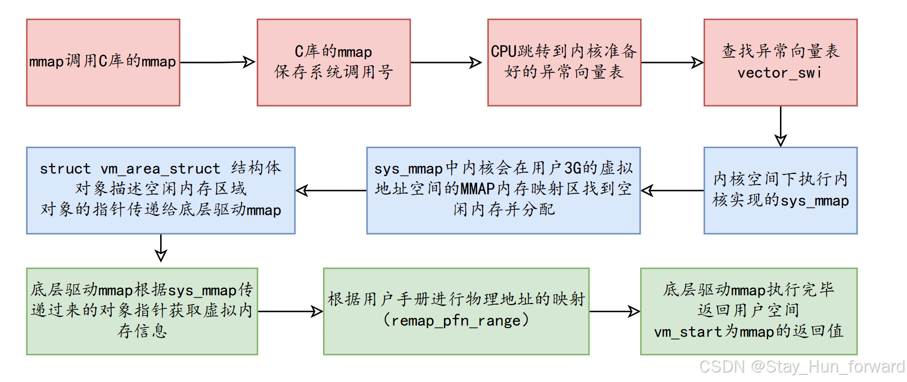
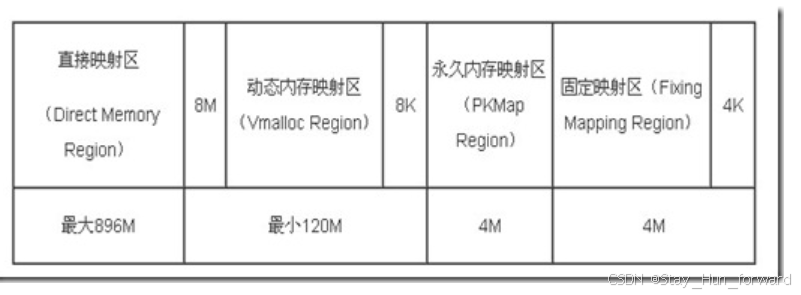

# 【Linux内存】Linux的内存管理机制

## Linux内存管理机制

-   不管是在用户空间还是在内核空间，程序代码一律不能直接访问物理地址。
-   用户空间和内核空间访问必须要访问虚拟地址，只是各个空间对应的虚拟地址是不一样的。
-   内核空间的设备驱动程序要想访问各个寄存器的物理地址，只需要将物理地址映射到内核空间的虚拟地址上，一旦映射成功，以后在内核空间的设备驱动程序中访问虚拟地址就是在访问对应的物理地址（MMU实现地址的转换）
-   一个物理地址可以有多个虚拟地址，但是一个虚拟地址不能有多个物理地址。
-   内核提供了ioremap函数实现了将物理地址映射到内核虚拟地址的动态内存映射区上。
-   void \*ioremap(unsigned long phys\_addr, unsigned long size)
    -   函数功能：将物理地址映射到内核的虚拟地址上，建立物理地址和内核虚拟地址的联系（也就是页表）
-   相应的 使用完不需要映射时需要解除地址映射：iounmap()
-   用户程序（应用程序、驱动程序）访问的地址都是虚拟地址，不能直接访问物理地址。
-   CPU最终访问的地址都是物理地址，中间需要把虚拟地址转换成实际的物理地址。

### 4G[虚拟地址空间](https://so.csdn.net/so/search?q=%E8%99%9A%E6%8B%9F%E5%9C%B0%E5%9D%80%E7%A9%BA%E9%97%B4&spm=1001.2101.3001.7020)的划分

每个进程在用户空间都有自己独立的3G虚拟地址空间，但是内核空间对于进程都是公用的。  

#### LED驱动：

用户空间->内核空间->硬件[寄存器](https://so.csdn.net/so/search?q=%E5%AF%84%E5%AD%98%E5%99%A8&spm=1001.2101.3001.7020)  
1.将用户空间的数据[拷贝到](https://so.csdn.net/so/search?q=%E6%8B%B7%E8%B4%9D%E5%88%B0&spm=1001.2101.3001.7020)内核空间  
2.在从内核空间拷贝数据到硬件寄存器

#### 按键驱动：

硬件寄存器->内核空间->用户空间  
1.驱动程序从硬件寄存器获取数据拷贝到内核空间  
2.在从内核空间拷贝数据到用户空间

### mmap系统调用的过程：

1.mmap调用C库的mmap  
2.C库的mmap保存mmap的系统调用号，然后调用swi触发软中断异常  
3.CPU跳转到内核准备好的异常向量表对应的位置：vector\_swi  
4.根据mmap的系统调用号找到对应的内核实现sys\_mmap  
5.sys\_mmap中内核会在用户3G的虚拟地址空间的MMAP内存映射区，找一块空闲的虚拟内存，然后分配一个struct vm\_area\_struct结构体对象来描述这块空闲的内存区域，然后将这个对象的指针传递给底层驱动的mmap  
6.底层驱动的mmap，根据sys\_mmap传递过来的对象指针获取到用户的虚拟内存的信息（vm\_start:空闲内存区域的首地址），然后再根据芯片手册或者原理图得到物理地址，然后调用remap\_pfn\_range进行地址映射（将物理地址映射到vm\_start）  
7.底层驱动的mmap执行完毕，返回用户空间，将vm\_start作为mmap的返回值！

### 内核空间、用户空间、物理内存的映射

用户访问的地址都是虚拟地址，但是CPU最终访问的地址都是物理地址，同样用户在用户空间或者内核空间访问一块虚拟内存，也需要映射到实际的物理内存上，才可以正常使用。  
内核空间（1G）和物理内存的映射在内核初始化时就已经完成了一一映射，以后再程序运行时可以直接进行地址转换而无虚再建立页表。  
如果物理内存是2G，如果按照这种一一映射，由于内核空间为1G，导致内核最多只能访问1G的物理内存，后续的1G物理内存无法进行访问。  
但是内核需要能够访问到所有的物理内存，如何解决的呢，

-   用户空间和物理内存的映射，这种映射是需要时进行动态映射，用户最多只能访问3G的物理内存
-   如果物理内存大于1G内核虚拟内存，并且内核要求能够访问到所有的物理内存，内核将1G的内核虚拟内存进行划分，
-   对于X86架构，将内核1G虚拟内存分为四个分区  
    
-   **直接内存映射区**（**低端内存lowmem**)：
    -   内核初始化时就已经将物理内存前的896M和内核1G虚拟内存的前896M做好了一一映射
    -   线性映射，可以提高访问速度。  
        **\- 第二、第三、第四分区加起来合称高端内存（highmem）**
-   **动态内存映射区**
    -   动态内存映射需要动态建立物理内存和内核的120M虚拟内存的映射关系，属于非线性映射
-   **永久内存映射区**
    -   属于动态映射物理和虚拟之间的一种手段，由于操作访问访问物理内存的频率会高，为了提供地址转换的效率和访问效率，一经建立就 无需再接触映射关系，以此加快地址的访问速度。大小为4M
    -   可能会导致休眠，只能再进程上下文中使用，如果访问的物理内存是低于低端内存，直接返回对应的虚拟地址即可，如果访问的是高端内存，需要动态建立页表。
-   **固定内存映射区**
    -   思路和永久内存映射区的思路移植，只是用于中断上下文中。4M

### linux提供的内核内存分配方法

-   kmalloc/kfree():从低端内存分配，分配的内存在物理上连续，虚拟上也连续，分配到的大小最小是32个字节，最大是128K。在后续的内核版本里面最大是4M
-   void \*kmalloc(size\_t size, gfp\_t flags);size：指定分配内存的大小;flags:分配内存的行为：
    -   GFP\_KERNEL:如果分配内存时，指定这个标志，就是在告诉内存的内存管理单元请努力的让这次分配内存的结果是成功的！如果系统内存不足，可以进行休眠，等待空闲页出现！  
        注意：使用这个标志可能导致休眠，所以不能在中断上下文中使用。
    -   GFP\_ATOMIC:如果分配内存时，内存不足，不会进行休眠，而是立即返回，所以这个标志分配内存时，导致分配内存失败的概率大点！  
        结论：一般程序员都要求分配内存是成功的，所以分配内存一般在驱动的入口函数完成！
-   vmalloc/vfree():从动态内存映射区分配内存，虚拟上连续，物理上不一定连续。如果默认的动态内存映射区为120M，那么最多也就分配120M，如果内存不足，可能会导致分配的进入休眠状态。

## 参考

[【Linux内存】Linux的内存管理机制_linux内存管理机制-CSDN博客](https://blog.csdn.net/Stay_Hun_forward/article/details/141712964?spm=1001.2014.3001.5506)