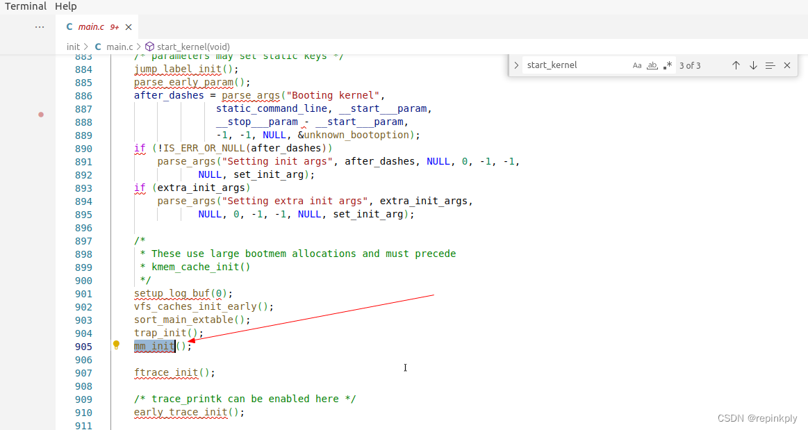

# Linux内核源码分析-内存管理

## Linux内核内存布局

64位[Linux系统](https://so.csdn.net/so/search?q=Linux%E7%B3%BB%E7%BB%9F&spm=1001.2101.3001.7020)一般使用48位表示虚拟地址空间，45位表示物理地址。通过命令：cat /proc/cpuinfo。查看Linux内核位数和proc文件系统输出系统软硬件信息如下：

### 

## 为什么64位Linux系统一般使用48位表示虚拟地址空间？

64 位系统理论的寻址范围是 2^64，也就是 16EB。但是，从目前来看，我们的系统和应  
用往往用不到这么庞大的地址空间。因此，在目前的 Intel 64 架构里定义了 canonical  
address 的概念，即在 64 位的模式下，如果地址位 63 到地址的最高有效位被设置为全 1  
或全零，那么该地址被认为是 canonical form。目前，Intel 64 处理器往往支持 48 位的  
虚拟地址，这意味着 canonical address 必须将第 63 位到第 48 位设置为零或一（这取决  
于第 47 位是零还是一）。

所以，目前的 64 系统下的寻址空间是 2^48，即 256TB。而且根据 canonical address  
的划分，地址空间天然地被分割成两个区间，分别是 0x0 - 0x00007fffffffffff 和

0xffff800000000000 - 0xffffffffffffffff。这样就直接将低 128T 的空间划分为用户空间，高 128T 划分为内核空间。上面这张图展示了 Intel 64 机器上的 Linux 进程内存布局。

从图中你可以看到，在用户空间和内核空间之间有一个巨大的内存空洞。这块空间之所以  
用更深颜色来区分，是因为这块空间的不可访问是由 CPU 来保证的（这里的地址都不满足  
Intel 64 的 Canonical form）。

对于 64 位的程序，你在查看 /proc/pid/maps 的过程中，会发现代码段跟数据段的中间  
还有一段不可以读写的保护段，它的作用也是防止程序在读写数据段的时候越界访问到代  
码段，这个保护段可以让越界访问行为直接崩溃，防止它继续往下运行。

在所有的内存区域中，程序员打交道最多、接触最广泛的就是堆空间。

### x86\_64架构体系内核分布情况

**通过 cat /proc/meminfo 输出系统架构内存分布情况，具体如下所示：**

    wj@ubuntu:~$ cat /proc/meminfo 
    MemTotal:        8092136 kB  //所有可用内存空间大小
    MemFree:         4052724 kB  //系统还没有使用的内存   
    MemAvailable:    6774380 kB  //真正系统可用内存
    Buffers:           31752 kB  //专门用来给快设备做缓存的内存
    Cached:          2686852 kB  //分配给文件缓冲区的内存
    SwapCached:          128 kB  //被高速缓冲缓存使用的交换空间的大小
    Active:          1626804 kB  //使用高速缓冲存储器页面文件大小
    Inactive:        1601924 kB  //没有经常使用的高速缓存存储器大小
    Active(anon):       1944 kB  //活跃的匿名页
    Inactive(anon):   504340 kB  //不活跃的匿名页
    Active(file):    1624860 kB  //活跃的文件使用内存
    Inactive(file):  1097584 kB  //不活跃的文件使用内存
    Unevictable:           0 kB  //不能被释放的内存页
    Mlocked:               0 kB  //系统调用mlock，允许程序在物理内存上锁住部分或全部地址空间
    SwapTotal:       1918356 kB  //交换空间总内存大小
    SwapFree:        1917064 kB  //交换空间空闲的内存大小
    Dirty:               428 kB  //等待被写回到磁盘
    Writeback:             0 kB  //正在被写回的内存大小
    AnonPages:        510028 kB  //没有映射页的内存/映射到用户空间的非文件页表大小
    Mapped:           230588 kB  //映射文件内存
    Shmem:              2216 kB  //已经被分配的共享内存
    KReclaimable:     304448 kB  //可回收的slab内存
    Slab:             416460 kB  //内存数据结构缓存大小
    SReclaimable:     304448 kB
    SUnreclaim:       112012 kB
    KernelStack:       11120 kB
    PageTables:        12840 kB
    NFS_Unstable:          0 kB
    Bounce:                0 kB
    WritebackTmp:          0 kB
    CommitLimit:     5964424 kB    //系统实际可以分配内存
    Committed_AS:    3383776 kB    //系统当前已经分配的内存
    VmallocTotal:   34359738367 kB //预留虚拟内存的总量
    VmallocUsed:       73552 kB    //已经被使用的虚拟内存
    VmallocChunk:          0 kB    //可分配的最大逻辑地址连续的虚拟内存
    Percpu:           108032 kB
    HardwareCorrupted:     0 kB
    AnonHugePages:         0 kB
    ShmemHugePages:        0 kB
    ShmemPmdMapped:        0 kB
    FileHugePages:         0 kB
    FilePmdMapped:         0 kB
    HugePages_Total:       0
    HugePages_Free:        0
    HugePages_Rsvd:        0
    HugePages_Surp:        0
    Hugepagesize:       2048 kB
    Hugetlb:               0 kB
    DirectMap4k:      343872 kB
    DirectMap2M:     6995968 kB
    DirectMap1G:     3145728 kB

###   
Linux内核动态内存分配通过系统接口实现

1.  alloc\_pages/\_\_get\_free\_page ：以页为单位分配
2.  vmalloc ：以字节为单位分配虚拟地址连续的内存快
3.  kmalloc : 以字节为单位分配物理地址连续的内存快，它是以slab为中心

我们也可以通过vmalloc分配的内存将它统计输出，具体如下：

    root@ubuntu:/home/zhaixue# grep vmalloc /proc/vmallocinfo
    0xffffb2a80000f000-0xffffb2a800011000    8192 gen_pool_add_owner+0x4b/0xd0 pages=1 vmalloc N0=1
    0xffffb2a800011000-0xffffb2a800013000    8192 bpf_prog_alloc_no_stats+0x36/0x170 pages=1 vmalloc N0=1
    0xffffb2a800014000-0xffffb2a800019000   20480 copy_process+0x1e6/0x18e0 pages=4 vmalloc N0=4
    0xffffb2a800019000-0xffffb2a80001b000    8192 gen_pool_add_owner+0x4b/0xd0 pages=1 vmalloc N0=1
    0xffffb2a80001c000-0xffffb2a800021000   20480 copy_process+0x1e6/0x18e0 pages=4 vmalloc N0=4
    0xffffb2a800021000-0xffffb2a800023000    8192 gen_pool_add_owner+0x4b/0xd0 pages=1 vmalloc N0=1
    0xffffb2a800024000-0xffffb2a800029000   20480 copy_process+0x1e6/0x18e0 pages=4 vmalloc N0=4
    0xffffb2a800029000-0xffffb2a80002b000    8192 gen_pool_add_owner+0x4b/0xd0 pages=1 vmalloc N0=1
    0xffffb2a80002c000-0xffffb2a800031000   20480 copy_process+0x1e6/0x18e0 pages=4 vmalloc N0=4
    0xffffb2a800034000-0xffffb2a800039000   20480 copy_process+0x1e6/0x18e0 pages=4 vmalloc N0=4
    0xffffb2a80003e000-0xffffb2a800040000    8192 bpf_prog_alloc_no_stats+0x36/0x170 pages=1 vmalloc N0=1
    0xffffb2a800064000-0xffffb2a800069000   20480 copy_process+0x1e6/0x18e0 pages=4 vmalloc N0=4
    0xffffb2a800074000-0xffffb2a800079000   20480 copy_process+0x1e6/0x18e0 pages=4 vmalloc N0=4
    0xffffb2a80007b000-0xffffb2a80007f000   16384 txInit.cold+0x247/0x342 [jfs] pages=3 vmalloc N0=3
    0xffffb2a800081000-0xffffb2a800083000    8192 bpf_prog_alloc_no_stats+0x36/0x170 pages=1 vmalloc N0=1
    0xffffb2a800084000-0xffffb2a800089000   20480 copy_process+0x1e6/0x18e0 pages=4 vmalloc N0=4
    0xffffb2a800089000-0xffffb2a80008b000    8192 bpf_prog_alloc_no_stats+0x36/0x170 pages=1 vmalloc N0=1
    0xffffb2a80008c000-0xffffb2a800091000   20480 copy_process+0x1e6/0x18e0 pages=4 vmalloc N0=4
    0xffffb2a800091000-0xffffb2a800093000    8192 bpf_prog_alloc_no_stats+0x36/0x170 pages=1 vmalloc N0=1
    0xffffb2a800094000-0xffffb2a800099000   20480 copy_process+0x1e6/0x18e0 pages=4 vmalloc N0=4
    0xffffb2a800099000-0xffffb2a80009b000    8192 bpf_prog_alloc_no_stats+0x36/0x170 pages=1 vmalloc N0=1
    0xffffb2a80009c000-0xffffb2a8000a1000   20480 copy_process+0x1e6/0x18e0 pages=4 vmalloc N0=4
    0xffffb2a8000a1000-0xffffb2a8000a3000    8192 bpf_prog_alloc_no_stats+0x36/0x170 pages=1 vmalloc N0=1
    0xffffb2a8000a4000-0xffffb2a8000a9000   20480 copy_process+0x1e6/0x18e0 pages=4 vmalloc N0=4
    0xffffb2a8000a9000-0xffffb2a8000ab000    8192 bpf_prog_alloc_no_stats+0x36/0x170 pages=1 vmalloc N0=1
    0xffffb2a8000ac000-0xffffb2a8000b1000   20480 copy_process+0x1e6/0x18e0 pages=4 vmalloc N0=4
    0xffffb2a8000b1000-0xffffb2a8000b3000    8192 bpf_prog_alloc_no_stats+0x36/0x170 pages=1 vmalloc N0=1
    0xffffb2a8000b4000-0xffffb2a8000b9000   20480 copy_process+0x1e6/0x18e0 pages=4 vmalloc N0=4
    0xffffb2a8000b9000-0xffffb2a8000bb000    8192 bpf_prog_alloc_no_stats+0x36/0x170 pages=1 vmalloc N0=1
    0xffffb2a8000c1000-0xffffb2a8000c3000    8192 bpf_prog_alloc_no_stats+0x36/0x170 pages=1 vmalloc N0=1
    0xffffb2a8000c4000-0xffffb2a8000c9000   20480 copy_process+0x1e6/0x18e0 pages=4 vmalloc N0=4
    0xffffb2a8000c9000-0xffffb2a8000cb000    8192 bpf_prog_alloc_no_stats+0x36/0x170 pages=1 vmalloc N0=1
    0xffffb2a8000cc000-0xffffb2a8000d1000   20480 copy_process+0x1e6/0x18e0 pages=4 vmalloc N0=4
    0xffffb2a8000d1000-0xffffb2a8000d3000    8192 bpf_prog_alloc_no_stats+0x36/0x170 pages=1 vmalloc N0=1
    0xffffb2a8000d4000-0xffffb2a8000d9000   20480 copy_process+0x1e6/0x18e0 pages=4 vmalloc N0=4
    0xffffb2a8000d9000-0xffffb2a8000db000    8192 bpf_prog_alloc_no_stats+0x36/0x170 pages=1 vmalloc N0=1
    0xffffb2a8000dc000-0xffffb2a8000e1000   20480 copy_process+0x1e6/0x18e0 pages=4 vmalloc N0=4
    0xffffb2a8000e1000-0xffffb2a8000e3000    8192 bpf_prog_alloc_no_stats+0x36/0x170 pages=1 vmalloc N0=1
    0xffffb2a8000e4000-0xffffb2a8000e9000   20480 copy_process+0x1e6/0x18e0 pages=4 vmalloc N0=4
    0xffffb2a8000e9000-0xffffb2a8000eb000    8192 bpf_prog_alloc_no_stats+0x36/0x170 pages=1 vmalloc N0=1
    0xffffb2a8000ec000-0xffffb2a8000f1000   20480 copy_process+0x1e6/0x18e0 pages=4 vmalloc N0=4
    0xffffb2a8000f1000-0xffffb2a8000f3000    8192 bpf_prog_alloc_no_stats+0x36/0x170 pages=1 vmalloc N0=1
    0xffffb2a8000f4000-0xffffb2a8000f9000   20480 copy_process+0x1e6/0x18e0 pages=4 vmalloc N0=4
    0xffffb2a8000f9000-0xffffb2a8000fb000    8192 bpf_prog_alloc_no_stats+0x36/0x170 pages=1 vmalloc N0=1
    0xffffb2a8000fc000-0xffffb2a800101000   20480 copy_process+0x1e6/0x18e0 pages=4 vmalloc N0=4
    0xffffb2a800101000-0xffffb2a800103000    8192 bpf_prog_alloc_no_stats+0x36/0x170 pages=1 vmalloc N0=1
    0xffffb2a800104000-0xffffb2a800109000   20480 copy_process+0x1e6/0x18e0 pages=4 vmalloc N0=4
    0xffffb2a800109000-0xffffb2a80010b000    8192 bpf_prog_alloc_no_stats+0x36/0x170 pages=1 vmalloc N0=1
    0xffffb2a80010c000-0xffffb2a800111000   20480 copy_process+0x1e6/0x18e0 pages=4 vmalloc N0=4
    0xffffb2a800111000-0xffffb2a800113000    8192 bpf_prog_alloc_no_stats+0x36/0x170 pages=1 vmalloc N0=1
    0xffffb2a800114000-0xffffb2a800119000   20480 copy_process+0x1e6/0x18e0 pages=4 vmalloc N0=4
    0xffffb2a800119000-0xffffb2a80011b000    8192 bpf_prog_alloc_no_stats+0x36/0x170 pages=1 vmalloc N0=1
    0xffffb2a80011c000-0xffffb2a800121000   20480 copy_process+0x1e6/0x18e0 pages=4 vmalloc N0=4
    0xffffb2a800121000-0xffffb2a800123000    8192 bpf_prog_alloc_no_stats+0x36/0x170 pages=1 vmalloc N0=1
    0xffffb2a800124000-0xffffb2a800129000   20480 copy_process+0x1e6/0x18e0 pages=4 vmalloc N0=4
    0xffffb2a800129000-0xffffb2a80012b000    8192 bpf_prog_alloc_no_stats+0x36/0x170 pages=1 vmalloc N0=1
    0xffffb2a80012c000-0xffffb2a800131000   20480 copy_process+0x1e6/0x18e0 pages=4 vmalloc N0=4
    0xffffb2a800131000-0xffffb2a800133000    8192 bpf_prog_alloc_no_stats+0x36/0x170 pages=1 vmalloc N0=1
    0xffffb2a800134000-0xffffb2a800139000   20480 copy_process+0x1e6/0x18e0 pages=4 vmalloc N0=4
    0xffffb2a800139000-0xffffb2a80013b000    8192 swap_cgroup_swapon+0x2d/0x190 pages=1 vmalloc N0=1
    0xffffb2a80013c000-0xffffb2a800141000   20480 copy_process+0x1e6/0x18e0 pages=4 vmalloc N0=4
    0xffffb2a800141000-0xffffb2a800143000    8192 vmw_devcaps_create+0x2d/0x120 [vmwgfx] pages=1 vmalloc N0=1
    0xffffb2a800144000-0xffffb2a800149000   20480 copy_process+0x1e6/0x18e0 pages=4 vmalloc N0=4
    0xffffb2a800149000-0xffffb2a80014c000   12288 vmw_fb_init+0x1b8/0x3e0 [vmwgfx] pages=2 vmalloc N0=2
    0xffffb2a80014c000-0xffffb2a800151000   20480 copy_process+0x1e6/0x18e0 pages=4 vmalloc N0=4
    0xffffb2a800151000-0xffffb2a800153000    8192 bpf_prog_alloc_no_stats+0x36/0x170 pages=1 vmalloc N0=1
    0xffffb2a800154000-0xffffb2a800159000   20480 copy_process+0x1e6/0x18e0 pages=4 vmalloc N0=4
    0xffffb2a800159000-0xffffb2a80015b000    8192 bpf_prog_alloc_no_stats+0x36/0x170 pages=1 vmalloc N0=1
    0xffffb2a80015c000-0xffffb2a800161000   20480 copy_process+0x1e6/0x18e0 pages=4 vmalloc N0=4
    0xffffb2a800161000-0xffffb2a800163000    8192 bpf_prog_alloc_no_stats+0x36/0x170 pages=1 vmalloc N0=1
    0xffffb2a800164000-0xffffb2a800169000   20480 copy_process+0x1e6/0x18e0 pages=4 vmalloc N0=4
    0xffffb2a800169000-0xffffb2a80016b000    8192 bpf_prog_alloc_no_stats+0x36/0x170 pages=1 vmalloc N0=1
    0xffffb2a80016c000-0xffffb2a800171000   20480 copy_process+0x1e6/0x18e0 pages=4 vmalloc N0=4
    0xffffb2a800171000-0xffffb2a800173000    8192 bpf_prog_alloc_no_stats+0x36/0x170 pages=1 vmalloc N0=1
    0xffffb2a800174000-0xffffb2a800179000   20480 copy_process+0x1e6/0x18e0 pages=4 vmalloc N0=4
    0xffffb2a800179000-0xffffb2a80017b000    8192 bpf_prog_alloc_no_stats+0x36/0x170 pages=1 vmalloc N0=1
    0xffffb2a80017c000-0xffffb2a800181000   20480 copy_process+0x1e6/0x18e0 pages=4 vmalloc N0=4
    0xffffb2a800181000-0xffffb2a800183000    8192 bpf_prog_alloc_no_stats+0x36/0x170 pages=1 vmalloc N0=1
    0xffffb2a800184000-0xffffb2a800189000   20480 copy_process+0x1e6/0x18e0 pages=4 vmalloc N0=4
    0xffffb2a800189000-0xffffb2a80018b000    8192 bpf_prog_alloc_no_stats+0x36/0x170 pages=1 vmalloc N0=1
    0xffffb2a80018c000-0xffffb2a800191000   20480 copy_process+0x1e6/0x18e0 pages=4 vmalloc N0=4
    0xffffb2a800191000-0xffffb2a800193000    8192 bpf_prog_alloc_no_stats+0x36/0x170 pages=1 vmalloc N0=1
    0xffffb2a800194000-0xffffb2a800199000   20480 copy_process+0x1e6/0x18e0 pages=4 vmalloc N0=4
    0xffffb2a800199000-0xffffb2a80019b000    8192 bpf_prog_alloc_no_stats+0x36/0x170 pages=1 vmalloc N0=1
    0xffffb2a80019c000-0xffffb2a8001a1000   20480 copy_process+0x1e6/0x18e0 pages=4 vmalloc N0=4
    0xffffb2a8001a1000-0xffffb2a8001a3000    8192 bpf_prog_alloc_no_stats+0x36/0x170 pages=1 vmalloc N0=1
    0xffffb2a8001a4000-0xffffb2a8001a9000   20480 copy_process+0x1e6/0x18e0 pages=4 vmalloc N0=4
    0xffffb2a8001a9000-0xffffb2a8001ab000    8192 bpf_prog_alloc_no_stats+0x36/0x170 pages=1 vmalloc N0=1
    0xffffb2a8001ac000-0xffffb2a8001b1000   20480 copy_process+0x1e6/0x18e0 pages=4 vmalloc N0=4
    0xffffb2a8001b1000-0xffffb2a8001b3000    8192 bpf_prog_alloc_no_stats+0x36/0x170 pages=1 vmalloc N0=1
    0xffffb2a8001b4000-0xffffb2a8001b9000   20480 copy_process+0x1e6/0x18e0 pages=4 vmalloc N0=4
    0xffffb2a8001b9000-0xffffb2a8001bb000    8192 bpf_prog_alloc_no_stats+0x36/0x170 pages=1 vmalloc N0=1
    0xffffb2a8001bc000-0xffffb2a8001c1000   20480 copy_process+0x1e6/0x18e0 pages=4 vmalloc N0=4
    0xffffb2a8001c1000-0xffffb2a8001c3000    8192 bpf_prog_alloc_no_stats+0x36/0x170 pages=1 vmalloc N0=1
    0xffffb2a8001c4000-0xffffb2a8001c9000   20480 copy_process+0x1e6/0x18e0 pages=4 vmalloc N0=4
    0xffffb2a8001c9000-0xffffb2a8001cb000    8192 bpf_prog_alloc_no_stats+0x36/0x170 pages=1 vmalloc N0=1
    0xffffb2a8001cc000-0xffffb2a8001d1000   20480 copy_process+0x1e6/0x18e0 pages=4 vmalloc N0=4
    0xffffb2a8001d1000-0xffffb2a8001d3000    8192 bpf_prog_alloc_no_stats+0x36/0x170 pages=1 vmalloc N0=1
    0xffffb2a8001d4000-0xffffb2a8001d9000   20480 copy_process+0x1e6/0x18e0 pages=4 vmalloc N0=4
    0xffffb2a8001d9000-0xffffb2a8001db000    8192 bpf_prog_alloc_no_stats+0x36/0x170 pages=1 vmalloc N0=1
    0xffffb2a8001dc000-0xffffb2a8001e1000   20480 copy_process+0x1e6/0x18e0 pages=4 vmalloc N0=4
    0xffffb2a8001e1000-0xffffb2a8001e3000    8192 bpf_prog_alloc_no_stats+0x36/0x170 pages=1 vmalloc N0=1
    0xffffb2a8001e4000-0xffffb2a8001e9000   20480 copy_process+0x1e6/0x18e0 pages=4 vmalloc N0=4
    0xffffb2a8001e9000-0xffffb2a8001eb000    8192 bpf_prog_alloc_no_stats+0x36/0x170 pages=1 vmalloc N0=1
    0xffffb2a8001ec000-0xffffb2a8001f1000   20480 copy_process+0x1e6/0x18e0 pages=4 vmalloc N0=4
    0xffffb2a8001f1000-0xffffb2a8001f3000    8192 bpf_prog_alloc_no_stats+0x36/0x170 pages=1 vmalloc N0=1
    0xffffb2a8001f4000-0xffffb2a8001f9000   20480 copy_process+0x1e6/0x18e0 pages=4 vmalloc N0=4
    0xffffb2a8001f9000-0xffffb2a8001fb000    8192 bpf_prog_alloc_no_stats+0x36/0x170 pages=1 vmalloc N0=1
    0xffffb2a8001fc000-0xffffb2a800201000   20480 copy_process+0x1e6/0x18e0 pages=4 vmalloc N0=4
    0xffffb2a800201000-0xffffb2a800203000    8192 bpf_prog_alloc_no_stats+0x36/0x170 pages=1 vmalloc N0=1
    0xffffb2a800204000-0xffffb2a800209000   20480 copy_process+0x1e6/0x18e0 pages=4 vmalloc N0=4
    0xffffb2a800209000-0xffffb2a80020b000    8192 bpf_prog_alloc_no_stats+0x36/0x170 pages=1 vmalloc N0=1
    0xffffb2a80020c000-0xffffb2a800211000   20480 copy_process+0x1e6/0x18e0 pages=4 vmalloc N0=4
    0xffffb2a800211000-0xffffb2a800213000    8192 bpf_prog_alloc_no_stats+0x36/0x170 pages=1 vmalloc N0=1
    0xffffb2a800214000-0xffffb2a800219000   20480 copy_process+0x1e6/0x18e0 pages=4 vmalloc N0=4
    0xffffb2a800219000-0xffffb2a80021b000    8192 bpf_prog_alloc_no_stats+0x36/0x170 pages=1 vmalloc N0=1
    0xffffb2a80021c000-0xffffb2a800221000   20480 copy_process+0x1e6/0x18e0 pages=4 vmalloc N0=4
    0xffffb2a800221000-0xffffb2a800223000    8192 bpf_prog_alloc_no_stats+0x36/0x170 pages=1 vmalloc N0=1
    0xffffb2a800224000-0xffffb2a800229000   20480 copy_process+0x1e6/0x18e0 pages=4 vmalloc N0=4
    0xffffb2a800229000-0xffffb2a80022b000    8192 bpf_prog_alloc_no_stats+0x36/0x170 pages=1 vmalloc N0=1
    0xffffb2a80022c000-0xffffb2a800231000   20480 copy_process+0x1e6/0x18e0 pages=4 vmalloc N0=4
    0xffffb2a800231000-0xffffb2a800233000    8192 bpf_prog_alloc_no_stats+0x36/0x170 pages=1 vmalloc N0=1
    0xffffb2a800234000-0xffffb2a800239000   20480 copy_process+0x1e6/0x18e0 pages=4 vmalloc N0=4
    0xffffb2a800239000-0xffffb2a80023b000    8192 bpf_prog_alloc_no_stats+0x36/0x170 pages=1 vmalloc N0=1
    0xffffb2a80023c000-0xffffb2a800241000   20480 copy_process+0x1e6/0x18e0 pages=4 vmalloc N0=4
    0xffffb2a800241000-0xffffb2a800243000    8192 bpf_prog_alloc_no_stats+0x36/0x170 pages=1 vmalloc N0=1
    0xffffb2a800244000-0xffffb2a800249000   20480 copy_process+0x1e6/0x18e0 pages=4 vmalloc N0=4
    0xffffb2a800249000-0xffffb2a80024b000    8192 bpf_prog_alloc_no_stats+0x36/0x170 pages=1 vmalloc N0=1
    0xffffb2a80024c000-0xffffb2a800251000   20480 copy_process+0x1e6/0x18e0 pages=4 vmalloc N0=4
    0xffffb2a800251000-0xffffb2a800253000    8192 bpf_prog_alloc_no_stats+0x36/0x170 pages=1 vmalloc N0=1
    0xffffb2a800254000-0xffffb2a800259000   20480 copy_process+0x1e6/0x18e0 pages=4 vmalloc N0=4
    0xffffb2a800259000-0xffffb2a80025b000    8192 bpf_prog_alloc_no_stats+0x36/0x170 pages=1 vmalloc N0=1
    0xffffb2a80025c000-0xffffb2a800261000   20480 copy_process+0x1e6/0x18e0 pages=4 vmalloc N0=4
    0xffffb2a800261000-0xffffb2a800263000    8192 bpf_prog_alloc_no_stats+0x36/0x170 pages=1 vmalloc N0=1
    0xffffb2a800264000-0xffffb2a800269000   20480 copy_process+0x1e6/0x18e0 pages=4 vmalloc N0=4
    0xffffb2a800269000-0xffffb2a80026b000    8192 bpf_prog_alloc_no_stats+0x36/0x170 pages=1 vmalloc N0=1
    0xffffb2a80026c000-0xffffb2a800271000   20480 copy_process+0x1e6/0x18e0 pages=4 vmalloc N0=4
    0xffffb2a800271000-0xffffb2a800273000    8192 bpf_prog_alloc_no_stats+0x36/0x170 pages=1 vmalloc N0=1
    0xffffb2a800274000-0xffffb2a800279000   20480 copy_process+0x1e6/0x18e0 pages=4 vmalloc N0=4
    0xffffb2a800279000-0xffffb2a80027b000    8192 bpf_prog_alloc_no_stats+0x36/0x170 pages=1 vmalloc N0=1
    0xffffb2a80027c000-0xffffb2a800281000   20480 copy_process+0x1e6/0x18e0 pages=4 vmalloc N0=4
    0xffffb2a800281000-0xffffb2a800283000    8192 bpf_prog_alloc_no_stats+0x36/0x170 pages=1 vmalloc N0=1
    0xffffb2a800284000-0xffffb2a800289000   20480 copy_process+0x1e6/0x18e0 pages=4 vmalloc N0=4
    0xffffb2a800289000-0xffffb2a80028b000    8192 bpf_prog_alloc_no_stats+0x36/0x170 pages=1 vmalloc N0=1
    0xffffb2a80028c000-0xffffb2a800291000   20480 copy_process+0x1e6/0x18e0 pages=4 vmalloc N0=4
    0xffffb2a800291000-0xffffb2a800293000    8192 bpf_prog_alloc_no_stats+0x36/0x170 pages=1 vmalloc N0=1
    0xffffb2a800294000-0xffffb2a800299000   20480 copy_process+0x1e6/0x18e0 pages=4 vmalloc N0=4
    0xffffb2a800299000-0xffffb2a80029b000    8192 bpf_prog_alloc_no_stats+0x36/0x170 pages=1 vmalloc N0=1
    0xffffb2a80029c000-0xffffb2a8002a1000   20480 copy_process+0x1e6/0x18e0 pages=4 vmalloc N0=4
    0xffffb2a8002a1000-0xffffb2a8002a3000    8192 bpf_prog_alloc_no_stats+0x36/0x170 pages=1 vmalloc N0=1
    0xffffb2a8002a4000-0xffffb2a8002a9000   20480 copy_process+0x1e6/0x18e0 pages=4 vmalloc N0=4
    0xffffb2a8002a9000-0xffffb2a8002ab000    8192 bpf_prog_alloc_no_stats+0x36/0x170 pages=1 vmalloc N0=1
    0xffffb2a8002ac000-0xffffb2a8002b1000   20480 copy_process+0x1e6/0x18e0 pages=4 vmalloc N0=4
    0xffffb2a8002b1000-0xffffb2a8002b3000    8192 bpf_prog_alloc_no_stats+0x36/0x170 pages=1 vmalloc N0=1
    0xffffb2a8002b4000-0xffffb2a8002b9000   20480 copy_process+0x1e6/0x18e0 pages=4 vmalloc N0=4
    0xffffb2a8002b9000-0xffffb2a8002bb000    8192 bpf_prog_alloc_no_stats+0x36/0x170 pages=1 vmalloc N0=1
    0xffffb2a8002bc000-0xffffb2a8002c1000   20480 copy_process+0x1e6/0x18e0 pages=4 vmalloc N0=4
    0xffffb2a8002c1000-0xffffb2a8002c3000    8192 bpf_prog_alloc_no_stats+0x36/0x170 pages=1 vmalloc N0=1
    0xffffb2a8002c4000-0xffffb2a8002c9000   20480 copy_process+0x1e6/0x18e0 pages=4 vmalloc N0=4
    0xffffb2a8002c9000-0xffffb2a8002cb000    8192 e1000_setup_all_rx_resources+0x94/0x290 [e1000] pages=1 vmalloc N0=1
    0xffffb2a8002cc000-0xffffb2a8002d1000   20480 copy_process+0x1e6/0x18e0 pages=4 vmalloc N0=4
    0xffffb2a8002d1000-0xffffb2a8002d3000    8192 bpf_prog_alloc_no_stats+0x36/0x170 pages=1 vmalloc N0=1
    0xffffb2a8002d4000-0xffffb2a8002d9000   20480 copy_process+0x1e6/0x18e0 pages=4 vmalloc N0=4
    0xffffb2a8002dc000-0xffffb2a8002e1000   20480 copy_process+0x1e6/0x18e0 pages=4 vmalloc N0=4
    0xffffb2a8002e1000-0xffffb2a8002e3000    8192 bpf_prog_alloc_no_stats+0x36/0x170 pages=1 vmalloc N0=1
    0xffffb2a8002e4000-0xffffb2a8002e9000   20480 copy_process+0x1e6/0x18e0 pages=4 vmalloc N0=4
    0xffffb2a8002e9000-0xffffb2a8002ec000   12288 pcpu_mem_zalloc+0x30/0x60 pages=2 vmalloc N0=2
    0xffffb2a8002ec000-0xffffb2a8002f1000   20480 copy_process+0x1e6/0x18e0 pages=4 vmalloc N0=4
    0xffffb2a8002f1000-0xffffb2a8002f3000    8192 bpf_prog_alloc_no_stats+0x36/0x170 pages=1 vmalloc N0=1
    0xffffb2a8002f4000-0xffffb2a8002f9000   20480 copy_process+0x1e6/0x18e0 pages=4 vmalloc N0=4
    0xffffb2a8002f9000-0xffffb2a8002fb000    8192 bpf_prog_alloc_no_stats+0x36/0x170 pages=1 vmalloc N0=1
    0xffffb2a8002fc000-0xffffb2a800301000   20480 copy_process+0x1e6/0x18e0 pages=4 vmalloc N0=4
    0xffffb2a800301000-0xffffb2a800303000    8192 bpf_prog_alloc_no_stats+0x36/0x170 pages=1 vmalloc N0=1
    0xffffb2a800304000-0xffffb2a800309000   20480 copy_process+0x1e6/0x18e0 pages=4 vmalloc N0=4
    0xffffb2a800309000-0xffffb2a80030b000    8192 bpf_prog_alloc_no_stats+0x36/0x170 pages=1 vmalloc N0=1
    0xffffb2a80030c000-0xffffb2a800311000   20480 copy_process+0x1e6/0x18e0 pages=4 vmalloc N0=4
    0xffffb2a800311000-0xffffb2a800313000    8192 bpf_prog_alloc_no_stats+0x36/0x170 pages=1 vmalloc N0=1
    0xffffb2a800314000-0xffffb2a800319000   20480 copy_process+0x1e6/0x18e0 pages=4 vmalloc N0=4
    0xffffb2a800319000-0xffffb2a80031b000    8192 bpf_prog_alloc_no_stats+0x36/0x170 pages=1 vmalloc N0=1
    0xffffb2a80031c000-0xffffb2a800321000   20480 copy_process+0x1e6/0x18e0 pages=4 vmalloc N0=4
    0xffffb2a800321000-0xffffb2a800323000    8192 bpf_prog_alloc_no_stats+0x36/0x170 pages=1 vmalloc N0=1
    0xffffb2a800324000-0xffffb2a800329000   20480 copy_process+0x1e6/0x18e0 pages=4 vmalloc N0=4
    0xffffb2a800329000-0xffffb2a80032b000    8192 bpf_prog_alloc_no_stats+0x36/0x170 pages=1 vmalloc N0=1
    0xffffb2a80032c000-0xffffb2a800331000   20480 copy_process+0x1e6/0x18e0 pages=4 vmalloc N0=4
    0xffffb2a800331000-0xffffb2a800333000    8192 bpf_prog_alloc_no_stats+0x36/0x170 pages=1 vmalloc N0=1
    0xffffb2a800334000-0xffffb2a800339000   20480 copy_process+0x1e6/0x18e0 pages=4 vmalloc N0=4
    0xffffb2a800339000-0xffffb2a80033b000    8192 bpf_prog_alloc_no_stats+0x36/0x170 pages=1 vmalloc N0=1
    0xffffb2a80033c000-0xffffb2a800341000   20480 copy_process+0x1e6/0x18e0 pages=4 vmalloc N0=4
    0xffffb2a800341000-0xffffb2a800343000    8192 bpf_prog_alloc_no_stats+0x36/0x170 pages=1 vmalloc N0=1
    0xffffb2a800344000-0xffffb2a800349000   20480 copy_process+0x1e6/0x18e0 pages=4 vmalloc N0=4
    0xffffb2a800349000-0xffffb2a80034b000    8192 bpf_prog_alloc_no_stats+0x36/0x170 pages=1 vmalloc N0=1
    0xffffb2a80034c000-0xffffb2a800351000   20480 copy_process+0x1e6/0x18e0 pages=4 vmalloc N0=4
    0xffffb2a800351000-0xffffb2a800353000    8192 bpf_prog_alloc_no_stats+0x36/0x170 pages=1 vmalloc N0=1
    0xffffb2a800354000-0xffffb2a800359000   20480 copy_process+0x1e6/0x18e0 pages=4 vmalloc N0=4
    0xffffb2a800359000-0xffffb2a80035b000    8192 bpf_prog_alloc_no_stats+0x36/0x170 pages=1 vmalloc N0=1
    0xffffb2a80035c000-0xffffb2a800361000   20480 copy_process+0x1e6/0x18e0 pages=4 vmalloc N0=4
    0xffffb2a800361000-0xffffb2a800363000    8192 bpf_prog_alloc_no_stats+0x36/0x170 pages=1 vmalloc N0=1
    0xffffb2a800364000-0xffffb2a800369000   20480 copy_process+0x1e6/0x18e0 pages=4 vmalloc N0=4
    0xffffb2a800369000-0xffffb2a80036b000    8192 bpf_prog_alloc_no_stats+0x36/0x170 pages=1 vmalloc N0=1
    0xffffb2a80036c000-0xffffb2a800371000   20480 copy_process+0x1e6/0x18e0 pages=4 vmalloc N0=4
    0xffffb2a800371000-0xffffb2a800373000    8192 bpf_prog_alloc_no_stats+0x36/0x170 pages=1 vmalloc N0=1
    0xffffb2a800374000-0xffffb2a800379000   20480 copy_process+0x1e6/0x18e0 pages=4 vmalloc N0=4
    0xffffb2a800379000-0xffffb2a80037b000    8192 bpf_prog_alloc_no_stats+0x36/0x170 pages=1 vmalloc N0=1
    0xffffb2a80037c000-0xffffb2a800381000   20480 copy_process+0x1e6/0x18e0 pages=4 vmalloc N0=4
    0xffffb2a800381000-0xffffb2a800383000    8192 bpf_prog_alloc_no_stats+0x36/0x170 pages=1 vmalloc N0=1
    0xffffb2a800384000-0xffffb2a800389000   20480 copy_process+0x1e6/0x18e0 pages=4 vmalloc N0=4
    0xffffb2a800389000-0xffffb2a80038b000    8192 bpf_prog_alloc_no_stats+0x36/0x170 pages=1 vmalloc N0=1
    0xffffb2a80038c000-0xffffb2a800391000   20480 copy_process+0x1e6/0x18e0 pages=4 vmalloc N0=4
    0xffffb2a800391000-0xffffb2a800393000    8192 bpf_prog_alloc_no_stats+0x36/0x170 pages=1 vmalloc N0=1
    0xffffb2a800394000-0xffffb2a800399000   20480 copy_process+0x1e6/0x18e0 pages=4 vmalloc N0=4
    0xffffb2a800399000-0xffffb2a80039b000    8192 bpf_prog_alloc_no_stats+0x36/0x170 pages=1 vmalloc N0=1
    0xffffb2a80039c000-0xffffb2a8003a1000   20480 copy_process+0x1e6/0x18e0 pages=4 vmalloc N0=4
    0xffffb2a8003a1000-0xffffb2a8003a3000    8192 bpf_prog_alloc_no_stats+0x36/0x170 pages=1 vmalloc N0=1
    0xffffb2a8003a4000-0xffffb2a8003a9000   20480 copy_process+0x1e6/0x18e0 pages=4 vmalloc N0=4
    0xffffb2a8003a9000-0xffffb2a8003ab000    8192 bpf_prog_alloc_no_stats+0x36/0x170 pages=1 vmalloc N0=1
    0xffffb2a8003ac000-0xffffb2a8003b1000   20480 copy_process+0x1e6/0x18e0 pages=4 vmalloc N0=4
    0xffffb2a8003b1000-0xffffb2a8003b3000    8192 bpf_prog_alloc_no_stats+0x36/0x170 pages=1 vmalloc N0=1
    0xffffb2a8003b4000-0xffffb2a8003b9000   20480 copy_process+0x1e6/0x18e0 pages=4 vmalloc N0=4
    0xffffb2a8003b9000-0xffffb2a8003bb000    8192 bpf_prog_alloc_no_stats+0x36/0x170 pages=1 vmalloc N0=1
    0xffffb2a8003bc000-0xffffb2a8003c1000   20480 copy_process+0x1e6/0x18e0 pages=4 vmalloc N0=4
    0xffffb2a8003c1000-0xffffb2a8003c3000    8192 bpf_prog_alloc_no_stats+0x36/0x170 pages=1 vmalloc N0=1
    0xffffb2a8003c4000-0xffffb2a8003c9000   20480 copy_process+0x1e6/0x18e0 pages=4 vmalloc N0=4
    0xffffb2a8003c9000-0xffffb2a8003cb000    8192 bpf_prog_alloc_no_stats+0x36/0x170 pages=1 vmalloc N0=1
    0xffffb2a8003cc000-0xffffb2a8003d1000   20480 copy_process+0x1e6/0x18e0 pages=4 vmalloc N0=4
    0xffffb2a8003d1000-0xffffb2a8003d3000    8192 bpf_prog_alloc_no_stats+0x36/0x170 pages=1 vmalloc N0=1
    0xffffb2a8003d4000-0xffffb2a8003d9000   20480 copy_process+0x1e6/0x18e0 pages=4 vmalloc N0=4
    0xffffb2a8003d9000-0xffffb2a8003db000    8192 bpf_prog_alloc_no_stats+0x36/0x170 pages=1 vmalloc N0=1
    0xffffb2a8003dc000-0xffffb2a8003e1000   20480 copy_process+0x1e6/0x18e0 pages=4 vmalloc N0=4
    0xffffb2a8003e1000-0xffffb2a8003e3000    8192 bpf_prog_alloc_no_stats+0x36/0x170 pages=1 vmalloc N0=1
    0xffffb2a8003e4000-0xffffb2a8003e9000   20480 copy_process+0x1e6/0x18e0 pages=4 vmalloc N0=4
    0xffffb2a8003e9000-0xffffb2a8003eb000    8192 bpf_prog_alloc_no_stats+0x36/0x170 pages=1 vmalloc N0=1
    0xffffb2a8003ec000-0xffffb2a8003f1000   20480 copy_process+0x1e6/0x18e0 pages=4 vmalloc N0=4
    0xffffb2a8003f1000-0xffffb2a8003f3000    8192 bpf_prog_alloc_no_stats+0x36/0x170 pages=1 vmalloc N0=1
    0xffffb2a8003f4000-0xffffb2a8003f9000   20480 copy_process+0x1e6/0x18e0 pages=4 vmalloc N0=4
    0xffffb2a8003f9000-0xffffb2a8003fb000    8192 bpf_prog_alloc_no_stats+0x36/0x170 pages=1 vmalloc N0=1
    0xffffb2a8003fc000-0xffffb2a800401000   20480 copy_process+0x1e6/0x18e0 pages=4 vmalloc N0=4
    0xffffb2a800401000-0xffffb2a800403000    8192 bpf_prog_alloc_no_stats+0x36/0x170 pages=1 vmalloc N0=1
    0xffffb2a800404000-0xffffb2a800409000   20480 copy_process+0x1e6/0x18e0 pages=4 vmalloc N0=4
    0xffffb2a800409000-0xffffb2a80040b000    8192 bpf_prog_alloc_no_stats+0x36/0x170 pages=1 vmalloc N0=1
    0xffffb2a80040c000-0xffffb2a800411000   20480 copy_process+0x1e6/0x18e0 pages=4 vmalloc N0=4
    0xffffb2a800411000-0xffffb2a800413000    8192 bpf_prog_alloc_no_stats+0x36/0x170 pages=1 vmalloc N0=1
    0xffffb2a800414000-0xffffb2a800419000   20480 copy_process+0x1e6/0x18e0 pages=4 vmalloc N0=4
    0xffffb2a800419000-0xffffb2a80041b000    8192 bpf_prog_alloc_no_stats+0x36/0x170 pages=1 vmalloc N0=1
    0xffffb2a80041c000-0xffffb2a800421000   20480 copy_process+0x1e6/0x18e0 pages=4 vmalloc N0=4
    0xffffb2a800421000-0xffffb2a800423000    8192 bpf_prog_alloc_no_stats+0x36/0x170 pages=1 vmalloc N0=1
    0xffffb2a800424000-0xffffb2a800429000   20480 copy_process+0x1e6/0x18e0 pages=4 vmalloc N0=4
    0xffffb2a800429000-0xffffb2a80042b000    8192 bpf_prog_alloc_no_stats+0x36/0x170 pages=1 vmalloc N0=1
    0xffffb2a80042c000-0xffffb2a800431000   20480 copy_process+0x1e6/0x18e0 pages=4 vmalloc N0=4
    0xffffb2a800431000-0xffffb2a800433000    8192 bpf_prog_alloc_no_stats+0x36/0x170 pages=1 vmalloc N0=1
    0xffffb2a800434000-0xffffb2a800439000   20480 copy_process+0x1e6/0x18e0 pages=4 vmalloc N0=4
    0xffffb2a800439000-0xffffb2a80043b000    8192 bpf_prog_alloc_no_stats+0x36/0x170 pages=1 vmalloc N0=1
    0xffffb2a80043c000-0xffffb2a800441000   20480 copy_process+0x1e6/0x18e0 pages=4 vmalloc N0=4
    0xffffb2a800441000-0xffffb2a800443000    8192 bpf_prog_alloc_no_stats+0x36/0x170 pages=1 vmalloc N0=1
    0xffffb2a800444000-0xffffb2a800449000   20480 copy_process+0x1e6/0x18e0 pages=4 vmalloc N0=4
    0xffffb2a800449000-0xffffb2a80044b000    8192 bpf_prog_alloc_no_stats+0x36/0x170 pages=1 vmalloc N0=1
    0xffffb2a80044c000-0xffffb2a800451000   20480 copy_process+0x1e6/0x18e0 pages=4 vmalloc N0=4
    0xffffb2a800451000-0xffffb2a800453000    8192 bpf_prog_alloc_no_stats+0x36/0x170 pages=1 vmalloc N0=1
    0xffffb2a800454000-0xffffb2a800459000   20480 copy_process+0x1e6/0x18e0 pages=4 vmalloc N0=4
    0xffffb2a800459000-0xffffb2a80045b000    8192 bpf_prog_alloc_no_stats+0x36/0x170 pages=1 vmalloc N0=1
    0xffffb2a80045c000-0xffffb2a800461000   20480 copy_process+0x1e6/0x18e0 pages=4 vmalloc N0=4
    0xffffb2a800461000-0xffffb2a800463000    8192 bpf_prog_alloc_no_stats+0x36/0x170 pages=1 vmalloc N0=1
    0xffffb2a800464000-0xffffb2a800469000   20480 copy_process+0x1e6/0x18e0 pages=4 vmalloc N0=4
    0xffffb2a800469000-0xffffb2a80046b000    8192 bpf_prog_alloc_no_stats+0x36/0x170 pages=1 vmalloc N0=1
    0xffffb2a80046c000-0xffffb2a800471000   20480 copy_process+0x1e6/0x18e0 pages=4 vmalloc N0=4
    0xffffb2a800471000-0xffffb2a800473000    8192 bpf_prog_alloc_no_stats+0x36/0x170 pages=1 vmalloc N0=1
    0xffffb2a800474000-0xffffb2a800479000   20480 copy_process+0x1e6/0x18e0 pages=4 vmalloc N0=4
    0xffffb2a80047c000-0xffffb2a800481000   20480 copy_process+0x1e6/0x18e0 pages=4 vmalloc N0=4
    0xffffb2a800481000-0xffffb2a800483000    8192 bpf_prog_alloc_no_stats+0x36/0x170 pages=1 vmalloc N0=1
    0xffffb2a800484000-0xffffb2a800489000   20480 copy_process+0x1e6/0x18e0 pages=4 vmalloc N0=4
    0xffffb2a800489000-0xffffb2a80048b000    8192 bpf_prog_alloc_no_stats+0x36/0x170 pages=1 vmalloc N0=1
    0xffffb2a80048c000-0xffffb2a800491000   20480 copy_process+0x1e6/0x18e0 pages=4 vmalloc N0=4
    0xffffb2a800491000-0xffffb2a800493000    8192 bpf_prog_alloc_no_stats+0x36/0x170 pages=1 vmalloc N0=1
    0xffffb2a800494000-0xffffb2a800499000   20480 copy_process+0x1e6/0x18e0 pages=4 vmalloc N0=4
    0xffffb2a800499000-0xffffb2a80049b000    8192 bpf_prog_alloc_no_stats+0x36/0x170 pages=1 vmalloc N0=1
    0xffffb2a80049c000-0xffffb2a8004a1000   20480 copy_process+0x1e6/0x18e0 pages=4 vmalloc N0=4
    0xffffb2a8004a1000-0xffffb2a8004a3000    8192 bpf_prog_alloc_no_stats+0x36/0x170 pages=1 vmalloc N0=1
    0xffffb2a8004a4000-0xffffb2a8004a9000   20480 copy_process+0x1e6/0x18e0 pages=4 vmalloc N0=4
    0xffffb2a8004a9000-0xffffb2a8004ab000    8192 bpf_prog_alloc_no_stats+0x36/0x170 pages=1 vmalloc N0=1
    0xffffb2a8004ac000-0xffffb2a8004b1000   20480 copy_process+0x1e6/0x18e0 pages=4 vmalloc N0=4
    0xffffb2a8004b1000-0xffffb2a8004b3000    8192 bpf_prog_alloc_no_stats+0x36/0x170 pages=1 vmalloc N0=1
    0xffffb2a8004b4000-0xffffb2a8004b9000   20480 copy_process+0x1e6/0x18e0 pages=4 vmalloc N0=4
    0xffffb2a8004b9000-0xffffb2a8004bb000    8192 bpf_prog_alloc_no_stats+0x36/0x170 pages=1 vmalloc N0=1
    0xffffb2a8004bc000-0xffffb2a8004c1000   20480 copy_process+0x1e6/0x18e0 pages=4 vmalloc N0=4
    0xffffb2a8004c1000-0xffffb2a8004c3000    8192 bpf_prog_alloc_no_stats+0x36/0x170 pages=1 vmalloc N0=1
    0xffffb2a8004c4000-0xffffb2a8004c9000   20480 copy_process+0x1e6/0x18e0 pages=4 vmalloc N0=4
    0xffffb2a8004c9000-0xffffb2a8004cb000    8192 bpf_prog_alloc_no_stats+0x36/0x170 pages=1 vmalloc N0=1
    0xffffb2a8004cc000-0xffffb2a8004d1000   20480 copy_process+0x1e6/0x18e0 pages=4 vmalloc N0=4
    0xffffb2a8004d1000-0xffffb2a8004d3000    8192 bpf_prog_alloc_no_stats+0x36/0x170 pages=1 vmalloc N0=1
    0xffffb2a8004d4000-0xffffb2a8004d9000   20480 copy_process+0x1e6/0x18e0 pages=4 vmalloc N0=4
    0xffffb2a8004d9000-0xffffb2a8004db000    8192 bpf_prog_alloc_no_stats+0x36/0x170 pages=1 vmalloc N0=1
    0xffffb2a8004dc000-0xffffb2a8004e1000   20480 copy_process+0x1e6/0x18e0 pages=4 vmalloc N0=4
    0xffffb2a8004e1000-0xffffb2a8004e3000    8192 bpf_prog_alloc_no_stats+0x36/0x170 pages=1 vmalloc N0=1
    0xffffb2a8004e9000-0xffffb2a8004eb000    8192 bpf_prog_alloc_no_stats+0x36/0x170 pages=1 vmalloc N0=1
    0xffffb2a8004ec000-0xffffb2a8004f1000   20480 copy_process+0x1e6/0x18e0 pages=4 vmalloc N0=4
    0xffffb2a8004f1000-0xffffb2a8004f3000    8192 bpf_prog_alloc_no_stats+0x36/0x170 pages=1 vmalloc N0=1
    0xffffb2a8004f4000-0xffffb2a8004f9000   20480 copy_process+0x1e6/0x18e0 pages=4 vmalloc N0=4
    0xffffb2a8004f9000-0xffffb2a8004fb000    8192 bpf_prog_alloc_no_stats+0x36/0x170 pages=1 vmalloc N0=1
    0xffffb2a8004fc000-0xffffb2a800501000   20480 copy_process+0x1e6/0x18e0 pages=4 vmalloc N0=4
    0xffffb2a800501000-0xffffb2a800503000    8192 bpf_prog_alloc_no_stats+0x36/0x170 pages=1 vmalloc N0=1
    0xffffb2a800504000-0xffffb2a800509000   20480 copy_process+0x1e6/0x18e0 pages=4 vmalloc N0=4
    0xffffb2a800509000-0xffffb2a80050b000    8192 bpf_prog_alloc_no_stats+0x36/0x170 pages=1 vmalloc N0=1
    0xffffb2a80050c000-0xffffb2a800511000   20480 copy_process+0x1e6/0x18e0 pages=4 vmalloc N0=4
    0xffffb2a800511000-0xffffb2a800513000    8192 bpf_prog_alloc_no_stats+0x36/0x170 pages=1 vmalloc N0=1
    0xffffb2a800519000-0xffffb2a80051b000    8192 bpf_prog_alloc_no_stats+0x36/0x170 pages=1 vmalloc N0=1
    0xffffb2a80051c000-0xffffb2a800521000   20480 copy_process+0x1e6/0x18e0 pages=4 vmalloc N0=4
    0xffffb2a800526000-0xffffb2a800528000    8192 qp_alloc_queue.isra.0+0x44/0x120 [vmw_vmci] pages=1 vmalloc N0=1
    0xffffb2a800528000-0xffffb2a80052d000   20480 copy_process+0x1e6/0x18e0 pages=4 vmalloc N0=4
    0xffffb2a80052d000-0xffffb2a80052f000    8192 qp_alloc_queue.isra.0+0x44/0x120 [vmw_vmci] pages=1 vmalloc N0=1
    0xffffb2a800530000-0xffffb2a800535000   20480 copy_process+0x1e6/0x18e0 pages=4 vmalloc N0=4
    0xffffb2a800535000-0xffffb2a800537000    8192 bpf_prog_alloc_no_stats+0x36/0x170 pages=1 vmalloc N0=1
    0xffffb2a800538000-0xffffb2a80053d000   20480 copy_process+0x1e6/0x18e0 pages=4 vmalloc N0=4
    0xffffb2a80053d000-0xffffb2a800540000   12288 drm_ht_create+0x3f/0x80 [drm] pages=2 vmalloc N0=2
    0xffffb2a800540000-0xffffb2a800545000   20480 copy_process+0x1e6/0x18e0 pages=4 vmalloc N0=4
    0xffffb2a800545000-0xffffb2a800548000   12288 drm_ht_create+0x3f/0x80 [drm] pages=2 vmalloc N0=2
    0xffffb2a80054d000-0xffffb2a800550000   12288 drm_ht_create+0x3f/0x80 [drm] pages=2 vmalloc N0=2
    0xffffb2a800550000-0xffffb2a800555000   20480 copy_process+0x1e6/0x18e0 pages=4 vmalloc N0=4
    0xffffb2a80055a000-0xffffb2a80055c000    8192 bpf_prog_alloc_no_stats+0x36/0x170 pages=1 vmalloc N0=1
    0xffffb2a80055c000-0xffffb2a800561000   20480 copy_process+0x1e6/0x18e0 pages=4 vmalloc N0=4
    0xffffb2a800561000-0xffffb2a800563000    8192 bpf_prog_alloc_no_stats+0x36/0x170 pages=1 vmalloc N0=1
    0xffffb2a800564000-0xffffb2a800569000   20480 copy_process+0x1e6/0x18e0 pages=4 vmalloc N0=4
    0xffffb2a800569000-0xffffb2a80056b000    8192 bpf_prog_alloc_no_stats+0x36/0x170 pages=1 vmalloc N0=1
    0xffffb2a80056c000-0xffffb2a800571000   20480 copy_process+0x1e6/0x18e0 pages=4 vmalloc N0=4
    0xffffb2a800571000-0xffffb2a800573000    8192 bpf_prog_alloc_no_stats+0x36/0x170 pages=1 vmalloc N0=1
    0xffffb2a800579000-0xffffb2a80057b000    8192 bpf_prog_alloc_no_stats+0x36/0x170 pages=1 vmalloc N0=1
    0xffffb2a80057c000-0xffffb2a800581000   20480 copy_process+0x1e6/0x18e0 pages=4 vmalloc N0=4
    0xffffb2a800581000-0xffffb2a800583000    8192 bpf_prog_alloc_no_stats+0x36/0x170 pages=1 vmalloc N0=1
    0xffffb2a800584000-0xffffb2a800589000   20480 copy_process+0x1e6/0x18e0 pages=4 vmalloc N0=4
    0xffffb2a800589000-0xffffb2a80058b000    8192 bpf_prog_alloc_no_stats+0x36/0x170 pages=1 vmalloc N0=1
    0xffffb2a80058c000-0xffffb2a800591000   20480 copy_process+0x1e6/0x18e0 pages=4 vmalloc N0=4
    0xffffb2a800591000-0xffffb2a800593000    8192 bpf_prog_alloc_no_stats+0x36/0x170 pages=1 vmalloc N0=1
    0xffffb2a800594000-0xffffb2a800599000   20480 copy_process+0x1e6/0x18e0 pages=4 vmalloc N0=4
    0xffffb2a800599000-0xffffb2a80059b000    8192 bpf_prog_alloc_no_stats+0x36/0x170 pages=1 vmalloc N0=1
    0xffffb2a80059c000-0xffffb2a8005a1000   20480 copy_process+0x1e6/0x18e0 pages=4 vmalloc N0=4
    0xffffb2a8005a1000-0xffffb2a8005a3000    8192 bpf_prog_alloc_no_stats+0x36/0x170 pages=1 vmalloc N0=1
    0xffffb2a8005a4000-0xffffb2a8005a9000   20480 copy_process+0x1e6/0x18e0 pages=4 vmalloc N0=4
    0xffffb2a8005a9000-0xffffb2a8005ab000    8192 bpf_prog_alloc_no_stats+0x36/0x170 pages=1 vmalloc N0=1
    0xffffb2a8005ac000-0xffffb2a8005b1000   20480 copy_process+0x1e6/0x18e0 pages=4 vmalloc N0=4
    0xffffb2a8005b1000-0xffffb2a8005b3000    8192 bpf_prog_alloc_no_stats+0x36/0x170 pages=1 vmalloc N0=1
    0xffffb2a8005b9000-0xffffb2a8005bb000    8192 bpf_prog_alloc_no_stats+0x36/0x170 pages=1 vmalloc N0=1
    0xffffb2a8005bc000-0xffffb2a8005c1000   20480 copy_process+0x1e6/0x18e0 pages=4 vmalloc N0=4
    0xffffb2a8005c1000-0xffffb2a8005c3000    8192 bpf_prog_alloc_no_stats+0x36/0x170 pages=1 vmalloc N0=1
    0xffffb2a8005c3000-0xffffb2a8005c5000    8192 bpf_prog_alloc_no_stats+0x36/0x170 pages=1 vmalloc N0=1
    0xffffb2a8005c5000-0xffffb2a8005c9000   16384 pcpu_mem_zalloc+0x30/0x60 pages=3 vmalloc N0=3
    0xffffb2a8005c9000-0xffffb2a8005ce000   20480 agp_add_bridge+0x173/0x400 pages=4 vmalloc N0=4
    0xffffb2a8005ce000-0xffffb2a8005d0000    8192 bpf_prog_alloc_no_stats+0x36/0x170 pages=1 vmalloc N0=1
    0xffffb2a8005d0000-0xffffb2a8005d5000   20480 copy_process+0x1e6/0x18e0 pages=4 vmalloc N0=4
    0xffffb2a8005d5000-0xffffb2a8005d9000   16384 e1000_setup_all_tx_resources+0x88/0x270 [e1000] pages=3 vmalloc N0=3
    0xffffb2a8005d9000-0xffffb2a8005db000    8192 bpf_prog_alloc_no_stats+0x36/0x170 pages=1 vmalloc N0=1
    0xffffb2a8005e1000-0xffffb2a8005e3000    8192 bpf_prog_alloc_no_stats+0x36/0x170 pages=1 vmalloc N0=1
    0xffffb2a8005e4000-0xffffb2a8005e9000   20480 copy_process+0x1e6/0x18e0 pages=4 vmalloc N0=4
    0xffffb2a8005e9000-0xffffb2a8005eb000    8192 bpf_prog_alloc_no_stats+0x36/0x170 pages=1 vmalloc N0=1
    0xffffb2a8005ec000-0xffffb2a8005f1000   20480 copy_process+0x1e6/0x18e0 pages=4 vmalloc N0=4
    0xffffb2a8005f1000-0xffffb2a8005f3000    8192 bpf_prog_alloc_no_stats+0x36/0x170 pages=1 vmalloc N0=1
    0xffffb2a8005f4000-0xffffb2a8005f9000   20480 copy_process+0x1e6/0x18e0 pages=4 vmalloc N0=4
    0xffffb2a8005f9000-0xffffb2a8005fb000    8192 bpf_prog_alloc_no_stats+0x36/0x170 pages=1 vmalloc N0=1
    0xffffb2a800601000-0xffffb2a800603000    8192 bpf_prog_alloc_no_stats+0x36/0x170 pages=1 vmalloc N0=1
    0xffffb2a800604000-0xffffb2a800609000   20480 copy_process+0x1e6/0x18e0 pages=4 vmalloc N0=4
    0xffffb2a800609000-0xffffb2a80060b000    8192 bpf_prog_alloc_no_stats+0x36/0x170 pages=1 vmalloc N0=1
    0xffffb2a800611000-0xffffb2a800613000    8192 bpf_prog_alloc_no_stats+0x36/0x170 pages=1 vmalloc N0=1
    0xffffb2a800614000-0xffffb2a800619000   20480 copy_process+0x1e6/0x18e0 pages=4 vmalloc N0=4
    0xffffb2a800619000-0xffffb2a80061b000    8192 bpf_prog_alloc_no_stats+0x36/0x170 pages=1 vmalloc N0=1
    0xffffb2a80061c000-0xffffb2a800621000   20480 copy_process+0x1e6/0x18e0 pages=4 vmalloc N0=4
    0xffffb2a800621000-0xffffb2a800623000    8192 bpf_prog_alloc_no_stats+0x36/0x170 pages=1 vmalloc N0=1
    0xffffb2a800624000-0xffffb2a800629000   20480 copy_process+0x1e6/0x18e0 pages=4 vmalloc N0=4
    0xffffb2a800629000-0xffffb2a80062b000    8192 bpf_prog_alloc_no_stats+0x36/0x170 pages=1 vmalloc N0=1
    0xffffb2a80062c000-0xffffb2a800631000   20480 copy_process+0x1e6/0x18e0 pages=4 vmalloc N0=4
    0xffffb2a800631000-0xffffb2a800633000    8192 bpf_prog_alloc_no_stats+0x36/0x170 pages=1 vmalloc N0=1
    0xffffb2a800639000-0xffffb2a80063b000    8192 bpf_prog_alloc_no_stats+0x36/0x170 pages=1 vmalloc N0=1
    0xffffb2a800641000-0xffffb2a800643000    8192 bpf_prog_alloc_no_stats+0x36/0x170 pages=1 vmalloc N0=1
    0xffffb2a800649000-0xffffb2a80064b000    8192 bpf_prog_alloc_no_stats+0x36/0x170 pages=1 vmalloc N0=1
    0xffffb2a80064c000-0xffffb2a800651000   20480 copy_process+0x1e6/0x18e0 pages=4 vmalloc N0=4
    0xffffb2a800651000-0xffffb2a800653000    8192 bpf_prog_alloc_no_stats+0x36/0x170 pages=1 vmalloc N0=1
    0xffffb2a800654000-0xffffb2a800659000   20480 copy_process+0x1e6/0x18e0 pages=4 vmalloc N0=4
    0xffffb2a800659000-0xffffb2a80065b000    8192 bpf_prog_alloc_no_stats+0x36/0x170 pages=1 vmalloc N0=1
    0xffffb2a80065c000-0xffffb2a800661000   20480 copy_process+0x1e6/0x18e0 pages=4 vmalloc N0=4
    0xffffb2a800661000-0xffffb2a800663000    8192 bpf_prog_alloc_no_stats+0x36/0x170 pages=1 vmalloc N0=1
    0xffffb2a800664000-0xffffb2a800669000   20480 copy_process+0x1e6/0x18e0 pages=4 vmalloc N0=4
    0xffffb2a800669000-0xffffb2a80066b000    8192 bpf_prog_alloc_no_stats+0x36/0x170 pages=1 vmalloc N0=1
    0xffffb2a80066c000-0xffffb2a800671000   20480 copy_process+0x1e6/0x18e0 pages=4 vmalloc N0=4
    0xffffb2a800671000-0xffffb2a800673000    8192 bpf_prog_alloc_no_stats+0x36/0x170 pages=1 vmalloc N0=1
    0xffffb2a800674000-0xffffb2a800679000   20480 copy_process+0x1e6/0x18e0 pages=4 vmalloc N0=4
    0xffffb2a800679000-0xffffb2a80069a000  135168 crypto_scomp_init_tfm+0xf3/0x160 pages=32 vmalloc N0=32
    0xffffb2a80069a000-0xffffb2a8006bb000  135168 crypto_scomp_init_tfm+0x9d/0x160 pages=32 vmalloc N0=32
    0xffffb2a8006bb000-0xffffb2a8006dc000  135168 crypto_scomp_init_tfm+0xf3/0x160 pages=32 vmalloc N0=32
    0xffffb2a8006dc000-0xffffb2a8006fd000  135168 crypto_scomp_init_tfm+0x9d/0x160 pages=32 vmalloc N0=32
    0xffffb2a8006fd000-0xffffb2a80071e000  135168 crypto_scomp_init_tfm+0xf3/0x160 pages=32 vmalloc N0=32
    0xffffb2a80071e000-0xffffb2a800720000    8192 bpf_prog_alloc_no_stats+0x36/0x170 pages=1 vmalloc N0=1
    0xffffb2a800720000-0xffffb2a800722000    8192 bpf_prog_alloc_no_stats+0x36/0x170 pages=1 vmalloc N0=1
    0xffffb2a800722000-0xffffb2a800724000    8192 bpf_prog_alloc_no_stats+0x36/0x170 pages=1 vmalloc N0=1
    0xffffb2a800724000-0xffffb2a800729000   20480 copy_process+0x1e6/0x18e0 pages=4 vmalloc N0=4
    0xffffb2a800729000-0xffffb2a80072b000    8192 bpf_prog_alloc_no_stats+0x36/0x170 pages=1 vmalloc N0=1
    0xffffb2a80072c000-0xffffb2a800731000   20480 copy_process+0x1e6/0x18e0 pages=4 vmalloc N0=4
    0xffffb2a800731000-0xffffb2a800733000    8192 bpf_prog_alloc_no_stats+0x36/0x170 pages=1 vmalloc N0=1
    0xffffb2a800734000-0xffffb2a800739000   20480 copy_process+0x1e6/0x18e0 pages=4 vmalloc N0=4
    0xffffb2a800739000-0xffffb2a80075a000  135168 crypto_scomp_init_tfm+0x9d/0x160 pages=32 vmalloc N0=32
    0xffffb2a80075a000-0xffffb2a80077b000  135168 crypto_scomp_init_tfm+0xf3/0x160 pages=32 vmalloc N0=32
    0xffffb2a80077b000-0xffffb2a80079c000  135168 crypto_scomp_init_tfm+0x9d/0x160 pages=32 vmalloc N0=32
    0xffffb2a80079c000-0xffffb2a8007bd000  135168 crypto_scomp_init_tfm+0xf3/0x160 pages=32 vmalloc N0=32
    0xffffb2a8007bd000-0xffffb2a8007de000  135168 crypto_scomp_init_tfm+0x9d/0x160 pages=32 vmalloc N0=32
    0xffffb2a8007de000-0xffffb2a8007ff000  135168 crypto_scomp_init_tfm+0xf3/0x160 pages=32 vmalloc N0=32
    0xffffb2a8007ff000-0xffffb2a800820000  135168 crypto_scomp_init_tfm+0x9d/0x160 pages=32 vmalloc N0=32
    0xffffb2a800820000-0xffffb2a800841000  135168 crypto_scomp_init_tfm+0xf3/0x160 pages=32 vmalloc N0=32
    0xffffb2a800841000-0xffffb2a800862000  135168 crypto_scomp_init_tfm+0x9d/0x160 pages=32 vmalloc N0=32
    0xffffb2a800862000-0xffffb2a800883000  135168 crypto_scomp_init_tfm+0xf3/0x160 pages=32 vmalloc N0=32
    0xffffb2a800883000-0xffffb2a8008a4000  135168 crypto_scomp_init_tfm+0x9d/0x160 pages=32 vmalloc N0=32
    0xffffb2a8008a4000-0xffffb2a8008c5000  135168 crypto_scomp_init_tfm+0xf3/0x160 pages=32 vmalloc N0=32
    0xffffb2a8008c5000-0xffffb2a8008e6000  135168 crypto_scomp_init_tfm+0x9d/0x160 pages=32 vmalloc N0=32
    0xffffb2a8008e6000-0xffffb2a800907000  135168 crypto_scomp_init_tfm+0xf3/0x160 pages=32 vmalloc N0=32
    0xffffb2a800907000-0xffffb2a800928000  135168 crypto_scomp_init_tfm+0x9d/0x160 pages=32 vmalloc N0=32
    0xffffb2a800928000-0xffffb2a800949000  135168 crypto_scomp_init_tfm+0xf3/0x160 pages=32 vmalloc N0=32
    0xffffb2a800949000-0xffffb2a80096a000  135168 crypto_scomp_init_tfm+0x9d/0x160 pages=32 vmalloc N0=32
    0xffffb2a80096a000-0xffffb2a80098b000  135168 crypto_scomp_init_tfm+0xf3/0x160 pages=32 vmalloc N0=32
    0xffffb2a80098b000-0xffffb2a8009ac000  135168 crypto_scomp_init_tfm+0x9d/0x160 pages=32 vmalloc N0=32
    0xffffb2a8009ac000-0xffffb2a8009cd000  135168 crypto_scomp_init_tfm+0xf3/0x160 pages=32 vmalloc N0=32
    0xffffb2a8009cd000-0xffffb2a8009ee000  135168 crypto_scomp_init_tfm+0x9d/0x160 pages=32 vmalloc N0=32
    0xffffb2a8009ee000-0xffffb2a800a0f000  135168 crypto_scomp_init_tfm+0xf3/0x160 pages=32 vmalloc N0=32
    0xffffb2a800a0f000-0xffffb2a800a30000  135168 crypto_scomp_init_tfm+0x9d/0x160 pages=32 vmalloc N0=32
    0xffffb2a800a30000-0xffffb2a800a51000  135168 crypto_scomp_init_tfm+0xf3/0x160 pages=32 vmalloc N0=32
    0xffffb2a800a51000-0xffffb2a800a72000  135168 crypto_scomp_init_tfm+0x9d/0x160 pages=32 vmalloc N0=32
    0xffffb2a800a72000-0xffffb2a800a93000  135168 crypto_scomp_init_tfm+0xf3/0x160 pages=32 vmalloc N0=32
    0xffffb2a800a93000-0xffffb2a800ab4000  135168 crypto_scomp_init_tfm+0x9d/0x160 pages=32 vmalloc N0=32
    0xffffb2a800ab4000-0xffffb2a800ad5000  135168 crypto_scomp_init_tfm+0xf3/0x160 pages=32 vmalloc N0=32
    0xffffb2a800ad5000-0xffffb2a800af6000  135168 crypto_scomp_init_tfm+0x9d/0x160 pages=32 vmalloc N0=32
    0xffffb2a800af6000-0xffffb2a800b17000  135168 crypto_scomp_init_tfm+0xf3/0x160 pages=32 vmalloc N0=32
    0xffffb2a800b17000-0xffffb2a800b38000  135168 crypto_scomp_init_tfm+0x9d/0x160 pages=32 vmalloc N0=32
    0xffffb2a800b38000-0xffffb2a800b59000  135168 crypto_scomp_init_tfm+0xf3/0x160 pages=32 vmalloc N0=32
    0xffffb2a800b59000-0xffffb2a800b7a000  135168 crypto_scomp_init_tfm+0x9d/0x160 pages=32 vmalloc N0=32
    0xffffb2a800b7a000-0xffffb2a800b9b000  135168 crypto_scomp_init_tfm+0xf3/0x160 pages=32 vmalloc N0=32
    0xffffb2a800b9b000-0xffffb2a800bbc000  135168 crypto_scomp_init_tfm+0x9d/0x160 pages=32 vmalloc N0=32
    0xffffb2a800bbc000-0xffffb2a800bdd000  135168 crypto_scomp_init_tfm+0xf3/0x160 pages=32 vmalloc N0=32
    0xffffb2a800bdd000-0xffffb2a800bfe000  135168 crypto_scomp_init_tfm+0x9d/0x160 pages=32 vmalloc N0=32
    0xffffb2a800bfe000-0xffffb2a800c1f000  135168 crypto_scomp_init_tfm+0xf3/0x160 pages=32 vmalloc N0=32
    0xffffb2a800c1f000-0xffffb2a800c40000  135168 crypto_scomp_init_tfm+0x9d/0x160 pages=32 vmalloc N0=32
    0xffffb2a800c40000-0xffffb2a800c61000  135168 crypto_scomp_init_tfm+0xf3/0x160 pages=32 vmalloc N0=32
    0xffffb2a800c61000-0xffffb2a800c82000  135168 crypto_scomp_init_tfm+0x9d/0x160 pages=32 vmalloc N0=32
    0xffffb2a800c82000-0xffffb2a800ca3000  135168 crypto_scomp_init_tfm+0xf3/0x160 pages=32 vmalloc N0=32
    0xffffb2a800ca3000-0xffffb2a800cc4000  135168 crypto_scomp_init_tfm+0x9d/0x160 pages=32 vmalloc N0=32
    0xffffb2a800cc4000-0xffffb2a800ce5000  135168 crypto_scomp_init_tfm+0xf3/0x160 pages=32 vmalloc N0=32
    0xffffb2a800ce5000-0xffffb2a800d06000  135168 crypto_scomp_init_tfm+0x9d/0x160 pages=32 vmalloc N0=32
    0xffffb2a800d06000-0xffffb2a800d27000  135168 crypto_scomp_init_tfm+0xf3/0x160 pages=32 vmalloc N0=32
    0xffffb2a800d27000-0xffffb2a800d48000  135168 crypto_scomp_init_tfm+0x9d/0x160 pages=32 vmalloc N0=32
    0xffffb2a800d48000-0xffffb2a800d69000  135168 crypto_scomp_init_tfm+0xf3/0x160 pages=32 vmalloc N0=32
    0xffffb2a800d69000-0xffffb2a800d8a000  135168 crypto_scomp_init_tfm+0x9d/0x160 pages=32 vmalloc N0=32
    0xffffb2a800d8a000-0xffffb2a800dab000  135168 crypto_scomp_init_tfm+0xf3/0x160 pages=32 vmalloc N0=32
    0xffffb2a800dab000-0xffffb2a800dcc000  135168 crypto_scomp_init_tfm+0x9d/0x160 pages=32 vmalloc N0=32
    0xffffb2a800dcc000-0xffffb2a800ded000  135168 crypto_scomp_init_tfm+0xf3/0x160 pages=32 vmalloc N0=32
    0xffffb2a800ded000-0xffffb2a800e0e000  135168 crypto_scomp_init_tfm+0x9d/0x160 pages=32 vmalloc N0=32
    0xffffb2a800e0e000-0xffffb2a800e2f000  135168 crypto_scomp_init_tfm+0xf3/0x160 pages=32 vmalloc N0=32
    0xffffb2a800e2f000-0xffffb2a800e50000  135168 crypto_scomp_init_tfm+0x9d/0x160 pages=32 vmalloc N0=32
    0xffffb2a800e50000-0xffffb2a800e71000  135168 crypto_scomp_init_tfm+0xf3/0x160 pages=32 vmalloc N0=32
    0xffffb2a800e71000-0xffffb2a800e92000  135168 crypto_scomp_init_tfm+0x9d/0x160 pages=32 vmalloc N0=32
    0xffffb2a800e92000-0xffffb2a800eb3000  135168 crypto_scomp_init_tfm+0xf3/0x160 pages=32 vmalloc N0=32
    0xffffb2a800eb3000-0xffffb2a800ed4000  135168 crypto_scomp_init_tfm+0x9d/0x160 pages=32 vmalloc N0=32
    0xffffb2a800ed4000-0xffffb2a800ef5000  135168 crypto_scomp_init_tfm+0xf3/0x160 pages=32 vmalloc N0=32
    0xffffb2a800ef5000-0xffffb2a800f16000  135168 crypto_scomp_init_tfm+0x9d/0x160 pages=32 vmalloc N0=32
    0xffffb2a800f16000-0xffffb2a800f37000  135168 crypto_scomp_init_tfm+0xf3/0x160 pages=32 vmalloc N0=32
    0xffffb2a800f37000-0xffffb2a800f58000  135168 crypto_scomp_init_tfm+0x9d/0x160 pages=32 vmalloc N0=32
    0xffffb2a800f58000-0xffffb2a800f79000  135168 crypto_scomp_init_tfm+0xf3/0x160 pages=32 vmalloc N0=32
    0xffffb2a800f79000-0xffffb2a800f9a000  135168 crypto_scomp_init_tfm+0x9d/0x160 pages=32 vmalloc N0=32
    0xffffb2a800f9a000-0xffffb2a800fbb000  135168 crypto_scomp_init_tfm+0xf3/0x160 pages=32 vmalloc N0=32
    0xffffb2a800fbb000-0xffffb2a800fdc000  135168 crypto_scomp_init_tfm+0x9d/0x160 pages=32 vmalloc N0=32
    0xffffb2a800fdc000-0xffffb2a800ffd000  135168 crypto_scomp_init_tfm+0xf3/0x160 pages=32 vmalloc N0=32
    0xffffb2a800ffd000-0xffffb2a80101e000  135168 crypto_scomp_init_tfm+0x9d/0x160 pages=32 vmalloc N0=32
    0xffffb2a80101e000-0xffffb2a80103f000  135168 crypto_scomp_init_tfm+0xf3/0x160 pages=32 vmalloc N0=32
    0xffffb2a80103f000-0xffffb2a801060000  135168 crypto_scomp_init_tfm+0x9d/0x160 pages=32 vmalloc N0=32
    0xffffb2a801060000-0xffffb2a801081000  135168 crypto_scomp_init_tfm+0xf3/0x160 pages=32 vmalloc N0=32
    0xffffb2a801081000-0xffffb2a8010a2000  135168 crypto_scomp_init_tfm+0x9d/0x160 pages=32 vmalloc N0=32
    0xffffb2a8010a2000-0xffffb2a8010c3000  135168 crypto_scomp_init_tfm+0xf3/0x160 pages=32 vmalloc N0=32
    0xffffb2a8010c3000-0xffffb2a8010e4000  135168 crypto_scomp_init_tfm+0x9d/0x160 pages=32 vmalloc N0=32
    0xffffb2a8010e4000-0xffffb2a801105000  135168 crypto_scomp_init_tfm+0xf3/0x160 pages=32 vmalloc N0=32
    0xffffb2a801105000-0xffffb2a801126000  135168 crypto_scomp_init_tfm+0x9d/0x160 pages=32 vmalloc N0=32
    0xffffb2a801126000-0xffffb2a801147000  135168 crypto_scomp_init_tfm+0xf3/0x160 pages=32 vmalloc N0=32
    0xffffb2a801147000-0xffffb2a801168000  135168 crypto_scomp_init_tfm+0x9d/0x160 pages=32 vmalloc N0=32
    0xffffb2a801168000-0xffffb2a801189000  135168 crypto_scomp_init_tfm+0xf3/0x160 pages=32 vmalloc N0=32
    0xffffb2a801189000-0xffffb2a8011aa000  135168 crypto_scomp_init_tfm+0x9d/0x160 pages=32 vmalloc N0=32
    0xffffb2a8011aa000-0xffffb2a8011cb000  135168 crypto_scomp_init_tfm+0xf3/0x160 pages=32 vmalloc N0=32
    0xffffb2a8011cb000-0xffffb2a8011ec000  135168 crypto_scomp_init_tfm+0x9d/0x160 pages=32 vmalloc N0=32
    0xffffb2a8011ec000-0xffffb2a80120d000  135168 crypto_scomp_init_tfm+0xf3/0x160 pages=32 vmalloc N0=32
    0xffffb2a80120d000-0xffffb2a80122e000  135168 crypto_scomp_init_tfm+0x9d/0x160 pages=32 vmalloc N0=32
    0xffffb2a80122e000-0xffffb2a80124f000  135168 crypto_scomp_init_tfm+0xf3/0x160 pages=32 vmalloc N0=32
    0xffffb2a80124f000-0xffffb2a801270000  135168 crypto_scomp_init_tfm+0x9d/0x160 pages=32 vmalloc N0=32
    0xffffb2a801270000-0xffffb2a801291000  135168 crypto_scomp_init_tfm+0xf3/0x160 pages=32 vmalloc N0=32
    0xffffb2a801291000-0xffffb2a801293000    8192 bpf_prog_alloc_no_stats+0x36/0x170 pages=1 vmalloc N0=1
    0xffffb2a801299000-0xffffb2a80129b000    8192 bpf_prog_alloc_no_stats+0x36/0x170 pages=1 vmalloc N0=1
    0xffffb2a80129c000-0xffffb2a8012a1000   20480 copy_process+0x1e6/0x18e0 pages=4 vmalloc N0=4
    0xffffb2a8012a1000-0xffffb2a8012a3000    8192 bpf_prog_alloc_no_stats+0x36/0x170 pages=1 vmalloc N0=1
    0xffffb2a8012a4000-0xffffb2a8012a9000   20480 copy_process+0x1e6/0x18e0 pages=4 vmalloc N0=4
    0xffffb2a8012a9000-0xffffb2a8012ab000    8192 bpf_prog_alloc_no_stats+0x36/0x170 pages=1 vmalloc N0=1
    0xffffb2a8012ac000-0xffffb2a8012b1000   20480 copy_process+0x1e6/0x18e0 pages=4 vmalloc N0=4
    0xffffb2a8012b1000-0xffffb2a8012b3000    8192 bpf_prog_alloc_no_stats+0x36/0x170 pages=1 vmalloc N0=1
    0xffffb2a8012b3000-0xffffb2a8012b5000    8192 bpf_prog_alloc_no_stats+0x36/0x170 pages=1 vmalloc N0=1
    0xffffb2a8012b5000-0xffffb2a8012b7000    8192 bpf_prog_alloc_no_stats+0x36/0x170 pages=1 vmalloc N0=1
    0xffffb2a8012c1000-0xffffb2a8012c3000    8192 bpf_prog_alloc_no_stats+0x36/0x170 pages=1 vmalloc N0=1
    0xffffb2a8012c4000-0xffffb2a8012c9000   20480 copy_process+0x1e6/0x18e0 pages=4 vmalloc N0=4
    0xffffb2a8012c9000-0xffffb2a8012cb000    8192 bpf_prog_alloc_no_stats+0x36/0x170 pages=1 vmalloc N0=1
    0xffffb2a8012cc000-0xffffb2a8012d1000   20480 copy_process+0x1e6/0x18e0 pages=4 vmalloc N0=4
    0xffffb2a8012d1000-0xffffb2a8012d3000    8192 bpf_prog_alloc_no_stats+0x36/0x170 pages=1 vmalloc N0=1
    0xffffb2a8012d4000-0xffffb2a8012d9000   20480 copy_process+0x1e6/0x18e0 pages=4 vmalloc N0=4
    0xffffb2a8012d9000-0xffffb2a8012fa000  135168 crypto_scomp_init_tfm+0x9d/0x160 pages=32 vmalloc N0=32
    0xffffb2a8012fa000-0xffffb2a80131b000  135168 crypto_scomp_init_tfm+0xf3/0x160 pages=32 vmalloc N0=32
    0xffffb2a80131b000-0xffffb2a80133c000  135168 crypto_scomp_init_tfm+0x9d/0x160 pages=32 vmalloc N0=32
    0xffffb2a80133c000-0xffffb2a80135d000  135168 crypto_scomp_init_tfm+0xf3/0x160 pages=32 vmalloc N0=32
    0xffffb2a80135d000-0xffffb2a80137e000  135168 crypto_scomp_init_tfm+0x9d/0x160 pages=32 vmalloc N0=32
    0xffffb2a80137e000-0xffffb2a80139f000  135168 crypto_scomp_init_tfm+0xf3/0x160 pages=32 vmalloc N0=32
    0xffffb2a80139f000-0xffffb2a8013c0000  135168 crypto_scomp_init_tfm+0x9d/0x160 pages=32 vmalloc N0=32
    0xffffb2a8013c0000-0xffffb2a8013e1000  135168 crypto_scomp_init_tfm+0xf3/0x160 pages=32 vmalloc N0=32
    0xffffb2a8013e1000-0xffffb2a801402000  135168 crypto_scomp_init_tfm+0x9d/0x160 pages=32 vmalloc N0=32
    0xffffb2a801402000-0xffffb2a801423000  135168 crypto_scomp_init_tfm+0xf3/0x160 pages=32 vmalloc N0=32
    0xffffb2a801423000-0xffffb2a801444000  135168 crypto_scomp_init_tfm+0x9d/0x160 pages=32 vmalloc N0=32
    0xffffb2a801444000-0xffffb2a801465000  135168 crypto_scomp_init_tfm+0xf3/0x160 pages=32 vmalloc N0=32
    0xffffb2a801465000-0xffffb2a801486000  135168 crypto_scomp_init_tfm+0x9d/0x160 pages=32 vmalloc N0=32
    0xffffb2a801486000-0xffffb2a8014a7000  135168 crypto_scomp_init_tfm+0xf3/0x160 pages=32 vmalloc N0=32
    0xffffb2a8014a7000-0xffffb2a8014c8000  135168 crypto_scomp_init_tfm+0x9d/0x160 pages=32 vmalloc N0=32
    0xffffb2a8014c8000-0xffffb2a8014e9000  135168 crypto_scomp_init_tfm+0xf3/0x160 pages=32 vmalloc N0=32
    0xffffb2a8014e9000-0xffffb2a80150a000  135168 crypto_scomp_init_tfm+0x9d/0x160 pages=32 vmalloc N0=32
    0xffffb2a80150a000-0xffffb2a80152b000  135168 crypto_scomp_init_tfm+0xf3/0x160 pages=32 vmalloc N0=32
    0xffffb2a80152b000-0xffffb2a80154c000  135168 crypto_scomp_init_tfm+0x9d/0x160 pages=32 vmalloc N0=32
    0xffffb2a80154c000-0xffffb2a80156d000  135168 crypto_scomp_init_tfm+0xf3/0x160 pages=32 vmalloc N0=32
    0xffffb2a80156d000-0xffffb2a80158e000  135168 crypto_scomp_init_tfm+0x9d/0x160 pages=32 vmalloc N0=32
    0xffffb2a80158e000-0xffffb2a8015af000  135168 crypto_scomp_init_tfm+0xf3/0x160 pages=32 vmalloc N0=32
    0xffffb2a8015af000-0xffffb2a8015d0000  135168 crypto_scomp_init_tfm+0x9d/0x160 pages=32 vmalloc N0=32
    0xffffb2a8015d0000-0xffffb2a8015f1000  135168 crypto_scomp_init_tfm+0xf3/0x160 pages=32 vmalloc N0=32
    0xffffb2a8015f1000-0xffffb2a801612000  135168 crypto_scomp_init_tfm+0x9d/0x160 pages=32 vmalloc N0=32
    0xffffb2a801612000-0xffffb2a801633000  135168 crypto_scomp_init_tfm+0xf3/0x160 pages=32 vmalloc N0=32
    0xffffb2a801633000-0xffffb2a801654000  135168 crypto_scomp_init_tfm+0x9d/0x160 pages=32 vmalloc N0=32
    0xffffb2a801654000-0xffffb2a801675000  135168 crypto_scomp_init_tfm+0xf3/0x160 pages=32 vmalloc N0=32
    0xffffb2a801675000-0xffffb2a801696000  135168 crypto_scomp_init_tfm+0x9d/0x160 pages=32 vmalloc N0=32
    0xffffb2a801696000-0xffffb2a8016b7000  135168 crypto_scomp_init_tfm+0xf3/0x160 pages=32 vmalloc N0=32
    0xffffb2a8016c0000-0xffffb2a8016c5000   20480 copy_process+0x1e6/0x18e0 pages=4 vmalloc N0=4
    0xffffb2a8016c7000-0xffffb2a8016ca000   12288 pcpu_mem_zalloc+0x30/0x60 pages=2 vmalloc N0=2
    0xffffb2a8016ca000-0xffffb2a8016ce000   16384 pcpu_mem_zalloc+0x30/0x60 pages=3 vmalloc N0=3
    0xffffb2a8016ce000-0xffffb2a80174f000  528384 pcpu_mem_zalloc+0x30/0x60 pages=128 vmalloc N0=128
    0xffffb2a80174f000-0xffffb2a801760000   69632 pcpu_mem_zalloc+0x30/0x60 pages=16 vmalloc N0=16
    0xffffb2a801760000-0xffffb2a801765000   20480 copy_process+0x1e6/0x18e0 pages=4 vmalloc N0=4
    0xffffb2a801765000-0xffffb2a801767000    8192 bpf_prog_alloc_no_stats+0x36/0x170 pages=1 vmalloc N0=1
    0xffffb2a801768000-0xffffb2a80176d000   20480 copy_process+0x1e6/0x18e0 pages=4 vmalloc N0=4
    0xffffb2a801770000-0xffffb2a801775000   20480 copy_process+0x1e6/0x18e0 pages=4 vmalloc N0=4
    0xffffb2a801778000-0xffffb2a80177d000   20480 copy_process+0x1e6/0x18e0 pages=4 vmalloc N0=4
    0xffffb2a801780000-0xffffb2a801785000   20480 copy_process+0x1e6/0x18e0 pages=4 vmalloc N0=4
    0xffffb2a801788000-0xffffb2a80178d000   20480 copy_process+0x1e6/0x18e0 pages=4 vmalloc N0=4
    0xffffb2a801790000-0xffffb2a801795000   20480 copy_process+0x1e6/0x18e0 pages=4 vmalloc N0=4
    0xffffb2a801798000-0xffffb2a80179d000   20480 copy_process+0x1e6/0x18e0 pages=4 vmalloc N0=4
    0xffffb2a8017a0000-0xffffb2a8017a5000   20480 copy_process+0x1e6/0x18e0 pages=4 vmalloc N0=4
    0xffffb2a8017a8000-0xffffb2a8017ad000   20480 copy_process+0x1e6/0x18e0 pages=4 vmalloc N0=4
    0xffffb2a8017b0000-0xffffb2a8017b5000   20480 copy_process+0x1e6/0x18e0 pages=4 vmalloc N0=4
    0xffffb2a8017b8000-0xffffb2a8017bd000   20480 copy_process+0x1e6/0x18e0 pages=4 vmalloc N0=4
    0xffffb2a8017c0000-0xffffb2a8017c5000   20480 copy_process+0x1e6/0x18e0 pages=4 vmalloc N0=4
    0xffffb2a8017c8000-0xffffb2a8017cd000   20480 copy_process+0x1e6/0x18e0 pages=4 vmalloc N0=4
    0xffffb2a8017d0000-0xffffb2a8017d5000   20480 copy_process+0x1e6/0x18e0 pages=4 vmalloc N0=4
    0xffffb2a8017d8000-0xffffb2a8017dd000   20480 copy_process+0x1e6/0x18e0 pages=4 vmalloc N0=4
    0xffffb2a8017dd000-0xffffb2a8017fe000  135168 crypto_scomp_init_tfm+0x9d/0x160 pages=32 vmalloc N0=32
    0xffffb2a8017fe000-0xffffb2a80181f000  135168 crypto_scomp_init_tfm+0xf3/0x160 pages=32 vmalloc N0=32
    0xffffb2a80181f000-0xffffb2a801840000  135168 crypto_scomp_init_tfm+0x9d/0x160 pages=32 vmalloc N0=32
    0xffffb2a801840000-0xffffb2a801861000  135168 crypto_scomp_init_tfm+0xf3/0x160 pages=32 vmalloc N0=32
    0xffffb2a801861000-0xffffb2a801882000  135168 crypto_scomp_init_tfm+0x9d/0x160 pages=32 vmalloc N0=32
    0xffffb2a801882000-0xffffb2a8018a3000  135168 crypto_scomp_init_tfm+0xf3/0x160 pages=32 vmalloc N0=32
    0xffffb2a8018a3000-0xffffb2a8018c4000  135168 crypto_scomp_init_tfm+0x9d/0x160 pages=32 vmalloc N0=32
    0xffffb2a8018c4000-0xffffb2a8018e5000  135168 crypto_scomp_init_tfm+0xf3/0x160 pages=32 vmalloc N0=32
    0xffffb2a8018e5000-0xffffb2a801906000  135168 crypto_scomp_init_tfm+0x9d/0x160 pages=32 vmalloc N0=32
    0xffffb2a801906000-0xffffb2a801927000  135168 crypto_scomp_init_tfm+0xf3/0x160 pages=32 vmalloc N0=32
    0xffffb2a801927000-0xffffb2a801948000  135168 crypto_scomp_init_tfm+0x9d/0x160 pages=32 vmalloc N0=32
    0xffffb2a801948000-0xffffb2a801969000  135168 crypto_scomp_init_tfm+0xf3/0x160 pages=32 vmalloc N0=32
    0xffffb2a801969000-0xffffb2a80198a000  135168 crypto_scomp_init_tfm+0x9d/0x160 pages=32 vmalloc N0=32
    0xffffb2a80198a000-0xffffb2a8019ab000  135168 crypto_scomp_init_tfm+0xf3/0x160 pages=32 vmalloc N0=32
    0xffffb2a8019ab000-0xffffb2a8019cc000  135168 crypto_scomp_init_tfm+0x9d/0x160 pages=32 vmalloc N0=32
    0xffffb2a8019cc000-0xffffb2a8019ed000  135168 crypto_scomp_init_tfm+0xf3/0x160 pages=32 vmalloc N0=32
    0xffffb2a8019ed000-0xffffb2a801a0e000  135168 crypto_scomp_init_tfm+0x9d/0x160 pages=32 vmalloc N0=32
    0xffffb2a801a0e000-0xffffb2a801a2f000  135168 crypto_scomp_init_tfm+0xf3/0x160 pages=32 vmalloc N0=32
    0xffffb2a801a2f000-0xffffb2a801a50000  135168 crypto_scomp_init_tfm+0x9d/0x160 pages=32 vmalloc N0=32
    0xffffb2a801a50000-0xffffb2a801a71000  135168 crypto_scomp_init_tfm+0xf3/0x160 pages=32 vmalloc N0=32
    0xffffb2a801a71000-0xffffb2a801a92000  135168 crypto_scomp_init_tfm+0x9d/0x160 pages=32 vmalloc N0=32
    0xffffb2a801a92000-0xffffb2a801ab3000  135168 crypto_scomp_init_tfm+0xf3/0x160 pages=32 vmalloc N0=32
    0xffffb2a801ab3000-0xffffb2a801ad4000  135168 crypto_scomp_init_tfm+0x9d/0x160 pages=32 vmalloc N0=32
    0xffffb2a801ad4000-0xffffb2a801af5000  135168 crypto_scomp_init_tfm+0xf3/0x160 pages=32 vmalloc N0=32
    0xffffb2a801af5000-0xffffb2a801b16000  135168 crypto_scomp_init_tfm+0x9d/0x160 pages=32 vmalloc N0=32
    0xffffb2a801b16000-0xffffb2a801b37000  135168 crypto_scomp_init_tfm+0xf3/0x160 pages=32 vmalloc N0=32
    0xffffb2a801b37000-0xffffb2a801b58000  135168 crypto_scomp_init_tfm+0x9d/0x160 pages=32 vmalloc N0=32
    0xffffb2a801b58000-0xffffb2a801b79000  135168 crypto_scomp_init_tfm+0xf3/0x160 pages=32 vmalloc N0=32
    0xffffb2a801b79000-0xffffb2a801b9a000  135168 crypto_scomp_init_tfm+0x9d/0x160 pages=32 vmalloc N0=32
    0xffffb2a801b9a000-0xffffb2a801bbb000  135168 crypto_scomp_init_tfm+0xf3/0x160 pages=32 vmalloc N0=32
    0xffffb2a801bbb000-0xffffb2a801bdc000  135168 crypto_scomp_init_tfm+0x9d/0x160 pages=32 vmalloc N0=32
    0xffffb2a801bdc000-0xffffb2a801bfd000  135168 crypto_scomp_init_tfm+0xf3/0x160 pages=32 vmalloc N0=32
    0xffffb2a801bfd000-0xffffb2a801c1e000  135168 crypto_scomp_init_tfm+0x9d/0x160 pages=32 vmalloc N0=32
    0xffffb2a801c1e000-0xffffb2a801c3f000  135168 crypto_scomp_init_tfm+0xf3/0x160 pages=32 vmalloc N0=32
    0xffffb2a801c3f000-0xffffb2a801c60000  135168 crypto_scomp_init_tfm+0x9d/0x160 pages=32 vmalloc N0=32
    0xffffb2a801c60000-0xffffb2a801c81000  135168 crypto_scomp_init_tfm+0xf3/0x160 pages=32 vmalloc N0=32
    0xffffb2a801c81000-0xffffb2a801ca2000  135168 crypto_scomp_init_tfm+0x9d/0x160 pages=32 vmalloc N0=32
    0xffffb2a801ca2000-0xffffb2a801cc3000  135168 crypto_scomp_init_tfm+0xf3/0x160 pages=32 vmalloc N0=32
    0xffffb2a801cc3000-0xffffb2a801ce4000  135168 crypto_scomp_init_tfm+0x9d/0x160 pages=32 vmalloc N0=32
    0xffffb2a801ce4000-0xffffb2a801d05000  135168 crypto_scomp_init_tfm+0xf3/0x160 pages=32 vmalloc N0=32
    0xffffb2a801d05000-0xffffb2a801d26000  135168 crypto_scomp_init_tfm+0x9d/0x160 pages=32 vmalloc N0=32
    0xffffb2a801d26000-0xffffb2a801d47000  135168 crypto_scomp_init_tfm+0xf3/0x160 pages=32 vmalloc N0=32
    0xffffb2a801d47000-0xffffb2a801d68000  135168 crypto_scomp_init_tfm+0x9d/0x160 pages=32 vmalloc N0=32
    0xffffb2a801d68000-0xffffb2a801d89000  135168 crypto_scomp_init_tfm+0xf3/0x160 pages=32 vmalloc N0=32
    0xffffb2a801d89000-0xffffb2a801daa000  135168 crypto_scomp_init_tfm+0x9d/0x160 pages=32 vmalloc N0=32
    0xffffb2a801daa000-0xffffb2a801dcb000  135168 crypto_scomp_init_tfm+0xf3/0x160 pages=32 vmalloc N0=32
    0xffffb2a801dcb000-0xffffb2a801dec000  135168 crypto_scomp_init_tfm+0x9d/0x160 pages=32 vmalloc N0=32
    0xffffb2a801dec000-0xffffb2a801e0d000  135168 crypto_scomp_init_tfm+0xf3/0x160 pages=32 vmalloc N0=32
    0xffffb2a801e0d000-0xffffb2a801e2e000  135168 crypto_scomp_init_tfm+0x9d/0x160 pages=32 vmalloc N0=32
    0xffffb2a801e2e000-0xffffb2a801e4f000  135168 crypto_scomp_init_tfm+0xf3/0x160 pages=32 vmalloc N0=32
    0xffffb2a801e4f000-0xffffb2a801e70000  135168 crypto_scomp_init_tfm+0x9d/0x160 pages=32 vmalloc N0=32
    0xffffb2a801e70000-0xffffb2a801e91000  135168 crypto_scomp_init_tfm+0xf3/0x160 pages=32 vmalloc N0=32
    0xffffb2a801e91000-0xffffb2a801eb2000  135168 crypto_scomp_init_tfm+0x9d/0x160 pages=32 vmalloc N0=32
    0xffffb2a801eb2000-0xffffb2a801ed3000  135168 crypto_scomp_init_tfm+0xf3/0x160 pages=32 vmalloc N0=32
    0xffffb2a801ed3000-0xffffb2a801ef4000  135168 crypto_scomp_init_tfm+0x9d/0x160 pages=32 vmalloc N0=32
    0xffffb2a801ef4000-0xffffb2a801f15000  135168 crypto_scomp_init_tfm+0xf3/0x160 pages=32 vmalloc N0=32
    0xffffb2a801f15000-0xffffb2a801f36000  135168 crypto_scomp_init_tfm+0x9d/0x160 pages=32 vmalloc N0=32
    0xffffb2a801f36000-0xffffb2a801f57000  135168 crypto_scomp_init_tfm+0xf3/0x160 pages=32 vmalloc N0=32
    0xffffb2a801f57000-0xffffb2a801f78000  135168 crypto_scomp_init_tfm+0x9d/0x160 pages=32 vmalloc N0=32
    0xffffb2a801f78000-0xffffb2a801f99000  135168 crypto_scomp_init_tfm+0xf3/0x160 pages=32 vmalloc N0=32
    0xffffb2a801f99000-0xffffb2a801fba000  135168 crypto_scomp_init_tfm+0x9d/0x160 pages=32 vmalloc N0=32
    0xffffb2a801fba000-0xffffb2a801fdb000  135168 crypto_scomp_init_tfm+0xf3/0x160 pages=32 vmalloc N0=32
    0xffffb2a801fdc000-0xffffb2a801fe1000   20480 copy_process+0x1e6/0x18e0 pages=4 vmalloc N0=4
    0xffffb2a801fe4000-0xffffb2a801fe9000   20480 copy_process+0x1e6/0x18e0 pages=4 vmalloc N0=4
    0xffffb2a801fec000-0xffffb2a801ff1000   20480 copy_process+0x1e6/0x18e0 pages=4 vmalloc N0=4
    0xffffb2a801ff4000-0xffffb2a801ff9000   20480 copy_process+0x1e6/0x18e0 pages=4 vmalloc N0=4
    0xffffb2a801ffc000-0xffffb2a802001000   20480 copy_process+0x1e6/0x18e0 pages=4 vmalloc N0=4
    0xffffb2a802004000-0xffffb2a802009000   20480 copy_process+0x1e6/0x18e0 pages=4 vmalloc N0=4
    0xffffb2a80200c000-0xffffb2a802011000   20480 copy_process+0x1e6/0x18e0 pages=4 vmalloc N0=4
    0xffffb2a802014000-0xffffb2a802019000   20480 copy_process+0x1e6/0x18e0 pages=4 vmalloc N0=4
    0xffffb2a80201c000-0xffffb2a802021000   20480 copy_process+0x1e6/0x18e0 pages=4 vmalloc N0=4
    0xffffb2a802024000-0xffffb2a802029000   20480 copy_process+0x1e6/0x18e0 pages=4 vmalloc N0=4
    0xffffb2a80202c000-0xffffb2a802031000   20480 copy_process+0x1e6/0x18e0 pages=4 vmalloc N0=4
    0xffffb2a802034000-0xffffb2a802039000   20480 copy_process+0x1e6/0x18e0 pages=4 vmalloc N0=4
    0xffffb2a80203c000-0xffffb2a802041000   20480 copy_process+0x1e6/0x18e0 pages=4 vmalloc N0=4
    0xffffb2a802041000-0xffffb2a802043000    8192 bpf_prog_alloc_no_stats+0x36/0x170 pages=1 vmalloc N0=1
    0xffffb2a802044000-0xffffb2a802049000   20480 copy_process+0x1e6/0x18e0 pages=4 vmalloc N0=4
    0xffffb2a80204c000-0xffffb2a802051000   20480 copy_process+0x1e6/0x18e0 pages=4 vmalloc N0=4
    0xffffb2a802054000-0xffffb2a802059000   20480 copy_process+0x1e6/0x18e0 pages=4 vmalloc N0=4
    0xffffb2a80205c000-0xffffb2a802061000   20480 copy_process+0x1e6/0x18e0 pages=4 vmalloc N0=4
    0xffffb2a802064000-0xffffb2a802069000   20480 copy_process+0x1e6/0x18e0 pages=4 vmalloc N0=4
    0xffffb2a80206c000-0xffffb2a802071000   20480 copy_process+0x1e6/0x18e0 pages=4 vmalloc N0=4
    0xffffb2a802074000-0xffffb2a802079000   20480 copy_process+0x1e6/0x18e0 pages=4 vmalloc N0=4
    0xffffb2a802079000-0xffffb2a80207b000    8192 bpf_prog_alloc_no_stats+0x36/0x170 pages=1 vmalloc N0=1
    0xffffb2a80207c000-0xffffb2a802081000   20480 copy_process+0x1e6/0x18e0 pages=4 vmalloc N0=4
    0xffffb2a802084000-0xffffb2a802089000   20480 copy_process+0x1e6/0x18e0 pages=4 vmalloc N0=4
    0xffffb2a80208c000-0xffffb2a802091000   20480 copy_process+0x1e6/0x18e0 pages=4 vmalloc N0=4
    0xffffb2a802094000-0xffffb2a802099000   20480 copy_process+0x1e6/0x18e0 pages=4 vmalloc N0=4
    0xffffb2a8020a1000-0xffffb2a8020c2000  135168 crypto_scomp_init_tfm+0x9d/0x160 pages=32 vmalloc N0=32
    0xffffb2a8020c2000-0xffffb2a8020e3000  135168 crypto_scomp_init_tfm+0xf3/0x160 pages=32 vmalloc N0=32
    0xffffb2a8020e3000-0xffffb2a802104000  135168 crypto_scomp_init_tfm+0x9d/0x160 pages=32 vmalloc N0=32
    0xffffb2a802104000-0xffffb2a802125000  135168 crypto_scomp_init_tfm+0xf3/0x160 pages=32 vmalloc N0=32
    0xffffb2a802125000-0xffffb2a802146000  135168 crypto_scomp_init_tfm+0x9d/0x160 pages=32 vmalloc N0=32
    0xffffb2a802146000-0xffffb2a802167000  135168 crypto_scomp_init_tfm+0xf3/0x160 pages=32 vmalloc N0=32
    0xffffb2a802167000-0xffffb2a802188000  135168 crypto_scomp_init_tfm+0x9d/0x160 pages=32 vmalloc N0=32
    0xffffb2a802188000-0xffffb2a8021a9000  135168 crypto_scomp_init_tfm+0xf3/0x160 pages=32 vmalloc N0=32
    0xffffb2a8021a9000-0xffffb2a8021ca000  135168 crypto_scomp_init_tfm+0x9d/0x160 pages=32 vmalloc N0=32
    0xffffb2a8021ca000-0xffffb2a8021eb000  135168 crypto_scomp_init_tfm+0xf3/0x160 pages=32 vmalloc N0=32
    0xffffb2a8021eb000-0xffffb2a80220c000  135168 crypto_scomp_init_tfm+0x9d/0x160 pages=32 vmalloc N0=32
    0xffffb2a80220c000-0xffffb2a80222d000  135168 crypto_scomp_init_tfm+0xf3/0x160 pages=32 vmalloc N0=32
    0xffffb2a80222d000-0xffffb2a80224e000  135168 crypto_scomp_init_tfm+0x9d/0x160 pages=32 vmalloc N0=32
    0xffffb2a80224e000-0xffffb2a80226f000  135168 crypto_scomp_init_tfm+0xf3/0x160 pages=32 vmalloc N0=32
    0xffffb2a80226f000-0xffffb2a802290000  135168 crypto_scomp_init_tfm+0x9d/0x160 pages=32 vmalloc N0=32
    0xffffb2a802290000-0xffffb2a8022b1000  135168 crypto_scomp_init_tfm+0xf3/0x160 pages=32 vmalloc N0=32
    0xffffb2a8022b1000-0xffffb2a8022d2000  135168 crypto_scomp_init_tfm+0x9d/0x160 pages=32 vmalloc N0=32
    0xffffb2a8022d2000-0xffffb2a8022f3000  135168 crypto_scomp_init_tfm+0xf3/0x160 pages=32 vmalloc N0=32
    0xffffb2a8022f3000-0xffffb2a802314000  135168 crypto_scomp_init_tfm+0x9d/0x160 pages=32 vmalloc N0=32
    0xffffb2a802314000-0xffffb2a802335000  135168 crypto_scomp_init_tfm+0xf3/0x160 pages=32 vmalloc N0=32
    0xffffb2a802335000-0xffffb2a802356000  135168 crypto_scomp_init_tfm+0x9d/0x160 pages=32 vmalloc N0=32
    0xffffb2a802356000-0xffffb2a802377000  135168 crypto_scomp_init_tfm+0xf3/0x160 pages=32 vmalloc N0=32
    0xffffb2a802377000-0xffffb2a802398000  135168 crypto_scomp_init_tfm+0x9d/0x160 pages=32 vmalloc N0=32
    0xffffb2a802398000-0xffffb2a8023b9000  135168 crypto_scomp_init_tfm+0xf3/0x160 pages=32 vmalloc N0=32
    0xffffb2a8023b9000-0xffffb2a8023da000  135168 crypto_scomp_init_tfm+0x9d/0x160 pages=32 vmalloc N0=32
    0xffffb2a8023da000-0xffffb2a8023fb000  135168 crypto_scomp_init_tfm+0xf3/0x160 pages=32 vmalloc N0=32
    0xffffb2a8023fb000-0xffffb2a80241c000  135168 crypto_scomp_init_tfm+0x9d/0x160 pages=32 vmalloc N0=32
    0xffffb2a80241c000-0xffffb2a80243d000  135168 crypto_scomp_init_tfm+0xf3/0x160 pages=32 vmalloc N0=32
    0xffffb2a80243d000-0xffffb2a80245e000  135168 crypto_scomp_init_tfm+0x9d/0x160 pages=32 vmalloc N0=32
    0xffffb2a80245e000-0xffffb2a80247f000  135168 crypto_scomp_init_tfm+0xf3/0x160 pages=32 vmalloc N0=32
    0xffffb2a80247f000-0xffffb2a8024a0000  135168 crypto_scomp_init_tfm+0x9d/0x160 pages=32 vmalloc N0=32
    0xffffb2a8024a0000-0xffffb2a8024c1000  135168 crypto_scomp_init_tfm+0xf3/0x160 pages=32 vmalloc N0=32
    0xffffb2a8024c1000-0xffffb2a8024e2000  135168 crypto_scomp_init_tfm+0x9d/0x160 pages=32 vmalloc N0=32
    0xffffb2a8024e2000-0xffffb2a802503000  135168 crypto_scomp_init_tfm+0xf3/0x160 pages=32 vmalloc N0=32
    0xffffb2a802503000-0xffffb2a802524000  135168 crypto_scomp_init_tfm+0x9d/0x160 pages=32 vmalloc N0=32
    0xffffb2a802524000-0xffffb2a802545000  135168 crypto_scomp_init_tfm+0xf3/0x160 pages=32 vmalloc N0=32
    0xffffb2a802545000-0xffffb2a802566000  135168 crypto_scomp_init_tfm+0x9d/0x160 pages=32 vmalloc N0=32
    0xffffb2a802566000-0xffffb2a802587000  135168 crypto_scomp_init_tfm+0xf3/0x160 pages=32 vmalloc N0=32
    0xffffb2a802587000-0xffffb2a8025a8000  135168 crypto_scomp_init_tfm+0x9d/0x160 pages=32 vmalloc N0=32
    0xffffb2a8025a8000-0xffffb2a8025c9000  135168 crypto_scomp_init_tfm+0xf3/0x160 pages=32 vmalloc N0=32
    0xffffb2a8025c9000-0xffffb2a8025ea000  135168 crypto_scomp_init_tfm+0x9d/0x160 pages=32 vmalloc N0=32
    0xffffb2a8025ea000-0xffffb2a80260b000  135168 crypto_scomp_init_tfm+0xf3/0x160 pages=32 vmalloc N0=32
    0xffffb2a80260b000-0xffffb2a80262c000  135168 crypto_scomp_init_tfm+0x9d/0x160 pages=32 vmalloc N0=32
    0xffffb2a80262c000-0xffffb2a80264d000  135168 crypto_scomp_init_tfm+0xf3/0x160 pages=32 vmalloc N0=32
    0xffffb2a80264d000-0xffffb2a80266e000  135168 crypto_scomp_init_tfm+0x9d/0x160 pages=32 vmalloc N0=32
    0xffffb2a80266e000-0xffffb2a80268f000  135168 crypto_scomp_init_tfm+0xf3/0x160 pages=32 vmalloc N0=32
    0xffffb2a80268f000-0xffffb2a8026b0000  135168 crypto_scomp_init_tfm+0x9d/0x160 pages=32 vmalloc N0=32
    0xffffb2a8026b0000-0xffffb2a8026d1000  135168 crypto_scomp_init_tfm+0xf3/0x160 pages=32 vmalloc N0=32
    0xffffb2a8026d1000-0xffffb2a8026f2000  135168 crypto_scomp_init_tfm+0x9d/0x160 pages=32 vmalloc N0=32
    0xffffb2a8026f2000-0xffffb2a802713000  135168 crypto_scomp_init_tfm+0xf3/0x160 pages=32 vmalloc N0=32
    0xffffb2a802713000-0xffffb2a802734000  135168 crypto_scomp_init_tfm+0x9d/0x160 pages=32 vmalloc N0=32
    0xffffb2a802734000-0xffffb2a802755000  135168 crypto_scomp_init_tfm+0xf3/0x160 pages=32 vmalloc N0=32
    0xffffb2a802755000-0xffffb2a802776000  135168 crypto_scomp_init_tfm+0x9d/0x160 pages=32 vmalloc N0=32
    0xffffb2a802776000-0xffffb2a802797000  135168 crypto_scomp_init_tfm+0xf3/0x160 pages=32 vmalloc N0=32
    0xffffb2a802797000-0xffffb2a8027b8000  135168 crypto_scomp_init_tfm+0x9d/0x160 pages=32 vmalloc N0=32
    0xffffb2a8027b8000-0xffffb2a8027d9000  135168 crypto_scomp_init_tfm+0xf3/0x160 pages=32 vmalloc N0=32
    0xffffb2a8027d9000-0xffffb2a8027fa000  135168 crypto_scomp_init_tfm+0x9d/0x160 pages=32 vmalloc N0=32
    0xffffb2a8027fa000-0xffffb2a80281b000  135168 crypto_scomp_init_tfm+0xf3/0x160 pages=32 vmalloc N0=32
    0xffffb2a80281b000-0xffffb2a80283c000  135168 crypto_scomp_init_tfm+0x9d/0x160 pages=32 vmalloc N0=32
    0xffffb2a80283c000-0xffffb2a80285d000  135168 crypto_scomp_init_tfm+0xf3/0x160 pages=32 vmalloc N0=32
    0xffffb2a80285d000-0xffffb2a80287e000  135168 crypto_scomp_init_tfm+0x9d/0x160 pages=32 vmalloc N0=32
    0xffffb2a80287e000-0xffffb2a80289f000  135168 crypto_scomp_init_tfm+0xf3/0x160 pages=32 vmalloc N0=32
    0xffffb2a80289f000-0xffffb2a8028c0000  135168 crypto_scomp_init_tfm+0x9d/0x160 pages=32 vmalloc N0=32
    0xffffb2a8028c0000-0xffffb2a8028e1000  135168 crypto_scomp_init_tfm+0xf3/0x160 pages=32 vmalloc N0=32
    0xffffb2a8028e1000-0xffffb2a802902000  135168 crypto_scomp_init_tfm+0x9d/0x160 pages=32 vmalloc N0=32
    0xffffb2a802902000-0xffffb2a802923000  135168 crypto_scomp_init_tfm+0xf3/0x160 pages=32 vmalloc N0=32
    0xffffb2a802923000-0xffffb2a802944000  135168 crypto_scomp_init_tfm+0x9d/0x160 pages=32 vmalloc N0=32
    0xffffb2a802944000-0xffffb2a802965000  135168 crypto_scomp_init_tfm+0xf3/0x160 pages=32 vmalloc N0=32
    0xffffb2a802965000-0xffffb2a802986000  135168 crypto_scomp_init_tfm+0x9d/0x160 pages=32 vmalloc N0=32
    0xffffb2a802986000-0xffffb2a8029a7000  135168 crypto_scomp_init_tfm+0xf3/0x160 pages=32 vmalloc N0=32
    0xffffb2a8029a7000-0xffffb2a8029c8000  135168 crypto_scomp_init_tfm+0x9d/0x160 pages=32 vmalloc N0=32
    0xffffb2a8029c8000-0xffffb2a8029cd000   20480 copy_process+0x1e6/0x18e0 pages=4 vmalloc N0=4
    0xffffb2a8029d0000-0xffffb2a8029d5000   20480 copy_process+0x1e6/0x18e0 pages=4 vmalloc N0=4
    0xffffb2a8029d8000-0xffffb2a8029dd000   20480 copy_process+0x1e6/0x18e0 pages=4 vmalloc N0=4
    0xffffb2a8029e0000-0xffffb2a8029e5000   20480 copy_process+0x1e6/0x18e0 pages=4 vmalloc N0=4
    0xffffb2a8029e8000-0xffffb2a8029ed000   20480 copy_process+0x1e6/0x18e0 pages=4 vmalloc N0=4
    0xffffb2a8029f0000-0xffffb2a8029f5000   20480 copy_process+0x1e6/0x18e0 pages=4 vmalloc N0=4
    0xffffb2a8029f8000-0xffffb2a8029fd000   20480 copy_process+0x1e6/0x18e0 pages=4 vmalloc N0=4
    0xffffb2a802a00000-0xffffb2a802a05000   20480 copy_process+0x1e6/0x18e0 pages=4 vmalloc N0=4
    0xffffb2a802a08000-0xffffb2a802a0d000   20480 copy_process+0x1e6/0x18e0 pages=4 vmalloc N0=4
    0xffffb2a802a0f000-0xffffb2a802a11000    8192 bpf_prog_alloc_no_stats+0x36/0x170 pages=1 vmalloc N0=1
    0xffffb2a802a11000-0xffffb2a802a13000    8192 bpf_prog_alloc_no_stats+0x36/0x170 pages=1 vmalloc N0=1
    0xffffb2a802a13000-0xffffb2a802a15000    8192 bpf_prog_alloc_no_stats+0x36/0x170 pages=1 vmalloc N0=1
    0xffffb2a802a18000-0xffffb2a802a1d000   20480 copy_process+0x1e6/0x18e0 pages=4 vmalloc N0=4
    0xffffb2a802a20000-0xffffb2a802a25000   20480 copy_process+0x1e6/0x18e0 pages=4 vmalloc N0=4
    0xffffb2a802a27000-0xffffb2a802a29000    8192 bpf_prog_alloc_no_stats+0x36/0x170 pages=1 vmalloc N0=1
    0xffffb2a802a29000-0xffffb2a802a2b000    8192 bpf_prog_alloc_no_stats+0x36/0x170 pages=1 vmalloc N0=1
    0xffffb2a802a2b000-0xffffb2a802a2d000    8192 bpf_prog_alloc_no_stats+0x36/0x170 pages=1 vmalloc N0=1
    0xffffb2a802a30000-0xffffb2a802a35000   20480 copy_process+0x1e6/0x18e0 pages=4 vmalloc N0=4
    0xffffb2a802a35000-0xffffb2a802a37000    8192 bpf_prog_alloc_no_stats+0x36/0x170 pages=1 vmalloc N0=1
    0xffffb2a802a3d000-0xffffb2a802a3f000    8192 bpf_prog_alloc_no_stats+0x36/0x170 pages=1 vmalloc N0=1
    0xffffb2a802a40000-0xffffb2a802a45000   20480 copy_process+0x1e6/0x18e0 pages=4 vmalloc N0=4
    0xffffb2a802a45000-0xffffb2a802a47000    8192 bpf_prog_alloc_no_stats+0x36/0x170 pages=1 vmalloc N0=1
    0xffffb2a802a48000-0xffffb2a802a4d000   20480 copy_process+0x1e6/0x18e0 pages=4 vmalloc N0=4
    0xffffb2a802a4d000-0xffffb2a802a4f000    8192 bpf_prog_alloc_no_stats+0x36/0x170 pages=1 vmalloc N0=1
    0xffffb2a802a4f000-0xffffb2a802a51000    8192 bpf_prog_alloc_no_stats+0x36/0x170 pages=1 vmalloc N0=1
    0xffffb2a802a51000-0xffffb2a802a53000    8192 bpf_prog_alloc_no_stats+0x36/0x170 pages=1 vmalloc N0=1
    0xffffb2a802a53000-0xffffb2a802a55000    8192 bpf_prog_alloc_no_stats+0x36/0x170 pages=1 vmalloc N0=1
    0xffffb2a802a55000-0xffffb2a802a57000    8192 bpf_prog_alloc_no_stats+0x36/0x170 pages=1 vmalloc N0=1
    0xffffb2a802a58000-0xffffb2a802a5d000   20480 copy_process+0x1e6/0x18e0 pages=4 vmalloc N0=4
    0xffffb2a802a5d000-0xffffb2a802a5f000    8192 bpf_prog_alloc_no_stats+0x36/0x170 pages=1 vmalloc N0=1
    0xffffb2a802a60000-0xffffb2a802a65000   20480 copy_process+0x1e6/0x18e0 pages=4 vmalloc N0=4
    0xffffb2a802a65000-0xffffb2a802a67000    8192 bpf_prog_alloc_no_stats+0x36/0x170 pages=1 vmalloc N0=1
    0xffffb2a802a68000-0xffffb2a802a6d000   20480 copy_process+0x1e6/0x18e0 pages=4 vmalloc N0=4
    0xffffb2a802a6d000-0xffffb2a802a6f000    8192 bpf_prog_alloc_no_stats+0x36/0x170 pages=1 vmalloc N0=1
    0xffffb2a802a70000-0xffffb2a802a75000   20480 copy_process+0x1e6/0x18e0 pages=4 vmalloc N0=4
    0xffffb2a802a75000-0xffffb2a802a77000    8192 bpf_prog_alloc_no_stats+0x36/0x170 pages=1 vmalloc N0=1
    0xffffb2a802a78000-0xffffb2a802a7d000   20480 copy_process+0x1e6/0x18e0 pages=4 vmalloc N0=4
    0xffffb2a802a7d000-0xffffb2a802a7f000    8192 bpf_prog_alloc_no_stats+0x36/0x170 pages=1 vmalloc N0=1
    0xffffb2a802a7f000-0xffffb2a802a81000    8192 bpf_prog_alloc_no_stats+0x36/0x170 pages=1 vmalloc N0=1
    0xffffb2a802a81000-0xffffb2a802a83000    8192 bpf_prog_alloc_no_stats+0x36/0x170 pages=1 vmalloc N0=1
    0xffffb2a802a83000-0xffffb2a802a85000    8192 bpf_prog_alloc_no_stats+0x36/0x170 pages=1 vmalloc N0=1
    0xffffb2a802a85000-0xffffb2a802a87000    8192 bpf_prog_alloc_no_stats+0x36/0x170 pages=1 vmalloc N0=1
    0xffffb2a802a8d000-0xffffb2a802a8f000    8192 bpf_prog_alloc_no_stats+0x36/0x170 pages=1 vmalloc N0=1
    0xffffb2a802a90000-0xffffb2a802a95000   20480 copy_process+0x1e6/0x18e0 pages=4 vmalloc N0=4
    0xffffb2a802a95000-0xffffb2a802a9e000   36864 drm_ht_create+0x3f/0x80 [drm] pages=8 vmalloc N0=8
    0xffffb2a802a9e000-0xffffb2a802aa0000    8192 bpf_prog_alloc_no_stats+0x36/0x170 pages=1 vmalloc N0=1
    0xffffb2a802aa0000-0xffffb2a802aa5000   20480 copy_process+0x1e6/0x18e0 pages=4 vmalloc N0=4
    0xffffb2a802aa5000-0xffffb2a802ac6000  135168 xz_dec_lzma2_create+0x65/0x80 pages=32 vmalloc N0=32
    0xffffb2a802ac6000-0xffffb2a802ac8000    8192 bpf_prog_alloc_no_stats+0x36/0x170 pages=1 vmalloc N0=1
    0xffffb2a802ac8000-0xffffb2a802acd000   20480 copy_process+0x1e6/0x18e0 pages=4 vmalloc N0=4
    0xffffb2a802acd000-0xffffb2a802acf000    8192 bpf_prog_alloc_no_stats+0x36/0x170 pages=1 vmalloc N0=1
    0xffffb2a802ad0000-0xffffb2a802ad5000   20480 copy_process+0x1e6/0x18e0 pages=4 vmalloc N0=4
    0xffffb2a802ad5000-0xffffb2a802ad7000    8192 bpf_prog_alloc_no_stats+0x36/0x170 pages=1 vmalloc N0=1
    0xffffb2a802ad8000-0xffffb2a802add000   20480 copy_process+0x1e6/0x18e0 pages=4 vmalloc N0=4
    0xffffb2a802add000-0xffffb2a802adf000    8192 bpf_prog_alloc_no_stats+0x36/0x170 pages=1 vmalloc N0=1
    0xffffb2a802ae0000-0xffffb2a802ae5000   20480 copy_process+0x1e6/0x18e0 pages=4 vmalloc N0=4
    0xffffb2a802ae5000-0xffffb2a802ae7000    8192 bpf_prog_alloc_no_stats+0x36/0x170 pages=1 vmalloc N0=1
    0xffffb2a802ae8000-0xffffb2a802aed000   20480 copy_process+0x1e6/0x18e0 pages=4 vmalloc N0=4
    0xffffb2a802aed000-0xffffb2a802aef000    8192 bpf_prog_alloc_no_stats+0x36/0x170 pages=1 vmalloc N0=1
    0xffffb2a802af0000-0xffffb2a802af5000   20480 copy_process+0x1e6/0x18e0 pages=4 vmalloc N0=4
    0xffffb2a802af5000-0xffffb2a802af7000    8192 bpf_prog_alloc_no_stats+0x36/0x170 pages=1 vmalloc N0=1
    0xffffb2a802af8000-0xffffb2a802afd000   20480 copy_process+0x1e6/0x18e0 pages=4 vmalloc N0=4
    0xffffb2a802afd000-0xffffb2a802aff000    8192 bpf_prog_alloc_no_stats+0x36/0x170 pages=1 vmalloc N0=1
    0xffffb2a802b21000-0xffffb2a802b23000    8192 bpf_prog_alloc_no_stats+0x36/0x170 pages=1 vmalloc N0=1
    0xffffb2a802b24000-0xffffb2a802b29000   20480 copy_process+0x1e6/0x18e0 pages=4 vmalloc N0=4
    0xffffb2a802b29000-0xffffb2a802b2b000    8192 bpf_prog_alloc_no_stats+0x36/0x170 pages=1 vmalloc N0=1
    0xffffb2a802b2c000-0xffffb2a802b31000   20480 copy_process+0x1e6/0x18e0 pages=4 vmalloc N0=4
    0xffffb2a802b31000-0xffffb2a802b33000    8192 bpf_prog_alloc_no_stats+0x36/0x170 pages=1 vmalloc N0=1
    0xffffb2a802b34000-0xffffb2a802b39000   20480 copy_process+0x1e6/0x18e0 pages=4 vmalloc N0=4
    0xffffb2a802b39000-0xffffb2a802b3d000   16384 n_tty_open+0x19/0xb0 pages=3 vmalloc N0=3
    0xffffb2a802b3d000-0xffffb2a802b40000   12288 pcpu_mem_zalloc+0x30/0x60 pages=2 vmalloc N0=2
    0xffffb2a802b64000-0xffffb2a802b69000   20480 copy_process+0x1e6/0x18e0 pages=4 vmalloc N0=4
    0xffffb2a802b74000-0xffffb2a802b79000   20480 copy_process+0x1e6/0x18e0 pages=4 vmalloc N0=4
    0xffffb2a802b7b000-0xffffb2a802b7d000    8192 bpf_prog_alloc_no_stats+0x36/0x170 pages=1 vmalloc N0=1
    0xffffb2a802b7d000-0xffffb2a802b7f000    8192 bpf_prog_alloc_no_stats+0x36/0x170 pages=1 vmalloc N0=1
    0xffffb2a802b7f000-0xffffb2a802b81000    8192 bpf_prog_alloc_no_stats+0x36/0x170 pages=1 vmalloc N0=1
    0xffffb2a802b84000-0xffffb2a802b89000   20480 copy_process+0x1e6/0x18e0 pages=4 vmalloc N0=4
    0xffffb2a802b8b000-0xffffb2a802b8d000    8192 bpf_prog_alloc_no_stats+0x36/0x170 pages=1 vmalloc N0=1
    0xffffb2a802b8d000-0xffffb2a802b8f000    8192 bpf_prog_alloc_no_stats+0x36/0x170 pages=1 vmalloc N0=1
    0xffffb2a802b94000-0xffffb2a802b99000   20480 copy_process+0x1e6/0x18e0 pages=4 vmalloc N0=4
    0xffffb2a802b9c000-0xffffb2a802ba1000   20480 copy_process+0x1e6/0x18e0 pages=4 vmalloc N0=4
    0xffffb2a802ba4000-0xffffb2a802ba7000   12288 drm_ht_create+0x3f/0x80 [drm] pages=2 vmalloc N0=2
    0xffffb2a802ba7000-0xffffb2a802ba9000    8192 bpf_prog_alloc_no_stats+0x36/0x170 pages=1 vmalloc N0=1
    0xffffb2a802bac000-0xffffb2a802bb1000   20480 copy_process+0x1e6/0x18e0 pages=4 vmalloc N0=4
    0xffffb2a802bb4000-0xffffb2a802bb9000   20480 copy_process+0x1e6/0x18e0 pages=4 vmalloc N0=4
    0xffffb2a802bbc000-0xffffb2a802bc1000   20480 copy_process+0x1e6/0x18e0 pages=4 vmalloc N0=4
    0xffffb2a802bc4000-0xffffb2a802bc9000   20480 copy_process+0x1e6/0x18e0 pages=4 vmalloc N0=4
    0xffffb2a802bcc000-0xffffb2a802bd1000   20480 copy_process+0x1e6/0x18e0 pages=4 vmalloc N0=4
    0xffffb2a802bd4000-0xffffb2a802bd9000   20480 copy_process+0x1e6/0x18e0 pages=4 vmalloc N0=4
    0xffffb2a802bd9000-0xffffb2a802bdd000   16384 pcpu_mem_zalloc+0x30/0x60 pages=3 vmalloc N0=3
    0xffffb2a802be0000-0xffffb2a802be5000   20480 copy_process+0x1e6/0x18e0 pages=4 vmalloc N0=4
    0xffffb2a802be8000-0xffffb2a802bed000   20480 copy_process+0x1e6/0x18e0 pages=4 vmalloc N0=4
    0xffffb2a802bf0000-0xffffb2a802bf5000   20480 copy_process+0x1e6/0x18e0 pages=4 vmalloc N0=4
    0xffffb2a802bf8000-0xffffb2a802bfd000   20480 copy_process+0x1e6/0x18e0 pages=4 vmalloc N0=4
    0xffffb2a802c04000-0xffffb2a802c09000   20480 copy_process+0x1e6/0x18e0 pages=4 vmalloc N0=4
    0xffffb2a802c0c000-0xffffb2a802c11000   20480 copy_process+0x1e6/0x18e0 pages=4 vmalloc N0=4
    0xffffb2a802c14000-0xffffb2a802c19000   20480 copy_process+0x1e6/0x18e0 pages=4 vmalloc N0=4
    0xffffb2a802c1c000-0xffffb2a802c21000   20480 copy_process+0x1e6/0x18e0 pages=4 vmalloc N0=4
    0xffffb2a802c24000-0xffffb2a802c29000   20480 copy_process+0x1e6/0x18e0 pages=4 vmalloc N0=4
    0xffffb2a802c2c000-0xffffb2a802c31000   20480 copy_process+0x1e6/0x18e0 pages=4 vmalloc N0=4
    0xffffb2a802c34000-0xffffb2a802c39000   20480 copy_process+0x1e6/0x18e0 pages=4 vmalloc N0=4
    0xffffb2a802c3c000-0xffffb2a802c41000   20480 copy_process+0x1e6/0x18e0 pages=4 vmalloc N0=4
    0xffffb2a802c44000-0xffffb2a802c49000   20480 copy_process+0x1e6/0x18e0 pages=4 vmalloc N0=4
    0xffffb2a802c4c000-0xffffb2a802c51000   20480 copy_process+0x1e6/0x18e0 pages=4 vmalloc N0=4
    0xffffb2a802c54000-0xffffb2a802c59000   20480 copy_process+0x1e6/0x18e0 pages=4 vmalloc N0=4
    0xffffb2a802c5c000-0xffffb2a802c61000   20480 copy_process+0x1e6/0x18e0 pages=4 vmalloc N0=4
    0xffffb2a802c64000-0xffffb2a802c69000   20480 copy_process+0x1e6/0x18e0 pages=4 vmalloc N0=4
    0xffffb2a802c6c000-0xffffb2a802c71000   20480 copy_process+0x1e6/0x18e0 pages=4 vmalloc N0=4
    0xffffb2a802c74000-0xffffb2a802c79000   20480 copy_process+0x1e6/0x18e0 pages=4 vmalloc N0=4
    0xffffb2a802c7c000-0xffffb2a802c81000   20480 copy_process+0x1e6/0x18e0 pages=4 vmalloc N0=4
    0xffffb2a802c84000-0xffffb2a802c89000   20480 copy_process+0x1e6/0x18e0 pages=4 vmalloc N0=4
    0xffffb2a802c8c000-0xffffb2a802c91000   20480 copy_process+0x1e6/0x18e0 pages=4 vmalloc N0=4
    0xffffb2a802c94000-0xffffb2a802c99000   20480 copy_process+0x1e6/0x18e0 pages=4 vmalloc N0=4
    0xffffb2a802c9c000-0xffffb2a802ca1000   20480 copy_process+0x1e6/0x18e0 pages=4 vmalloc N0=4
    0xffffb2a802ca4000-0xffffb2a802ca9000   20480 copy_process+0x1e6/0x18e0 pages=4 vmalloc N0=4
    0xffffb2a802cac000-0xffffb2a802cb1000   20480 copy_process+0x1e6/0x18e0 pages=4 vmalloc N0=4
    0xffffb2a802cb1000-0xffffb2a802cb3000    8192 qp_alloc_queue.isra.0+0x44/0x120 [vmw_vmci] pages=1 vmalloc N0=1
    0xffffb2a802cb4000-0xffffb2a802cb9000   20480 copy_process+0x1e6/0x18e0 pages=4 vmalloc N0=4
    0xffffb2a802cbc000-0xffffb2a802cc1000   20480 copy_process+0x1e6/0x18e0 pages=4 vmalloc N0=4
    0xffffb2a802cc4000-0xffffb2a802cc9000   20480 copy_process+0x1e6/0x18e0 pages=4 vmalloc N0=4
    0xffffb2a802ccc000-0xffffb2a802cd1000   20480 copy_process+0x1e6/0x18e0 pages=4 vmalloc N0=4
    0xffffb2a802cd4000-0xffffb2a802cd9000   20480 copy_process+0x1e6/0x18e0 pages=4 vmalloc N0=4
    0xffffb2a802cdc000-0xffffb2a802ce1000   20480 copy_process+0x1e6/0x18e0 pages=4 vmalloc N0=4
    0xffffb2a802ce4000-0xffffb2a802ce9000   20480 copy_process+0x1e6/0x18e0 pages=4 vmalloc N0=4
    0xffffb2a802cec000-0xffffb2a802cf1000   20480 copy_process+0x1e6/0x18e0 pages=4 vmalloc N0=4
    0xffffb2a802cf4000-0xffffb2a802cf9000   20480 copy_process+0x1e6/0x18e0 pages=4 vmalloc N0=4
    0xffffb2a802cfc000-0xffffb2a802d01000   20480 copy_process+0x1e6/0x18e0 pages=4 vmalloc N0=4
    0xffffb2a802d04000-0xffffb2a802d09000   20480 copy_process+0x1e6/0x18e0 pages=4 vmalloc N0=4
    0xffffb2a802d14000-0xffffb2a802d19000   20480 copy_process+0x1e6/0x18e0 pages=4 vmalloc N0=4
    0xffffb2a802d1c000-0xffffb2a802d21000   20480 copy_process+0x1e6/0x18e0 pages=4 vmalloc N0=4
    0xffffb2a802d30000-0xffffb2a802d34000   16384 n_tty_open+0x19/0xb0 pages=3 vmalloc N0=3
    0xffffb2a802d34000-0xffffb2a802d39000   20480 copy_process+0x1e6/0x18e0 pages=4 vmalloc N0=4
    0xffffb2a802d4c000-0xffffb2a802d51000   20480 copy_process+0x1e6/0x18e0 pages=4 vmalloc N0=4
    0xffffb2a802d54000-0xffffb2a802d59000   20480 copy_process+0x1e6/0x18e0 pages=4 vmalloc N0=4
    0xffffb2a802d74000-0xffffb2a802d79000   20480 copy_process+0x1e6/0x18e0 pages=4 vmalloc N0=4
    0xffffb2a802d7c000-0xffffb2a802d81000   20480 copy_process+0x1e6/0x18e0 pages=4 vmalloc N0=4
    0xffffb2a802d84000-0xffffb2a802d89000   20480 copy_process+0x1e6/0x18e0 pages=4 vmalloc N0=4
    0xffffb2a802d8c000-0xffffb2a802d91000   20480 copy_process+0x1e6/0x18e0 pages=4 vmalloc N0=4
    0xffffb2a802d94000-0xffffb2a802d99000   20480 copy_process+0x1e6/0x18e0 pages=4 vmalloc N0=4
    0xffffb2a802d9c000-0xffffb2a802da1000   20480 copy_process+0x1e6/0x18e0 pages=4 vmalloc N0=4
    0xffffb2a802dd4000-0xffffb2a802dd9000   20480 copy_process+0x1e6/0x18e0 pages=4 vmalloc N0=4
    0xffffb2a802e04000-0xffffb2a802e09000   20480 copy_process+0x1e6/0x18e0 pages=4 vmalloc N0=4
    0xffffb2a802e0c000-0xffffb2a802e11000   20480 copy_process+0x1e6/0x18e0 pages=4 vmalloc N0=4
    0xffffb2a802e13000-0xffffb2a802e16000   12288 drm_ht_create+0x3f/0x80 [drm] pages=2 vmalloc N0=2
    0xffffb2a802e16000-0xffffb2a802e19000   12288 drm_ht_create+0x3f/0x80 [drm] pages=2 vmalloc N0=2
    0xffffb2a802e1c000-0xffffb2a802e21000   20480 copy_process+0x1e6/0x18e0 pages=4 vmalloc N0=4
    0xffffb2a802e23000-0xffffb2a802e25000    8192 qp_alloc_queue.isra.0+0x44/0x120 [vmw_vmci] pages=1 vmalloc N0=1
    0xffffb2a802e25000-0xffffb2a802e27000    8192 bpf_prog_alloc_no_stats+0x36/0x170 pages=1 vmalloc N0=1
    0xffffb2a802e29000-0xffffb2a802ea0000  487424 __do_sys_swapon+0x8a5/0x1380 pages=118 vmalloc N0=118
    0xffffb2a802ea0000-0xffffb2a802fa1000 1052672 vmw_fifo_create+0x57/0x270 [vmwgfx] pages=256 vmalloc N0=256
    0xffffb2a802fa1000-0xffffb2a802fc2000  135168 xz_dec_lzma2_create+0x65/0x80 pages=32 vmalloc N0=32
    0xffffb2a802fc2000-0xffffb2a802fe3000  135168 xz_dec_lzma2_create+0x65/0x80 pages=32 vmalloc N0=32
    0xffffb2a802ff4000-0xffffb2a802ff9000   20480 copy_process+0x1e6/0x18e0 pages=4 vmalloc N0=4
    0xffffb2a803801000-0xffffb2a803bfb000 4169728 vmw_fb_init+0x1b8/0x3e0 [vmwgfx] pages=1017 vmalloc vpages N0=1017
    0xffffb2a803bfb000-0xffffb2a803c1c000  135168 xz_dec_lzma2_create+0x65/0x80 pages=32 vmalloc N0=32
    0xffffb2a803df2000-0xffffb2a803e13000  135168 xz_dec_lzma2_create+0x65/0x80 pages=32 vmalloc N0=32
    0xffffb2a803e1c000-0xffffb2a803e21000   20480 copy_process+0x1e6/0x18e0 pages=4 vmalloc N0=4
    0xffffb2a803e24000-0xffffb2a803e26000    8192 bpf_prog_alloc_no_stats+0x36/0x170 pages=1 vmalloc N0=1
    0xffffb2a803e29000-0xffffb2a803e4a000  135168 xz_dec_lzma2_create+0x65/0x80 pages=32 vmalloc N0=32
    0xffffb2a803e4a000-0xffffb2a803e6b000  135168 xz_dec_lzma2_create+0x65/0x80 pages=32 vmalloc N0=32
    0xffffb2a803e71000-0xffffb2a803e92000  135168 xz_dec_lzma2_create+0x65/0x80 pages=32 vmalloc N0=32
    0xffffb2a803e92000-0xffffb2a803eb3000  135168 xz_dec_lzma2_create+0x65/0x80 pages=32 vmalloc N0=32
    0xffffb2a803eb3000-0xffffb2a803ed4000  135168 lzo_init+0x52/0x90 pages=32 vmalloc N0=32
    0xffffb2a803ed4000-0xffffb2a803ef5000  135168 lzo_init+0x67/0x90 pages=32 vmalloc N0=32
    0xffffb2a803ef5000-0xffffb2a803f16000  135168 xz_dec_lzma2_create+0x65/0x80 pages=32 vmalloc N0=32
    0xffffb2a803f16000-0xffffb2a803f37000  135168 lzo_init+0x52/0x90 pages=32 vmalloc N0=32
    0xffffb2a803f37000-0xffffb2a803f58000  135168 xz_dec_lzma2_create+0x65/0x80 pages=32 vmalloc N0=32
    0xffffb2a803f58000-0xffffb2a803f79000  135168 lzo_init+0x67/0x90 pages=32 vmalloc N0=32
    0xffffb2a803f79000-0xffffb2a803f9a000  135168 lzo_init+0x52/0x90 pages=32 vmalloc N0=32
    0xffffb2a803f9a000-0xffffb2a803fbb000  135168 lzo_init+0x67/0x90 pages=32 vmalloc N0=32
    0xffffb2a803fbb000-0xffffb2a803fdc000  135168 xz_dec_lzma2_create+0x65/0x80 pages=32 vmalloc N0=32
    0xffffb2a803fec000-0xffffb2a803ff1000   20480 copy_process+0x1e6/0x18e0 pages=4 vmalloc N0=4
    0xffffb2a803ff1000-0xffffb2a803ff3000    8192 bpf_prog_alloc_no_stats+0x36/0x170 pages=1 vmalloc N0=1
    0xffffb2a803ff3000-0xffffb2a803ff6000   12288 drm_ht_create+0x3f/0x80 [drm] pages=2 vmalloc N0=2
    0xffffb2a803ff6000-0xffffb2a803ff9000   12288 drm_ht_create+0x3f/0x80 [drm] pages=2 vmalloc N0=2
    0xffffb2a803ffb000-0xffffb2a803ffe000   12288 drm_ht_create+0x3f/0x80 [drm] pages=2 vmalloc N0=2
    0xffffb2a804014000-0xffffb2a804019000   20480 copy_process+0x1e6/0x18e0 pages=4 vmalloc N0=4
    0xffffb2a804029000-0xffffb2a80403b000   73728 vmci_guest_probe_device+0x26f/0x2c0 [vmw_vmci] pages=17 vmalloc N0=17
    0xffffb2a804041000-0xffffb2a804043000    8192 bpf_prog_alloc_no_stats+0x36/0x170 pages=1 vmalloc N0=1
    0xffffb2a804044000-0xffffb2a804049000   20480 copy_process+0x1e6/0x18e0 pages=4 vmalloc N0=4
    0xffffb2a804049000-0xffffb2a80404b000    8192 bpf_prog_alloc_no_stats+0x36/0x170 pages=1 vmalloc N0=1
    0xffffb2a804051000-0xffffb2a804053000    8192 bpf_prog_alloc_no_stats+0x36/0x170 pages=1 vmalloc N0=1
    0xffffb2a804054000-0xffffb2a804059000   20480 copy_process+0x1e6/0x18e0 pages=4 vmalloc N0=4
    0xffffb2a80405c000-0xffffb2a804061000   20480 copy_process+0x1e6/0x18e0 pages=4 vmalloc N0=4
    0xffffb2a804061000-0xffffb2a804063000    8192 bpf_prog_alloc_no_stats+0x36/0x170 pages=1 vmalloc N0=1
    0xffffb2a804064000-0xffffb2a804069000   20480 copy_process+0x1e6/0x18e0 pages=4 vmalloc N0=4
    0xffffb2a80406c000-0xffffb2a804071000   20480 copy_process+0x1e6/0x18e0 pages=4 vmalloc N0=4
    0xffffb2a804074000-0xffffb2a804079000   20480 copy_process+0x1e6/0x18e0 pages=4 vmalloc N0=4
    0xffffb2a80407c000-0xffffb2a804081000   20480 copy_process+0x1e6/0x18e0 pages=4 vmalloc N0=4
    0xffffb2a804084000-0xffffb2a804089000   20480 copy_process+0x1e6/0x18e0 pages=4 vmalloc N0=4
    0xffffb2a80408c000-0xffffb2a804091000   20480 copy_process+0x1e6/0x18e0 pages=4 vmalloc N0=4
    0xffffb2a804094000-0xffffb2a804099000   20480 copy_process+0x1e6/0x18e0 pages=4 vmalloc N0=4
    0xffffb2a8040a4000-0xffffb2a8040a9000   20480 copy_process+0x1e6/0x18e0 pages=4 vmalloc N0=4
    0xffffb2a8040ac000-0xffffb2a8040b1000   20480 copy_process+0x1e6/0x18e0 pages=4 vmalloc N0=4
    0xffffb2a8040b4000-0xffffb2a8040b9000   20480 copy_process+0x1e6/0x18e0 pages=4 vmalloc N0=4
    0xffffb2a8040bc000-0xffffb2a8040c1000   20480 copy_process+0x1e6/0x18e0 pages=4 vmalloc N0=4
    0xffffb2a8040cc000-0xffffb2a8040d1000   20480 copy_process+0x1e6/0x18e0 pages=4 vmalloc N0=4
    0xffffb2a8040ec000-0xffffb2a8040f1000   20480 copy_process+0x1e6/0x18e0 pages=4 vmalloc N0=4
    0xffffb2a8040f4000-0xffffb2a8040f9000   20480 copy_process+0x1e6/0x18e0 pages=4 vmalloc N0=4
    0xffffb2a8040fc000-0xffffb2a804101000   20480 copy_process+0x1e6/0x18e0 pages=4 vmalloc N0=4
    0xffffb2a804104000-0xffffb2a804109000   20480 copy_process+0x1e6/0x18e0 pages=4 vmalloc N0=4
    0xffffb2a80410c000-0xffffb2a804111000   20480 copy_process+0x1e6/0x18e0 pages=4 vmalloc N0=4
    0xffffb2a804114000-0xffffb2a804119000   20480 copy_process+0x1e6/0x18e0 pages=4 vmalloc N0=4
    0xffffb2a804124000-0xffffb2a804129000   20480 copy_process+0x1e6/0x18e0 pages=4 vmalloc N0=4
    0xffffb2a80412c000-0xffffb2a804131000   20480 copy_process+0x1e6/0x18e0 pages=4 vmalloc N0=4
    0xffffb2a804134000-0xffffb2a804139000   20480 copy_process+0x1e6/0x18e0 pages=4 vmalloc N0=4
    0xffffb2a804144000-0xffffb2a804149000   20480 copy_process+0x1e6/0x18e0 pages=4 vmalloc N0=4
    0xffffb2a804154000-0xffffb2a804159000   20480 copy_process+0x1e6/0x18e0 pages=4 vmalloc N0=4
    0xffffb2a80415c000-0xffffb2a804161000   20480 copy_process+0x1e6/0x18e0 pages=4 vmalloc N0=4
    0xffffb2a804164000-0xffffb2a804169000   20480 copy_process+0x1e6/0x18e0 pages=4 vmalloc N0=4
    0xffffb2a80416c000-0xffffb2a804171000   20480 copy_process+0x1e6/0x18e0 pages=4 vmalloc N0=4
    0xffffb2a804174000-0xffffb2a804179000   20480 copy_process+0x1e6/0x18e0 pages=4 vmalloc N0=4
    0xffffb2a80417c000-0xffffb2a804181000   20480 copy_process+0x1e6/0x18e0 pages=4 vmalloc N0=4
    0xffffb2a804184000-0xffffb2a804189000   20480 copy_process+0x1e6/0x18e0 pages=4 vmalloc N0=4
    0xffffb2a804189000-0xffffb2a80420a000  528384 pcpu_mem_zalloc+0x30/0x60 pages=128 vmalloc N0=128
    0xffffb2a80420c000-0xffffb2a804211000   20480 copy_process+0x1e6/0x18e0 pages=4 vmalloc N0=4
    0xffffb2a804214000-0xffffb2a804219000   20480 copy_process+0x1e6/0x18e0 pages=4 vmalloc N0=4
    0xffffb2a80421c000-0xffffb2a804221000   20480 copy_process+0x1e6/0x18e0 pages=4 vmalloc N0=4
    0xffffb2a80422c000-0xffffb2a804231000   20480 copy_process+0x1e6/0x18e0 pages=4 vmalloc N0=4
    0xffffb2a804234000-0xffffb2a804239000   20480 copy_process+0x1e6/0x18e0 pages=4 vmalloc N0=4
    0xffffb2a80423c000-0xffffb2a804241000   20480 copy_process+0x1e6/0x18e0 pages=4 vmalloc N0=4
    0xffffb2a804254000-0xffffb2a804259000   20480 copy_process+0x1e6/0x18e0 pages=4 vmalloc N0=4
    0xffffb2a80425c000-0xffffb2a804261000   20480 copy_process+0x1e6/0x18e0 pages=4 vmalloc N0=4
    0xffffb2a804264000-0xffffb2a804269000   20480 copy_process+0x1e6/0x18e0 pages=4 vmalloc N0=4
    0xffffb2a80426c000-0xffffb2a804271000   20480 copy_process+0x1e6/0x18e0 pages=4 vmalloc N0=4
    0xffffb2a80427c000-0xffffb2a804281000   20480 copy_process+0x1e6/0x18e0 pages=4 vmalloc N0=4
    0xffffb2a804284000-0xffffb2a804289000   20480 copy_process+0x1e6/0x18e0 pages=4 vmalloc N0=4
    0xffffb2a80428c000-0xffffb2a804291000   20480 copy_process+0x1e6/0x18e0 pages=4 vmalloc N0=4
    0xffffb2a80429c000-0xffffb2a8042a1000   20480 copy_process+0x1e6/0x18e0 pages=4 vmalloc N0=4
    0xffffb2a8042a4000-0xffffb2a8042a9000   20480 copy_process+0x1e6/0x18e0 pages=4 vmalloc N0=4
    0xffffb2a8042ac000-0xffffb2a8042b1000   20480 copy_process+0x1e6/0x18e0 pages=4 vmalloc N0=4
    0xffffb2a8042bc000-0xffffb2a8042c1000   20480 copy_process+0x1e6/0x18e0 pages=4 vmalloc N0=4
    0xffffb2a8042c4000-0xffffb2a8042c9000   20480 copy_process+0x1e6/0x18e0 pages=4 vmalloc N0=4
    0xffffb2a8042cc000-0xffffb2a8042d1000   20480 copy_process+0x1e6/0x18e0 pages=4 vmalloc N0=4
    0xffffb2a8042d4000-0xffffb2a8042d9000   20480 copy_process+0x1e6/0x18e0 pages=4 vmalloc N0=4
    0xffffb2a8042e9000-0xffffb2a8042ed000   16384 n_tty_open+0x19/0xb0 pages=3 vmalloc N0=3
    0xffffb2a8042ed000-0xffffb2a8042f1000   16384 n_tty_open+0x19/0xb0 pages=3 vmalloc N0=3
    0xffffb2a8042f4000-0xffffb2a8042f9000   20480 copy_process+0x1e6/0x18e0 pages=4 vmalloc N0=4
    0xffffb2a804300000-0xffffb2a804305000   20480 copy_process+0x1e6/0x18e0 pages=4 vmalloc N0=4
    0xffffb2a804308000-0xffffb2a80430d000   20480 copy_process+0x1e6/0x18e0 pages=4 vmalloc N0=4
    0xffffb2a804310000-0xffffb2a804315000   20480 copy_process+0x1e6/0x18e0 pages=4 vmalloc N0=4
    0xffffb2a804318000-0xffffb2a80431d000   20480 copy_process+0x1e6/0x18e0 pages=4 vmalloc N0=4
    0xffffb2a804320000-0xffffb2a804325000   20480 copy_process+0x1e6/0x18e0 pages=4 vmalloc N0=4
    0xffffb2a804328000-0xffffb2a80432d000   20480 copy_process+0x1e6/0x18e0 pages=4 vmalloc N0=4
    0xffffb2a804330000-0xffffb2a804335000   20480 copy_process+0x1e6/0x18e0 pages=4 vmalloc N0=4
    0xffffb2a804348000-0xffffb2a80434d000   20480 copy_process+0x1e6/0x18e0 pages=4 vmalloc N0=4
    0xffffb2a804360000-0xffffb2a804365000   20480 copy_process+0x1e6/0x18e0 pages=4 vmalloc N0=4
    0xffffb2a804368000-0xffffb2a80436d000   20480 copy_process+0x1e6/0x18e0 pages=4 vmalloc N0=4
    0xffffb2a804378000-0xffffb2a80437d000   20480 copy_process+0x1e6/0x18e0 pages=4 vmalloc N0=4
    0xffffb2a804388000-0xffffb2a80438d000   20480 copy_process+0x1e6/0x18e0 pages=4 vmalloc N0=4
    0xffffb2a804398000-0xffffb2a80439d000   20480 copy_process+0x1e6/0x18e0 pages=4 vmalloc N0=4
    0xffffb2a8043b0000-0xffffb2a8043b5000   20480 copy_process+0x1e6/0x18e0 pages=4 vmalloc N0=4
    0xffffb2a8043b8000-0xffffb2a8043bd000   20480 copy_process+0x1e6/0x18e0 pages=4 vmalloc N0=4
    0xffffb2a8043c8000-0xffffb2a8043cd000   20480 copy_process+0x1e6/0x18e0 pages=4 vmalloc N0=4
    0xffffb2a8043d0000-0xffffb2a8043d5000   20480 copy_process+0x1e6/0x18e0 pages=4 vmalloc N0=4
    0xffffb2a8043e0000-0xffffb2a8043e5000   20480 copy_process+0x1e6/0x18e0 pages=4 vmalloc N0=4
    0xffffb2a8043e8000-0xffffb2a8043ed000   20480 copy_process+0x1e6/0x18e0 pages=4 vmalloc N0=4
    0xffffb2a804420000-0xffffb2a804425000   20480 copy_process+0x1e6/0x18e0 pages=4 vmalloc N0=4
    0xffffb2a804430000-0xffffb2a804435000   20480 copy_process+0x1e6/0x18e0 pages=4 vmalloc N0=4
    0xffffb2a804438000-0xffffb2a80443d000   20480 copy_process+0x1e6/0x18e0 pages=4 vmalloc N0=4
    0xffffb2a804450000-0xffffb2a804455000   20480 copy_process+0x1e6/0x18e0 pages=4 vmalloc N0=4
    0xffffb2a804470000-0xffffb2a804475000   20480 copy_process+0x1e6/0x18e0 pages=4 vmalloc N0=4
    0xffffb2a804478000-0xffffb2a80447d000   20480 copy_process+0x1e6/0x18e0 pages=4 vmalloc N0=4
    0xffffb2a804488000-0xffffb2a80448d000   20480 copy_process+0x1e6/0x18e0 pages=4 vmalloc N0=4
    0xffffb2a804490000-0xffffb2a804495000   20480 copy_process+0x1e6/0x18e0 pages=4 vmalloc N0=4
    0xffffb2a8044b0000-0xffffb2a8044b5000   20480 copy_process+0x1e6/0x18e0 pages=4 vmalloc N0=4
    0xffffb2a8044c0000-0xffffb2a8044c5000   20480 copy_process+0x1e6/0x18e0 pages=4 vmalloc N0=4
    0xffffb2a804518000-0xffffb2a80451d000   20480 copy_process+0x1e6/0x18e0 pages=4 vmalloc N0=4
    0xffffb2a804538000-0xffffb2a80453d000   20480 copy_process+0x1e6/0x18e0 pages=4 vmalloc N0=4
    0xffffb2a804570000-0xffffb2a804575000   20480 copy_process+0x1e6/0x18e0 pages=4 vmalloc N0=4
    0xffffb2a8045b0000-0xffffb2a8045b5000   20480 copy_process+0x1e6/0x18e0 pages=4 vmalloc N0=4
    0xffffb2a8045c8000-0xffffb2a8045cd000   20480 copy_process+0x1e6/0x18e0 pages=4 vmalloc N0=4
    0xffffb2a8045d8000-0xffffb2a8045dd000   20480 copy_process+0x1e6/0x18e0 pages=4 vmalloc N0=4
    0xffffb2a8045e0000-0xffffb2a8045e5000   20480 copy_process+0x1e6/0x18e0 pages=4 vmalloc N0=4
    0xffffb2a8045e8000-0xffffb2a8045ed000   20480 copy_process+0x1e6/0x18e0 pages=4 vmalloc N0=4
    0xffffb2a804638000-0xffffb2a80463d000   20480 copy_process+0x1e6/0x18e0 pages=4 vmalloc N0=4
    0xffffb2a804650000-0xffffb2a804655000   20480 copy_process+0x1e6/0x18e0 pages=4 vmalloc N0=4
    0xffffb2a804658000-0xffffb2a80465d000   20480 copy_process+0x1e6/0x18e0 pages=4 vmalloc N0=4
    0xffffb2a804668000-0xffffb2a80466d000   20480 copy_process+0x1e6/0x18e0 pages=4 vmalloc N0=4
    0xffffb2a804670000-0xffffb2a804675000   20480 copy_process+0x1e6/0x18e0 pages=4 vmalloc N0=4
    0xffffb2a804678000-0xffffb2a80467d000   20480 copy_process+0x1e6/0x18e0 pages=4 vmalloc N0=4
    0xffffb2a804680000-0xffffb2a804685000   20480 copy_process+0x1e6/0x18e0 pages=4 vmalloc N0=4
    0xffffb2a804688000-0xffffb2a80468d000   20480 copy_process+0x1e6/0x18e0 pages=4 vmalloc N0=4
    0xffffb2a8046a0000-0xffffb2a8046a5000   20480 copy_process+0x1e6/0x18e0 pages=4 vmalloc N0=4
    0xffffb2a8046a8000-0xffffb2a8046ad000   20480 copy_process+0x1e6/0x18e0 pages=4 vmalloc N0=4
    0xffffb2a8046b0000-0xffffb2a8046b5000   20480 copy_process+0x1e6/0x18e0 pages=4 vmalloc N0=4
    0xffffb2a8046b8000-0xffffb2a8046bd000   20480 copy_process+0x1e6/0x18e0 pages=4 vmalloc N0=4
    0xffffb2a8046c0000-0xffffb2a8046c5000   20480 copy_process+0x1e6/0x18e0 pages=4 vmalloc N0=4
    0xffffb2a8046c8000-0xffffb2a8046cd000   20480 copy_process+0x1e6/0x18e0 pages=4 vmalloc N0=4
    0xffffb2a8046d8000-0xffffb2a8046dd000   20480 copy_process+0x1e6/0x18e0 pages=4 vmalloc N0=4
    0xffffb2a8046e8000-0xffffb2a8046ed000   20480 copy_process+0x1e6/0x18e0 pages=4 vmalloc N0=4
    0xffffb2a8046f0000-0xffffb2a8046f5000   20480 copy_process+0x1e6/0x18e0 pages=4 vmalloc N0=4
    0xffffb2a804770000-0xffffb2a804775000   20480 copy_process+0x1e6/0x18e0 pages=4 vmalloc N0=4
    0xffffb2a804799000-0xffffb2a8047a2000   36864 drm_ht_create+0x3f/0x80 [drm] pages=8 vmalloc N0=8
    0xffffb2a8047a8000-0xffffb2a8047ad000   20480 copy_process+0x1e6/0x18e0 pages=4 vmalloc N0=4
    0xffffb2a8047b8000-0xffffb2a8047bd000   20480 copy_process+0x1e6/0x18e0 pages=4 vmalloc N0=4
    0xffffb2a8047bd000-0xffffb2a8047d0000   77824 vmw_binding_state_alloc+0x77/0xb0 [vmwgfx] pages=18 vmalloc N0=18
    0xffffb2a8047e4000-0xffffb2a8047e9000   20480 copy_process+0x1e6/0x18e0 pages=4 vmalloc N0=4
    0xffffb2a80480c000-0xffffb2a804811000   20480 copy_process+0x1e6/0x18e0 pages=4 vmalloc N0=4
    0xffffb2a804814000-0xffffb2a804819000   20480 copy_process+0x1e6/0x18e0 pages=4 vmalloc N0=4
    0xffffb2a80481c000-0xffffb2a804821000   20480 copy_process+0x1e6/0x18e0 pages=4 vmalloc N0=4
    0xffffb2a804825000-0xffffb2a8048a6000  528384 pcpu_mem_zalloc+0x30/0x60 pages=128 vmalloc N0=128
    0xffffb2a8048c0000-0xffffb2a8048c5000   20480 copy_process+0x1e6/0x18e0 pages=4 vmalloc N0=4
    0xffffb2a8048d8000-0xffffb2a8048dd000   20480 copy_process+0x1e6/0x18e0 pages=4 vmalloc N0=4
    0xffffb2a804900000-0xffffb2a804905000   20480 copy_process+0x1e6/0x18e0 pages=4 vmalloc N0=4
    0xffffb2a804908000-0xffffb2a80490d000   20480 copy_process+0x1e6/0x18e0 pages=4 vmalloc N0=4
    0xffffb2a804940000-0xffffb2a804945000   20480 copy_process+0x1e6/0x18e0 pages=4 vmalloc N0=4
    0xffffb2a804968000-0xffffb2a80496d000   20480 copy_process+0x1e6/0x18e0 pages=4 vmalloc N0=4
    0xffffb2a804970000-0xffffb2a804975000   20480 copy_process+0x1e6/0x18e0 pages=4 vmalloc N0=4
    0xffffb2a8049c0000-0xffffb2a8049c5000   20480 copy_process+0x1e6/0x18e0 pages=4 vmalloc N0=4
    0xffffb2a8049f8000-0xffffb2a8049fd000   20480 copy_process+0x1e6/0x18e0 pages=4 vmalloc N0=4
    0xffffb2a804a50000-0xffffb2a804a55000   20480 copy_process+0x1e6/0x18e0 pages=4 vmalloc N0=4
    0xffffb2a804ab0000-0xffffb2a804ab5000   20480 copy_process+0x1e6/0x18e0 pages=4 vmalloc N0=4
    0xffffb2a804ab8000-0xffffb2a804abd000   20480 copy_process+0x1e6/0x18e0 pages=4 vmalloc N0=4
    0xffffb2a804ac0000-0xffffb2a804ac5000   20480 copy_process+0x1e6/0x18e0 pages=4 vmalloc N0=4
    0xffffb2a804b10000-0xffffb2a804b15000   20480 copy_process+0x1e6/0x18e0 pages=4 vmalloc N0=4
    0xffffb2a804b18000-0xffffb2a804b1d000   20480 copy_process+0x1e6/0x18e0 pages=4 vmalloc N0=4
    0xffffb2a804b2c000-0xffffb2a804b31000   20480 copy_process+0x1e6/0x18e0 pages=4 vmalloc N0=4
    0xffffb2a804b3c000-0xffffb2a804b41000   20480 copy_process+0x1e6/0x18e0 pages=4 vmalloc N0=4
    0xffffb2a804b44000-0xffffb2a804b49000   20480 copy_process+0x1e6/0x18e0 pages=4 vmalloc N0=4
    0xffffb2a804b5c000-0xffffb2a804b61000   20480 copy_process+0x1e6/0x18e0 pages=4 vmalloc N0=4
    0xffffb2a804b84000-0xffffb2a804b89000   20480 copy_process+0x1e6/0x18e0 pages=4 vmalloc N0=4
    0xffffb2a804bb4000-0xffffb2a804bb9000   20480 copy_process+0x1e6/0x18e0 pages=4 vmalloc N0=4
    0xffffb2a804bbc000-0xffffb2a804bc1000   20480 copy_process+0x1e6/0x18e0 pages=4 vmalloc N0=4
    0xffffb2a804bc4000-0xffffb2a804bc9000   20480 copy_process+0x1e6/0x18e0 pages=4 vmalloc N0=4
    0xffffb2a804c0c000-0xffffb2a804c11000   20480 copy_process+0x1e6/0x18e0 pages=4 vmalloc N0=4
    0xffffb2a804c24000-0xffffb2a804c29000   20480 copy_process+0x1e6/0x18e0 pages=4 vmalloc N0=4
    0xffffb2a804c54000-0xffffb2a804c59000   20480 copy_process+0x1e6/0x18e0 pages=4 vmalloc N0=4
    0xffffb2a804c5c000-0xffffb2a804c61000   20480 copy_process+0x1e6/0x18e0 pages=4 vmalloc N0=4
    0xffffb2a804c6c000-0xffffb2a804c71000   20480 copy_process+0x1e6/0x18e0 pages=4 vmalloc N0=4
    0xffffb2a804c74000-0xffffb2a804c79000   20480 copy_process+0x1e6/0x18e0 pages=4 vmalloc N0=4
    0xffffb2a804c7c000-0xffffb2a804c81000   20480 copy_process+0x1e6/0x18e0 pages=4 vmalloc N0=4
    0xffffb2a804ca0000-0xffffb2a804ca5000   20480 copy_process+0x1e6/0x18e0 pages=4 vmalloc N0=4
    0xffffb2a804cac000-0xffffb2a804cb1000   20480 copy_process+0x1e6/0x18e0 pages=4 vmalloc N0=4
    0xffffb2a804cdc000-0xffffb2a804ce1000   20480 copy_process+0x1e6/0x18e0 pages=4 vmalloc N0=4
    0xffffb2a804cec000-0xffffb2a804cf1000   20480 copy_process+0x1e6/0x18e0 pages=4 vmalloc N0=4
    0xffffb2a804cf4000-0xffffb2a804cf9000   20480 copy_process+0x1e6/0x18e0 pages=4 vmalloc N0=4
    0xffffb2a804cfc000-0xffffb2a804d01000   20480 copy_process+0x1e6/0x18e0 pages=4 vmalloc N0=4
    0xffffb2a804d04000-0xffffb2a804d09000   20480 copy_process+0x1e6/0x18e0 pages=4 vmalloc N0=4
    0xffffb2a804d0c000-0xffffb2a804d11000   20480 copy_process+0x1e6/0x18e0 pages=4 vmalloc N0=4
    0xffffb2a804d14000-0xffffb2a804d19000   20480 copy_process+0x1e6/0x18e0 pages=4 vmalloc N0=4
    0xffffb2a804d1c000-0xffffb2a804d21000   20480 copy_process+0x1e6/0x18e0 pages=4 vmalloc N0=4
    0xffffb2a804d24000-0xffffb2a804d29000   20480 copy_process+0x1e6/0x18e0 pages=4 vmalloc N0=4
    0xffffb2a804d3c000-0xffffb2a804d41000   20480 copy_process+0x1e6/0x18e0 pages=4 vmalloc N0=4
    0xffffb2a804d44000-0xffffb2a804d49000   20480 copy_process+0x1e6/0x18e0 pages=4 vmalloc N0=4
    0xffffb2a804d4c000-0xffffb2a804d51000   20480 copy_process+0x1e6/0x18e0 pages=4 vmalloc N0=4
    0xffffb2a804d5c000-0xffffb2a804d61000   20480 copy_process+0x1e6/0x18e0 pages=4 vmalloc N0=4
    0xffffb2a804d6c000-0xffffb2a804d71000   20480 copy_process+0x1e6/0x18e0 pages=4 vmalloc N0=4
    0xffffb2a804d8c000-0xffffb2a804d91000   20480 copy_process+0x1e6/0x18e0 pages=4 vmalloc N0=4
    0xffffb2a804d9c000-0xffffb2a804da1000   20480 copy_process+0x1e6/0x18e0 pages=4 vmalloc N0=4
    0xffffb2a804dac000-0xffffb2a804db1000   20480 copy_process+0x1e6/0x18e0 pages=4 vmalloc N0=4
    0xffffb2a804dbc000-0xffffb2a804dc1000   20480 copy_process+0x1e6/0x18e0 pages=4 vmalloc N0=4
    0xffffb2a804dd4000-0xffffb2a804dd9000   20480 copy_process+0x1e6/0x18e0 pages=4 vmalloc N0=4
    0xffffb2a804ddc000-0xffffb2a804de1000   20480 copy_process+0x1e6/0x18e0 pages=4 vmalloc N0=4
    0xffffb2a804df4000-0xffffb2a804df9000   20480 copy_process+0x1e6/0x18e0 pages=4 vmalloc N0=4
    0xffffb2a804e18000-0xffffb2a804e1d000   20480 copy_process+0x1e6/0x18e0 pages=4 vmalloc N0=4
    0xffffb2a804e20000-0xffffb2a804e25000   20480 copy_process+0x1e6/0x18e0 pages=4 vmalloc N0=4
    0xffffb2a804e28000-0xffffb2a804e2d000   20480 copy_process+0x1e6/0x18e0 pages=4 vmalloc N0=4
    0xffffb2a804e30000-0xffffb2a804e35000   20480 copy_process+0x1e6/0x18e0 pages=4 vmalloc N0=4
    0xffffb2a804e38000-0xffffb2a804e3d000   20480 copy_process+0x1e6/0x18e0 pages=4 vmalloc N0=4
    0xffffb2a804e48000-0xffffb2a804e4d000   20480 copy_process+0x1e6/0x18e0 pages=4 vmalloc N0=4
    0xffffb2a804e50000-0xffffb2a804e55000   20480 copy_process+0x1e6/0x18e0 pages=4 vmalloc N0=4
    0xffffb2a804e58000-0xffffb2a804e5d000   20480 copy_process+0x1e6/0x18e0 pages=4 vmalloc N0=4
    0xffffb2a804e60000-0xffffb2a804e65000   20480 copy_process+0x1e6/0x18e0 pages=4 vmalloc N0=4
    0xffffb2a804e70000-0xffffb2a804e75000   20480 copy_process+0x1e6/0x18e0 pages=4 vmalloc N0=4
    0xffffb2a804e78000-0xffffb2a804e7d000   20480 copy_process+0x1e6/0x18e0 pages=4 vmalloc N0=4
    0xffffb2a804e8c000-0xffffb2a804e91000   20480 copy_process+0x1e6/0x18e0 pages=4 vmalloc N0=4
    0xffffb2a804ec8000-0xffffb2a804ecd000   20480 copy_process+0x1e6/0x18e0 pages=4 vmalloc N0=4
    0xffffb2a804ed0000-0xffffb2a804ed5000   20480 copy_process+0x1e6/0x18e0 pages=4 vmalloc N0=4
    0xffffb2a804edc000-0xffffb2a804ee1000   20480 copy_process+0x1e6/0x18e0 pages=4 vmalloc N0=4
    0xffffb2a804ef0000-0xffffb2a804ef5000   20480 copy_process+0x1e6/0x18e0 pages=4 vmalloc N0=4
    0xffffb2a804f90000-0xffffb2a804f95000   20480 copy_process+0x1e6/0x18e0 pages=4 vmalloc N0=4
    0xffffb2a804fc8000-0xffffb2a804fcd000   20480 copy_process+0x1e6/0x18e0 pages=4 vmalloc N0=4
    0xffffb2a804fe0000-0xffffb2a804fe5000   20480 copy_process+0x1e6/0x18e0 pages=4 vmalloc N0=4
    0xffffb2a804ff8000-0xffffb2a804ffd000   20480 copy_process+0x1e6/0x18e0 pages=4 vmalloc N0=4
    0xffffb2a805005000-0xffffb2a80500e000   36864 drm_ht_create+0x3f/0x80 [drm] pages=8 vmalloc N0=8
    0xffffb2a80500e000-0xffffb2a805021000   77824 vmw_binding_state_alloc+0x77/0xb0 [vmwgfx] pages=18 vmalloc N0=18
    0xffffb2a8051dc000-0xffffb2a8051e1000   20480 copy_process+0x1e6/0x18e0 pages=4 vmalloc N0=4
    0xffffb2a8051ec000-0xffffb2a8051f1000   20480 copy_process+0x1e6/0x18e0 pages=4 vmalloc N0=4
    0xffffb2a80524c000-0xffffb2a805251000   20480 copy_process+0x1e6/0x18e0 pages=4 vmalloc N0=4
    0xffffb2a805284000-0xffffb2a805289000   20480 copy_process+0x1e6/0x18e0 pages=4 vmalloc N0=4
    0xffffb2a805334000-0xffffb2a805339000   20480 copy_process+0x1e6/0x18e0 pages=4 vmalloc N0=4
    0xffffb2a80533c000-0xffffb2a805341000   20480 copy_process+0x1e6/0x18e0 pages=4 vmalloc N0=4
    0xffffb2a80542c000-0xffffb2a805431000   20480 copy_process+0x1e6/0x18e0 pages=4 vmalloc N0=4
    0xffffb2a80549c000-0xffffb2a8054a1000   20480 copy_process+0x1e6/0x18e0 pages=4 vmalloc N0=4
    0xffffb2a8054b4000-0xffffb2a8054b9000   20480 copy_process+0x1e6/0x18e0 pages=4 vmalloc N0=4
    0xffffb2a8054bc000-0xffffb2a8054c1000   20480 copy_process+0x1e6/0x18e0 pages=4 vmalloc N0=4
    0xffffb2a8054cc000-0xffffb2a8054d1000   20480 copy_process+0x1e6/0x18e0 pages=4 vmalloc N0=4
    0xffffb2a8054d4000-0xffffb2a8054d9000   20480 copy_process+0x1e6/0x18e0 pages=4 vmalloc N0=4
    0xffffb2a8054f4000-0xffffb2a8054f9000   20480 copy_process+0x1e6/0x18e0 pages=4 vmalloc N0=4
    0xffffb2a80550c000-0xffffb2a805511000   20480 copy_process+0x1e6/0x18e0 pages=4 vmalloc N0=4
    0xffffb2a80552c000-0xffffb2a805531000   20480 copy_process+0x1e6/0x18e0 pages=4 vmalloc N0=4
    0xffffb2a805539000-0xffffb2a80567a000 1314816 txInit.cold+0xb3/0x342 [jfs] pages=320 vmalloc N0=320
    0xffffb2a8056ac000-0xffffb2a8056b1000   20480 copy_process+0x1e6/0x18e0 pages=4 vmalloc N0=4
    0xffffb2a8057c8000-0xffffb2a8057cd000   20480 copy_process+0x1e6/0x18e0 pages=4 vmalloc N0=4
    0xffffb2a805828000-0xffffb2a80582d000   20480 copy_process+0x1e6/0x18e0 pages=4 vmalloc N0=4
    0xffffb2a805838000-0xffffb2a80583d000   20480 copy_process+0x1e6/0x18e0 pages=4 vmalloc N0=4
    0xffffb2a805840000-0xffffb2a805845000   20480 copy_process+0x1e6/0x18e0 pages=4 vmalloc N0=4
    0xffffb2a805848000-0xffffb2a80584d000   20480 copy_process+0x1e6/0x18e0 pages=4 vmalloc N0=4
    0xffffb2a805a4c000-0xffffb2a805a51000   20480 copy_process+0x1e6/0x18e0 pages=4 vmalloc N0=4
    0xffffb2a805a5c000-0xffffb2a805a61000   20480 copy_process+0x1e6/0x18e0 pages=4 vmalloc N0=4
    0xffffb2a805a7c000-0xffffb2a805a81000   20480 copy_process+0x1e6/0x18e0 pages=4 vmalloc N0=4
    0xffffb2a805a9c000-0xffffb2a805aa1000   20480 copy_process+0x1e6/0x18e0 pages=4 vmalloc N0=4
    0xffffb2a805abc000-0xffffb2a805ac1000   20480 copy_process+0x1e6/0x18e0 pages=4 vmalloc N0=4
    0xffffb2a805acc000-0xffffb2a805ad1000   20480 copy_process+0x1e6/0x18e0 pages=4 vmalloc N0=4
    0xffffb2a805af4000-0xffffb2a805af9000   20480 copy_process+0x1e6/0x18e0 pages=4 vmalloc N0=4
    0xffffb2a805afc000-0xffffb2a805b01000   20480 copy_process+0x1e6/0x18e0 pages=4 vmalloc N0=4
    0xffffb2a805b04000-0xffffb2a805b09000   20480 copy_process+0x1e6/0x18e0 pages=4 vmalloc N0=4
    0xffffb2a805b0c000-0xffffb2a805b11000   20480 copy_process+0x1e6/0x18e0 pages=4 vmalloc N0=4
    0xffffb2a805b3c000-0xffffb2a805b41000   20480 copy_process+0x1e6/0x18e0 pages=4 vmalloc N0=4
    0xffffb2a805b6c000-0xffffb2a805b71000   20480 copy_process+0x1e6/0x18e0 pages=4 vmalloc N0=4
    0xffffb2a805bf4000-0xffffb2a805bf9000   20480 copy_process+0x1e6/0x18e0 pages=4 vmalloc N0=4
    0xffffb2a805c14000-0xffffb2a805c19000   20480 copy_process+0x1e6/0x18e0 pages=4 vmalloc N0=4
    0xffffb2a805c2c000-0xffffb2a805c31000   20480 copy_process+0x1e6/0x18e0 pages=4 vmalloc N0=4
    0xffffb2a805c54000-0xffffb2a805c59000   20480 copy_process+0x1e6/0x18e0 pages=4 vmalloc N0=4
    0xffffb2a805c5c000-0xffffb2a805c61000   20480 copy_process+0x1e6/0x18e0 pages=4 vmalloc N0=4
    0xffffb2a805c6c000-0xffffb2a805c71000   20480 copy_process+0x1e6/0x18e0 pages=4 vmalloc N0=4
    0xffffb2a805c74000-0xffffb2a805c79000   20480 copy_process+0x1e6/0x18e0 pages=4 vmalloc N0=4
    0xffffb2a805c84000-0xffffb2a805c89000   20480 copy_process+0x1e6/0x18e0 pages=4 vmalloc N0=4
    0xffffb2a805c94000-0xffffb2a805c99000   20480 copy_process+0x1e6/0x18e0 pages=4 vmalloc N0=4
    0xffffb2a805cdc000-0xffffb2a805ce1000   20480 copy_process+0x1e6/0x18e0 pages=4 vmalloc N0=4
    0xffffb2a805ce4000-0xffffb2a805ce9000   20480 copy_process+0x1e6/0x18e0 pages=4 vmalloc N0=4
    0xffffb2a805cec000-0xffffb2a805cf1000   20480 copy_process+0x1e6/0x18e0 pages=4 vmalloc N0=4
    0xffffb2a805cf4000-0xffffb2a805cf9000   20480 copy_process+0x1e6/0x18e0 pages=4 vmalloc N0=4
    0xffffb2a805d24000-0xffffb2a805d29000   20480 copy_process+0x1e6/0x18e0 pages=4 vmalloc N0=4
    0xffffb2a805d8c000-0xffffb2a805d91000   20480 copy_process+0x1e6/0x18e0 pages=4 vmalloc N0=4
    0xffffb2a805dac000-0xffffb2a805db1000   20480 copy_process+0x1e6/0x18e0 pages=4 vmalloc N0=4
    0xffffb2a805db4000-0xffffb2a805db9000   20480 copy_process+0x1e6/0x18e0 pages=4 vmalloc N0=4
    0xffffb2a805dcc000-0xffffb2a805dd1000   20480 copy_process+0x1e6/0x18e0 pages=4 vmalloc N0=4
    0xffffb2a805dfc000-0xffffb2a805e01000   20480 copy_process+0x1e6/0x18e0 pages=4 vmalloc N0=4
    0xffffb2a805e04000-0xffffb2a805e09000   20480 copy_process+0x1e6/0x18e0 pages=4 vmalloc N0=4
    0xffffb2a805e1c000-0xffffb2a805e21000   20480 copy_process+0x1e6/0x18e0 pages=4 vmalloc N0=4
    0xffffb2a805e2c000-0xffffb2a805e31000   20480 copy_process+0x1e6/0x18e0 pages=4 vmalloc N0=4
    0xffffb2a805e34000-0xffffb2a805e39000   20480 copy_process+0x1e6/0x18e0 pages=4 vmalloc N0=4
    0xffffb2a805e3c000-0xffffb2a805e41000   20480 copy_process+0x1e6/0x18e0 pages=4 vmalloc N0=4
    0xffffb2a805e44000-0xffffb2a805e49000   20480 copy_process+0x1e6/0x18e0 pages=4 vmalloc N0=4
    0xffffb2a805eac000-0xffffb2a805eb1000   20480 copy_process+0x1e6/0x18e0 pages=4 vmalloc N0=4
    0xffffb2a80600c000-0xffffb2a806011000   20480 copy_process+0x1e6/0x18e0 pages=4 vmalloc N0=4
    0xffffb2a806014000-0xffffb2a806019000   20480 copy_process+0x1e6/0x18e0 pages=4 vmalloc N0=4
    0xffffb2a80601c000-0xffffb2a806021000   20480 copy_process+0x1e6/0x18e0 pages=4 vmalloc N0=4
    0xffffb2a80604c000-0xffffb2a806051000   20480 copy_process+0x1e6/0x18e0 pages=4 vmalloc N0=4
    0xffffb2a80606c000-0xffffb2a806071000   20480 copy_process+0x1e6/0x18e0 pages=4 vmalloc N0=4
    0xffffb2a80607c000-0xffffb2a806081000   20480 copy_process+0x1e6/0x18e0 pages=4 vmalloc N0=4
    0xffffb2a8060dc000-0xffffb2a8060e1000   20480 copy_process+0x1e6/0x18e0 pages=4 vmalloc N0=4
    0xffffb2a8060ec000-0xffffb2a8060f1000   20480 copy_process+0x1e6/0x18e0 pages=4 vmalloc N0=4
    0xffffb2a806104000-0xffffb2a806109000   20480 copy_process+0x1e6/0x18e0 pages=4 vmalloc N0=4
    0xffffb2a80610c000-0xffffb2a806111000   20480 copy_process+0x1e6/0x18e0 pages=4 vmalloc N0=4
    0xffffb2a806154000-0xffffb2a806159000   20480 copy_process+0x1e6/0x18e0 pages=4 vmalloc N0=4
    0xffffb2a806184000-0xffffb2a806189000   20480 copy_process+0x1e6/0x18e0 pages=4 vmalloc N0=4
    0xffffb2a80618c000-0xffffb2a806191000   20480 copy_process+0x1e6/0x18e0 pages=4 vmalloc N0=4
    0xffffb2a806194000-0xffffb2a806199000   20480 copy_process+0x1e6/0x18e0 pages=4 vmalloc N0=4
    0xffffb2a80619c000-0xffffb2a8061a1000   20480 copy_process+0x1e6/0x18e0 pages=4 vmalloc N0=4
    0xffffb2a8061a4000-0xffffb2a8061a9000   20480 copy_process+0x1e6/0x18e0 pages=4 vmalloc N0=4
    0xffffb2a806244000-0xffffb2a806249000   20480 copy_process+0x1e6/0x18e0 pages=4 vmalloc N0=4
    0xffffb2a80624c000-0xffffb2a806251000   20480 copy_process+0x1e6/0x18e0 pages=4 vmalloc N0=4
    0xffffb2a806274000-0xffffb2a806279000   20480 copy_process+0x1e6/0x18e0 pages=4 vmalloc N0=4
    0xffffb2a80628c000-0xffffb2a806291000   20480 copy_process+0x1e6/0x18e0 pages=4 vmalloc N0=4
    0xffffb2a806294000-0xffffb2a806299000   20480 copy_process+0x1e6/0x18e0 pages=4 vmalloc N0=4
    0xffffb2a8062a4000-0xffffb2a8062a9000   20480 copy_process+0x1e6/0x18e0 pages=4 vmalloc N0=4
    0xffffb2a806304000-0xffffb2a806309000   20480 copy_process+0x1e6/0x18e0 pages=4 vmalloc N0=4
    0xffffb2a80635c000-0xffffb2a806361000   20480 copy_process+0x1e6/0x18e0 pages=4 vmalloc N0=4
    0xffffb2a806364000-0xffffb2a806369000   20480 copy_process+0x1e6/0x18e0 pages=4 vmalloc N0=4
    0xffffb2a8063a4000-0xffffb2a8063a9000   20480 copy_process+0x1e6/0x18e0 pages=4 vmalloc N0=4
    0xffffb2a8063c4000-0xffffb2a8063c9000   20480 copy_process+0x1e6/0x18e0 pages=4 vmalloc N0=4
    0xffffb2a806404000-0xffffb2a806409000   20480 copy_process+0x1e6/0x18e0 pages=4 vmalloc N0=4
    0xffffb2a80640c000-0xffffb2a806411000   20480 copy_process+0x1e6/0x18e0 pages=4 vmalloc N0=4
    0xffffb2a806414000-0xffffb2a806419000   20480 copy_process+0x1e6/0x18e0 pages=4 vmalloc N0=4
    0xffffb2a80641c000-0xffffb2a806421000   20480 copy_process+0x1e6/0x18e0 pages=4 vmalloc N0=4
    0xffffb2a806424000-0xffffb2a806429000   20480 copy_process+0x1e6/0x18e0 pages=4 vmalloc N0=4
    0xffffb2a80642c000-0xffffb2a806431000   20480 copy_process+0x1e6/0x18e0 pages=4 vmalloc N0=4
    0xffffb2a80643c000-0xffffb2a806441000   20480 copy_process+0x1e6/0x18e0 pages=4 vmalloc N0=4
    0xffffb2a806444000-0xffffb2a806449000   20480 copy_process+0x1e6/0x18e0 pages=4 vmalloc N0=4
    0xffffb2a80644c000-0xffffb2a806451000   20480 copy_process+0x1e6/0x18e0 pages=4 vmalloc N0=4
    0xffffb2a80645c000-0xffffb2a806461000   20480 copy_process+0x1e6/0x18e0 pages=4 vmalloc N0=4
    0xffffb2a806464000-0xffffb2a806469000   20480 copy_process+0x1e6/0x18e0 pages=4 vmalloc N0=4
    0xffffb2a80646c000-0xffffb2a806471000   20480 copy_process+0x1e6/0x18e0 pages=4 vmalloc N0=4
    0xffffb2a806474000-0xffffb2a806479000   20480 copy_process+0x1e6/0x18e0 pages=4 vmalloc N0=4
    0xffffb2a80647c000-0xffffb2a806481000   20480 copy_process+0x1e6/0x18e0 pages=4 vmalloc N0=4
    0xffffb2a806484000-0xffffb2a806489000   20480 copy_process+0x1e6/0x18e0 pages=4 vmalloc N0=4
    0xffffb2a80648c000-0xffffb2a806491000   20480 copy_process+0x1e6/0x18e0 pages=4 vmalloc N0=4
    0xffffb2a8064ac000-0xffffb2a8064b1000   20480 copy_process+0x1e6/0x18e0 pages=4 vmalloc N0=4
    0xffffb2a8064bc000-0xffffb2a8064c1000   20480 copy_process+0x1e6/0x18e0 pages=4 vmalloc N0=4
    0xffffb2a8064c4000-0xffffb2a8064c9000   20480 copy_process+0x1e6/0x18e0 pages=4 vmalloc N0=4
    0xffffb2a8064d4000-0xffffb2a8064d9000   20480 copy_process+0x1e6/0x18e0 pages=4 vmalloc N0=4
    0xffffb2a8064dc000-0xffffb2a8064e1000   20480 copy_process+0x1e6/0x18e0 pages=4 vmalloc N0=4
    0xffffb2a8064ec000-0xffffb2a8064f1000   20480 copy_process+0x1e6/0x18e0 pages=4 vmalloc N0=4
    0xffffb2a8064f4000-0xffffb2a8064f9000   20480 copy_process+0x1e6/0x18e0 pages=4 vmalloc N0=4
    0xffffb2a806504000-0xffffb2a806509000   20480 copy_process+0x1e6/0x18e0 pages=4 vmalloc N0=4
    0xffffb2a80650c000-0xffffb2a806511000   20480 copy_process+0x1e6/0x18e0 pages=4 vmalloc N0=4
    0xffffb2a806514000-0xffffb2a806519000   20480 copy_process+0x1e6/0x18e0 pages=4 vmalloc N0=4
    0xffffb2a80651c000-0xffffb2a806521000   20480 copy_process+0x1e6/0x18e0 pages=4 vmalloc N0=4
    0xffffb2a806534000-0xffffb2a806539000   20480 copy_process+0x1e6/0x18e0 pages=4 vmalloc N0=4
    0xffffb2a80653c000-0xffffb2a806541000   20480 copy_process+0x1e6/0x18e0 pages=4 vmalloc N0=4
    0xffffb2a806544000-0xffffb2a806549000   20480 copy_process+0x1e6/0x18e0 pages=4 vmalloc N0=4
    0xffffb2a80654c000-0xffffb2a806551000   20480 copy_process+0x1e6/0x18e0 pages=4 vmalloc N0=4
    0xffffb2a806554000-0xffffb2a806559000   20480 copy_process+0x1e6/0x18e0 pages=4 vmalloc N0=4
    0xffffb2a80655c000-0xffffb2a806561000   20480 copy_process+0x1e6/0x18e0 pages=4 vmalloc N0=4
    0xffffb2a806564000-0xffffb2a806569000   20480 copy_process+0x1e6/0x18e0 pages=4 vmalloc N0=4
    0xffffb2a806574000-0xffffb2a806579000   20480 copy_process+0x1e6/0x18e0 pages=4 vmalloc N0=4
    0xffffb2a80657c000-0xffffb2a806581000   20480 copy_process+0x1e6/0x18e0 pages=4 vmalloc N0=4
    0xffffb2a806584000-0xffffb2a806589000   20480 copy_process+0x1e6/0x18e0 pages=4 vmalloc N0=4
    0xffffb2a80658c000-0xffffb2a806591000   20480 copy_process+0x1e6/0x18e0 pages=4 vmalloc N0=4
    0xffffb2a806594000-0xffffb2a806599000   20480 copy_process+0x1e6/0x18e0 pages=4 vmalloc N0=4
    0xffffb2a80659c000-0xffffb2a8065a1000   20480 copy_process+0x1e6/0x18e0 pages=4 vmalloc N0=4
    0xffffb2a8065a4000-0xffffb2a8065a9000   20480 copy_process+0x1e6/0x18e0 pages=4 vmalloc N0=4
    0xffffb2a8065b4000-0xffffb2a8065b9000   20480 copy_process+0x1e6/0x18e0 pages=4 vmalloc N0=4
    0xffffb2a8065c4000-0xffffb2a8065c9000   20480 copy_process+0x1e6/0x18e0 pages=4 vmalloc N0=4
    0xffffb2a8065d4000-0xffffb2a8065d9000   20480 copy_process+0x1e6/0x18e0 pages=4 vmalloc N0=4
    0xffffb2a8065dc000-0xffffb2a8065e1000   20480 copy_process+0x1e6/0x18e0 pages=4 vmalloc N0=4
    0xffffb2a8065e4000-0xffffb2a8065e9000   20480 copy_process+0x1e6/0x18e0 pages=4 vmalloc N0=4
    0xffffb2a8065ec000-0xffffb2a8065f1000   20480 copy_process+0x1e6/0x18e0 pages=4 vmalloc N0=4
    0xffffb2a806604000-0xffffb2a806609000   20480 copy_process+0x1e6/0x18e0 pages=4 vmalloc N0=4
    0xffffb2a80660c000-0xffffb2a806611000   20480 copy_process+0x1e6/0x18e0 pages=4 vmalloc N0=4
    0xffffb2a80661c000-0xffffb2a806621000   20480 copy_process+0x1e6/0x18e0 pages=4 vmalloc N0=4
    0xffffb2a806644000-0xffffb2a806649000   20480 copy_process+0x1e6/0x18e0 pages=4 vmalloc N0=4
    0xffffb2a806654000-0xffffb2a806659000   20480 copy_process+0x1e6/0x18e0 pages=4 vmalloc N0=4
    0xffffb2a80665c000-0xffffb2a806661000   20480 copy_process+0x1e6/0x18e0 pages=4 vmalloc N0=4
    0xffffb2a806664000-0xffffb2a806669000   20480 copy_process+0x1e6/0x18e0 pages=4 vmalloc N0=4
    0xffffb2a80669c000-0xffffb2a8066a1000   20480 copy_process+0x1e6/0x18e0 pages=4 vmalloc N0=4
    0xffffb2a8066ac000-0xffffb2a8066b1000   20480 copy_process+0x1e6/0x18e0 pages=4 vmalloc N0=4
    0xffffb2a8066bc000-0xffffb2a8066c1000   20480 copy_process+0x1e6/0x18e0 pages=4 vmalloc N0=4
    0xffffb2a8066cc000-0xffffb2a8066d1000   20480 copy_process+0x1e6/0x18e0 pages=4 vmalloc N0=4
    0xffffb2a8066d4000-0xffffb2a8066d9000   20480 copy_process+0x1e6/0x18e0 pages=4 vmalloc N0=4
    0xffffb2a8066dc000-0xffffb2a8066e1000   20480 copy_process+0x1e6/0x18e0 pages=4 vmalloc N0=4
    0xffffb2a8066f4000-0xffffb2a8066f9000   20480 copy_process+0x1e6/0x18e0 pages=4 vmalloc N0=4
    0xffffb2a806704000-0xffffb2a806709000   20480 copy_process+0x1e6/0x18e0 pages=4 vmalloc N0=4
    0xffffb2a80673c000-0xffffb2a806741000   20480 copy_process+0x1e6/0x18e0 pages=4 vmalloc N0=4
    0xffffb2a80674c000-0xffffb2a806751000   20480 copy_process+0x1e6/0x18e0 pages=4 vmalloc N0=4
    0xffffb2a806754000-0xffffb2a806759000   20480 copy_process+0x1e6/0x18e0 pages=4 vmalloc N0=4
    0xffffb2a80679c000-0xffffb2a8067a1000   20480 copy_process+0x1e6/0x18e0 pages=4 vmalloc N0=4
    0xffffb2a8067ec000-0xffffb2a8067f1000   20480 copy_process+0x1e6/0x18e0 pages=4 vmalloc N0=4
    0xffffb2a80681c000-0xffffb2a806821000   20480 copy_process+0x1e6/0x18e0 pages=4 vmalloc N0=4
    0xffffb2a806a40000-0xffffb2a806a45000   20480 copy_process+0x1e6/0x18e0 pages=4 vmalloc N0=4
    0xffffb2a806eec000-0xffffb2a806ef1000   20480 copy_process+0x1e6/0x18e0 pages=4 vmalloc N0=4
    0xffffb2a806f04000-0xffffb2a806f09000   20480 copy_process+0x1e6/0x18e0 pages=4 vmalloc N0=4
    0xffffb2a8072bc000-0xffffb2a8072c1000   20480 copy_process+0x1e6/0x18e0 pages=4 vmalloc N0=4
    0xffffb2a8072c4000-0xffffb2a8072c9000   20480 copy_process+0x1e6/0x18e0 pages=4 vmalloc N0=4
    0xffffb2a8074b0000-0xffffb2a8074b5000   20480 copy_process+0x1e6/0x18e0 pages=4 vmalloc N0=4
    0xffffb2a8075c0000-0xffffb2a8075c5000   20480 copy_process+0x1e6/0x18e0 pages=4 vmalloc N0=4
    0xffffb2a8075c8000-0xffffb2a8075cd000   20480 copy_process+0x1e6/0x18e0 pages=4 vmalloc N0=4
    0xffffb2a8075d0000-0xffffb2a8075d5000   20480 copy_process+0x1e6/0x18e0 pages=4 vmalloc N0=4
    0xffffb2a8075d8000-0xffffb2a8075dd000   20480 copy_process+0x1e6/0x18e0 pages=4 vmalloc N0=4
    0xffffb2a8075e0000-0xffffb2a8075e5000   20480 copy_process+0x1e6/0x18e0 pages=4 vmalloc N0=4
    0xffffb2a807698000-0xffffb2a80769d000   20480 copy_process+0x1e6/0x18e0 pages=4 vmalloc N0=4
    0xffffb2a807778000-0xffffb2a80777d000   20480 copy_process+0x1e6/0x18e0 pages=4 vmalloc N0=4
    0xffffb2a807818000-0xffffb2a80781d000   20480 copy_process+0x1e6/0x18e0 pages=4 vmalloc N0=4
    0xffffb2a807890000-0xffffb2a807895000   20480 copy_process+0x1e6/0x18e0 pages=4 vmalloc N0=4
    0xffffb2a8079e0000-0xffffb2a8079e5000   20480 copy_process+0x1e6/0x18e0 pages=4 vmalloc N0=4
    0xffffb2a8079e8000-0xffffb2a8079ed000   20480 copy_process+0x1e6/0x18e0 pages=4 vmalloc N0=4
    0xffffb2a807fec000-0xffffb2a807ff1000   20480 copy_process+0x1e6/0x18e0 pages=4 vmalloc N0=4
    0xffffb2a810044000-0xffffb2a810049000   20480 copy_process+0x1e6/0x18e0 pages=4 vmalloc N0=4
    0xffffb2a810064000-0xffffb2a810069000   20480 copy_process+0x1e6/0x18e0 pages=4 vmalloc N0=4
    0xffffb2a810475000-0xffffb2a81047e000   36864 drm_ht_create+0x3f/0x80 [drm] pages=8 vmalloc N0=8
    0xffffb2a81047e000-0xffffb2a810491000   77824 vmw_binding_state_alloc+0x77/0xb0 [vmwgfx] pages=18 vmalloc N0=18
    0xffffb2a810cfd000-0xffffb2a81117e000 4722688 txInit.cold+0x247/0x342 [jfs] pages=1152 vmalloc vpages N0=1152
    0xffffb2a8120fc000-0xffffb2a812101000   20480 copy_process+0x1e6/0x18e0 pages=4 vmalloc N0=4
    0xffffb2a81227c000-0xffffb2a812281000   20480 copy_process+0x1e6/0x18e0 pages=4 vmalloc N0=4
    0xffffd2a7f9e00000-0xffffd2a7fbe00000 33554432 pcpu_get_vm_areas+0x0/0xf60 vmalloc
    0xffffd2a7fbe00000-0xffffd2a7fde00000 33554432 pcpu_get_vm_areas+0x0/0xf60 vmalloc
    0xffffd2a7fde00000-0xffffd2a7ffe00000 33554432 pcpu_get_vm_areas+0x0/0xf60 vmalloc
    0xffffffffc02ed000-0xffffffffc02ef000    8192 bpf_jit_alloc_exec+0xe/0x20 pages=1 vmalloc N0=1
    0xffffffffc02ef000-0xffffffffc02fb000   49152 layout_and_allocate+0x62b/0xa70 pages=11 vmalloc N0=11
    0xffffffffc02fb000-0xffffffffc0300000   20480 layout_and_allocate+0x62b/0xa70 pages=4 vmalloc N0=4
    0xffffffffc0300000-0xffffffffc0302000    8192 bpf_jit_alloc_exec+0xe/0x20 pages=1 vmalloc N0=1
    0xffffffffc0304000-0xffffffffc0310000   49152 layout_and_allocate+0x62b/0xa70 pages=11 vmalloc N0=11
    0xffffffffc0310000-0xffffffffc0312000    8192 bpf_jit_alloc_exec+0xe/0x20 pages=1 vmalloc N0=1
    0xffffffffc0312000-0xffffffffc0314000    8192 bpf_jit_alloc_exec+0xe/0x20 pages=1 vmalloc N0=1
    0xffffffffc0315000-0xffffffffc031c000   28672 layout_and_allocate+0x62b/0xa70 pages=6 vmalloc N0=6
    0xffffffffc031c000-0xffffffffc032e000   73728 layout_and_allocate+0x62b/0xa70 pages=17 vmalloc N0=17
    0xffffffffc032e000-0xffffffffc0330000    8192 bpf_jit_alloc_exec+0xe/0x20 pages=1 vmalloc N0=1
    0xffffffffc0331000-0xffffffffc0339000   32768 layout_and_allocate+0x62b/0xa70 pages=7 vmalloc N0=7
    0xffffffffc0339000-0xffffffffc033b000    8192 bpf_jit_alloc_exec+0xe/0x20 pages=1 vmalloc N0=1
    0xffffffffc033b000-0xffffffffc033d000    8192 bpf_jit_alloc_exec+0xe/0x20 pages=1 vmalloc N0=1
    0xffffffffc033d000-0xffffffffc0346000   36864 layout_and_allocate+0x62b/0xa70 pages=8 vmalloc N0=8
    0xffffffffc0346000-0xffffffffc034b000   20480 layout_and_allocate+0x62b/0xa70 pages=4 vmalloc N0=4
    0xffffffffc034c000-0xffffffffc0351000   20480 layout_and_allocate+0x62b/0xa70 pages=4 vmalloc N0=4
    0xffffffffc0351000-0xffffffffc0353000    8192 bpf_jit_alloc_exec+0xe/0x20 pages=1 vmalloc N0=1
    0xffffffffc0354000-0xffffffffc037b000  159744 layout_and_allocate+0x62b/0xa70 pages=38 vmalloc N0=38
    0xffffffffc037b000-0xffffffffc037d000    8192 bpf_jit_alloc_exec+0xe/0x20 pages=1 vmalloc N0=1
    0xffffffffc037d000-0xffffffffc037f000    8192 bpf_jit_alloc_exec+0xe/0x20 pages=1 vmalloc N0=1
    0xffffffffc037f000-0xffffffffc0381000    8192 bpf_jit_alloc_exec+0xe/0x20 pages=1 vmalloc N0=1
    0xffffffffc0381000-0xffffffffc0383000    8192 bpf_jit_alloc_exec+0xe/0x20 pages=1 vmalloc N0=1
    0xffffffffc0383000-0xffffffffc0385000    8192 bpf_jit_alloc_exec+0xe/0x20 pages=1 vmalloc N0=1
    0xffffffffc0386000-0xffffffffc0392000   49152 layout_and_allocate+0x62b/0xa70 pages=11 vmalloc N0=11
    0xffffffffc0392000-0xffffffffc03ad000  110592 layout_and_allocate+0x62b/0xa70 pages=26 vmalloc N0=26
    0xffffffffc03ad000-0xffffffffc03ba000   53248 layout_and_allocate+0x62b/0xa70 pages=12 vmalloc N0=12
    0xffffffffc03ba000-0xffffffffc03c8000   57344 layout_and_allocate+0x62b/0xa70 pages=13 vmalloc N0=13
    0xffffffffc03c8000-0xffffffffc03ca000    8192 bpf_jit_alloc_exec+0xe/0x20 pages=1 vmalloc N0=1
    0xffffffffc03ca000-0xffffffffc03cc000    8192 bpf_jit_alloc_exec+0xe/0x20 pages=1 vmalloc N0=1
    0xffffffffc03cc000-0xffffffffc03ce000    8192 bpf_jit_alloc_exec+0xe/0x20 pages=1 vmalloc N0=1
    0xffffffffc03cf000-0xffffffffc03d8000   36864 layout_and_allocate+0x62b/0xa70 pages=8 vmalloc N0=8
    0xffffffffc03d8000-0xffffffffc03da000    8192 bpf_jit_alloc_exec+0xe/0x20 pages=1 vmalloc N0=1
    0xffffffffc03da000-0xffffffffc03dc000    8192 bpf_jit_alloc_exec+0xe/0x20 pages=1 vmalloc N0=1
    0xffffffffc03dc000-0xffffffffc03de000    8192 bpf_jit_alloc_exec+0xe/0x20 pages=1 vmalloc N0=1
    0xffffffffc03de000-0xffffffffc03e0000    8192 bpf_jit_alloc_exec+0xe/0x20 pages=1 vmalloc N0=1
    0xffffffffc03e0000-0xffffffffc03e2000    8192 bpf_jit_alloc_exec+0xe/0x20 pages=1 vmalloc N0=1
    0xffffffffc03e2000-0xffffffffc03e4000    8192 bpf_jit_alloc_exec+0xe/0x20 pages=1 vmalloc N0=1
    0xffffffffc03e6000-0xffffffffc040b000  151552 layout_and_allocate+0x62b/0xa70 pages=36 vmalloc N0=36
    0xffffffffc040b000-0xffffffffc0437000  180224 layout_and_allocate+0x62b/0xa70 pages=43 vmalloc N0=43
    0xffffffffc0437000-0xffffffffc043a000   12288 bpf_jit_alloc_exec+0xe/0x20 pages=2 vmalloc N0=2
    0xffffffffc043a000-0xffffffffc043c000    8192 bpf_jit_alloc_exec+0xe/0x20 pages=1 vmalloc N0=1
    0xffffffffc043c000-0xffffffffc043e000    8192 bpf_jit_alloc_exec+0xe/0x20 pages=1 vmalloc N0=1
    0xffffffffc043e000-0xffffffffc0440000    8192 bpf_jit_alloc_exec+0xe/0x20 pages=1 vmalloc N0=1
    0xffffffffc0441000-0xffffffffc0443000    8192 bpf_jit_alloc_exec+0xe/0x20 pages=1 vmalloc N0=1
    0xffffffffc0444000-0xffffffffc0455000   69632 layout_and_allocate+0x62b/0xa70 pages=16 vmalloc N0=16
    0xffffffffc0455000-0xffffffffc04e5000  589824 layout_and_allocate+0x62b/0xa70 pages=143 vmalloc N0=143
    0xffffffffc04e5000-0xffffffffc04ea000   20480 layout_and_allocate+0x62b/0xa70 pages=4 vmalloc N0=4
    0xffffffffc04ea000-0xffffffffc04ec000    8192 bpf_jit_alloc_exec+0xe/0x20 pages=1 vmalloc N0=1
    0xffffffffc04ed000-0xffffffffc0509000  114688 layout_and_allocate+0x62b/0xa70 pages=27 vmalloc N0=27
    0xffffffffc0509000-0xffffffffc0511000   32768 layout_and_allocate+0x62b/0xa70 pages=7 vmalloc N0=7
    0xffffffffc0511000-0xffffffffc0513000    8192 bpf_jit_alloc_exec+0xe/0x20 pages=1 vmalloc N0=1
    0xffffffffc0513000-0xffffffffc051c000   36864 layout_and_allocate+0x62b/0xa70 pages=8 vmalloc N0=8
    0xffffffffc051c000-0xffffffffc0532000   90112 layout_and_allocate+0x62b/0xa70 pages=21 vmalloc N0=21
    0xffffffffc0532000-0xffffffffc0534000    8192 bpf_jit_alloc_exec+0xe/0x20 pages=1 vmalloc N0=1
    0xffffffffc0534000-0xffffffffc0536000    8192 bpf_jit_alloc_exec+0xe/0x20 pages=1 vmalloc N0=1
    0xffffffffc0536000-0xffffffffc0538000    8192 bpf_jit_alloc_exec+0xe/0x20 pages=1 vmalloc N0=1
    0xffffffffc0538000-0xffffffffc053a000    8192 bpf_jit_alloc_exec+0xe/0x20 pages=1 vmalloc N0=1
    0xffffffffc053a000-0xffffffffc053c000    8192 bpf_jit_alloc_exec+0xe/0x20 pages=1 vmalloc N0=1
    0xffffffffc053c000-0xffffffffc053e000    8192 bpf_jit_alloc_exec+0xe/0x20 pages=1 vmalloc N0=1
    0xffffffffc053e000-0xffffffffc0540000    8192 bpf_jit_alloc_exec+0xe/0x20 pages=1 vmalloc N0=1
    0xffffffffc0540000-0xffffffffc0542000    8192 bpf_jit_alloc_exec+0xe/0x20 pages=1 vmalloc N0=1
    0xffffffffc0542000-0xffffffffc0544000    8192 bpf_jit_alloc_exec+0xe/0x20 pages=1 vmalloc N0=1
    0xffffffffc0544000-0xffffffffc0546000    8192 bpf_jit_alloc_exec+0xe/0x20 pages=1 vmalloc N0=1
    0xffffffffc0548000-0xffffffffc054d000   20480 layout_and_allocate+0x62b/0xa70 pages=4 vmalloc N0=4
    0xffffffffc054f000-0xffffffffc0557000   32768 layout_and_allocate+0x62b/0xa70 pages=7 vmalloc N0=7
    0xffffffffc0557000-0xffffffffc0559000    8192 bpf_jit_alloc_exec+0xe/0x20 pages=1 vmalloc N0=1
    0xffffffffc0559000-0xffffffffc055e000   20480 layout_and_allocate+0x62b/0xa70 pages=4 vmalloc N0=4
    0xffffffffc055e000-0xffffffffc0560000    8192 bpf_jit_alloc_exec+0xe/0x20 pages=1 vmalloc N0=1
    0xffffffffc0560000-0xffffffffc0565000   20480 layout_and_allocate+0x62b/0xa70 pages=4 vmalloc N0=4
    0xffffffffc0565000-0xffffffffc0567000    8192 bpf_jit_alloc_exec+0xe/0x20 pages=1 vmalloc N0=1
    0xffffffffc0567000-0xffffffffc0569000    8192 bpf_jit_alloc_exec+0xe/0x20 pages=1 vmalloc N0=1
    0xffffffffc0569000-0xffffffffc0571000   32768 layout_and_allocate+0x62b/0xa70 pages=7 vmalloc N0=7
    0xffffffffc0571000-0xffffffffc0594000  143360 layout_and_allocate+0x62b/0xa70 pages=34 vmalloc N0=34
    0xffffffffc0594000-0xffffffffc059a000   24576 layout_and_allocate+0x62b/0xa70 pages=5 vmalloc N0=5
    0xffffffffc059a000-0xffffffffc059f000   20480 layout_and_allocate+0x62b/0xa70 pages=4 vmalloc N0=4
    0xffffffffc059f000-0xffffffffc05a4000   20480 layout_and_allocate+0x62b/0xa70 pages=4 vmalloc N0=4
    0xffffffffc05a4000-0xffffffffc05a6000    8192 bpf_jit_alloc_exec+0xe/0x20 pages=1 vmalloc N0=1
    0xffffffffc05a6000-0xffffffffc05ad000   28672 layout_and_allocate+0x62b/0xa70 pages=6 vmalloc N0=6
    0xffffffffc05ad000-0xffffffffc05af000    8192 bpf_jit_alloc_exec+0xe/0x20 pages=1 vmalloc N0=1
    0xffffffffc05b0000-0xffffffffc05c2000   73728 layout_and_allocate+0x62b/0xa70 pages=17 vmalloc N0=17
    0xffffffffc05c2000-0xffffffffc05c9000   28672 layout_and_allocate+0x62b/0xa70 pages=6 vmalloc N0=6
    0xffffffffc05c9000-0xffffffffc05d7000   57344 layout_and_allocate+0x62b/0xa70 pages=13 vmalloc N0=13
    0xffffffffc05d7000-0xffffffffc05d9000    8192 bpf_jit_alloc_exec+0xe/0x20 pages=1 vmalloc N0=1
    0xffffffffc05d9000-0xffffffffc05db000    8192 bpf_jit_alloc_exec+0xe/0x20 pages=1 vmalloc N0=1
    0xffffffffc05db000-0xffffffffc05dd000    8192 bpf_jit_alloc_exec+0xe/0x20 pages=1 vmalloc N0=1
    0xffffffffc05dd000-0xffffffffc05df000    8192 bpf_jit_alloc_exec+0xe/0x20 pages=1 vmalloc N0=1
    0xffffffffc05df000-0xffffffffc05e1000    8192 bpf_jit_alloc_exec+0xe/0x20 pages=1 vmalloc N0=1
    0xffffffffc05e1000-0xffffffffc05e3000    8192 bpf_jit_alloc_exec+0xe/0x20 pages=1 vmalloc N0=1
    0xffffffffc05e3000-0xffffffffc05e5000    8192 bpf_jit_alloc_exec+0xe/0x20 pages=1 vmalloc N0=1
    0xffffffffc05e5000-0xffffffffc05ea000   20480 layout_and_allocate+0x62b/0xa70 pages=4 vmalloc N0=4
    0xffffffffc05ea000-0xffffffffc05ec000    8192 bpf_jit_alloc_exec+0xe/0x20 pages=1 vmalloc N0=1
    0xffffffffc05ed000-0xffffffffc0685000  622592 layout_and_allocate+0x62b/0xa70 pages=151 vmalloc N0=151
    0xffffffffc0685000-0xffffffffc070f000  565248 layout_and_allocate+0x62b/0xa70 pages=137 vmalloc N0=137
    0xffffffffc070f000-0xffffffffc071f000   65536 layout_and_allocate+0x62b/0xa70 pages=15 vmalloc N0=15
    0xffffffffc071f000-0xffffffffc072f000   65536 layout_and_allocate+0x62b/0xa70 pages=15 vmalloc N0=15
    0xffffffffc072f000-0xffffffffc077b000  311296 layout_and_allocate+0x62b/0xa70 pages=75 vmalloc N0=75
    0xffffffffc077b000-0xffffffffc077d000    8192 bpf_jit_alloc_exec+0xe/0x20 pages=1 vmalloc N0=1
    0xffffffffc077d000-0xffffffffc077f000    8192 bpf_jit_alloc_exec+0xe/0x20 pages=1 vmalloc N0=1
    0xffffffffc077f000-0xffffffffc0781000    8192 bpf_jit_alloc_exec+0xe/0x20 pages=1 vmalloc N0=1
    0xffffffffc0781000-0xffffffffc0783000    8192 bpf_jit_alloc_exec+0xe/0x20 pages=1 vmalloc N0=1
    0xffffffffc0783000-0xffffffffc0785000    8192 bpf_jit_alloc_exec+0xe/0x20 pages=1 vmalloc N0=1
    0xffffffffc0785000-0xffffffffc0787000    8192 bpf_jit_alloc_exec+0xe/0x20 pages=1 vmalloc N0=1
    0xffffffffc0787000-0xffffffffc0789000    8192 bpf_jit_alloc_exec+0xe/0x20 pages=1 vmalloc N0=1
    0xffffffffc0789000-0xffffffffc078b000    8192 bpf_jit_alloc_exec+0xe/0x20 pages=1 vmalloc N0=1
    0xffffffffc078b000-0xffffffffc078d000    8192 bpf_jit_alloc_exec+0xe/0x20 pages=1 vmalloc N0=1
    0xffffffffc078d000-0xffffffffc078f000    8192 bpf_jit_alloc_exec+0xe/0x20 pages=1 vmalloc N0=1
    0xffffffffc078f000-0xffffffffc0791000    8192 bpf_jit_alloc_exec+0xe/0x20 pages=1 vmalloc N0=1
    0xffffffffc0791000-0xffffffffc0793000    8192 bpf_jit_alloc_exec+0xe/0x20 pages=1 vmalloc N0=1
    0xffffffffc0793000-0xffffffffc0795000    8192 bpf_jit_alloc_exec+0xe/0x20 pages=1 vmalloc N0=1
    0xffffffffc0795000-0xffffffffc0797000    8192 bpf_jit_alloc_exec+0xe/0x20 pages=1 vmalloc N0=1
    0xffffffffc0797000-0xffffffffc0799000    8192 bpf_jit_alloc_exec+0xe/0x20 pages=1 vmalloc N0=1
    0xffffffffc0799000-0xffffffffc079c000   12288 bpf_jit_alloc_exec+0xe/0x20 pages=2 vmalloc N0=2
    0xffffffffc079d000-0xffffffffc07f7000  368640 layout_and_allocate+0x62b/0xa70 pages=89 vmalloc N0=89
    0xffffffffc07f7000-0xffffffffc07f9000    8192 bpf_jit_alloc_exec+0xe/0x20 pages=1 vmalloc N0=1
    0xffffffffc07f9000-0xffffffffc07fb000    8192 bpf_jit_alloc_exec+0xe/0x20 pages=1 vmalloc N0=1
    0xffffffffc07fb000-0xffffffffc07fd000    8192 bpf_jit_alloc_exec+0xe/0x20 pages=1 vmalloc N0=1
    0xffffffffc07fd000-0xffffffffc0802000   20480 layout_and_allocate+0x62b/0xa70 pages=4 vmalloc N0=4
    0xffffffffc0802000-0xffffffffc0804000    8192 bpf_jit_alloc_exec+0xe/0x20 pages=1 vmalloc N0=1
    0xffffffffc0806000-0xffffffffc080b000   20480 layout_and_allocate+0x62b/0xa70 pages=4 vmalloc N0=4
    0xffffffffc080b000-0xffffffffc080d000    8192 bpf_jit_alloc_exec+0xe/0x20 pages=1 vmalloc N0=1
    0xffffffffc080d000-0xffffffffc0859000  311296 layout_and_allocate+0x62b/0xa70 pages=75 vmalloc N0=75
    0xffffffffc0859000-0xffffffffc085e000   20480 layout_and_allocate+0x62b/0xa70 pages=4 vmalloc N0=4
    0xffffffffc085e000-0xffffffffc0874000   90112 layout_and_allocate+0x62b/0xa70 pages=21 vmalloc N0=21
    0xffffffffc0874000-0xffffffffc0879000   20480 layout_and_allocate+0x62b/0xa70 pages=4 vmalloc N0=4
    0xffffffffc0879000-0xffffffffc087b000    8192 bpf_jit_alloc_exec+0xe/0x20 pages=1 vmalloc N0=1
    0xffffffffc087c000-0xffffffffc0881000   20480 layout_and_allocate+0x62b/0xa70 pages=4 vmalloc N0=4
    0xffffffffc0881000-0xffffffffc088b000   40960 layout_and_allocate+0x62b/0xa70 pages=9 vmalloc N0=9
    0xffffffffc088d000-0xffffffffc0893000   24576 layout_and_allocate+0x62b/0xa70 pages=5 vmalloc N0=5
    0xffffffffc0893000-0xffffffffc0895000    8192 bpf_jit_alloc_exec+0xe/0x20 pages=1 vmalloc N0=1
    0xffffffffc0895000-0xffffffffc089a000   20480 layout_and_allocate+0x62b/0xa70 pages=4 vmalloc N0=4
    0xffffffffc089a000-0xffffffffc08b4000  106496 layout_and_allocate+0x62b/0xa70 pages=25 vmalloc N0=25
    0xffffffffc08b4000-0xffffffffc08bb000   28672 layout_and_allocate+0x62b/0xa70 pages=6 vmalloc N0=6
    0xffffffffc08bb000-0xffffffffc08c0000   20480 layout_and_allocate+0x62b/0xa70 pages=4 vmalloc N0=4
    0xffffffffc08c0000-0xffffffffc08c2000    8192 bpf_jit_alloc_exec+0xe/0x20 pages=1 vmalloc N0=1
    0xffffffffc08c3000-0xffffffffc08cc000   36864 layout_and_allocate+0x62b/0xa70 pages=8 vmalloc N0=8
    0xffffffffc08cc000-0xffffffffc08ce000    8192 bpf_jit_alloc_exec+0xe/0x20 pages=1 vmalloc N0=1
    0xffffffffc08d0000-0xffffffffc08d7000   28672 layout_and_allocate+0x62b/0xa70 pages=6 vmalloc N0=6
    0xffffffffc08d7000-0xffffffffc08de000   28672 layout_and_allocate+0x62b/0xa70 pages=6 vmalloc N0=6
    0xffffffffc08de000-0xffffffffc08ee000   65536 layout_and_allocate+0x62b/0xa70 pages=15 vmalloc N0=15
    0xffffffffc08ee000-0xffffffffc0902000   81920 layout_and_allocate+0x62b/0xa70 pages=19 vmalloc N0=19
    0xffffffffc0902000-0xffffffffc0907000   20480 layout_and_allocate+0x62b/0xa70 pages=4 vmalloc N0=4
    0xffffffffc0907000-0xffffffffc0909000    8192 bpf_jit_alloc_exec+0xe/0x20 pages=1 vmalloc N0=1
    0xffffffffc0909000-0xffffffffc090b000    8192 bpf_jit_alloc_exec+0xe/0x20 pages=1 vmalloc N0=1
    0xffffffffc090b000-0xffffffffc090d000    8192 bpf_jit_alloc_exec+0xe/0x20 pages=1 vmalloc N0=1
    0xffffffffc090d000-0xffffffffc0914000   28672 layout_and_allocate+0x62b/0xa70 pages=6 vmalloc N0=6
    0xffffffffc0914000-0xffffffffc0919000   20480 layout_and_allocate+0x62b/0xa70 pages=4 vmalloc N0=4
    0xffffffffc0919000-0xffffffffc091f000   24576 layout_and_allocate+0x62b/0xa70 pages=5 vmalloc N0=5
    0xffffffffc091f000-0xffffffffc0921000    8192 bpf_jit_alloc_exec+0xe/0x20 pages=1 vmalloc N0=1
    0xffffffffc0923000-0xffffffffc0929000   24576 layout_and_allocate+0x62b/0xa70 pages=5 vmalloc N0=5
    0xffffffffc0929000-0xffffffffc0936000   53248 layout_and_allocate+0x62b/0xa70 pages=12 vmalloc N0=12
    0xffffffffc0937000-0xffffffffc093c000   20480 layout_and_allocate+0x62b/0xa70 pages=4 vmalloc N0=4
    0xffffffffc093c000-0xffffffffc0943000   28672 layout_and_allocate+0x62b/0xa70 pages=6 vmalloc N0=6
    0xffffffffc0943000-0xffffffffc094e000   45056 layout_and_allocate+0x62b/0xa70 pages=10 vmalloc N0=10
    0xffffffffc094e000-0xffffffffc0954000   24576 layout_and_allocate+0x62b/0xa70 pages=5 vmalloc N0=5
    0xffffffffc0954000-0xffffffffc0956000    8192 bpf_jit_alloc_exec+0xe/0x20 pages=1 vmalloc N0=1
    0xffffffffc0958000-0xffffffffc095d000   20480 layout_and_allocate+0x62b/0xa70 pages=4 vmalloc N0=4
    0xffffffffc095d000-0xffffffffc0964000   28672 layout_and_allocate+0x62b/0xa70 pages=6 vmalloc N0=6
    0xffffffffc0965000-0xffffffffc0a0e000  692224 layout_and_allocate+0x62b/0xa70 pages=168 vmalloc N0=168
    0xffffffffc0a0e000-0xffffffffc0a30000  139264 layout_and_allocate+0x62b/0xa70 pages=33 vmalloc N0=33
    0xffffffffc0a30000-0xffffffffc0a35000   20480 layout_and_allocate+0x62b/0xa70 pages=4 vmalloc N0=4
    0xffffffffc0a36000-0xffffffffc0a41000   45056 layout_and_allocate+0x62b/0xa70 pages=10 vmalloc N0=10
    0xffffffffc0a41000-0xffffffffc0a68000  159744 layout_and_allocate+0x62b/0xa70 pages=38 vmalloc N0=38
    0xffffffffc0a68000-0xffffffffc0a6a000    8192 bpf_jit_alloc_exec+0xe/0x20 pages=1 vmalloc N0=1
    0xffffffffc0a6a000-0xffffffffc0a6c000    8192 bpf_jit_alloc_exec+0xe/0x20 pages=1 vmalloc N0=1
    0xffffffffc0a6e000-0xffffffffc0a73000   20480 layout_and_allocate+0x62b/0xa70 pages=4 vmalloc N0=4
    0xffffffffc0a73000-0xffffffffc0a75000    8192 bpf_jit_alloc_exec+0xe/0x20 pages=1 vmalloc N0=1
    0xffffffffc0a76000-0xffffffffc0a81000   45056 layout_and_allocate+0x62b/0xa70 pages=10 vmalloc N0=10
    0xffffffffc0a81000-0xffffffffc0ade000  380928 layout_and_allocate+0x62b/0xa70 pages=92 vmalloc N0=92
    0xffffffffc0ade000-0xffffffffc0ae0000    8192 bpf_jit_alloc_exec+0xe/0x20 pages=1 vmalloc N0=1
    0xffffffffc0ae0000-0xffffffffc0ae2000    8192 bpf_jit_alloc_exec+0xe/0x20 pages=1 vmalloc N0=1
    0xffffffffc0ae2000-0xffffffffc0ae4000    8192 bpf_jit_alloc_exec+0xe/0x20 pages=1 vmalloc N0=1
    0xffffffffc0ae4000-0xffffffffc0ae6000    8192 bpf_jit_alloc_exec+0xe/0x20 pages=1 vmalloc N0=1
    0xffffffffc0ae7000-0xffffffffc0af0000   36864 layout_and_allocate+0x62b/0xa70 pages=8 vmalloc N0=8
    0xffffffffc0af0000-0xffffffffc0af2000    8192 bpf_jit_alloc_exec+0xe/0x20 pages=1 vmalloc N0=1
    0xffffffffc0af2000-0xffffffffc0af4000    8192 bpf_jit_alloc_exec+0xe/0x20 pages=1 vmalloc N0=1
    0xffffffffc0af4000-0xffffffffc0af6000    8192 bpf_jit_alloc_exec+0xe/0x20 pages=1 vmalloc N0=1
    0xffffffffc0af6000-0xffffffffc0af8000    8192 bpf_jit_alloc_exec+0xe/0x20 pages=1 vmalloc N0=1
    0xffffffffc0af8000-0xffffffffc0afa000    8192 bpf_jit_alloc_exec+0xe/0x20 pages=1 vmalloc N0=1
    0xffffffffc0afa000-0xffffffffc0afc000    8192 bpf_jit_alloc_exec+0xe/0x20 pages=1 vmalloc N0=1
    0xffffffffc0afc000-0xffffffffc0afe000    8192 bpf_jit_alloc_exec+0xe/0x20 pages=1 vmalloc N0=1
    0xffffffffc0afe000-0xffffffffc0b00000    8192 bpf_jit_alloc_exec+0xe/0x20 pages=1 vmalloc N0=1
    0xffffffffc0b00000-0xffffffffc0b02000    8192 bpf_jit_alloc_exec+0xe/0x20 pages=1 vmalloc N0=1
    0xffffffffc0b02000-0xffffffffc0b04000    8192 bpf_jit_alloc_exec+0xe/0x20 pages=1 vmalloc N0=1
    0xffffffffc0b04000-0xffffffffc0b06000    8192 bpf_jit_alloc_exec+0xe/0x20 pages=1 vmalloc N0=1
    0xffffffffc0b06000-0xffffffffc0b08000    8192 bpf_jit_alloc_exec+0xe/0x20 pages=1 vmalloc N0=1
    0xffffffffc0b08000-0xffffffffc0b0a000    8192 bpf_jit_alloc_exec+0xe/0x20 pages=1 vmalloc N0=1
    0xffffffffc0b0a000-0xffffffffc0b0c000    8192 bpf_jit_alloc_exec+0xe/0x20 pages=1 vmalloc N0=1
    0xffffffffc0b0c000-0xffffffffc0b0e000    8192 bpf_jit_alloc_exec+0xe/0x20 pages=1 vmalloc N0=1
    0xffffffffc0b0e000-0xffffffffc0b10000    8192 bpf_jit_alloc_exec+0xe/0x20 pages=1 vmalloc N0=1
    0xffffffffc0b10000-0xffffffffc0b12000    8192 bpf_jit_alloc_exec+0xe/0x20 pages=1 vmalloc N0=1
    0xffffffffc0b12000-0xffffffffc0b14000    8192 bpf_jit_alloc_exec+0xe/0x20 pages=1 vmalloc N0=1
    0xffffffffc0b14000-0xffffffffc0b16000    8192 bpf_jit_alloc_exec+0xe/0x20 pages=1 vmalloc N0=1
    0xffffffffc0b16000-0xffffffffc0b18000    8192 bpf_jit_alloc_exec+0xe/0x20 pages=1 vmalloc N0=1
    0xffffffffc0b18000-0xffffffffc0b1a000    8192 bpf_jit_alloc_exec+0xe/0x20 pages=1 vmalloc N0=1
    0xffffffffc0b1a000-0xffffffffc0b1c000    8192 bpf_jit_alloc_exec+0xe/0x20 pages=1 vmalloc N0=1
    0xffffffffc0b1c000-0xffffffffc0b1e000    8192 bpf_jit_alloc_exec+0xe/0x20 pages=1 vmalloc N0=1
    0xffffffffc0b1e000-0xffffffffc0b20000    8192 bpf_jit_alloc_exec+0xe/0x20 pages=1 vmalloc N0=1
    0xffffffffc0b20000-0xffffffffc0b22000    8192 bpf_jit_alloc_exec+0xe/0x20 pages=1 vmalloc N0=1
    0xffffffffc0b22000-0xffffffffc0b24000    8192 bpf_jit_alloc_exec+0xe/0x20 pages=1 vmalloc N0=1
    0xffffffffc0b24000-0xffffffffc0b26000    8192 bpf_jit_alloc_exec+0xe/0x20 pages=1 vmalloc N0=1
    0xffffffffc0b26000-0xffffffffc0b28000    8192 bpf_jit_alloc_exec+0xe/0x20 pages=1 vmalloc N0=1
    0xffffffffc0b28000-0xffffffffc0b2a000    8192 bpf_jit_alloc_exec+0xe/0x20 pages=1 vmalloc N0=1
    0xffffffffc0b2a000-0xffffffffc0b2c000    8192 bpf_jit_alloc_exec+0xe/0x20 pages=1 vmalloc N0=1
    0xffffffffc0b2c000-0xffffffffc0b2e000    8192 bpf_jit_alloc_exec+0xe/0x20 pages=1 vmalloc N0=1
    0xffffffffc0b2e000-0xffffffffc0b30000    8192 bpf_jit_alloc_exec+0xe/0x20 pages=1 vmalloc N0=1
    0xffffffffc0b30000-0xffffffffc0b32000    8192 bpf_jit_alloc_exec+0xe/0x20 pages=1 vmalloc N0=1
    0xffffffffc0b32000-0xffffffffc0b34000    8192 bpf_jit_alloc_exec+0xe/0x20 pages=1 vmalloc N0=1
    0xffffffffc0b34000-0xffffffffc0b36000    8192 bpf_jit_alloc_exec+0xe/0x20 pages=1 vmalloc N0=1
    0xffffffffc0b36000-0xffffffffc0b38000    8192 bpf_jit_alloc_exec+0xe/0x20 pages=1 vmalloc N0=1
    0xffffffffc0b38000-0xffffffffc0b3a000    8192 bpf_jit_alloc_exec+0xe/0x20 pages=1 vmalloc N0=1
    0xffffffffc0b3a000-0xffffffffc0b3c000    8192 bpf_jit_alloc_exec+0xe/0x20 pages=1 vmalloc N0=1
    0xffffffffc0b3c000-0xffffffffc0b3e000    8192 bpf_jit_alloc_exec+0xe/0x20 pages=1 vmalloc N0=1
    0xffffffffc0b3e000-0xffffffffc0b40000    8192 bpf_jit_alloc_exec+0xe/0x20 pages=1 vmalloc N0=1
    0xffffffffc0b40000-0xffffffffc0b42000    8192 bpf_jit_alloc_exec+0xe/0x20 pages=1 vmalloc N0=1
    0xffffffffc0b42000-0xffffffffc0b44000    8192 bpf_jit_alloc_exec+0xe/0x20 pages=1 vmalloc N0=1
    0xffffffffc0b44000-0xffffffffc0b46000    8192 bpf_jit_alloc_exec+0xe/0x20 pages=1 vmalloc N0=1
    0xffffffffc0b46000-0xffffffffc0b48000    8192 bpf_jit_alloc_exec+0xe/0x20 pages=1 vmalloc N0=1
    0xffffffffc0b48000-0xffffffffc0b4b000   12288 bpf_jit_alloc_exec+0xe/0x20 pages=2 vmalloc N0=2
    0xffffffffc0b4b000-0xffffffffc0b4e000   12288 bpf_jit_alloc_exec+0xe/0x20 pages=2 vmalloc N0=2
    0xffffffffc0b4e000-0xffffffffc0b50000    8192 bpf_jit_alloc_exec+0xe/0x20 pages=1 vmalloc N0=1
    0xffffffffc0b50000-0xffffffffc0b52000    8192 bpf_jit_alloc_exec+0xe/0x20 pages=1 vmalloc N0=1
    0xffffffffc0b52000-0xffffffffc0b54000    8192 bpf_jit_alloc_exec+0xe/0x20 pages=1 vmalloc N0=1
    0xffffffffc0b54000-0xffffffffc0b56000    8192 bpf_jit_alloc_exec+0xe/0x20 pages=1 vmalloc N0=1
    0xffffffffc0b56000-0xffffffffc0b62000   49152 layout_and_allocate+0x62b/0xa70 pages=11 vmalloc N0=11
    0xffffffffc0b62000-0xffffffffc0b67000   20480 layout_and_allocate+0x62b/0xa70 pages=4 vmalloc N0=4
    0xffffffffc0b68000-0xffffffffc0b71000   36864 layout_and_allocate+0x62b/0xa70 pages=8 vmalloc N0=8
    0xffffffffc0b71000-0xffffffffc0b7c000   45056 layout_and_allocate+0x62b/0xa70 pages=10 vmalloc N0=10
    0xffffffffc0b7c000-0xffffffffc0b7e000    8192 bpf_jit_alloc_exec+0xe/0x20 pages=1 vmalloc N0=1
    0xffffffffc0b7e000-0xffffffffc0b80000    8192 bpf_jit_alloc_exec+0xe/0x20 pages=1 vmalloc N0=1
    0xffffffffc0b80000-0xffffffffc0b88000   32768 layout_and_allocate+0x62b/0xa70 pages=7 vmalloc N0=7
    0xffffffffc0b88000-0xffffffffc0b8a000    8192 bpf_jit_alloc_exec+0xe/0x20 pages=1 vmalloc N0=1
    0xffffffffc0b8a000-0xffffffffc0b8c000    8192 bpf_jit_alloc_exec+0xe/0x20 pages=1 vmalloc N0=1
    0xffffffffc0b8d000-0xffffffffc0b8f000    8192 bpf_jit_alloc_exec+0xe/0x20 pages=1 vmalloc N0=1
    0xffffffffc0b8f000-0xffffffffc0b91000    8192 bpf_jit_alloc_exec+0xe/0x20 pages=1 vmalloc N0=1
    0xffffffffc0b91000-0xffffffffc0b93000    8192 bpf_jit_alloc_exec+0xe/0x20 pages=1 vmalloc N0=1
    0xffffffffc0b93000-0xffffffffc0b95000    8192 bpf_jit_alloc_exec+0xe/0x20 pages=1 vmalloc N0=1
    0xffffffffc0b95000-0xffffffffc0b97000    8192 bpf_jit_alloc_exec+0xe/0x20 pages=1 vmalloc N0=1
    0xffffffffc0b97000-0xffffffffc0b99000    8192 bpf_jit_alloc_exec+0xe/0x20 pages=1 vmalloc N0=1
    0xffffffffc0b99000-0xffffffffc0b9b000    8192 bpf_jit_alloc_exec+0xe/0x20 pages=1 vmalloc N0=1
    0xffffffffc0b9b000-0xffffffffc0b9d000    8192 bpf_jit_alloc_exec+0xe/0x20 pages=1 vmalloc N0=1
    0xffffffffc0b9d000-0xffffffffc0b9f000    8192 bpf_jit_alloc_exec+0xe/0x20 pages=1 vmalloc N0=1
    0xffffffffc0b9f000-0xffffffffc0ba1000    8192 bpf_jit_alloc_exec+0xe/0x20 pages=1 vmalloc N0=1
    0xffffffffc0ba1000-0xffffffffc0ba3000    8192 bpf_jit_alloc_exec+0xe/0x20 pages=1 vmalloc N0=1
    0xffffffffc0ba3000-0xffffffffc0ba5000    8192 bpf_jit_alloc_exec+0xe/0x20 pages=1 vmalloc N0=1
    0xffffffffc0ba5000-0xffffffffc0ba7000    8192 bpf_jit_alloc_exec+0xe/0x20 pages=1 vmalloc N0=1
    0xffffffffc0ba7000-0xffffffffc0ba9000    8192 bpf_jit_alloc_exec+0xe/0x20 pages=1 vmalloc N0=1
    0xffffffffc0ba9000-0xffffffffc0bab000    8192 bpf_jit_alloc_exec+0xe/0x20 pages=1 vmalloc N0=1
    0xffffffffc0bab000-0xffffffffc0bad000    8192 bpf_jit_alloc_exec+0xe/0x20 pages=1 vmalloc N0=1
    0xffffffffc0bad000-0xffffffffc0baf000    8192 bpf_jit_alloc_exec+0xe/0x20 pages=1 vmalloc N0=1
    0xffffffffc0baf000-0xffffffffc0bb1000    8192 bpf_jit_alloc_exec+0xe/0x20 pages=1 vmalloc N0=1
    0xffffffffc0bb1000-0xffffffffc0bb3000    8192 bpf_jit_alloc_exec+0xe/0x20 pages=1 vmalloc N0=1
    0xffffffffc0bb3000-0xffffffffc0bb5000    8192 bpf_jit_alloc_exec+0xe/0x20 pages=1 vmalloc N0=1
    0xffffffffc0bb5000-0xffffffffc0bb7000    8192 bpf_jit_alloc_exec+0xe/0x20 pages=1 vmalloc N0=1
    0xffffffffc0bb7000-0xffffffffc0bb9000    8192 bpf_jit_alloc_exec+0xe/0x20 pages=1 vmalloc N0=1
    0xffffffffc0bb9000-0xffffffffc0bbb000    8192 bpf_jit_alloc_exec+0xe/0x20 pages=1 vmalloc N0=1
    0xffffffffc0bbb000-0xffffffffc0bbd000    8192 bpf_jit_alloc_exec+0xe/0x20 pages=1 vmalloc N0=1
    0xffffffffc0bbd000-0xffffffffc0bbf000    8192 bpf_jit_alloc_exec+0xe/0x20 pages=1 vmalloc N0=1
    0xffffffffc0bbf000-0xffffffffc0bc1000    8192 bpf_jit_alloc_exec+0xe/0x20 pages=1 vmalloc N0=1
    0xffffffffc0bc1000-0xffffffffc0bc3000    8192 bpf_jit_alloc_exec+0xe/0x20 pages=1 vmalloc N0=1
    0xffffffffc0bc3000-0xffffffffc0bc5000    8192 bpf_jit_alloc_exec+0xe/0x20 pages=1 vmalloc N0=1
    0xffffffffc0bc5000-0xffffffffc0bc7000    8192 bpf_jit_alloc_exec+0xe/0x20 pages=1 vmalloc N0=1
    0xffffffffc0bc7000-0xffffffffc0bc9000    8192 bpf_jit_alloc_exec+0xe/0x20 pages=1 vmalloc N0=1
    0xffffffffc0bc9000-0xffffffffc0bcb000    8192 bpf_jit_alloc_exec+0xe/0x20 pages=1 vmalloc N0=1
    0xffffffffc0bcb000-0xffffffffc0bcd000    8192 bpf_jit_alloc_exec+0xe/0x20 pages=1 vmalloc N0=1
    0xffffffffc0bcd000-0xffffffffc0bcf000    8192 bpf_jit_alloc_exec+0xe/0x20 pages=1 vmalloc N0=1
    0xffffffffc0bcf000-0xffffffffc0bd1000    8192 bpf_jit_alloc_exec+0xe/0x20 pages=1 vmalloc N0=1
    0xffffffffc0bd1000-0xffffffffc0bd3000    8192 bpf_jit_alloc_exec+0xe/0x20 pages=1 vmalloc N0=1
    0xffffffffc0bd3000-0xffffffffc0bd5000    8192 bpf_jit_alloc_exec+0xe/0x20 pages=1 vmalloc N0=1
    0xffffffffc0bd5000-0xffffffffc0bd7000    8192 bpf_jit_alloc_exec+0xe/0x20 pages=1 vmalloc N0=1
    0xffffffffc0bd7000-0xffffffffc0bd9000    8192 bpf_jit_alloc_exec+0xe/0x20 pages=1 vmalloc N0=1
    0xffffffffc0bd9000-0xffffffffc0bdb000    8192 bpf_jit_alloc_exec+0xe/0x20 pages=1 vmalloc N0=1
    0xffffffffc0bdb000-0xffffffffc0bdd000    8192 bpf_jit_alloc_exec+0xe/0x20 pages=1 vmalloc N0=1
    0xffffffffc0bdd000-0xffffffffc0be0000   12288 bpf_jit_alloc_exec+0xe/0x20 pages=2 vmalloc N0=2
    0xffffffffc0be0000-0xffffffffc0be2000    8192 bpf_jit_alloc_exec+0xe/0x20 pages=1 vmalloc N0=1
    0xffffffffc0be2000-0xffffffffc0be4000    8192 bpf_jit_alloc_exec+0xe/0x20 pages=1 vmalloc N0=1
    0xffffffffc0be4000-0xffffffffc0be6000    8192 bpf_jit_alloc_exec+0xe/0x20 pages=1 vmalloc N0=1
    0xffffffffc0be6000-0xffffffffc0be8000    8192 bpf_jit_alloc_exec+0xe/0x20 pages=1 vmalloc N0=1
    0xffffffffc0be8000-0xffffffffc0bea000    8192 bpf_jit_alloc_exec+0xe/0x20 pages=1 vmalloc N0=1
    0xffffffffc0bea000-0xffffffffc0bec000    8192 bpf_jit_alloc_exec+0xe/0x20 pages=1 vmalloc N0=1
    0xffffffffc0bec000-0xffffffffc0bee000    8192 bpf_jit_alloc_exec+0xe/0x20 pages=1 vmalloc N0=1
    0xffffffffc0bee000-0xffffffffc0bf0000    8192 bpf_jit_alloc_exec+0xe/0x20 pages=1 vmalloc N0=1
    0xffffffffc0bf0000-0xffffffffc0bf2000    8192 bpf_jit_alloc_exec+0xe/0x20 pages=1 vmalloc N0=1
    0xffffffffc0bf2000-0xffffffffc0bf4000    8192 bpf_jit_alloc_exec+0xe/0x20 pages=1 vmalloc N0=1
    0xffffffffc0bf8000-0xffffffffc0bfa000    8192 bpf_jit_alloc_exec+0xe/0x20 pages=1 vmalloc N0=1
    0xffffffffc0bfa000-0xffffffffc0bff000   20480 layout_and_allocate+0x62b/0xa70 pages=4 vmalloc N0=4
    0xffffffffc0bff000-0xffffffffc0c39000  237568 layout_and_allocate+0x62b/0xa70 pages=57 vmalloc N0=57
    0xffffffffc0c3b000-0xffffffffc0c3d000    8192 bpf_jit_alloc_exec+0xe/0x20 pages=1 vmalloc N0=1
    0xffffffffc0c3d000-0xffffffffc0c3f000    8192 bpf_jit_alloc_exec+0xe/0x20 pages=1 vmalloc N0=1
    0xffffffffc0c4d000-0xffffffffc0c53000   24576 layout_and_allocate+0x62b/0xa70 pages=5 vmalloc N0=5
    0xffffffffc0c53000-0xffffffffc0c5a000   28672 layout_and_allocate+0x62b/0xa70 pages=6 vmalloc N0=6
    0xffffffffc0c5a000-0xffffffffc0c60000   24576 layout_and_allocate+0x62b/0xa70 pages=5 vmalloc N0=5
    0xffffffffc0c62000-0xffffffffc0c64000    8192 bpf_jit_alloc_exec+0xe/0x20 pages=1 vmalloc N0=1
    0xffffffffc0c64000-0xffffffffc0c66000    8192 bpf_jit_alloc_exec+0xe/0x20 pages=1 vmalloc N0=1
    0xffffffffc0c66000-0xffffffffc0c68000    8192 bpf_jit_alloc_exec+0xe/0x20 pages=1 vmalloc N0=1
    0xffffffffc0c68000-0xffffffffc0c6a000    8192 bpf_jit_alloc_exec+0xe/0x20 pages=1 vmalloc N0=1
    0xffffffffc0c6a000-0xffffffffc0c6c000    8192 bpf_jit_alloc_exec+0xe/0x20 pages=1 vmalloc N0=1
    0xffffffffc0c6c000-0xffffffffc0c6e000    8192 bpf_jit_alloc_exec+0xe/0x20 pages=1 vmalloc N0=1
    0xffffffffc0c6e000-0xffffffffc0c70000    8192 bpf_jit_alloc_exec+0xe/0x20 pages=1 vmalloc N0=1
    0xffffffffc0c70000-0xffffffffc0c72000    8192 bpf_jit_alloc_exec+0xe/0x20 pages=1 vmalloc N0=1
    0xffffffffc0c72000-0xffffffffc0c74000    8192 bpf_jit_alloc_exec+0xe/0x20 pages=1 vmalloc N0=1
    0xffffffffc0c74000-0xffffffffc0c76000    8192 bpf_jit_alloc_exec+0xe/0x20 pages=1 vmalloc N0=1
    0xffffffffc0c76000-0xffffffffc0c78000    8192 bpf_jit_alloc_exec+0xe/0x20 pages=1 vmalloc N0=1
    0xffffffffc0c78000-0xffffffffc0c7a000    8192 bpf_jit_alloc_exec+0xe/0x20 pages=1 vmalloc N0=1
    0xffffffffc0c7a000-0xffffffffc0c7c000    8192 bpf_jit_alloc_exec+0xe/0x20 pages=1 vmalloc N0=1
    0xffffffffc0c7c000-0xffffffffc0c7e000    8192 bpf_jit_alloc_exec+0xe/0x20 pages=1 vmalloc N0=1
    0xffffffffc0c7e000-0xffffffffc0c80000    8192 bpf_jit_alloc_exec+0xe/0x20 pages=1 vmalloc N0=1
    0xffffffffc0c80000-0xffffffffc0c82000    8192 bpf_jit_alloc_exec+0xe/0x20 pages=1 vmalloc N0=1
    0xffffffffc0c82000-0xffffffffc0c84000    8192 bpf_jit_alloc_exec+0xe/0x20 pages=1 vmalloc N0=1
    0xffffffffc0c84000-0xffffffffc0c86000    8192 bpf_jit_alloc_exec+0xe/0x20 pages=1 vmalloc N0=1
    0xffffffffc0c86000-0xffffffffc0c88000    8192 bpf_jit_alloc_exec+0xe/0x20 pages=1 vmalloc N0=1
    0xffffffffc0c88000-0xffffffffc0c8a000    8192 bpf_jit_alloc_exec+0xe/0x20 pages=1 vmalloc N0=1
    0xffffffffc0c8a000-0xffffffffc0c8d000   12288 bpf_jit_alloc_exec+0xe/0x20 pages=2 vmalloc N0=2
    0xffffffffc0c8d000-0xffffffffc0c8f000    8192 bpf_jit_alloc_exec+0xe/0x20 pages=1 vmalloc N0=1
    0xffffffffc0c8f000-0xffffffffc0c91000    8192 bpf_jit_alloc_exec+0xe/0x20 pages=1 vmalloc N0=1
    0xffffffffc0c91000-0xffffffffc0c93000    8192 bpf_jit_alloc_exec+0xe/0x20 pages=1 vmalloc N0=1
    0xffffffffc0c93000-0xffffffffc0cb2000  126976 layout_and_allocate+0x62b/0xa70 pages=30 vmalloc N0=30
    0xffffffffc0cb2000-0xffffffffc0cbf000   53248 layout_and_allocate+0x62b/0xa70 pages=12 vmalloc N0=12
    0xffffffffc0cbf000-0xffffffffc0cd0000   69632 layout_and_allocate+0x62b/0xa70 pages=16 vmalloc N0=16
    0xffffffffc0cda000-0xffffffffc0cdc000    8192 bpf_jit_alloc_exec+0xe/0x20 pages=1 vmalloc N0=1
    0xffffffffc0cdc000-0xffffffffc0cfa000  122880 layout_and_allocate+0x62b/0xa70 pages=29 vmalloc N0=29
    0xffffffffc0cfa000-0xffffffffc0cff000   20480 layout_and_allocate+0x62b/0xa70 pages=4 vmalloc N0=4
    0xffffffffc0cff000-0xffffffffc0d1a000  110592 layout_and_allocate+0x62b/0xa70 pages=26 vmalloc N0=26
    0xffffffffc0d20000-0xffffffffc0d3f000  126976 layout_and_allocate+0x62b/0xa70 pages=30 vmalloc N0=30
    0xffffffffc0d5d000-0xffffffffc0d5f000    8192 bpf_jit_alloc_exec+0xe/0x20 pages=1 vmalloc N0=1
    0xffffffffc0d5f000-0xffffffffc0d61000    8192 bpf_jit_alloc_exec+0xe/0x20 pages=1 vmalloc N0=1
    0xffffffffc0d61000-0xffffffffc0d63000    8192 bpf_jit_alloc_exec+0xe/0x20 pages=1 vmalloc N0=1
    0xffffffffc0d63000-0xffffffffc0d65000    8192 bpf_jit_alloc_exec+0xe/0x20 pages=1 vmalloc N0=1
    0xffffffffc0d67000-0xffffffffc0d69000    8192 bpf_jit_alloc_exec+0xe/0x20 pages=1 vmalloc N0=1
    0xffffffffc0d69000-0xffffffffc0d6b000    8192 bpf_jit_alloc_exec+0xe/0x20 pages=1 vmalloc N0=1
    0xffffffffc0d6b000-0xffffffffc0d6d000    8192 bpf_jit_alloc_exec+0xe/0x20 pages=1 vmalloc N0=1
    0xffffffffc0d6d000-0xffffffffc0d6f000    8192 bpf_jit_alloc_exec+0xe/0x20 pages=1 vmalloc N0=1
    0xffffffffc0d6f000-0xffffffffc0d71000    8192 bpf_jit_alloc_exec+0xe/0x20 pages=1 vmalloc N0=1
    0xffffffffc0d71000-0xffffffffc0d73000    8192 bpf_jit_alloc_exec+0xe/0x20 pages=1 vmalloc N0=1
    0xffffffffc0d73000-0xffffffffc0d75000    8192 bpf_jit_alloc_exec+0xe/0x20 pages=1 vmalloc N0=1
    0xffffffffc0d75000-0xffffffffc0d77000    8192 bpf_jit_alloc_exec+0xe/0x20 pages=1 vmalloc N0=1
    0xffffffffc0d77000-0xffffffffc0d79000    8192 bpf_jit_alloc_exec+0xe/0x20 pages=1 vmalloc N0=1
    0xffffffffc0d79000-0xffffffffc0d7b000    8192 bpf_jit_alloc_exec+0xe/0x20 pages=1 vmalloc N0=1
    0xffffffffc0d7b000-0xffffffffc0d7d000    8192 bpf_jit_alloc_exec+0xe/0x20 pages=1 vmalloc N0=1
    0xffffffffc0d7d000-0xffffffffc0d80000   12288 bpf_jit_alloc_exec+0xe/0x20 pages=2 vmalloc N0=2
    0xffffffffc0d80000-0xffffffffc0d82000    8192 bpf_jit_alloc_exec+0xe/0x20 pages=1 vmalloc N0=1
    0xffffffffc0d82000-0xffffffffc0d84000    8192 bpf_jit_alloc_exec+0xe/0x20 pages=1 vmalloc N0=1
    0xffffffffc0d84000-0xffffffffc0d86000    8192 bpf_jit_alloc_exec+0xe/0x20 pages=1 vmalloc N0=1
    0xffffffffc0d86000-0xffffffffc0d88000    8192 bpf_jit_alloc_exec+0xe/0x20 pages=1 vmalloc N0=1
    0xffffffffc0d88000-0xffffffffc0d8a000    8192 bpf_jit_alloc_exec+0xe/0x20 pages=1 vmalloc N0=1
    0xffffffffc0d8a000-0xffffffffc0d9f000   86016 layout_and_allocate+0x62b/0xa70 pages=20 vmalloc N0=20
    0xffffffffc0d9f000-0xffffffffc0da1000    8192 bpf_jit_alloc_exec+0xe/0x20 pages=1 vmalloc N0=1
    0xffffffffc0da3000-0xffffffffc0da5000    8192 bpf_jit_alloc_exec+0xe/0x20 pages=1 vmalloc N0=1
    0xffffffffc0dab000-0xffffffffc0dad000    8192 bpf_jit_alloc_exec+0xe/0x20 pages=1 vmalloc N0=1
    0xffffffffc0dad000-0xffffffffc0f5a000 1757184 layout_and_allocate+0x62b/0xa70 pages=428 vmalloc N0=428
    0xffffffffc0f5a000-0xffffffffc0f92000  229376 layout_and_allocate+0x62b/0xa70 pages=55 vmalloc N0=55
    0xffffffffc0f92000-0xffffffffc110a000 1540096 layout_and_allocate+0x62b/0xa70 pages=375 vmalloc N0=375

### 

### 用户空间和内核空间分布

        ARM64架构处理器采用 48 位物理寻址机制，最大可寻找 256TB 的物理地址空间。对于 目前应用完全足够，不需要扩展到64 位的物理寻址。虚拟地址也同样最大支持 48 位寻址，所以 在处理器架构设计上，把虚拟地址空间划分为两个空间，每个空间最大支持256TB ， linux 内核 在大多数体系结构上都把两个地址划分为：用户空间和内核空间。

64 位系统理论的寻址范围是 2^64，也就是 16EB。但是，从目前来看，我们的系统和应 用往往用不到这么庞大的地址空间。因此，在目前的 Intel 64 架构里定义了 canonical address 的概念，即在 64 位的模式下，如果地址位 63 到地址的最高有效位被设置为全 1 或全零，那么该地址被认是 canonical form。目前，Intel 64 处理器往往支持 48 位的 虚拟地址，这意味着 canonical address 必须将第 63 位到第 48 位设置为零或一（这取决 于第 47 位是零还是一）。

所以，目前的 64 系统下的寻址空间是 2^48，即 256TB。而且根据 canonical address 的划分，地址空间天然地被分割成两个区间，分别是 0x0 - 0x00007fffffffffff 和 0xffff800000000000 - 0xffffffffffffffff。这样就直接将低 128T 的空间划分为用户空间， 高 128T 划分为内核空间。下面这张图展示了 Intel 64 机器上的 Linux 进程内存布局：

还有一个区域，KASAN(影子区) ：它是一个动态检测内存错误的工具，原理利用额外的内存标记可用内存的状态(1/8内存作为影子区)

modules : 内核模块使用的虚拟地址空间

vmalloc : vmalloc函数使用的虚拟地址空间

.text : 代码段

.init : 模块初始化数据

.data : 数据段

.bss : 静态内存分配段

fixed : 固定映射区域

PCI I/O : 针对 PCI 设备的 I/O地址空间

vmemmap : 内存的[物理地址](https://so.csdn.net/so/search?q=%E7%89%A9%E7%90%86%E5%9C%B0%E5%9D%80&spm=1001.2101.3001.7020)如果不连续的话，就会存在内存空洞(稀疏内存) vmemmap 就用来存放稀疏内存的 page 结构体的数据的虚拟地址空间。

线性映射区域

我们可以通过内存布局打印输出(Linux内核初始化完成后，整体布局稳定。通过Vexpress平台输出即可)

    /* * Set up kernel memory allocators */static void __init mm_init(void){	/*	 * page_ext requires contiguous pages,	 * bigger than MAX_ORDER unless SPARSEMEM.	 */	page_ext_init_flatmem();	init_debug_pagealloc();	report_meminit();	mem_init();	kmem_cache_init();	kmemleak_init();	pgtable_init();	debug_objects_mem_init();	vmalloc_init();	ioremap_huge_init();	/* Should be run before the first non-init thread is created */	init_espfix_bsp();	/* Should be run after espfix64 is set up. */	pti_init();}

    void __init mem_init(void){	pci_iommu_alloc(); 	/* clear_bss() already clear the empty_zero_page */ 	/* this will put all memory onto the freelists */	memblock_free_all();	after_bootmem = 1;	x86_init.hyper.init_after_bootmem(); 	/*	 * Must be done after boot memory is put on freelist, because here we	 * might set fields in deferred struct pages that have not yet been	 * initialized, and memblock_free_all() initializes all the reserved	 * deferred pages for us.	 */	register_page_bootmem_info(); 	/* Register memory areas for /proc/kcore */	if (get_gate_vma(&init_mm))		kclist_add(&kcore_vsyscall, (void *)VSYSCALL_ADDR, PAGE_SIZE, KCORE_USER); 	preallocate_vmalloc_pages(); 	mem_init_print_info(NULL);}

### 堆管理

内存描述 mm\_struct 结构体当中，有堆起始地址和结束地址，具体内核源码如下：

#### **sbrk**

brk 系统调用用于指定堆在虚拟地址空间中新的结束地址（如果堆将要收缩，当然可以 小于当前值）。brk 系统调用通过 do\_brk 增长动态分配区 ( **内核源码分析** **mm/mmap.c** )

Linux系统当中有两个方法可以创建堆：

brk()是系统调用，实际上是设置进程数据段的结束地址，将数据段的结束地址向高地址移动。

mmap()向操作系统申请一段虚拟地址空间(使用映射到某个文件)。当不用此空间来映射到某个文件时候，这块空间称为匿名空间可以用来作为堆空间。

### per-cpu计数器

per-cpu计数器，引入它用来加速SMP系统上计数器操作，Linux具体内核源码如下：

## Linux内核整体架构及子系统 

内存管理子系统架构可以分为：用户空间、内核空间及硬件部分3个层面，具体结构如下图所示：

1、用户空间： 应用程序使用malloc()申请内存资源/free()释放内存资源。

2、内核空间： 内核总是驻留在内存中，是操作系统的一部分。内核空间为内核保留， 不允许应用程序读写该区域的内容或直接调用内核代码定义的函数。

3、硬件： 处理器包含一个内存管理单元（Memory Management Uint,MMU）的部件，负责把虚拟地址转换为物理地址。

具体写一个 sbrk.c 的demo如下：

    #include <stdio.h>#include <stdlib.h>#include <unistd.h> #define MAX 1024 int main(int argc,char* argv[]){    int* p =sbrk(0);    int* old = p;     //printf("p=%p\n",p);    //printf("old=%p\n",old);     p=sbrk(1024*1024);     //printf("p=%p\n",p);     if(p==(void*)(-1))    {        perror("sbrk error.\n");        exit(EXIT_FAILURE);    }     printf("old:%p\np = %p\n",old,p);     int* new = sbrk(0);    printf("new:%p\n",new);     printf("\npid=%d\n\n",getpid());     while(1);     sbrk(-MAX*MAX);     return 0;}

### 虚拟地址空间布局架构

**1、用户虚拟地址空间划分**

进程的用户虚拟空间的起始地址是 0 ，长度是 TASK\_SIZE ，由每种处理器架构定义自己的宏TASK\_SIZE 。 ARM64 架构定义的宏 TASK\_SIZE 如下：

32 位用户空间程序： TASK\_SIZE 的值是 TASK\_SIZE\_32 ，即 0x100000000 ，等 4GB 。

64 位用户空间程序： TASK\_SIZE 的值是 TASK\_SIZE\_64 ，即 2^vabits\_actual字节。

vabits\_actual 是在编译内核的时候选择的虚拟地址位数。在Linux4.4内核中 这个值vabits\_actual 为 VA\_BITS。

## 内存映射原理

## 参考

[Linux内核源码分析-内存管理_linux内核内存管理源码-CSDN博客](https://blog.csdn.net/weixin_42136255/article/details/132392242?spm=1001.2014.3001.5506)