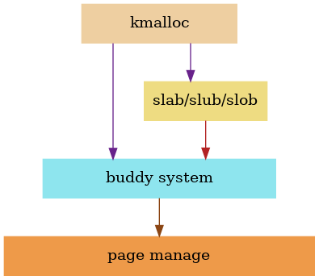
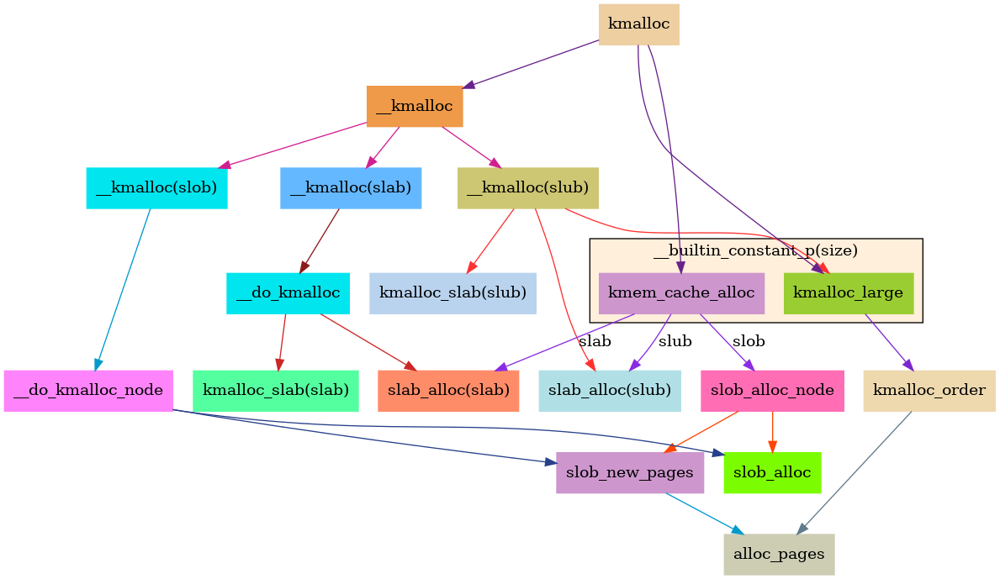

# 【Linux内核】kmalloc分配内存大小(非常详细)

#### 文章目录

-   [1\. kmalloc分配内存的大小](https://blog.csdn.net/u014001096/article/details/125902768?spm=1001.2014.3001.5506#1_kmalloc_1)
-   -   [1.1. KMALLOC\_MAX\_SIZE：kmalloc可以分配的最大内存](https://blog.csdn.net/u014001096/article/details/125902768?spm=1001.2014.3001.5506#11_KMALLOC_MAX_SIZEkmalloc_17)
    -   [1.2. KMALLOC\_MAX\_CACHE\_SIZE：kmalloc使用slab分配器分配的最大内存](https://blog.csdn.net/u014001096/article/details/125902768?spm=1001.2014.3001.5506#12_KMALLOC_MAX_CACHE_SIZEkmallocslab_30)
    -   [1.3. KMALLOC\_MIN\_SIZE：kmalloc可以分配的最小内存](https://blog.csdn.net/u014001096/article/details/125902768?spm=1001.2014.3001.5506#13_KMALLOC_MIN_SIZEkmalloc_44)
    -   [1.4. 关于KMALLOC\_MIN\_SIZE的进一步说明](https://blog.csdn.net/u014001096/article/details/125902768?spm=1001.2014.3001.5506#14_KMALLOC_MIN_SIZE_100)
    -   -   [1.4.1. slab/slub](https://blog.csdn.net/u014001096/article/details/125902768?spm=1001.2014.3001.5506#141_slabslub_105)
        -   [1.4.2. slob](https://blog.csdn.net/u014001096/article/details/125902768?spm=1001.2014.3001.5506#142_slob_131)
    -   [1.5.size为0时的处理](https://blog.csdn.net/u014001096/article/details/125902768?spm=1001.2014.3001.5506#15size0_148)
-   [2\. kmalloc内存分配大小计算](https://blog.csdn.net/u014001096/article/details/125902768?spm=1001.2014.3001.5506#2_kmalloc_186)
-   -   [2.1. \_\_kmalloc\_index编译时优化](https://blog.csdn.net/u014001096/article/details/125902768?spm=1001.2014.3001.5506#21___kmalloc_index_346)
    -   [2.2. kmalloc的运行时路径](https://blog.csdn.net/u014001096/article/details/125902768?spm=1001.2014.3001.5506#22_kmalloc_395)

## 1\. [kmalloc](https://so.csdn.net/so/search?q=kmalloc&spm=1001.2101.3001.7020)分配内存的大小

本文基于linux\-5.15分析。

kmalloc会根据申请的内存大小来决定来决定使用块分配器(slab/slub/slob)或页分配器进行[内存分配](https://so.csdn.net/so/search?q=%E5%86%85%E5%AD%98%E5%88%86%E9%85%8D&spm=1001.2101.3001.7020)。控制kmalloc分配行为的主要有如下三个宏。

macro

desc

KMALLOC\_MAX\_SIZE

kmalloc可以分配的最大内存，超过此大小时返回NULL

KMALLOC\_MAX\_CACHE\_SIZE

kmalloc使用slab分配器分配的最大内存，超过此大小后会通过伙伴系统分配页

KMALLOC\_MIN\_SIZE

kmalloc可以分配的最小内存，小于此大小时，kmalloc内部会按此大小分配

### 1.1. KMALLOC\_MAX\_SIZE：kmalloc可以分配的最大内存

KMALLOC\_MAX\_SIZE与块分配器类型(slab/slub/slob)和页面大小以及`MAX_ORDER`有关，相关定义在`include/linux/slab.h`中。一般最大为`2 ^ (MAX_ORDER + PAGE_SHIFT - 1)`，也就是`2 ^ (MAX_ORDER - 1)`个页面，就是[伙伴系统](https://so.csdn.net/so/search?q=%E4%BC%99%E4%BC%B4%E7%B3%BB%E7%BB%9F&spm=1001.2101.3001.7020)所管理的最大内存块。通常`MAX_ORDER`为11，页面大小为4K，相应的，kmalloc最大可以分配1024个页面，也就是4M。

分配器类型

KMALLOC\_MAX\_SIZE

slab

2 ^ (MAX\_ORDER + PAGE\_SHIFT - 1)，但不得超过32M(2^25)

slub

2 ^ (MAX\_ORDER + PAGE\_SHIFT - 1)

slob

2 ^ (MAX\_ORDER + PAGE\_SHIFT - 1)

另外，早期的slab是可以支持分配64M的，在5.13版本时，改为了32M，具体可以参考commit [588c7fa022d7b2361500ead5660d9a1a2ecd9b7d](https://git.kernel.org/pub/scm/linux/kernel/git/torvalds/linux.git/commit/?id=588c7fa022d7b2361500ead5660d9a1a2ecd9b7d)

### 1.2. KMALLOC\_MAX\_CACHE\_SIZE：kmalloc使用slab分配器分配的最大内存

当kmalloc申请的内存大小小于或等于KMALLOC\_MAX\_CACHE\_SIZE时，使用块分配器(slab/slub/slob)进行分配。

当kmalloc申请的内存大小超过KMALLOC\_MAX\_CACHE\_SIZE时，使用页分配器（伙伴系统）进行分配。

块分配器类型使用slab时，KMALLOC\_MAX\_CACHE\_SIZE定义为KMALLOC\_MAX\_SIZE，kmalloc总是使用slab分配器。

分配器类型

KMALLOC\_MAX\_CACHE\_SIZE

slab

2 ^ (MAX\_ORDER + PAGE\_SHIFT - 1)，最大限制为32M(2^25)

slub

2 ^ (PAGE\_SHIFT + 1)，2个页面大小

slob

2 ^ PAGE\_SHIFT，1个页面大小

### 1.3. KMALLOC\_MIN\_SIZE：kmalloc可以分配的最小内存

KMALLOC\_MIN\_SIZE与ARCH\_DMA\_MINALIGN大小有关。

    /*
     * Some archs want to perform DMA into kmalloc caches and need a guaranteed
     * alignment larger than the alignment of a 64-bit integer.
     * Setting ARCH_KMALLOC_MINALIGN in arch headers allows that.
     */
    #if defined(ARCH_DMA_MINALIGN) && ARCH_DMA_MINALIGN > 8
    #define ARCH_KMALLOC_MINALIGN ARCH_DMA_MINALIGN
    #define KMALLOC_MIN_SIZE ARCH_DMA_MINALIGN
    #define KMALLOC_SHIFT_LOW ilog2(ARCH_DMA_MINALIGN)
    #else
    #define ARCH_KMALLOC_MINALIGN __alignof__(unsigned long long)
    #endif

​    
    #ifndef KMALLOC_MIN_SIZE
    #define KMALLOC_MIN_SIZE (1 << KMALLOC_SHIFT_LOW)
    #endif

在没有定义ARCH\_DMA\_MINALIGN的情况下，KMALLOC\_MIN\_SIZE的默认值如下

分配器类型

默认KMALLOC\_MIN\_SIZE

slab

2 ^ 5

slub

2 ^ 3

slob

2 ^ 3

接下来看一下ARCH\_DMA\_MINALIGN，linux-5.15的arch目录下共24个目录，其中18个对ARCH\_DMA\_MINALIGN进行了定义，且很多都将ARCH\_DMA\_MINALIGN定义为L1 cache的大小，这样可以提高性能。

    arch/arc/include/asm/cache.h:52:#define ARCH_DMA_MINALIGN       SMP_CACHE_BYTES
    arch/arm/include/asm/cache.h:18:#define ARCH_DMA_MINALIGN       L1_CACHE_BYTES
    arch/arm64/include/asm/cache.h:50:#define ARCH_DMA_MINALIGN     (128)
    arch/csky/include/asm/cache.h:11:#define ARCH_DMA_MINALIGN      L1_CACHE_BYTES
    arch/hexagon/include/asm/cache.h:15:#define ARCH_DMA_MINALIGN   L1_CACHE_BYTES
    arch/m68k/include/asm/cache.h:12:#define ARCH_DMA_MINALIGN      L1_CACHE_BYTES
    arch/microblaze/include/asm/page.h:34:#define ARCH_DMA_MINALIGN L1_CACHE_BYTES
    arch/mips/include/asm/mach-generic/kmalloc.h:10:#define ARCH_DMA_MINALIGN       128
    arch/mips/include/asm/mach-ip32/kmalloc.h:7:#define ARCH_DMA_MINALIGN   32
    arch/mips/include/asm/mach-ip32/kmalloc.h:9:#define ARCH_DMA_MINALIGN   128
    arch/mips/include/asm/mach-n64/kmalloc.h:6:#define ARCH_DMA_MINALIGN L1_CACHE_BYTES
    arch/mips/include/asm/mach-tx49xx/kmalloc.h:5:#define ARCH_DMA_MINALIGN L1_CACHE_BYTES
    arch/nds32/include/asm/cache.h:10:#define ARCH_DMA_MINALIGN   L1_CACHE_BYTES
    arch/nios2/include/asm/cache.h:21:#define ARCH_DMA_MINALIGN     L1_CACHE_BYTES
    arch/parisc/include/asm/cache.h:23:#define ARCH_DMA_MINALIGN    L1_CACHE_BYTES
    arch/powerpc/include/asm/page_32.h:16:#define ARCH_DMA_MINALIGN L1_CACHE_BYTES
    arch/sh/include/asm/page.h:184:#define ARCH_DMA_MINALIGN        L1_CACHE_BYTES
    arch/xtensa/include/asm/cache.h:32:#define ARCH_DMA_MINALIGN    L1_CACHE_BYTES

### 1.4. 关于KMALLOC\_MIN\_SIZE的进一步说明

KMALLOC\_MIN\_SIZE的效果会跟块分配器的类型有关。

#### 1.4.1. slab/slub

KMALLOC\_MIN\_SIZE必须是2的整数次幂，且不能超过256。具体可以看下边setup\_kmalloc\_cache\_index\_table。

    /*
     * Patch up the size_index table if we have strange large alignment
     * requirements for the kmalloc array. This is only the case for
     * MIPS it seems. The standard arches will not generate any code here.
     *
     * Largest permitted alignment is 256 bytes due to the way we
     * handle the index determination for the smaller caches.
     *
     * Make sure that nothing crazy happens if someone starts tinkering
     * around with ARCH_KMALLOC_MINALIGN
     */
    void __init setup_kmalloc_cache_index_table(void)
    {
        unsigned int i;
    
        BUILD_BUG_ON(KMALLOC_MIN_SIZE > 256 ||
            (KMALLOC_MIN_SIZE & (KMALLOC_MIN_SIZE - 1)));
    
        ...

#### 1.4.2. slob

slob分配器中，实际起作用的是SLAB\_OBJ\_MIN\_SIZE，而SLAB\_OBJ\_MIN\_SIZE被限制为最大16字节。

    /*
     * This restriction comes from byte sized index implementation.
     * Page size is normally 2^12 bytes and, in this case, if we want to use
     * byte sized index which can represent 2^8 entries, the size of the object
     * should be equal or greater to 2^12 / 2^8 = 2^4 = 16.
     * If minimum size of kmalloc is less than 16, we use it as minimum object
     * size and give up to use byte sized index.
     */
    #define SLAB_OBJ_MIN_SIZE      (KMALLOC_MIN_SIZE < 16 ? \
                                   (KMALLOC_MIN_SIZE) : 16)

### 1.5.size为0时的处理

kmalloc允许传入值为0，此时kmalloc返回ZERO\_SIZE\_PTR。可以借用此值来判断是内存不足，还是传入参数为0。

如下代码可以在kmalloc和\_\_kmalloc(slab/slub/slob)的路径中找到。

        if (!size)
            return ZERO_SIZE_PTR;

    /*
     * ZERO_SIZE_PTR will be returned for zero sized kmalloc requests.
     *
     * Dereferencing ZERO_SIZE_PTR will lead to a distinct access fault.
     *
     * ZERO_SIZE_PTR can be passed to kfree though in the same way that NULL can.
     * Both make kfree a no-op.
     */
    #define ZERO_SIZE_PTR ((void *)16)
    
    #define ZERO_OR_NULL_PTR(x) ((unsigned long)(x) <= \
                    (unsigned long)ZERO_SIZE_PTR)

将ZERO\_SIZE\_PTR传给kfree也是可以的。

    void kfree(const void *x)
    {
        ...
        if (unlikely(ZERO_OR_NULL_PTR(x)))
            return;
        ...
    }

## 2\. kmalloc内存分配大小计算

kmalloc只能分配几个固定大小的内存，申请值不在这些固定值之内时，会按向上对齐的原则，分配最接近申请值的内存块。

kmalloc\_index定义为`#define kmalloc_index(s) __kmalloc_index(s, true)`。

`kmalloc_index`和`__kmalloc_index`的定义在`include/linux/slab.h`。

    /*
     * Figure out which kmalloc slab an allocation of a certain size
     * belongs to.
     * 0 = zero alloc
     * 1 =  65 .. 96 bytes
     * 2 = 129 .. 192 bytes
     * n = 2^(n-1)+1 .. 2^n
     *
     * Note: __kmalloc_index() is compile-time optimized, and not runtime optimized;
     * typical usage is via kmalloc_index() and therefore evaluated at compile-time.
     * Callers where !size_is_constant should only be test modules, where runtime
     * overheads of __kmalloc_index() can be tolerated.  Also see kmalloc_slab().
     */
    static __always_inline unsigned int __kmalloc_index(size_t size,
                                bool size_is_constant)
    {
        if (!size)
            return 0;
    
        if (size <= KMALLOC_MIN_SIZE)
            return KMALLOC_SHIFT_LOW;
    
        if (KMALLOC_MIN_SIZE <= 32 && size > 64 && size <= 96)
            return 1;
        if (KMALLOC_MIN_SIZE <= 64 && size > 128 && size <= 192)
            return 2;
        if (size <=          8) return 3;
        if (size <=         16) return 4;
        if (size <=         32) return 5;
        if (size <=         64) return 6;
        if (size <=        128) return 7;
        if (size <=        256) return 8;
        if (size <=        512) return 9;
        if (size <=       1024) return 10;
        if (size <=   2 * 1024) return 11;
        if (size <=   4 * 1024) return 12;
        if (size <=   8 * 1024) return 13;
        if (size <=  16 * 1024) return 14;
        if (size <=  32 * 1024) return 15;
        if (size <=  64 * 1024) return 16;
        if (size <= 128 * 1024) return 17;
        if (size <= 256 * 1024) return 18;
        if (size <= 512 * 1024) return 19;
        if (size <= 1024 * 1024) return 20;
        if (size <=  2 * 1024 * 1024) return 21;
        if (size <=  4 * 1024 * 1024) return 22;
        if (size <=  8 * 1024 * 1024) return 23;
        if (size <=  16 * 1024 * 1024) return 24;
        if (size <=  32 * 1024 * 1024) return 25;
    
        if ((IS_ENABLED(CONFIG_CC_IS_GCC) || CONFIG_CLANG_VERSION >= 110000)
            && !IS_ENABLED(CONFIG_PROFILE_ALL_BRANCHES) && size_is_constant)
            BUILD_BUG_ON_MSG(1, "unexpected size in kmalloc_index()");
        else
            BUG();
    
        /* Will never be reached. Needed because the compiler may complain */
        return -1;
    }

可以看到kmalloc\_index对(64, 96\]和(128, 192\]这两个区间做了特殊处理。  
96和192不是2的整数次幂，但内核中很多地方需要申请与96或192字节大小相近的内存，内核舍弃了2字节(index=1)和4字节(index=2)的cache。将这两个index留给了96和192，内核会根据KMALLOC\_MIN\_SIZE的大小来决定是否创建对应的cache，以此来减少内存浪费。

kmalloc\_index和`mm/slab_common.c`中的`kmalloc_info[]`是对应的，kmalloc\_index返回的就是所需大小在`kmalloc_info[]`数组中对应的索引。

    #define INIT_KMALLOC_INFO(__size, __short_size)            \
    {                                \
        .name[KMALLOC_NORMAL]  = "kmalloc-" #__short_size,    \
        .name[KMALLOC_RECLAIM] = "kmalloc-rcl-" #__short_size,    \
        KMALLOC_CGROUP_NAME(__short_size)            \
        KMALLOC_DMA_NAME(__short_size)                \
        .size = __size,                        \
    }
    
    /*
     * kmalloc_info[] is to make slub_debug=,kmalloc-xx option work at boot time.
     * kmalloc_index() supports up to 2^25=32MB, so the final entry of the table is
     * kmalloc-32M.
     */
    const struct kmalloc_info_struct kmalloc_info[] __initconst = {
        INIT_KMALLOC_INFO(0, 0),
        INIT_KMALLOC_INFO(96, 96),
        INIT_KMALLOC_INFO(192, 192),
        INIT_KMALLOC_INFO(8, 8),
        INIT_KMALLOC_INFO(16, 16),
        INIT_KMALLOC_INFO(32, 32),
        INIT_KMALLOC_INFO(64, 64),
        INIT_KMALLOC_INFO(128, 128),
        INIT_KMALLOC_INFO(256, 256),
        INIT_KMALLOC_INFO(512, 512),
        INIT_KMALLOC_INFO(1024, 1k),
        INIT_KMALLOC_INFO(2048, 2k),
        INIT_KMALLOC_INFO(4096, 4k),
        INIT_KMALLOC_INFO(8192, 8k),
        INIT_KMALLOC_INFO(16384, 16k),
        INIT_KMALLOC_INFO(32768, 32k),
        INIT_KMALLOC_INFO(65536, 64k),
        INIT_KMALLOC_INFO(131072, 128k),
        INIT_KMALLOC_INFO(262144, 256k),
        INIT_KMALLOC_INFO(524288, 512k),
        INIT_KMALLOC_INFO(1048576, 1M),
        INIT_KMALLOC_INFO(2097152, 2M),
        INIT_KMALLOC_INFO(4194304, 4M),
        INIT_KMALLOC_INFO(8388608, 8M),
        INIT_KMALLOC_INFO(16777216, 16M),
        INIT_KMALLOC_INFO(33554432, 32M)
    };

内核按按KMALLOC\_MIN\_SIZE的倍数创建cache，  
当`KMALLOC_MIN_SIZE <= 32`时，创建大小为96和192字节的cache。  
当`KMALLOC_MIN_SIZE <= 64`时，创建大小为192字节的cache。  
当`KMALLOC_MIN_SIZE > 64`时，不会额外创建96和192字节的cache。

    /*
     * Create the kmalloc array. Some of the regular kmalloc arrays
     * may already have been created because they were needed to
     * enable allocations for slab creation.
     */
    void __init create_kmalloc_caches(slab_flags_t flags)
    {
        int i;
        enum kmalloc_cache_type type;
    
        /*
         * Including KMALLOC_CGROUP if CONFIG_MEMCG_KMEM defined
         */
        for (type = KMALLOC_NORMAL; type <= KMALLOC_RECLAIM; type++) {
            for (i = KMALLOC_SHIFT_LOW; i <= KMALLOC_SHIFT_HIGH; i++) {
                if (!kmalloc_caches[type][i])
                    new_kmalloc_cache(i, type, flags);
    
                /*
                 * Caches that are not of the two-to-the-power-of size.
                 * These have to be created immediately after the
                 * earlier power of two caches
                 */
                if (KMALLOC_MIN_SIZE <= 32 && i == 6 &&
                        !kmalloc_caches[type][1])
                    new_kmalloc_cache(1, type, flags);
                if (KMALLOC_MIN_SIZE <= 64 && i == 7 &&
                        !kmalloc_caches[type][2])
                    new_kmalloc_cache(2, type, flags);
            }
        }
        ...

### 2.1. \_\_kmalloc\_index编译时优化

对于slab和slub，`__kmalloc_index`可以实现编译时优化。这种优化体现在`kmalloc`和`kmalloc_node`，当传入参数size在编译时为定值时，会在编译时优化分配路径。

slab/slub/slob分别实现了各自的`__kmalloc`和`__kmalloc_node`，对于slab或size编译时不为定值时，`kmalloc`或`kmalloc_node`会分别走到分配器对应的`__kmalloc`或`__kmalloc_node`。

    static __always_inline void *kmalloc(size_t size, gfp_t flags)
    {
        if (__builtin_constant_p(size)) {
    #ifndef CONFIG_SLOB
            unsigned int index;
    #endif
            if (size > KMALLOC_MAX_CACHE_SIZE)
                return kmalloc_large(size, flags);
    #ifndef CONFIG_SLOB
            index = kmalloc_index(size);
    
            if (!index)
                return ZERO_SIZE_PTR;
    
            return kmem_cache_alloc_trace(
                    kmalloc_caches[kmalloc_type(flags)][index],
                    flags, size);
    #endif
        }
        return __kmalloc(size, flags);
    }
    
    static __always_inline void *kmalloc_node(size_t size, gfp_t flags, int node)
    {
    #ifndef CONFIG_SLOB
        if (__builtin_constant_p(size) &&
            size <= KMALLOC_MAX_CACHE_SIZE) {
            unsigned int i = kmalloc_index(size);
    
            if (!i)
                return ZERO_SIZE_PTR;
    
            return kmem_cache_alloc_node_trace(
                    kmalloc_caches[kmalloc_type(flags)][i],
                            flags, node, size);
        }
    #endif
        return __kmalloc_node(size, flags, node);
    }

### 2.2. kmalloc的运行时路径

前边KMALLOC\_MAX\_SIZE、KMALLOC\_MAX\_CACHE\_SIZE、KMALLOC\_MIN\_SIZE三个宏直接起作用主要是在编译时，运行时的大小计算不一定会直接使用，但其实在运行时，分配内存的限制也会与这三个宏保持一致。

先说slab，`__do_kmalloc`中会直接判断申请内存大小是否超过KMALLOC\_MAX\_CACHE\_SIZE，如果是，则直接返回NULL。注意，对于slab，KMALLOC\_MAX\_CACHE\_SIZE等于KMALLOC\_MAX\_SIZE。

再看slub和slob，在申请大块内存时，最终都会调到alloc\_pages，这个是通过伙伴系统来分配页，最大为`2 ^ (MAX_ORDER + PAGE_SHIFT - 1)`字节，也就是`2 ^ (MAX_ORDER - 1)`个页面，与KMALLOC\_MAX\_SIZE一致。

KMALLOC\_MIN\_SIZE的情况相对复杂，暂不详述。

 

