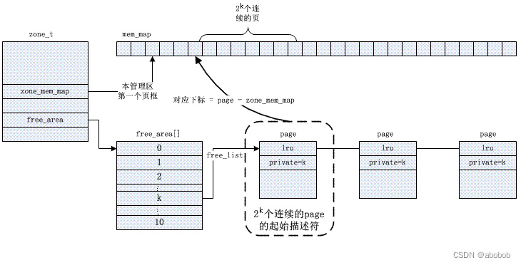
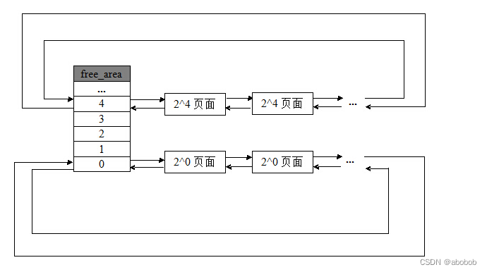
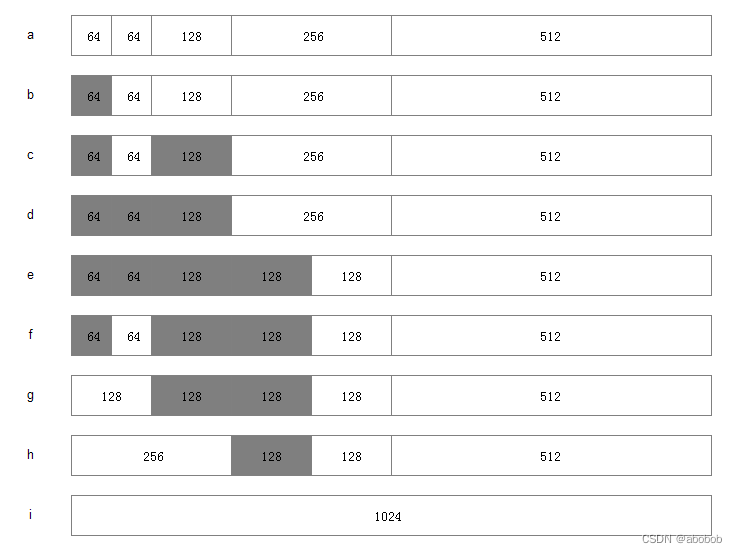
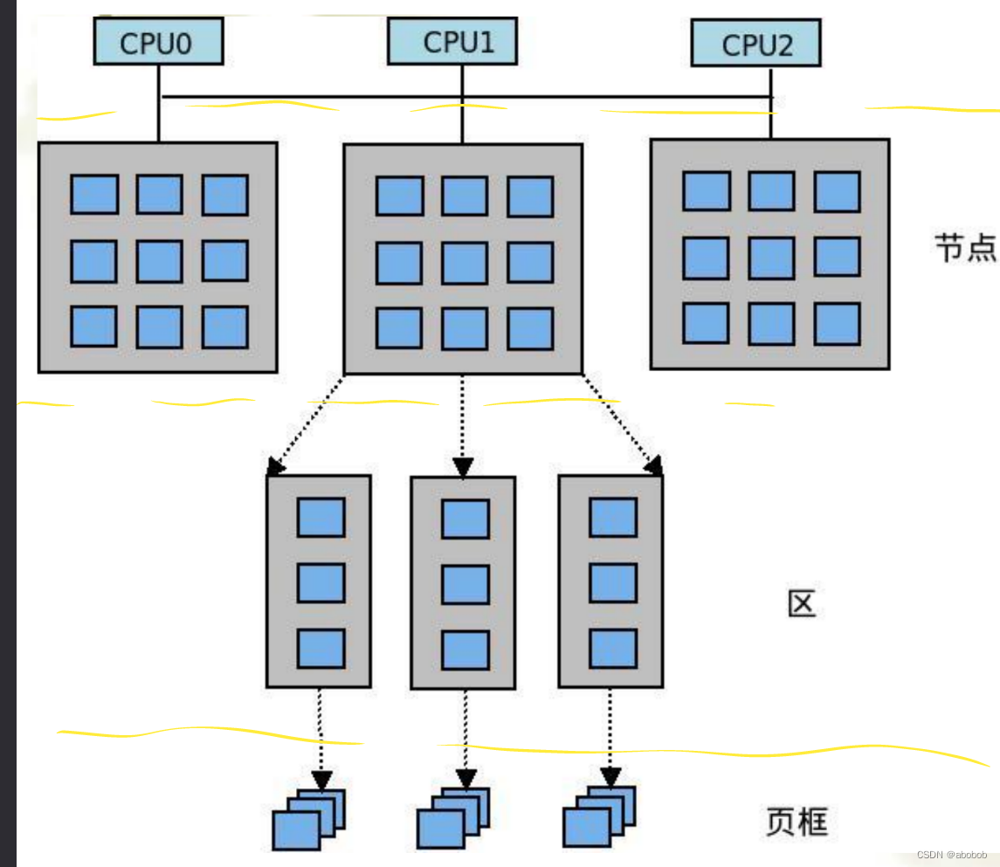
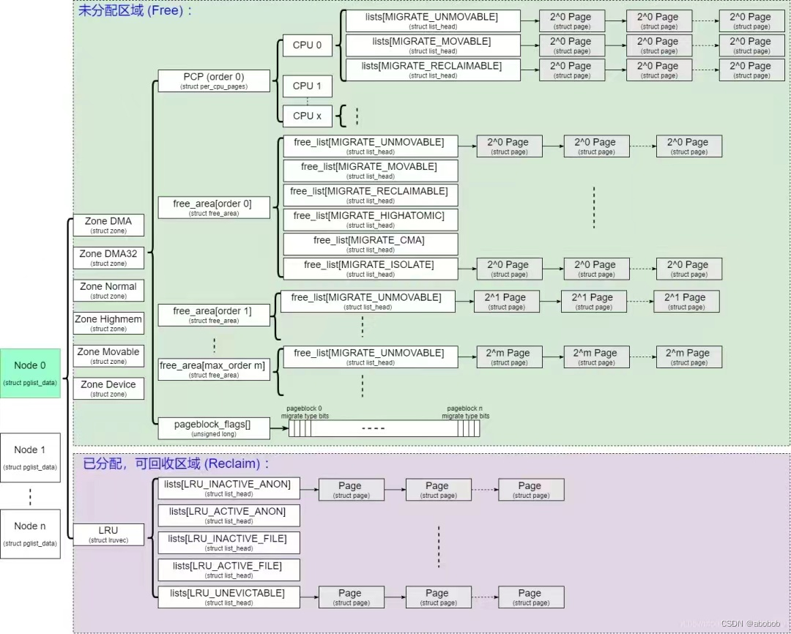
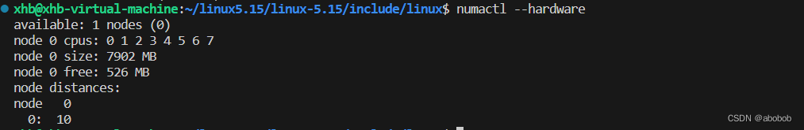
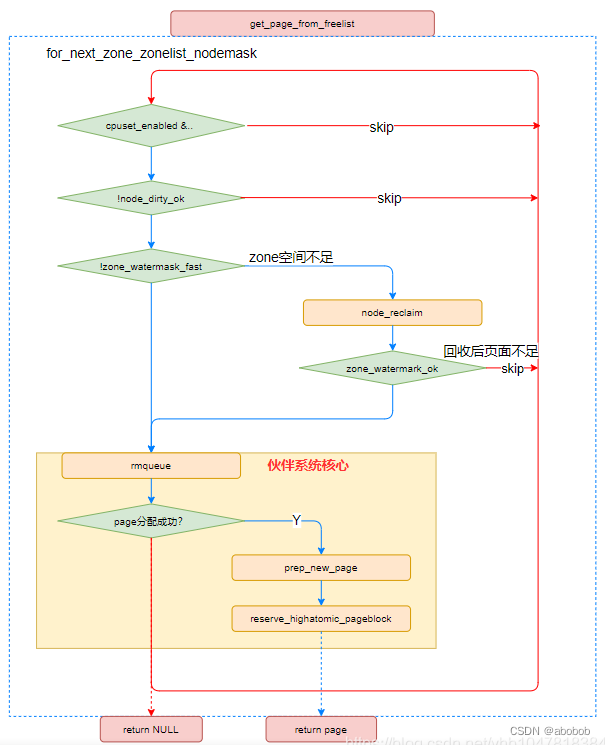
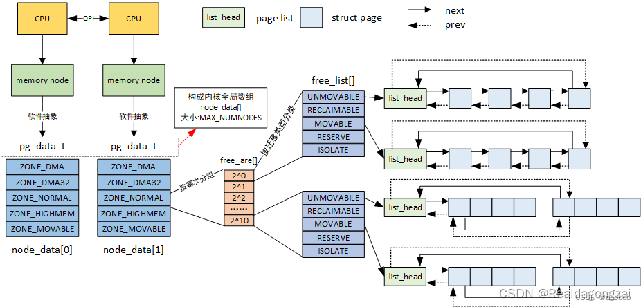

## 内存分配算法分析

### 前言:

在之前我们学到了当一个进程被创建之后,会给其分配相应的地址空间,当然这里的地址空间指的是虚拟地址空间。当进程要访问的页不在内存时，会引起一个缺页异常，缺页异常调用do\_page\_fault()函数来为相应的虚拟地址分配物理地址空间。而真正实现分配物理内存的函数是get\_free\_page()函数，这里就牵扯出了一个问题，物理内存到底是如何分配的？

### 一、物理内存管理机制：

基于物理内存在内核空间中的映射原理，内核中的物理内存管理机制分为以下四种：

-   伙伴算法：大块连续物理空间；
-   per-CPU页框高速缓存：满足本地CPU发出的单一页框请求；
-   slab缓存：小块物理内存分配；
-   vmalloc机制：使得内核通过连续的虚拟地址访问非连续的物理地址

也就是说，物理内存主要通过以上四种算法方式进行分配管理。本章节将以伙伴算法为主进行相关介绍和源码分析；后续还会对slab进行分析介绍；

#### 1.1、伙伴算法的引入和介绍：

##### 1.1.1、引入：

在没有伙伴算法之前，频繁地请求和释放不同大小的连续页框会产生大量的内存碎片，随着申请和释放次数的增加，整个内存只剩下不连续的碎片，由此带来的问题是，即使有足够的空闲页框可以满足请求，但要分配一个大块的连续页框可能无法满足请求。

为了解决上面的内存碎片的问题，由此引入了伙伴算法。

##### 1.1.2、伙伴算法的介绍：

把所有的空闲页框(4kB)分为11个块链表，每块链表中分别包含特定的连续页框地址空间，每一块链表分别包含大小为 1，2，4，8，16，32，64，128，256，512 和 1024 个连续的页框。对1024 个页框的最大请求对应着 4MB 大小的连续RAM 块。

-   每一块的第一个页框的物理地址是该块大小的整数倍；

何为伙伴：

-   大小相同；
-   物理地址连续；

由此可以看到伙伴算法所维护的free\_area\[\]数组像极了O(1)调度算分所维护的140个链表;

##### 1.1.3、伙伴算法申请空间过程：

为了方便理解,本章节将通过一个例子来解释伙伴算法是如何申请物理空间的。

-   假设要申请1M连续空间 4K \* 256， 256 = 2^8，我们就可以定位到下标为8的位置，看是否是空闲的。空闲则直接给他分配。
-   如果不空闲，就去512个页框也就是2M的链表中找，这个2M链表是否空闲。如果不空闲则继续向下找。
-   找到最后一个4M链表，如果没有空闲则分配失败返回错误。如果有空闲，则将其中1M分配给程序。剩余2M和1M分别放到对应的链表中。

##### 1.1.4、伙伴算法释放空间过程：

假设要释放一个1M =256 \* 4K的块，看这个过程

-   释放是申请的逆过程，当释放一个内存块后。
-   先检查所在链表中该位置是否有他的伙伴。
-   如果不存在，则直接释放直接将释放的块插入链表头。如果他所在链表中有伙伴存在，则将其从链表摘下，合并成一个大块，然后继续向后查找合并后的块在更大一级链表中是否有伙伴的存在，直至不能合并或者已经合并至最大块2^10为止。

##### 1.1.5、举例说明：

本例子摘录于网络，[【精选】OS / Linux / 伙伴（buddy）算法\_buddy算法-CSDN博客](https://blog.csdn.net/itworld123/article/details/115468527?ops_request_misc=&request_id=&biz_id=102&utm_term=%E4%BC%99%E4%BC%B4%E7%AE%97%E6%B3%95&utm_medium=distribute.pc_search_result.none-task-blog-2~all~sobaiduweb~default-1-115468527.142%5Ev96%5Epc_search_result_base7&spm=1018.2226.3001.4187)

假设系统中有 1MB 大小的内存需要动态管理，按照伙伴算法的要求：需要将这 1 M 大小的内存进行划分。这里，我们将这 1 M 的内存分为 64K、64K、128K、256K、和 512K 共五个部分，如下图 a 所示：

-   此时，如果有一个程序 A 想要申请一块 45 K 大小的内存，则系统会将第一块 64 K 的内存块分配给该程序（产生内部碎片为代价），如图 b 所示；
-   然后程序 B 向系统申请一块 68 K 大小的内存，系统会将 128 K 内存分配给该程序，如图 c 所示；
-   接下来，程序 C 要申请一块大小为 35 K 的内存。系统将空闲的 64 K 内存分配给该程序，如图 d 所示；
-   之后程序 D 需要一块大小为 90 K 的内存。当程序提出申请时，系统本该分配给程序 D 一块 128 K 大小的内存，但此时内存中已经没有空闲的 128 K 内存块了，于是根据伙伴算法的原理，系统会将 256 K 大小的内存块平分，将其中一块分配给程序 D，另一块作为空闲内存块保留，等待以后使用，如图 e 所示；
-   紧接着，程序 C 释放了它申请的 64 K 内存。在内存释放的同时，系统还负责检查与之相邻并且同样大小的内存是否也空闲，由于此时程序A并没有释放它的内存，所以系统只会将程序 C 的 64 K 内存回收，如图 f 所示；
-   然后程序 A 也释放掉由它申请的 64 K 内存，系统随机发现与之相邻且大小相同的一段内存块恰好也处于空闲状态。于是，将两者合并成 128 K 内存，如图 g 所示；
-   之后程序 B 释放掉它的 128 k，系统也将这块内存与相邻的 128 K 内存合并成 256 K 的空闲内存，如图 h 所示；
-   最后程序 D 也释放掉它的内存，经过三次合并后，系统得到了一块 1024 K 的完整内存，如图 i 所示。

这里就引出了一个内部碎片的概念，也即是处于 （操作系统分配的用于装载某一进程的内存）区域内部 或页面内部 的存储块。占有这些区域或页面的进程并不使用这个 存储块。而在进程占有这块存储块时，系统无法利用它。直到进程释放它，或进程结束时，系统才有可能利用这个存储块。

#### 1.2、涉及到的数据结构：

物理内存在逻辑上被划分为三级结构:

-   pg\_data\_t：描述节点；
-   zone：描述区；
-   page：描述物理页框；

##### 1.2.1、pg\_data\_t：

在文件夹/include/linux下的文件mmzone.h中有对于pg\_data\_t结构的定义；

pg\_data\_t结构体建议参考这个链接学习:[Linux 物理内存管理涉及的三大结构体之struct pglist\_data\_Realdagongzai的博客-CSDN博客](https://blog.csdn.net/weixin_45337360/article/details/128004665)

    typedef struct pglist_data {
    	/*
    	 * node_zones contains just the zones for THIS node. Not all of the
    	 * zones may be populated, but it is the full list. It is referenced by
    	 * this node's node_zonelists as well as other node's node_zonelists.
    	 */
    	struct zone node_zones[MAX_NR_ZONES];//对应该node包含的各个类型的zone
    
    	/*
    	 * node_zonelists contains references to all zones in all nodes.
    	 * Generally the first zones will be references to this node's
    	 * node_zones.
    	 */
    	struct zonelist node_zonelists[MAX_ZONELISTS];//该node的备选节点及内存域列表
    
    	int nr_zones; /* 包含zone的个数 number of populated zones in this node*/
    #ifdef CONFIG_FLATMEM	/* means !SPARSEMEM */
        /*linux为每个物理页分配了一个struct page的管理结构体，并形成了一个结构体数组，node_mem_map即为数组的指针；pfn_to_page和page_to_pfn都借助该数组实现。*/
    	struct page *node_mem_map;
    #ifdef CONFIG_PAGE_EXTENSION
    	struct page_ext *node_page_ext;
    #endif
    #endif
    #if defined(CONFIG_MEMORY_HOTPLUG) || defined(CONFIG_DEFERRED_STRUCT_PAGE_INIT)
    	/*
    	 * Must be held any time you expect node_start_pfn,
    	 * node_present_pages, node_spanned_pages or nr_zones to stay constant.
    	 * Also synchronizes pgdat->first_deferred_pfn during deferred page
    	 * init.
    	 *
    	 * pgdat_resize_lock() and pgdat_resize_unlock() are provided to
    	 * manipulate node_size_lock without checking for CONFIG_MEMORY_HOTPLUG
    	 * or CONFIG_DEFERRED_STRUCT_PAGE_INIT.
    	 *
    	 * Nests above zone->lock and zone->span_seqlock
    	 */
    	spinlock_t node_size_lock;
    #endif
    	unsigned long node_start_pfn;//该node中内存的起始页帧号
    	unsigned long node_present_pages; /* 该node地址范围内的实际管理的页面数量，total number of physical pages */
        /*该node地址范围内的所有page页数，包括空洞；目前还不清楚什么情况导致与node_present_pages不同。*/
    	unsigned long node_spanned_pages; /* total size of physical page
    					     range, including holes */
    	int node_id;//节点标识符；
    	wait_queue_head_t kswapd_wait;//node的等待队列，交换守护列队进程的等待列表
    	wait_queue_head_t pfmemalloc_wait;
    	struct task_struct *kswapd;	/* 负责回收该node内存的内核线程，每个node对应一个内核线程kswapdProtected by mem_hotplug_begin/end() */
    	int kswapd_order;
    	enum zone_type kswapd_highest_zoneidx;
    
    	int kswapd_failures;		/* Number of 'reclaimed == 0' runs */
    
    #ifdef CONFIG_COMPACTION
    	int kcompactd_max_order;//需要释放的区域的长度，以页阶为单位
    	enum zone_type kcompactd_highest_zoneidx;
    	wait_queue_head_t kcompactd_wait;
    	struct task_struct *kcompactd;
    	bool proactive_compact_trigger;
    #endif
    	/*
    	 * This is a per-node reserve of pages that are not available
    	 * to userspace allocations.
    	 */
    	unsigned long		totalreserve_pages;
    
    #ifdef CONFIG_NUMA
    	/*
    	 * node reclaim becomes active if more unmapped pages exist.
    	 */
    	unsigned long		min_unmapped_pages;
    	unsigned long		min_slab_pages;
    #endif /* CONFIG_NUMA */
    
    	/* Write-intensive fields used by page reclaim */
    	ZONE_PADDING(_pad1_)
    
    #ifdef CONFIG_DEFERRED_STRUCT_PAGE_INIT
    	/*
    	 * If memory initialisation on large machines is deferred then this
    	 * is the first PFN that needs to be initialised.
    	 */
    	unsigned long first_deferred_pfn;
    #endif /* CONFIG_DEFERRED_STRUCT_PAGE_INIT */
    
    #ifdef CONFIG_TRANSPARENT_HUGEPAGE
    	struct deferred_split deferred_split_queue;
    #endif
    
    	/* Fields commonly accessed by the page reclaim scanner */
    
    	/*
    	 * NOTE: THIS IS UNUSED IF MEMCG IS ENABLED.
    	 *
    	 * Use mem_cgroup_lruvec() to look up lruvecs.
    	 */
    	struct lruvec		__lruvec;//LRU链表的集合
    
    	unsigned long		flags;//内存域的当前状态, 在mmzone.h定义了zone的所有可用zone_flag
    
    	ZONE_PADDING(_pad2_)//作用是让前后的成员分布在不同的cache line中, 以空间换取时间。
    
    	/* Per-node vmstats */
    	struct per_cpu_nodestat __percpu *per_cpu_nodestats;
    	atomic_long_t		vm_stat[NR_VM_NODE_STAT_ITEMS];//node的计数
    } pg_data_t;

为了支持\*\*`NUMA`模型\*\*，Linux系统把物理内存划分为多个`Node`，内核中通过`pg_data_t`来描述一个`Node`，**每个`Node`关联到一个处理器**;

我们可以使用numactl工具来探索系统的 NUMA 拓扑信息,即各个节点的详细信息：

    xhb@xhb-virtual-machine:~/linux5.15/linux-5.15/include/linux$ numactl --hardware
    available: 1 nodes (0)
    node 0 cpus: 0 1 2 3 4 5 6 7
    node 0 size: 7902 MB
    node 0 free: 526 MB
    node distances:
    node   0 
      0:  10 

以下是该输出结果的解释：

-   “available: 1 nodes (0)” 表示系统中有1个 NUMA 节点，编号分别为 0。
    
-   "node 0 cpus:列出了该节点上的 CPU 列表。例如，“node 0 cpus: 0 1 2 3 4 5 6 7” 表示节点 0 上有 8个 CPU，编号分别为 0 至 7。
    
-   "node 0 size: " 列出了每个节点的总内存大小。例如，“node 0 size: 7092 MB” 表示节点 0 的总内存大小为 7092MB。
    
-   “node 0 free:” 列出了每个节点的可用内存大小。例如，“node 0 free: 526MB” 表示节点 0 目前有526 MB 的可用内存。
    
-   “node distances:” 显示了每对节点之间的距离。例如，"0: 10 " 表示节点 0 到节点 0 的距离为 10
    

##### 1.2.2、zone：

在文件夹/include/linux下的文件mmzone.h中有对于zone结构的定义；

关于zone及struct zone{}结构体的相关分析,建议参考这个链接:  
[https://blog.csdn.net/weixin\_45337360/article/details/128004643?](https://blog.csdn.net/weixin_45337360/article/details/128004643?ops_request_misc=&request_id=&biz_id=102&utm_term=Linux%20%E7%89%A9%E7%90%86%E5%86%85%E5%AD%98%E7%AE%A1%E7%90%86%E6%B6%89%E5%8F%8A%E7%9A%84%E4%B8%89%E5%A4%A7%E7%BB%93%E6%9E%84%E4%BD%93%E4%B9%8Bstruct%20zo&utm_medium=distribute.pc_search_result.none-task-blog-2~all~sobaiduweb~default-0-128004643.nonecase&spm=1018.2226.3001.4187)

    struct zone {
    	/* Read-mostly fields */
    
    	/* zone watermarks, access with *_wmark_pages(zone) macros */
    	unsigned long _watermark[NR_WMARK];
    	unsigned long watermark_boost;
    
    	unsigned long nr_reserved_highatomic;
    
    	/*
    	 * We don't know if the memory that we're going to allocate will be
    	 * freeable or/and it will be released eventually, so to avoid totally
    	 * wasting several GB of ram we must reserve some of the lower zone
    	 * memory (otherwise we risk to run OOM on the lower zones despite
    	 * there being tons of freeable ram on the higher zones).  This array is
    	 * recalculated at runtime if the sysctl_lowmem_reserve_ratio sysctl
    	 * changes.
    	 */
    	long lowmem_reserve[MAX_NR_ZONES];
    
    #ifdef CONFIG_NUMA
    	int node;
    #endif
    	struct pglist_data	*zone_pgdat;
    	struct per_cpu_pages	__percpu *per_cpu_pageset;
    	struct per_cpu_zonestat	__percpu *per_cpu_zonestats;
    	/*
    	 * the high and batch values are copied to individual pagesets for
    	 * faster access
    	 */
    	int pageset_high;
    	int pageset_batch;
    
    #ifndef CONFIG_SPARSEMEM
    	/*
    	 * Flags for a pageblock_nr_pages block. See pageblock-flags.h.
    	 * In SPARSEMEM, this map is stored in struct mem_section
    	 */
    	unsigned long		*pageblock_flags;
    #endif /* CONFIG_SPARSEMEM */
    
    	/* zone_start_pfn == zone_start_paddr >> PAGE_SHIFT */
    	unsigned long		zone_start_pfn;
    
    	/*
    	 * spanned_pages is the total pages spanned by the zone, including
    	 * holes, which is calculated as:
    	 * 	spanned_pages = zone_end_pfn - zone_start_pfn;
    	 *
    	 * present_pages is physical pages existing within the zone, which
    	 * is calculated as:
    	 *	present_pages = spanned_pages - absent_pages(pages in holes);
    	 *
    	 * present_early_pages is present pages existing within the zone
    	 * located on memory available since early boot, excluding hotplugged
    	 * memory.
    	 *
    	 * managed_pages is present pages managed by the buddy system, which
    	 * is calculated as (reserved_pages includes pages allocated by the
    	 * bootmem allocator):
    	 *	managed_pages = present_pages - reserved_pages;
    	 *
    	 * cma pages is present pages that are assigned for CMA use
    	 * (MIGRATE_CMA).
    	 *
    	 * So present_pages may be used by memory hotplug or memory power
    	 * management logic to figure out unmanaged pages by checking
    	 * (present_pages - managed_pages). And managed_pages should be used
    	 * by page allocator and vm scanner to calculate all kinds of watermarks
    	 * and thresholds.
    	 *
    	 * Locking rules:
    	 *
    	 * zone_start_pfn and spanned_pages are protected by span_seqlock.
    	 * It is a seqlock because it has to be read outside of zone->lock,
    	 * and it is done in the main allocator path.  But, it is written
    	 * quite infrequently.
    	 *
    	 * The span_seq lock is declared along with zone->lock because it is
    	 * frequently read in proximity to zone->lock.  It's good to
    	 * give them a chance of being in the same cacheline.
    	 *
    	 * Write access to present_pages at runtime should be protected by
    	 * mem_hotplug_begin/end(). Any reader who can't tolerant drift of
    	 * present_pages should get_online_mems() to get a stable value.
    	 */
    	atomic_long_t		managed_pages;
    	unsigned long		spanned_pages;
    	unsigned long		present_pages;
    #if defined(CONFIG_MEMORY_HOTPLUG)
    	unsigned long		present_early_pages;
    #endif
    #ifdef CONFIG_CMA
    	unsigned long		cma_pages;
    #endif
    
    	const char		*name;
    
    #ifdef CONFIG_MEMORY_ISOLATION
    	/*
    	 * Number of isolated pageblock. It is used to solve incorrect
    	 * freepage counting problem due to racy retrieving migratetype
    	 * of pageblock. Protected by zone->lock.
    	 */
    	unsigned long		nr_isolate_pageblock;
    #endif
    
    #ifdef CONFIG_MEMORY_HOTPLUG
    	/* see spanned/present_pages for more description */
    	seqlock_t		span_seqlock;
    #endif
    
    	int initialized;
    
    	/* Write-intensive fields used from the page allocator */
    	ZONE_PADDING(_pad1_)
    
    	/* free areas of different sizes */
        /*本区内的free_area链表数组*/
    	struct free_area	free_area[MAX_ORDER];
    
    	/* zone flags, see below */
    	unsigned long		flags;
    
    	/* Primarily protects free_area */
    	spinlock_t		lock;
    
    	/* Write-intensive fields used by compaction and vmstats. */
    	ZONE_PADDING(_pad2_)
    
    	/*
    	 * When free pages are below this point, additional steps are taken
    	 * when reading the number of free pages to avoid per-cpu counter
    	 * drift allowing watermarks to be breached
    	 */
    	unsigned long percpu_drift_mark;
    
    #if defined CONFIG_COMPACTION || defined CONFIG_CMA
    	/* pfn where compaction free scanner should start */
    	unsigned long		compact_cached_free_pfn;
    	/* pfn where compaction migration scanner should start */
    	unsigned long		compact_cached_migrate_pfn[ASYNC_AND_SYNC];
    	unsigned long		compact_init_migrate_pfn;
    	unsigned long		compact_init_free_pfn;
    #endif
    
    #ifdef CONFIG_COMPACTION
    	/*
    	 * On compaction failure, 1<<compact_defer_shift compactions
    	 * are skipped before trying again. The number attempted since
    	 * last failure is tracked with compact_considered.
    	 * compact_order_failed is the minimum compaction failed order.
    	 */
    	unsigned int		compact_considered;
    	unsigned int		compact_defer_shift;
    	int			compact_order_failed;
    #endif
    
    #if defined CONFIG_COMPACTION || defined CONFIG_CMA
    	/* Set to true when the PG_migrate_skip bits should be cleared */
    	bool			compact_blockskip_flush;
    #endif
    
    	bool			contiguous;
    
    	ZONE_PADDING(_pad3_)
    	/* Zone statistics */
    	atomic_long_t		vm_stat[NR_VM_ZONE_STAT_ITEMS];
    	atomic_long_t		vm_numa_event[NR_VM_NUMA_EVENT_ITEMS];
    } ____cacheline_internodealigned_in_smp;

##### 1.2.3、page：

在文件夹/include/linux下的文件mm\_types\_.h中有对于page结构的定义；

关于page及struct page{}结构体的相关分析,建议参考这个链接:[【精选】Linux 物理内存管理涉及的三大结构体之struct page\_Realdagongzai的博客-CSDN博客](https://blog.csdn.net/weixin_45337360/article/details/126940438)

    struct page {
    	unsigned long flags;		/* Atomic flags, some possibly
    					          * updated asynchronously */
    	/*
    	 * Five words (20/40 bytes) are available in this union.
    	 * WARNING: bit 0 of the first word is used for PageTail(). That
    	 * means the other users of this union MUST NOT use the bit to
    	 * avoid collision and false-positive PageTail().
    	 */
    	union {
    		struct {	/* Page cache and anonymous pages */
    			/**
    			 * @lru: Pageout list, eg. active_list protected by
    			 * lruvec->lru_lock.  Sometimes used as a generic list
    			 * by the page owner.
    			 */
    			struct list_head lru;//指向最近最久未使用（LRU）链表中的相应结点，这个链表用于页面的回收
    			/* See page-flags.h for PAGE_MAPPING_FLAGS */
    			struct address_space *mapping;
    			pgoff_t index;		/* Our offset within mapping. */
    			/**
    			 * @private: Mapping-private opaque data.
    			 * Usually used for buffer_heads if PagePrivate.
    			 * Used for swp_entry_t if PageSwapCache.
    			 * Indicates order in the buddy system if PageBuddy.
    			 */
    			unsigned long private;
    		};
    		struct {	/* page_pool used by netstack */
    			/**
    			 * @pp_magic: magic value to avoid recycling non
    			 * page_pool allocated pages.
    			 */
    			unsigned long pp_magic;
    			struct page_pool *pp;
    			unsigned long _pp_mapping_pad;
    			unsigned long dma_addr;
    			union {
    				/**
    				 * dma_addr_upper: might require a 64-bit
    				 * value on 32-bit architectures.
    				 */
    				unsigned long dma_addr_upper;
    				/**
    				 * For frag page support, not supported in
    				 * 32-bit architectures with 64-bit DMA.
    				 */
    				atomic_long_t pp_frag_count;
    			};
    		};
    		struct {	/* slab, slob and slub */
    			union {
    				struct list_head slab_list;
    				struct {	/* Partial pages */
    					struct page *next;
    #ifdef CONFIG_64BIT
    					int pages;	/* Nr of pages left */
    					int pobjects;	/* Approximate count */
    #else
    					short int pages;
    					short int pobjects;
    #endif
    				};
    			};
    			struct kmem_cache *slab_cache; /* not slob */
    			/* Double-word boundary */
    			void *freelist;		/* first free object */
    			union {
    				void *s_mem;	/* slab: first object */
    				unsigned long counters;		/* SLUB */
    				struct {			/* SLUB */
    					unsigned inuse:16;
    					unsigned objects:15;
    					unsigned frozen:1;
    				};
    			};
    		};
    		struct {	/* Tail pages of compound page */
    			unsigned long compound_head;	/* Bit zero is set */
    
    			/* First tail page only */
    			unsigned char compound_dtor;
    			unsigned char compound_order;
    			atomic_t compound_mapcount;
    			unsigned int compound_nr; /* 1 << compound_order */
    		};
    		struct {	/* Second tail page of compound page */
    			unsigned long _compound_pad_1;	/* compound_head */
    			atomic_t hpage_pinned_refcount;
    			/* For both global and memcg */
    			struct list_head deferred_list;
    		};
    		struct {	/* Page table pages */
    			unsigned long _pt_pad_1;	/* compound_head */
    			pgtable_t pmd_huge_pte; /* protected by page->ptl */
    			unsigned long _pt_pad_2;	/* mapping */
    			union {
    				struct mm_struct *pt_mm; /* x86 pgds only */
    				atomic_t pt_frag_refcount; /* powerpc */
    			};
    #if ALLOC_SPLIT_PTLOCKS
    			spinlock_t *ptl;
    #else
    			spinlock_t ptl;
    #endif
    		};
    		struct {	/* ZONE_DEVICE pages */
    			/** @pgmap: Points to the hosting device page map. */
    			struct dev_pagemap *pgmap;
    			void *zone_device_data;
    			/*
    			 * ZONE_DEVICE private pages are counted as being
    			 * mapped so the next 3 words hold the mapping, index,
    			 * and private fields from the source anonymous or
    			 * page cache page while the page is migrated to device
    			 * private memory.
    			 * ZONE_DEVICE MEMORY_DEVICE_FS_DAX pages also
    			 * use the mapping, index, and private fields when
    			 * pmem backed DAX files are mapped.
    			 */
    		};
    
    		/** @rcu_head: You can use this to free a page by RCU. */
    		struct rcu_head rcu_head;
    	};
    
    	union {		/* This union is 4 bytes in size. */
    		/*
    		 * If the page can be mapped to userspace, encodes the number
    		 * of times this page is referenced by a page table.
    		 */
    		atomic_t _mapcount;
    
    		/*
    		 * If the page is neither PageSlab nor mappable to userspace,
    		 * the value stored here may help determine what this page
    		 * is used for.  See page-flags.h for a list of page types
    		 * which are currently stored here.
    		 */
    		unsigned int page_type;
    
    		unsigned int active;		/* SLAB */
    		int units;			/* SLOB */
    	};
    
    	/* Usage count. *DO NOT USE DIRECTLY*. See page_ref.h */
    	atomic_t _refcount;
    
    #ifdef CONFIG_MEMCG
    	unsigned long memcg_data;
    #endif
    
    	/*
    	 * On machines where all RAM is mapped into kernel address space,
    	 * we can simply calculate the virtual address. On machines with
    	 * highmem some memory is mapped into kernel virtual memory
    	 * dynamically, so we need a place to store that address.
    	 * Note that this field could be 16 bits on x86 ... ;)
    	 *
    	 * Architectures with slow multiplication can define
    	 * WANT_PAGE_VIRTUAL in asm/page.h
    	 */
    #if defined(WANT_PAGE_VIRTUAL)
    	void *virtual;			/* Kernel virtual address (NULL if
    					   not kmapped, ie. highmem) */
    #endif /* WANT_PAGE_VIRTUAL */
    
    #ifdef LAST_CPUPID_NOT_IN_PAGE_FLAGS
    	int _last_cpupid;
    #endif
    } _struct_page_alignment;

page结构体是对物理页面的描述，成为页描述符；

    struct free_area {
    	struct list_head	free_list[MIGRATE_TYPES];
    	unsigned long		nr_free;
    };

free\_area数组中，第K个元素，它标识所有大小为2^k的空闲块，所有空闲快由free\_list指向的双向循环链表组织起来。其中的nr\_free，它指定了对应空间剩余块的个数。

#### 1.3、伙伴算法源码分析：

这里推荐下面这篇博客：[深入理解Linux 物理内存分配/释放过程（1）-CSDN博客](https://blog.csdn.net/weixin_45337360/article/details/130995193)

在上面三个数据结构的基础上，对伙伴算法进行源码分析：

首先是这个物理内存在内核中管理的层级关系图（来自网络），清晰的展现出伙伴算法中涉及到的数据结构：

Node(struct pglist\_data)——>Zone(struct zone)——>Page(struct page)。

##### 1.3.1、\_\_get\_free\_pages():

我们先看一下\_\_get\_free\_pages()这个函数（mm/page\_allco.c)，不管通过何种物理内存分配方式，当然也包括伙伴算法，系统都会调用\_\_get\_free\_pages()函数来分配物理页框；

    unsigned long __get_free_pages(gfp_t gfp_mask, unsigned int order)
    {
    	struct page *page;//物理页框
    
    	page = alloc_pages(gfp_mask & ~__GFP_HIGHMEM, order);//通过alloc_pages()函数申请物理页框
    	if (!page)//是否成功分配
    		return 0;
        /*将直接映射区中的物理内存页转换为虚拟内存地址*/
    	return (unsigned long) page_address(page);
    }

在上述源码中，我们可以看到其中最重要的一句便是`page = alloc_pages(gfp_mask & ~__GFP_HIGHMEM, order);`他通过alloc\_pages()函数申请物理页框。

alloc\_pages(）函数是\_\_get\_free\_pages()函数的核心函数；

##### 1.3.2、alloc\_pages(）:

关于alloc\_pages()的分析，推荐看这个学习链接：[【精选】Linux内存管理(六): 分配物理内存alloc\_pages-CSDN博客](https://blog.csdn.net/yhb1047818384/article/details/112298996?ops_request_misc=&request_id=&biz_id=102&utm_term=__alloc_pages&utm_medium=distribute.pc_search_result.none-task-blog-2~all~sobaiduweb~default-3-112298996.nonecase&spm=1018.2226.3001.4187)

紧接着我们分析一下上文中所提到的alloc\_pages(）函数(/mm/mempolicy.c)，该函数的主要功能是：

-   分配2^order个连续的物理页组成的内存块；
-   要强调的是，该函数的参数中 gfp\_t gfp\_mask 是内核中定义的一个用于规范物理内存分配行为的分配掩码；
-   返回值是一个struct page类型指针，指向该连续物理页中第一个物理页；
-   因空闲内存无法满足而分配失败时，返回NULL；

     /* 定义alloc_pages函数，它接受两个参数：一个是内存分配标志(gfp_t)和一个是页的数量(2的order次方)。*/
    struct page *alloc_pages(gfp_t gfp, unsigned order)
    {
    	//初始化一个指向默认内存策略的指针
    	struct mempolicy *pol = &default_policy;
    	struct page *page;
    
    	/*检查当前代码是否在中断上下文执行，并且gfp参数是否没有设置__GFP_THISNODE标志位*/
    	if (!in_interrupt() && !(gfp & __GFP_THISNODE))
    		/*如果上述条件成立，则调用get_task_policy函数来获取当前进程的内存策略，并将其赋给pol指针。*/
    		pol = get_task_policy(current);
    	
    	/*
    	 * No reference counting needed for current->mempolicy
    	 * nor system default_policy
    	 */
    
    
    	 /*根据pol->mode的值  来决定  采取不同的  内存分配策略*/
    	//MPOL_INTERLEAVE——交叉模式，
    	if (pol->mode == MPOL_INTERLEAVE)
    		page = alloc_page_interleave(gfp, order, interleave_nodes(pol));
    		//调用alloc_page_interleave函数，根据给定的选项和内存策略来执行内存分配
    	
    	//MPOL_PREFERRED_MANY——多首选节点模式
    	else if (pol->mode == MPOL_PREFERRED_MANY)
    		page = alloc_pages_preferred_many(gfp, order,
    				numa_node_id(), pol);
    		//调用alloc_page_interleave函数，根据给定的选项和内存策略来执行内存分配
    	
    	//其他模式	
    	else									
    		page = __alloc_pages(gfp, order,
    				policy_node(gfp, pol, numa_node_id()),
    				policy_nodemask(gfp, pol));
    		//调用__alloc_pages函数，根据给定的选项和内存策略执行内存分配。
    
    
    	return page;//返回已经分配到的物理页框；
    }
    

对于该函数的代码逻辑及函数调用情况进行了如下思维导图的汇总:

很显然alloc\_pages(）函数会根据不同内存策略模式来调用不同的函数,这里我们着重对于\_\_alloc\_pages内部函数进行分析。

##### 1.3.3、\_\_alloc\_pages():

这里的\_\_alloc\_pages()函数适用于非交叉模式、非多首选节点模式下的其他模式策略，里面的代码逻辑以及调用函数图可参照下面:

    struct page *__alloc_pages(gfp_t gfp, unsigned int order, int preferred_nid,
    							nodemask_t *nodemask)
    {
    	struct page *page;//用于存储分配的内存页的地址
    	unsigned int alloc_flags = ALLOC_WMARK_LOW;//表示内存分配时使用的标志
    	gfp_t alloc_gfp; //存储实际用于分配内存的 GFP（Get Free Pages）标志。/* The gfp_t that was actually used for allocation */
    	struct alloc_context ac = { };//alloc_context 结构体变量 ac，并初始化为空结构体。
    
    	/*
    	 * There are several places where we assume that the order value is sane
    	 * so bail out early if the request is out of bound.
    	 */
    
    	 /*检查所请求的内存页数是否超出最大允许的阶数 MAX_ORDER*/
    	if (unlikely(order >= MAX_ORDER)) {
    		WARN_ON_ONCE(!(gfp & __GFP_NOWARN));//发出警告
    		return NULL;
    	}
    
    	gfp &= gfp_allowed_mask;//确保分配的内存选项符合允许的掩码
    	/*
    	 * Apply scoped allocation constraints. This is mainly about GFP_NOFS
    	 * resp. GFP_NOIO which has to be inherited for all allocation requests
    	 * from a particular context which has been marked by
    	 * memalloc_no{fs,io}_{save,restore}. And PF_MEMALLOC_PIN which ensures
    	 * movable zones are not used during allocation.
    	 */
    	gfp = current_gfp_context(gfp);//根据当前的 GFP 标志和上下文，获取实际用于分配内存的 GFP 标志
    	alloc_gfp = gfp;
    
    	/*
    	 *调用 prepare_alloc_pages 函数来准备分配内存的上下文信息，
    	 *包括所需的 GFP 标志、分配阶数、首选 NUMA 节点、节点掩码
    	 */
    	if (!prepare_alloc_pages(gfp, order, preferred_nid, nodemask, &ac,
    			&alloc_gfp, &alloc_flags))
    		return NULL;
    
    	/*
    	 * Forbid the first pass from falling back to types that fragment
    	 * memory until all local zones are considered.
    	 */
    	 /*根据首选的 NUMA 节点的区域信息和 GFP 标志
    	 更新 alloc_flags，以防止在第一次尝试分配内存
    	 时回退到可能会导致内存碎片的类型。
    	 */
    	alloc_flags |= alloc_flags_nofragment(ac.preferred_zoneref->zone, gfp);

​    
    	/*！！！！！！！！！！！！！！！！*/
    	/* First allocation attempt */
    	/*尝试从空闲页列表中获取一页或多页内存*/
    	page = get_page_from_freelist(alloc_gfp, order, alloc_flags, &ac);
    	//成功获取到页，跳转到标签 out；
    	if (likely(page))
    		goto out;
    	//获取失败：
    	alloc_gfp = gfp;
    	ac.spread_dirty_pages = false;
    
    	/*
    	 * Restore the original nodemask if it was potentially replaced with
    	 * &cpuset_current_mems_allowed to optimize the fast-path attempt.
    	 */
    	ac.nodemask = nodemask;
    
    	/*如果前面的尝试未能成功分配内存，将调用 __alloc_pages_slowpath 函数来执行内存分配的慢路径。*/
    	page = __alloc_pages_slowpath(alloc_gfp, order, &ac);
    
    out://成功获取内存页 或者 经过慢路径 获取内存页
    	if (memcg_kmem_enabled() && (gfp & __GFP_ACCOUNT) && page &&
    	    unlikely(__memcg_kmem_charge_page(page, gfp, order) != 0)) {
    		__free_pages(page, order);//调用 __memcg_kmem_charge_page 函数来跟踪内存分配，并在跟踪失败时释放已分配的页面
    		page = NULL;
    	}
    
    	/*调用跟踪函数，记录内存分配的信息，包括分配的页面、分配的阶数、GFP 标志以及迁移类型。*/
    	trace_mm_page_alloc(page, order, alloc_gfp, ac.migratetype);
    
    	return page;
    }

##### 1.3.4、get\_page\_from\_freelist():

\_\_alloc\_pages()函数中实际分配地址空间的函数有两个,一个是get\_page\_from\_freelist(),另一个则是\_\_alloc\_pages\_slowpath()函数,这人里我们详细分析一下get\_page\_from\_freelist()函数。

    get_page_from_freelist(gfp_t gfp_mask, unsigned int order, int alloc_flags,
    						const struct alloc_context *ac)
    {
     .......
    
    /*核心代码从首选的内存区域中获取页面，如果获取成功，则准备新的页面并可能为未来保留页块。
    如果没有获取到页面，则会检查是否定义了CONFIG_DEFERRED_STRUCT_PAGE_INIT，如果定义了并
    且该区域有延迟初始化的页面，会再试一次获取页面*/
    try_this_zone:
    		//从优先区域中的rmqueue中请求页面
    		page = rmqueue(ac->preferred_zoneref->zone, zone, order,
    				gfp_mask, alloc_flags, ac->migratetype);
    		// 检查是否成功获得了一个页面
    		if (page) {
    			//准备新分配的页面
    			prep_new_page(page, order, gfp_mask, alloc_flags);
    
    			/*
    			 * If this is a high-order atomic allocation then check
    			 * if the pageblock should be reserved for the future
    			 */
    			// 如果这是一个高阶原子分配，则检查是否应该为将来保留页面块
    			if (unlikely(order && (alloc_flags & ALLOC_HARDER)))
    				reserve_highatomic_pageblock(page, zone, order);
    			// 返回新分配的页面
    			return page;
    		} else {
    #ifdef CONFIG_DEFERRED_STRUCT_PAGE_INIT
    			/* Try again if zone has deferred pages */
    			// 如果有延迟初始化的页面，则尝试再次为该区域分配页
    			if (static_branch_unlikely(&deferred_pages)) {
    				if (_deferred_grow_zone(zone, order))
    					goto try_this_zone;
    			}
    #endif
    		}
    	}
    
    	/*
    	 * It's possible on a UMA machine to get through all zones that are
    	 * fragmented. If avoiding fragmentation, reset and try again.
    	 */
    	// 如果已经尝试了所有区域而没有找到可用的页面，并且是在避免碎片化的模式下
        // 则重置并再次尝试
    	if (no_fallback) {
    		alloc_flags &= ~ALLOC_NOFRAGMENT;
    		goto retry;
    	}
    	// 如果无法分配页面，则返回NULL
    	return NULL;
    }

该函数主要作用是从空闲页面链表中尝试分配内存，是内存分配的fastpath, 流程如下图所示(图片来自网络);

-   从preferred zone开始遍历zonelist, 这里使用的是for\_next\_zone\_zonelist\_nodemask宏来遍历。 需要注意的是扫描zone的方向是从高端zone到低端zone； preferred zone是通用first\_zones\_zonelist计算得到的;
-   判断该zone是否满足分配需求，如果zone空间不足，则进行node\_reclaim(), 尝试页面回收;
-   如果回收后的空间满足要求，则调用rmqueue()从伙伴系统中进行内存分配。分配成功则返回page;

这里推荐查看如下博客:[【精选】Linux内存管理(六): 分配物理内存alloc\_pages-CSDN博客](https://blog.csdn.net/yhb1047818384/article/details/112298996?ops_request_misc=&request_id=&biz_id=102&utm_term=__alloc_pages&utm_medium=distribute.pc_search_result.none-task-blog-2~all~sobaiduweb~default-3-112298996.nonecase&spm=1018.2226.3001.4187)

##### 1.3.5、rmqueue（）

rmqueue（）函数通过`page = __rmqueue(zone, order, migratetype, alloc_flags);`来分配物理页面，故我们把重点放在了\_\_rmqueue（）函数的分析上；

##### 1.3.6、\_\_rmqueue（）

该函数根据一些策略，尝试从不同的内存区域中获取页面，以满足分配请求，并根据分配标志（`alloc_flags`）来选择合适的区域。如果无法满足分配请求，它会在不同的区域之间切换，并进行重试，直到成功获取页面或者没有更多的可用页面。下面是该函数的代码逻辑以及函数调用关系：

     /*用于从内存区域中获取页面*/
    static __always_inline struct page *
    __rmqueue(struct zone *zone, unsigned int order, int migratetype,
    						unsigned int alloc_flags)
    						/*zone 表示内存区域，order 表示页面的大小，
    						migratetype 表示页面的迁移类型，
    						alloc_flags 包含一些额外的分配标志*/
    {
    	struct page *page;
    
    	/*检查是否启用了CMA*/
    	/*CMA 是一种用于连续内存分配的机制，用于处理特殊的内存需求。*/
    	if (IS_ENABLED(CONFIG_CMA)) {
    		/*
    		 * Balance movable allocations between regular and CMA areas by
    		 * allocating from CMA when over half of the zone's free memory
    		 * is in the CMA area.
    		 */
    		if (alloc_flags & ALLOC_CMA &&/*检查 alloc_flags 中是否设置了 ALLOC_CMA 标志,用于指示是否允许从 CMA 区域分配内存*/
    		    zone_page_state(zone, NR_FREE_CMA_PAGES) >
    		    zone_page_state(zone, NR_FREE_PAGES) / 2) {
    			/*用于检查CMA区域的空闲页面数是否超过整个区域空闲页面数的一半。
    			如果是，说明CMA区域相对较空闲，可以从中分配页面*/
    
    			/*如果CMA区域相对较空闲，
    			调用 __rmqueue_cma_fallback 函数来从CMA区域分配一个页面，
    			并将结果存储在 page 变量中。*/
    			page = __rmqueue_cma_fallback(zone, order);//从CMA区域分配一个页面
    			if (page)
    				goto out;
    		}
    	}
    
    /*未分配成功*/
    retry:
    	/*调用 __rmqueue_smallest 函数来尝试从内存区域中获取页面，
    	该函数尝试在内存区域中查找适当大小和迁移类型的页面。*/
    	page = __rmqueue_smallest(zone, order, migratetype);//从内存区域中获取页面
    	if (unlikely(!page)) {//分配失败
    		if (alloc_flags & ALLOC_CMA)//是否允许从CMA区域分配内存；
    			page = __rmqueue_cma_fallback(zone, order);//再次尝试从CMA区域分配内存；
    
    		if (!page && __rmqueue_fallback(zone, order, migratetype,
    								alloc_flags))//仍然未分配成功，到retry循环分配
    			goto retry;
    	}
    
    /*分配成功*/
    out:
    	if (page)
    		trace_mm_page_alloc_zone_locked(page, order, migratetype);//该函数记录页面分配情况；
    	return page;
    }

##### 1.3.7、\_\_rmqueue\_cma\_fallback()

在源码中关于\_\_rmqueue\_cma\_fallback()函数的展示如下，我们可以看到该函数最终也是调用了\_\_rmqueue\_smallest()函数进行物理地址分配；

    #ifdef CONFIG_CMA
    static __always_inline struct page *__rmqueue_cma_fallback(struct zone *zone,
    					unsigned int order)
    {
    	return __rmqueue_smallest(zone, order, MIGRATE_CMA);
    }
    #else
    static inline struct page *__rmqueue_cma_fallback(struct zone *zone,
    					unsigned int order) { return NULL; }
    #endif

##### 1.3.8、\_\_rmqueue\_smallest（）

我们把重点放在\_\_rmqueue\_smallest（）函数上面。以下是该函数的代码逻辑和函数调用关系；

    static __always_inline
    struct page *__rmqueue_smallest(struct zone *zone, unsigned int order,
    						int migratetype)
    {
    	/*一个指向内存区域结构（zone）的指针
    	一个表示所需页面的阶数（order）
    	以及一个表示页面迁移类型的整数（migratetype）*/

​    
    	unsigned int current_order;//用于在循环中迭代查找不同页面大小
    	struct free_area *area;//表示内存区域的自由空间列表
    	struct page *page;//
    
    	/* 找到相应大小的页，Find a page of the appropriate size in the preferred list */
    	/*从指定的order（所需页面大小）开始，逐渐增加current_order，
    	直到达到最大页面大小MAX_ORDER。这个循环用于查找不同大小的页面*/
    	for (current_order = order; current_order < MAX_ORDER; ++current_order) {
    		/*将area指针设置为内存区域的自由区域列表中的指定位置，即current_order所表示的大小的自由区域。*/
    		area = &(zone->free_area[current_order]);
    		page = get_page_from_free_area(area, migratetype);//尝试从自由区域中获取一个适当大小的页面，并将其赋给page
    		if (!page)
    			continue;
    
    		/*成功获取页面*/
    		del_page_from_free_list(page, zone, current_order);//自由列表中删除已找到的页面，以避免重复分配。
    		expand(zone, page, order, current_order, migratetype);//执行一些扩展操作，通常用于管理内存碎片等问题。
    		set_pcppage_migratetype(page, migratetype);//设置页面的迁移类型
    		return page;
    	}
    
    	return NULL;
    }

该函数的大致思路就是伙伴算法申请空间的核心，先通过一个for函数从free\_area\[\]数组对应当前阶数（order）的空闲物理地址区开始找（通过free\_list),一直找到对大阶数MAX\_ORDER为止。如果找到对应的物理页块，则获取该区域并通过函数get\_page\_from\_free\_area（）申请该连续物理空间；分配失败则继续遍历后面的free\_area\[current\_order\],直至找到为止。申请成功的话就从自由列表中删除该页面，并扩展页面所需阶数。为了方便理解，可参照下图。

其中最主要的就是get\_page\_from\_free\_area()函数，它实现了获取具体物理页面的功能。

##### 1.3.9、\_\_rmqueue\_smallest（）

    static inline struct page *get_page_from_free_area(struct free_area *area,
    					    int migratetype)
    {
    	return list_first_entry_or_null(&area->free_list[migratetype],
    					struct page, lru);
    }

通过`return list_first_entry_or_null(&area->free_list[migratetype],struct page, lru);`来从指定的自由区域的特定链表中获取第一个页面的指针，并将其返回。

##### 1.3.10、del\_page\_from\_free\_list（）

    static inline void del_page_from_free_list(struct page *page, struct zone *zone,
    					   unsigned int order)
    {
    	/*page是要从自由列表中删除的页面的指针，
    	zone是表示内存区域的结构体指针，
    	order表示所属的内存区域的页面阶数。*/

​    
    	/* clear reported state and update reported page count */
    	/*检查页面是否已经被报告（即，它是否被记录在某种状态中）。
    	如果是，那么调用__ClearPageReported(page)来清除该状态。
    	这可能是与内存管理跟踪或其他统计信息相关的状态。*/
    	if (page_reported(page))
    		__ClearPageReported(page);
    	
    	/*使用list_del函数将页面从双向链表
    	（通常是自由列表中的链表）中删除。
    	这表示页面不再位于自由列表中。*/
    	list_del(&page->lru);
    
    	/*清除页面的"buddy"标志。在伙伴系统分配内存时，
    	该标志通常用于表示页面是否是一对可合并的伙伴页面。
    	通过清除这个标志，它表明页面不再属于伙伴系统。*/
    	__ClearPageBuddy(page);
    
    	/*将页面的私有数据设置为0*/
    	set_page_private(page, 0);
    
    	/*减少了属于特定内存区域的指定大小的自由页面的计数*/
    	zone->free_area[order].nr_free--;
    }

-   从自由列表的链表中删除该页面；
-   清楚伙伴关系的标志；
-   清楚私有数据；
-   减少free\_area\[\]该阶数对应物理空间自由页面的计数；

##### 1.3.11、expand():

如果申请到的内存块比要申请的大，那么需要用expand()函数来把内存分裂成指定大小的内存块；

    static inline void expand(struct zone *zone, struct page *page,
    	int low, int high, int migratetype)
    {
    	/*zone是表示内存区域的结构体指针，
    	page是一个页面结构体的指针，
    	low和high是表示页面大小的指数值，
    	migratetype是用于内存迁移的类型。*/

​    
    	unsigned long size = 1 << high;//计算一个页面的大小
    
    	while (high > low) {
    		high--;//减小high的值，表示处理较小页面的情况
    		size >>= 1;//逐渐减小页面的大小
    		VM_BUG_ON_PAGE(bad_range(zone, &page[size]), &page[size]);//检查页面的范围是否正确
    
    		/*
    		 * Mark as guard pages (or page), that will allow to
    		 * merge back to allocator when buddy will be freed.
    		 * Corresponding page table entries will not be touched,
    		 * pages will stay not present in virtual address space
    		 */
    		 /*如果set_page_guard函数成功标记了页面为"guard page"，
    		 则继续下一次循环，否则执行以下操作。*/
    		if (set_page_guard(zone, &page[size], high, migratetype))
    			continue;
    		
    		/*将页面添加到空闲页面列表中，以便它可以被分配器使用。*/
    		add_to_free_list(&page[size], zone, high, migratetype);
    
    		/*设置页面的"buddy order"，用于在伙伴系统中跟踪页面的伙伴。
    		这对于合并相邻的空闲页面非常重要*/
    		set_buddy_order(&page[size], high);
    	}
    }

#### 1.4、函数调用汇总：

经过上述源码分析，对于伙伴算法源码的函数调用图梳理如下：

#### 1.5、心得体会：

在经过以上关于伙伴算法原理与源码学习分析后，对于伙伴算法有了一定的理解，且更深入的了解了操作系统中如何具体实现伙伴算法。在听从了上周舒老师以及子恒师兄关于如何阅读源码的建议之后，本次学习特地先详细的梳理了伙伴算法的理论知识，又在网上阅读了部分的博客，在此基础上才开始进行源码分析。这个过程相较于上周明显容易了一些。关于我认为不错的博客以及文章，我放在了每节内，方便后续阅读复习。

### 二、slab算法：

未完，待续……

## 参考

[内存分配算法分析（伙伴算法）-CSDN博客](https://blog.csdn.net/abobob/article/details/134124612?spm=1001.2014.3001.5506)