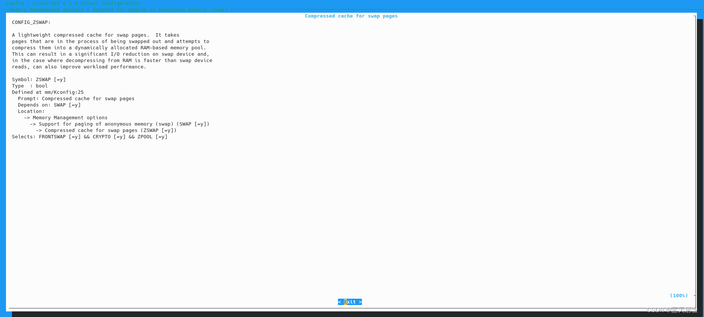

# Linux内核中内存管理相关配置项的详细解析1

本文基于kernel 6.1.0，针对于“Linux/x86 6.1.0 Kernel Configuration”中的“Memory Management options”项下的各个子配置项（如下图所示）进行详细解析。

### 一、Support for paging of anonymous memory (swap)

对应配置变量为：CONFIG\_SWAP。

这个选项以前位于“General Setup”中，后改到“Memory Management options”下。此选项将使你的内核支持[虚拟内存](https://so.csdn.net/so/search?q=%E8%99%9A%E6%8B%9F%E5%86%85%E5%AD%98&spm=1001.2101.3001.7020)，也就是让你的计算机好象拥有比实际内存更多的内存空间用来执行很大的程序。此项只包含选中（\*）即Y和不选中（）即N，默认为选中。

此项的内核源码详细解释为：

> This option allows you to choose whether you want to have support
>
> for so called swap devices or swap files in your kernel that are
>
> used to provide more virtual memory than the actual RAM present
>
> in your computer. If unsure say Y.
>
> 此选项允许你选择是否支持所谓的交换设备或内核中的交换文件，这些文件用于提供比计算机中实际RAM更多的虚拟内存。如果不确定，选择Y。

“Support for paging of anonymous memory (swap)”项展开后如下图所示：

#### 1. Compressed cache for swap pages（交换页的压缩缓存）

对应配置变量为：CONFIG\_ZSWAP。

此项也是只有选中和不选中两种状态。只有当选中时，下边的选项才会出现，否则只是这样：

 此项的内核源码详细解释为：

> A lightweight compressed cache for swap pages. It takes
>
> pages that are in the process of being swapped out and attempts to
>
> compress them into a dynamically allocated RAM-based memory pool.
>
> This can result in a significant I/O reduction on swap device and,
>
> in the case where decompressing from RAM is [faster](https://so.csdn.net/so/search?q=faster&spm=1001.2101.3001.7020) than swap device
>
> reads, can also improve workload performance. 
>
> 交换页的轻量级压缩缓存。其获取正在换出的页面，并尝试将它们压缩到动态分配的基于RAM的[内存池](https://so.csdn.net/so/search?q=%E5%86%85%E5%AD%98%E6%B1%A0&spm=1001.2101.3001.7020)中。这可以显著减少交换设备上的I/O（操作），并在从RAM解压缩比交换设备读取快的情况下，也还能够提高工作负载性能。

#### 2\. Enable the compressed cache for swap pages by default（默认情况下为交换页启用（使能）压缩缓存）

对应配置变量为：CONFIG\_ZSWAP\_DEFAULT\_ON。

此项也只有选中和不选中两种状态。默认为不选中。

此项的内核源码详细解释为：

> If selected, the compressed cache for swap pages will be enabled
>
> at boot, otherwise it will be disabled.
>
> The selection made here can be overridden by using the kernel
>
> command line 'zswap.enabled=' option.
>
> 如果被选中，交换页的压缩缓存将在引导（启动）时被启用；否则其将被禁止。
>
> 此处所做的选择可以通过使用内核命令行“zswap.enabled=”选项来覆盖。

其它选项将在后续文章中继续介绍。

## 参考

[Linux内核中内存管理相关配置项的详细解析1_support for paging of anonymous memory-CSDN博客](https://phmatthaus.blog.csdn.net/article/details/131121552)