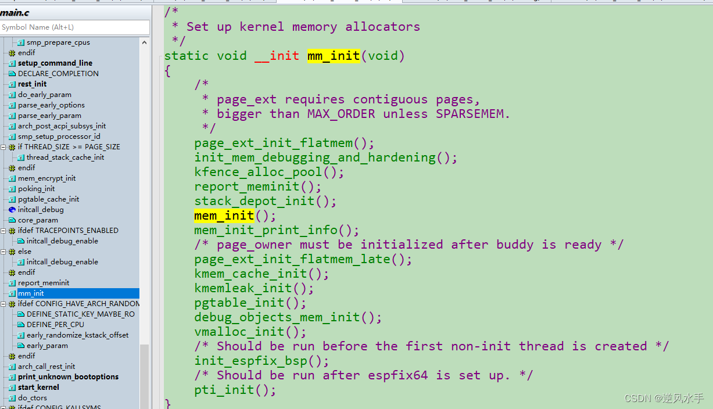
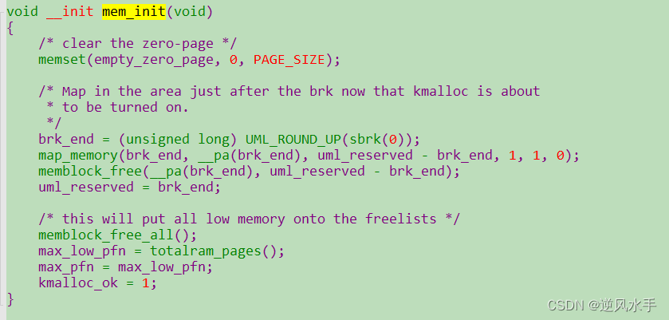

# 【Linux内核解析-linux-5.14.10-内核源码注释】MM内存管理内核启动初始化源码解析

## 源码

这是Linux内核中的mm\_init函数的代码，其作用是初始化内存管理相关的组件和数据结构。

1.  `static`: 这是一个函数声明修饰符，表示该函数只在当前文件中可见。
    
2.  `void __init`: 这是函数的返回类型和修饰符，表示该函数是内核初始化代码。
    
3.  `page_ext_init_flatmem()`: 这是一个函数调用，用于初始化[页表](https://so.csdn.net/so/search?q=%E9%A1%B5%E8%A1%A8&spm=1001.2101.3001.7020)扩展(page\_ext)的内存管理器。该函数要求页表必须是连续的，而且必须大于MAX\_ORDER，除非使用了SPARSEMEM。
    
4.  `init_mem_debugging_and_hardening()`: 这是一个函数调用，用于初始化内存调试和硬化相关的组件。
    
5.  `kfence_alloc_pool()`: 这是一个函数调用，用于为内存分配器kFence分配内存池。
    
6.  `report_meminit()`: 这是一个函数调用，用于报告内存初始化的情况。
    
7.  `stack_depot_init()`: 这是一个函数调用，用于初始化内核堆栈的存储和管理。
    
8.  `mem_init()`: 这是一个函数调用，用于初始化内存管理器的基本数据结构。
    
9.  `mem_init_print_info()`: 这是一个函数调用，用于打印内存初始化的信息。
    
10.  `page_ext_init_flatmem_late()`: 这是一个函数调用，用于初始化页表扩展(page\_ext)的内存管理器，但在buddy分配器准备好之后才进行。
    
11.  `kmem_cache_init()`: 这是一个函数调用，用于初始化内存缓存的数据结构。
    
12.  `kmemleak_init()`: 这是一个函数调用，用于初始化内存泄漏检测器的数据结构。
    
13.  `pgtable_init()`: 这是一个函数调用，用于初始化页表的数据结构。
    
14.  `debug_objects_mem_init()`: 这是一个函数调用，用于初始化内核调试对象的内存管理器。
    
15.  `vmalloc_init()`: 这是一个函数调用，用于初始化虚拟内存分配器的数据结构。
    
16.  `init_espfix_bsp()`: 这是一个函数调用，用于在创建第一个非初始化线程之前运行，以修复x86架构中的esp寄存器问题。
    
17.  `pti_init()`: 这是一个函数调用，用于在espfix64设置好之后运行，以启用PTI(页表隔离)保护。

## 源码

  
这是[Linux内核](https://so.csdn.net/so/search?q=Linux%E5%86%85%E6%A0%B8&spm=1001.2101.3001.7020)中的mem\_init函数的代码，其作用是初始化内存管理器的基本数据结构。

1.  `void __init`: 这是函数的返回类型和修饰符，表示该函数是内核初始化代码。
    
2.  `memset(empty_zero_page, 0, PAGE_SIZE)`: 这是一个函数调用，用于将空的零页面清零。
    
3.  `brk_end = (unsigned long) UML_ROUND_UP(sbrk(0))`: 这一行代码用于获取当前进程的brk结束地址，并进行向上取整操作。
    
4.  `map_memory(brk_end, __pa(brk_end), uml_reserved - brk_end, 1, 1, 0)`: 这是一个函数调用，用于将brk\_end地址映射到物理内存上，并设置相应的标志位。
    
5.  `memblock_free(__pa(brk_end), uml_reserved - brk_end)`: 这是一个函数调用，用于在物理内存上释放brk\_end之后的空间。
    
6.  `uml_reserved = brk_end`: 这一行代码用于更新uml\_reserved的值，使其等于brk\_end，表示这部分空间已经被内核保留。
    
7.  `memblock_free_all()`: 这是一个函数调用，用于将所有低端内存块都添加到内存管理器的空闲列表中。
    
8.  `max_low_pfn = totalram_pages()`: 这一行代码用于计算系统可用的最大物理页框号，即totalram\_pages()。
    
9.  `max_pfn = max_low_pfn`: 这一行代码用于将最大物理页框号赋值给max\_pfn。
    
10.  `kmalloc_ok = 1`: 这一行代码用于设置kmalloc\_ok标志位，表示内核已经准备好使用kmalloc分配内存了。

## 参考

[【Linux内核解析-linux-5.14.10-内核源码注释】MM内存管理内核启动初始化源码解析_linux内核memset-CSDN博客](https://blog.csdn.net/qq_21688871/article/details/130457421?spm=1001.2014.3001.5506)