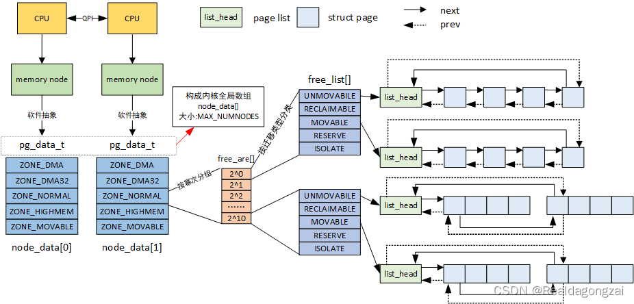
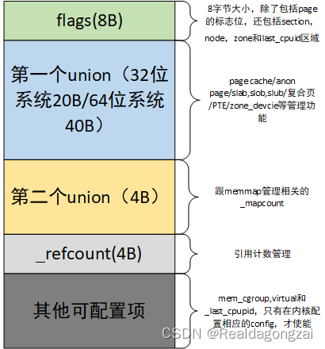
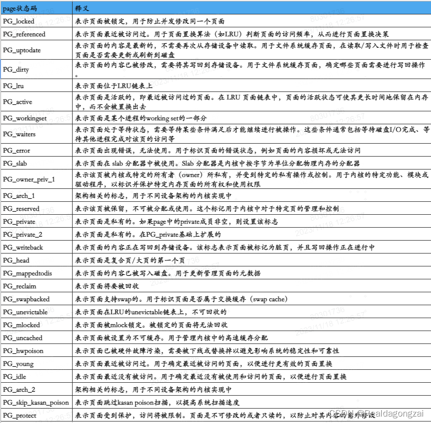
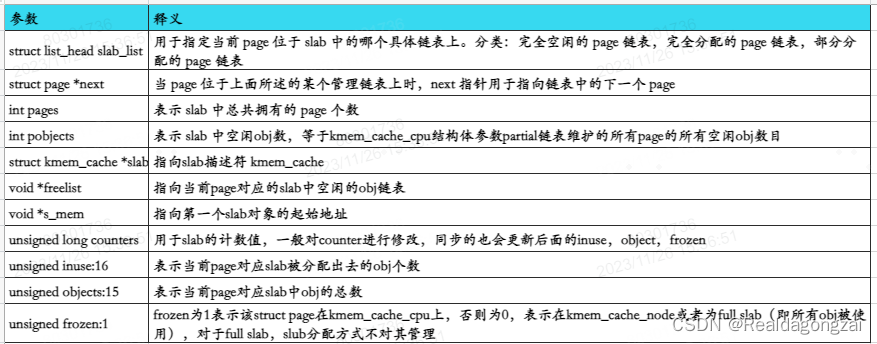

# Linux 物理内存管理涉及的三大结构体之struct page

​		在讲buddy system之前，先对linux管理物理内存涉及的三大结构体node，[zone](https://so.csdn.net/so/search?q=zone&spm=1001.2101.3001.7020)，page frame有个概念，对应的代码实际结构体为：struct pglist\_data(msm-5.4/include/linux/mmzone.h)，struct zone(msm-5.4/include/linux/mmzone.h)，struct page。同时提前说目前CPU和内存的之间主要的两个架构：UMA和NUMA的区别。

## 一、UMA和NUMA的概念

​		UMA（Uniform Memory Architecture，统一/一致性内存访问），就是在多CPU(多核)系统中，每个CPU都通过同一根总线访问物理内存，而且访问的方式和时延是一样的，没有区别。NUMA(Non-Uniform Memory Architecture，非统一/一致性内存访问)，相当于在多CPU(多核)系统中，系统给每个CPU都分配了一块物理内存，这就意味着每个CPU可以并发访问各自的内存，当然每个CPU也可以访问其他CPU对应的物理内存或者公共物理内存，此时，这就出现了一个新的情况，由于各种物理内存空间所处的位置不同，于是访问它们的时间长短也就各异，而且比访问各自内存的时间都要更长，这就是NUMA系统跟UMA系统的区别。

​		不过上述是从硬件角度看待NUMA，从软件层面的linux看，其对NUMA的概念进行了抽象。即使硬件上是一整块内存连续的UMA，linux也可以将其划分成若干node（node其实是个软件上的概念）。这也就是对于手机，PC这类UMA，仍然存在前面所说的三大结构体。同理，即便硬件上是物理内存不连续的NUMA，Linux也可将其视作UMA。

## 二、page frame(struct page)

​		每个node由一个或多个zone组成，每个zone又由一个或多个page frame组成（注意：page frame指的是物理页面，虚拟页面用page表示）。我们从page frame开始自下而上讲。




​		page（页）是linux中内存管理的基本单位，虽然CPU的最小寻址地址单位一般为字节，但是内存管理单元MMU通常都是以页为最小单位进行处理的（从虚拟内存的上来看，page就是最小单位，page frame代表了系统内存的最小单位）。内存中的page in/page out，swap in/swap out，reclaim和maping操作都是以page为单位来进行的。因此，毫无疑问，描述page frame的struct page是使用频率比较高的结构体。在内核中，每个page frame都会有一个struct page结构体，这就意味着这个结构体的数量是巨大的，如果不对结构体里面的结构体成员进行规划，那么单单结构体本身占有的内存就是不可想象，所以为了保证struct page结构体足够小，**在控制结构体成员变量数目的同时，也使用了联合体union来增加内存复用和对struct page->flags成员进行充分利用，从而减少整个结构体占用内存的大小。**

**整体的struct page结构可以划分为以下几块。**由于是16字节内存对齐，因而struct page结构体占用内存大小是64B。



​		可以看到在我们常见的64位系统中，struct page结构体包含了两个union结构，**大小分别为40B和4B**，就如前面说的为了减少占用空间。对于flags参数的利用后面2.1部分会详细介绍。

​		如下就是struct page完整的结构体参数（kernel\-5.4）。

     //kernel/msm-5.4/include/linux/mm_types.h 
     
    //kernel/msm-5.4/include/linux/mmzone.h  struct zone, struct pglist_data
      /*
       * Each physical page in the system has a struct page associated with
       * it to keep track of whatever it is we are using the page for at the
       * moment. Note that we have no way to track which tasks are using
       * a page, though if it is a pagecache page, rmap structures can tell us
       * who is mapping it.
       *
       * If you allocate the page using alloc_pages(), you can use some of the
       * space in struct page for your own purposes.  The five words in the main
       * union are available, except for bit 0 of the first word which must be
       * kept clear.  Many users use this word to store a pointer to an object
       * which is guaranteed to be aligned.  If you use the same storage as
       * page->mapping, you must restore it to NULL before freeing the page.
       *
       * If your page will not be mapped to userspace, you can also use the four
       * bytes in the mapcount union, but you must call page_mapcount_reset()
       * before freeing it.
       *
       * If you want to use the refcount field, it must be used in such a way
       * that other CPUs temporarily incrementing and then decrementing the
       * refcount does not cause problems.  On receiving the page from
       * alloc_pages(), the refcount will be positive.
       *
       * If you allocate pages of order > 0, you can use some of the fields
       * in each subpage, but you may need to restore some of their values
       * afterwards.
       *
       * SLUB uses cmpxchg_double() to atomically update its freelist and
       * counters.  That requires that freelist & counters be adjacent and
       * double-word aligned.  We align all struct pages to double-word
       * boundaries, and ensure that 'freelist' is aligned within the
       * struct.
       */
      #ifdef CONFIG_HAVE_ALIGNED_STRUCT_PAGE
      #define _struct_page_alignment	__aligned(2 * sizeof(unsigned long))//按照2*8B=16B字节对齐
      #else
      #define _struct_page_alignment
      #endif
      
      struct page {
      	unsigned long flags;		/* Atomic flags, some possibly 
      					 * updated asynchronously  描述page的状态和其他信息,
                         关于page的状态标识的具体定义在linux/page-flags.h中*/
        /*对于flags这64比特位的使用大致包括（从比特高位到低位顺序）：
        section，node，zone，last_cpuid和flags这五部分
        其中zone和flags区域是一定有的，其他部分，根据内核的配置不用会有不同的组合。
        至于详细的组合情况，后面会讲  
        */
      	/*
      	 * Five words (20/40 bytes) are available in this union.
      	 * WARNING: bit 0 of the first word is used for PageTail(). That
      	 * means the other users of this union MUST NOT use the bit to
      	 * avoid collision and false-positive PageTail().
      	 */
      	union {
      		struct {	/* Page cache and anonymous pages  跟page cache 和anon page相关的一下参数，这里就包括所有page类型*/
      			/**
      			 * @lru: Pageout list, eg. active_list protected by
      			 * pgdat->lru_lock.  Sometimes used as a generic list
      			 * by the page owner.
      			 */
      			struct list_head lru;
      			/* See page-flags.h for PAGE_MAPPING_FLAGS */
      			struct address_space *mapping;
      			pgoff_t index;		/* Our offset within mapping. */
      			/**
      			 * @private: Mapping-private opaque data.
      			 * Usually used for buffer_heads if PagePrivate.
      			 * Used for swp_entry_t if PageSwapCache.
      			 * Indicates order in the buddy system if PageBuddy.
      			 */
      			unsigned long private;
      		};
      		struct {	/* page_pool used by netstack */
      			/**
      			 * @dma_addr: might require a 64-bit value even on
      			 * 32-bit architectures.
      			 */
      			dma_addr_t dma_addr;
      		};
      		struct {	/* slab, slob and slub */
      			union {
      				struct list_head slab_list;
      				struct {	/* Partial pages */
      					struct page *next;
      #ifdef CONFIG_64BIT
      					int pages;	/* Nr of pages left */
      					int pobjects;	/* Approximate count */
      #else
      					short int pages;
      					short int pobjects;
      #endif
      				};
      			};
      			struct kmem_cache *slab_cache; /* not slob */
      			/* Double-word boundary */
      			void *freelist;		/* first free object */
      			union {
      				void *s_mem;	/* slab: first object */
      				unsigned long counters;		/* SLUB */
      				struct {			/* SLUB */
      					unsigned inuse:16;
      					unsigned objects:15;
      					unsigned frozen:1;
      				};
      			};
      		};
      		struct {	/* Tail pages of compound page */
      			unsigned long compound_head;	/* Bit zero is set */
      
      			/* First tail page only */
      			unsigned char compound_dtor;
      			unsigned char compound_order;
      			atomic_t compound_mapcount;
      		};
      		struct {	/* Second tail page of compound page */
      			unsigned long _compound_pad_1;	/* compound_head */
      			unsigned long _compound_pad_2;
      			/* For both global and memcg */
      			struct list_head deferred_list;
      		};
      		struct {	/* Page table pages */
      			unsigned long _pt_pad_1;	/* compound_head */
      			pgtable_t pmd_huge_pte; /* protected by page->ptl */
      			unsigned long _pt_pad_2;	/* mapping */
      			union {
      				struct mm_struct *pt_mm; /* x86 pgds only */
      				atomic_t pt_frag_refcount; /* powerpc */
      			};
      #if ALLOC_SPLIT_PTLOCKS
      			spinlock_t *ptl;
      #else
      			spinlock_t ptl;
      #endif
      		};
      		struct {	/* ZONE_DEVICE pages */
      			/** @pgmap: Points to the hosting device page map. */
      			struct dev_pagemap *pgmap;
      			void *zone_device_data;
      			/*
      			 * ZONE_DEVICE private pages are counted as being
      			 * mapped so the next 3 words hold the mapping, index,
      			 * and private fields from the source anonymous or
      			 * page cache page while the page is migrated to device
      			 * private memory.
      			 * ZONE_DEVICE MEMORY_DEVICE_FS_DAX pages also
      			 * use the mapping, index, and private fields when
      			 * pmem backed DAX files are mapped.
      			 */
      		};
      
      		/** @rcu_head: You can use this to free a page by RCU. */
      		struct rcu_head rcu_head;
      	};
      
      	union {		/* This union is 4 bytes in size. */
      		/*
      		 * If the page can be mapped to userspace, encodes the number
      		 * of times this page is referenced by a page table.
      		 */
      		atomic_t _mapcount;
      
      		/*
      		 * If the page is neither PageSlab nor mappable to userspace,
      		 * the value stored here may help determine what this page
      		 * is used for.  See page-flags.h for a list of page types
      		 * which are currently stored here.
      		 */
      		unsigned int page_type;
      
      		unsigned int active;		/* SLAB */
      		int units;			/* SLOB */
      	};
      
      	/* Usage count. *DO NOT USE DIRECTLY*. See page_ref.h */
      	atomic_t _refcount;
      
      #ifdef CONFIG_MEMCG
      	struct mem_cgroup *mem_cgroup;
      #endif
      
      	/*
      	 * On machines where all RAM is mapped into kernel address space,
      	 * we can simply calculate the virtual address. On machines with
      	 * highmem some memory is mapped into kernel virtual memory
      	 * dynamically, so we need a place to store that address.
      	 * Note that this field could be 16 bits on x86 ... ;)
      	 *
      	 * Architectures with slow multiplication can define
      	 * WANT_PAGE_VIRTUAL in asm/page.h
      	 */
      #if defined(WANT_PAGE_VIRTUAL)
      	void *virtual;			/* Kernel virtual address (NULL if
      					   not kmapped, ie. highmem) */
      #endif /* WANT_PAGE_VIRTUAL */
      
      #ifdef LAST_CPUPID_NOT_IN_PAGE_FLAGS
      	int _last_cpupid;
      #endif
      } _struct_page_alignment; //意味这个struct page结构体是以16B基本单位进行字节对齐的，根据前面图片所示，该结构体占用64B

### 2.1 参数flags

​    上面说过，出于减少结构体占用内存和充分利用已有内存的思路，page->flags这个参数划分了多个区域（section，node，zone，last\_cpuid和flags），每个区域有不同的作用，在include/linux/page-flags-layout.h这里就定义了flags在不同内核配置情况下会划分成几个区域，具体如下：

    //include/linux/page-flags-layout.h
    /*
     * page->flags layout:
     *
     * There are five possibilities for how page->flags get laid out.  The first
     * pair is for the normal case without sparsemem. The second pair is for
     * sparsemem when there is plenty of space for node and section information.
     * The last is when there is insufficient space in page->flags and a separate
     * lookup is necessary.
     *
     * No sparsemem or sparsemem vmemmap: |       NODE     | ZONE |             ... | FLAGS |
     *      " plus space for last_cpupid: |       NODE     | ZONE | LAST_CPUPID ... | FLAGS |
     * classic sparse with space for node:| SECTION | NODE | ZONE |             ... | FLAGS |
     *      " plus space for last_cpupid: | SECTION | NODE | ZONE | LAST_CPUPID ... | FLAGS |
     * classic sparse no space for node:  | SECTION |     ZONE    | ... | FLAGS |
     */
     
    //实际上在include/linux/page-flags.h 也有大概介绍，只不过没有那么详细
    /*
    * Don't use the *_dontuse flags.  Use the macros.  Otherwise you'll break
    * locked- and dirty-page accounting.
    *
    * The page flags field is split into two parts, the main flags area
    * which extends from the low bits upwards, and the fields area which
    * extends from the high bits downwards.
    *
    *  | FIELD | ... | FLAGS |
    *  N-1           ^       0
    *               (NR_PAGEFLAGS)
    *
    * The fields area is reserved for fields mapping zone, node (for NUMA) and
    * SPARSEMEM section (for variants of SPARSEMEM that require section ids like
    * SPARSEMEM_EXTREME with !SPARSEMEM_VMEMMAP).
    */
     

从代码介绍里可以知道，总共有5种划分方式，其中section用于稀疏内存模型SPARSEMEM。node用于标识该page属于哪一个节点，NUMA节点号。注意：section和node区域与CONFIG_SPARSEMEM/CONFIG_SPARSEMEM_VMEMMAP配置相关。zone用于标识该page属于哪个zone，内存域标志。flags用于表示page的状态，常用。last_cpupid与CONFIG_NUMA_BALANCING配置相关，在kernel/msm-5.4/init/Kconfig里面有介绍。
		第一种格式分为两种情况。情况一：非稀疏型内存模型，对于稀疏型内存模型将整个物理地址空间划分成多个区段（section），每个区段由一个 mem_section 描述，因此在 page->flags 中需要存储该页所属的 section_id，但在非稀疏型内存模型中没有 mem_section，所以 page->flags 中不需要存储 section_id。情况二：vmemmap 稀疏型内存模型，在 sparsemem vmemmap 模型中，page 和 pfn 一一对应，由 page 可以得到 pfn，由 pfn 可以得到 section_id，因此 page->flags 中也不需要存储 section_id。这第一种格式，是我们常见的形式。

​		第二种格式相当于是在第一情况的基础上，增加了last_cpupid区域。
​		第三种格式就是非vmemmap 稀疏型内存模型下的常见情况，有section，node，zone，flags.
​		第四种格式就是在第三种格式的基础上，增加了last_cpupid区域。
​		第五种格式就是，情况一：虽然是稀疏型内存模型，但如果是UMA系统，那么可以不需要node，情况二：当然也有可能是page->flags存储完section，zone和flags区域信息后，没有足够位置来存储node信息的情况。在这种情况下，会多一个 section_to_node_table全局数组，存储了 section_id 和 node_id 的对应关系，在获取 page 的 node_id 时，先得到 page 的 section_id，再由上述数组查找到 node_id。转换的函数如下：

```
//kernel/msm-5.4/mm/sparse.c
#ifdef NODE_NOT_IN_PAGE_FLAGS
/*
 * If we did not store the node number in the page then we have to
 * do a lookup in the section_to_node_table in order to find which
 * node the page belongs to.
 */
#if MAX_NUMNODES <= 256
static u8 section_to_node_table[NR_MEM_SECTIONS] __cacheline_aligned;
#else
static u16 section_to_node_table[NR_MEM_SECTIONS] __cacheline_aligned;
#endif
 
int page_to_nid(const struct page *page)
{
//对于这个page_to_section函数在2.1.1 section区域这节有介绍，得到这个页的section_nr
//然后从section_to_node_table数组中得到section_nr对应的nid
	return section_to_node_table[page_to_section(page)];
}
EXPORT_SYMBOL(page_to_nid);
 
static void set_section_nid(unsigned long section_nr, int nid)
{
	section_to_node_table[section_nr] = nid;
}
#else /* !NODE_NOT_IN_PAGE_FLAGS */
static inline void set_section_nid(unsigned long section_nr, int nid)
{
}
#endif
```

对于担心这些区域全部加起来是否会导致超过这个64比特，实际上在page-flags-layout.h中有如下的定义来避免超限。其中，NR_PAGEFLAGS就是flags区域的宽度，BITS_PER_LONG 是整个page->flags的宽度。

```
#if SECTIONS_WIDTH+NODES_WIDTH+ZONES_WIDTH+LAST_CPUPID_WIDTH+KASAN_TAG_WIDTH \
	> BITS_PER_LONG - NR_PAGEFLAGS
#error "Not enough bits in page flags"
#endif
```

 同时，对于这四个section，node，zone，flags区域，在代码中定义了它的偏移量宏（PGOFF/PGSHIFT）和宽度宏(WIDTH)，不同架构配置，会有所差异，代码如下：

```
//msm-5.4/include/linux/mm.h 
/*
 * The zone field is never updated after free_area_init_core()
 * sets it, so none of the operations on it need to be atomic.
 */
 
/* Page flags: | [SECTION] | [NODE] | ZONE | [LAST_CPUPID] | ... | FLAGS | */
#define SECTIONS_PGOFF		((sizeof(unsigned long)*8) - SECTIONS_WIDTH) // 8*8 - SECTIONS_WIDTH, SECTIONS_WIDTH定义在msm-5.4/include/linux/page-flags-layout.h里面
#define NODES_PGOFF		(SECTIONS_PGOFF - NODES_WIDTH)
#define ZONES_PGOFF		(NODES_PGOFF - ZONES_WIDTH)
#define LAST_CPUPID_PGOFF	(ZONES_PGOFF - LAST_CPUPID_WIDTH)
#define KASAN_TAG_PGOFF		(LAST_CPUPID_PGOFF - KASAN_TAG_WIDTH)
 
/*
 * Define the bit shifts to access each section.  For non-existent
 * sections we define the shift as 0; that plus a 0 mask ensures
 * the compiler will optimise away reference to them. 如果一个字段位0则PGSHIFT则为0
 */
#define SECTIONS_PGSHIFT	(SECTIONS_PGOFF * (SECTIONS_WIDTH != 0))
#define NODES_PGSHIFT		(NODES_PGOFF * (NODES_WIDTH != 0))
#define ZONES_PGSHIFT		(ZONES_PGOFF * (ZONES_WIDTH != 0))
#define LAST_CPUPID_PGSHIFT	(LAST_CPUPID_PGOFF * (LAST_CPUPID_WIDTH != 0))
#define KASAN_TAG_PGSHIFT	(KASAN_TAG_PGOFF * (KASAN_TAG_WIDTH != 0))
 
/* NODE:ZONE or SECTION:ZONE is used to ID a zone for the buddy allocator */
#ifdef NODE_NOT_IN_PAGE_FLAGS
#define ZONEID_SHIFT		(SECTIONS_SHIFT + ZONES_SHIFT)
#define ZONEID_PGOFF		((SECTIONS_PGOFF < ZONES_PGOFF)? \
						SECTIONS_PGOFF : ZONES_PGOFF)
#else
#define ZONEID_SHIFT		(NODES_SHIFT + ZONES_SHIFT)
#define ZONEID_PGOFF		((NODES_PGOFF < ZONES_PGOFF)? \
						NODES_PGOFF : ZONES_PGOFF)
#endif
 
#define ZONEID_PGSHIFT		(ZONEID_PGOFF * (ZONEID_SHIFT != 0))
 
```


#### 2.1.1 section区域

        section区域宽度**SECTIONS\_WIDTH**定义如下：
    
    //msm-5.4/include/linux/page-flags-layout.h/* *MAX_PHYSMEM_BITS和SECTION_SIZE_BITS这两个值跟操作系统使用的架构有关 *对于arm结构，定义值在msm-5.4/arch/arm/include/asm/sparsemem.h里面，分别为36和28。 *对于arm64结构，定义值在msm-5.4/arch/arm64/include/asm/sparsemem.h里面，MAX_PHYSMEM_BITS可以  *设置为48或者52，SECTION_SIZE_BITS可以设置为27或者29。 *在msm-5.4/arch/arm64/Kconfig里面分别搜索ARM64_PA_BITS和HOTPLUG_SIZE_BITS可以找到对应的设置*//* SECTION_SHIFT	#bits space required to store a section # */#define SECTIONS_SHIFT	(MAX_PHYSMEM_BITS - SECTION_SIZE_BITS) //内存模型为非VMEMMAP的稀疏型内存模型，此时是有section区域的，而且SECTIONS_WIDTH就为SECTIONS_SHIFT，否则为0#if defined(CONFIG_SPARSEMEM) && !defined(CONFIG_SPARSEMEM_VMEMMAP)#define SECTIONS_WIDTH		SECTIONS_SHIFT#else#define SECTIONS_WIDTH		0#endif
    
        kernel还定义了设置page section和获取page section的函数，具体定义：
    
    //msm-5.4/include/linux/mm.h#ifdef SECTION_IN_PAGE_FLAGS//设置page section函数static inline void set_page_section(struct page *page, unsigned long section){//首先确认是否有section区域，然后再进行设置	page->flags &= ~(SECTIONS_MASK << SECTIONS_PGSHIFT);	page->flags |= (section & SECTIONS_MASK) << SECTIONS_PGSHIFT;}//获取page section函数static inline unsigned long page_to_section(const struct page *page){	return (page->flags >> SECTIONS_PGSHIFT) & SECTIONS_MASK;}#endif

#### 2.1.2 node区域

         node区域宽度**NODES\_WIDTH**定义如下，这里做了一个检查，防止使用的区域宽度超过unsigned long的BITS\_PER\_LONG 大小。如果没有超过，则使用NODE\_SHIFT配置NODES\_WIDTH，否则为0，如果此时还使能了CONFIG\_SPARSEMEM\_VMEMMAP参数，还会打印一个error信息。NODE\_SHIFT这个参数受CONFIG\_NODES\_SHIFT控制。
    
    //msm-5.4/arch/arm64/Kconfigconfig NODES_SHIFT	int "Maximum NUMA Nodes (as a power of 2)"	range 1 10	default "2"	depends on NEED_MULTIPLE_NODES	help	  Specify the maximum number of NUMA Nodes available on the target	  system.  Increases memory reserved to accommodate various tables. //msm-5.4/include/linux/numa.h/* SPDX-License-Identifier: GPL-2.0 */#ifndef _LINUX_NUMA_H#define _LINUX_NUMA_H  #ifdef CONFIG_NODES_SHIFT#define NODES_SHIFT     CONFIG_NODES_SHIFT#else#define NODES_SHIFT     0#endif #define MAX_NUMNODES    (1 << NODES_SHIFT) #define	NUMA_NO_NODE	(-1) #endif /* _LINUX_NUMA_H */ //msm-5.4/include/linux/page-flags-layout.h#if SECTIONS_WIDTH+ZONES_WIDTH+NODES_SHIFT <= BITS_PER_LONG - NR_PAGEFLAGS#define NODES_WIDTH		NODES_SHIFT#else#ifdef CONFIG_SPARSEMEM_VMEMMAP //这个对应前面所说的第五种情况，没有足够空间分配给node区域#error "Vmemmap: No space for nodes field in page flags"#endif#define NODES_WIDTH		0#endif
    
        kernel中还定义了设置page node区域和获取page node区域的函数，具体定义如下：
    
    //设置page node区域信息static inline void set_page_node(struct page *page, unsigned long node){//同样也是先确认是否有node区域，再进行设置	page->flags &= ~(NODES_MASK << NODES_PGSHIFT);	page->flags |= (node & NODES_MASK) << NODES_PGSHIFT;} //获取page node id，如果page->flags里面没有node区域，page_to_nid直接是个空函数#ifdef NODE_NOT_IN_PAGE_FLAGSextern int page_to_nid(const struct page *page);#elsestatic inline int page_to_nid(const struct page *page){	struct page *p = (struct page *)page; 	return (PF_POISONED_CHECK(p)->flags >> NODES_PGSHIFT) & NODES_MASK;}#endif //根据page_to_nid函数获取的id,在NODE_DATA数组中得到对应的node结构体pg_data_tstatic inline pg_data_t *page_pgdat(const struct page *page){	return NODE_DATA(page_to_nid(page));} 

#### 2.1.3 zone区域

        zone区域宽度**ZONES\_WIDTH**定义如下，根据MAX\_NR\_ZONES，ZONES\_SHIFT参数会有所差异。
    
    #if MAX_NR_ZONES < 2#define ZONES_SHIFT 0#elif MAX_NR_ZONES <= 2#define ZONES_SHIFT 1#elif MAX_NR_ZONES <= 4#define ZONES_SHIFT 2#elif MAX_NR_ZONES <= 8#define ZONES_SHIFT 3#else#error ZONES_SHIFT -- too many zones configured adjust calculation#endif #define ZONES_WIDTH		ZONES_SHIFT
    
        kernel中还定义了设置page zone区域和获取page node区域的函数，具体定义如下：
    
    //设置page zone区域static inline void set_page_zone(struct page *page, enum zone_type zone){//首先判断是否存下zone区域，再进行设置	page->flags &= ~(ZONES_MASK << ZONES_PGSHIFT);	page->flags |= (zone & ZONES_MASK) << ZONES_PGSHIFT;} /* * The identification function is mainly used by the buddy allocator for * determining if two pages could be buddies. We are not really identifying * the zone since we could be using the section number id if we do not have * node id available in page flags. * We only guarantee that it will return the same value for two combinable * pages in a zone. *///获取page zone idstatic inline int page_zone_id(struct page *page){	return (page->flags >> ZONEID_PGSHIFT) & ZONEID_MASK;} //获取该page zone对应的struct zone结构体信息，因为zone是挂在node下面的，所以可以通过page对应的node找到对应zone结构体信息static inline struct zone *page_zone(const struct page *page){	return &NODE_DATA(page_to_nid(page))->node_zones[page_zonenum(page)];}

#### 2.1.4 last\_cpuid区域

        last\_cpupid区域宽度**LAST\_CPUPID\_WIDTH**，其定义如下。跟前面的node区域一样，也会判断使用的区域宽度是否超过unsigned long的BITS\_PER\_LONG 大小。如果没有，则使用LAST\_CPUPID\_SHIFT，否则为0。LAST\_CPUPID\_SHIFT由宏CONFIG\_NUMA\_BALANCING决定是LAST\_\_PID\_SHIFT+LAST\_\_CPU\_SHIFT还是为0。
    
    //msm-5.4/arch/arm64/Kconfigconfig NR_CPUS	int "Maximum number of CPUs (2-4096)"	range 2 4096	default "256" //msm-5.4/kernel/bounds.c#ifdef CONFIG_SMP //正常CPU一般是8核的，即NR_CPUS_BITS为8	DEFINE(NR_CPUS_BITS, ilog2(CONFIG_NR_CPUS));#endif  #ifdef CONFIG_NUMA_BALANCING#define LAST__PID_SHIFT 8#define LAST__PID_MASK  ((1 << LAST__PID_SHIFT)-1) #define LAST__CPU_SHIFT NR_CPUS_BITS#define LAST__CPU_MASK  ((1 << LAST__CPU_SHIFT)-1) #define LAST_CPUPID_SHIFT (LAST__PID_SHIFT+LAST__CPU_SHIFT)#else#define LAST_CPUPID_SHIFT 0#endif #ifdef CONFIG_KASAN_SW_TAGS#define KASAN_TAG_WIDTH 8#else#define KASAN_TAG_WIDTH 0#endif //会进行bit位长度判断，避免超限#if SECTIONS_WIDTH+ZONES_WIDTH+NODES_SHIFT+LAST_CPUPID_SHIFT+KASAN_TAG_WIDTH \	<= BITS_PER_LONG - NR_PAGEFLAGS#define LAST_CPUPID_WIDTH LAST_CPUPID_SHIFT#else#define LAST_CPUPID_WIDTH 0#endif
    
         kernel中还定义了获取page last\_cpupid id和设置last\_cpupid的函数，具体定义如下：
    
    #ifdef LAST_CPUPID_NOT_IN_PAGE_FLAGSstatic inline int page_cpupid_xchg_last(struct page *page, int cpupid){	return xchg(&page->_last_cpupid, cpupid & LAST_CPUPID_MASK);}//如果page->flags里面没有LAST_CPUPID区域，则直接从page->_last_cpupid获取last_cpupidstatic inline int page_cpupid_last(struct page *page){	return page->_last_cpupid;}//设置last_cpupidstatic inline void page_cpupid_reset_last(struct page *page){	page->_last_cpupid = -1 & LAST_CPUPID_MASK;}#else//page->flags里面有LAST_CPUPID区域，获取last_cpupidstatic inline int page_cpupid_last(struct page *page){	return (page->flags >> LAST_CPUPID_PGSHIFT) & LAST_CPUPID_MASK;} extern int page_cpupid_xchg_last(struct page *page, int cpupid);//设置last_cpupidstatic inline void page_cpupid_reset_last(struct page *page){	page->flags |= LAST_CPUPID_MASK << LAST_CPUPID_PGSHIFT;}#endif /* LAST_CPUPID_NOT_IN_PAGE_FLAGS */

#### 2.1.5 flags区域

        下面开始介绍一下flags区域，描述page状态信息的各个flag表示的含义。
    
    enum pageflags { 	PG_locked,		/* Page is locked. Don't touch. *///page被锁定，说明有使用者正在操作该page,不能被其他使用者访问 	PG_referenced,//表示page刚刚被访问过 	PG_uptodate,  //page内容是最新的，当在该页面上的读操作完成后，会设置该标志位，表示page的数据已经从块设备成功读取 	PG_dirty,     //表示page内容被修改过，为脏页 	PG_lru,       //表示page处于LRU链表(active,inactive,unevictable)上 	PG_active,    //表示page在活跃LRU链表中,PG_active和PG_referenced一起控制该page的活跃程度，在内存回收(kswapd等)时有用 	PG_workingset,//表示page为某个进程的woring set，关于working set 可以文章：https://www.brendangregg.com/blog/2018-01-17/measure-working-set-size.html 	PG_waiters,	  //表示有进程在等待这个页面	/* Page has waiters, check its waitqueue. Must be bit #7 and in the same byte as "PG_locked" */ 	PG_error,     //表示page发了IO错误 	PG_slab,      //表示page被由slab分配器创建的slab所使用 	PG_owner_priv_1,	//被page的所有者使用，如果是作为pagecache页面，则文件系统可能使用/* Owner use. If pagecache, fs may use*/      	PG_arch_1,    //与体系结构相关的一个状态位 	PG_reserved,  //表示page不可能被换出/*该页被保留，不能够被swap out出去。在系统中kernek image(包括vDSO)以及 BIOS，initrd、hw table 以及vememap等在系统系统初始化阶段就需要做保留以及DAM等常见需要做保留的页 都需要将页状态设置位保留,来预留给它们，注意：这个跟为了解决内存不足，所进行的reserve有所不同（Linux kernel内存管理之overcommit相关参数中有讲totalreserve_pages），这里的预留是给系统启动阶段使用的*/ 	PG_private,		/* If pagecache, has fs-private data *///如果page中的private成员非空，则设置该标志, 用于I/O的页可使用该字段将页细分为多核缓冲区。如果page是pagecache,则包含一些文件系统相关的数据信息 	PG_private_2,		/* If pagecache, has fs aux data *///如果是 pagecache, 可能包含 fs aux data,在PG_private基础上扩展的 	PG_writeback,		/* Page is under writeback *///表示page的内容正在写回磁盘 	PG_head,		/* A head page *///表示该page是一个head page。在内核中有时需要将多个页组成一个compound pages，而设置该状态，表明该page是compound pages的第一个页 	PG_mappedtodisk,	/* Has blocks allocated on-disk *///表示page被映射到硬盘中 	PG_reclaim,		/* To be reclaimed asap *///表示page可被回收 	PG_swapbacked,		/* Page is backed by RAM/swap *///表示该page可以写回RAM/swap,匿名页是写回swap分区 	PG_unevictable,		/* Page is "unevictable"  *///表示page是在LRU的unevictable链表上，不可回收的，page被锁住 #ifdef CONFIG_MMU 	PG_mlocked,		/* Page is vma mlocked *///表示page对应的vma被锁住，一般是通过系统调用mlock()锁定了一段内存，这部分内存包含在proc/meminfo里面的mlocked #endif #ifdef CONFIG_ARCH_USES_PG_UNCACHED 	PG_uncached,		/* Page has been mapped as uncached *///表示page被设置为不可缓存，需要配置CONFIG_ARCH_USES_PG_UNCACHED #endif #ifdef CONFIG_MEMORY_FAILURE 	PG_hwpoison,		/* hardware poisoned page. Don't touch *///表示被kernel标记为已经损坏的且要被删除掉的内存页，这部分内存包含在proc/meminfo里面的HardwareCorrupted #endif #if defined(CONFIG_PAGE_IDLE_FLAG) && defined(CONFIG_64BIT) //mm/Kconfig里面有定义 	PG_young,//这里有介绍https://lwn.net/Articles/637190/，这两个flag如果设置了，表示其他PTE访问flags状态时，不会收到打扰 	PG_idle, #endif 	__NR_PAGEFLAGS,//因为是枚举，从0开始计数，而且下面的flag都是复用上面的，因此根据__NR_PAGEFLAGS值，我们就可以知道当前的总共有多少个page flag了  //下面的flags状态复用前面的 	/* Filesystems */ 	PG_checked = PG_owner_priv_1,  	/* SwapBacked */ 	PG_swapcache = PG_owner_priv_1,	/* Swap page: swp_entry_t in private */  	/* Two page bits are conscripted by FS-Cache to maintain local caching 	 * state.  These bits are set on pages belonging to the netfs's inodes 	 * when those inodes are being locally cached. 	 */ 	PG_fscache = PG_private_2,	/* page backed by cache */  	/* XEN */ 	/* Pinned in Xen as a read-only pagetable page. */ 	PG_pinned = PG_owner_priv_1, 	/* Pinned as part of domain save (see xen_mm_pin_all()). */ 	PG_savepinned = PG_dirty, 	/* Has a grant mapping of another (foreign) domain's page. */ 	PG_foreign = PG_owner_priv_1, 	/* Remapped by swiotlb-xen. */ 	PG_xen_remapped = PG_owner_priv_1,  	/* SLOB */ 	PG_slob_free = PG_private,  	/* Compound pages. Stored in first tail page's flags */ 	PG_double_map = PG_private_2,  	/* non-lru isolated movable page */ 	PG_isolated = PG_reclaim, };

如下是物理页状态码（flags）更新。



        对于flags区域，内核定义了一些函数来进行标志位的设置，清零以及查看对应标志位是否置位。函数定义位于include/linux/page-flags.h下。
    
    /* * Macros to create function definitions for page flags */#define TESTPAGEFLAG(uname, lname, policy)				\static __always_inline int Page##uname(struct page *page)		\	{ return test_bit(PG_##lname, &policy(page, 0)->flags); } #define SETPAGEFLAG(uname, lname, policy)				\static __always_inline void SetPage##uname(struct page *page)		\	{ set_bit(PG_##lname, &policy(page, 1)->flags); } #define CLEARPAGEFLAG(uname, lname, policy)				\static __always_inline void ClearPage##uname(struct page *page)		\	{ clear_bit(PG_##lname, &policy(page, 1)->flags); } #define __SETPAGEFLAG(uname, lname, policy)				\static __always_inline void __SetPage##uname(struct page *page)		\	{ __set_bit(PG_##lname, &policy(page, 1)->flags); } #define __CLEARPAGEFLAG(uname, lname, policy)				\static __always_inline void __ClearPage##uname(struct page *page)	\	{ __clear_bit(PG_##lname, &policy(page, 1)->flags); } #define TESTSETFLAG(uname, lname, policy)				\static __always_inline int TestSetPage##uname(struct page *page)	\	{ return test_and_set_bit(PG_##lname, &policy(page, 1)->flags); } #define TESTCLEARFLAG(uname, lname, policy)				\static __always_inline int TestClearPage##uname(struct page *page)	\	{ return test_and_clear_bit(PG_##lname, &policy(page, 1)->flags); }......
    
        从上面列举一部分，可以看到，根据不同的define，会调用不同的函数，但是对每个函数具体展开看，实际上就是前面说的对标志位的三个操作：

1、PageXXX()用于检查页面是否试设置了PG\_XXX标志。如：PageDirty(page)检查PG\_dirty是否置位

2、SetPageXXX()用于设置页中的PG\_XXX标志位。如：SetPageDirty(page)用于设置PG\_dirty标志位。

3、ClearPageXXX()用于清除某个特定的标志位。如：ClearPageDirty(page)用于清楚PG\_dirty标志位。

### 2.2 第一个UNION

        看前面列出的struct page结构体，可以知道在64位系统中，第一个UNION占40B，共包含8个struct，记录了page的主要功能数据，下面开始对这8个struct逐一介绍。

#### 2.2.1 Page cache and anonymous pages

        如下面所示，这个struct主要是跟page cache和anon page有关的参数，有4个参数。
    
    struct {	/* Page cache and anonymous pages  跟page cache 和anon page相关的一下参数*/	/**	 * @lru: Pageout list, eg. active_list protected by	 * pgdat->lru_lock.  Sometimes used as a generic list	 * by the page owner.	 */	struct list_head lru;	/* See page-flags.h for PAGE_MAPPING_FLAGS */	struct address_space *mapping;	pgoff_t index;		/* Our offset within mapping. */	/**	 * @private: Mapping-private opaque data.	 * Usually used for buffer_heads if PagePrivate.	 * Used for swp_entry_t if PageSwapCache.	 * Indicates order in the buddy system if PageBuddy.	 */	unsigned long private;};

**struct list\_head lru**：LRU链表的头节点，LRU链表的内容在[linux kernel内存管理之/proc/meminfo下参数介绍](https://blog.csdn.net/weixin_45337360/article/details/125544275 "linux kernel内存管理之/proc/meminfo下参数介绍")里面有介绍，这里不做多的展开。系统会根据page的状态和属性将其挂在LRU\_INACTIVE\_ANON，LRU\_ACTIVE\_ANON，LRU\_INACTIVE\_FILE，LRU\_ACTIVE\_FILE和LUR\_UNEVITABLE这五个链表中某一个上。

**struct address\_space \*mapping**：struct address\_space结构体定义在msm-5.4/include/linux/fs.h上。主要作用是：当页面被映射时，该结构体指针指向映射的地址空间。当为anon映射时，mapping实际上指向的是struct anon\_vma \*结构。当为文件映射时，mapping指向的是struct address\_space \*结构。判断当前页面是匿名映射还是文件映射，使用PageAnon()函数判断，返回true，则为匿名映射，代码如下。

    /* * On an anonymous page mapped into a user virtual memory area, * page->mapping points to its anon_vma, not to a struct address_space; * with the PAGE_MAPPING_ANON bit set to distinguish it.  See rmap.h. * * On an anonymous page in a VM_MERGEABLE area, if CONFIG_KSM is enabled, * the PAGE_MAPPING_MOVABLE bit may be set along with the PAGE_MAPPING_ANON * bit; and then page->mapping points, not to an anon_vma, but to a private * structure which KSM associates with that merged page.  See ksm.h. * * PAGE_MAPPING_KSM without PAGE_MAPPING_ANON is used for non-lru movable * page and then page->mapping points a struct address_space. * * Please note that, confusingly, "page_mapping" refers to the inode * address_space which maps the page from disk; whereas "page_mapped" * refers to user virtual address space into which the page is mapped. */#define PAGE_MAPPING_ANON	0x1#define PAGE_MAPPING_MOVABLE	0x2#define PAGE_MAPPING_KSM	(PAGE_MAPPING_ANON | PAGE_MAPPING_MOVABLE)#define PAGE_MAPPING_FLAGS	(PAGE_MAPPING_ANON | PAGE_MAPPING_MOVABLE) //判断是否是anon pagestatic __always_inline int PageAnon(struct page *page){//如果这个页是复合页的话，首先找到这个page的复合页的head page，对于复合页，这个信息是保存在head page的	page = compound_head(page);	return ((unsigned long)page->mapping & PAGE_MAPPING_ANON) != 0;} //判断是否是可movable的pagestatic __always_inline int __PageMovable(struct page *page){	return ((unsigned long)page->mapping & PAGE_MAPPING_FLAGS) ==				PAGE_MAPPING_MOVABLE;} //从这里可以看到，此时mapping指向的是struct anon_vma *，得到anon page被映射时对应的映射地址空间struct anon_vma *page_anon_vma(struct page *page){    unsigned long mapping;     page = compound_head(page);    mapping = (unsigned long)page->mapping;//如果不是anon映射，直接返回null    if ((mapping & PAGE_MAPPING_FLAGS) != PAGE_MAPPING_ANON)        return NULL;    return __page_rmapping(page);} //从这里可以看到，此时mapping指向的是struct address_space *，得到page cache被映射是对应的映射地址空间struct address_space *page_mapping(struct page *page){    struct address_space *mapping;     page = compound_head(page);     /* This happens if someone calls flush_dcache_page on slab page */    if (unlikely(PageSlab(page)))        return NULL;     if (unlikely(PageSwapCache(page))) {        swp_entry_t entry;         entry.val = page_private(page);        return swap_address_space(entry);    }     mapping = page->mapping;//如果不是文件映射，是anon映射，直接返回null    if ((unsigned long)mapping & PAGE_MAPPING_ANON)        return NULL;     return (void *)((unsigned long)mapping & ~PAGE_MAPPING_FLAGS);}EXPORT_SYMBOL(page_mapping);

**pgoff\_t index**：跟前面的mapping相关。该字段是一个复用字段。当为文件页被映射时，代表偏移量。为匿名页被映射时，表示匿名页在对应进程虚拟内存区域 VMA 中的偏移。注意：如果该页属于per\_cpu\_page，那么此时这个index保存的是页迁移类型migratetype(见set\_pcppage\_migratetype()函数，关于PCP技术见[Linux 物理内存管理涉及的三大结构体之struct zone](https://blog.csdn.net/weixin_45337360/article/details/128004643?csdn_share_tail=%7B%22type%22%3A%22blog%22%2C%22rType%22%3A%22article%22%2C%22rId%22%3A%22128004643%22%2C%22source%22%3A%22weixin_45337360%22%7D "Linux 物理内存管理涉及的三大结构体之struct zone")的2.7节。

**unsigned long private**：注释里面也说了，**映射私有不透明数据**。如果page flags状态是PG\_private，则private字段指向struct buffer\_head。如果page flags状态是PG\_swapcache，则存储了该page在交换分区中对应的位置信息swp\_entry\_t。如果page flags状态是PG\_compound，则指向struct page。如果这个page是free的且在buddy system里面,此时\_mapcount = PAGE\_BUDDY\_MAPCOUNT\_VALUE，则表示order，表示用的page数目是2^order，跟slab allocator里面的表示一样。对于这个PageBuddy函数实际上用下面的表示，对于PageBuddy这部分在后面的page\_type这个参数介绍是会提到。

    //msm-5.4/include/linux/page-flags.h/* * For pages that are never mapped to userspace (and aren't PageSlab), * page_type may be used.  Because it is initialised to -1, we invert the * sense of the bit, so __SetPageFoo *clears* the bit used for PageFoo, and * __ClearPageFoo *sets* the bit used for PageFoo.  We reserve a few high and * low bits so that an underflow or overflow of page_mapcount() won't be * mistaken for a page type value. */ #define PAGE_TYPE_BASE	0xf0000000/* Reserve		0x0000007f to catch underflows of page_mapcount */#define PAGE_MAPCOUNT_RESERVE	-128#define PG_buddy	0x00000080#define PG_offline	0x00000100#define PG_kmemcg	0x00000200#define PG_table	0x00000400#define PG_guard	0x00000800 //对于page->page_type这个参数，后面会介绍#define PageType(page, flag)						\	((page->page_type & (PAGE_TYPE_BASE | flag)) == PAGE_TYPE_BASE) static inline int page_has_type(struct page *page){	return (int)page->page_type < PAGE_MAPCOUNT_RESERVE;} #define PAGE_TYPE_OPS(uname, lname)					\static __always_inline int Page##uname(struct page *page)		\{									\	return PageType(page, PG_##lname);				\}									\static __always_inline void __SetPage##uname(struct page *page)		\{									\	VM_BUG_ON_PAGE(!PageType(page, 0), page);			\	page->page_type &= ~PG_##lname;					\}									\static __always_inline void __ClearPage##uname(struct page *page)	\{									\	VM_BUG_ON_PAGE(!Page##uname(page), page);			\	page->page_type |= PG_##lname;					\} //在这里使用的PageBuddy,然后调用上面的Page##uname函数/* * PageBuddy() indicates that the page is free and in the buddy system * (see mm/page_alloc.c). */PAGE_TYPE_OPS(Buddy, buddy)

#### 2.2.2 page\_pool used by netstack

        当该页被用作DMA映射，dma\_addr\_t代表的是映射的一个总线地址，如注释所说，即使在32位系统中，这个DMA地址也是64位。
    
    struct {	/* page_pool used by netstack */ 			/**  			 * @dma_addr: might require a 64-bit value even on  			 * 32-bit architectures.  			 */  			dma_addr_t dma_addr;};

#### 2.2.3 slab分配机制相关的结构体

        关于slub内存管理机制的文章介绍，可以看我当前写的5篇系列文章[slub allocator工作原理](https://blog.csdn.net/weixin_45337360/article/details/122921716 "slub allocator工作原理")，[SLUB内存管理的4个主要接口函数介绍（1）](https://blog.csdn.net/weixin_45337360/article/details/123027854 "SLUB内存管理的4个主要接口函数介绍（1）")，[SLUB内存管理的4个主要接口函数介绍（2）](https://blog.csdn.net/weixin_45337360/article/details/123162764 "SLUB内存管理的4个主要接口函数介绍（2）")，[SLUB内存管理的4个主要接口函数介绍（3）](https://blog.csdn.net/weixin_45337360/article/details/123191049 "SLUB内存管理的4个主要接口函数介绍（3）")，[SLUB内存管理的4个主要接口函数介绍（4）](https://blog.csdn.net/weixin_45337360/article/details/124980966 "SLUB内存管理的4个主要接口函数介绍（4）")，下面的参数均在里面有详细的介绍和用处。从这个结构里面可以看到，里面又包含了两个union。
    
    //跟slab内存管理机制强相关的参数结构体，当前系统中，我们一般都是slub分配算法        struct {    /* slab, slob and slub */            union {                struct list_head slab_list;                 struct {    /* Partial pages */ //这个结构体主要用于CPU partial里面的page的                    struct page *next;   #ifdef CONFIG_64BIT                                        int pages;  /* Nr of pages left */                     int pobjects;   /* Approximate count */   #else                    short int pages;                    short int pobjects;  #endif                };            };            struct kmem_cache *slab_cache; /* not slob */            /* Double-word boundary */            void *freelist;     /* first free object */            union {                void *s_mem;    /* slab: first object */                unsigned long counters;     /* SLUB */                struct {            /* SLUB */                    unsigned inuse:16;                     unsigned objects:15;                    unsigned frozen:1;                };            };        };

**struct list\_head slab\_list**：slab链表的头节点，将当前struct page的slab链接起来。其次，slab 的管理结构中有众多用于管理 page 的链表，比如：完全空闲的 page 链表，完全分配的 page 链表，部分分配的 page 链表，slab\_list 用于指定当前 page 位于 slab 中的哪个具体链表上。

**truct page \*next**：指向下一个page

**int pages**：表示当前该CPU partial中slab的数目，实际上就是struct page数目，是一一对应，可参考：[SLUB内存管理的4个主要接口函数介绍（3）](https://blog.csdn.net/weixin_45337360/article/details/123191049 "SLUB内存管理的4个主要接口函数介绍（3）")

**int pobjects**：表示当前该CPU partial中空闲obj数目，同样可参考如上

**struct kmem\_cache \*slab\_cache**：指向slab描述符 kmem\_cache， 在[slub allocator工作原理](https://blog.csdn.net/weixin_45337360/article/details/122921716 "slub allocator工作原理")中的SLUB数据结构之间的关系有直观展现

**void \*freelist**：指向当前struct page，对应的slab中空闲的obj，第一个空闲obj，同样在SLUB数据结构之间的关系有直观展现

**void \*s\_mem**：指向第一个slab对象的起始地址

**unsigned long counters**：专门用于slub的计数值，一般对counter进行修改，同步的也会更新后面的inuse，object，frozen，可参考：[SLUB内存管理的4个主要接口函数介绍（3）](https://blog.csdn.net/weixin_45337360/article/details/123191049 "SLUB内存管理的4个主要接口函数介绍（3）")

**unsigned inuse:16**：表示当前struct page里的slab里面有多少obj被使用

**unsigned objects:15**：表示当前slab中obj的总数

**unsigned frozen:1**：frozen为1表示该struct page在kmem\_cache\_cpu上，否则为0，表示在kmem\_cache\_node或者为full slab，为full slab，slub分配算法不会对其进行管理，可参考：[slub allocator工作原理](https://blog.csdn.net/weixin_45337360/article/details/122921716 "slub allocator工作原理")



注意：目前kernel-6.1将这部分参数从struct page里面移除，在slab.h里面单独创建了struct slab来存放。对应官网提交： https://patchwork.kernel.org/project/linux-mm/list/?series=557187

对应的Articles：

[Separate struct slab from struct page](https://lwn.net/Articles/880342/ "Separate struct slab from struct page")[/](https://lwn.net/Articles/880342/ "/")

[Pulling slabs out of struct page \[LWN.net\]](https://lwn.net/Articles/871982/ "Pulling slabs out of struct page [LWN.net]")

[LWN：把slab从struct page中移出来](https://blog.csdn.net/Linux_Everything/article/details/120915632?ops_request_misc=%257B%2522request%255Fid%2522%253A%2522170061888716800215032865%2522%252C%2522scm%2522%253A%252220140713.130102334.pc%255Fblog.%2522%257D&request_id=170061888716800215032865&biz_id=0&utm_medium=distribute.pc_search_result.none-task-blog-2~blog~first_rank_ecpm_v1~rank_v31_ecpm-2-120915632-null-null.nonecase&utm_term=Separate%20struct%20slab%20from%20struct%20page&spm=1018.2226.3001.4450 "LWN：把slab从struct page中移出来")

#### 2.2.4 Tail pages of compound page

        复合页（Compound Page）是将物理上连续的两个或多个页看成一个独立的大页，这个复合页可以用来构建hugepage或者transparent huge page，需要注意：这些都不会算到page cache里面，因为page cache里面都是单页，不是这种大页。复合页是作为一个整体来看和操作的，所以模块想要操作复合页中某一个页，相当于操作整个复合页，不能被分类。同样的，对于释放也是如此。
    
        该结构体是用来表示复合页中的tail页的，在复合页中，除了第一个page我们叫head page，其余page都是tail page。不过在实际使用中，这个结构体也会用来表示head page。这是因为复合页在扩展的时候，head page可能就会变成tail page，在缩小的时候，tail page可能会变成head page。
    
    struct {    /* Tail pages of compound page */    unsigned long compound_head;    /* Bit zero is set */     /* First tail page only */    unsigned char compound_dtor;    unsigned char compound_order;    atomic_t compound_mapcount;};

**unsigned long compound\_head**：指向复合页的第一个 head页。如果compound\_head被设置成head page，则表明该页是复合页的tail页，因为head page一般compound\_head是为0的，可以看PageTail函数实现。下面还有获取复合页head page接口compound\_head和判断是否是复合页的PageCompound。

    //得到复合页的head pagestatic inline struct page *compound_head(struct page *page){	unsigned long head = READ_ONCE(page->compound_head);//如果page->compound_head为不为0，则这个页是tail page，直接返回它的上一页（head-1）	if (unlikely(head & 1))		return (struct page *) (head - 1);//否则，该页就是head page	return page;} //判断该page是否是tail page，page->compound_head不为0，则这个页是tail pagestatic __always_inline int PageTail(struct page *page){	return READ_ONCE(page->compound_head) & 1;}//判断该page是否是复合页，要么该page是head page（通过page->flags是不是PG_head），要么该page是tail pagestatic __always_inline int PageCompound(struct page *page){	return test_bit(PG_head, &page->flags) || PageTail(page);}

**unsigned char compound\_dtor**：表示该复合页的析构函数，每个复合页都保存相应的析构函数，通过这个compound\_dtor可以在compound\_page\_dtors数组中找到对应的释放函数，从destroy\_compound\_page()函数中可以看出端倪。**这里都是struct page\* page\[1\]，这个代表第一个tail page，而且根据结构体注释，这些参数也是保存在第一个tail page，因为是复合页，head page是page\[0\]，first tail page是page\[1\]，second tail page是page\[2\]...**

    //msm-5.19/mm/page_alloc.c//在这里会进行compound_page_dtors定义和初始化compound_page_dtor * const compound_page_dtors[NR_COMPOUND_DTORS] = {    [NULL_COMPOUND_DTOR] = NULL,    [COMPOUND_PAGE_DTOR] = free_compound_page,//这个free_compound_page就是释放函数，下面的两个free_xx也是#ifdef CONFIG_HUGETLB_PAGE    [HUGETLB_PAGE_DTOR] = free_huge_page,#endif#ifdef CONFIG_TRANSPARENT_HUGEPAGE    [TRANSHUGE_PAGE_DTOR] = free_transhuge_page,#endif}; //msm-5.19/include/linux/mm.h 比较奇怪的是，在msm-5.4中，没有定义这个destroy_compound_page函数，不知道5.4版本是怎么析构复合页/* * Compound pages have a destructor function.  Provide a * prototype for that function and accessor functions. * These are _only_ valid on the head of a compound page. */typedef void compound_page_dtor(struct page *); /* Keep the enum in sync with compound_page_dtors array in mm/page_alloc.c */enum compound_dtor_id {    NULL_COMPOUND_DTOR,    COMPOUND_PAGE_DTOR,#ifdef CONFIG_HUGETLB_PAGE    HUGETLB_PAGE_DTOR,#endif#if defined(CONFIG_TRANSPARENT_HUGEPAGE) || defined(CONFIG_GKI_OPT_FEATURES)    TRANSHUGE_PAGE_DTOR,#endif    NR_COMPOUND_DTORS,}; //这里通过extern关键词，告诉编译器，这个compound_page_dtors数组在其他地方（mm/page_alloc.c）有定义extern compound_page_dtor * const compound_page_dtors[NR_COMPOUND_DTORS]; //析构函数的实现static inline void destroy_compound_page(struct page *page){//如果compound_dtor类型超过前面的枚举类型范围，会报kernel bug    VM_BUG_ON_PAGE(page[1].compound_dtor >= NR_COMPOUND_DTORS, page);//在compound_page_dtors数组里面找到对应的析构函数，然后进行复合页的free    compound_page_dtors[page[1].compound_dtor](page);}

**unsigned char compound\_order**：这个参数一般只在复合页的第一个tail page中会进行设置，其余的tail page不设置，页的阶数。表示该复合页有2^compound\_order个单页。

    //include/linux/mm.h//下面就是获取page order的方式static inline unsigned int compound_order(struct page *page){//从这里就可看出，如果这个页不是head page，直接返回0。这里需要head page,才好后面直接用page[1]表示为第一个tail page	if (!PageHead(page))		return 0;//否则，返回compound_order参数，得到复合页的阶数，//这在slab内存管理机制中也有使用，用于获取阶数//SLUB内存管理的4个主要接口函数介绍(2)(3)均使用了这个函数	return page[1].compound_order;}

**atomic\_t compound\_mapcount**：表示复合页里面这些页被映射到了多少个用户进程里面，通俗一点就是复合页里面的这些page，被多少个用户进程的struct page\* 所指。需要注意的是**当page属于复合页时，获取映射就直接从compound\_mapcount获取，不再从第二个union结构中的\_mapcount获取**。

    //include/linux/mm_types.hstatic inline atomic_t *compound_mapcount_ptr(struct page *page){	return &page[1].compound_mapcount;} //include/linux/mm.h/* * Mapcount of compound page as a whole, does not include mapped sub-pages. * * Must be called only for compound pages or any their tail sub-pages. */static inline int compound_mapcount(struct page *page){//首先判读是否是复合页，不是则直接bug on，退出，是则继续	VM_BUG_ON_PAGE(!PageCompound(page), page);//得到这个page所在复合页里面的head page	page = compound_head(page);//调用compound_mapcount_ptr函数，得到compound_mapcount值，因为是从0开始计数的，实际的复合页的mapcount需要+1,下面_mapcount有介绍	return atomic_read(compound_mapcount_ptr(page)) + 1;}

#### 2.2.5 Second tail page of compound page

         内核出于继续减少的struct page占用内存大小的策略，在前面定义了关于复合页的Tail pages of compound page的情况下，定义了第二种复合页 page tail结构用于扩展。
    
    struct {	/* Second tail page of compound page */	unsigned long _compound_pad_1;	/* compound_head */	unsigned long _compound_pad_2;	/* For both global and memcg */	struct list_head deferred_list;};

**unsigned long \_compound\_pad\_1**：在这个结构里面，这个参数相当于前面结构的compound\_head，如果这个page本身是head page，则\_compound\_pad\_1值为0，否则当为tail page时，这个参数表示的是这个tail page所在复合页的head page。

**unsigned long \_compound\_pad\_2**：在这个结构里面，这个参数有什么作用，没搜到什么资料....

**struct list\_head deferred\_list**：从下面的代码实现和这个函数应用来看，表示的是这个复合页里面的所有页的一个页链表??。

    //获取deferred_list参数static inline struct list_head *page_deferred_list(struct page *page){	/*	 * Global or memcg deferred list in the second tail pages is	 * occupied by compound_head.	 */	return &page[2].deferred_list;}

#### 2.2.6 Page table pages

        这个结构主要是存储一些跟页表相关的参数。当这个page是用于page table，这些参数会用到。
    
    //include/linux/mm_types_task.h//如果自旋锁的大小（通过自旋锁结构体和操作系统位数可以确定）大于8字节，则使能ALLOC_SPLIT_PTLOCKS，否则，不使能#define ALLOC_SPLIT_PTLOCKS	(SPINLOCK_SIZE > BITS_PER_LONG/8)   		struct {	/* Page table pages */  			unsigned long _pt_pad_1;	/* compound_head */  			pgtable_t pmd_huge_pte; /* protected by page->ptl */  			unsigned long _pt_pad_2;	/* mapping */  			union {  				struct mm_struct *pt_mm; /* x86 pgds only */  				atomic_t pt_frag_refcount; /* powerpc */  			};  #if ALLOC_SPLIT_PTLOCKS  			spinlock_t *ptl;  #else  			spinlock_t ptl;  #endif  		};

**unsigned long \_pt\_pad\_1**：如描述，如果是复合页，这个表示该page对应的head page是哪一个，如果它就是head page，则为0。

**pgtable\_t pmd\_huge\_pte**：pgtable\_t本身就是struct page\*类型，pmd和pte在64位中分别是二级页目录和一级页表项。pmd\_huge\_pte参数描述的应该是pmd到pte之间的页表相关信息。

**unsigned long \_pt\_pad\_2**：指向页表对应的page的所映射的地址空间。

**struct mm\_struct \*pt\_mm**：这个是只用于x86，指向页表的pgd（_Page Global Directory_ ）。

**atomic\_t pt\_frag\_refcount**：用于powerpc的页表引用计数。

**spinlock\_t \*ptl/spinlock\_t ptl**：如果使能了ALLOC\_SPLIT\_PTLOCKS，出于节省内存的目的，则为指针型，否则不是。这个锁主要用来保护前面pmd\_huge\_pte，确保使用时，不会前后数据不一致，导致不必要问题。

#### 2.2.7 ZONE\_DEVICE pages

    struct {    /* ZONE_DEVICE pages */    /** @pgmap: Points to the hosting device page map. */    struct dev_pagemap *pgmap;    void *zone_device_data;    /*     * ZONE_DEVICE private pages are counted as being     * mapped so the next 3 words hold the mapping, index,     * and private fields from the source anonymous or     * page cache page while the page is migrated to device     * private memory.     * ZONE_DEVICE MEMORY_DEVICE_FS_DAX pages also     * use the mapping, index, and private fields when     * pmem backed DAX files are mapped.     */};

**struct dev\_pagemap \*pgmap**：当该页是ZONE\_DEVICE时，指向是ZONE\_DEVICE的主设备的page map，包含了这个zone device 的metadata。

**void \*zone\_device\_data**：指向这个ZONE\_DEVICE的private page。

#### 2.2.8 rcu\_head

    /** @rcu_head: You can use this to free a page by RCU. */struct rcu_head rcu_head;

**struct rcu\_head rcu\_head**：用于RCU，这个指向RCU回调函数的链表。

### 2.3 第二个union

        struct page结构体的第二个union占用4个字节（从下面可以看到，数据类型是unsigned int或者int）,包含4个成员。
    
    //include/linux/types.htypedef struct {	int counter;} atomic_t;  	union {		/* This union is 4 bytes in size. */  		/*  		 * If the page can be mapped to userspace, encodes the number  		 * of times this page is referenced by a page table.  		 */  		atomic_t _mapcount;    		/*  		 * If the page is neither PageSlab nor mappable to userspace,  		 * the value stored here may help determine what this page  		 * is used for.  See page-flags.h for a list of page types  		 * which are currently stored here.  		 */  		unsigned int page_type;    		unsigned int active;		/* SLAB */  		int units;			/* SLOB */  	};

**atomic\_t \_mapcount**：如注释描述，**表示该page被进程映射的个数，即已经被多少个pte页表映射了**，这是因为每个用户进程都拥有各自独立的虚拟空间（64位系统用户空间一般有256TB)以及拥有独立的页表，所有有可能出现多个用户进程空间同时映射到一个物理页面情况。**注意，如果该page是复合页，则这个映射的个数不从这里获取，是从前面的compound\_mapcount里面获取。****\_mapcount == -1表示没有pte映射到该页面；\_mapcount == 0表示只有父进程映射了该页面；\_mapcount > 0表示除了父进程外还有其他进程映射了该页面。**在**RAMP**（逆向/反向映射系统）中，这个参数得到了有效的利用。一般在虚拟/逻辑地址和物理地址之间，我们常见的都是正向映射：用户申请虚拟内存->需要使用时，内核开始分配物理内存，此时如果已有映射，则直接分配，否则会产生page fault，然后才开始分配物理内存，跟虚拟内存建立MMU映射。而反向的就是物理内存到对应的虚拟内存的映射。这个反向映射，一般内存回收时我们可以见到，因为要回收物理内存，那么就会根据这个物理内存找到对应的虚拟内存，然后解除跟虚拟内存的映射关系，这样才能正确的回收的物理内存。而物理内存，是以page为内存管理单位，所以struct page里面这个\_mapcount的作用就体现出来了。获取\_mapcount的函数是page\_mapcount，page\_mapped函数根据\_mapcount/compound\_mapcount值来判断当前页是否有被映射，代码如下：

    //include/linux/mm.h/* * Mapcount of 0-order page; when compound sub-page, includes * compound_mapcount(). * * Result is undefined for pages which cannot be mapped into userspace. * For example SLAB or special types of pages. See function page_has_type(). * They use this place in struct page differently. *///获取当前page的被进程映射的个数，即已经被多少个pte页表映射了，这里注意的，对于还没有被映射的page，这里是无法得到这个值//所以，需要下面的page_mapped函数来先做个判断，是否被映射，再来确认被映射的个数static inline int page_mapcount(struct page *page){//如果是复合页，则走__page_mapcount，去获取被映射的个数	if (unlikely(PageCompound(page)))		return __page_mapcount(page);//如果不是复合页，则直接atomic_read(&page->_mapcount) + 1返回，+1正如前面说了，_mapcount为0，表示的是只要父进程映射了该页面，所以也要加上它	return atomic_read(&page->_mapcount) + 1;} //common/mm/util.c/* Slow path of page_mapcount() for compound pages */int __page_mapcount(struct page *page){	int ret; 	ret = atomic_read(&page->_mapcount) + 1;	/*	 * For file THP page->_mapcount contains total number of mapping	 * of the page: no need to look into compound_mapcount.	 *///如果这个复合页不是匿名页也不是大页，则这个复合页只能是透明大页//对于THP（透明大页，在linux kernel内存管理之/proc/meminfo下参数介绍中有介绍）//这个_mapcount就包含了page被映射的个数，直接用ret返回就行，不用看compound_mapcount 	if (!PageAnon(page) && !PageHuge(page))		return ret;//首先获取这个复合页的head page	page = compound_head(page);//根据这个head page找到first tail page,从而得到compound_mapcount参数，由于其也是从0开始计数，也要+1	ret += atomic_read(compound_mapcount_ptr(page)) + 1;//如果page有重复映射，则需要减1	if (PageDoubleMap(page))		ret--;//最后返回总的被映射数，包括：_mapcount和compound_mapcount	return ret;}EXPORT_SYMBOL_GPL(__page_mapcount);    //common/mm/util.c/* * Return true if this page is mapped into pagetables. * For compound page it returns true if any subpage of compound page is mapped. *///确认这个page是否被map，是，返回true，对于复合页，只要复合页里面的任何一个page有被map，就返回truebool page_mapped(struct page *page){	int i;//如果不是复合页，直接通过page->_mapcount来判断	if (likely(!PageCompound(page)))		return atomic_read(&page->_mapcount) >= 0;//如果是复合页，首先找到其head page	page = compound_head(page);//通过这个复合页的first tail page的compound_mapcount来判断是否被map，如果为-1，则继续往下走	if (atomic_read(compound_mapcount_ptr(page)) >= 0)		return true;//如果这个复合页是大页（非透明大页），直接返回false	if (PageHuge(page))		return false;//对于不是大页的复合页，我们遍历这个复合页的任何一个page，只要其中一个page有被map，就返回true	for (i = 0; i < compound_nr(page); i++) {		if (atomic_read(&page[i]._mapcount) >= 0)			return true;	}//如果对于复合页，上面所有的均未命中，则说明这个page确实没有被map	return false;}EXPORT_SYMBOL(page_mapped);

**unsigned int page\_type**：根据注释可以知道，如果这个page即不是page slab也没有被用户进程映射，那么我们可以通过这个page\_type来判断这个page的使用用途，**注意：这个page\_type跟page->flags里面用于表示page类型的flags区域是不一样的，一个表明page使用用途，一个表明page类型。**page\_type给我们指明了物理页在不是page slab和未被用户进程映射时，该page的使用用途。其支持的表示有如4个：PG\_buddy，PG\_offline，PG\_table和PG\_guard，代码如下。

    /* * For pages that are never mapped to userspace (and aren't PageSlab), * page_type may be used.  Because it is initialised to -1, we invert the * sense of the bit, so __SetPageFoo *clears* the bit used for PageFoo, and * __ClearPageFoo *sets* the bit used for PageFoo.  We reserve a few high and * low bits so that an underflow or overflow of page_mapcount() won't be * mistaken for a page type value. */ #define PAGE_TYPE_BASE  0xf0000000 //page_tyep的基准值，如前面注释描述，page_type初始化为-1(0xffff ffff)/* Reserve      0x0000007f to catch underflows of page_mapcount */#define PAGE_MAPCOUNT_RESERVE   -128#define PG_buddy    0x00000080 //page是否位于buddy#define PG_offline  0x00000100 //page是否处于上线状态#define PG_table    0x00000200 //page作为page table使用#define PG_guard    0x00000400 //page作为guard使用 //用来判断page_type是否属于对应使用用途的函数，在下面的Page##uname会使用到#define PageType(page, flag)                        \    ((page->page_type & (PAGE_TYPE_BASE | flag)) == PAGE_TYPE_BASE) //如前面注释所述，这是预留用的，我们保留了一些高位和低位，以便 page_mapcount() 的下溢或溢出不会被误认为是页面类型值。，待完善static inline int page_has_type(struct page *page){    return (int)page->page_type < PAGE_MAPCOUNT_RESERVE;} //正如后面对PAGE_TYPE_OPS的使用，定义了他们，就相当于定义了对应page的使用用途的查询，设置和清除函数#define PAGE_TYPE_OPS(uname, lname)                 \//这是定义了查询函数，查询page中该page_type是否配置, 配置了返回true，否则为falsestatic __always_inline int Page##uname(struct page *page)       \{                                   \    return PageType(page, PG_##lname);              \}                                   \//这是定义了设置函数，将page type设置为指定配置，//这里需要注意的是：根据前面注释描述，当你要设置对应page_type时，是将该page_type对应的比特位置为0的，原因前面讲了static __always_inline void __SetPage##uname(struct page *page)     \{                                   \    VM_BUG_ON_PAGE(!PageType(page, 0), page);           \    page->page_type &= ~PG_##lname;                 \}                                   \//这是定义了清除函数，将page type清除，//这里需要注意的是：根据前面描述，当你要清除对应page_type时，是将该page_type对应的比特位置为1的，原因前面讲了static __always_inline void __ClearPage##uname(struct page *page)   \{                                   \//这里首先会判断是否设置了，没有设置，会调用VM_BUG_ON_PAGE报bug，dump，此时是不能清除的    VM_BUG_ON_PAGE(!Page##uname(page), page);           \    page->page_type |= PG_##lname;                  \} //下面就是对4个page的使用用途的函数的定义/* * PageBuddy() indicates that the page is free and in the buddy system * (see mm/page_alloc.c). */PAGE_TYPE_OPS(Buddy, buddy) /* * PageOffline() indicates that the page is logically offline although the * containing section is online. (e.g. inflated in a balloon driver or * not onlined when onlining the section). * The content of these pages is effectively stale. Such pages should not * be touched (read/write/dump/save) except by their owner. * * If a driver wants to allow to offline unmovable PageOffline() pages without * putting them back to the buddy, it can do so via the memory notifier by * decrementing the reference count in MEM_GOING_OFFLINE and incrementing the * reference count in MEM_CANCEL_OFFLINE. When offlining, the PageOffline() * pages (now with a reference count of zero) are treated like free pages, * allowing the containing memory block to get offlined. A driver that * relies on this feature is aware that re-onlining the memory block will * require to re-set the pages PageOffline() and not giving them to the * buddy via online_page_callback_t. * * There are drivers that mark a page PageOffline() and expect there won't be * any further access to page content. PFN walkers that read content of random * pages should check PageOffline() and synchronize with such drivers using * page_offline_freeze()/page_offline_thaw(). */PAGE_TYPE_OPS(Offline, offline) extern void page_offline_freeze(void);extern void page_offline_thaw(void);extern void page_offline_begin(void);extern void page_offline_end(void); /* * Marks pages in use as page tables. */PAGE_TYPE_OPS(Table, table) /* * Marks guardpages used with debug_pagealloc. */PAGE_TYPE_OPS(Guard, guard)

下面以PG\_buddy为用例：

1、PageBuddy:用于判断PG\_buddy位是否设置，如果设置返回true，否则返回false。

        如果设置了PG\_buddy，则page\_type为0xFFFF FF7F，page->page\_type & (PAGE\_TYPE\_BASE | flag)，相当于得到了0xF000 0000,这是等于PAGE\_TYPE\_BASE的，所以返回true。
    
        如果没有设置，那么page->page\_type & (PAGE\_TYPE\_BASE | flag)得到的肯定就不是0xF000 0000，那么就会返回false。

2、\_SetPageBuddy: 设置PG\_buddy标志位，**但是如代码解释里讲的，设置标志位，是将对应标志位置0。**

        因为page\_type初始化为-1，page->page\_type &= ~PG\_##lname，相当于得到page\_type为0xFFFF FF7F。

3、\_ClearPageBuddy:清除PG\_buddy标记位，**但是如代码解释里讲的，清除标志位，是将对应标志位置1。**

        因为page\_type已经被设置为0xFFFF FF7F，page->page\_type |= PG\_##lname; 相当于得到page\_type为0XFFFF FFFF。

**unsigned int active**：主要在用于pageslab时，可以知道slab中活跃对象个数

**int units**：这个用于slob中，不过现在slob基本不怎么用，这里不做介绍

### 2.4 \_refcount

        这个参数用作引用计数管理，表示内核中引用该page的次数，用于跟踪内存使用状况，从前面我们可以知道atomic\_t对应的类型实际就是int，所以\_refcount占用4B大小。空闲状态时初始化为0，比如当被分配时引用计数会+1，如果该页面被其他引用时也会+1，实际上就是如果要操作这个page，那么引用计数就会+1，操作完成后要记得-1。**注意：如果该页是一个compound page，则计数只会记录在head page中。**目前内核中常用的引用计数函数：get\_page()计数+1。put\_page()计数-1。
    
    //include/linux/mm.h/* 127: arbitrary random number, small enough to assemble well */#define page_ref_zero_or_close_to_overflow(page) \	((unsigned int) page_ref_count(page) + 127u <= 127u) static inline void get_page(struct page *page){//如果是复合页，得到这个复合页的head page。对于复合页，这个_refcount只保存在head page中	page = compound_head(page);	/*	 * Getting a normal page or the head of a compound page	 * requires to already have an elevated page->_refcount.	 *///调用page_ref_zero_or_close_to_overflow判断现有的_refcount是否小于等于0，如果是,则返回true，直接报bug，正常这个值最小是0,不会继续往下执行	VM_BUG_ON_PAGE(page_ref_zero_or_close_to_overflow(page), page);//如果_refcount>0,执行下面原子操作+1	page_ref_inc(page);}  static inline void put_page(struct page *page){//如果是复合页，得到这个复合页的head page。对于复合页，这个_refcount只保存在head page中	page = compound_head(page); 	/*	 * For devmap managed pages we need to catch refcount transition from	 * 2 to 1, when refcount reach one it means the page is free and we	 * need to inform the device driver through callback. See	 * include/linux/memremap.h and HMM for details.	 *///对于 devmap 管理的页面，需要捕获 refcount 从 2 到 1 的转换，跟其他page相对特殊一点。//当 refcount 达到 1 时，意味着页面是空闲的，我们需要通过回调通知设备驱动程序,开始释放这个page//page_is_devmap_managed判断这个page是否是zone_device的	if (page_is_devmap_managed(page)) {		put_devmap_managed_page(page);		return;	}//put_page_testzero函数首先会判断_refcount是否为0，如果是，表明此时已经没有引用计数了，这个page没有被引用，是空闲的了，不能再减1，会报bug//然后，如果不是0，就会进行_refcount的减一，同时判断是否_refcount为0，若是，则返回true，调用__put_page释放这个page，否则为false	if (put_page_testzero(page))		__put_page(page);} //mm/swap.c #ifdef CONFIG_DEV_PAGEMAP_OPSvoid put_devmap_managed_page(struct page *page){	int count; 	if (WARN_ON_ONCE(!page_is_devmap_managed(page)))		return; 	count = page_ref_dec_return(page); 	/*	 * devmap page refcounts are 1-based, rather than 0-based: if	 * refcount is 1, then the page is free and the refcount is	 * stable because nobody holds a reference on the page.	 *///这里就写了对于是zone_device的page，其计数是从1开始的，不是0	if (count == 1)		free_devmap_managed_page(page);	else if (!count)//如果是0，则通过普通的__put_page函数进行释放这个page		__put_page(page);}EXPORT_SYMBOL(put_devmap_managed_page);#endif

### 2.5 其他可配置项

        如下这些配置项，只要使能了对应的config配置参数才有，否则不占用内存。
    
      #ifdef CONFIG_MEMCG//struct mem_cgroup功能：管理memory子系统cgroup相关的内存使用信息  	struct mem_cgroup *mem_cgroup; //在kernel-5.4 是unsigned long memcg_data  #endif    	/*  	 * On machines where all RAM is mapped into kernel address space,  	 * we can simply calculate the virtual address. On machines with  	 * highmem some memory is mapped into kernel virtual memory  	 * dynamically, so we need a place to store that address.  	 * Note that this field could be 16 bits on x86 ... ;)  	 *  	 * Architectures with slow multiplication can define  	 * WANT_PAGE_VIRTUAL in asm/page.h  	 *///这里涉及到highmem的概念，但是对于linux 64位系统，这个早就抛弃了，不会有highmem  #if defined(WANT_PAGE_VIRTUAL)  	void *virtual;			/* Kernel virtual address (NULL if  					   not kmapped, ie. highmem) */  #endif /* WANT_PAGE_VIRTUAL *///如果定义了LAST_CPUPID_NOT_IN_PAGE_FLAGS就会有这个参数，这个跟page->flags的last_cpuid是二选一的，两者只能同时存在一个    #ifdef LAST_CPUPID_NOT_IN_PAGE_FLAGS  	int _last_cpupid;  #endif

## 参考资料

[Linux mem 2.1 Page 页帧管理详解](https://blog.csdn.net/pwl999/article/details/109539348 "Linux mem 2.1 Page 页帧管理详解")

[linux内核那些事之struct page](https://blog.csdn.net/weixin_42730667/article/details/119190381 "linux内核那些事之struct page")

[Linux内存描述之内存页面page--Linux内存管理(四)](https://www.cnblogs.com/linhaostudy/p/10013739.html#_label2_0 "Linux内存描述之内存页面page--Linux内存管理(四)")


## 参考

[Linux 物理内存管理涉及的三大结构体之struct page-CSDN博客](https://blog.csdn.net/weixin_45337360/article/details/126940438)