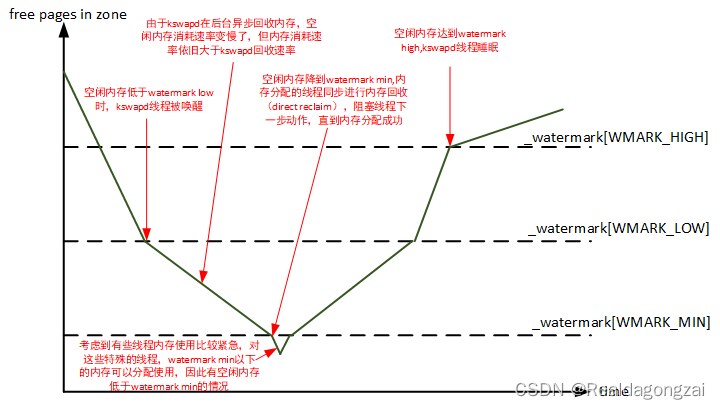
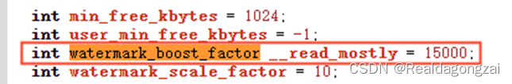
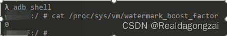
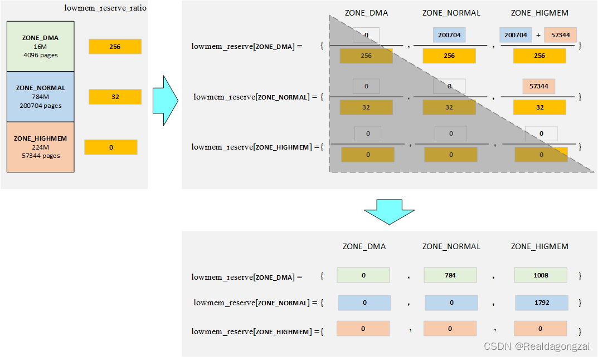
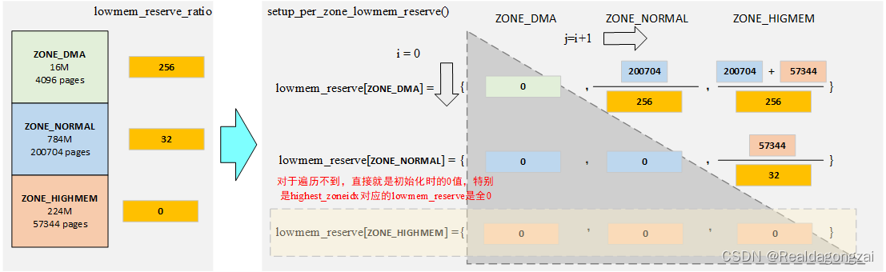
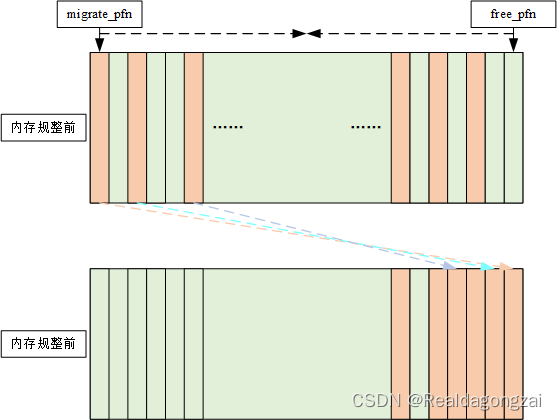
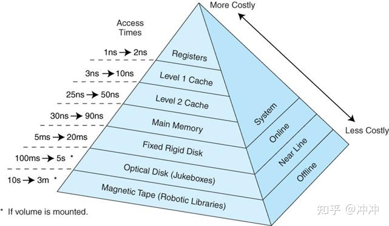
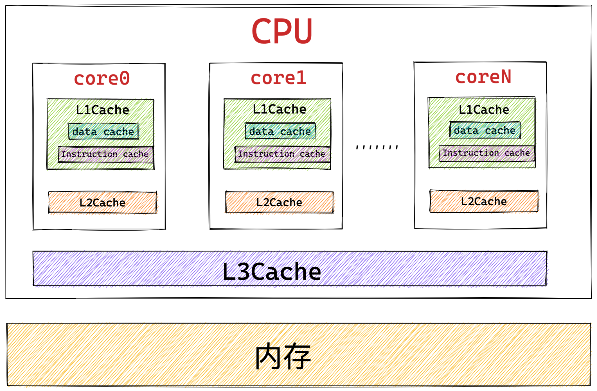

# Linux 物理内存管理涉及的三大结构体之struct zone

从[Linux 物理内存管理涉及的三大结构体之struct page](https://blog.csdn.net/weixin_45337360/article/details/126940438 "Linux 物理内存管理涉及的三大结构体之struct page ") 中，大概知道了UMA和NUMA概念，同时也知道在每个node对应的内存范围内，都会将其分成[不同的](https://so.csdn.net/so/search?q=%E4%B8%8D%E5%90%8C%E7%9A%84&spm=1001.2101.3001.7020)内存管理区域zone。之所以分成几类zone，下面在介绍enum zone\_type时将会讲述，然后开始struct zone结构体的拆解分析。

## 一、内存管理区域zone的类型

        内核针对不同需求，总共定义了6种zone，以此满足对应的内存使用要求。
    
    //include/linux/mmzone.henum zone_type {	/*	 * ZONE_DMA and ZONE_DMA32 are used when there are peripherals not able	 * to DMA to all of the addressable memory (ZONE_NORMAL).	 * On architectures where this area covers the whole 32 bit address	 * space ZONE_DMA32 is used. ZONE_DMA is left for the ones with smaller	 * DMA addressing constraints. This distinction is important as a 32bit	 * DMA mask is assumed when ZONE_DMA32 is defined. Some 64-bit	 * platforms may need both zones as they support peripherals with	 * different DMA addressing limitations.	 */#ifdef CONFIG_ZONE_DMA	ZONE_DMA,#endif#ifdef CONFIG_ZONE_DMA32	ZONE_DMA32,#endif	/*	 * Normal addressable memory is in ZONE_NORMAL. DMA operations can be	 * performed on pages in ZONE_NORMAL if the DMA devices support	 * transfers to all addressable memory.	 */	ZONE_NORMAL,#ifdef CONFIG_HIGHMEM	/*	 * A memory area that is only addressable by the kernel through	 * mapping portions into its own address space. This is for example	 * used by i386 to allow the kernel to address the memory beyond	 * 900MB. The kernel will set up special mappings (page	 * table entries on i386) for each page that the kernel needs to	 * access.	 */	ZONE_HIGHMEM,#endif	/*	 * ZONE_MOVABLE is similar to ZONE_NORMAL, except that it contains	 * movable pages with few exceptional cases described below. Main use	 * cases for ZONE_MOVABLE are to make memory offlining/unplug more	 * likely to succeed, and to locally limit unmovable allocations - e.g.,	 * to increase the number of THP/huge pages. Notable special cases are:	 *	 * 1. Pinned pages: (long-term) pinning of movable pages might	 *    essentially turn such pages unmovable. Memory offlining might	 *    retry a long time.	 * 2. memblock allocations: kernelcore/movablecore setups might create	 *    situations where ZONE_MOVABLE contains unmovable allocations	 *    after boot. Memory offlining and allocations fail early.	 * 3. Memory holes: kernelcore/movablecore setups might create very rare	 *    situations where ZONE_MOVABLE contains memory holes after boot,	 *    for example, if we have sections that are only partially	 *    populated. Memory offlining and allocations fail early.	 * 4. PG_hwpoison pages: while poisoned pages can be skipped during	 *    memory offlining, such pages cannot be allocated.	 * 5. Unmovable PG_offline pages: in paravirtualized environments,	 *    hotplugged memory blocks might only partially be managed by the	 *    buddy (e.g., via XEN-balloon, Hyper-V balloon, virtio-mem). The	 *    parts not manged by the buddy are unmovable PG_offline pages. In	 *    some cases (virtio-mem), such pages can be skipped during	 *    memory offlining, however, cannot be moved/allocated. These	 *    techniques might use alloc_contig_range() to hide previously	 *    exposed pages from the buddy again (e.g., to implement some sort	 *    of memory unplug in virtio-mem).	 *	 * In general, no unmovable allocations that degrade memory offlining	 * should end up in ZONE_MOVABLE. Allocators (like alloc_contig_range())	 * have to expect that migrating pages in ZONE_MOVABLE can fail (even	 * if has_unmovable_pages() states that there are no unmovable pages,	 * there can be false negatives).	 */	ZONE_MOVABLE,#ifdef CONFIG_ZONE_DEVICE	ZONE_DEVICE,#endif	__MAX_NR_ZONES //__MAX_NR_ZONES是充当结束标记, 在内核中想要迭代系统中所有内存域, 会用到该常量 };

### 1.1 ZONE\_DMA

        DMA(Direct Memory Access,直接内存访问)，其允许某些电脑内部的硬件子系统（电脑外设），可以独立地直接读写系统内存，而不需CPU介入处理 。在同等程度的处理器负担下，DMA是一种高速的数据传送方式，我们比较常见的如：外设与存储区之间或者存储区与存储区之间的高速数据传输。很多硬件系统会使用DMA，比如：硬盘控制器、显卡、网卡和声卡等。当CPU初始化这个传输动作后，传输动作本身是由DMA控制器来实现和完成的。DMA传输方式无需CPU直接控制传输，也没有中断处理方式那样保留现场和恢复现场过程，通过硬件为RAM和IO设备开辟一条直接传输数据的通道，使得CPU的效率大大提高。
    
        ZONE\_DMA只在使能了CONFIG\_ZONE\_DMA情况下才有，不过在arch/arm64/Kconfig中，发现这个**默认是使能的**。如果外设无法通过DMA访问到ZONE\_NORMAL的内存时，此时就需要专门划分出ZONE\_DMA 和 ZONE\_DMA32内存管理区域，供外设通过DMA访问，**现在保留这个更多是出于兼容性的考虑。比如：某些工业标准体系结构(ISA)中的设备需要用到它，这类设备比较古老，无法直接访问整个内存 , 需要使用 DMA 直接内存访问区域，这类设备只能访问内存的低16M。**

### 1.2 ZONE\_DMA32

        ZONE\_DMA32只在使能了CONFIG\_ZONE\_DMA32情况下才有，不过在arch/arm64/Kconfig中，发现这个**默认也是使能的**。ZONE\_DMA32跟ZONE\_DMA，在32位系统上是没有区别的，因为在32位系统上，ZONE\_DMA32的内存管理区域大小为0。在64位系统上，才同时有ZONE\_DMA 和 ZONE\_DMA32。在64位系统中，**ZONE\_DMA32区域可以支持直接访问 16 MB 以下的内存设备和直接访问 4 GB 以下的内存设备。对于第一点，ZONE\_DMA32和ZONE\_DMA是都支持，但是对于第二点，只能使用ZONE\_DMA32。**

### 1.3 ZONE\_NORMAL

        对于这部分内存管理区域，**是直接就有的**，无法通过配置config让其有无。如前面所说，若外设支持访问和传输 all addressable memory，那么其就可以使用ZONE\_NORMAL内存管理区域的page。不支持，就是使用ZONE\_DMA和ZONE\_DMA32。
    
        ZONE\_NORMAL的内存区域这是在所有体系结构上保证都会存在的唯一内存域。其可以**直接映射到内核虚拟地址空间**，但是无法保证该地址范围有对应的实际物理地址。例如, 如果AMD64系统只有2G内存, 那么所有的内存都属于ZONE\_DMA32范围（AMD64系统上, ZONE\_DMA32的长度可能是从0到4GB），而ZONE\_NORMAL则为空。

### 1.4 ZONE\_HIGHMEM

        HIGHMEM是高端内存, 这是32位系统中的概念，此时内核空间与用户空间比例为1:3 , 内核空间只有1GB。此时内存管理区域分为三类，ZONE\_DMA的范围是0~16M，ZONE\_NORMAL的范围是16M~896M，ZONE\_HIGHMEM的范围是896M~结束，属于高端内存，这部分**不能被内核直接映射，**使用的是动态映射，按需使用，**注意：内存管理区域对应的都是物理内存，不是虚拟内存。**
    
        32位linux系统将4G的线性地址空间分为2部分，0~3G为用户空间，3G~4G为内核空间。由于开启了分页机制，内核想要访问物理地址空间的话，必须先建立映射关系，然后通过线性（虚拟）地址来访问。为了能够访问所有的物理地址空间，就要将全部物理地址空间（假设也是4G，实际情况物理内存可能不止4G）映射到1G的内核线性空间中，这显然不可能。于是，内核将0~896M的物理地址空间一对一映射到自己的线性地址空间中，这样它便可以随时访问ZONE\_DMA和ZONE\_NORMAL里的物理页面；此时内核剩下的128M线性地址空间不足以完全映射所有的ZONE\_HIGHMEM内存管理区域的物理内存，Linux就采取了动态映射的方法，即按需的将ZONE\_HIGHMEM里的物理页面映射到内核空间的最后128M线性地址空间里，使用完之后释放映射关系，以供其它物理页面映射。虽然这样存在效率的问题，但是内核毕竟可以正常的访问所有的物理地址空间了。当然在64位系统中没有这个高端内存概念，也就没有ZONE\_HIGHMEM区域的必要了。

附加知识点：

1、32位系统用户进程最大可以访问3GB物理内存，内核进程可以访问所有物理内存。

2、64位系统用户进程最大可以访问超过512GB物理内存，内核进程可以访问所有物理内存。

3、在64位系统中，并不需要高端内存。因为ARM64的linux采用4级页表，支持的最大物理内存为64TB，对于虚拟地址空间的划分，ARM64地址总线位宽最多支持48位（4级页表下，3级页表是39位），系统一般将0x0000,0000,0000,0000 – 0x0000,ffff,ffff,ffff 这256T地址用于用户空间；而0xffff,000,0000,0000以上的256T为内核空间地址。256TB显然远大于当前我们系统中的物理内存空间64TB，因此所有的物理地址都可以直接映射到内核中，不需要高端内存的特殊映射。

### 1.5 ZONE\_MOVABLE

        ZONE\_MOVABLE（可移动内存管理区域），如字面意思，这个内存管理区域的内存是可以移动。**这个区域实际上也可称为伪/虚拟内存区域（pseudo zone），因为在64位系统中该内存区域取自ZONE\_NORMAL，32位系统中来自ZONE\_HIGHMEM**，包含在它们两个里面，不关联任何物理内存范围。**而引入该内存区域，目的是为了减少内存碎片，在防止物理内存碎片的memory migration机制中需要使用该内存区域。**
    
        可以联想这样一个场景，当系统向buddy system申请分配一块大且连续内存时，虽然对应的内存区剩余内存还很多，但是却发现对应的内存域无法满足连续的内存申请需求，这正是由内存碎片化导致的。那么此时可以通过内存迁移来完成连续内存的申请，但是这个机制并不一定能够成功，因为中间有一些页面可能是不可迁移/移动的。
    
        那么，引入ZONE\_MOVABLE就是为了优化内存迁移机制的，主要目的是想要把Non-Movable和Movable的内存区分管理，当划分出该区域后，那么当需要可迁移的页时，可以从该ZONE\_MOVABLE区域申请，这样当后面回收内存时，针对该区域就都可以执行迁移，从而保证能够获取到足够大的连续内存。
    
        除了这个用途之外，该区域**还有一种使用场景/目的，那就是memory hotplug场景（内存热插拔场景）**，当对内存区执行remove/remount时，必须保证其中的内容都是可以被迁移走的，因此热插拔的内存区必须位于ZONE\_MOVABLE区域。
    
        不过需要注意的是：**可迁移的page不一定全部在ZONE\_MOVABLE中，但是ZONE\_MOVABLE中的page一定是可迁移的。**通过cat /proc/pagetypeinfo的查看到在Movable Zone中只有可迁移的page。
    
        ZONE\_MOVABLE区域内的page**只能被带有\_\_GFP\_HIGHMEM和\_\_GFP\_MOVABLE标志的内存申请所使用。**在内核alloc page时，如果gfp\_flag同时指定了\_\_GFP\_HIGHMEM和\_\_GFP\_MOVABLE，则会从ZONE\_MOVABLE内存域申请内存。比如：
    
    //include/linux/gfp.h#define GFP_USER	(__GFP_RECLAIM | __GFP_IO | __GFP_FS | __GFP_HARDWALL)#define GFP_HIGHUSER	(GFP_USER | __GFP_HIGHMEM)#define GFP_HIGHUSER_MOVABLE	(GFP_HIGHUSER | __GFP_MOVABLE | \			 __GFP_SKIP_KASAN_POISON)
    
        同时也要注意的是**不要把内存申请GFP标志\_\_GFP\_MOVABLE和管理区ZONE\_MOVABLE混淆，两者并不是对应的关系。**\_\_GFP\_MOVABLE表示的是一种分配页面属性，表示页面可迁移，即使不在ZONE\_MOVABLE管理区，有些页面也是可以迁移的，比如cache；ZONE\_MOVABLE表示的是内存管理区域，其中的页面必须要可迁移。
    
        ZONE\_MOVABLE的启用和大小是根据内核中的参数kernelcore或者movablecore来决定的，kernelcore表示不可移动的内存大小，movablecore表示可移动的内存大小，如果两个都指定，取不可移动内存大小较大的一个为准，来确定可移动内存大小。如果两者都不指定，则不使能ZONE\_MOVABLE。
    
        然后find\_zone\_movable\_pfns\_for\_nodes用来计算每个node中ZONE\_MOVABLE的内存大小，同时给出ZONE\_MOVABLE在里面的起始PFN(Page Frame Number)，函数很长这里就不贴了。这个PFN实际上就是对于物理内存按照page划分后，page的编号。ZONE\_MOVABLE对应的内存区域通常是每个node的最高内存域，在函数find\_usable\_zone\_for\_movable中体现，如下所示。在对每个node分配ZONE\_MOVABLE内存时，kernelcore会被平均分配到各个Node：kernelcore\_node = required\_kernelcore / usable\_nodes。
    
    /* * This finds a zone that can be used for ZONE_MOVABLE pages. The * assumption is made that zones within a node are ordered in monotonic * increasing memory addresses so that the "highest" populated zone is used  *注释这里也写了：期望node里面的zone按照单调递增的内存地址排序，以便选用“highest”zone被选来当ZONE_MOVABLE */static void __init find_usable_zone_for_movable(void){	int zone_index;	for (zone_index = MAX_NR_ZONES - 1; zone_index >= 0; zone_index--) {		if (zone_index == ZONE_MOVABLE)			continue; 		if (arch_zone_highest_possible_pfn[zone_index] >				arch_zone_lowest_possible_pfn[zone_index]) //这里体现			break;	} 	VM_BUG_ON(zone_index == -1);	movable_zone = zone_index;}

### 1.6 ZONE\_DEVICE

        ZONE\_DEVICE是一种专门管理设备内存的内核区域。设备内存通常指的是显卡、网络卡、存储控制器等设备的内存，这些内存通常不能直接被进程使用。使能了CONFIG\_ZONE\_DEVICE，就会有这个内存管理区域。
    
        ZONE\_DEVICE 的作用是提供一种专门的内存区域，用于管理设备内存的分配和释放。它允许设备驱动程序直接访问这些设备内存，而无需通过先将数据复制到内核缓冲区再传输给设备。这种直接访问设备内存的方式可以提高设备的性能，并减少设备上下文切换的开销。
    
        在 ZONE\_DEVICE 中，设备内存可以通过函数 dma\_alloc\_coherent() 来分配。该函数会分配与设备对齐的内存，并返回该内存的虚拟地址。设备驱动程序可以通过这个虚拟地址直接读写设备内存，而无需进行额外的内存复制操作。
    
        此外，ZONE\_DEVICE 还可以管理设备内存的 DMA 映射。DMA 映射是将设备内存映射到 CPU 可访问的虚拟地址空间的过程。内核提供了一系列函数来帮助设备驱动程序进行 DMA 映射和解除映射的操作，以确保设备内存能够正确地被 CPU 访问。
    
        相比ZONE\_DMA，ZONE\_DEVICE在功能、适用范围、内存访问方式和内存大小限制等方面存在一些区别，主要取决于设备的类型和硬件平台的要求。如支持非DMA方式的访问，物理内存空间更大，支持的设备类型不同等。
    
    //msm-kernel/mm/Kconfigconfig ZONE_DEVICE	bool "Device memory (pmem, HMM, etc...) hotplug support"	depends on MEMORY_HOTPLUG	depends on MEMORY_HOTREMOVE	depends on SPARSEMEM_VMEMMAP	depends on ARCH_HAS_PTE_DEVMAP	select XARRAY_MULTI 	help	  Device memory hotplug support allows for establishing pmem,	  or other device driver discovered memory regions, in the	  memmap. This allows pfn_to_page() lookups of otherwise	  "device-physical" addresses which is needed for using a DAX	  mapping in an O_DIRECT operation, among other things.	  If FS_DAX is enabled, then say Y.

## 二、struct zone

        下面开始拆解struct zone，细讲里面的成员变量。如下是kernel 5.4的struct zone结构体结构。
    
    //include/linux/mmzone.hstruct zone {	/* Read-mostly fields */ 	/* zone watermarks, access with *_wmark_pages(zone) macros */	unsigned long _watermark[NR_WMARK];	unsigned long watermark_boost; 	unsigned long nr_reserved_highatomic; 	/*	 * We don't know if the memory that we're going to allocate will be	 * freeable or/and it will be released eventually, so to avoid totally	 * wasting several GB of ram we must reserve some of the lower zone	 * memory (otherwise we risk to run OOM on the lower zones despite	 * there being tons of freeable ram on the higher zones).  This array is	 * recalculated at runtime if the sysctl_lowmem_reserve_ratio sysctl	 * changes.	 */	long lowmem_reserve[MAX_NR_ZONES]; #ifdef CONFIG_NEED_MULTIPLE_NODES	int node;#endif	struct pglist_data	*zone_pgdat;	struct per_cpu_pageset __percpu *pageset; #ifndef CONFIG_SPARSEMEM	/*	 * Flags for a pageblock_nr_pages block. See pageblock-flags.h.	 * In SPARSEMEM, this map is stored in struct mem_section	 */	unsigned long		*pageblock_flags;#endif /* CONFIG_SPARSEMEM */ 	/* zone_start_pfn == zone_start_paddr >> PAGE_SHIFT */	unsigned long		zone_start_pfn; 	/*	 * spanned_pages is the total pages spanned by the zone, including	 * holes, which is calculated as:	 * 	spanned_pages = zone_end_pfn - zone_start_pfn;	 *	 * present_pages is physical pages existing within the zone, which	 * is calculated as:	 *	present_pages = spanned_pages - absent_pages(pages in holes);	 *	 * managed_pages is present pages managed by the buddy system, which	 * is calculated as (reserved_pages includes pages allocated by the	 * bootmem allocator):	 *	managed_pages = present_pages - reserved_pages;	 *	 * cma pages is present pages that are assigned for CMA use	 * (MIGRATE_CMA).	 *	 * So present_pages may be used by memory hotplug or memory power	 * management logic to figure out unmanaged pages by checking	 * (present_pages - managed_pages). And managed_pages should be used	 * by page allocator and vm scanner to calculate all kinds of watermarks	 * and thresholds.	 *	 * Locking rules:	 *	 * zone_start_pfn and spanned_pages are protected by span_seqlock.	 * It is a seqlock because it has to be read outside of zone->lock,	 * and it is done in the main allocator path.  But, it is written	 * quite infrequently.	 *	 * The span_seq lock is declared along with zone->lock because it is	 * frequently read in proximity to zone->lock.  It's good to	 * give them a chance of being in the same cacheline.	 *	 * Write access to present_pages at runtime should be protected by	 * mem_hotplug_begin/end(). Any reader who can't tolerant drift of	 * present_pages should get_online_mems() to get a stable value.	 */	atomic_long_t		managed_pages;	unsigned long		spanned_pages;	unsigned long		present_pages;#ifdef CONFIG_CMA	unsigned long		cma_pages;#endif 	const char		*name; #ifdef CONFIG_MEMORY_ISOLATION	/*	 * Number of isolated pageblock. It is used to solve incorrect	 * freepage counting problem due to racy retrieving migratetype	 * of pageblock. Protected by zone->lock.	 */	unsigned long		nr_isolate_pageblock;#endif #ifdef CONFIG_MEMORY_HOTPLUG	/* see spanned/present_pages for more description */	seqlock_t		span_seqlock;#endif 	int initialized; 	/* Write-intensive fields used from the page allocator */	ZONE_PADDING(_pad1_) 	/* free areas of different sizes */	struct free_area	free_area[MAX_ORDER]; 	/* zone flags, see below */	unsigned long		flags; 	/* Primarily protects free_area */	spinlock_t		lock; 	/* Write-intensive fields used by compaction and vmstats. */	ZONE_PADDING(_pad2_) 	/*	 * When free pages are below this point, additional steps are taken	 * when reading the number of free pages to avoid per-cpu counter	 * drift allowing watermarks to be breached	 */	unsigned long percpu_drift_mark; #if defined CONFIG_COMPACTION || defined CONFIG_CMA	/* pfn where compaction free scanner should start */	unsigned long		compact_cached_free_pfn;	/* pfn where compaction migration scanner should start */	unsigned long		compact_cached_migrate_pfn[ASYNC_AND_SYNC];	unsigned long		compact_init_migrate_pfn;	unsigned long		compact_init_free_pfn;#endif #ifdef CONFIG_COMPACTION	/*	 * On compaction failure, 1<<compact_defer_shift compactions	 * are skipped before trying again. The number attempted since	 * last failure is tracked with compact_considered.	 * compact_order_failed is the minimum compaction failed order.	 */	unsigned int		compact_considered;	unsigned int		compact_defer_shift;	int			compact_order_failed;#endif #if defined CONFIG_COMPACTION || defined CONFIG_CMA	/* Set to true when the PG_migrate_skip bits should be cleared */	bool			compact_blockskip_flush;#endif 	bool			contiguous; 	ZONE_PADDING(_pad3_)	/* Zone statistics */	atomic_long_t		vm_stat[NR_VM_ZONE_STAT_ITEMS];	atomic_long_t		vm_numa_stat[NR_VM_NUMA_STAT_ITEMS]; 	ANDROID_KABI_RESERVE(1);	ANDROID_KABI_RESERVE(2);	ANDROID_KABI_RESERVE(3);	ANDROID_KABI_RESERVE(4);} ____cacheline_internodealigned_in_smp;

### 2.1 unsigned long \_watermark\[NR\_WMARK\]

        每个zone都有三个水线标准，如下enum定义，分别叫做WMARK\_MIN，WMARK\_LOW，WMARK\_HIGH，借助水线值与zone的free pages对比，可以知道当前zone的内存压力有多大。这三个值在系统启动阶段memory init时会计算得出，首先是通过init\_per\_zone\_wmark\_min函数计算出min\_free\_kbytes，后面根据这个值，计算出这三个水线标准值，**这块后面会细讲。**这三个水线标准在内存分配和kswapd线程进行内存回收时会用到。 **注意点：一般跟三个水位线标准比较的zone实际可用物理空闲内存，是在已经剔除掉后面2.4 小节介绍的 lowmem\_reserve 预留内存大小后进行比较的，正常是按照lowmem\_reserve数组里面的最大值进行剔除。从zone\_watermark\_fast函数里面的if (usable\_free > mark + z->lowmem\_reserve\[highest\_zoneidx\])可知。**
    
    //include/linux/mmzone.henum zone_watermarks {	WMARK_MIN,	WMARK_LOW,	WMARK_HIGH,	NR_WMARK};
    
        **\_watermark\[WMARK\_HIGH\]表示高水位，代表内存还是足够的。**当内存回收后，free pages到达这个水线，kswapd线程将进入睡眠状态，不再通过kswapd进行内存回收。
    
        **\_watermark\[WMARK\_LOW\]表示低水位，代表内存已经开始吃紧。**低于\_watermark\[WMARK\_LOW\]水线，buddy system在进行内存分配的同时，后台同步启动内存异步回收的内核线程kswapd去回收内存。
    
        **\_watermark\[WMARK\_MIN\]表示最低水位，代表内存显然已经不够用了。**低于\_watermark\[WMARK\_MIN\]水线，kswapd线程继续工作，同时buddy system中内存分配的进程同步进行direct reclaim（直接内存回收）来回收内存。\_watermark\[WMARK\_MIN\]一般是zone的reserve page，只在特殊情况下才能分配使用。在过去的kernel-2.4中，除非内存分配带有GFP\_ATOMIC标志，则允许从\_watermark\[WMARK\_MIN\]区域中申请使用一小部分内存，否则只能从回收机制中回收而来的内存中分配，如果回收机制中回收的内存也不满足要求就分配内存失败。在现在kernel-5.4中，内存申请如果是ALLOC\_HIGH、ALLOC\_HARDER、ALLOC\_OOM，也可以从低于\_watermark\[WMARK\_MIN\]区域中申请部分内存，**下面的2.4.1 \_\_zone\_watermark\_ok函数里面就有介绍。**
    
        在free page低于\_watermark\[WMARK\_LOW\]阶段，buddy system内存分配由于需要内存回收才能满足，这个阶段也被称为slowpath（慢速路径）。如下是对应的zone 水线的变化图。从图中我们可以看到，当free pages低于\_watermark\[WMARK\_LOW\]时，kswapd线程被唤醒。随后，内存的消耗速率由于kswapd线程在后面异步回收变慢了。但消耗速率大于kswapd线程内存回收的速率，free pages一直在减少，导致到达\_watermark\[WMARK\_MIN\]，此时内存分配的进程开始同步进行direct reclaim来回收内存。考虑到有些线程内存使用比较紧急，会放宽标准，所以会看到free pages有低于\_watermark\[WMARK\_MIN\]的情况。由于内存分配的进程和kswapd线程都在进行内存回收，而且除了特殊请况，内存分配进程必须等内存回收到满足它需求了才能分配，所以可以看到free pages开始不断上升。当free pages达到\_watermark\[WMARK\_HIGH\]时，kswapd线程进入睡眠状态，等待下次唤醒。

        我们可以通过 cat /proc/vmstat,其中的"pageoutrun"和"allocstall\_(dma/dma32/normal/movable)"，分别查看kswapd和各个zone的direct reclaim启动的次数。
    
    User@Ubuntu-149-19:/proc$ cat vmstat | grep "pageout*"pageoutrun 370693 User@Ubuntu-149-19:/proc$ cat vmstat | grep "alloc*"allocstall_dma 0allocstall_dma32 0allocstall_normal 2721allocstall_movable 1534443

#### 2.1.1\_\_setup\_per\_zone\_wmarks函数

        现在开始讲是如何设置这三个水线值的。函数的调用关系是：init\_per\_zone\_wmark\_min->setup\_per\_zone\_wmarks->\_\_setup\_per\_zone\_wmarks。在\_\_setup\_per\_zone\_wmarks函数里面定义了三个水线标准，**在计算水线值时，会将watermark\_boost为0，避免干扰到计算，同时本身就在计算watermark，因而\_watermark\[WMARK\_HIGH\]也是0，相当于在计算min\_free\_kbytes时，看的是各个zone的managed\_pages之和。**理想化情况下，三个水线标准比例关系大概是：\_watermark\[WMARK\_MIN\]：\_watermark\[WMARK\_LOW\]：\_watermark\[WMARK\_HIGH\] = 4:5:6。
    
    /* * Try to keep at least this much lowmem free.  Do not allow normal * allocations below this point, only high priority ones. Automatically * tuned according to the amount of memory in the system. *///这是默认初始化的值，下面在init_per_zone_wmark_min函数里面会对其根据实际情况更新值int min_free_kbytes = 1024; //系统的int user_min_free_kbytes = -1; //用户设置的/* * Extra memory for the system to try freeing. Used to temporarily * free memory, to make space for new workloads. Anyone can allocate * down to the min watermarks controlled by min_free_kbytes above. */int extra_free_kbytes = 0;//默认值为0，用户通过系统调用进行配置，如果kernel版本有这个，可在/proc/sys/vm下面看到这个参数  /** * nr_free_zone_pages - count number of pages beyond high watermark * @offset: The zone index of the highest zone * * nr_free_zone_pages() counts the number of pages which are beyond the * high watermark within all zones at or below a given zone index.  For each * zone, the number of pages is calculated as: * 计算方式给定了,得到zone通过buddy管理的所有可用的页减去high watermark值后，剩余的可用pages *     nr_free_zone_pages = managed_pages - high_pages * 不过由于此时就在watermark，因而此时high watermark的值就为0，那么high_pages就为0，实际上就是managed_pages  * Return: number of pages beyond high watermark. */static unsigned long nr_free_zone_pages(int offset){	struct zoneref *z;	struct zone *zone; 	/* Just pick one node, since fallback list is circular */	unsigned long sum = 0;//得到当前node的zonelist	struct zonelist *zonelist = node_zonelist(numa_node_id(), GFP_KERNEL);//通过zonelist，遍历整个系统所有node的所有zone,根据最高的zone的索引offset（The zone index of the highest zone），得到所有符合要求的zone的nr_free_zone_pages值	for_each_zone_zonelist(zone, z, zonelist, offset) {//nr_free_zone_pages = managed_pages - high_pages		unsigned long size = zone_managed_pages(zone);//得到当前zone的托管的page数目managed_pages		unsigned long high = high_wmark_pages(zone);//得到当前zone的_watermark[WMARK_HIGH]+watermark_boost值//如果size大于high，说明还有可分配的，所以累计进sum，当遍历完所有zone，得到所有zone的nr_free_zone_pages值		if (size > high)			sum += size - high;	} 	return sum;} /** * nr_free_buffer_pages - count number of pages beyond high watermark * * nr_free_buffer_pages() counts the number of pages which are beyond the high * watermark within ZONE_DMA and ZONE_NORMAL. * * Return: number of pages beyond high watermark within ZONE_DMA and * ZONE_NORMAL. *///函数返回累计内存域ZONE_DMA至ZONE_NORMAL之间所有zone，减去对应的_watermark[WMARK_HIGH]+watermark_boost后，可分配的free pgaes之和。//如前面所说的，_watermark[WMARK_HIGH]和watermark_boost均为0，因而实际上就是managed_pages之和//函数comment之所以描述是ZONE_DMA和ZONE_NORMAL是默认只有这两个zone的情况//nr_free_zone_pages上面有讲，gfp_zone(GFP_USER)得到的是一个enum zone_type的offest偏移量,从而知道我们要遍历哪些zone，得到实际的可分配的free pagesunsigned long nr_free_buffer_pages(void){	return nr_free_zone_pages(gfp_zone(GFP_USER));}EXPORT_SYMBOL_GPL(nr_free_buffer_pages); /* * Initialise min_free_kbytes. * * For small machines we want it small (128k min).  For large machines * we want it large (256MB max).  But it is not linear, because network * bandwidth does not increase linearly with machine size.  We use * *	min_free_kbytes = 4 * sqrt(lowmem_kbytes), for better accuracy: *	min_free_kbytes = sqrt(lowmem_kbytes * 16) * * which yields * 实际物理内存对应min_free_kbytes的推荐值，最小128KB,最大256MB * 对于这个函数一般是min_free_kbytes发生变化，然后才会调用来更新watermark和watermark_boost等值 * 16MB:	512k * 32MB:	724k * 64MB:	1024k * 128MB:	1448k * 256MB:	2048k * 512MB:	2896k * 1024MB:	4096k * 2048MB:	5792k * 4096MB:	8192k * 8192MB:	11584k * 16384MB:	16384k */int __meminit init_per_zone_wmark_min(void){	unsigned long lowmem_kbytes;	int new_min_free_kbytes;//PAGE_SIZE为4096B,(PAGE_SIZE >> 10)得4KB，nr_free_buffer_pages函数获得当前系统符合要求的所有zone的free pages，最后得到lowmem_kbytes	lowmem_kbytes = nr_free_buffer_pages() * (PAGE_SIZE >> 10);//计算min_free_kbytes = 4 * int_sqrt(lowmem_kbytes)	new_min_free_kbytes = int_sqrt(lowmem_kbytes * 16); //如果大于user_min_free_kbytes的，会更新min_free_kbytes，同步进行最大最小值的限定，否则，不更新，以用户的user_min_free_kbytes为准	if (new_min_free_kbytes > user_min_free_kbytes) {		min_free_kbytes = new_min_free_kbytes;		if (min_free_kbytes < 128)			min_free_kbytes = 128;		if (min_free_kbytes > 262144)			min_free_kbytes = 262144;//256MB	} else {		pr_warn("min_free_kbytes is not updated to %d because user defined value %d is preferred\n",				new_min_free_kbytes, user_min_free_kbytes);	}	setup_per_zone_wmarks();//开始在这里设置zone的三个watermark值，本节重点讲这个函数	refresh_zone_stat_thresholds();	setup_per_zone_lowmem_reserve();//这个函数后面章节会讲 #ifdef CONFIG_NUMA	setup_min_unmapped_ratio();	setup_min_slab_ratio();#endif 	khugepaged_min_free_kbytes_update(); 	return 0;} /**正主在这里呀...... * setup_per_zone_wmarks - called when min_free_kbytes changes * or when memory is hot-{added|removed} * * Ensures that the watermark[min,low,high] values for each zone are set * correctly with respect to min_free_kbytes. */void setup_per_zone_wmarks(void){	static DEFINE_SPINLOCK(lock); 	spin_lock(&lock);	__setup_per_zone_wmarks();//直接调用这个，当min_free_kbytes发生改变或者当内存是可插拔内存，发生插拔时，需要更新	spin_unlock(&lock);}  static void __setup_per_zone_wmarks(void){/* *min_free_kbytes和extra_free_kbytes的官方介绍在内核代码的Documentation/admin-guide/sysctl/vm.rst下面有 *min_free_kbytes不做多的介绍，大家比较熟悉 *extra_free_kbytes是来自Red Hat的Rik van Riel于2011年提出的，这个值是添加在watermark min和watermark low之间，用户可修改 *相当于在watermark min不变的基础上，增大了watermark low。通过增加这个，针对burst allocation *（如：在网络收发的时候，数据量可能突然增大，需要临时申请大量的内存）类型，可以避免快速达到watermark min，而导致触发direct reclaim， *影响系统性能，特别是对于低时延的内存分配请求。 *不过这个功能在5.4上还有，但在5.15上已经没有了，这是因为这个功能跟下面讲的watermark_scale_factor参数功能重复，社区后面合并了，统一用watermark_scale_factor了 */	unsigned long pages_min = min_free_kbytes >> (PAGE_SHIFT - 10);//PAGE_SHIFT=12，计算得到对应的pages_min值	unsigned long pages_low = extra_free_kbytes >> (PAGE_SHIFT - 10);//计算得到对应的pages_low值	unsigned long lowmem_pages = 0;	struct zone *zone;	unsigned long flags; 	/* Calculate total number of !ZONE_HIGHMEM pages *///遍历系统所有online node的所有除ZONE_HIGHMEM外的zone，得到对应的zone的托管的页面（managed_pages），累计进lowmem_pages	for_each_zone(zone) {		if (!is_highmem(zone))			lowmem_pages += zone_managed_pages(zone);	}//遍历系统所有online node的所有的zone，开始设置它们的watermark	for_each_zone(zone) {		u64 tmp, low; 		spin_lock_irqsave(&zone->lock, flags);		tmp = (u64)pages_min * zone_managed_pages(zone);/*do_div除法操作，tmp/lowmem_pages=(u64)pages_min * zone_managed_pages(zone)/lowmem_pages *从上面可知，lowmem_pages是很多zone的累计值，zone_managed_pages(zone)/lowmem_page，实际上从含义上就是得到一个比例值， *然后从总的min_free_kbytes分出对应比值的pages,作为这个zone的watermark min,最后将计算结果重新赋值给tmp */		do_div(tmp, lowmem_pages);		low = (u64)pages_low * zone_managed_pages(zone);/*GFP_HIGHUSER_MOVABLE：分配的内存不限定要被内核直接访问，且是可迁移 *nr_free_zone_pages,前面有讲，根据offset，累加计算managed_pages - high_pages值 *同上面一样，也是得到一个比例值，然后从总extra_free_kbytes分出对应比值的pages,作为这个zone的extra_free_kbytes */		do_div(low, nr_free_zone_pages(gfp_zone(GFP_HIGHUSER_MOVABLE)));		if (is_highmem(zone)) {			/*对于ZONE_HIGHMEM的watermark min要特殊处理，对于64位系统不用考虑			 * __GFP_HIGH and PF_MEMALLOC allocations usually don't			 * need highmem pages, so cap pages_min to a small			 * value here.			 *			 * The WMARK_HIGH-WMARK_LOW and (WMARK_LOW-WMARK_MIN)			 * deltas control async page reclaim, and so should			 * not be capped for highmem.			 */			unsigned long min_pages; 			min_pages = zone_managed_pages(zone) / 1024;//SWAP_CLUSTER_MAX=32UL，clamp函数，给定最大/小值，在范围内就是min_pages，若大于最大值，取最大值，若小于最小值，取最小值			min_pages = clamp(min_pages, SWAP_CLUSTER_MAX, 128UL);//赋ZONE_HIGHMEM的watermark min是该zone的zone_managed_pages(zone) / 1024			zone->_watermark[WMARK_MIN] = min_pages;		} else {			/*			 * If it's a lowmem zone, reserve a number of pages			 * proportionate to the zone's size.			 *根据前面计算得到的该zone的watermark min值，赋值进_watermark[WMARK_MIN]里面			 */			zone->_watermark[WMARK_MIN] = tmp;		} 		/*		 * Set the kswapd watermarks distance according to the		 * scale factor in proportion to available memory, but		 * ensure a minimum size on small systems.		 *//* *max_t(type,x,y)取x和y两者之间的最大值 *mult_frac(x,numer,denom)=x*(numer/denom) *watermark_scale_factor，根据内核文档/Documentation/admin-guide/sysctl/vm.rst可知， *该值控制着kswapd的唤醒和睡眠时机，因为该值会影响zone的watermark low和watermark high，而这两个值分别影响kswapd唤醒和睡眠 *watermark_scale_factor默认值是10，最大值1000（5.4还是当前值，在kernel 5.15中是3000），可在proc/sys/vm下面看到，表示low与min之间差值和high与low之间差值是总内存的[0.1%，10%]之间 */		tmp = max_t(u64, tmp >> 2,			    mult_frac(zone_managed_pages(zone),				      watermark_scale_factor, 10000)); 		zone->watermark_boost = 0;//这里把watermark_boost赋值为0，避免对下面的_watermark计算产生干扰/* *下面就是根据 该zone的watermark min，extra_free_kbytes（上面的low变量）和上面tmp值设置_watermark[WMARK_LOW]和_watermark[WMARK_HIGH] *这里理想化下，前面开始计算tmp的值是_watermark[WMARK_MIN]，如果max_t返回值tmp/4，即_watermark[WMARK_MIN]/4,在不考虑low的情况下 *则_watermark[WMARK_LOW]=_watermark[WMARK_MIN]+_watermark[WMARK_MIN]/4=1.25*_watermark[WMARK_MIN] *_watermark[WMARK_HIGH]=_watermark[WMARK_MIN]+(_watermark[WMARK_MIN]/4)*2=1.5*_watermark[WMARK_MIN] *所以，三者的比例关系大致为：_watermark[WMARK_MIN]：_watermark[WMARK_LOW]：_watermark[WMARK_HIGH] = 4:5:6 */		zone->_watermark[WMARK_LOW]  = min_wmark_pages(zone) + low + tmp;		zone->_watermark[WMARK_HIGH] = min_wmark_pages(zone) + low + tmp * 2; 		spin_unlock_irqrestore(&zone->lock, flags);	} 	/* update totalreserve_pages *///对于这个函数后面会细讲，init_per_zone_wmark_min函数可能会修改min_free_kbytes，所以必须调用calculate_totalreserve_pages重新计算整个系统的totalreserve_pages	calculate_totalreserve_pages();}
    
        对于watermark\_scale\_factor，在kernel4.6中引入的，可以看[这个commit](https://git.kernel.org/pub/scm/linux/kernel/git/stable/linux.git/diff/?id=795ae7a0de6b834a0cc202aa55c190ef81496665 "这个commit")，里面详细记录了添加这个参数，在内核上做的修改（参数说明，syscall hander及功能实现），内核文档/Documentation/admin-guide/sysctl/vm.rst里也要介绍。同时在[这个commit](https://patchwork.kernel.org/project/linux-mm/patch/20220114220717.gRYVbnFKZ%25akpm@linux-foundation.org/ "这个commit")上，提升了watermark\_scale\_factor的最大值。在/proc/sys/vm有很多跟zone相关的参数以及内存调优参数，大家可以直接进去看下。watermark\_scale\_factor控制着kswapd的唤醒和睡眠时机，因为该值会影响zone的watermark low和watermark high，而这两个值分别影响kswapd唤醒和睡眠。watermark\_scale\_factor默认值是10，最大值1000（5.4还是当前值，在kernel 5.15中是3000），可在proc/sys/vm下面看到，根据代码计算可知，\[10,1000\]表示low与min之间差值和high与low之间差值是总内存的\[0.1%，10%\]之间。**引入这个参数原因：避免突然遇到网络流量增大，需要短时间内申请大量的内存来存放网络请求数据，导致 kswapd 回收内存的速度可能赶不上内存分配的速度，从而达到watermark min，造成直接内存回收 direct reclaim，影响系统性能，解决直接内存回收导致的性能抖动问题。**
    
        通过cat /proc/zoneinfo指令可以看系统中所有zone的这三个watermark，在2.4节记录了，可以将所有zone里面的min值加起来，和是1048574，看下跟cat /proc/sys/vm/min\_free\_kbytes的值是否相等。如下是min\_free\_kbytes值，除以4（默认1page = 4KB）得到page数目是1048576，跟上面值基本相等。
    
    User@Ubuntu-149-19:/proc/sys/vm$ cat min_free_kbytes 4194304

### **2.2  unsigned long watermark\_boost**

        该参数通过细粒度控制内存回收的尺度，使系统可动态提升三个watermark的值，使kswapd线程提前开始回收内存而且也可以回收更多内存。这样一方面可以减少内存规整（memory compact）的次数，另一方面发生内存规整，也可以更快的整合出大的连续物理内存，从而优化内存碎片对内存分配的影响，kernel 5.0引入的，关于内存规整的参数，后面小节会讲。从获取watermark的接口可以看出，其可以影响watermark的三个水线标准值，如下面代码的四个函数，根据watermark\_boost提高三个水线的标准值，其他函数可以直接调用这四个函数，得到watermark\_boost后的水线标准值。如min\_wmark\_pages，在\_\_setup\_per\_zone\_wmarks中计算zone->\_watermark\[WMARK\_LOW\]和zone->\_watermark\[WMARK\_HIGH\] 时会使用到。如low\_wmark\_pages，在si\_mem\_available中会使用到。si\_mem\_available是计算/proc/meminfo中的MemAvailable的函数。如high\_wmark\_pages，在计算totalreserve\_pages的函数calculate\_totalreserve\_pages中会使用到。
    
    //include/linux/mmzone.h#define min_wmark_pages(z) (z->_watermark[WMARK_MIN] + z->watermark_boost)#define low_wmark_pages(z) (z->_watermark[WMARK_LOW] + z->watermark_boost)#define high_wmark_pages(z) (z->_watermark[WMARK_HIGH] + z->watermark_boost)#define wmark_pages(z, i) (z->_watermark[i] + z->watermark_boost)  //mm/page_alloc.cstatic void __setup_per_zone_wmarks(void){...... zone->_watermark[WMARK_LOW]  = min_wmark_pages(zone) + low + tmp;zone->_watermark[WMARK_HIGH] = min_wmark_pages(zone) + low + tmp * 2; ......}
    
        对于watermark\_boost，在boost\_watermark()函数中，会对其设置，可以临时修改该值。跟其直接相关的参数是watermark\_boost\_factor，位于/proc/sys/vm下面。内核默认值是15000。不过手机默认将其关闭，为0。

        从前面知道在\_\_setup\_per\_zone\_wmarks 里面时会将watermark\_boost置为0，避免对三个watermark的计算产生干扰。而在boost\_watermark()中会根据需求设置watermark\_boost的值。重要的使用，就在steal\_suitable\_fallback函数里面会调用这个boost\_watermark函数。steal\_suitable\_fallback函数是fallback机制实现的一环。在内存分配时，如果对应order对应的迁移类型（[Linux 物理内存管理涉及的三大结构体之struct page](https://blog.csdn.net/weixin_45337360/article/details/126940438 "Linux 物理内存管理涉及的三大结构体之struct page")里面那张图）中的freelist中没有可用page，那么就会从备用的迁移类型中盗用（借用）page，如果find\_suitable\_fallback函数找到一个匹配的迁移类型，就会从此迁移类型中找到可用page，调用steal\_suitable\_fallback函数将这个page迁入它自己的迁移类型。

#### 2.2.1 boost\_watermark函数

    static inline bool boost_watermark(struct zone *zone){	unsigned long max_boost; //根据Documentation/admin-guide/sysctl/vm.rst描述，watermark_boost_factor为0表示关闭watermark_boost功能，所以这里直接返回false//watermark_boost_factor默认值是15000	if (!watermark_boost_factor)		return false;	/*	 * Don't bother in zones that are unlikely to produce results.	 * On small machines, including kdump capture kernels running	 * in a small area, boosting the watermark can cause an out of	 * memory situation immediately.	 *///如果一个pageblock里面的page数目(pageblock_nr_pages)乘以4,就已经大于当前zone所托管的page数目了，就没必要去做提升，返回false//主要针对小内存机器，现在大内存一般不会	if ((pageblock_nr_pages * 4) > zone_managed_pages(zone))		return false;//mult_frac(x,numer,denom)=x*(numer/denom)，根据默认值，max_boost是1.5*zone->_watermark[WMARK_HIGH]	max_boost = mult_frac(zone->_watermark[WMARK_HIGH],			watermark_boost_factor, 10000); 	/*	 * high watermark may be uninitialised if fragmentation occurs	 * very early in boot so do not boost. We do not fall	 * through and boost by pageblock_nr_pages as failing	 * allocations that early means that reclaim is not going	 * to help and it may even be impossible to reclaim the	 * boosted watermark resulting in a hang.	 *///在系统启动的早期，high watermark可能还没初始化，为0，这是时候没必要boost,直接返回false	if (!max_boost)		return false;//max_boost和pageblock_nr_pages取最大者	max_boost = max(pageblock_nr_pages, max_boost);//取min,赋值给zone->watermark_boost	zone->watermark_boost = min(zone->watermark_boost + pageblock_nr_pages,		max_boost);//设置watermark_boost完成，返回true	return true;}

### 2.3 unsigned long nr\_reserved\_highatomic

        在内存紧张时，为内存使用紧急的场景而预留，一般用于gfp是GFP\_ATOMIC类型的内存分配或者alloc\_flags是ALLOC\_HIGH、ALLOC\_HARDER和ALLOC\_OOM类型的内存分配。大小一般是32到16384之间，单位是page，即128 到 65536 KB 之间。可以避免直接启动OOM killer，来进行内存回收。**nr\_reserved\_highatomic这部分内存就是我们前面讲的\_watermark\[WMARK\_MIN\]以下的内存。**

### 2.4 long lowmem\_reserve\[MAX\_NR\_ZONES\]

        首先来讲一下MAX\_NR\_ZONES值，根据下面的分析MAX\_NR\_ZONES实际上就是\_\_MAX\_NR\_ZONES，而\_\_MAX\_NR\_ZONES在enum zone\_type中有说明，如果zone\_type里面的config全开，MAX\_NR\_ZONES就是6。
    
    //kernel/bounds.c	// SPDX-License-Identifier: GPL-2.0/* * Generate definitions needed by the preprocessor. * This code generates raw asm output which is post-processed * to extract and format the required data. */ #define __GENERATING_BOUNDS_H/* Include headers that define the enum constants of interest */ #include <linux/page-flags.h> #include <linux/mmzone.h> #include <linux/kbuild.h> #include <linux/log2.h> #include <linux/spinlock_types.h> int main(void){	/* The enum constants to put into include/generated/bounds.h */	DEFINE(NR_PAGEFLAGS, __NR_PAGEFLAGS);	DEFINE(MAX_NR_ZONES, __MAX_NR_ZONES);#ifdef CONFIG_SMP	DEFINE(NR_CPUS_BITS, ilog2(CONFIG_NR_CPUS));#endif	DEFINE(SPINLOCK_SIZE, sizeof(spinlock_t));	/* End of constants */ 	return 0;}     /*	 * We don't know if the memory that we're going to allocate will be	 * freeable or/and it will be released eventually, so to avoid totally	 * wasting several GB of ram we must reserve some of the lower zone	 * memory (otherwise we risk to run OOM on the lower zones despite	 * there being tons of freeable ram on the higher zones).  This array is	 * recalculated at runtime if the sysctl_lowmem_reserve_ratio sysctl	 * changes.	 *///从上面的定义中可以知道，MAX_NR_ZONES实际上就是__MAX_NR_ZONES，在enum zone_type中有说明，如果zone_type里面的config全开，MAX_NR_ZONES就是6	long lowmem_reserve[MAX_NR_ZONES];
    
        现在开始讲这个lowmem\_reserve\[MAX\_NR\_ZONES\]数组的含义。数组里面元素的单位是page，**这个数组的目的是：在页面分配器分配页面时，为了防止高位zone在fallback（fallback机制概述：在页面分配时，当选定了node和zone后，开始分配，如果分配失败，不会立马启动内存回收，而是尝试从低位zone中看能不能借用一些内存，这个就是fallback，这个借用只能是高位向低位借用，不能相反）时过度挤压自己的内存，低位zone会在zone watermark之外，再给自己加一层缓冲垫，这个缓冲垫就是这个数组。**因为低位zone的内存一般是有特殊用途的，如ZONE\_DMA用于ISA总线的设备。通常有些应用程序分配内存之后会使用 mlock()来锁住这部分内存，因此这些内存就不能被交换到交换分区，从而导致ZONE\_DMA变少了。另外，防止系统过早在低位zone中触发 OOM Killer机制，而系统的高位zone却有大量空闲内存(如：高位zone里面的虽然足够的空闲内存，但是这些page是其他迁移类型的，不属于迁移类型fallback数组对应的类型，无法满足当前内存分配需求，此时，就会从低位zone借用，这时就有存在这种情况)。因此，**kernel设置lowmem\_reserve数组为了防止进程过度使用低位zone的内存。当然如果我们在页面分配时，通过GFP标志位（****\_\_GFP\_THISNODE）做出限制一定限制，就只能在指定node里面的低位zone里面去找，避免遍历所有node找其他node低位zone要内存的情况。**
    
        系统启动时有个默认的lowmem\_reserve\_ratio数组，如下代码所示，会根据这个来初始化lowmem\_reserve\[MAX\_NR\_ZONES\]，如果运行过程中sysctl\_lowmem\_reserve\_ratio发生变化，最终是调用setup\_per\_zone\_lowmem\_reserver来修正lowmem\_reserve\[MAX\_NR\_ZONES\]，后面会讲这个函数。
    
        根据如下默认的ratio和给出的一个计算方式可知，假设有DMA，NORMAL和HIGH三个内存管理区域情况下，如果NORMAL内存域想要调用DMA内存域的内存，必须留784M/256=784pages内存给DMA内存域本身，不可全用；如果HIGH内存域想要调用NORMAL内存域的内存，必须留224M/32=1792pages内存给NORMAL内存域本身；如果HIGH内存域想调用DMA内存域的内存，必须留(224M+784M)/256=1008pages内存给DMA内存域本身，这些值就会保存在lowmem\_reserve\[MAX\_NR\_ZONES\]中。因此，**以DMA内存域来看，它的lowmem\_reserve\[MAX\_NR\_ZONES\]应当为{0,784,1008}。如果以NORMAL内存域来看，它的lowmem\_reserve\[MAX\_NR\_ZONES\]应当为{0,0,1792}。如果以HIGH内存域来看，它的lowmem\_reserve\[MAX\_NR\_ZONES\]应当为{0,0,0}。**
    
    //mm/page_alloc.c /* * results with 256, 32 in the lowmem_reserve sysctl: *	1G machine -> (16M dma, 800M-16M normal, 1G-800M high) *	1G machine -> (16M dma, 784M normal, 224M high) *	NORMAL allocation will leave 784M/256 of ram reserved in the ZONE_DMA *	HIGHMEM allocation will leave 224M/32 of ram reserved in ZONE_NORMAL *	HIGHMEM allocation will leave (224M+784M)/256 of ram reserved in ZONE_DMA * * TBD: should special case ZONE_DMA32 machines here - in those we normally * don't need any ZONE_NORMAL reservation */int sysctl_lowmem_reserve_ratio[MAX_NR_ZONES] = {//如果全部使能，则6个全有#ifdef CONFIG_ZONE_DMA	[ZONE_DMA] = 256,#endif#ifdef CONFIG_ZONE_DMA32	[ZONE_DMA32] = 256,#endif	[ZONE_NORMAL] = 32,#ifdef CONFIG_HIGHMEM	[ZONE_HIGHMEM] = 0,#endif	[ZONE_MOVABLE] = 0,};
    
        如下是对应的示意图，直观具体，方便理解。

       然后，cat /proc/sys/vm/lowmem\_reserve\_ratio我们可以知道，当前[linux系统](https://so.csdn.net/so/search?q=linux%E7%B3%BB%E7%BB%9F&spm=1001.2101.3001.7020)的实际lowmem\_reserve\_ratio是多少。如下代表的是：ZONE\_DMA，ZONE\_DMA32，ZONE\_NORMAL和ZONE\_MOVABLE。cat /proc/zoneinfo节点，可以看到系统中zone的统计信息。其中的protection参数，它就是读取内存管理中lowmem\_reserve\[MAX\_NR\_ZONES\]数组的值，单位是page。之所以是protection而不是lowmem\_reserve是因为早期开发lowmem\_reserve功能用的名称就是protection，从而保留了下来。如下就是部分截图，**至于为什么是5个而不是4个，是因为还有ZONE\_DEVICE，这个在sysctl\_lowmem\_reserve\_ratio数组中没有，但是也会体现在lowmem\_reserve中，而且一般ZONE\_MOVABLE和ZONE\_DEVICE内存域的page数目为0（前面讲了，ZONE\_MOVABLE是复用了其他zone的page，被包含在其他zone里面，是虚内存域，而ZONE\_DEVICE也是复用），根据计算方式，所以这个值跟ZONE\_NORMAL的一样，因此后面三个会一模一样，后面函数setup\_per\_zone\_lowmem\_reserve会体现。**对于手机，只有ZONE\_NORMAL和ZONE\_MOVABLE，所以cat相应节点，得到的是32,0。
    
    //手机User5613:/proc/sys/vm # cat lowmem_reserve_ratiocat lowmem_reserve_ratio32      0//linux服务器user:/$ cat /proc/sys/vm/lowmem_reserve_ratio256     256     32      1 user:/$ cat /proc/zoneinfocat /proc/zoninfo结果的部分截图Node 0, zone      DMA......  pages free     3949        min      126        low      157        high     188......        protection: (0, 1592, 64023, 64023, 64023)......		Node 0, zone    DMA32......  pages free     79853        min      12995        low      16243        high     19491        protection: (0, 0, 62430, 62430, 62430)...... Node 0, zone   Normal......  pages free     3953716        min      509331        low      636663        high     763995        protection: (0, 0, 0, 0, 0)......Node 1, zone   Normal......  pages free     5216084        min      526122        low      657652        high     789182        protection: (0, 0, 0, 0, 0)......
    
        最后，来讲一下，跟lowmem\_reserve\[MAX\_NR\_ZONES\]相关的两个函数，\_\_zone\_watermark\_ok和setup\_per\_zone\_lowmem\_reserve，作用分别是：内存分配前检查内存管理区的watermark，判断zone的free pages是否满足这次分配和设置每个zone的lowmem\_reserve数组。

#### 2.4.1 \_\_zone\_watermark\_ok函数

        \_\_zone\_watermark\_ok和zone\_watermark\_fast，它们会在分配内存前，被调用于检查watermark，在对应的内存策略下，对应水线上，是否有足够的空闲内存来分配，其中zone\_watermark\_fast()是\_zone\_watermark\_ok()的扩展版本，增加了快速检测分配阶 order = 0 情况下的相关水位线情况，不过函数整体核心依旧是\_\_zone\_watermark\_ok，因此，这里重点讲述一下\_zone\_watermark\_ok函数，里面对free\_pages上来就减去(1 << order) - 1，是因为既然要分配(1 << order)个page且期望成功，相当于这部分page是提前预定了，那么在跟水线进行判断的时，我们需要free\_pages先减去这部分，再进行比较。之所以是(1 << order) - 1，简单是因为从0开始计算。
    
    static inline long __zone_watermark_unusable_free(struct zone *z,				unsigned int order, unsigned int alloc_flags){//根据alloc_flags，判断是否有ALLOC_HARDER标志位或者ALLOC_OOM标志位//（仅在MMU机制中才有OOM机制，一般系统都是默认MMU，就看alloc_flags带不带ALLOC_OOM去做判断）	const bool alloc_harder = (alloc_flags & (ALLOC_HARDER|ALLOC_OOM));//因为是要分配(1 << order)个page，相当于这部分page是提前预定了，那么在跟水线进行判断的时，我们需要free_pages先减去这部分，再进行比较。之所以是(1 << order) - 1，简单是因为从0开始计算。	long unusable_free = (1 << order) - 1; 	/*	 * If the caller does not have rights to ALLOC_HARDER then subtract	 * the high-atomic reserves. This will over-estimate the size of the	 * atomic reserve but it avoids a search.	 *///如果alloc_harder为false，说明ALLOC_HARDER标志位为0，则说明不允许使用页迁移中的MIGRATE_HIGHATOMIC保留的内存，所以要加上	if (likely(!alloc_harder))		unusable_free += z->nr_reserved_highatomic; #ifdef CONFIG_CMA	/* If allocation can't use CMA areas don't use free CMA pages *///在使能了CMA的情况，但是alloc_flags上的ALLOC_CMA标志位为0，则这部分给CMA用的内存也要保留，所以也要加上	if (!(alloc_flags & ALLOC_CMA))		unusable_free += zone_page_state(z, NR_FREE_CMA_PAGES);#endif 	return unusable_free;//最终返回实际的不可用freepage} 正主....../* * Return true if free base pages are above 'mark'. For high-order checks it * will return true of the order-0 watermark is reached and there is at least * one free page of a suitable size. Checking now avoids taking the zone lock * to check in the allocation paths if no pages are free. */bool __zone_watermark_ok(struct zone *z, unsigned int order, unsigned long mark,			 int highest_zoneidx, unsigned int alloc_flags,			 long free_pages){/*根据函数调用向上回溯，发现比如在get_page_from_freelist函数里有对mark值来源介绍mark = wmark_pages(zone, alloc_flags & ALLOC_WMARK_MASK); //z->_watermark[i] + z->watermark_boost而wmark_pages在include/linux/mmzone.h中有定义，在前面有介绍这个函数。实际上，这四个函数的输出值都是给到mark值，根据不同需求调用不同函数*/	long min = mark;//这个mask根据代码实现可知，当为伙伴系统快速路径时对应的watermark low值，慢速路径对应watermark min值	int o; //ALLOC_HARDER:是否允许使用页迁移中的MIGRATE_HIGHATOMIC保留的内存//ALLOC_OOM:内存不足时允许触发OOM,一般在MMU机制下使用//ALLOC_HIGH：与__GFP_HIGH功能相同,请求分配非常紧急的内存，在内存分配方面比ALLOC_HARDER更激进	//关于GFP(gfp_mask)的介绍可以参考这篇文章：https://blog.csdn.net/farmwang/article/details/66975128//关于alloc_flags的介绍可以参考这篇文章：https://zhuanlan.zhihu.com/p/579030406/*注意点：需要明确一点alloc_flags和gfp_mask之间的区别，gfp_mask是使用alloc_pages申请内存时所传递的申请标记，而alloc_flags是在内存管理子系统内部使用的另一个标记，二者是不同的，当然alloc_flags也是从gfp_mask经过计算得到的*///根据alloc_flags（mm/internal.h），判断是否有ALLOC_HARDER标志位或者ALLOC_OOM标志位（仅在MMU机制中才有OOM机制）	const bool alloc_harder = (alloc_flags & (ALLOC_HARDER|ALLOC_OOM)); 	/* free_pages may go negative - that's OK *///从当前zone中的free pages刨去不可用于分配的page	free_pages -= __zone_watermark_unusable_free(z, order, alloc_flags); /*从前面的水线图可以看到当内存低于min时还会下降一小段，说明仍然可以分配内存。但仅仅限于内核中的一些紧急的分配或是带有GFP_ATOMIC标志的分配请求，会放宽对watermark的检查，放宽多少，具体就看我们这个函数了，这里就会对min进行放宽*///根据alloc_flags，使能了ALLOC_HIGH标志位，说明此次内存分配非常紧急，出于满足这个内存分配的请求，放宽的水线，min值减一半	if (alloc_flags & ALLOC_HIGH)		min -= min / 2;//如果alloc_harder为ture，这说面可能使能了ALLOC_HARDER或者ALLOC_OOM，那么它要在前面的基础上，继续放宽内存限制	if (unlikely(alloc_harder)) {		/*		 * OOM victims can try even harder than normal ALLOC_HARDER		 * users on the grounds that it's definitely going to be in		 * the exit path shortly and free memory. Any allocation it		 * makes during the free path will be small and short-lived.		 *///根据上面描述可知，ALLOC_OOM情况比ALLOC_HARDER更紧急，所以它要放宽min/2，而ALLOC_HARDER是min/4		if (alloc_flags & ALLOC_OOM)			min -= min / 2;		else			min -= min / 4;	} 	/*	 * Check watermarks for an order-0 allocation request. If these	 * are not met, then a high-order request also cannot go ahead	 * even if a suitable page happened to be free.	 *//*1、检查空闲page数目跟min+z->lowmem_reserve[highest_zoneidx]比较大小，相当于剔除掉min+z->lowmem_reserve[highest_zoneidx]，是否还有多余page，如果不大于，则经过水线检查后，当前内存域z无法满足这次内存分配请求，返回false。2、这里就用到了内存域的lowmem_reserve数组，之所以索引是highest_zoneidx，从前面关于lowmem_reserve可知，lowmem_reserve[highest_zoneidx]是最大，这里就是要判断在最大值的情况，free_pages是否满足要求。3、到这里，我们知道，当我们判断时，并不单单只是看watermark值，还要加上watermark_boost和lowmem_reserve值*/	if (free_pages <= min + z->lowmem_reserve[highest_zoneidx])		return false; 	/* If this is an order-0 request then the watermark is fine *///前面判断通过后，如果此次内存分配的order是0,那边这次判断后就可以了，直接返回true,	if (!order)		return true; 	/* For a high-order request, check at least one suitable page is free *///下面开始对order>=1的情况进行处理。检查当前内存域z的free_area数组中是否有存在大于等于目标order的page，//如果存在，返回true;如果遍历到MAX_ORDER之后，还不存在，退出循环，返回false	for (o = order; o < MAX_ORDER; o++) {//从order开始，依次遍历至MAX_ORDER-1,获取对应的free_area[o]		struct free_area *area = &z->free_area[o];		int mt;//如果这个free_area中nr_free说明没有空闲page，直接跳过这次循环		if (!area->nr_free)			continue;//如果nr_free不为空，则开始要遍历free_area->free_list，这个free_list数组长度是MIGRATE_TYPES，包含各种迁移类型//这个图在Linux 物理内存管理涉及的三大结构体之struct page里面有		for (mt = 0; mt < MIGRATE_PCPTYPES; mt++) {#ifdef CONFIG_CMA			/*			 * Note that this check is needed only			 * when MIGRATE_CMA < MIGRATE_PCPTYPES.			 *///在使能了CONFIG_CMA情况下，如果mt为MIGRATE_CMA，直接跳过，因为这部分内存是用于专门留给CMA用的，必须使能了对应config才能使用,下面代码会体现			if (mt == MIGRATE_CMA)				continue;#endif//free_area_empty判断对应的free_list[mt]是否是空链表，如果是，返回true，否则返回false，此时表明链表free_list[mt]上有足够的free pages，可以满足这次内存分配			if (!free_area_empty(area, mt))				return true;		}		//如果上面的遍历free_list，没有找到合适page分配,继续下面的操作#ifdef CONFIG_CMA//在使能了CONFIG_CMA情况下，如果alloc_flags的ALLOC_CMA标志位置位了，且通过free_area_empty判断free_list[MIGRATE_CMA]上有page，则返回true		if ((alloc_flags & ALLOC_CMA) &&		    !free_area_empty(area, MIGRATE_CMA)) {			return true;		}#endif//如果alloc_harder为ture，说面当前内存需求比较紧急，且判断free_list[MIGRATE_HIGHATOMIC]上有page，则返回true,会同意这次内存分配		if (alloc_harder && !free_area_empty(area, MIGRATE_HIGHATOMIC))			return true;	}//最后在遍历了所有order(order~MAX_ORDER-1)后，没有找到合适的，说明当前内存域z的watermark不ok，无法满足内存分配要求	return false;} bool zone_watermark_ok(struct zone *z, unsigned int order, unsigned long mark,		      int highest_zoneidx, unsigned int alloc_flags){	return __zone_watermark_ok(z, order, mark, highest_zoneidx, alloc_flags,					zone_page_state(z, NR_FREE_PAGES));}EXPORT_SYMBOL_GPL(zone_watermark_ok);

#### 2.4.2 setup\_per\_zone\_lowmem\_reserve函数

        该函数在初始化zone时或者sysctl\_lowmem\_reserve\_ratio发生变化时，就会被调用，来更新所有node里面每个zone的lowmem\_reserve数组。有些内容会使用上篇文章《[Linux 物理内存管理涉及的三大结构体之struct page](https://blog.csdn.net/weixin_45337360/article/details/126940438 "Linux 物理内存管理涉及的三大结构体之struct page")》描述的内容。
    
    /* * setup_per_zone_lowmem_reserve - called whenever *	sysctl_lowmem_reserve_ratio changes.  Ensures that each zone *	has a correct pages reserved value, so an adequate number of *	pages are left in the zone after a successful __alloc_pages(). */static void setup_per_zone_lowmem_reserve(void){	struct pglist_data *pgdat;	enum zone_type i, j; //for_each_online_pgdat遍历所有内存节点node	for_each_online_pgdat(pgdat) {//下面有两个for循环，因为zone本身使用自己的内存是不用reserve的，且fallback机制是高位zone向低位zone借用内存//因此i小于MAX_NR_ZONES - 1且j从i+1开始。//i代表的被借用方，j代表的借用方		for (i = 0; i < MAX_NR_ZONES - 1; i++) {//遍历每个node下，除MAX_NR_ZONES - 1对应的zone_type外，所有类型的zone			struct zone *zone = &pgdat->node_zones[i];//得到被借用方对应zone_type的lowmem_reserve_ratio值			int ratio = sysctl_lowmem_reserve_ratio[i];//如果ratio为0（表示高位zone用它可以不用reserve）//或者该zone被buddy system管理的page数(=zone的管理的所有物理页减去要预留的页，前面strcut zone结构体有讲)为0，则clear为true			bool clear = !ratio || !zone_managed_pages(zone);			unsigned long managed_pages = 0; 			for (j = i + 1; j < MAX_NR_ZONES; j++) {//遍历同node下，zone_type比i大的zone，得到upper_zone				struct zone *upper_zone = &pgdat->node_zones[j];//根据前面的计算公式可知，分子的值就是这个，当j>i+1,managed_pages会不断累加zone_managed_pages(upper_zone)				managed_pages += zone_managed_pages(upper_zone);//如果clear为0，则zone->lowmem_reserve[j]就为0				if (clear)					zone->lowmem_reserve[j] = 0;				else//否则，计算j借用i时，需要预留的page数目					zone->lowmem_reserve[j] = managed_pages / ratio;			}		}	} 	/* update totalreserve_pages *///所有node下所有zones的high watermark加上lowmem_reserve的值	calculate_totalreserve_pages();} /* *mm/page_alloc.c *totalreserve_pages是个全局变量，且是__read_mostly的，意味着该变量存放在.data.read_mostly段中，定义在arch/arm64/include/asm/cache.h中 *这个的作用就是将经常需要被读取的数据定义为__read_mostly类型，这样Linux内核被加载时,该数据将自动被存放到Cache中,以提高整个系统的执行效率。 */unsigned long totalreserve_pages __read_mostly; /* * calculate_totalreserve_pages - called when sysctl_lowmem_reserve_ratio *	or min_free_kbytes changes. *如描述，当sysctl_lowmem_reserve_ratio和min_free_kbytes发生变化时，这个函数就会被调用来更新totalreserve_pages值 */static void calculate_totalreserve_pages(void){	struct pglist_data *pgdat;	unsigned long reserve_pages = 0;	enum zone_type i, j;//遍历系统所有node节点	for_each_online_pgdat(pgdat) {//先初始化为0，后面开始计算totalreserve_pages		pgdat->totalreserve_pages = 0;//第一个for循环，遍历每个node下面所有zone_type对应的zone		for (i = 0; i < MAX_NR_ZONES; i++) {			struct zone *zone = pgdat->node_zones + i;			long max = 0;//该zone被buddy system管理的page数(=zone的管理的所有物理页减去要预留的页，前面strcut zone结构体有讲),实际上就是当前zone托管的page数目			unsigned long managed_pages = zone_managed_pages(zone); 			/* Find valid and maximum lowmem_reserve in the zone *///第二个for循环，如注释描述那样，遍历当前zone,找到lowmem_reserve数组里面的最大值，赋给max,//这个地方特别在sysctl_lowmem_reserve_ratio发生变化时，很大概率会有变化			for (j = i; j < MAX_NR_ZONES; j++) {				if (zone->lowmem_reserve[j] > max)					max = zone->lowmem_reserve[j];			} 			/* we treat the high watermark as reserved pages. *///根据前面已描述的函数high_wmark_pages(z)  (z->_watermark[WMARK_HIGH] + z->watermark_boost)，将高水线对应的值计算到max中，当做要reserve_pages			max += high_wmark_pages(zone); //这里有限制，如果max大于当前zone所托管的页面，那么直接是max就等于managed_pages			if (max > managed_pages)				max = managed_pages;//将这个值累计计入到totalreserve_pages和reserve_pages里面，这里得到每个node的totalreserve_pages			pgdat->totalreserve_pages += max; 			reserve_pages += max;		}	}//最后，得到所有node的totalreserve_pages	totalreserve_pages = reserve_pages;}
    
        如下图片就对应了setup\_per\_zone\_lowmem\_reserve函数里面两个for循环的计算过程。

### 2.5 int node

        在使能了CONFIG\_NEED\_MULTIPLE\_NODES下，意味是NUMA，有多个node，这个值用于标记当前zone属于哪个node。对于UMA，即只有一个node，就没必要标记。

### 2.6 struct pglist\_data  \*zone\_pgdat

        node的结构体就是struct pglist\_data，zone\_pgdat相当于指向当前zone对应的node，便于内核代码在调用时直接使用。

### 2.7 struct per\_cpu\_pageset \_\_percpu \*pageset

        在内核中page分配和释放是非常频繁的，特别是在多核系统中，为了提升CPU性能和内存分配效率，避免竞争，内核在每个zone中预留了一些page。这些page只能被本地CPU（per CPU）请求使用，可以认为是设置了小仓库，存放在per\_cpu\_pageset中（kernel 5.15简化了一下，直接用per\_cpu\_pages，少了一层封装），per CPU使用page可以首先直接从这里取，用完后，也要放回这里，不是还给buddy system。而**指针pageset，相当于是个数组名，这个数组长度就是系统中CPU数目。**当per\_cpu\_pages里的page数目（count值）超过high值时，就会归还batch个page给zone的buddy system。如果per\_cpu\_pages没有free page了，每次从zone中批量分配batch个page填入到count里面。我们可以用/proc/sys/vm/percpu\_pagelist\_fraction来修改pcp的high值，high=zone\_managed\_pages/percpu\_pagelist\_fraction，不过一般默认0，表示不打算用percpu\_pagelist\_fraction来修改high值。同时从/proc/zoneinfo，看到pageset对应信息，如下图所示，当前服务器是有2个node，node 0有三种zone，node 1只有一种zone，CPU共有72个。下面就是相应的结构体。
    
    struct per_cpu_pages {	int count;		/* number of pages in the list 当前per CPU page list中page数目*/	int high;		/* high watermark, emptying needed 当前list中page的上限，超过了则还给当前zone*/	int batch;		/* chunk size for buddy add/remove 如果list是空的，则从当前zone中一些找patch个page放到list里面*/ 	/* Lists of pages, one per migrate type stored on the pcp-lists *///每个zone下面有不同order下，有不同的迁移类型，其中MIGRATE_UNMOVABLE,MIGRATE_MOVABLE,MIGRATE_RECLAIMABLE和MIGRATE_CMA（使能了CONFIG_CMA）迁移类型都有per CPU page list//根据最新社区patch，已经支持page order<3的使用pcp技术，之前只支持order=0（即分配一个page时，per CPU可以直接list中取）的 	struct list_head lists[MIGRATE_PCPTYPES];}; struct per_cpu_pageset {	struct per_cpu_pages pcp;//per_cpu_pageset结构体的核心//NUMA和SMP是二选一的，不可能同时使能，对于普通电脑和手机，基本是SMP（即UMA），一般是大型服务器现在用NUMA的多//下面两个参数基本都是对等含义，重点讲下SMP里面的，这部分在kernel5.15里面，是在struct per_cpu_zonestat里面#ifdef CONFIG_NUMA	s8 expire;	u16 vm_numa_stat_diff[NR_VM_NUMA_STAT_ITEMS];#endif#ifdef CONFIG_SMP	s8 stat_threshold;//用于vm stat信息的阈值判断，在init_per_zone_wmark_min函数里面会调用refresh_zone_stat_thresholds对其进行更新	s8 vm_stat_diff[NR_VM_ZONE_STAT_ITEMS];//保存per CPU的VM stat的统计信息，在后面计算zone当前更精确free pages时会用到#endif};
    
        关于PCP初始化以及对应的内存分配和释放等，可看这两篇文章[per\_cpu\_pageset(PCP)技术分析](https://zhuanlan.zhihu.com/p/583060023 "per_cpu_pageset(PCP)技术分析")和[linux3.10 内存管理（三）per\_cpu\_page缓存](https://blog.csdn.net/oqqYuJi12345678/article/details/100526720 "linux3.10 内存管理（三）per_cpu_page缓存")，然后对于PCP技术，之前限制在分配一个page（order=0）时可用，现在根据这个[patch](https://lore.kernel.org/lkml/20210611103827.4b78b776@canb.auug.org.au/T/ "patch")，内核已经开放到order<3。关于batch值是zone管理内存和的0.25‰， 但不能大于1MB，同时要2的n次方-1对齐，否则有时平台会有cache情况问题，high为batch的6倍。**这个PCP技术实际上跟物理内存域的冷热页有关，可参考我后续写的《深入理解Linux物理内存》文章的5.3节。**
    
    User@Ubuntu-149-19:/proc/sys/vm$ cat percpu_pagelist_fraction0 Node 0, zone      DMA......  pagesets    cpu: 0              count: 0              high:  0              batch: 1  vm stats threshold: 14    cpu: 1              count: 0              high:  0              batch: 1  vm stats threshold: 14    cpu: 2              count: 0              high:  0              batch: 1  vm stats threshold: 14......    cpu: 70              count: 0              high:  0              batch: 1  vm stats threshold: 14    cpu: 71              count: 0              high:  0              batch: 1  vm stats threshold: 14......Node 0, zone    DMA32......  pagesets    cpu: 0              count: 6              high:  186              batch: 31  vm stats threshold: 70    cpu: 1              count: 0              high:  186              batch: 31  vm stats threshold: 70    cpu: 2              count: 6              high:  186              batch: 31  vm stats threshold: 70......    cpu: 70              count: 146              high:  186              batch: 31  vm stats threshold: 70    cpu: 71              count: 0              high:  186              batch: 31  vm stats threshold: 70......Node 0, zone   Normal......  pagesets    cpu: 0              count: 180              high:  186              batch: 31  vm stats threshold: 125    cpu: 1              count: 0              high:  186              batch: 31  vm stats threshold: 125    cpu: 2              count: 131              high:  186              batch: 31  vm stats threshold: 125......    cpu: 70              count: 162              high:  186              batch: 31  vm stats threshold: 125    cpu: 71              count: 105              high:  186              batch: 31  vm stats threshold: 125......Node 1, zone   Normal......  pagesets    cpu: 0              count: 0              high:  186              batch: 31  vm stats threshold: 125    cpu: 1              count: 98              high:  186              batch: 31  vm stats threshold: 125    cpu: 2              count: 26              high:  186              batch: 31  vm stats threshold: 125......    cpu: 70              count: 0              high:  186              batch: 31  vm stats threshold: 125    cpu: 71              count: 137              high:  186              batch: 31  vm stats threshold: 125......

### 2.8 unsigned long \*pageblock\_flags

        这个参数涉及到pageblock这个概念，一个pageblock通常是pageblock\_nr\_pages=2^(MAX\_ORDER - 1)个页面，每个pageblock毫无疑问都有相应的MIGRATE\_TYPES类型。而pageblock\_flags就是用于跟踪包含pageblock\_nr\_pages个页的pageblock的迁移属性的。在初始化期间，内核自动保证对每个迁移类型，在pageblock\_flags中都分配了足够存储NR\_PAGEBLOCK\_BITS（实际上就是4）个比特的空间，用于跟踪相应的迁移属性，其中低三位，就是对应enum migratetype里面的迁移类型，第四位表示migrate\_skip，在下面内存规整参数（3）里面有讲PG\_migrate\_skip，这个migrate\_skip标志位就是表示这个pageblock是否被标记为PG\_migrate\_skip。对于MAX\_ORDER根据定义，默认是11，如果使能了CONFIG\_FORCE\_MAX\_ZONEORDER，可能是14或者12。如果内存模型是稀疏型内存模型（SPARSEMEM），则这个参数在struct mem\_section里面。
    
    #ifndef CONFIG_SPARSEMEM	/*	 * Flags for a pageblock_nr_pages block. See pageblock-flags.h.	 * In SPARSEMEM, this map is stored in struct mem_section	 */	unsigned long		*pageblock_flags;#endif /* CONFIG_SPARSEMEM */

### 2.9 unsigned long zone\_start\_pfn

        zone\_start\_pfn表示zone起始的物理页号。PFN英文全名为：page frame number，表示的就是将物理内存按照page frame，一个一个page分好后，给每个page编号，这个号码就是PFN。假设物理内存从0地址开始，那么PFN等于0的那个页帧就是0地址（物理地址）开始的那个page。假设物理内存从x地址开始，那么第一个页帧号码就是（x>>PAGE\_SHIFT）。因此才会有下面的定义：**zone\_start\_pfn == zone\_start\_paddr >> PAGE\_SHIFT**。在node对应的结构体中struct pglist\_data也有类似定义的参数：node\_start\_pfn。后面的present\_pages， spanned\_pages和node中的类似的成员的含义也一样。
    
    	/* zone_start_pfn == zone_start_paddr >> PAGE_SHIFT */	unsigned long		zone_start_pfn;

### 2.10 unsigned long  spanned\_pages

        这里更改一下顺序先讲spanned\_pages，表示当前zone包含的所有page，包括内存空洞。有些体系结构zone中可能存在没有物理页面的hole，这个hole就是内存空洞。计算方式：spanned\_pages = zone\_end\_pfn - zone\_start\_pfn。因此通过zone\_start\_pfn+spanned\_pages就是知道zone的结束物理页号。
    
    /*spanned_pages is the total pages spanned by the zone, includingholes, which is calculated as:spanned_pages = zone_end_pfn - zone_start_pfn;*/	unsigned long		spanned_pages;

### 2.11 unsigned long  present\_pages

        present\_pages表示当前zone实际管理的page，剔除掉了内存空洞。当然在一些体系结构中，如果没有内存空洞，那么present\_pages跟spanned\_pages是一样的。计算方式：present\_pages = spanned\_pages - absent\_pages(pages in holes)。
    
    /* * present_pages is physical pages existing within the zone, which * is calculated as: *	present_pages = spanned_pages - absent_pages(pages in holes); * cma pages is present pages that are assigned for CMA use * (MIGRATE_CMA). * * So present_pages may be used by memory hotplug or memory power * management logic to figure out unmanaged pages by checking * (present_pages - managed_pages). And managed_pages should be used * by page allocator and vm scanner to calculate all kinds of watermarks * and thresholds. */ 	unsigned long		present_pages;

### 2.12 atomic\_long\_t  managed\_pages

        managed\_pages表示当前zone被buddy system所管理的page数目。**zone自己需要保留一部分page应对紧急情况使用，包括给启动早期Bootmem分配器使用的内存，这部分内存叫做reserved\_pages，不包含在managed\_pages里面**。计算公式：managed\_pages = present\_pages - reserved\_pages。
    
    /* * managed_pages is present pages managed by the buddy system, which * is calculated as (reserved_pages includes pages allocated by the * bootmem allocator): *	managed_pages = present_pages - reserved_pages; */ 	atomic_long_t		managed_pages;

### 2.13 unsigned long  cma\_pages

        使能CONFIG\_CMA前提下，cma\_pages表示从present\_pages里面划出部分page，充当CMA，来满足一些连续大内存需求的进程。通过把page放到迁移类型是MIGRATE\_CMA里面来实现。
    
        因此，上述四个pages的关系：spanned\_pages >= present\_pages > managed\_pages > cma\_pages。
    
    /* * cma pages is present pages that are assigned for CMA use * (MIGRATE_CMA). */#ifdef CONFIG_CMA	unsigned long		cma_pages;#endif

### 2.14 const char  \*name

        表示这个zone的名字。有如下名字可选，分别代表对应zone的功能。
    
    static char * const zone_names[MAX_NR_ZONES] = {#ifdef CONFIG_ZONE_DMA	 "DMA",#endif#ifdef CONFIG_ZONE_DMA32	 "DMA32",#endif	 "Normal",#ifdef CONFIG_HIGHMEM	 "HighMem",#endif	 "Movable",#ifdef CONFIG_ZONE_DEVICE	 "Device",#endif};

### 2.15 unsigned long  nr\_isolate\_pageblock

        表示迁移类型是MIGRATE\_ISOLATE的pageblock数目。这部分内存由于被内存隔离起来了，所以buddy system是无法从这里难道page用来分配的。MIGRATE\_ISOLATE类型的page是用来帮助做页的迁移，这里索引的页不能分配。这个参数按照描述，其中一个用途是：剔除nr\_isolate\_pageblock，得到实际可分配的free pages数目。这个参数的使用需要上锁zone->lock。zone有这个参数得使能了CONFIG\_MEMORY\_ISOLATION。
    
    #ifdef CONFIG_MEMORY_ISOLATION	/*	 * Number of isolated pageblock. It is used to solve incorrect	 * freepage counting problem due to racy retrieving migratetype	 * of pageblock. Protected by zone->lock.	 */	unsigned long		nr_isolate_pageblock;#endif

### 2.16 seqlock\_t  span\_seqlock

        顺序锁span\_seqlock，主要保护zone\_start\_pfn和spanned\_pages参数，这把锁在使能了CONFIG\_MEMORY\_HOTPLUG情况下使用，因为当内存发生插拔时，zone\_start\_pfn和spanned\_pages值是会发生改变的。根据注释描述，它一般常用来读时上锁，且在一般在 zone->lock 之外读取，在main allocator path中结束，写时上锁的情况少，当然也是有的，比如当更改zone的大小时，就会用到这个锁的写情况，而且必须pgdat\_resize\_lock()和zone\_span\_writelock()两把锁都要持有。后面讲typedef struct pglist\_data结构体里面有把自旋锁node\_size\_lock，这把锁作用范围比span\_seqlock和zone->lock大。
    
    /* * Locking rules: * * zone_start_pfn and spanned_pages are protected by span_seqlock. * It is a seqlock because it has to be read outside of zone->lock, * and it is done in the main allocator path.  But, it is written * quite infrequently. * * The span_seq lock is declared along with zone->lock because it is * frequently read in proximity to zone->lock.  It's good to * give them a chance of being in the same cacheline. */#ifdef CONFIG_MEMORY_HOTPLUG	/* see spanned/present_pages for more description */	seqlock_t		span_seqlock;#endif

### 2.17 int initialized

        表示这个zone是否被初始化过。如果初始化过，initialized为1，否则为0。从init\_currently\_empty\_zone和sm\_init\_zone函数可以看到这参数代表含义。
    
    	int initialized;

### 2.18 ZONE\_PADDING(\_pad1\_)

        **ZONE\_PADDING可以将zone->lock和 zone lru\_lock变量地址对齐到不同的cache line，空间换时间，以提高性能，加快CPU访问速度，防止相同cache line 中有多个不同的数据结构产生cache不一致/失效问题而影响CPU的性能。**考虑到系统对zone的访问非常频繁，多核系统中，经常存在多个CPU同时访问的情况，所以锁的使用时必要的，可以防止CPU之间干扰和一致性问题，因而这两个自旋锁zone->lock和 zone lru\_lock的使用（有时需要同时获取，有时不用）是频繁的且锁竞争很激烈。kernel为了不让它们锁竞争，使用了一个优化技巧：将它们分布在不同的cache line来避免。ZONE\_PADDING(\_pad1\_)就是在这里充当填充字段，就是这个作用。下面有关于ZONE\_PADDING的介绍。**个人认为：struct zone结构体这三个ZONE\_PADDING实际上将结构体分为四部分，通过填充字段，让这四部分进行cacheline对齐，同时也让其对应到CPU 的不同cache line行，这样它们各自独占cache line，从而提到了CPU访问struct zone的性能。如果strcut zone在一个cache line上，多CPU读时还好，一旦某个CPU写，那么就会通知其他CPU这个cacheline上的数据失效，而这个通知应答是很耗时的，何况还让cacheline失效。而不单单只是锁的问题，毕竟上面讲了struct zone是一个访问频繁的结构体。**在kernel-6.1中，ZONE\_PADDING变成了CACHELINE\_PADDING，不过功能还是一样。
    
        关于cache失效，cache一致性问题，文章末尾附加知识点会讲解，这里暂时不展开。
    
    //include/linux/mmzone.h/* * zone->lock and the zone lru_lock are two of the hottest locks in the kernel. * So add a wild amount of padding here to ensure that they fall into separate * cachelines.  There are very few zone structures in the machine, so space * consumption is not a concern here. */#if defined(CONFIG_SMP)struct zone_padding {	char x[0];} ____cacheline_internodealigned_in_smp;#define ZONE_PADDING(name)	struct zone_padding name;#else#define ZONE_PADDING(name)#endif	 /* Write-intensive fields used from the page allocator */	ZONE_PADDING(_pad1_)

### **2.19 struct free\_area  free\_area\[MAX\_ORDER\]**

        free\_area\[MAX\_ORDER\]数组，长度一般是11，代表不同order，范围\[0~10\]，每个元素是struct free\_area结构体。buddy system分配的物理内存页全部都是物理上连续的，并且只能分配 2 的整数幂个页，整数幂在kernel中称为分配阶order。我们进行物理内存分配时，一般都是需要指定order。buddy system会将物理内存区域中的free page根据order划分出不同尺寸的内存块，并将这些不同尺寸的内存块分别用一个双向链表组织起来。通过cat /proc/buddyinfo，可以看到buddy system中不同node不同zone下order从0~11对应空闲内存块实时数目。
    
    User@Ubuntu-149-19:/proc$ cat buddyinfo Node 0, zone      DMA      1      0      1      1      0      1      1      0      1      1      3 Node 0, zone    DMA32   1029    499    228    207    401    629     50     88     29      3     26 Node 0, zone   Normal  12365   8292   4969   5681   7442   4774   2680    870     54      1      0 Node 1, zone   Normal  10712    965 168740  10128   3836   1735    316    727    644    390      3 
    
        下面开始讲一下struct free\_area结构体，其构成如下，包含一个链表头数组和nr\_free。不同迁移类型的内存块放在不同迁移类型链表里面，这些迁移类型链表头组成数组。nr\_free表示当前order的空闲内存块数目（注意：单位是内存块，不是page），这个值是会实时更新，分配就减少，内存回收增多。从[Linux 物理内存管理涉及的三大结构体之struct page](https://blog.csdn.net/weixin_45337360/article/details/126940438 "Linux 物理内存管理涉及的三大结构体之struct page")里面的框图可直观的看到free\_area数组结构。**总的来说，free\_area 是将相同尺寸的内存块组织起来，free\_list 是在 free\_area 的基础上近一步根据页面的迁移类型将这些相同尺寸的内存块划分到不同的双向链表中管理。这是struct zone的核心结构，实际上也是buddy system核心数据结构，其用于分配的page来自这里。**
    
    //include/linux/mmzone.hstruct free_area {	struct list_head	free_list[MIGRATE_TYPES];//相同order下，不同内存块迁移类型可能不一样，这里进行了分类，归属到不同的链表上	unsigned long		nr_free; //注意：这是空闲内存块数目，而不是free page数目，因为对于order>0，一个内存块就不是一个page了};	 //这是struct zone的核心结构，实际上也是buddy system系统核心数据结构，其用于分配的page来自这里    /* free areas of different sizes  MAX_ORDER=11*/	struct free_area	free_area[MAX_ORDER];

### 2.20 unsigned long  flags

        表示当前zone的状态。使用的标识来自enum zone\_flags。
    
        **ZONE\_BOOSTED\_WATERMARK表示当前zone设置过参数watermark\_boost**。因此，在steal\_suitable\_fallback函数中，当调用boost\_watermark成功设置watermark\_boost且alloc\_flags包括ALLOC\_KSWAPD标志位，就是将zone->flags设置为ZONE\_BOOSTED\_WATERMARK。在rmqueue函数中，在唤醒kswapd回收内存前会清除掉这个flags。
    
        **ZONE\_RECLAIM\_ACTIVE表示kswapd可能会扫描当前zone**。kswapd在回收页面时，kswapd函数会调用页面回收的核心函数balance\_pgdat，在这里面根据pglist\_data和highest\_zoneidx，调用set\_reclaim\_active，将0~highest\_zoneidx范围的zone的flags设为ZONE\_RECLAIM\_ACTIVE，等待后面kswapd扫描这个zone回收页面。做完回收后，balance\_pgdat里面又会调用clear\_reclaim\_active将这个ZONE\_RECLAIM\_ACTIVE标志位给清除。
    
    	/* zone flags, see below */	unsigned long		flags; //include/linux/mmzone.henum zone_flags {	ZONE_BOOSTED_WATERMARK,		/* zone recently boosted watermarks.					 * Cleared when kswapd is woken.					 */	ZONE_RECLAIM_ACTIVE,		/* kswapd may be scanning the zone. 在5.4中没有，在5.15中有*/};

### 2.21 spinlock\_t  lock

        如描述，该自旋锁作用：保护zone，主要保护zone里面free\_area数组
    
    	/* Primarily protects free_area */	spinlock_t		lock;

### 2.22 ZONE\_PADDING(\_pad2\_)

      功能跟前面的ZONE\_PADDING(\_pad1\_)一样，这里不重复赘述。
    
    	/* Write-intensive fields used by compaction and vmstats. */	ZONE_PADDING(_pad2_)

### 2.23 unsigned long percpu\_drift\_mark

        用于得到当前zone更精确的free pages，来跟watermark进行比较，确认内存状况，是否内存不足。这个参数在refresh\_zone\_stat\_thresholds函数会进行设置，如下代码所述。
    
    	/*	 * When free pages are below this point, additional steps are taken	 * when reading the number of free pages to avoid per-cpu counter	 * drift allowing watermarks to be breached	 */	unsigned long percpu_drift_mark; /* * Refresh the thresholds for each zone. */void refresh_zone_stat_thresholds(void){	struct pglist_data *pgdat;	struct zone *zone;	int cpu;	int threshold;......		/*		 * Only set percpu_drift_mark if there is a danger that		 * NR_FREE_PAGES reports the low watermark is ok when in fact		 * the min watermark could be breached by an allocation		 */		tolerate_drift = low_wmark_pages(zone) - min_wmark_pages(zone);		max_drift = num_online_cpus() * threshold;//如下对percpu_drift_mark进行设置		if (max_drift > tolerate_drift)			zone->percpu_drift_mark = high_wmark_pages(zone) +					max_drift;	}}
    
         kernel在管理内存时，经常是需要读取当前zone的free pages然后跟watermark进行比较。然而，**为了得到更加精确的free pags，kernel必须同时读取zone的vm\_stat和pageset来进行计算。但如果每次获取free pages都这样执行的话，执行效率和性能会下降，原因如前面一样，struct zone被访问的很频繁。因此，kernel在zone里面添加了percpu\_drift\_mark这个阈值参数，只有当估算的free pages小于percpu\_drift\_mark值，才进行free pages更精确的计算，来达到不影响后续程序执行结果的情况，保证了性能。从zone\_watermark\_ok\_safe和zone\_watermark\_ok函数的实现就可以看出，zone\_watermark\_ok\_safe比zone\_watermark\_ok在free\_pages计算时更加精确。****这种处理方式跟zone的vm\_stat更新机制有关，当每个zone的\_\_percpu \*pageset计数器的值更新时，只在计数器值超过stat\_threshold值，才会更新到vm\_stat\[\]中。因此，vm\_stat\[item\]在有些时候并没有将那些低于stat\_threshold值的\_\_percpu \*pageset计数器中的free pages统计进来；而zone\_page\_state\_snapshot函数就将这些值加入进去了。**至于为什么低于percpu\_drift\_mark时才考虑，可能是因为如果free\_pages大于等于percpu\_drift\_mark，那么每个cpu的per\_cpu\_ptr(zone->pageset, cpu)->vm\_stat\_diff\[item\]值向对于free\_pages来说所占的比例可以忽略，不影响后面程序的结果，因此可以忽略。
    
    bool zone_watermark_ok(struct zone *z, unsigned int order, unsigned long mark,		      int highest_zoneidx, unsigned int alloc_flags){	return __zone_watermark_ok(z, order, mark, highest_zoneidx, alloc_flags,					zone_page_state(z, NR_FREE_PAGES));}EXPORT_SYMBOL_GPL(zone_watermark_ok);  bool zone_watermark_ok_safe(struct zone *z, unsigned int order,			unsigned long mark, int highest_zoneidx){	long free_pages = zone_page_state(z, NR_FREE_PAGES); //这里多了一个步骤，当free pages小于percpu_drift_mark时，从zone_page_state_snapshot获取更精确的free pages,然后再调用__zone_watermark_ok	if (z->percpu_drift_mark && free_pages < z->percpu_drift_mark)		free_pages = zone_page_state_snapshot(z, NR_FREE_PAGES); 	return __zone_watermark_ok(z, order, mark, highest_zoneidx, 0,								free_pages);}EXPORT_SYMBOL_GPL(zone_watermark_ok_safe); //下面就是zone_page_state函数和zone_page_state_snapshot的实现static inline unsigned long zone_page_state(struct zone *zone,					enum zone_stat_item item){	long x = atomic_long_read(&zone->vm_stat[item]);#ifdef CONFIG_SMP	if (x < 0)		x = 0;#endif	return x;} /* * More accurate version that also considers the currently pending * deltas. For that we need to loop over all cpus to find the current * deltas. There is no synchronization so the result cannot be * exactly accurate either. */static inline unsigned long zone_page_state_snapshot(struct zone *zone,					enum zone_stat_item item){	long x = atomic_long_read(&zone->vm_stat[item]); #ifdef CONFIG_SMP	int cpu;//为了得到更精确的free page，还要计算per cpu counter，不单单是读取vm_stat	for_each_online_cpu(cpu)		x += per_cpu_ptr(zone->pageset, cpu)->vm_stat_diff[item]; 	if (x < 0)		x = 0;#endif	return x;}

### 2.24 内存压缩/内存规整的参数（1）

        下面开始讲一下内存压缩/内存规整相关的一些参数。**内存规整是Mel Gormal开发防止内存碎片anti-fragmen pach补丁里面的内容，目的是为了解决当系统长时间运行后，系统内存频繁的使用，造成的内存碎片化。**内存碎片化很容易造成分配连续物理内存，但在free page足够的情况，无法满足分配要求，而内存规整可以解决这个问题。当然还要**内存回收机制（快速内存回收，直接内存回收和kswapd内存回收）**也可以做到，但这里不做多的介绍，主要讲内存规整。**在发生内存碎片化时，可通过内存规整将可迁移类型类型的内存，重新进行页迁移整合出较大连续物理内存**。

        内存规整概念图如上，机制原理这里大概讲一下。**该机制利用类似快慢指针技巧，当需要对一个zone进行内存规整时，使用migrate\_pfn和free\_pfn两个参数对zone的pfn进行遍历。migrate\_pfn 从zone 头部开始进行扫描，依次扫描出已被分配但可迁移页面。free\_pfn从zone 尾部开始扫描，依次扫描出free page。每次扫描结束后，将migrate\_pfn扫描出的已分配但可迁移页面依次迁移到free\_pfn指向的free page中。当free\_pfn和migrate\_pfn遇见相等时说明内存规整完毕。这样规整之后，zone前半部分已分配但可迁移的页面被迁移到zone后半部分free page中， 这样前半部分会空闲出大块连续物理内存，供下次申请内存使用。总的来说，内存规整技术是页迁移技术的一个比较重要的使用场景，帮助系统整理出大块的连续物理内存，以满足大内存申请需求。**
    
        内存规整时，**有扫描整个zone的pfn和扫描部分zone两种方式**。而下面的四个参数对应的就是扫描整个zone或者部分zone时相应的free\_pfn和migrate\_pfn起始值。目前是只有三种迁移类型（migratetype）支持内存规整：MIGRATE\_MOVABLE、MIGRATE\_CMA和MIRGATE\_RECLAIMABLE。
    
        compact\_cached\_free\_pfn记录上次内存规整结束后，对应的free\_pfn值（空闲页的页帧号）。如果这次规整是非整个zone扫描，会直接复用这个值继续这次规整。
    
        compact\_cached\_migrate\_pfn\[ASYNC\_AND\_SYNC\]记录上次内存规整结束后，对应的migrate\_pfn值（可迁移页的页帧号），包括异步(0)和同步(1)的场景下的值，内存规整有四种同步模式，在enum migrate\_mode里面有介绍，总的就是异步和同步。同样也是如果这次规整是非整个zone扫描，会直接复用这个值继续这次规整。
    
        compact\_init\_migrate\_pfn表示内存规整时迁移页框初始帧号，当是全zone扫描时，会用这个值。
    
        compact\_init\_free\_pfn表示内存规整时空闲页框初始帧号，当是全zone扫描时，会用这个值。
    
    #if defined CONFIG_COMPACTION || defined CONFIG_CMA	/* pfn where compaction free scanner should start *///记录上次内存规整结束后，对应的free pfn值（空闲页的页帧号）,在这次规整是非整个zone扫描时，会直接复用这个值继续这次规整	unsigned long		compact_cached_free_pfn;	/* pfn where compaction migration scanner should start *///记录上次内存规整结束后，对应的migrate pfn值（可迁移页的页帧号），包括异步(0)和同步(1)的场景下的值，同样也是在这次规整是非整个zone扫描时，会直接复用这个值继续这次规整	unsigned long		compact_cached_migrate_pfn[ASYNC_AND_SYNC];	unsigned long		compact_init_migrate_pfn;//内存规整时迁移页框初始帧号，当是全zone扫描时，会用这个值	unsigned long		compact_init_free_pfn;//内存规整时空闲页框初始帧号，当是全zone扫描时，会用这个值#endif

### 2.25 内存压缩/内存规整的参数（2）

        这里继续讲struct zone里面的第二部分跟内存规整相关的参数。这三个参数跟内存规整失败和是否延迟内存规整有关。如果上次内存规整失败，当这次内存规整跟上一次很近时，若不推迟的话有可能还会失败，徒增系统的负载，因此当下一次进行内存压缩的时候，需要判断是否需要推迟内存规整。延迟策略是为了提高内存规整的成功率，减小因内存规整失败导致的性能损失。
    
        compact\_considered表示内存规整推迟累计次数，当推迟次数大于等于1UL << compact\_defer\_shift时，就不允许再推迟，这次必须进行内存规整。
    
        compact\_defer\_shift记录内存规整推迟次数上限的整数幂，根据其可以得到推迟次数的阈值1UL << compact\_defer\_shift。其最大值为COMPACT\_MAX\_DEFER\_SHIFT（等于6），这意味着，内存规整推迟次数上限，最多是64次。若内存规整成功且分配页框成功，会将compact\_considered和compact\_defer\_shift置为0，开始下一轮。
    
        compact\_order\_failed表示当前zone内存规整可能失败的最小order。如果当前order大于等于compact\_order\_failed，则预估本次执行内存规整很可能会失败，允许推迟（为了提高内存规整的成功率），小于则直接启动内存规整。如果本次内存规整成功了，则调用compaction\_defer\_reset将compact\_order\_failed置为order + 1。如果本次内存规整失败了，则调用defer\_compaction将compact\_order\_failed置为order。永远不会将该值置为0。
    
    #ifdef CONFIG_COMPACTION	/*	 * On compaction failure, 1<<compact_defer_shift compactions	 * are skipped before trying again. The number attempted since	 * last failure is tracked with compact_considered.	 * compact_order_failed is the minimum compaction failed order.	 */	unsigned int		compact_considered;//内存规整推迟的次数	unsigned int		compact_defer_shift;//内存规整推迟次数的阀值	int			compact_order_failed;//当前zone内存规整可能失败的最小order#endif
    
        下面讲一下**判断内存规整是否推迟函数compaction\_deferred，内存规整失败后收尾处理函数defer\_compaction，以减少后续对此zone的规整频率，提高规整成功概率，提升性能。对该zone内存规整成功后收尾处理函数compaction\_defer\_reset。**
    
    /* Do not skip compaction more than 64 times */#define COMPACT_MAX_DEFER_SHIFT 6 //规定了延迟的最大次数 //判断是否推迟此次内存规整/* Returns true if compaction should be skipped this time */bool compaction_deferred(struct zone *zone, int order){//得到内存规整推迟次数上限	unsigned long defer_limit = 1UL << zone->compact_defer_shift; //如果当前order小于compact_order_failed，则返回false，表示可以在该zone上进行内存规整	if (order < zone->compact_order_failed)		return false; 	/* Avoid possible overflow *///为了避免可能的溢出，如果内存规整推迟次数累计值前置自增后大于等于上限值，直接等于上限值，同时返回false，允许在该zone上进行内存规整	if (++zone->compact_considered >= defer_limit) {		zone->compact_considered = defer_limit;		return false;	}//利用trace跟踪记录这些操作	trace_mm_compaction_deferred(zone, order);//否则，返回true，不允许在该zone上进行此次内存规整，推迟	return true;} /* * Compaction is deferred when compaction fails to result in a page * allocation success. 1 << compact_defer_shift, compactions are skipped up * to a limit of 1 << COMPACT_MAX_DEFER_SHIFT *///当内存规整失败后，就会调用defer_compaction，更新上面三个参数void defer_compaction(struct zone *zone, int order){ 	zone->compact_considered = 0;//失败后，将推迟次数置位0，重新开始计数	zone->compact_defer_shift++;//每次内存规整失败一次，compact_defer_shift就自增1 //这里保留内存规整失败时的最小order	if (order < zone->compact_order_failed)		zone->compact_order_failed = order;//如果compact_defer_shift大于等于上限值，直接赋值为上限值COMPACT_MAX_DEFER_SHIFT	if (zone->compact_defer_shift > COMPACT_MAX_DEFER_SHIFT)		zone->compact_defer_shift = COMPACT_MAX_DEFER_SHIFT; 	trace_mm_compaction_defer_compaction(zone, order);} /* * Update defer tracking counters after successful compaction of given order, * which means an allocation either succeeded (alloc_success == true) or is * expected to succeed. *///如上面注释，当内存规整成功后（但分配是否成功得看alloc_success值），就会调用compaction_defer_reset，更新上面三个参数void compaction_defer_reset(struct zone *zone, int order,		bool alloc_success){//alloc_success为true，意味着内存规整已经成功，且已经满足连续物理内存分配需求，会将compact_considered和compact_defer_shift置为0，重新开始下一轮//如果enum compact_result是COMPACT_SUCCESS，只代表内存规整已经完成，但连续物理内存需求不一定能够得到满足，所以此时alloc_success还是false。此时不会置0	if (alloc_success) {		zone->compact_considered = 0;		zone->compact_defer_shift = 0;	}//在规整规整成功或可能成功时，如果order是大于等于compact_order_failed的，//那么将compact_order_failed置为order + 1，提升当前zone内存规整可能失败的最小order	if (order >= zone->compact_order_failed)		zone->compact_order_failed = order + 1; 	trace_mm_compaction_defer_reset(zone, order);}

### 2.26 内存压缩/内存规整的参数（3）

        在讲compact\_blockskip\_flush之前，先说下PG\_migrate\_skip 这个flag。**内存规整在对zone进行扫描时，是以pageblock为单位的，个人猜测是因为每个pageblock里面的page迁移属性是一样，便于同属性的规整**（前面已经大概讲了pageblock概念，这里不细述），在pageblock中找出符合要求的可迁移page，将其隔离出来，然后再启动free page的扫描，找出合适的free page，将这些可迁移page迁移到free page中，此时只要是被扫描过的pageblock都会被置PG\_migrate\_skip这个标志位，这样下次再对zone进行扫描时，会直接跳过这个pageblock，isolate\_migratepages函数就是干这个事的。而compact\_blockskip\_flush表示是否要清除pageblock上的这个PG\_migrate\_skip标志，true代表要清除。**实际上pageblock\_flags里面的migrate\_skip标志位也代表pageblock是否被标记了PG\_migrate\_skip**。一般当migrate\_pfn和free\_pfn碰头时，此时代表此次扫描结束，同步也会将compact\_blockskip\_flush置为true。**需要注意的是：若下次扫描时，是这四个场景之一，不会跳过标记为PG\_migrate\_skip的pageblock。四个场景：migrate\_mode是MIGRATE\_SYNC（同步模式），扫描是手动触发，kcompactd任务和指定物理页范围申请的场景。**
    
        至于何时清除PG\_migrate\_skip标志，将compact\_blockskip\_flush从true置为false，**有如下两种情况。第一，当kswapd线程准备睡眠时，会清除该zone对应的pageblock上对应的****PB\_migrate\_skip。第二，在非kswapd场景下，当推迟次数compact\_considered达到最大且阈值compact\_defer\_shift也达到最大时，也会清除PB\_migrate\_skip，相关实现在\_\_reset\_isolation\_suitable函数中。**
    
    #if defined CONFIG_COMPACTION || defined CONFIG_CMA	/* Set to true when the PG_migrate_skip bits should be cleared */	bool			compact_blockskip_flush;#endif

### 2.27 bool  contiguous

        根据set\_zone\_contiguous和clear\_zone\_contiguous函数对contiguous的使用可知，contiguous表示当前zone是否有内存空洞，true表示无内存空洞，false表示未知。前面也提到，zone可能存在内存空洞。
    
    bool			contiguous;  //设置zone->contiguous void set_zone_contiguous(struct zone *zone){	unsigned long block_start_pfn = zone->zone_start_pfn;	unsigned long block_end_pfn; 	block_end_pfn = ALIGN(block_start_pfn + 1, pageblock_nr_pages);	for (; block_start_pfn < zone_end_pfn(zone);			block_start_pfn = block_end_pfn,			 block_end_pfn += pageblock_nr_pages) { 		block_end_pfn = min(block_end_pfn, zone_end_pfn(zone));//如果__pageblock_pfn_to_page返回NULL，则说面zone里面有hole，直接return，重新调度		if (!__pageblock_pfn_to_page(block_start_pfn,					     block_end_pfn, zone))			return;		cond_resched();	}//如果走到这里说面zone中没有内存空洞（hole），置为true	/* We confirm that there is no hole */	zone->contiguous = true;} //清除zone->contiguousvoid clear_zone_contiguous(struct zone *zone){	zone->contiguous = false;}

### 2.28 ZONE\_PADDING(\_pad3\_)

        功能跟前面的ZONE\_PADDING(\_pad1\_)一样，这里不重复赘述。
    
        ZONE_PADDING(_pad3_)

### 2.29 atomic\_long\_t  vm\_stat\[NR\_VM\_ZONE\_STAT\_ITEMS\]

        保存当前zone使用内存情况的统计信息，起到维护作用。我们cat /proc/zoneinfo输出的数据来源就是这个。如果当前系统是支持NUMA的，那么cat /proc/zoneinfo也会有vm\_numa\_stat\[NR\_VM\_NUMA\_STAT\_ITEMS\]，这个vm\_numa\_stat也是保存统计信息的，不过其保存的是跟NUMA相关的。下面两个枚举结构体，介绍了会统计哪些信息。
    
    #ifdef CONFIG_NUMAenum numa_stat_item {	NUMA_HIT,		/* allocated in intended node 分配的page来自此node的次数*/	NUMA_MISS,		/* allocated in non intended node 由于目的node内存不足，导致分配的page来自此node的次数，每次numa_miss都有对应的numa_foreign事件发生在其他node上*/	NUMA_FOREIGN,		/* was intended here, hit elsewhere 分配的page本来自此node，但由于此node内存不足，实际分配了其他node的page，每个numa_foreign对应ruma_miss事件*/	NUMA_INTERLEAVE_HIT,	/* interleaver preferred this zone interleave策略下分配的page来自此node的次数*/	NUMA_LOCAL,		/* allocation from local node 此节点对应的CPU上的进程成功在此node分配到page次数*/	NUMA_OTHER,		/* allocation from other node 其他节点对应的CPU上的进程成功在此node分配到page次数*/	NR_VM_NUMA_STAT_ITEMS};#else#define NR_VM_NUMA_STAT_ITEMS 0#endif enum zone_stat_item {	/* First 128 byte cacheline (assuming 64 bit words) */	NR_FREE_PAGES, //空闲页数量	NR_ZONE_LRU_BASE, /* Used only for compaction and reclaim retry 用于LRU_BASE的统计,LRU链表是从LRU_BASE开始标记的*/	NR_ZONE_INACTIVE_ANON = NR_ZONE_LRU_BASE,//inactive的匿名页数量	NR_ZONE_ACTIVE_ANON, //active的匿名页数量	NR_ZONE_INACTIVE_FILE, //inactive的文件页数量	NR_ZONE_ACTIVE_FILE, //active的文件页数量	NR_ZONE_UNEVICTABLE, //不可回收的页数量	NR_ZONE_WRITE_PENDING,	/* Count of dirty, writeback and unstable pages 属于dirty，writeback和unstable的页的数量*/	NR_MLOCK,		/* mlock()ed pages found and moved off LRU mlock锁住的页数量*/	NR_PAGETABLE,		/* used for pagetables 用户页表的页数量*/	/* Second 128 byte cacheline */	NR_BOUNCE, //用于Bounce buffer的页数量#if IS_ENABLED(CONFIG_ZSMALLOC)	NR_ZSPAGES,		/* allocated in zsmalloc 用zsmalloc机制分配的页数量*/#endif	NR_FREE_CMA_PAGES, //空闲CMA页数量	NR_VM_ZONE_STAT_ITEMS };	    /* Zone statistics */	atomic_long_t		vm_stat[NR_VM_ZONE_STAT_ITEMS];	atomic_long_t		vm_numa_stat[NR_VM_NUMA_STAT_ITEMS];
    
        如下是分别在linux服务器和手机上实际cat /proc/zoneinfo显示的信息。可以看出手机上没有NUMA相关的信息，同时，对于Android手机，还会多统计ION信息nr\_ioncache\_pages。
    
    NUMA系统Node 0, zone      DMA......  pages free     3949        min      126        low      157        high     188......      nr_free_pages 3949      nr_zone_inactive_anon 0      nr_zone_active_anon 0      nr_zone_inactive_file 0      nr_zone_active_file 0      nr_zone_unevictable 0      nr_zone_write_pending 0      nr_mlock     0      nr_slab_reclaimable 0      nr_slab_unreclaimable 25      nr_page_table_pages 0      nr_kernel_stack 0      nr_bounce    0      nr_zspages   0      numa_hit     4      numa_miss    0      numa_foreign 0      numa_interleave 0      numa_local   4      numa_other   0      nr_free_cma  0        protection: (0, 1592, 64023, 64023, 64023)......Node 0, zone    DMA32  pages free     79853        min      12995        low      16243        high     19491......      nr_free_pages 79853      nr_zone_inactive_anon 2612      nr_zone_active_anon 22602      nr_zone_inactive_file 161381      nr_zone_active_file 31110      nr_zone_unevictable 0      nr_zone_write_pending 0      nr_mlock     0      nr_slab_reclaimable 103905      nr_slab_unreclaimable 1644      nr_page_table_pages 4      nr_kernel_stack 0      nr_bounce    0      nr_zspages   0      numa_hit     2458074123      numa_miss    202448086      numa_foreign 0      numa_interleave 0      numa_local   2457937333      numa_other   202584876      nr_free_cma  0        protection: (0, 0, 62430, 62430, 62430)......Node 0, zone   Normal  pages free     3953716        min      509331        low      636663        high     763995......      nr_free_pages 3953716      nr_zone_inactive_anon 85175      nr_zone_active_anon 108741      nr_zone_inactive_file 4779186      nr_zone_active_file 3893709      nr_zone_unevictable 151      nr_zone_write_pending 12      nr_mlock     151      nr_slab_reclaimable 2594461      nr_slab_unreclaimable 310561      nr_page_table_pages 5952      nr_kernel_stack 11656      nr_bounce    0      nr_zspages   0      numa_hit     293952634947      numa_miss    11354089760      numa_foreign 52237391395      numa_interleave 43197      numa_local   293950210030      numa_other   11356514677      nr_free_cma  0        protection: (0, 0, 0, 0, 0)......Node 1, zone   Normal  pages free     5216084        min      526122        low      657652        high     789182......      nr_free_pages 5216084      nr_zone_inactive_anon 36150      nr_zone_active_anon 42170      nr_zone_inactive_file 5507744      nr_zone_active_file 4180727      nr_zone_unevictable 764      nr_zone_write_pending 8      nr_mlock     764      nr_slab_reclaimable 1102874      nr_slab_unreclaimable 305895      nr_page_table_pages 4806      nr_kernel_stack 10744      nr_bounce    0      nr_zspages   0      numa_hit     297066657309      numa_miss    52237391395      numa_foreign 11556537846      numa_interleave 43138      numa_local   297072362418      numa_other   52231686286      nr_free_cma  0        protection: (0, 0, 0, 0, 0)...... UMA系统Node 0, zone   Normal......  pages free     34010        min      3409        low      23933        high     28593        spanned  3144192        present  2991568        managed  2912800        protection: (0, 0)      nr_free_pages 34010      nr_zone_inactive_anon 139310      nr_zone_active_anon 281741      nr_zone_inactive_file 1572082      nr_zone_active_file 338922      nr_zone_unevictable 44830      nr_zone_write_pending 72      nr_mlock     44829      nr_page_table_pages 29103      nr_kernel_stack 76704      nr_shadow_call_stack_bytes 19636224      nr_bounce    0      nr_zspages   2235      nr_free_cma  0      nr_ioncache_pages 57426......

### 2.30 atomic\_long\_t  vm\_numa\_stat\[NR\_VM\_NUMA\_STAT\_ITEMS\]

        2.29已经描述了，这里不做多的介绍。

### 2.31 ANDROID\_KABI\_RESERVE(1)

        对于Android系统手机，谷歌还会在struct zone尾部添加ANDROID\_KABI\_RESERVE这个，相当于预留一些padding在尾部，以备使用，跟Android 的GKI策略有关，在kernel源代码中是没有这个的。由于zone的数量很有限，相比struct page少了很多，所以增加的这点内存不足忧虑。
    
    //include/linux/android_kabi.h//预留一些padding，以备后面可能需要使用到，添加在结构体的尾部	ANDROID_KABI_RESERVE(1);	ANDROID_KABI_RESERVE(2);	ANDROID_KABI_RESERVE(3);	ANDROID_KABI_RESERVE(4);  //drivers/android/Kconfigconfig ANDROID_KABI_RESERVE	bool "Android KABI reserve padding"	default y	help	  This option enables the padding that the Android GKI kernel adds	  to many different kernel structures to support an in-kernel stable ABI	  over the lifespan of support for the kernel. 	  Only disable this option if you have a system that needs the Android	  kernel drivers, but is NOT an Android GKI kernel image. If disabled	  it has the possibility to make the kernel static and runtime image	  slightly smaller but will NOT be supported by the Google Android	  kernel team. 	  If even slightly unsure, say Y. //include/linux/android_kabi.h #define _ANDROID_KABI_RESERVE(n)		u64 android_kabi_reserved##n /* * Macros to use _before_ the ABI is frozen */ /* * ANDROID_KABI_RESERVE *   Reserve some "padding" in a structure for potential future use. *   This normally placed at the end of a structure. *   number: the "number" of the padding variable in the structure.  Start with *   1 and go up. */#ifdef CONFIG_ANDROID_KABI_RESERVE#define ANDROID_KABI_RESERVE(number)	_ANDROID_KABI_RESERVE(number)#else#define ANDROID_KABI_RESERVE(number)#endif

### 2.32 \_\_\_\_cacheline\_internodealigned\_in\_smp

        struct zone结构体最后使用了\_\_\_\_cacheline\_internodealigned\_in\_smp以实现最优的高速缓存行对齐方式。提高性能，空间换时间，加快CPU的访问，减少等待时间。关于CPU高速缓存行对齐的内容可以参考这篇文章《[一文聊透对象在JVM中的内存布局，以及内存对齐和压缩指针的原理及应用](https://mp.weixin.qq.com/s?__biz=Mzg2MzU3Mjc3Ng==&mid=2247484304&idx=1&sn=54bf0d07e69c5621c145afaece8f50d6&chksm=ce77c5d7f9004cc1249a03dfd0fb12b7d75171f1b87acea1fa44bbb11ca374b6f42a66fa274d&token=174519396&lang=zh_CN&scene=21#wechat_redirect "一文聊透对象在JVM中的内存布局，以及内存对齐和压缩指针的原理及应用")》，实操性强，同步也可看下《[多图详解CPU Cache Memory](https://blog.csdn.net/weixin_45337360/article/details/125187412 "多图详解CPU Cache Memory")》。
    
    //include/linux/cache.h#if !defined(____cacheline_internodealigned_in_smp)#if defined(CONFIG_SMP)#define ____cacheline_internodealigned_in_smp \	__attribute__((__aligned__(1 << (INTERNODE_CACHE_SHIFT))))#else#define ____cacheline_internodealigned_in_smp#endif#endif
    
        总而言之，本文主要介绍了内存管理三大结构体中的struct zone结构体。详细介绍了其每个参数的含义。其中这些参数：跟水线相关的\_watermark\[NR\_WMARK\]，跟fallback机制相关的lowmem\_reserve\[MAX\_NR\_ZONES\]，跟per cpu相关的pageset，zone自旋锁lock，统计zone内存使用情况的vm\_stat\[NR\_VM\_ZONE\_STAT\_ITEMS\]，跟buddy system直接相关的free\_area\[MAX\_ORDER\]和内存规整系列参数是相对重要。在日常中经常能够遇到。如free\_area\[MAX\_ORDER\]是struct zone的核心，也是buddy system的核心结构；vm\_stat\[NR\_VM\_ZONE\_STAT\_ITEMS\]统计了该zone的内存使用情况；内存规整参数在内存规整/压缩中有重要作用。

## 附加知识：cache一致性

### 1、cache line定义

        在解释这个问题，首先需要了解一下计算机的存储结构。现代计算机的体系结构，在性能、成本和制造工艺方面做出取舍，从而达到一个平衡。下图是计算机不同存储部件的延迟和容量的示例图，可以看出，访问速度越快一般容量越小，相应的速度越快，成本也会提高。  
        那么为什么计算机的存储需要划分这么多层？在早期其实没有这么多层存储结构，CPU可以直接访问内存的，但是因为CPU的访问速度远远高于内存，这样就会导致CPU有太多"冗余"，为了"压榨"CPU，就在在CPU上逐渐的增加L1、L2、L3 Cache，CPU cache访问速度又在内存的基础上提升了一个档次，将内存的数据映射到CPU cache上， 如果CPU想要访问的数据直接在cache中，那就不需要再访问内存，从而，提高了程序运行速度。

        引入CPU cache之后，CPU访问某块地址时，会首先检查L1 Cache，如果不存在，则会检查L2 cache，然后是L3 Cache、内存。如果CPU直接命中cache，则不需要再去访问内存，如果没有命中cache，则需要找到之后会把内存中的数据映射到cache中，内存映射到到cache的传输的最小单位就是 cache line，**即cache line 是 CPU 和主存之间数据传输的最小单位，**现在一般都是64字节，就算CPU只取一个字节，也会把这个字节所在的内存段64字节全部映射到cache中。这主要是根据局部性原理，访问到一个地址时，这个地址附近的内容近期也很大概率被访问到。

### 2、cache一致性 

        根据当前计算机发展，一般一个物理CPU都会有多个物理core，每个物理core在程序运行时可以支持一个并发，利用超线程技术可以支持两个并发，每个物理core都拥有自己的L1、L2 cache，一个物理CPU上所有的物理core共享一个L3 cache。因为每个core都有自己的cache，所以一个cache line可能被映射到多个core的cache中，这就会有cache不一致的问题，如果这个时候其中一个core修改了cache line，那就会有多个cache line不一致的问题。即发生**cache ping-pong(cache-line ping-ponging) 或者cache失效问题，定义是指不同的CPU core共享位于同一个cache line里边的变量，当不同的CPU core频繁的对该变量进行读写时，会导致其他CPU core 的cache line的失效。**

        为了解决这个问题，当前主流的就是：MESI协议，其是现在应用最广泛的cache一致性协议，MESI协议的本质其实就是状态机，MESI协议将cache line分为四种状态: 

-   Modified，cache是修改过的，尚未同步到内存中，其他core如果想读写这块cache的内容，必须要等到cache写回内存中之后再重新映射
-   Exclusive，cache和内存中的数据一致，但是没有其他core读到这个cache line
-   Shared，cache和内存中的数据一致，并且也有其他core读到这个cache line
-   Invalid，cache已经失效了，一般是其他core对cache做了修改，将cache line状态修改为Modified导致的  
    
    MESI协议常用的请求：
-   Read，一般用户一个core去load某个cache line
-   Read Response，read的响应，其中包含请求的数据
-   Invalidate，一个core需要修改某个cache line的数据，通知其他core将其状态置为Invalid
-   Invalidate Acknowledge，其他core响应发出Invalidate请求的core，表示自己的cache line状态已修改为Invalid
-   Read Invalidate，Read+Invalidate的组合，一般用作write

        **总线嗅探是解决多核CPU数据广播问题的方案**，本质上就是所有的读写请求都通过总线(BUS)广播给所有的core，每个core都去嗅探总线上的请求，从而做出具体的响应。MESI协议是基于总线嗅探的一致性协议，所有的core都必须嗅探总线上的。  
        每个core使用cache line时，都必须实时监控cache line的状态变化，所以实现MESI协议，每个core都必须嗅探总线上传播的和cache line相关的请求，以保证自己所持有的cache line数据一致性。  
        如果一个core拿到一个cache line之后，没有其他core使用，这个cache line在这个core中就会被设为Exclusive，但是这个时候其他core也有可能访问到这个cache line，所以这个core必须一直嗅探总线是否有其他core也拿到这个cache line。  
        如果此时有多个core同时读到一个cache line，那么这个cache line在这两个core中的状态都是Shared，那么这几个core都要去嗅探总线上是否有其他core修改这个cache line内容的消息。
        
        若其中一个core修改了一个cache line中的内容，就会向总线上广播一个Invalidate消息，其他持有这个cache line的core会回复一个Invalidate Acknowledge消息，并将自己持有的cache line置为invalid状态，同时其他core在发生cache失效时，就需要重新从内存将修改后最新的数据读取到CPU cache中，这个过程会很慢，很影响性能。

## 参考资料

[Linux Kernel Documentation](https://www.kernel.org/doc/ "Linux Kernel Documentation")

[Linux内存描述之内存区域zone](https://blog.csdn.net/gatieme/article/details/52384529 "Linux内存描述之内存区域zone")

[linux kernel内存碎片防治技术](http://www.wowotech.net/memory_management/memory-fragment.html "linux kernel内存碎片防治技术")

 [Linux内存调节之zone watermark](https://zhuanlan.zhihu.com/p/73539328 "Linux内存调节之zone watermark")

[内存管理的不同粒度](https://richardweiyang-2.gitbook.io/kernel-exploring/00-memory_a_bottom_up_view/13-physical-layer-partition "内存管理的不同粒度")

[https://teawater.github.io/presentation/2014clk\_cma.pdf](https://teawater.github.io/presentation/2014clk_cma.pdf "https://teawater.github.io/presentation/2014clk_cma.pdf")

[Linux内存管理（十二）内存调优](https://carlyleliu.github.io/2021/Linux%E5%86%85%E5%AD%98%E7%AE%A1%E7%90%86%EF%BC%88%E5%8D%81%E4%BA%8C%EF%BC%89%E5%86%85%E5%AD%98%E8%B0%83%E4%BC%98/ "Linux内存管理（十二）内存调优")

[Linux内核：内存回收之内存压缩的基本过程](https://zhuanlan.zhihu.com/p/454244027 "Linux内核：内存回收之内存压缩的基本过程")

[深入理解Linux内存管理（六）内存碎片整理](https://zhuanlan.zhihu.com/p/473369120 "深入理解Linux内存管理（六）内存碎片整理")

[CPU 性能和Cache Line](https://plantegg.github.io/2021/05/16/CPU_Cache_Line%E5%92%8C%E6%80%A7%E8%83%BD/ "CPU 性能和Cache Line")

[CPU cache line与多线程性能优化](https://zhuanlan.zhihu.com/p/374586744 "CPU cache line与多线程性能优化")

## 参考

[Linux 物理内存管理涉及的三大结构体之struct zone-CSDN博客](https://blog.csdn.net/weixin_45337360/article/details/128004643)