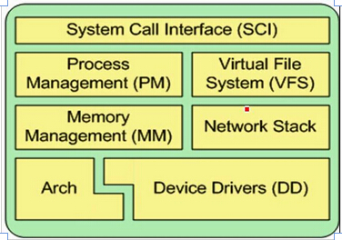
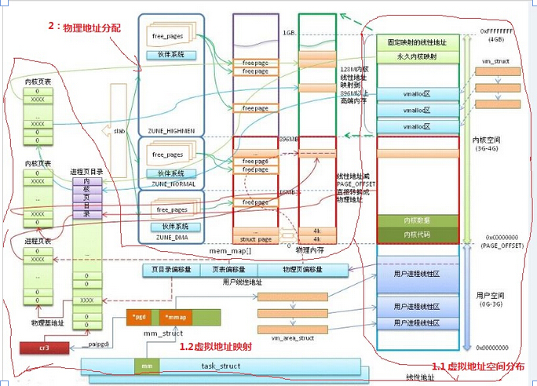

## [Linux内核驱动学习（四）----内存管理子系统](http://blog.csdn.net/u011467781/article/details/43675311)

**http://blog.csdn.net/u011467781/article/details/43675311  
**

**摘要：本文主要讲述** **Linux对内存的管理，主要涉及Linux虚拟地址空间的分布、虚拟地址到物理地址的映射管理，Linux物理内存的分配。**

Linux内存管理子系统由七大部分 组成。。如下图：

  

a>系统调用接口（SCI）、

b>进程管理（PM）、

c>内存管理（MM） 、

d>关于处理器代码（arch） 、

e>虚拟文件系统（VFS）、

f>网络协议栈、  

g>设备驱动（DD）

  

  

                     图：内存管理模型

  

原图地址： [http://bbs.chinaunix.net/thread-2018659-2-1.html](http://bbs.chinaunix.net/thread-2018659-2-1.html)

  

Linux所支持的虚拟地址空间是由硬件所决定的，譬如32的处理器---->虚拟地址空间为4G。

  

由上图可将其分配为两部分（即两部分功能）：

1、从虚拟地址到物理地址映射的管理    

  2、物理内存分配的管理

  

## 一、从虚拟地址到物理地址映射的管理

  

1.1---->虚拟地址到物理地址的映射

1.2--->虚拟地址分布

1.2.1  --->用户空间（0 - 3G）

主要储存应用程序，可以认为每个进程都独立的拥有3G的虚拟用户空间

  

1.2.2 --->内核空间（3 - 4G）

内核空间又可分为以下四个部分：（由于各个区的映射到物理内存方式不同划分为4部分）

a)直接映射区 （3 - 3G+896M）

          直接映射，线性访问低端内存，较为简单，减去3G直接对应物理内存，最高达到896M

b)Vmalloc区

         非线性访问高端内存

c)永久内核映射区

        固定访问高端内存

d)固定映射线性地址区

        与一些特殊寄存器固定映射地址

  

对于高端内存与低端内存的解释：

在物理地址中：

（0-896M）:低端内存,即对应于直接映射区

（896-该物理地址上限）：高端内存 

  

虚拟地址到物理地址的映射（参考裸机MMU）：

  

  

## 二、物理内存地址分配：

注：----->为了避免物理地址空间的浪费，在用户空间和内核空间分配的任何地址都为虚拟地址。

  

在用户空间：当使用系统调用的函数：malloc、fork、等函数分配到虚拟内存时，只有当访问该虚拟内存时才会进行真正的物理内存分配。

分配得到物理内存的过程：

当访问分配的虚拟地址时，木有发现与之对应的物理地址，则产生 请（缺）页异常 。。进而去空闲页框中去请求空闲的物理内存。

在内核空间（两种方式）：

1、 内核程序一般使用Vmalloc分配区去请求内核页表去请求物理地址，，同样也会发生 请（缺）页异常。。

2、内核程序使用物理内存映射区，通过Kmalloc函数使用Slap管理功能，从空闲的内存池取出空闲的物理内存。池中的内存已与一段物理内存对应好了，所以不会产生 请（缺）页异常。    slap:先从空闲的内存中取出，放入自己的池中。

  

  

## 补充知识：

kmalloc与Vmalloc 的区别：

摘自博客： [http://blog.csdn.net/computer055maxi/article/details/5879056](http://blog.csdn.net/computer055maxi/article/details/5879056)

kmalloc()和vmalloc()介绍

kmalloc()

用于申请较小的、连续的物理内存

1\. 以字节为单位进行分配，在<linux/slab.h>中

2\. void \*kmalloc(size\_t size, int flags) 分配的内存物理地址上连续，虚拟地址上自然连续

3\. gfp\_mask标志：什么时候使用哪种标志？如下：

———————————————————————————————-  
情形                                                  相应标志  
———————————————————————————————-  
进程上下文，可以睡眠                    GFP\_KERNEL  
进程上下文，不可以睡眠               GFP\_ATOMIC  
中断处理程序                                     GFP\_ATOMIC  
软中断                                                  GFP\_ATOMIC  
Tasklet                                                GFP\_ATOMIC  
用于DMA的内存，可以睡眠         GFP\_DMA | GFP\_KERNEL  
用于DMA的内存，不可以睡眠     GFP\_DMA | GFP\_ATOMIC  
———————————————————————————————-

4\. void kfree(const void \*ptr)

释放由kmalloc()分配出来的内存块  

vmalloc()

用于申请较大的内存空间，虚拟内存是连续的

1\. 以字节为单位进行分配，在<linux/vmalloc.h>中

2\. void \*vmalloc(unsigned long size) 分配的内存虚拟地址上连续，物理地址不连续

3\. 一般情况下，只有硬件设备才需要物理地址连续的内存，因为硬件设备往往存在于MMU之外，根本不了解虚拟地址；但为了性能上的考虑，内核中一般使用kmalloc()，而只有在需要获得大块内存时才使用vmalloc()，例如当模块被动态加载到内核当中时，就把模块装载到由vmalloc()分配的内存上。

4.void vfree(void \*addr)，这个函数可以睡眠，因此不能从中断上下文调用。

malloc(), vmalloc()和kmalloc()区别

\[\*\]kmalloc和vmalloc是分配的是内核的内存,malloc分配的是用户的内存

\[\*\]kmalloc保证分配的内存在物理上是连续的,vmalloc保证的是在虚拟地址空间上的连续,malloc不保证任何东西(这点是自己猜测的,不一定正确)

\[\*\]kmalloc能分配的大小有限,vmalloc和malloc能分配的大小相对较大

\[\*\]内存只有在要被DMA访问的时候才需要物理上连续

\[\*\]vmalloc比kmalloc要慢