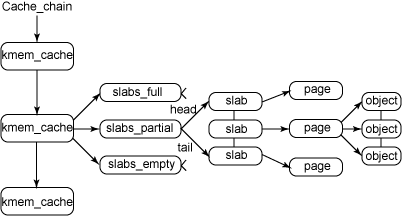

# 十天学Linux内核之第三天---内存管理方式

[十天学Linux内核之第三天---内存管理方式](http://www.cnblogs.com/lihuidashen/p/4242645.html)

http://www.cnblogs.com/lihuidashen/p/4242645.html  

  

　　版权所有，转载请注明转载地址：[http://www.cnblogs.com/lihuidashen/p/4242645.html](http://www.cnblogs.com/lihuidashen/p/4242645.html)  

  

在深入了解内存管理的实现之前一些有关内存管理的高级概念我们有必要了解一下，先说虚拟内存，怎么产生的呢？现在操作系统要求能够使多个程序共享操作系统资源，并且还要求内存对程序的开发透明，有了虚拟内存之后，依靠透明的使用磁盘空间，就可以使系统物理内存大得多，而且使得多个程序共享更加容易方便。然后再说说虚拟地址，当一个程序从内存中存取数据时，会使用地址来指出需要访问的内存地址，这就是虚拟地址，它组成了进程虚拟地址空间，其大小取决于体系结构的字宽。内存管理在操作系统中负责维护虚拟地址和物理地址之间的关系并且实现分页机制(将页从内存到磁盘之间调入调出的机制)， 内核把物理页作为内存管理的基本单位；内存管理单元（MMU）把虚拟地址转换为物理地址，通常以页为单位进行处理。如：

       32位系统：页大小4KB
    
       64位系统：页大小8KB　　

　　上述这些数据都会在页面载入内存时候得以更新，下面来看看内核是如何利用页来实现内存管理的。

　　作为内存管理的基本单元，页有许多属性需要维护，下面的结构体描述了页描述符的各种域以及内存管理是如何使用它们的，在include/linux/mm.h中可以查看到定义。

 1 struct page 2 {
 3         unsigned long flags;　　//flags用来存放页的状态，每一位代表一种状态 4         atomic\_t count;        //count记录了该页被引用了多少次        
 5         unsigned int mapcount; 6         unsigned long private;        
 7         struct address\_space \*mapping;  //mapping指向与该页相关的address\_space对象
 8         pgoff\_t index;                  
 9         struct list\_head lru;  //存放的next和prev指针，指向最近使用(LRU)链表中的相应结点
10 union
11 {
12             struct pte\_chain;
13 pte\_addr\_t;
14 }         
15          void \*virtual;     //virtual是页的虚拟地址，它就是页在虚拟内存中的地址             
16 };

　　要理解的一点是page结构与物理页相关，而并非与虚拟页相关。因此，该结构对页的描述是短暂的。内核仅仅用这个结构来描述当前时刻在相关的物理页中存放的东西。这种数据结构的目的在于描述物理内存本身，而不是描述包含在其中的数据。

　　 在linux中，内核也不是对所有的也都一视同仁，内核而是把页分为不同的区，使用区来对具有相似特性的页进行分组。Linux必须处理如下两种硬件存在缺陷而引起的内存寻址问题：

-   一些硬件只能用某些特定的内存地址来执行DMA
-   一些体系结构其内存的物理寻址范围比虚拟寻址范围大的多。这样，就有一些内存不能永久地映射在内核空间上。

　　为了解决这些制约条件，Linux系统使用了三种区：

-   ZONE\_DMA:这个区包含的页用来执行DMA操作。
-   ZONE\_NOMAL:这个区包含的都是能正常映射的页(用于映射非DMA)
-   ZONE\_HIGHEM:这个区包"高端内存"，其中的页能不永久地映射到内核地址空间。

　　每个内存区都有一个对应的描述符号zone，zone结构被定义在/linux/mmzone.h中，接下来浏览一下该结构的一些域：

struct zone {
         spinlock\_t              lock;　　//lock域是一个自旋锁，这个域只保护结构，而不是保护驻留在这个区中的所有页
         unsigned long           free\_pages;　　//持有该内存区中所剩余的空闲页链表
         unsigned long           pages\_min, pages\_low, pages\_high;　　//持有内存区的水位值
         unsigned long           protection\[MAX\_NR\_ZONES\];
         spinlock\_t              lru\_lock;       //持有保护空闲页链表的自旋锁
         struct list\_head        active\_list;　　在页面回收处理时，处于活动状态的页链表
         struct list\_head        inactive\_list;　　//在页面回收处理时，是可以被回收的页链表
         unsigned long           nr\_scan\_active;
         unsigned long           nr\_scan\_inactive;
         unsigned long           nr\_active;
         unsigned long           nr\_inactive;
         int                     all\_unreclaimable; 　　//内存的所有页锁住时，此值置1
         unsigned long           pages\_scanned;    //用于页面回收处理中
         struct free\_area        free\_area\[MAX\_ORDER\];
         wait\_queue\_head\_t       \* wait\_table;
         unsigned long           wait\_table\_size;
         unsigned long           wait\_table\_bits;　　//用于处理该内存区页上的进程等待
         struct per\_cpu\_pageset  pageset\[NR\_CPUS\];
         struct pglist\_data      \*zone\_pgdat;
         struct page             \*zone\_mem\_map;
         unsigned long           zone\_start\_pfn;

         char                    \*name;
         unsigned long           spanned\_pages;  
         unsigned long           present\_pages;  
};

　　内核提供了一种请求内层的底层机制，并提供了对它进行访问的几个接口。所有这些接口都是以页为单位进行操作的页面是物理内存存储页的基本单元，只要有进程申请内存，内核便会请求一个页面给它，同理，如果页面不再使用，那么内核将其释放，以便其他进程可以使用，下面介绍一下这些函数。

　　alloc\_page() 用于请求单页，不需要描述请求内存大小的order参数

　　alloc\_pages() 可以请求页面组

#define alloc\_pages(gfp\_mask,order)   
　　alloc\_pages\_node(numa\_node\_id(),gfp\_mask,order)
#define alloc\_page(gfp\_mask)   　　alloc\_pages\_node(numa\_node\_id(),gfp\_mask,0)

　　\_\_get\_free\_page() 请求单页面操作的简化版本

include/linux/gfp.h
    #define \_\_get\_dma\_pages(gfp\_mask,order) \\
    \_\_get\_free\_pages((gfp\_mask)|GFP\_DMA,(order))

　　\_\_get\_dma\_pages() 用于从ZONE\_DMA区请求页面

include/linux/gfp.h
    #define \_\_get\_dma\_pages(gfp\_mask,order) \\
    \_\_get\_free\_pages((gfp\_mask)|GFP\_DMA,(order))

 　　当你不再需要页时可以用下列函数释放它们，只是提醒：仅能释放属于你的页，否则可能导致系统崩溃。内核是完全信任自己的，如果有非法操作，内核会开心的把自己挂起来，停止运行。

extern void \_\_free\_pages(struct page \*page, unsigned int order);

extern void free\_pages(unsigned long addr, unsigned int order);

　　上面提到都是以页为单位的分配方式，那么对于常用的以字节为单位的分配来说，内核通供的函数是kmalloc(),和mallloc很像吧，其实还真是这样，只不过多了一个flags参数。用它可以获得以字节为单位的一块内核内存。

　　 **kmalloc**

kmalloc()函数与用户空间malloc一组函数类似，获得以字节为单位的一块内核内存。

void \*kmalloc(size\_t size, gfp\_t flags)

void kfree(const void \*objp)

分配内存物理上连续。

gfp\_t标志：表明分配内存的方式。如：

GFP\_ATOMIC：分配内存优先级高，不会睡眠

GFP\_KERNEL：常用的方式，可能会阻塞。

　　 **vmalloc**    

void \*vmalloc(unsigned long size)

void vfree(const void \*addr)

vmalloc()与kmalloc方式类似，vmalloc分配的内存虚拟地址是连续的，而物理地址则无需连续，与用户空间分配函数一致。

vmalloc通过分配非连续的物理内存块，在修正页表，把内存映射到逻辑地址空间的连续区域中，虚拟地址是连续的。 是否必须要连续的物理地址和具体使用场景有关。在不理解虚拟地址的硬件设备中，内存区都必须是连续的。通过建立页表转换成虚拟地址空间上连续，肯定存在一些消耗，带来性能上影响。所以通常内核使用kmalloc来申请内存，在需要大块内存时使用vmalloc来分配。

　　进程往往会以字节为单位请求小块内存，为了满足这种小内存的请求，内核特别实现了Slab分配器，Slab分配器使用三个主要结构维护对象信息，分别如下:

kmem\_cache的缓存描述符

cache\_sizes的通用缓存描述符

slab的slab描述符

　　在最高层是 cache\_chain，这是一个 slab 缓存的链接列表。可以用来查找最适合所需要的分配大小的缓存。cache\_chain 的每个元素都是一个 kmem\_cache 结构的引用。一个kmem\_cache中的所有object大小都相同。这里我们首先看看缓存描述符中各个域以及他们的含义。

struct kmem\_cache\_s{

    struct kmen\_list3 lists;　　//lists域中包含三个链表头，每个链表头均对应了slab所处的三种状态(满，未满，空闲)之一，
    
    unsigned int objsize;　　//objsize域中持有缓存中对象的大小
    unsigned int flags;　　//flags持有标志掩码，其描述了缓存固有特性
    unsigned int num;　　//num域中持有缓存中每个slab所包含的对象数目
    
    unsigned int gfporder;　　//缓存中每个slab所占连续页面数的幂，该值默认0
    
    size\_t color;  　
    
    unsigned int color\_off;
    unsigned int color\_next;
    kmem\_cache\_t \*slabp\_cache;　　//可存储在自身缓存中也可以存在外部其他缓存中
    unsigned int dflags;
    
    void (\*ctor) (void \*,kmem\_cache\_t\*,unsigened long);
    
    void (\*dtor)(void\*，kmem\_cache\_t \*,unsigend long);
    
    const char \*name;　　//name持有易于理解的名称
    struct list\_head next;　　//next域指向下个单向缓存描述符链表上的缓存描述符

};

　　如我们所讲，作为通用目的的缓存大小都是被定义好的，且成对出现，一个为从ＤＭＡ内存分配对象，另一个从普通内存中分配，结构cache\_sizes包含了有关通用缓存大小的所有信息。代码解释如下：

struct cache\_sizes{
    size\_t cs\_size;　　//持有该缓存中容纳的内存对象大小
    kmem\_cache\_t \*cs\_cachep;　　//持有指向普通内存缓存描述符飞指针
    kmem\_cache\_t \*cs\_dmacachep;　　//持有指向DMA内存缓存描述符的指针，分配自ZONE\_DMA
};

　　最后介绍一下Slab状态和描述符域的值，如下表(N=slab中的对象数目，X=某一变量的正数)

 

Free

Partial

Full

Slab->inuse

0

X

N

Slab->free

0

X

N

　　现在我们再内核运行的整个生命周期范围内观察缓存和slab分配器第如何交互的，内核需要某些特殊结构以支持进程的内存请求和动态可加载模块来创建特定缓存，内核函数 kmem\_cache\_create 用来创建一个新缓存。这通常是在内核初始化时执行的，或者在首次加载内核模块时执行.

struct kmem\_cache \*kmem\_cache\_create (

　　const char \*name,　　//定义了缓存名称

　　size\_t size,　　//指定了为这个缓存创建的对象的大小

　　size\_t align,　　//定义了每个对象必需的对齐。

　　unsigned long flags,　　//指定了为缓存启用的选项

　　void (\*ctor)(void \*))　　//定义了一个可选的对象构造器和析构器。构造器和析构器是用户提供的回调函数。当从缓存中分配新对象时，可以通过构造器进行初始化。

　　当缓存被创建之后，其中的slab都是空的，事实上slab在请求对象前都不会分配，当我们在创建slab时，不仅仅分配和初始化其描述符，而且还需要和伙伴系统交互请求页面。从一个命名的缓存中分配一个对象，可以使用 kmem\_cache\_alloc 函数,这个函数从缓存中返回一个对象。注意如果缓存目前为空，那么这个函数就会调用 cache\_alloc\_refill 向缓存中增加内存。

void kmem\_cache\_alloc( struct kmem\_cache \*cachep, gfp\_t flags );
//cachep是需要扩充的缓存描述符
//flags这些标志将用于创建slab

　　缓存和slab都可被销毁，其步骤与创建相逆，但是对齐问题在销毁缓存时候不需要关心，只需要删除缓存描述符和释放内存即可，其步骤有三如下：

-   从缓存链表中删除缓存
-   删除slab描述符
-   删除缓存描述符

mm/slab.c
int kmem\_cache\_destroy(kmem\_cache\_t \*cachep)
{
    int i;
    
    if(!cache || in\_interrupt())
    BUG();　　//完成健全性检查
    
    down(&cache\_chain\_sem);
    
    list\_del(&cachep->next);
    up(&cache\_chain\_sem);　　//获得cache\_chain信号量从缓存中删除指定缓存，释放cache\_chain信号量
    
    if(\_cache\_shrink(cachep)){
        slab\_error(cachep,"Can't free all objects");
        down(&cache\_chain\_sem);
        list\_add(&cache->next,&cache\_chain);
        up(&cache\_chain\_sem);
        return 1;　　　　//该段负责释放为使用slab
    }
    ...
    kmem\_cache\_free(&cache\_cache,cachep);　　//释放缓存描述符
    
    return 0;
}

　　目前为止，我们讨论完了slab分配器，那么实际的内存请求是怎么样的呢，slab分配器是如何被调用的呢？这里我粗略讲解一下。当内核必须获得字节大小的内存块时，就需要使用函数kmalloc()，它实际上会调用函数kmem\_getpages完成实际分配，调用路径如下：kmalloc()->\_\_cache\_alloc()->kmem\_cache\_grow()->kmem\_getpages().kmalloc和get\_free\_page申请的内存位于物理内存映射区域，而且在物理上也是连续的，它们与真实的物理地址只有一个固定的偏移，因此存在较简单的转换关系，virt\_to\_phys()可以实现内核虚拟地址转化为物理地址：

1 #define \_\_pa(x) ((unsigned long)(x)-PAGE\_OFFSET)
2 extern inline unsigned long virt\_to\_phys(volatile void \* address)
3 {
4 return \_\_pa(address);
5 }

　　那么内核是如何管理它们使用内存的呢，用户进程一旦创建便要分配一个虚拟地址空间，其地址范围可以通过增加或者删除线性地址间隔得以扩大或者缩减，在内核中进程地址空间的所有信息都被保存在mm\_struct结构中，mm\_struct和vm\_area\_struct结构之间的关系如下图：

struct mm\_struct {

　　struct vm\_area\_struct \* mmap; /\* 指向虚拟区间（VMA）链表 \*/

　　rb\_root\_t mm\_rb; ／\*指向red\_black树\*/

　　struct vm\_area\_struct \* mmap\_cache; /\* 指向最近找到的虚拟区间\*/

　　pgd\_t \* pgd; ／\*指向进程的页目录\*/　

　　atomic\_t mm\_users; /\* 用户空间中的有多少用户\*/

　　atomic\_t mm\_count; /\* 对"struct mm\_struct"有多少引用\*/

　　int map\_count; /\* 虚拟区间的个数\*/

　　struct rw\_semaphore mmap\_sem;

　　spinlock\_t page\_table\_lock; /\* 保护任务页表和 mm->rss \*/

　　struct list\_head mmlist; /\*所有活动（active）mm的链表 \*/

　　unsigned long start\_code, end\_code, start\_data, end\_data; /\*start\_code 代码段起始地址,end\_code 代码段结束地址,start\_data 数据段起始地址, start\_end 数据段结束地址\*/

　　unsigned long start\_brk, brk, start\_stack; /\*start\_brk 和brk记录有关堆的信息, start\_brk是用户虚拟地址空间初始化时，堆的结束地址, brk 是当前堆的结束地址, start\_stack 是栈的起始地址\*/

　　unsigned long arg\_start, arg\_end, env\_start, env\_end; /\*arg\_start 参数段的起始地址, arg\_end 参数段的结束地址, env\_start 环境段的起始地址, env\_end 环境段的结束地址\*/

　　unsigned long rss, total\_vm, locked\_vm;

　　unsigned long def\_flags;

　　unsigned long cpu\_vm\_mask;

　　unsigned long swap\_address;
....
};

　　最后简单讲一下进程映象分布于线性地址空间的相关重点，当用户程序被载入内存之后，便被赋予 了自己的线性空间，并且被映射到进程地址空间，下面需要注意。

**永久映射：可能会阻塞**

　　映射一个给定的page结构到内核地址空间：

　　void \*kmap(struct page \*page)

　　解除映射：

　　void kunmap(struct page \*page) 

**临时映射：不会阻塞**     

void \*kmap\_atomic(struct page \*page)

　　**小结**

　　这次讲了内存管理的大部分内容，介绍了页是如何在内核中被跟踪，然后讨论了内存区，之后讨论了小于一页的小块内存分配，即slab分配器管理。在内核管理结构和众多代码分析完了之后，继续讨论了用户空间进程管理特殊方式，最后简单介绍了进程映象分布于线性地址空间的相关重点。里面肯定有些内容比较散乱，代码有补全的状况，希望大家能够多家批评改正，一起讨论，今天发生了很多事情，到现在才更新完，晚上还有些时间，还需要好好理解体会，共勉。

# 参考

[十天学Linux内核之第三天---内存管理方式-CSDN博客](https://blog.csdn.net/zdy0_2004/article/details/43122263)