# Linux任督二脉之内存管理(一) PPT

内存的`zone`: `DMA`、`Normal`和`HIGHMEM`  
`Linux`内存管理`Buddy`算法  
连续内存分配器(`CMA`)  
看`/proc/buddyinfo`

为什么分`ZONE`  
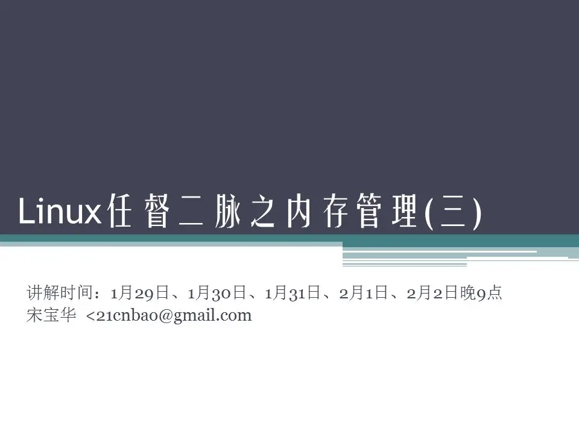

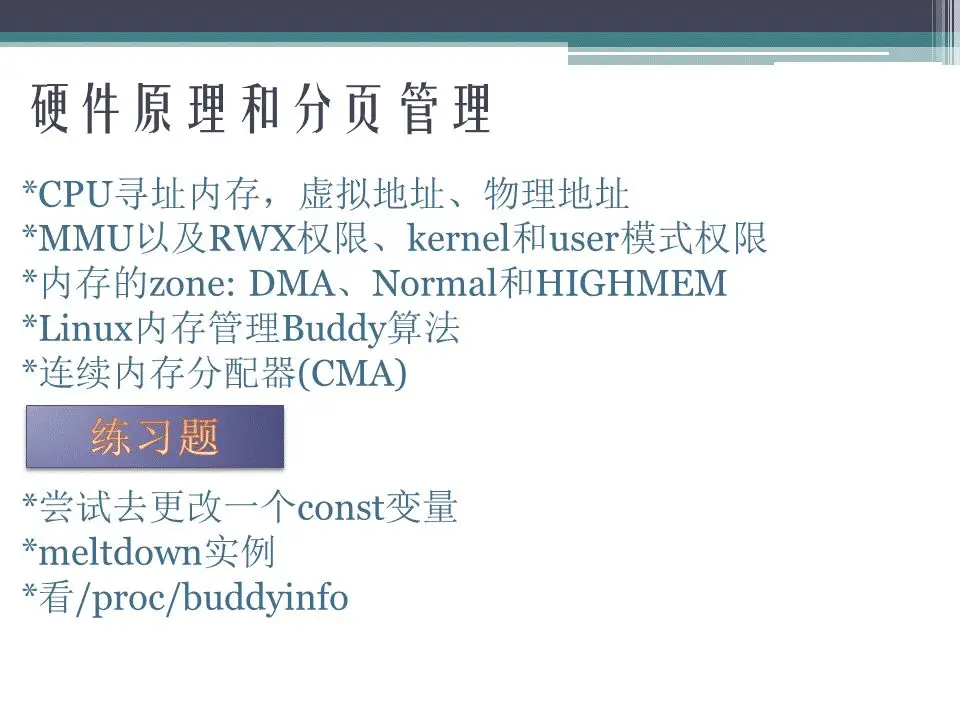

这里谈分页机制

虚实转换

RWX权限

特权模式权限与非特权模式

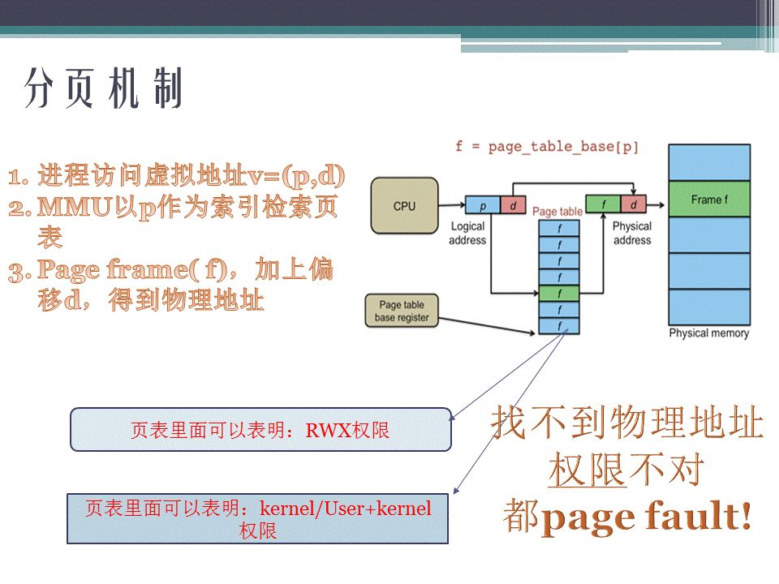

这是一个背离RWX权限导致段错误的例子

  

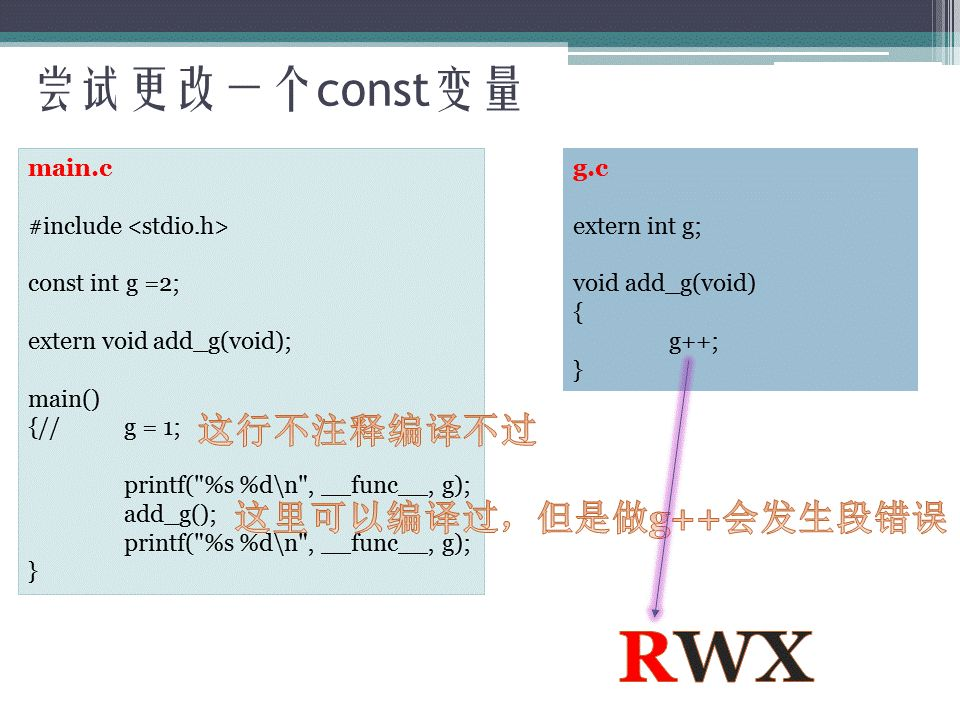

背离特权模式保护的meltdown漏洞

  

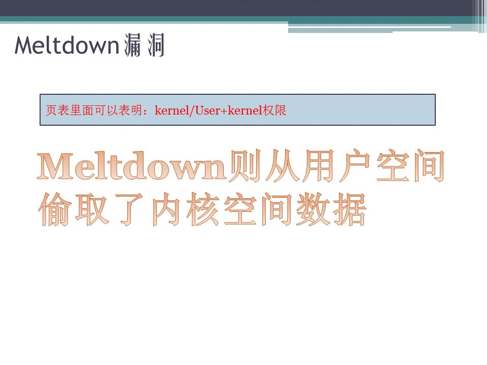

  

为什么分ZONE

  

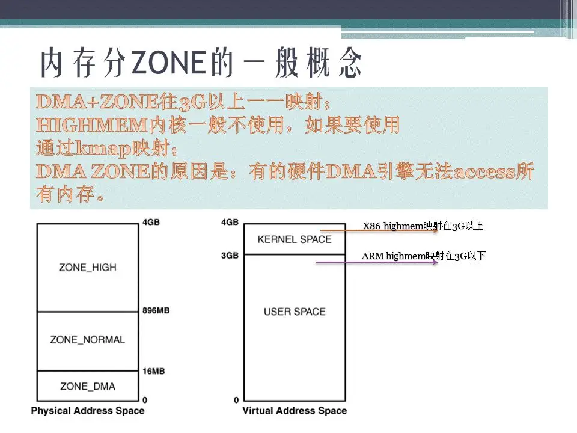

  

DMA

  

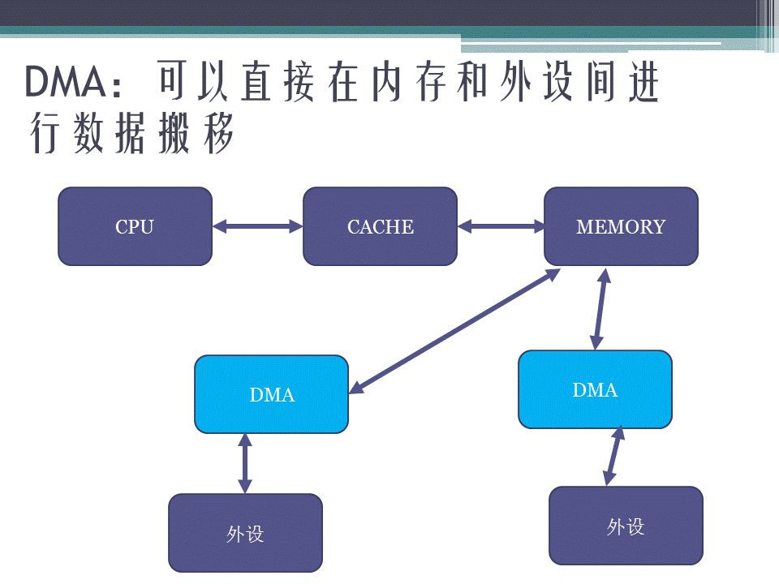

  

DMA zone应该多大

  

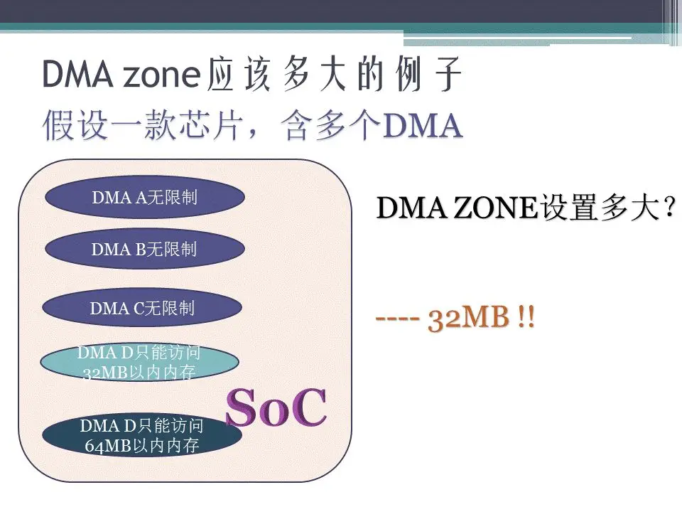

  

Buddy算法

  

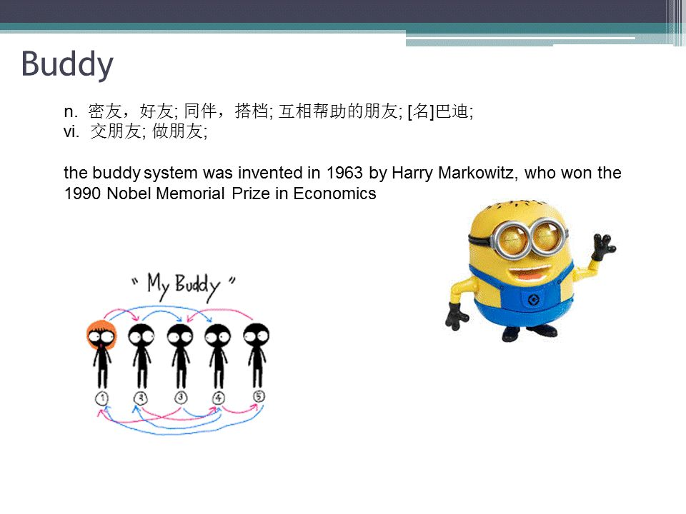

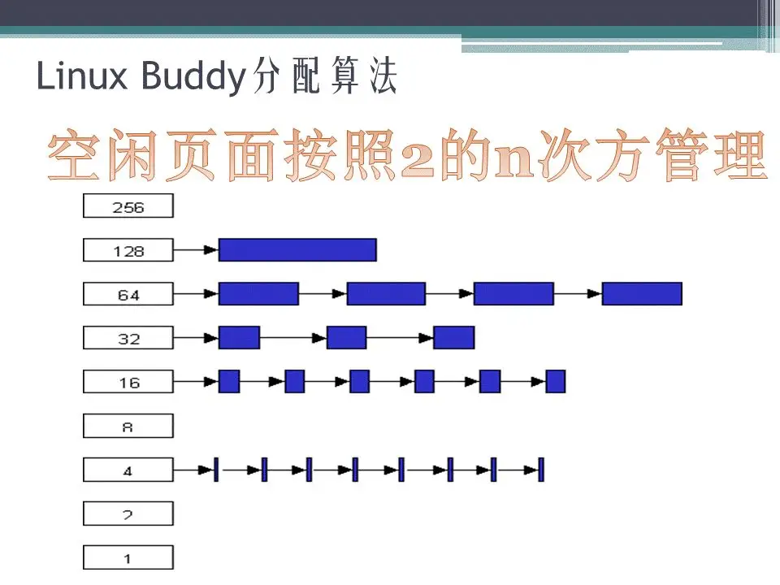

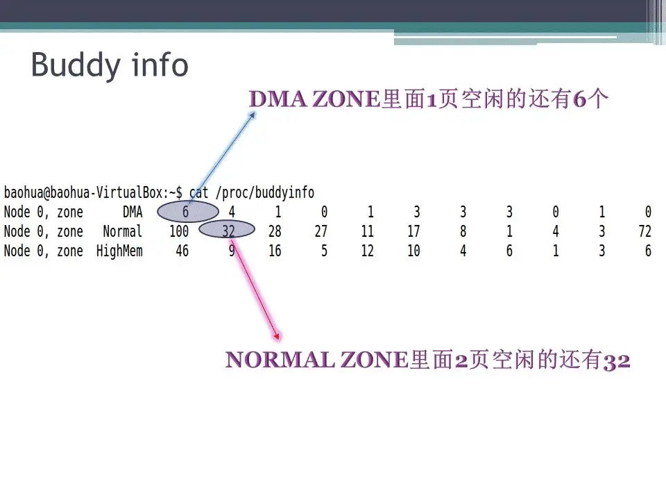

  

CMA

  

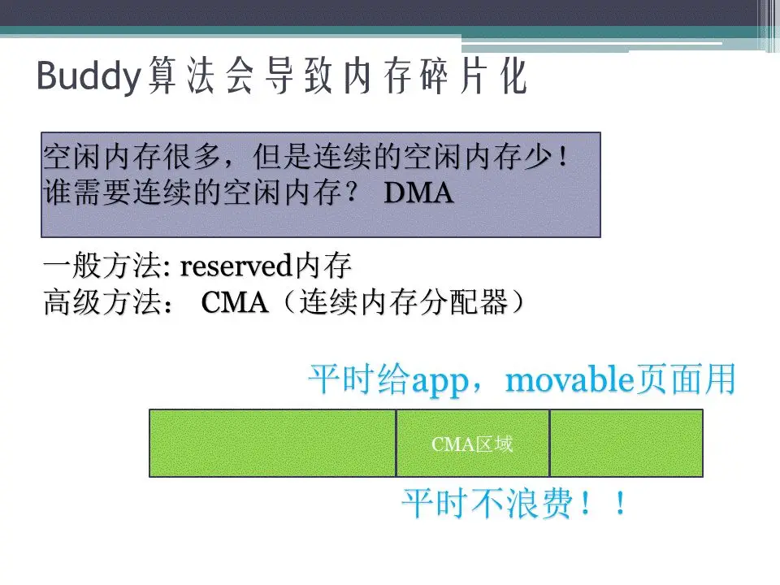

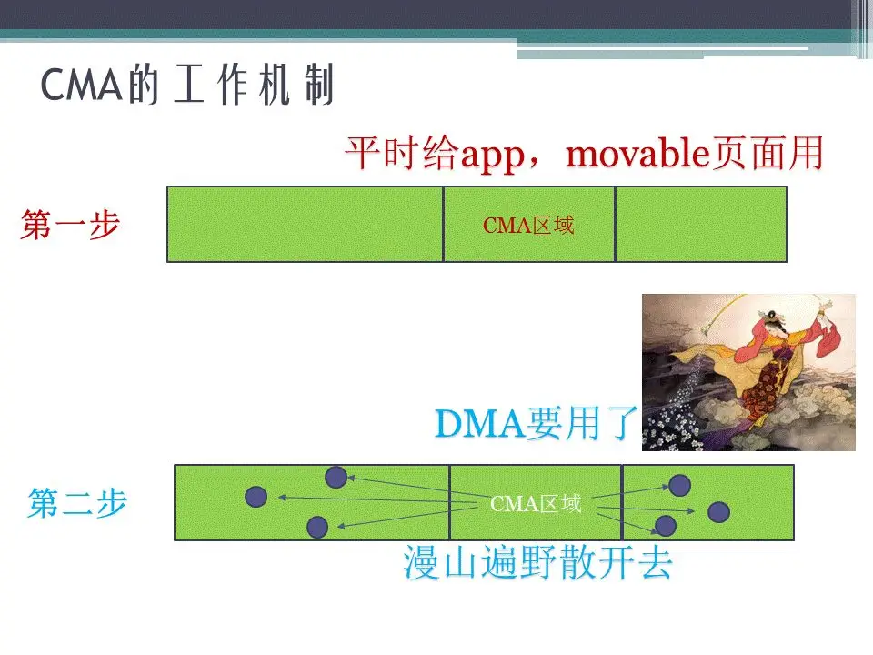

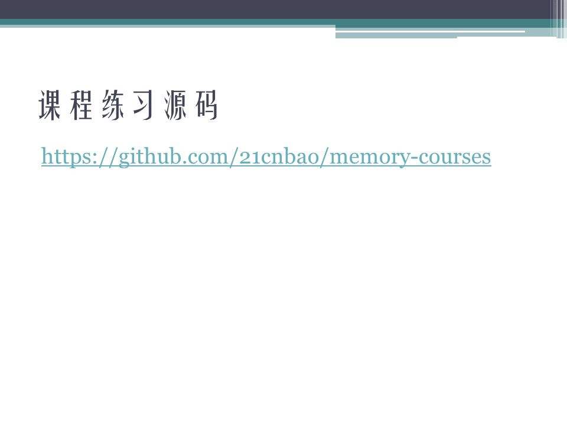

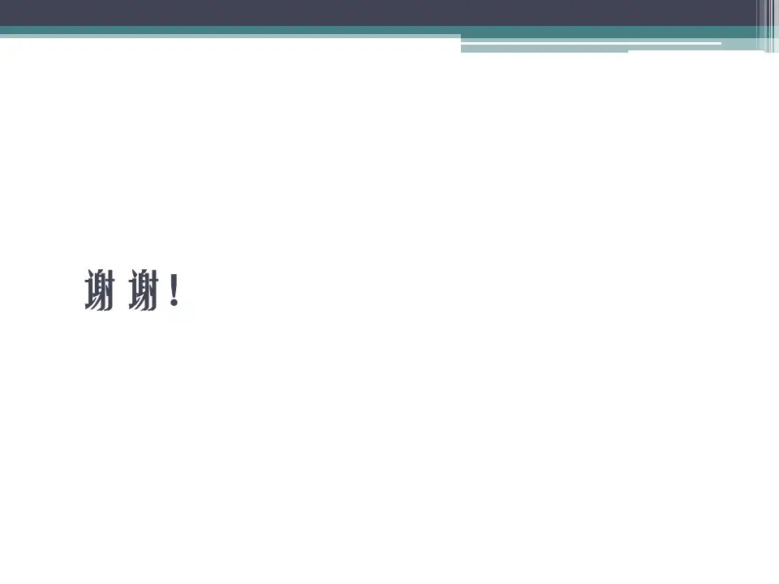

## 参考

[Linux任督二脉之内存管理(一) PPT_linux任督二脉之内存管理 ppt-CSDN博客](https://blog.csdn.net/sunshineywz/article/details/106021469)

[Linux任督二脉之内存管理(一) PPT (qq.com)](https://mp.weixin.qq.com/s?__biz=Mzg2OTc0ODAzMw==&mid=2247501980&idx=1&sn=636fbb1c4c198a8e6177b03c6f71427f&source=41#wechat_redirect)