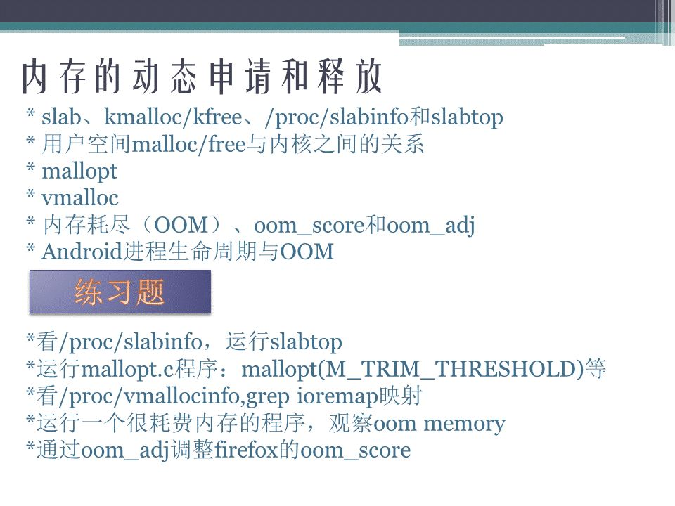

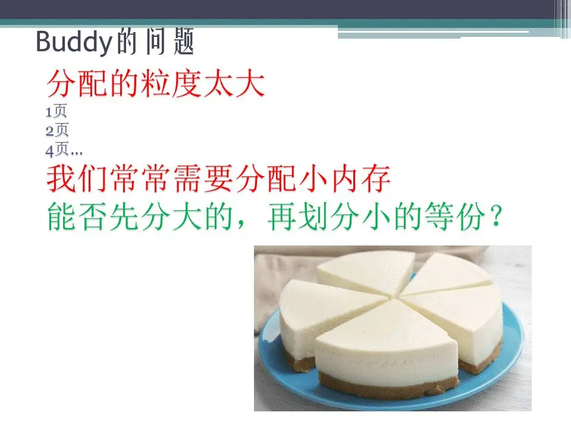

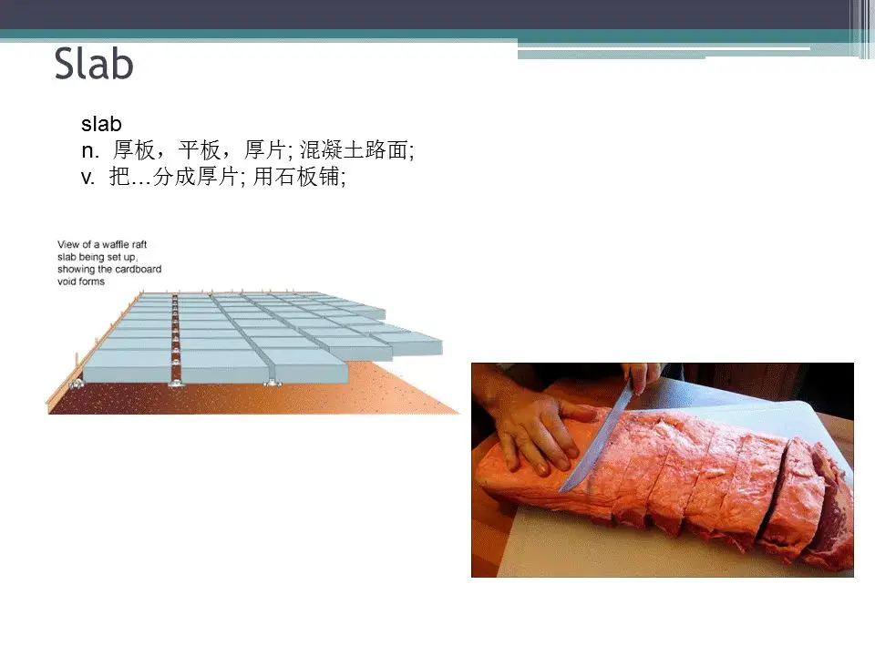

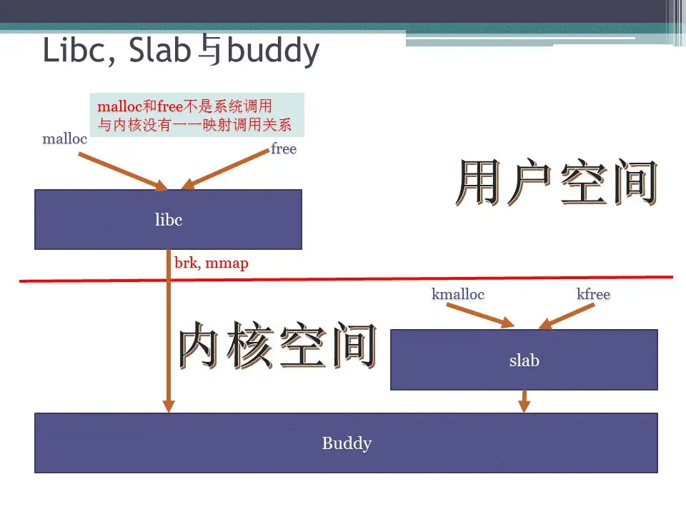

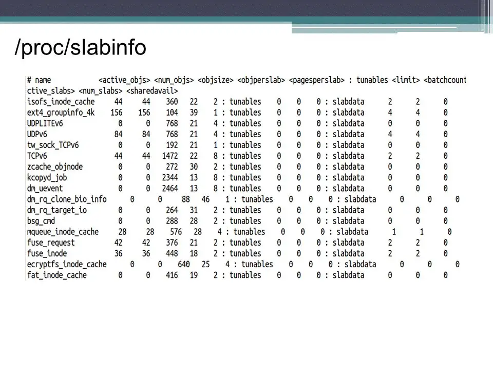

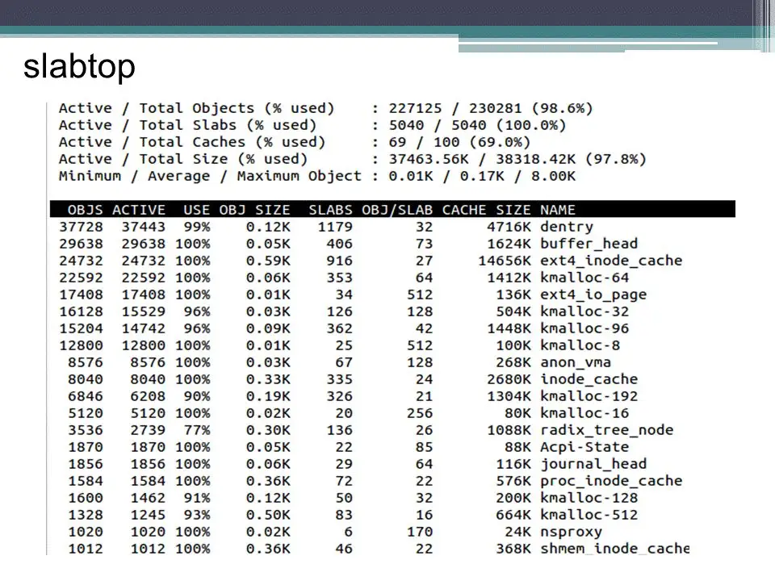

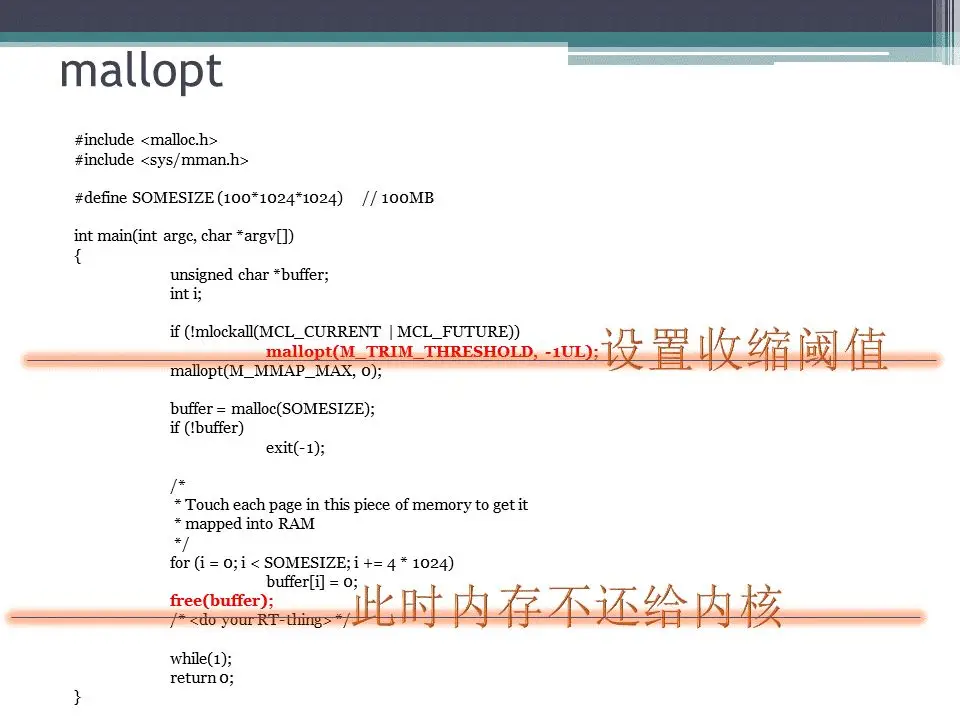

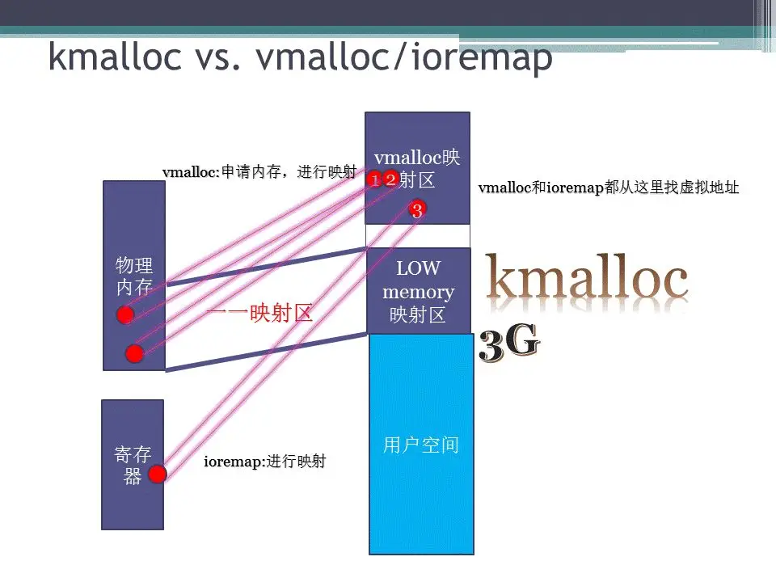

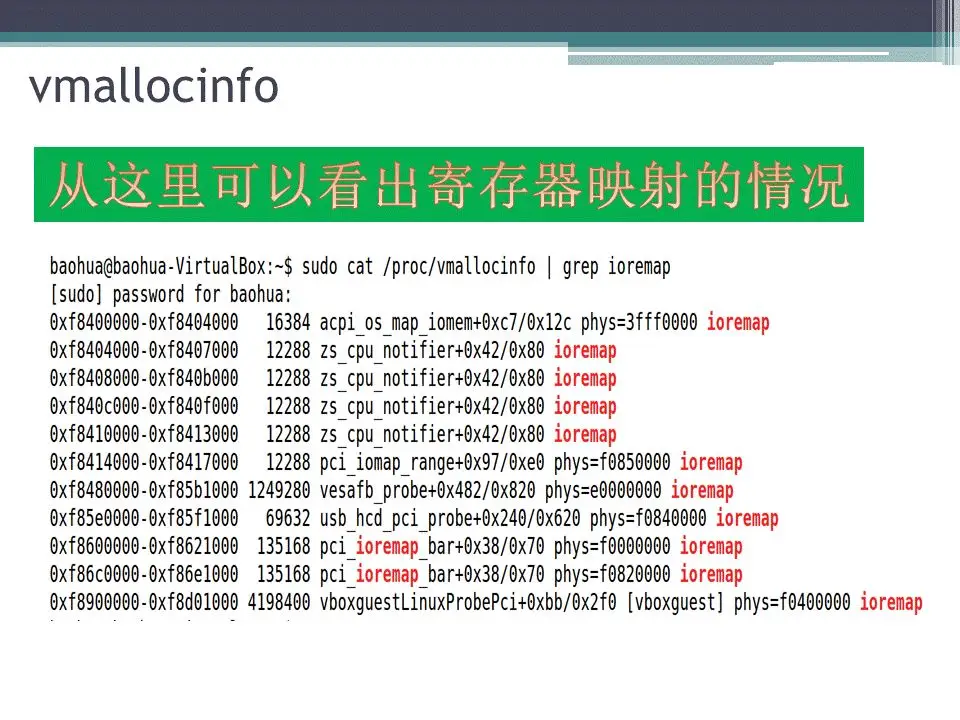

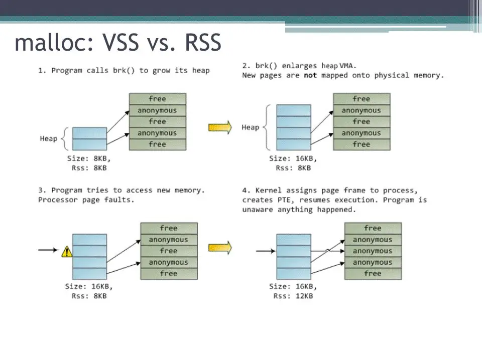

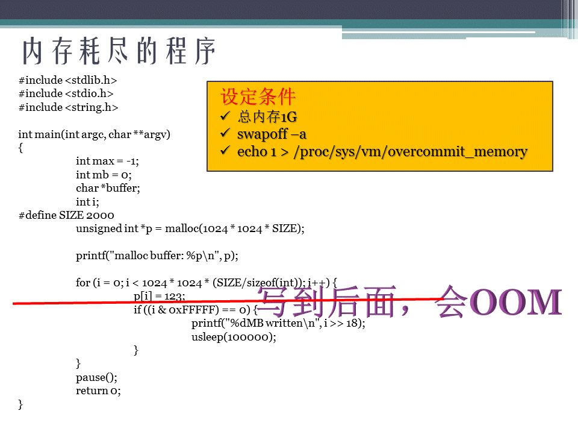

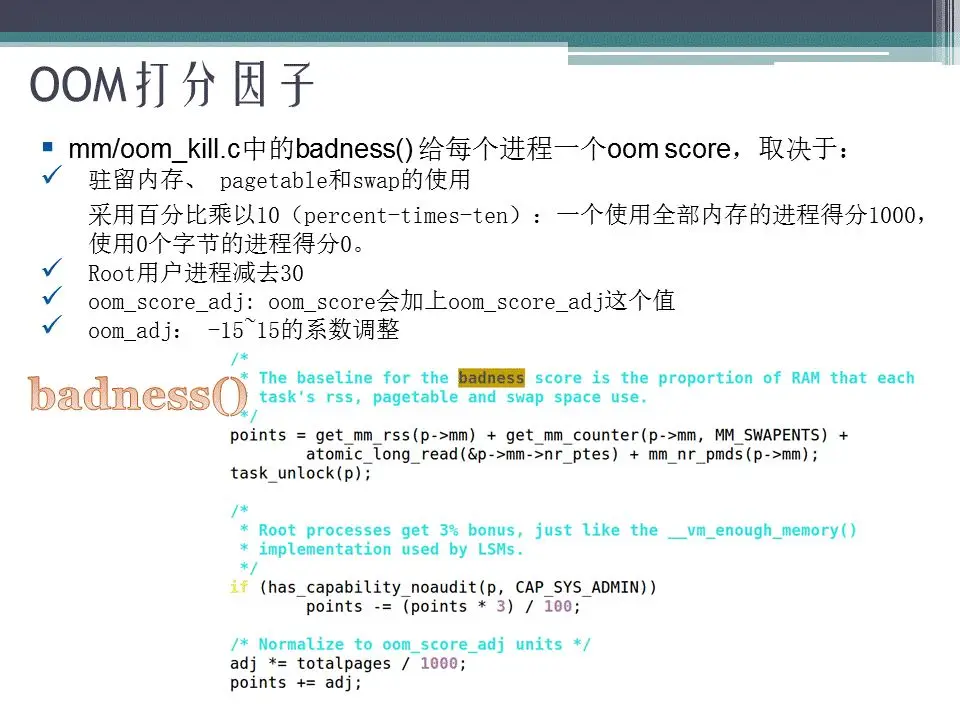

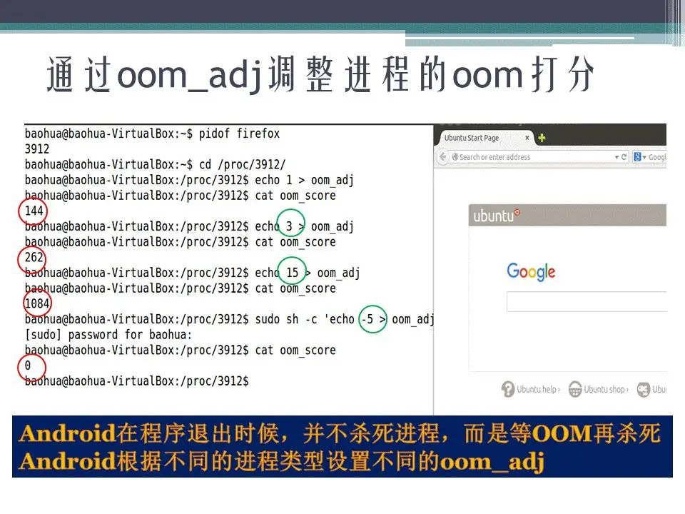

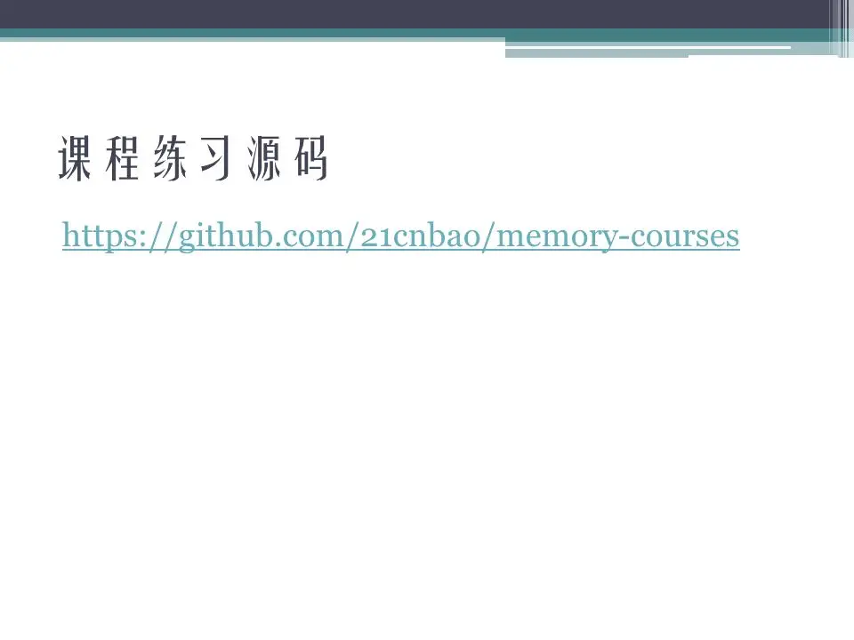

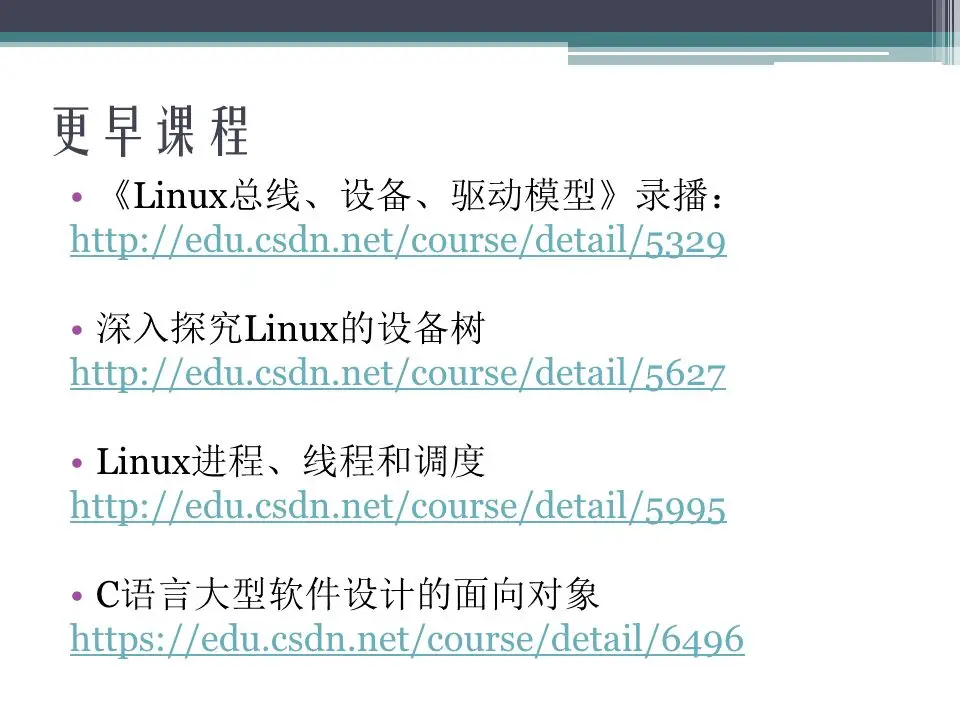

## 参考

[Linux任督二脉之内存管理(二) PPT (qq.com)](https://mp.weixin.qq.com/s?__biz=Mzg2OTc0ODAzMw==&mid=2247501981&idx=1&sn=2af699d57e467ad0c1a636a5329e74b5&source=41#wechat_redirect)