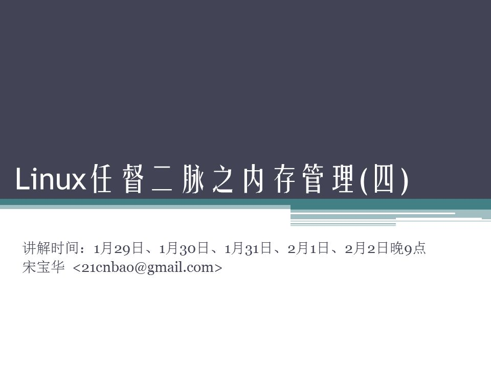

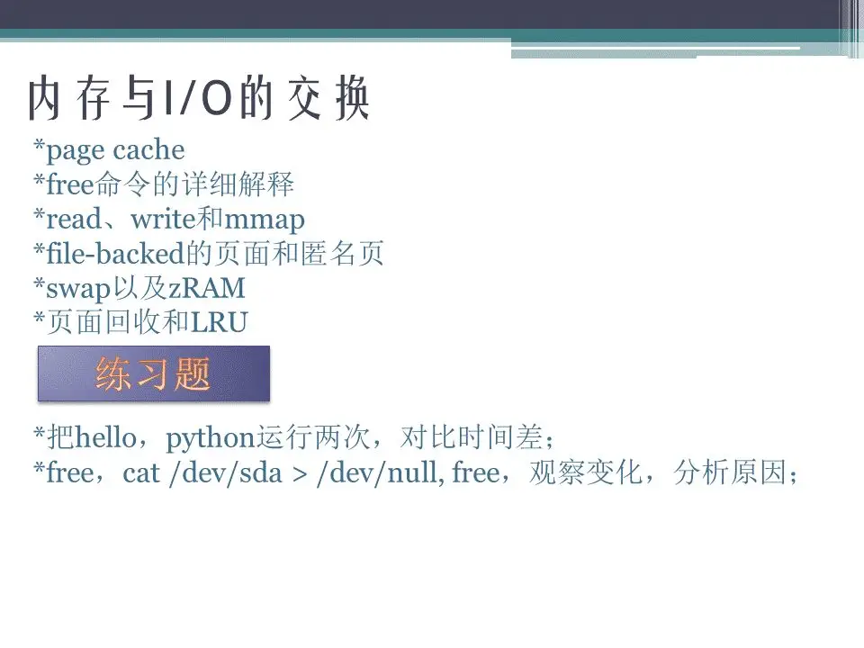

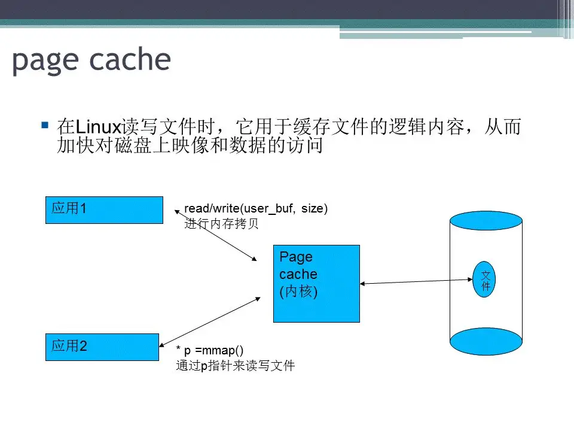

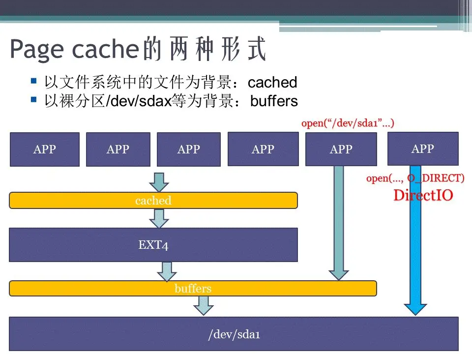

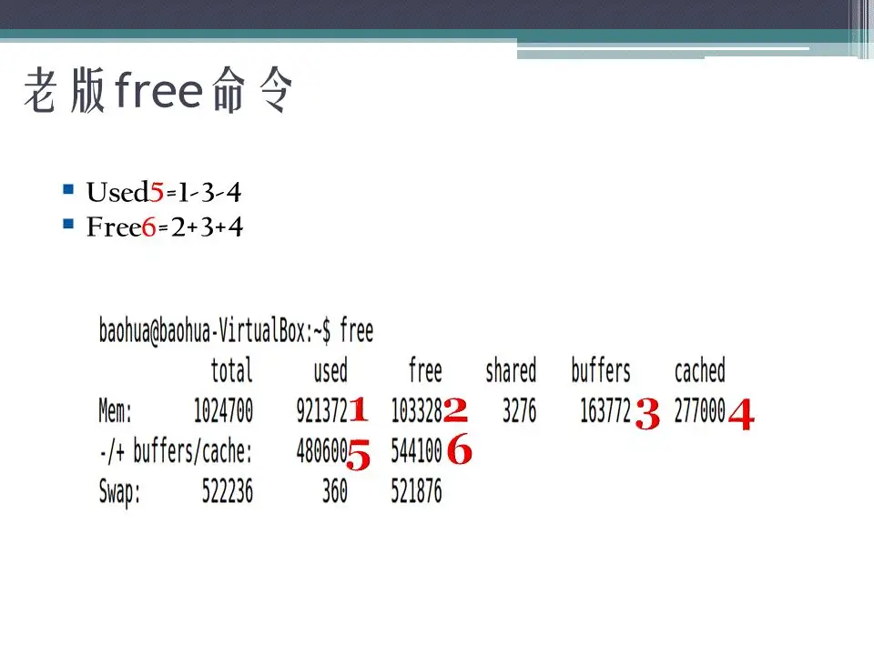

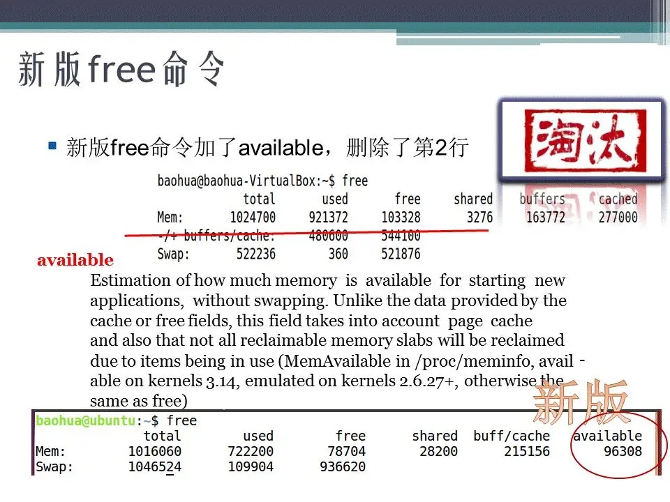

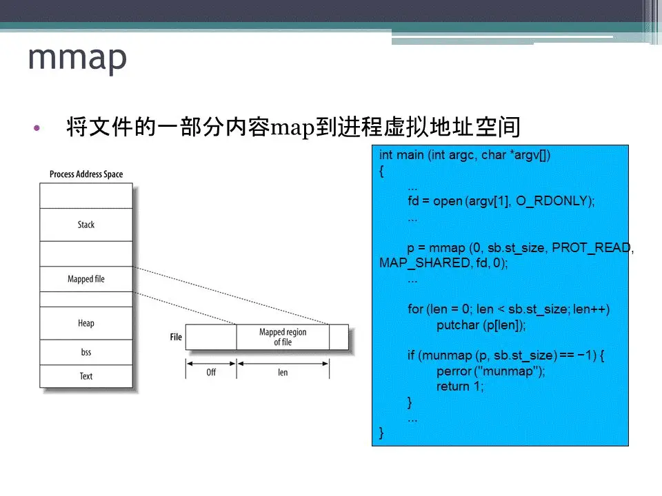

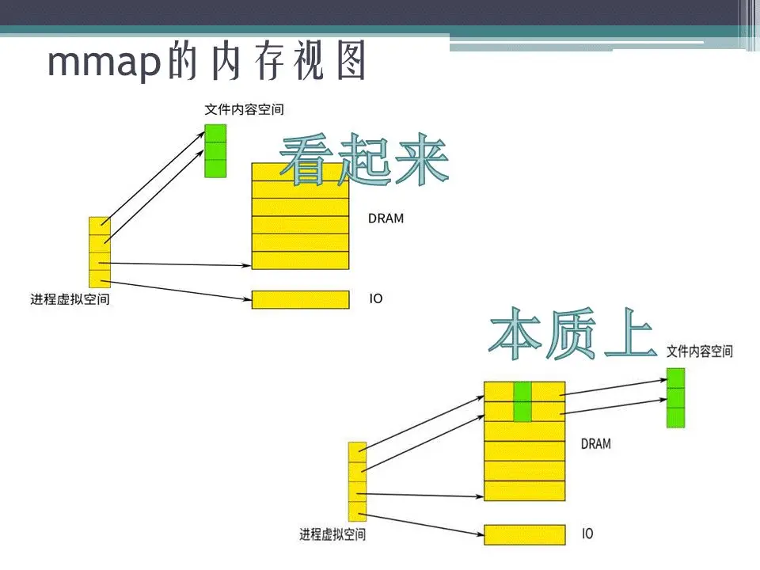

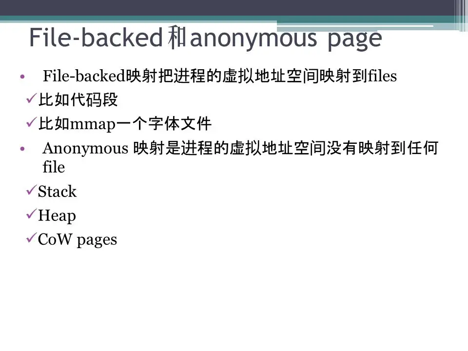

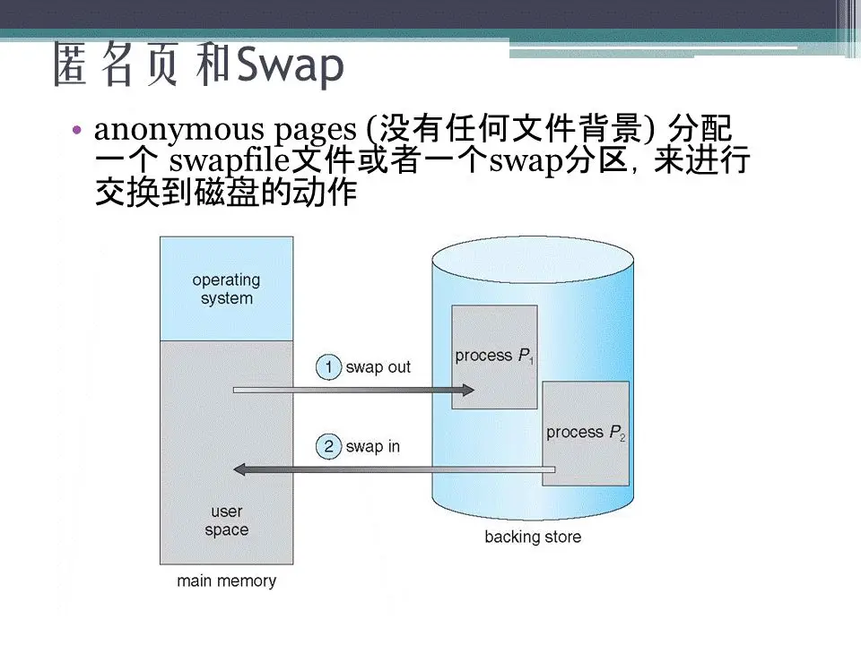

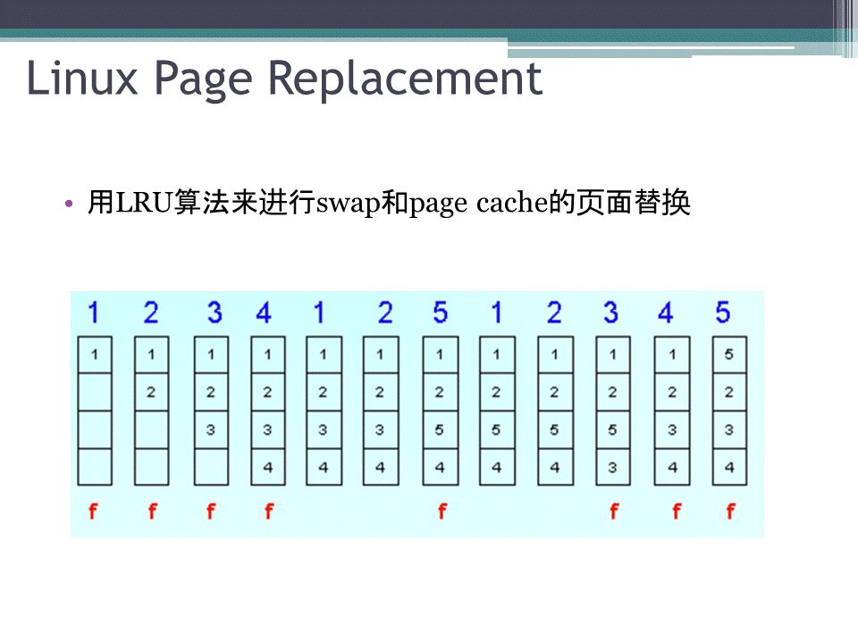

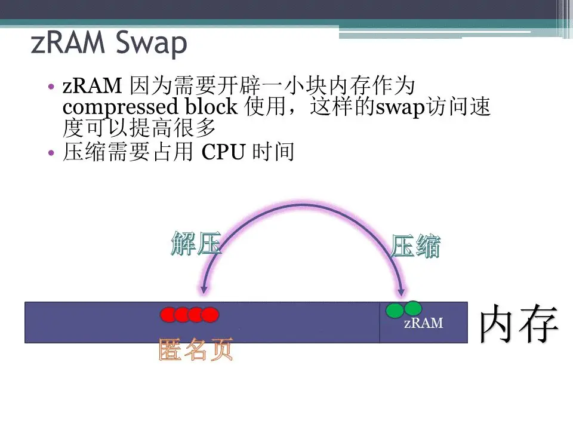

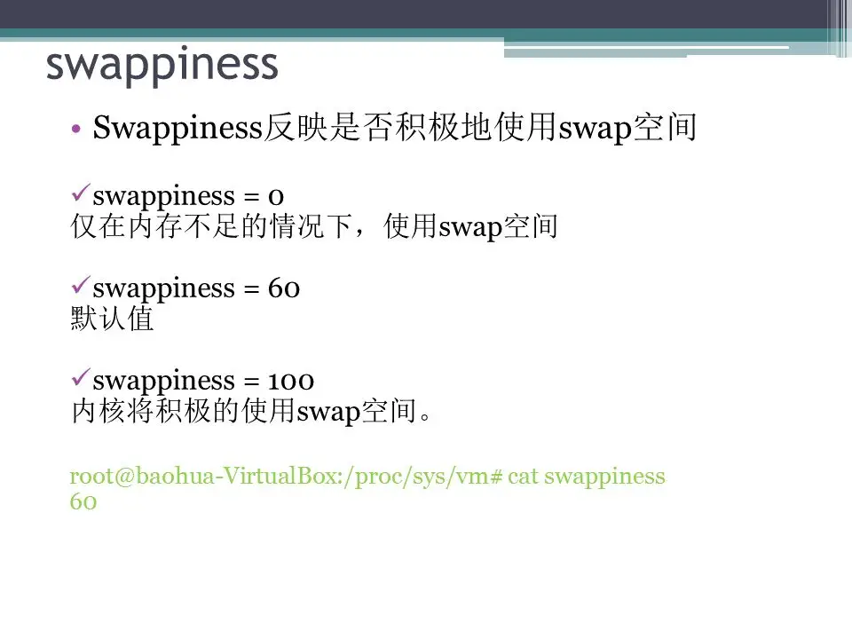

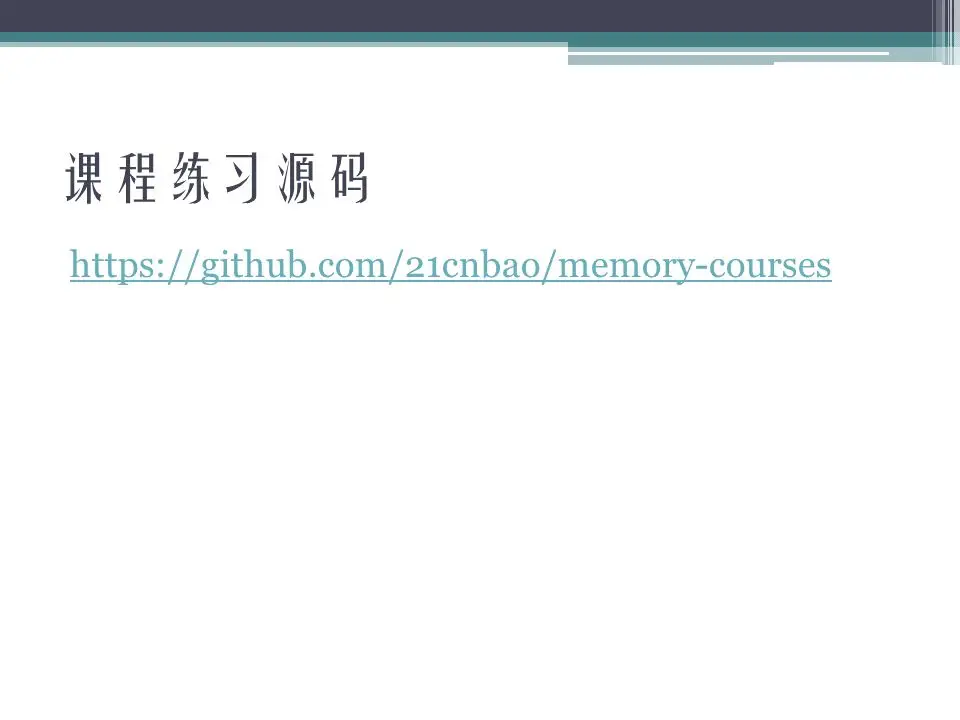

  

## 参考

[Linux任督二脉之内存管理(四) PPT (qq.com)](https://mp.weixin.qq.com/s?__biz=Mzg2OTc0ODAzMw==&mid=2247501983&idx=1&sn=718f4cfeca8a8c33d9598cad56fcec3b&source=41#wechat_redirect)