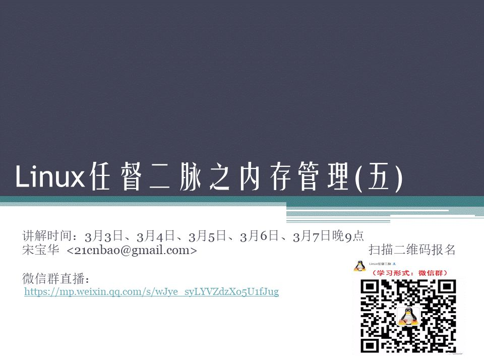

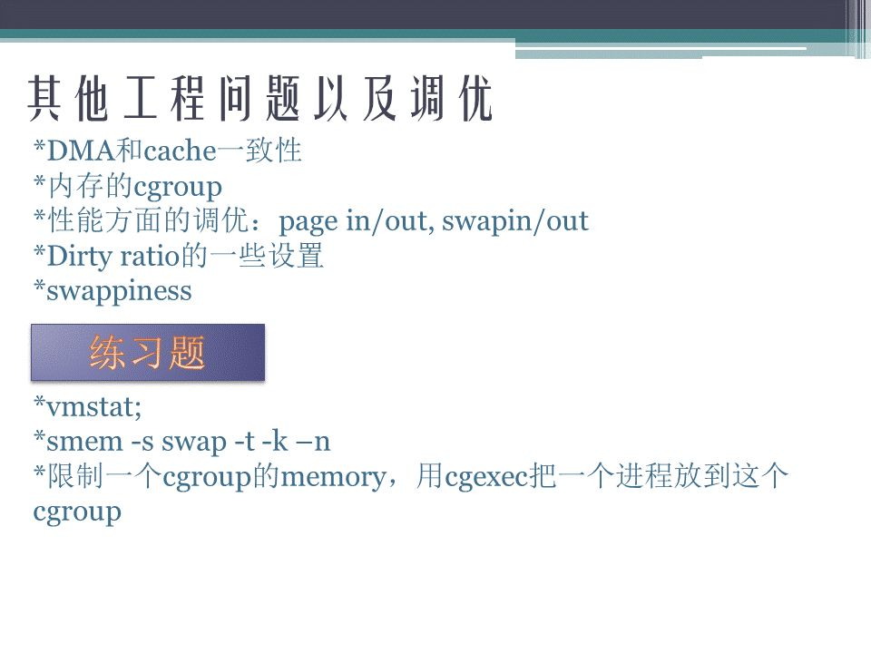

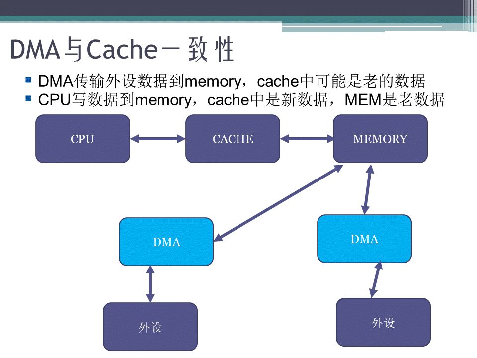

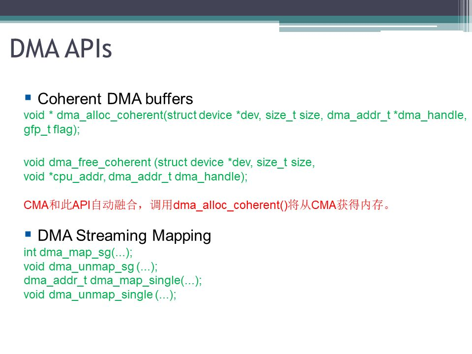

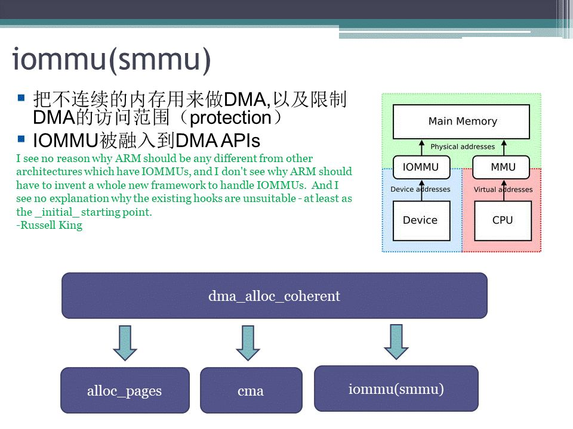

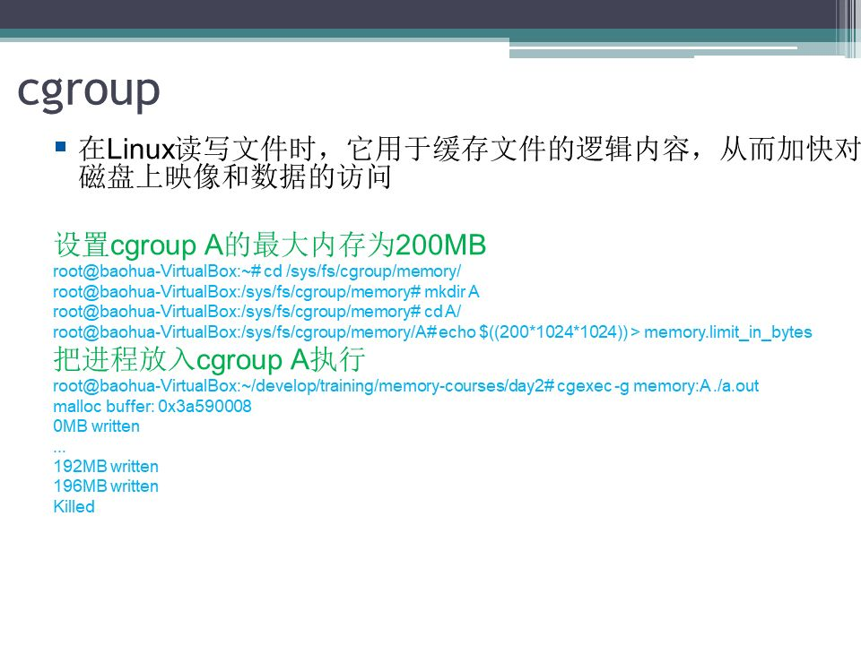

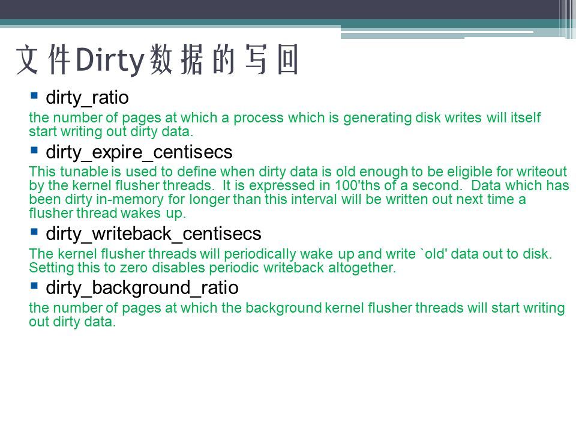

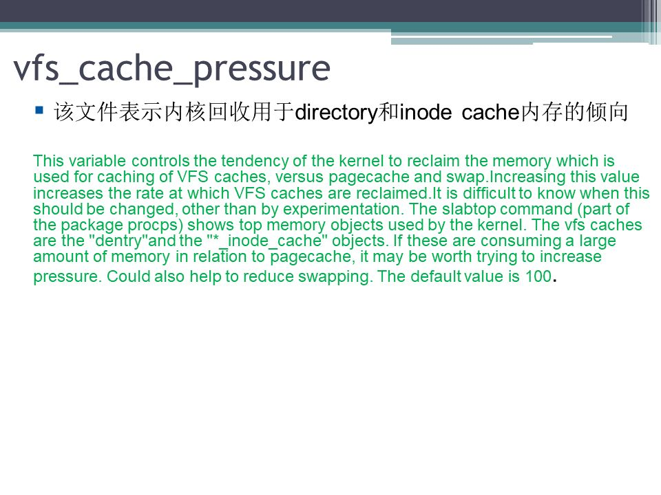

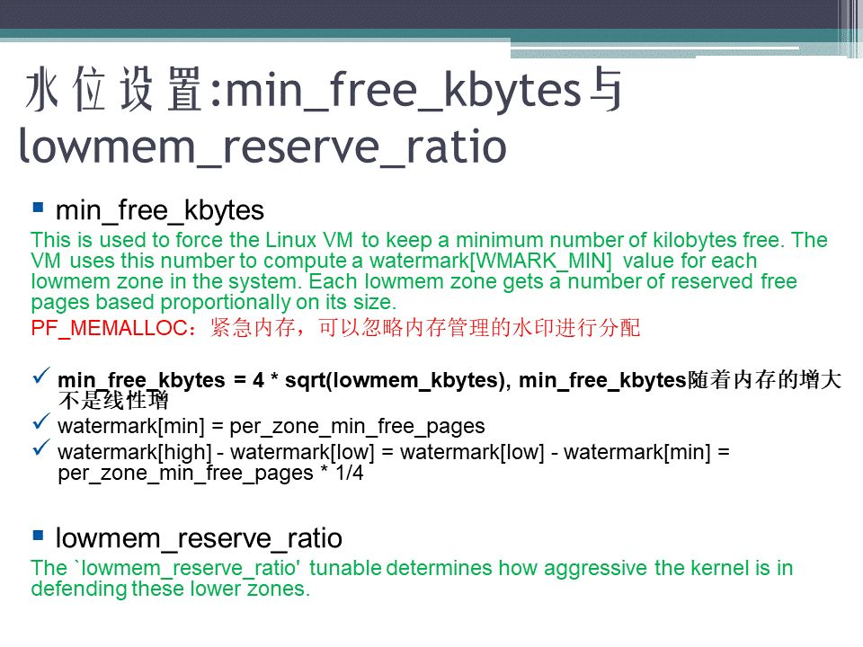

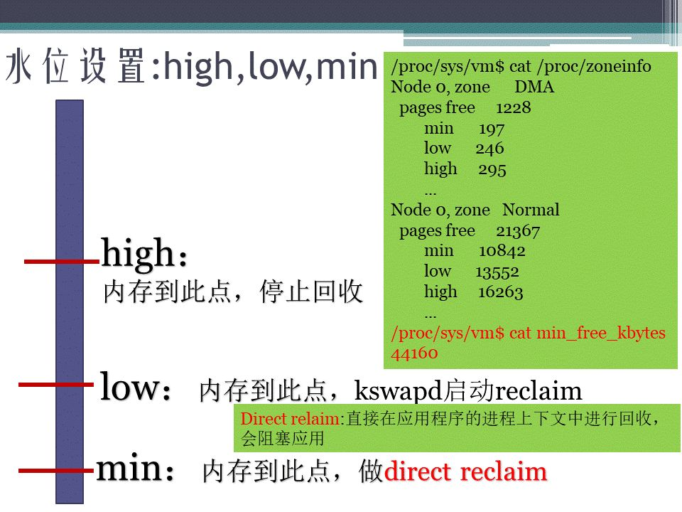

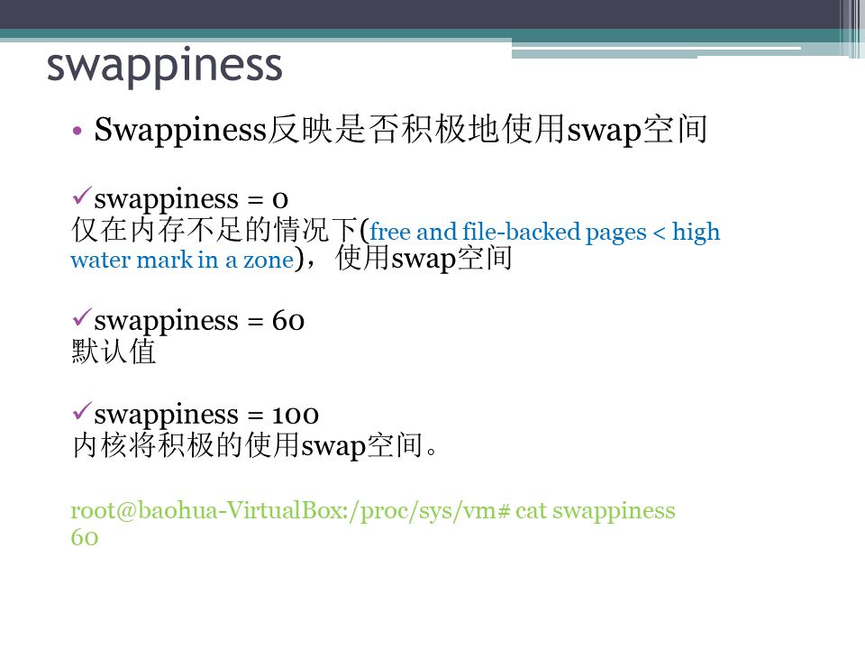

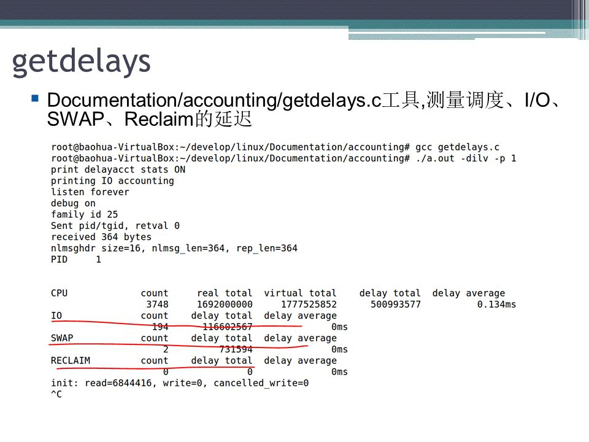

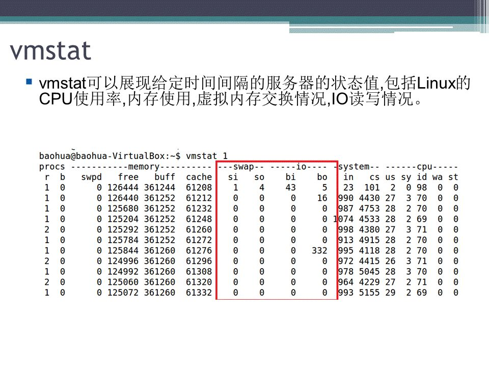

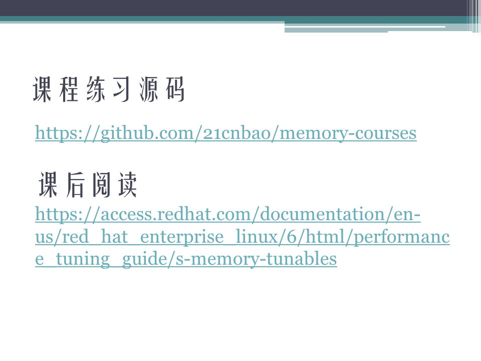

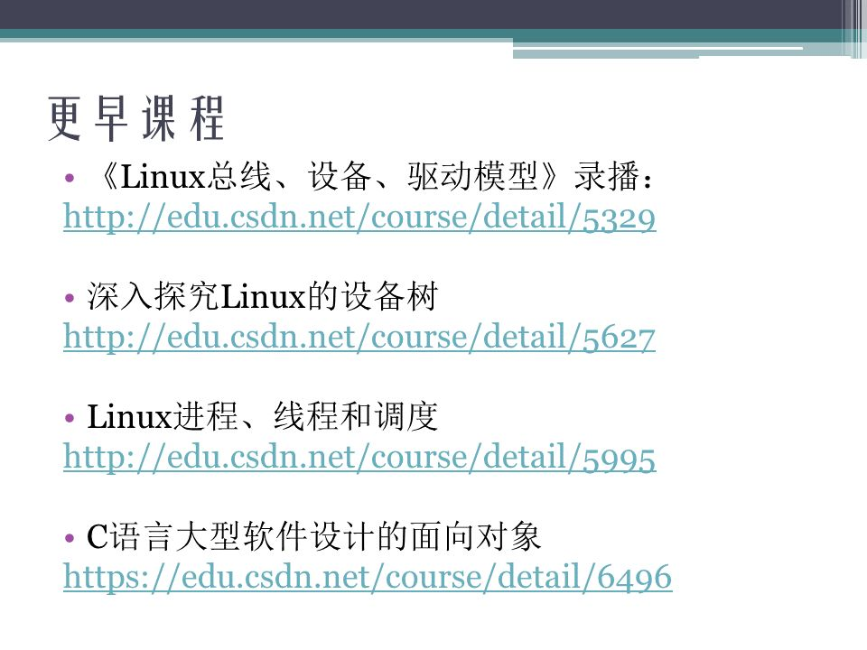

## 参考

[Linux任督二脉之内存管理(五) PPT-CSDN博客](https://blog.csdn.net/juS3Ve/article/details/79350602?spm=1001.2101.3001.6650.5&utm_medium=distribute.pc_relevant.none-task-blog-2~default~BlogCommendFromBaidu~Rate-5-79350602-blog-106021469.235^v43^control&depth_1-utm_source=distribute.pc_relevant.none-task-blog-2~default~BlogCommendFromBaidu~Rate-5-79350602-blog-106021469.235^v43^control&utm_relevant_index=8)