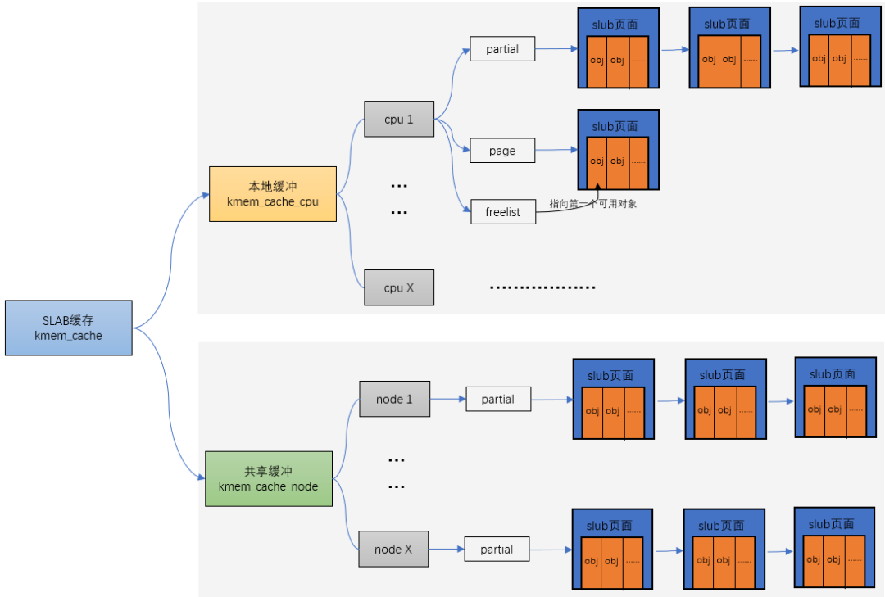

# 万字整理，肝翻Linux内存管理所有知识点

## Linux内存管理之CPU访问内存的过程

我喜欢用图的方式来说明问题，简单直接：


蓝色部分是cpu，灰色部分是内存，白色部分就是cpu访问内存的过程，也是地址转换的过程。在解释地址转换的本质前我们先理解下几个概念：

1.  TLB：MMU工作的过程就是查询页表的过程。如果把页表放在内存中查询的时候开销太大，因此为了提高查找效率，专门用一小片访问更快的区域存放地址转换条目。（当页表内容有变化的时候，需要清除TLB，以防止地址映射出错。）
    
2.  Caches：cpu和内存之间的缓存机制，用于提高访问速率，armv8架构的话上图的caches其实是L2 Cache，这里就不做进一步解释了。
    

### 虚拟地址转换为物理地址的本质

我们知道内核中的寻址空间大小是由CONFIG\_ARM64\_VA\_BITS控制的，这里以48位为例，ARMv8中，Kernel Space的页表基地址存放在TTBR1\_EL1寄存器中，User Space页表基地址存放在TTBR0\_EL0寄存器中，其中内核地址空间的高位为全1，(0xFFFF0000\_00000000 ~ 0xFFFFFFFF\_FFFFFFFF)，用户地址空间的高位为全0，(0x00000000\_00000000 ~ 0x0000FFFF\_FFFFFFFF)


有了宏观概念，下面我们以内核态寻址过程为例看下是如何把虚拟地址转换为物理地址的。

我们知道linux采用了分页机制，通常采用四级页表，页全局目录(PGD)，页上级目录(PUD)，页中间目录(PMD)，页表(PTE)。如下：

1.  MMU根据虚拟地址的最高位判断用哪个页表基地址做为访问的起点。最高位是0时，使用TTBR0\_EL0作为起点，表示访问用户空间地址；最高位时1时，使用TTBR1\_EL1作为起点，表示访问内核空间地址。MMU从相应的页表基地址寄存器TTBR0\_EL0或者TTBR1\_EL1，获取PGD页全局目录基地址。
    


2.  找到PGD后，从虚拟地址中找到PGD index，通过PGD index找到页上级目录PUD基地址。
    
3.  找到PUD后，从虚拟地址中找到PUD index，通过PUD index找到页中间目录PMD基地址。
    
4.  找到PMD后，从虚拟地址中找到PDM index，通过PMD index找到页表项PTE基地址。
    
5.  找到PTE后，从虚拟地址中找到PTE index，通过PTE index找到页表项PTE。
    
6.  从页表项PTE中取出物理页帧号PFN，然后加上页内偏移VA\[11,0\]，就组成了最终的物理地址PA。
    

整个过程是比较机械的，每次转换先获取物理页基地址，再从线性地址中获取索引，合成物理地址后再访问内存。不管是页表还是要访问的数据都是以页为单位存放在主存中的，因此每次访问内存时都要先获得基址，再通过索引(或偏移)在页内访问数据，因此可以将线性地址看作是若干个索引的集合。

  

## Linux内存初始化

有了armv8架构访问内存的理解，我们来看下linux在内存这块的初始化就更容易理解了。

### 创建启动页表：

在汇编代码阶段的head.S文件中，负责创建映射关系的函数是create\_page\_tables。create\_page\_tables函数负责identity mapping和kernel image mapping。

-   identity map：是指把idmap\_text区域的物理地址映射到相等的虚拟地址上，这种映射完成后，其虚拟地址等于物理地址。idmap\_text区域都是一些打开MMU相关的代码。
    
-   kernel image map：将kernel运行需要的地址（kernel txt、rodata、data、bss等等）进行映射。
    

```C
arch/arm64/kernel/head.S:
ENTRY(stext)
        bl      preserve_boot_args
        bl      el2_setup                       // Drop to EL1, w0=cpu_boot_mode
        adrp    x23, __PHYS_OFFSET
        and     x23, x23, MIN_KIMG_ALIGN - 1    // KASLR offset, defaults to 0
        bl      set_cpu_boot_mode_flag
        bl      __create_page_tables
        /*
         * The following calls CPU setup code, see arch/arm64/mm/proc.S for
         * details.
         * On return, the CPU will be ready for the MMU to be turned on and
         * the TCR will have been set.
         */
        bl      __cpu_setup                     // initialise processor
        b       __primary_switch
ENDPROC(stext)
```

__create_page_tables主要执行的就是identity map和kernel image map：

```C
 __create_page_tables:
......
        create_pgd_entry x0, x3, x5, x6
        mov     x5, x3                          // __pa(__idmap_text_start)
        adr_l   x6, __idmap_text_end            // __pa(__idmap_text_end)
        create_block_map x0, x7, x3, x5, x6

        /*
         * Map the kernel image (starting with PHYS_OFFSET).
         */
        adrp    x0, swapper_pg_dir
        mov_q   x5, KIMAGE_VADDR + TEXT_OFFSET  // compile time __va(_text)
        add     x5, x5, x23                     // add KASLR displacement
        create_pgd_entry x0, x5, x3, x6
        adrp    x6, _end                        // runtime __pa(_end)
        adrp    x3, _text                       // runtime __pa(_text)
        sub     x6, x6, x3                      // _end - _text
        add     x6, x6, x5                      // runtime __va(_end)
        create_block_map x0, x7, x3, x5, x6
 ......
```

其中调用create\_pgd\_entry进行PGD及所有中间level(PUD, PMD)页表的创建，调用create\_block\_map进行PTE页表的映射。关于四级页表的关系如下图所示，这里就不进一步解释了。

汇编结束后的内存映射关系如下图所示：


等内存初始化后就可以进入真正的内存管理了，初始化我总结了一下，大体分为四步：

1.  物理内存进系统前
    
2.  用memblock模块来对内存进行管理
    
3.  页表映射
    
4.  zone初始化
    

### Linux是如何组织物理内存的？

-   node 目前计算机系统有两种体系结构：
    

1.  非一致性内存访问 NUMA（Non-Uniform Memory Access）意思是内存被划分为各个node，访问一个node花费的时间取决于CPU离这个node的距离。每一个cpu内部有一个本地的node，访问本地node时间比访问其他node的速度快
    
2.  一致性内存访问 UMA（Uniform Memory Access）也可以称为SMP（Symmetric Multi-Process）对称多处理器。意思是所有的处理器访问内存花费的时间是一样的。也可以理解整个内存只有一个node。
    

-   zone
    

ZONE的意思是把整个物理内存划分为几个区域，每个区域有特殊的含义

-   page
    

代表一个物理页，在内核中一个物理页用一个struct page表示。

-   page frame
    

为了描述一个物理page，内核使用struct page结构来表示一个物理页。假设一个page的大小是4K的，内核会将整个物理内存分割成一个一个4K大小的物理页，而4K大小物理页的区域我们称为page frame


-   page frame num(pfn)
    

pfn是对每个page frame的编号。故物理地址和pfn的关系是：

物理地址>>PAGE\_SHIFT = pfn

-   pfn和page的关系
    

内核中支持了好几个内存模型：CONFIG\_FLATMEM（平坦内存模型）CONFIG\_DISCONTIGMEM（不连续内存模型）CONFIG\_SPARSEMEM\_VMEMMAP（稀疏的内存模型）目前ARM64使用的稀疏的类型模式。

系统启动的时候，内核会将整个struct page映射到内核虚拟地址空间vmemmap的区域，所以我们可以简单的认为struct page的基地址是vmemmap，则：

vmemmap+pfn的地址就是此struct page对应的地址。

## Linux分区页框分配器

页框分配在内核里的机制我们叫做分区页框分配器(zoned page frame allocator)，在linux系统中，分区页框分配器管理着所有物理内存，无论你是内核还是进程，都需要请求分区页框分配器，这时才会分配给你应该获得的物理内存页框。当你所拥有的页框不再使用时，你必须释放这些页框，让这些页框回到管理区页框分配器当中。

有时候目标管理区不一定有足够的页框去满足分配，这时候系统会从另外两个管理区中获取要求的页框，但这是按照一定规则去执行的，如下：

-   如果要求从DMA区中获取，就只能从ZONE\_DMA区中获取。
    
-   如果没有规定从哪个区获取，就按照顺序从 ZONE\_NORMAL -> ZONE\_DMA 获取。
    
-   如果规定从HIGHMEM区获取，就按照顺序从 ZONE\_HIGHMEM -> ZONE\_NORMAL -> ZONE\_DMA 获取。
    


内核中根据不同的分配需求有6个函数接口来请求页框，最终都会调用到\_\_alloc\_pages\_nodemask。


```
struct page *
__alloc_pages_nodemask(gfp_t gfp_mask, unsigned int order, int preferred_nid,
       nodemask_t *nodemask)
{
  page = get_page_from_freelist(alloc_mask, order, alloc_flags, &ac);//fastpath分配页面：从pcp(per_cpu_pages)和伙伴系统中正常的分配内存空间
  ......
  page = __alloc_pages_slowpath(alloc_mask, order, &ac);//slowpath分配页面：如果上面没有分配到空间，调用下面函数慢速分配，允许等待和回收
  ......
}
```

在页面分配时，有两种路径可以选择，如果在快速路径中分配成功了，则直接返回分配的页面；快速路径分配失败则选择慢速路径来进行分配。总结如下：

-   正常分配（或叫快速分配）：
    

1.  如果分配的是单个页面，考虑从per CPU缓存中分配空间，如果缓存中没有页面，从伙伴系统中提取页面做补充。
    
2.  分配多个页面时，从指定类型中分配，如果指定类型中没有足够的页面，从备用类型链表中分配。最后会试探保留类型链表。
    

-   慢速（允许等待和页面回收）分配：
    

1.  当上面两种分配方案都不能满足要求时，考虑页面回收、杀死进程等操作后在试。
    

## Linux页框分配器之伙伴算法

```C
static struct page *
get_page_from_freelist(gfp_t gfp_mask, unsigned int order, int alloc_flags,
      const struct alloc_context *ac)
{
  for_next_zone_zonelist_nodemask(zone, z, ac->zonelist, ac->high_zoneidx, ac->nodemask)
  {
    if (!zone_watermark_fast(zone, order, mark, ac_classzone_idx(ac), alloc_flags))
    {
      ret = node_reclaim(zone->zone_pgdat, gfp_mask, order); 
      switch (ret) {
      case NODE_RECLAIM_NOSCAN:
        continue;
      case NODE_RECLAIM_FULL:
        continue;
      default:
        if (zone_watermark_ok(zone, order, mark, ac_classzone_idx(ac), alloc_flags))
          goto try_this_zone;

        continue;
      }
    }
    
try_this_zone: //本zone正常水位
    page = rmqueue(ac->preferred_zoneref->zone, zone, order, gfp_mask, alloc_flags, ac->migratetype);
  }
  
  return NULL;
}
```

首先遍历当前zone，按照HIGHMEM->NORMAL的方向进行遍历，判断当前zone是否能够进行内存分配的条件是首先判断free memory是否满足low water mark水位值，如果不满足则进行一次快速的内存回收操作，然后再次检测是否满足low water mark，如果还是不能满足，相同步骤遍历下一个zone，满足的话进入正常的分配情况，即rmqueue函数，这也是伙伴系统的核心。

### Buddy 分配算法

在看函数前，我们先看下算法，因为我一直认为有了“道”的理解才好进一步理解“术”。


假设这是一段连续的页框，阴影部分表示已经被使用的页框，现在需要申请一个连续的5个页框。这个时候，在这段内存上不能找到连续的5个空闲的页框，就会去另一段内存上去寻找5个连续的页框，这样子，久而久之就形成了页框的浪费。为了避免出现这种情况，Linux内核中引入了伙伴系统算法(Buddy system)。把所有的空闲页框分组为11个块链表，每个块链表分别包含大小为1，2，4，8，16，32，64，128，256，512和1024个连续页框的页框块。最大可以申请1024个连续页框，对应4MB大小的连续内存。每个页框块的第一个页框的物理地址是该块大小的整数倍，如图：


假设要申请一个256个页框的块，先从256个页框的链表中查找空闲块，如果没有，就去512个页框的链表中找，找到了则将页框块分为2个256个页框的块，一个分配给应用，另外一个移到256个页框的链表中。如果512个页框的链表中仍没有空闲块，继续向1024个页框的链表查找，如果仍然没有，则返回错误。页框块在释放时，会主动将两个连续的页框块合并为一个较大的页框块。

从上面可以知道Buddy算法一直在对页框做拆开合并拆开合并的动作。Buddy算法牛逼就牛逼在运用了世界上任何正整数都可以由2^n的和组成。这也是Buddy算法管理空闲页表的本质。空闲内存的信息我们可以通过以下命令获取：


也可以通过echo m > /proc/sysrq-trigger来观察buddy状态，与/proc/buddyinfo的信息是一致的：


### Buddy 分配函数

```
static inline
struct page *rmqueue(struct zone *preferred_zone,
   struct zone *zone, unsigned int order,
   gfp_t gfp_flags, unsigned int alloc_flags,
   int migratetype)
{
  if (likely(order == 0)) { //如果order=0则从pcp中分配
    page = rmqueue_pcplist(preferred_zone, zone, order, gfp_flags, migratetype);
 }
  do {
    page = NULL;
    if (alloc_flags & ALLOC_HARDER) {//如果分配标志中设置了ALLOC_HARDER，则从free_list[MIGRATE_HIGHATOMIC]的链表中进行页面分配
        page = __rmqueue_smallest(zone, order, MIGRATE_HIGHATOMIC);
    }
    if (!page) //前两个条件都不满足，则在正常的free_list[MIGRATE_*]中进行分配
      page = __rmqueue(zone, order, migratetype);
  } while (page && check_new_pages(page, order));
  ......
}
```


## Linux分区页框分配器之水位

我们讲页框分配器的时候讲到了快速分配和慢速分配，其中伙伴算法是在快速分配里做的，忘记的小伙伴我们再看下：

```C
static struct page *
get_page_from_freelist(gfp_t gfp_mask, unsigned int order, int alloc_flags,
      const struct alloc_context *ac)
{
  for_next_zone_zonelist_nodemask(zone, z, ac->zonelist, ac->high_zoneidx, ac->nodemask)
  {
    if (!zone_watermark_fast(zone, order, mark, ac_classzone_idx(ac), alloc_flags))
    {
      ret = node_reclaim(zone->zone_pgdat, gfp_mask, order); 
      switch (ret) {
      case NODE_RECLAIM_NOSCAN:
        continue;
      case NODE_RECLAIM_FULL:
        continue;
      default:
        if (zone_watermark_ok(zone, order, mark, ac_classzone_idx(ac), alloc_flags))
          goto try_this_zone;

        continue;
      }
    }
    
try_this_zone: //本zone正常水位
    page = rmqueue(ac->preferred_zoneref->zone, zone, order, gfp_mask, alloc_flags, ac->migratetype);
  }
  
  return NULL;
}
```

可以看到在进行伙伴算法分配前有个关于水位的判断，今天我们就看下水位的概念。

简单的说在使用分区页面分配器中会将可以用的free pages与zone里的水位(watermark)进行比较。

### 水位初始化

-   nr\_free\_buffer\_pages 是获取ZONE\_DMA和ZONE\_NORMAL区中高于high水位的总页数nr\_free\_buffer\_pages = managed\_pages - high\_pages
    
-   min\_free\_kbytes 是总的min大小，min\_free\_kbytes = 4 \* sqrt(lowmem\_kbytes)
    
-   setup\_per\_zone\_wmarks 根据总的min值，再加上各个zone在总内存中的占比，然后通过do\_div就计算出他们各自的min值，进而计算出各个zone的水位大小。min,low,high的关系如下：low = min \*125%;
    
-   high = min \* 150%
    
-   min:low:high = 4:5:6
    
-   setup\_per\_zone\_lowmem\_reserve 当从Normal失败后，会尝试从DMA申请分配，通过lowmem\_reserve\[DMA\]，限制来自Normal的分配请求。其值可以通过/proc/sys/vm/lowmem\_reserve\_ratio来修改。
    


从这张图可以看出：

-   如果空闲页数目min值，则该zone非常缺页，页面回收压力很大，应用程序写内存操作就会被阻塞，直接在应用程序的进程上下文中进行回收，即direct reclaim。
    
-   如果空闲页数目小于low值，kswapd线程将被唤醒，并开始释放回收页面。
    
-   如果空闲页面的值大于high值，则该zone的状态很完美, kswapd线程将重新休眠。
    

## Linux页框分配器之内存碎片化整理

### 什么是内存碎片化

Linux物理内存碎片化包括两种：内部碎片化和外部碎片化。

-   内部碎片化：
    

指分配给用户的内存空间中未被使用的部分。例如进程需要使用3K bytes物理内存，于是向系统申请了大小等于3Kbytes的内存，但是由于Linux内核伙伴系统算法最小颗粒是4K bytes，所以分配的是4Kbytes内存，那么其中1K bytes未被使用的内存就是内存内碎片。

-   外部碎片化：
    

指系统中无法利用的小内存块。例如系统剩余内存为16K bytes，但是这16K bytes内存是由4个4K bytes的页面组成，即16K内存物理页帧号#1不连续。在系统剩余16K bytes内存的情况下，系统却无法成功分配大于4K的连续物理内存，该情况就是内存外碎片导致。

### 碎片化整理算法

Linux内存对碎片化的整理算法主要应用了内核的页面迁移机制，是一种将可移动页面进行迁移后腾出连续物理内存的方法。

假设存在一个非常小的内存域如下：


蓝色表示空闲的页面，白色表示已经被分配的页面，可以看到如上内存域的空闲页面（蓝色）非常零散，无法分配大于两页的连续物理内存。

下面演示一下内存规整的简化工作原理，内核会运行两个独立的扫描动作：第一个扫描从内存域的底部开始，一边扫描一边将已分配的可移动（MOVABLE）页面记录到一个列表中：


另外第二扫描是从内存域的顶部开始，扫描可以作为页面迁移目标的空闲页面位置，然后也记录到一个列表里面：


等两个扫描在域中间相遇，意味着扫描结束，然后将左边扫描得到的已分配的页面迁移到右边空闲的页面中，左边就形成了一段连续的物理内存，完成页面规整。


### 碎片化整理的三种方式

```C
static struct page *
__alloc_pages_direct_compact(gfp_t gfp_mask, unsigned int order,
  unsigned int alloc_flags, const struct alloc_context *ac,
  enum compact_priority prio, enum compact_result *compact_result)
{
 struct page *page;
 unsigned int noreclaim_flag;

 if (!order)
  return NULL;

 noreclaim_flag = memalloc_noreclaim_save();
 *compact_result = try_to_compact_pages(gfp_mask, order, alloc_flags, ac,
         prio);
 memalloc_noreclaim_restore(noreclaim_flag);

 if (*compact_result <= COMPACT_INACTIVE)
  return NULL;

 count_vm_event(COMPACTSTALL);

 page = get_page_from_freelist(gfp_mask, order, alloc_flags, ac);

 if (page) {
  struct zone *zone = page_zone(page);

  zone->compact_blockskip_flush = false;
  compaction_defer_reset(zone, order, true);
  count_vm_event(COMPACTSUCCESS);
  return page;
 }

 count_vm_event(COMPACTFAIL);

 cond_resched();

 return NULL;
}
```

在linux内核里一共有3种方式可以碎片化整理，我们总结如下：


## Linux slab分配器

在Linux中，伙伴系统是以页为单位分配内存。但是现实中很多时候却以字节为单位，不然申请10Bytes内存还要给1页的话就太浪费了。slab分配器就是为小内存分配而生的。slab分配器分配内存以Byte为单位。但是slab分配器并没有脱离伙伴系统，而是基于伙伴系统分配的大内存进一步细分成小内存分配。

他们之间的关系可以用一张图来描述：



### 流程分析

kmem\_cache\_alloc 主要四步：

1.  先从 kmem\_cache\_cpu->freelist中分配，如果freelist为null
    


2.  接着去 kmem\_cache\_cpu->partital链表中分配，如果此链表为null
    


3.  接着去 kmem\_cache\_node->partital链表分配，如果此链表为null
    


4.  重新分配一个slab。
    

## Linux 内存管理之vmalloc

根据前面的系列文章，我们知道了buddy system是基于页框分配器，kmalloc是基于slab分配器，而且这些分配的地址都是物理内存连续的。但是随着碎片化的积累，连续物理内存的分配就会变得困难，对于那些非DMA访问，不一定非要连续物理内存的话完全可以像malloc那样，将不连续的物理内存页框映射到连续的虚拟地址空间中，这就是vmap的来源）（提供把离散的page映射到连续的虚拟地址空间），vmalloc的分配就是基于这个机制来实现的。


vmalloc最小分配一个page，并且分配到的页面不保证是连续的，因为vmalloc内部调用alloc\_page多次分配单个页面。


vmalloc的区域就是在上图中VMALLOC\_START - VMALLOC\_END之间，可通过/proc/vmallocinfo查看。


### vmalloc流程

主要分以下三步：

1.  从VMALLOC\_START到VMALLOC\_END查找空闲的虚拟地址空间(hole)
    
2.  根据分配的size,调用alloc\_page依次分配单个页面.
    
3.  把分配的单个页面，映射到第一步中找到的连续的虚拟地址。把分配的单个页面，映射到第一步中找到的连续的虚拟地址。
    


## Linux进程的内存管理之缺页异常

当进程访问这些还没建立映射关系的虚拟地址时，处理器会自动触发缺页异常。

ARM64把异常分为同步异常和异步异常，通常异步异常指的是中断（可看《上帝视角看中断》），同步异常指的是异常。关于ARM异常处理的文章可参考《ARMv8异常处理简介》。

当处理器有异常发生时，处理器会先跳转到ARM64的异常向量表中：

```C
ENTRY(vectors)
 kernel_ventry 1, sync_invalid   // Synchronous EL1t
 kernel_ventry 1, irq_invalid   // IRQ EL1t
 kernel_ventry 1, fiq_invalid   // FIQ EL1t
 kernel_ventry 1, error_invalid  // Error EL1t

 kernel_ventry 1, sync    // Synchronous EL1h
 kernel_ventry 1, irq    // IRQ EL1h
 kernel_ventry 1, fiq_invalid   // FIQ EL1h
 kernel_ventry 1, error_invalid  // Error EL1h

 kernel_ventry 0, sync    // Synchronous 64-bit EL0
 kernel_ventry 0, irq    // IRQ 64-bit EL0
 kernel_ventry 0, fiq_invalid   // FIQ 64-bit EL0
 kernel_ventry 0, error_invalid  // Error 64-bit EL0

#ifdef CONFIG_COMPAT
 kernel_ventry 0, sync_compat, 32  // Synchronous 32-bit EL0
 kernel_ventry 0, irq_compat, 32  // IRQ 32-bit EL0
 kernel_ventry 0, fiq_invalid_compat, 32 // FIQ 32-bit EL0
 kernel_ventry 0, error_invalid_compat, 32 // Error 32-bit EL0
#else
 kernel_ventry 0, sync_invalid, 32  // Synchronous 32-bit EL0
 kernel_ventry 0, irq_invalid, 32  // IRQ 32-bit EL0
 kernel_ventry 0, fiq_invalid, 32  // FIQ 32-bit EL0
 kernel_ventry 0, error_invalid, 32  // Error 32-bit EL0
#endif
END(vectors)
```

以el1下的异常为例，当跳转到el1\_sync函数时，读取ESR的值以判断异常类型。根据类型跳转到不同的处理函数里，如果是data abort的话跳转到el1\_da函数里，instruction abort的话跳转到el1\_ia函数里：

```
el1_sync:
 kernel_entry 1
 mrs x1, esr_el1   // read the syndrome register
 lsr x24, x1, #ESR_ELx_EC_SHIFT // exception class
 cmp x24, #ESR_ELx_EC_DABT_CUR // data abort in EL1
 b.eq el1_da
 cmp x24, #ESR_ELx_EC_IABT_CUR // instruction abort in EL1
 b.eq el1_ia
 cmp x24, #ESR_ELx_EC_SYS64  // configurable trap
 b.eq el1_undef
 cmp x24, #ESR_ELx_EC_SP_ALIGN // stack alignment exception
 b.eq el1_sp_pc
 cmp x24, #ESR_ELx_EC_PC_ALIGN // pc alignment exception
 b.eq el1_sp_pc
 cmp x24, #ESR_ELx_EC_UNKNOWN // unknown exception in EL1
 b.eq el1_undef
 cmp x24, #ESR_ELx_EC_BREAKPT_CUR // debug exception in EL1
 b.ge el1_dbg
 b el1_inv
```

流程图如下：


### do\_page\_fault

```C
static int __do_page_fault(struct mm_struct *mm, unsigned long addr,
      unsigned int mm_flags, unsigned long vm_flags,
      struct task_struct *tsk)
{
 struct vm_area_struct *vma;
 int fault;

 vma = find_vma(mm, addr);
 fault = VM_FAULT_BADMAP; //没有找到vma区域，说明addr还没有在进程的地址空间中
 if (unlikely(!vma))
  goto out;
 if (unlikely(vma->vm_start > addr))
  goto check_stack;

 /*
  * Ok, we have a good vm_area for this memory access, so we can handle
  * it.
  */
good_area://一个好的vma
 /*
  * Check that the permissions on the VMA allow for the fault which
  * occurred.
  */
 if (!(vma->vm_flags & vm_flags)) {//权限检查
  fault = VM_FAULT_BADACCESS; 
  goto out;
 }

 //重新建立物理页面到VMA的映射关系
 return handle_mm_fault(vma, addr & PAGE_MASK, mm_flags);

check_stack:
 if (vma->vm_flags & VM_GROWSDOWN && !expand_stack(vma, addr))
  goto good_area;
out:
 return fault;
}
```

从\_\_do\_page\_fault函数能看出来，当触发异常的虚拟地址属于某个vma，并且拥有触发页错误异常的权限时，会调用到handle\_mm\_fault函数来建立vma和物理地址的映射，而handle\_mm\_fault函数的主要逻辑是通过\_\_handle\_mm\_fault来实现的。

### \_\_handle\_mm\_fault

```C
static int __handle_mm_fault(struct vm_area_struct *vma, unsigned long address,
  unsigned int flags)
{
  ......
 //查找页全局目录，获取地址对应的表项
 pgd = pgd_offset(mm, address);
 //查找页四级目录表项，没有则创建
 p4d = p4d_alloc(mm, pgd, address);
 if (!p4d)
  return VM_FAULT_OOM;

 //查找页上级目录表项，没有则创建
 vmf.pud = pud_alloc(mm, p4d, address);
 ......
 //查找页中级目录表项，没有则创建
 vmf.pmd = pmd_alloc(mm, vmf.pud, address);
  ......
 //处理pte页表
 return handle_pte_fault(&vmf);
}
```


### do\_anonymous\_page

匿名页缺页异常，对于匿名映射，映射完成之后，只是获得了一块虚拟内存，并没有分配物理内存，当第一次访问的时候：

1.  如果是读访问，会将虚拟页映射到０页，以减少不必要的内存分配
    
2.  如果是写访问，用alloc\_zeroed\_user\_highpage\_movable分配新的物理页，并用０填充，然后映射到虚拟页上去
    
3.  如果是先读后写访问，则会发生两次缺页异常：第一次是匿名页缺页异常的读的处理（虚拟页到0页的映射），第二次是写时复制缺页异常处理。
    

从上面的总结我们知道，第一次访问匿名页时有三种情况，其中第一种和第三种情况都会涉及到0页。

### do\_fault


### do\_swap\_page

上面已经讲过，pte对应的内容不为0(页表项存在)，但是pte所对应的page不在内存中时，表示此时pte的内容所对应的页面在swap空间中，缺页异常时会通过do\_swap\_page()函数来分配页面。

do\_swap\_page发生在swap in的时候，即查找磁盘上的slot，并将数据读回。

换入的过程如下：

1.  查找swap cache中是否存在所查找的页面，如果存在，则根据swap cache引用的内存页，重新映射并更新页表；如果不存在，则分配新的内存页，并添加到swap cache的引用中，更新内存页内容完成后，更新页表。
    
2.  换入操作结束后，对应swap area的页引用减1，当减少到0时，代表没有任何进程引用了该页，可以进行回收。
    

```C
int do_swap_page(struct vm_fault *vmf)
{
  ......
 //根据pte找到swap entry, swap entry和pte有一个对应关系
 entry = pte_to_swp_entry(vmf->orig_pte);
  ......
 if (!page)
  //根据entry从swap缓存中查找页, 在swapcache里面寻找entry对应的page
  //Lookup a swap entry in the swap cache
  page = lookup_swap_cache(entry, vma_readahead ? vma : NULL,
      vmf->address);
 //没有找到页
 if (!page) {
  if (vma_readahead)
   page = do_swap_page_readahead(entry,
    GFP_HIGHUSER_MOVABLE, vmf, &swap_ra);
  else
   //如果swapcache里面找不到就在swap area里面找，分配新的内存页并从swap area中读入
   page = swapin_readahead(entry,
    GFP_HIGHUSER_MOVABLE, vma, vmf->address);
  ......
 //获取一个pte的entry，重新建立映射
 vmf->pte = pte_offset_map_lock(vma->vm_mm, vmf->pmd, vmf->address,
   &vmf->ptl);
  ......
 //anonpage数加1，匿名页从swap空间交换出来，所以加1
 //swap page个数减1，由page和VMA属性创建一个新的pte
 inc_mm_counter_fast(vma->vm_mm, MM_ANONPAGES);
 dec_mm_counter_fast(vma->vm_mm, MM_SWAPENTS);
 pte = mk_pte(page, vma->vm_page_prot);
  ......
 flush_icache_page(vma, page);
 if (pte_swp_soft_dirty(vmf->orig_pte))
  pte = pte_mksoft_dirty(pte);
 //将新生成的PTE entry添加到硬件页表中
 set_pte_at(vma->vm_mm, vmf->address, vmf->pte, pte);
 vmf->orig_pte = pte;
 //根据page是否为swapcache
 if (page == swapcache) {
  //如果是，将swap缓存页用作anon页，添加反向映射rmap中
  do_page_add_anon_rmap(page, vma, vmf->address, exclusive);
  mem_cgroup_commit_charge(page, memcg, true, false);
  //并添加到active链表中
  activate_page(page);
 //如果不是
 } else { /* ksm created a completely new copy */
  //使用新页面并复制swap缓存页，添加反向映射rmap中
  page_add_new_anon_rmap(page, vma, vmf->address, false);
  mem_cgroup_commit_charge(page, memcg, false, false);
  //并添加到lru链表中
  lru_cache_add_active_or_unevictable(page, vma);
 }

 //释放swap entry
 swap_free(entry);
  ......
 if (vmf->flags & FAULT_FLAG_WRITE) {
  //有写请求则写时复制
  ret |= do_wp_page(vmf);
  if (ret & VM_FAULT_ERROR)
   ret &= VM_FAULT_ERROR;
  goto out;
 }
  ......
  return ret;
}
```


### do\_wp\_page

走到这里说明页面在内存中，只是PTE只有读权限，而又要写内存的时候就会触发do\_wp\_page。

do\_wp\_page函数用于处理写时复制（copy on write），其流程比较简单，主要是分配新的物理页，拷贝原来页的内容到新页，然后修改页表项内容指向新页并修改为可写(vma具备可写属性)。

```C
static int do_wp_page(struct vm_fault *vmf)
 __releases(vmf->ptl)
{
 struct vm_area_struct *vma = vmf->vma;

 //从页表项中得到页帧号，再得到页描述符，发生异常时地址所在的page结构
 vmf->page = vm_normal_page(vma, vmf->address, vmf->orig_pte);
 if (!vmf->page) {
  //没有page结构是使用页帧号的特殊映射
  /*
   * VM_MIXEDMAP !pfn_valid() case, or VM_SOFTDIRTY clear on a
   * VM_PFNMAP VMA.
   *
   * We should not cow pages in a shared writeable mapping.
   * Just mark the pages writable and/or call ops->pfn_mkwrite.
   */
  if ((vma->vm_flags & (VM_WRITE|VM_SHARED)) ==
         (VM_WRITE|VM_SHARED))
   //处理共享可写映射
   return wp_pfn_shared(vmf);

  pte_unmap_unlock(vmf->pte, vmf->ptl);
  //处理私有可写映射
  return wp_page_copy(vmf);
 }

 /*
  * Take out anonymous pages first, anonymous shared vmas are
  * not dirty accountable.
  */
 if (PageAnon(vmf->page) && !PageKsm(vmf->page)) {
  int total_map_swapcount;
  if (!trylock_page(vmf->page)) {
   //添加原来页的引用计数，方式被释放
   get_page(vmf->page);
   //释放页表锁
   pte_unmap_unlock(vmf->pte, vmf->ptl);
   lock_page(vmf->page);
   vmf->pte = pte_offset_map_lock(vma->vm_mm, vmf->pmd,
     vmf->address, &vmf->ptl);
   if (!pte_same(*vmf->pte, vmf->orig_pte)) {
    unlock_page(vmf->page);
    pte_unmap_unlock(vmf->pte, vmf->ptl);
    put_page(vmf->page);
    return 0;
   }
   put_page(vmf->page);
  }
  //单身匿名页面的处理
  if (reuse_swap_page(vmf->page, &total_map_swapcount)) {
   if (total_map_swapcount == 1) {
    /*
     * The page is all ours. Move it to
     * our anon_vma so the rmap code will
     * not search our parent or siblings.
     * Protected against the rmap code by
     * the page lock.
     */
    page_move_anon_rmap(vmf->page, vma);
   }
   unlock_page(vmf->page);
   wp_page_reuse(vmf);
   return VM_FAULT_WRITE;
  }
  unlock_page(vmf->page);
 } else if (unlikely((vma->vm_flags & (VM_WRITE|VM_SHARED)) ==
     (VM_WRITE|VM_SHARED))) {
  //共享可写，不需要复制物理页，设置页表权限即可
  return wp_page_shared(vmf);
 }

 /*
  * Ok, we need to copy. Oh, well..
  */
 get_page(vmf->page);

 pte_unmap_unlock(vmf->pte, vmf->ptl);
 //私有可写，复制物理页，将虚拟页映射到物理页
 return wp_page_copy(vmf);
}
```


## Linux 内存管理之CMA

CMA是reserved的一块内存，用于分配连续的大块内存。当设备驱动不用时，内存管理系统将该区域用于分配和管理可移动类型页面；当设备驱动使用时，此时已经分配的页面需要进行迁移，又用于连续内存分配；其用法与DMA子系统结合在一起充当DMA的后端，具体可参考《没有IOMMU的DMA操作》。

### CMA区域 cma\_areas 的创建

CMA区域的创建有两种方法，一种是通过dts的reserved memory，另外一种是通过command line参数和内核配置参数。

-   dts方式：
    

```
reserved-memory {
        /* global autoconfigured region for contiguous allocations */
        linux,cma {
                compatible = "shared-dma-pool";
                reusable;
                size = <0 0x28000000>;
                alloc-ranges = <0 0xa0000000 0 0x40000000>;
                linux,cma-default;
        };
};
```

device tree中可以包含reserved-memory node，系统启动的时候会打开rmem\_cma\_setup

RESERVEDMEM\_OF\_DECLARE(cma, "shared-dma-pool", rmem\_cma\_setup);

-   command line方式：cma=nn\[MG\]@\[start\[MG\]\[-end\[MG\]\]\]
    

```
tatic int __init early_cma(char *p)
{
 pr_debug("%s(%s)\n", __func__, p);
 size_cmdline = memparse(p, &p);
 if (*p != '@') {
  /*
  if base and limit are not assigned,
  set limit to high memory bondary to use low memory.
  */
  limit_cmdline = __pa(high_memory);
  return 0;
 }
 base_cmdline = memparse(p + 1, &p);
 if (*p != '-') {
  limit_cmdline = base_cmdline + size_cmdline;
  return 0;
 }
 limit_cmdline = memparse(p + 1, &p);

 return 0;
}
early_param("cma", early_cma);
```

系统在启动的过程中会把cmdline里的nn, start, end传给函数dma\_contiguous\_reserve，流程如下：

setup\_arch--->arm64\_memblock\_init--->dma\_contiguous\_reserve->dma\_contiguous\_reserve\_area->cma\_declare\_contiguous


### 将CMA区域添加到Buddy System

为了避免这块reserved的内存在不用时候的浪费，内存管理模块会将CMA区域添加到Buddy System中，用于可移动页面的分配和管理。CMA区域是通过cma\_init\_reserved\_areas接口来添加到Buddy System中的。

```
static int __init cma_init_reserved_areas(void)
{
 int i;

 for (i = 0; i < cma_area_count; i++) {
  int ret = cma_activate_area(&cma_areas[i]);

  if (ret)
   return ret;
 }

 return 0;
}
core_initcall(cma_init_reserved_areas);
```

其实现比较简单，主要分为两步：

1.  把该页面设置为MIGRATE\_CMA标志
    
2.  通过\_\_free\_pages将页面添加到buddy system中
    


### CMA分配

《没有IOMMU的DMA操作》里讲过，CMA是通过cma\_alloc分配的。cma\_alloc->alloc\_contig\_range(..., MIGRATE\_CMA,...)，向刚才释放给buddy system的MIGRATE\_CMA类型页面，重新“收集”过来。


用CMA的时候有一点需要注意：

也就是上图中黄色部分的判断。CMA内存在分配过程是一个比较“重”的操作，可能涉及页面迁移、页面回收等操作，因此不适合用于atomic context。比如之前遇到过一个问题，当内存不足的情况下，向U盘写数据的同时操作界面会出现卡顿的现象，这是因为CMA在迁移的过程中需要等待当前页面中的数据回写到U盘之后，才会进一步的规整为连续内存供gpu/display使用，从而出现卡顿的现象。


## 总结

至此，从CPU开始访问内存，到物理页的划分，再到内核页框分配器的实现，以及slab分配器的实现，最后到CMA等连续内存的使用，把Linux内存管理的知识串了起来，算是形成了整个闭环。相信如果掌握了本篇内容，肯定打开了Linux内核的大门，有了这个基石，接下来的内核学习会越来越轻松。

## 参考

[万字整理，肝翻Linux内存管理所有知识点-电子工程专辑 (eet-china.com)](https://www.eet-china.com/mp/a137508.html)