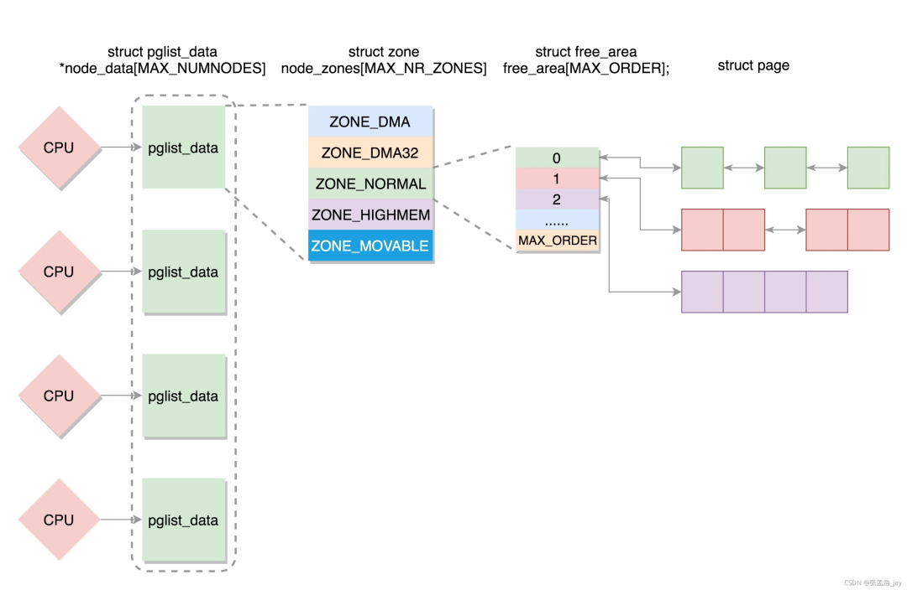
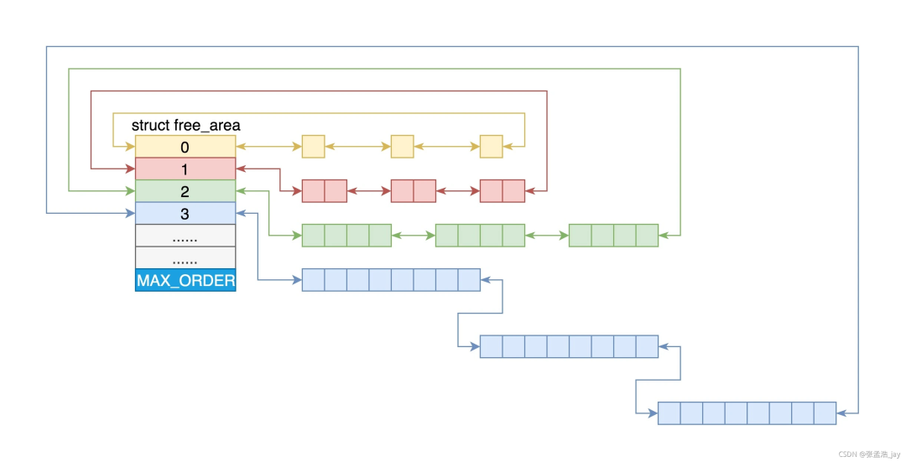
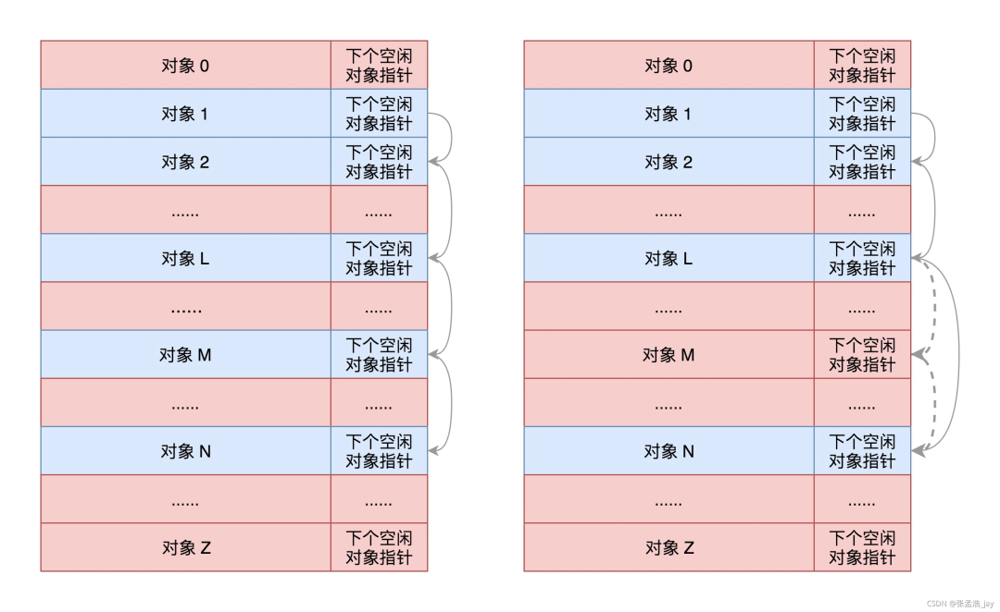
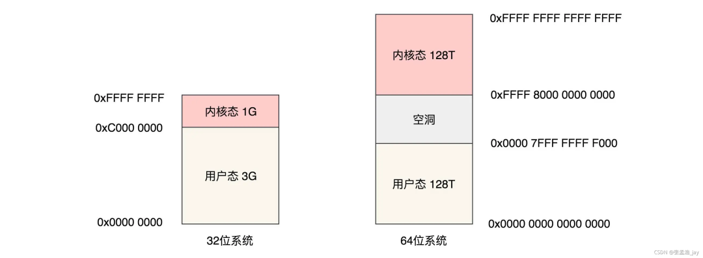
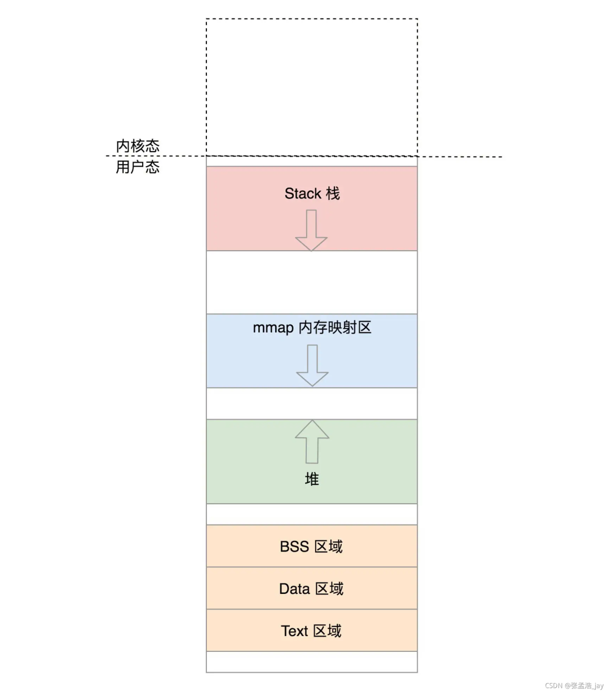
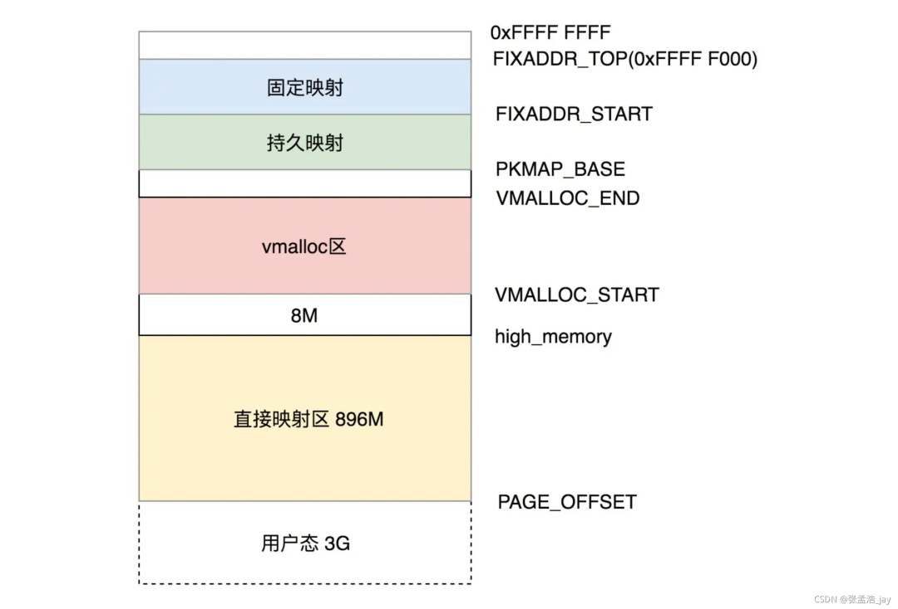
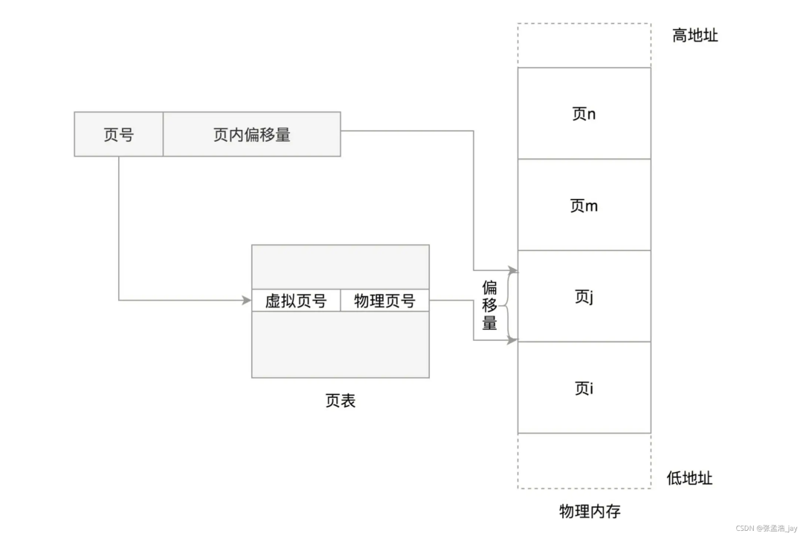
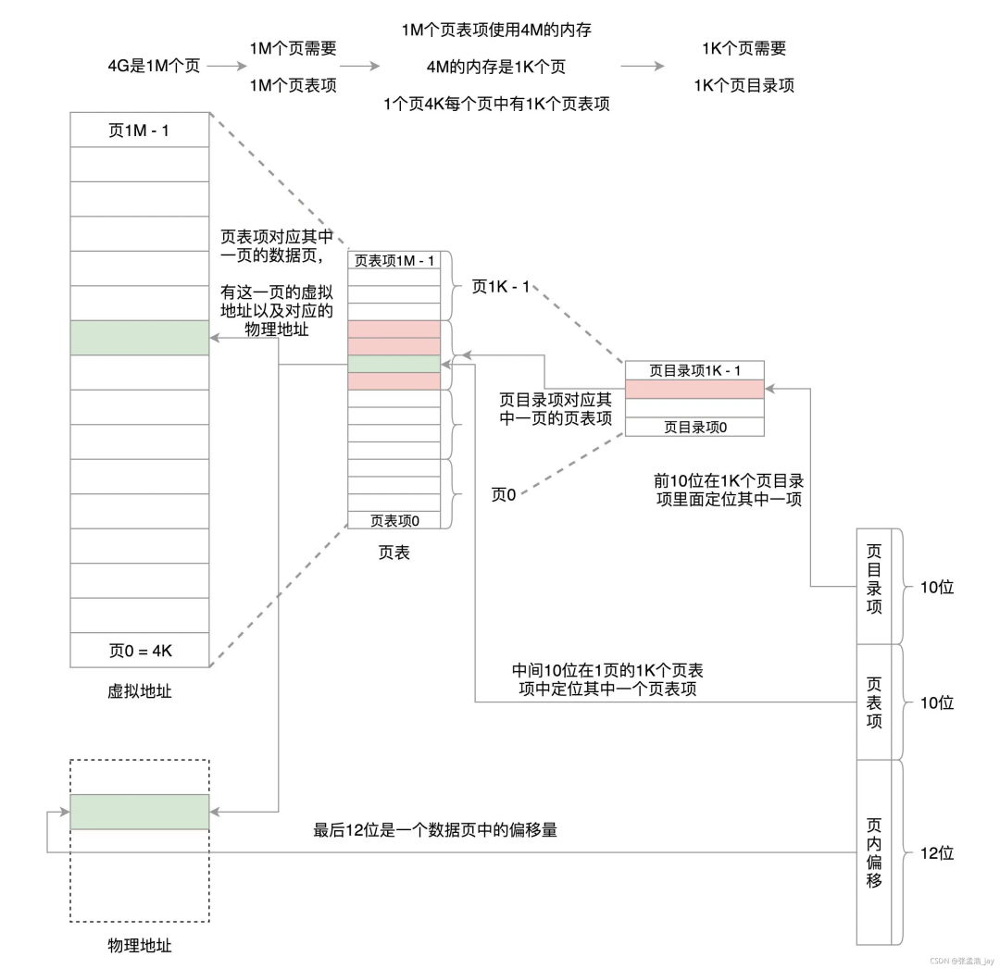
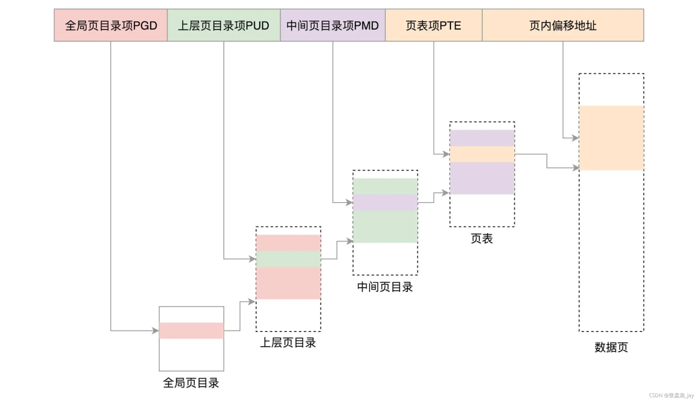
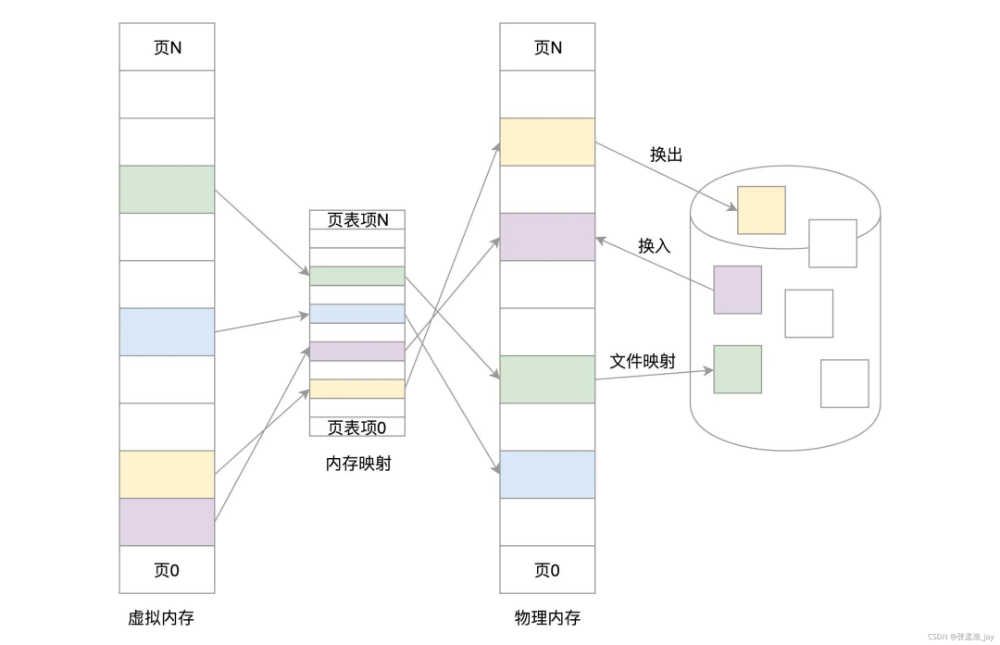

# 一文剖析Linux内核的内存管理

内存管理的主要工作就是对物理内存进行组织，然后对物理内存的分配和回收。但是Linux引入了虚拟地址的概念。

**虚拟地址的作用**

如果用户进程直接操作物理地址会有以下的坏处：

1、 用户进程可以直接操作内核对应的内存，破坏内核运行。

2、 用户进程也会破坏其他进程的运行

CPU 中寄存器中存储的是逻辑地址，需要进行映射才能转化为对应的物理地址，然后获取对应的内存。

通过引入逻辑地址，每个进程都拥有单独的逻辑地址范围。

当进程申请内存的时候，会为其分配逻辑地址和物理地址，并将逻辑地址和物理地址做一个映射。

所以，Linux内存管理涉及到了以下三个部分：

## 1、物理内存

## 物理内存的组织

Linux 中内存分为 3 个级别，从下到上依次为：

1、**Page：** 一个 page 的大小为 **4k**， Page 是内存的一个最基本的单位。

2、**Zone：** Zone 中提供了**多个队列**来管理 page。

**Zone分为 3 种**

 2.1、 ZONE\_DMA：用来存放 DMA 读取 IO 设备的数据，内核专用

 2.2、 ZONE\_NORMAL：用来存放内核的相关数据，内核专用

 2.3、 ZONE\_HIGHMEM：高端内存，用来存放用户进程数据

3、**Node** 节点，一个 CPU 对应着一个 Node，一个 Node 包括一个 Zone\_DMA、 ZONE\_NORMAL、ZONE\_HIGHMEM。

同时当一个 CPU 对应的内存用光后，可以申请其他 CPU 对应的内存。

## 物理内存的分配

Linux将内存分配分为两种：

**1、大内存**

**大内存** 利用**伙伴系统** 分配。

伙伴系统的做法是将 ZONE 中的 Page 分组，然后组装为多个链表。链表中存放的是 **页块** 的集合。页块对应着有不同的大小，分别为 1、2、4、8 … 1024个页。

当请求 (2i-1 ,2i\] 大小的 page 的时候，会直接请求 2i 个页， 如果对应的链表中有对应的页块，就直接分配。如果对应的链表没有，就往上找 2i+1，如果 2i+1 存在，就将其分为 2 个 2i 页块，将其中 1 个 2i 加入到对应的链表中，将另外一个分配出去。

例如，要请求一个 128 个页的页块时，先检查 128 个页的页块链表是否有空闲块。如果没有，则查 256 个

的页块链表；如果有空闲块的话，则将 256 个页的页块分成两份，一份使用，一份插入 128 个页的页块链表中。如果还是没有，就查 512 个页的页块链表；如果有的话，就分裂为 128、128、256 三个页块，一个 128 的使用，剩余两个插入对应页块链表。

**2、小内存分配**

小内存分配利用 **slub** 分配，比如对象等数据 slub 就是 将几个页单独拎出来作为缓存，里面维护了链表。每次直接从链表中获取对应的内存，用完之后也不用清空，就直接挂到链表上，然后等待下次利用。

## 2、如何组织虚拟地址

虚拟地址对应的是虚拟空间，虚拟空间只不过是一个虚拟地址的集合，用来映射物理内存。

  

虚拟空间分为 **用户态** 和 **内核态** 。

**32位系统中** 将虚拟空间按照 1:3 的比例分配给 **内核态** 和 **用户态。**

**64位系统中** 分别给 内核态 和 用户态 分配了 128T。

**用户态结构**

每个进程 都会 对应一个 用户态虚拟空间， 里面存放了 Text（代码）的内存虚拟地址范围、 Data（数据）的内存虚拟地址范围、BSS（全局变量）的内存虚拟地址范围、堆的虚拟地址范围、栈的虚拟地址范围，以及mmap 内存映射区。

其中 mmap 用于申请动态内存的时候的映射，堆和栈都是动态变化的。

**一个进程对应的用户态中的 各个方面的虚拟地址信息都通过一个 struct  来存储在内存中，当创建进程的时候会为其分配内存存储对应的虚拟地址信息。**

**内核态结构**

Linux 的内核程序共用一个内核态虚拟空间。其中分为了以下几部分：  

**1、直接映射区**

896M，内核空间直接映射到对应的ZONE\_DMA和ZONE\_NORMAL中。为什么叫做直接映射呢？逻辑地址 直接 减去对应的差值就可以得到对应的物理地址。固定死了。

**2、动态映射**

为什么要引入动态映射呢？因为所有物理内存的分配都需要内核程序进行申请，用户进程没有这个权限。所以内核空间一定要能映射到所有的物理内存地址。

那么如果都采用直接映射的话，1G大小逻辑地址的内核空间只能映射1G大小的物理内存。

所以引入了动态映射，动态映射就是 内核空间的逻辑地址可以映射到 物理内存中的ZONE\_HIGHMEM（高端内存）中的任何一个地址，并且在对应的物理内存使用完之后，可以再映射其他物理内存地址。

动态映射分为三种：

**1、动态内存映射：** 使用完对应的物理内存后，就可以映射其他物理内存了。

**2、永久内存映射：** 一个虚拟地址只能映射一个物理地址。如果需要映射其他物理地址，需要解绑。

**3、固定内存映射：** 只能被某些特定的函数来调用引用物理地址。

**动态内存映射和直接映射的区别**

动态映射和直接映射的区别就是逻辑地址到物理地址的转化规则。

**直接映射**

直接映射的规则是死的，一个逻辑地址对应的物理地址是固定的。通过逻辑地址加或者减去一个数，就可以得到对应的物理地址。

**动态映射**

动态映射是动态的绑定，每个逻辑地址对应的物理地址是动态的，通过页表进行查询。

**用户空间映射：**

用户空间采用**动态映射**，每个虚拟地址可以被映射到一个物理地址，映射到ZONE\_HIGHMEM。

为什么用户空间不采用**直接映射**呢？

因为物理内存是多个进程所有的，每个进程都有一个用户空间。如果采用直接映射的话，对应的物理地址是会冲突的。其用户空间的逻辑地址大小都为 3G，所以存在逻辑地址相同，但是对应的物理地址不同。需要通过页表来转化，一个进程会对应一个页表。

## 3、如何将虚拟地址映射到物理内存

虚拟地址通过 **页表** 将 **虚拟地址** 转化为 **物理地址，****每个进程都对应着一个页表，****内核只有一个页表。**

虚拟空间 和 物理内存 都按照 4k 来分页，一个虚拟空间中的页 和 物理内存中页 是 一一对应的。

## 页表映射

如上图所示，将虚拟地址中的页号 通过页表转化为 对应的物理页号，然后通过页内偏移量 就可以得到对应的 物理地址了。

但是 1 个进程就需要一个页表，一个 4G 的内存条，就需要 1M 个页表记录来描述，假如 1 个 页表记录需要 4个字节，那么就需要 4MB。而且页表记录是通过下标来对应的，通过虚拟页号来乘以对应的页表项大小来计算得到对应的地址的。

所以 Linux 将 4M 分为 1K 个 4K， 一个 4K 对应着一个 page，用来存储对应的真正的页表记录。将 1K 个 page 分开存放，就不要求连续的 4M 了。

如果将 4M 分成 1K 个离散的 page 的话，怎么虚拟地址对应的页表号呢？

利用指针，存储 1K 个地址，分别指向这 1K 个 page， 地址的大小为 4 个字节，也就是32位，完全可以表示整个内存的地址范围。

1K \* 4个字节，正好是一个 page 4k，所以 也就是利用 1 个 page来存储对应的页表记录索引。

**所以 我们的虚拟地址寻找过程如下：**

1、找到对应的页表记录索引位置，因为有 1K 个索引，所以用 10 位就可以表示了

2、通过索引可以找到对应的真正的页表地址，对应的有 1K 个页表记录，所以用 10 位就可以表示了

3、1个页有 4K，通过 12 位就可以表示其页内偏移量了。

所以虚拟地址被分为了三部分：

1、10位 表示索引偏移

2、10位 表示页表记录偏移

3、 12位 表示页内偏移

虽然这种方式增加了索引项，进一步增加了内存，但是减少了连续内存的使用，通过离散的内存就可以存储页表。

这是对于32位系统，而 64 位系统采用了5级页表。

**映射流程图**

用户态申请内存时，只会申请对应的虚拟地址，不会直接为其分配物理内存，而是等到真正访问内存的时候，产生缺页中断，然后内核才会为其分配，然后为其建立映射，也就是建立对应的页表项。

## TLB

TLB 就是一个缓存，放在 CPU 中。用来将虚拟地址和对应的物理地址进行缓存。当查询对应的物理地址的时候，首先查询 TLB，如果TLB中存在对应的记录，就直接返回。如果不存在，就再去查询页表。

## 虚拟内存

**虚拟内存** 指的是 将硬盘中划出一段 swap 分区 当作 虚拟的内存，用来存放内存中暂时用不到的内存页，等到需要的时候再从 swap 分区中 将对应的**内存页**调入到 内存中。硬盘此时相当于一个虚拟的内存。

从逻辑上能够运行更大内存的程序，因为程序运行的时候并不需要把所有数据都加载到内存中，只需要将当前运行必要的相关程序和数据加载到内存中就可以了，当需要其他数据和程序的时候，再将其调入。

相较于真正的内存加载，虚拟内存需要将数据在内存和磁盘中不断切换，这是一个耗时的操作，所以速度比不上真正的内存加载。

## 总结

虚拟空间 和 物理内存 都分为 内核空间 和 用户空间。

虚拟地址需要通过页表转化为物理地址，然后才能访问。

用户虚拟空间 只能映射 物理内存中的用户内存，无法映射到物理内存中的内核内存，也就是说，用户进程只能操作用户内存。

内核空间 只能被 内核 申请使用，用户进程只能操作用户空间的物理内存和虚拟空间。

当用户进程 调用系统调用的时候，会将其对应的代码和数据运行在内核空间中。

所以当调用 内核空间 读取文件或者网络数据的时候，首先会将数据拷贝到内存空间，然后在将数据从内核空间拷贝到用户空间。因为 用户进程不能访问内核空间。