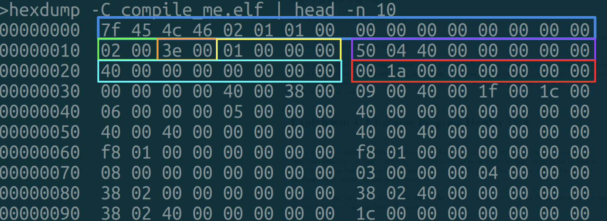
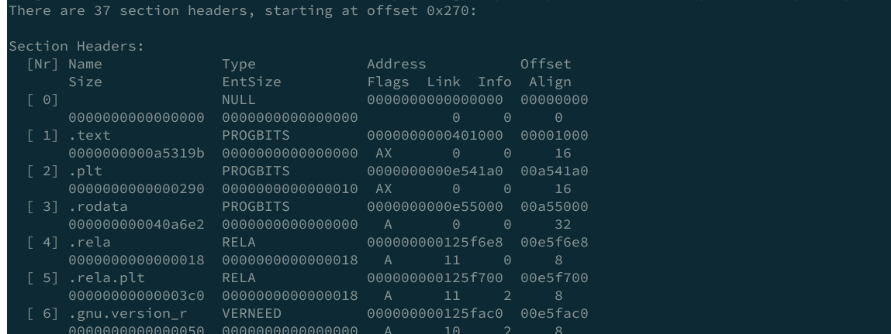
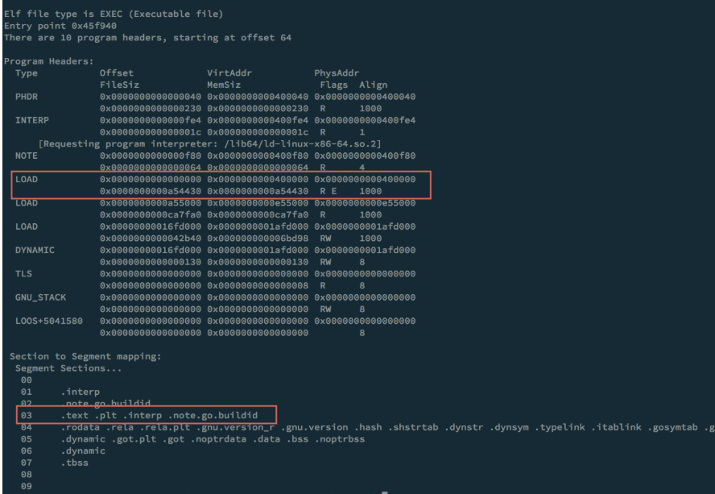
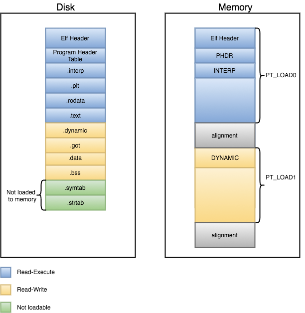
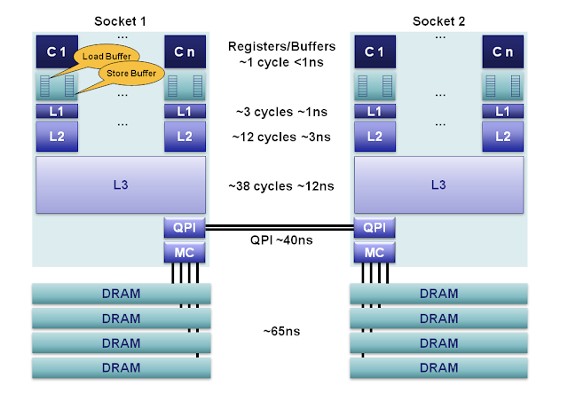
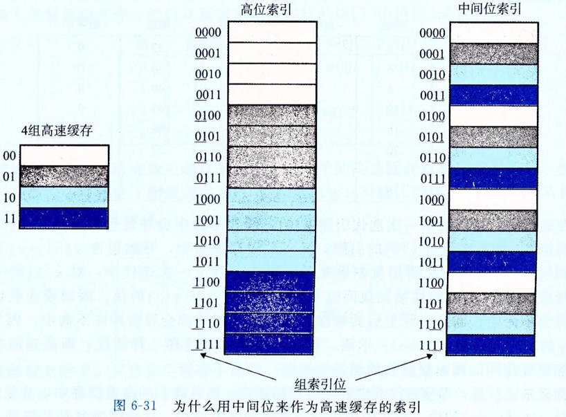
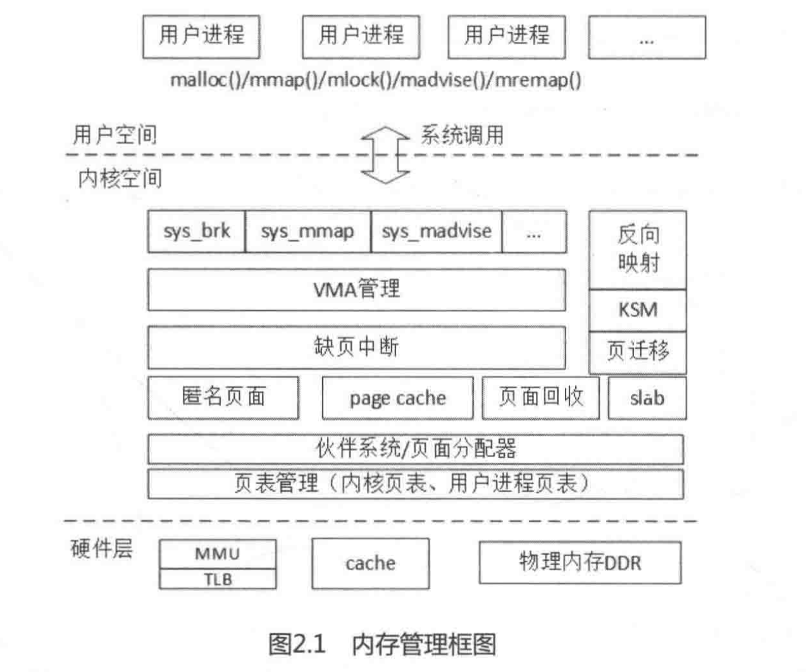
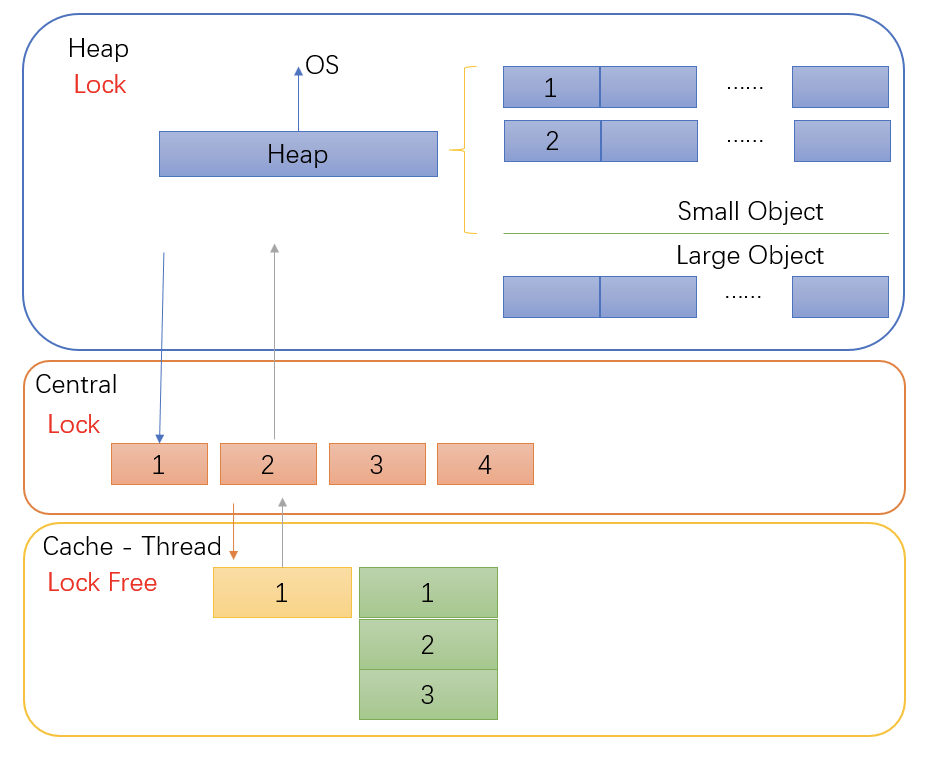

# 技术分享：内存管理

### **导读：如何写一篇技术文章**

1.  确定目标读者群体
2.  从问题出发，带着问题一步一步引出要讲解的内容
3.  基于问题用逻辑推演导出内容
    1.  要有逻辑
4.  斐波那契原则
    1.  层层递进

ps: 来自知乎问答

* * *

# 正文

本次分享的主题是：内存管理。 首先讲下为什么做这次分享，之前自己看过很多东西，但是呢，由于工作中没有用到，看完后呢就都忘了，就拿redis来说，相信很多人都看过《redis设计与实现》这本书，记得当时自己也一边看书一边看源码，但是现在也不记得什么了。所以呢，我就想有什么方法能够让自己更好的掌握理解所学的知识，即使这些内容在工作中暂时用不到，一个很好的办法就是做测验，即我们经常那一些问题来问自己，检验自己对内容的理解程度，所以本次分享我会先提问，然后为了回答这个问题，一步一步的给出本次分享的内容，当然一是由于内存管理主题太大。二是因为自己所知道的知识也有限，不可能面面俱到，因为自己也不知道自己不知道什么。只能后续不断补充完善内存管理的内容。

## 内存分配

先来讲内存分配，我们先看下面的一小段代码：

 代码解读

复制代码

`func main() { 	http.HandleFunc("/bar", func(w http.ResponseWriter, r *http.Request) { 		fmt.Fprintf(w, "Hello, %q", html.EscapeString(r.URL.Path)) 	})     fmt.Printf("pid: %d\n", os.Getpid()) 	http.ListenAndServe(":8080", nil) }`

功能非常简单，就是在8080端口启动了一个http服务，我们编译并且运行起来

 代码解读

复制代码

`go build main.go ./main > pid: 3240424`

通过ps命令查看进程详情（mac 下ps）

我们重点看两个指标：**VSZ、RSS**. VSZ 是 Virtual Memory Size 虚拟内存大小的缩写， RSS 是 Resident Set Size 缩写，代表了程序实际使用物理内存。 这就很奇怪了，我们看到程序虚拟内存占用了约213.69MB，物理内存占有了5.30MB，那问题来了：

**为什么虚拟内存比物理内存多这么多?** 为了回答上这个问题，我们先介绍虚拟内存。

* * *

### 虚拟内存

要讲虚拟内存，我们首先从冯诺依曼体系说起，冯诺依曼体系将计算机主要分为了：cpu、内存、IO 这三部分，其中 我们先回答一个问题：可执行程序是怎么能够执行的？我们日常开发中`go build main.go; ./main` 当我们执行main的时候，为什么程序能够被执行？

首先用高级语言编写的程序要经过预处理、编译、汇编、链接，然后产生可执行的文件，只有经过链接的文件才能够被执行，我们可以看下线上可执行文件的类型：

 代码解读

复制代码

`file output/bin/xx.api output/bin/xx.api: ELF 64-bit LSB executable, x86-64, version 1 (SYSV), dynamically linked, interpreter /lib64/ld-linux-x86-64.so.2, not stripped`

里面几个关键字 **ELF、dynamically linked、ld-linux-x86-64.so.2**，我们分别来解释下。 首先 ELF 是 Linux下的一种可执行程序的类型，我们可以 `man elf` 查看具体的说明，

通读完manual后可以知道elf文件开始是一个elf头，然后是program header或者section table，这两个头描述了余下文件的内容。

先来看 elf 头，我们可以通过 `readelf -h output/bin/x.api` 查看

elf头的具体含义是定义在 elf.h 中，里面有个Elf64\_Ehdr结构，每个字段的含义可以看手册。 在64位机器上elf header大小是64字节，我们可以通过命令`hexdump -C output/bin/xx.api |head -n 10`来查看数据，然后跟实际情况对比，借用一张网上图片：

更多关于elf的介绍可以看博客[Introduction to the ELF Format](https://link.juejin.cn/?target=http%3A%2F%2Fblog.k3170makan.com%2F2018%2F10%2Fintroduction-to-elf-format-part-iv.html "http://blog.k3170makan.com/2018/10/introduction-to-elf-format-part-iv.html")

介绍完elf header，下面就是非常重要的两个概念：

-   program header
-   Section header

我们知道程序要经过预处理、编译、汇编、链接四个步骤才能成为可执行文件，其中汇编是将汇编文件转换为机器可执行的指令，里面还有一个非常重要的工作就是将文件按语义分段存储，常见的一些section就是代码段，数据段，debug段等，那为什么我们要按不同功能分段呢？ 以下面的代码为例子：

 代码解读

复制代码

`int printf(const char *format, ...); void func1(int i) {     printf("%d\n", i); } int main() {     static int static_var = 85;     static int static_var2;     int a = 1;     int b;     func1(static_var + static_var2 + a + b);     return a; }`

上面代码中我们声明了printf，但是没有定义它，我们在链接阶段需要重定位printf这个符号，为了能够方便去别的文件查找printf这个符号，自然文件需要有个导出符号表，这样子方便别的文件进行符号查找，所以我们为了**更好的划分程序功能**，同时也方便链接时进行查找，debug信息读取等，就有了Section header ，我们可以通过 `readelf -S output/bin/xx.api`来查看Section header

 代码解读

复制代码

`Key to Flags:   W (write), A (alloc), X (execute), M (merge), S (strings), l (large)   I (info), L (link order), G (group), T (TLS), E (exclude), x (unknown)   O (extra OS processing required) o (OS specific), p (processor specific)`

上图我们可以看到虽然程序分为很多段，但是好多段的权限都是相同的，我们先记住这一点。

最后我们再来介绍下program header。现在我们已经有了可执行文件了，而且通过文件的开头的64字节呢，我们能校验这个文件是否确实是elf格式的，校验通过后呢，我们为了能够执行文件，自然就需要将文件加载进内存了，只有加载进来程序才能够执行。那问题就是如何加载程序了？

我们先通过`readelf -l output/bin/xx.api`来查看程序的program header

其中第3个 segment 是由 .text, .interp 等section组成，这个划分的原则就是按照相同权限的section合并。 另外我们可以看到每段字段的含义是：

-   offset：在文件中的偏移
-   virtAddr：虚拟地址空间，即程序加载进来后，在进程的地址空间中的地址
-   fileSize: segment 在文件中占用大大小
-   memSize: segment 加载进内存中占用的虚拟空间大小

到这，我们总结下 program header 和 Section header

-   Segment program header 执行视图，即被装载近内存中，地址空间分布
-   Section header 则是链接视图，elf在存储的时候是按照 section存储的，然后装载的时候，为了减少内存碎片，将相同权限的section合并为一个Segment装载进来，一个Segment基本可以对应一个vma。

上图是关于 section 和 segment的关系图，图片来自[Interfacing with ELF files](https://link.juejin.cn/?target=https%3A%2F%2Fslideplayer.com%2Fslide%2F4804417%2F "https://slideplayer.com/slide/4804417/") 再来一个关于可执行程序的静态视图和内存中的动态视图

图片来自[Executable and Linkable Format 101](https://link.juejin.cn/?target=https%3A%2F%2Fwww.intezer.com%2Fexecutable-linkable-format-101-part1-sections-segments%2F "https://www.intezer.com/executable-linkable-format-101-part1-sections-segments/")

### TLB

现在我们在重新整理下思路：

我们通过ps命令看到程序的虚拟内存比物理内存占用很多，为了回答为什么会存在这个现象，我们先得知道虚拟内存是啥，于是我们介绍了一个可执行程序是在磁盘上的静态视图：可执行程序按照不同功能划分为不同的section，当程序被加载进内存的时候，不同的section按照相同的权限组成一个segment被分配到程序的虚拟地址空间中。

现在我们已经提到了虚拟地址空间，每个程序都会有一个自己的虚拟地址空间，为什么每个程序都会有独立的地址空间呢？

首先程序执行其实是cpu在一行一行执行指令，cpu需要有地址才能去读取内存，然后再执行，这个地址最早呢就是物理内存地址，这就意味着所有程序链接的时候，都必须要指定彼此不同的物理地址，不然会加载进入内存后彼此覆盖，这个苛刻的要求显然随着程序越来越多是不可能的，于是呢，就有了虚拟地址空间一说，即每个程序都有自己的虚拟地址空间，然后cpu看到的是虚拟地址空间，但是物理内存肯定是需要物理地址才能访问的，所有就有个中间件将虚拟地址转换为物理地址。

evernotecid://684F00FC-2900-4AF6-B7AA-D9B72CB9AC48/appyinxiangcom/5364228/ENResource/p14937

上图是一个内存管理的硬件结构，图片来自[Virtual Memory, Paging, and Swapping](https://link.juejin.cn/?target=https%3A%2F%2Fgabrieletolomei.wordpress.com%2Fmiscellanea%2Foperating-systems%2Fvirtual-memory-paging-and-swapping%2F "https://gabrieletolomei.wordpress.com/miscellanea/operating-systems/virtual-memory-paging-and-swapping/") 整个一个翻译过程是cpu进行虚拟地址寻址，此时有个MMU:内存管理单元 memory management unit 负责将虚拟地址转换为物理地址，由于cpu的速度和物理内存之间速度存在差距大（大概200倍差），所以会有一个TLB: 翻译后背缓冲器（Translation Lookaside Buffer）专门来缓存这个映射关系，然后这个映射关系在实现上呢，需要用到页表，当发现虚拟地址还没有分配物理地址空间的时候，会触发缺页中断，此时会去查看这段虚拟地址对应到文件内容是啥，将其加载到内存中，在页表中建立起映射关系后，程序就可以继续执行了。

针对上面描述的这个过程，我们来回答几个问题:

1.  页表是什么，以及为什么要使用页表？
2.  TLB中缓存的是什么？

* * *

我们先来回答为什么需要页表？ 我们现在的目标是要建立虚拟地址和物理地址之间的映射关系，而内存一般我们可以将其看成是一个大数组，数组中每个元素大小1字节，那就意味着1G内存的物理空间我们就需要4G映射关系，即一个关系我们就需要4字节，简单表示就是

 代码解读

复制代码

`var maps [4*1024*1024*1024]int32 // 下标就是虚拟地址，值就是物理地址`

即4G内存映射我们却需要16G来存储映射关系。这显然不可能，于是我们需要对物理内存进行大力度的划分，一般在32位机器时代，我们将物理内存按页划分，每页大小为4K，为了方便，我们假设虚拟地址也是按页划分，此时4G被划分为了1M个页，需要4M来存储这个映射关系，4M内存也就是需要1000个页。此时即使物理内存有4G，光保存进程的页表，我们就只能同时运行1000个。所以我们就采用多级页表的方案，下图是2级示例：

图片来自[TLB and Pagewalk Coherence in x86 Processors](https://link.juejin.cn/?target=http%3A%2F%2Fblog.stuffedcow.net%2F2015%2F08%2Fpagewalk-coherence%2F "http://blog.stuffedcow.net/2015/08/pagewalk-coherence/") 如果我们按照4M划分虚拟地址，则第一个映射关系只需要1K个项，即4k内存，一个物理页就可以了。

* * *

上面我们回答了我们为什么需要页表，下面我们回答TLB中缓存的是什么？ 首先我们看一张图： evernotecid://684F00FC-2900-4AF6-B7AA-D9B72CB9AC48/appyinxiangcom/5364228/ENResource/p14939

图片来自[CPU Cache Flushing Fallacy](https://link.juejin.cn/?target=https%3A%2F%2Fmechanical-sympathy.blogspot.com%2F2013%2F02%2Fcpu-cache-flushing-fallacy.html "https://mechanical-sympathy.blogspot.com/2013/02/cpu-cache-flushing-fallacy.html") 从上图可以看到内存访问速度是cpu的60多倍，因此如果每次做虚拟地址到物理地址的转换都要访问主存，显然速度是无法忍受的，因此我们就有了TLB作为cache加快访问。 我们可以通过命令`cpuid`来查看tlb信息，

 代码解读

复制代码

`cpuid -1 L1 TLB/cache information: 2M/4M pages & L1 TLB (0x80000005/eax):       instruction # entries     = 0xff (255)       instruction associativity = 0x1 (1)       data # entries            = 0xff (255)       data associativity        = 0x1 (1) L1 TLB/cache information: 4K pages & L1 TLB (0x80000005/ebx):   instruction # entries     = 0xff (255)   instruction associativity = 0x1 (1)   data # entries            = 0xff (255)   data associativity        = 0x1 (1) L2 TLB/cache information: 2M/4M pages & L2 TLB (0x80000006/eax):       instruction # entries     = 0x0 (0)       instruction associativity = L2 off (0)       data # entries            = 0x0 (0)       data associativity        = L2 off (0) L2 TLB/cache information: 4K pages & L2 TLB (0x80000006/ebx):   instruction # entries     = 0x200 (512)   instruction associativity = 4-way (4)   data # entries            = 0x200 (512)   data associativity        = 4-way (4)`

一个在线观看地址[Cache Organization on Your Machine](https://link.juejin.cn/?target=https%3A%2F%2Frelate.cs.illinois.edu%2Fcourse%2Fcs598apk-f18%2Ff%2Fdemos%2Fupload%2Fintro%2FCache%2520Organization%2520on%2520Your%2520Machine.html "https://relate.cs.illinois.edu/course/cs598apk-f18/f/demos/upload/intro/Cache%20Organization%20on%20Your%20Machine.html") 上面我们可以看到TLB也像cache一样分为L1和L2，L1 cache如果缓存大页2M/4M有256个项，缓存4k小页也是256项，L2 cache只能缓存4k小页512个。另外TLB也像cache一样分为 instruction-TLB (ITLB) 和 data-TLB (DTLB)。

所以现在我们知道了由于cpu和内存之间速度存在巨大差异，如果每次地址转换都需要访问内存，肯定性能会下降，所以TLB中缓存的就是虚拟地址到物理地址关系，一个示意图如下：

现在我们知道了页表是用来存储虚拟地址和物理地址映射关系的，也知道了为了加速转换过程，TLB作为高速缓存存储了这个映射关系，但是我们想下，之前我们说4G空间按4K页划分的话，就会有1K个表项，之前我们通过`cpuid`命令查看的时候，发现即使是TLB 2也只有512个项，那意味着着必须要做一个1024 -> 512的映射，这个怎么做呢？还有一个问题，之前我们看TLB信息的时候有个叫 **instruction associativity = 4-way (4)** 的概念，这个是什么意思？

我们想我们现在4G的虚拟地址被分为了1K份，每份是4M大小，那32位地址的话，就是前10位是页编号，后22位是页内偏移，但是我们现在只有256个TLB表项，那最简单的就是比较所有的表项，看256个表项中是否存在虚拟页号，这就需要在同一个时刻同时比较256行，随着这个数字的增加，会越来越难，所以我们就有了另一种方法。

我们将10位的虚拟页号的后8位用来选择256个表项，用高2位来比较是否是当前行

evernotecid://684F00FC-2900-4AF6-B7AA-D9B72CB9AC48/appyinxiangcom/5364228/ENResource/p14943

一个示意图 额外补充一个问题:我们为什么不用高位来选择组，低位来做tag比较呢？ evernotecid://684F00FC-2900-4AF6-B7AA-D9B72CB9AC48/appyinxiangcom/5364228/ENResource/p14944

图片来自《深入理解计算机系统》 原因很容易理解，如果我们采用高位来选择组，但是由于每组只有一个，意味着相邻的组映射到了同一行cache，程序的局部性不好。

然后此处 associativity = 4-way 意味着有4组，即2位来选择组，剩余的位做tag比较，更详细的内容可以看《深入理解计算机系统》第六章，写的非常详细。

* * *

### 小结

总结下，目前我们的内容:

-   首先我们这次分享的主题是内存管理，会按照内存分配和垃圾回收两大块内容
-   对于第一部分内存分配呢，我们从一个简单程序执执行起来后虚拟内存和物理内存占用非常大这个现象出发，想来回来为什么
-   为了回答为什么会出现虚拟内存远大于物理内存的现象，我们先得知道什么是虚拟内存
-   为了解释虚拟内存，我们引出了可执行程序两个视图：
    -   静态视图：在磁盘上格式是elf，按照程序功能分section存储
    -   动态视图：加载进内存的时候，会将section权限相同的进行合并，分配到同一个虚拟地址空间中
-   在上面提到进程动态视图的时候，我们尝试回答为什么每个程序都会有自己的虚拟地址空间
    -   隔离：每个程序都可以在链接阶段自己分配程序执行地址
    -   安全性：每个程序只能当访问自己的地址空间内容
-   因为每个程序都有自己的虚拟地址空间，但是实际机器执行的指令和数据都需要保存在物理内存中，这就需要对虚拟地址->物理地址进行翻译
-   翻译时候，为了保存虚拟地址和物理地址的对应关系，我们有了页表，而为了减少页表占用的空间，我们有了多级页表
-   由于cpu和内存速度之间的巨大差异，我们不可能每次都到内存中读取页表，所有有了TLB，而TLB本质上是一个cache，由于cache容量小于所有的对应关系的，就需要解决：
    -   快速查找对应关系是否在TLB中
    -   当TLB满的时候，进行淘汰
    -   保证TLB中数据和内存数据一致性
    -   。。。。
    -   以上这些问题本次没有具体展开，后续补上 **mark。更新文章地址**

现在我们有了上面的这些知识后，我们在整体上来描述一下在日常开发中我们执行`go build main.go; ./main` 时候都发生了什么，为什么程序能够被执行？

1.  由于我们在是在bash中执行这个命令的，所有bash会首先通过fork创建一个新的进程出来
2.  新进程通过execve系统调用指定执行elf文件，即main文件
3.  execve通过系统调用 sys\_execve 进入内核态
4.  内核调用链路：sys\_execve -> do\_execve -> search\_binary\_handle -> load\_elf\_binary
5.  主要过程首先读取头128字确定文件格式，然后选择合适的装载程序将程序加载进内存
    1.  此处加载进内存只是读取program header，分配了虚拟地址空间，建立虚拟地址空间与可执行文件的映射关系
    2.  此处建立虚拟空间和可执行文件的映射关系就是为了在缺页异常的时候能够正确加载内容进来
    3.  发生缺页异常的时候，分配物理页，然后从磁盘将文件加载进来，这个时候才会真正占用物理内存
6.  最后，我们将cpu指令寄存器设置为可执行文件的入口地址。程序就开始执行了。。。。

通过以上的这些内容，相信可以非常轻松的回答开始的问题了，每个程序被加载的时候，分配了虚拟空间地址，但是只有真正访问这些地址的时候，才会触发缺页中断，分配物理内存。 ps: `cat /proc/21121/maps; cat /proc/21121/smaps`可以查看进程详细的地址空间。

## 应用层内存管理

以上我们介绍了虚拟内存的概念，知道一个程序要执行，要经过层层步骤加载到内存中，才能被执行，上面介绍的这些内容我们如果将内存管理进行分层的话，应该是属于内核层和硬件层（TLB，cache）的内容，先来一张图： evernotecid://684F00FC-2900-4AF6-B7AA-D9B72CB9AC48/appyinxiangcom/5364228/ENResource/p14945

图片来自《奔跑吧linux内核》 ps:这一本书也是待读的书单，但是暂时没找到工作中应用场景，可能先当做一本工具书了。 我们之前的内容是讲了非常少的一点内核层和硬件层的内存管理，现在我们要讲下应用层的内存管理，首先我们得知道，为什么内核有了内存管理，我们在应用层还需要做内存管理。

1.  为了减少系统调用（brk，mmap）
2.  操作系统不知道如何对内存进行复用，一旦进程申请内存后，这块内存就被进程占用了，只要它不释放，我们再也不能分配给别人
3.  应用层自己做内存管理，可以更好的复用内存，同时能够和垃圾回收器配合，更好的管理内存

我们来看常见语言的内存管理实现：

-   C：malloc，free
-   C++：new，delete
-   Go：逃逸分析和垃圾回收

动手项目：[如何自己实现个最小的malloc。](https://link.juejin.cn/?target=https%3A%2F%2Fandrestc.com%2Fpost%2Fimplementing-malloc-and-free%2F "https://andrestc.com/post/implementing-malloc-and-free/")

注意：以下内容，由于自己站的高度问题，不保证完全的正确。如果错误请不吝指出。

* * *

我们自己去设计内存分配器的时候，衡量的重要的指标是：

-   吞吐率
-   内存利用率

吞吐率指的是内存分配器每秒能够处理的请求数（包括分配和回收），内存利用率则是尽可能减少内部碎片和外部碎片。 ps:

-   内部碎片是已经被分配出去的的内存空间大于请求所需的内存空间。
-   外部碎片是指还没有分配出去，但是由于大小太小而无法分配给申请空间的新进程的内存空间空闲块。

下面我们来看下GO语言的内存分配器设计, 我们会分2部分来介绍：

-   tcmalloc
-   go语言allocator实现

### tcmalloc

tcmalloc大名鼎鼎，对于tcmalloc的分析网上内容很多，此处就不多说了，大家自行Google。此处推荐一篇文章[图解 TCMalloc](https://link.juejin.cn/?target=https%3A%2F%2Fzhuanlan.zhihu.com%2Fp%2F29216091 "https://zhuanlan.zhihu.com/p/29216091")，一图胜千言。 此处只提下为啥tcmalloc那么好。

-   通过 thread-local-cache 分散了锁竞争（一把锁变多把锁）
-   有借有还，当有连续内存不用的时候，还给内核

> ps:在64位机器将内存还给操作系统非常有意思，释放内存的时候不释放 VA，把 VA 挂在 Heap 上，只是向操作系统提个建议，某一段 VA 暂时不用，可以解除 VA 和 PA 的 mmu 映射，操作系统可能会触发两种行为，第一种行为操作系统物理内存的确不够用有大量的换入换出操作，就解除，第二种操作系统觉得物理内存挺大的，就搁那，但是知道了这段 PA 空间不可用了，在 Heap 中并没有把 VA 释放掉，下次分配正好用到当时解除的 VA，有可能会引发两种行为，第一种是 PA 映射没有解除直接拿过来用，第二种是 PA 被解除掉了会引发操作系统缺页异常，操作系统就会补上这段物理内存，这个过程对用户空间来说是不可见的，这样在用户空间觉得这段内存根本没有释放过，因为用户空间看到的永远是 VA，VA 上某段内存可能存在也可能不存在，它是否存在对用户逻辑来说根本不关心，这地方实际上是操作系统来管理，操作系统通过 mmu 建立映射，这会造成 64 位 VA 地址空间非常的大，只要申请就不释放，下次重复使用，只不过重复使用会补上。现在内存管理在 64 位下简单的多，无非 VA 用就用了，就不释放。Windows 操作系统没有建议解除，只能说全部释放掉。

### go allocator

此处也是推荐材料 [Go's Memory Allocator - Overview](https://link.juejin.cn/?target=https%3A%2F%2Fandrestc.com%2Fpost%2Fgo-memory-allocation-pt1%2F "https://andrestc.com/post/go-memory-allocation-pt1/") [GopherCon 2018 - Allocator Wrestling](https://link.juejin.cn/?target=https%3A%2F%2Fabout.sourcegraph.com%2Fgo%2Fgophercon-2018-allocator-wrestling "https://about.sourcegraph.com/go/gophercon-2018-allocator-wrestling") 此处只说 go的内存分配是从tcmalloc发展而来，基本思想一致， 下面是一个简图： evernotecid://684F00FC-2900-4AF6-B7AA-D9B72CB9AC48/appyinxiangcom/5364228/ENResource/p15012

### go 垃圾回收

好资料推荐 [Golang's Realtime GC in Theory and Practice](https://link.juejin.cn/?target=https%3A%2F%2Fmubu.com%2Fdoc%2Fb_ds5LspO3 "https://mubu.com/doc/b_ds5LspO3") [Getting to Go: The Journey of Go's Garbage Collector](https://link.juejin.cn/?target=https%3A%2F%2Fblog.golang.org%2Fismmkeynote "https://blog.golang.org/ismmkeynote")

### 调优

上面介绍这么多后，我们来介绍一些实际开发中，应该怎么优化我们自己程序的例子。这部分后续再写一篇了专门介绍的

## 参考

[Go Memory Management](https://link.juejin.cn/?target=https%3A%2F%2Fpovilasv.me%2Fgo-memory-management%2F "https://povilasv.me/go-memory-management/") [CppCon 2017: Bob Steagall “How to Write a Custom Allocator](https://link.juejin.cn/?target=https%3A%2F%2Fwww.youtube.com%2Fwatch%3Fv%3DkSWfushlvB8 "https://www.youtube.com/watch?v=kSWfushlvB8") [Go's Memory Allocator - Overview](https://link.juejin.cn/?target=https%3A%2F%2Fandrestc.com%2Fpost%2Fgo-memory-allocation-pt1%2F "https://andrestc.com/post/go-memory-allocation-pt1/") [Golang's Realtime GC in Theory and Practice](https://link.juejin.cn/?target=https%3A%2F%2Fmubu.com%2Fdoc%2Fb_ds5LspO3 "https://mubu.com/doc/b_ds5LspO3") [GopherCon 2018 - Allocator Wrestling](https://link.juejin.cn/?target=https%3A%2F%2Fabout.sourcegraph.com%2Fgo%2Fgophercon-2018-allocator-wrestling "https://about.sourcegraph.com/go/gophercon-2018-allocator-wrestling") [Golang's Realtime GC in Theory and Practice](https://link.juejin.cn/?target=https%3A%2F%2Fmubu.com%2Fdoc%2Fb_ds5LspO3 "https://mubu.com/doc/b_ds5LspO3") [Getting to Go: The Journey of Go's Garbage Collector](https://link.juejin.cn/?target=https%3A%2F%2Fblog.golang.org%2Fismmkeynote "https://blog.golang.org/ismmkeynote")

## 参考

https://juejin.cn/post/6844903737719259150