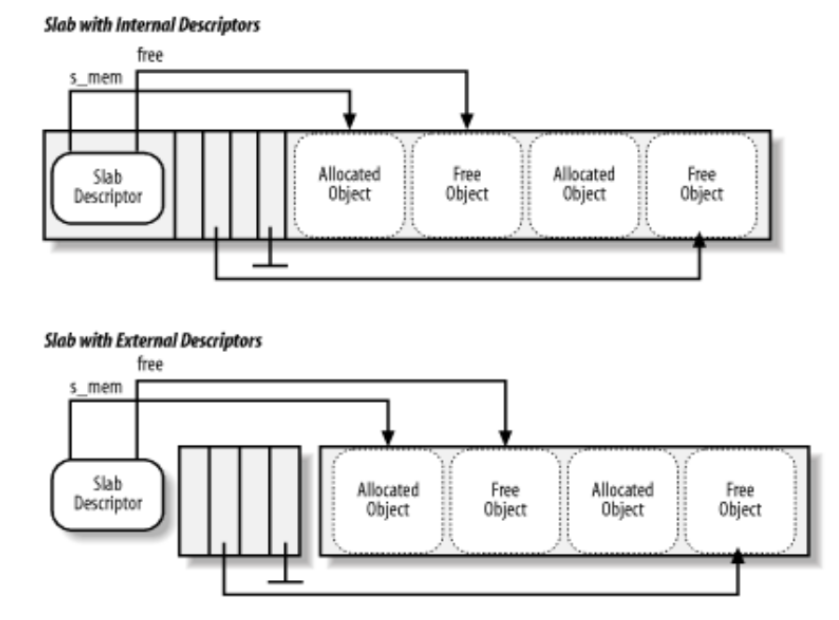

# 内存管理[¶](https://linux-kernel-labs-zh.xyz/lectures/memory-management.html#section-1 "永久链接至标题")

[查看幻灯片](https://linux-kernel-labs-zh.xyz/lectures/memory-management-slides.html)

## 课程目标：[¶](https://linux-kernel-labs-zh.xyz/lectures/memory-management.html#section-2 "永久链接至标题")

-   物理内存管理
    -   页面分配
    -   小型分配
-   虚拟内存管理
-   缺页错误处理概述

## 物理内存管理[¶](https://linux-kernel-labs-zh.xyz/lectures/memory-management.html#section-3 "永久链接至标题")

-   跟踪物理内存页面的算法和数据结构
-   独立于虚拟内存管理
-   完整的内存管理同时需要虚拟内存管理和物理内存管理
-   物理页面使用特殊的数据结构进行跟踪：`struct page`
-   每个物理页面都在 `mem_map` 向量中保留有一个条目
-   物理页面的状态可能包括：页面使用计数器，位于交换区（swap）或文件中的位置，该页面的缓冲区，页面缓存（page cache）中的位置等。

### 内存区域[¶](https://linux-kernel-labs-zh.xyz/lectures/memory-management.html#section-4 "永久链接至标题")

-   DMA 区域
-   DMA32 区域
-   正常区域（LowMem）
-   高内存区域（HighMem）
-   可移动区域（Movable Zone）

### 非均匀内存访问[¶](https://linux-kernel-labs-zh.xyz/lectures/memory-management.html#section-5 "永久链接至标题")

-   物理内存被分割成多个节点（node），每个 CPU 对应一个节点
-   每个节点都可以访问单个物理地址空间
-   访问本地内存更快
-   每个节点维护自己的内存区域（例如 DMA、NORMAL、HIGHMEM 等）

### 页面分配[¶](https://linux-kernel-labs-zh.xyz/lectures/memory-management.html#section-6 "永久链接至标题")

/\* 分配 2^order 个连续页面，并返回指针，指针指向第一个页面的描述符 \*/
struct page \*alloc\_pages(gfp\_mask, order);

/\* 分配单个页面 \*/
struct page \*alloc\_page(gfp\_mask);

/\* 返回内核虚拟地址的辅助函数 \*/
void \*\_\_get\_free\_pages(gfp\_mask, order);
void \*\_\_get\_free\_page(gfp\_mask);
void \*\_\_get\_zero\_page(gfp\_mask);
void \*\_\_get\_dma\_pages(gfp\_mask, order);

-   典型的内存分配算法具有线性复杂度
-   为什么不使用分页？
    -   有时我们确实需要连续的内存分配（用于 DMA）
    -   分配将需要页表更改和 TLB 刷新
    -   无法使用扩展页面
    -   一些体系结构直接（在硬件中）线性映射地址空间的一部分（例如 MIPS）

-   空闲块被分布在多个列表中
-   每个列表包含相同大小的块
-   块的大小是 2 的幂次

-   如果 N 大小的列表中存在空闲块，选择第一个
-   如果没有，在 2N 大小的列表中查找空闲块
-   将 2N 大小的块分割为两个 N 大小的块，并将它们添加到 N 大小的列表中
-   现在我们 N 大小的列表里有内容了，从该列表中选择第一个空闲块

-   如果“伙伴”是空闲的，则合并为一个 2N 大小的块
-   循环往复直到无法找到空闲的伙伴块，并将结果块放置在相应的列表中

### Linux 的实现[¶](https://linux-kernel-labs-zh.xyz/lectures/memory-management.html#linux "永久链接至标题")

-   为 1、2、4、8、16、32、64、128、256、512 以及 1024 页面大小的块总共设置 11 个列表，每个列表对应某个大小的块。
-   每个内存区域都有自己的伙伴分配器
-   每个区域都有一个用于空闲块的描述符向量，每个大小对应一个条目
-   描述符包含空闲块的数量和列表的头部
-   块通过 `struct page` 的 lru 字段链接在列表中
-   空闲页面设置了 PG\_buddy 标志
-   页面描述符在私有字段中保留了块大小的副本，以便轻松检查“伙伴”是否空闲

### 小型分配[¶](https://linux-kernel-labs-zh.xyz/lectures/memory-management.html#section-7 "永久链接至标题")

-   伙伴系统被用于分配页面
-   许多内核子系统需要分配小于一页的缓冲区
-   典型解决方案：可变大小的缓冲区分配
    -   导致外部碎片
-   另一种解决方案：固定大小的缓冲区分配
    -   导致内部碎片
-   折中方案：使用多种固定大小的块分配，几何分布
    -   例如：32、64、...、131056

-   缓冲区=对象
-   使用伙伴系统分配一组页面以进行对象分配
-   每个对象（可选地）具有构造函数和析构函数
-   已释放的对象被缓存——避免了后续对构造函数和伙伴分配/释放的调用

-   内核通常会多次分配和释放多种相同类型的数据结构（例如 `struct task_struct`），在这个过程中如果使用固定大小的分配，效率将会变高。SLAB 可帮助系统减少消耗资源更多的分配/释放操作。
-   对于可变大小的缓冲区（发生频率较低），可以使用固定大小的几何分布缓存
-   减少了内存分配的占用空间，因为我们仅需要在比伙伴分配器覆盖范围更小的内存区域中搜索
-   使用缓存优化技术（slab 着色）

### SLAB 架构[¶](https://linux-kernel-labs-zh.xyz/lectures/memory-management.html#slab "永久链接至标题")

-   用于标识缓存的名称，用于统计信息
-   对象的构造函数和析构函数
-   对象的大小
-   标志
-   以 2 的幂次表示的页数作为 slab 的大小
-   GFP 掩码
-   一个或多个 slab，按状态分组：满、部分满、空

-   对象的数量
-   存储对象的内存区域
-   指向第一个空闲对象的指针
-   描述符可以存储在以下位置：
    -   SLAB 本身（如果对象大小低于 512，或者如果内部碎片给 SLAB 描述符留有足够空间）
    -   SLAB 分配器内部使用的通用缓存中

-   通用缓存在 SLAB 分配器内部使用
    -   为缓存和 SLAB 描述符分配内存
-   它们也用于通过实现 `kmalloc()`，具体实现方法为使用 20 种对象大小在 32 字节到 4MB 之间呈几何分布的缓存来实现
-   特定缓存是由内核子系统根据需要动态创建的

-   仅用于空闲对象
-   整数，指向下一个空闲对象
-   最后一个空闲对象使用终止值
-   内部描述符——存储在 slab 中
-   外部描述符——存储在通用缓存中

## 虚拟内存管理[¶](https://linux-kernel-labs-zh.xyz/lectures/memory-management.html#section-8 "永久链接至标题")

-   在内核和用户空间中都使用
-   使用虚拟内存需要：
    -   在\*虚拟\*地址空间中保留（分配）一个段（无论是内核还是用户）
    -   为缓冲区分配一个或多个物理页面
    -   为页表和内部结构分配一个或多个物理页面
    -   将虚拟内存段映射到分配的物理页面上

### 地址空间描述符[¶](https://linux-kernel-labs-zh.xyz/lectures/memory-management.html#section-9 "永久链接至标题")

-   页表由以下之一使用：
    -   CPU 的 MMU
    -   内核，用于处理 TLB 异常（一些 RISC 处理器）
-   地址空间描述符由内核用于维护高级信息，例如文件和文件偏移（对于使用文件的 mmap），只读段，写时复制段等。

-   在地址空间描述符中搜索一个空闲区域
-   为新的区域描述符分配内存
-   将新的区域描述符插入地址空间描述符中
-   为一个或多个页表分配物理内存
-   在虚拟地址空间中设置新分配区域的页表
-   （按需）分配物理页面，并通过更新页表将它们映射到虚拟地址空间中

-   移除区域描述符
-   释放区域描述符内存
-   更新页表以从虚拟地址空间中删除该区域
-   刷新已释放虚拟内存区域的 TLB
-   释放与已释放区域相关联的页表的物理内存
-   释放已释放虚拟内存区域的物理内存

-   内核
    -   vmalloc
        -   区域描述符：`struct vm_struct`
        -   地址空间描述符：简单链表，由 `struct vm_struct` 组成
-   用户空间
    -   区域描述符：`struct vm_area_struct`
    -   地址空间描述符：`struct mm_struct`，红黑树

## 缺页处理[¶](https://linux-kernel-labs-zh.xyz/lectures/memory-management.html#section-10 "永久链接至标题")

## 参考

[内存管理 — Linux 系统内核文档 (linux-kernel-labs-zh.xyz)](https://linux-kernel-labs-zh.xyz/lectures/memory-management.html#section-4)