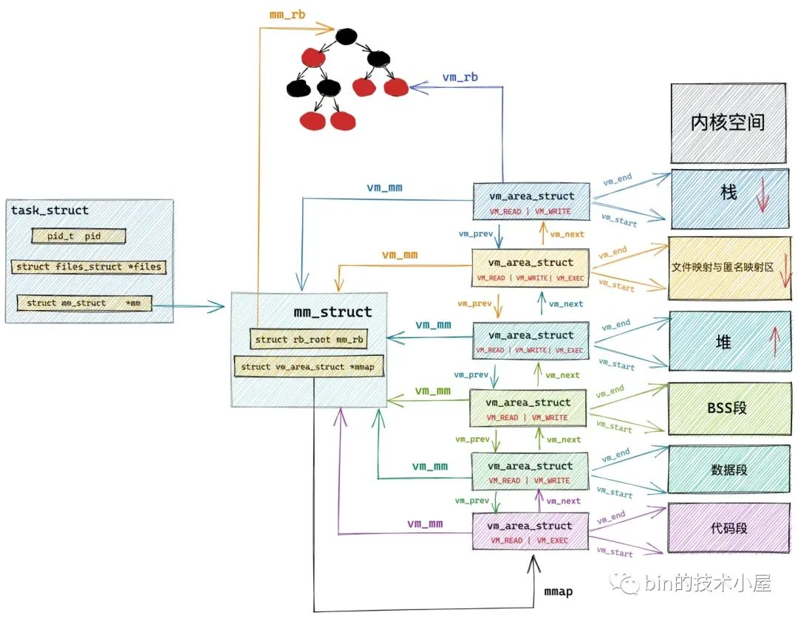
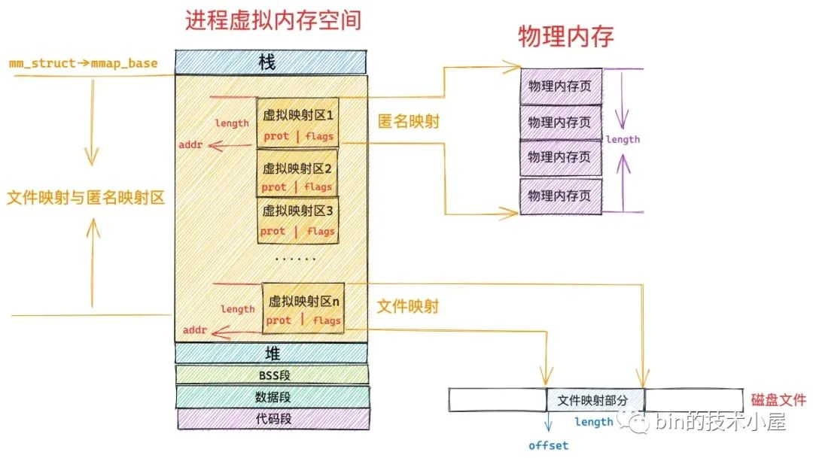
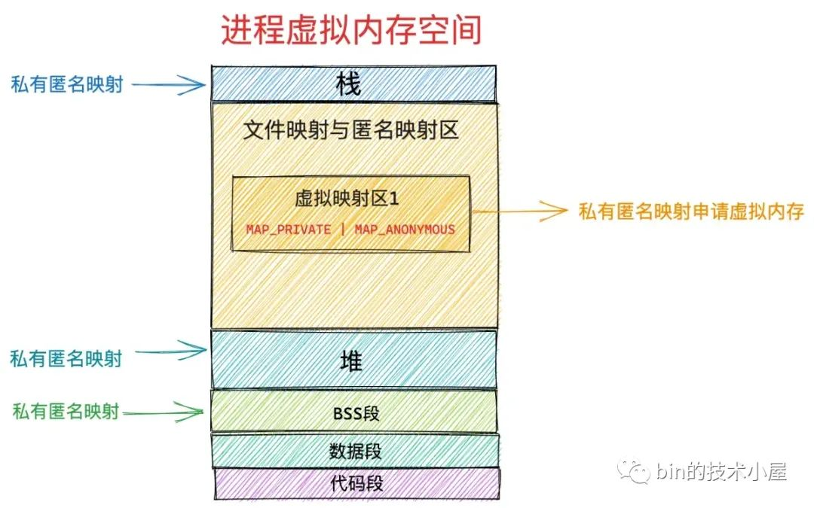
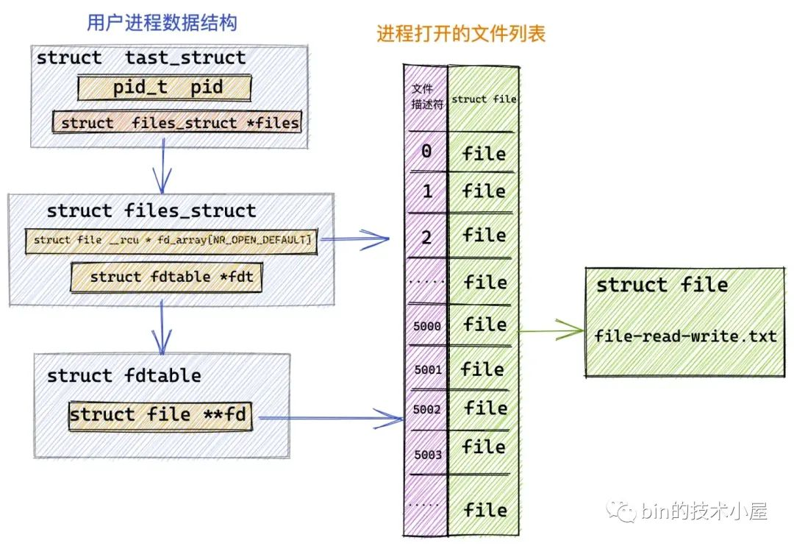
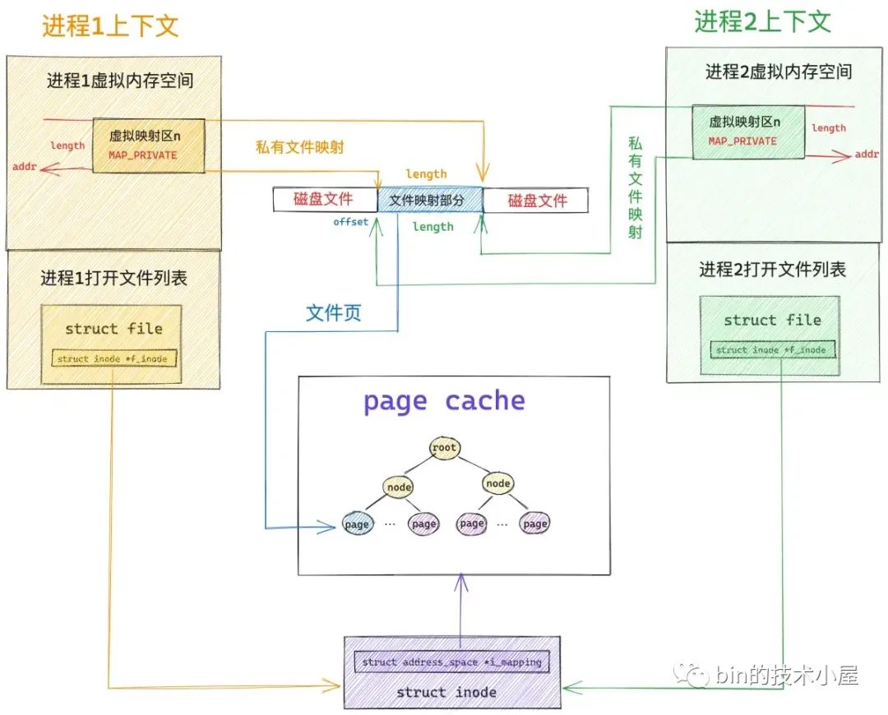
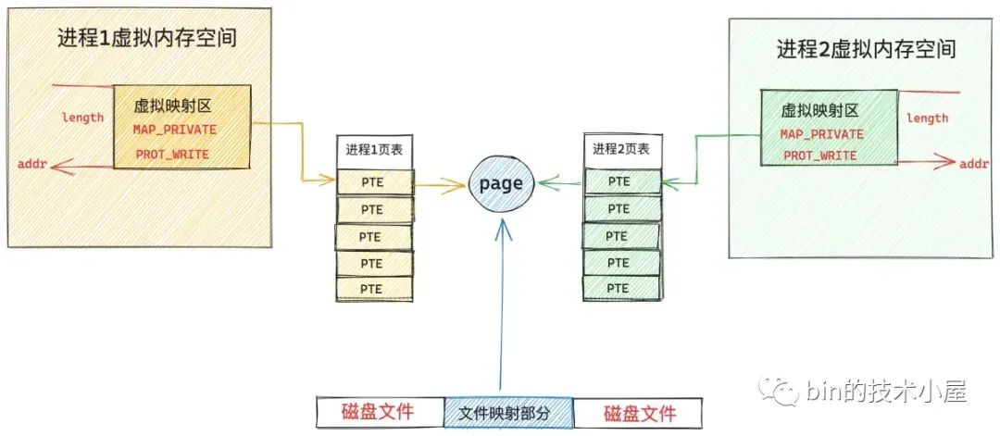
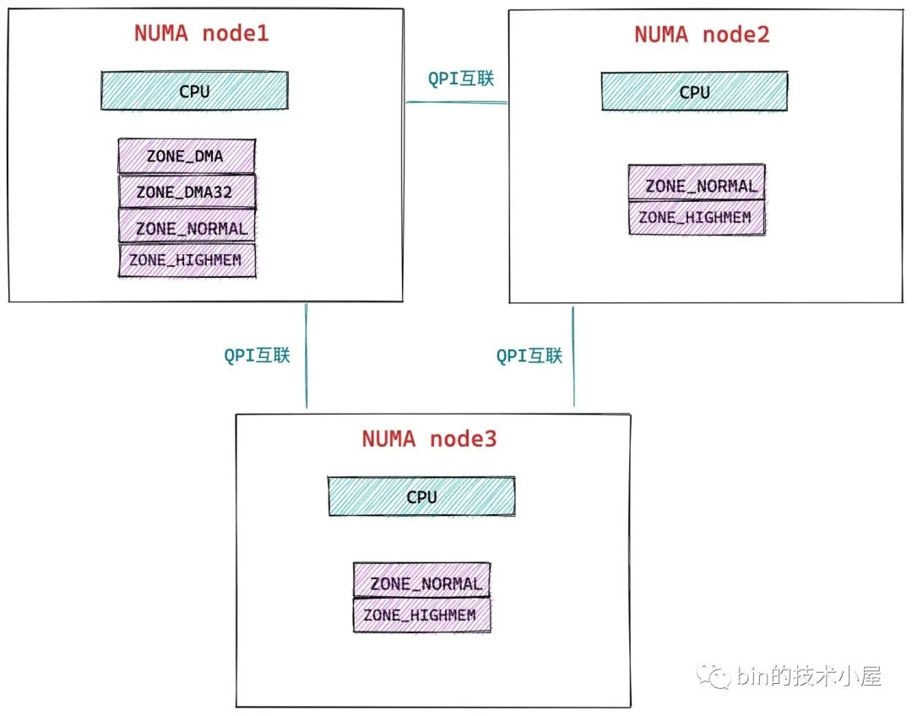

# 从内核世界透视 mmap 内存映射的本质（原理篇）

> 本文基于内核 5.4 版本源码讨论

之前有不少读者给笔者留言，希望笔者写一篇文章介绍下 mmap [内存映射](https://so.csdn.net/so/search?q=%E5%86%85%E5%AD%98%E6%98%A0%E5%B0%84&spm=1001.2101.3001.7020)相关的知识体系，之所以迟迟没有动笔，是因为 mmap 这个系统调用看上去简单，实际上并不简单，可以说是非常复杂的一个系统调用。

如果想要给大家把 mmap 背后的技术本质，正确地，清晰地还原出来，还是有一定难度的，因为 mmap 这一个[系统调用](https://so.csdn.net/so/search?q=%E7%B3%BB%E7%BB%9F%E8%B0%83%E7%94%A8&spm=1001.2101.3001.7020)就能撬动起整个内存管理系统，文件系统，页表体系，缺页中断等一大片的背景知识，涉及到的知识面广且繁杂。

幸运的是这一整套的背景知识，笔者已经在 [《聊聊 Linux 内核》](https://mp.weixin.qq.com/mp/appmsgalbum?__biz=Mzg2MzU3Mjc3Ng==&action=getalbum&album_id=2559805446807928833&scene=173&from_msgid=&from_itemidx=&count=3&nolastread=1#wechat_redirect) 系列文章中为大家详细介绍过了，所以现在是时候开始动笔了，不过大家不需要担心，虽然涉及到的背景知识比较多，但是在后面的相关章节里，笔者还会为大家重新交代。

在上一篇文章 [《一步一图带你构建 Linux 页表体系》](https://mp.weixin.qq.com/s?__biz=Mzg2MzU3Mjc3Ng==&mid=2247488477&idx=1&sn=f8531b3220ea3a9ca2a0fdc2fd9dabc6&chksm=ce77d59af9005c8c2ef35c7e45f45cbfc527bfc4b99bbd02dbaaa964d174a4009897dd329a4d&scene=178&cur_album_id=2559805446807928833#rd) 中，笔者为大家介绍了内存映射最为核心的内容 —— 页表体系。通过一步一图的方式为大家展示了整个页表体系的演进过程，并在这个过程中逐步揭开了整个页表体系的全貌。

本文的内容依然是内存映射相关的内容，这一次笔者会带着大家围绕页表这个最为核心的体系，在页表的外围进行内存映射相关知识的介绍，核心目的就是彻底为大家还原内存映射背后的技术本质，由浅入深地给大家讲透彻，弄明白。

在我们正式开始今天的内容之前，笔者想首先抛出几个问题给大家思考，建议大家带着这几个问题来阅读接下来的内容，我们共同来将这些迷雾一层一层地慢慢拨开，直到还原出内存映射的本质。

1.  既然我们是在讨论虚拟内存与物理内存的映射，那么首先你得有虚拟内存，你也得有物理内存吧，在这个基础之上，才能讨论两者之间的映射，而物理内存是怎么来的，笔者已经通过前边文章 [《深入理解 Linux 物理内存分配全链路实现》](https://mp.weixin.qq.com/s?__biz=Mzg2MzU3Mjc3Ng==&mid=2247487111&idx=1&sn=e57371f9c3e6910f4f4721aa0787e537&chksm=ce77c8c0f90041d67b2d344d413a2573f3662a1a64a802b41d4618982fcbff1617d9a5da9f7b&scene=178&cur_album_id=2559805446807928833#rd) 介绍的非常清楚了，那虚拟内存是怎么来的呢 ？内核分配虚拟内存的过程是怎样的呢？
    
2.  我们知道内存映射是按照物理内存页为单位进行的，而在内存管理中，内存页主要分为两种：一种是匿名页，另一种是文件页，这一点笔者已经在 [《一步一图带你深入理解 Linux 物理内存管理》](https://mp.weixin.qq.com/s?__biz=Mzg2MzU3Mjc3Ng==&mid=2247487111&idx=1&sn=e57371f9c3e6910f4f4721aa0787e537&chksm=ce77c8c0f90041d67b2d344d413a2573f3662a1a64a802b41d4618982fcbff1617d9a5da9f7b&scene=178&cur_album_id=2559805446807928833#rd) 一文中反复讲过很多次了。根据物理内存页的类型分类，内存映射自然也分为两种：一种是虚拟内存对匿名物理内存页的映射，另一种是虚拟内存对文件页的映射。关于文件映射，大家或多或少在网上看到过这样的论述——" 通过内存文件映射可以将磁盘上的文件映射到内存中，这样我们就可以通过读写内存来完成磁盘文件的读写 "。关于这个论述，如果对内存管理和文件系统不熟悉的同学，可能感到这句话非常的神奇，会有这样的一个疑问，内存就是内存啊，磁盘上的文件就是文件啊，这是两个完全不同的东西，为什么说读写内存就相当于读写磁盘上的文件呢 ？内存文件映射在内核中到底发生了什么 ？我们经常谈到的内存映射，到底映射的是什么？
    
3.  在上篇文章中笔者只是为大家展示了整个页表体系的全貌，以及页表体系一步一步的演进过程，但是在进程被创建出来之后，内核也仅是会为进程分配一张全局页目录表 PGD（Page Global Directory）而已，此时进程虚拟内存空间中只存在一张顶级页目录表，而在上图中所展示的四级页表体系中的上层页目录 PUD（Page Upper Directory），中间页目录 PMD（Page Middle Directory）以及一级页表是不存在的，那么上图展示的这个页表完整体系是在什么时候，又是如何被一步一步构建出来的呢？
    

本文的主旨就是围绕上述这几个问题来展开的，那么从何谈起呢 ？笔者想了一下，还是应该从我们最为熟悉的，在用户态经常接触到的内存映射系统调用 mmap 开始聊起~~~

### 1\. 详解内存映射系统调用 mmap

    #include <sys/mman.h>
    void* mmap(void* addr, size_t length, int prot, int flags, int fd, off_t offset);
    
    // 内核文件：/arch/x86/kernel/sys_x86_64.c
    SYSCALL_DEFINE6(mmap, unsigned long, addr, unsigned long, len,
    		unsigned long, prot, unsigned long, flags,
    		unsigned long, fd, unsigned long, off)

mmap 内存映射里所谓的内存其实指的是虚拟内存，在调用 mmap 进行匿名映射的时候（比如进行堆内存的分配），是将进程虚拟内存空间中的某一段虚拟内存区域与物理内存中的匿名内存页进行映射，当调用 mmap 进行文件映射的时候，是将进程虚拟内存空间中的某一段虚拟内存区域与磁盘中某个文件中的某段区域进行映射。

而用于内存映射所消耗的这些虚拟内存位于进程虚拟内存空间的哪里呢 ？

笔者在之前的文章[《一步一图带你深入理解 Linux 虚拟内存管理》](https://mp.weixin.qq.com/s?__biz=Mzg2MzU3Mjc3Ng==&mid=2247486732&idx=1&sn=435d5e834e9751036c96384f6965b328&chksm=ce77cb4bf900425d33d2adfa632a4684cf7a63beece166c1ffedc4fdacb807c9413e8c73f298&scene=178&cur_album_id=2559805446807928833#rd) 中曾为大家详细介绍过进程虚拟内存空间的布局，在进程虚拟内存空间的布局中，有一段叫做**文件映射与匿名映射区**的虚拟内存区域，当我们在用户态应用程序中调用 mmap 进行内存映射的时候，所需要的虚拟内存就是在这个区域中划分出来的。

在文件映射与匿名映射这段虚拟内存区域中，包含了一段一段的虚拟映射区，每当我们调用一次 mmap 进行内存映射的时候，内核都会在文件映射与匿名映射区中划分出一段虚拟映射区出来，这段虚拟映射区就是我们申请到的虚拟内存。

那么我们申请的这块虚拟内存到底有多大呢 ？这就用到了 mmap 系统调用的前两个参数：

-   addr ： 表示我们要映射的这段虚拟内存区域在进程虚拟内存空间中的起始地址（虚拟内存地址），但是这个参数只是给内核的一个暗示，内核并非一定得从我们指定的 addr 虚拟内存地址上划分虚拟内存区域，内核只不过在划分虚拟内存区域的时候会优先考虑我们指定的 addr，如果这个虚拟地址已经被使用或者是一个无效的地址，那么内核则会自动选取一个合适的地址来划分虚拟内存区域。我们一般会将 addr 设置为 NULL，意思就是完全交由内核来帮我们决定虚拟映射区的起始地址。
    
-   length ：从进程虚拟内存空间中的什么位置开始划分虚拟内存区域的问题解决了，那么我们要申请的这段虚拟内存有多大呢 ？ 这个就是 length 参数的作用了，如果是匿名映射，length 参数决定了我们要映射的匿名物理内存有多大，如果是文件映射，length 参数决定了我们要映射的文件区域有多大。
    

> addr，length 必须要按照 PAGE\_SIZE（4K） 对齐。

如果我们通过 mmap 映射的是磁盘上的一个文件，那么就需要通过参数 fd 来指定要映射文件的描述符（file descriptor），通过参数 offset 来指定文件映射区域在文件中偏移。

在内存[管理系统](https://so.csdn.net/so/search?q=%E7%AE%A1%E7%90%86%E7%B3%BB%E7%BB%9F&spm=1001.2101.3001.7020)中，物理内存是按照内存页为单位组织的，在文件系统中，磁盘中的文件是按照磁盘块为单位组织的，内存页和磁盘块大小一般情况下都是 4K 大小，所以这里的 offset 也必须是按照 4K 对齐的。

而在文件映射与匿名映射区中的这一段一段的虚拟映射区，其实本质上也是虚拟内存区域，它们和进程虚拟内存空间中的代码段，数据段，BSS 段，堆，栈没有任何区别，在内核中都是 struct vm\_area\_struct 结构来表示的，下面我们把进程空间中的这些虚拟内存区域统称为 VMA。

进程虚拟内存空间中的所有 VMA 在内核中有两种组织形式：一种是双向链表，用于高效的遍历进程 VMA，这个 VMA 双向链表是有顺序的，所有 VMA 节点在双向链表中的排列顺序是按照虚拟内存低地址到高地址进行的。

另一种则是用红黑树进行组织，用于在进程空间中高效的查找 VMA，因为在进程虚拟内存空间中不仅仅是只有代码段，数据段，BSS 段，堆，栈这些虚拟内存区域 VMA，尤其是在数据密集型应用进程中，文件映射与匿名映射区里也会包含有大量的 VMA，进程的各种动态链接库所映射的虚拟内存在这里，进程运行过程中进行的匿名映射，文件映射所需要的虚拟内存也在这里。而内核需要频繁地对进程虚拟内存空间中的这些众多 VMA 进行增，删，改，查。所以需要这么一个红黑树结构，方便内核进行高效的查找。

    // 进程虚拟内存空间描述符
    struct mm_struct {
        // 串联组织进程空间中所有的 VMA  的双向链表 
        struct vm_area_struct *mmap;  /* list of VMAs */
        // 管理进程空间中所有 VMA 的红黑树
        struct rb_root mm_rb;
    }
    
    // 虚拟内存区域描述符
    struct vm_area_struct {
        // vma 在 mm_struct->mmap 双向链表中的前驱节点和后继节点
        struct vm_area_struct *vm_next, *vm_prev;
        // vma 在 mm_struct->mm_rb 红黑树中的节点
        struct rb_node vm_rb;
    }

上图中的文件映射与匿名映射区里边其实包含了大量的 VMA，这里只是为了清晰的给大家展示虚拟内存在内核中的组织结构，所以只画了一个大的 VMA 来表示文件映射与匿名映射区，这一点大家需要知道。

mmap 系统调用的本质是首先要在进程虚拟内存空间里的文件映射与匿名映射区中划分出一段虚拟内存区域 VMA 出来 ，这段 VMA 区域的大小用 vm\_start，vm\_end 来表示，它们由 mmap 系统调用参数 addr，length 决定。

    struct vm_area_struct {
        unsigned long vm_start;     /* Our start address within vm_mm. */
        unsigned long vm_end;       /* The first byte after our end address */
    }

随后内核会对这段 VMA 进行相关的映射，如果是文件映射的话，内核会将我们要映射的文件，以及要映射的文件区域在文件中的 offset，与 VMA 结构中的 vm\_file，vm\_pgoff 关联映射起来，它们由 mmap 系统调用参数 fd，offset 决定。

    struct vm_area_struct {
        struct file * vm_file;      /* File we map to (can be NULL). */
        unsigned long vm_pgoff;     /* Offset (within vm_file) in PAGE_SIZE */
    }

另外由 mmap 在文件映射与匿名映射区中映射出来的这一段虚拟内存区域同进程虚拟内存空间中的其他虚拟内存区域一样，也都是有权限控制的。

比如上图进程虚拟内存空间中的代码段，它是与磁盘上 ELF 格式可执行文件中的 .text section（磁盘文件中各个区域的单元组织结构）进行映射的，存放的是程序执行的机器码，所以在可执行文件与进程虚拟内存空间进行文件映射的时候，需要指定代码段这个虚拟内存区域的权限为可读（VM\_READ），可执行的（VM\_EXEC）。

数据段也是通过文件映射进来的，内核会将磁盘上 ELF 格式可执行文件中的 .data section 与数据段映射起来，在映射的时候需要指定数据段这个虚拟内存区域的权限为可读（VM\_READ），可写（VM\_WRITE）。

与代码段和数据段不同的是，BSS段，堆，栈这些虚拟内存区域并不是从磁盘二进制可执行文件中加载的，它们是通过匿名映射的方式映射到进程虚拟内存空间的。

BSS 段中存放的是程序未初始化的全局变量，这段虚拟内存区域的权限是可读（VM\_READ），可写（VM\_WRITE）。

堆是用来描述进程在运行期间动态申请的虚拟内存区域的，所以堆也会具有可读（VM\_READ），可写（VM\_WRITE）权限，在有些情况下，堆也具有可执行（VM\_EXEC）的权限，比如 Java 中的字节码存储在堆中，所以需要可执行权限。

栈是用来保存进程运行时的命令行参，环境变量，以及函数调用过程中产生的栈帧的，栈一般拥有可读（VM\_READ），可写（VM\_WRITE）的权限，但是也可以设置可执行（VM\_EXEC）权限，不过出于安全的考虑，很少这么设置。

而在文件映射与匿名映射区中的情况就变得更加复杂了，因为文件映射与匿名映射区里包含了数量众多的 VMA，尤其是在数据密集型应用进程里更是如此，我们每调用一次 mmap ，无论是匿名映射也好还是文件映射也好，都会在文件映射与匿名映射区里产生一个 VMA，而通过 mmap 映射出的这段 VMA 中的相关权限和标志位，是由 mmap 系统调用参数里的 prot，flags 决定的，最终会映射到虚拟内存区域 VMA 结构中的 vm\_page\_prot，vm\_flags 属性中，指定进程对这块虚拟内存区域的访问权限和相关标志位。

> 除此之外，进程运行过程中所依赖的动态链接库 .so 文件，也是通过文件映射的方式将动态链接库中的代码段，数据段映射进文件映射与匿名映射区中。

    struct vm_area_struct {
        /*
         * Access permissions of this VMA.
         */
        pgprot_t vm_page_prot;
        unsigned long vm_flags; 
    }

我们可以通过 mmap 系统调用中的参数 prot 来指定其在进程虚拟内存空间中映射出的这段虚拟内存区域 VMA 的访问权限，它的取值有如下四种：

    #define PROT_READ	0x1		/* page can be read */
    #define PROT_WRITE	0x2		/* page can be written */
    #define PROT_EXEC	0x4		/* page can be executed */
    #define PROT_NONE	0x0		/* page can not be accessed */

-   PROT\_READ 表示该虚拟内存区域背后映射的物理内存是可读的。
    
-   PROT\_WRITE 表示该虚拟内存区域背后映射的物理内存是可写的。
    
-   PROT\_EXEC 表示该虚拟内存区域背后映射的物理内存所存储的内容是可以被执行的，该内存区域内往往存储的是执行程序的机器码，比如进程虚拟内存空间中的代码段，以及动态链接库通过文件映射的方式加载进文件映射与匿名映射区里的代码段，这些 VMA 的权限就是 PROT\_EXEC 。
    
-   PROT\_NONE 表示这段虚拟内存区域是不能被访问的，既不可读写，也不可执行。用于实现防范攻击的 guard page。如果攻击者访问了某个 guard page，就会触发 SIGSEV 段错误。除此之外，指定 PROT\_NONE 还可以为进程预先保留这部分虚拟内存区域，虽然不能被访问，但是当后面进程需要的时候，可以通过 mprotect 系统调用修改这部分虚拟内存区域的权限。
    

> mprotect 系统调用可以动态修改进程虚拟内存空间中任意一段虚拟内存区域的权限。

我们除了要为 mmap 映射出的这段虚拟内存区域 VMA 指定访问权限之外，还需要为这段映射区域 VMA 指定映射方式，VMA 的映射方式由 mmap 系统调用参数 flags 决定。内核为 flags 定义了数量众多的枚举值，下面笔者将一些非常重要且核心的枚举值为大家挑选出来并解释下它们的含义：

    #define MAP_FIXED   0x10        /* Interpret addr exactly */
    #define MAP_ANONYMOUS   0x20        /* don't use a file */
    
    #define MAP_SHARED  0x01        /* Share changes */
    #define MAP_PRIVATE 0x02        /* Changes are private */

前边我们介绍了 mmap 系统调用的 addr 参数，这个参数只是我们给内核的一个暗示并非是强制性的，表示我们希望内核可以根据我们指定的虚拟内存地址 addr 处开始创建虚拟内存映射区域 VMA。

但如果我们指定的 addr 是一个非法地址，比如 `[addr , addr + length]` 这段虚拟内存地址已经存在映射关系了，那么内核就会自动帮我们选取一个合适的虚拟内存地址开始映射，但是当我们在 mmap 系统调用的参数 flags 中指定了 `MAP_FIXED`, 这时参数 addr 就变成强制要求了，如果 `[addr , addr + length]` 这段虚拟内存地址已经存在映射关系了，那么内核就会将这段映射关系 unmmap 解除掉映射，然后重新根据我们的要求进行映射，如果 addr 是一个非法地址，内核就会报错停止映射。

操作系统对于物理内存的管理是按照内存页为单位进行的，而内存页的类型有两种：一种是匿名页，另一种是文件页。根据内存页类型的不同，内存映射也自然分为两种：一种是虚拟内存对匿名物理内存页的映射，另一种是虚拟内存对文件页的也映射，也就是我们常提到的匿名映射和文件映射。

当我们将 mmap 系统调用参数 flags 指定为 `MAP_ANONYMOUS` 时，表示我们需要进行匿名映射，既然是匿名映射，fd 和 offset 这两个参数也就没有了意义，fd 参数需要被设置为 -1 。当我们进行文件映射的时候，只需要指定 fd 和 offset 参数就可以了。

而根据 mmap 创建出的这片虚拟内存区域背后所映射的**物理内存**能否在多进程之间共享，又分为了两种内存映射方式：

-   `MAP_SHARED` 表示共享映射，通过 mmap 映射出的这片内存区域在多进程之间是共享的，一个进程修改了共享映射的内存区域，其他进程是可以看到的，用于多进程之间的通信。
    
-   `MAP_PRIVATE` 表示私有映射，通过 mmap 映射出的这片内存区域是进程私有的，其他进程是看不到的。如果是私有文件映射，那么多进程针对同一映射文件的修改将不会回写到磁盘文件上
    

这里介绍的这些 flags 参数枚举值是可以相互组合的，我们可以通过这些枚举值组合出如下几种内存映射方式。

### 2\. 私有匿名映射

`MAP_PRIVATE | MAP_ANONYMOUS` 表示私有匿名映射，我们常常利用这种映射方式来申请虚拟内存，比如，我们使用 glibc 库里封装的 malloc 函数进行虚拟内存申请时，当申请的内存大于 128K 的时候，malloc 就会调用 mmap 采用私有匿名映射的方式来申请堆内存。因为它是私有的，所以申请到的内存是进程独占的，多进程之间不能共享。

这里需要特别强调一下 mmap 私有匿名映射申请到的只是虚拟内存，内核只是在进程虚拟内存空间中划分一段虚拟内存区域 VMA 出来，并将 VMA 该初始化的属性初始化好，mmap 系统调用就结束了。这里和物理内存还没有发生任何关系。在后面的章节中大家将会看到这个过程。

当进程开始访问这段虚拟内存区域时，发现这段虚拟内存区域背后没有任何物理内存与其关联，体现在内核中就是这段虚拟内存地址在页表中的 PTE 项是空的。

或者 PTE 中的 P 位为 0 ，这些都是表示虚拟内存还未与物理内存进行映射。

> 关于页表相关的知识，不熟悉的读者可以回顾下笔者之前的文章 [《一步一图带你构建 Linux 页表体系》](https://mp.weixin.qq.com/s?__biz=Mzg2MzU3Mjc3Ng==&mid=2247488477&idx=1&sn=f8531b3220ea3a9ca2a0fdc2fd9dabc6&chksm=ce77d59af9005c8c2ef35c7e45f45cbfc527bfc4b99bbd02dbaaa964d174a4009897dd329a4d&scene=178&cur_album_id=2559805446807928833#rd)

这时 MMU 就会触发缺页异常（page fault），这里的缺页指的就是缺少物理内存页，随后进程就会切换到内核态，在内核缺页中断处理程序中，为这段虚拟内存区域分配对应大小的物理内存页，随后将物理内存页中的内容全部初始化为 0 ，最后在页表中建立虚拟内存与物理内存的映射关系，缺页异常处理结束。

当缺页处理程序返回时，CPU 会重新启动引起本次缺页异常的访存指令，这时 MMU 就可以正常翻译出物理内存地址了。

mmap 的私有匿名映射除了用于为进程申请虚拟内存之外，还会应用在 execve 系统调用中，execve 用于在当前进程中加载并执行一个新的二进制执行文件：

    #include <unistd.h>
    
    int execve(const char* filename, const char* argv[], const char* envp[])

参数 filename 指定新的可执行文件的文件名，argv 用于传递新程序的命令行参数，envp 用来传递环境变量。

既然是在当前进程中重新执行一个程序，那么当前进程的用户态虚拟内存空间就没有用了，内核需要根据这个可执行文件重新映射进程的虚拟内存空间。

既然现在要重新映射进程虚拟内存空间，内核首先要做的就是删除释放旧的虚拟内存空间，并清空进程页表。然后根据 filename 打开可执行文件，并解析文件头，判断可执行文件的格式，不同的文件格式需要不同的函数进行加载。

linux 中支持多种可执行文件格式，比如，elf 格式，a.out 格式。内核中使用 struct linux\_binfmt 结构来描述可执行文件，里边定义了用于加载可执行文件的函数指针 load\_binary，加载动态链接库的函数指针 load\_shlib，不同文件格式指向不同的加载函数：

    static struct linux_binfmt elf_format = {
    	.module		= THIS_MODULE,
    	.load_binary	= load_elf_binary,
    	.load_shlib	= load_elf_library,
    	.core_dump	= elf_core_dump,
    	.min_coredump	= ELF_EXEC_PAGESIZE,
    };

    static struct linux_binfmt aout_format = {
    	.module		= THIS_MODULE,
    	.load_binary	= load_aout_binary,
    	.load_shlib	= load_aout_library,
    };

在 load\_binary 中会解析对应格式的可执行文件，并根据文件内容重新映射进程的虚拟内存空间。比如，虚拟内存空间中的 BSS 段，堆，栈这些内存区域中的内容不依赖于可执行文件，所以在 load\_binary 中采用私有匿名映射的方式来创建新的虚拟内存空间中的 BSS 段，堆，栈。

BSS 段虽然定义在可执行二进制文件中，不过只是在文件中记录了 BSS 段的长度，并没有相关内容关联，所以 BSS 段也会采用私有匿名映射的方式加载到进程虚拟内存空间中。

### 3\. 私有文件映射

    #include <sys/mman.h>
    void* mmap(void* addr, size_t length, int prot, int flags, int fd, off_t offset);

我们在调用 mmap 进行内存文件映射的时候可以通过指定参数 flags 为 `MAP_PRIVATE`，然后将参数 fd 指定为要映射文件的文件描述符（file descriptor）来实现对文件的私有映射。

假设现在磁盘上有一个名叫 file-read-write.txt 的磁盘文件，现在多个进程采用私有文件映射的方式，从文件 offset 偏移处开始，映射 length 长度的文件内容到各个进程的虚拟内存空间中，调用完 mmap 之后，相关内存映射内核数据结构关系如下图所示：

> 为了方便描述，我们指定映射长度 length 为 4K 大小，因为文件系统中的磁盘块大小为 4K ，映射到内存中的内存页刚好也是 4K 。

当进程打开一个文件的时候，内核会为其创建一个 struct file 结构来描述被打开的文件，并在进程文件描述符列表 fd\_array 数组中找到一个空闲位置分配给它，数组中对应的下标，就是我们在用户空间用到的文件描述符。

而 struct file 结构是和进程相关的（ fd 的作用域也是和进程相关的），即使多个进程打开同一个文件，那么内核会为每一个进程创建一个 struct file 结构，如上图中所示，进程 1 和 进程 2 都打开了同一个 file-read-write.txt 文件，那么内核会为进程 1 创建一个 struct file 结构，也会为进程 2 创建一个 struct file 结构。

每一个磁盘上的文件在内核中都会有一个唯一的 struct inode 结构，inode 结构和进程是没有关系的，一个文件在内核中只对应一个 inode，inode 结构用于描述文件的元信息，比如，文件的权限，文件中包含多少个磁盘块，每个磁盘块位于磁盘中的什么位置等等。

    // ext4 文件系统中的 inode 结构
    struct ext4_inode {
       // 文件权限
      __le16  i_mode;    /* File mode */
      // 文件包含磁盘块的个数
      __le32  i_blocks_lo;  /* Blocks count */
      // 存放文件包含的磁盘块
      __le32  i_block[EXT4_N_BLOCKS];/* Pointers to blocks */
    };

那么什么是磁盘块呢 ？我们可以类比内存管理系统，Linux 是按照内存页为单位来对物理内存进行管理和调度的，在文件系统中，Linux 是按照磁盘块为单位对磁盘中的数据进行管理的，它们的大小均是 4K 。

如下图所示，磁盘盘面上一圈一圈的同心圆叫做磁道，磁盘上存储的数据就是沿着磁道的轨迹存放着，随着磁盘的旋转，磁头在磁道上读写硬盘中的数据。而在每个磁盘上，会进一步被划分成多个大小相等的圆弧，这个圆弧就叫做扇区，磁盘会以扇区为单位进行数据的读写。每个扇区大小为 512 字节。

而在 Linux 的文件系统中是按照磁盘块为单位对数据读写的，因为每个扇区大小为 512 字节，能够存储的数据比较小，而且扇区数量众多，这样在寻址的时候比较困难，Linux 文件系统将相邻的扇区组合在一起，形成一个磁盘块，后续针对磁盘块整体进行操作效率更高。

只要我们找到了文件中的磁盘块，我们就可以寻址到文件在磁盘上的存储内容了，所以使用 mmap 进行内存文件映射的本质就是建立起虚拟内存区域 VMA 到文件磁盘块之间的映射关系 。

调用 mmap 进行内存文件映射的时候，内核首先会在进程的虚拟内存空间中创建一个新的虚拟内存区域 VMA 用于映射文件，通过 vm\_area\_struct->vm\_file 将映射文件的 struct flle 结构与虚拟内存映射关联起来。

    struct vm_area_struct {
        struct file * vm_file;      /* File we map to (can be NULL). */
        unsigned long vm_pgoff;     /* Offset (within vm_file) in PAGE_SIZE */
    }

根据 vm\_file->f\_inode 我们可以关联到映射文件的 struct inode，近而关联到映射文件在磁盘中的磁盘块 i\_block，**这个就是 mmap 内存文件映射最本质的东西**。

站在文件系统的视角，映射文件中的数据是按照磁盘块来存储的，读写文件数据也是按照磁盘块为单位进行的，磁盘块大小为 4K，当进程读取磁盘块的内容到内存之后，站在内存管理系统的视角，磁盘块中的数据被 DMA 拷贝到了物理内存页中，这个物理内存页就是前面提到的文件页。

根据程序的时间局部性原理我们知道，磁盘文件中的数据一旦被访问，那么它很有可能在短期内被再次访问，所以为了加快进程对文件数据的访问，内核会将已经访问过的磁盘块缓存在文件页中。

一个文件包含多个磁盘块，当它们被读取到内存之后，一个文件也就对应了多个文件页，这些文件页在内存中统一被一个叫做 page cache 的结构所组织。

每一个文件在内核中都会有一个唯一的 page cache 与之对应，用于缓存文件中的数据，page cache 是和文件相关的，它和进程是没有关系的，多个进程可以打开同一个文件，每个进程中都有有一个 struct file 结构来描述这个文件，但是一个文件在内核中只会对应一个 page cache。

文件的 struct inode 结构中除了有磁盘块的信息之外，还有指向文件 page cache 的 i\_mapping 指针。

    struct inode {
        struct address_space	*i_mapping;
    }

page cache 在内核中是使用 struct address\_space 结构来描述的：

    struct address_space {
        // 这里就是 page cache。里边缓存了文件的所有缓存页面
        struct radix_tree_root  page_tree; 
    }

> 关于 page cache 的详细介绍，感兴趣的读者可以回看下 [《从 Linux 内核角度探秘 JDK NIO 文件读写本质》](https://mp.weixin.qq.com/s?__biz=Mzg2MzU3Mjc3Ng==&mid=2247486623&idx=1&sn=0cafed9e89b60d678d8c88dc7689abda&chksm=ce77cad8f90043ceaaca732aaaa7cb692c1d23eeb6c07de84f0ad690ab92d758945807239cee&token=1468822011&lang=zh_CN&scene=21#wechat_redirect) 一文中的 “5. 页高速缓存 page cache” 小节。

当我们理清了内存系统和文件系统这些核心数据结构之间的关联关系之后，现在再来看，下面这幅 mmap 私有文件映射关系图是不是清晰多了。

page cache 在内核中是使用基树 radix\_tree 结构来表示的，这里我们只需要知道文件页是挂在 radix\_tree 的叶子结点上，radix\_tree 中的 root 节点和 node 节点是文件页（叶子节点）的索引节点就可以了。

当多个进程调用 mmap 对磁盘上同一个文件进行私有文件映射的时候，内核只是在每个进程的虚拟内存空间中创建出一段虚拟内存区域 VMA 出来，注意，此时内核只是为进程申请了用于映射的虚拟内存，并将虚拟内存与文件映射起来，mmap 系统调用就返回了，全程并没有物理内存的影子出现。文件的 page cache 也是空的，没有包含任何的文件页。

当任意一个进程，比如上图中的进程 1 开始访问这段映射的虚拟内存时，CPU 会把虚拟内存地址送到 MMU 中进行地址翻译，因为 mmap 只是为进程分配了虚拟内存，并没有分配物理内存，所以这段映射的虚拟内存在页表中是没有页表项 PTE 的。

随后 MMU 就会触发缺页异常（page fault），进程切换到内核态，在内核缺页中断处理程序中会发现引起缺页的这段 VMA 是私有文件映射的，所以内核会首先通过 vm\_area\_struct->vm\_pgoff 在文件 page cache 中查找是否有缓存相应的文件页（映射的磁盘块对应的文件页）。

    struct vm_area_struct {
        unsigned long vm_pgoff;     /* Offset (within vm_file) in PAGE_SIZE */
    }
    
    static inline struct page *find_get_page(struct address_space *mapping,
         pgoff_t offset)
    {
       return pagecache_get_page(mapping, offset, 0, 0);
    }

如果文件页不在 page cache 中，内核则会在物理内存中分配一个内存页，然后将新分配的内存页加入到 page cache 中，并增加页引用计数。

随后会通过 address\_space\_operations 重定义的 readpage 激活块设备驱动从磁盘中读取映射的文件内容，然后将读取到的内容填充新分配的内存页。

    static const struct address_space_operations ext4_aops = {
        .readpage       = ext4_readpage
    }

现在文件中映射的内容已经加载进 page cache 了，此时物理内存才正式登场，在缺页中断处理程序的最后一步，内核会为映射的这段虚拟内存在页表中创建 PTE，然后将虚拟内存与 page cache 中的文件页通过 PTE 关联起来，缺页处理就结束了，但是由于我们指定的私有文件映射，所以 PTE 中文件页的权限是只读的。

当内核处理完缺页中断之后，mmap 私有文件映射在内核中的关系图就变成下面这样：

此时进程 1 中的页表已经建立起了虚拟内存与文件页的映射关系，进程 1 再次访问这段虚拟内存的时候，其实就等于直接访问文件的 page cache。整个过程是在用户态进行的，不需要切态。

现在我们在将视角切换到进程 2 中，进程 2 和进程 1 一样，都是采用 mmap 私有文件映射的方式映射到了同一个文件中，虽然现在已经有了物理内存了（通过进程 1 的缺页产生），但是目前还和进程 2 没有关系。

因为进程 2 的虚拟内存空间中这段映射的虚拟内存区域 VMA，在进程 2 的页表中还没有 PTE，所以当进程 2 访问这段映射虚拟内存时，同样会产生缺页中断，随后进程 2 切换到内核态，进行缺页处理，这里和进程 1 不同的是，此时被映射的文件内容已经加载到 page cache 中了，进程 2 只需要创建 PTE ,并将 page cache 中的文件页与进程 2 映射的这段虚拟内存通过 PTE 关联起来就可以了。同样，因为采用私有文件映射的原因，进程 2 的 PTE 也是只读的。

现在进程 1 和进程 2 都可以根据各自虚拟内存空间中映射的这段虚拟内存对文件的 page cache 进行读取了，整个过程都发生在用户态，不需要切态，更不需要拷贝，因为虚拟内存现在已经直接映射到 page cache 了。

虽然我们采用的是私有文件映射的方式，但是进程 1 和进程 2 如果只是对文件映射部分进行读取的话，文件页其实在多进程之间是共享的，整个内核中只有一份。

但是当任意一个进程通过虚拟映射区对文件进行写入操作的时候，情况就发生了变化，虽然通过 mmap 映射的时候指定的这段虚拟内存是可写的，但是由于采用的是私有文件映射的方式，各个进程页表中对应 PTE 却是只读的，当进程对这段虚拟内存进行写入的时候，MMU 会发现 PTE 是只读的，所以会产生一个写保护类型的缺页中断，写入进程，比如是进程 1，此时又会陷入到内核态，在写保护缺页处理中，内核会重新申请一个内存页，然后将 page cache 中的内容拷贝到这个新的内存页中，进程 1 页表中对应的 PTE 会重新关联到这个新的内存页上，此时 PTE 的权限变为可写。

从此以后，进程 1 对这段虚拟内存区域进行读写的时候就不会再发生缺页了，读写操作都会发生在这个新申请的内存页上，但是有一点，进程 1 对这个内存页的任何修改均不会回写到磁盘文件上，这也体现了私有文件映射的特点，进程对映射文件的修改，其他进程是看不到的，并且修改不会同步回磁盘文件中。

进程 2 对这段虚拟映射区进行写入的时候，也是一样的道理，同样会触发写保护类型的缺页中断，进程 2 陷入内核态，内核为进程 2 新申请一个物理内存页，并将 page cache 中的内容拷贝到刚为进程 2 申请的这个内存页中，进程 2 页表中对应的 PTE 会重新关联到新的内存页上， PTE 的权限变为可写。

这样一来，进程 1 和进程 2 各自的这段虚拟映射区，就映射到了各自专属的物理内存页上，而且这两个内存页中的内容均是文件中映射的部分，他们已经和 page cache 脱离了。

进程 1 和进程 2 对各自虚拟内存区的修改只能反应到各自对应的物理内存页上，而且各自的修改在进程之间是互不可见的，最重要的一点是这些修改均不会回写到磁盘文件中，**这就是私有文件映射的核心特点**。

我们可以利用 mmap 私有文件映射这个特点来加载二进制可执行文件的 .text , .data section 到进程虚拟内存空间中的代码段和数据段中。

因为同一份代码，也就是同一份二进制可执行文件可以运行多个进程，而代码段对于多进程来说是只读的，没有必要为每个进程都保存一份，多进程之间共享这一份代码就可以了，正好私有文件映射的读共享特点可以满足我们的这个需求。

对于数据段来说，虽然它是可写的，但是我们需要的是多进程之间对数据段的修改相互之间是不可见的，而且对数据段的修改不能回写到磁盘上的二进制文件中，这样当我们利用这个可执行文件在启动一个进程的时候，进程看到的就是数据段初始化未被修改的状态。 mmap 私有文件映射的写时复制（copy on write）以及修改不会回写到映射文件中等特点正好也满足我们的需求。

这一点我们可以在负责加载 elf 格式的二进制可执行文件并映射到进程虚拟内存空间的 load\_elf\_binary 函数，以及负责加载 a.out 格式可执行文件的 load\_aout\_binary 函数中可以看出。

    static int load_elf_binary(struct linux_binprm *bprm)
    {
       // 将二进制文件中的 .text .data section 私有映射到虚拟内存空间中代码段和数据段中
      error = elf_map(bprm->file, load_bias + vaddr, elf_ppnt,
            elf_prot, elf_flags, total_size);
    }
    
    static int load_aout_binary(struct linux_binprm * bprm)
    {
            ............ 省略 .............
            // 将 .text 采用私有文件映射的方式映射到进程虚拟内存空间的代码段
            error = vm_mmap(bprm->file, N_TXTADDR(ex), ex.a_text,
                PROT_READ | PROT_EXEC,
                MAP_FIXED | MAP_PRIVATE | MAP_DENYWRITE | MAP_EXECUTABLE,
                fd_offset);
    
            // 将 .data 采用私有文件映射的方式映射到进程虚拟内存空间的数据段
            error = vm_mmap(bprm->file, N_DATADDR(ex), ex.a_data,
                    PROT_READ | PROT_WRITE | PROT_EXEC,
                    MAP_FIXED | MAP_PRIVATE | MAP_DENYWRITE | MAP_EXECUTABLE,
                    fd_offset + ex.a_text);
    
            ............ 省略 .............
    }

### 4\. 共享文件映射

    #include <sys/mman.h>
    void* mmap(void* addr, size_t length, int prot, int flags, int fd, off_t offset);

我们通过将 mmap 系统调用中的 flags 参数指定为 `MAP_SHARED` , 参数 fd 指定为要映射文件的文件描述符（file descriptor）来实现对文件的共享映射。

共享文件映射其实和私有文件映射前面的映射过程是一样的，唯一不同的点在于私有文件映射是读共享的，写的时候会发生写时复制（copy on write），并且多进程针对同一映射文件的修改不会回写到磁盘文件上。

而共享文件映射因为是共享的，多个进程中的虚拟内存映射区最终会通过缺页中断的方式映射到文件的 page cache 中，后续多个进程对各自的这段虚拟内存区域的读写都会直接发生在 page cache 上。

因为映射文件的 page cache 在内核中只有一份，所以对于共享文件映射来说，多进程读写都是共享的，由于多进程直接读写的是 page cache ，所以多进程对共享映射区的任何修改，最终都会通过内核回写线程 pdflush 刷新到磁盘文件中。

下面这幅是多进程通过 mmap 共享文件映射之后的内核数据结构关系图：

同私有文件映射方式一样，当多个进程调用 mmap 对磁盘上的同一个文件进行共享文件映射的时候，内核中的处理都是一样的，也都只是在每个进程的虚拟内存空间中，创建出一段用于共享映射的虚拟内存区域 VMA 出来，随后内核会将各个进程中的这段虚拟内存映射区与映射文件关联起来，mmap 共享文件映射的逻辑就结束了。

唯一不同的是，共享文件映射会在这段用于映射文件的 VMA 中标注是共享映射 —— `MAP_SHARED`

    struct vm_area_struct {
        // MAP_SHARED 共享映射
        unsigned long vm_flags; 
    }

在 mmap 共享文件映射的过程中，内核同样不涉及任何的物理内存分配，只是分配了一段虚拟内存，在共享映射刚刚建立起来之后，文件对应的 page cache 同样是空的，没有包含任何的文件页。

由于 mmap 只是在各个进程中分配了虚拟内存，没有分配物理内存，所以在各个进程的页表中，这段用于文件映射的虚拟内存区域对应的页表项 PTE 是空的，当任意进程对这段虚拟内存进行访问的时候（读或者写），MMU 就会产生缺页中断，这里我们以上图中的进程 1 为例，随后进程 1 切换到内核态，执行内核缺页中断处理程序。

同私有文件映射的缺页处理一样，内核会首先通过 vm\_area\_struct->vm\_pgoff 在文件 page cache 中查找是否有缓存相应的文件页（映射的磁盘块对应的文件页）。如果文件页不在 page cache 中，内核则会在物理内存中分配一个内存页，然后将新分配的内存页加入到 page cache 中。

然后调用 readpage 激活块设备驱动从磁盘中读取映射的文件内容，用读取到的内容填充新分配的内存页，现在物理内存有了，最后一步就是在进程 1 的页表中建立共享映射的这段虚拟内存与 page cache 中缓存的文件页之间的关联。

这里和私有文件映射不同的地方是，私有文件映射由于是私有的，所以在内核创建 PTE 的时候会将 PTE 设置为只读，目的是当进程写入的时候触发写保护类型的缺页中断进行写时复制 （copy on write）。

共享文件映射由于是共享的，PTE 被创建出来的时候就是可写的，所以后续进程 1 在对这段虚拟内存区域写入的时候不会触发缺页中断，而是直接写入 page cache 中，整个过程没有切态，没有数据拷贝。

现在我们在切换到进程 2 的视角中，虽然现在文件中被映射的这部分内容已经加载进物理内存页，并被缓存在文件的 page cache 中了。但是现在进程 2 中这段虚拟映射区在进程 2 页表中对应的 PTE 仍然是空的，当进程 2 访问这段虚拟映射区的时候依然会产生缺页中断。

当进程 2 切换到内核态，处理缺页中断的时候，此时进程 2 通过 vm\_area\_struct->vm\_pgoff 在 page cache 查找文件页的时候，文件页已经被进程 1 加载进 page cache 了，进程 2 一下就找到了，就不需要再去磁盘中读取映射内容了，内核会直接为进程 2 创建 PTE （由于是共享文件映射，所以这里的 PTE 也是可写的），并插入到进程 2 页表中，随后将进程 2 中的虚拟映射区通过 PTE 与 page cache 中缓存的文件页映射关联起来。

现在进程 1 和进程 2 各自虚拟内存空间中的这段虚拟内存区域 VMA，已经共同映射到了文件的 page cache 中，由于文件的 page cache 在内核中只有一份，它是和进程无关的，page cache 中的内容发生的任何变化，进程 1 和进程 2 都是可以看到的。

重要的一点是，多进程对各自虚拟内存映射区 VMA 的写入操作，内核会根据自己的脏页回写策略将修改内容回写到磁盘文件中。

内核提供了以下六个系统参数，来供我们配置调整内核脏页回写的行为，这些参数的配置文件存在于 `proc/sys/vm` 目录下：

-   dirty\_writeback\_centisecs 内核参数的默认值为 500。单位为 0.01 s。也就是说内核默认会每隔 5s 唤醒一次 flusher 线程来执行相关脏页的回写。
    
-   drity\_background\_ratio ：当脏页数量在系统的可用内存 available 中占用的比例达到 drity\_background\_ratio 的配置值时，内核就会唤醒 flusher 线程异步回写脏页。默认值为：10。表示如果 page cache 中的脏页数量达到系统可用内存的 10% 的话，就主动唤醒 flusher 线程去回写脏页到磁盘。
    
-   dirty\_background\_bytes ：如果 page cache 中脏页占用的内存用量绝对值达到指定的 dirty\_background\_bytes。内核就会唤醒 flusher 线程异步回写脏页。默认为：0。
    
-   dirty\_ratio ： dirty\_background\_\* 相关的内核配置参数均是内核通过唤醒 flusher 线程来异步回写脏页。下面要介绍的 dirty\_\* 配置参数，均是由用户进程同步回写脏页。表示内存中的脏页太多了，用户进程自己都看不下去了，不用等内核 flusher 线程唤醒，用户进程自己主动去回写脏页到磁盘中。当脏页占用系统可用内存的比例达到 dirty\_ratio 配置的值时，用户进程同步回写脏页。默认值为：20 。
    
-   dirty\_bytes ：如果 page cache 中脏页占用的内存用量绝对值达到指定的 dirty\_bytes。用户进程同步回写脏页。默认值为：0。
    
-   内核为了避免 page cache 中的脏页在内存中长久的停留，所以会给脏页在内存中的驻留时间设置一定的期限，这个期限可由前边提到的 dirty\_expire\_centisecs 内核参数配置。默认为：3000。单位为：0.01 s。也就是说在默认配置下，脏页在内存中的驻留时间为 30 s。超过 30 s 之后，flusher 线程将会在下次被唤醒的时候将这些脏页回写到磁盘中。
    

> 关于脏页回写详细的内容介绍，感兴趣的读者可以回看下 [《从 Linux 内核角度探秘 JDK NIO 文件读写本质》](https://mp.weixin.qq.com/s?__biz=Mzg2MzU3Mjc3Ng==&mid=2247486623&idx=1&sn=0cafed9e89b60d678d8c88dc7689abda&chksm=ce77cad8f90043ceaaca732aaaa7cb692c1d23eeb6c07de84f0ad690ab92d758945807239cee&token=1468822011&lang=zh_CN&scene=21#wechat_redirect) 一文中的 “13. 内核回写脏页的触发时机” 小节。

根据 mmap 共享文件映射多进程之间读写共享（不会发生写时复制）的特点，常用于多进程之间共享内存（page cache），多进程之间的通讯。

### 5\. 共享匿名映射

    #include <sys/mman.h>
    void* mmap(void* addr, size_t length, int prot, int flags, int fd, off_t offset);

我们通过将 mmap 系统调用中的 flags 参数指定为 `MAP_SHARED | MAP_ANONYMOUS` ，并将 fd 参数指定为 -1 来实现共享匿名映射，这种映射方式常用于**父子进程**之间共享内存，**父子进程**之间的通讯。注意，这里需要和大家强调一下是父子进程，为什么只能是父子进程，笔者后面再给大家解答。

在笔者介绍完 mmap 的私有匿名映射，私有文件映射，以及共享文件映射之后，共享匿名映射看似就非常简单了，由于不对文件进行映射，所以它不涉及到文件系统相关的知识，而且又是共享的，多个进程通过将自己的页表指向同一个物理内存页面不就实现共享匿名映射了吗？

看起来简单，实际上并没有那么简单，甚至可以说共享匿名映射是 mmap 这四种映射方式中最为复杂的，为什么这么说的 ？我们一起来看下共享匿名映射的映射过程。

首先和其他几种映射方式一样，mmap 只是负责在各个进程的虚拟内存空间中划分一段用于共享匿名映射的虚拟内存区域而已，这点笔者已经强调过很多遍了，整个映射过程并不涉及到物理内存的分配。

当多个进程调用 mmap 进行共享匿名映射之后，内核只不过是为每个进程在各自的虚拟内存空间中分配了一段虚拟内存而已，由于并不涉及物理内存的分配，所以这段用于映射的虚拟内存在各个进程的页表中对应的页表项 PTE 都还是空的，如下图所示：

当任一进程，比如上图中的进程 1 开始访问这段虚拟映射区的时候，MMU 会产生缺页中断，进程 1 切换到内核态，开始处理缺页中断逻辑，在缺页中断处理程序中，内核为进程 1 分配一个物理内存页，并创建对应的 PTE 插入到进程 1 的页表中，随后用 PTE 将进程 1 的这段虚拟映射区与物理内存映射关联起来。进程 1 的缺页处理结束，从此以后，进程 1 就可以读写这段共享映射的物理内存了。

现在我们把视角切换到进程 2 中，当进程 2 访问它自己的这段虚拟映射区的时候，由于进程 2 页表中对应的 PTE 为空，所以进程 2 也会发生缺页中断，随后切换到内核态处理缺页逻辑。

当进程 2 开始处理缺页逻辑的时候，进程 2 就懵了，为什么呢 ？原因是进程 2 和进程 1 进行的是共享映射，所以进程 2 不能随便找一个物理内存页进行映射，进程 2 必须和 进程 1 映射到同一个物理内存页面，这样才能共享内存。那现在的问题是，进程 2 面对着茫茫多的物理内存页，进程 2 怎么知道进程 1 已经映射了哪个物理内存页 ？

内核在缺页中断处理中只能知道当前正在缺页的进程是谁，以及发生缺页的虚拟内存地址是什么，内核根据这些信息，根本无法知道，此时是否已经有其他进程把共享的物理内存页准备好了。

这一点对于共享文件映射来说特别简单，因为有文件的 page cache 存在，进程 2 可以根据映射的文件内容在文件中的偏移 offset，从 page cache 中查找是否已经有其他进程把映射的文件内容加载到文件页中。如果文件页已经存在 page cache 中了，进程 2 直接映射这个文件页就可以了。

    struct vm_area_struct {
        unsigned long vm_pgoff;     /* Offset (within vm_file) in PAGE_SIZE */
    }
    
    static inline struct page *find_get_page(struct address_space *mapping,
         pgoff_t offset)
    {
       return pagecache_get_page(mapping, offset, 0, 0);
    }

由于共享匿名映射并没有对文件映射，所以其他进程想要在内存中查找要进行共享的内存页就非常困难了，那怎么解决这个问题呢 ？

既然共享文件映射可以轻松解决这个问题，那我们何不借鉴一下文件映射的方式 ？

共享匿名映射在内核中是通过一个叫做 tmpfs 的虚拟文件系统来实现的，tmpfs 不是传统意义上的文件系统，它是基于内存实现的，挂载在 `dev/zero` 目录下。

当多个进程通过 mmap 进行共享匿名映射的时候，内核会在 tmpfs 文件系统中创建一个匿名文件，这个匿名文件并不是真实存在于磁盘上的，它是内核为了共享匿名映射而模拟出来的，匿名文件也有自己的 inode 结构以及 page cache。

在 mmap 进行共享匿名映射的时候，内核会把这个匿名文件关联到进程的虚拟映射区 VMA 中。这样一来，当进程虚拟映射区域与 tmpfs 文件系统中的这个匿名文件映射起来之后，后面的流程就和共享文件映射一模一样了。

    struct vm_area_struct {
        struct file * vm_file;      /* File we map to (can be NULL). */
    }

最后，笔者来回答下在本小节开始处抛出的一个问题，就是共享匿名映射只适用于**父子进程**之间的通讯，为什么只能是父子进程呢 ？

因为当父进程进行 mmap 共享匿名映射的时候，内核会为其创建一个匿名文件，并关联到父进程的虚拟内存空间中 vm\_area\_struct->vm\_file 中。但是这时候其他进程并不知道父进程虚拟内存空间中关联的这个匿名文件，因为进程之间的虚拟内存空间都是隔离的。

子进程就不一样了，在父进程调用完 mmap 之后，父进程的虚拟内存空间中已经有了一段虚拟映射区 VMA 并关联到匿名文件了。这时父进程进行 fork() 系统调用创建子进程，子进程会拷贝父进程的所有资源，当然也包括父进程的虚拟内存空间以及父进程的页表。

    long _do_fork(unsigned long clone_flags,
           unsigned long stack_start,
           unsigned long stack_size,
           int __user *parent_tidptr,
           int __user *child_tidptr,
           unsigned long tls)
    {
                  ......... 省略 ..........
         struct pid *pid;
         struct task_struct *p;
    
                  ......... 省略 ..........
        // 拷贝父进程的所有资源
         p = copy_process(clone_flags, stack_start, stack_size,
             child_tidptr, NULL, trace, tls, NUMA_NO_NODE);
    
                 ......... 省略 ..........
    }

当 fork 出子进程的时候，这时子进程的虚拟内存空间和父进程的虚拟内存空间完全是一模一样的，在子进程的虚拟内存空间中自然也有一段虚拟映射区 VMA 并且已经关联到匿名文件中了（继承自父进程）。

现在父子进程的页表也是一模一样的，各自的这段虚拟映射区对应的 PTE 都是空的，一旦发生缺页，后面的流程就和共享文件映射一样了。我们可以把共享匿名映射看作成一种特殊的共享文件映射方式。

### 6\. 参数 flags 的其他枚举值

    #include <sys/mman.h>
    void* mmap(void* addr, size_t length, int prot, int flags, int fd, off_t offset);

在前边的几个小节中，笔者为大家介绍了 mmap 系统调用参数 flags 最为核心的三个枚举值：MAP\_ANONYMOUS，MAP\_SHARED，MAP\_PRIVATE。随后我们通过这三个枚举值组合出了四种内存映射方式：私有匿名映射，私有文件映射，共享文件映射，共享匿名映射。

到现在为止，笔者算是把 mmap 内存映射的核心原理及其在内核中的映射过程给大家详细剖析完了，不过参数 flags 的枚举值在内核中并不只是上述三个，除此之外，内核还定义了很多。在本小节的最后，笔者为大家挑了几个相对重要的枚举值给大家做一些额外的补充，这样能够让大家对 mmap 内存映射有一个更加全面的认识。

    #define MAP_LOCKED	0x2000		/* pages are locked */
    #define MAP_POPULATE		0x008000	/* populate (prefault) pagetables */
    #define MAP_HUGETLB		0x040000	/* create a huge page mapping */

经过前面的介绍我们知道，mmap 仅仅只是在进程虚拟内存空间中划分出一段用于映射的虚拟内存区域 VMA ，并将这段 VMA 与磁盘上的文件映射起来而已。整个映射过程并不涉及物理内存的分配，更别说虚拟内存与物理内存的映射了，这些都是在进程访问这段 VMA 的时候，通过缺页中断来补齐的。

如果我们在使用 mmap 系统调用的时候设置了 `MAP_POPULATE` ，内核在分配完虚拟内存之后，就会马上分配物理内存，并在进程页表中建立起虚拟内存与物理内存的映射关系，这样进程在调用 mmap 之后就可以直接访问这段映射的虚拟内存地址了，不会发生缺页中断。

但是当系统内存资源紧张的时候，内核依然会将 mmap 背后映射的这块物理内存 swap out 到磁盘中，这样进程在访问的时候仍然会发生缺页中断，为了防止这种现象，我们可以在调用 mmap 的时候设置 `MAP_LOCKED`。

在设置了 `MAP_LOCKED` 之后，mmap 系统调用在为进程分配完虚拟内存之后，内核也会马上为其分配物理内存并在进程页表中建立虚拟内存与物理内存的映射关系，这里内核还会额外做一个动作，就是将映射的这块物理内存锁定在内存中，不允许它 swap，这样一来映射的物理内存将会一直停留在内存中，进程无论何时访问这段映射内存都不会发生缺页中断。

`MAP_HUGETLB` 则是用于大页内存映射的，在内核中关于物理内存的调度是按照物理内存页为单位进行的，普通物理内存页大小为 4K。但在一些对于内存敏感的使用场景中，我们往往期望使用一些比普通 4K 更大的页。

因为这些巨型页要比普通的 4K 内存页要大很多，而且这些巨型页不允许被 swap，所以遇到缺页中断的情况就会相对减少，由于减少了缺页中断所以性能会更高。

另外，由于巨型页比普通页要大，所以巨型页需要的页表项要比普通页要少，页表项里保存了虚拟内存地址与物理内存地址的映射关系，当 CPU 访问内存的时候需要频繁通过 MMU 访问页表项获取物理内存地址，由于要频繁访问，所以页表项一般会缓存在 TLB 中，因为巨型页需要的页表项较少，所以节约了 TLB 的空间同时降低了 TLB 缓存 MISS 的概率，从而加速了内存访问。

### 7\. 大页内存映射

在 64 位 x86 CPU 架构 Linux 的四级页表体系下，系统支持的大页尺寸有 2M，1G。我们可以在 `/sys/kernel/mm/hugepages` 路径下查看当前系统所支持的大页尺寸：

要想在应用程序中使用 HugePage，我们需要在内核编译的时候通过设置 `CONFIG_HUGETLBFS` 和 `CONFIG_HUGETLB_PAGE` 这两个编译选项来让内核支持 HugePage。我们可以通过 `cat /proc/filesystems` 命令来查看当前内核中是否支持 hugetlbfs 文件系统，这是我们使用 HugePage 的基础。

因为 HugePage 要求的是一大片连续的物理内存，和普通内存页一样，巨型大页里的内存必须是连续的，但是随着系统的长时间运行，内存页被频繁无规则的分配与回收，系统中会产生大量的内存碎片，由于内存碎片的影响，内核很难寻找到大片连续的物理内存，这样一来就很难分配到巨型大页。

所以这就要求内核在系统启动的时候预先为我们分配好足够多的大页内存，这些大页内存被内核管理在一个大页内存池中，大页内存池中的内存全部是专用的，专门用于巨型大页的分配，不能用于其他目的，即使系统中没有使用巨型大页，这些大页内存就只能空闲在那里，另外这些大页内存都是被内核锁定在内存中的，即使系统内存资源紧张，**大页内存也不允许被 swap**。而且内核大页池中的这些大页内存使用完了就完了，大页池耗尽之后，应用程序将无法再使用大页。

既然大页内存池在内核启动的时候就需要被预先创建好，而创建大页内存池，内核需要首先知道内存池中究竟包含多少个 HugePage，每个 HugePage 的尺寸是多少 。我们可以将这些参数在内核启动的时候添加到 kernel command line 中，随后内核在启动的过程中就可以根据 kernel command line 中 HugePage 相关的参数进行大页内存池的创建。下面是一些 HugePage 相关的核心 command line 参数含义：

-   hugepagesz ： 用于指定大页内存池中 HugePage 的 size，我们这里可以指定 hugepagesz=2M 或者 hugepagesz=1G，具体支持多少种大页尺寸由 CPU 架构决定。
    
-   hugepages：用于指定内核需要预先创建多少个 HugePage 在大页内存池中，我们可以通过指定 hugepages=256 ，来表示内核需要预先创建 256 个 HugePage 出来。除此之外 hugepages 参数还可以有 NUMA 格式，用于告诉内核需要在每个 NUMA node 上创建多少个 HugePage。我们可以通过设置 `hugepages=0:1,1:2 ...` 来指定 NUMA node 0 上分配 1 个 HugePage，在 NUMA node 1 上分配 2 个 HugePage。
    

-   default\_hugepagesz：用于指定 HugePage 默认大小。各种不同类型的 CPU 架构一般都支持多种 size 的 HugePage，比如 x86 CPU 支持 2M，1G 的 HugePage。arm64 支持 64K，2M，32M，1G 的 HugePage。这么多尺寸的 HugePage 我们到底该使用哪种尺寸呢 ？ 这时就需要通过 default\_hugepagesz 来指定默认使用的 HugePage 尺寸。

以上为大家介绍的是在内核启动的时候（boot time）通过向 kernel command line 指定 HugePage 相关的命令行参数来配置大页，除此之外，我们还可以在系统刚刚启动之后（run time）来配置大页，因为系统刚刚启动，所以系统内存碎片化程度最小，也是一个配置大页的时机：

在 `/proc/sys/vm` 路径下有两个系统参数可以让我们在系统 run time 的时候动态调整当前系统中 default size （由 default\_hugepagesz 指定）大小的 HugePage 个数。

-   nr\_hugepages 表示当前系统中 default size 大小的 HugePage 个数，我们可以通过 `echo HugePageNum > /proc/sys/vm/nr_hugepages` 命令来动态增大或者缩小 HugePage （default size ）个数。
    
-   nr\_overcommit\_hugepages 表示当系统中的应用程序申请的大页个数超过 nr\_hugepages 时，内核允许在额外申请多少个大页。当大页内存池中的大页个数被耗尽时，如果此时继续有进程来申请大页，那么内核则会从当前系统中选取多个连续的普通 4K 大小的内存页，凑出若干个大页来供进程使用，这些被凑出来的大页叫做 surplus\_hugepage，surplus\_hugepage 的个数不能超过 nr\_overcommit\_hugepages。当这些 surplus\_hugepage 不在被使用时，就会被释放回内核中。nr\_hugepages 个数的大页则会一直停留在大页内存池中，不会被释放，也不会被 swap。
    

> nr\_hugepages 有点像 JDK 线程池中的 corePoolSize 参数，(nr\_hugepages + nr\_overcommit\_hugepages) 有点像线程池中的 maximumPoolSize 参数。

以上介绍的是修改默认尺寸大小的 HugePage，另外，我们还可以在系统 run time 的时候动态修改指定尺寸的 HugePage，不同大页尺寸的相关配置文件存放在 `/sys/kernel/mm/hugepages` 路径下的对应目录中：

如上图所示，当前系统中所支持的大页尺寸相关的配置文件，均存放在对应 `hugepages-hugepagesize` 格式的目录中，下面我们以 2M 大页为例，进入到 `hugepages-2048kB` 目录下，发现同样也有 nr\_hugepages 和 nr\_overcommit\_hugepages 这两个配置文件，它们的含义和上边介绍的一样，只不过这里的是具体尺寸的 HugePage 相关配置。

我们可以通过如下命令来动态调整系统中 2M 大页的个数：

    echo HugePageNum > /sys/kernel/mm/hugepages/hugepages-2048kB/nr_hugepages

同理在 NUMA 架构的系统下，我们可以在 `/sys/devices/system/node/node_id` 路径下修改对应 numa node 节点中的相应尺寸 的大页个数：

    echo HugePageNum > /sys/devices/system/node/node_id/hugepages/hugepages-2048kB/nr_hugepages

现在内核已经支持了大页，并且我们从内核的 boot time 或者 run time 配置好了大页内存池，我们终于可以在应用程序中来使用大页内存了，内核给我们提供了两种方式来使用 HugePage：

-   一种是本文介绍的 mmap 系统调用，需要在 flags 参数中设置 `MAP_HUGETLB`。另外内核提供了额外的两个枚举值来配合 `MAP_HUGETLB` 一起使用，它们分别是 MAP\_HUGE\_2MB 和 MAP\_HUGE\_1GB。
    
    -   `MAP_HUGETLB | MAP_HUGE_2MB` 用于指定我们需要映射的是 2M 的大页。
    -   `MAP_HUGETLB | MAP_HUGE_1GB` 用于指定我们需要映射的是 1G 的大页。
    -   `MAP_HUGETLB` 表示按照 default\_hugepagesz 指定的默认尺寸来映射大页。
-   另一种是 SYSV 标准的系统调用 shmget 和 shmat。
    

本小节我们主要介绍 mmap 系统调用使用大页的方式：

    int main(void)
    {
    	addr = mmap(addr, length, PROT_READ | PROT_WRITE, MAP_PRIVATE | MAP_ANONYMOUS | MAP_HUGETLB, -1, 0);
    	return 0;
    }

> MAP\_HUGETLB 只能支持 MAP\_ANONYMOUS 匿名映射的方式使用 HugePage

当我们通过 mmap 设置了 `MAP_HUGETLB` 进行大页内存映射的时候，这个映射过程和普通的匿名映射一样，同样也是首先在进程的虚拟内存空间中划分出一段虚拟映射区 VMA 出来，同样不涉及物理内存的分配，不一样的地方是，内核在分配完虚拟内存之后，会在大页内存池中为映射的这段虚拟内存**预留**好大页内存，相当于是把即将要使用的大页内存先锁定住，不允许其他进程使用。这些被预留好的 HugePage 个数被记录在上图中的 `resv_hugepages` 文件中。

当进程在访问这段虚拟内存的时候，同样会发生缺页中断，随后内核会从大页内存池中将这部分已经预留好的 resv\_hugepages 分配给进程，并在进程页表中建立好虚拟内存与 HugePage 的映射。关于进程页表如何映射内存大页的详细内容，感兴趣的同学可以回看下之前的文章 [《一步一图带你构建 Linux 页表体系》](https://mp.weixin.qq.com/s?__biz=Mzg2MzU3Mjc3Ng==&mid=2247488477&idx=1&sn=f8531b3220ea3a9ca2a0fdc2fd9dabc6&chksm=ce77d59af9005c8c2ef35c7e45f45cbfc527bfc4b99bbd02dbaaa964d174a4009897dd329a4d&scene=178&cur_album_id=2559805446807928833#rd)。

> 由于这里我们调用 mmap 映射的是 HugePage ，所以系统调用参数中的 addr，length 需要和大页尺寸进行对齐，在本例中需要和 2M 进行对齐。

前边也提到了 `MAP_HUGETLB` 需要和 MAP\_ANONYMOUS 配合一起使用，只能支持匿名映射的方式来使用 HugePage。那如果我们想使用 mmap 对文件进行大页映射该怎么办呢 ？

这就用到了前面提到的 hugetlbfs 文件系统：

hugetlbfs 是一个基于内存的文件系统，类似前边介绍的 tmpfs 文件系统，位于 hugetlbfs 文件系统下的所有文件都是被大页支持的，也就说通过 mmap 对 hugetlbfs 文件系统下的文件进行文件映射，默认都是用 HugePage 进行映射。

hugetlbfs 下的文件支持大多数的文件系统操作，比如：open , close , chmod , read 等等，但是不支持 write 系统调用，如果想要对 hugetlbfs 下的文件进行写入操作，那么必须通过文件映射的方式将 hugetlbfs 中的文件通过**大页**映射进内存，然后在映射内存中进行写入操作。

所以在我们使用 mmap 系统调用对 hugetlbfs 下的文件进行大页映射之前，首先需要做的事情就是在系统中挂载 hugetlbfs 文件系统到指定的路径下。

    mount -t hugetlbfs -o uid=,gid=,mode=,pagesize=,size=,min_size=,nr_inodes= none /mnt/huge

上面的这条命令用于将 hugetlbfs 挂载到 `/mnt/huge` 目录下，从此以后只要是在 `/mnt/huge` 目录下创建的文件，背后都是由大页支持的，也就是说如果我们通过 mmap 系统调用对 `/mnt/huge` 目录下的文件进行文件映射，缺页的时候，内核分配的就是内存大页。

> 只有在 hugetlbfs 下的文件进行 mmap 文件映射的时候才能使用大页，其他普通文件系统下的文件依然只能映射普通 4K 内存页。

mount 命令中的 `uid` 和 `gid` 用于指定 hugetlbfs 根目录的 owner 和 group。

`pagesize` 用于指定 hugetlbfs 支持的大页尺寸，默认单位是字节，我们可以通过设置 pagesize=2M 或者 pagesize=1G 来指定 hugetlbfs 中的大页尺寸为 2M 或者 1G。

`size` 用于指定 hugetlbfs 文件系统可以使用的最大内存容量是多少，单位同 pagesize 一样。

`min_size` 用于指定 hugetlbfs 文件系统可以使用的最小内存容量是多少。

`nr_inodes` 用于指定 hugetlbfs 文件系统中 inode 的最大个数，决定该文件系统中最大可以创建多少个文件。

当 hugetlbfs 被我们挂载好之后，接下来我们就可以直接通过 mmap 系统调用对挂载目录 `/mnt/huge` 下的文件进行内存映射了，当缺页的时候，内核会直接分配大页，大页尺寸是 `pagesize`。

    int main(void)
    {
        fd = open(“/mnt/huge/test.txt”, O_CREAT|O_RDWR);
        addr=mmap(0,MAP_LENGTH,PROT_READ|PROT_WRITE,MAP_SHARED, fd, 0);
        return 0;
    }

这里需要注意是，通过 mmap 映射 hugetlbfs 中的文件的时候，并不需要指定 `MAP_HUGETLB` 。而我们通过 SYSV 标准的系统调用 shmget 和 shmat 以及前边介绍的 mmap （ flags 参数设置 MAP\_HUGETLB）进行大页申请的时候，并不需要挂载 hugetlbfs。

在内核中一共支持两种类型的内存大页，一种是标准大页（hugetlb pages），也就是上面内容所介绍的使用大页的方式，我们可以通过命令 `grep Huge /proc/meminfo` 来查看标准大页在系统中的使用情况：

和标准大页相关的统计参数含义如下：

`HugePages_Total` 表示标准大页池中大页的个数。`HugePages_Free` 表示大页池中还未被使用的大页个数（未被分配）。

`HugePages_Rsvd` 表示大页池中已经被预留出来的大页，这个预留大页是什么意思呢 ？我们知道 mmap 系统调用只是为进程分配一段虚拟内存而已，并不会分配物理内存，当 mmap 进行大页映射的时候也是一样。不同之处在于，内核为进程分配完虚拟内存之后，还需要为进程在大页池中预留好本次映射所需要的大页个数，注意此时只是预留，还并未分配给进程，大页池中被预留好的大页不能被其他进程使用。这时 `HugePages_Rsvd` 的个数会相应增加，当进程发生缺页的时候，内核会直接从大页池中把这些提前预留好的大页内存映射到进程的虚拟内存空间中。这时 `HugePages_Rsvd` 的个数会相应减少。系统中真正剩余可用的个数其实是 `HugePages_Free - HugePages_Rsvd`。

`HugePages_Surp` 表示大页池中超额分配的大页个数，这个概念其实笔者前面在介绍 nr\_overcommit\_hugepages 参数的时候也提到过，nr\_overcommit\_hugepages 参数表示最多能超额分配多少个大页。当大页池中的大页全部被耗尽的时候，也就是 `/proc/sys/vm/nr_hugepages` 指定的大页个数全部被分配完了，内核还可以超额为进程分配大页，超额分配出的大页个数就统计在 `HugePages_Surp` 中。

`Hugepagesize` 表示系统中大页的默认 size 大小，单位为 KB。

`Hugetlb` 表示系统中所有尺寸的大页所占用的物理内存总量。单位为 KB。

内核中另外一种类型的大页是透明大页 THP (Transparent Huge Pages)，这里的透明指的是应用进程在使用 THP 的时候完全是透明的，不需要像使用标准大页那样需要系统管理员对系统进行显示的大页配置，在应用程序中也不需要向标准大页那样需要显示指定 `MAP_HUGETLB` , 或者显示映射到 hugetlbfs 里的文件中。

透明大页的使用对用户完全是透明的，内核会在背后为我们自动做大页的映射，透明大页不需要像标准大页那样需要提前预先分配好大页内存池，透明大页的分配是动态的，由内核线程 khugepaged 负责在背后默默地将普通 4K 内存页整理成内存大页给进程使用。但是如果由于内存碎片的因素，内核无法整理出内存大页，那么就会降级为使用普通 4K 内存页。但是透明大页这里会有一个问题，当碎片化严重的时候，内核会启动 kcompactd 线程去整理碎片，期望获得连续的内存用于大页分配，但是 compact 的过程可能会引起 sys cpu 飙高，应用程序卡顿。

透明大页是允许 swap 的，这一点和标准大页不同，在内存紧张需要 swap 的时候，透明大页会被内核默默拆分成普通 4K 内存页，然后 swap out 到磁盘。

透明大页只支持 2M 的大页，标准大页可以支持 1G 的大页，透明大页主要应用于匿名内存中，可以在 tmpfs 文件系统中使用。

在我们对比完了透明大页与标准大页之间的区别之后，我们现在来看一下如何使用透明大页，其实非常简单，我们可以通过修改 `/sys/kernel/mm/transparent_hugepage/enabled` 配置文件来选择开启或者禁用透明大页：

-   always 表示系统全局开启透明大页 THP 功能。这意味着每个进程都会去尝试使用透明大页。
    
-   never 表示系统全局关闭透明大页 THP 功能。进程将永远不会使用透明大页。
    
-   madvise 表示进程如果想要使用透明大页，需要通过 madvise 系统调用并设置参数 advice 为 `MADV_HUGEPAGE` 来建议内核，在 addr 到 addr+length 这片虚拟内存区域中，需要使用透明大页来映射。
    

    #include <sys/mman.h>
    
    int madvise(void addr, size_t length, int advice);
    

一般我们会首先使用 mmap 先映射一段虚拟内存区域，然后通过 madvise 建议内核，将来在缺页的时候，需要为这段虚拟内存映射透明大页。由于背后需要通过内核线程 khugepaged 来不断的扫描整理系统中的普通 4K 内存页，然后将他们拼接成一个大页来给进程使用，其中涉及内存整理和回收等耗时的操作，且这些操作会在内存路径中加锁，而 khugepaged 内核线程可能会在错误的时间启动扫描和转换大页的操作，造成随机不可控的性能下降。

另外一点，透明大页不像标准大页那样是提前预分配好的，透明大页是在系统运行时动态分配的，在内存紧张的时候，透明大页和普通 4K 内存页的分配过程一样，有可能会遇到直接内存回收（direct reclaim)以及直接内存整理（direct compaction），这些操作都是同步的并且非常耗时，会对性能造成非常大的影响。

前面在 `cat /proc/meminfo` 命令中显示的 AnonHugePages 就表示透明大页在系统中的使用情况。另外我们可以通过 `cat /proc/pid/smaps | grep AnonHugePages` 命令来查看某个进程对透明大页的使用情况。

### 总结

本文笔者从五个角度为大家详细介绍了 mmap 的使用方法及其在内核中的实现原理，这五个角度分别是：

1.  私有匿名映射，其主要用于进程申请虚拟内存，以及初始化进程虚拟内存空间中的 BSS 段，堆，栈这些虚拟内存区域。
    
2.  私有文件映射，其核心特点是背后映射的文件页在多进程之间是读共享的，多个进程对各自虚拟内存区的修改只能反应到各自对应的文件页上，而且各自的修改在进程之间是互不可见的，最重要的一点是这些修改均不会回写到磁盘文件中。我们可以利用这些特点来加载二进制可执行文件的 .text , .data section 到进程虚拟内存空间中的代码段和数据段中。
    
3.  共享文件映射，多进程之间读写共享（不会发生写时复制），常用于多进程之间共享内存（page cache），多进程之间的通讯。
    
4.  共享匿名映射，用于父子进程之间共享内存，父子进程之间的通讯。父子进程之间需要依赖 tmpfs 中的匿名文件来实现共享内存。是一种特殊的共享文件映射。
    
5.  大页内存映射，这里我们介绍了标准大页与透明大页两种大页类型的区别与联系，以及他们各自的实现原理和使用方法。
    

在我们清楚了原理之后，笔者会在下篇文章为大家继续详细介绍 mmap 在内核中的源码实现，感谢大家收看到这里，我们下篇文章见~

## 参考

[从内核世界透视 mmap 内存映射的本质（原理篇）_mmap的offset-CSDN博客](https://blog.csdn.net/weixin_47282449/article/details/132991295)