# 一文聊透 Linux 缺页异常的处理 —— 图解 Page Faults

> 本文基于内核 5.4 版本源码讨论

在前面两篇介绍 mmap 的文章中，笔者分别从[原理角度](https://mp.weixin.qq.com/s?__biz=Mzg2MzU3Mjc3Ng==&mid=2247488750&idx=1&sn=247a4603299e203793fac8b6c5e61071&chksm=ce77d2a9f9005bbf3b024bc9f9192f2de63a70fd33db1113d9f9c0d8a1ced2099fbeb727a3d7&scene=178&cur_album_id=2559805446807928833#rd)以及[源码实现角度](https://mp.weixin.qq.com/s?__biz=Mzg2MzU3Mjc3Ng==&mid=2247488879&idx=1&sn=4cbbabc648e1a29466c3309371a27a4f&chksm=ce77d328f9005a3e7a0bb0b0ff7ad88b5a3f10c8ad850fb5b503d51001b63eeb2c909ba32a78&scene=178&cur_album_id=2559805446807928833#rd)带着大家深入到内核世界深度揭秘了 mmap [内存映射](https://so.csdn.net/so/search?q=%E5%86%85%E5%AD%98%E6%98%A0%E5%B0%84&spm=1001.2101.3001.7020)的本质。从整个 mmap 映射的过程可以看出，内核只是在进程的虚拟地址空间中寻找出一段空闲的虚拟内存区域 vma 然后分配给本次映射而已。

        vma = vm_area_alloc(mm);
        vma->vm_start = addr;
        vma->vm_end = addr + len;
        vma->vm_flags = vm_flags;
        vma->vm_page_prot = vm_get_page_prot(vm_flags);
        vma->vm_pgoff = pgoff;

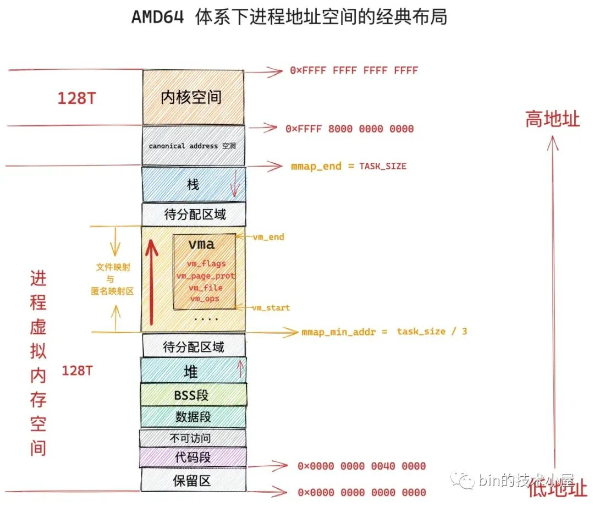

如果是文件映射的话，内核还会额外做一项工作，就是将分配出来的这段[虚拟内存](https://so.csdn.net/so/search?q=%E8%99%9A%E6%8B%9F%E5%86%85%E5%AD%98&spm=1001.2101.3001.7020)区域 vma 与映射文件关联映射起来。

    vma->vm_file = get_file(file);
    error = call_mmap(file, vma);

映射的核心就是将虚拟内存区域 vm\_area\_struct 相关的内存操作 `vma->vm_ops` 设置为文件系统的相关操作 `ext4_file_vm_ops`。这样一来，进程后续对这段虚拟内存的读写就相当于是读写映射文件了。

无论是匿名映射还是文件映射，内核在处理 mmap 映射过程中貌似都是在进程的[虚拟地址空间](https://so.csdn.net/so/search?q=%E8%99%9A%E6%8B%9F%E5%9C%B0%E5%9D%80%E7%A9%BA%E9%97%B4&spm=1001.2101.3001.7020)中和虚拟内存打交道，仅仅只是为 mmap 映射分配出一段虚拟内存而已，整个映射过程我们并没有看到物理内存的身影。

那么大家所关心的物理内存到底是什么时候映射进来的呢 ？这就是今天本文要讨论的主题 —— 缺页中断。

### 1\. 缺页中断产生的原因

如下图所示，当 mmap 系统调用成功返回之后，内核只是为进程分配了一段 \[vm\_start , vm\_end\] 范围内的虚拟内存区域 vma ，由于还未与物理内存发生关联，所以此时进程页表中与 mmap 映射的虚拟内存相关的各级页目录和页表项还都是空的。

当 CPU 访问这段由 mmap 映射出来的虚拟内存区域 vma 中的任意虚拟地址时，MMU 在遍历进程页表的时候就会发现，该虚拟内存地址在进程顶级页目录 PGD（Page Global Directory）中对应的页目录项 pgd\_t 是空的，该 pgd\_t 并没有指向其下一级页目录 PUD（Page Upper Directory）。

也就是说，此时进程页表中只有一张顶级页目录表 PGD，而上层页目录 PUD（Page Upper Directory），中间页目录 PMD（Page Middle Directory），一级页表（Page Table）内核都还没有创建。

由于现在被访问到的虚拟内存地址对应的 pgd\_t 是空的，进程的四级页表体系还未建立，所以 MMU 会产生一个缺页中断，进程从用户态转入内核态来处理这个缺页异常。

此时 CPU 会将发生缺页异常时，进程正在使用的相关寄存器中的值压入内核栈中。比如，引起进程缺页异常的虚拟内存地址会被存放在 CR2 寄存器中。同时 CPU 还会将缺页异常的错误码 error\_code 压入内核栈中。

随后内核会在 do\_page\_fault 函数中来处理缺页异常，该函数的参数都是内核在处理缺页异常的时候需要用到的基本信息：

    dotraplinkage void
    do_page_fault(struct pt_regs *regs, unsigned long error_code, unsigned long address)

struct pt\_regs 结构中存放的是缺页异常发生时，正在使用中的寄存器值的集合。address 表示触发缺页异常的虚拟内存地址。

error\_code 是对缺页异常的一个描述，目前内核只使用了 error\_code 的前六个比特位来描述引起缺页异常的具体原因，后面比特位的含义我们先暂时忽略。

`P(0)` : 如果 error\_code 第 0 个比特位置为 0 ，表示该缺页异常是由于 CPU 访问的这个虚拟内存地址 address 背后并没有一个物理内存页与之映射而引起的，站在进程页表的角度来说，就是 CPU 访问的这个虚拟内存地址 address 在进程四级页表体系中对应的各级页目录项或者页表项是空的（页目录项或者页表项中的 P 位为 0 ）。

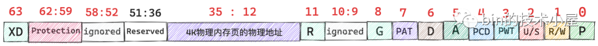

如果 error\_code 第 0 个比特位置为 1，表示 CPU 访问的这个虚拟内存地址背后虽然有物理内存页与之映射，但是由于访问权限不够而引起的缺页异常（保护异常），比如，进程尝试对一个只读的物理内存页进行写操作，那么就会引起写保护类型的缺页异常。

`R/W(1)` : 表示引起缺页异常的访问类型是什么 ？ 如果 error\_code 第 1 个比特位置为 0，表示是由于读访问引起的。置为 1 表示是由于写访问引起的。

\*\*注意：\*\*该标志位只是为了描述是哪种访问类型造成了本次缺页异常，这个和前面提到的访问权限没有关系。比如，进程尝试对一个可写的虚拟内存页进行写入，访问权限没有问题，但是该虚拟内存页背后并未有物理内存与之关联，所以也会导致缺页异常。这种情况下，error\_code 的 P 位就会设置为 0，R/W 位就会设置为 1 。

`U/S(2)`：表示缺页异常发生在用户态还是内核态，error\_code 第 2 个比特位设置为 0 表示 CPU 访问内核空间的地址引起的缺页异常，设置为 1 表示 CPU 访问用户空间的地址引起的缺页异常。

`RSVD(3)`：这里用于检测页表项中的保留位（Reserved 相关的比特位）是否设置，这些页表项中的保留位都是预留给内核以后的相关功能使用的，所以在缺页的时候需要检查这些保留位是否设置，从而决定近一步的扩展处理。设置为 1 表示页表项中预留的这些比特位被使用了。设置为 0 表示页表项中预留的这些比特位还没有被使用。

`I/D(4)`：设置为 1 ，表示本次缺页异常是在 CPU 获取指令的时候引起的。

`PK(5)`：设置为 1，表示引起缺页异常的虚拟内存地址对应页表项中的 Protection 相关的比特位被设置了。

error\_code 比特位的含义定义在文件 `/arch/x86/include/asm/traps.h` 中：

    /*
     * Page fault error code bits:
     *
     *   bit 0 ==	 0: no page found	1: protection fault
     *   bit 1 ==	 0: read access		1: write access
     *   bit 2 ==	 0: kernel-mode access	1: user-mode access
     *   bit 3 ==				1: use of reserved bit detected
     *   bit 4 ==				1: fault was an instruction fetch
     *   bit 5 ==				1: protection keys block access
     */
    enum x86_pf_error_code {
    	X86_PF_PROT	=		1 << 0,
    	X86_PF_WRITE	=		1 << 1,
    	X86_PF_USER	=		1 << 2,
    	X86_PF_RSVD	=		1 << 3,
    	X86_PF_INSTR	=		1 << 4,
    	X86_PF_PK	=		1 << 5,
    };

### 2\. 内核处理缺页中断的入口 —— do\_page\_fault

经过上一小节的介绍我们知道，缺页中断产生的根本原因是由于 CPU 访问的这段虚拟内存背后没有物理内存与之映射，表现的具体形式主要有三种：

1.  虚拟内存对应在进程页表体系中的相关各级页目录或者页表是空的，也就是说这段虚拟内存完全没有被映射过。
    
2.  虚拟内存之前被映射过，其在进程页表的各级页目录以及页表中均有对应的页目录项和页表项，但是其对应的物理内存被内核 swap out 到磁盘上了。
    
3.  虚拟内存虽然背后映射着物理内存，但是由于对物理内存的访问权限不够而导致的保护类型的缺页中断。比如，尝试去写一个只读的物理内存页。
    

虽然缺页中断产生的原因多种多样，内核也会根据不同的缺页原因进行不同的处理，但不管怎么说，一切的起点都是从 CPU 访问虚拟内存开始的，既然提到了虚拟内存，我们就不得不回顾一下进程虚拟内存空间的布局：

在 64 位体系结构下，进程虚拟内存空间总体上分为两个部分，一部分是 128T 的用户空间，地址范围为：0x0000 0000 0000 0000 - 0x0000 7FFF FFFF FFFF 。但实际上，Linux 内核是用 TASK\_SIZE\_MAX 来定义用户空间的末尾的，**也就是说 Linux 内核是使用 TASK\_SIZE\_MAX 来分割用户虚拟地址空间与内核虚拟地址空间的**。

    #define TASK_SIZE_MAX  task_size_max()
    
    #define task_size_max()  ((_AC(1,UL) << __VIRTUAL_MASK_SHIFT) - PAGE_SIZE)
    
    #define __VIRTUAL_MASK_SHIFT 47
    
    #define PAGE_SHIFT  12
    #define PAGE_SIZE  (_AC(1,UL) << PAGE_SHIFT)

TASK\_SIZE\_MAX 的计算逻辑首先是将 1 左移 47 位得到的地址是 0x0000800000000000，然后减去一个 PAGE\_SIZE （4K），就是 0x00007FFFFFFFF000，所以实际上，64 位体系结构的 Linux 内核中，**进程用户空间实际可用的虚拟地址范围是：0x0000 0000 0000 0000 - 0x0000 7FFF FFFF F000**。

进程虚拟内存空间的另一部分则是 128T 的内核空间，虚拟地址范围为：0xFFFF 8000 0000 0000 - 0xFFFF FFFF FFFF FFFF。由于在内核空间的一开始包含了 8T 的地址空洞，**所以内核空间实际可用的虚拟地址范围是：0xFFFF 8800 0000 0000 - 0xFFFF FFFF FFFF FFFF**。

既然进程虚拟内存地址范围有用户空间与内核空间之分，那么当 CPU 访问虚拟内存地址时产生的缺页中断也要区分下是用户空间产生的缺页还是内核空间产生的缺页。

    static int fault_in_kernel_space(unsigned long address)
    {
        /*
         * On 64-bit systems, the vsyscall page is at an address above
         * TASK_SIZE_MAX, but is not considered part of the kernel
         * address space.
         */
        if (IS_ENABLED(CONFIG_X86_64) && is_vsyscall_vaddr(address))
            return false;
        // 在进程虚拟内存空间中，TASK_SIZE_MAX 以上的虚拟地址均属于内核空间
        return address >= TASK_SIZE_MAX;
    }

当引起缺页中断的虚拟内存地址 address 是在 TASK\_SIZE\_MAX 之上时，表示该缺页地址是属于内核空间的，内核的缺页处理程序 \_\_do\_page\_fault 就要进入 do\_kern\_addr\_fault 分支去处理内核空间的缺页中断。

当引起缺页中断的虚拟内存地址 address 是在 TASK\_SIZE\_MAX 之下时，表示该缺页地址是属于用户空间的，内核则进入 do\_user\_addr\_fault 分支处理用户空间的缺页中断。

    static noinline void
    __do_page_fault(struct pt_regs *regs, unsigned long hw_error_code,
            unsigned long address)
    {
        // mmap_sem 是进程虚拟内存空间 mm_struct 的读写锁
        // 内核这里将 mmap_sem 预取到 cacheline 中，并标记为独占状态（ MESI 协议中的 X 状态）
        prefetchw(¤t->mm->mmap_sem);
    
        // 这里判断引起缺页异常的虚拟内存地址 address 是属于内核空间的还是用户空间的
        if (unlikely(fault_in_kernel_space(address)))
            // 如果缺页异常发生在内核空间，则由 vmalloc_fault 进行处理
            // 这里使用 unlikely 的原因是，内核对内存的使用通常是高优先级的而且使用比较频繁，所以内核空间一般很少发生缺页异常。
            do_kern_addr_fault(regs, hw_error_code, address);
        else
            // 缺页异常发生在用户态
            do_user_addr_fault(regs, hw_error_code, address);
    }
    NOKPROBE_SYMBOL(__do_page_fault);

进程工作在内核空间，就相当于你工作在你们公司的核心部门，负责的是公司的核心业务，公司所有的资源都会向核心部门倾斜，可以说是要什么给什么。

进程在内核空间工作也是一样的道理，由于内核负责的是整个系统最为核心的任务，基本上系统中所有的资源都会向内核倾斜，物理内存资源也是一样。内核对内存的申请优先级是最高的，使用频率也是最频繁的。

所以在为内核分配完虚拟内存之后，都会立即分配物理内存，而且是申请多少给多少，最大程度上优先保证内核的工作稳定进行。因此通常在内核中，缺页中断一般很少发生，这也是在上面那段内核代码中，用 unlikely 修饰 fault\_in\_kernel\_space 函数的原因。

而进程工作在用户空间，就相当于你工作在你们公司的非核心部门，负责的是公司的边缘业务，公司没有那么多的资源提供给你，你在工作中需要申请的资源，公司不会马上提供给你，而是需要延迟到没有这些资源你的工作就无法进行的时候（你真正必须使用的时候），公司迫不得已才会把资源分配给你。也就是说，你用到什么的时候才会给你什么，而不是像你在核心部门那样，要什么就给你什么。

比如，笔者在前面两篇文章中为大家介绍的 mmap 内存映射，就是工作在进程用户地址空间中的文件映射与匿名映射区，进程在使用 mmap 申请内存的时候，内核仅仅只是为进程在文件映射与匿名映射区分配一段虚拟内存，重要的物理内存资源不会马上分配，而是延迟到进程真正使用的时候，才会通过缺页中断 \_\_do\_page\_fault 进入到 do\_user\_addr\_fault 分支进行物理内存资源的分配。

内核空间中的缺页异常主要发生在进程内核虚拟地址空间中 32T 的 vmalloc 映射区，这段区域的虚拟内存地址范围为：0xFFFF C900 0000 0000 - 0xFFFF E900 0000 0000。内核中的 vmalloc 内存分配接口就工作在这个区域，它用于将那些不连续的物理内存映射到连续的虚拟内存上。

### 3\. 内核态缺页异常处理 —— do\_kern\_addr\_fault

do\_kern\_addr\_fault 函数的工作主要就是处理内核虚拟内存空间中 vmalloc 映射区里的缺页异常，这一部分内容，笔者会在 vmalloc\_fault 函数中进行介绍。

    static void
    do_kern_addr_fault(struct pt_regs *regs, unsigned long hw_error_code,
               unsigned long address)
    {
        // 该缺页的内核地址 address 在内核页表中对应的 pte 不能使用保留位(X86_PF_RSVD = 0)
        // 不能是用户态的缺页中断(X86_PF_USER = 0)
        // 且不能是保护类型的缺页中断 (X86_PF_PROT = 0)
        if (!(hw_error_code & (X86_PF_RSVD | X86_PF_USER | X86_PF_PROT))) {
            // 处理 vmalloc 映射区里的缺页异常
            if (vmalloc_fault(address) >= 0)
                return;
        }
    }  

读到这里，大家可能会有一个疑惑，作者你刚刚不是才说了吗，工作在内核就相当于工作在公司的核心部门，要什么资源公司就会给什么资源，在内核空间申请虚拟内存的时候，都会马上分配物理内存资源，而且申请多少给多少。

既然物理内存会马上被分配，那为什么内核空间中的 vmalloc 映射区还会发生缺页中断呢 ？

事实上，内核空间里 vmalloc 映射区中发生的缺页中断与用户空间里文件映射与匿名映射区以及堆中发生的缺页中断是不一样的。

进程在用户空间中无论是通过 brk 系统调用在堆中申请内存还是通过 mmap 系统调用在文件与匿名映射区中申请内存，内核都只是在相应的虚拟内存空间中划分出一段虚拟内存来给进程使用。

当进程真正访问到这段虚拟内存地址的时候，才会产生缺页中断，近而才会分配物理内存，最后将引起本次缺页的虚拟地址在进程页表中对应的全局页目录项 pgd，上层页目录项 pud，中间页目录 pmd，页表项 pte 都创建好，然后在 pte 中将虚拟内存地址与物理内存地址映射起来。

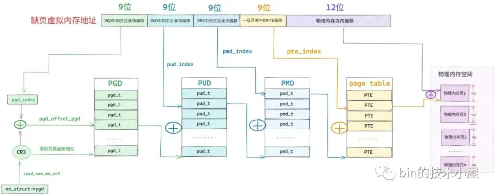

而内核通过 vmalloc 内存分配接口在 vmalloc 映射区申请内存的时候，首先也会在 32T 大小的 vmalloc 映射区中划分出一段未被使用的虚拟内存区域出来，我们暂且叫这段虚拟内存区域为 vmalloc 区，这一点和前面文章介绍的 mmap 非常相似，只不过 mmap 工作在用户空间的文件与匿名映射区，vmalloc 工作在内核空间的 vmalloc 映射区。

内核空间中的 vmalloc 映射区就是由这样一段一段的 vmalloc 区组成的，每调用一次 vmalloc 内存分配接口，就会在 vmalloc 映射区中映射出一段 vmalloc 虚拟内存区域，而且每个 vmalloc 区之间隔着一个 4K 大小的 guard page（虚拟内存），用于防止内存越界，将这些非连续的物理内存区域隔离起来。

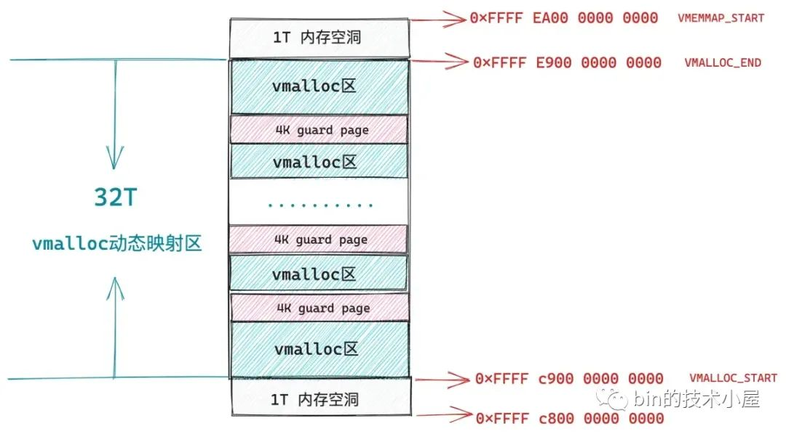

和 mmap 不同的是，vmalloc 在分配完虚拟内存之后，会马上为这段虚拟内存分配物理内存，内核会首先计算出由 vmalloc 内存分配接口映射出的这一段虚拟内存区域 vmalloc 区中包含的虚拟内存页数，然后调用伙伴系统依次为这些虚拟内存页分配物理内存页。

#### 3.1 vmalloc

下面是 vmalloc 内存分配的核心逻辑，封装在 \_\_vmalloc\_node\_range 函数中：

    /**
     * __vmalloc_node_range - allocate virtually contiguous memory
     * Allocate enough pages to cover @size from the page level
     * allocator with @gfp_mask flags.  Map them into contiguous
     * kernel virtual space, using a pagetable protection of @prot.
     *
     * Return: the address of the area or %NULL on failure
     */
    void *__vmalloc_node_range(unsigned long size, unsigned long align,
                unsigned long start, unsigned long end, gfp_t gfp_mask,
                pgprot_t prot, unsigned long vm_flags, int node,
                const void *caller)
    {
        // 用于描述 vmalloc 虚拟内存区域的数据结构，同 mmap 中的 vma 结构很相似
        struct vm_struct *area;
        // vmalloc 虚拟内存区域的起始地址
        void *addr;
        unsigned long real_size = size;
        // size 为要申请的 vmalloc 虚拟内存区域大小，这里需要按页对齐
        size = PAGE_ALIGN(size);
        // 因为在分配完 vmalloc 区之后，马上就会为其分配物理内存
        // 所以这里需要检查 size 大小不能超过当前系统中的空闲物理内存
        if (!size || (size >> PAGE_SHIFT) > totalram_pages())
            goto fail;
    
        // 在内核空间的 vmalloc 动态映射区中，划分出一段空闲的虚拟内存区域 vmalloc 区出来
        // 这里虚拟内存的分配过程和 mmap 在用户态文件与匿名映射区分配虚拟内存的过程非常相似，这里就不做过多的介绍了。
        area = __get_vm_area_node(size, align, VM_ALLOC | VM_UNINITIALIZED |
                    vm_flags, start, end, node, gfp_mask, caller);
        if (!area)
            goto fail;
        // 为 vmalloc 虚拟内存区域中的每一个虚拟内存页分配物理内存页
        // 并在内核页表中将 vmalloc 区与物理内存映射起来
        addr = __vmalloc_area_node(area, gfp_mask, prot, node);
        if (!addr)
            return NULL;
    
        return addr;
    }

同 mmap 用 vm\_area\_struct 结构来描述其在用户空间的文件与匿名映射区分配出来的虚拟内存区域一样，内核空间的 vmalloc 动态映射区也有一种数据结构来专门描述该区域中的虚拟内存区，这个结构就是下面的 vm\_struct。

    // 用来描述 vmalloc 区
    struct vm_struct {
        // vmalloc 动态映射区中的所有虚拟内存区域也都是被一个单向链表所串联
        struct vm_struct    *next;
        // vmalloc 区的起始内存地址
        void            *addr;
        // vmalloc 区的大小
        unsigned long       size;
        // vmalloc 区的相关标记
        // VM_ALLOC 表示该区域是由 vmalloc 函数映射出来的
        // VM_MAP 表示该区域是由 vmap 函数映射出来的
        // VM_IOREMAP 表示该区域是由 ioremap 函数将硬件设备的内存映射过来的
        unsigned long       flags;
        // struct page 结构的数组指针，数组中的每一项指向该虚拟内存区域背后映射的物理内存页。
        struct page     **pages;
        // 该虚拟内存区域包含的物理内存页个数
        unsigned int        nr_pages;
        // ioremap 映射硬件设备物理内存的时候填充
        phys_addr_t     phys_addr;
        // 调用者的返回地址（这里可忽略）
        const void      *caller;
    };

由于内核在分配完 vmalloc 虚拟内存区之后，会马上为其分配物理内存，所以在 vm\_struct 结构中有一个 struct page 结构的数组指针 pages，用于指向该虚拟内存区域背后映射的物理内存页。nr\_pages 则是数组的大小，也表示该虚拟内存区域包含的物理内存页个数。

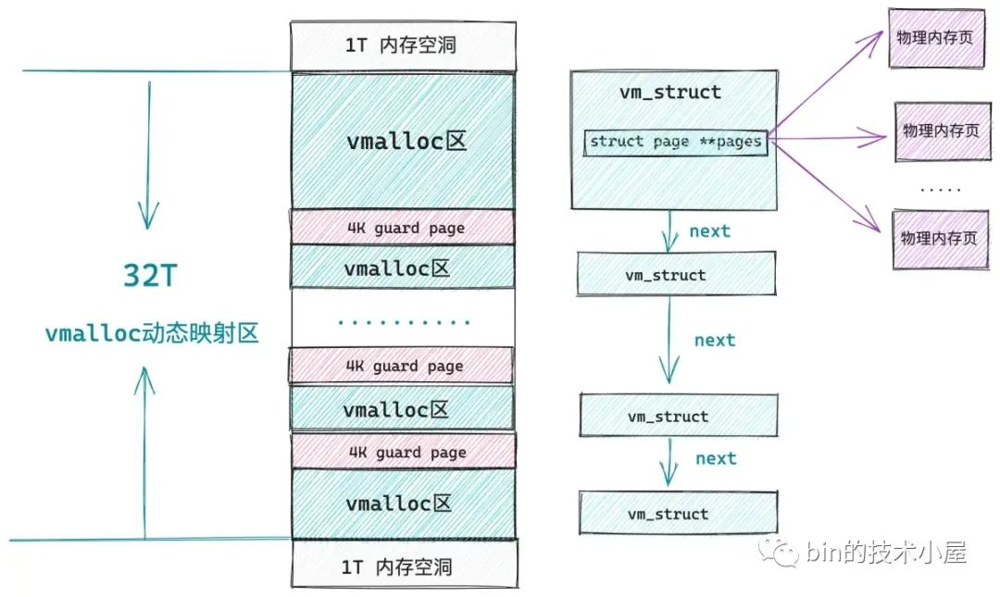

在内核中所有的这些 vm\_struct 均是被一个单链表串联组织的，在早期的内核版本中就是通过遍历这个单向链表来在 vmalloc 动态映射区中寻找空闲的虚拟内存区域的，后来为了提高查找效率引入了红黑树以及双向链表来重新组织这些 vmalloc 区域，于是专门引入了一个 vmap\_area 结构来描述 vmalloc 区域的组织形式。

    struct vmap_area {
        // vmalloc 区的起始内存地址
        unsigned long va_start;
        // vmalloc 区的结束内存地址
        unsigned long va_end;
        // vmalloc 区所在红黑树中的节点
        struct rb_node rb_node;         /* address sorted rbtree */
        // vmalloc 区所在双向链表中的节点
        struct list_head list;          /* address sorted list */
        // 用于关联 vm_struct 结构
        struct vm_struct *vm;          
    };

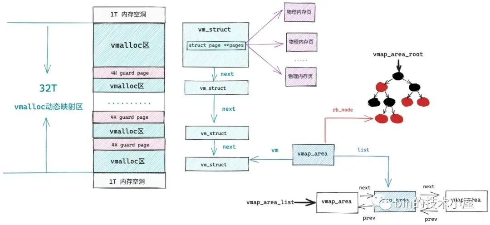

看起来和用户空间中虚拟内存区域的组织形式越来越像了，不同的是由于用户空间是进程间隔离的，所以组织用户空间虚拟内存区域的红黑树以及双向链表是进程独占的。

    struct mm_struct {
         struct vm_area_struct *mmap;  /* list of VMAs */
         struct rb_root mm_rb;
    }

而内核空间是所有进程共享的，所以组织内核空间虚拟内存区域的红黑树以及双向链表是全局的。

    static struct rb_root vmap_area_root = RB_ROOT;
    extern struct list_head vmap_area_list;

在我们了解了 vmalloc 动态映射区中的相关数据结构与组织形式之后，接下来我们看一看为 vmalloc 区分配物理内存的过程：

    static void *__vmalloc_area_node(struct vm_struct *area, gfp_t gfp_mask,
                     pgprot_t prot, int node)
    {
        // 指向即将为 vmalloc 区分配的物理内存页
        struct page **pages;
        unsigned int nr_pages, array_size, i;
    
        // 计算 vmalloc 区所需要的虚拟内存页个数
        nr_pages = get_vm_area_size(area) >> PAGE_SHIFT;
        // vm_struct 结构中的 pages 数组大小，用于存放指向每个物理内存页的指针
        array_size = (nr_pages * sizeof(struct page *));
    
        // 首先要为 pages 数组分配内存
        if (array_size > PAGE_SIZE) {
            // array_size 超过 PAGE_SIZE 大小则递归调用 vmalloc 分配数组所需内存
            pages = __vmalloc_node(array_size, 1, nested_gfp|highmem_mask,
                    PAGE_KERNEL, node, area->caller);
        } else {
            // 直接调用 kmalloc 分配数组所需内存
            pages = kmalloc_node(array_size, nested_gfp, node);
        }
    
        // 初始化 vm_struct
        area->pages = pages;
        area->nr_pages = nr_pages;
    
        // 依次为 vmalloc 区中包含的所有虚拟内存页分配物理内存
        for (i = 0; i < area->nr_pages; i++) {
            struct page *page;
    
            if (node == NUMA_NO_NODE)
                // 如果没有特殊指定 numa node，则从当前 numa node 中分配物理内存页
                page = alloc_page(alloc_mask|highmem_mask);
            else
                // 否则就从指定的 numa node 中分配物理内存页
                page = alloc_pages_node(node, alloc_mask|highmem_mask, 0);
            // 将分配的物理内存页依次存放到 vm_struct 结构中的 pages 数组中
            area->pages[i] = page;
        }
        
        atomic_long_add(area->nr_pages, &nr_vmalloc_pages);
        // 修改内核主页表，将刚刚分配出来的所有物理内存页与 vmalloc 虚拟内存区域进行映射
        if (map_vm_area(area, prot, pages))
            goto fail;
        // 返回 vmalloc 虚拟内存区域起始地址
        return area->addr;
    }

在内核中，凡是有物理内存出现的地方，就一定伴随着页表的映射，vmalloc 也不例外，当分配完物理内存之后，就需要修改内核页表，然后将物理内存映射到 vmalloc 虚拟内存区域中，当然了，这个过程也伴随着 vmalloc 区域中的这些虚拟内存地址在内核页表中对应的 pgd，pud，pmd，pte 相关页目录项以及页表项的创建。

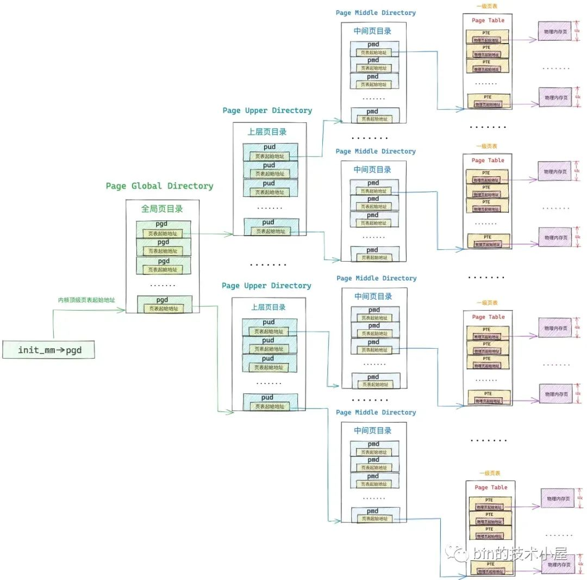

大家需要注意的是，这里的内核页表指的是内核主页表，内核主页表的顶级页目录起始地址存放在 init\_mm 结构中的 pgd 属性中，其值为 swapper\_pg\_dir。

    struct mm_struct init_mm = {
       // 内核主页表
      .pgd    = swapper_pg_dir,
    }
    
    #define swapper_pg_dir init_top_pgt

内核主页表在系统初始化的时候被一段汇编代码 `arch\x86\kernel\head_64.S` 所创建。后续在系统启动函数 start\_kernel 中调用 setup\_arch 进行初始化。

正如之前文章[《一步一图带你构建 Linux 页表体系》](https://mp.weixin.qq.com/s?__biz=Mzg2MzU3Mjc3Ng==&mid=2247488477&idx=1&sn=f8531b3220ea3a9ca2a0fdc2fd9dabc6&chksm=ce77d59af9005c8c2ef35c7e45f45cbfc527bfc4b99bbd02dbaaa964d174a4009897dd329a4d&scene=21&cur_album_id=2559805446807928833#wechat_redirect) 中介绍的那样，普通进程在内核态亦或是内核线程都是无法直接访问内核主页表的，它们只能访问内核主页表的 copy 副本，于是进程页表体系就分为了两个部分，一个是进程用户态页表（用户态缺页处理的就是这部分），另一个就是内核页表的 copy 部分（内核态缺页处理的是这部分）。

在 fork 系统调用创建进程的时候，进程的用户态页表拷贝自他的父进程，而进程的内核态页表则从内核主页表中拷贝，后续进程陷入内核态之后，访问的就是内核主页表中拷贝的这部分。

这也引出了一个新的问题，就是内核主页表与其在进程中的拷贝副本如何同步呢 ？ 这就是本小节，笔者想要和大家交代的主题 —— 内核态缺页异常的处理。

#### 3.2 vmalloc\_fault

当内核通过 vmalloc 内存分配接口修改完内核主页表之后，主页表中的相关页目录项以及页表项的内容就发生了改变，而这背后的一切，进程现在还被蒙在鼓里，一无所知，此时，进程页表中的内核部分相关的页目录项以及页表项还都是空的。

当进程陷入内核态访问这部分页表的的时候，会发现相关页目录或者页表项是空的，就会进入缺页中断的内核处理部分，也就是前面提到的 vmalloc\_fault 函数中，如果发现缺页的虚拟地址在内核主页表顶级全局页目录表中对应的页目录项 pgd 存在，而缺页地址在进程页表内核部分对应的 pgd 不存在，那么内核就会把内核主页表中 pgd 页目录项里的内容复制给进程页表内核部分中对应的 pgd。

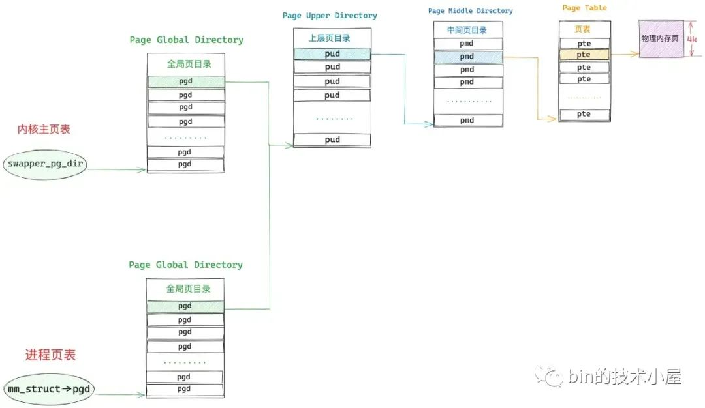

事实上，同步内核主页表的工作只需要将缺页地址对应在内核主页表中的顶级全局页目录项 pgd 同步到进程页表内核部分对应的 pgd 地址处就可以了，正如上图中所示，每一级的页目录项中存放的均是其下一级页目录表的物理内存地址。

例如内核主页表这里的 pgd 存放的是其下一级 —— 上层页目录 PUD 的起始物理内存地址 ，PUD 中的页目录项 pud 又存放的是其下一级 —— 中间页目录 PMD 的起始物理内存地址，依次类推，中间页目录项 pmd 存放的又是页表的起始物理内存地址。

既然每一级页目录表中的页目录项存放的都是其下一级页目录表的起始物理内存地址，那么页目录项中存放的就相当于是下一级页目录表的引用，这样一来我们就只需要同步最顶级的页目录项 pgd 就可以了，后面只要与该 pgd 相关的页目录表以及页表发生任何变化，由于是引用的关系，这些改变都会立刻自动反应到进程页表的内核部分中，后面就不需要同步了。

    /*
     * 64-bit:
     *
     *   Handle a fault on the vmalloc area
     */
    static noinline int vmalloc_fault(unsigned long address)
    {
        // 分别是缺页虚拟地址 address 对应在内核主页表的全局页目录项 pgd_k ，以及进程页表中对应的全局页目录项 pgd
        pgd_t *pgd, *pgd_k;
        // p4d_t 用于五级页表体系，当前 cpu 架构体系下一般采用的是四级页表
        // 在四级页表下 p4d 是空的，pgd 的值会赋值给 p4d
        p4d_t *p4d, *p4d_k;
        // 缺页虚拟地址 address 对应在进程页表中的上层目录项 pud
        pud_t *pud;
        // 缺页虚拟地址 address 对应在进程页表中的中间目录项 pmd
        pmd_t *pmd;
        // 缺页虚拟地址 address 对应在进程页表中的页表项 pte
        pte_t *pte;
    
        // 确保缺页发生在内核 vmalloc 动态映射区
        if (!(address >= VMALLOC_START && address < VMALLOC_END))
            return -1;
    
        // 获取缺页虚拟地址 address 对应在进程页表的全局页目录项 pgd
        pgd = (pgd_t *)__va(read_cr3_pa()) + pgd_index(address);
        // 获取缺页虚拟地址 address 对应在内核主页表的全局页目录项 pgd_k
        pgd_k = pgd_offset_k(address);
    
        // 如果内核主页表中的 pgd_k 本来就是空的，说明 address 是一个非法访问的地址，返回 -1 
        if (pgd_none(*pgd_k))
            return -1;
    
        // 如果开启了五级页表，那么顶级页表就是 pgd，这里只需要同步顶级页表项就可以了
        if (pgtable_l5_enabled()) {
            // 内核主页表中的 pgd_k 不为空，进程页表中的 pgd 为空，那么就同步页表
            if (pgd_none(* )) {
                // 将主内核页表中的 pgd_k 内容复制给进程页表对应的 pgd
                set_pgd(pgd, *pgd_k);
                // 刷新 mmu
                arch_flush_lazy_mmu_mode();
            } else {
                BUG_ON(pgd_page_vaddr(*pgd) != pgd_page_vaddr(*pgd_k));
            }
        }
    
        // 四级页表体系下，p4d 是顶级页表项，同样也是只需要同步顶级页表项即可，同步逻辑和五级页表一模一样
        // 因为是四级页表，所以这里会将 pgd 赋值给 p4d，p4d_k ，后面就直接把 p4d 看做是顶级页表了。
        p4d = p4d_offset(pgd, address);
        p4d_k = p4d_offset(pgd_k, address);
        // 内核主页表为空，则停止同步，返回 -1 ，表示正在访问一个非法地址
        if (p4d_none(*p4d_k))
            return -1;
        // 内核主页表不为空，进程页表为空，则同步内核顶级页表项 p4d_k 到进程页表对应的 p4d 中，然后刷新 mmu
        if (p4d_none(*p4d) && !pgtable_l5_enabled()) {
            set_p4d(p4d, *p4d_k);
            arch_flush_lazy_mmu_mode();
        } else {
            BUG_ON(p4d_pfn(*p4d) != p4d_pfn(*p4d_k));
        }
    
        // 到这里，页表的同步工作就完成了，下面代码用于检查内核地址 address 在进程页表内核部分中是否有物理内存进行映射
        // 如果没有，则返回 -1 ,说明进程在访问一个非法的内核地址，进程随后会被 kill 掉
        // 返回 0 表示表示地址 address 背后是有物理内存映射的， vmalloc 动态映射区的缺页处理到此结束。
    
        // 根据顶级页目录项 p4d 获取 address 在进程页表中对应的上层页目录项 pud
        pud = pud_offset(p4d, address);
        if (pud_none(*pud))
            return -1;
        // 该 pud 指向的是 1G 大页内存
        if (pud_large(*pud))
            return 0;
         // 根据 pud 获取 address 在进程页表中对应的中间页目录项 pmd
        pmd = pmd_offset(pud, address);
        if (pmd_none(*pmd))
            return -1;
        // 该 pmd 指向的是 2M 大页内存
        if (pmd_large(*pmd))
            return 0;
        // 根据 pmd 获取 address 对应的页表项 pte
        pte = pte_offset_kernel(pmd, address);
        // 页表项 pte 并没有映射物理内存
        if (!pte_present(*pte))
            return -1;
    
        return 0;
    }
    NOKPROBE_SYMBOL(vmalloc_fault);

在我们聊完内核主页表的同步过程之后，可能很多读者朋友不禁要问，既然已经有了内核主页表，而且内核地址空间包括内核页表又是所有进程共享的，那进程为什么不能直接访问内核主页表而是要访问主页表的拷贝部分呢 ？ 这样还能省去拷贝内核主页表（fork 时候）以及同步内核主页表（缺页时候）这些个开销。

之所以这样设计一方面有硬件限制的原因，毕竟每个 CPU 核心只会有一个 CR3 寄存器来存放进程页表的顶级页目录起始物理内存地址，没办法同时存放进程页表和内核主页表。

另一方面的原因则是操作页表都是需要对其进行加锁的，无论是操作进程页表还是内核主页表。而且在操作页表的过程中可能会涉及到物理内存的分配，这也会引起进程的阻塞。

而进程本身可能处于中断上下文以及竞态区中，不能加锁，也不能被阻塞，如果直接对内核主页表加锁的话，那么系统中的其他进程就只能阻塞等待了。所以只能而且必须是操作主内核页表的拷贝，不能直接操作内核主页表。

好了，该向大家交代的现在都已经交代完了，我们闲话不多说，继续本文的主题内容~~~

### 4\. 用户态缺页异常处理 —— do\_user\_addr\_fault

进程用户态虚拟地址空间的布局我们现在已经非常熟悉了，在处理用户态缺页异常之前，内核需要在进程用户空间众多的虚拟内存区域 vma 之中找到引起缺页的内存地址 address 究竟是属于哪一个 vma 。如果没有一个 vma 能够包含 address ， 那么就说明该 address 是一个还未被分配的虚拟内存地址，进程对该地址的访问是非法的，自然也就不用处理缺页了。

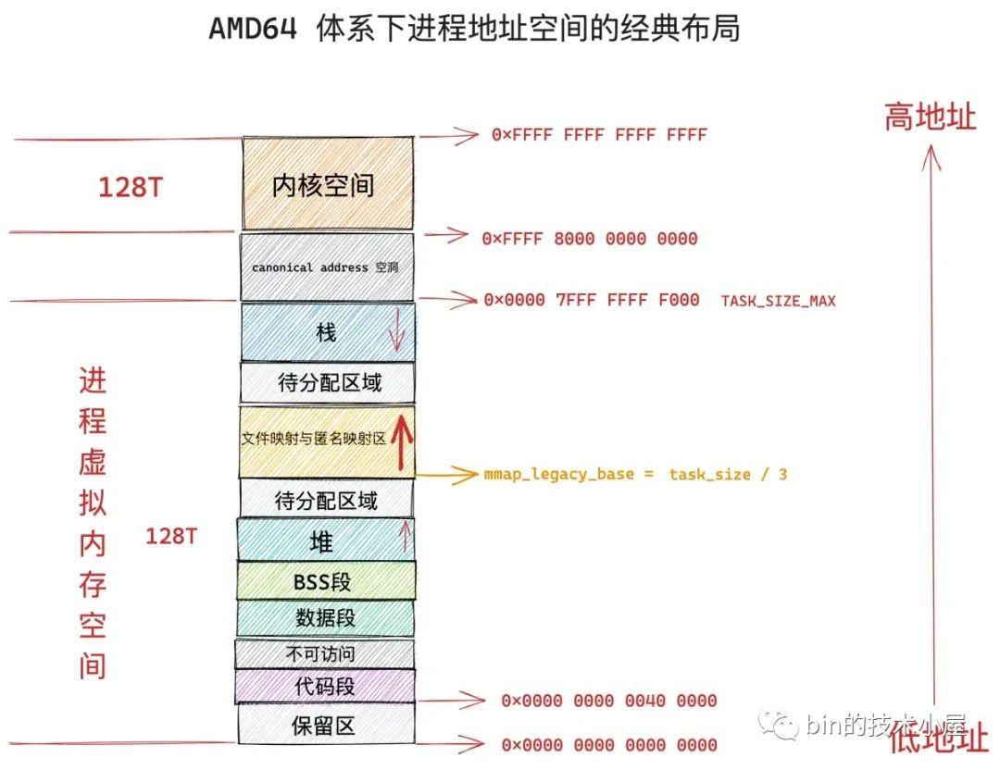

所以内核就需要根据缺页地址 address 通过 find\_vma 函数在进程地址空间中找出符合 `address < vma->vm_end` 条件的第一个 vma 出来，也就是挨着 address 最近的一个 vma。

而缺页地址 address 可以出现在进程地址空间中的任意位置，根据 address 的分布会有下面三种情况：

第一种情况就是 address 的后面没有一个 vma 出现，也就是说进程地址空间中没有一个 vma 符合条件：`address < vma->vm_end`。进程访问的是一个还未分配的虚拟内存地址，属于非法地址访问，不需要处理缺页。

第二种情况就是 address 恰巧包含在一个 vma 中，这个自然是正常情况，内核开始处理该 vma 区域的缺页异常。

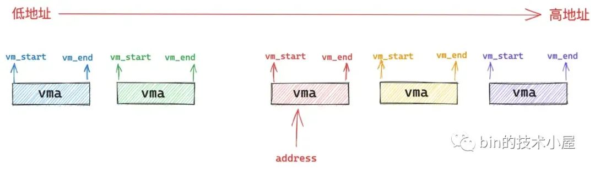

第三种情况是 address 不巧落在了 find\_vma 的前面，也就是 `address < find_vma->vm_start`。这种情况自然也是非法地址访问，不需要处理缺页。

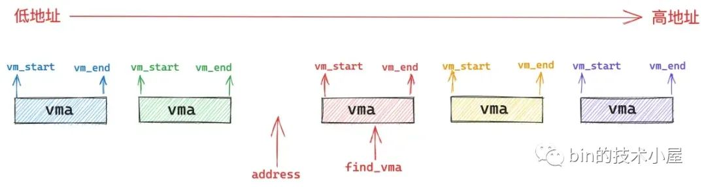

但是这里有一种特殊情况就是万一这个 find\_vma 是栈区怎么办呢 ？ 栈是允许扩展的但不允许收缩，如果压栈指令 push 引用了一个栈区之外的地址 address，这种异常不是由程序错误所引起的，因此缺页处理程序需要单独处理栈区的扩展。

如果 find\_vma 中的 vm\_flags 标记了 VM\_GROWSDOWN，表示该 vma 中的地址增长方向是由高到底了，说明这个 vma 可能是栈区域，近而需要到 expand\_stack 函数中判断是否允许扩展栈，如果允许的话，就将栈所属的 vma 起始地址 vm\_start 扩展至 address 处。

现在我们已经校验完了 vma，并确定了缺页地址 address 是一个合法的地址，下面就可以放心地调用 handle\_mm\_fault 函数对这块 vma 进行缺页处理了。

    /* Handle faults in the user portion of the address space */
    static inline
    void do_user_addr_fault(struct pt_regs *regs,
                unsigned long hw_error_code,
                unsigned long address)
    {
        struct vm_area_struct *vma;
        struct task_struct *tsk;
        struct mm_struct *mm;
     
        tsk = current;
        mm = tsk->mm;
    
           .............. 省略 ..............
    
        // 在进程虚拟地址空间查找第一个符合条件：address < vma->vm_end 的虚拟内存区域 vma
        vma = find_vma(mm, address);
        // 如果该缺页地址 address 后面没有 vma 跳转到 bad_area 处理异常
        if (unlikely(!vma)) {
            bad_area(regs, hw_error_code, address);
            return;
        }
        // 缺页地址 address 恰好落在一个 vma 中，跳转到 good_area 处理 vma 中的缺页
        if (likely(vma->vm_start <= address))
            goto good_area;
        // 上面第三种情况，vma 不是栈区，跳转到 bad_area
        if (unlikely(!(vma->vm_flags & VM_GROWSDOWN))) {
            bad_area(regs, hw_error_code, address);
            return;
        }
        // vma 是栈区，尝试扩展栈区到 address 地址处
        if (unlikely(expand_stack(vma, address))) {
            bad_area(regs, hw_error_code, address);
            return;
        }
    
        /*
         * Ok, we have a good vm_area for this memory access, so
         * we can handle it..
         */
    good_area:
        // 处理 vma 区域的缺页异常，返回值 fault 是一个位图，用于描述缺页处理过程中发生的状况信息。
        fault = handle_mm_fault(vma, address, flags);
        // 本次缺页是否属于 VM_FAULT_MAJOR，缺页处理过程中是否发生了物理内存的分配以及磁盘 IO
        // 与其对应的是 VM_FAULT_MINOR 表示缺页处理过程中所需内存页已经存在于内存中了，只是修改页表即可。
        major |= fault & VM_FAULT_MAJOR;
    
        /*
         * Major/minor page fault accounting. If any of the events
         * returned VM_FAULT_MAJOR, we account it as a major fault.
         */
        if (major) {
            // 统计进程总共发生的 VM_FAULT_MAJOR 次数
            tsk->maj_flt++;
            perf_sw_event(PERF_COUNT_SW_PAGE_FAULTS_MAJ, 1, regs, address);
        } else {
            // 统计进程总共发生的 VM_FAULT_MINOR 次数
            tsk->min_flt++;
            perf_sw_event(PERF_COUNT_SW_PAGE_FAULTS_MIN, 1, regs, address);
        }
    
    }
    NOKPROBE_SYMBOL(do_user_addr_fault);

handle\_mm\_fault 函数会返回一个 unsigned int 类型的位图 vm\_fault\_t，通过这个位图可以简要描述一下在整个缺页异常处理的过程中究竟发生了哪些状况，方便内核对各种状况进行针对性处理。

    /**
     * Page fault handlers return a bitmask of %VM_FAULT values.
     */
    typedef __bitwise unsigned int vm_fault_t;

比如，位图 vm\_fault\_t 的第三个比特位置为 1 表示 VM\_FAULT\_MAJOR，置为 0 表示 VM\_FAULT\_MINOR。

    enum vm_fault_reason {
    	VM_FAULT_MAJOR          = (__force vm_fault_t)0x000004,
    };

VM\_FAULT\_MAJOR 的意思是本次缺页所需要的物理内存页还不在内存中，需要重新分配以及需要启动磁盘 IO，从磁盘中 swap in 进来。

VM\_FAULT\_MINOR 的意思是本次缺页所需要的物理内存页已经加载进内存中了，缺页处理只需要修改页表重新映射一下就可以了。

我们来看一个具体的例子，笔者在之前的文章 [《从内核世界透视 mmap 内存映射的本质（原理篇）》](https://mp.weixin.qq.com/s?__biz=Mzg2MzU3Mjc3Ng==&mid=2247488750&idx=1&sn=247a4603299e203793fac8b6c5e61071&chksm=ce77d2a9f9005bbf3b024bc9f9192f2de63a70fd33db1113d9f9c0d8a1ced2099fbeb727a3d7&token=1862605518&lang=zh_CN&scene=21#wechat_redirect)中为大家介绍多个进程调用 mmap 对磁盘上的同一个文件进行共享文件映射的时候，此时在各个进程的地址空间中都只是各自分配了一段虚拟内存用于共享文件映射而已，还没有分配物理内存页。

当第一个进程开始访问这段虚拟内存映射区时，由于没有物理内存页，页表还是空的，于是产生缺页中断，内核则会在伙伴系统中分配一个物理内存页，然后将新分配的内存页加入到 page cache 中。

然后调用 readpage 激活块设备驱动从磁盘中读取映射的文件内容，用读取到的内容填充新分配的内存页，最后在进程 1 页表中建立共享映射的这段虚拟内存与 page cache 中缓存的文件页之间的关联。

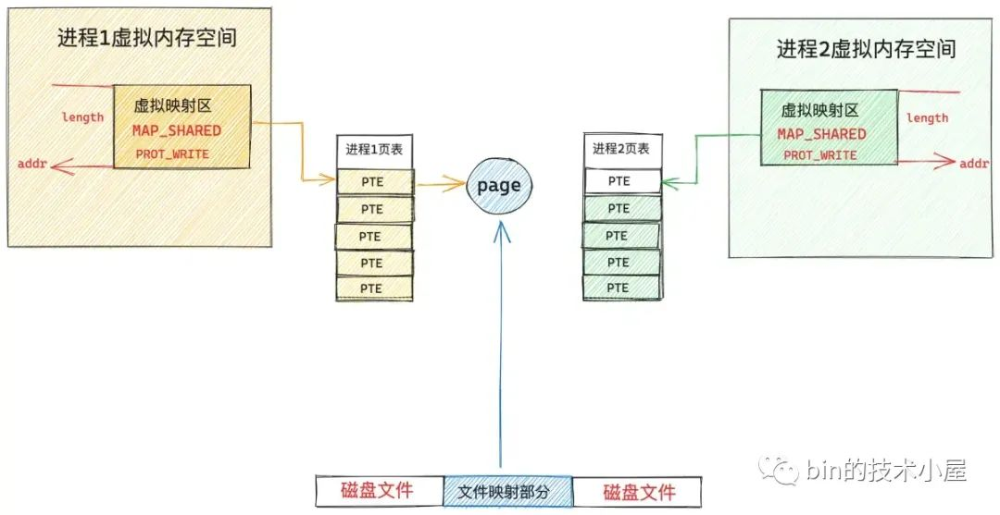

由于进程 1 的缺页处理发生了物理内存的分配以及磁盘 IO ，所以本次缺页处理属于 VM\_FAULT\_MAJOR。

当进程 2 访问其地址空间中映射的这段虚拟内存时，由于页表是空的，也会发生缺页，但是当进程 2 进入内核中发现所映射的文件页已经被进程 1 加载进 page cache 中了，进程 2 的缺页处理只需要将这个文件页映射进自己的页表就可以了，不需要重新分配内存以及发生磁盘 IO 。这种情况就属于 VM\_FAULT\_MINOR。

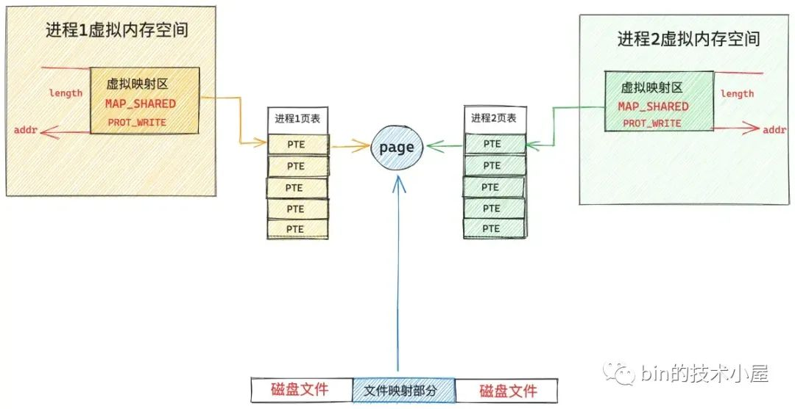

最后需要将进程总共发生的 VM\_FAULT\_MAJOR 次数以及 VM\_FAULT\_MINOR 次数统计到进程 task\_struct 结构中的相应字段中：

    struct task_struct {
        // 进程总共发生的 VM_FAULT_MINOR 次数
        unsigned long           min_flt;
         // 进程总共发生的 VM_FAULT_MAJOR 次数
        unsigned long           maj_flt;
    }

我们可以在 ps 命令上增加 `-o` 选项，添加 maj\_flt ，min\_flt 数据列来查看各个进程的 VM\_FAULT\_MAJOR 次数和 VM\_FAULT\_MINOR 次数。

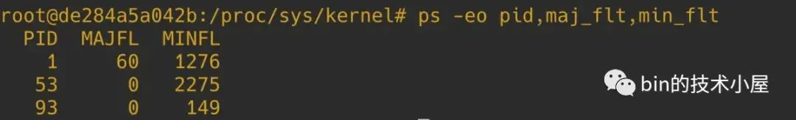

### 5\. handle\_mm\_fault 完善进程页表体系

饶了一大圈，现在我们终于来到了缺页处理的核心逻辑，之前笔者提到，引起缺页中断的原因大概有三种：

-   第一种是 CPU 访问的虚拟内存地址 address 之前完全没有被映射过，其在页表中对应的各级页目录项以及页表项都还是空的。
    
-   第二种是 address 之前被映射过，但是映射的这块物理内存被内核 swap out 到磁盘上了。
    
-   第三种是 address 背后映射的物理内存还在，只是由于访问权限不够引起的缺页中断，比如，后面要为大家介绍的写时复制（COW）机制就属于这一种。
    

下面笔者一种接一种的带大家一起梳理，我们先来看第一种情况：

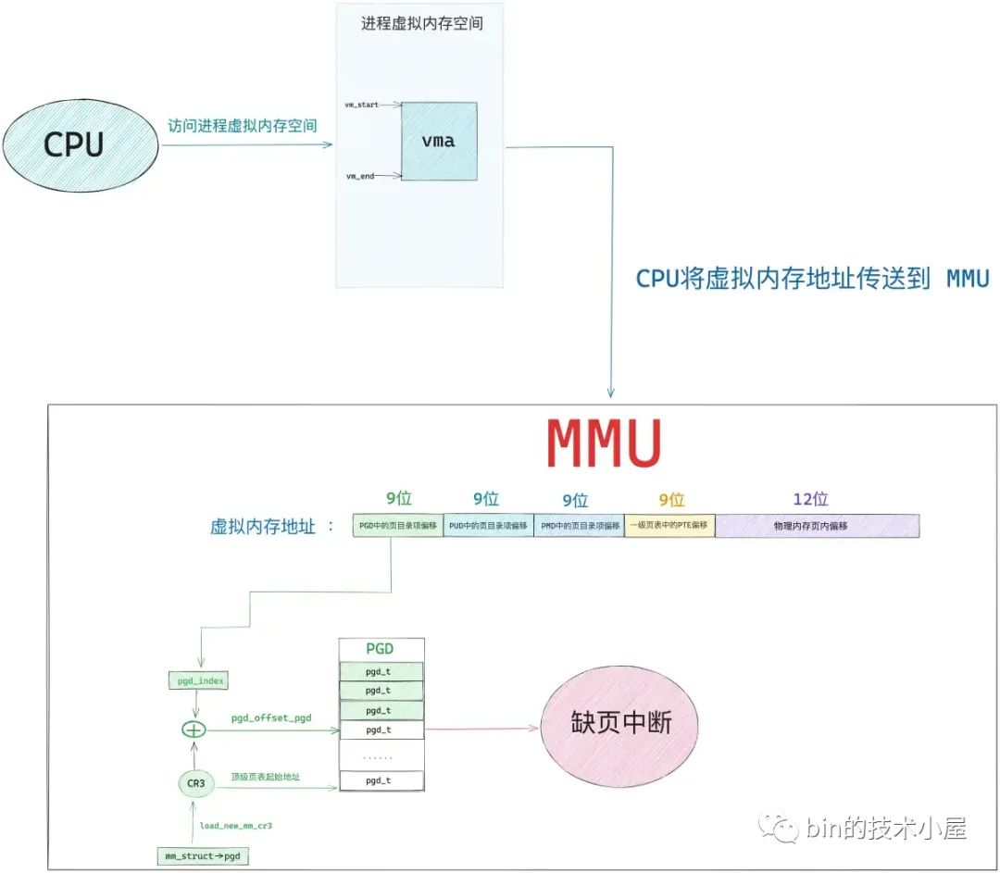

由于现在正在被访问的虚拟内存地址 address 之前从来没有被映射过，所以该虚拟内存地址在进程页表中的各级页目录表中的目录项以及页表中的页表项都是空的。内核的首要任务就是先要将这些缺失的页目录项和页表项一一补齐。

笔者在之前的文章[《一步一图带你构建 Linux 页表体系》](https://mp.weixin.qq.com/s?__biz=Mzg2MzU3Mjc3Ng==&mid=2247488477&idx=1&sn=f8531b3220ea3a9ca2a0fdc2fd9dabc6&chksm=ce77d59af9005c8c2ef35c7e45f45cbfc527bfc4b99bbd02dbaaa964d174a4009897dd329a4d&scene=21&cur_album_id=2559805446807928833#wechat_redirect) 中曾为大家介绍过，在当前 64 位体系架构下，其实只使用了 48 位来描述进程的虚拟内存空间，其中用户态地址空间 128T，内核态地址空间 128T，所以我们只需要使用 48 位的虚拟内存地址就可以表示进程虚拟内存空间中的任意地址了。

而这 48 位的虚拟内存地址内又分为五个部分，它们分别是虚拟内存地址在全局页目录表 PGD 中对应的页目录项 pgd\_t 的偏移，在上层页目录表 PUD 中对应的页目录项 pud\_t 的偏移，在中间页目录表 PMD 中对应的页目录项 pmd\_t 的偏移，在页表中对应的页表项 pte\_t 的偏移，以及在其背后映射的物理内存页中的偏移。

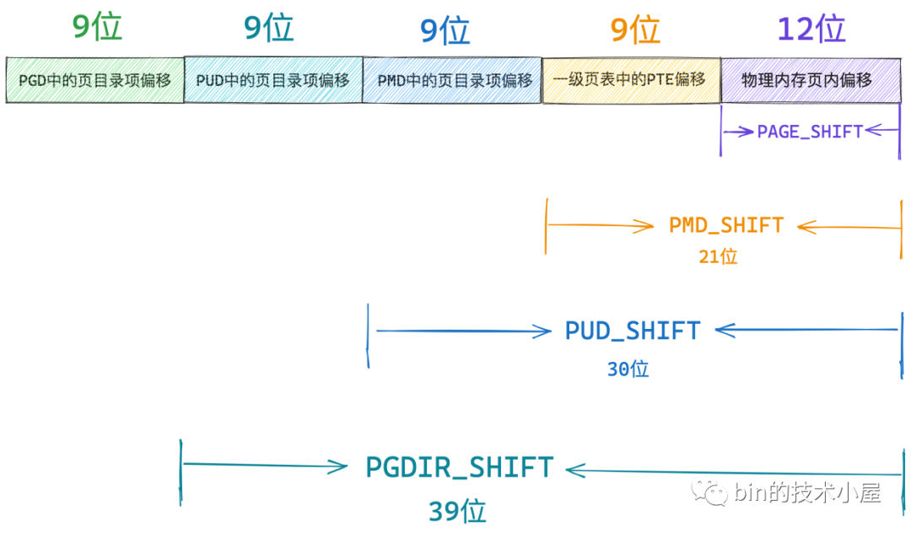

内核中使用 `unsigned long` 类型来表示各级页目录中的目录项以及页表中的页表项，在 64 位系统中它们都是占用 8 字节。

    // 定义在内核文件：/arch/x86/include/asm/pgtable_64_types.h
    typedef unsigned long pteval_t;
    typedef unsigned long pmdval_t;
    typedef unsigned long pudval_t;
    typedef unsigned long pgdval_t;
    
    typedef struct { pteval_t pte; } pte_t;
    
    // 定义在内核文件：/arch/x86/include/asm/pgtable_types.h
    typedef struct { pmdval_t pmd; } pmd_t;
    typedef struct { pudval_t pud; } pud_t;
    typedef struct { pgdval_t pgd; } pgd_t;

而各级页目录表以及页表在内核中其实本质上都是一个 4K 物理内存页，只不过这些物理内存页存放的内容比较特殊，它们存放的是页目录项和页表项。一张页目录表可以存放 512 个页目录项，一张页表可以存放 512 个页表项

    // 全局页目录表 PGD 可以容纳的页目录项 pgd_t 的个数
    #define PTRS_PER_PGD  512
    // 上层页目录表 PUD 可以容纳的页目录项 pud_t 的个数
    #define PTRS_PER_PUD  512
    // 中间页目录表 PMD 可以容纳的页目录项 pmd_t 的个数
    #define PTRS_PER_PMD  512
    // 页表可以容纳的页表项 pte_t 的个数
    #define PTRS_PER_PTE  512

因此我们可以把全局页目录表 PGD 看做是一个能够存放 512 个 pgd\_t 的数组 —— pgd\_t\[PTRS\_PER\_PGD\]，虚拟内存地址对应在 pgd\_t\[PTRS\_PER\_PGD\] 数组中的索引使用 9 个比特位就可以表示了。

在内核中使用 pgd\_offset 函数来定位虚拟内存地址在全局页目录表 PGD 中对应的页目录项 pgd\_t，这个过程和访问数组一模一样，事实上整个 PGD 就是一个 pgd\_t\[PTRS\_PER\_PGD\] 数组。

首先我们通过 mm\_struct-> pgd 获取 pgd\_t\[PTRS\_PER\_PGD\] 数组的首地址（全局页目录表 PGD 的起始内存地址），然后将虚拟内存地址右移 PGDIR\_SHIFT（39）位再用掩码 `PTRS_PER_PGD - 1` 将高位全部掩去，只保留低 9 位得到虚拟内存地址在 pgd\_t\[PTRS\_PER\_PGD\] 数组中的索引偏移 pgd\_index。

然后将 mm\_struct-> pgd 与 pgd\_index 相加就可以定位到虚拟内存地址在全局页目录表 PGD 中的页目录项 pgd\_t 了。

    /*
     * a shortcut to get a pgd_t in a given mm
     */
    #define pgd_offset(mm, address) pgd_offset_pgd((mm)->pgd, (address))
    
    #define pgd_offset_pgd(pgd, address) (pgd + pgd_index((address)))
    
    #define pgd_index(address) (((address) >> PGDIR_SHIFT) & (PTRS_PER_PGD - 1))
    
    #define PGDIR_SHIFT		39
    #define PTRS_PER_PGD		512

在后续即将要介绍的源码实现中，大家还会看到一个 p4d 的页目录，该页目录用于在五级页表体系下表示四级页目录。

    typedef unsigned long	p4dval_t;
    typedef struct { p4dval_t p4d; } p4d_t;

而在四级页表体系下，这个 p4d 就不起作用了，但为了代码上的统一处理，在四级页表下，前面定位到的顶级页目录项 pgd\_t 会赋值给四级页目录项 p4d\_t，后续处理都会将 p4d\_t 看做是顶级页目录项，这一点需要和大家在这里先提前交代清楚。

    static inline p4d_t *p4d_offset(pgd_t *pgd, unsigned long address)
    {
        if (!pgtable_l5_enabled())
            // 四级页表体系下，p4d_t 其实就是顶级页目录项
            return (p4d_t *)pgd;
        return (p4d_t *)pgd_page_vaddr(*pgd) + p4d_index(address);
    }

现在我们已经通过 pgd\_offset 定位到虚拟内存地址 address 对应在全局页目录 PGD 的页目录项 pgd\_t（p4d\_t）了。

接下来的任务就是根据这个 p4d\_t 定位虚拟内存对应在上层页目录 PUD 中的页目录项 pud\_t。但在定位之前，我们需要首先判断这个 p4d\_t 是否是空的，如果是空的，说明在目前的进程页表中还不存在对应的 PUD，需要马上创建一个新的出来。

而 PUD 的相关信息全部都保存在 p4d\_t 里，我们可以通过 native\_p4d\_val 函数将顶级页目录项 p4d\_t 中的值获取出来。

    static inline p4dval_t native_p4d_val(p4d_t p4d)
    {
    	return p4d.p4d;
    }

在 64 位系统中，各级页目录项都是用 `unsigned long` 类型来表示的，共 8 个字节，64 个 bit，还记得我们之前在[《一步一图带你构建 Linux 页表体系》](https://mp.weixin.qq.com/s?__biz=Mzg2MzU3Mjc3Ng==&mid=2247488477&idx=1&sn=f8531b3220ea3a9ca2a0fdc2fd9dabc6&chksm=ce77d59af9005c8c2ef35c7e45f45cbfc527bfc4b99bbd02dbaaa964d174a4009897dd329a4d&scene=21&cur_album_id=2559805446807928833#wechat_redirect) 一文中介绍的页目录项比特位布局吗 ？

在页目录项刚刚被创建出来的时候，内核会将他们全部初始化为 0 值，如果一个页目录项中除了第 5 , 6 比特位之外剩下的比特位全都为 0 的话，则表示这个页目录项是空的。

    static inline int p4d_none(p4d_t p4d)
    {
        // p4d_t 中除了第 5，6 比特位之外，剩余比特位如果全是 0 则表示 p4d_t 是空的
        return (native_p4d_val(p4d) & ~(_PAGE_KNL_ERRATUM_MASK)) == 0;
    }
    // 页目录项中第 5, 6 比特位置为 1
    #define _PAGE_KNL_ERRATUM_MASK (_PAGE_DIRTY | _PAGE_ACCESSED)

如果我们通过 p4d\_none 函数判断出顶级页目录项 p4d 是空的，那么就需要调用 \_\_pud\_alloc 函数分配一个新的上层页目录表 PUD 出来，然后用 PUD 的起始物理内存地址以及页目录项的初始权限位 \_PAGE\_TABLE 填充 p4d。

    /*
     * Allocate page upper directory.
     * We've already handled the fast-path in-line.
     */
    int __pud_alloc(struct mm_struct *mm, p4d_t *p4d, unsigned long address)
    {
        // 调用 get_zeroed_page 申请一个 4k 物理内存页并初始化为 0 值作为新的 PUD
        // new 指向新分配的 PUD 起始内存地址
        pud_t *new = pud_alloc_one(mm, address);
        if (!new)
            return -ENOMEM;
        // 操作进程页表需要加锁
        spin_lock(&mm->page_table_lock);
        // 如果顶级页目录项 p4d 中的 P 比特位置为 0 表示 p4d 目前还没有指向其下一级页目录 PUD
        // 下面需要填充 p4d
        if (!p4d_present(*p4d)) {
            // 更新 mm->pgtables_bytes 计数，该字段用于统计进程页表所占用的字节数
            // 由于这里新增了一张 PUD 目录表，所以计数需要增加 PTRS_PER_PUD * sizeof(pud_t)
            mm_inc_nr_puds(mm);
            // 将 new 指向的新分配出来的 PUD 物理内存地址以及相关属性填充到顶级页目录项 p4d 中
            p4d_populate(mm, p4d, new);
        } else  /* Another has populated it */
            // 释放新创建的 PMD
            pud_free(mm, new);
    
        // 释放页表锁
        spin_unlock(&mm->page_table_lock);
        return 0;
    }

下面我们来看一下填充顶级页目录项 p4d 的一些细节，填充的逻辑封装在下面的 p4d\_populate 函数中。

    static inline void p4d_populate(struct mm_struct *mm, p4d_t *p4d, pud_t *pud)
    {
    	set_p4d(p4d, __p4d(_PAGE_TABLE | __pa(pud)));
    }
    
    #define _KERNPG_TABLE	(_PAGE_PRESENT | _PAGE_RW | _PAGE_ACCESSED |	\
    			 _PAGE_DIRTY | _PAGE_ENC)
    #define _PAGE_TABLE	(_KERNPG_TABLE | _PAGE_USER)

各级页目录项以及页表项，它们的本质其实就是一块 8 字节大小，64 bits 的小内存块，内核中使用 `unsigned long` 类型来修饰，各级页目录项以及页表项在初始的时候，它们的这 64 个比特位全部为 0 值，所谓填充页目录项就是按照下图所示的页目录项比特位布局，根据每个比特位的具体含义进行相应的填充。

由于页目录项所承担的一项最重要的工作就是定位其下一级页目录表的起始物理内存地址，这里的下一级页目录表就是刚刚我们新创建出来的 PUD。所以第一件重要的事情就是通过 `__pa(pud)` 来获取 PUD 的起始物理内存地址，然后将 PUD 的物理内存地址填充到顶级页目录项 p4d 中的对应比特位上。

由于物理内存地址在内核中都是按照 4K 对齐的，所以 PUD 物理内存地址的低 12 位全部都是 0 ，我们可以利用这 12 个比特位存放一些权限标记位，页目录项在初始化时需要置为 1 的权限标记位定义在 \_PAGE\_TABLE 中。也就是说 \_PAGE\_TABLE 定义了页目录项初始权限标记位集合。

    #define _PAGE_BIT_PRESENT 0 /* is present */
    #define _PAGE_BIT_RW  1 /* writeable */
    #define _PAGE_BIT_USER  2 /* userspace addressable */
    #define _PAGE_BIT_ACCESSED 5 /* was accessed (raised by CPU) */
    #define _PAGE_BIT_DIRTY  6 /* was written to (raised by CPU) */

​    
    #define _PAGE_PRESENT (_AT(pteval_t, 1) << _PAGE_BIT_PRESENT)
    #define _PAGE_RW (_AT(pteval_t, 1) << _PAGE_BIT_RW)
    #define _PAGE_USER (_AT(pteval_t, 1) << _PAGE_BIT_USER)
    #define _PAGE_ACCESSED (_AT(pteval_t, 1) << _PAGE_BIT_ACCESSED)
    #define _PAGE_DIRTY (_AT(pteval_t, 1) << _PAGE_BIT_DIRTY)

我们通过 \_PAGE\_TABLE 和 \_\_pa(pud) 进行或运算 —— `_PAGE_TABLE | __pa(pud)`，这样就可以按照上图中的比特位布局构造出一个 8 字节的 `unsigned long` 类型的整数了，这个整数的第 12 到 35 比特位通过 \_\_pa(pud) 填充进来，低 12 位比特通过 \_PAGE\_TABLE 填充进来。

随后我们通过 \_\_p4d 将这个刚刚构造出来的 `unsigned long` 整数转换成 p4d\_t 类型。

    #define __p4d(x)	native_make_p4d(x)
    
    static inline p4d_t native_make_p4d(pudval_t val)
    {
    	return (p4d_t) { val };
    }

最后我们通过 set\_p4d 将我们刚刚构造出来的 p4d\_t 赋值给原始的 p4d\_t。

    # define set_p4d(p4dp, p4d)		native_set_p4d(p4dp, p4d)

这样一来，缺页的虚拟内存地址对应在顶级页目录表中的页目录项 p4d\_t 就被填充好了，现在它已经指向了刚刚新创建出来的 PUD，并且拥有了初始的权限位。

目前为止，我们只是完善了缺页虚拟内存地址对应在进程页表顶级页目录中的目录项 p4d\_t，在四级页表体系下，我们还需要继续向下逐级的去补齐虚拟内存地址对应在其他页目录中的目录项，处理逻辑上都是一模一样的。

顶级页目录项 p4d 中包含了其下一级页目录 PUD 的相关信息，在内核中使用 pud\_offset 函数来定位虚拟内存地址 address 对应在 PUD 中的页目录项 pud\_t。

    /* Find an entry in the third-level page table.. */
    static inline pud_t *pud_offset(p4d_t *p4d, unsigned long address)
    {
    	return (pud_t *)p4d_page_vaddr(*p4d) + pud_index(address);
    }

和顶级页目录 PGD 一样，上层页目录 PUD 也可以看做是一个能够存放 512 个 pud\_t 的数组 —— pud\_t\[PTRS\_PER\_PUD\] 。

    // 上层页目录表 PUD 可以容纳的页目录项 pud_t 的个数
    #define PTRS_PER_PUD  512

内核通过 pud\_index 函数将虚拟内存地址右移 PUD\_SHIFT（30）位然后用掩码 `PTRS_PER_PUD - 1` 将高位全部掩掉，只保留低 9 位得到虚拟内存地址在上层页目录 PUD 中对应的页目录项 pud\_t 的偏移 —— pud\_index。

    static inline unsigned long pud_index(unsigned long address)
    {
    	return (address >> PUD_SHIFT) & (PTRS_PER_PUD - 1);
    }
    
    #define PUD_SHIFT	30

现在我们有了 pud\_index，如果我们还能够知道上层页目录表 PUD 的虚拟内存地址，两者一相加就能得到页目录项 pud\_t 了。而 PUD 的物理内存地址恰好保存在刚刚填充好的顶级页目录项 p4d 中，我们可以从 p4d 中将 PUD 的物理内存地址提取出来，然后通过 `__va` 转换成虚拟内存地址不就行了么。

    static inline unsigned long p4d_page_vaddr(p4d_t p4d)
    {
    	return (unsigned long)__va(p4d_val(p4d) & p4d_pfn_mask(p4d));
    }

首先我们通过 p4d\_val 将顶级页目录项 p4d 的值（8 字节，64 比特）提取出来。

    #define p4d_val(x)	native_p4d_val(x)
    
    static inline p4dval_t native_p4d_val(p4d_t p4d)
    {
    	return p4d.p4d;
    }

然后再根据页目录项中的比特位布局，将其下一级页目录表的物理内存地址截取出来。

那么如何截取呢 ？ 上图中展示的页目录项比特位布局笔者是按照 36 位物理内存地址所画，事实上 Linux 内核最大可支持 52 位的物理内存地址。

    #define __PHYSICAL_MASK_SHIFT	52

我们将 1 左移 \_\_PHYSICAL\_MASK\_SHIFT 位然后再减 1 得到 \_\_PHYSICAL\_MASK（低 52 位全部为 1）。

    #define __PHYSICAL_MASK		((phys_addr_t)((1ULL << __PHYSICAL_MASK_SHIFT) - 1))

然后拿 p4d\_val `&` \_\_PHYSICAL\_MASK 就可以将 p4d\_val 的高位截取掉，只保留低 52 位。

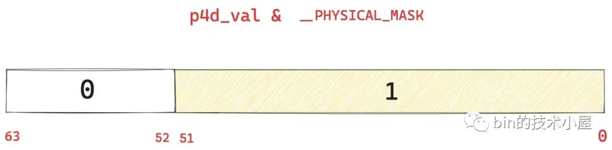

这低 52 位中包含了两个部分，一个是我们想要提取的下一级页目录表的物理内存地址，另一个则是低 12 位的权限标记位。

如果我们再能够把这低 12 位的权限标记位用掩码掩掉，就可以得到下一级页目录表的物理内存地址了。

    #define PAGE_SHIFT  12
    #define PAGE_SIZE   (_AC(1,UL) << PAGE_SHIFT)      
    #define PAGE_MASK   (~(PAGE_SIZE-1))     // 0xFFFFFFFFFFFFF000

上面的 PAGE\_MASK 掩码就是用于将页目录项 p4d 的低 12 位掩掉的，我们接着在 `p4d_val & __PHYSICAL_MASK` 的基础上再与上 `PAGE_MASK`，就可以将 p4d 中保存的下一级页目录表 PUD 的物理内存地址截取出来了。

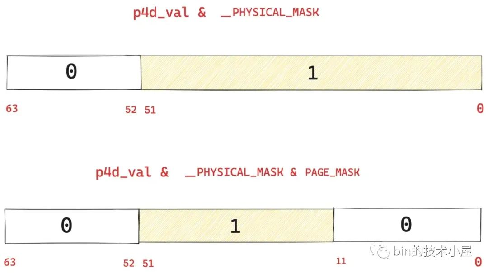

虽然我们是按照 52 位的物理内存地址截取的，但是对于 36 位的物理内存地址来说，页目录项中的低 36 位到 51 位之间的比特位都是 0 值，所以也不影响。

    static inline unsigned long p4d_page_vaddr(p4d_t p4d)
    {
        return (unsigned long)__va(p4d_val(p4d) & p4d_pfn_mask(p4d));
    }
    
    static inline p4dval_t p4d_pfn_mask(p4d_t p4d)
    {
    	/* No 512 GiB huge pages yet */
    	return PTE_PFN_MASK;
    }
    
    /* Extracts the PFN from a (pte|pmd|pud|pgd)val_t of a 4KB page */
    #define PTE_PFN_MASK		((pteval_t)PHYSICAL_PAGE_MASK)
    
    #define PHYSICAL_PAGE_MASK	(((signed long)PAGE_MASK) & __PHYSICAL_MASK)

现在我们已经得到 PUD 的物理内存地址了，随后通过 \_\_va 转换成虚拟内存地址，然后在加上 pud\_index 就得到缺页虚拟内存地址在进程页表上层页目录 PUD 中对应的页目录项 pud\_t 了。

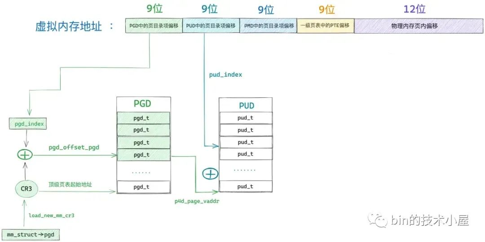

在得到 pud\_t 之后，内核还是需要通过 pud\_none 来判断下该上层页目录项 pud\_t 是否是空的，如果是空的话，就需要通过 \_\_pmd\_alloc 函数重新分配一张中间页目录表 PMD 出来，然后填充这个空的 pud\_t，这里的逻辑和前面处理 p4d\_t 的逻辑一模一样。

    // 同 p4d_none 的逻辑一样
    static inline int pud_none(pud_t pud)
    {
    	return (native_pud_val(pud) & ~(_PAGE_KNL_ERRATUM_MASK)) == 0;
    }

由于这个 PUD 是之前为了填充顶级页目录项 p4d\_t 而新创建出来的，所以 PUD 这张页目录表里还全是 0 值，缺页虚拟内存地址在 PUD 中对应的目录项 pud\_t 自然也是 0 值，通过 pud\_none 判断自然是返回 true 。

随后内核会调用 \_\_pmd\_alloc 函数新分配一张 4K 大小的物理内存页作为 PMD , 然后用 PMD 的物理内存地址去填充这个空的 pud\_t。这里的逻辑和 \_\_pud\_alloc 还是一模一样。

    /*
     * Allocate page middle directory.
     * We've already handled the fast-path in-line.
     */
    int __pmd_alloc(struct mm_struct *mm, pud_t *pud, unsigned long address)
    {
        // 调用 alloc_pages 从伙伴系统申请一个 4K 大小的物理内存页，作为新的 PMD
        pmd_t *new = pmd_alloc_one(mm, address);
        if (!new)
            return -ENOMEM;
        // 如果 pud 还未指向其下一级页目录 PMD，则需要初始化填充 pud
        if (!pud_present(*pud)) {
            mm_inc_nr_pmds(mm);
            // 将 new 指向的新分配出来的 PMD 物理内存地址以及相关属性填充到上层页目录项 pud 中
            pud_populate(mm, pud, new);
        } else  /* Another has populated it */
            pmd_free(mm, new);
    
        return 0;
    }

填充上层页目录项 pud\_t 的逻辑和之前填充顶级页目录项 p4d\_t 的逻辑也是一样的。

    static inline void pud_populate(struct mm_struct *mm, pud_t *pud, pmd_t *pmd)
    {
    	set_pud(pud, __pud(_PAGE_TABLE | __pa(pmd)));
    }

都是通过 PMD 的物理内存地址 \_\_pa(pmd) 以及页目录的初始权限标记位集合 \_PAGE\_TABLE 来构造一个 `unsigned long` 类型的整数。

通过 \_\_pud 将这个刚刚构造出来的 unsigned long 整数转换成 pud\_t 类型：

    #define __pud(x)	native_make_pud(x)
    
    static inline pud_t native_make_pud(pmdval_t val)
    {
    	return (pud_t) { val };
    }

最后将 \_\_pud 的返回值通过 set\_pud 赋值给原始的上层页目录项 pud 。这样就算完成了 pud 的填充。

    # define set_pud(pudp, pud)		native_set_pud(pudp, pud)
    
    static inline void native_set_pud(pud_t *pudp, pud_t pud)
    {
    	WRITE_ONCE(*pudp, pud);
    }

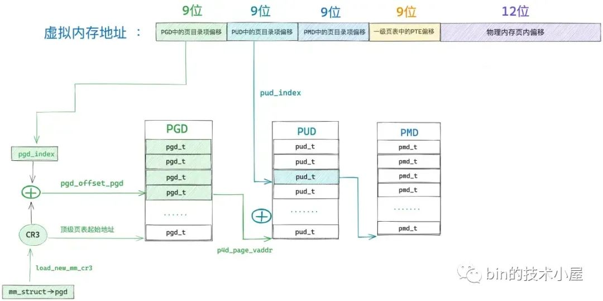

中间页目录表 PMD 有了，接下来的任务就该定位缺页虚拟内存地址在进程页表 PMD 中对应的页目录项 pmd\_t 了。

和前面的 PGD ，PUD 一样, PMD 也可以看做是一个能够存放 512 个 pmd\_t 的数组 —— pmd\_t\[PTRS\_PER\_PMD\] 。

    // 中间页目录表 PMD 可以容纳的页目录项 pmd_t 的个数
    #define PTRS_PER_PMD  512

内核通过 pmd\_offset 函数来定位虚拟内存地址 address 对应在 PMD 中的页目录项 pmd\_t。

    static inline pmd_t *pmd_offset(pud_t *pud, unsigned long address)
    {
    	return (pmd_t *)pud_page_vaddr(*pud) + pmd_index(address);
    }

还是之前的套路，首先需要通过 pud\_page\_vaddr 从上层页目录 PUD 中的页目录项 pud\_t 中提取出其下一级页目录表 PMD 的起始虚拟内存地址。

    static inline unsigned long pud_page_vaddr(pud_t pud)
    {
    	return (unsigned long)__va(pud_val(pud) & pud_pfn_mask(pud));
    }

然后通过 pmd\_index 获取缺页虚拟内存地址在 PMD 中的偏移，和之前的处理方式一样，首先将缺页虚拟内存地址 address 右移 PMD\_SHIFT（21）位，然后和掩码 `PTRS_PER_PMD - 1` 相与，只保留低 9 位。

    static inline unsigned long pmd_index(unsigned long address)
    {
    	return (address >> PMD_SHIFT) & (PTRS_PER_PMD - 1);
    }
    
    #define PMD_SHIFT	21
    #define PTRS_PER_PMD	512

最后用刚刚提取出的 PMD 起始虚拟内存地址 pud\_page\_vaddr 与 pmd\_index 相加就得到我们寻找的中间页目录项 pmd\_t 了。

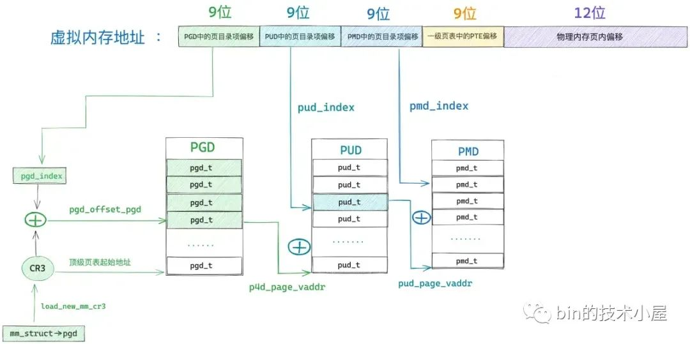

在我们获取到 pmd\_t 之后，接下来就该处理页表了，而页表是直接与物理内存页进行映射的，后续我们需要到页表项中，根据权限位的设置来解析出具体的缺页原因，然后进行针对性的缺页处理，这一部分的内容封装在 handle\_pte\_fault 函数中，这是我们下一小节中要介绍的内容。

而本小节中介绍的 \_\_handle\_mm\_fault 的主要工作是将进程页表中的三级页目录表 PGD,PUD,PMD 补齐，然后获取到 pmd\_t 就完成了，随后会把 pmd\_t 送到 handle\_pte\_fault 函数中进行页表的处理。

在我们理解了以上内容之后，再回头来看 \_\_handle\_mm\_fault 源码实现就很清晰了：

    static vm_fault_t __handle_mm_fault(struct vm_area_struct *vma,
            unsigned long address, unsigned int flags)
    {
        // vm_fault 结构用于封装后续缺页处理用到的相关参数
        struct vm_fault vmf = {
            // 发生缺页的 vma
            .vma = vma,
            // 引起缺页的虚拟内存地址
            .address = address & PAGE_MASK,
            // 处理缺页的相关标记 FAULT_FLAG_xxx
            .flags = flags,
            // address 在 vma 中的偏移，单位也页
            .pgoff = linear_page_index(vma, address),
            // 后续用于分配物理内存使用的相关掩码 gfp_mask
            .gfp_mask = __get_fault_gfp_mask(vma),
        };
        // 获取进程虚拟内存空间
        struct mm_struct *mm = vma->vm_mm;
        // 进程页表的顶级页表地址
        pgd_t *pgd;
        // 五级页表下会使用，在四级页表下 p4d 与 pgd 的值一样
        p4d_t *p4d;
        vm_fault_t ret;
        // 获取 address 在全局页目录表 PGD 中对应的目录项 pgd
        pgd = pgd_offset(mm, address);
        // 在四级页表下，这里只是将 pgd 赋值给 p4d，后续均已 p4d 作为全局页目录项
        p4d = p4d_alloc(mm, pgd, address);
        if (!p4d)
            return VM_FAULT_OOM;
        // 首先 p4d_none 判断全局页目录项 p4d 是否是空的
        // 如果 p4d 是空的，则调用 __pud_alloc 分配一个新的上层页目录表 PUD，然后填充 p4d
        // 如果 p4d 不是空的，则调用 pud_offset 获取 address 在上层页目录 PUD 中的目录项 pud
        vmf.pud = pud_alloc(mm, p4d, address);
        if (!vmf.pud)
            return VM_FAULT_OOM;
      
          ........ 省略 1G 大页缺页处理 ..........
        
        // 首先 pud_none 判断上层页目录项 pud 是不是空的
        // 如果 pud 是空的，则调用 __pmd_alloc 分配一个新的中间页目录表 PMD，然后填充 pud
        // 如果 pud 不是空的，则调用 pmd_offset 获取 address 在中间页目录 PMD 中的目录项 pmd
        vmf.pmd = pmd_alloc(mm, vmf.pud, address);
        if (!vmf.pmd)
            return VM_FAULT_OOM;
    
          ........ 省略 2M 大页缺页处理 ..........
    
        // 进行页表的相关处理以及解析具体的缺页原因，后续针对性的进行缺页处理
        return handle_pte_fault(&vmf);
    }

### 6\. handle\_pte\_fault

在上一小节的开头，笔者列举了引起缺页异常主要的三种原因，要么缺页的虚拟内存地址从来还没有被映射过，要么是虽然之前映射过，但是物理内存页被 swap 到磁盘上了，要么是因为访问权限不够的原因引起的缺页。

从总体上来讲引起缺页中断的原因分为两大类，一类是缺页虚拟内存地址背后映射的物理内存页不在内存中，另一类是缺页虚拟内存地址背后映射的物理内存页在内存中。

而每一类下边又包含若干种缺页的场景，在本小节中笔者会带着大家一一把这些场景梳理清楚，下面我们来看第一类，其中分为了三种缺页场景。

第一种场景是，缺页虚拟内存地址 address 在进程页表中间页目录对应的页目录项 pmd\_t 是空的，我们可以通过 pmd\_none 方法来判断。

    static inline int pmd_none(pmd_t pmd)
    {
    	unsigned long val = native_pmd_val(pmd);
    	return (val & ~_PAGE_KNL_ERRATUM_MASK) == 0;
    }

这种情况表示缺页地址 address 对应的 pmd 目前还没有对应的页表，连页表都还没有，那么自然 pte 也是空的，物理内存页就更不用说了，肯定还没有。

第二种场景是，缺页地址 address 对应的 pmd\_t 虽然不是空的，页表也存在，但是 address 对应在页表中的 pte 是空的。内核中通过 pte\_offset\_map 定位 address 在页表中的 pte 。这个过程和前面介绍的定位页目录项的过程一模一样。

    #define pte_offset_map(dir, address) pte_offset_kernel((dir), (address))
    
    static inline pte_t *pte_offset_kernel(pmd_t *pmd, unsigned long address)
    {
    	return (pte_t *)pmd_page_vaddr(*pmd) + pte_index(address);
    }
    
    static inline unsigned long pte_index(unsigned long address)
    {
    	return (address >> PAGE_SHIFT) & (PTRS_PER_PTE - 1);
    }
    
    #define PAGE_SHIFT   12
    // 页表可以容纳的页表项 pte_t 的个数
    #define PTRS_PER_PTE  512

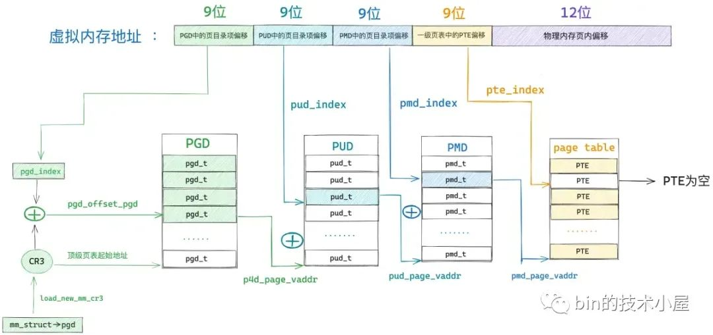

这种情况下，虽然页表是存在的，但是奈何 address 在页表中的 pte 是空的，和第一种场景一样，都说明了该 address 之前从来还没有被映射过。

既然之前都没有被映射，那么现在就该把这块内容补齐，笔者在之前的文章 [《从内核世界透视 mmap 内存映射的本质（原理篇）》](https://mp.weixin.qq.com/s?__biz=Mzg2MzU3Mjc3Ng==&mid=2247488750&idx=1&sn=247a4603299e203793fac8b6c5e61071&chksm=ce77d2a9f9005bbf3b024bc9f9192f2de63a70fd33db1113d9f9c0d8a1ced2099fbeb727a3d7&token=1862605518&lang=zh_CN&scene=21#wechat_redirect) 中曾为大家介绍了四种内存映射方式，它们分别为：私有匿名映射，私有文件映射，共享文件映射，共享匿名映射。这四种内存映射方式从总体上来说分为两类：一类是匿名映射，另一类是文件映射。

所以在处理虚拟内存映射区 vma 中的缺页时，也需要分为匿名映射区的缺页处理以及文件映射区的缺页处理。那么在这里，我们该如何区分这个缺页的 vma 到底是属于匿名映射区还是文件映射区呢 ？

还记得笔者之前在 [《从内核世界透视 mmap 内存映射的本质（源码实现篇）》](https://mp.weixin.qq.com/s?__biz=Mzg2MzU3Mjc3Ng==&mid=2247488879&idx=1&sn=4cbbabc648e1a29466c3309371a27a4f&chksm=ce77d328f9005a3e7a0bb0b0ff7ad88b5a3f10c8ad850fb5b503d51001b63eeb2c909ba32a78&scene=178&cur_album_id=2559805446807928833#rd) 一文中介绍的内存映射核心函数 mmap\_region 吗？关于文件映射和匿名映射，有这样的两段代码：

    unsigned long mmap_region(struct file *file, unsigned long addr,
            unsigned long len, vm_flags_t vm_flags, unsigned long pgoff,
            struct list_head *uf)
    {
                      ........ 省略 ........
        // 文件映射
        if (file) {
            // 将文件与虚拟内存映射起来
            vma->vm_file = get_file(file);
            // 这一步中将虚拟内存区域 vma 的操作函数 vm_ops 映射成文件的操作函数（和具体文件系统有关）
            // ext4 文件系统中的操作函数为 ext4_file_vm_ops
            // 从这一刻开始，读写内存就和读写文件是一样的了
            error = call_mmap(file, vma);
            if (error)
                goto unmap_and_free_vma;
    
            addr = vma->vm_start;
            vm_flags = vma->vm_flags;
        }  else {
            // 这里处理私有匿名映射
            // 将  vma->vm_ops 设置为 null，只有文件映射才需要 vm_ops 这样才能将内存与文件映射起来
            vma_set_anonymous(vma);
        }
    }

在处理文件映射的代码中，内核调用了一个叫 call\_mmap 的函数，内核在该函数中将虚拟内存的相关操作函数 vma->vm\_ops 映射成了文件相关的操作函数 ext4\_file\_vm\_ops。正因为如此，后续进程读写这块虚拟内存就相当于读写文件了。

    static int ext4_file_mmap(struct file *file, struct vm_area_struct *vma)
    {
            ........ 省略 ........
            
          vma->vm_ops = &ext4_file_vm_ops;
          
            ........ 省略 ........    
    }

而在处理匿名映射的代码中，内核调用了一个叫做 vma\_set\_anonymous 的函数，在这里会将 vma->vm\_ops 设置为 null ，因为这里映射的匿名内存页，背后并没有文件来支撑。

    static inline void vma_set_anonymous(struct vm_area_struct *vma)
    {
    	vma->vm_ops = NULL;
    }

所以判断一个虚拟内存区域 vma 到底是文件映射区还是匿名映射区就是要看这个 vma 的 vm\_ops 是否为 null。

    static inline bool vma_is_anonymous(struct vm_area_struct *vma)
    {
    	return !vma->vm_ops;
    }

如果 vma\_is\_anonymous 返回 true，那么内核就会在 handle\_pte\_fault 函数中调用 do\_anonymous\_page 进行匿名映射区的缺页处理。

如果 vma\_is\_anonymous 返回 false，那么内核就调用 do\_fault 进行文件映射区的缺页处理。

        // pte 是空的，表示缺页地址 address 还从来没有被映射过，接下来就要处理物理内存的映射
        if (!vmf->pte) {
            // 判断缺页的虚拟内存地址 address 所在的虚拟内存区域 vma 是否是匿名映射区
            if (vma_is_anonymous(vmf->vma))
                // 处理匿名映射区发生的缺页
                return do_anonymous_page(vmf);
            else
                // 处理文件映射区发生的缺页
                return do_fault(vmf);
        }

第三种缺页场景是，虚拟内存地址 address 在进程页表中的页表项 pte 不是空的，但是其背后映射的物理内存页被内核 swap out 到磁盘上了，CPU 访问的时候依然会产生缺页。

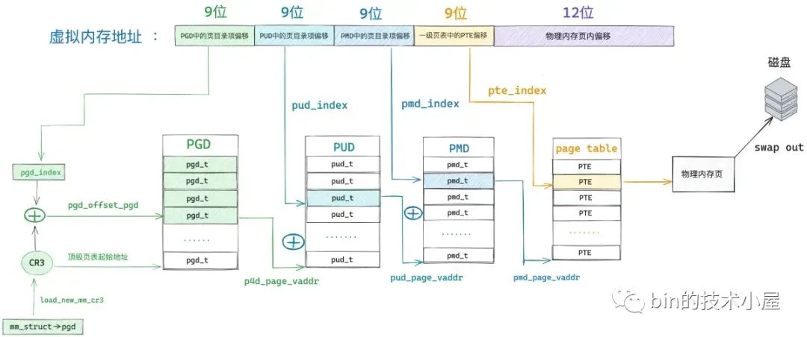

那么我们如何知道 pte 背后映射的物理内存页在不在内存中呢 ？

笔者在之前的文章[《一步一图带你构建 Linux 页表体系》](https://mp.weixin.qq.com/s?__biz=Mzg2MzU3Mjc3Ng==&mid=2247488477&idx=1&sn=f8531b3220ea3a9ca2a0fdc2fd9dabc6&chksm=ce77d59af9005c8c2ef35c7e45f45cbfc527bfc4b99bbd02dbaaa964d174a4009897dd329a4d&scene=21&cur_album_id=2559805446807928833#wechat_redirect) 中介绍了页表项 pte 的比特位布局如下图所示：

其中 pte 的第 0 个比特位表示该 pte 映射的物理内存页是否在内存中，值为 1 表示物理内存页在内存中驻留，值为 0 表示物理内存页不在内存中，可能被 swap 到磁盘上了。

    #define _PAGE_BIT_PRESENT 0 /* is present */
    
    #define _PAGE_PRESENT (_AT(pteval_t, 1) << _PAGE_BIT_PRESENT)

如果我们可以把 pte 中的相关权限位提取出来，然后判断权限位第 0 个比特位是否为 1 ，是不是就能知道 pte 映射的物理内存页到底在不在内存中了，这个逻辑封装在 pte\_present 方法中：

    static inline int pte_present(pte_t a)
    {
    	return pte_flags(a) & (_PAGE_PRESENT | _PAGE_PROTNONE);
    }

pte\_flags 函数用于从 pte 中提取相关的权限位，如何提取呢 ？可还记得我们在上小节中介绍的从页目录项中提取其下一级页目录表的物理内存地址时使用到的掩码 PTE\_PFN\_MASK 吗 ？

    static inline unsigned long p4d_page_vaddr(p4d_t p4d)
    {
        return (unsigned long)__va(p4d_val(p4d) & PTE_PFN_MASK;
    }
    
    /* Extracts the PFN from a (pte|pmd|pud|pgd)val_t of a 4KB page */
    #define PTE_PFN_MASK        ((pteval_t)PHYSICAL_PAGE_MASK)
    
    #define PHYSICAL_PAGE_MASK  (((signed long)PAGE_MASK) & __PHYSICAL_MASK)

如果我们把掩码 PTE\_PFN\_MASK 取反，然后在和 pte 做与运算，这样 pte 中的相关权限标记位不就提取出来么。

    #define PTE_FLAGS_MASK		(~PTE_PFN_MASK)
    
    static inline pteval_t pte_flags(pte_t pte)
    {
    	return native_pte_val(pte) & PTE_FLAGS_MASK;
    }
    
    static inline pteval_t native_pte_val(pte_t pte)
    {
    	return pte.pte;
    }

然后用权限标记位 pte\_flags 和 \_PAGE\_PRESENT 做 `&` 运算就可以知道 pte 背后映射的物理内存页是否在内存中了。

如果我们通过 pte\_present 判断映射的物理内存页不在内存中了，说明它已经被内核 swap out 到磁盘上了，这种情况下的缺页处理就需要调用 do\_swap\_page 函数，将磁盘上的物理内存页重新 swap in 到内存中来。

       if (!pte_present(vmf->orig_pte))
            // 将之前映射的物理内存页从磁盘中重新 swap in 到内存中
            return do_swap_page(vmf);

以上介绍的这三种缺页场景都是属于缺页内存地址 address 背后映射的物理内存页不在内存中的类别。

下面我们来看下另一类别，也就是缺页虚拟内存地址背后映射的物理内存页在内存中的情况 ，这里又会近一步分为两种缺页场景。

笔者曾在 [《深入理解 Linux 物理内存管理》](https://mp.weixin.qq.com/s?__biz=Mzg2MzU3Mjc3Ng==&mid=2247486879&idx=1&sn=0bcc59a306d59e5199a11d1ca5313743&chksm=ce77cbd8f90042ce06f5086b1c976d1d2daa57bc5b768bac15f10ee3dc85874bbeddcd649d88&token=1274956236&lang=zh_CN&scene=21#wechat_redirect)一文中为大家介绍了 Linux 内核在 NUMA 架构下物理内存管理的相关内容。

在 NUMA 架构下，CPU 访问自己的本地内存节点是最快的，但访问其他内存节点就会慢很多，这就导致了 CPU 访问内存的速度不一致。

回到我们缺页处理的场景中就是缺页虚拟内存地址背后映射的物理内存页虽然在内存中，但是它可能是进程所在 CPU 中的本地 NUMA 节点上的内存，也可能是其他 NUMA 节点上的内存。

因为 CPU 对不同 NUMA 节点上的内存有访问速度上的差异，所以内核通常倾向于让 CPU 尽量访问本地 NUMA 节点上的内存。NUMA Balancing 机制就是用来解决这个问题的。

通俗来讲，NUMA Balancing 主要干两件事情，一件事是让内存跟着 CPU 走，另一件事是让 CPU 跟着内存走。

进程申请到的物理内存页可能在当前 CPU 的本地 NUMA 节点上，也可能在其他 NUMA 节点上。

所谓让内存跟着 CPU 走的意思就是，当进程访问的物理内存页不在当前 CPU 的本地 NUMA 节点上时，NUMA Balancing 就会尝试将远程 NUMA 节点上的物理内存页迁移到本地 NUMA 节点上，加快进程访问内存的速度。

所谓让 CPU 跟着内存走的意思就是，当进程经常访问的大部分物理内存页均不在当前 CPU 的本地 NUMA 节点上时，NUMA Balancing 干脆就把进程重新调度到这些物理内存页所在的 NUMA 节点上。当然整个 NUMA Balancing 的过程会根据我们设置的 NUMA policy 以及各个 NUMA 节点上缺页的次数来综合考虑是否迁移内存页。这里涉及到的细节很多，笔者就不一一展开了。

NUMA Balancing 会周期性扫描进程虚拟内存地址空间，如果发现虚拟内存背后映射的物理内存页不在当前 CPU 本地 NUMA 节点的时候，就会把对应的页表项 pte 标记为 \_PAGE\_PROTNONE，也就是将 pte 的第 8 个 比特位置为 1，随后会将 pte 的 Present 位置为 0 。

    #define _PAGE_PROTNONE	(_AT(pteval_t, 1) << _PAGE_BIT_PROTNONE)
    
    #define _PAGE_BIT_PROTNONE	_PAGE_BIT_GLOBAL
    
    #define _PAGE_BIT_GLOBAL	8

这种情况下调用 pte\_present 依然很返回 true ，因为当前的物理内存页毕竟是在内存中的，只不过不在当前 CPU 的本地 NUMA 节点上而已。

当 pte 被标记为 \_PAGE\_PROTNONE 之后，这意味着该 pte 背后映射的物理内存页进程对其没有读写权限，也没有可执行的权限。进程在访问这段虚拟内存地址的时候就会发生缺页。

当进入缺页异常的处理程序之后，内核会在 handle\_pte\_fault 函数中通过 pte\_protnone 函数判断，缺页的 pte 是否被标记了 \_PAGE\_PROTNONE 标识。

    static inline int pte_protnone(pte_t pte)
    {
    	return (pte_flags(pte) & (_PAGE_PROTNONE | _PAGE_PRESENT))
    		== _PAGE_PROTNONE;
    }

如果 pte 被标记了 \_PAGE\_PROTNONE，并且对应的虚拟内存区域是一个具有读写，可执行权限的 vma。这就说明该 vma 背后映射的物理内存页不在当前 CPU 的本地 NUMA 节点上。

    static inline bool vma_is_accessible(struct vm_area_struct *vma)
    {
    	return vma->vm_flags & (VM_READ | VM_EXEC | VM_WRITE);
    }

这里需要调用 do\_numa\_page，将这个远程 NUMA 节点上的物理内存页迁移到当前 CPU 的本地 NUMA 节点上，从而加快进程访问内存的速度。

      if (pte_protnone(vmf->orig_pte) && vma_is_accessible(vmf->vma))
            return do_numa_page(vmf);

NUMA Balancing 机制看起来非常好，但是同时也会为系统引入很多开销，比如，扫描进程地址空间的开销，缺页的开销，更主要的是页面迁移的开销会很大，这也会引起 CPU 有时候莫名其妙的飙到 100 %。因此笔者建议在一般情况下还是将 NUMA Balancing 关闭为好，除非你有明确的理由开启。

我们可以将内核参数 `/proc/sys/kernel/numa_balancing` 设置为 0 或者通过 sysctl 命令来关闭 NUMA Balancing。

    echo 0 > /proc/sys/kernel/numa_balancing
    
    sysctl -w kernel.numa_balancing=0

第二种场景就是写时复制了（Copy On Write， COW），这种场景和 NUMA Balancing 一样，都属于缺页虚拟内存地址背后映射的物理内存页在内存中而引起的缺页中断。

COW 在内核的内存管理子系统中很常见了，比如，父进程通过 fork 系统调用创建子进程之后，父子进程的虚拟内存空间完全是一模一样的，包括父子进程的页表内容都是一样的，父子进程页表中的 PTE 均指向同一物理内存页面，此时内核会将父子进程页表中的 PTE 均改为只读的，并将父子进程共同映射的这个物理页面引用计数 + 1。

    static inline unsigned long
    copy_one_pte(struct mm_struct *dst_mm, struct mm_struct *src_mm,
            pte_t *dst_pte, pte_t *src_pte, struct vm_area_struct *vma,
            unsigned long addr, int *rss)
    {
        /*
         * If it's a COW mapping, write protect it both
         * in the parent and the child
         */
        if (is_cow_mapping(vm_flags) && pte_write(pte)) {
            // 设置父进程的 pte 为只读
            ptep_set_wrprotect(src_mm, addr, src_pte);
            // 设置子进程的 pte 为只读
            pte = pte_wrprotect(pte);
        }
        // 获取 pte 中映射的物理内存页（此时父子进程共享该页）
        page = vm_normal_page(vma, addr, pte);
        // 物理内存页的引用计数 + 1
        get_page(page);
    }

当父进程或者子进程对该页面发生写操作的时候，我们现在假设子进程先对页面发生写操作，随后子进程发现自己页表中的 PTE 是只读的，于是产生缺页中断，子进程进入内核态，内核会在本小节介绍的缺页中断处理程序中发现，访问的这个物理页面引用计数大于 1，说明此时该物理内存页面存在多进程共享的情况，于是发生写时复制（Copy On Write， COW），内核为子进程重新分配一个新的物理页面，然后将原来物理页中的内容拷贝到新的页面中，最后子进程页表中的 PTE 指向新的物理页面并将 PTE 的 R/W 位设置为 1，原来物理页面的引用计数 - 1。

后面父进程在对页面进行写操作的时候，同样也会发现父进程的页表中 PTE 是只读的，也会产生缺页中断，但是在内核的缺页中断处理程序中，发现访问的这个物理页面引用计数为 1 了，那么就只需要将父进程页表中的 PTE 的 R/W 位设置为 1 就可以了。

还有笔者在之前的文章 [《从内核世界透视 mmap 内存映射的本质（原理篇）》](https://mp.weixin.qq.com/s?__biz=Mzg2MzU3Mjc3Ng==&mid=2247488750&idx=1&sn=247a4603299e203793fac8b6c5e61071&chksm=ce77d2a9f9005bbf3b024bc9f9192f2de63a70fd33db1113d9f9c0d8a1ced2099fbeb727a3d7&token=1862605518&lang=zh_CN&scene=21#wechat_redirect)中介绍的私有文件映射，也用到了 COW，当多个进程采用私有文件映射的方式对同一文件的同一部分进行映射的时候，后续产生的 pte 也都是只读的。

当任意进程开始对它的私有文件映射区进行写操作时，就会发生写时复制，随后内核会在这里介绍的缺页中断程序中重新申请一个内存页，然后将 page cache 中的内容拷贝到这个新的内存页中，进程页表中对应的 pte 会重新关联到这个新的内存页上，此时 pte 的权限变为可写。

**在以上介绍的两种写时复制应用场景中，他们都有一个共同的特点，就是进程的虚拟内存区域 vma 的权限是可写的，但是其对应在页表中的 pte 却是只读的，而 pte 映射的物理内存页也在内存中**。

内核正是利用这个特点来判断本次缺页中断是否是由写时复制引起的。如果是，则调用 do\_wp\_page 进行写时复制的缺页处理。

        // 判断本次缺页是否为写时复制引起的
        if (vmf->flags & FAULT_FLAG_WRITE) {
            // 这里说明 vma 是可写的，但是 pte 被标记为不可写，说明是写保护类型的中断
            if (!pte_write(entry))
                // 进行写时复制处理，cow 就发生在这里
                return do_wp_page(vmf);
        }

在我们清楚了以上背景知识之后，再来看 handle\_pte\_fault 的缺页处理逻辑就很清晰了：

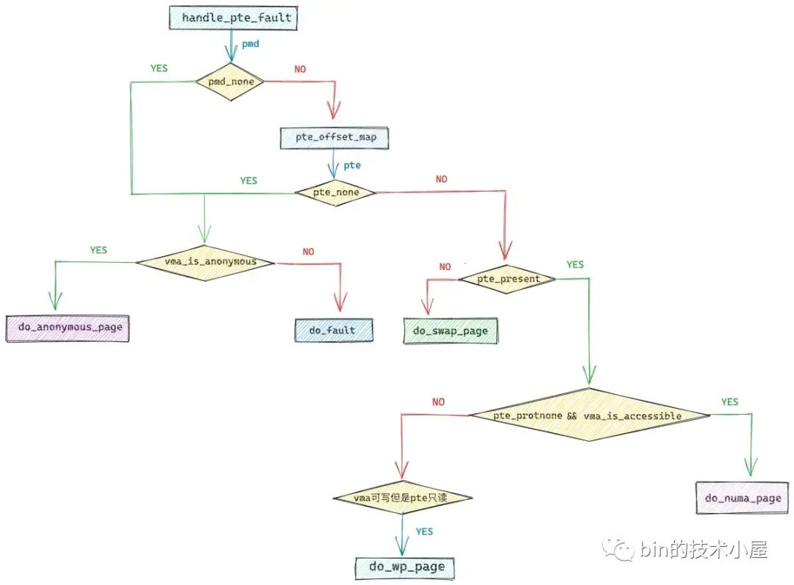

    static vm_fault_t handle_pte_fault(struct vm_fault *vmf)
    {
        pte_t entry;
    
        if (unlikely(pmd_none(*vmf->pmd))) {
            // 如果 pmd 是空的，说明现在连页表都没有，页表项 pte 自然是空的
            vmf->pte = NULL;
        } else {
            // vmf->pte 表示缺页虚拟内存地址在页表中对应的页表项 pte
            // 通过 pte_offset_map 定位到虚拟内存地址 address 对应在页表中的 pte
            // 这里根据 address 获取 pte_index，然后从 pmd 中提取页表起始虚拟内存地址相加获取 pte
            vmf->pte = pte_offset_map(vmf->pmd, vmf->address);
            //  vmf->orig_pte 表示发生缺页时，address 对应的 pte 值
            vmf->orig_pte = *vmf->pte;
    
            // 这里 pmd 不是空的，表示现在是有页表存在的，但缺页虚拟内存地址在页表中的 pte 是空值
            if (pte_none(vmf->orig_pte)) {
                pte_unmap(vmf->pte);
                vmf->pte = NULL;
            }
        }
    
        // pte 是空的，表示缺页地址 address 还从来没有被映射过，接下来就要处理物理内存的映射
        if (!vmf->pte) {
            // 判断缺页的虚拟内存地址 address 所在的虚拟内存区域 vma 是否是匿名映射区
            if (vma_is_anonymous(vmf->vma))
                // 处理匿名映射区发生的缺页
                return do_anonymous_page(vmf);
            else
                // 处理文件映射区发生的缺页
                return do_fault(vmf);
        }
    
        // 走到这里表示 pte 不是空的，但是 pte 中的 p 比特位是 0 值，表示之前映射的物理内存页已不在内存中（swap out）
        if (!pte_present(vmf->orig_pte))
            // 将之前映射的物理内存页从磁盘中重新 swap in 到内存中
            return do_swap_page(vmf);
    
        // 这里表示 pte 背后映射的物理内存页在内存中，但是 NUMA Balancing 发现该内存页不在当前进程运行的 numa 节点上
        // 所以将该 pte 标记为 _PAGE_PROTNONE（无读写，可执行权限）
        // 进程访问该内存页时发生缺页中断，在这里的 do_numa_page 中，内核将该 page 迁移到进程运行的 numa 节点上。
        if (pte_protnone(vmf->orig_pte) && vma_is_accessible(vmf->vma))
            return do_numa_page(vmf);
    
        entry = vmf->orig_pte;
        // 如果本次缺页中断是由写操作引起的
        if (vmf->flags & FAULT_FLAG_WRITE) {
            // 这里说明 vma 是可写的，但是 pte 被标记为不可写，说明是写保护类型的中断
            if (!pte_write(entry))
                // 进行写时复制处理，cow 就发生在这里
                return do_wp_page(vmf);
            // 如果 pte 是可写的，就将 pte 标记为脏页
            entry = pte_mkdirty(entry);
        }
        // 将 pte 的 access 比特位置 1 ，表示该 page 是活跃的。避免被 swap 出去
        entry = pte_mkyoung(entry);
    
        // 经过上面的缺页处理，这里会判断原来的页表项 entry（orig_pte） 值是否发生了变化
        // 如果发生了变化，就把 entry 更新到 vmf->pte 中。
        if (ptep_set_access_flags(vmf->vma, vmf->address, vmf->pte, entry,
                    vmf->flags & FAULT_FLAG_WRITE)) {
            // pte 既然变化了，则刷新 mmu （体系结构相关）
            update_mmu_cache(vmf->vma, vmf->address, vmf->pte);
        } else {
            // 如果 pte 内容本身没有变化，则不需要刷新任何东西
            // 但是有个特殊情况就是写保护类型中断，产生的写时复制，产生了新的映射关系，需要刷新一下 tlb
    		/*
    		 * This is needed only for protection faults but the arch code
    		 * is not yet telling us if this is a protection fault or not.
    		 * This still avoids useless tlb flushes for .text page faults
    		 * with threads.
    		 */
            if (vmf->flags & FAULT_FLAG_WRITE)
                flush_tlb_fix_spurious_fault(vmf->vma, vmf->address);
        }
    
        return 0;
    }

### 7\. do\_anonymous\_page 处理匿名页缺页

在本文的第五小节中，我们完成了各级页目录的补齐填充工作，但是现在最后一级页表还没有着落，所以在处理缺页之前，我们需要调用 pte\_alloc 继续把页表补齐了。

    #define pte_alloc(mm, pmd) (unlikely(pmd_none(*(pmd))) && __pte_alloc(mm, pmd))

首先我们通过 pmd\_none 判断缺页地址 address 在进程页表中间页目录 PMD 中对应的页目录项 pmd 是否是空的，如果 pmd 是空的，说明此时还不存在一级页表，这样一来，就需要调用 \_\_pte\_alloc 来分配一张页表，然后用页表的 pfn 以及初始权限位 \_PAGE\_TABLE 来填充 pmd。

    static inline void pmd_populate(struct mm_struct *mm, pmd_t *pmd,
                    struct page *pte)
    {
        // 通过页表 page 获取对应的 pfn
        unsigned long pfn = page_to_pfn(pte);
        // 将页表 page 的 pfn 以及初始权限位 _PAGE_TABLE 填充到 pmd 中
        set_pmd(pmd, __pmd(((pteval_t)pfn << PAGE_SHIFT) | _PAGE_TABLE));
    }

这里 \_\_pte\_alloc 的流程逻辑和前面我们介绍的\_\_pud\_alloc，\_\_pmd\_alloc 可以说是一模一样，都是创建其下一级页目录或者页表，然后填充对应的页目录项，这里就不做过多的介绍了。

    int __pte_alloc(struct mm_struct *mm, pmd_t *pmd)
    {
        spinlock_t *ptl;
        // 调用 get_zeroed_page 申请一个 4k 物理内存页并初始化为 0 值作为新的 页表
        // new 指向新分配的 页表 起始内存地址
        pgtable_t new = pte_alloc_one(mm);
        if (!new)
            return -ENOMEM;
        // 锁定中间页目录项 pmd
        ptl = pmd_lock(mm, pmd);
        // 如果 pmd 是空的，说明此时 pmd 并未指向页表，下面就需要用新页表 new 来填充 pmd 
        if (likely(pmd_none(*pmd))) {  
            // 更新 mm->pgtables_bytes 计数，该字段用于统计进程页表所占用的字节数
            // 由于这里新增了一张页表，所以计数需要增加 PTRS_PER_PTE * sizeof(pte_t)
            mm_inc_nr_ptes(mm);
            // 将 new 指向的新分配出来的页表 page 的 pfn 以及相关初始权限位填充到 pmd 中
            pmd_populate(mm, pmd, new);
            new = NULL;
        }
        spin_unlock(ptl);
        return 0;
    }
    
    // 页表可以容纳的页表项 pte_t 的个数
    #define PTRS_PER_PTE  512

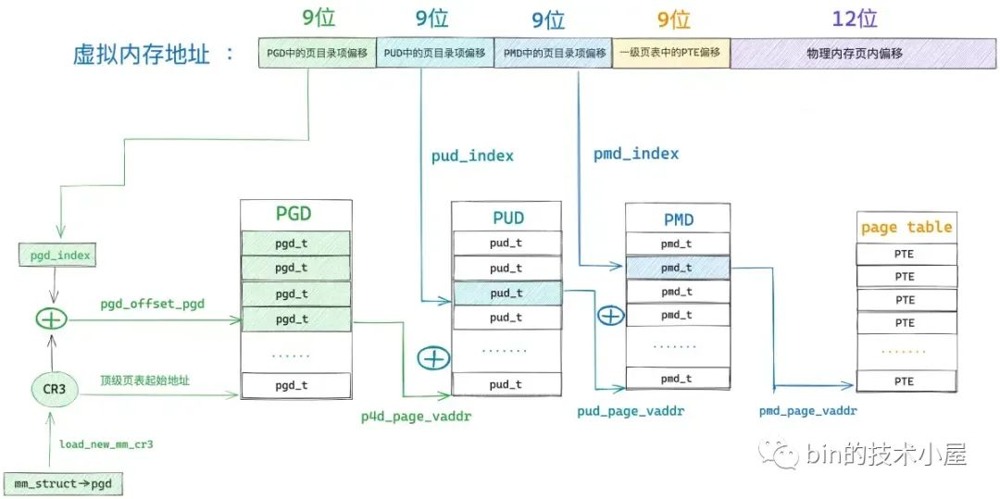

现在我们已经有了一级页表，但是页表中的 pte 还都是空的，接下来就该用这个空的 pte 来映射物理内存页了。

首先我们通过 alloc\_zeroed\_user\_highpage\_movable 来分配一个物理内存页出来，关于物理内存详细的分配过程，感兴趣的读者可以看下笔者的这篇文章——[《深入理解 Linux 物理内存分配全链路实现》](https://mp.weixin.qq.com/s?__biz=Mzg2MzU3Mjc3Ng==&mid=2247487111&idx=1&sn=e57371f9c3e6910f4f4721aa0787e537&chksm=ce77c8c0f90041d67b2d344d413a2573f3662a1a64a802b41d4618982fcbff1617d9a5da9f7b&token=1720271116&lang=zh_CN&scene=21#wechat_redirect)。

这个物理内存页就是为缺页地址 address 映射的物理内存了，随后我们通过 mk\_pte 利用物理内存页 page 的 pfn 以及缺页内存区域 vma 中记录的页属性 vma->vm\_page\_prot 填充一个新的页表项 entry 出来。

> entry 这里只是一个临时的值，后续会将 entry 的值设置到真正的 pte 中。

    #define mk_pte(page, pgprot)   pfn_pte(page_to_pfn(page), (pgprot))

如果缺页内存地址 address 所在的虚拟内存区域 vma 是可写的，那么我们就通过 pte\_mkwrite 和 pte\_mkdirty 将临时页表项 entry 的 `R/W(1)` 比特位和`D(6)` 比特位置为 1 。表示该页表项背后映射的物理内存页 page 是可写的，并且标记为脏页。

      if (vma->vm_flags & VM_WRITE)
            entry = pte_mkwrite(pte_mkdirty(entry));

注意，此时缺页内存地址 address 在页表中的 pte 还是空的，我们还没有设置呢，目前只是先将值初始化到临时的页表项 entry 中，下面才到设置真正的 pte 的时候。

调用 pte\_offset\_map\_lock，首先获取 address 在一级页表中的真正 pte，然后将一级页表锁定。

    #define pte_offset_map_lock(mm, pmd, address, ptlp) \
    ({                          \
        // 获取 pmd 映射的一级页表锁
        spinlock_t *__ptl = pte_lockptr(mm, pmd);   \
        // 获取 pte
        pte_t *__pte = pte_offset_map(pmd, address);    \
        *(ptlp) = __ptl;                \
        // 锁定一级页表
        spin_lock(__ptl);               \
        __pte;                      \
    })

按理说此时获取到的 pte 应该是空的，如果 pte 不为空，说明已经有其他线程把缺页处理好了，pte 已经被填充了，那么本次缺页处理就该停止，不能在往下走了，直接跳转到 release 处，释放页表锁，释放新分配的物理内存页 page。

        if (!pte_none(*vmf->pte))
            goto release;

如果 pte 为空，说明此时没有其他线程对缺页进行并发处理，我们可以接着处理缺页。

进程使用到的常驻内存等相关统计信息保存在 task->rss\_stat 字段中：

    struct task_struct {
        // 统计进程常驻内存信息
        struct task_rss_stat rss_stat;
    }

由于这里我们新分配一个匿名内存页用于缺页处理，所以相关 rss\_stat 统计信息 —— task->rss\_stat.count\[MM\_ANONPAGES\] 要加 1 。

    // MM_ANONPAGES —— Resident anonymous pages 
    inc_mm_counter_fast(vma->vm_mm, MM_ANONPAGES);
    
    #define inc_mm_counter_fast(mm, member) add_mm_counter_fast(mm, member, 1)
    
    static void add_mm_counter_fast(struct mm_struct *mm, int member, int val)
    {
    	struct task_struct *task = current;
    
    	if (likely(task->mm == mm))
    		task->rss_stat.count[member] += val;
    	else
    		add_mm_counter(mm, member, val);
    }

随后调用 page\_add\_new\_anon\_rmap 建立匿名页的反向映射关系，关于匿名页的反向映射笔者已经在之前的文章 ——  [《深入理解 Linux 物理内存管理》](https://mp.weixin.qq.com/s?__biz=Mzg2MzU3Mjc3Ng==&mid=2247486879&idx=1&sn=0bcc59a306d59e5199a11d1ca5313743&chksm=ce77cbd8f90042ce06f5086b1c976d1d2daa57bc5b768bac15f10ee3dc85874bbeddcd649d88&scene=21#wechat_redirect) 中详细介绍过了，感兴趣的朋友可以回看下。

反向映射建立好之后，调用 lru\_cache\_add\_active\_or\_unevictable 将匿名内存页加入到 LRU 活跃链表中。

最后调用 set\_pte\_at 将之间我们临时填充的页表项 entry 赋值给缺页 address 真正对应的 pte。

    set_pte_at(vma->vm_mm, vmf->address, vmf->pte, entry);
    
    #define set_pte_at(mm, addr, ptep, pte)	native_set_pte_at(mm, addr, ptep, pte)
    
    static inline void native_set_pte_at(struct mm_struct *mm, unsigned long addr,
    				     pte_t *ptep , pte_t pte)
    {
    	native_set_pte(ptep, pte);
    }
    
    static inline void native_set_pte(pte_t *ptep, pte_t pte)
    {
    	WRITE_ONCE(*ptep, pte);
    }

到这里我们才算是真正把进程的页表体系给补齐了。

在明白以上内容之后，我们回过头来看在 do\_anonymous\_page 匿名页缺页处理的逻辑就很清晰了：

    static vm_fault_t do_anonymous_page(struct vm_fault *vmf)
    {
        // 缺页地址 address 所在的虚拟内存区域 vma
        struct vm_area_struct *vma = vmf->vma;
        // 指向分配的物理内存页，后面与虚拟内存进行映射
        struct page *page;
        vm_fault_t ret = 0;
        // 临时的 pte 用于构建 pte 中的值，后续会赋值给 address 在页表中对应的真正 pte
        pte_t entry;
    
        // 如果 pmd 是空的，表示现在还没有一级页表
        // pte_alloc 这里会创建一级页表，并填充 pmd 中的内容
        if (pte_alloc(vma->vm_mm, vmf->pmd))
            return VM_FAULT_OOM;
      
        // 页表创建好之后，这里从伙伴系统中分配一个 4K 物理内存页出来
        page = alloc_zeroed_user_highpage_movable(vma, vmf->address);
        if (!page)
            goto oom;
        // 将 page 的 pfn 以及相关权限标记位 vm_page_prot 初始化一个临时 pte 出来 
        entry = mk_pte(page, vma->vm_page_prot);
        // 如果 vma 是可写的，则将 pte 标记为可写，脏页。
        if (vma->vm_flags & VM_WRITE)
            entry = pte_mkwrite(pte_mkdirty(entry));
        // 锁定一级页表，并获取 address 在页表中对应的真实 pte
        vmf->pte = pte_offset_map_lock(vma->vm_mm, vmf->pmd, vmf->address,
                &vmf->ptl);
        // 是否有其他线程在并发处理缺页
        if (!pte_none(*vmf->pte))
            goto release;
        // 增加 进程 rss 相关计数，匿名内存页计数 + 1
        inc_mm_counter_fast(vma->vm_mm, MM_ANONPAGES);
        // 建立匿名页反向映射关系
        page_add_new_anon_rmap(page, vma, vmf->address, false);
        // 将匿名页添加到 LRU 链表中
        lru_cache_add_active_or_unevictable(page, vma);
    setpte:
        // 将 entry 赋值给真正的 pte，这里 pte 就算被填充好了，进程页表体系也就补齐了
        set_pte_at(vma->vm_mm, vmf->address, vmf->pte, entry);
        // 刷新 mmu 
        update_mmu_cache(vma, vmf->address, vmf->pte);
    unlock:
        // 解除 pte 的映射
        pte_unmap_unlock(vmf->pte, vmf->ptl);
        return ret;
    release:
        // 释放 page 
        put_page(page);
        goto unlock;
    oom:
        return VM_FAULT_OOM;
    }

### 8\. do\_fault 处理文件页缺页

笔者在之前的文章[《从内核世界透视 mmap 内存映射的本质（源码实现篇）》](https://mp.weixin.qq.com/s?__biz=Mzg2MzU3Mjc3Ng==&mid=2247488879&idx=1&sn=4cbbabc648e1a29466c3309371a27a4f&chksm=ce77d328f9005a3e7a0bb0b0ff7ad88b5a3f10c8ad850fb5b503d51001b63eeb2c909ba32a78&scene=178&cur_album_id=2559805446807928833#rd) 中，在为大家介绍到 mmap 文件映射的源码实现时，特别强调了一下，mmap 内存文件映射的本质其实就是将虚拟映射区 vma 的相关操作 vma->vm\_ops 映射成文件的相关操作 ext4\_file\_vm\_ops。

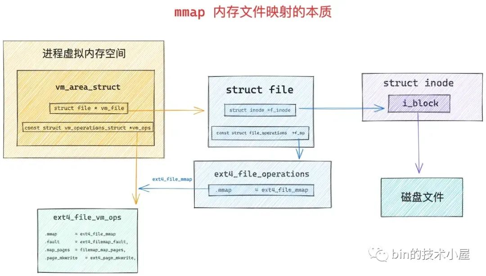

    unsigned long mmap_region(struct file *file, unsigned long addr,
            unsigned long len, vm_flags_t vm_flags, unsigned long pgoff,
            struct list_head *uf)
    {
                      ........ 省略 ........
        // 文件映射
        if (file) {
            // 将文件与虚拟内存映射起来
            vma->vm_file = get_file(file);
            // 这一步中将虚拟内存区域 vma 的操作函数 vm_ops 映射成文件的操作函数（和具体文件系统有关）
            // ext4 文件系统中的操作函数为 ext4_file_vm_ops
            // 从这一刻开始，读写内存就和读写文件是一样的了
            error = call_mmap(file, vma);
        } 
    }
    
    static int ext4_file_mmap(struct file *file, struct vm_area_struct *vma)
    {     
          vma->vm_ops = &ext4_file_vm_ops;
    }

在 vma->vm\_ops 中有个重要的函数 fault，在 ext4 文件系统中的实现是：ext4\_filemap\_fault 函数。

    static const struct vm_operations_struct ext4_file_vm_ops = {
        .fault      = ext4_filemap_fault,
        .map_pages  = filemap_map_pages,
        .page_mkwrite   = ext4_page_mkwrite,
    };

vma->vm\_ops->fault 函数就是专门用于处理文件映射区缺页的，本小节要介绍的文件页的缺页处理的核心就是依赖这个函数完成的。

我们知道 mmap 进行文件映射的时候只是单纯地建立了虚拟内存与文件之间的映射关系，此时并没有物理内存分配。当进程对这段文件映射区进行读取操作的时候，会触发缺页，然后分配物理内存（文件页），这一部分逻辑在下面的 do\_read\_fault 函数中完成，它主要处理的是由于对文件映射区的读取操作而引起的缺页情况。

而 mmap 文件映射又分为私有文件映射与共享文件映射两种映射方式，而私有文件映射的核心特点是读共享的，当任意进程对私有文件映射区发生写入操作时候，就会发生写时复制 COW，这一部分逻辑在下面的 do\_cow\_fault 函数中完成。

对共享文件映射区进行的写入操作而引起的缺页，内核放在 do\_shared\_fault 函数中进行处理。

    static vm_fault_t do_fault(struct vm_fault *vmf)
    {
        struct vm_area_struct *vma = vmf->vma;
        struct mm_struct *vm_mm = vma->vm_mm;
        vm_fault_t ret;
    
        // 处理 vm_ops->fault 为 null 的异常情况
        if (!vma->vm_ops->fault) {
            // 如果中间页目录 pmd 指向的一级页表不在内存中，则返回 SIGBUS 错误
            if (unlikely(!pmd_present(*vmf->pmd)))
                ret = VM_FAULT_SIGBUS;
            else {
                // 获取缺页的页表项 pte
                vmf->pte = pte_offset_map_lock(vmf->vma->vm_mm,
                                   vmf->pmd,
                                   vmf->address,
                                   &vmf->ptl);
                // pte 为空，则返回 SIGBUS 错误
                if (unlikely(pte_none(*vmf->pte)))
                    ret = VM_FAULT_SIGBUS;
                else
                    // pte 不为空，返回 NOPAGE，即本次缺页处理不会分配物理内存页
                    ret = VM_FAULT_NOPAGE;
    
                pte_unmap_unlock(vmf->pte, vmf->ptl);
            }
        } else if (!(vmf->flags & FAULT_FLAG_WRITE))
            // 缺页如果是读操作引起的，进入 do_read_fault 处理
            ret = do_read_fault(vmf);
        else if (!(vma->vm_flags & VM_SHARED))
            // 缺页是由私有映射区的写入操作引起的，则进入 do_cow_fault 处理写时复制
            ret = do_cow_fault(vmf);
        else
            // 处理共享映射区的写入缺页
            ret = do_shared_fault(vmf);
    
        return ret;
    }

#### 8.1 do\_read\_fault 处理读操作引起的缺页

当我们调用 mmap 对文件进行映射的时候，无论是采用私有文件映射的方式还是共享文件映射的方式，内核都只是会在进程的地址空间中为本次映射创建出一段虚拟映射区 vma 出来，然后将这段虚拟映射区 vma 与映射文件关联起来就结束了，整个映射过程并未涉及到物理内存的分配。

下面是多进程对同一文件中的同一段文件区域进行私有映射后，内核中的结构图：

当任意进程开始访问其地址空间中的这段虚拟内存区域 vma 时，由于背后没有对应文件页进行映射，所以会发生缺页中断，在缺页中断中内核会首先分配一个物理内存页并加入到 page cache 中，随后将映射的文件内容读取到刚刚创建出来的物理内存页中，然后将这个物理内存页映射到缺页虚拟内存地址 address 对应在进程页表中的 pte 中。

除此之外，内核还会考虑到进程访问内存的空间局部性，所以内核除了会映射本次缺页需要的文件页之外，还会将其相邻的文件页读取到 page cache 中，然后将这些相邻的文件页映射到对应的 pte 中。这一部分预先提前映射的逻辑在 map\_pages 函数中实现。

    static const struct vm_operations_struct ext4_file_vm_ops = {
        .fault      = ext4_filemap_fault,
        .map_pages  = filemap_map_pages,
        .page_mkwrite   = ext4_page_mkwrite,
    };

如果不满足预先提前映射的条件，那么内核就只会专注处理映射本次缺页所需要的文件页。

首先通过上面的 fault 函数，当映射文件所在文件系统是 ext4 时，该函数的实现为 ext4\_filemap\_fault，该函数只负责获取本次缺页所需要的文件页。

当获取到文件页之后，内核会调用 finish\_fault 函数，将文件页映射到缺页地址 address 在进程页表中对应的 pte 中，do\_read\_fault 函数处理就完成了，不过需要注意的是，对于私有文件映射的话，此时的这个 pte 还是只读的，多进程之间读共享，当任意进程尝试写入的时候，会发生写时复制。

    static unsigned long fault_around_bytes __read_mostly =
    	rounddown_pow_of_two(65536);
    
    static vm_fault_t do_read_fault(struct vm_fault *vmf)
    {
        struct vm_area_struct *vma = vmf->vma;
        vm_fault_t ret = 0;
    
        // map_pages 用于提前预先映射文件页相邻的若干文件页到相关 pte 中，从而减少缺页次数
        // fault_around_bytes 控制预先映射的的字节数默认初始值为 65536（16个物理内存页）
        if (vma->vm_ops->map_pages && fault_around_bytes >> PAGE_SHIFT > 1) {
            // 这里会尝试使用 map_pages 将缺页地址 address 附近的文件页预读进 page cache
            // 然后填充相关的 pte，目的是减少缺页次数
            ret = do_fault_around(vmf);
            if (ret)
                return ret;
        }
    
        // 如果不满足预先映射的条件，则只映射本次需要的文件页
        // 首先会从 page cache 中读取文件页，如果 page cache 中不存在则从磁盘中读取，并预读若干文件页到 page cache 中
        ret = __do_fault(vmf);     // 这里需要负责获取文件页，并不映射
        // 将本次缺页所需要的文件页映射到 pte 中。
        ret |= finish_fault(vmf);
        unlock_page(vmf->page);
        return ret;
    }

\_\_do\_fault 函数底层会调用到 vma->vm\_ops->fault，在 ext4 文件系统中对应的实现是 ext4\_filemap\_fault。

    static vm_fault_t __do_fault(struct vm_fault *vmf)
    {
        struct vm_area_struct *vma = vmf->vma;
        vm_fault_t ret;
              ...... 省略 ......
        ret = vma->vm_ops->fault(vmf);
              ...... 省略 ......
        return ret;
    }
    
    vm_fault_t ext4_filemap_fault(struct vm_fault *vmf)
    {
        ret = filemap_fault(vmf);
        return ret;
    }

filemap\_fault 主要的任务就是先把缺页所需要的文件页获取出来，为后面的映射做准备。

> 以下内容涉及到文件以及 page cache 的相关操作，对细节感兴趣的读者可以回看下笔者之前的文章 —— [《从 Linux 内核角度探秘 JDK NIO 文件读写本质》](https://mp.weixin.qq.com/s?__biz=Mzg2MzU3Mjc3Ng==&mid=2247486623&idx=1&sn=0cafed9e89b60d678d8c88dc7689abda&chksm=ce77cad8f90043ceaaca732aaaa7cb692c1d23eeb6c07de84f0ad690ab92d758945807239cee&scene=178&cur_album_id=2559805446807928833#rd)

内核在这里首先会调用 find\_get\_page 从 page cache 中尝试获取文件页，如果文件页存在，则继续调用 do\_async\_mmap\_readahead 启动异步预读机制，将相邻的若干文件页一起预读进 page cache 中。

如果文件页不在 page cache 中，内核则会调用 do\_sync\_mmap\_readahead 来同步预读，这里首先会分配一个物理内存页出来，然后将新分配的内存页加入到 page cache 中，并增加页引用计数。

随后会通过 address\_space\_operations 中定义的 readpage 激活块设备驱动从磁盘中读取映射的文件内容，然后将读取到的内容填充新分配的内存页中。并同步预读若干相邻的文件页到 page cache 中。

    static const struct address_space_operations ext4_aops = {
        .readpage       = ext4_readpage
    }

    vm_fault_t filemap_fault(struct vm_fault *vmf)
    {
        int error;
        // 获取映射文件
        struct file *file = vmf->vma->vm_file;
        // 获取 page cache
        struct address_space *mapping = file->f_mapping;    
        // 获取映射文件的 inode
        struct inode *inode = mapping->host;
        // 获取映射文件内容在文件中的偏移
        pgoff_t offset = vmf->pgoff;
        // 从 page cache 读取到的文件页，存放在 vmf->page 中返回
        struct page *page;
        vm_fault_t ret = 0;
    
        // 根据文件偏移 offset，到 page cache 中查找对应的文件页
        page = find_get_page(mapping, offset);
        if (likely(page) && !(vmf->flags & FAULT_FLAG_TRIED)) {
            // 如果文件页在 page cache 中，则启动异步预读，预读后面的若干文件页到 page cache 中
            fpin = do_async_mmap_readahead(vmf, page);
        } else if (!page) {
            // 如果文件页不在 page cache，那么就需要启动 io 从文件中读取内容到 page cahe
            // 由于涉及到了磁盘 io ，所以本次缺页类型为 VM_FAULT_MAJOR
            count_vm_event(PGMAJFAULT);
            count_memcg_event_mm(vmf->vma->vm_mm, PGMAJFAULT);
            ret = VM_FAULT_MAJOR;
            // 启动同步预读，将所需的文件数据读取进 page cache 中并同步预读若干相邻的文件数据到 page cache 
            fpin = do_sync_mmap_readahead(vmf);
    retry_find:
            // 尝试到 page cache 中重新读取文件页，这一次就可以读到了
            page = pagecache_get_page(mapping, offset,
                          FGP_CREAT|FGP_FOR_MMAP,
                          vmf->gfp_mask);
            }
        }
    
        ..... 省略 ......
    }
    EXPORT_SYMBOL(filemap_fault);

文件页现在有了，接下来内核就会调用 finish\_fault 将文件页映射到 pte 中。

    vm_fault_t finish_fault(struct vm_fault *vmf)
    {
        // 为本次缺页准备好的物理内存页，即后续需要用 pte 映射的内存页
        struct page *page;
        vm_fault_t ret = 0;
    
        if ((vmf->flags & FAULT_FLAG_WRITE) &&
            !(vmf->vma->vm_flags & VM_SHARED))
            // 如果是写时复制场景，那么 pte 要映射的是这个 cow 复制过来的内存页
            page = vmf->cow_page;
        else
            // 在 filemap_fault 函数中读取到的文件页，后面需要将文件页映射到 pte 中
            page = vmf->page;
    
        // 对于私有映射来说，这里需要检查进程地址空间是否被标记了 MMF_UNSTABLE
        // 如果是，那么 oom 后续会回收这块地址空间，这会导致私有映射的文件页丢失
        // 所以在为私有映射建立 pte 映射之前，需要检查一下
        if (!(vmf->vma->vm_flags & VM_SHARED))
            // 地址空间没有被标记 MMF_UNSTABLE 则会返回 o
            ret = check_stable_address_space(vmf->vma->vm_mm);
        if (!ret)
            // 将创建出来的物理内存页映射到 address 对应在页表中的 pte 中
            ret = alloc_set_pte(vmf, vmf->memcg, page);
        if (vmf->pte)
            // 释放页表锁
            pte_unmap_unlock(vmf->pte, vmf->ptl);
        return ret;
    }

alloc\_set\_pte 将之前我们准备好的文件页，映射到缺页地址 address 在进程页表对应的 pte 中。

    vm_fault_t alloc_set_pte(struct vm_fault *vmf, struct mem_cgroup *memcg,
            struct page *page)
    {
        struct vm_area_struct *vma = vmf->vma;
        // 判断本次缺页是否是 写时复制
        bool write = vmf->flags & FAULT_FLAG_WRITE;
        pte_t entry;
        vm_fault_t ret;
        // 如果页表还不存在，需要先创建一个页表出来
        if (!vmf->pte) {
            // 如果 pmd 为空，则创建一个页表出来，并填充 pmd
            // 如果页表存在，则获取 address 在页表中对应的 pte 保存在 vmf->pte 中
            ret = pte_alloc_one_map(vmf);
            if (ret)
                return ret;
        }
        // 根据之前分配出来的内存页 pfn 以及相关页属性 vma->vm_page_prot 构造一个 pte 出来
        // 对于私有文件映射来说，这里的 pte 是只读的
        entry = mk_pte(page, vma->vm_page_prot);
        // 如果是写时复制，这里才会将 pte 改为可写的
        if (write) 
            entry = maybe_mkwrite(pte_mkdirty(entry), vma);
        // 将构造出来的 pte （entry）赋值给 address 在页表中真正对应的 vmf->pte
        // 现在进程页表体系就全部被构建出来了，文件页缺页处理到此结束
        set_pte_at(vma->vm_mm, vmf->address, vmf->pte, entry);
        // 刷新 mmu
        update_mmu_cache(vma, vmf->address, vmf->pte);
    
        return 0;
    }

#### 8.2 do\_cow\_fault 处理私有文件映射的写时复制

上小节 do\_read\_fault 函数处理的场景是，进程在调用 mmap 对文件进行私有映射或者共享映射之后，立马进行读取的缺页场景。

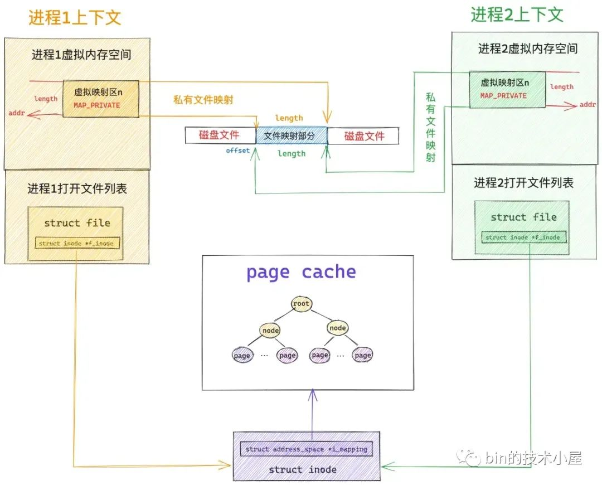

但是如果当我们采用的是 mmap 进行私有文件映射时，在映射之后，立马进行写入操作时，就会发生写时复制，写时复制的缺页处理流程内核封装在 do\_cow\_fault 函数中。

由于我们这里要进行写时复制，所以首先要调用 alloc\_page\_vma 从伙伴系统中重新申请一个物理内存页出来，我们先把这个刚刚新申请出来用于写时复制的内存页称为 cow\_page

然后调用上小节中介绍的 \_\_do\_fault 函数，将原来的文件页从 page cache 中读取出来，我们把原来的文件页称为 page 。

最后调用 copy\_user\_highpage 将原来文件页 page 中的内容拷贝到刚刚新申请的内存页 cow\_page 中，完成写时复制之后，接着调用 finish\_fault 将 cow\_page 映射到缺页地址 address 在进程页表中的 pte 上。

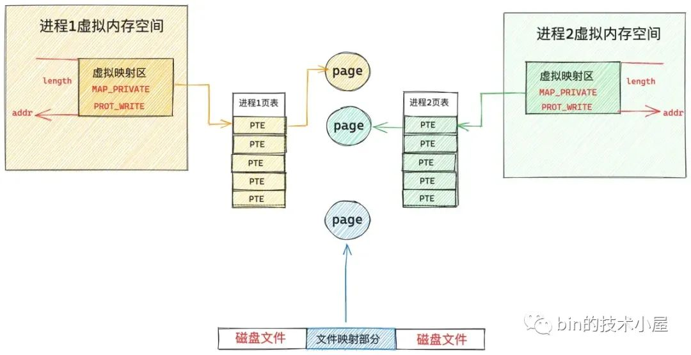

这样一来，进程的这段虚拟文件映射区就映射到了专属的物理内存页 cow\_page 上，而且内容和原来文件页 page 中的内容一模一样，进程对各自虚拟内存区的修改只能反应到各自对应的 cow\_page上，而且各自的修改在进程之间是互不可见的。

由于 cow\_page 已经脱离了 page cache，所以这些修改也都不会回写到磁盘文件中，这就是私有文件映射的核心特点。

    static vm_fault_t do_cow_fault(struct vm_fault *vmf)
    {
        struct vm_area_struct *vma = vmf->vma;
        vm_fault_t ret;
        // 从伙伴系统重新申请一个用于写时复制的物理内存页 cow_page
        vmf->cow_page = alloc_page_vma(GFP_HIGHUSER_MOVABLE, vma, vmf->address);
        // 从  page cache 读取原来的文件页
        ret = __do_fault(vmf);
        // 将原来文件页中的内容拷贝到 cow_page 中完成写时复制
        copy_user_highpage(vmf->cow_page, vmf->page, vmf->address, vma);
        // 将 cow_page 重新映射到缺页地址 address 对应在页表中的 pte 上。
        ret |= finish_fault(vmf);
        unlock_page(vmf->page);
        // 原来的文件页引用计数 - 1
        put_page(vmf->page);
        return ret;
    }

#### 8.3 do\_shared\_fault 处理对共享文件映射区写入引起的缺页

上小节我们介绍的 do\_cow\_fault 函数处理的场景是，当我们采用 mmap 进行私有文件映射之后，立即对虚拟映射区进行写入操作之后的缺页处理逻辑。

如果我们调用 mmap 对文件进行共享文件映射之后，然后立即对虚拟映射区进行写入操作，这背后的缺页处理逻辑又是怎样的呢 ？

其实和之前的文件缺页处理逻辑的核心流程都差不多，不同的是由于这里我们进行的共享文件映射，所以多个进程中的虚拟文件映射区都会映射到 page cache 中的文件页上，由于没有写时复制，所以进程对文件页的修改都会直接反映到 page cache 中，近而后续会回写到磁盘文件上。

由于共享文件映射涉及到脏页回写，所以在共享文件映射的缺页处理场景中，为了防止数据的丢失会额外有一些文件系统日志的记录工作。

    static vm_fault_t do_shared_fault(struct vm_fault *vmf)
    {
        struct vm_area_struct *vma = vmf->vma;
        vm_fault_t ret, tmp;
        // 从 page cache 中读取文件页
        ret = __do_fault(vmf);
       
        if (vma->vm_ops->page_mkwrite) {
            unlock_page(vmf->page);
            // 将文件页变为可写状态，并为后续记录文件日志做一些准备工作
            tmp = do_page_mkwrite(vmf);
        }
    
        // 将文件页映射到缺页 address 在页表中对应的 pte 上
        ret |= finish_fault(vmf);
    
        // 将 page 标记为脏页，记录相关文件系统的日志，防止数据丢失
        // 判断是否将脏页回写
        fault_dirty_shared_page(vma, vmf->page);
        return ret;
    }

### 9\. do\_wp\_page 进行写时复制

本小节即将要介绍的 do\_wp\_page 函数和之前介绍的 do\_cow\_fault 函数都是用于处理写时复制的，其最为核心的逻辑都是差不多的，只是在触发场景上会略有不同。

do\_cow\_fault 函数主要处理的写时复制场景是，当我们使用 mmap 进行私有文件映射时，在刚映射完之后，此时进程的页表或者相关页表项 pte 还是空的，就立即进行写入操作。

do\_wp\_page 函数主要处理的写时复制场景是，访问的这块虚拟内存背后是有物理内存页映射的，对应的 pte 不为空，只不过相关 pte 的权限是只读的，而虚拟内存区域 vma 是有写权限的，在这种类型的虚拟内存进行写入操作的时候，触发的写时复制就在 do\_wp\_page 函数中处理。

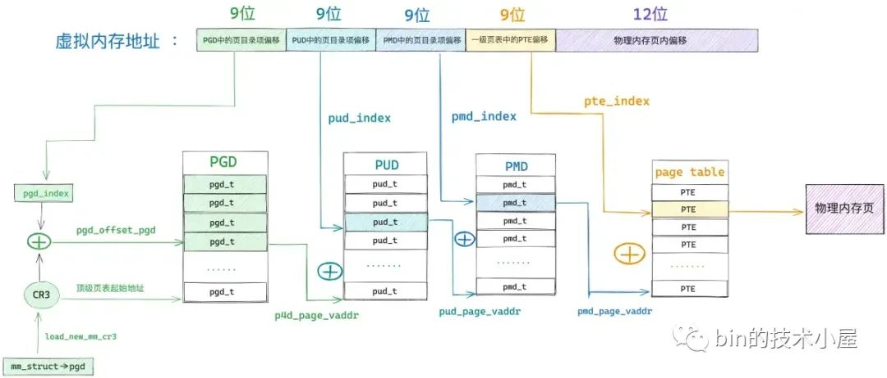

比如，我们使用 mmap 进行私有文件映射之后，此时只是分配了虚拟内存，进程页表或者相关 pte 还是空的，这时对这块映射的虚拟内存进行访问的时候就会触发缺页中断，最后在之前介绍的 do\_read\_fault 函数中将映射的文件内容加载到 page cache 中，pte 指向 page cache 中的文件页。

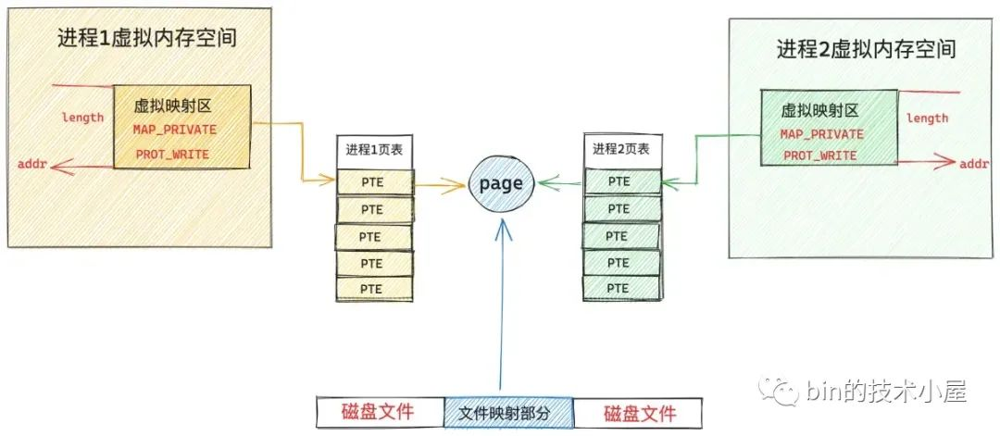

但此时的 pte 是只读的，如果我们对这块映射的虚拟内存进行写入操作，就会发生写时复制，由于现在 pte 不为空，背后也映射着文件页，所以会在 do\_wp\_page 函数中进行处理。

除了私有映射的文件页之外，do\_wp\_page 还会对匿名页相关的写时复制进行处理。

比如，我们通过 fork 系统调用创建子进程的时候，内核会拷贝父进程占用的所有资源到子进程中，其中也包括了父进程的地址空间以及父进程的页表。

一个进程中申请的物理内存页既会有文件页也会有匿名页，而这些文件页和匿名页既可以是私有的也可以是共享的，当内核在拷贝父进程的页表时，如果遇到私有的匿名页或者文件页，就会将其对应在父子进程页表中的 pte 设置为只读，进行写保护。并将父子进程共同引用的匿名页或者文件页的引用计数加 1。

    static inline unsigned long
    copy_one_pte(struct mm_struct *dst_mm, struct mm_struct *src_mm,
            pte_t *dst_pte, pte_t *src_pte, struct vm_area_struct *vma,
            unsigned long addr, int *rss)
    {
        /*
         * If it's a COW mapping, write protect it both
         * in the parent and the child
         */
        if (is_cow_mapping(vm_flags) && pte_write(pte)) {
            // 设置父进程的 pte 为只读
            ptep_set_wrprotect(src_mm, addr, src_pte);
            // 设置子进程的 pte 为只读
            pte = pte_wrprotect(pte);
        }
        // 获取 pte 中映射的物理内存页（此时父子进程共享该页）
        page = vm_normal_page(vma, addr, pte);
        // 物理内存页的引用技术 + 1
        get_page(page);
    }
    
    static inline bool is_cow_mapping(vm_flags_t flags)
    {
            // vma 是私有可写的
    	return (flags & (VM_SHARED | VM_MAYWRITE)) == VM_MAYWRITE;
    }

现在父子进程拥有了一模一样的地址空间，页表是一样的，页表中的 pte 均指向同一个物理内存页面，对于私有的物理内存页来说，父子进程的相关 pte 此时均变为了只读的，私有物理内存页的引用计数为 2 。而对于共享的物理内存页来说，内核就只是简单的将父进程的 pte 拷贝到子进程页表中即可，然后将子进程 pte 中的脏页标记清除，其他的不做改变。

当父进程或者子进程对该页面发生写操作的时候，我们现在假设子进程先对页面发生写操作，随后子进程发现自己页表中的 pte 是只读的，于是就会产生写保护类型的缺页中断，由于子进程页表中的 pte 不为空，所以会进入到 do\_wp\_page 函数中处理。

由于现在子进程和父子进程页表中的相关 pte 指向的均是同一个物理内存页，内核在 do\_wp\_page 函数中会发现这个物理内存页的引用计数大于 1，存在多进程共享的情况，所以就会触发写时复制，这一过程在 wp\_page\_copy 函数中处理。

在 wp\_page\_copy 函数中，内核会首先为子进程分配一个新的物理内存页 new\_page，然后调用 cow\_user\_page 将原有内存页 old\_page 中的内容全部拷贝到新内存页中。

创建一个临时的页表项 entry，然后让 entry 指向新的内存页，将 entry 重新设置为可写，通过 set\_pte\_at\_notify 将 entry 值设置到子进程页表中的 pte 上。最后将原有内存页 old\_page 的引用计数减 1 。

    static vm_fault_t wp_page_copy(struct vm_fault *vmf)
    {
        // 缺页地址 address 所在 vma
        struct vm_area_struct *vma = vmf->vma;
        // 当前进程地址空间
        struct mm_struct *mm = vma->vm_mm;
        // 原来映射的物理内存页，pte 为只读
        struct page *old_page = vmf->page;
        // 用于写时复制的新内存页
        struct page *new_page = NULL;
        // 写时复制之后，需要修改原来的 pte，这里是临时构造的一个 pte 值
        pte_t entry;
        // 是否发生写时复制
        int page_copied = 0;
    
        // 如果 pte 原来映射的是一个零页
        if (is_zero_pfn(pte_pfn(vmf->orig_pte))) {
            // 新申请一个零页出来，内存页中的内容被零初始化
            new_page = alloc_zeroed_user_highpage_movable(vma,
                                      vmf->address);
            if (!new_page)
                goto oom;
        } else {
            // 新申请一个物理内存页
            new_page = alloc_page_vma(GFP_HIGHUSER_MOVABLE, vma,
                    vmf->address);
            if (!new_page)
                goto oom;
            // 将原来内存页 old page 中的内容拷贝到新内存页 new page 中
            cow_user_page(new_page, old_page, vmf->address, vma);
        }
    
        // 给页表加锁，并重新获取 address 在页表中对应的 pte
        vmf->pte = pte_offset_map_lock(mm, vmf->pmd, vmf->address, &vmf->ptl);
        // 判断加锁前的 pte （orig_pte）与加锁后的 pte （vmf->pte）是否相同
        // 目的是判断此时是否有其他线程正在并发修改 pte
        if (likely(pte_same(*vmf->pte, vmf->orig_pte))) {
            if (old_page) {
                // 更新进程常驻内存信息 rss_state
                if (!PageAnon(old_page)) {
                    // 减少 MM_FILEPAGES 计数
                    dec_mm_counter_fast(mm,
                            mm_counter_file(old_page));
                    // 由于发生写时复制，这里匿名页个数加 1 
                    inc_mm_counter_fast(mm, MM_ANONPAGES);
                }
            } else {
                inc_mm_counter_fast(mm, MM_ANONPAGES);
            }
            // 将旧的 tlb 缓存刷出
            flush_cache_page(vma, vmf->address, pte_pfn(vmf->orig_pte));
            // 创建一个临时的 pte 映射到新内存页 new page 上
            entry = mk_pte(new_page, vma->vm_page_prot);
            // 设置 entry 为可写的，正是这里, pte 的权限由只读变为了可写
            entry = maybe_mkwrite(pte_mkdirty(entry), vma);
            // 为新的内存页建立反向映射关系
            page_add_new_anon_rmap(new_page, vma, vmf->address, false);
            // 将新的内存页加入到 LRU active 链表中
            lru_cache_add_active_or_unevictable(new_page, vma);
            // 将 entry 值重新设置到子进程页表 pte 中
            set_pte_at_notify(mm, vmf->address, vmf->pte, entry);
            // 更新 mmu
            update_mmu_cache(vma, vmf->address, vmf->pte);
            if (old_page) {
                // 将原来的内存页从当前进程的反向映射关系中解除
                page_remove_rmap(old_page, false);
            }
    
            /* Free the old page.. */
            new_page = old_page;
            page_copied = 1;
        } else {
            mem_cgroup_cancel_charge(new_page, memcg, false);
        }
        // 释放页表锁
        pte_unmap_unlock(vmf->pte, vmf->ptl);
    
        if (old_page) {
            // 旧内存页的引用计数减 1
            put_page(old_page);
        }
        return page_copied ? VM_FAULT_WRITE : 0;
    }

现在子进程处理完了，下面我们再来看当父进程发生写入操作的时候会发生什么 ？

首先和子进程一样，现在父进程页表中的相关 pte 仍然是只读的，访问这段虚拟内存地址依然会产生写保护类型的缺页中断，和子进程不同的是，此时父进程 pte 中指向的原有物理内存页 old\_page 的引用计数已经变为 1 了，说明父进程是独占的，复用原来的 old\_page 即可，不必进行写时复制，只是简单的将父进程页表中的相关 pte 改为可写就行了。

    static inline void wp_page_reuse(struct vm_fault *vmf)
        __releases(vmf->ptl)
    {
        struct vm_area_struct *vma = vmf->vma;
        struct page *page = vmf->page;
        pte_t entry;
        // 先将 tlb cache 中缓存的 address 对应的 pte 刷出缓存
        flush_cache_page(vma, vmf->address, pte_pfn(vmf->orig_pte));
        // 将原来 pte 的 access 位置 1 ，表示该 pte 映射的物理内存页是活跃的
        entry = pte_mkyoung(vmf->orig_pte);
        // 将原来只读的 pte 改为可写的，并标记为脏页
        entry = maybe_mkwrite(pte_mkdirty(entry), vma);
        // 将更新后的 entry 值设置到页表 pte 中
        if (ptep_set_access_flags(vma, vmf->address, vmf->pte, entry, 1))
            // 更新 mmu 
            update_mmu_cache(vma, vmf->address, vmf->pte);
        pte_unmap_unlock(vmf->pte, vmf->ptl);
    }

理解了上面的核心内容，我们再来看 do\_wp\_page 的处理逻辑就很清晰了：

    static vm_fault_t do_wp_page(struct vm_fault *vmf)
        __releases(vmf->ptl)
    {
        struct vm_area_struct *vma = vmf->vma;
        // 获取 pte 映射的物理内存页
        vmf->page = vm_normal_page(vma, vmf->address, vmf->orig_pte);
    
             ...... 省略处理特殊映射相关逻辑 ....
        // 物理内存页为匿名页的情况
        if (PageAnon(vmf->page)) {
    
             ...... 省略处理 ksm page 相关逻辑 ....
            // reuse_swap_page 判断匿名页的引用计数是否为 1
            if (reuse_swap_page(vmf->page, &total_map_swapcount)) {
                // 如果当前物理内存页的引用计数为 1 ，并且只有当前进程在引用该物理内存页
                // 则不做写时复制处理，而是复用当前物理内存页，只是将 pte 改为可写即可 
                wp_page_reuse(vmf);
                return VM_FAULT_WRITE;
            }
            unlock_page(vmf->page);
        } else if (unlikely((vma->vm_flags & (VM_WRITE|VM_SHARED)) ==
                        (VM_WRITE|VM_SHARED))) {
            // 处理共享可写的内存页
            // 由于大家都可写，所以这里也只是调用 wp_page_reuse 复用当前内存页即可，不做写时复制处理
            // 由于是共享的，对于文件页来说是可以回写到磁盘上的，所以会额外调用一次 fault_dirty_shared_page 判断是否进行脏页的回写
            return wp_page_shared(vmf);
        }
    copy:
        // 走到这里表示当前物理内存页的引用计数大于 1 被多个进程引用
        // 对于私有可写的虚拟内存区域来说，就要发生写时复制
        // 而对于私有文件页的情况来说，不必判断内存页的引用计数
        // 因为是私有文件页，不管文件页的引用计数是不是 1 ，都要进行写时复制
        return wp_page_copy(vmf);
    }

### 10\. do\_swap\_page 处理 swap 缺页异常

如果在遍历进程页表的时候发现，虚拟内存地址 address 对应的页表项 pte 不为空，但是 pte 中第 0 个比特位置为 0 ，则表示该 pte 之前是被物理内存映射过的，只不过后来被内核 swap out 出去了。

我们需要的物理内存页不在内存中反而在磁盘中，现在我们就需要将物理内存页从磁盘中 swap in 进来。但在 swap in 之前内核需要知道该物理内存页的内容被保存在磁盘的什么位置上。

笔者在之前文章[《一步一图带你构建 Linux 页表体系》](https://mp.weixin.qq.com/s?__biz=Mzg2MzU3Mjc3Ng==&mid=2247488477&idx=1&sn=f8531b3220ea3a9ca2a0fdc2fd9dabc6&chksm=ce77d59af9005c8c2ef35c7e45f45cbfc527bfc4b99bbd02dbaaa964d174a4009897dd329a4d&scene=21&cur_album_id=2559805446807928833#wechat_redirect) 中的第 4.2.1 小节中详细介绍了 64 位页表项 pte 的比特位布局，以及各个比特位的含义。

    typedef unsigned long   pteval_t;
    typedef struct { pteval_t pte; } pte_t;

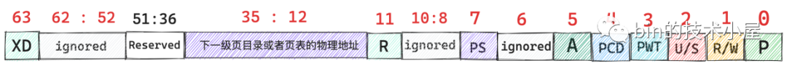

64 位的 pte 主要用来表示物理内存页的地址以及相关的权限标识位，但是当物理内存页不在内存中的时候，这些比特位就没有了任何意义。我们何不将这些已经没有任何意义的比特位利用起来，在物理内存页被 swap out 到磁盘上的时候，将物理内存页在磁盘上的位置保存在这些比特位中。本质上还利用的是之前 pte 中的那 64 个比特，为了区别 swap 的场景，内核使用了一个新的结构体 swp\_entry\_t 来包装。

    typedef struct {
    	unsigned long val;
    } swp_entry_t;

swap in 的首要任务就是先要从进程页表中将这个 swp\_entry\_t 读取出来，然后从 swp\_entry\_t 中解析出内存页在 swap 交换区中的位置，根据磁盘位置信息将内存页的内容读取到内存中。由于产生了新的物理内存页，所以就要创建新的 pte 来映射这个物理内存页，然后将新的 pte 设置到页表中，替换原来的 swp\_entry\_t。

这里笔者需要为大家解释的第一个问题就是 —— 这个 swp\_entry\_t 究竟是长什么样子 的，它是如何保存 swap 交换区相关位置信息的 ？

#### 10.1 交换区的布局及其组织结构

要明白这个，我们就需要先了解一下 swap 交换区（swap area）的布局，swap 交换区共有两种类型，一种是 swap 分区（swap partition），另一种是 swap 文件（swap file）。

swap partition 可以认为是一个没有文件系统的裸磁盘分区，分区中的磁盘块在磁盘中是连续分布的。

swap file 可以认为是在某个现有的文件系统上，创建的一个定长的普通文件，专门用于保存匿名页被 swap 出来的内容。背后的磁盘块是不连续的。

Linux 系统中可以允许多个这样的 swap 交换区存在，我们可以同时使用多个交换区，也可以为这些交换区指定优先级，优先级高的会被内核优先使用。这些交换区都可以被灵活地添加，删除，而不需要重启系统。多个交换区可以分散在不同的磁盘设备上，这样可以实现硬件的并行访问。

在使用交换区之前，我们可以通过 `mkswap` 首先创建一个交换区出来，如果我们创建的是 swap partition，则在 `mkswap` 命令后面直接指定分区的设备文件名称即可。

    mkswap /dev/sdb7

如果我们创建的是 swap file，则需要额外先使用 `dd` 命令在现有文件系统中创建出一个定长的文件出来。比如下面通过 `dd` 命令从 `/dev/zero` 中拷贝创建一个 `/swapfile` 文件，大小为 4G。

    dd if=/dev/zero of=/swapfile bs=1M count=4096

然后使用 `mkswap` 命令创建 swap file ：

    mkswap /swapfile

当 swap partition 或者 swap file 创建好之后，我们通过 `swapon` 命令来初始化并激活这个交换区。

    swapon /swapfile

当前系统中各个交换区的情况，我们可以通过 `cat /proc/swaps` 或者 `swapon -s` 命令产看：

交换区在内核中使用 `struct swap_info_struct` 结构体来表示，系统中众多的交换区被组织在一个叫做 swap\_info 的数组中，数组中的最大长度为 MAX\_SWAPFILES，MAX\_SWAPFILES 在内核中是一个常量，一般指定为 32，也就是说，系统中最大允许 32 个交换区存在。

    struct swap_info_struct *swap_info[MAX_SWAPFILES];

由于交换区是有优先级的，所以内核又会按照优先级高低，将交换区组织在一个叫做 `swap_avail_heads` 的双向链表中。

    static struct plist_head *swap_avail_heads;

swap\_info\_struct 结构用于描述单个交换区中的各种信息：

    /*
     * The in-memory structure used to track swap areas.
     */
    struct swap_info_struct {
        // 用于表示该交换区的状态，比如 SWP_USED 表示正在使用状态，SWP_WRITEOK 表示交换区是可写的状态
        unsigned long   flags;      /* SWP_USED etc: see above */
        // 交换区的优先级
        signed short    prio;       /* swap priority of this type */
        // 指向该交换区在 swap_avail_heads 链表中的位置
        struct plist_node list;     /* entry in swap_active_head */
        // 该交换区在 swap_info 数组中的索引
        signed char type;       /* strange name for an index */
        // 该交换区可以容纳 swap 的匿名页总数
        unsigned int pages;     /* total of usable pages of swap */
        // 已经 swap 到该交换区的匿名页总数
        unsigned int inuse_pages;   /* number of those currently in use */
        // 如果该交换区是 swap partition 则指向该磁盘分区的块设备结构 block_device
        // 如果该交换区是 swap file 则指向文件底层依赖的块设备结构 block_device
        struct block_device *bdev;  /* swap device or bdev of swap file */
        // 指向 swap file 的 file 结构
        struct file *swap_file;     /* seldom referenced */
    };

而在每个交换区 swap area 内部又会分为很多连续的 slot (槽)，每个 slot 的大小刚好和一个物理内存页的大小相同都是 4K，物理内存页在被 swap out 到交换区时，就会存放在 slot 中。

交换区中的这些 slot 会被组织在一个叫做 swap\_map 的数组中，数组中的索引就是 slot 在交换区中的 offset （这个位置信息很重要），数组中的值表示该 slot 总共被多少个进程同时引用。

什么意思呢 ？ 比如现在系统中一共有三个进程同时共享一个物理内存页（内存中的概念），当这个物理内存页被 swap out 到交换区上时，就变成了 slot （内存页在交换区中的概念），现在物理内存页没了，这三个共享进程就只能在各自的页表中指向这个 slot，因此该 slot 的引用计数就是 3，对应在数组 swap\_map 中的值也是 3 。

交换区中的第一个 slot 用于存储交换区的元信息，比如交换区对应底层各个磁盘块的坏块列表。因此笔者将其标注了红色，表示不能使用。

swap\_map 数组中的值表示的就是对应 slot 被多少个进程同时引用，值为 0 表示该 slot 是空闲的，下次 swap out 的时候首先查找的就是空闲 slot 。 查找范围就是 lowest\_bit 到 highest\_bit 之间的 slot。当查找到空闲 slot 之后，就会将整个物理内存页回写到这个 slot 中。

    struct swap_info_struct {
    	unsigned char *swap_map;	/* vmalloc'ed array of usage counts */
    	unsigned int lowest_bit;	/* index of first free in swap_map */
    	unsigned int highest_bit;	/* index of last free in swap_map */

但是这里会有一个问题就是交换区面向的是整个系统，而系统中会有很多进程，如果多个进程并发进行 swap 的时候，swap\_map 数组就会面临并发操作的问题，这样一来就不得不需要一个全局锁来保护，但是这也导致了多个 CPU 只能串行访问，大大降低了并发度。

那怎么办呢 ？ 想想 JDK 中的 ConcurrentHashMap，将锁分段呗，这样可以将锁竞争分散开来，大大提升并发度。

内核会将 swap\_map 数组中的这些 slot，按照常量 `SWAPFILE_CLUSTER` 指定的个数，256 个 slot 分为一个 cluster。

    #define SWAPFILE_CLUSTER	256

每个 cluster 中包含一把 spinlock\_t 锁，如果 cluster 是空闲的，那么 swap\_cluster\_info 结构中的 data 指向下一个空闲的 cluster，如果 cluster 不是空闲的，那么 data 保存的是该 cluster 中已经分配的 slot 个数。

    struct swap_cluster_info {
        spinlock_t lock;    /*
                     * Protect swap_cluster_info fields
                     * and swap_info_struct->swap_map
                     * elements correspond to the swap
                     * cluster
                     */
        unsigned int data:24;
        unsigned int flags:8;
    };
    #define CLUSTER_FLAG_FREE 1 /* This cluster is free */
    #define CLUSTER_FLAG_NEXT_NULL 2 /* This cluster has no next cluster */
    #define CLUSTER_FLAG_HUGE 4 /* This cluster is backing a transparent huge page */

这样一来 swap\_map 数组中的这些独立的 slot，就被按照以 cluster 为单位重新组织了起来，这些 cluster 被串联在 cluster\_info 链表中。

为了进一步利用 cpu cache，以及实现无锁化查找 slot，内核会给每个 cpu 分配一个 cluster —— percpu\_cluster，cpu 直接从自己的 cluster 中查找空闲 slot，近一步提高了 swap out 的吞吐。

当 cpu 自己的 percpu\_cluster 用尽之后，内核则会调用 swap\_alloc\_cluster 函数从 free\_clusters 中获取一个新的 cluster。

    struct swap_info_struct {
        struct swap_cluster_info *cluster_info; /* cluster info. Only for SSD */
        struct swap_cluster_list free_clusters; /* free clusters list */
    
        struct percpu_cluster __percpu *percpu_cluster; /* per cpu's swap location */
    }

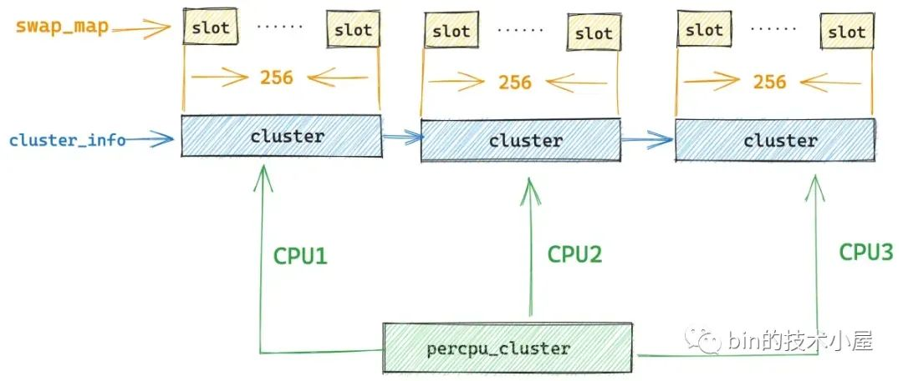

现在交换区的整体布局笔者就为大家介绍完了，可能大家这里有一点还是会比较困惑 —— 你说来说去，这个 slot 到底是个啥 ？

哈哈，大家先别急，我们现在已经对进程的虚拟内存空间非常熟悉了，这里我们把交换区 swap\_info\_struct 与进程的内存空间 mm\_struct 放到一起一对比就很清楚了。

首先进程虚拟内存空间中的虚拟内存别管说的如何天花乱坠，说到底还是要保存在真实的物理内存中的，虚拟内存与物理内存通过页表来关联起来。

同样的道理，别管交换区布局的如何天花乱坠，swap out 出来的数据说到底还是要保存在真实的磁盘中的，而交换区中是按照 slot 为单位进行组织管理的，磁盘中是按照磁盘块来组织管理的，大小都是 4K 。

交换区中的 slot 就好比于虚拟内存空间中的虚拟内存，都是虚拟的概念，物理内存页与磁盘块才是真实本质的东西。

虚拟内存是连续的，但其背后映射的物理内存可能是不连续，交换区中的 slot 也都是连续的，但磁盘中磁盘块的扇区地址却不一定是连续的。页表可以将不连续的物理内存映射到连续的虚拟内存上，内核也需要一种机制，将不连续的磁盘块映射到连续的 slot 中。

当我们使用 `swapon` 命令来初始化激活交换区时，内核会扫描交换区中各个磁盘块的扇区地址，以确定磁盘块与扇区的对应关系，然后搜集扇区地址连续的磁盘块，将这些连续的磁盘块组成一个块组，slot 就会一个一个的映射到这些块组上，块组之间的扇区地址是不连续的，但是 slot 是连续的。

slot 与连续的磁盘块组的映射关系保存在 swap\_extent 结构中：

    /*
     * A swap extent maps a range of a swapfile's PAGE_SIZE pages onto a range of
     * disk blocks.  A list of swap extents maps the entire swapfile.  (Where the
     * term `swapfile' refers to either a blockdevice or an IS_REG file.  Apart
     * from setup, they're handled identically.
     *
     * We always assume that blocks are of size PAGE_SIZE.
     */
    struct swap_extent {
        // 红黑树节点
        struct rb_node rb_node;
        // 块组内，第一个映射的 slot 编号
        pgoff_t start_page;
        // 映射的 slot 个数
        pgoff_t nr_pages;
        // 块组内第一个磁盘块
        sector_t start_block;
    };

由于一个块组内的磁盘块都是连续的，slot 本来又是连续的，所以 swap\_extent 结构中只需要保存映射到该块组内第一个 slot 的编号 （start\_page），块组内第一个磁盘块在磁盘上的块号，以及磁盘块个数就可以了。

虚拟内存页类比 slot，物理内存页类比磁盘块，这里的 swap\_extent 可以看做是虚拟内存区域 vma，进程的虚拟内存空间正是由一段一段的 vma 组成，这些 vma 被组织在一颗红黑树上。

交换区也是一样，它是由一段一段的 swap\_extent 组成，同样也会被组织在一颗红黑树上。我们可以通过 slot 在交换区中的 offset，在这颗红黑树中快速查找出 slot 背后对应的磁盘块。

    struct swap_info_struct {
    	struct rb_root swap_extent_root;/* root of the swap extent rbtree */

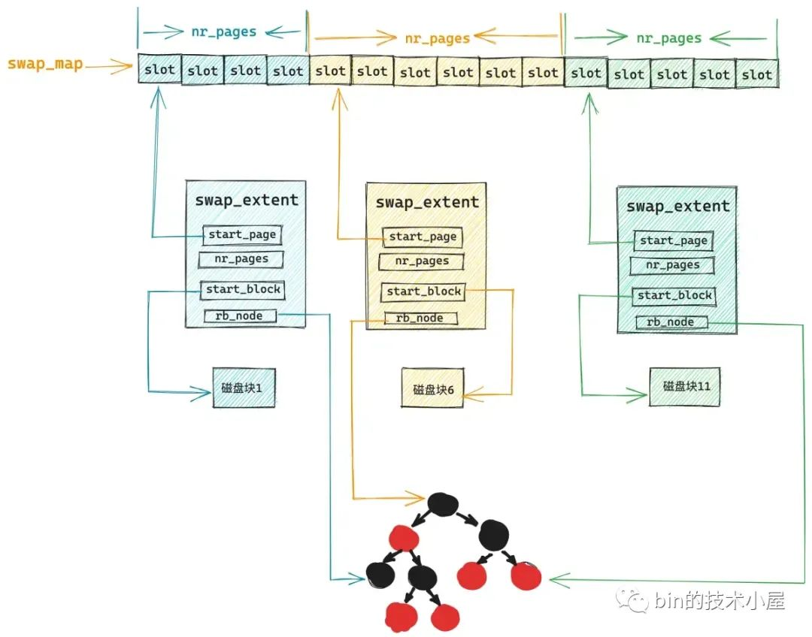

现在交换区内部的样子，我们已经非常清楚了，有了这些背景知识之后，我们在回过头来看本小节最开始提出的问题 —— swp\_entry\_t 到底长什么样子。

#### 10.2 一睹 swp\_entry\_t 真容

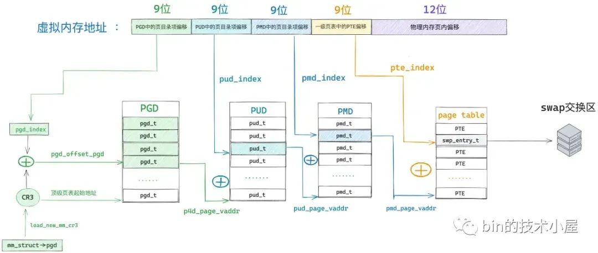

匿名内存页在被内核 swap out 到磁盘上之后，内存页中的内容保存在交换区的 slot 中，在 swap in 的场景中，内核需要根据 swp\_entry\_t 里的信息找到这个 slot，进而找到其对应的磁盘块，然后从磁盘块中读取出被 swap out 出去的内容。

这个就和交换区的布局有很大的关系，首先系统中存在多个交换区，这些交换区被内核组织在 swap\_info 数组中。

    struct swap_info_struct *swap_info[MAX_SWAPFILES];

我们首先需要知道匿名内存页到底被 swap out 到哪个交换区里了，所以 swp\_entry\_t 里必须包含交换区在 swap\_info 数组中的索引，而这个索引正是 swap\_info\_struct 结构中的 type 字段。

    struct swap_info_struct {
        // 该交换区在 swap_info 数组中的索引
        signed char type;  
    }

在确定了交换区的位置后，我们需要知道匿名页被 swap out 到交换区中的哪个 slot 中，所以 swp\_entry\_t 中也必须包含 slot 在交换区中的 offset，这个 offset 就是 swap\_info\_struct 结构里 slot 所在 swap\_map 数组中的下标。

    struct swap_info_struct {
        unsigned char *swap_map; 
    }

所以总结下来 swp\_entry\_t 中需要包含以下三种信息：

第一， swp\_entry\_t 需要标识该页表项是一个 pte 还是 swp\_entry\_t，因为它俩本质上是一样的，都是 `unsigned long` 类型的无符号整数，是可以相互转换的。

    #define __pte_to_swp_entry(pte)	((swp_entry_t) { pte_val(pte) })
    #define __swp_entry_to_pte(swp)	((pte_t) { (swp).val })

第 0 个比特位置 1 表示是一个 pte，背后映射的物理内存页存在于内存中。如果第 0 个比特位置 0 则表示该 pte 背后映射的物理内存页已经被 swap out 出去了，那么它就是一个 swp\_entry\_t，指向内存页在交换区中的位置。

第二，swp\_entry\_t 需要包含被 swap 出去的匿名页所在交换区的索引 type，第 2 个比特位到第 7 个比特位，总共使用 6 个比特来表示匿名页所在交换区的索引。

第三，swp\_entry\_t 需要包含匿名页所在 slot 的位置 offset，第 8 个比特位到第 57 个比特位，总共 50 个比特来表示匿名页对应的 slot 在交换区的 offset 。

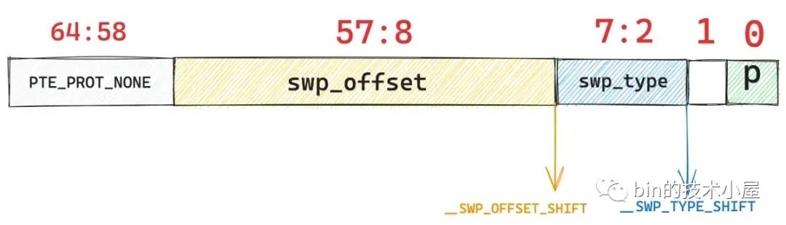

    /*
     * Encode and decode a swap entry:
     *	bits 0-1:	present (must be zero)
     *	bits 2-7:	swap type
     *	bits 8-57:	swap offset
     *	bit  58:	PTE_PROT_NONE (must be zero)
     */
    #define __SWP_TYPE_SHIFT	2
    #define __SWP_TYPE_BITS		6
    #define __SWP_OFFSET_BITS	50
    #define __SWP_OFFSET_SHIFT	(__SWP_TYPE_BITS + __SWP_TYPE_SHIFT)

内核提供了宏 `__swp_type` 用于从 swp\_entry\_t 中将匿名页所在交换区编号提取出来，还提供了宏 `__swp_offset` 用于从 swp\_entry\_t 中将匿名页所在 slot 的 offset 提取出来。

    #define __swp_type(x)		(((x).val >> __SWP_TYPE_SHIFT) & __SWP_TYPE_MASK)
    #define __swp_offset(x)		(((x).val >> __SWP_OFFSET_SHIFT) & __SWP_OFFSET_MASK)
    
    #define __SWP_TYPE_MASK		((1 << __SWP_TYPE_BITS) - 1)
    #define __SWP_OFFSET_MASK	((1UL << __SWP_OFFSET_BITS) - 1)

有了这两个宏之后，我们就可以根据 swp\_entry\_t 轻松地定位到匿名页在交换区中的位置了。

内核首先会通过 `swp_type` 从 swp\_entry\_t 提取出匿名页所在的交换区索引 type，根据 type 就可以从 swap\_info 数组中定位到交换区数据结构 swap\_info\_struct 。

内核将定位交换区 swap\_info\_struct 结构的逻辑封装在 swp\_swap\_info 函数中：

    struct swap_info_struct *swp_swap_info(swp_entry_t entry)
    {
    	return swap_type_to_swap_info(swp_type(entry));
    }
    
    static struct swap_info_struct *swap_type_to_swap_info(int type)
    {
    	return READ_ONCE(swap_info[type]);
    }

得到了交换区的 swap\_info\_struct 结构，我们就可以获取交换区所在磁盘分区底层的块设备 —— swap\_info\_struct->bdev。

    struct swap_info_struct {
        // 如果该交换区是 swap partition 则指向该磁盘分区的块设备结构 block_device
        // 如果该交换区是 swap file 则指向文件底层依赖的块设备结构 block_device
        struct block_device *bdev;  /* swap device or bdev of swap file */
    }

最后通过 `swp_offset` 定位匿名页所在 slot 在交换区中的 offset， 然后利用 offset 在红黑树 swap\_extent\_root 中查找其对应的 swap\_extent。

    struct swap_info_struct {
        struct rb_root swap_extent_root;/* root of the swap extent rbtree */
    }

前面我们提到过 swap file 背后所在的磁盘块不一定是连续的，而 swap file 中的 slot 却是连续的，内核需要用 swap\_extent 结构来描述 slot 与磁盘块的映射关系。

所以对于 swap file 来说，我们找到了 swap\_extent 也就确定了 slot 对应的磁盘块了。

    static sector_t map_swap_entry(swp_entry_t entry, struct block_device **bdev)
    {
        struct swap_info_struct *sis;
        struct swap_extent *se;
        pgoff_t offset;
        // 通过 swap_info[swp_type(entry)]  获取交换区 swap_info_struct 结构
        sis = swp_swap_info(entry);
        // 获取交换区所在磁盘分区块设备
        *bdev = sis->bdev;
        // 获取匿名页在交换区的偏移 
        offset = swp_offset(entry);
        // 通过 offset 到红黑树 swap_extent_root 中查找对应的 swap_extent
        se = offset_to_swap_extent(sis, offset);
        // 获取 slot 对应的磁盘块
        return se->start_block + (offset - se->start_page);
    }

而 swap partition 是一个没有文件系统的裸磁盘分区，其背后的磁盘块都是连续分布的，所以对于 swap partition 来说，slot 与磁盘块是直接映射的，我们获取到 slot 的 offset 之后，在乘以一个固定的偏移 `2 ^ PAGE_SHIFT - 9` 跳过用于存储交换区元信息的 swap header ，就可以直接获得磁盘块了。

这里有点像 [《深入理解 Linux 虚拟内存管理》](https://mp.weixin.qq.com/s?__biz=Mzg2MzU3Mjc3Ng==&mid=2247486732&idx=1&sn=435d5e834e9751036c96384f6965b328&chksm=ce77cb4bf900425d33d2adfa632a4684cf7a63beece166c1ffedc4fdacb807c9413e8c73f298&token=1468822011&lang=zh_CN&scene=21#wechat_redirect) 一文中提到的内核虚拟内存空间中的直接映射区，虚拟内存与物理内存都是直接映射的，通过虚拟内存地址减去一个固定的偏移直接就可以获得物理内存地址了。

    static sector_t swap_page_sector(struct page *page)
    {
        return (sector_t)__page_file_index(page) << (PAGE_SHIFT - 9);
    }
    
    pgoff_t __page_file_index(struct page *page)
    {
        // 在 swap 场景中，swp_entry_t 的值会设置到 page 结构中的 private 字段中
        // 具体什么时候设置的，我们这里先不管，后面会说
        swp_entry_t swap = { .val = page_private(page) };
        return swp_offset(swap);
    }

以上介绍的就是内核在 swap file 和 swap partition 场景下，如何获取 slot 对应的磁盘块 sector\_t 的逻辑与实现。

有了 sector\_t，内核接着就会利用 bdev\_read\_page 函数将 slot 对应在 sector 中的内容读取到物理内存页 page 中，这就是整个 swap in 的过程。

    /**
     * bdev_read_page() - Start reading a page from a block device
     * @bdev: The device to read the page from
     * @sector: The offset on the device to read the page to (need not be aligned)
     * @page: The page to read
     */
    int bdev_read_page(struct block_device *bdev, sector_t sector,
    			struct page *page)

swap\_readpage 函数负责将匿名页中的内容从交换区中读取到物理内存页中来，这里也是 swap in 的核心实现：

    int swap_readpage(struct page *page, bool synchronous)
    {
        struct bio *bio;
        int ret = 0;
        struct swap_info_struct *sis = page_swap_info(page);
        blk_qc_t qc;
        struct gendisk *disk;
        // 处理交换区是 swap file 的情况
        if (sis->flags & SWP_FS) {
            // 从交换区中获取交换文件 swap_file
            struct file *swap_file = sis->swap_file;
            // swap_file 本质上还是文件系统中的一个文件，所以它也会有 page cache
            struct address_space *mapping = swap_file->f_mapping;
            // 利用 page cache 中的 readpage 方法，从 swap_file 所在的文件系统中读取匿名页内容到 page 中。
            // 注意这里只是利用 page cache 的 readpage 方法从文件系统中读取数据，内核并不会把 page 加入到 page cache 中
            // 这里 swap_file 和普通文件的读取过程是不一样的，page cache 不缓存内存页。
            // 对于 swap out 的场景来说，内核也只是利用 page cache 的 writepage 方法将匿名页的内容写入到 swap_file 中。
            ret = mapping->a_ops->readpage(swap_file, page);
            if (!ret)
                count_vm_event(PSWPIN);
            return ret;
        }
    
        // 如果交换区是 swap partition，则直接从磁盘块中读取
        // 对于 swap out 的场景，内核调用 bdev_write_page，直接将匿名页的内容写入到磁盘块中
        ret = bdev_read_page(sis->bdev, swap_page_sector(page), page);
    
    out:
        return ret;
    }

swap\_readpage 是内核 swap 机制的最底层实现，直接和磁盘打交道，负责搭建磁盘与内存之间的桥梁。虽然直接调用 swap\_readpage 可以基本完成 swap in 的目的，但在某些特殊情况下会导致 swap 的性能非常糟糕。

比如下图所示，假设当前系统中存在三个进程，它们共享引用了同一个物理内存页 page。

当这个被共享的 page 被内核 swap out 到交换区之后，三个共享进程的页表会发生如下变化：

当 进程1 开始读取这个共享 page 的时候，由于 page 已经 swap out 到交换区了，所以会发生 swap 缺页异常，进入内核通过 swap\_readpage 将共享 page 的内容从磁盘中读取进内存，此时三个进程的页表结构变为下图所示：

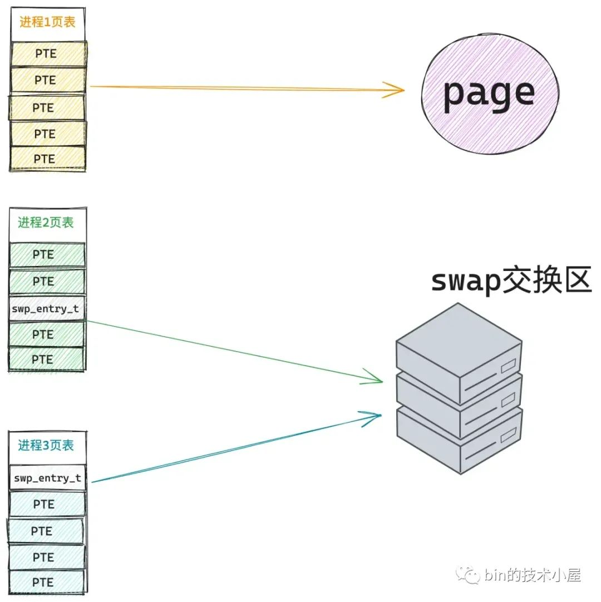

现在共享 page 已经被 进程1 swap in 进来了，但是 进程2 和 进程 3 是不知道的，它们的页表中还储存的是 swp\_entry\_t，依然指向 page 所在交换区的位置。

按照之前的逻辑，当 进程2 以及 进程3 开始读取这个共享 page 的时候，其实 page 已经在内存了，但是它们此刻感知不到，因为 进程2 和 进程3 的页表中存储的依然是 swp\_entry\_t，还是会产生 swap 缺页中断，重新通过 swap\_readpage 读取交换区中的内容，这样一来就产生了额外重复的磁盘 IO。

除此之外，更加严重的是，由于 进程2 和 进程3 的 swap 缺页，又会产生两个新的内存页用来存放从 swap\_readpage 中读取进来的交换区数据。

产生了重复的磁盘 IO 不说，还产生了额外的内存消耗，并且这样一来，三个进程对内存页就不是共享的了。

还有一种极端场景是一个进程试图读取一个正在被 swap out 的 page ，由于 page 正在被内核 swap out，此时进程页表指向该 page 的 pte 已经变成了 swp\_entry\_t。

进程在这个时候访问 page 的时候，还是会产生 swap 缺页异常，进程试图 swap in 这个正在被内核 swap out 的 page，但是此时 page 仍然还在内存中，只不过是正在被内核刷盘。

而按照之前的 swap in 逻辑，进程这里会调用 swap\_readpage 从磁盘中读取，产生额外的磁盘 IO 以及内存消耗不说，关键是此刻 swap\_readpage 出来的数据都不是完整的，这肯定是个大问题。

内核为了解决上面提到的这些问题，因此引入了一个新的结构 —— swap cache 。

#### 10.3 swap cache

有了 swap cache 之后，情况就会变得大不相同，我们在回过头来看第一个问题 —— 多进程共享内存页。

进程1 在 swap in 的时候首先会到 swap cache 中去查找，看看是否有其他进程已经把内存页 swap in 进来了，如果 swap cache 中没有才会调用 swap\_readpage 从磁盘中去读取。

当内核通过 swap\_readpage 将内存页中的内容从磁盘中读取进内存之后，内核会把这个匿名页先放入 swap cache 中。进程 1 的页表将原来的 swp\_entry\_t 填充为 pte 并指向 swap cache 中的这个内存页。

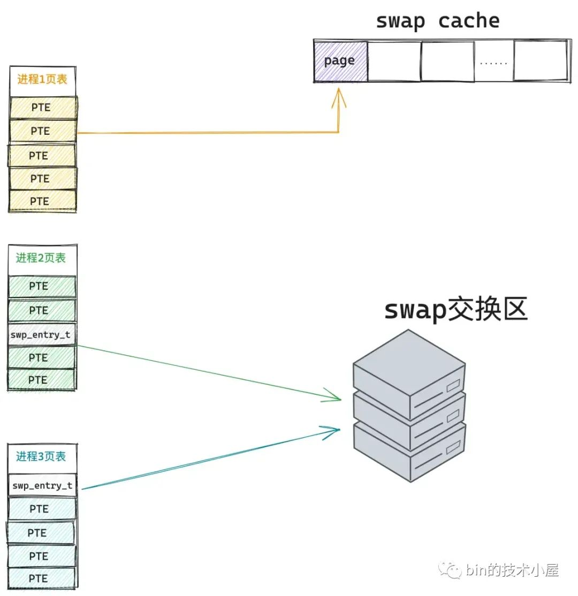

由于进程1 页表中对应的页表项现在已经从 swp\_entry\_t 变为 pte 了，指向的是 swap cache 中的内存页而不是 swap 交换区，所以对应 slot 的引用计数就要减 1 。

还记得我们之前介绍的 swap\_map 数组吗 ？slot 被进程引用的计数就保存在这里，现在这个 slot 在 swap\_map 数组中保存的引用计数从 3 变成了 2 。表示还有两个进程也就是 进程2 和 进程3 仍在继续引用这个 slot 。

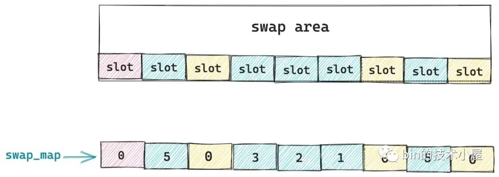

当进程2 发生 swap 缺页中断的时候进入内核之后，也是首先会到 swap cache 中查找是否现在已经有其他进程把共享的内存页 swap in 进来了，内存页 page 在 swap cache 的索引就是页表中的 swp\_entry\_t。由于这三个进程共享的同一个内存页，所以三个进程页表中的 swp\_entry\_t 都是相同的，都是指向交换区的同一位置。

由于共享内存页现在已经被 进程1 swap in 进来了，并存放在 swap cache 中，所以 进程2 通过 swp\_entry\_t 一下就在 swap cache 中找到了，同理，进程 2 的页表也会将原来的 swp\_entry\_t 填充为 pte 并指向 swap cache 中的这个内存页。slot 的引用计数减 1。

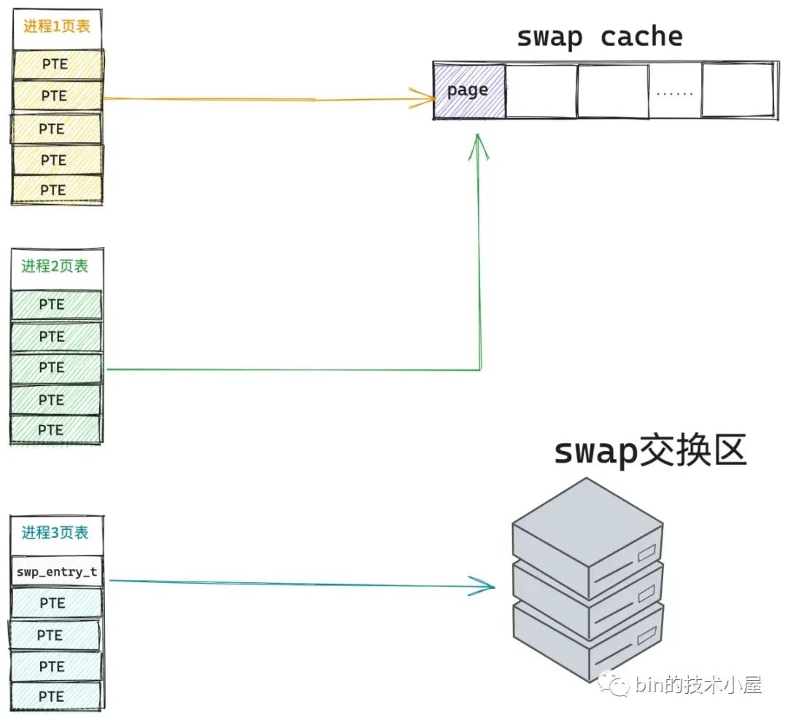

现在这个 slot 在 swap\_map 数组中保存的引用计数从 2 变成了 1 。表示只有 进程3 在引用这个 slot 了。

当 进程3 发生 swap 缺页中断的之后，内核还是先通过 swp\_entry\_t 到 swap cache 中去查找，找到之后，将 进程 3 页表原来的 swp\_entry\_t 填充为 pte 并指向 swap cache 中的这个内存页，slot 的引用计数减 1。

现在 slot 的引用计数已经变为 0 了，这意味着所有共享该内存页的进程已经全部知道了新内存页的地址，它们的 pte 已经全部指向了新内存页，不在指向 slot 了，此时内核便将这个内存页从 swap cache 中移除。

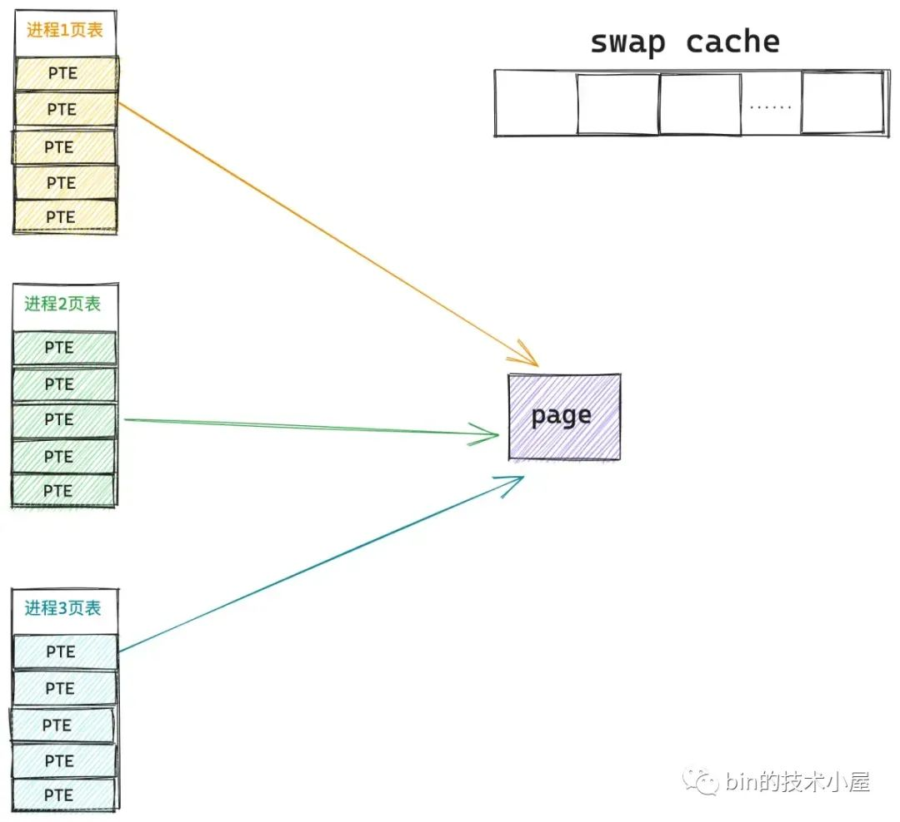

针对第二个问题 —— 进程试图 swap in 这个正在被内核 swap out 的 page，内核的处理方法也是一样，内核在 swap out 的时候首先会在交换区中为这个 page 分配 slot 确定其在交换区的位置，然后通过之前文章 [《深入理解 Linux 物理内存管理》](https://mp.weixin.qq.com/s?__biz=Mzg2MzU3Mjc3Ng==&mid=2247486879&idx=1&sn=0bcc59a306d59e5199a11d1ca5313743&chksm=ce77cbd8f90042ce06f5086b1c976d1d2daa57bc5b768bac15f10ee3dc85874bbeddcd649d88&scene=21#wechat_redirect) 中  
介绍的匿名页反向映射机制找到所有引用该内存页的进程，将它们页表中的 pte 修改为指向 slot 的 swp\_entry\_t。

然后将匿名页 page 先是放入到 swap cache 中，慢慢地通过 swap\_writepage 回写。当匿名页被完全回写到交换区中时，内核才会将 page 从 swap cache 中移除。

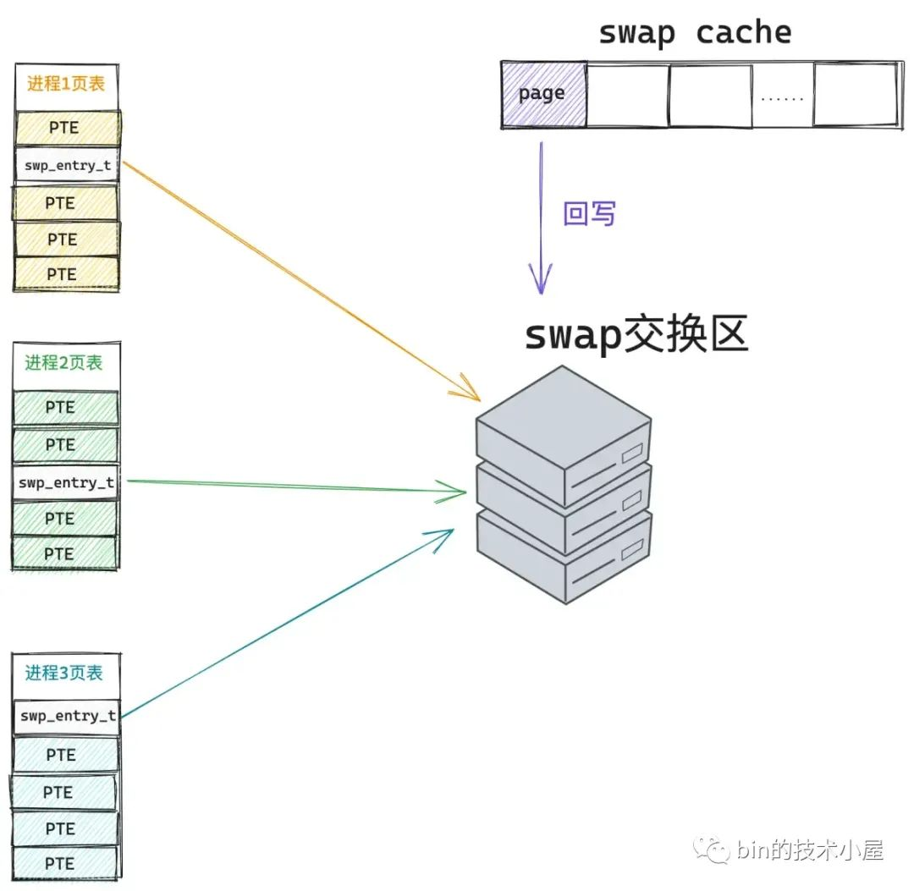

如果当内核正在回写的过程中，不巧有一个进程又要访问该内存页，同样也会发生 swap 缺页中断，但是由于此时没有回写完成，内存页还保存在 swap cache 中，内核通过进程页表中的 swp\_entry\_t 一下就在 swap cache 中找到了，避免了再次发生磁盘 IO，后面的过程就和第一个问题一样了。

上述查找 swap cache 的过程。内核封装在 \_\_read\_swap\_cache\_async 函数里，在 swap in 的过程中，内核会首先调用这里查看 swap cache 是否已经缓存了内存页，如果没有，则新分配一个内存页并加入到 swap cache 中，最后才会调用 swap\_readpage 从磁盘中将所需内容读取到新内存页中。

    struct page *__read_swap_cache_async(swp_entry_t entry, gfp_t gfp_mask,
                struct vm_area_struct *vma, unsigned long addr,
                bool *new_page_allocated)
    {
        struct page *found_page = NULL, *new_page = NULL;
        struct swap_info_struct *si;
        int err;
        // 是否分配新的内存页，如果内存页已经在 swap cache 中则无需分配
        *new_page_allocated = false;
    
        do {
            // 获取交换区结构 swap_info_struct
            si = get_swap_device(entry);
            // 首先根据 swp_entry_t 到 swap cache 中查找，内存页是否已经被其他进程 swap in 进来了
            found_page = find_get_page(swap_address_space(entry),
                           swp_offset(entry));
            // swap cache 已经缓存了，就直接返回，不必启动磁盘 IO
            if (found_page)
                break;
            // 如果 swap cache 中没有，则需要新分配一个内存页
            // 用来存储从交换区中 swap in 进来的内容
            if (!new_page) {
                new_page = alloc_page_vma(gfp_mask, vma, addr);
                if (!new_page)
                    break;      /* Out of memory */
            }
            // swap 没有完成时，内存页需要加锁，禁止访问
            __SetPageLocked(new_page);
            __SetPageSwapBacked(new_page);
            // 将新的内存页先放入 swap cache 中
            // 在这里会将 swp_entry_t 设置到 page 结构的 private 属性中
            err = add_to_swap_cache(new_page, entry, gfp_mask & GFP_KERNEL);
        } while (err != -ENOMEM);
    
        return found_page;
    }

前面我们提到，Linux 系统中同时允许多个交换区存在，内核将这些交换区组织在 swap\_info 数组中。

    struct swap_info_struct *swap_info[MAX_SWAPFILES];

内核会为系统中每一个交换区分配一个 swap cache，被内核组织在一个叫做 swapper\_spaces 的数组中。交换区的 swap cache 在 swapper\_spaces 数组中的索引也是 swp\_entry\_t 中存储的 type 信息，通过 `swp_type` 来提取。

    // 一个交换区对应一个 swap cache
    struct address_space *swapper_spaces[MAX_SWAPFILES] __read_mostly;

这里我们可以看到，交换区的 swap cache 和文件的 page cache 一样，都是 address\_space 结构来描述的，而对于 swap file 来说，因为它本质上是文件系统里的一个文件，所以 swap file 既有 swap cache 也有 page cache 。

这里大家需要区分 swap file 的 swap cache 和 page cache，前面在介绍 swap\_readpage 函数的时候，笔者也提过，swap file 的 page cache 在 swap 的场景中是不会缓存内存页的，内核只是利用 page cache 相关的操作函数 —— address\_space->a\_ops ，从 swap file 所在的文件系统中读取或者写入匿名页，匿名页是不会加入到 page cache 中的。

而交换区是针对整个系统来说的，系统中会存在很多进程，当发生 swap 的时候，系统中的这些进程会对同一个 swap cache 进行争抢，所以为了近一步提高 swap 的并行度，内核会将一个交换区中的 swap cache 分裂多个出来，将竞争的压力分散开来。

这样一来，一个交换就演变出多个 swap cache 出来，swapper\_spaces 数组其实是一个 address\_space 结构的二维数组。每个 swap cache 能够管理的匿名页个数为 `2^SWAP_ADDRESS_SPACE_SHIFT` 个，涉及到的内存大小为 `4K * SWAP_ADDRESS_SPACE_PAGES` —— 64M。

    /* One swap address space for each 64M swap space */
    #define SWAP_ADDRESS_SPACE_SHIFT	14
    #define SWAP_ADDRESS_SPACE_PAGES	(1 << SWAP_ADDRESS_SPACE_SHIFT)

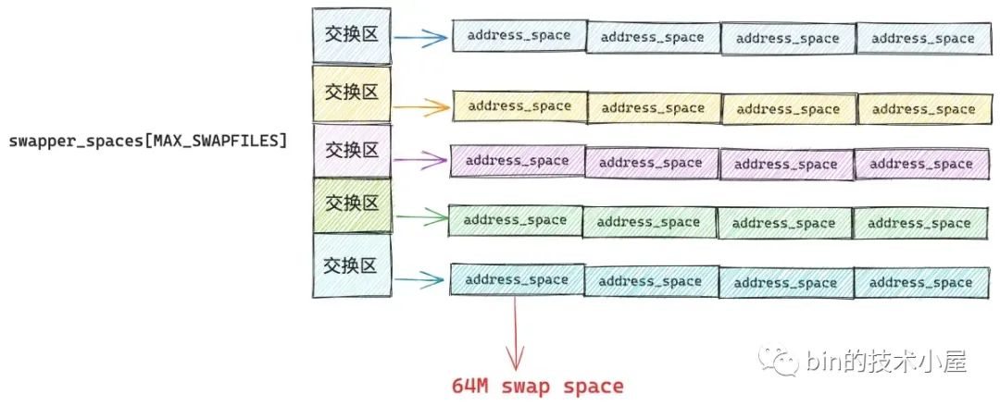

通过一个给定的 swp\_entry\_t 查找对应的 swap cache 的逻辑，内核定义在 swap\_address\_space 宏中。

1.  首先内核通过 swp\_type 提取交换区在 swapper\_spaces 数组中的索引（一维索引）。
    
2.  通过 swp\_offset >> SWAP\_ADDRESS\_SPACE\_SHIFT（二维索引），定位 slot 具体归哪一个 swap cache 管理。
    

    #define swap_address_space(entry)			    \
    	(&swapper_spaces[swp_type(entry)][swp_offset(entry) \
    		>> SWAP_ADDRESS_SPACE_SHIFT])
    
    struct page * lookup_swap_cache(swp_entry_t entry)  
    {          
        struct swap_info_struct *si = get_swap_device(entry);
        // 通过 swp_entry_t 定位 swap cache
        // 根据 swp_offset 在 swap cache 中查找内存页
        page = find_get_page(swap_address_space(entry), swp_offset(entry));        
        return page;  
    }
    

当我们通过 `swapon` 命令来初始化并激活一个交换区的时候，内核会在 init\_swap\_address\_space 函数中为交换区初始化 swap cache。

    int init_swap_address_space(unsigned int type, unsigned long nr_pages)
    {
        struct address_space *spaces, *space;
        unsigned int i, nr;
        // 计算交换区包含的 swap cache 个数
        nr = DIV_ROUND_UP(nr_pages, SWAP_ADDRESS_SPACE_PAGES);
        // 为交换区分配 address_space 数组，用于存放多个 swap cache
        spaces = kvcalloc(nr, sizeof(struct address_space), GFP_KERNEL);
        // 挨个初始化交换区中的 swap cache
        for (i = 0; i < nr; i++) {
            space = spaces + i;
            // 将 a_ops 指定为 swap_aops
            space->a_ops = &swap_aops;
            /* swap cache doesn't use writeback related tags */
            // swap cache 不会回写
            mapping_set_no_writeback_tags(space);
        }
        // 保存交换区中的 swap cache 个数
        nr_swapper_spaces[type] = nr;
        // 将初始化好的 address_space 数组放入 swapper_spaces 数组中（二维数组）
        swapper_spaces[type] = spaces;
    
        return 0;
    }
    
    // 交换区中的 swap cache 个数
    static unsigned int nr_swapper_spaces[MAX_SWAPFILES] __read_mostly;
    
    struct address_space *swapper_spaces[MAX_SWAPFILES] __read_mostly;

这里我们可以看到，对于 swap cache 来说，内核会将 address\_space-> a\_ops 初始化为 swap\_aops。

    static const struct address_space_operations swap_aops = {
    	.writepage	= swap_writepage,
    	.set_page_dirty	= swap_set_page_dirty,
    #ifdef CONFIG_MIGRATION
    	.migratepage	= migrate_page,
    #endif
    };

#### 10.4 swap 预读

现在我们已经清楚了当进程虚拟内存空间中的某一段 vma 发生 swap 缺页异常之后，内核的 swap in 核心处理流程。但是整个完整的 swap 流程还没有结束，内核还需要考虑内存访问的空间局部性原理。

当进程访问某一段内存的时候，在不久之后，其附近的内存地址也将被访问。对应于本小节的 swap 场景来说，当进程地址空间中的某一个虚拟内存地址 address 被访问之后，那么其周围的虚拟内存地址在不久之后，也会被进程访问。

而那些相邻的虚拟内存地址，在进程页表中对应的页表项也都是相邻的，当我们处理完了缺页地址 address 的 swap 缺页异常之后，如果其相邻的页表项均是 swp\_entry\_t，那么这些相邻的 swp\_entry\_t 所指向交换区的内容也需要被内核预读进内存中。

这样一来，当 address 附近的虚拟内存地址发生 swap 缺页的时候，内核就可以直接从 swap cache 中读到了，避免了磁盘 IO，使得 swap in 可以快速完成，这里和文件的预读机制有点类似。

swap 预读在 Linux 内核中由 swapin\_readahead 函数负责，它有两种实现方式：

第一种是根据缺页地址 address 周围的虚拟内存地址进行预读，但前提是它们必须属于同一个 vma，这个逻辑在 swap\_vma\_readahead 函数中完成。

第二种是根据内存页在交换区中周围的磁盘地址进行预读，但前提是它们必须属于同一个交换区，这个逻辑在 swap\_cluster\_readahead 函数中完成。

    struct page *swapin_readahead(swp_entry_t entry, gfp_t gfp_mask,
                    struct vm_fault *vmf)
    {
        return swap_use_vma_readahead() ?
                swap_vma_readahead(entry, gfp_mask, vmf) :
                swap_cluster_readahead(entry, gfp_mask, vmf);
    }

在本小节介绍的 swap 缺页场景中，内核是按照缺页地址周围的虚拟内存地址进行预读的。在函数 swap\_vma\_readahead 的开始，内核首先调用 swap\_ra\_info 方法来计算本次需要预读的页表项集合。

预读的最大页表项个数由 `page_cluster` 决定，但最大不能超过 `2 ^ SWAP_RA_ORDER_CEILING`。

    #ifdef CONFIG_64BIT
    #define SWAP_RA_ORDER_CEILING	5
    // 最大预读窗口
    max_win = 1 << min_t(unsigned int, READ_ONCE(page_cluster),
    			     SWAP_RA_ORDER_CEILING);

page\_cluster 的值可以通过内核参数 `/proc/sys/vm/page-cluster` 来调整，默认值为 3，我们可以通过设置 `page_cluster = 0`来禁止 swap 预读。

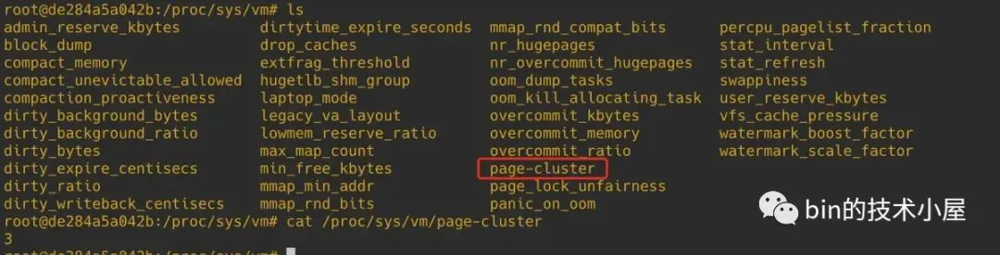

当要 swap in 的内存页在交换区的位置已经接近末尾了，则需要减少预读页的个数，防止预读超出交换区的边界。

如果预读的页表项不是 swp\_entry\_t，则说明该页表项是一个空的还没有进行过映射或者页表项指向的内存页还在内存中，这种情况下则跳过，继续预读后面的 swp\_entry\_t。

    /**
     * swap_vma_readahead - swap in pages in hope we need them soon
     * @entry: swap entry of this memory
     * @gfp_mask: memory allocation flags
     * @vmf: fault information
     *
     * Returns the struct page for entry and addr, after queueing swapin.
     *
     * Primitive swap readahead code. We simply read in a few pages whoes
     * virtual addresses are around the fault address in the same vma.
     *
     * Caller must hold read mmap_sem if vmf->vma is not NULL.
     *
     */
    static struct page *swap_vma_readahead(swp_entry_t fentry, gfp_t gfp_mask,
                           struct vm_fault *vmf)
    {
        struct vm_area_struct *vma = vmf->vma;
        struct vma_swap_readahead ra_info = {0,};
        // 获取本次要进行预读的页表项
        swap_ra_info(vmf, &ra_info);
        // 遍历预读窗口 ra_info 中的页表项，挨个进行预读
        for (i = 0, pte = ra_info.ptes; i < ra_info.nr_pte;
             i++, pte++) {
            // 获取要进行预读的页表项
            pentry = *pte;
            // 页表项为空，表示还未进行内存映射，直接跳过
            if (pte_none(pentry))
                continue;
            // 页表项指向的内存页仍然在内存中，跳过
            if (pte_present(pentry))
                continue;
            // 将 pte 转换为 swp_entry_t
            entry = pte_to_swp_entry(pentry);
            if (unlikely(non_swap_entry(entry)))
                continue;
            // 利用 swp_entry_t 先到 swap cache 中去查找
            // 如果没有，则新分配一个内存页并添加到 swap cache 中，这种情况下 page_allocated = true
            // 如果有，则直接从swap cache 中获取内存页，也就不需要预读了，page_allocated = false
            page = __read_swap_cache_async(entry, gfp_mask, vma,
                               vmf->address, &page_allocated);
    
            if (page_allocated) {
                // 发生磁盘 IO，从交换区中读取内存页的内容到新分配的 page 中
                swap_readpage(page, false);
            }
        }
    }

这样一来，经过 swap\_vma\_readahead 预读之后，缺页内存地址 address 周围的页表项所指向的内存页就全部被加载到 swap cache 中了。

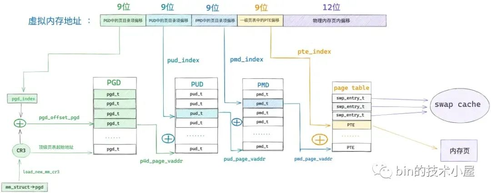

当进程下次访问 address 周围的内存地址时，虽然也会发生 swap 缺页异常，但是内核直接从 swap cache 中就可以读取到了，避免了磁盘 IO。

#### 10.5 还原 do\_swap\_page 完整面貌

当我们明白了前面介绍的这些背景知识之后，再回过头来看内核完整的 swap in 过程就很清晰了

1.  首先内核会通过 pte\_to\_swp\_entry 将进程页表中的 pte 转换为 swp\_entry\_t
    
2.  通过 lookup\_swap\_cache 根据 swp\_entry\_t 到 swap cache 中查找是否已经有其他进程将内存页 swap 进来了。
    
3.  如果 swap cache 没有对应的内存页，则调用 swapin\_readahead 启动预读，在这个过程中，内核会重新分配物理内存页，并将这个物理内存页加入到 swap cache 中，随后通过 swap\_readpage 将交换区的内容读取到这个内存页中。
    
4.  现在我们需要的内存页已经 swap in 到内存中了，后面的流程就和普通的缺页处理一样了，根据 swap in 进来的内存页地址重新创建初始化一个新的 pte，然后用这个新的 pte，将进程页表中原来的 swp\_entry\_t 替换掉。
    
5.  为新的内存页建立反向映射关系，加入 lru active list 中，最后 swap\_free 释放交换区中的资源。
    

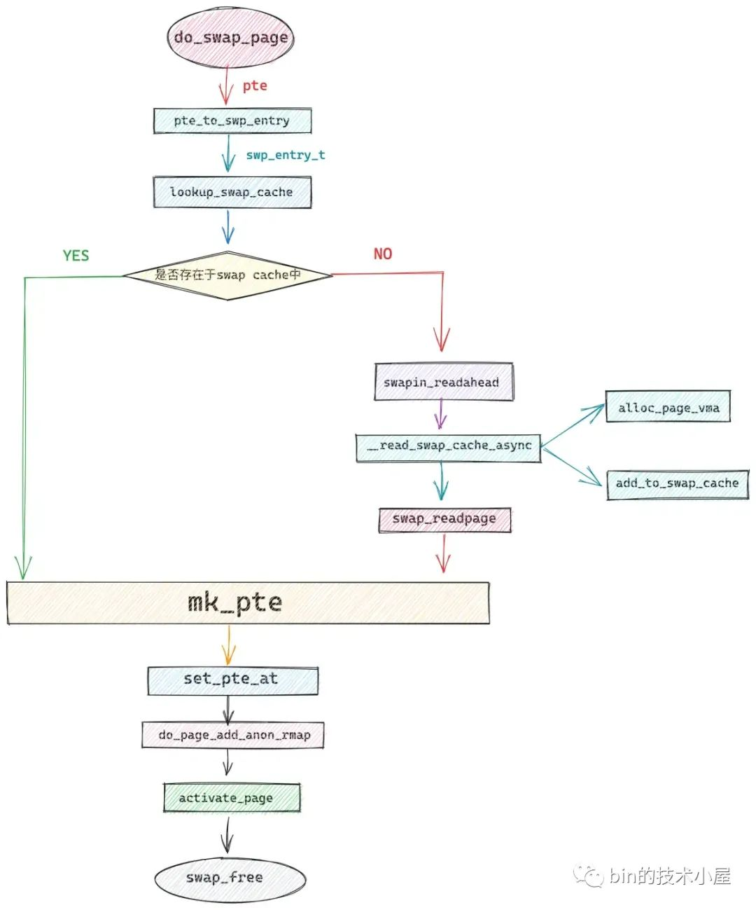

    vm_fault_t do_swap_page(struct vm_fault *vmf)
    {
        // 将缺页内存地址 address 对应的 pte 转换为 swp_entry_t
        entry = pte_to_swp_entry(vmf->orig_pte);  
        // 首先利用 swp_entry_t 到 swap cache 查找，看内存页已经其他进程被 swap in 进来
        page = lookup_swap_cache(entry, vma, vmf->address);
        swapcache = page;
        // 处理匿名页不在 swap cache 的情况
        if (!page) {
            // 通过 swp_entry_t 获取对应的交换区结构
            struct swap_info_struct *si = swp_swap_info(entry);
            // 针对 fast swap storage 比如 zram 等 swap 的性能优化，跳过 swap cache
            if (si->flags & SWP_SYNCHRONOUS_IO &&
                    __swap_count(entry) == 1) {
                /* skip swapcache */
                // 当只有单进程引用这个匿名页的时候，直接跳过 swap cache
                // 从伙伴系统中申请内存页 page，注意这里的 page 并不会加入到 swap cache 中
                page = alloc_page_vma(GFP_HIGHUSER_MOVABLE, vma,
                                vmf->address);
                if (page) {
                    __SetPageLocked(page);
                    __SetPageSwapBacked(page);
                    set_page_private(page, entry.val);
                    // 加入 lru 链表
                    lru_cache_add_anon(page);
                    // 直接从 fast storage device 中读取被换出的内容到 page 中
                    swap_readpage(page, true);
                }
            } else {
                // 启动 swap 预读
                page = swapin_readahead(entry, GFP_HIGHUSER_MOVABLE,
                            vmf);
                swapcache = page;
            }
    
            // 因为涉及到了磁盘 IO，所以本次缺页异常属于 FAULT_MAJOR 类型
            ret = VM_FAULT_MAJOR;
            count_vm_event(PGMAJFAULT);
            count_memcg_event_mm(vma->vm_mm, PGMAJFAULT);
        } 
    
        // 现在之前被换出的内存页已经被内核重新 swap in 到内存中了。
        // 下面就是重新设置 pte，将原来页表中的 swp_entry_t 替换掉
        vmf->pte = pte_offset_map_lock(vma->vm_mm, vmf->pmd, vmf->address,
                &vmf->ptl);
        // 增加匿名页的统计计数
        inc_mm_counter_fast(vma->vm_mm, MM_ANONPAGES);
        // 减少 swap entries 计数
        dec_mm_counter_fast(vma->vm_mm, MM_SWAPENTS);
        // 根据被 swap in 进来的新内存页重新创建 pte
        pte = mk_pte(page, vma->vm_page_prot);
        // 用新的 pte 替换掉页表中的 swp_entry_t
        set_pte_at(vma->vm_mm, vmf->address, vmf->pte, pte);
        vmf->orig_pte = pte;
    
        // 建立新内存页的反向映射关系
        do_page_add_anon_rmap(page, vma, vmf->address, exclusive);
        // 将内存页添加到 lru 的 active list 中
        activate_page(page);
        // 释放交换区中的资源
        swap_free(entry);
        // 刷新 mmu cache
        update_mmu_cache(vma, vmf->address, vmf->pte);
        return ret;
    }

### 总结

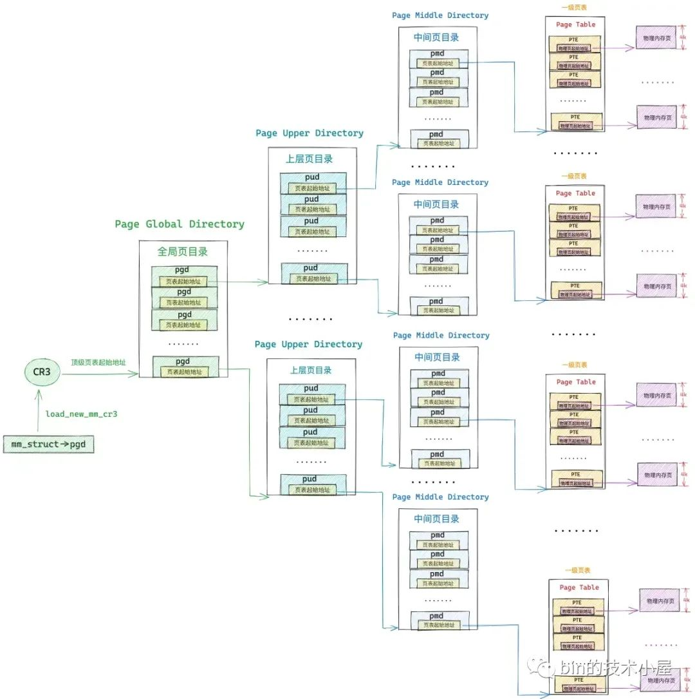

本文我们介绍了 Linux 内核如何通过缺页中断将进程页表从 0 到 1 一步一步的完整构建出来。从进程虚拟内存空间布局的角度来讲，缺页中断主要分为两个方面：

-   内核态缺页异常处理 —— do\_kern\_addr\_fault，这里主要是处理 vmalloc 虚拟内存区域的缺页异常，其中涉及到主内核页表与进程页表内核部分的同步问题。
    
-   用户态缺页异常处理 —— do\_user\_addr\_fault，其中涉及到的主内容是如何从 0 到 1 一步一步构建完善进程页表体系。
    

总体上来讲引起缺页中断的原因分为两大类：

-   第一类是缺页虚拟内存地址背后映射的物理内存页不在内存中
    
-   第二类是缺页虚拟内存地址背后映射的物理内存页在内存中。
    

第一类缺页中断的原因涉及到三种场景：

1.  缺页虚拟内存地址 address 在进程页表中间页目录对应的页目录项 pmd\_t 是空的。
    
2.  缺页地址 address 对应的 pmd\_t 虽然不是空的，页表也存在，但是 address 对应在页表中的 pte 是空的。
    
3.  虚拟内存地址 address 在进程页表中的页表项 pte 不是空的，但是其背后映射的物理内存页被内核 swap out 到磁盘上了。
    

第二类缺页中断的原因涉及到两种场景：

1.  NUMA Balancing。
    
2.  写时复制了（Copy On Write， COW）。
    

最后我们介绍了内核整个 swap in 的完整过程，其中涉及到的重要内容包括交换区的布局以及在内核中的组织结构，swap cache 与 page cache 之间的区别，swap 预读机制。

好了，今天的内容到这里就结束了，感谢大家的收看，我们下篇文章见~~~~