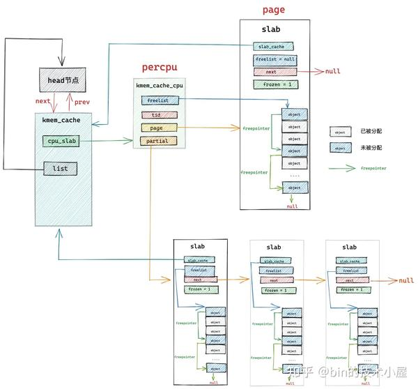
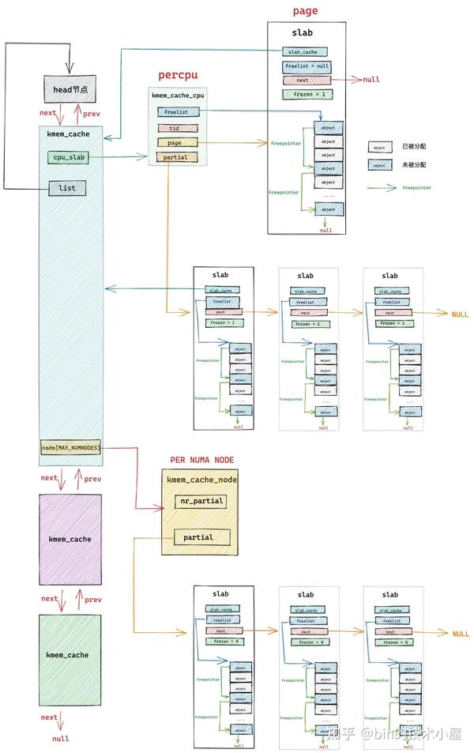
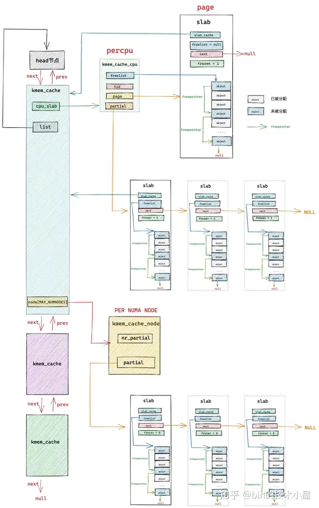
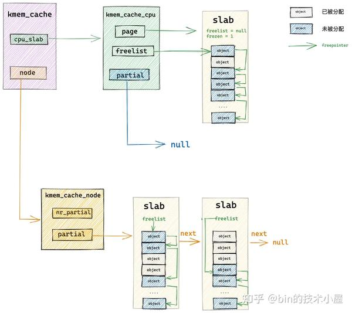
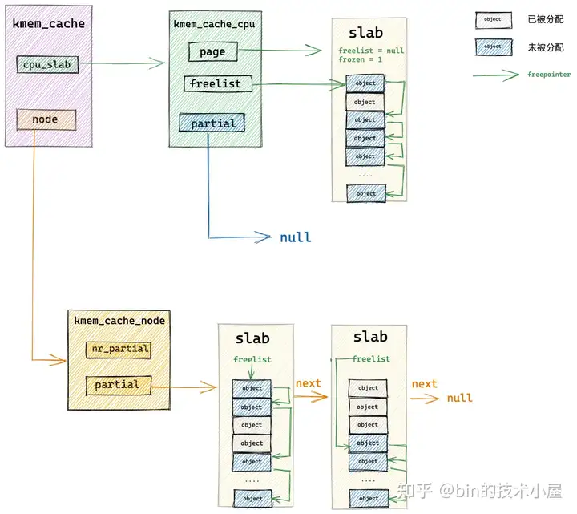

## **1\. 前文回顾**

在之前的几篇内存管理系列文章中，笔者带大家从宏观角度完整地梳理了一遍 Linux 内存分配的整个链路，本文的主题依然是内存分配，这一次我们会从微观的角度来探秘一下 Linux 内核中用于零散小内存块分配的内存池 —— slab 分配器。

在本小节中，笔者还是按照以往的风格先带大家简单回顾下之前宏观视角下 Linux 内存分配最为核心的内容，目的是让大家从宏观视角平滑地过度到微观视角，内容上有个衔接，不至于让大家感到突兀。

> 下面的内容我们只做简单回顾，大家不必纠缠细节，把握整体宏观流程  

在 **[《深入理解 Linux 物理内存分配与释放全链路实现》](https://link.zhihu.com/?target=https%3A//mp.weixin.qq.com/s%3F__biz%3DMzg2MzU3Mjc3Ng%3D%3D%26mid%3D2247487111%26idx%3D1%26sn%3De57371f9c3e6910f4f4721aa0787e537%26chksm%3Dce77c8c0f90041d67b2d344d413a2573f3662a1a64a802b41d4618982fcbff1617d9a5da9f7b%23rd)**一文中，笔者以内核物理内存分配与释放的 API 为起点，详细为大家介绍了物理内存分配与释放的整个完整流程，以及相关内核源码的实现。

物理内存分配 api.png

物理内存释放 api.png

其中物理内存分配在内核中的全链路流程如下图所示：

物理内存分配全流程.png

在 Linux 内核中，真正负责物理内存分配的核心是**[伙伴系统](https://link.zhihu.com/?target=https%3A//mp.weixin.qq.com/s%3F__biz%3DMzg2MzU3Mjc3Ng%3D%3D%26mid%3D2247487228%26idx%3D1%26sn%3D85e44fa5b090b29ab23ca6abf98da221%26chksm%3Dce77c8bbf90041ad4958a3871a880a3f6d812e282530ea047d9eaf76d9f03aafb4b987a64ae9%23rd)**，在我们从总体上熟悉了物理内存分配的全链路流程之后，随后我们继续来到了伙伴系统的入口 get\_page\_from\_freelist 函数，它的完整流程如下：

image.png

内核通过 get\_page\_from\_freelist 函数，挨个遍历检查各个 NUMA 节点中的物理内存区域是否有足够的空闲内存可以满足本次的内存分配要求，当找到符合内存分配标准的物理内存区域 zone 之后，接下来就会通过 rmqueue 函数进入到该物理内存区域 zone 对应的伙伴系统中分配物理内存。

image.png

那么内核既然已经有了伙伴系统，那么为什么还需要一个 slab 内存池呢 ？下面就让我们从这个疑问开始，正式拉开本文的帷幕~~~

## **2\. 既然有了伙伴系统，为什么还需要 Slab ?**

从上篇文章 **[《深度剖析 Linux 伙伴系统的设计与实现》](https://link.zhihu.com/?target=https%3A//mp.weixin.qq.com/s%3F__biz%3DMzg2MzU3Mjc3Ng%3D%3D%26mid%3D2247487228%26idx%3D1%26sn%3D85e44fa5b090b29ab23ca6abf98da221%26chksm%3Dce77c8bbf90041ad4958a3871a880a3f6d812e282530ea047d9eaf76d9f03aafb4b987a64ae9%26token%3D2104970935%26lang%3Dzh_CN%23rd)**第一小节 “1. 伙伴系统的核心数据结构” 的介绍中我们知道，内核中的伙伴系统管理内存的最小单位是物理内存页 page。

伙伴系统会将它所属物理内存区 zone 里的空闲内存划分成不同尺寸的[物理内存块](https://zhida.zhihu.com/search?content_id=225811486&content_type=Article&match_order=1&q=%E7%89%A9%E7%90%86%E5%86%85%E5%AD%98%E5%9D%97&zhida_source=entity)，这里的尺寸必须是 2 的次幂，物理内存块可以是由 1 个 page 组成，也可以是 2 个 page，4 个 page ........ 1024 个 page 组成。

内核将这些相同尺寸的内存块用一个内核数据结构 struct free\_area 中的[双向链表](https://zhida.zhihu.com/search?content_id=225811486&content_type=Article&match_order=1&q=%E5%8F%8C%E5%90%91%E9%93%BE%E8%A1%A8&zhida_source=entity) free\_list 串联组织起来。

    struct free_area {
     struct list_head free_list[MIGRATE_TYPES];
     unsigned long  nr_free;
    };

而这些由 free\_list 串联起来的相同尺寸的内存块又会近一步根据物理内存页 page 的迁移类型 MIGRATE\_TYPES 进行归类，比如：MIGRATE\_UNMOVABLE （不可移动的页面类型），MIGRATE\_MOVABLE （可以移动的内存页类型），MIGRATE\_RECLAIMABLE （不能移动，但是可以直接回收的页面类型）等等。

这样一来，具有相同迁移类型，相同尺寸的内存块就被组织在了同一个 free\_list 中，最终伙伴系统完整的数据结构如下图所示：

> free\_area 中组织的全部是相同尺寸的内存块，不同尺寸的内存块被不同的 free\_area 管理。在 free\_area 的内部又会近一步按照物理内存页面的迁移类型 MIGRATE\_TYPES，将相同迁移类型的物理内存页组织在同一个 free\_list 中。  

image.png

> 伙伴系统所分配的物理内存页全部都是物理上连续的，并且只能分配 2 的整数幂个页  

随后在物理内存分配的过程中，内核会基于这个完整的伙伴系统数据结构，进行不同尺寸的物理内存块的分配与释放，而分配与释放的单位依然是 2 的整数幂个物理内存页 page。

详细的内存分配过程感兴趣的读者朋友可以回看下 **[《深度剖析 Linux 伙伴系统的设计与实现》](https://link.zhihu.com/?target=https%3A//mp.weixin.qq.com/s%3F__biz%3DMzg2MzU3Mjc3Ng%3D%3D%26mid%3D2247487228%26idx%3D1%26sn%3D85e44fa5b090b29ab23ca6abf98da221%26chksm%3Dce77c8bbf90041ad4958a3871a880a3f6d812e282530ea047d9eaf76d9f03aafb4b987a64ae9%26token%3D2104970935%26lang%3Dzh_CN%23rd)**一文中的第 3 小节 “ 3. 伙伴系统的内存分配原理 ” 以及第 6 小节 “ 6. 伙伴系统的实现 ”。

这里我们只对伙伴系统的内存分配原理做一个简单的整体回顾：

当内核向伙伴系统申请连续的物理内存页时，会根据指定的物理内存页迁移类型 MIGRATE\_TYPES，以及申请的物理内存块尺寸，找到对应的 free\_list 链表，然后依次遍历该链表寻找物理内存块。

比如我们向内核申请 ( 2 ^ (order - 1)，2 ^ order \] 之间大小的内存，并且这块内存我们指定的迁移类型为 MIGRATE\_MOVABLE 时，内核会按照 2 ^ order 个内存页进行申请。

随后内核会根据 order 找到伙伴系统中的 free\_area\[order\] 对应的 free\_area 结构，并进一步根据页面迁移类型定位到对应的 free\_list\[MIGRATE\_MOVABLE\]，如果该迁移类型的 free\_list 中没有空闲的内存块时，内核会进一步到上一级链表也就是 free\_area\[order + 1\] 中寻找。

如果 free\_area\[order + 1\] 中对应的 free\_list\[MIGRATE\_MOVABLE\] 链表中还是没有，则继续循环到更高一级 free\_area\[order + 2\] 寻找，直到在 free\_area\[order + n\] 中的 free\_list\[MIGRATE\_MOVABLE\] 链表中找到空闲的内存块。

但是此时我们在 free\_area\[order + n\] 链表中找到的空闲内存块的尺寸是 2 ^ (order + n) 大小，而我们需要的是 2 ^ order 尺寸的内存块，于是内核会将这 2 ^ (order + n) 大小的内存块逐级减半分裂，将每一次分裂后的内存块插入到相应的 free\_area 数组里对应的 free\_list\[MIGRATE\_MOVABLE\] 链表中，并将最后分裂出的 2 ^ order 尺寸的内存块分配给进程使用。

image.png

我们假设当前伙伴系统中只有 order = 3 的空闲链表 free\_area\[3\]，其余剩下的分配阶 order 对应的空闲链表中均是空的。 free\_area\[3\] 中仅有一个空闲的内存块，其中包含了连续的 8 个 page，我们暂时忽略 MIGRATE\_TYPES 相关的组织结构。

现在我们向伙伴系统申请一个 page 大小的内存（对应的分配阶 order = 0），如上图所示，内核会在伙伴系统中首先查看 order = 0 对应的空闲链表 free\_area\[0\] 中是否有空闲内存块可供分配。如果有，则将该空闲内存块从 free\_area\[0\] 摘下返回，内存分配成功。

如果没有，随后内核会根据前边介绍的内存分配逻辑，继续升级到 free\_area\[1\] , free\_area\[2\] 链表中寻找空闲内存块，直到查找到 free\_area\[3\] 发现有一个可供分配的内存块。这个内存块中包含了 8 个 连续的空闲 page，但是我们只要一个 page 就够了，那该怎么办呢？

于是内核先将 free\_area\[3\] 中的这个空闲内存块从链表中摘下，然后减半分裂成两个内存块，分裂出来的这两个内存块分别包含 4 个 page（分配阶 order = 2）。

随后内核会将分裂出的后半部分（上图中绿色部分，order = 2），插入到 free\_area\[2\] 链表中。

前半部分（上图中黄色部分，order = 2）继续减半分裂，分裂出来的这两个内存块分别包含 2 个 page（分配阶 order = 1）。如上图中第 4 步所示，前半部分为黄色，后半部分为紫色。同理按照前边的分裂逻辑，内核会将后半部分内存块（紫色部分，分配阶 order = 1）插入到 free\_area\[1\] 链表中。

前半部分（图中黄色部分，order = 1）在上图中的第 6 步继续减半分裂，分裂出来的这两个内存块分别包含 1 个 page（分配阶 order = 0），前半部分为青色，后半部分为黄色。

黄色后半部分插入到 frea\_area\[0\] 链表中，青色前半部分返回给进程，这时伙伴系统分配内存流程结束。

我们从以上介绍的伙伴系统核心数据结构，以及伙伴系统内存分配原理的相关内容来看，**伙伴系统管理物理内存的最小单位是物理内存页 page**。也就是说，当我们向伙伴系统申请内存时，至少要申请一个物理内存页。

而从内核实际运行过程中来看，无论是从[内核态](https://zhida.zhihu.com/search?content_id=225811486&content_type=Article&match_order=1&q=%E5%86%85%E6%A0%B8%E6%80%81&zhida_source=entity)还是从用户态的角度来说，对于内存的需求量往往是以字节为单位，通常是几十字节到几百字节不等，远远小于一个页面的大小。如果我们仅仅为了这几十字节的内存需求，而专门为其分配一整个内存页面，这无疑是对宝贵内存资源的一种巨大浪费。

于是在内核中，这种专门针对小内存的分配需求就应运而生了，而本文的主题—— slab [内存池](https://zhida.zhihu.com/search?content_id=225811486&content_type=Article&match_order=3&q=%E5%86%85%E5%AD%98%E6%B1%A0&zhida_source=entity)就是专门应对小内存频繁的分配和释放的场景的。

slab 首先会向伙伴系统一次性申请一个或者多个物理内存页面，正是这些物理内存页组成了 slab 内存池。

随后 slab 内存池会将这些连续的物理内存页面划分成多个大小相同的小内存块出来，同一种 slab 内存池下，划分出来的小内存块尺寸是一样的。内核会针对不同尺寸的小内存分配需求，预先创建出多个 slab 内存池出来。

这种小内存在内核中的使用场景非常之多，比如，内核中那些经常使用，需要频繁申请释放的一些核心数据结构对象：task\_struct 对象，[mm\_struct](https://zhida.zhihu.com/search?content_id=225811486&content_type=Article&match_order=1&q=mm_struct&zhida_source=entity) 对象，struct page 对象，struct file 对象，socket 对象等。

而创建这些内核核心数据结构对象以及为这些核心对象分配内存，销毁这些内核对象以及释放相关的内存是需要性能开销的。

这一点我们从 **[《深入理解 Linux 物理内存分配与释放全链路实现》](https://link.zhihu.com/?target=https%3A//mp.weixin.qq.com/s%3F__biz%3DMzg2MzU3Mjc3Ng%3D%3D%26mid%3D2247487111%26idx%3D1%26sn%3De57371f9c3e6910f4f4721aa0787e537%26chksm%3Dce77c8c0f90041d67b2d344d413a2573f3662a1a64a802b41d4618982fcbff1617d9a5da9f7b%23rd)**一文中详细介绍的内存分配与释放全链路过程中已经非常清楚的看到了，整个内存分配链路还是比较长的，如果遇到内存不足，还会涉及到内存的 swap 和 compact ，从而进一步产生更大的性能开销。

既然 slab 专门是用于小内存块分配与回收的，那么内核很自然的就会想到，分别为每一个需要被内核频繁创建和释放的核心对象创建一个专属的 slab 对象池，这些内核对象专属的 slab 对象池会根据其所管理的具体内核对象所占用内存的大小 size，将一个或者多个完整的物理内存页按照这个 size 划分出多个大小相同的小内存块出来，每个小内存块用于存储预先创建好的内核对象。

这样一来，当内核需要频繁分配和释放内核对象时，就可以直接从相应的 slab 对象池中申请和释放内核对象，避免了链路比较长的内存分配与释放过程，极大地提升了性能。这是一种池化思想的应用。

> 关于更多池化思想的介绍，以及对象池的应用与实现，笔者之前写过一篇对象池在用户态应用程序中的设计与实现的文章 **[《详解 Netty Recycler 对象池的精妙设计与实现》](https://link.zhihu.com/?target=https%3A//mp.weixin.qq.com/s%3F__biz%3DMzg2MzU3Mjc3Ng%3D%3D%26mid%3D2247484419%26idx%3D1%26sn%3D3a75a495f0f117cca1548da1e0f3e6e6%26chksm%3Dce77c244f9004b52d74b8ffce149ea64e5a8f0ba6713b105d003fdaef8eaa9ad3a5a65d20427%26token%3D668918070%26lang%3Dzh_CN%23rd)**，感兴趣的读者朋友可以看一下。  

将内核中的核心数据结构对象，池化在 slab 对象池中，除了可以避免内核对象频繁反复初始化和相关内存分配，频繁反复销毁对象和相关内存释放的性能开销之外，其实还有很多好处，比如：

1.  利用 CPU 高速缓存提高访问速度。当一个对象被直接释放回 slab 对象池中的时候，这个内核对象还是“热的”，仍然会驻留在 CPU 高速缓存中。如果这时，内核继续向 slab 对象池申请对象，slab 对象池会优先把这个刚刚释放 “热的” 对象分配给内核使用，因为对象很大概率仍然驻留在 CPU 高速缓存中，所以内核访问起来速度会更快。  
    
2.  伙伴系统只能分配 2 的次幂个完整的物理内存页，这会引起占用高速缓存以及 TLB 的空间较大，导致一些不重要的数据驻留在 CPU 高速缓存中占用宝贵的缓存空间，而重要的数据却被置换到内存中。 slab 对象池针对小内存分配场景，可以有效的避免这一点。  
    
3.  调用伙伴系统的操作会对 CPU 高速缓存 L1Cache 中的 Instruction Cache（指令高速缓存）和 Data Cache （数据高速缓存）有污染，因为对伙伴系统的长链路调用，相关的一些指令和数据必然会填充到 Instruction Cache 和 Data Cache 中，从而将频繁使用的一些指令和数据挤压出去，造成缓存污染。而在内核空间中越浪费这些缓存资源，那么在用户空间中的进程就会越少的得到这些缓存资源，造成性能的下降。 slab 对象池极大的减少了对伙伴系统的调用，防止了不必要的 L1Cache 污染。  
    

CPU缓存结构.png

1.  使用 slab 对象池可以充分利用 CPU 高速缓存，避免多个对象对同一 cache line 的争用。如果对象直接存储排列在伙伴系统提供的内存页中的话（不受 slab 管理），那么位于不同内存页中具有相同偏移的对象很可能会被放入同一个 cache line 中，即使其他 cache line 还是空的。具体为什么会造成具有相同内存[偏移地址](https://zhida.zhihu.com/search?content_id=225811486&content_type=Article&match_order=1&q=%E5%81%8F%E7%A7%BB%E5%9C%B0%E5%9D%80&zhida_source=entity)的对象会对同一 cache line 进行争抢，笔者会在文章后面相关章节中为大家解答，这里我们只是简单列出 slab 针对小内存分配的一些优势，目的是让大家先从总体上把握。

## **3\. slab 对象池在内核中的应用场景**

现在我们最起码从概念上清楚了 slab 对象池的产生背景，以及它要解决的问题场景。下面笔者列举了几个 slab 对象池在内核中的使用场景，方便大家进一步从总体上理解。

> 本小节我们依然还是从总体上把握 slab 对象池，大家不必过度地陷入到细节当中。  

1.  当我们使用 fork() 系统调用创建进程的时候，内核需要使用 task\_struct 专属的 slab 对象池分配 task\_struct 对象。

    static struct task_struct *dup_task_struct(struct task_struct *orig, int node)
    {
              ........... 
        struct task_struct *tsk;
        // 从 task_struct 对象专属的 slab 对象池中申请 task_struct 对象
        tsk = alloc_task_struct_node(node);
              ...........   
    }
    
1.  为进程创建虚拟内存空间的时候，内核需要使用 mm\_struct 专属的 slab 对象池分配 mm\_struct 对象。

    static struct mm_struct *dup_mm(struct task_struct *tsk,
                    struct mm_struct *oldmm)
    {
              ..........       
        struct mm_struct *mm;
        // 从 mm_struct 对象专属的 slab 对象池中申请 mm_struct 对象
        mm = allocate_mm();
              ..........
    }
    
1.  当我们向页高速缓存 page cache 查找对应的文件缓存页时，内核需要使用 struct page 专属的 slab 对象池分配 struct page 对象。

    struct page *pagecache_get_page(struct address_space *mapping, pgoff_t offset,
     int fgp_flags, gfp_t gfp_mask)
    {
     struct page *page;
    
    repeat:
      // 在 radix_tree（page cache）中根据缓存页 offset 查找缓存页
     page = find_get_entry(mapping, offset);
     // 缓存页不存在的话，跳转到 no_page 处理逻辑
     if (!page)
      goto no_page;
    
       .......省略.......
    no_page:
    
      // 从 page 对象专属的 slab 对象池中申请 page 对象
      page = __page_cache_alloc(gfp_mask);
      // 将新分配的内存页加入到页高速缓存 page cache 中
      err = add_to_page_cache_lru(page, mapping, offset, gfp_mask);
    
                  .......省略.......
     }
    
     return page;
    }
    
1.  当我们使用 open 系统调用打开一个文件时，内核需要使用 struct file专属的 slab 对象池分配 struct file 对象。

    struct file *do_filp_open(int dfd, struct filename *pathname,
            const struct open_flags *op)
    {
    
        struct file *filp;
        // 分配 struct file 内核对象
        filp = path_openat(&nd, op, flags | LOOKUP_RCU);
                    ..........
        return filp;
    }
    
    static struct file *path_openat(struct nameidata *nd,
                const struct open_flags *op, unsigned flags)
    {
        struct file *file;
        // 从 struct file 对象专属的 slab 对象池中申请 struct file 对象
        file = alloc_empty_file(op->open_flag, current_cred());
                     ..........
    }
    
1.  当服务端[网络应用程序](https://zhida.zhihu.com/search?content_id=225811486&content_type=Article&match_order=1&q=%E7%BD%91%E7%BB%9C%E5%BA%94%E7%94%A8%E7%A8%8B%E5%BA%8F&zhida_source=entity)使用 accpet 系统调用接收[客户端](https://zhida.zhihu.com/search?content_id=225811486&content_type=Article&match_order=1&q=%E5%AE%A2%E6%88%B7%E7%AB%AF&zhida_source=entity)的连接时，内核需要使用 struct socket 专属的 slab 对象池为新进来的客户端连接分配 socket 对象。

    SYSCALL_DEFINE4(accept4, int, fd, struct sockaddr __user *, upeer_sockaddr,
            int __user *, upeer_addrlen, int, flags)
    {
        struct socket *sock, *newsock;
        // 查找正在 listen 状态的监听 socket
        sock = sockfd_lookup_light(fd, &err, &fput_needed);
        // 为新进来的客户端连接申请 socket 对象以及与其关联的 inode 对象
        // 从 struct socket 对象专属的 slab 对象池中申请 struct socket 对象 
        newsock = sock_alloc();
    
        ............. 利用监听 socket 初始化 newsocket ..........
    }
    

当然了被 slab 对象池所管理的内核核心对象不只是笔者上面为大家列举的这五个，事实上，凡是需要被内核频繁使用的内核对象都需要被 slab 对象池所管理。

比如：我们在 **[《从 Linux 内核角度探秘 IO 模型的演变》](https://link.zhihu.com/?target=https%3A//mp.weixin.qq.com/s%3F__biz%3DMzg2MzU3Mjc3Ng%3D%3D%26mid%3D2247483737%26idx%3D1%26sn%3D7ef3afbb54289c6e839eed724bb8a9d6%26chksm%3Dce77c71ef9004e08e3d164561e3a2708fc210c05408fa41f7fe338d8e85f39c1ad57519b614e%26token%3D668918070%26lang%3Dzh_CN%23rd)** 一文中为大家介绍的 epoll 相关的对象：

epitem创建等待项.png

在**[《从 Linux 内核角度探秘 JDK NIO 文件读写本质》](https://link.zhihu.com/?target=https%3A//mp.weixin.qq.com/s%3F__biz%3DMzg2MzU3Mjc3Ng%3D%3D%26mid%3D2247486623%26idx%3D1%26sn%3D0cafed9e89b60d678d8c88dc7689abda%26chksm%3Dce77cad8f90043ceaaca732aaaa7cb692c1d23eeb6c07de84f0ad690ab92d758945807239cee%26token%3D668918070%26lang%3Dzh_CN%23rd)** 一文中介绍的页高速缓存 page cache 相关的对象：

image.png

在 **[《深入理解 Linux 虚拟内存管理》](https://link.zhihu.com/?target=https%3A//mp.weixin.qq.com/s%3F__biz%3DMzg2MzU3Mjc3Ng%3D%3D%26mid%3D2247486732%26idx%3D1%26sn%3D435d5e834e9751036c96384f6965b328%26chksm%3Dce77cb4bf900425d33d2adfa632a4684cf7a63beece166c1ffedc4fdacb807c9413e8c73f298%26token%3D668918070%26lang%3Dzh_CN%23rd)** 一文中介绍的虚拟内存地址空间相关的对象：

image.png

现在我们只是对 slab 对象池有了一个最表面的认识，那么接下来的内容，笔者会带大家深入到 slab 对象池的实现细节中一探究竟。

在开始介绍内核源码实现之前，笔者想和大家交代一下本文的行文思路，之前的系列文章中笔者都是采用 “总——分——总” 的思路为大家讲述源码，但是本文要介绍的 slab 对象池实现比较复杂，一上来就把总体架构给大家展示出来，大家看的也是一脸懵。

所以这里我们换一种思路，笔者会带大家从一个最简单的物理内存页 page 开始，一步一步地演进，直到一个完整的 slab 对象池架构清晰地展现在大家的面前。

## **4\. slab, slub, slob 傻傻分不清楚**

在开始正式介绍 slab 对象池之前，笔者觉得有必要先向大家简单交代一下 Linux 系统中关于 slab 对象池的三种实现：slab，slub，slob。

其中 slab 的实现，最早是由 Sun 公司的 Jeff Bonwick 大神在 Solaris 2.4 系统中设计并实现的，由于 Jeff Bonwick 大神公开了 slab 的实现方法，因此被 Linux 所借鉴并于 1996 年在 Linux 2.0 版本中引入了 slab，用于 Linux 内核早期的小内存分配场景。

由于 slab 的实现非常复杂，slab 中拥有多种存储对象的队列，队列管理开销比较大，slab 元数据比较臃肿，对 NUMA 架构的支持臃肿繁杂（slab 引入时内核还没支持 NUMA），这样导致 slab 内部为了维护这些自身元数据管理结构就得花费大量的内存空间，这在配置有超大容量内存的服务器上，内存的浪费是非常可观的。

针对以上 slab 的不足，内核大神 Christoph Lameter 在 2.6.22 版本（2007 年发布）中引入了新的 slub 实现。slub 简化了 slab 一些复杂的设计，同时保留了 slab 的基本思想，摒弃了 slab 众多管理队列的概念，并针对多处理器，NUMA 架构进行优化，放弃了效果不太明显的 slab 着色机制。slub 与 slab 相比，提高了性能，吞吐量，并降低了内存的浪费。成为现在内核中常用的 slab 实现。

而 slob 的实现是在内核 2.6.16 版本（2006 年发布）引入的，它是专门为嵌入式小型机器小内存的场景设计的，所以实现上很精简，能在小型机器上提供很不错的性能。

而内核中关于内存池（小内存分配器）的相关 API 接口函数均是以 slab 命名的，但是我们可以通过配置的方式来平滑切换以上三种 slab 的实现。本文我们主要讨论被大规模运用在服务器 Linux 操作系统中的 slub 对象池的实现，所以本文下面的内容，如无特殊说明，笔者提到的 slab 均是指 slub 实现。

## **5\. 从一个简单的内存页开始聊 slab**

从前边小节的内容中，我们知道内核会把那些频繁使用的核心对象统一放在 slab 对象池中管理，每一个核心对象对应一个专属的 slab 对象池，以便提升核心对象的分配，访问，释放相关操作的性能。

image.png

如上图所示，slab 对象池在内存管理系统中的架构层次是基于伙伴系统之上构建的，slab 对象池会一次性向伙伴系统申请一个或者多个完整的物理内存页，在这些完整的内存页内在逐步划分出一小块一小块的内存块出来，而这些小内存块的尺寸就是 slab 对象池所管理的内核核心对象占用的内存大小。

下面笔者就带大家从一个最简单的物理内存页 page 开始，我们一步一步的推演 slab 的整个架构设计与实现。

如果让我们自己设计一个对象池，首先最直观最简单的办法就是先向伙伴系统申请一个内存页，然后按照需要被池化对象的尺寸 object size，把内存页划分为一个一个的内存块，每个内存块尺寸就是 object size。

> 事实上，slab 对象池可以根据情况向伙伴系统一次性申请多个内存页，这里只是为了方便大家理解，我们先以一个内存页为例，为大家说明 slab 中对象的内存布局。  

image.png

但是在一个工业级的对象池设计中，我们不能这么简单粗暴的搞，因为对象的 object size 可以是任意的，并不是内存对齐的，CPU 访问一块没有进行对齐的内存比访问对齐的内存速度要慢一倍。

因为 CPU 向内存读取数据的单位是根据 word size 来的，在 64 位处理器中 word size = 8 字节，所以 CPU 向内存读写数据的单位为 8 字节。CPU 只能一次性向内存访问按照 word size ( 8 字节) 对齐的内存地址，如果 CPU 访问一个未进行 word size 对齐的内存地址，就会经历两次访存操作。

比如，我们现在需要访问 0x0007 - 0x0014 这样一段没有对 word size 进行对齐的内存，CPU只能先从 0x0000 - 0x0007 读取 8 个字节出来先放入结果寄存器中并左移 7 个字节（目的是只获取 0x0007 ），然后 CPU 在从 0x0008 - 0x0015 读取 8 个字节出来放入临时寄存器中并右移1个字节（目的是获取 0x0008 - 0x0014 ）最后与结果寄存器或运算。最终得到 0x0007 - 0x0014 地址段上的 8 个字节。

image.png

从上面过程我们可以看出，CPU 访问一段未进行 word size 对齐的内存，需要两次访存操作。

内存对齐的好处还有很多，比如，CPU 访问对齐的内存都是原子性的，对齐内存中的数据会独占 cache line ，不会与其他数据共享 cache line，避免 false sharing。

> 这里大家只需要简单了解为什么要进行内存对齐即可，关于内存对齐的详细内容，感兴趣的读者可以回看下 **[?《内存对齐的原理及其应用》](https://link.zhihu.com/?target=https%3A//mp.weixin.qq.com/s%3F__biz%3DMzg2MzU3Mjc3Ng%3D%3D%26mid%3D2247484304%26idx%3D1%26sn%3D54bf0d07e69c5621c145afaece8f50d6%26chksm%3Dce77c5d7f9004cc1249a03dfd0fb12b7d75171f1b87acea1fa44bbb11ca374b6f42a66fa274d%26token%3D1771824430%26lang%3Dzh_CN%23rd)** 一文中的 “ 5. 内存对齐 ” 小节。  

基于以上原因，我们不能简单的按照对象尺寸 object size 来划分内存块，而是需要考虑到对象内存地址要按照 word size 进行对齐。于是上面的 slab 对象池的内存布局又有了新的变化。

image.png

如果被池化对象的尺寸 object size 本来就是和 word size 对齐的，那么我们不需要做任何事情，但是如果 object size 没有和 word size 对齐，我们就需要填充一些字节，目的是要让对象的 object size 按照 word size 进行对齐，提高 CPU 访问对象的速度。

但是上面的这些工作对于一个工业级的对象池来说还远远不够，工业级的对象池需要应对很多复杂的诡异场景，比如，我们偶尔在复杂生产环境中会遇到的内存读写访问越界的情况，这会导致很多莫名其妙的异常。

内核为了应对内存读写越界的场景，于是在对象内存的周围插入了一段不可访问的内存区域，这些内存区域用特定的字节 0xbb 填充，当进程访问的到内存是 0xbb 时，表示已经越界访问了。这段内存区域在 slab 中的术语为 red zone，大家可以理解为红色警戒区域。

插入 red zone 之后，slab 对象池的内存布局近一步演进为下图所示的布局：

image.png

-   如果对象尺寸 object size 本身就是 word size 对齐的，那么就需要在对象左右两侧填充两段 red zone 区域，red zone 区域的长度一般就是 word size 大小。  
    
-   如果对象尺寸 object size 是通过填充 padding 之后，才与 word size 对齐。内核会巧妙的利用对象右边的这段 padding 填充区域作为 red zone。只需要额外的在对象内存区域的左侧填充一段 red zone 即可。  
    

image.png

在有了新的内存布局之后，我们接下来就要考虑一个问题，当我们向 slab 对象池获取到一个空闲对象之后，我们需要知道它的下一个空闲对象在哪里，这样方便我们下次获取对象。那么我们该如何将内存页 page 中的这些空闲对象串联起来呢？

有读者朋友可能会说了，这很简单啊，用一个链表把这些空闲对象串联起来不就行了嘛，其实内核也是这样想的，哈哈。不过内核巧妙的地方在于不需要为串联对象所用到的 next 指针额外的分配内存空间。

因为对象在 slab 中没有被分配出去使用的时候，其实对象所占的内存中存放什么，用户根本不会关心的。既然这样，内核干脆就把指向下一个空闲对象的 freepointer 指针直接存放在对象所占内存（object size）中，这样避免了为 freepointer 指针单独再分配内存空间。巧妙的利用了对象所在的内存空间（object size）。

image.png

我们接着对 slab 内存布局进行演化，有时候我们期望知道 slab 对象池中各个对象的状态，比如是否处于空闲状态。那么对象的状态我们在哪里存储呢？

答案还是和 freepointer 的处理方式一样，巧妙的利用对象所在的内存空间（object size）。内核会在对象所占的内存空间中填充一些特殊的字符用来表示对象的不同状态。因为反正对象没有被分配出去使用，内存里存的是什么都无所谓。

当 slab 刚刚从伙伴系统中申请出来，并初始化划分物理内存页中的对象内存空间时，内核会将对象的 object size 内存区域用特殊字节 0x6b 填充，并用 0xa5 填充对象 object size 内存区域的最后一个字节表示填充完毕。

或者当对象被释放回 slab 对象池中的时候，也会用这些字节填充对象的内存区域。

image.png

这种通过在对象内存区域填充特定字节表示对象的特殊状态的行为，在 slab 中有一个专门的术语叫做 SLAB\_POISON （SLAB 中毒）。POISON 这个术语起的真的是只可意会不可言传，其实就是表示 slab 对象的一种状态。

是否毒化 slab 对象是可以设置的，当 slab 对象被 POISON 之后，那么会有一个问题，就是我们前边介绍的存放在对象内存区域 object size 里的 freepointer 就被会特殊字节 0x6b 覆盖掉。这种情况下，内核就只能为 freepointer 在额外分配一个 word size 大小的内存空间了。

image.png

slab 对象的内存布局信息除了以上内容之外，有时候我们还需要去跟踪一下对象的分配和释放相关信息，而这些信息也需要在 slab 对象中存储，内核中使用一个 struct track 结构体来存储跟踪信息。

这样一来，slab 对象的内存区域中就需要在开辟出两个 `sizeof(struct track)` 大小的区域出来，用来分别存储 slab 对象的分配和释放信息。

image.png

上图展示的就是 slab 对象在内存中的完整布局，其中 object size 为对象真正所需要的内存区域大小，而对象在 slab 中真实的内存占用大小 size 除了 object size 之外，还包括填充的 red zone 区域，以及用于跟踪对象分配和释放信息的 track 结构，另外，如果 slab 设置了 red zone，内核会在对象末尾增加一段 word size 大小的填充 padding 区域。

当 slab 向伙伴系统申请若干内存页之后，内核会按照这个 size 将内存页划分成一个一个的内存块，内存块大小为 size 。

image.png

**其实 slab 的本质就是一个或者多个物理内存页 page**，内核会根据上图展示的 slab 对象的内存布局，计算出对象的真实内存占用 size。最后根据这个 size 在 slab 背后依赖的这一个或者多个物理内存页 page 中划分出多个大小相同的内存块出来。

所以在内核中，都是用 struct page 结构来表示 slab，如果 slab 背后依赖的是多个物理内存页，那就使用在 **[《深度剖析 Linux 伙伴系统的设计与实现》](https://link.zhihu.com/?target=https%3A//mp.weixin.qq.com/s%3F__biz%3DMzg2MzU3Mjc3Ng%3D%3D%26mid%3D2247487228%26idx%3D1%26sn%3D85e44fa5b090b29ab23ca6abf98da221%26chksm%3Dce77c8bbf90041ad4958a3871a880a3f6d812e282530ea047d9eaf76d9f03aafb4b987a64ae9%26scene%3D178%26cur_album_id%3D2559805446807928833%23rd)** 一文中 " 5.3.2 设置复合页 compound\_page " 小节提到的复合页 compound\_page 来表示。

image.png

          struct page {      
                // 首页 page 中的 flags 会被设置为 PG_head 表示复合页的第一页
                unsigned long flags; 
                // 其余尾页会通过该字段指向首页
                unsigned long compound_head;   
                // 用于释放复合页的析构函数，保存在首页中
                unsigned char compound_dtor;
                // 该复合页有多少个 page 组成，order 还是分配阶的概念，在首页中保存
                // 本例中的 order = 2 表示由 4 个普通页组成
                unsigned char compound_order;
                // 该复合页被多少个进程使用，内存页反向映射的概念，首页中保存
                atomic_t compound_mapcount;
                // 复合页使用计数，首页中保存
                atomic_t compound_pincount;
          }

slab 的具体信息也是在 struct page 中存储，下面笔者提取了 struct page 结构中和 slab 相关的字段：

    struct page {
    
            struct {    /*  slub 相关字段 */
                union {
                    // slab 所在的管理链表
                    struct list_head slab_list;
                    struct {    /* Partial pages */
                        // 用 next 指针在相应管理链表中串联起 slab
                        struct page *next;
    #ifdef CONFIG_64BIT
                        // slab 所在管理链表中的包含的 slab 总数
                        int pages;  
                        // slab 所在管理链表中包含的对象总数
                        int pobjects; 
    #else
                        short int pages;
                        short int pobjects;
    #endif
                    };
                };
                // 指向 slab cache，slab cache 就是真正的对象池结构，里边管理了多个 slab
                // 这多个 slab 被 slab cache 管理在了不同的链表上
                struct kmem_cache *slab_cache;
                // 指向 slab 中第一个空闲对象
                void *freelist;     /* first free object */
                union {
                    struct {            /* SLUB */
                        // slab 中已经分配出去的独享
                        unsigned inuse:16;
                        // slab 中包含的对象总数
                        unsigned objects:15;
                        // 该 slab 是否在对应 slab cache 的本地 CPU 缓存中
                        // frozen = 1 表示缓存再本地 cpu 缓存中
                        unsigned frozen:1;
                    };
                };
            };
    
    }

**在笔者当前所在的内核版本 5.4 中**，内核是使用 struct page 来表示 slab 的，但是考虑到 struct page 结构已经非常庞大且复杂，为了减少 struct page 的内存占用以及提高可读性，内核在 5.17 版本中专门为 slab 引入了一个管理结构 struct slab，将原有 struct page 中 slab 相关的字段全部删除，转移到了 struct slab 结构中。这一点，大家只做了解即可。

## **6\. slab 的总体架构设计**

image.png

在上一小节的内容中，笔者带大家从 slab 的微观层面详细的介绍了 slab 对象的内存布局，首先 slab 会从伙伴系统中申请一个或多个物理内存页 page，然后根据 slab 对象的内存布局计算出对象在内存中的真实尺寸 size，并根据这个 size，在物理内存页中划分出多个内存块出来，供内核申请使用。

有了这个基础之后，在本小节中，笔者将继续带大家从 slab 的宏观层面上继续深入 slab 的架构设计。

笔者在前边的内容中多次提及的 slab 对象池其实就是上图中的 slab cache，而上小节中介绍的 slab 只是 slab cache 架构体系中的基本单位，对象的分配和释放最终会落在 slab 这个基本单位上。

如果一个 slab 中的对象全部分配出去了，slab cache 就会将其视为一个 full slab，表示这个 slab 此刻已经满了，无法在分配对象了。slab cache 就会到伙伴系统中重新申请一个 slab 出来，供后续的内存分配使用。

image.png

当内核将对象释放回其所属的 slab 之后，如果 slab 中的对象全部归位，slab cache 就会将其视为一个 empty slab，表示 slab 此刻变为了一个完全空闲的 slab。如果超过了 slab cache 中规定的 empty slab 的阈值，slab cache 就会将这些空闲的 empty slab 重新释放回伙伴系统中。

image.png

如果一个 slab 中的对象部分被分配出去使用，部分却未被分配仍然在 slab 中缓存，那么内核就会将该 slab 视为一个 partial slab。

image.png

这些不同状态的 slab，会在 slab cache 中被不同的链表所管理，同时 slab cache 会控制管理链表中 slab 的个数以及链表中所缓存的空闲对象个数，防止它们无限制的增长。

slab cache 中除了需要管理众多的 slab 之外，还包括了很多 slab 的基础信息。比如：

-   上小节中提到的 slab 对象内存布局相关的信息  
    
-   slab 中的对象需要按照什么方式进行内存对齐，比如，按照 CPU 硬件高速缓存行 cache line (64 字节) 进行对齐，slab 对象是否需要进行毒化 POISON，是否需要在 slab 对象内存周围插入 red zone，是否需要追踪 slab 对象的分配与回收信息，等等。  
    
-   一个 slab 具体到底需要多少个物理内存页 page，一个 slab 中具体能够容纳多少个 object （内存块）。  
    

### **6.1 slab 的基础信息管理**

slab cache 在内核中的数据结构为 struct kmem\_cache，以上介绍的这些 slab 的基本信息以及 slab 的管理结构全部定义在该结构体中：

    /*
     * Slab cache management.
     */
    struct kmem_cache {
        // slab cache 的管理标志位，用于设置 slab 的一些特性
        // 比如：slab 中的对象按照什么方式对齐，对象是否需要 POISON  毒化，是否插入 red zone 在对象内存周围，是否追踪对象的分配和释放信息 等等
        slab_flags_t flags;
        // slab 对象在内存中的真实占用，包括为了内存对齐填充的字节数，red zone 等等
        unsigned int size;  /* The size of an object including metadata */
        // slab 中对象的实际大小，不包含填充的字节数
        unsigned int object_size;/* The size of an object without metadata */
        // slab 对象池中的对象在没有被分配之前，我们是不关心对象里边存储的内容的。
        // 内核巧妙的利用对象占用的内存空间存储下一个空闲对象的地址。
        // offset 表示用于存储下一个空闲对象指针的位置距离对象首地址的偏移
        unsigned int offset;    /* Free pointer offset */
        // 表示 cache 中的 slab 大小，包括 slab 所需要申请的页面个数，以及所包含的对象个数
        // 其中低 16 位表示一个 slab 中所包含的对象总数，高 16 位表示一个 slab 所占有的内存页个数。
        struct kmem_cache_order_objects oo;
        // slab 中所能包含对象以及内存页个数的最大值
        struct kmem_cache_order_objects max;
        // 当按照 oo 的尺寸为 slab 申请内存时，如果内存紧张，会采用 min 的尺寸为 slab 申请内存，可以容纳一个对象即可。
        struct kmem_cache_order_objects min;
        // 向伙伴系统申请内存时使用的内存分配标识
        gfp_t allocflags; 
        // slab cache 的引用计数，为 0 时就可以销毁并释放内存回伙伴系统重
        int refcount;   
        // 池化对象的构造函数，用于创建 slab 对象池中的对象
        void (*ctor)(void *);
        // 对象的 object_size 按照 word 字长对齐之后的大小
        unsigned int inuse;  
        // 对象按照指定的 align 进行对齐
        unsigned int align; 
        // slab cache 的名称， 也就是在 slabinfo 命令中 name 那一列
        const char *name;  
    };

`slab_flags_t flags` 是 slab cache 的管理标志位，用于设置 slab 的一些特性，比如：

-   当 flags 设置了 SLAB\_HWCACHE\_ALIGN 时，表示 slab 中的对象需要按照 CPU 硬件高速缓存行 cache line (64 字节) 进行对齐。

image.png

-   当 flags 设置了 SLAB\_POISON 时，表示需要在 slab 对象内存中填充特殊字节 0x6b 和 0xa5，表示对象的特定状态。

image.png

-   当 flags 设置了 SLAB\_RED\_ZONE 时，表示需要在 slab 对象内存周围插入 red zone，防止内存的读写越界。  
    
-   当 flags 设置了 SLAB\_CACHE\_DMA 或者 SLAB\_CACHE\_DMA32 时，表示指定 slab 中的内存来自于哪个内存区域，DMA or DMA32 区域 ？如果没有特殊指定，slab 中的内存一般来自于 NORMAL 直接映射区域。  
    

image.png

-   当 flags 设置了 SLAB\_STORE\_USER 时，表示需要追踪对象的分配和释放相关信息，这样会在 slab 对象内存区域中额外增加两个 `sizeof(struct track)` 大小的区域出来，用于存储 slab 对象的分配和释放信息。

image.png

相关 slab cache 的标志位 flag，定义在内核文件 `/include/linux/slab.h` 中：

    /* DEBUG: Red zone objs in a cache */
    #define SLAB_RED_ZONE  ((slab_flags_t __force)0x00000400U)
    /* DEBUG: Poison objects */
    #define SLAB_POISON  ((slab_flags_t __force)0x00000800U)
    /* Align objs on cache lines */
    #define SLAB_HWCACHE_ALIGN ((slab_flags_t __force)0x00002000U)
    /* Use GFP_DMA memory */
    #define SLAB_CACHE_DMA  ((slab_flags_t __force)0x00004000U)
    /* Use GFP_DMA32 memory */
    #define SLAB_CACHE_DMA32 ((slab_flags_t __force)0x00008000U)
    /* DEBUG: Store the last owner for bug hunting */
    #define SLAB_STORE_USER 

struct kmem\_cache 结构中的 size 字段表示 slab 对象在内存中的真实占用大小，该大小包括对象所占内存中各种填充的内存区域大小，比如下图中的 red zone，track 区域，等等。

image.png

`unsigned int object_size` 表示单纯的存储 slab 对象所需要的实际内存大小，如上图中的 object size 蓝色区域所示。

在上小节我们介绍 freepointer 指针的时候提到过，当对象在 slab 中缓存并没有被分配出去之前，其实对象所占内存中存储的是什么，用户根本不会去关心。内核会巧妙的利用对象的内存空间来存储 freepointer 指针，用于指向 slab 中的下一个空闲对象。

但是当 kmem\_cache 结构中的 flags 设置了 SLAB\_POISON 标志位之后，slab 中的对象会 POISON 毒化，被特殊字节 0x6b 和 0xa5 所填充，这样一来就会覆盖原有的 freepointer，在这种情况下，内核就需要把 freepointer 存储在对象所在内存区域的外面。

所以内核就需要用一个字段来标识 freepointer 的位置，struct kmem\_cache 结构中的 `unsigned int offset` 字段干的就是这个事情，它表示对象的 freepointer 指针距离对象的起始内存地址的偏移 offset。

image.png

上小节中，我们也提到过，slab 的本质其实就是一个或者多个物理内存页，slab 在内核中的结构也是用 struct page 来表示的，那么一个 slab 中到底包含多少个内存页 ？ 这些内存页中到底能容纳多少个内存块（object）呢？

`struct kmem_cache_order_objects oo` 字段就是保存这些信息的，struct kmem\_cache\_order\_objects 结构体其实就是一个无符号的整形字段，它的高 16 位用来存储 slab 所需的物理内存页个数，低 16 位用来存储 slab 所能容纳的对象总数。

    struct kmem_cache_order_objects {
         // 高 16 为存储 slab 所需的内存页个数,低 16 为存储 slab 所能包含的对象总数
        unsigned int x;
    };

`struct kmem_cache_order_objects max` 字段表示 oo 的最大值，内核在初始化 slab 的时候，会将 max 的值设置为 oo。

`struct kmem_cache_order_objects min` 字段表示 slab 中至少需要容纳的对象个数以及容纳最少的对象所需要的内存页个数。内核在初始化 slab 的时候会 将 min 的值设置为至少需要容纳一个对象。

内核在创建 slab 的时候，最开始会按照 oo 指定的尺寸来向伙伴系统申请内存页，如果内存紧张，申请内存失败。那么内核会降级采用 min 的尺寸再次向伙伴系统申请内存。也就是说 slab 中至少会包含一个对象。

`gfp_t allocflags` 是内核在向伙伴系统为 slab 申请内存页的时候，所用到的内存分配标志位，感兴趣的朋友可以回看下 **[《深入理解 Linux 物理内存分配全链路实现》](https://link.zhihu.com/?target=https%3A//mp.weixin.qq.com/s%3F__biz%3DMzg2MzU3Mjc3Ng%3D%3D%26mid%3D2247487111%26idx%3D1%26sn%3De57371f9c3e6910f4f4721aa0787e537%26chksm%3Dce77c8c0f90041d67b2d344d413a2573f3662a1a64a802b41d4618982fcbff1617d9a5da9f7b%26token%3D376404753%26lang%3Dzh_CN%23rd)** 一文中的 “ 2.规范物理内存分配行为的掩码 gfp\_mask ” 小节中的内容，那里有非常详细的介绍。

`unsigned int inuse` 表示对象的 object size 按照 word size 对齐之后的大小，如果我们设置了SLAB\_RED\_ZONE，inuse 也会包括对象右侧 red zone 区域的大小。

image.png

`unsigned int align` 在创建 slab cache 的时候，我们可以向内核指定 slab 中的对象按照 align 的值进行对齐，内核会综合 word size , cache line ，align 计算出一个合理的对齐尺寸。

`const char *name` 表示该 slab cache 的名称，这里指定的 name 将会在 `cat /proc/slabinfo` 命令中显示，该命令用于查看系统中所有 slab cache 的信息。

`cat /proc/slabinfo` 命令的显示结构主要由三部分组成：

-   statistics 部分显示的是 slab cache 的基本统计信息，这部分是我们最常用的，下面是每一列的含义：  
    
-   active\_objs 表示 slab cache 中已经被分配出去的对象个数
-   num\_objs 表示 slab cache 中容纳的对象总数
-   objsize 表示 slab 中对象的 object size ，单位为字节
-   objperslab 表示 slab 中可以容纳的对象个数
-   pagesperslab 表示 slab 所需要的物理内存页个数

-   tunables 部分显示的 slab cache 的动态可调节参数，如果我们采用的 slub 实现，那么 tunables 部分全是 0 ，`/proc/slabinfo` 文件不可写，无法动态修改相关参数。如果我们使用的 slab 实现的话，可以通过 `# echo 'name limit batchcount sharedfactor' > /proc/slabinfo` 命令动态修改相关参数。命令中指定的 name 就是 kmem\_cache 结构中的 name 属性。tunables 这部分显示的信息均是 slab 实现中的相关字段，大家只做简单了解即可，与我们本文主题 slub 的实现没有关系。  
    
-   limit 表示在 slab 的实现中，slab cache 的 cpu 本地缓存 array\_cache 最大可以容纳的对象个数
-   batchcount 表示当 array\_cache 中缓存的对象不够时，需要一次性填充的空闲对象个数。

-   slabdata 部分显示的 slab cache 的总体信息，其中 active\_slabs 一列展示的 slab cache 中活跃的 slab 个数。nums\_slabs 一列展示的是 slab cache 中管理的 slab 总数  
    

在 `cat /proc/slabinfo` 命令显示的这些系统中所有的 slab cache，内核会将这些 slab cache 用一个双向链表统一串联起来。链表的[头结点](https://zhida.zhihu.com/search?content_id=225811486&content_type=Article&match_order=1&q=%E5%A4%B4%E7%BB%93%E7%82%B9&zhida_source=entity)指针保存在 struct kmem\_cache 结构的 list 中。

    struct kmem_cache {
        // 用于组织串联系统中所有类型的 slab cache
        struct list_head list;  /* List of slab caches */
    }

image.png

系统中所有的这些 slab cache 占用的内存总量，我们可以通过 `cat /proc/meminfo` 命令查看：

image.png

除此之外，我们还可以通过 `slabtop` 命令来动态查看系统中占用内存最高的 slab cache，当内存紧张的时候，如果我们通过 `cat /proc/meminfo` 命令发现 slab 的内存占用较高的话，那么可以快速通过 `slabtop` 迅速定位到究竟是哪一类的 object 分配过多导致内存占用飙升。

image.png

### **6.2 slab 的组织架构**

在上小节的内容中，笔者主要为大家介绍了 struct kmem\_cache 结构中关于 slab 的一些基础信息，其中主要包括 slab cache 中所管理的 slabs 相关的容量控制，以及 slab 中对象的内存布局信息。

image.png

那么 slab cache 中的这些 slabs 是如何被组织管理的呢 ？在本小节中，笔者将为大家揭开这个谜底。

slab cache 其实就是内核中的一个对象池，而关于对象池的设计，笔者在之前的文章 **[《详解 Recycler 对象池的精妙设计与实现》](https://link.zhihu.com/?target=https%3A//mp.weixin.qq.com/s%3F__biz%3DMzg2MzU3Mjc3Ng%3D%3D%26mid%3D2247484419%26idx%3D1%26sn%3D3a75a495f0f117cca1548da1e0f3e6e6%26chksm%3Dce77c244f9004b52d74b8ffce149ea64e5a8f0ba6713b105d003fdaef8eaa9ad3a5a65d20427%26token%3D1685303809%26lang%3Dzh_CN%23rd)** 中详细的介绍过 Netty 关于对象池这块的设计，其中用了大量的篇幅重点着墨了多线程无锁化设计。

内核在对 slab cache 的设计也是一样，也充分考虑了多进程并发访问 slab cache 所带来的同步性能开销，内核在 slab cache 的设计中为每个 cpu 引入了 struct kmem\_cache\_cpu 结构的 percpu 变量，作为 slab cache 在每个 cpu 中的本地缓存。

    /*
     * Slab cache management.
     */
    struct kmem_cache {
        // 每个 cpu 拥有一个本地缓存，用于无锁化快速分配释放对象
        struct kmem_cache_cpu __percpu *cpu_slab;
    }

这样一来，当进程需要向 slab cache 申请对应的内存块（object）时，首先会直接来到 kmem\_cache\_cpu 中查看 cpu 本地缓存的 slab，如果本地缓存的 slab 中有空闲对象，那么就直接返回了，整个过程完全没有加锁。而且访问路径特别短，防止了对 CPU 硬件高速缓存 L1Cache 中的 Instruction Cache（指令高速缓存）污染。

CPU缓存结构.png

下面我们来看一下 slab cache 它的 cpu 本地缓存 kmem\_cache\_cpu 结构的[详细设计](https://zhida.zhihu.com/search?content_id=225811486&content_type=Article&match_order=1&q=%E8%AF%A6%E7%BB%86%E8%AE%BE%E8%AE%A1&zhida_source=entity)细节：

    struct kmem_cache_cpu {
        // 指向被 CPU 本地缓存的 slab 中第一个空闲的对象
        void **freelist;    /* Pointer to next available object */
        // 保证进程在 slab cache 中获取到的 cpu 本地缓存 kmem_cache_cpu 与当前执行进程的 cpu 是一致的。
        unsigned long tid;  /* Globally unique transaction id */
        // slab cache 中 CPU 本地所缓存的 slab，由于 slab 底层的存储结构是内存页 page
        // 所以这里直接用内存页 page 表示 slab
        struct page *page;  /* The slab from which we are allocating */
    #ifdef CONFIG_SLUB_CPU_PARTIAL
        // cpu cache 缓存的备用 slab 列表，同样也是用 page 表示
        // 当被本地 cpu 缓存的 slab 中没有空闲对象时，内核会从 partial 列表中的 slab 中查找空闲对象
        struct page *partial;   /* Partially allocated frozen slabs */
    #endif
    #ifdef CONFIG_SLUB_STATS
        // 记录 slab 分配对象的一些状态信息
        unsigned stat[NR_SLUB_STAT_ITEMS];
    #endif
    };

在本文 《5. 从一个简单的内存页开始聊 Slab》小节后面的内容介绍中，我们知道，slab 在内核中是用 struct page 结构来描述的，这里 struct kmem\_cache\_cpu 结构中的 `page 指针`指向的就是被 cpu 本地缓存的 slab。

`freelist` 指针指向的是该 slab 中第一个空闲的对象，在本文第五小节介绍 slab 对象内存布局的内容中，笔者提到过，为了充分利用 slab 对象所占用的内存，内核会在对象占用内存区域内开辟一块区域来存放 freepointer 指针，而 freepointer 可以用来指向下一个空闲对象。

这样一来，通过这里的 freelist 和 freepointer 就将 slab 中所有的空闲对象串联了起来。

image.png

事实上，在 struct page 结构中也有一个 freelist 指针，用于指向该内存页中第一个空闲对象。当 slab 被缓存进 kmem\_cache\_cpu 中之后，page 结构中的 freelist 会赋值给 kmem\_cache\_cpu->freelist，然后 page->freelist 会置空。page 的 frozen 状态设置为1，表示 slab 在本地 cpu 中缓存。

    struct page {
               // 指向内存页中第一个空闲对象
               void *freelist;     /* first free object */
               // 该 slab 是否在对应 slab cache 的本地 CPU 缓存中
               // frozen = 1 表示缓存再本地 cpu 缓存中
               unsigned frozen:1;
    }

kmem\_cache\_cpu 结构中的 tid 是内核为 slab cache 的 cpu 本地缓存结构设置的一个全局唯一的 transaction id ，这个 tid 在 slab cache 分配内存块的时候主要有两个作用：

1.  内核会将 slab cache 每一次分配内存块或者释放内存块的过程视为一个事物，所以在每次向 slab cache 申请内存块或者将内存块释放回 slab cache 之后，内核都会改变这里的 tid。  
    
2.  tid 也可以简单看做是 cpu 的一个编号，每个 cpu 的 tid 都不相同，可以用来标识区分不同 cpu 的本地缓存 kmem\_cache\_cpu 结构。  
    

其中 tid 的第二个作用是最主要的，因为进程可能在执行的过程中被更高优先级的进程抢占 cpu （开启 CONFIG\_PREEMPT 允许内核抢占）或者被中断，随后进程可能会被内核重新调度到其他 cpu 上执行，这样一来，进程在被抢占之前获取到的 kmem\_cache\_cpu 就与当前执行进程 cpu 的 kmem\_cache\_cpu 不一致了。

所以在内核中，我们经常会看到如下的代码片段，目的就是为了保证进程在 slab cache 中获取到的 cpu 本地缓存 kmem\_cache\_cpu 与当前执行进程的 cpu 是一致的。

        do {
            // 获取执行当前进程的 cpu 中的 tid 字段
            tid = this_cpu_read(s->cpu_slab->tid);
            // 获取 cpu 本地缓存 cpu_slab
            c = raw_cpu_ptr(s->cpu_slab);
            // 如果两者的 tid 字段不一致，说明进程已经被调度到其他 cpu 上了
            // 需要再次获取正确的 cpu 本地缓存
        } while (IS_ENABLED(CONFIG_PREEMPT) &&
             unlikely(tid != READ_ONCE(c->tid)));

如果开启了 `CONFIG_SLUB_CPU_PARTIAL` 配置项，那么在 slab cache 的 cpu 本地缓存 kmem\_cache\_cpu 结构中就会多出一个 partial 列表，partial 列表中存放的都是 partial slub，相当于是 cpu 缓存的备用选择.

当 kmem\_cache\_cpu->page （被本地 cpu 所缓存的 slab）中的对象已经全部分配出去之后，内核会到 partial 列表中查找一个 partial slab 出来，并从这个 partial slab 中分配一个对象出来，最后将 kmem\_cache\_cpu->page 指向这个 partial slab，作为新的 cpu 本地缓存 slab。这样一来，下次分配对象的时候，就可以直接从 cpu 本地缓存中获取了。

image.png

如果开启了 `CONFIG_SLUB_STATS` 配置项，内核就会记录一些关于 slab cache 的相关状态信息，这些信息同样也会在 `cat /proc/slabinfo` 命令中显示。

slab cache 的架构演变到现在，笔者已经为大家介绍了三种内核数据结构了，它们分别是：

-   slab cache 在内核中的数据结构 struct kmem\_cache
-   slab cache 的本地 cpu 缓存结构 struct kmem\_cache\_cpu
-   slab 在内核中的数据结构 struct page

现在我们把这种三种数据结构结合起来，得到下面这副 slab cache 的架构图：

image.png

但这还不是 slab cache 的最终架构，到目前为止我们的 slab cache 架构只演进到了一半，下面请大家继续跟随笔者的思路我们接着进行 slab cache 架构的演进。

我们先把 slab cache 比作一个大型超市，超市里摆放了一排一排的商品货架，毫无疑问，顾客进入超市直接从货架上选取自己想要的商品速度是最快的。

上图中的 kmem\_cache 结构就好比是超市，slab cache 的本地 cpu 缓存结构 kmem\_cache\_cpu 就好比超市的营业厅，营业厅内摆满了一排一排的货架，这些货架就是上图中的 slab，货架上的商品就是 slab 中划分出来的一个一个的内存块。

image.png

毫无疑问，顾客来到超市，直接去营业厅的货架上拿取商品是最快的，那么如果货架上的商品卖完了，该怎么办呢？

这时，超市的经理就会到超市的仓库中重新拿取商品填充货架，那么 slab cache 的仓库到底在哪里呢？

答案就在笔者之前文章 **[《深入理解 Linux 物理内存管理》](https://link.zhihu.com/?target=https%3A//mp.weixin.qq.com/s%3F__biz%3DMzg2MzU3Mjc3Ng%3D%3D%26mid%3D2247486879%26idx%3D1%26sn%3D0bcc59a306d59e5199a11d1ca5313743%26chksm%3Dce77cbd8f90042ce06f5086b1c976d1d2daa57bc5b768bac15f10ee3dc85874bbeddcd649d88%26scene%3D178%26cur_album_id%3D2559805446807928833%23rd)** 中的 “ 3.2 非一致性内存访问 NUMA 架构 ” 小节中介绍的内存架构，在 NUMA 架构下，内存被划分成了一个一个的 NUMA 节点，每个 NUMA 节点内包含若干个 cpu。

image.png

每个 cpu 都可以任意访问所有 NUMA 节点中的内存，但是会有访问速度上的差异， cpu 在访问本地 NUMA 节点的速度是最快的，当本地 NUMA 节点中的内存不足时，cpu 会跨节点访问其他 NUMA 节点。

slab cache 的仓库就在 NUMA 节点中，而且在每一个 NUMA 节点中都有一个仓库，当 slab cache 本地 cpu 缓存 kmem\_cache\_cpu 中没有足够的内存块可供分配时，内核就会来到 NUMA 节点的仓库中拿出 slab 填充到 kmem\_cache\_cpu 中。

那么 slab cache 在 NUMA 节点的仓库中也没有足够的货物了，那该怎么办呢？这时，内核就会到伙伴系统中重新批量申请一批 slabs，填充到本地 cpu 缓存 kmem\_cache\_cpu 结构中。

伙伴系统就好比上面那个超市例子中的进货商，当超市经理发现仓库中也没有商品之后，就会联系进货商，从进货商那里批发商品，重新填充货架。

slab cache 的仓库在内核中采用 struct kmem\_cache\_node 结构来表示：

    struct kmem_cache {
        // slab cache 中 numa node 中的缓存，每个 node 一个
        struct kmem_cache_node *node[MAX_NUMNODES];
    }
    
    /*
     * The slab lists for all objects.
     */
    struct kmem_cache_node {
        spinlock_t list_lock;
    
        ....... 省略 slab 相关字段 ........
    
    #ifdef CONFIG_SLUB
        // 该 node 节点中缓存的 slab 个数
        unsigned long nr_partial;
        // 该链表用于组织串联 node 节点中缓存的 slabs
        // partial 链表中缓存的 slab 为部分空闲的（slab 中的对象部分被分配出去）
        struct list_head partial;
    #ifdef CONFIG_SLUB_DEBUG // 开启 slab_debug 之后会用到的字段
        // slab 的个数
        atomic_long_t nr_slabs;
        // 该 node 节点中缓存的所有 slab 中包含的对象总和
        atomic_long_t total_objects;
        // full 链表中包含的 slab 全部是已经被分配完毕的 full slab
        struct list_head full;
    #endif
    #endif
    
    };

这里笔者省略了 slab 实现相关的字段，我们只关注 slub 实现的部分，`nr_partial` 表示该 NUMA 节点缓存中缓存的 slab 总数。这些被缓存的 slabs 也是通过一个 `partial 列表`被串联管理起来。

如果我们配置了 `CONFIG_SLUB_DEBUG` 选项，那么 kmem\_cache\_node 结构中就会多出一些字段来存储更加丰富的信息。`nr_slabs` 表示 NUMA 节点缓存中 slabs 的总数，这里会包含 partial slub 和 full slab，这时，`nr_partial` 表示的是 partial slab 的个数，其中 full slab 会被串联在 full 列表上。`total_objects` 表示该 NUMA 节点缓存中缓存的对象的总数。

在介绍完 struct kmem\_cache\_node 结构之后，我们终于看到了 slab cache 的架构全貌，如下图所示：

image.png

上图中展示的 slab cache 本地 cpu 缓存 kmem\_cache\_cpu 中的 partial 列表以及 NUMA 节点缓存 kmem\_cache\_node 结构中的 partial 列表并不是无限制增长的，它们的容量收到下面两个参数的限制：

    /*
     * Slab cache management.
     */
    struct kmem_cache {
    
        // slab cache 在 numa node 中缓存的 slab 个数上限，slab 个数超过该值，空闲的 empty slab 则会被回收至伙伴系统
        unsigned long min_partial;
    
    #ifdef CONFIG_SLUB_CPU_PARTIAL
        // 限定 slab cache 在每个 cpu 本地缓存 partial 链表中所有 slab 中空闲对象的总数
        // cpu 本地缓存 partial 链表中空闲对象的数量超过该值，则会将 cpu 本地缓存 partial 链表中的所有 slab 转移到 numa node 缓存中。
        unsigned int cpu_partial;
    #endif
    
    };

-   min\_partial 主要控制 NUMA 节点缓存 partial 列表 slab 个数，如果超过该值，那么列表中空闲的 empty slab 就会被释放回伙伴系统中。  
    
-   cpu\_partial 主要控制 slab cache 本地 cpu 缓存 kmem\_cache\_cpu 结构 partial 链表中缓存的**空闲对象总数**，如果超过该值，那么 kmem\_cache\_cpu->partial 列表中缓存的 slab 将会被全部转移至 kmem\_cache\_node->partial 列表中。  
    

现在 slab cache 的整个架构全貌已经展现在了我们面前，下面我们基于 slab cache 的整个架构，来看一下它是如何分配和释放内存的。

## **7\. slab 内存分配原理**

同伙伴系统的内存分配原理一样，slab cache 在分配内存块的时候同样也分为快速路径 fastpath 和慢速路径 slowpath，而且 slab cache 的组织架构比较复杂，所以在分配内存块的时候又会分为很多场景，在本小节中，笔者会为大家一一列举这些场景，并用图解的方式为大家阐述 slab cache 内存分配在不同场景下的逻辑。

### **7.1 从本地 cpu 缓存中直接分配**

image.png

我们假设现在 slab cache 中的容量情况如上如图所示，slab cache 的本地 cpu 缓存中有一个 slab，slab 中有很多的空闲对象，kmem\_cache\_cpu->page 指向缓存的 slab，kmem\_cache\_cpu->freelist 指向缓存的 slab 中第一个空闲对象。

当内核向该 slab cache 申请对象的时候，首先会进入快速分配路径 fastpath，通过 kmem\_cache\_cpu->freelist 直接查看本地 cpu 缓存 kmem\_cache\_cpu->page 中是否有空闲对象可供分配。

如果有，则将 kmem\_cache\_cpu->freelist 指向的第一个空闲对象拿出来分配，随后调整 kmem\_cache\_cpu->freelist 指向下一个空闲对象。

image.png

### **7.2 从本地 cpu 缓存 partial 列表中分配**

image.png

当 slab cache 本地 cpu 缓存的 slab (kmem\_cache\_cpu->page) 中没有任何空闲的对象时（全部被分配出去了），那么 slab cache 的内存分配就会进入慢速路径 slowpath。

内核会到本地 cpu 缓存的 partial 列表中去查看是否有一个 slab 可以分配对象。这里内核会从 partial 列表中的头结点开始遍历直到找到一个可以满足分配的 slab 出来。

随后内核会将该 slab 从 partial 列表中摘下，直接提升为新的本地 cpu 缓存。

image.png

这样一来 slab cache 的本地 cpu 缓存就被更新了，内核通过 kmem\_cache\_cpu->freelist 指针将缓存 slab 中的第一个空闲对象分配出去，随后更新 kmem\_cache\_cpu->freelist 指向 slab 中的下一个空闲对象。

image.png

### **7.3 从 NUMA 节点缓存中分配**

image.png

随着时间的推移， slab cache 本地 cpu 缓存的 slab 中的对象被一个一个的分配出去，变成了一个 full slab，于此同时本地 cpu 缓存 partial 链表中的 slab 也被全部摘除完毕，此时是一个空的链表。

那么在这种情况下，slab cache 如何分配内存呢？根据前边 《6.2 slab 的组织架构》小节介绍的内容，此时 slab cache 就该从仓库中拿 slab 了，这个仓库就是上图中的 kmem\_cache\_node 结构中的 partial 链表。

内核会从 kmem\_cache\_node->partial 链表的头结点开始遍历，将遍历到的第一个 slab 从链表中摘下，直接提升为新的本地 cpu 缓存 kmem\_cache\_cpu->page， kmem\_cache\_cpu->freelist 指针重新指向该 slab 中第一个空闲独享。

image.png

随后内核会接着遍历 kmem\_cache\_node->partial 链表，将链表中的 slab 挨个摘下填充到本地 cpu 缓存 partial 链表中。最多只能填充 `cpu_partial / 2` 个 slab。这里的 `cpu_partial` 就是前边介绍的 struct kmem\_cache 结构中的属性。

    struct kmem_cache {
        // 限定 slab cache 在每个 cpu 本地缓存 partial 链表中缓存的所有 slab 中空闲对象的总数
        // cpu 本地缓存 partial 链表中空闲对象的数量超过该值，则会将 cpu 本地缓存 partial 链表中的所有 slab 转移到 numa node 缓存中。
        unsigned int cpu_partial;
    }

image.png

这样一来，slab cache 就从仓库 kmem\_cache\_node->partial 链表中重新填充了本地 cpu 缓存 kmem\_cache\_cpu->page 以及 kmme\_cache\_cpu->partial 链表。

随后内核直接从本地 cpu 缓存中，通过 kmem\_cache\_cpu->freelist 指针将缓存 slab 中的第一个空闲对象分配出去，随后更新 kmem\_cache\_cpu->freelist 指向 slab 中的下一个空闲对象。

image.png

### **7.4 从伙伴系统中重新申请 slab**

image.png

当 slab cache 的本地 cpu 缓存 kmem\_cache\_cpu->page 是空的，kmem\_cache\_cpu->partial 链表中也是空，NUMA 节点缓存 kmem\_cache\_node->partial 链表中也是空的时候，比如，slab cache 在刚刚被创建出来时，就是上图中的架构，完全是一个空的 slab cache。

这时，内核就需要到伙伴系统中重新申请一个 slab 出来，具体向伙伴系统申请多少内存页是由 struct kmem\_cache 结构中的 `oo` 来决定的，它的高 16 位表示一个 slab 所需要的内存页个数，低 16 位表示 slab 中所包含的对象总数。

    struct kmem_cache {
        // 表示 cache 中的 slab 大小，包括 slab 所申请的页面个数，以及所包含的对象个数
        // 其中低 16 位表示一个 slab 中所包含的对象总数，高 16 位表示一个 slab 所占有的内存页个数。
        struct kmem_cache_order_objects oo;
    
        // 当按照 oo 的尺寸为 slab 申请内存时，如果内存紧张，会采用 min 的尺寸为 slab 申请内存，可以容纳一个对象即可。
        struct kmem_cache_order_objects min;
    }

当系统中空闲内存不足时，无法获得 `oo` 指定的内存页个数，那么内核会降级采用 `min` 指定的内存页个数，重新到伙伴系统中去申请。这些内容笔者已经在本文 《6.1 slab 的基础信息管理》小节中详细介绍过了，忘记的读者朋友可以在回顾一下。

当内核从伙伴系统中申请出指定的内存页个数之后，就会根据笔者在 《5. 从一个简单的内存页开始聊 Slab》 小节中介绍的内容，初始化 slab ，最后将初始化好的 slab 直接提升为本地 cpu 缓存 kmem\_cache\_cpu->page 。

image.png

现在 slab cache 的本地 cpu 缓存被重新填充了，内核直接从本地 cpu 缓存中，通过 kmem\_cache\_cpu->freelist 指针将缓存 slab 中的第一个空闲对象分配出去，随后更新 kmem\_cache\_cpu->freelist 指向 slab 中的下一个空闲对象。

image.png

## **8\. slab 内存释放原理**

slab cache 的内存释放正好和内存分配的过程相反，但内存释放的过程会比内存分配的过程复杂一些，内存释放同样也包含快速路径 fastpath 和慢速路径 slowpath，也会分为很多场景，在本小节中，笔者继续用图解的方式为大家阐述 slab cache 在不同场景下的内存释放逻辑。

### **8.1 释放对象所属 slab 在 cpu 本地缓存中**

image.png

如果将要释放回 slab cache 的对象所在的 slab 刚好是本地 cpu 缓存中缓存的 slab，那么内核直接会把对象释放回缓存的 slab 中，这个就是 slab cache 的快速内存释放路径 fastpath。

随后修正 kmem\_cache\_cpu->freelist 指针使其指向刚刚被释放的对象，释放对象的 freepointer 指针指向原来 kmem\_cache\_cpu->freelist 指向的对象。

image.png

### **8.2 释放对象所属 slab 在 cpu 本地缓存 partial 列表中**

image.png

当释放的对象所属的 slab 在 cpu 本地缓存 kmem\_cache\_cpu->partial 链表中时，内核也是直接将对象释放回 slab 中，然后修改 slab （struct page）中的 freelist 指针指向刚刚被释放的对象。释放对象的 freepointer 指向其下一个空闲对象。

image.png

### **8.3 释放对象所属 slab 从 full slab 变为了 partial slab**

本小节中介绍的释放场景是，当前释放对象所在的 slab 原来是一个 full slab，由于对象的释放刚好变成了一个 partial slab，并且该 slab 原来并不在 slab cache 的本地 cpu 缓存中。

image.png

这种情况下，当对象释放回 slab 之后，内核为了利用局部性的优势需要把该 slab 在插入到 slab cache 的本地 cpu 缓存 kmem\_cache\_cpu->partial 链表中。

因为 slab 之前之所以是一个 full slab，恰恰证明了该 slab 是一个非常活跃的 slab，常常供不应求导致变成了一个 full slab，当对象释放之后，刚好变成 partial slab，这时需要将这个被频繁访问的 slab 放入 cpu 缓存中，加快下次分配对象的速度。

image.png

以上内容只是 slab 被释放回 kmem\_cache\_cpu->partial 链表的正常流程，但是通过本文 《6.2 slab 的组织架构》小节最后的内容介绍我们知道，slab cache 的本地 cpu 缓存 kmem\_cache\_cpu->partial 链表中的容量不可能是无限制增长的，它受到 kmem\_cache 结构中 `cpu_partial` 属性的限制：

    struct kmem_cache {
        // 限定 slab cache 在每个 cpu 本地缓存 partial 链表中所有 slab 中空闲对象的总数
        // cpu 本地缓存 partial 链表中空闲对象的数量超过该值，则会将 cpu 本地缓存 partial 链表中的所有 slab 转移到 numa node 缓存中。
        unsigned int cpu_partial;
    };

image.png

当每次向 kmem\_cache\_cpu->partial 链表中填充 slab 的时候，内核都需要首先检查当前 kmem\_cache\_cpu->partial 链表中所有 slabs 所包含的空闲对象总数是否超过了 `cpu_partial` 的限制。

如果没有超过限制，则将 slab 插入到 kmem\_cache\_cpu->partial 链表的头部，如果超过了限制，则需要首先将当前 kmem\_cache\_cpu->partial 链表中的所有 slab 转移至对应的 NUMA 节点缓存 kmem\_cache\_node->partial 链表的尾部，然后才能将释放对象所在的 slab 插入到 kmem\_cache\_cpu->partial 链表中。

image.png

大家读到这里，我想一定会有这样的一个疑问，就是内核这里为什么要把 kmem\_cache\_cpu->partial 链表中的 slab 一次性全部移动到 kmem\_cache\_node->partial 链表中呢？

这样一来如果在 slab cache 的本地 cpu 缓存不够的情况下，不是还要在大老远从 kmem\_cache\_node->partial 链表中再次转移 slab 填充 kmem\_cache\_cpu 吗？这样一来路径就拉长了，内核为啥要这样设计呢？

其实我们做任何设计都是要考虑当前场景的，当 slab cache 演进到如上图所示的架构时，说明内核当前所处的场景是一个内存释放频繁的场景，由于内存频繁的释放，所以导致 kmem\_cache\_cpu->partial 链表中的空闲对象都快被填满了，已经超过了 `cpu_partial` 的限制。

所以在内存频繁释放的场景下，kmem\_cache\_cpu->partial 链表太满了，而内存分配的请求又不是很多，kmem\_cache\_cpu 中缓存的 slab 并不会频繁的消耗。这样一来，就需要将链表中的所有 slab 一次性转移到 NUMA 节点缓存 partial 链表中备用。否则的话，就得频繁的转移 slab，这样性能消耗更大。

但是当前释放对象所在的 slab 仍然会被添加到 kmem\_cache\_cpu->partial 表中，用以应对不那么频繁的内存分配需求。

### **8.4 释放对象所属 slab 从 partial slab 变为了 empty slab**

如果释放对象所属的 slab 原来是一个 partial slab，在对象释放之后变成了一个 empty slab，在这种情况下，内核将会把该 slab 插入到 slab cache 的备用仓库 NUMA 节点缓存中。

因为 slab 之所以会变成 empty slab，表明该 slab 并不是一个活跃的 slab，内核已经好久没有从该 slab 中分配对象了，所以只能把它释放回 kmem\_cache\_node->partial 链表中作为本地 cpu 缓存的后备选项。

image.png

但是 kmem\_cache\_node->partial 链表中的 slab 不可能是无限增长的，链表中缓存的 slab 个数受到 kmem\_cache 结构中 `min_partial` 属性的限制：

    struct kmem_cache {
        // slab cache 在 numa node 中缓存的 slab 个数上限，slab 个数超过该值，空闲的 empty slab 则会被回收至伙伴系统
        unsigned long min_partial;
    }

所以内核在将 slab 插入到 kmem\_cache\_node->partial 链表之前，需要检查当前 kmem\_cache\_node->partial 链表中缓存的 slab 个数 `nr_partial` 是否已经超过了 `min_partial` 的限制。

    struct kmem_cache_node {
        // 该 node 节点中缓存的 slab 个数
        unsigned long nr_partial;
    }

如果超过了限制，则直接将 slab 释放回伙伴系统中，如果没有超过限制，才会将 slab 插入到 kmem\_cache\_node->partial 链表中。

image.png

还有一种直接释放回 kmem\_cache\_node->partial 链表的情形是，释放对象所属的 slab 本来就在 kmem\_cache\_node->partial 链表中，这种情况下就是直接释放对象回 slab 中，无需改变 slab 的位置。

image.png

## **总结**

本文在伙伴系统的基础上又为大家详细介绍了一款内核专门应对小内存块管理的 slab 内存池，并列举了 slab 内存池在内核中的几种应用场景。

然后我们从一个简单的内存页开始聊起，首先详细介绍了在 slab 内存池中所管理的内存块在内存中的布局：

image.png

在此基础上，笔者带大家继续采用一步一图的方式，一步一步地推演出 slab cache 的整体架构：

image.png

在我们得到了 slab cache 的整体架构之后，后续笔者基于此架构图，又为大家详细介绍了 slab cache 的运行原理，其中包括内核在多种不同场景下针对内存块的分配和回收逻辑。

在介绍 slab cache 针对小内存块分配原理的章节，我们列举了如下四种场景：

1.  从本地 cpu 缓存中直接分配

image.png

1.  从本地 cpu 缓存 partial 列表中分配

image.png

1.  从 NUMA 节点缓存中分配

image.png

1.  从伙伴系统中重新申请 slab

image.png

slab cache 针对小内存块回收，又分为如下四种场景：

1.  释放对象所属 slab 在 cpu 本地缓存中

image.png

1.  释放对象所属 slab 在 cpu 本地缓存 partial 列表中

image.png

1.  释放对象所属 slab 从 full slab 变为了 partial slab

image.png

1.  释放对象所属 slab 从 partial slab 变为了 empty slab

image.png

好了，本文的内容就到这里了，slab cache 的机制确实比较复杂，涉及到的场景又很多，后续的文章笔者会带大家到内核源码中去一一验证本文内容的正确性。我们下篇文章见~~~

## 参考

[细节拉满，80 张图带你一步一步推演 slab 内存池的设计与实现 - 知乎 (zhihu.com)](https://zhuanlan.zhihu.com/p/619560125)