# 从内核源码看 slab 内存池的创建初始化流程

在上篇文章 [《细节拉满，80 张图带你一步一步推演 slab 内存池的设计与实现  
》](https://mp.weixin.qq.com/s?__biz=Mzg2MzU3Mjc3Ng==&mid=2247487996&idx=1&sn=12f62cfcfcc89ffcbbd1b7e4fa286940&chksm=ce77d7bbf9005ead3d4a953e470dba6b4708573a785e21f8f184f1c1fb6b3fed67a742b020d4&token=686517084&lang=zh_CN#rd)中，笔者从 slab cache 的总体架构演进角度以及 slab cache 的运行原理角度为大家勾勒出了 slab cache 的总体架构视图，基于这个视图详细阐述了 slab cache 的内存分配以及释放原理。

slab cache 机制确实比较复杂，涉及到的场景又很多，大家读到这里，我想肯定会好奇或者怀疑笔者在上篇文章中所论述的那些原理的正确性，毕竟 talk is cheap ，所以为了让大家看着安心，理解起来放心，从本文开始，我们将正式进入 show you the code 的阶段。笔者会基于内核 5.4 版本，详细为大家剖析 slab cache 在内核中的源码实现。

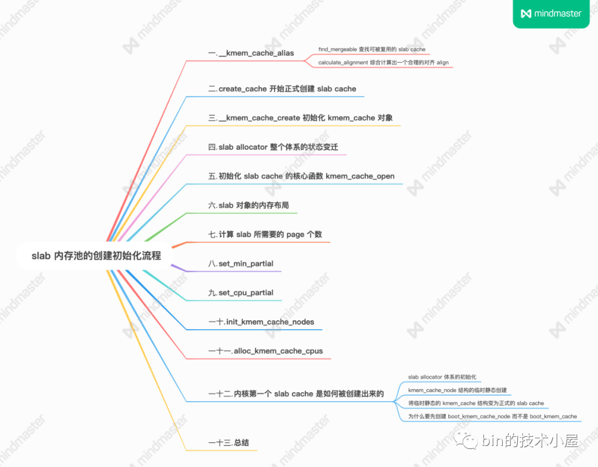

在上篇文章 《5. 从一个简单的内存页开始聊 slab》和 《6. slab 的总体架构设计》小节中，笔者带大家从一个最简单的物理内存页开始，一步一步演进 slab cache 的架构，最终得到了一副 slab cache 完整的架构图：

在本文的内容中，笔者会带大家到内核源码实现中，来看一下 slab cache 在内核中是如何被一步一步创建出来的，以及内核是如何安排 slab 对象在内存中的布局的。

我们先以内核创建 slab cache 的接口函数 kmem\_cache\_create 为起点，来一步一步揭秘 slab cache 的创建过程。

    struct kmem_cache *
    kmem_cache_create(const char *name, unsigned int size, unsigned int align,
            slab_flags_t flags, void (*ctor)(void *))
    {
        return kmem_cache_create_usercopy(name, size, align, flags, 0, 0,
                          ctor);
    }

kmem\_cache\_create 接口中的参数，是由用户指定的关于 slab cache 的一些核心属性，这些属性值与我们在前文[《细节拉满，80 张图带你一步一步推演 slab 内存池的设计与实现》](https://mp.weixin.qq.com/s?__biz=Mzg2MzU3Mjc3Ng==&mid=2247487996&idx=1&sn=12f62cfcfcc89ffcbbd1b7e4fa286940&chksm=ce77d7bbf9005ead3d4a953e470dba6b4708573a785e21f8f184f1c1fb6b3fed67a742b020d4&token=686517084&lang=zh_CN#rd) 的《6.1 slab 的基础信息管理》小节中介绍 struct kmem\_cache 结构的相应属性一一对应，在创建 slab cache 的过程中，内核会将 kmem\_cache\_create 接口中参数指定的值一一赋值到 struct kmem\_cache 结构中。

    struct kmem_cache {
        // slab cache 的名称， 也就是在 slabinfo 命令中 name 那一列
        const char *name;  
        // 对应参数 size，指 slab 中对象的实际大小，不包含填充的字节数
        unsigned int object_size;/* The size of an object without metadata */
        // 对象按照指定的 align 进行对齐
        unsigned int align; 
        // slab cache 的管理标志位，用于设置 slab 的一些特性
        slab_flags_t flags;
        // 池化对象的构造函数，用于创建 slab 对象池中的对象
        void (*ctor)(void *);
    }

slab cache 的整个创建过程其实是封装在 kmem\_cache\_create\_usercopy 函数中，kmem\_cache\_create 直接调用了该函数，并将创建参数透传过去。

    struct kmem_cache *
    kmem_cache_create_usercopy(const char *name,
              unsigned int size, unsigned int align,
              slab_flags_t flags,
              unsigned int useroffset, unsigned int usersize,
              void (*ctor)(void *))

内核提供 kmem\_cache\_create\_usercopy 函数的目的其实是为了防止 slab cache 中管理的内核核心对象被泄露，通过 useroffset 和 usersize 两个变量来指定内核对象内存布局区域中 useroffset 到 usersize 的这段内存区域可以被复制到用户空间中，其他区域则不可以。

在 Linux 内核初始化的过程中会提前为内核核心对象创建好对应的 slab cache，比如：在内核初始化函数 start\_kernel 中调用 fork\_init 函数为 struct task\_struct 创建其所属的 slab cache —— task\_struct\_cachep。

在 fork\_init 中就调用了 kmem\_cache\_create\_usercopy 函数来创建 task\_struct\_cachep，同时指定 task\_struct 对象中 useroffset 到 usersize 这段内存区域可以被复制到用户空间。例如：通过 ptrace 系统调用访问进程的 task\_struct 结构时，只能访问 task\_struct 对象 useroffset 到 usersize 的这段区域。

    void __init fork_init(void)
    {
        ......... 省略 ..........
        unsigned long useroffset, usersize;
    
        /* create a slab on which task_structs can be allocated */
        task_struct_whitelist(&useroffset, &usersize);
        task_struct_cachep = kmem_cache_create_usercopy("task_struct",
                arch_task_struct_size, align,
                SLAB_PANIC|SLAB_ACCOUNT,
                useroffset, usersize, NULL);
                
        ......... 省略 ..........
    }

    struct kmem_cache *
    kmem_cache_create_usercopy(const char *name,
              unsigned int size, unsigned int align,
              slab_flags_t flags,
              unsigned int useroffset, unsigned int usersize,
              void (*ctor)(void *))
    {
        struct kmem_cache *s = NULL;
        const char *cache_name;
        int err;
    
        // 获取 cpu_hotplug_lock，防止 cpu 热插拔改变 online cpu map
        get_online_cpus();
        // 获取 mem_hotplug_lock，防止访问内存的时候进行内存热插拔
        get_online_mems();
        // memory cgroup 相关，获取 memcg_cache_ids_sem 读写信号量
        // 防止 memcg_nr_cache_ids （caches array 大小）被修改
        memcg_get_cache_ids();
        // 获取 slab cache 链表的全局互斥锁
        mutex_lock(&slab_mutex);
    
        // 入参检查，校验 name 和 size 的有效性，防止创建过程在中断上下文中进行
        err = kmem_cache_sanity_check(name, size);
        if (err) {
            goto out_unlock;
        }
    
        // 检查有效的 slab flags 标记位，如果传入的 flag 是无效的，则拒绝本次创建请求
        if (flags & ~SLAB_FLAGS_PERMITTED) {
            err = -EINVAL;
            goto out_unlock;
        }
    
        // 设置创建 slab  cache 时用到的一些标志位
        flags &= CACHE_CREATE_MASK;
    
        // 校验 useroffset 和 usersize 的有效性
        if (WARN_ON(!usersize && useroffset) ||
            WARN_ON(size < usersize || size - usersize < useroffset))
            usersize = useroffset = 0;
    
        if (!usersize)
            // 在全局 slab cache 链表中查找与当前创建参数相匹配的 kmem_cache
            // 如果有，就不需要创建新的了，直接和已有的  slab cache  合并
            // 并且在 sys 文件系统中使用指定的 name 作为已有  slab cache  的别名
            s = __kmem_cache_alias(name, size, align, flags, ctor);
        if (s)
            goto out_unlock;
        // 在内核中为指定的 name 生成字符串常量并分配内存
        // 这里的 cache_name 就是将要创建的 slab cache 名称，用于在 /proc/slabinfo 中显示
        cache_name = kstrdup_const(name, GFP_KERNEL);
        if (!cache_name) {
            err = -ENOMEM;
            goto out_unlock;
        }
        // 按照我们指定的参数，创建新的 slab cache
        s = create_cache(cache_name, size,
                 calculate_alignment(flags, align, size),
                 flags, useroffset, usersize, ctor, NULL, NULL);
        if (IS_ERR(s)) {
            err = PTR_ERR(s);
            kfree_const(cache_name);
        }
    
    out_unlock:
        // 走到这里表示创建 slab cache 失败，释放相关的自旋锁和信号量
        mutex_unlock(&slab_mutex);
        memcg_put_cache_ids();
        put_online_mems();
        put_online_cpus();
    
        if (err) {
            if (flags & SLAB_PANIC)
                panic("kmem_cache_create: Failed to create slab '%s'. Error %d\n",
                    name, err);
            else {
                pr_warn("kmem_cache_create(%s) failed with error %d\n",
                    name, err);
                dump_stack();
            }
            return NULL;
        }
        return s;
    }

在创建 slab cache 的开始，内核为了保证整个创建过程是并发安全的，所以需要先获取一系列的锁，比如：

-   获取 cpu\_hotplug\_lock，mem\_hotplug\_lock 来防止在创建 slab cache 的过程中 cpu 或者内存进行热插拔。
-   防止 memory group 相关的 caches array 被修改，cgroup 相关的不是本文重点，这里简单了解一下即可。
-   内核中使用一个全局的双向链表来串联起系统中所有的 slab cache，这里需要获取全局链表 list 的锁，防止并发对 list 进行修改。

在确保 slab cache 的整个创建过程并发安全之后，内核会首先校验 kmem\_cache\_create 接口函数传递进来的那些创建参数的合法有效性。

比如，kmem\_cache\_sanity\_check 函数中会确保 slab cache 的创建过程不能在中断上下文中进行，如果进程所处的上下文为中断上下文，那么内核就会返回 `-EINVAL`错误停止 slab cache 的创建。因为中断处理程序是不会被内核重新调度的，这就导致处于中断上下文的操作必须是原子的，不能睡眠，不能阻塞，更不能持有锁等同步资源。而 slab cache 的创建并不是原子的，内核需要确保整个创建过程不能在中断上下文中进行。

除此之外 kmem\_cache\_sanity\_check 函数还需要校验用户传入的 name 和 对象大小 object size 的有效性，**确保 object size 在有效范围： 8 字节到 4M 之间**。

    #define MAX_ORDER       11
    #define PAGE_SHIFT      12
    
    // 定义在 /include/linux/slab.h 文件
    #ifdef CONFIG_SLUB
    #define KMALLOC_SHIFT_MAX   (MAX_ORDER + PAGE_SHIFT - 1)
    /* Maximum allocatable size */
    #define KMALLOC_MAX_SIZE    (1UL << KMALLOC_SHIFT_MAX)
    
    static int kmem_cache_sanity_check(const char *name, unsigned int size)
    {   
        // 1: 传入 slab cache 的名称不能为空
        // 2: 创建 slab cache 的过程不能处在中断上下文中
        // 3: 传入的对象大小 size 需要在 8 字节到 KMALLOC_MAX_SIZE = 4M 之间
        if (!name || in_interrupt() || size < sizeof(void *) ||
            size > KMALLOC_MAX_SIZE) {
            pr_err("kmem_cache_create(%s) integrity check failed\n", name);
            return -EINVAL;
        }
    
        WARN_ON(strchr(name, ' ')); /* It confuses parsers */
        return 0;
    }

最后内核会校验传入的 slab cache 管理标志位 slab\_flags\_t 的合法性，确保 slab\_flags\_t 在内核规定的有效标志集合中：

    /* Common flags permitted for kmem_cache_create */
    #define SLAB_FLAGS_PERMITTED (SLAB_CORE_FLAGS | \
    			      SLAB_RED_ZONE | \
    			      SLAB_POISON | \
    			      SLAB_STORE_USER | \
    			      SLAB_TRACE | \
    			      SLAB_CONSISTENCY_CHECKS | \
    			      SLAB_MEM_SPREAD | \
    			      SLAB_NOLEAKTRACE | \
    			      SLAB_RECLAIM_ACCOUNT | \
    			      SLAB_TEMPORARY | \
    			      SLAB_ACCOUNT)

随后 `flags &= CACHE_CREATE_MASK` 初始化 slab\_flags\_t 标志位：

    /* Common flags available with current configuration */
    #define CACHE_CREATE_MASK (SLAB_CORE_FLAGS | SLAB_DEBUG_FLAGS | SLAB_CACHE_FLAGS)

在校验完各项创建参数的有效性之后，按照常理来说就应该进入 slab cache 的创建流程了，但是现在还没到创建的时候，内核的理念是尽最大可能复用系统中已有的 slab cache。

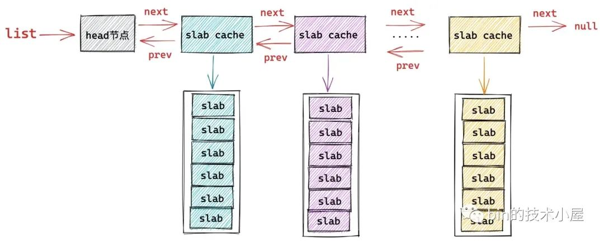

在 \_\_kmem\_cache\_alias 函数中，内核会遍历系统中 slab cache 的全局链表 list，试图在系统现有 slab cache 中查找到一个各项核心参数与我们指定的创建参数贴近的 slab cache。比如，系统中存在一个 slab cache 它的各项核心参数，object size，align，slab\_flags\_t 和我们指定的创建参数非常贴近。

这样一来内核就不需要重复创建新的 slab cache 了，直接复用原有的 slab cache 即可，将我们指定的 name 作为原有 slab cache 的别名。

如果找不到这样一个可以被复用的 slab cache，那么内核就会调用 create\_cache 开始创建 slab cache 流程。

以上是 slab cache 创建的总体框架流程，接下来，我们来详细看下创建流程中涉及到的几个核心函数。

### 1\. \_\_kmem\_cache\_alias

\_\_kmem\_cache\_alias 函数的核心是在 find\_mergeable 方法中，内核在 find\_mergeable 方法里边会遍历 slab cache 的全局链表 list，查找与当前创建参数贴近可以被复用的 slab cache。

一个可以被复用的 slab cache 需要满足以下四个条件：

1.  指定的 slab\_flags\_t 相同。
    
2.  指定对象的 object size 要小于等于已有 slab cache 中的对象 size （kmem\_cache->size）。
    
3.  如果指定对象的 object size 与已有 kmem\_cache->size 不相同，那么它们之间的差值需要再一个 word size 之内。
    
4.  已有 slab cache 中的 slab 对象对齐 align （kmem\_cache->align）要大于等于指定的 align 并且可以整除 align 。
    

    struct kmem_cache *
    __kmem_cache_alias(const char *name, unsigned int size, unsigned int align,
               slab_flags_t flags, void (*ctor)(void *))
    {
        struct kmem_cache *s, *c;
        // 在全局 slab cache 链表中查找与当前创建参数相匹配的 slab cache
        // 如果在全局查找到一个  slab cache，它的核心参数和我们指定的创建参数很贴近
        // 那么就没必要再创建新的 slab cache了，复用已有的 slab cache
        s = find_mergeable(size, align, flags, name, ctor);
        if (s) {
            // 如果存在可复用的 kmem_cache，则将它的引用计数 + 1
            s->refcount++;
            // 采用较大的值，更新已有的 kmem_cache 相关的元数据
            s->object_size = max(s->object_size, size);
            s->inuse = max(s->inuse, ALIGN(size, sizeof(void *)));
            // 遍历 mem cgroup 中的 cache array，更新对应的元数据
            // cgroup 相关，这里简单了解也可直接忽略
            for_each_memcg_cache(c, s) {
                c->object_size = s->object_size;
                c->inuse = max(c->inuse, ALIGN(size, sizeof(void *)));
            }
            // 由于这里我们会复用已有的 kmem_cache 并不会创建新的，而且我们指定的 kmem_cache 名称是 name。
            // 为了看起来像是创建了一个名称为 name 的新 kmem_cache，所以要给被复用的 kmem_cache 起一个别名，这个别名就是我们指定的 name
            // 在 sys 文件系统中使用我们指定的 name 为被复用 kmem_cache 创建别名
            // 这样一来就会在 sys 文件系统中出现一个这样的目录 /sys/kernel/slab/name ，该目录下的文件包含了对应 slab cache 运行时的详细信息
            if (sysfs_slab_alias(s, name)) {
                s->refcount--;
                s = NULL;
            }
        }
    
        return s;
    }
    

如果通过 find\_mergeable 在现有系统中所有 slab cache 中找到了一个可以复用的 slab cache，那么就不需要在创建新的了，直接返回已有的 slab cache 就可以了。

但是在返回之前，需要更新一下已有 slab cache 结构 kmem\_cache 中的相关信息：

    struct kmem_cache {
        // slab cache 的引用计数，为 0 时就可以销毁并释放内存回伙伴系统重
        int refcount;   
        // slab 中对象的实际大小，不包含填充的字节数
        unsigned int object_size;/* The size of an object without metadata */
        // 对象的 object_size 按照 word 字长对齐之后的大小
        unsigned int inuse;  
    }

-   增加原有 slab cache 的引用计数 refcount++。
    
-   slab cache 中的 object size 更新为我们在创建参数中指定的 object size 与原有 object size 之间的最大值。
    
-   slab cache 中的 inuse 也是更新为原有 kmem\_cache->inuse 与我们指定的对象 object size 与 word size 对齐之后的最大值。
    

最后调用 sysfs\_slab\_alias 在 sys 文件系统中创建一个这样的目录 `/sys/kernel/slab/name`，name 就是 kmem\_cache\_create 接口函数传递过来的参数，表示要创建的 slab cache 名称。

系统中的所有 slab cache 都会在 sys 文件系统中有一个专门的目录：`/sys/kernel/slab/<cachename>`，该目录下的所有文件都是 read only 的，每一个文件代表 slab cache 的一项运行时信息，比如：

-   `/sys/kernel/slab/<cachename>/align` 文件标识该 slab cache 中的 slab 对象的对齐 align
-   `/sys/kernel/slab/<cachename>/alloc_fastpath` 文件记录该 slab cache 在快速路径下分配的对象个数
-   `/sys/kernel/slab/<cachename>/alloc_from_partial` 文件记录该 slab cache 从本地 cpu 缓存 partial 链表中分配的对象次数
-   `/sys/kernel/slab/<cachename>/alloc_slab` 文件记录该 slab cache 从伙伴系统中申请新 slab 的次数
-   `/sys/kernel/slab/<cachename>/cpu_slabs` 文件记录该 slab cache 的本地 cpu 缓存中缓存的 slab 个数
-   `/sys/kernel/slab/<cachename>/partial` 文件记录该 slab cache 在每个 NUMA 节点缓存 partial 链表中的 slab 个数
-   `/sys/kernel/slab/<cachename>/objs_per_slab` 文件记录该 slab cache 中管理的 slab 可以容纳多少个对象。

该目录下还有很多文件笔者就不一一列举了，但是我们可以看到 `/sys/kernel/slab/<cachename>` 目录下的文件描述了对应 slab cache 非常详细的运行信息。前边我们介绍的 `cat /proc/slabinfo` 命名输出的信息就来源于 `/sys/kernel/slab/<cachename>` 目录下的各个文件。

由于我们当前并没有真正创建一个新的 slab cache，而是复用系统中已有的 slab cache，但是内核需要让用户感觉上已经按照我们指定的创建参数创建了一个新的 slab cache，所以需要为我们要创建的 slab cache 也单独在 sys 文件系统中创建一个 `/sys/kernel/slab/name` 目录，但是该目录下的文件需要**软链接**到原有 slab cache 在 sys 文件系统对应目录下的文件。

这就相当于给原有 slab cache 起了一个别名，这个别名就是我们指定的 name，但是 `/sys/kernel/slab/name` 目录下的文件还是用的原有 slab cache 的。

我们可以通过 `/sys/kernel/slab/<cachename>/aliases` 文件查看该 slab cache 的所有别名个数，也就是说有多少个 slab cache 复用了该 slab cache 。

#### 1.1 find\_mergeable 查找可被复用的 slab cache

    struct kmem_cache *find_mergeable(unsigned int size, unsigned int align,
            slab_flags_t flags, const char *name, void (*ctor)(void *))
    {
        struct kmem_cache *s;
        // 与 word size 进行对齐
        size = ALIGN(size, sizeof(void *));
        // 根据我们指定的对齐参数 align 并结合 CPU cache line 大小，计算出一个合适的对齐参数
        align = calculate_alignment(flags, align, size);
        // 对象 size 重新按照 align 进行对齐
        size = ALIGN(size, align);
    
        // 如果 flag 设置的是不允许合并，则停止
        if (flags & SLAB_NEVER_MERGE)
            return NULL;
    
        // 开始遍历内核中已有的 slab cache，寻找可以合并的 slab cache
        list_for_each_entry_reverse(s, &slab_root_caches, root_caches_node) {
            if (slab_unmergeable(s))
                continue;
            // 指定对象 size 不能超过已有 slab cache 中的对象 size
            if (size > s->size)
                continue;
            // 校验指定的 flag 是否与已有 slab cache 中的 flag 一致
            if ((flags & SLAB_MERGE_SAME) != (s->flags & SLAB_MERGE_SAME))
                continue;
            // 两者的 size 相差在一个 word size 之内 
            if (s->size - size >= sizeof(void *))
                continue;
            // 已有 slab cache 中对象的对齐 align 要大于等于指定的 align并且可以整除 align。
            if (IS_ENABLED(CONFIG_SLAB) && align &&
                (align > s->align || s->align % align))
                continue;
            // 查找到可以合并的已有 slab cache，不需要再创建新的 slab cache 了
            return s;
        }
        return NULL;
    }

一个可以被复用的 slab cache 需要满足以下四个条件：

1.  指定的 slab\_flags\_t 相同。
    
2.  指定对象的 object size 要小于等于已有 slab cache 中的对象 size （kmem\_cache->size）。
    
3.  如果指定对象的 object size 与已有 kmem\_cache->size 不相同，那么它们之间的差值需要再一个 word size 之内。
    
4.  已有 slab cache 中的 slab 对象对齐 align （kmem\_cache->align）要大于等于指定的 align 并且可以整除 align 。
    

#### 1.2 calculate\_alignment 综合计算出一个合理的对齐 align

事实上，内核并不会完全按照我们指定的 align 进行内存对齐，而是会综合考虑 cpu 硬件 cache line 的大小，以及 word size 计算出一个合理的 align 值。

内核在对 slab 对象进行内存布局的时候，会按照这个最终的 align 进行内存对齐。

    static unsigned int calculate_alignment(slab_flags_t flags,
            unsigned int align, unsigned int size)
    {
        // SLAB_HWCACHE_ALIGN 表示需要按照硬件 cache line 对齐
        if (flags & SLAB_HWCACHE_ALIGN) {
            unsigned int ralign;
            // 获取 cache line 大小 通常为 64 字节
            ralign = cache_line_size();
            // 根据指定对齐参数 align ，对象 object size 以及 cache line 大小
            // 综合计算出一个合适的对齐参数 ralign 出来
            while (size <= ralign / 2)
                ralign /= 2;
            align = max(align, ralign);
        }
    
        // ARCH_SLAB_MINALIGN 为 slab 设置的最小对齐参数， 8 字节大小，align 不能小于该值
        if (align < ARCH_SLAB_MINALIGN)
            align = ARCH_SLAB_MINALIGN;
        // 与 word size 进行对齐
        return ALIGN(align, sizeof(void *));
    }

    // 定义在文件：/include/linux/slab.h
    #define ARCH_SLAB_MINALIGN __alignof__(unsigned long long)

### 2\. create\_cache 开始正式创建 slab cache

在前文[《细节拉满，80 张图带你一步一步推演 slab 内存池的设计与实现》](https://mp.weixin.qq.com/s?__biz=Mzg2MzU3Mjc3Ng==&mid=2247487996&idx=1&sn=12f62cfcfcc89ffcbbd1b7e4fa286940&chksm=ce77d7bbf9005ead3d4a953e470dba6b4708573a785e21f8f184f1c1fb6b3fed67a742b020d4&token=686517084&lang=zh_CN#rd) 中的 《6.2 slab 的组织架构》小节中，为大家介绍的 slab cache 的整体架构就是在 create\_cache 函数中搭建完成的。

create\_cache 函数的主要任务就是为 slab cache 创建它的内核数据结构 struct kmem\_cache，并为其填充我们在前文 《6.1 slab 的基础信息管理》小节中介绍的关于 struct kmem\_cache 相关的属性。

随后内核会为其创建 slab cache 的本地 cpu 结构 kmem\_cache\_cpu，每个 cpu 对应一个这样的缓存结构。

    struct kmem_cache {
        // 每个 cpu 拥有一个本地缓存，用于无锁化快速分配释放对象
        struct kmem_cache_cpu __percpu *cpu_slab;
    }

最后为 slab cache 创建 NUMA 节点缓存结构 kmem\_cache\_node，每个 NUMA 节点对应一个。

    struct kmem_cache {
        // slab cache 中 numa node 中的缓存，每个 node 一个
        struct kmem_cache_node *node[MAX_NUMNODES];
    }

当 slab cache 的整个骨架被创建出来之后，内核会为其在 sys 文件系统中创建 `/sys/kernel/slab/name` 目录节点，用于详细记录该 slab cache 的运行状态以及行为信息。

最后将新创建出来的 slab cache 添加到全局双向链表 list 的末尾。下面我们来一起看下这个创建过程的详细实现。

    static struct kmem_cache *create_cache(const char *name,
            unsigned int object_size, unsigned int align,
            slab_flags_t flags, unsigned int useroffset,
            unsigned int usersize, void (*ctor)(void *),
            struct mem_cgroup *memcg, struct kmem_cache *root_cache)
    {
        struct kmem_cache *s;
        // 为将要创建的 slab cache 分配 kmem_cache 结构
        // kmem_cache 也是内核的一个核心数据结构，同样也会被它对应的 slab cache 所管理
        // 这里就是从 kmem_cache 所属的 slab cache 中拿出一个 kmem_cache 对象出来
        s = kmem_cache_zalloc(kmem_cache, GFP_KERNEL);
    
        // 利用我们指定的创建参数初始化 kmem_cache 结构
        s->name = name;
        s->size = s->object_size = object_size;
        s->align = align;
        s->ctor = ctor;
        s->useroffset = useroffset;
        s->usersize = usersize;
        // 创建 slab cache 的核心函数，这里会初始化 kmem_cache 结构中的其他重要属性
        // 包括创建初始化 kmem_cache_cpu 和 kmem_cache_node 结构
        err = __kmem_cache_create(s, flags);
        if (err)
            goto out_free_cache;
        // slab cache 初始状态下，引用计数为 1
        s->refcount = 1;
        // 将刚刚创建出来的 slab cache 加入到 slab cache 在内核中的全局链表管理
        list_add(&s->list, &slab_caches);
    
    out:
        if (err)
            return ERR_PTR(err);
        return s;
    
    out_free_cache:
        // 创建过程出现错误之后，释放 kmem_cache 对象
        kmem_cache_free(kmem_cache, s);
        goto out;
    }

内核中的每个核心数据结构都会有其专属的 slab cache 来管理，比如，笔者在本文 《3. slab 对象池在内核中的应用场景》小节介绍的 task\_struct，mm\_struct，page，file，socket 等等一系列的内核核心数据结构。

而这里的 slab cache 的数据结构 struct kmem\_cache 同样也属于内核的核心数据结构，它也有其专属的 slab cache 来专门管理 kmem\_cache 对象的分配与释放。

内核在启动阶段，会专门为 struct kmem\_cache 创建其专属的 slab cache，保存在全局变量 kmem\_cache 中。

    // 全局变量，用于专门管理 kmem_cache 对象的 slab cache
    // 定义在文件：/mm/slab_common.c
    struct kmem_cache *kmem_cache;

同理，slab cache 的 NUMA 节点缓存 kmem\_cache\_node 结构也是如此，内核也会为其创建一个专属的 slab cache，保存在全局变量 kmem\_cache\_node 中。

    // 全局变量，用于专门管理 kmem_cache_node 对象的 slab cache
    // 定义在文件：/mm/slub.c
    static struct kmem_cache *kmem_cache_node;

在 create\_cache 函数的开始，内核会从 kmem\_cache 专属的 slab cache 中申请一个 kmem\_cache 对象。

       s = kmem_cache_zalloc(kmem_cache, GFP_KERNEL);

然后用我们在 kmem\_cache\_create 接口函数中指定的参数初始化 kmem\_cache 对象。

    struct kmem_cache *
    kmem_cache_create(const char *name, unsigned int size, unsigned int align,
            slab_flags_t flags, void (*ctor)(void *))

随后会在 \_\_kmem\_cache\_create 函数中近一步初始化 kmem\_cache 对象的其他重要属性。比如，初始化 slab 对象的内存布局相关信息，计算 slab 所需要的物理内存页个数以及所能容纳的对象个数，创建初始化 cpu 本地缓存结构以及 NUMA 节点的缓存结构。

最后将刚刚创建出来的 slab cache 加入到 slab cache 在内核中的全局链表 list 中管理

     list_add(&s->list, &slab_caches);

### 3\. \_\_kmem\_cache\_create 初始化 kmem\_cache 对象

\_\_kmem\_cache\_create 函数的主要工作就是建立 slab cache 的基本骨架，包括初始化 kmem\_cache 结构中的其他重要属性，创建初始化本地 cpu 缓存结构以及 NUMA 节点缓存结构，这一部分的重要工作封装在 kmem\_cache\_open 函数中完成。

随后会检查内核 slab allocator 整个体系的状态，只有 `slab_state = FULL` 的状态才表示整个 slab allocator 体系已经在内核中建立并初始化完成了，可以正常运转了。

通过 slab allocator 的状态检查之后，就是 slab cache 整个创建过程的最后一步，利用 sysfs\_slab\_add 为其在 sys 文件系统中创建 `/sys/kernel/slab/name` 目录，该目录下的文件详细记录了 slab cache 运行时的各种信息。

    int __kmem_cache_create(struct kmem_cache *s, slab_flags_t flags)
    {
        int err;
        // 核心函数，在这里会初始化 kmem_cache 的其他重要属性
        err = kmem_cache_open(s, flags);
        if (err)
            return err;
    
        // 检查内核中 slab 分配器的整体体系是否已经初始化完毕，只有状态是 FULL 的时候才是初始化完毕，其他的状态表示未初始化完毕。
        // 在 slab  allocator 体系初始化的时候在 slab_sysfs_init 函数中将 slab_state 设置为 FULL
        if (slab_state <= UP)
            return 0;
        // 在 sys 文件系统中创建 /sys/kernel/slab/name 节点，该目录下的文件包含了对应 slab cache 运行时的详细信息
        err = sysfs_slab_add(s);
        if (err)
            // 出现错误则释放 kmem_cache 结构
            __kmem_cache_release(s);
    
        return err;
    }

### 4\. slab allocator 整个体系的状态变迁

\_\_kmem\_cache\_create 函数的整个逻辑还是比较好理解的，这里唯一不好理解的就是 slab allocator 整个体系的状态 slab\_state。

只有 slab\_state 为 FULL 状态的时候，才代表 slab allocator 体系能够正常运转，包括这里的创建 slab cache，以及后续从 slab cache 分配对象，释放对象等操作。

只要 slab\_state 不是 FULL 状态，slab allocator 体系就是处于半初始化状态，下面笔者就为大家介绍一下 slab\_state 的状态变迁流程，这里大家只做简单了解，因为随着后续源码的深入，笔者还会在相关章节重复提起。

    // slab allocator 整个体系的状态 slab_state。
    enum slab_state {
        DOWN,           /* No slab functionality yet */
        PARTIAL,        /* SLUB: kmem_cache_node available */
        UP,         /* Slab caches usable but not all extras yet */
        FULL            /* Everything is working */
    };

在内核没有启动的时候，也就是 slab allocator 体系完全没有建立的情况下，slab\_state 的初始化状态就是 `DOWN`。

当内核启动的过程中，会开始创建初始化 slab allocator 体系，第一步就是为 struct kmem\_cache\_node 结构创建其专属的 slab cache —— `kmem_cache_node` 。后续再创建新的 slab cache 的时候，其中的 NUMA 节点缓存结构就是从 `kmem_cache_node` 里分配。

当 kmem\_cache\_node 专属的 slab cache 创建完毕之后， slab\_state 的状态就变为了 `PARTIAL`。

slab allocator 体系建立的最后一项工作，就是创建 kmalloc 内存池体系，kmalloc 体系成功创建之后，slab\_state 的状态就变为了 `UP`，其实现在 slab allocator 体系就可以正常运转了，但是还不是最终的理想状态。

当内核的初始化工作全部完成的时候，会在 `arch_call_rest_init` 函数中调用 `do_initcalls()`，开启内核的 initcall 阶段。

    asmlinkage __visible void __init start_kernel(void)
    {      
          ........ 省略 .........
          /* Do the rest non-__init'ed, we're now alive */ 
          arch_call_rest_init();
    }

在内核的 initcall 阶段，会调用内核中定义的所有 initcall，而建立 slab allocator 体系的最后一项工作就为其在 sys 文件系统中创建 `/sys/kernel/slab` 目录节点，这里会存放系统中所有 slab cache 的详细运行信息。

这一项工作就封装在 `slab_sysfs_init` 函数中，而 slab\_sysfs\_init 在内核中被定义成了一个 \_\_initcall 函数。

    __initcall(slab_sysfs_init);
    
    static int __init slab_sysfs_init(void)
    {
        struct kmem_cache *s;
        int err;
    
        mutex_lock(&slab_mutex);
    
        slab_kset = kset_create_and_add("slab", &slab_uevent_ops, kernel_kobj);
        if (!slab_kset) {
            mutex_unlock(&slab_mutex);
            pr_err("Cannot register slab subsystem.\n");
            return -ENOSYS;
        }
    
        slab_state = FULL;
        
        ....... 省略 ......
    
    }

当 `/sys/kernel/slab` 目录节点被创建之后，在 slab\_sysfs\_init 函数中会将 slab\_state 变为 FULL。至此内核中的 slab allocator 整个体系就全部建立起来了。

### 5\. 初始化 slab cache 的核心函数 kmem\_cache\_open

kmem\_cache\_open 是初始化 slab cache 内核数据结构 kmem\_cache 的核心函数，在这里会初始化 kmem\_cache 结构中的一些重要核心参数，以及为 slab cache 创建初始化本地 cpu 缓存结构 kmem\_cache\_cpu 和 NUMA 节点缓存结构 kmem\_cache\_node。

经历过 kmem\_cache\_open 之后，如下图所示的 slab cache 的整个骨架就全部创建出来了。

    static int kmem_cache_open(struct kmem_cache *s, slab_flags_t flags)
    {
        // 计算 slab 中对象的整体内存布局所需要的 size
        // slab 所需最合适的内存页面大小 order，slab 中所能容纳的对象个数
        // 初始化 slab cache 中的核心参数 oo ,min,max的值
        if (!calculate_sizes(s, -1))
            goto error;
    
        // 设置 slab cache 在 node 缓存  kmem_cache_node 中的 partial 列表中 slab 的最小个数 min_partial
        set_min_partial(s, ilog2(s->size) / 2);
        // 设置 slab cache 在 cpu 本地缓存的 partial 列表中所能容纳的最大空闲对象个数
        set_cpu_partial(s);
    
        // 为 slab cache 创建并初始化 node cache 数组
        if (!init_kmem_cache_nodes(s))
            goto error;
        // 为 slab cache 创建并初始化 cpu 本地缓存列表
        if (alloc_kmem_cache_cpus(s))
            return 0;
    }

calculate\_sizes 函数中封装了 slab 对象内存布局的全部逻辑，笔者在上篇文章[《细节拉满，80 张图带你一步一步推演 slab 内存池的设计与实现》](https://mp.weixin.qq.com/s?__biz=Mzg2MzU3Mjc3Ng==&mid=2247487996&idx=1&sn=12f62cfcfcc89ffcbbd1b7e4fa286940&chksm=ce77d7bbf9005ead3d4a953e470dba6b4708573a785e21f8f184f1c1fb6b3fed67a742b020d4&token=686517084&lang=zh_CN#rd) 中的 《5. 从一个简单的内存页开始聊 slab》小节中介绍的内容，背后的实现逻辑全部封装在此。

除了确定 slab 对象的内存布局之外，calculate\_sizes 函数还会初始化 kmem\_cache 的其他核心参数：

    struct kmem_cache {
        // slab 中管理的对象大小，注意：这里包含对象为了对齐所填充的字节数
        unsigned int size;  /* The size of an object including metadata */
        // slab 对象池中的对象在没有被分配之前，我们是不关心对象里边存储的内容的。
        // 内核巧妙的利用对象占用的内存空间存储下一个空闲对象的地址。
        // offset 表示用于存储下一个空闲对象指针的位置距离对象首地址的偏移
        unsigned int offset;    /* Free pointer offset */
        // 表示 cache 中的 slab 大小，包括 slab 所申请的页面个数，以及所包含的对象个数
        // 其中低 16 位表示一个 slab 中所包含的对象总数，高 16 位表示一个 slab 所占有的内存页个数。
        struct kmem_cache_order_objects oo;
        // slab 中所能包含对象以及内存页个数的最大值
        struct kmem_cache_order_objects max;
        // 当按照 oo 的尺寸为 slab 申请内存时，如果内存紧张，会采用 min 的尺寸为 slab 申请内存，可以容纳一个对象即可。
        struct kmem_cache_order_objects min;
    }

在完成了对 kmem\_cache 结构的核心属性初始化工作之后，内核紧接着会调用 `set_min_partial` 来设置 `kmem_cache->min_partial`，从而限制 slab cache 在 numa node 中缓存的 slab 个数上限。

    struct kmem_cache {
        // slab cache 在 numa node 中缓存的 slab 个数上限，slab 个数超过该值，空闲的 empty slab 则会被回收至伙伴系统
        unsigned long min_partial;
    }

调用 `set_cpu_partial` 来设置 `kmem_cache->cpu_partial`，从而限制 slab cache 在 cpu 本地缓存 partial 链表中空闲对象个数的上限。

    struct kmem_cache {
        // 限定 slab cache 在每个 cpu 本地缓存 partial 链表中所有 slab 中空闲对象的总数
        // cpu 本地缓存 partial 链表中空闲对象的数量超过该值，则会将 cpu 本地缓存 partial 链表中的所有 slab 转移到 numa node 缓存中。
        unsigned int cpu_partial;
    };

最后调用 `init_kmem_cache_nodes` 函数为 slab cache 在每个 NUMA 节点中创建其所属的缓存结构 kmem\_cache\_node。

调用 `alloc_kmem_cache_cpus` 函数为 slab cache 创建每个 cpu 的本地缓存结构 kmem\_cache\_cpu。

现在 slab cache 的整个骨架就被完整的创建出来了，下面我们来看一下这个过程中涉及到的几个核心函数。

### 6\. slab 对象的内存布局

在上篇文章[《细节拉满，80 张图带你一步一步推演 slab 内存池的设计与实现》](https://mp.weixin.qq.com/s?__biz=Mzg2MzU3Mjc3Ng==&mid=2247487996&idx=1&sn=12f62cfcfcc89ffcbbd1b7e4fa286940&chksm=ce77d7bbf9005ead3d4a953e470dba6b4708573a785e21f8f184f1c1fb6b3fed67a742b020d4&token=686517084&lang=zh_CN#rd)的《5. 从一个简单的内存页开始聊 slab》小节的内容介绍中，笔者详细的为大家介绍了 slab 对象的内存布局，本小节，我们将从内核源码实现角度再来谈一下 slab 对象的内存布局，看一下内核是如何具体规划 slab 对象的内存布局的。

> 再开始本小节的内容之前，笔者建议大家先去回顾下前文第五小节的内容。

    static int calculate_sizes(struct kmem_cache *s, int forced_order)
    {
        slab_flags_t flags = s->flags;
        unsigned int size = s->object_size;
        unsigned int order;
    
        // 为了提高 cpu 访问对象的速度，slab 对象的 object size 首先需要与 word size 进行对齐
        size = ALIGN(size, sizeof(void *));
    
    #ifdef CONFIG_SLUB_DEBUG
        // SLAB_POISON：对象中毒标识，是 slab 中的一个术语，用于将对象所占内存填充某些特定的值，表示这块对象不同的使用状态，防止非法越界访问。
        // 比如：在将对象分配出去之前，会将对象所占内存用 0x6b 填充，并用 0xa5 填充 object size 区域的最后一个字节。
        // SLAB_TYPESAFE_BY_RCU：启用 RCU 锁释放 slab
        if ((flags & SLAB_POISON) && !(flags & SLAB_TYPESAFE_BY_RCU) &&
                !s->ctor)
            s->flags |= __OBJECT_POISON;
        else
            s->flags &= ~__OBJECT_POISON;
    
        // SLAB_RED_ZONE：表示在空闲对象前后插入 red zone 红色区域（填充特定字节 0xbb），防止对象溢出越界
        // size == s->object_size 表示对象 object size 与 word size 本来就是对齐的，并没有填充任何字节
        // 这时就需要在对象 object size 内存区域的后面插入一段 word size 大小的 red zone。
        // 如果对象 object size 与 word size 不是对齐的，填充了字节，那么这段填充的字节恰好可以作为右侧 red zone，而不需要额外分配 red zone 空间
        if ((flags & SLAB_RED_ZONE) && size == s->object_size)
            size += sizeof(void *);
    #endif
    
        // inuse 表示 slab 中的对象实际使用的内存区域大小
        // 该值是经过与 word size 对齐之后的大小，如果设置了 SLAB_RED_ZONE，则也包括红色区域大小
        s->inuse = size;
    
        if (((flags & (SLAB_TYPESAFE_BY_RCU | SLAB_POISON)) ||
            s->ctor)) {
            // 如果我们开启了 RCU 保护或者设置了对象 poison或者设置了对象的构造函数
            // 这些都会占用对象中的内存空间。这种情况下，我们需要额外增加一个 word size 大小的空间来存放 free pointer，否则 free pointer 存储在对象的起始位置
            // offset 为 free pointer 与对象起始地址的偏移
            s->offset = size;
            size += sizeof(void *);
        }
    
    #ifdef CONFIG_SLUB_DEBUG
        if (flags & SLAB_STORE_USER)
            // SLAB_STORE_USER 表示需要跟踪对象的分配和释放信息
            // 需要再对象的末尾增加两个 struct track 结构，存储分配和释放的信息
            size += 2 * sizeof(struct track);
    
    #ifdef CONFIG_SLUB_DEBUG
        if (flags & SLAB_RED_ZONE) {
            // 在对象内存区域的左侧增加 red zone，大小为 red_left_pad
            // 防止对这块对象内存的写越界
            size += sizeof(void *);
            s->red_left_pad = sizeof(void *);
            s->red_left_pad = ALIGN(s->red_left_pad, s->align);
            size += s->red_left_pad;
        }
    #endif
    
        // slab 从它所申请的内存页 offset 0 开始，一个接一个的存储对象
        // 调整对象的 size 保证对象之间按照指定的对齐方式 align 进行对齐
        size = ALIGN(size, s->align);
        s->size = size;
        // 这里 forced_order 传入的是 -1
        if (forced_order >= 0)
            order = forced_order;
        else
            // 计算 slab 所需要申请的内存页数（2 ^ order 个内存页）
            order = calculate_order(size);
    
        if ((int)order < 0)
            return 0;
        // 根据 slab 的 flag 设置，设置向伙伴系统申请内存时使用的 allocflags
        s->allocflags = 0;
        if (order)
            // slab 所需要的内存页多于 1 页时，则向伙伴系统申请复合页。
            s->allocflags |= __GFP_COMP;
    
        // 从 DMA 区域中获取适用于 DMA 的内存页
        if (s->flags & SLAB_CACHE_DMA)
            s->allocflags |= GFP_DMA;
        // 从 DMA32 区域中获取适用于 DMA 的内存页
        if (s->flags & SLAB_CACHE_DMA32)
            s->allocflags |= GFP_DMA32;
        // 申请可回收的内存页
        if (s->flags & SLAB_RECLAIM_ACCOUNT)
            s->allocflags |= __GFP_RECLAIMABLE;
    
        // 计算 slab cache 中的 oo，min，max 值
        // 一个 slab 到底需要多少个内存页，能够存储多少个对象
        // 低 16 为存储 slab 所能包含的对象总数，高 16 为存储 slab 所需的内存页个数
        s->oo = oo_make(order, size);
        // get_order 函数计算出的 order 为容纳一个 size 大小的对象至少需要的内存页个数
        s->min = oo_make(get_order(size), size);
        if (oo_objects(s->oo) > oo_objects(s->max))
            // 初始时 max 和 oo 相等
            s->max = s->oo;
        // 返回 slab 中所能容纳的对象个数
        return !!oo_objects(s->oo);
    }

在内核对 slab 对象开始内存布局之前，为了提高 cpu 访问对象的速度，首先需要将 slab 对象的 object size 与 word size 进行对齐。如果 object size 与 word size 本来就是对齐的，那么内核不会做任何事情。如果不是对齐的，那么就需要在对象后面填充一些字节，达到与 word size 对齐的目的。

     size = ALIGN(size, sizeof(void *));

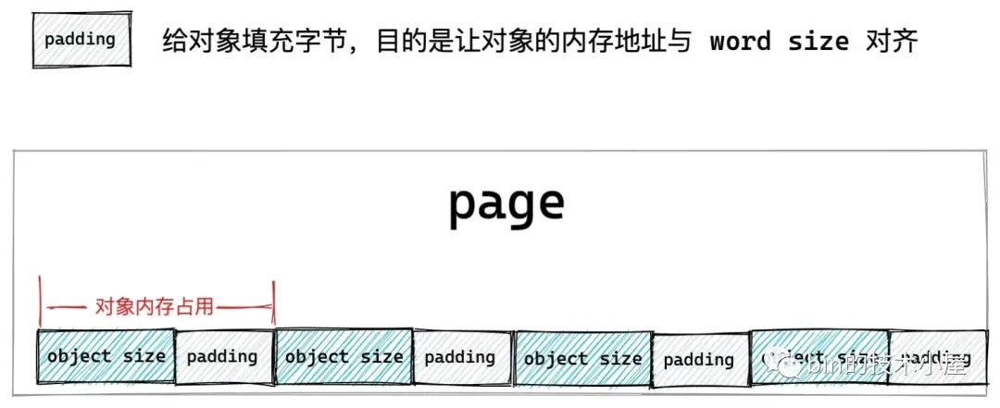

如果我们设置了 SLAB\_RED\_ZONE，表示需要再对象 object size 内存区域前后各插入一段 red zone 区域，目的是为了防止内存的读写越界。

如果对象 object size 与 word size 本来就是对齐的，并没有填充任何字节：`size == s->object_size`，那么此时就需要在对象 object size 内存区域的后面插入一段 word size 大小的 red zone。

如果对象 object size 与 word size 不是对齐的，那么内核就会在 object size 区域后面填充字节达到与 word size 对齐的目的，而这段填充的字节恰好可以作为对象右侧 red zone ，而不需要额外为右侧 red zone 分配内存空间。

     if ((flags & SLAB_RED_ZONE) && size == s->object_size)
            size += sizeof(void *);

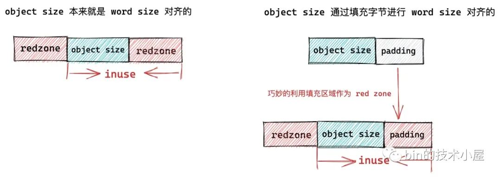

如果我们设置了 SLAB\_POISON 或者开启了 RCU 或者设置了对象的构造函数，它们都会占用对象的实际内存区域 object size。

比如我们设置 SLAB\_POISON 之后， slab 对象的 object size 内存区域会被内核用特殊字符 0x6b 填充，并用 0xa5 填充对象 object size 内存区域的最后一个字节表示填充完毕。

这样一来，用于指向下一个空闲对象的 freepointer 就没地方存放了，所以需要在当前对象内存区域的基础上再额外开辟一段 word size 大小的内存区域专门存放 freepointer。

        if (((flags & (SLAB_TYPESAFE_BY_RCU | SLAB_POISON)) ||
            s->ctor)) {
            // offset 为 free pointer 与对象起始地址的偏移
            s->offset = size;
            size += sizeof(void *);
        }

除此之外，对象的 freepointer 指针就会放在对象本身内存区域 object size 中，因为在对象被分配出去之前，用户根本不会关心对象内存里到底存放的是什么。

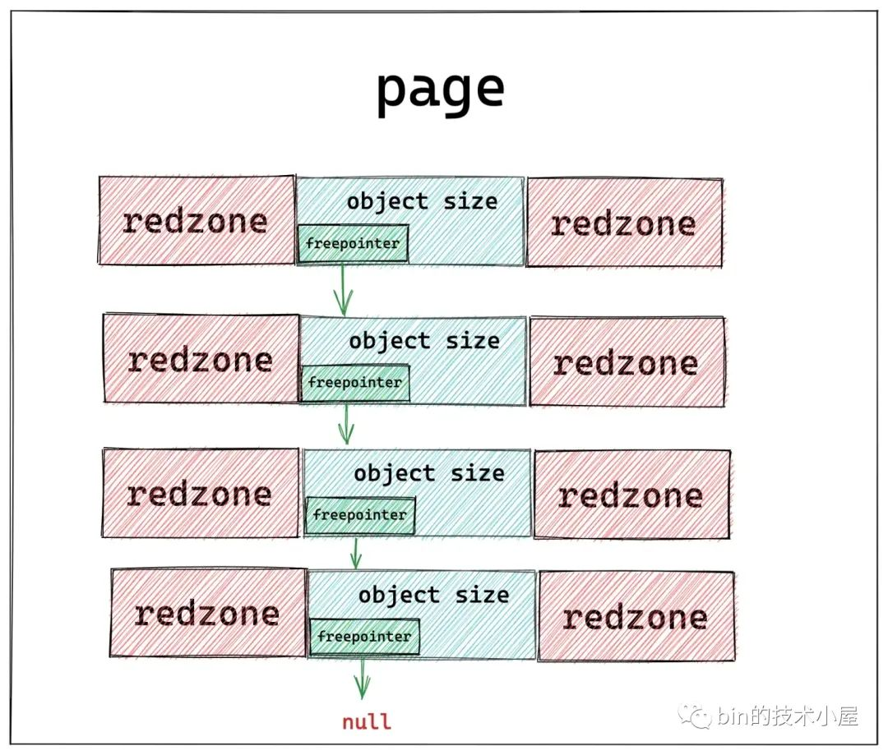

如果我们设置了 SLAB\_STORE\_USER，表示我们期望跟踪 slab 对象的分配与释放相关的信息，而这些跟踪信息内核使用一个 struct track 结构来存储。

所以在这种情况下，内核需要在目前 slab 对象的内存区域后面额外增加两个 `sizeof(struct track)` 大小的区域出来，用来分别存储 slab 对象的分配和释放信息。

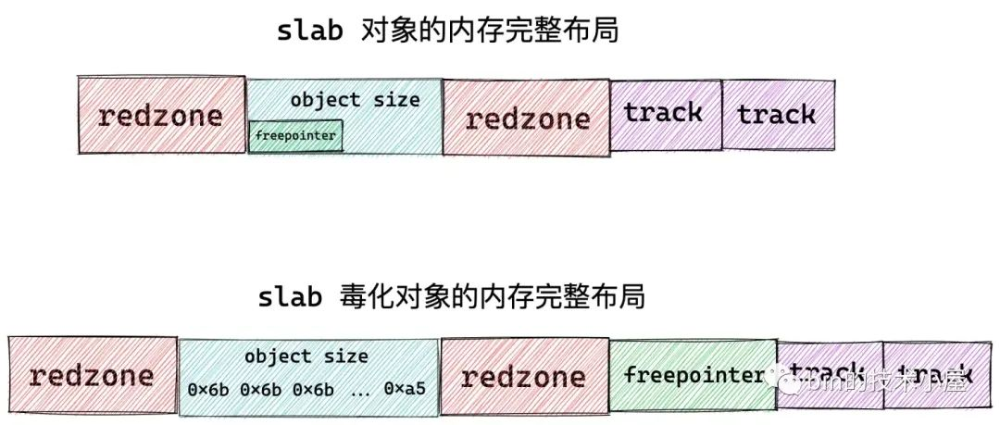

如果我们设置了 SLAB\_RED\_ZONE，最后，还需要再 slab 对象内存区域的左侧填充一段 red\_left\_pad 大小的内存区域作为左侧 red zone。另外还需要再 slab 对象内存区域的末尾再次填充一段 word size 大小的内存区域作为 padding 部分。

> 右侧 red zone，在本小节开始的地方已经被填充了。

        if (flags & SLAB_RED_ZONE) {
            size += sizeof(void *);
            s->red_left_pad = sizeof(void *);
            s->red_left_pad = ALIGN(s->red_left_pad, s->align);
            size += s->red_left_pad;
        }

现在关于 slab 对象内存布局的全部内容，我们就介绍完了，最终我们得到了 slab 对象真实占用内存大小 size，内核会根据这个 size，在物理内存页中划分出一个一个的对象出来。

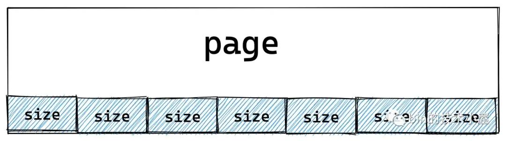

那么一个 slab 到底需要多少个物理内存页呢？内核会通过 calculate\_order 函数根据一定的算法计算出一个合理的 order 值。这个过程笔者后面会细讲，现在我们主要关心整体流程。

slab 所需的物理内存页个数计算出来之后，内核会根据 slab 对象占用内存的大小 size，计算出一个 slab 可以容纳的对象个数。并将这个结果保存在 kmem\_cache 结构中的 `oo` 属性中。

    s->oo = oo_make(order, size);

    struct kmem_cache {
        // 表示 cache 中的 slab 大小，包括 slab 所申请的页面个数，以及所包含的对象个数
        // 其中低 16 位表示一个 slab 中所包含的对象总数，高 16 位表示一个 slab 所占有的内存页个数。
        struct kmem_cache_order_objects oo;
    }

内核会通过 struct kmem\_cache\_order\_objects 这样一个结构来保存 slab 所需要的物理内存页个数以及 slab 所能容纳的对象个数，其中 kmem\_cache\_order\_objects 的高 16 位保存 slab 所需要的物理内存页个数，低 16 位保存 slab 所能容纳的对象个数。

    #define OO_SHIFT    16
    
    struct kmem_cache_order_objects {
         // 高 16 为存储 slab 所需的内存页个数,低 16 为存储 slab 所能包含的对象总数
        unsigned int x;
    };
    
    static inline struct kmem_cache_order_objects oo_make(unsigned int order,
            unsigned int size)
    {
        struct kmem_cache_order_objects x = {
            // 高 16 为存储 slab 所需的内存页个数,低 16 为存储 slab 所能包含的对象总数
            (order << OO_SHIFT) + order_objects(order, size)
        };
    
        return x;
    }
    
    static inline unsigned int order_objects(unsigned int order, unsigned int size)
    {
        // 根据 slab 中包含的物理内存页个数以及对象的 size，计算 slab 可容纳的对象个数
        return ((unsigned int)PAGE_SIZE << order) / size;
    }
    
    static inline unsigned int oo_order(struct kmem_cache_order_objects x)
    {
        // 获取高 16 位，slab 中所需要的内存页 order
        return x.x >> OO_SHIFT;
    }
    
    // 十进制为：65535，二进制为：16 个 1，用于截取低 16 位
    #define OO_MASK     ((1 << OO_SHIFT) - 1) 
    
    static inline unsigned int oo_objects(struct kmem_cache_order_objects x)
    {
        // 获取低 16 位，slab 中能容纳的对象个数
        return x.x & OO_MASK;
    }

随后内核会通过 get\_order 函数来计算，容纳**一个** size 大小的对象所需要的最少物理内存页个数。用这个值作为 kmem\_cache 结构中的 min 属性。

    s->min = oo_make(get_order(size), size);

    struct kmem_cache {
     struct kmem_cache_order_objects min;
    }

内核在创建 slab 的时候，最开始会按照 oo 指定的尺寸来向伙伴系统申请内存页，如果内存紧张，申请内存失败。那么内核会降级采用 min 的尺寸再次向伙伴系统申请内存。也就是说 slab 中至少会包含一个对象。

最后会设置 max 的值，从源码中我们可以看到 max 的值与 oo 的值是相等的

      if (oo_objects(s->oo) > oo_objects(s->max))
            // 初始时 max 和 oo 相等
            s->max = s->oo;

到现在为止，笔者在本文 《6.1 slab 的基础信息管理》小节中介绍的 kmem\_cache 结构相关的重要属性就全部设置完成了。

### 7\. 计算 slab 所需要的 page 个数

一个 slab 究竟需要多少个物理内存页就是在这里计算出来的，这里内核会根据一定的算法，尽量保证 slab 中的内存碎片最小化，综合计算出一个合理的 order 值。下面我们来一起看下这个计算逻辑：

    static unsigned int slub_min_order;
    static unsigned int slub_max_order = PAGE_ALLOC_COSTLY_ORDER;// 3
    static unsigned int slub_min_objects;
    
    static inline int calculate_order(unsigned int size)
    {
        unsigned int order;
        unsigned int min_objects;
        unsigned int max_objects;
    
        // 计算 slab 中可以容纳的最小对象个数
        min_objects = slub_min_objects;
        if (!min_objects)
            // nr_cpu_ids 表示当前系统中的 cpu 个数
            // fls 可以获取参数的最高有效 bit 的位数，比如 fls(0)=0，fls(1)=1，fls(4) = 3
            // 如果当前系统中有4个cpu，那么 min_object 的初始值为 4*(3+1) = 16 
            min_objects = 4 * (fls(nr_cpu_ids) + 1);
        // slab 最大内存页 order 初始为 3，计算 slab 最大可容纳的对象个数
        max_objects = order_objects(slub_max_order, size);
        min_objects = min(min_objects, max_objects);
    
        while (min_objects > 1) {
            // slab 中的碎片控制系数，碎片大小不能超过 (slab所占内存大小 / fraction)
            // fraction 值越大，slab 中所能容忍的碎片就越小
            unsigned int fraction;
    
            fraction = 16;
            while (fraction >= 4) {
                // 根据当前 fraction 计算 order，需要查找出能够使 slab 产生碎片最小化的 order 值出来
                order = slab_order(size, min_objects,
                        slub_max_order, fraction);
                 // order 不能超过 max_order，否则需要降低 fraction，放宽对碎片的要求限制，重新循环计算
                if (order <= slub_max_order)
                    return order;
                fraction /= 2;
            }
            // 进一步放宽对 min_object 的要求，slab 会尝试少放一些对象
            min_objects--;
        }
    
        // 经过前边 while 循环的计算，我们无法在这一个 slab 中放置多个 size 大小的对象，因为 min_object = 1 的时候就退出循环了。
        // 那么下面就会尝试看能不能只放入一个对象
        order = slab_order(size, 1, slub_max_order, 1);
        if (order <= slub_max_order)
            return order;
        // 流程到这里表示，我们要池化的对象 size 太大了，slub_max_order 都放不下
        // 现在只能放宽对 max_order 的限制到 MAX_ORDER = 11
        order = slab_order(size, 1, MAX_ORDER, 1);
        if (order < MAX_ORDER)
            return order;
        return -ENOSYS;
    }

首先内核会计算出 slab 需要容纳对象的最小个数 min\_objects，计算公式： `min_objects = 4 * (fls(nr_cpu_ids) + 1)`：

-   nr\_cpu\_ids 表示当前系统中的 cpu 个数
    
-   fls 获取参数二进制形式的最高有效 bit 的位数，比如 fls(0)=0，fls(1)=1，fls(4) = 3
    

这里我们看到 min\_objects 是和当前系统中的 cpu 个数有关系的。

内核规定 slab 所需要的物理内存页个数的最大值 slub\_max\_order 初始化为 3，也就是 slab 最多只能向伙伴系统中申请 8 个内存页。

根据这里的 slub\_max\_order 和 slab 对象的 size 通过 order\_objects 函数计算出 slab 所能容纳对象的最大值。

slab 所能容纳的对象个数越多，那么所需要的物理内存页就越多，slab 所能容纳的对象个数越少，那么所需要的物理内存页就越少。

内核通过刚刚计算出的 min\_objects 可以计算出 slab 所需要的最小内存页个数，我们暂时称为 min\_order。

随后内核会遍历 min\_order 与 slub\_max\_order 之间的所有 order 值，直到找到满足内存碎片限制要求的一个 order。

那么内核对于内存碎片限制的要求具体如何定义呢？

内核会定义一个 fraction 变量作为 slab 内存碎片的控制系数，内核要求 slab 中内存碎片大小不能超过 `(slab所占内存大小 / fraction)`，fraction 的值越大，表示 slab 中所能容忍的内存碎片就越小。fraction 的初始值为 16。

在内核寻找最佳合适 order 的过程中，最高优先级是要将内存碎片控制在一个非常低的范围内，在这个基础之上，遍历 min\_order 与 slub\_max\_order 之间的所有 order 值，看他们产生碎片的大小是否低于 `(slab所占内存大小 / fraction)` 的要求。如果满足，那么这个 order 就是最终的计算结果，后续 slab 会根据这个 order 值向伙伴系统申请物理内存页。这个逻辑封装在 slab\_order 函数中。

如果内核遍历完一遍 min\_order 与 slub\_max\_order 之间的所有 order 值均不符合内存碎片限制的要求，那么内核只能尝试放宽对内存碎片的要求，将 fraction 调小一些——`fraction /= 2` ，再次重新遍历所有 order。但 fraction 系数最低不能低于 4。

如果 fraction 系数低于 4 了，说明内核已经将碎片限制要求放到最宽了，在这么宽松的条件下依然无法找到一个满足限制要求的 order 值，那么内核会在近一步的降级，放宽对 min\_objects 的要求——`min_objects--`，尝试在 slab 中少放一些对象。fraction 系数恢复为 16，在重新遍历，尝试查找符合内存碎片限制要求的 order 值。

最极端的情况就是，无论内核怎么放宽对内存碎片的限制，无论怎么放宽 slab 中容纳对象的最小个数要求，内核始终无法找到一个 order 值能够满足如此宽松的内存碎片限制条件。当 min\_objects == 1 的时候就会退出 `while (min_objects > 1)` 循环停止寻找。

最终内核的托底方案是将 min\_objects 调整为 1，fraction 调整为 1，再次调用 slab\_order ，这里的语义是：在这种极端的情况下，slab 中最少只能容纳一个对象，那么内核就分配容纳一个对象所需要的内存页。

如果 slab 对象太大了，有可能突破了 slub\_max\_order = 3 的限制，内核会近一步放宽至 MAX\_ORDER = 11，这里我们可以看出内核的决心，无论如何必须保证 slab 中至少容纳一个对象。

下面是 slab\_order 函数的逻辑，它是整个计算过程的核心：

    // 一个 page 最多允许存放 32767 个对象
    #define MAX_OBJS_PER_PAGE	32767
    
    static inline unsigned int slab_order(unsigned int size,
            unsigned int min_objects, unsigned int max_order,
            unsigned int fract_leftover)
    {
        unsigned int min_order = slub_min_order;
        unsigned int order;
    
        // 如果 2^min_order个内存页可以存放的对象个数超过 32767 限制
        // 那么返回 size * MAX_OBJS_PER_PAGE 所需要的 order 减 1
        if (order_objects(min_order, size) > MAX_OBJS_PER_PAGE)
            return get_order(size * MAX_OBJS_PER_PAGE) - 1;
    
        // 从 slab 所需要的最小 order 到最大 order 之间开始遍历，查找能够使 slab 碎片最小的 order 值
        for (order = max(min_order, (unsigned int)get_order(min_objects * size));
                order <= max_order; order++) {
            // slab 在当前 order 下，所占用的内存大小
            unsigned int slab_size = (unsigned int)PAGE_SIZE << order;
            unsigned int rem;
            // slab 的碎片大小：分配完 object 之后，所产生的碎片大小
            rem = slab_size % size;
            // 碎片大小 rem 不能超过 slab_size / fract_leftover 即符合要求
            if (rem <= slab_size / fract_leftover)
                break;
        }
    
        return order;
    }

`get_order(size)` 函数的逻辑就比较简单了，它不会像 calculate\_order 函数那样复杂，不需要考虑内存碎片的限制。它的逻辑只是简单的计算分配一个 size 大小的对象所需要的最少内存页个数，用于在 calculate\_sizes 函数的最后计算 kmem\_cache 结构的 min 值。

    s->min = oo_make(get_order(size), size);

get\_order 函数的计算逻辑如下：

-   如果给定的 size 在 \[0，PAGE\_SIZE\] 之间，那么 order = 0 ，需要一个内存页面即可。
-   size 在 \[PAGE\_SIZE + 1， 2^1 \* PAGE\_SIZE\] 之间， order = 1
-   size 在 \[2^1 \* PAGE\_SIZE + 1， 2^2 \* PAGE\_SIZE\] 之间， order = 2
-   size 在 \[2^2 \* PAGE\_SIZE + 1， 2^3 \* PAGE\_SIZE\] 之间， order = 3
-   size 在 \[2^3 \* PAGE\_SIZE + 1， 2^4 \* PAGE\_SIZE\] 之间， order = 4

    // 定义在文件 /include/asm-generic/getorder.h
    // 该函数的主要作用就是根据给定的 size 计算出所需最小的 order
    static inline __attribute_const__ int get_order(unsigned long size)
    {
        if (__builtin_constant_p(size)) {
            if (!size)
                return BITS_PER_LONG - PAGE_SHIFT;
    
            if (size < (1UL << PAGE_SHIFT))
                return 0;
        
            return ilog2((size) - 1) - PAGE_SHIFT + 1;
        }
        
        size--;
        size >>= PAGE_SHIFT;
    #if BITS_PER_LONG == 32
        return fls(size);
    #else
        return fls64(size);
    #endif
    }
    

现在，一个 slab 所需要的内存页个数的计算过程，笔者就为大家交代完毕了，下面我们来看一下 kmem\_cache 结构的其他属性的初始化过程。

### 8\. set\_min\_partial

该函数的主要目的是为了计算 slab cache 在 NUMA 节点缓存 kmem\_cache\_node->partial 链表中的 slab 个数上限，超过该值，空闲的 empty slab 则会被回收至伙伴系统中。

kmem\_cache 结构中的 min\_partial 初始值为 `min = ilog2(s->size) / 2`，需要保证 min\_partial 的值在 \[5,10\] 的范围之内。

    #define MIN_PARTIAL 5
    #define MAX_PARTIAL 10
    
    // 计算 slab cache 在 node 中缓存的个数，kmem_cache_node 中 partial 列表中 slab 个数的上限 min_partial
    // 超过该值，空闲的 slab 就会被回收
    // 初始 min = ilog2(s->size) / 2，必须保证 min_partial 的值 在 [MIN_PARTIAL,MAX_PARTIAL] 之间
    static void set_min_partial(struct kmem_cache *s, unsigned long min)
    {
        if (min < MIN_PARTIAL)
            min = MIN_PARTIAL;
        else if (min > MAX_PARTIAL)
            min = MAX_PARTIAL;
        s->min_partial = min;
    }

### 9\. set\_cpu\_partial

这里会设置 kmem\_cache 结构的 cpu\_partial 属性，该值限制了 slab cache 在 cpu 本地缓存的 partial 列表中所能容纳的最大空闲对象个数。

同时该值也决定了当 kmem\_cache\_cpu->partial 链表为空时，内核会从 kmem\_cache\_node->partial 链表填充 `cpu_partial / 2` 个 slab 到 kmem\_cache\_cpu->partial 链表中。相关详细内容可回顾上篇文章[《细节拉满，80 张图带你一步一步推演 slab 内存池的设计与实现》](https://mp.weixin.qq.com/s?__biz=Mzg2MzU3Mjc3Ng==&mid=2247487996&idx=1&sn=12f62cfcfcc89ffcbbd1b7e4fa286940&chksm=ce77d7bbf9005ead3d4a953e470dba6b4708573a785e21f8f184f1c1fb6b3fed67a742b020d4&token=686517084&lang=zh_CN#rd) 中的 《7.3 从 NUMA 节点缓存中分配》小节。

set\_cpu\_partial 函数的逻辑也很简单，就是根据上篇文章 《6 slab 对象的内存布局》小节中计算出的 slab 对象 size 大小来决定 cpu\_partial 的值。

    static void set_cpu_partial(struct kmem_cache *s)
    {
    // 当配置了 CONFIG_SLUB_CPU_PARTIAL，则 slab cache 的 cpu 本地缓存 kmem_cache_cpu 中包含 partial 列表
    #ifdef CONFIG_SLUB_CPU_PARTIAL
        // 判断 kmem_cache_cpu 是否包含有 partial 列表
        if (!kmem_cache_has_cpu_partial(s))
            s->cpu_partial = 0;
        else if (s->size >= PAGE_SIZE)
            s->cpu_partial = 2;
        else if (s->size >= 1024)
            s->cpu_partial = 6;
        else if (s->size >= 256)
            s->cpu_partial = 13;
        else
            s->cpu_partial = 30;
    #endif
    }

### 10\. init\_kmem\_cache\_nodes

到现在为止，kmem\_cache 结构中的所有重要属性就已经初始化完毕了，slab cache 的创建过程也进入了尾声，最后内核需要为 slab cache 创建本地 cpu 缓存结构以及 NUMA 节点缓存结构

本小节的主要内容就是内核如何为 slab cache 创建其在 NUMA 节点中的缓存结构 ：

    struct kmem_cache {
        // slab cache 中 numa node 中的缓存，每个 node 一个
        struct kmem_cache_node *node[MAX_NUMNODES];
    }

slab cache 在每个 NUMA 节点中都有自己的缓存结构 kmem\_cache\_node，init\_kmem\_cache\_nodes 函数需要遍历所有的 NUMA 节点，并利用 struct kmem\_cache\_node 专属的 slab cache —— 全局变量 kmem\_cache\_node，分配一个 kmem\_cache\_node 对象，并调用 init\_kmem\_cache\_node 对其进行初始化。

    static int init_kmem_cache_nodes(struct kmem_cache *s)
    {
        int node;
        // 遍历所有的 numa 节点，为 slab cache 创建 node cache
        for_each_node_state(node, N_NORMAL_MEMORY) {
            struct kmem_cache_node *n;
    
            if (slab_state == DOWN) {
                // 如果此时 slab allocator 体系还未建立，则调用该方法分配 kmem_cache_node 结构，并初始化。
                // slab cache 的正常创建流程不会走到这个分支，该分支用于在内核初始化的时候创建 kmem_cache_node 对象池使用
                early_kmem_cache_node_alloc(node);
                continue;
            }
            // 为 node cache 分配对应的 kmem_cache_node 对象
            // kmem_cache_node 对象也由它对应的 slab cache 管理
            n = kmem_cache_alloc_node(kmem_cache_node,
                            GFP_KERNEL, node);
            // 初始化 node cache
            init_kmem_cache_node(n);
            // 初始化 slab cache 结构 kmem_cache 中的 node 数组
            s->node[node] = n;
        }
        return 1;
    }

    static void
    init_kmem_cache_node(struct kmem_cache_node *n)
    {
        n->nr_partial = 0;
        spin_lock_init(&n->list_lock);
        INIT_LIST_HEAD(&n->partial);
    #ifdef CONFIG_SLUB_DEBUG
        atomic_long_set(&n->nr_slabs, 0);
        atomic_long_set(&n->total_objects, 0);
        INIT_LIST_HEAD(&n->full);
    #endif
    }

### 11\. alloc\_kmem\_cache\_cpus

这里主要是为 slab cache 创建其 cpu 本地缓存结构 kmem\_cache\_cpu，每个 cpu 一个这样的结构，并调用 `per_cpu_ptr` 将创建好的 kmem\_cache\_cpu 结构与对应的 cpu 相关联初始化。

    struct kmem_cache {
        // 每个 cpu 拥有一个本地缓存，用于无锁化快速分配释放对象
        struct kmem_cache_cpu __percpu *cpu_slab;
    }

    static inline int alloc_kmem_cache_cpus(struct kmem_cache *s)
    {
        // 为 slab cache 分配 cpu 本地缓存结构 kmem_cache_cpu
        // __alloc_percpu 函数在内核中专门用于分配 percpu 类型的结构体（the percpu allocator）
        //  kmem_cache_cpu 结构也是 percpu 类型的，这里通过 __alloc_percpu 直接分配
        s->cpu_slab = __alloc_percpu(sizeof(struct kmem_cache_cpu),
                         2 * sizeof(void *));
        // 初始化 cpu 本地缓存结构 kmem_cache_cpu
        init_kmem_cache_cpus(s);
        return 1;
    }

    static void init_kmem_cache_cpus(struct kmem_cache *s)
    {
        int cpu;
        // 遍历所有CPU，通过 per_cpu_ptr 将前面分配的 kmem_cache_cpu 结构与对应的CPU关联对应起来
        // 同时初始化 kmem_cache_cpu 变量里面的 tid 为其所关联 cpu 的编号
        for_each_possible_cpu(cpu)
            per_cpu_ptr(s->cpu_slab, cpu)->tid = init_tid(cpu);
    }

至此，slab cache 的整个骨架就全部被创建出来了，最终得到的 slab cache 完整架构如下图所示：

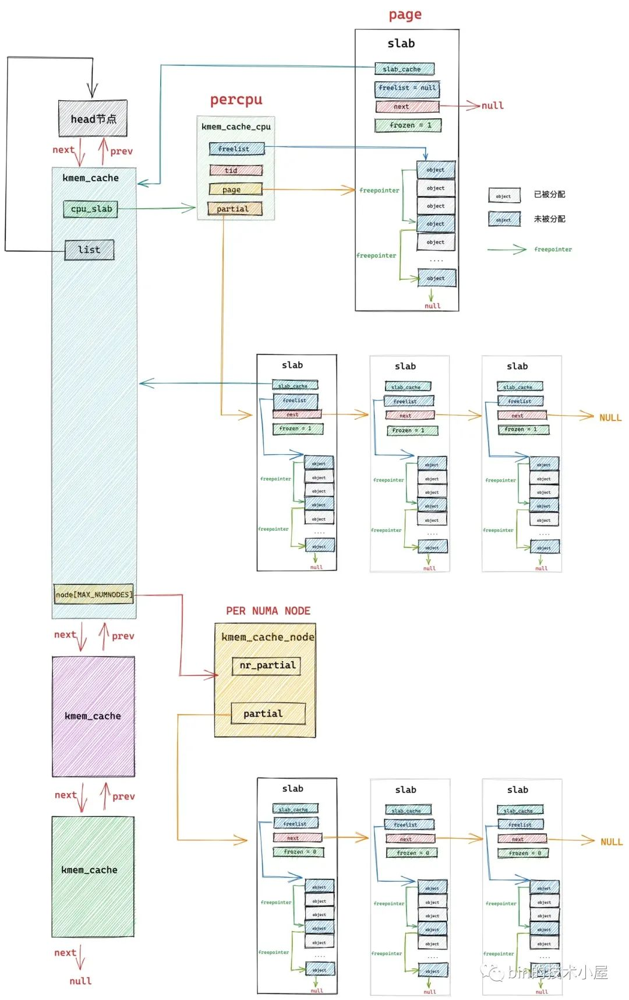

最后，我们可以结合上面的 slab cache 架构图与下面这副 slab cache 创建流程图加以对比，回顾总结。

### 12\. 内核第一个 slab cache 是如何被创建出来的

在上小节介绍 slab cache 的创建过程中，笔者其实暗暗地埋下了一个伏笔，不知道，大家有没有发现，在 slab cache 创建的过程中需要创建两个特殊的数据结构：

-   一个是 slab cache 自身的管理结构 struct kmem\_cache。
    
-   另一个是 slab cache 在 NUMA 节点中的缓存结构 struct kmem\_cache\_node。
    

而 struct kmem\_cache 和 struct kmem\_cache\_node 同样也都是内核的核心数据结构，他俩各自也有一个专属的 slab cache 来管理 kmem\_cache 对象和 kmem\_cache\_node 对象的分配与释放。

    // 全局变量，用于专门管理 kmem_cache 对象的 slab cache
    // 定义在文件：/mm/slab_common.c
    struct kmem_cache *kmem_cache;
    
    // 全局变量，用于专门管理 kmem_cache_node 对象的 slab cache
    // 定义在文件：/mm/slub.c
    static struct kmem_cache *kmem_cache_node;

> slab cache 的 cpu 本地缓存结构 struct kmem\_cache\_cpu 是一个 percpu 类型的变量，由 `__alloc_percpu`直接创建，并不需要一个专门的 slab cache 来管理。

在 slab cache 的创建过程中，内核首先需要向 struct kmem\_cache 结构专属的 slab cache 申请一个 kmem\_cache 对象。

    static struct kmem_cache *create_cache(const char *name,
            unsigned int object_size, unsigned int align,
            slab_flags_t flags, unsigned int useroffset,
            unsigned int usersize, void (*ctor)(void *),
            struct mem_cgroup *memcg, struct kmem_cache *root_cache)
    {
        struct kmem_cache *s;
        s = kmem_cache_zalloc(kmem_cache, GFP_KERNEL);
    
                      ......... 省略 .........
    }

当 kmem\_cache 对象初始化完成之后，内核需要向 struct kmem\_cache\_node 结构专属的 slab cache 申请一个 kmem\_cache\_node 对象，作为 slab cache 在 NUMA 节点中的缓存结构。

    static int init_kmem_cache_nodes(struct kmem_cache *s)
    {
        int node;
        // 遍历所有的 numa 节点，为 slab cache 创建 node cache
        for_each_node_state(node, N_NORMAL_MEMORY) {
            struct kmem_cache_node *n;
    
                    ......... 省略 .........
    
            n = kmem_cache_alloc_node(kmem_cache_node,
                            GFP_KERNEL, node);
            init_kmem_cache_node(n);
            s->node[node] = n;
        }
        return 1;
    }

那么问题来了，`kmem_cache` 和 `kmem_cache_node` 这两个 slab cache 是怎么来的？

因为他俩本质上是一个 slab cache，而 slab cache 的创建又需要 `kmem_cache` （slab cache）和 `kmem_cache_node` （slab cache），当系统中第一个 slab cache 被创建的时候，此时并没有 `kmem_cache` （slab cache），也没有 `kmem_cache_node` （slab cache），这就变成死锁了，是一个先有鸡还是先有蛋的问题。

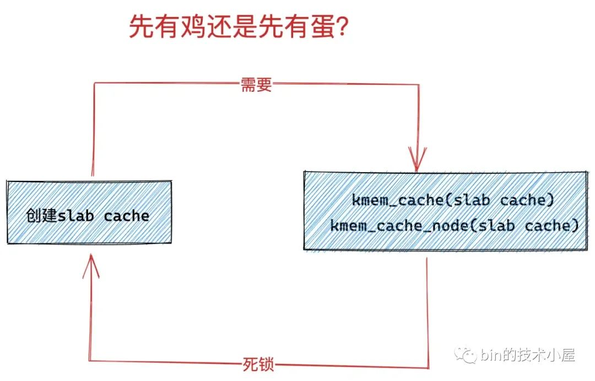

那么内核是如何来解决这个先有鸡还是先有蛋的问题呢？让我们先把思绪拉回到内核启动的阶段~~~

#### 12.1 slab allocator 体系的初始化

内核启动的核心初始化逻辑封装 `/init/main.c` 文件的 start\_kernel 函数中，在这里会初始化内核的各个子系统，内存管理子系统的初始化工作就在这里，封装在 mm\_init 函数里。

在 mm\_init 函数中会初始化内核的 slab allocator 体系 —— kmem\_cache\_init()。

    asmlinkage __visible void __init start_kernel(void)
    {     
          ........ 省略 .........
          // 初始化内存管理子系统
          mm_init();
          
          ........ 省略 .........
    }
    
    /*
     * Set up kernel memory allocators
     */
    static void __init mm_init(void)
    {
          ........ 省略 .........
          // 创建并初始化 slab allocator 体系
          kmem_cache_init();
    
          ........ 省略 .........
    }

而内核解决这个 “先有鸡还是先有蛋” 问题的秘密就藏在 `/mm/slub.c` 文件的 kmem\_cache\_init 函数中。

内核首先会定义两个静态的 `static __initdata struct kmem_cache` 结构 boot\_kmem\_cache，boot\_kmem\_cache\_node ，用于在内核初始化内存管理子系统的时候**临时静态地**创建 kmem\_cache（slab cache）和 kmem\_cache\_node （slab cache）所需要的 **struct kmem\_cache 和 struct kmem\_cache\_node 结构**。

这样一来，内核就通过这两个临时的静态 kmem\_cache 结构 ：boot\_kmem\_cache，boot\_kmem\_cache\_node 打破了死锁的循环等待条件。

当这两个临时的 boot\_kmem\_cache，boot\_kmem\_cache\_node 被创建初始化之后，随后内核会通过 bootstrap 将这两个临时 slab cache 深拷贝到全局变量 kmem\_cache（slab cache）和 kmem\_cache\_node （slab cache）中。

从此，内核就有了正式的 kmem\_cache（slab cache）和 kmem\_cache\_node （slab cache），后续就可以按照正常流程**动态地**创建 slab cache 了，正常的创建流程就是笔者在本文前边几个小节中为大家介绍的内容。

下面我们来一起看下 slab allocator 体系的初始化过程：

    // 全局变量，用于专门管理 kmem_cache 对象的 slab cache
    // 定义在文件：/mm/slab_common.c
    struct kmem_cache *kmem_cache;
    
    // 全局变量，用于专门管理 kmem_cache_node 对象的 slab cache
    // 定义在文件：/mm/slub.c
    static struct kmem_cache *kmem_cache_node;
    
    void __init kmem_cache_init(void)
    {
        // slab allocator 体系结构中最核心的就是 kmem_cache 结构和 kmem_cache_node 结构，而这两个结构同时又被各自的 slab cache 所管理
        // 而现在 slab allocator 体系还未创建，所以需要利用两个静态的结构来创建kmem_cache，kmem_cache_node 对象
        // 这里就是定义两个 kmem_cache 类型的静态局部变量（静态结构）：内核启动的时候被加载进 BSS 段中，随后会为其分配内存。
        // boot_kmem_cache 用于临时创建 kmem_cache 结构。
        // boot_kmem_cache_node 用于临时创建 kmem_cache_node 结构
        // boot_kmem_cache 和 boot_kmem_cache_node 现在只是两个空的结构，需要静态的进行初始化。
        static __initdata struct kmem_cache boot_kmem_cache,
            boot_kmem_cache_node;
    
        // 暂时先将这两个静态结构赋值给对应的全局变量，后面会初始化这两个全局变量
        kmem_cache_node = &boot_kmem_cache_node;
        kmem_cache = &boot_kmem_cache;
    
        // 静态地初始化 boot_kmem_cache_node 
        // 从这里可以看出 slab体系，建立的第一个 slab cache 就是 kmem_cache_node(slab cache)
        create_boot_cache(kmem_cache_node, "kmem_cache_node",
            sizeof(struct kmem_cache_node), SLAB_HWCACHE_ALIGN, 0, 0);
    
        // 当 kmem_cache_node （slab cache）被创建初始化之后，slab_state 变为 PARTIAL
        // 这个状态表示目前 kmem_cache_node cache已经创建完毕，可以利用它动态分配 kmem_cache_node 对象了。
        slab_state = PARTIAL;
    
        // 静态地初始化 boot_kmem_cache
        // 从这里可以看出 slab 体系，建立的第二个 slab cache 就是 kmem_cache(slab cache)
        create_boot_cache(kmem_cache, "kmem_cache",
                offsetof(struct kmem_cache, node) +
                    nr_node_ids * sizeof(struct kmem_cache_node *),
                   SLAB_HWCACHE_ALIGN, 0, 0);
    
        // 流程到这里，两个静态的 kmem_cache 结构：boot_kmem_cache，boot_kmem_cache_node 就已经初始化完毕了。
        // 但是这两个静态结构只是临时的，目的是为了在 slab 体系初始化阶段静态的创建 kmem_cache 对象和 kmem_cache_node 对象。
        // 在 bootstrap 中会将 boot_kmem_cache，boot_kmem_cache_node 中的内容深拷贝到最终的 kmem_cache（slab cache），kmem_cache_node（slab cache）中。
        // 后面我们就可以利用这两个最终的核心结构来动态的进行 slab 创建。
        kmem_cache = bootstrap(&boot_kmem_cache);
        kmem_cache_node = bootstrap(&boot_kmem_cache_node);
    
        ........ 省略 kmalloc 相关初始化过程 .........
    }

初始化 slab allocator 体系的核心就是如何静态的创建和初始化这两个静态的 slab cache： boot\_kmem\_cache，boot\_kmem\_cache\_node。

这个核心逻辑封装在 create\_boot\_cache 函数中，大家需要注意该函数第一个参数 `struct kmem_cache *s`，参数 s 指向的是上面两个临时的静态的 slab cache。现在是内核初始化阶段，当前系统中并不存在一个正式完整的 slab cache，这一点大家在阅读本小节的时候要时刻注意。

    /* Create a cache during boot when no slab services are available yet */
    void __init create_boot_cache(struct kmem_cache *s, const char *name,
            unsigned int size, slab_flags_t flags,
            unsigned int useroffset, unsigned int usersize)
    {
        int err;
        unsigned int align = ARCH_KMALLOC_MINALIGN;
    
        // 下面就是静态初始化 kmem_cache 结构的逻辑
        // 挨个对 kmem_cache 结构的核心属性进行静态赋值
        s->name = name;
        s->size = s->object_size = size;
    
        if (is_power_of_2(size))
            align = max(align, size);
        // 根据指定的对齐参数 align 以及 CPU Cache line 的大小计算出一个合适的 align 出来
        s->align = calculate_alignment(flags, align, size);
    
        s->useroffset = useroffset;
        s->usersize = usersize;
        // 这里又来到了之前介绍的创建 slab cache 的创建流程
        // 该函数是创建 slab cache 的核心函数，这里会初始化 kmem_cache 结构中的其他重要属性
        // 以及创建初始化 slab cache 中的 cpu 本地缓存 和 node 节点缓存结构
        err = __kmem_cache_create(s, flags);
        // 暂时不需要合并 merge，引用计数设置为 -1
        s->refcount = -1; 
    }

这里在对静态 kmem\_cache 结构进行简单初始化之后，内核又调用了 \_\_kmem\_cache\_create 函数，这个函数我们已经非常熟悉了，忘记的同学可以回看下本文的 《3. \_\_kmem\_cache\_create 初始化 kmem\_cache 对象》小节。

\_\_kmem\_cache\_create 函数的主要工作就是建立 slab cache 的基本骨架，包括初始化 kmem\_cache 结构中的其他重要核心属性，创建初始化本地 cpu 缓存结构以及 NUMA 节点缓存结构。

这里我们来重点看下 init\_kmem\_cache\_nodes 函数，在内核初始化静态 boot\_kmem\_cache\_node（静态 slab cache）的场景下，这里的流程逻辑与 《10. init\_kmem\_cache\_nodes》小节中介绍的会有所不同。

在 slab allocator 体系中，第一个被创建出来的 slab cache 就是这里的 boot\_kmem\_cache\_node，当前 `slab_state == DOWN`。当前流程正在创建初始化 boot\_kmem\_cache\_node，所以目前内核无法利用 boot\_kmem\_cache\_node 来动态的分配 kmem\_cache\_node 对象。

所以当创建初始化 boot\_kmem\_cache\_node 的时候，流程会进入 `if (slab_state == DOWN)` 分支，通过 early\_kmem\_cache\_node\_alloc 函数来静态分配 kmem\_cache\_node 对象。

    static int init_kmem_cache_nodes(struct kmem_cache *s)
    {
        int node;
        // 遍历所有的 numa 节点，为 slub cache 创建初始化 node cache 数组
        for_each_node_state(node, N_NORMAL_MEMORY) {
            struct kmem_cache_node *n;
            // 当 slub 在系统启动阶段初始化时，创建 kmem_cache_node cache 的时候，此时 slab_state == DOWN
            // 由于此时 kmem_cache_node cache 正在创建，所以无法利用 kmem_cache_node 所属的 slub cache 动态的分配 kmem_cache_node 对象
            // 这里会通过 early_kmem_cache_node_alloc 函数静态的分配 kmem_cache_node 对象，并初始化。
            if (slab_state == DOWN) {
                 // 创建 boot_kmem_cache_node 时会走到这个分支
                early_kmem_cache_node_alloc(node);
                continue;
            }
    
            // 当 slab 体系在初始化 boot_kmem_cache 时，这时 slab_state 为 PARTIAL，流程就会走到这里。
            // 表示此时 boot_kmem_cache_node 已经初始化，可以利用它动态的分配 kmem_cache_node 对象了
            // 这里的 kmem_cache_node 就是 boot_kmem_cache_node
            n = kmem_cache_alloc_node(kmem_cache_node,
                            GFP_KERNEL, node);
            // 初始化 kmem_cache_node 对象
            init_kmem_cache_node(n);
            // 初始化 slab cache 结构 kmem_cache 中的 node 数组
            s->node[node] = n;
        }
        return 1;
    }

在 slab allocator 体系中，第二个被创建出来的 slab cache 就 boot\_kmem\_cache，在创建初始化 boot\_kmem\_cache 的时候，slab\_state 就变为了 PARTIAL，表示 kmem\_cache\_node 结构的专属 slab cache 已经创建出来了，可以利用它来动态分配 kmem\_cache\_node 对象了。

#### 12.2 kmem\_cache\_node 结构的临时静态创建

正如前面小节中所介绍的，在 slab allocator 体系中第一个被内核创建出来的 slab cache 正是 boot\_kmem\_cache\_node，而它本身就是一个 slab cache，专门用于分配 kmem\_cache\_node 对象。

而创建一个 slab cache 最核心的就是要为其分配 struct kmem\_cache 结构 （ slab cache 在内核中的数据结构）还有就是 slab cache 在 NUMA 节点的缓存结构 kmem\_cache\_node。

而针对 struct kmem\_cache 结构内核已经通过定义静态结构 boot\_kmem\_cache\_node 解决了。

    static __initdata struct kmem_cache boot_kmem_cache_node;

而针对 kmem\_cache\_node 结构，内核中既没有定义这样一个静态数据结构，也没有一个 slab cache 专门管理，所以内核会通过这里的 early\_kmem\_cache\_node\_alloc 函数来创建 kmem\_cache\_node 对象。

注意：这里是为 boot\_kmem\_cache\_node 这个静态的 slab cache 初始化它的 NUMA 节点缓存数组。

    struct kmem_cache {
        // slab cache 中 numa node 中的缓存，每个 node 一个
        struct kmem_cache_node *node[MAX_NUMNODES];
    }

    static void early_kmem_cache_node_alloc(int node)
    {
        // slab 的本质就是一个或者多个物理内存页 page，这里用于指向 slab 所属的 page。
        // 如果 slab 是由多个物理页 page 组成（复合页），这里指向复合页的首页
        struct page *page;
        // 这里主要为 boot_kmem_cache_node 初始化它的 node cache 数组
        // 这里会静态创建指定 node 节点对应的 kmem_cache_node 结构
        struct kmem_cache_node *n;
    
        // 此时 boot_kmem_cache_node 这个 kmem_cache 结构已经初始化好了（参见第 9 小节的内容）。
        // 根据 kmem_cache 结构中的 kmem_cache_order_objects oo 属性向指定 node 节点所属的伙伴系统申请 2^order 个内存页 page
        // 这里返回复合页的首页，目的是为 kmem_cache_node 结构分配 slab，后续该 slab 会挂在 kmem_cache_node 结构中的 partial 列表中
        page = new_slab(kmem_cache_node, GFP_NOWAIT, node);
    
        // struct page 结构中的 freelist 指向 slab 中第一个空闲的对象
        // 这里的对象就是  struct kmem_cache_node 结构
        n = page->freelist;
    #ifdef CONFIG_SLUB_DEBUG
        // 根据 slab cache 中的 flag 初始化 kmem_cache_node 对象
        init_object(kmem_cache_node, n, SLUB_RED_ACTIVE);
    #endif
        // 重新设置 slab 中的下一个空闲对象。
        // 这里是获取对象 n 中的 free_pointer 指针,指向 n 的下一个空闲对象
        page->freelist = get_freepointer(kmem_cache_node, n);
        // 表示 slab 中已经有一个对象被使用了
        page->inuse = 1;
        // 这里可以看出 boot_kmem_cache_node 的 NUMA 节点缓存在这里初始化的时候
        // 内核会为每个 NUMA 节点申请一个 slab，并缓存在它的 partial 链表中
        // 并不是缓存在 boot_kmem_cache_node 的本地 cpu 缓存中
        page->frozen = 0;
        // 这里的 kmem_cache_node 指的是 boot_kmem_cache_node
        // 初始化 boot_kmem_cache_node 中的 node cache 数组
        kmem_cache_node->node[node] = n;
        // 初始化 node 节点对应的 kmem_cache_node 结构
        init_kmem_cache_node(n);
        // kmem_cache_node 结构中的 nr_slabs 计数加1，total_objects 加 page->objects
        inc_slabs_node(kmem_cache_node, node, page->objects);
        // 将新创建出来的 slab （page表示），添加到对象 n （kmem_cache_node结构）中的 partial 列表头部
        __add_partial(n, page, DEACTIVATE_TO_HEAD);
    }

当 boot\_kmem\_cache\_node 被初始化之后，它的整个结构如下图所示：

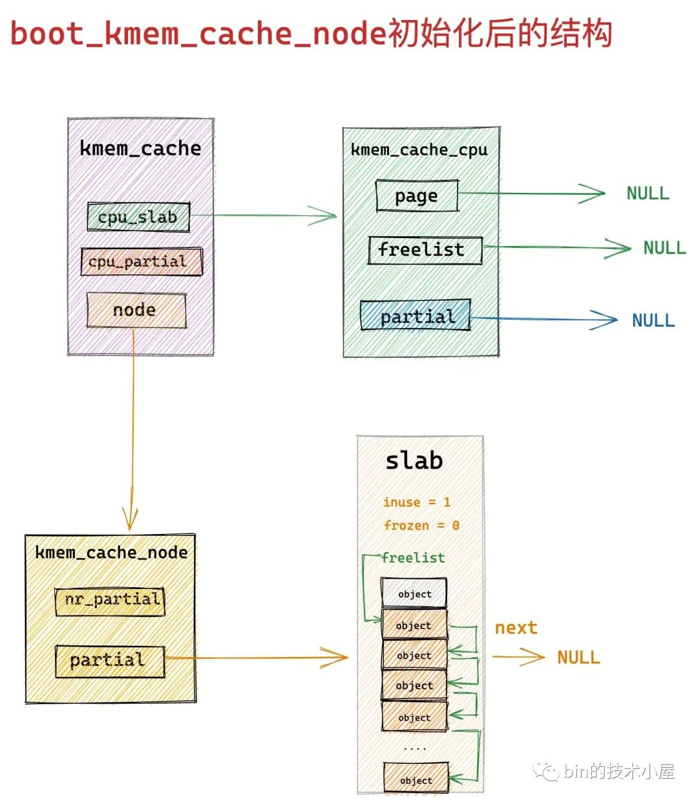

#### 12.3 将临时静态的 kmem\_cache 结构变为正式的 slab cache

流程到这里 boot\_kmem\_cache，boot\_kmem\_cache\_node 这两个静态结构就已经被初始化好了，现在内核就可以通过他们来动态的创建 kmem\_cache 对象和 kmem\_cache\_node 对象了。

但是这里的 boot\_kmem\_cache 和 boot\_kmem\_cache\_node 只是临时的 kmem\_cache 结构，目的是在 slab allocator 体系初始化的时候用于静态创建 kmem\_cache （slab cache）， kmem\_cache\_node （slab cache）。

    // 全局变量，用于专门管理 kmem_cache 对象的 slab cache
    // 定义在文件：/mm/slab_common.c
    struct kmem_cache *kmem_cache;
    
    // 全局变量，用于专门管理 kmem_cache_node 对象的 slab cache
    // 定义在文件：/mm/slub.c
    static struct kmem_cache *kmem_cache_node;

既然是临时的结构，所以这里需要创建两个最终的全局 kmem\_cache 结构，然后将这两个静态临时结构深拷贝到最终的全局 kmem\_cache 结构中。

    static struct kmem_cache * __init bootstrap(struct kmem_cache *static_cache)
    {
        int node;
        // kmem_cache 指向专门管理 kmem_cache 对象的 slab cache
        // 该 slab cache 现在已经全部初始化完毕，可以利用它动态的分配最终的 kmem_cache 对象
        struct kmem_cache *s = kmem_cache_zalloc(kmem_cache, GFP_NOWAIT);
        struct kmem_cache_node *n;
        // 将静态的 kmem_cache 对象，比如：boot_kmem_cache，boot_kmem_cache_node
        // 深拷贝到最终的 kmem_cache 对象 s 中
        memcpy(s, static_cache, kmem_cache->object_size);
    
        // 释放本地 cpu 缓存的 slab
        __flush_cpu_slab(s, smp_processor_id());
        // 遍历 node cache 数组，修正 kmem_cache_node 结构中 partial 链表中包含的 slab （ page 表示）对应 page 结构的 slab_cache 指针
        // 使其指向最终的 kmem_cache 结构，之前在 create_boot_cache 中指向的静态 kmem_cache 结构，这里需要修正
        for_each_kmem_cache_node(s, node, n) {
            struct page *p;
    
            list_for_each_entry(p, &n->partial, slab_list)
                p->slab_cache = s;
        }
        // 将最终的 kmem_cache 结构加入到全局 slab cache 链表中
        list_add(&s->list, &slab_caches);
        return s;
    }

#### 12.4 为什么要先创建 boot\_kmem\_cache\_node 而不是 boot\_kmem\_cache

现在关于 slab alloactor 体系的初始化流程笔者就为大家全部介绍完了，最后我们借用这个问题，再对这个流程做一个简单的总体回顾。

首先 slab cache 创建要依赖两个核心的数据机构，kmem\_cache，kmem\_cache\_node:

其中 kmem\_cache 结构是 slab cache 在内核中的数据结构，同样也需要被一个专门的 slab cache 所管理，但是在内核初始化阶段 slab 体系还未建立，所以内核通过定义两个局部静态变量来解决 kmem\_cache 结构的创建问题。

      static __initdata struct kmem_cache boot_kmem_cache,
            boot_kmem_cache_node;

随后内核会在 calculate\_size 函数中初始化 struct kmem\_cache 结构中的核心属性。详细内容可回顾上篇文章的 《6 slab 对象的内存布局》小节的内容。

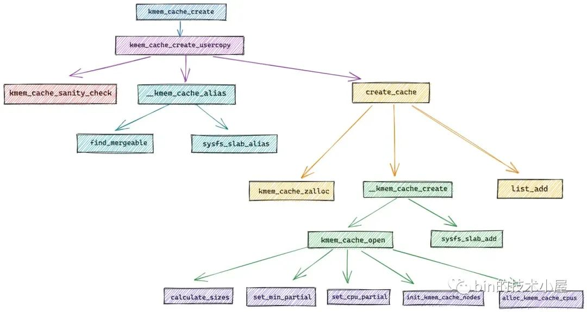

现在 kmem\_cache 结构的问题解决了，但是这两个 slab cache 中的 kmem\_cache\_node 结构的问题又来了。

所以内核决定首先创建 boot\_kmem\_cache\_node，并通过 early\_kmem\_cache\_node\_alloc 函数为 boot\_kmem\_cache\_node 创建 kmem\_cache\_node 结构。

当 boot\_kmem\_cache\_node 被创建出来之后，内核就可以动态的分配 kmem\_cache\_node 对象了。

所以最后创建 boot\_kmem\_cache，在遇到 kmem\_cache\_node 结构创建的时候，直接使用 boot\_kmem\_cache\_node 进行动态创建。

最后通过 bootstrap 将这两个临时静态的 slab cache : boot\_kmem\_cache，boot\_kmem\_cache\_node 深拷贝到最终的全局 slab cache 中：

    // 全局变量，用于专门管理 kmem_cache 对象的 slab cache
    // 定义在文件：/mm/slab_common.c
    struct kmem_cache *kmem_cache;
    
    // 全局变量，用于专门管理 kmem_cache_node 对象的 slab cache
    // 定义在文件：/mm/slub.c
    static struct kmem_cache *kmem_cache_node;

从此以后，内核就可以动态创建 slab cache 了。

### 总结

本文笔者基于内核 5.4 版本，从源码角度详细讨论了 slab cache 的创建初始化过程，创建流程如下图所示：

经过该流程的创建之后，我们得到了如下图所示的 slab cache 架构：

在这个过程中，笔者又近一步从源码角度介绍了内核具体是如何对 slab 对象进行内存布局的。

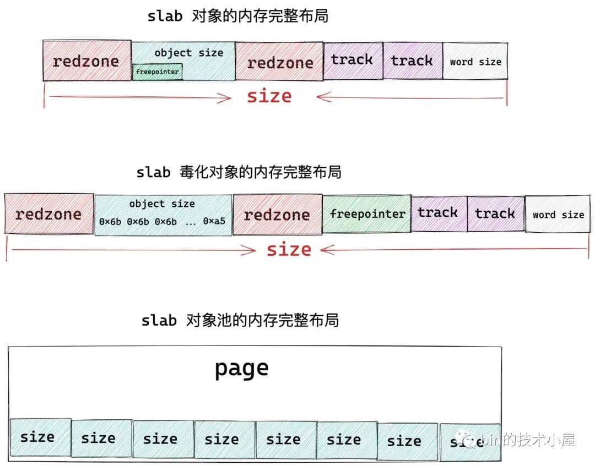

在这个内存布局的基础上，笔者又近一步展开了内核如何计算一个 slab 到底需要多少个物理内存页，以及一个 slab 到底能够容纳多少内存块的相关逻辑。

最后我们介绍了 slab cache 在内核中的数据结构 struct kmem\_cache 里的 min\_partial，cpu\_partial 的计算逻辑。以及 slab cache 的 cpu 缓存结构 cpu\_slab 以及 NUMA 节点缓存结构 node\[MAX\_NUMNODES\] 的详细初始化过程。

    /*
     * Slab cache management.
     */
    struct kmem_cache {
    
        // slab cache 在 numa node 中缓存的 slab 个数上限，slab 个数超过该值，空闲的 empty slab 则会被回收至伙伴系统
        unsigned long min_partial;
    
        // slab cache 中 numa node 中的缓存，每个 node 一个
        struct kmem_cache_node *node[MAX_NUMNODES];
    
    #ifdef CONFIG_SLUB_CPU_PARTIAL
        // 限定 slab cache 在每个 cpu 本地缓存 partial 链表中所有 slab 中空闲对象的总数
        // cpu 本地缓存 partial 链表中空闲对象的数量超过该值，则会将 cpu 本地缓存 partial 链表中的所有 slab 转移到 numa node 缓存中。
        unsigned int cpu_partial;
    
        // 每个 cpu 拥有一个本地缓存，用于无锁化快速分配释放对象
        struct kmem_cache_cpu __percpu *cpu_slab;
    #endif
    
    };

在介绍完 slab cache 的整个创建流程之后，笔者在本文的最后一个小节里又详细的为大家介绍了整个 slab allocator 体系的初始化过程，并从源码实现上，看到了内核是如何解决这个先有鸡还是先有蛋的问题

好了，本文的内容就到这里了，在下篇文章中，笔者会带大家继续深入到内核源码中，去看一下 slab cache 是如何进行内存分配的~~~

## 参考

[从内核源码看 slab 内存池的创建初始化流程_内核 slab池-CSDN博客](https://blog.csdn.net/weixin_47282449/article/details/130100907)