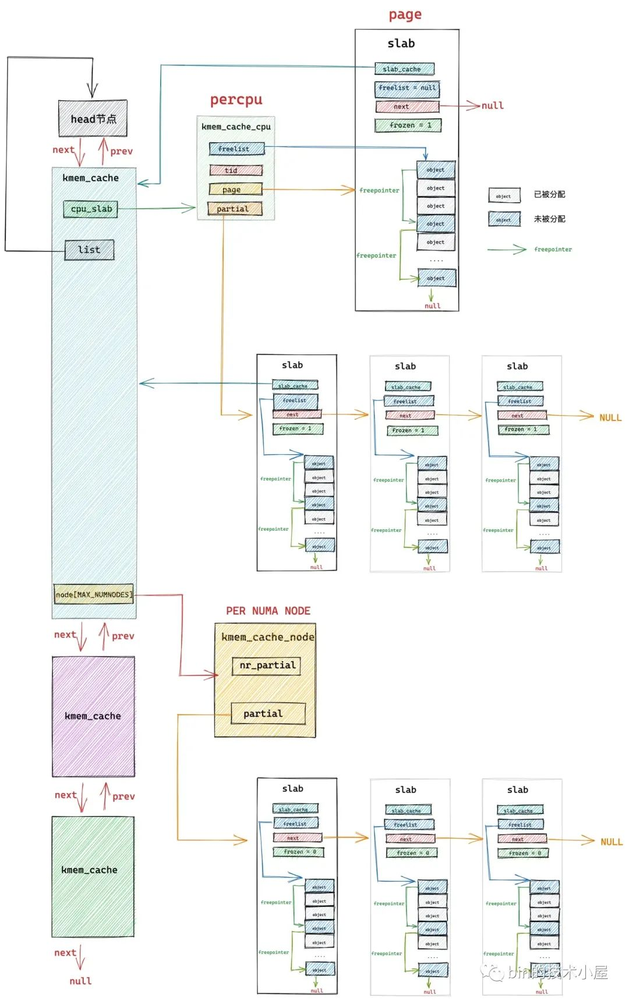
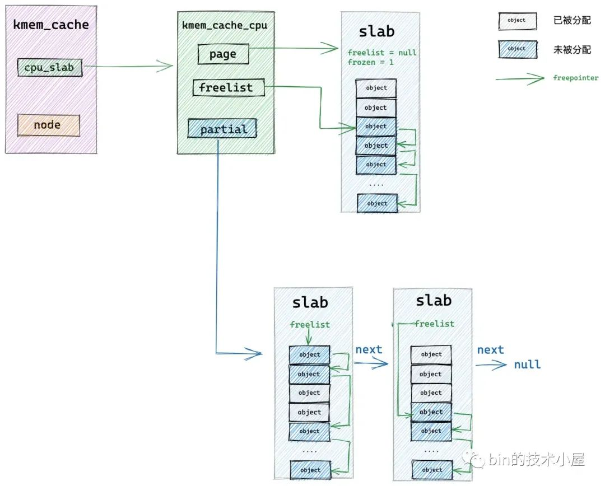
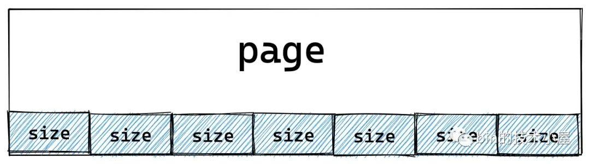

# 深入理解 slab cache 内存分配全链路实现

本文详细探讨了Linux内核slabcache的内存分配流程，包括fastpath和slowpath路径。在fastpath中，内核尝试从本地cpu缓存直接分配对象，而在slowpath中，内核会检查局部和全局缓存，如果仍无法分配，则会到伙伴系统中申请新的内存页。此外，文章还解释了slab的初始化，包括freelist链表的建立和对象的初始化。
摘要由CSDN通过智能技术生成

> 本文源码部分基于内核 5.4 版本讨论

在经过上篇文章 [《从内核源码看 slab 内存池的创建初始化流程》](https://mp.weixin.qq.com/s?__biz=Mzg2MzU3Mjc3Ng==&mid=2247488095&idx=1&sn=ffc73f33cb03f0be7cf2ab1172fdc448&chksm=ce77d418f9005d0e9d95f223f679198fd2e40377abdcaf2c636962994c3508bcd814f9929937&token=877598148&lang=zh_CN#rd) 的介绍之后，我们最终得到下面这幅 slab cache 的完整[架构图](https://so.csdn.net/so/search?q=%E6%9E%B6%E6%9E%84%E5%9B%BE&spm=1001.2101.3001.7020)：

本文笔者将带大家继续从内核源码的角度继续拆解 slab cache 的实现细节，接下来笔者会基于上面这幅 slab cache 完整架构图，详细介绍一下 slab cache 是如何进行[内存分配](https://so.csdn.net/so/search?q=%E5%86%85%E5%AD%98%E5%88%86%E9%85%8D&spm=1001.2101.3001.7020)的。

### 1\. slab cache 如何分配内存

当我们使用 fork() 系统调用创建进程的时候，内核需要为进程创建 task\_struct 结构，struct task\_struct 是内核中的核心数据结构，当然也会有专属的 slab cache 来进行管理，task\_struct 专属的 slab cache 为 task\_struct\_cachep。

下面笔者就以内核从 task\_struct\_cachep 中申请 task\_struct 对象为例，为大家剖析 slab cache 分配内存的整个源码实现。

内核通过定义在文件 `/kernel/fork.c` 中的 dup\_task\_struct 函数来为进程申请  
task\_struct 结构并初始化。

    static struct task_struct *dup_task_struct(struct task_struct *orig, int node)
    {
              ........... 
        struct task_struct *tsk;
        // 从 task_struct 对象专属的 slab cache 中申请 task_struct 对象
        tsk = alloc_task_struct_node(node);
              ...........   
    }
    
    // task_struct 对象专属的 slab cache
    static struct kmem_cache *task_struct_cachep;
    
    static inline struct task_struct *alloc_task_struct_node(int node)
    {
        // 利用 task_struct_cachep 动态分配 task_struct 对象
        return kmem_cache_alloc_node(task_struct_cachep, GFP_KERNEL, node);
    }

内核中通过 kmem\_cache\_alloc\_node 函数要求 slab cache 从指定的 NUMA 节点中分配对象。

    // 定义在文件：/mm/slub.c
    void *kmem_cache_alloc_node(struct kmem_cache *s, gfp_t gfpflags, int node)
    {
        void *ret = slab_alloc_node(s, gfpflags, node, _RET_IP_);
        return ret;
    }

    static __always_inline void *slab_alloc_node(struct kmem_cache *s,
            gfp_t gfpflags, int node, unsigned long addr)
    {
        // 用于指向分配成功的对象
        void *object;
        // slab cache 在当前 cpu 下的本地 cpu 缓存
        struct kmem_cache_cpu *c;
        // object 所在的内存页
        struct page *page;
        // 当前 cpu 编号
        unsigned long tid;
    
    redo:
        // slab cache 首先尝试从当前 cpu 本地缓存 kmem_cache_cpu 中获取空闲对象
        // 这里的 do..while 循环是要保证获取到的 cpu 本地缓存 c 是属于执行进程的当前 cpu
        // 因为进程可能由于抢占或者中断的原因被调度到其他 cpu 上执行，所需需要确保两者的 tid 是否一致
        do {
            // 获取执行当前进程的 cpu 中的 tid 字段
            tid = this_cpu_read(s->cpu_slab->tid);
            // 获取 cpu 本地缓存 cpu_slab
            c = raw_cpu_ptr(s->cpu_slab);
            // 如果开启了 CONFIG_PREEMPT 表示允许优先级更高的进程抢占当前 cpu
            // 如果发生抢占，当前进程可能被重新调度到其他 cpu 上运行，所以需要检查此时运行当前进程的 cpu tid 是否与刚才获取的 cpu 本地缓存一致
            // 如果两者的 tid 字段不一致，说明进程已经被调度到其他 cpu 上了， 需要再次获取正确的 cpu 本地缓存
        } while (IS_ENABLED(CONFIG_PREEMPT) &&
             unlikely(tid != READ_ONCE(c->tid)));
    
        // 从 slab cache 的 cpu 本地缓存 kmem_cache_cpu 中获取缓存的 slub 空闲对象列表
        // 这里的 freelist 指向本地 cpu 缓存的 slub 中第一个空闲对象
        object = c->freelist;
        // 获取本地 cpu 缓存的 slub，这里用 page 表示，如果是复合页，这里指向复合页的首页 head page
        page = c->page;
        if (unlikely(!object || !node_match(page, node))) {
            // 如果 slab cache 的 cpu 本地缓存中已经没有空闲对象了
            // 或者 cpu 本地缓存中的 slub 并不属于我们指定的 NUMA 节点
            // 那么我们就需要进入慢速路径中分配对象:
            // 1. 检查 kmem_cache_cpu 的 partial 列表中是否有空闲的 slub
            // 2. 检查 kmem_cache_node 的 partial 列表中是否有空闲的 slub
            // 3. 如果都没有，则只能重新到伙伴系统中去申请内存页
            object = __slab_alloc(s, gfpflags, node, addr, c);
            // 统计 slab cache 的状态信息，记录本次分配走的是慢速路径 slow path
            stat(s, ALLOC_SLOWPATH);
        } else {
            // 走到该分支表示，slab cache 的 cpu 本地缓存中还有空闲对象，直接分配
            // 快速路径 fast path 下分配成功，从当前空闲对象中获取下一个空闲对象指针 next_object        
            void *next_object = get_freepointer_safe(s, object);
            // 更新 kmem_cache_cpu 结构中的 freelist 指向 next_object
            if (unlikely(!this_cpu_cmpxchg_double(
                    s->cpu_slab->freelist, s->cpu_slab->tid,
                    object, tid,
                    next_object, next_tid(tid)))) {
    
                note_cmpxchg_failure("slab_alloc", s, tid);
                goto redo;
            }
            // cpu 预取 next_object 的 freepointer 到 cpu 高速缓存，加快下一次分配对象的速度
            prefetch_freepointer(s, next_object);
            stat(s, ALLOC_FASTPATH);
        }
    
        // 如果 gfpflags 掩码中设置了  __GFP_ZERO，则需要将对象所占的内存初始化为零值
        if (unlikely(slab_want_init_on_alloc(gfpflags, s)) && object)
            memset(object, 0, s->object_size);
        // 返回分配好的对象
        return object;
    }

### 2\. slab cache 的快速分配路径

正如笔者在前边文章 [《细节拉满，80 张图带你一步一步推演 slab 内存池的设计与实现》](https://mp.weixin.qq.com/s?__biz=Mzg2MzU3Mjc3Ng==&mid=2247487996&idx=1&sn=12f62cfcfcc89ffcbbd1b7e4fa286940&chksm=ce77d7bbf9005ead3d4a953e470dba6b4708573a785e21f8f184f1c1fb6b3fed67a742b020d4&scene=178&cur_album_id=2559805446807928833#rd) 中的 “ 7. slab 内存分配原理 ” 小节里介绍的原理，slab cache 在最开始会进入 fastpath 分配对象，也就是说首先会从 cpu 本地缓存 kmem\_cache\_cpu->freelist 中获取对象。

在获取 kmem\_cache\_cpu 结构的时候需要保证这个 cpu 本地缓存是属于当前执行进程的 cpu。

在开启了 CONFIG\_PREEMPT 的情况下，内核是允许优先级更高的进程抢占当前 cpu 的，当发生 cpu 抢占之后，进程会被内核重新调度到其他 cpu 上执行，这样一来，进程在被抢占之前获取到的 kmem\_cache\_cpu 就与当前执行进程 cpu 的 kmem\_cache\_cpu 不一致了。

内核在 slab\_alloc\_node 函数开始的地方通过在 `do..while` 循环中不断判断两者的 tid 是否一致来保证这一点。

随后内核会通过 kmem\_cache\_cpu->freelist 来获取 cpu 缓存 slab 中的第一个空闲对象。

如果当前 cpu 缓存 slab 是空的（没有空闲对象可供分配）或者该 slab 所在的 NUMA 节点并不是我们指定的。那么就会通过 \_\_slab\_alloc 进入到慢速分配路径 slowpath 中。

如果当前 cpu 缓存 slab 有空闲的对象并且 slab 所在的 NUMA 节点正是我们指定的，那么将当前 kmem\_cache\_cpu->freelist 指向的第一个空闲对象从 slab 中拿出，并分配出去。

随后通过 get\_freepointer\_safe 获取当前分配对象的 freepointer 指针（指向其下一个空闲对象），然后将 kmem\_cache\_cpu->freelist 更新为 freepointer （指向的下一个空闲对象）。

    // slub 中的空闲对象中均保存了下一个空闲对象的指针 free_pointer
    // free_pointor  在 object 中的位置由 kmem_cache 结构的 offset 指定
    static inline void *get_freepointer_safe(struct kmem_cache *s, void *object)
    {
        // freepointer 在 object 内存区域的起始地址
        unsigned long freepointer_addr;
        // 指向下一个空闲对象的 free_pontier
        void *p;
        // free_pointer 位于 object 起始地址的 offset 偏移处
        freepointer_addr = (unsigned long)object + s->offset;
        // 获取 free_pointer 指向的地址（下一个空闲对象）
        probe_kernel_read(&p, (void **)freepointer_addr, sizeof(p));
        // 返回下一个空闲对象地址
        return freelist_ptr(s, p, freepointer_addr);
    }

### 3\. slab cache 的慢速分配路径

    static void *__slab_alloc(struct kmem_cache *s, gfp_t gfpflags, int node,
                  unsigned long addr, struct kmem_cache_cpu *c)
    {
        void *p;
        unsigned long flags;
        // 关闭 cpu 中断，防止并发访问
        local_irq_save(flags);
    #ifdef CONFIG_PREEMPT
        // 当开启了 CONFIG_PREEMPT，表示允许其他进程抢占当前 cpu
        // 运行进程的当前 cpu 可能会被其他优先级更高的进程抢占，当前进程可能会被调度到其他 cpu 上
        // 所以这里需要重新获取 slab cache 的 cpu 本地缓存
        c = this_cpu_ptr(s->cpu_slab);
    #endif
        // 进入 slab cache 的慢速分配路径
        p = ___slab_alloc(s, gfpflags, node, addr, c);
        // 恢复 cpu 中断
        local_irq_restore(flags);
        return p;
    }

内核为了防止 slab cache 在慢速路径下的并发安全问题，在进入 slowpath 之前会把中断关闭掉，并重新获取 cpu 本地缓存。这样做的目的是为了防止再关闭中断之前，进程被抢占，调度到其他 cpu 上。

    static void *___slab_alloc(struct kmem_cache *s, gfp_t gfpflags, int node,
                  unsigned long addr, struct kmem_cache_cpu *c)
    {
        // 指向 slub 中可供分配的第一个空闲对象
        void *freelist;
        // 空闲对象所在的 slub （用 page 表示）
        struct page *page;
        // 从 slab cache 的本地 cpu 缓存中获取缓存的 slub
        page = c->page;
        if (!page)
            // 如果缓存的 slub 中的对象已经被全部分配出去，没有空闲对象了
            // 那么就会跳转到 new_slab 分支进行降级处理走慢速分配路径
            goto new_slab;
    redo:
    
        // 这里需要再次检查 slab cache 本地 cpu 缓存中的 freelist 是否有空闲对象
        // 因为当前进程可能被中断，当重新调度之后，其他进程可能已经释放了一些对象到缓存 slab 中
        // freelist 可能此时就不为空了，所以需要再次尝试一下
        freelist = c->freelist;
        if (freelist)
            // 从 cpu 本地缓存中的 slub 中直接分配对象
            goto load_freelist;
    
        // 本地 cpu 缓存的 slub 用 page 结构来表示，这里是检查 page 结构的 freelist 是否还有空闲对象
        // c->freelist 表示的是本地 cpu 缓存的空闲对象列表，刚我们已经检查过了
        // 现在我们检查的 page->freelist ，它表示由其他 cpu 所释放的空闲对象列表
        // 因为此时有可能其他 cpu 又释放了一些对象到 slub 中这时 slub 对应的  page->freelist 不为空，可以直接分配
        freelist = get_freelist(s, page);
        // 注意这里的 freelist 已经变为 page->freelist ，并不是 c->freelist;
        if (!freelist) {
            // 此时 cpu 本地缓存的 slub 里的空闲对象已经全部耗尽
            // slub 从 cpu 本地缓存中脱离，进入 new_slab 分支走慢速分配路径
            c->page = NULL;
            stat(s, DEACTIVATE_BYPASS);
            goto new_slab;
        }
    
        stat(s, ALLOC_REFILL);
    
    load_freelist:
        // 被 slab cache 的 cpu 本地缓存的 slub 所属的 page 必须是 frozen 冻结状态，只允许本地 cpu 从中分配对象
        VM_BUG_ON(!c->page->frozen);
        // kmem_cache_cpu 中的 freelist 指向被 cpu 缓存 slub 中第一个空闲对象
        // 由于第一个空闲对象马上要被分配出去，所以这里需要获取下一个空闲对象更新 freelist
        c->freelist = get_freepointer(s, freelist);
        // 更新 slab cache 的 cpu 本地缓存分配对象时的全局 transaction id
        // 每当分配完一次对象，kmem_cache_cpu 中的 tid 都需要改变
        c->tid = next_tid(c->tid);
        // 返回第一个空闲对象
        return freelist;
    
    new_slab:
         ......... 进入 slowpath 分配对象 ..........
    
    }

在 slab cache 进入慢速路径之前，内核还需要再次检查本地 cpu 缓存的 slab 的存储容量，确保其真的没有空闲对象了。

如果本地 cpu 缓存的 slab 为空（ kmem\_cache\_cpu->page == null ），直接跳转到 new\_slab 分支进入 slow path。

如果本地 cpu 缓存的 slab 不为空，那么需要再次检查 slab 中是否有空闲对象，这么做的目的是因为当前进程可能被中断，当重新调度之后，其他进程可能已经释放了一些对象到缓存 slab 中了，所以在进入 slowpath 之前还是有必要再次检查一下 kmem\_cache\_cpu->freelist。

如果碰巧，其他进程在当前进程被中断之后，已经释放了一些对象回缓存 slab 中了，那么就直接跳转至 load\_freelist 分支，走 fastpath 路径，直接从缓存 slab (kmem\_cache\_cpu->freelist) 中分配对象，避免进入 slowpath。

    load_freelist:
        // 更新 freelist，指向下一个空闲对象
        c->freelist = get_freepointer(s, freelist);
        // 更新 tid
        c->tid = next_tid(c->tid);
        // 返回第一个空闲对象
        return freelist;

如果 kmem\_cache\_cpu->freelist 还是为空，则需要再次检查 slab 本身的 freelist 是否空，注意这里指的是 struct page 结构中的 freelist。

    struct page {
               // 指向内存页中第一个空闲对象
               void *freelist;     /* first free object */
               // 该 slab 是否在对应 slab cache 的本地 CPU 缓存中
               // frozen = 1 表示缓存再本地 cpu 缓存中
               unsigned frozen:1;
    }

大家读到这里一定会感觉非常懵，kmem\_cache\_cpu 结构中有一个 freelist，page 结构也有一个 freelist，懵逼的是这两个 freelist 均是指向 slab 中第一个空闲对象，它俩之间有什么差别吗？

事实上，这一块的确比较复杂，逻辑比较绕，所以笔者有必要详细的为大家说明一下，以解决大家心中的困惑。

首先，在 slab cache 的整个架构体系中的确存在两个 freelist：

-   一个是 page->freelist，因为 slab 在内核中是使用 struct page 结构来表示的，所以 page->freelist 只是单纯的站在 slab 的视角来表示 slab 中的空闲对象列表，这里不考虑 slab 在 slab cache 架构中的位置。
    
-   另一个是 kmem\_cache\_cpu->freelist，特指 slab 被 slab cache 的本地 cpu 缓存之后，slab 中的空闲对象链表。这里可以理解为 slab 中被 cpu 缓存的空闲对象。当 slab 被提升为 cpu 缓存之后，page->freeelist 直接赋值给 kmem\_cache\_cpu->freelist，然后 page->freeelist 置空。slab->frozen 设置为 1，表示 slab 被冻结在当前 cpu 的本地缓存中。
    

而 slab 一旦被当前 cpu 缓存，它的状态就变为了冻结状态（slab->frozen = 1），处于冻结状态下的 slab，当前 cpu 可以从该 slab 中分配或者释放对象，**但是其他 cpu 只能释放对象到该 slab 中，不能从该 slab 中分配对象**。

-   如果一个 slab 被一个 cpu 缓存之后，那么这个 cpu 在该 slab 看来就是本地 cpu，当本地 cpu 释放对象回这个 slab 的时候会释放回 kmem\_cache\_cpu->freelist 链表中
    
-   如果其他 cpu 想要释放对象回该 slab 时，其他 cpu 只能将对象释放回该 slab 的 page->freelist 中。
    

什么意思呢？笔者来举一个具体的例子为大家详细说明。

如下图所示，cpu1 在本地缓存了 slab1，cpu2 在本地缓存了 slab2，进程先从 slab1 中获取了一个对象，正常情况下如果进程一直在 cpu1 上运行的话，当进程释放该对象回 slab1 中时，会直接释放回 kmem\_cache\_cpu1->freelist 链表中。

但如果进程在 slab1 中获取完对象之后，被调度到了 cpu2 上运行，这时进程想要释放对象回 slab1 中时，就不能走快速路径了，因为 cpu2 本地缓存的是 slab2，所以 cpu2 只能将对象释放至 slab1->freelist 中。

这种情况下，在 slab1 的内部视角里，就有了两个 freelist 链表，它们的共同之处都是用于组织 slab1 中的空闲对象，但是 kmem\_cache\_cpu1->freelist 链表中组织的是缓存再 cpu1 本地的空闲对象，slab1->freelist 链表组织的是由其他 cpu 释放的空闲对象。

明白了这些，让我们再次回到 \_\_\_slab\_alloc 函数的开始处，首先内核会在 slab cache 的本地 cpu 缓存 kmem\_cache\_cpu->freelist 中查找是否有空闲对象，如果这里没有，内核会继续到 page->freelist 中查看是否有其他 cpu 释放的空闲对象

如果两个 freelist 链表都没有空闲对象了，那就证明 slab cache 在当前 cpu 本地缓存中的 slab 已经为空了，将该 slab 从当前 cpu 本地缓存中脱离解冻，程序跳转到 new\_slab 分支进入慢速分配路径。

    // 查看 page->freelist 中是否有其他 cpu 释放的空闲对象
    static inline void *get_freelist(struct kmem_cache *s, struct page *page)
    {
        // 用于存放要更新的 page 属性值
        struct page new;
        unsigned long counters;
        void *freelist;
    
        do {
            // 获取 page 结构的 freelist，当其他 cpu 向 page 释放对象时 freelist 指向被释放的空闲对象
            // 当 page 被 slab cache 的 cpu 本地缓存时，freelist 置为 null
            freelist = page->freelist;
            counters = page->counters;
    
            new.counters = counters;
            VM_BUG_ON(!new.frozen);
            // 更新 inuse 字段，表示 page 中的对象 objects 全部被分配出去了
            new.inuse = page->objects;
            // 如果 freelist != null，表示其他 cpu 又释放了一些对象到 page 中 （slub）。
            // 则 page->frozen = 1 , slub 依然冻结在 cpu 本地缓存中
            // 如果 freelist == null,则 page->frozen = 0， slub 从 cpu 本地缓存中脱离解冻
            new.frozen = freelist != NULL;
            // 最后 cas 原子更新 page 结构中的相应属性
            // 这里需要注意的是，当 page 被 slab cache 本地 cpu 缓存时，page -> freelist 需要置空。
            // 因为在本地 cpu 缓存场景下 page -> freelist 指向其他 cpu 释放的空闲对象列表
            // kmem_cache_cpu->freelist 指向的是被本地 cpu 缓存的空闲对象列表
            // 这两个列表中的空闲对象共同组成了 slub 中的空闲对象
        } while (!__cmpxchg_double_slab(s, page,
            freelist, counters,
            NULL, new.counters,
            "get_freelist"));
    
        return freelist;
    }

#### 3.1 从本地 cpu 缓存 partial 列表中分配

内核经过在 `redo` 分支的检查，现在已经确认了 slab cache 在当前 cpu 本地缓存的 slab 已经没有任何可供分配的空闲对象了。

下面内核正式进入到 slowpath 开始分配对象，首先内核会到本地 cpu 缓存的 partial 列表中去查看是否有一个 slab 可以分配对象。这里内核会从 partial 列表中的头结点开始遍历直到找到一个可以满足分配的 slab 出来。

随后内核会将该 slab 从 partial 列表中摘下，直接提升为新的本地 cpu 缓存，这样一来 slab cache 的本地 cpu 缓存就被更新了，内核通过 kmem\_cache\_cpu->freelist 指针将缓存 slab 中的第一个空闲对象分配出去，随后更新 kmem\_cache\_cpu->freelist 指向 slab 中的下一个空闲对象。

    static void *___slab_alloc(struct kmem_cache *s, gfp_t gfpflags, int node,
                  unsigned long addr, struct kmem_cache_cpu *c)
    {
              ............ 检查本地 cpu 缓存是否为空 ...........
    redo:
              ............ 再次确认 kmem_cache_cpu->freelist 中是否有空闲对象 ...........
              ............ 再次确认 page->freelist 中是否有空闲对象 ...........
    
    load_freelist:
              ............ 回到 fastpath 直接从 freelist 中分配对象 ...........
    new_slab:
        // 查看 kmem_cache_cpu->partial 链表中是否有 slab 可供分配对象
        if (slub_percpu_partial(c)) {
            // 获取 cpu 本地缓存 kmem_cache_cpu 的 partial 列表中的第一个 slub （用 page 表示）
            // 并将这个 slub 提升为 cpu 本地缓存中的 slub，赋值给 c->page
            page = c->page = slub_percpu_partial(c);
            // 将 partial 列表中第一个 slub （c->page）从 partial 列表中摘下
            // 并将列表中的下一个 slub 更新为 partial 列表的头结点
            slub_set_percpu_partial(c, page);
            // 更新状态信息，记录本次分配是从 kmem_cache_cpu 的 partial 列表中分配
            stat(s, CPU_PARTIAL_ALLOC);
            // 重新回到 redo 分支，这下就可以从 page->freelist 中获取对象了
            // 并且在 load_freelist 分支中将  page->freelist 更新到 c->freelist 中，page->freelist 设置为 null
            // 此时 slab cache 中的 cpu 本地缓存 kmem_cache_cpu 的 freelist 以及 page 就变为了 partial 列表中的 slub
            goto redo;
        }
    
        // 流程走到这里表示 slab cache 中的 cpu 本地缓存 partial 列表中也没有 slub 了
        // 需要近一步降级到 numa node cache —— kmem_cache_node 中的 partial 列表去查找
        // 如果还是没有，就只能去伙伴系统中申请新的 slub，然后分配对象
        // 该函数为 slab cache 在慢速路径下分配对象的核心逻辑
        freelist = new_slab_objects(s, gfpflags, node, &c);
    
        if (unlikely(!freelist)) {
            // 如果伙伴系统中无法分配 slub 所需的 page，那么就提示内存不足，分配失败，返回 null
            slab_out_of_memory(s, gfpflags, node);
            return NULL;
        }
    
        page = c->page;
        if (likely(!kmem_cache_debug(s) && pfmemalloc_match(page, gfpflags)))
            // 此时从 kmem_cache_node->partial 列表中获取的 slub 
            // 或者从伙伴系统中重新申请的 slub 已经被提升为本地 cpu 缓存了 kmem_cache_cpu->page
            // 这里需要跳转到 load_freelist 分支，从本地 cpu 缓存 slub 中获取第一个对象返回
            goto load_freelist;
     
    }

内核对 kmem\_cache\_cpu->partial 链表的相关操作：

    // 定义在文件 /include/linux/slub_def.h 中
    #ifdef CONFIG_SLUB_CPU_PARTIAL
    // 获取 slab cache 本地 cpu 缓存的 partial 列表
    #define slub_percpu_partial(c)      ((c)->partial)
    // 将 partial 列表中第一个 slub 摘下，提升为 cpu 本地缓存，用于后续快速分配对象
    #define slub_set_percpu_partial(c, p)       \
    ({                      \
        slub_percpu_partial(c) = (p)->next; \
    })

如果 slab cache 本地 cpu 缓存 kmem\_cache\_cpu->partial 链表也是空的，接下来内核就只能到对应 NUMA 节点缓存中去分配对象了。

#### 3.2 从 NUMA 节点缓存中分配

    // slab cache 慢速路径下分配对象核心逻辑
    static inline void *new_slab_objects(struct kmem_cache *s, gfp_t flags,
                int node, struct kmem_cache_cpu **pc)
    {
        // 从 numa node cache 中获取到的空闲对象列表
        void *freelist;
        // slab cache 本地 cpu 缓存
        struct kmem_cache_cpu *c = *pc;
        // 分配对象所在的内存页
        struct page *page;
        // 尝试从指定的 node 节点缓存 kmem_cache_node 中的 partial 列表获取可以分配空闲对象的 slub
        // 如果指定 numa 节点的内存不足，则会根据 cpu 访问距离的远近，进行跨 numa 节点分配
        freelist = get_partial(s, flags, node, c);
    
        if (freelist)
            // 返回 numa cache 中缓存的空闲对象列表
            return freelist;
        // 流程走到这里说明 numa cache 里缓存的 slub 也用尽了，无法找到可以分配对象的 slub 了
        // 只能向底层伙伴系统重新申请内存页（slub），然后从新的 slub 中分配对象
        page = new_slab(s, flags, node);
        // 将新申请的内存页 page （slub），缓存到 slab cache 的本地 cpu 缓存中
        if (page) {
            // 获取 slab cache 的本地 cpu 缓存
            c = raw_cpu_ptr(s->cpu_slab);
            // 刷新本地 cpu 缓存，将旧的 slub 缓存与 cpu 本地缓存解绑
            if (c->page)
                flush_slab(s, c);
    
            // 将新申请的 slub 与 cpu 本地缓存绑定，page->freelist 赋值给 kmem_cache_cpu->freelist
            freelist = page->freelist;
            // 绑定之后  page->freelist 置空
            // 现在新的 slub 中的空闲对象就已经缓存再了 slab cache 的本地 cpu 缓存中，后续就直接从这里分配了
            page->freelist = NULL;
    
            stat(s, ALLOC_SLAB);
            // 将新申请的 slub 对应的 page 赋值给 kmem_cache_cpu->page
            c->page = page;
            *pc = c;
        }
        // 返回空闲对象列表
        return freelist;
    }

内核首先会在 get\_partial 函数中找到我们指定的 NUMA 节点缓存结构 kmem\_cache\_node ，然后开始遍历 kmem\_cache\_node->partial 链表直到找到一个可供分配对象的 slab。然后将这个 slab 提升为 slab cache 的本地 cpu 缓存，并从 kmem\_cache\_node->partial 链表中依次填充 slab 到 kmem\_cache\_cpu->partial。

如果我们指定的 NUMA 节点 kmem\_cache\_node->partial 链表也是空的，随后内核就会跨 NUMA 节点进行查找，按照访问距离由近到远，开始查找其他 NUMA 节点 kmem\_cache\_node->partial 链表。

如果还是不行，最后就只能通过 new\_slab 函数到伙伴系统中重新申请一个 slab，并将这个 slab 提升为本地 cpu 缓存。

#### 3.2.1 从 NUMA 节点缓存 partial 链表中查找

    static void *get_partial(struct kmem_cache *s, gfp_t flags, int node,
            struct kmem_cache_cpu *c)
    {
        // 从指定 node 的 kmem_cache_node 缓存中的 partial 列表中获取到的对象
        void *object;
        // 即将要所搜索的 kmem_cache_node 缓存对应 numa node
        int searchnode = node;
        // 如果我们指定的 numa node 已经没有空闲内存了，则选取访问距离最近的 numa node 进行跨节点内存分配
        if (node == NUMA_NO_NODE)
            searchnode = numa_mem_id();
        else if (!node_present_pages(node))
            searchnode = node_to_mem_node(node);
    
        // 从 searchnode 的 kmem_cache_node 缓存中的 partial 列表中获取对象
        object = get_partial_node(s, get_node(s, searchnode), c, flags);
        if (object || node != NUMA_NO_NODE)
            return object;
        // 如果 searchnode 对象的 kmem_cache_node 缓存中的 partial 列表是空的，没有任何可供分配的 slub
        // 那么继续按照访问距离，遍历 searchnode 之后的 numa node，进行跨节点内存分配
        return get_any_partial(s, flags, c);
    }

get\_partial 函数的主要内容是选取合适的 NUMA 节点缓存，优先使用我们指定的 NUMA 节点，如果指定的 NUMA 节点中没有足够的内存，内核就会跨 NUMA 节点按照访问距离的远近，选取一个合适的 NUMA 节点。

然后通过 get\_partial\_node 在选取的 NUMA 节点缓存 kmem\_cache\_node->partial 链表中查找 slab。

    /*
     * Try to allocate a partial slab from a specific node.
     */
    static void *get_partial_node(struct kmem_cache *s, struct kmem_cache_node *n,
                    struct kmem_cache_cpu *c, gfp_t flags)
    {
        // 接下来就会挨个遍历 kmem_cache_node 的 partial 列表中的 slub
        // 这两个变量用于临时存储遍历的 slub
        struct page *page, *page2;
        // 用于指向从 partial 列表 slub 中申请到的对象
        void *object = NULL;
        // 用于记录 slab cache 本地 cpu 缓存 kmem_cache_cpu 中所缓存的空闲对象总数（包括 partial 列表）
        // 后续会向 kmem_cache_cpu 中填充 slub
        unsigned int available = 0;
        // 临时记录遍历到的 slub 中包含的剩余空闲对象个数
        int objects;
    
        spin_lock(&n->list_lock);
        // 开始挨个遍历 kmem_cache_node 的 partial 列表，获取 slub 用于分配对象以及填充 kmem_cache_cpu
        list_for_each_entry_safe(page, page2, &n->partial, slab_list) {
            void *t;
            // page 表示当前遍历到的 slub，这里会从该 slub 中获取空闲对象赋值给 t
            // 并将 slub 从 kmem_cache_node 的 partial 列表上摘下
            t = acquire_slab(s, n, page, object == NULL, &objects);
            // 如果 t 是空的，说明 partial 列表上已经没有可供分配对象的 slub 了
            // slub 都满了，退出循环，进入伙伴系统重新申请 slub
            if (!t)            
                break;
            // objects 表示当前 slub 中包含的剩余空闲对象个数
            // available 用于统计目前遍历的 slub 中所有空闲对象个数
            // 后面会根据 available 的值来判断是否继续填充 kmem_cache_cpu
            available += objects;
            if (!object) {
                // 第一次循环会走到这里，第一次循环主要是满足当前对象分配的需求
                // 将 partila 列表中第一个 slub 缓存进 kmem_cache_cpu 中
                c->page = page;
                stat(s, ALLOC_FROM_PARTIAL);
                object = t;
            } else {
                // 第二次以及后面的循环就会走到这里，目的是从 kmem_cache_node 的 partial 列表中
                // 摘下 slub，然后填充进 kmem_cache_cpu 的 partial 列表里
                put_cpu_partial(s, page, 0);
                stat(s, CPU_PARTIAL_NODE);
            }
            // 这里是用于判断是否继续填充 kmem_cache_cpu 中的 partial 列表
            // kmem_cache_has_cpu_partial 用于判断 slab cache 是否配置了 cpu 缓存的 partial 列表
            // 配置了 CONFIG_SLUB_CPU_PARTIAL 选项意味着开启 kmem_cache_cpu 中的 partial 列表，没有配置的话， cpu 缓存中就不会有 partial 列表
            // kmem_cache_cpu 中缓存被填充之后的空闲对象个数（包括 partial 列表）不能超过 ( kmem_cache 结构中 cpu_partial 指定的个数 / 2 )
            if (!kmem_cache_has_cpu_partial(s)
                || available > slub_cpu_partial(s) / 2)
                // kmem_cache_cpu 已经填充满了，就退出循环，停止填充
                break;
    
        }
      
        spin_unlock(&n->list_lock);
        return object;
    }

get\_partial\_node 函数通过遍历 NUMA 节点缓存结构 kmem\_cache\_node->partial 链表主要做两件事情：

1.  将第一个遍历到的 slab 从 partial 链表中摘下，提升为本地 cpu 缓存 kmem\_cache\_cpu->page。
    
2.  继续遍历 partial 链表，后面遍历到的 slab 会填充进本地 cpu 缓存 kmem\_cache\_cpu->partial 链表中，直到当前 cpu 缓存的所有空闲对象数目 available （既包括 kmem\_cache\_cpu->page 中的空闲对象也包括 kmem\_cache\_cpu->partial 链表中的空闲对象）超过了 `kmem_cache->cpu_partial / 2` 的限制。
    

现在 slab cache 的本地 cpu 缓存已经被填充好了，随后内核会从 kmem\_cache\_cpu->freelist 中分配一个空闲对象出来给进程使用。

#### 3.2.2 从 NUMA 节点缓存 partial 链表中将 slab 摘下

    // 从 kmem_cache_node 的 partial 列表中摘下一个 slub 分配对象
    // 随后将摘下的 slub 放入 cpu 本地缓存 kmem_cache_cpu 中缓存，后续分配对象直接就会 cpu 缓存中分配
    static inline void *acquire_slab(struct kmem_cache *s,
            struct kmem_cache_node *n, struct page *page,
            int mode, int *objects)
    {
        void *freelist;
        unsigned long counters;
        struct page new;
    
        lockdep_assert_held(&n->list_lock);
        // page 表示即将从 kmem_cache_node 的 partial 列表摘下的 slub
        // 获取 slub  中的空闲对象列表 freelist
        freelist = page->freelist;
        counters = page->counters;
        new.counters = counters;
        // objects 存放该 slub 中还剩多少空闲对象
        *objects = new.objects - new.inuse;
        // mode = true 表示将 slub 摘下之后填充到 kmem_cache_cpu 缓存中
        // mode = false 表示将 slub 摘下之后填充到 kmem_cache_cpu 缓存的 partial 列表中
        if (mode) {
            new.inuse = page->objects;
            new.freelist = NULL;
        } else {
            new.freelist = freelist;
        }
        // slub 放入 kmem_cache_cpu 之后需要冻结，其他 cpu 不能从这里分配对象，只能释放对象
        new.frozen = 1;
        // 更新 slub （page表示）中的 freelist 和 counters
        if (!__cmpxchg_double_slab(s, page,
                freelist, counters,
                new.freelist, new.counters,
                "acquire_slab"))
            return NULL;
        // 将 slub （page表示）从 kmem_cache_node 的 partial 列表上摘下
        remove_partial(n, page);
        // 返回 slub 中的空闲对象列表
        return freelist;
    }

#### 3.3 从伙伴系统中重新申请 slab

假设 slab cache 当前的架构如上图所示，本地 cpu 缓存 kmem\_cache\_cpu->page 为空，kmem\_cache\_cpu->partial 为空，kmem\_cache\_node->partial 链表也为空，比如 slab cache 在刚刚被创建出来的时候就是这个架构。

在这种情况下，内核就需要通过 new\_slab 函数到伙伴系统中申请一个新的 slab，填充到 slab cache 的本地 cpu 缓存 kmem\_cache\_cpu->page 中。

    static struct page *new_slab(struct kmem_cache *s, gfp_t flags, int node)
    {
        return allocate_slab(s,
            flags & (GFP_RECLAIM_MASK | GFP_CONSTRAINT_MASK), node);
    }
    
    static struct page *allocate_slab(struct kmem_cache *s, gfp_t flags, int node)
    {
        // 用于指向从伙伴系统中申请到的内存页
        struct page *page;
        // kmem_cache 结构的中的 kmem_cache_order_objects oo，表示该 slub 需要多少个内存页，以及能够容纳多少个对象
        // kmem_cache_order_objects 的高 16 位表示需要的内存页个数，低 16 位表示能够容纳的对象个数
        struct kmem_cache_order_objects oo = s->oo;
        // 控制向伙伴系统申请内存的行为规范掩码
        gfp_t alloc_gfp;
        void *start, *p, *next;
        int idx;
        bool shuffle;
        // 向伙伴系统申请 oo 中规定的内存页
        page = alloc_slab_page(s, alloc_gfp, node, oo);
        if (unlikely(!page)) {
            // 如果伙伴系统无法满足正常情况下 oo 指定的内存页个数
            // 那么这里再次尝试用 min 中指定的内存页个数向伙伴系统申请内存页
            // min 表示当内存不足或者内存碎片的原因无法满足内存分配时，至少要保证容纳一个对象所使用内存页个数
            oo = s->min;
            alloc_gfp = flags;
            // 再次向伙伴系统申请容纳一个对象所需要的内存页（降级）
            page = alloc_slab_page(s, alloc_gfp, node, oo);
            if (unlikely(!page))
                // 如果内存还是不足，则走到 out 分支直接返回 null
                goto out;
            stat(s, ORDER_FALLBACK);
        }
        // 初始化 slub 对应的 struct page 结构中的属性
        // 获取 slub 可以容纳的对象个数
        page->objects = oo_objects(oo);
        // 将 slub cache  与 page 结构关联
        page->slab_cache = s;
        // 将 PG_slab 标识设置到 struct page 的 flag 属性中
        // 表示该内存页 page 被 slub 所管理
        __SetPageSlab(page);
        // 用 0xFC 填充 slub 中的内存，用于内核对内存访问越界检查
        kasan_poison_slab(page);
        // 获取内存页对应的虚拟内存地址
        start = page_address(page);
        // 在配置了 CONFIG_SLAB_FREELIST_RANDOM 选项的情况下
        // 会在 slub 的空闲对象中以随机的顺序初始化 freelist 列表
        // 返回值 shuffle = true 表示随机初始化 freelist，shuffle = false 表示按照正常的顺序初始化 freelist    
        shuffle = shuffle_freelist(s, page);
        // shuffle = false 则按照正常的顺序来初始化 freelist
        if (!shuffle) {
            // 获取 slub 第一个空闲对象的真正起始地址
            // slub 可能配置了 SLAB_RED_ZONE，这样会在 slub 对象内存空间两侧填充 red zone，防止内存访问越界
            // 这里需要跳过 red zone 获取真正存放对象的内存地址
            start = fixup_red_left(s, start);
            // 填充对象的内存区域以及初始化空闲对象
            start = setup_object(s, page, start);
            // 用 slub 中的第一个空闲对象作为 freelist 的头结点，而不是随机的一个空闲对象
            page->freelist = start;
            // 从 slub 中的第一个空闲对象开始，按照正常的顺序通过对象的 freepointer 串联起 freelist
            for (idx = 0, p = start; idx < page->objects - 1; idx++) {
                // 获取下一个对象的内存地址
                next = p + s->size;
                // 填充下一个对象的内存区域以及初始化
                next = setup_object(s, page, next);
                // 通过 p 的 freepointer 指针指向 next,设置 p 的下一个空闲对象为 next
                set_freepointer(s, p, next);
                // 通过循环遍历，就把 slub 中的空闲对象按照正常顺序串联在 freelist 中了
                p = next;
            }
            // freelist 中的尾结点的 freepointer 设置为 null
            set_freepointer(s, p, NULL);
        }
        // slub 的初始状态 inuse 的值为所有空闲对象个数
        page->inuse = page->objects;
        // slub 被创建出来之后，需要放入 cpu 本地缓存 kmem_cache_cpu 中
        page->frozen = 1;
    
    out:
        if (!page)
            return NULL;
        // 更新 page 所在 numa 节点在 slab cache 中的缓存 kmem_cache_node 结构中的相关计数
        // kmem_cache_node 中包含的 slub 个数加 1，包含的总对象个数加 page->objects
        inc_slabs_node(s, page_to_nid(page), page->objects);
        return page;
    }

内核在向伙伴系统申请 slab 之前，需要知道一个 slab 具体需要多少个物理内存页，而这些信息定义在 struct kmem\_cache 结构中的 oo 属性中：

    struct kmem_cache {
        // 其中低 16 位表示一个 slab 中所包含的对象总数，高 16 位表示一个 slab 所占有的内存页个数。
        struct kmem_cache_order_objects oo;
    }

通过 oo 的高 16 位获取 slab 需要的物理内存页数，然后调用 alloc\_pages 或者 \_\_alloc\_pages\_node 向伙伴系统申请。

    static inline struct page *alloc_slab_page(struct kmem_cache *s,
            gfp_t flags, int node, struct kmem_cache_order_objects oo)
    {
        struct page *page;
        unsigned int order = oo_order(oo);
    
        if (node == NUMA_NO_NODE)
            page = alloc_pages(flags, order);
        else
            page = __alloc_pages_node(node, flags, order);
    
        return page;
    }

> 关于 alloc\_pages 函数分配物理内存页的详细过程，感兴趣的读者可以回看下 [《深入理解 Linux 物理内存分配全链路实现》](https://mp.weixin.qq.com/s?__biz=Mzg2MzU3Mjc3Ng==&mid=2247487111&idx=1&sn=e57371f9c3e6910f4f4721aa0787e537&chksm=ce77c8c0f90041d67b2d344d413a2573f3662a1a64a802b41d4618982fcbff1617d9a5da9f7b&token=376404753&lang=zh_CN#rd)

如果当前 NUMA 节点中的空闲内存不足，或者由于内存碎片的原因导致伙伴系统无法满足 slab 所需要的内存页个数，导致分配失败。

那么内核会降级采用 kmem\_cache->min 指定的尺寸，向伙伴系统申请只容纳一个对象所需要的最小内存页个数。

    struct kmem_cache {
        // 当按照 oo 的尺寸为 slab 申请内存时，如果内存紧张，会采用 min 的尺寸为 slab 申请内存，可以容纳一个对象即可。
        struct kmem_cache_order_objects min;
    }

如果伙伴系统仍然无法满足，那么就只能跨 NUMA 节点分配了。如果成功地向伙伴系统申请到了 slab 所需要的内存页 page。紧接着就会初始化 page 结构中与 slab 相关的属性。

通过 kasan\_poison\_slab 函数将 slab 中的内存用 0xFC 填充，用于 kasan 对于内存越界相关的检查。

    // 定义在文件：/mm/kasan/kasan.h
    #define KASAN_KMALLOC_REDZONE   0xFC  /* redzone inside slub object */
    
    // 定义在文件：/mm/kasan/common.c
    void kasan_poison_slab(struct page *page)
    {
        unsigned long i;
        // slub 可能包含多个内存页 page，挨个遍历这些 page
        // 清除这些 page->flag 中的内存越界检查标记
        // 表示当访问到这些内存页的时候临时禁止内存越界检查
        for (i = 0; i < compound_nr(page); i++)
            page_kasan_tag_reset(page + i);
        // 用 0xFC 填充这些内存页的内存，用于内存访问越界检查
        kasan_poison_shadow(page_address(page), page_size(page),
                KASAN_KMALLOC_REDZONE);
    }

最后会初始化 slab 中的 freelist 链表，将内存页中的空闲内存块通过 page->freelist 链表组织起来。

如果内核开启了 `CONFIG_SLAB_FREELIST_RANDOM` 选项，那么就会通过  
shuffle\_freelist 函数将内存页中空闲的内存块按照随机的顺序串联在 page->freelist 中。

如果没有开启，则会在 `if (!shuffle)` 分支中，按照正常的顺序初始化 page->freelist。

最后通过 inc\_slabs\_node 更新 NUMA 节点缓存 kmem\_cache\_node 结构中的相关计数。

    struct kmem_cache_node {
        // slab 的个数
        atomic_long_t nr_slabs;
        // 该 node 节点中缓存的所有 slab 中包含的对象总和
        atomic_long_t total_objects;
    };

    static inline void inc_slabs_node(struct kmem_cache *s, int node, int objects)
    {
        // 获取 page 所在 numa node 再 slab cache 中的缓存
        struct kmem_cache_node *n = get_node(s, node);
    
        if (likely(n)) {
            // kmem_cache_node 中的 slab 计数加1
            atomic_long_inc(&n->nr_slabs);
            // kmem_cache_node 中包含的总对象计数加 objects
            atomic_long_add(objects, &n->total_objects);
        }
    }

### 4\. 初始化 slab freelist 链表

内核在对 slab 中的 freelist 链表初始化的时候，会有两种方式，一种是按照内存地址的顺序，一个一个的通过对象 freepointer 指针顺序串联所有空闲对象。

另外一种则是通过随机的方式，随机获取空闲对象，然后通过对象的 freepointer 指针将 slab 中的空闲对象按照随机的顺序串联起来。

考虑到顺序初始化 freelist 比较直观，为了方便大家的理解，笔者先为大家介绍顺序初始化的方式。

    static struct page *allocate_slab(struct kmem_cache *s, gfp_t flags, int node)
    {
        // 获取 slab 的起始内存地址
        start = page_address(page);
        // shuffle_freelist 随机初始化 freelist 链表，返回 false 表示需要顺序初始化 freelist
        shuffle = shuffle_freelist(s, page);
        // shuffle = false 则按照正常的顺序来初始化 freelist
        if (!shuffle) {
            // 获取 slub 第一个空闲对象的真正起始地址
            // slub 可能配置了 SLAB_RED_ZONE，这样会在 slub 对象内存空间两侧填充 red zone，防止内存访问越界
            // 这里需要跳过 red zone 获取真正存放对象的内存地址
            start = fixup_red_left(s, start);
            // 填充对象的内存区域以及初始化空闲对象
            start = setup_object(s, page, start);
            // 用 slub 中的第一个空闲对象作为 freelist 的头结点，而不是随机的一个空闲对象
            page->freelist = start;
            // 从 slub 中的第一个空闲对象开始，按照正常的顺序通过对象的 freepointer 串联起 freelist
            for (idx = 0, p = start; idx < page->objects - 1; idx++) {
                // 获取下一个对象的内存地址
                next = p + s->size;
                // 填充下一个对象的内存区域以及初始化
                next = setup_object(s, page, next);
                // 通过 p 的 freepointer 指针指向 next,设置 p 的下一个空闲对象为 next
                set_freepointer(s, p, next);
                // 通过循环遍历，就把 slub 中的空闲对象按照正常顺序串联在 freelist 中了
                p = next;
            }
            // freelist 中的尾结点的 freepointer 设置为 null
            set_freepointer(s, p, NULL);
        }
    }

内核在顺序初始化 slab 中的 freelist 之前，首先需要知道 slab 的起始内存地址 start，但是考虑到 slab 如果配置了 SLAB\_RED\_ZONE 的情况，那么在 slab 对象左右两侧，内核均会插入两段 red zone，为了防止内存访问越界。

所以在这种情况下，我们通过 `page_address` 获取到的只是 slab 的起始内存地址，正是 slab 中第一个空闲对象的左侧 red zone 的起始位置。

所以我们需要通过 fixup\_red\_left 方法来修正 start 位置，使其越过 slab 对象左侧的 red zone，指向对象内存真正的起始位置，如上图中所示。

    void *fixup_red_left(struct kmem_cache *s, void *p)
    {
        // 如果 slub 配置了 SLAB_RED_ZONE，则意味着需要再 slub 对象内存空间两侧填充 red zone，防止内存访问越界
        // 这里需要跳过填充的 red zone 获取真正的空闲对象起始地址
        if (kmem_cache_debug(s) && s->flags & SLAB_RED_ZONE)
            p += s->red_left_pad;
        // 如果没有配置 red zone，则直接返回对象的起始地址
        return p;
    }

当我们确定了对象的起始位置之后，对象所在的内存块也就确定了，随后调用 setup\_object 函数来初始化内存块，这里会按照 slab 对象的内存布局进行填充相应的区域。

> slab 对象详细的内存布局介绍，可以回看下笔者之前的文章 [《细节拉满，80 张图带你一步一步推演 slab 内存池的设计与实现》](https://mp.weixin.qq.com/s?__biz=Mzg2MzU3Mjc3Ng==&mid=2247487996&idx=1&sn=12f62cfcfcc89ffcbbd1b7e4fa286940&chksm=ce77d7bbf9005ead3d4a953e470dba6b4708573a785e21f8f184f1c1fb6b3fed67a742b020d4&scene=178&cur_album_id=2559805446807928833#rd) 中的 “ 5. 从一个简单的内存页开始聊 slab ” 小节。

当初始化完对象的内存区域之后，slab 中的 freelist 指针就会指向这第一个已经被初始化好的空闲对象。

    page->freelist = start;

随后通过 `start + kmem_cache->size` 顺序获取下一个空闲对象的起始地址，重复上述初始化对象过程。直到 slab 中的空闲对象全部串联在 freelist 中，freelist 中的最后一个空闲对象 freepointer 指向 null。

一般来说，都会使用顺序的初始化方式来初始化 freelist， 但出于安全因素的考虑，防止被攻击，会配置 `CONFIG_SLAB_FREELIST_RANDOM` 选项，这样就会使 slab 中的空闲对象以随机的方式串联在 freelist 中，无法预测。

在我们明白了 slab freelist 的顺序初始化方式之后，随机的初始化方式其实就很好理解了。

随机初始化和顺序初始化**唯一不同**的点在于，获取空闲对象起始地址的方式不同：

-   顺序初始化的方式是直接获取 slab 中第一个空闲对象的地址，然后通过 `start + kmem_cache->size` 按照顺序一个一个地获取后面对象地址。
    
-   随机初始化的方式则是通过随机的方式获取 slab 中空闲对象，也就是说 freelist 中的头结点可能是 slab 中的第一个对象，也可能是第三个对象。后续也是通过这种随机的方式来获取下一个随机的空闲对象。
    

    // 返回值为 true 表示随机的初始化 freelist，false 表示采用第一个空闲对象初始化 freelist
    static bool shuffle_freelist(struct kmem_cache *s, struct page *page)
    {
        // 指向第一个空闲对象
        void *start;
        void *cur;
        void *next;
        unsigned long idx, pos, page_limit, freelist_count;
        // 如果没有配置 CONFIG_SLAB_FREELIST_RANDOM 选项或者 slub 容纳的对象个数小于 2
        // 则无需对 freelist 进行随机初始化
        if (page->objects < 2 || !s->random_seq)
            return false;
        // 获取 slub 中可以容纳的对象个数
        freelist_count = oo_objects(s->oo);
        // 获取用于随机初始化 freelist 的随机位置
        pos = get_random_int() % freelist_count;
        page_limit = page->objects * s->size;
        // 获取 slub 第一个空闲对象的真正起始地址
        // slub 可能配置了 SLAB_RED_ZONE，这样会在 slub 中对象内存空间两侧填充 red zone，防止内存访问越界
        // 这里需要跳过 red zone 获取真正存放对象的内存地址
        start = fixup_red_left(s, page_address(page));
    
       // 根据随机位置 pos 获取第一个随机对象的距离 start 的偏移 idx
       // 返回第一个随机对象的内存地址 cur = start + idx
        cur = next_freelist_entry(s, page, &pos, start, page_limit,
                    freelist_count);
        // 填充对象的内存区域以及初始化空闲对象
        cur = setup_object(s, page, cur);
        // 第一个随机对象作为 freelist 的头结点
        page->freelist = cur;
        // 以 cur 为头结点随机初始化 freelist（每一个空闲对象都是随机的）
        for (idx = 1; idx < page->objects; idx++) {
            // 随机获取下一个空闲对象
            next = next_freelist_entry(s, page, &pos, start, page_limit,
                freelist_count);
            // 填充对象的内存区域以及初始化空闲对象
            next = setup_object(s, page, next);
            // 设置 cur 的下一个空闲对象为 next
            // next 对象的指针就是 freepointer，存放于 cur 对象的 s->offset 偏移处
            set_freepointer(s, cur, next);
            // 通过循环遍历，就把 slub 中的空闲对象随机的串联在 freelist 中了
            cur = next;
        }
        // freelist 中的尾结点的 freepointer 设置为 null
        set_freepointer(s, cur, NULL);
        // 表示随机初始化 freelist
        return true;
    }
    

### 5\. slab 对象的初始化

内核按照 kmem\_cache->size 指定的尺寸，将物理内存页中的内存划分成一个一个的小内存块，每一个小内存块即是 slab 对象占用的内存区域。setup\_object 函数用于初始化这些内存区域，并对 slab 对象进行内存布局。

    static void *setup_object(struct kmem_cache *s, struct page *page,
                    void *object)
    {
        // 初始化对象的内存区域，填充相关的字节，比如填充 red zone，以及 poison 对象
        setup_object_debug(s, page, object);
        object = kasan_init_slab_obj(s, object);
        // 如果 kmem_cache 中设置了对象的构造函数 ctor，则用构造函数初始化对象
        if (unlikely(s->ctor)) {
            kasan_unpoison_object_data(s, object);
            // 使用用户指定的构造函数初始化对象
            s->ctor(object);
            // 在对象内存区域的开头用 0xFC 填充一段 KASAN_SHADOW_SCALE_SIZE 大小的区域
            // 用于对内存访问越界的检查
            kasan_poison_object_data(s, object);
        }
        return object;
    }

    // 定义在文件：/mm/kasan/kasan.h
    #define KASAN_KMALLOC_REDZONE   0xFC  /* redzone inside slub object */
    #define KASAN_SHADOW_SCALE_SIZE (1UL << KASAN_SHADOW_SCALE_SHIFT)
    // 定义在文件：/arch/x86/include/asm/kasan.h
    #define KASAN_SHADOW_SCALE_SHIFT 3
    
    void kasan_poison_object_data(struct kmem_cache *cache, void *object)
    {
        // 在对象内存区域的开头用 0xFC 填充一段 KASAN_SHADOW_SCALE_SIZE 大小的区域
        // 用于对内存访问越界的检查
        kasan_poison_shadow(object,
                round_up(cache->object_size, KASAN_SHADOW_SCALE_SIZE),
                KASAN_KMALLOC_REDZONE);
    }

关于 slab 对象内存布局的核心逻辑封装在 setup\_object\_debug 函数中：

    // 定义在文件：/include/linux/poison.h
    #define SLUB_RED_INACTIVE	0xbb
    
    static void setup_object_debug(struct kmem_cache *s, struct page *page,
                                    void *object)
    {
        // SLAB_STORE_USER：存储最近访问该对象的 owner 信息，方便 bug 追踪
        // SLAB_RED_ZONE：在 slub 中对象内存区域的前后填充分别填充一段 red zone 区域，防止内存访问越界
        // __OBJECT_POISON：在对象内存区域中填充一些特定的字符，表示对象特定的状态。比如：未被分配状态
        if (!(s->flags & (SLAB_STORE_USER|SLAB_RED_ZONE|__OBJECT_POISON)))
            return;
        // 初始化对象内存，比如填充 red zone，以及 poison
        init_object(s, object, SLUB_RED_INACTIVE);
        // 设置 SLAB_STORE_USER 起作用，初始化访问对象的所有者相关信息
        init_tracking(s, object);
    }

init\_object 函数主要针对 slab 对象的内存区域进行布局，这里包括对 red zone 的填充，以及 POISON 对象的 object size 区域。

    // 定义在文件：/include/linux/poison.h
    #define SLUB_RED_INACTIVE   0xbb
    
    // 定义在文件：/include/linux/poison.h
    #define POISON_FREE	0x6b	/* for use-after-free poisoning */
    #define	POISON_END	0xa5	/* end-byte of poisoning */
    
    static void init_object(struct kmem_cache *s, void *object, u8 val)
    {
        // p 为真正存储对象的内存区域起始地址(不包含填充的 red zone)
        u8 *p = object;
        // red zone 位于真正存储对象内存区域 object size 的左右两侧，分别有一段 red zone
        if (s->flags & SLAB_RED_ZONE)
            // 首先使用 0xbb 填充对象左侧的 red zone
            // 左侧 red zone 区域为对象的起始地址到  s->red_left_pad 的长度
            memset(p - s->red_left_pad, val, s->red_left_pad);
    
        if (s->flags & __OBJECT_POISON) {
            // 将对象的内容用 0x6b 填充，表示该对象在 slub 中还未被使用
            memset(p, POISON_FREE, s->object_size - 1);
            // 对象的最后一个字节用 0xa5 填充，表示 POISON 的末尾
            p[s->object_size - 1] = POISON_END;
        }
    
        // 在对象内存区域 object size 的右侧继续用 0xbb 填充右侧 red zone
        // 右侧 red zone 的位置为：对象真实内存区域的末尾开始一个字长的区域
        // s->object_size 表示对象本身的内存占用，s->inuse 表示对象在 slub 管理体系下的真实内存占用（包含填充字节数）
        // 通常会在对象内存区域末尾处填充一个字长大小的 red zone 区域
        // 对象右侧 red zone 区域后面紧跟着的就是 freepointer
        if (s->flags & SLAB_RED_ZONE)
            memset(p + s->object_size, val, s->inuse - s->object_size);
    }

内核首先会用 0xbb 来填充对象左侧 red zone，长度为 kmem\_cache-> red\_left\_pad。

随后内核会用 0x6b 填充 object size 内存区域，并用 0xa5 填充该区域的最后一个字节。object size 内存区域正是真正存储对象的区域。

最后用 0xbb 来填充对象右侧 red zone，右侧 red zone 的起始地址为：p + s->object\_size，长度为：s->inuse - s->object\_size。如下图所示：

### 总结

本文我们基于 slab cache 的完整的架构，近一步深入到内核源码中详细介绍了 slab cache 关于内存分配的完整流程：

我们可以看到 slab cache 内存分配的整个流程分为 fastpath 快速路径和 slowpath 慢速路径。

其中在 fastpath 路径下，内核会直接从 slab cache 的本地 cpu 缓存中获取内存块，这是最快的一种方式。

在本地 cpu 缓存没有足够的内存块可供分配的时候，内核就进入到了 slowpath 路径，而 slowpath 下又分为多种情况：

1.  从本地 cpu 缓存 partial 列表中分配
2.  从 NUMA 节点缓存中分配，其中涉及到了对本地 cpu 缓存的填充。
3.  从伙伴系统中重新申请 slab

最后我们介绍了 slab 所在内存页的详细初始化流程，其中包括了对 slab freelist 链表的初始化，以及 slab 对象的初始化。

好了本文的内容到这里就结束了，感谢大家的收看，我们下篇文章见~~~

## 参考

[深入理解 slab cache 内存分配全链路实现_linux cache怎么分配-CSDN博客](https://blog.csdn.net/weixin_47282449/article/details/130503907)