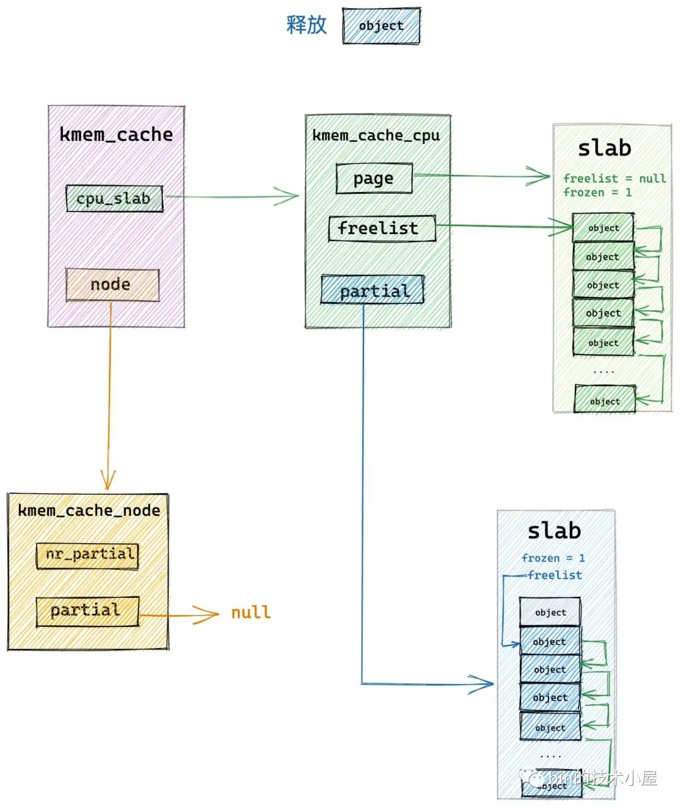
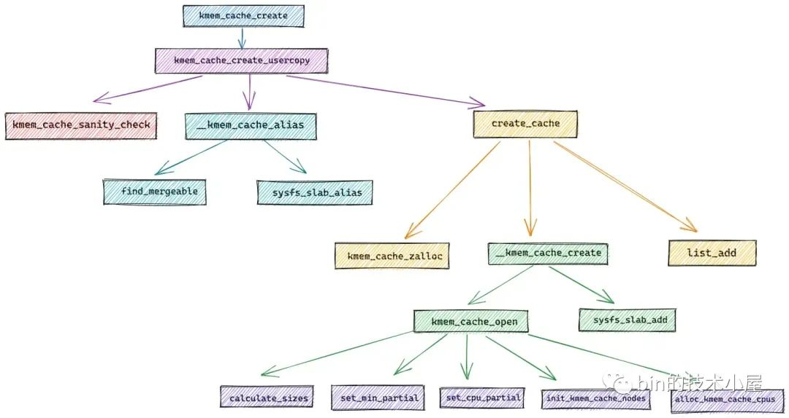

# 深度解析 slab 内存池回收内存以及销毁全流程

本文详细介绍了Linux内核中的slabcache内存管理机制，包括slabcache的内存分配和回收流程，特别是快速路径和慢速路径的处理，以及slabcache的创建、销毁过程。文章通过分析内核源码，揭示了slabcache如何高效地管理内存，以及在不同场景下的内存分配和回收策略。

在上篇文章 [《深入理解 slab cache 内存分配全链路实现》](https://mp.weixin.qq.com/s?__biz=Mzg2MzU3Mjc3Ng==&mid=2247488152&idx=1&sn=7c65f8ee28e9cc14a86e9df92b6d2b93&chksm=ce77d4dff9005dc9003a7df42b6560df13b581e45927bf3ef3e13cc24acc4eb78c2332bd1351&scene=178&cur_album_id=2559805446807928833#rd) 中，笔者详细地为大家介绍了 slab cache 进行[内存分配](https://so.csdn.net/so/search?q=%E5%86%85%E5%AD%98%E5%88%86%E9%85%8D&spm=1001.2101.3001.7020)的整个链路实现，本文我们就来到了 slab cache 最后的一部分内容了，当申请的内存使用完毕之后，下面就该释放内存了。

在接下来的内容中，笔者为大家介绍一下内核是如何将内存块释放回 slab cache 的。我们还是先从 slab cache 释放内存的内核 API 开始聊起~~~

内核提供了 kmem\_cache\_free 函数，用于将对象释放回其所属的 slab cache 中，参数 x 表示我们要释放的内存块（对象）的[虚拟内存](https://so.csdn.net/so/search?q=%E8%99%9A%E6%8B%9F%E5%86%85%E5%AD%98&spm=1001.2101.3001.7020)地址，参数 s 指向内存块所属的 slab cache。

    void kmem_cache_free(struct kmem_cache *s, void *x)
    {
        // 确保指定的是 slab cache : s 为对象真正所属的 slab cache
        s = cache_from_obj(s, x);
        if (!s)
            return;
        // 将对象释放会 slab cache 中
        slab_free(s, virt_to_head_page(x), x, NULL, 1, _RET_IP_);
    }

### 1\. 内存释放之前的校验工作

在开始释放内存块 x 之前，内核需要首先通过 cache\_from\_obj 函数确认内存块 x 是否真正属于我们指定的 slab cache。不能将内存块释放到其他的 slab cache 中。

随后在 virt\_to\_head\_page 函数中通过内存块的虚拟内存地址 x 找到其所在的物理内存页 page。然后调用 slab\_free 将内存块释放回 slab cache 中。

> 通过虚拟内存地址寻找物理内存页 page 的过程涉及到的背景知识比较复杂，这个笔者后面会单独拎出来介绍，这里大家只需要简单了解 virt\_to\_head\_page 函数的作用即可。

    static inline struct kmem_cache *cache_from_obj(struct kmem_cache *s, void *x)
    {
        struct kmem_cache *cachep;
        // 通过对象的虚拟内存地址 x 找到对象所属的 slab cache
        cachep = virt_to_cache(x);
        // 校验指定的 slab cache : s 是否是对象真正所属的 slab cache : cachep
        WARN_ONCE(cachep && !slab_equal_or_root(cachep, s),
              "%s: Wrong slab cache. %s but object is from %s\n",
              __func__, s->name, cachep->name);
        return cachep;
    }

virt\_to\_cache 函数首先会通过释放对象的虚拟内存地址找到其所在的物理内存页 page，然后通过 struct page 结构中的 slab\_cache 指针找到 page 所属的 slab cache。

    static inline struct kmem_cache *virt_to_cache(const void *obj)
    {
        struct page *page;
        // 根据对象的虚拟内存地址 *obj 找到其所在的内存页 page
        // 如果 slub 背后是多个内存页（复合页），则返回复合页的首页 head page
        page = virt_to_head_page(obj);
        if (WARN_ONCE(!PageSlab(page), "%s: Object is not a Slab page!\n",
                        __func__))
            return NULL;
        // 通过 page 结构中的 slab_cache 属性找到其所属的 slub
        return page->slab_cache;
    }

### 2\. slab cache 在快速路径下回收内存

    static __always_inline void slab_free(struct kmem_cache *s, struct page *page,
                          void *head, void *tail, int cnt,
                          unsigned long addr)
    {
        if (slab_free_freelist_hook(s, &head, &tail))
            do_slab_free(s, page, head, tail, cnt, addr);
    }

slab cache 回收内存相关的逻辑封装在 do\_slab\_free 函数中：

    static __always_inline void do_slab_free(struct kmem_cache *s,
                    struct page *page, void *head, void *tail,
                    int cnt, unsigned long addr)

-   参数 kmem\_cache \*s 表示释放对象所在的 slab cache，指定我们要将对象释放到哪里。
-   参数 page 表示释放对象所在的 slab，slab 在内核中使用 struct page 结构来表示。
-   参数 head 指向释放对象的虚拟内存地址（起始内存地址）。
-   该函数支持向 slab cache 批量的释放多个对象，参数 tail 指向批量释放对象中最后一个对象的虚拟内存地址。
-   参数 cnt 表示释放对象的个数，也是用于批量释放对象
-   参数 addr 用于 slab 调试，这里我们不需要关心。

slab cache 针对内存的回收流程其实和我们在上篇文章 [《深入理解 slab cache 内存分配全链路实现》](https://mp.weixin.qq.com/s?__biz=Mzg2MzU3Mjc3Ng==&mid=2247488152&idx=1&sn=7c65f8ee28e9cc14a86e9df92b6d2b93&chksm=ce77d4dff9005dc9003a7df42b6560df13b581e45927bf3ef3e13cc24acc4eb78c2332bd1351&token=1861909455&lang=zh_CN#rd) 中介绍的 slab cache 内存分配流程是相似的。

内存回收总体也是分为快速路径 fastpath 和慢速路径 slow path，在 do\_slab\_free 函数中内核会首先尝试 fastpath 的回收流程。

如果释放对象所在的 slab 刚好是 slab cache 在本地 cpu 缓存 kmem\_cache\_cpu->page 缓存的 slab，那么内核就会直接将对象释放回缓存 slab 中。

    static __always_inline void do_slab_free(struct kmem_cache *s,
                    struct page *page, void *head, void *tail,
                    int cnt, unsigned long addr)
    {
        void *tail_obj = tail ? : head;
        struct kmem_cache_cpu *c;
        // slub 中对象分配与释放流程的全局事务 id
        // 既可以用来标识同一个分配或者释放的事务流程，也可以用来标识区分所属 cpu 本地缓存
        unsigned long tid;
    redo:
        // 接下来我们需要获取 slab cache 的 cpu 本地缓存
        // 这里的 do..while 循环是要保证获取到的 cpu 本地缓存 c 是属于执行进程的当前 cpu
        // 因为进程可能由于抢占或者中断的原因被调度到其他 cpu 上执行，所需需要确保两者的 tid 是否一致
        do {
            // 获取执行当前进程的 cpu 中的 tid 字段
            tid = this_cpu_read(s->cpu_slab->tid);
            // 获取 cpu 本地缓存 cpu_slab
            c = raw_cpu_ptr(s->cpu_slab);
            // 如果两者的 tid 字段不一致，说明进程已经被调度到其他 cpu 上了
            // 需要再次获取正确的 cpu 本地缓存
        } while (IS_ENABLED(CONFIG_PREEMPT) &&
             unlikely(tid != READ_ONCE(c->tid)));
    
        // 如果释放对象所属的 slub （page 表示）正好是 cpu 本地缓存的 slub
        // 那么直接将对象释放到 cpu 缓存的 slub 中即可，这里就是快速释放路径 fastpath
        if (likely(page == c->page)) {
            // 将对象释放至 cpu 本地缓存 freelist 中的头结点处
            // 释放对象中的 freepointer 指向原来的 c->freelist
            set_freepointer(s, tail_obj, c->freelist);
            // cas 更新 cpu 本地缓存 s->cpu_slab 中的 freelist，以及 tid
            if (unlikely(!this_cpu_cmpxchg_double(
                    s->cpu_slab->freelist, s->cpu_slab->tid,
                    c->freelist, tid,
                    head, next_tid(tid)))) {
    
                note_cmpxchg_failure("slab_free", s, tid);
                goto redo;
            }
            stat(s, FREE_FASTPATH);
        } else
            // 如果当前释放对象并不在 cpu 本地缓存中，那么就进入慢速释放路径 slowpath
            __slab_free(s, page, head, tail_obj, cnt, addr);
    
    }

既然是快速路径释放，那么在 do\_slab\_free 函数的开始首先就获取 slab cache 的本地 cpu 缓存结构 kmem\_cache\_cpu，为了保证我们获取到的 cpu [本地缓存](https://so.csdn.net/so/search?q=%E6%9C%AC%E5%9C%B0%E7%BC%93%E5%AD%98&spm=1001.2101.3001.7020)结构与运行当前进程所在的 cpu 是相符的，所以这里还是需要在 `do .... while` 循环内判断两者的 tid。这一点，笔者已经在本文之前的内容里多次强调过了，这里不在赘述。

内核在确保已经获取了正确的 kmem\_cache\_cpu 结构之后，就会马上判断该释放对象所在的 slab 是否正是 slab cache 本地 cpu 缓存了的 slab —— `page == c->page`。

如果是的话，直接将对象释放回缓存 slab 中，调整 kmem\_cache\_cpu->freelist 指向刚刚释放的对象，调整释放对象的 freepointer 指针指向原来的 kmem\_cache\_cpu->freelist 。

如果当前释放对象并不在 slab cache 的本地 cpu 缓存中，那么就会进入慢速路径 slowpath 释放内存。

### 3\. slab cache 在慢速路径下回收内存

slab cache 在慢速路径下回收内存的逻辑比较复杂，因为这里涉及到很多的场景，需要改变释放对象所属 slab 在 slab cache 架构中的位置。

下面笔者会带大家一一梳理这些场景，我们一起来看一下内核在这些不同场景中到底是如何处理的？

> 在开始阅读本小节的内容之前，建议大家先回顾下 [《细节拉满，80 张图带你一步一步推演 slab 内存池的设计与实现》](https://mp.weixin.qq.com/s?__biz=Mzg2MzU3Mjc3Ng==&mid=2247487996&idx=1&sn=12f62cfcfcc89ffcbbd1b7e4fa286940&chksm=ce77d7bbf9005ead3d4a953e470dba6b4708573a785e21f8f184f1c1fb6b3fed67a742b020d4&scene=178&cur_album_id=2559805446807928833#rd) 一文中的 ”8. slab 内存释放原理“ 小节。

在将对象释放回对应的 slab 中之前，内核需要首先清理一下对象所占的内存，重新填充对象的内存布局恢复到初始未使用状态。因为对象所占的内存此时包含了很多已经被使用过的无用信息。这项工作内核在 free\_debug\_processing 函数中完成。

在将对象所在内存恢复到初始状态之后，内核首先会将对象直接释放回其所属的 slab 中，并调整 slab 结构 page 的相关属性。

接下来就到复杂的处理部分了，内核会在这里处理多种场景，并改变 slab 在 slab cache 架构中的位置。

1.  如果 slab 本来就在 slab cache 本地 cpu 缓存 kmem\_cache\_cpu->partial 链表中，那么对象在释放之后，slab 的位置不做任何改变。
    
2.  如果 slab 不在 kmem\_cache\_cpu->partial 链表中，并且该 slab 由于对象的释放刚好由一个 full slab 变为了一个 partial slab，为了利用局部性的优势，内核需要将该 slab 插入到 kmem\_cache\_cpu->partial 链表中。
    

3.  如果 slab 不在 kmem\_cache\_cpu->partial 链表中，并且该 slab 由于对象的释放刚好由一个 partial slab 变为了一个 empty slab，说明该 slab 并不是很活跃，内核会将该 slab 放入对应 NUMA 节点缓存 kmem\_cache\_node->partial 链表中，刀枪入库，马放南山。

4.  如果不符合第 2, 3 种场景，但是 slab 本来就在对应的 NUMA 节点缓存 kmem\_cache\_node->partial 链表中，那么对象在释放之后，slab 的位置不做任何改变。

下面我们就到内核的源码实现中，来一一验证这四种慢速释放场景。

    static void __slab_free(struct kmem_cache *s, struct page *page,
                void *head, void *tail, int cnt,
                unsigned long addr)
    
    {
        // 用于指向对象释放回 slub 之前，slub 的 freelist
        void *prior;
        // 对象所属的 slub 之前是否在本地 cpu 缓存 partial 链表中
        int was_frozen;
        // 后续会对 slub 对应的 page 结构相关属性进行修改
        // 修改后的属性会临时保存在 new 中，后面通过 cas 替换
        struct page new;
        unsigned long counters;
        struct kmem_cache_node *n = NULL;
        stat(s, FREE_SLOWPATH);
    
        // free_debug_processing 中会调用 init_object，清理对象内存无用信息，重新恢复对象内存布局到初始状态
        if (kmem_cache_debug(s) &&
         !free_debug_processing(s, page, head, tail, cnt, addr))
            return;
    
        do {
            // 获取 slub 中的空闲对象列表，prior = null 表示此时 slub 是一个 full slub，意思就是该 slub 中的对象已经全部被分配出去了
            prior = page->freelist;
            counters = page->counters;
            // 将释放的对象插入到 freelist 的头部，将对象释放回 slub
            // 将 tail 对象的 freepointer 设置为 prior
            set_freepointer(s, tail, prior);
            // 将原有 slab 的相应属性赋值给 new page
            new.counters = counters;
            // 获取原来 slub 中的 frozen 状态，是否在 cpu 缓存 partial 链表中
            was_frozen = new.frozen;
            // inuse 表示 slub 已经分配出去的对象个数，这里是释放 cnt 个对象，所以 inuse 要减去 cnt
            new.inuse -= cnt;
            // !new.inuse 表示此时 slub 变为了一个 empty slub，意思就是该 slub 中的对象还没有分配出去，全部在 slub 中
            // !prior 表示由于本次对象的释放，slub 刚刚从一个 full slub 变成了一个 partial slub (意思就是该 slub 中的对象部分分配出去了，部分没有分配出去)
            // !was_frozen 表示该 slub 不在 cpu 本地缓存中
            if ((!new.inuse || !prior) && !was_frozen) {
                // 注意：进入该分支的 slub 之前都不在 cpu 本地缓存中
                // 如果配置了 CONFIG_SLUB_CPU_PARTIAL 选项，那么表示 cpu 本地缓存 kmem_cache_cpu 结构中包含 partial 列表，用于 cpu 缓存部分分配的 slub
                if (kmem_cache_has_cpu_partial(s) && !prior) {
                    // 如果 kmem_cache_cpu 包含 partial 列表并且该 slub 刚刚由 full slub 变为 partial slub
                    // 冻结该 slub，后续会将该 slub 插入到 kmem_cache_cpu 的 partial 列表中
                    new.frozen = 1;
    
                } else { 
                    // 如果 kmem_cache_cpu 中没有配置 partial 列表，那么直接释放至 kmem_cache_node 中
                    // 或者该 slub 由一个 partial slub 变为了 empty slub，调整 slub 的位置到 kmem_cache_node->partial 链表中
                    n = get_node(s, page_to_nid(page));
                    // 后续会操作 kmem_cache_node 中的 partial 列表，所以这里需要获取 list_lock
                    spin_lock_irqsave(&n->list_lock, flags);
    
                }
            }
            // cas 更新 slub 中的 freelist 以及 counters
        } while (!cmpxchg_double_slab(s, page,
            prior, counters,
            head, new.counters,
            "__slab_free"));
    
        // 该分支要处理的场景是：
        // 1: 该 slub 原来不在 cpu 本地缓存的 partial 列表中（!was_frozen），但是该 slub 刚刚从 full slub 变为了 partial slub，需要放入 cpu-> partial 列表中
        // 2: 该 slub 原来就在 cpu 本地缓存的 partial 列表中，直接将对象释放回 slub 即可
        if (likely(!n)) {
            // 处理场景 1
            if (new.frozen && !was_frozen) {
                // 将 slub 插入到 kmem_cache_cpu 中的 partial 列表中
                put_cpu_partial(s, page, 1);
                stat(s, CPU_PARTIAL_FREE);
            }
            
            // 处理场景2，因为之前已经通过 set_freepointer 将对象释放回 slub 了，这里只需要记录 slub 状态即可
            if (was_frozen)
                stat(s, FREE_FROZEN);
            return;
        }
        
        // 后续的逻辑就是处理需要将 slub 放入 kmem_cache_node 中的 partial 列表的情形
        // 在将 slub 放入 node 缓存之前，需要判断 node 缓存的 nr_partial 是否超过了指定阈值 min_partial（位于 kmem_cache 结构）
        // nr_partial 表示 kmem_cache_node 中 partial 列表中缓存的 slub 个数
        // min_partial 表示 slab cache 规定 kmem_cache_node 中 partial 列表可以容纳的 slub 最大个数
        // 如果 nr_partial 超过了最大阈值 min_partial，则不能放入 kmem_cache_node 里
        if (unlikely(!new.inuse && n->nr_partial >= s->min_partial))
            // 如果 slub 变为了一个 empty slub 并且 nr_partial 超过了最大阈值 min_partial
            // 跳转到 slab_empty 分支，将 slub 释放回伙伴系统中
            goto slab_empty;
    
        // 如果 cpu 本地缓存中没有配置 partial 列表并且 slub 刚刚从 full slub 变为 partial slub
        // 则将 slub 插入到 kmem_cache_node 中
        if (!kmem_cache_has_cpu_partial(s) && unlikely(!prior)) {
            remove_full(s, n, page);
            add_partial(n, page, DEACTIVATE_TO_TAIL);
            stat(s, FREE_ADD_PARTIAL);
        }
        spin_unlock_irqrestore(&n->list_lock, flags);
        // 剩下的情况均属于 slub 原来就在 kmem_cache_node 中的 partial 列表中
        // 直接将对象释放回 slub 即可，无需改变 slub 的位置，直接返回
        return;
    
    slab_empty:
        // 该分支处理的场景是： slub 太多了，将 empty slub 释放会伙伴系统
        // 首先将 slub 从对应的管理链表上删除
        if (prior) {
            /*
             * Slab on the partial list.
             */
            remove_partial(n, page);
            stat(s, FREE_REMOVE_PARTIAL);
        } else {
            /* Slab must be on the full list */
            remove_full(s, n, page);
        }
        spin_unlock_irqrestore(&n->list_lock, flags);
        stat(s, FREE_SLAB);
        // 释放 slub 回伙伴系统，底层调用 __free_pages 将 slub 所管理的所有 page 释放回伙伴系统
        discard_slab(s, page);
    }

#### 3.1 直接释放对象回 slab，调整 slab 相关属性

    static void __slab_free(struct kmem_cache *s, struct page *page,
                void *head, void *tail, int cnt,
                unsigned long addr)
    
    {
        // 后续会对 slub 对应的 page 结构相关属性进行修改
        // 修改后的属性会临时保存在 new 中，后面通过 cas 替换
        struct page new;
    
                  ....... 省略 ..........
    
        do {
            prior = page->freelist;
            counters = page->counters;
            // 将对象直接释放回 slab 中，调整 slab 的 freelist 指针，以及对象的 freepointer 指针
            set_freepointer(s, tail, prior);
    
            new.counters = counters;
            // 获取原来 slub 中的 frozen 状态，是否在 cpu 缓存 partial 中
            was_frozen = new.frozen;
            // inuse 表示 slub 已经分配出去的对象个数，这里是释放 cnt 个对象，所以 inuse 要减去 cnt
            new.inuse -= cnt;
    
                  ....... 省略 ..........
    
            // cas 更新 slub 中的 freelist 
        } while (!cmpxchg_double_slab(s, page,
            prior, counters,
            head, new.counters,
            "__slab_free"));
    
     .            ...... 省略 ..........
    }

这一部分的逻辑比较简单，在 \_\_slab\_free 内存释放流程的开始，内核不管三七二十一，首先会将对象直接释放回其所在的 slab 中。

当对象被释放回 slab 中之后，slab 结构中的相应属于就需要做出相应的调整，比如：

-   调整 page 结构中的 freelist，它需要指向刚刚被释放的对象。
-   调整 page 结构中的 inuse，inuse 表示 slab 中已经被分配出去的对象个数，此时对象已经释放回 slab 中，需要调整 inuse 字段。
-   后续内核会根据不同情况，调整 page 结构的 frozen 属性。

内核会定义一个新的 page 结构 `new`，将原有 slab 的 page 结构需要更新的上述属性的新值，先一一复制给 new 的对应属性，最后通过 cmpxchg\_double\_slab 原子更新 slab 对应的属性。

    struct page {
    
            struct {    /*  slub 相关字段 */
                 ........ 省略 .........
    
                // 指向 page 所属的 slab cache
                struct kmem_cache *slab_cache;
                // 指向 slab 中第一个空闲对象
                void *freelist;     /* first free object */
                union {
                    unsigned long counters;
                    struct {            /* SLUB */             
                        // slab 中已经分配出去的对象
                        unsigned inuse:16;
                        // slab 中包含的对象总数
                        unsigned objects:15;
                        // 该 slab 是否在对应 slab cache 的本地 CPU 缓存中
                        // frozen = 1 表示缓存再本地 cpu 缓存中
                        unsigned frozen:1;
                    };
                };
            };
    
    }

按照正常的更新套路来说，我们在更新原有 slab 结构中的 freelist，inuse，frozen 这三个属性之前，首先需要将原有 slab 的这三个旧的属性值一一赋值到临时结构 new page 中，**然后在 slab 结构旧值的基础上调整着三个属性的新值**，最后通过 cmpxchg\_double\_slab 将这三个属性的新值原子地更新回 slab 中。

但是我们查看 \_\_slab\_free 的代码发现，内核并不是这样操作的，内核只是将原有 slab 的 counter 属性赋值给 new page，而原有 slab 中的 frozen，inuse 属性并没有赋值过去。

此时 new page 结构中的 frozen，inuse 属性依然是上述 struct page 结构中展示的初始值。

而内核后续的操作就更加奇怪了，直接使用 new.frozen 来判断原有 slab 是否在 slab cache 本地 cpu 的 partial 链表中，直接把 new.inuse 属性当做原有 slab 中已经分配出去对象的个数。

而 new.frozen， new.inuse 是 page 结构初始状态的值，并不是原有 slab 结构中的值，这样做肯定不对啊，难道是内核的一个 bug ?

其实并不是，这是内核非常骚的一个操作，这一点对于 Java 程序员来说很难理解。我们在仔细看一下 struct page 结构，就会发现 counter 属性和 inuse，frozen 属性被定义在一个 union 结构体中。

union 结构体中定义的字段全部共享一片内存，union 结构体的内存占用由其中最大的属性决定。而 struct 结构体中的每个字段都是独占一片内存的。

由于 union 结构体中各个字段都是共享一块内存，所以一个字段的改变就会影响其他字段的值，从另一方面来看，通过一个字段就可以将整个 union 结构占用的内存块拿出来。明白这些，我们在回头来看内核的操作。

    struct page {
                union {
                    unsigned long counters;
                    struct {            /* SLUB */             
                        // slab 中已经分配出去的对象
                        unsigned inuse:16;
                        // slab 中包含的对象总数
                        unsigned objects:15;
                        // 该 slab 是否在对应 slab cache 的本地 CPU 缓存中
                        // frozen = 1 表示缓存再本地 cpu 缓存中
                        unsigned frozen:1;
                    };
                };
    }

page 结构中的 counters 是和 inuse，frozen 共用同一块内存的，内核在 \_\_slab\_free 中将原有 slab 的 counters 属性赋值给 new.counters 的一瞬间，counters 所在的内存块也就赋值到 new page 的 union 结构中了。

而 inuse，frozen 属性的值也在这个内存块中，所以原有 slab 中的 inuse，frozen 属性也就跟着一起赋值到 new page 的对应属性中了。这样一来，后续的逻辑处理也就通顺了。

            counters = page->counters;
            new.counters = counters;
            // 获取原来 slub 中的 frozen 状态，是否在 cpu 缓存 partial 中
            was_frozen = new.frozen;
            // inuse 表示 slub 已经分配出去的对象个数，这里是释放 cnt 个对象，所以 inuse 要减去 cnt
            new.inuse -= cnt;

同样的道理，我们再来看内核 cmpxchg\_double\_slab 中的更新操作：

内核明明在 `do .... while` 循环中更新了 freelist，inuse，frozen 这三个属性，而 counters 属性只是读取并没有更新操作，那么为什么在 cmpxchg\_double\_slab 只是更新 page 结构的 freelist 和 counters 呢？inuse，frozen 这两个属性又在哪里更新的呢？

       do {
                 ....... 省略 ..........
            // cas 更新 slub 中的 freelist 
        } while (!cmpxchg_double_slab(s, page,
            prior, counters,
            head, new.counters,
            "__slab_free"));

我想大家现在一定能够解释这个问题了，由于 counters，inuse，frozen 共用一块内存，当 inuse，frozen 的值发生变化之后，虽然 counters 的值没有发生变化，但是我们可以通过更新 counters 来将原有 slab 中的这块内存一起更新掉，这样 inuse，frozen 的值也跟着被更新了。

由于 page 的 freelist 指针在 union 结构体之外，所以需要在cmpxchg\_double\_slab 中单独更新。

笔者曾经为了想给大家解释清楚 page->counters 这个属性的作用，而翻遍了 slab 的所有源码，发现内核源码中对于 page->counters 的使用都是只做简单的读取，并不做改变，然后直接在更新，这个问题也困扰了笔者很久。

直到为大家写这篇文章的时候，才顿悟。原来 page->counters 的作用只是为了指向 inuse，frozen 所在的内存，方便在 cmpxchg\_double\_slab 中同时原子地更新这两个属性。

接下来的内容就到了 slab cache 回收内存最为复杂的环节了，大家需要多一些耐心，继续跟着笔者的思路走下去，我们一起来看下内核如何处理三种内存慢速释放的场景。

#### 3.2 释放对象所属 slab 本来就在 cpu 缓存 partial 链表中

was\_frozen 指向释放对象所属 slab 结构中的 frozen 属性，用来表示 slab 是否在 slab cache 的本地 cpu 缓存 partial 链表中。

     was_frozen = new.frozen;

如果 `was_frozen == true` 表示释放对象所属 slab 本来就在 kmem\_cache\_cpu->partial 链表中，内核将对象直接释放回 slab 中，slab 的原有位置不做改变。

下面我们看下 `was_frozen == fasle` 也就是 slab 不在 kmem\_cache\_cpu->partial 链表中 的时候，内核又是如何处理的 ？

#### 3.3 释放对象所属 slab 从 full slab 变为了 partial slab

如果释放对象所属 slab 原来是一个 full slab，恰恰说明该 slab 拥有比较好的局部性，进程经常从该 slab 中分配对象，slab 十分活跃，才导致它变为了一个 full slab

     prior = page->freelist = null

随着对象的释放，该 slab 从一个 full slab 变为了 partial slab，内核为了更好的利用该 slab 的局部性，所以需要将该 slab 插入到 slab cache 的本地 cpu 缓存 kmem\_cache\_cpu->partial 链表中。

            if (kmem_cache_has_cpu_partial(s) && !prior) {
                    new.frozen = 1;
    
            } 
    
            if (new.frozen && !was_frozen) {
                // 将 slub 插入到 kmem_cache_cpu 中的 partial 列表中
                put_cpu_partial(s, page, 1);
                stat(s, CPU_PARTIAL_FREE);
            }

​    

将 slab 插入到 kmem\_cache\_cpu->partial 链表的逻辑封装在 put\_cpu\_partial 中，put\_cpu\_partial 函数最重要的一个考量逻辑是需要确保 kmem\_cache\_cpu->partial 链表中所有 slab 中包含的空闲对象总数不能超过 kmem\_cache->cpu\_partial 的限制。

    struct kmem_cache {
        // 限定 slab cache 在每个 cpu 本地缓存 partial 链表中所有 slab 中空闲对象的总数
        unsigned int cpu_partial;
    };

在释放对象所在的 slab 插入到 kmem\_cache\_cpu->partial 链表之前，put\_cpu\_partial 函数需要判断当前 kmem\_cache\_cpu->partial 链表中包含的空闲对象总数 pobjects 是否超过了 kmem\_cache->cpu\_partial 的限制。

如果超过了，则需要先将当前 kmem\_cache\_cpu->partial 链表中所有的 slab 转移到其对应的 NUMA 节点缓存 kmem\_cache\_node->partial 链表中。转移完成之后，在将释放对象所属的 slab 插入到 kmem\_cache\_cpu->partial 链表中。

    static void put_cpu_partial(struct kmem_cache *s, struct page *page, int drain)
    {
    // 只有配置了 CONFIG_SLUB_CPU_PARTIAL 选项，kmem_cache_cpu 中才有会 partial 列表
    #ifdef CONFIG_SLUB_CPU_PARTIAL
        // 指向原有 kmem_cache_cpu 中的 partial 列表
        struct page *oldpage;
        // slub 所在管理列表中的 slub 个数，这里的列表是指 partial 列表
        int pages;
        // slub 所在管理列表中的包含的空闲对象总数，这里的列表是指 partial 列表
        // 内核会将列表总体的信息存放在列表首页 page 的相关字段中
        int pobjects;
        // 禁止抢占
        preempt_disable();
        do {
            pages = 0;
            pobjects = 0;
            // 获取 slab cache 中原有的 cpu 本地缓存 partial 列表首页
            oldpage = this_cpu_read(s->cpu_slab->partial);
            // 如果 partial 列表不为空，则需要判断 partial 列表中所有 slub 包含的空闲对象总数是否超过了 s->cpu_partial 规定的阈值
            // 超过 s->cpu_partial 则需要将 kmem_cache_cpu->partial 列表中原有的所有 slub 转移到 kmem_cache_node-> partial 列表中
            // 转移之后，再把当前 slub 插入到 kmem_cache_cpu->partial 列表中
            // 如果没有超过 s->cpu_partial ，则无需转移直接插入
            if (oldpage) {
                // 从 partial 列表首页中获取列表中包含的空闲对象总数
                pobjects = oldpage->pobjects;
                // 从 partial 列表首页中获取列表中包含的 slub 总数
                pages = oldpage->pages;
    
                if (drain && pobjects > s->cpu_partial) {
                    unsigned long flags;
                    // 关闭中断，防止并发访问
                    local_irq_save(flags);
                    // partial 列表中所包含的空闲对象总数 pobjects 超过了 s->cpu_partial 规定的阈值
                    // 则需要将现有 partial 列表中的所有 slub 转移到相应的 kmem_cache_node->partial 列表中
                    unfreeze_partials(s, this_cpu_ptr(s->cpu_slab));
                    // 恢复中断
                    local_irq_restore(flags);
                    // 重置 partial 列表
                    oldpage = NULL;
                    pobjects = 0;
                    pages = 0;
                    stat(s, CPU_PARTIAL_DRAIN);
                }
            }
            // 无论 kmem_cache_cpu-> partial 列表中的 slub 是否需要转移
            // 释放对象所在的 slub 都需要填加到  kmem_cache_cpu-> partial 列表中
            pages++;
            pobjects += page->objects - page->inuse;
    
            page->pages = pages;
            page->pobjects = pobjects;
            page->next = oldpage;
            // 通过 cas 将 slub 插入到 partial 列表的头部
        } while (this_cpu_cmpxchg(s->cpu_slab->partial, oldpage, page)
                                    != oldpage);
    
        // s->cpu_partial = 0 表示 kmem_cache_cpu->partial 列表不能存放 slub
        // 将释放对象所在的 slub 转移到  kmem_cache_node-> partial 列表中
        if (unlikely(!s->cpu_partial)) {
            unsigned long flags;
            local_irq_save(flags);
            unfreeze_partials(s, this_cpu_ptr(s->cpu_slab));
            local_irq_restore(flags);
        }
        preempt_enable();
    #endif  /* CONFIG_SLUB_CPU_PARTIAL */
    }

那么我们如何知道 kmem\_cache\_cpu->partial 链表所包含的空闲对象总数到底是多少呢？

这就用到了 struct page 结构中的两个重要属性：

    struct page {
          // slab 所在链表中的包含的 slab 总数
          int pages;  
          // slab 所在链表中包含的对象总数
          int pobjects; 
    }

我们都知道 slab 在内核中的数据结构用 struct page 中的相关结构体表示，slab 在 slab cache 架构中一般是由 kmem\_cache\_cpu->partial 链表和 kmem\_cache\_node->partial 链表来组织管理。

那么我们如何知道 partial 链表中包含多少个 slab ？包含多少个空闲对象呢？

答案是内核会将 parital 链表中的这些总体统计信息存储在链表首个 slab 结构中。也就是说存储在首个 page 结构中的 pages 属性和 pobjects 属性中。

在 put\_cpu\_partial 函数的开始，内核直接获取 parital 链表的首个 slab —— oldpage，并通过 `oldpage->pobjects` 与 `s->cpu_partial` 比较，来判断当前 kmem\_cache\_cpu->partial 链表中包含的空闲对象总数是否超过了 kmem\_cache 结构中规定的 cpu\_partial 阈值。

如果超过了，则通过 unfreeze\_partials 转移 kmem\_cache\_cpu->partial 链表中的所有 slab 到对应的 kmem\_cache\_node->partial 链表中。

既然 kmem\_cache\_cpu->partial 链表有容量的限制，那么同样 kmem\_cache\_node->partial 链表中的容量也会有限制。

kmem\_cache\_node->partial 链表中所包含 slab 个数的上限由 kmem\_cache 结构中的 min\_partial 属性决定。

    struct kmem_cache {
    
        // slab cache 在 numa node 中缓存的 slab 个数上限，slab 个数超过该值，空闲的 empty slab 则会被回收至伙伴系统
        unsigned long min_partial;
    }

如果当前要转移的 slab 是一个 empty slab，并且此时 kmem\_cache\_node->partial 链表所包含的 slab 个数 `kmem_cache_node->nr_partial` 已经超过了 `kmem_cache-> min_partial` 的限制，那么内核就会直接将这个 empty slab 释放回伙伴系统中。

    // 将 kmem_cache_cpu->partial 列表中包含的 slub unfreeze
    // 并转移到对应的 kmem_cache_node->partial 列表中
    static void unfreeze_partials(struct kmem_cache *s,
            struct kmem_cache_cpu *c)
    {
    #ifdef CONFIG_SLUB_CPU_PARTIAL
        struct kmem_cache_node *n = NULL, *n2 = NULL;
        struct page *page, *discard_page = NULL;
        // 挨个遍历 kmem_cache_cpu->partial 列表，将列表中的 slub 转移到对应 kmem_cache_node->partial 列表中
        while ((page = c->partial)) {
            struct page new;
            struct page old;
            // 将当前遍历到的 slub 从 kmem_cache_cpu->partial 列表摘下
            c->partial = page->next;
            // 获取当前 slub 所在的 numa 节点对应的 kmem_cache_node 缓存
            n2 = get_node(s, page_to_nid(page));
            // 如果和上一个转移的 slub 所在的 numa 节点不一样
            // 则需要释放上一个 numa 节点的 list_lock，并对当前 numa 节点的 list_lock 加锁
            if (n != n2) {
                if (n)
                    spin_unlock(&n->list_lock);
    
                n = n2;
                spin_lock(&n->list_lock);
            }
    
            do {
    
                old.freelist = page->freelist;
                old.counters = page->counters;
                VM_BUG_ON(!old.frozen);
    
                new.counters = old.counters;
                new.freelist = old.freelist;
                // unfrozen 当前 slub，因为即将被转移到对应的 kmem_cache_node->partial 列表
                new.frozen = 0;
                // cas 更新当前 slub 的 freelist，frozen 属性
            } while (!__cmpxchg_double_slab(s, page,
                    old.freelist, old.counters,
                    new.freelist, new.counters,
                    "unfreezing slab"));
            // 因为 kmem_cache_node->partial 列表中所包含的 slub 个数是受 s->min_partial 阈值限制的
            // 所以这里还需要检查 nr_partial 是否超过了 min_partial
            // 如果当前被转移的 slub 是一个 empty slub 并且 nr_partial 超过了 min_partial 的限制，则需要将 slub 释放回伙伴系统中
            if (unlikely(!new.inuse && n->nr_partial >= s->min_partial)) {
                // discard_page 用于将需要释放回伙伴系统的 slub 串联起来
                // 后续统一将 discard_page 链表中的 slub 释放回伙伴系统
                page->next = discard_page;
                discard_page = page;
            } else {
                // 其他情况，只要 slub 不为 empty ，不管 nr_partial 是否超过了 min_partial
                // 都需要将 slub 转移到对应 kmem_cache_node->partial 列表的末尾
                add_partial(n, page, DEACTIVATE_TO_TAIL);
                stat(s, FREE_ADD_PARTIAL);
            }
        }
    
        if (n)
            spin_unlock(&n->list_lock);
        // 将 discard_page 链表中的 slub 统一释放回伙伴系统
        while (discard_page) {
            page = discard_page;
            discard_page = discard_page->next;
    
            stat(s, DEACTIVATE_EMPTY);
            // 底层调用 __free_pages 将 slub 所管理的所有 page 释放回伙伴系统
            discard_slab(s, page);
            stat(s, FREE_SLAB);
        }
    #endif  /* CONFIG_SLUB_CPU_PARTIAL */
    }

#### 3.4 释放对象所属 slab 从 partial slab 变为了 empty slab

如果释放对象所在的 slab 原来是一个 partial slab ，由于对象的释放刚好变成了一个 empty slab，恰恰说明该 slab 并不是一个活跃的 slab，它的局部性不好，内核已经好久没有从该 slab 中分配对象了，所以内核选择刀枪入库，马放南山。将它释放回 kmem\_cache\_node->partial 链表中作为本地 cpu 缓存的后备选项。

在将这个 empty slab 插入到 kmem\_cache\_node->partial 链表之前，同样需要检查当前 partial 链表中的容量 `kmem_cache_node->nr_partial` 不能超过 kmem\_cache-> min\_partial 的限制。如果超过限制了，直接将这个 empty slab 释放回伙伴系统中。

            if ((!new.inuse || !prior) && !was_frozen) {
                if (kmem_cache_has_cpu_partial(s) && !prior) {
                    new.frozen = 1;
                } else { 
                    // !new.inuse 表示当前 slab 刚刚从一个 partial slab 变为了 empty slab
                    n = get_node(s, page_to_nid(page));
                    spin_lock_irqsave(&n->list_lock, flags);
    
                }
            }
    
          if (unlikely(!new.inuse && n->nr_partial >= s->min_partial))
            // 如果 slub 变为了一个 empty slub 并且 nr_partial 超过了最大阈值 min_partial
            // 跳转到 slab_empty 分支，将 slub 释放回伙伴系统中
            goto slab_empty;

释放对象所属的 slab 本来就在 kmem\_cache\_node->partial 链表中，这种情况下就是直接释放对象回 slab 中，无需改变 slab 的位置。

### 4\. slab cache 的销毁

终于到了本文最后一个小节了， slab cache 最为复杂的内容我们已经踏过去了，本小节的内容将会非常的轻松愉悦，这一次笔者来为大家介绍一下 slab cache 的销毁过程。

slab cache 的销毁过程刚刚好和 slab cache 的创建过程相反，笔者在 [《从内核源码看 slab 内存池的创建初始化流程》](https://mp.weixin.qq.com/s?__biz=Mzg2MzU3Mjc3Ng==&mid=2247488095&idx=1&sn=ffc73f33cb03f0be7cf2ab1172fdc448&chksm=ce77d418f9005d0e9d95f223f679198fd2e40377abdcaf2c636962994c3508bcd814f9929937&scene=178&cur_album_id=2559805446807928833#rd)的内容中，通过一步一步的源码演示，最终勾勒出 slab cache 的完整架构：

slab cache 销毁的核心步骤如下：

1.  首先需要释放 slab cache 在所有 cpu 中的缓存 kmem\_cache\_cpu 中占用的资源，包括被 cpu 缓存的 slab (kmem\_cache\_cpu->page)，以及 kmem\_cache\_cpu->partial 链表中缓存的所有 slab，将它们统统归还到伙伴系统中。
    
2.  释放 slab cache 在所有 NUMA 节点中的缓存 kmem\_cache\_node 占用的资源，也就是将 kmem\_cache\_node->partial 链表中缓存的所有 slab ，统统释放回伙伴系统中。
    
3.  在 sys 文件系统中移除 `/sys/kernel/slab/<cacchename>` 节点相关信息。
    
4.  从 slab cache 的全局列表中删除该 slab cache。
    
5.  释放 kmem\_cache\_cpu 结构，kmem\_cache\_node 结构，kmem\_cache 结构。释放对象的过程就是 《1. slab cache 如何回收内存》小节中介绍的内容。
    

下面我们一起到内核源码中看一下具体的销毁过程：

    void kmem_cache_destroy(struct kmem_cache *s)
    {
        int err;
    
        if (unlikely(!s))
            return;
    
        // 获取 cpu_hotplug_lock，防止 cpu 热插拔改变 online cpu map
        get_online_cpus();
        // 获取 mem_hotplug_lock，防止访问内存的时候进行内存热插拔
        get_online_mems();
        // 获取 slab cache 链表的全局互斥锁
        mutex_lock(&slab_mutex);
        // 将 slab cache 的引用技术减 1
        s->refcount--;
        // 判断 slab cache 是否还存在其他地方的引用
        if (s->refcount)
            // 如果该 slab cache 还存在引用，则不能销毁，跳转到 out_unlock 分支
            goto out_unlock;
        // 销毁 memory cgroup 相关的 cache ，这里不是本文重点
        err = shutdown_memcg_caches(s);
        if (!err)
            // slab cache 销毁的核心函数，销毁逻辑就封装在这里
            err = shutdown_cache(s);
    
        if (err) {
            pr_err("kmem_cache_destroy %s: Slab cache still has objects\n",
                   s->name);
            dump_stack();
        }
    out_unlock:
        // 释放相关的自旋锁和信号量
        mutex_unlock(&slab_mutex);
    
        put_online_mems();
        put_online_cpus();
    }

在开始正式销毁 slab cache 之前，首先需要将 slab cache 的引用计数 refcount 减 1。并需要判断 slab cache 是否还存在其他地方的引用。

slab cache 这里在其他地方存在引用的可能性，相关细节笔者在[《从内核源码看 slab 内存池的创建初始化流程》](https://mp.weixin.qq.com/s?__biz=Mzg2MzU3Mjc3Ng==&mid=2247488095&idx=1&sn=ffc73f33cb03f0be7cf2ab1172fdc448&chksm=ce77d418f9005d0e9d95f223f679198fd2e40377abdcaf2c636962994c3508bcd814f9929937&scene=178&cur_album_id=2559805446807928833#rd) 一文中的 ”1. \_\_kmem\_cache\_alias“ 小节的内容中已经详细介绍过了。

当我们利用 kmem\_cache\_create 创建 slab cache 的时候，内核会检查当前系统中是否存在一个各项参数和我们要创建 slab cache 参数差不多的一个 slab cache，如果存在，那么内核就不会再继续创建新的 slab cache，而是复用已有的 slab cache。

一个可以被复用的 slab cache 需要满足以下四个条件：

1.  指定的 slab\_flags\_t 相同。
    
2.  指定对象的 object size 要小于等于已有 slab cache 中的对象 size （kmem\_cache->size）。
    
3.  如果指定对象的 object size 与已有 kmem\_cache->size 不相同，那么它们之间的差值需要再一个 word size 之内。
    
4.  已有 slab cache 中的 slab 对象对齐 align （kmem\_cache->align）要大于等于指定的 align 并且可以整除 align 。 。
    

随后会在 sys 文件系统中为复用 slab cache 起一个别名 alias 并创建一个 `/sys/kernel/slab/aliasname` 目录，但是该目录下的文件需要软链接到原有 slab cache 在 sys 文件系统对应目录下的文件。这里的 aliasname 就是我们通过 kmem\_cache\_create 指定的 slab cache 名称。

在这种情况，系统中的 slab cache 就可能在多个地方产生引用，所以在销毁的时候需要判断这一点。

如果存在其他地方的引用，则需要停止销毁流程，如果没有其他地方的引用，则调用 shutdown\_cache 开始正式的销毁流程。

    static int shutdown_cache(struct kmem_cache *s)
    {
        // 这里会释放 slab cache 占用的所有资源
        if (__kmem_cache_shutdown(s) != 0)
            return -EBUSY;
        // 从 slab cache 的全局列表中删除该 slab cache
        list_del(&s->list);
        // 释放 sys 文件系统中移除 /sys/kernel/slab/name 节点的相关资源
        sysfs_slab_unlink(s);
        sysfs_slab_release(s);
        // 释放 kmem_cache_cpu 结构
        // 释放 kmem_cache_node 结构
        // 释放 kmem_cache 结构
        slab_kmem_cache_release(s);
    
        }
    
        return 0;
    }

#### 4.1 释放 slab cache 占用的所有资源

1.  首先需要释放 slab cache 在所有 cpu 中的缓存 kmem\_cache\_cpu 中占用的资源，包括被 cpu 缓存的 slab (kmem\_cache\_cpu->page)，以及 kmem\_cache\_cpu->partial 链表中缓存的所有 slab，将它们统统归还到伙伴系统中。
    
2.  释放 slab cache 在所有 NUMA 节点中的缓存 kmem\_cache\_node 占用的资源，也就是将 kmem\_cache\_node->partial 链表中缓存的所有 slab ，统统释放回伙伴系统中。
    
3.  在 sys 文件系统中移除 `/sys/kernel/slab/<cacchename>` 节点相关信息。
    

    /*
     * Release all resources used by a slab cache.
     */
     int __kmem_cache_shutdown(struct kmem_cache *s)
     {
        int node;
        struct kmem_cache_node *n;
        // 释放 slab cache 本地 cpu 缓存 kmem_cache_cpu 中缓存的 slub 以及 partial 列表中的 slub，统统归还给伙伴系统
        flush_all(s);
    
        // 释放 slab cache 中 numa 节点缓存 kmem_cache_node 中 partial 列表上的所有 slub
        for_each_kmem_cache_node(s, node, n) {
            free_partial(s, n);
            if (n->nr_partial || slabs_node(s, node))
                return 1;
        }
        // 在 sys 文件系统中移除 /sys/kernel/slab/name 节点相关信息
        sysfs_slab_remove(s);
        return 0;
     }
    

#### 4.2 释放 slab cache 在各个 cpu 中的缓存资源

内核通过 on\_each\_cpu\_cond 挨个遍历所有 cpu，在遍历的过程中通过 has\_cpu\_slab 判断 slab cache 是否在该 cpu 中还占有缓存资源，如果是则调用 flush\_cpu\_slab 将缓存资源释放回伙伴系统中。

    // 释放 kmem_cache_cpu 中占用的所有内存资源
    static void flush_all(struct kmem_cache *s)
    {
        // 遍历每个 cpu，通过 has_cpu_slab 函数检查 cpu 上是否还有 slab cache 的相关缓存资源
        // 如果有，则调用 flush_cpu_slab 进行资源的释放
        on_each_cpu_cond(has_cpu_slab, flush_cpu_slab, s, 1, GFP_ATOMIC);
    }
    
    static bool has_cpu_slab(int cpu, void *info)
    {
        struct kmem_cache *s = info;
        // 获取 cpu 在 slab cache 上的本地缓存
        struct kmem_cache_cpu *c = per_cpu_ptr(s->cpu_slab, cpu);
        // 判断 cpu 本地缓存中是否还有缓存的 slub
        return c->page || slub_percpu_partial(c);
    }
    
    static void flush_cpu_slab(void *d)
    {
        struct kmem_cache *s = d;
        // 释放 slab cache 在 cpu 上的本地缓存资源
        __flush_cpu_slab(s, smp_processor_id());
    }
    
    static inline void __flush_cpu_slab(struct kmem_cache *s, int cpu)
    {
        struct kmem_cache_cpu *c = per_cpu_ptr(s->cpu_slab, cpu);
    
        if (c->page)
            // 释放 cpu 本地缓存的 slub 到伙伴系统
            flush_slab(s, c);
        // 将 cpu 本地缓存中的 partial 列表里的 slub 全部释放回伙伴系统
        unfreeze_partials(s, c);
    }

#### 4.3 释放 slab cache 的核心数据结构

这里的释放流程正是笔者在本文 《1. slab cache 如何回收内存》小节中介绍的内容。

    void slab_kmem_cache_release(struct kmem_cache *s)
    {
        // 释放 slab cache 中的 kmem_cache_cpu 结构以及 kmem_cache_node 结构
        __kmem_cache_release(s);
        // 最后释放 slab cache 的核心数据结构 kmem_cache
        kmem_cache_free(kmem_cache, s);
    }

### 总结

整个 slab cache 系列篇幅非常庞大，涉及到的细节非常丰富，为了方便大家回顾，笔者这里将 slab cache 系列涉及到的重点内容再次梳理总结一下。

-   [《细节拉满，80 张图带你一步一步推演 slab 内存池的设计与实现》](https://mp.weixin.qq.com/s?__biz=Mzg2MzU3Mjc3Ng==&mid=2247487996&idx=1&sn=12f62cfcfcc89ffcbbd1b7e4fa286940&chksm=ce77d7bbf9005ead3d4a953e470dba6b4708573a785e21f8f184f1c1fb6b3fed67a742b020d4&scene=178&cur_album_id=2559805446807928833#rd)
    
-   [《从内核源码看 slab 内存池的创建初始化流程》](https://mp.weixin.qq.com/s?__biz=Mzg2MzU3Mjc3Ng==&mid=2247488095&idx=1&sn=ffc73f33cb03f0be7cf2ab1172fdc448&chksm=ce77d418f9005d0e9d95f223f679198fd2e40377abdcaf2c636962994c3508bcd814f9929937&scene=178&cur_album_id=2559805446807928833#rd)
    
-   [《深入理解 slab cache 内存分配全链路实现》](https://mp.weixin.qq.com/s?__biz=Mzg2MzU3Mjc3Ng==&mid=2247488152&idx=1&sn=7c65f8ee28e9cc14a86e9df92b6d2b93&chksm=ce77d4dff9005dc9003a7df42b6560df13b581e45927bf3ef3e13cc24acc4eb78c2332bd1351&scene=178&cur_album_id=2559805446807928833#rd)
    

在本文正式进入 slab 相关内容之后，笔者首先为大家详细介绍了 slab 内存池中对象的内存布局情况，如下图所示：

在此基础之上，我们继续采用一步一图的方式，一步一步推演出 slab 内存池的整体架构，如下图所示：

随后基于此架构，笔者介绍了在不同场景下 slab 内存池分配内存以及回收内存的核心原理。在交代完核心原理之后，我们进一步深入到内核源码实现中来一一验证。

在内核源码章节的开始，笔者首先为大家介绍了 slab 内存池的创建流程，流程图如下：

在 slab 内存池创建出来之后，随后笔者又深入介绍了 slab 内存池如何分配内存块的相关源码实现，其中详细介绍了在多种不同场景下，内核如何处理内存块的分配。

在我们清除了 slab 内存池如何分配内存块的源码实现之后，紧接着笔者又介绍了 slab 内存池如何进行内存块的回收，回收过程要比分配过程复杂很多，同样也涉及到多种复杂场景的处理：

最后笔者介绍了 slab 内存池的销毁过程：

好了，整个 slab cache 相关的内容到此就结束了，感谢大家的收看，我们下篇文章见~~~

## 参考

[深度解析 slab 内存池回收内存以及销毁全流程_c语言slab内存池-CSDN博客](https://blog.csdn.net/weixin_47282449/article/details/130883805)