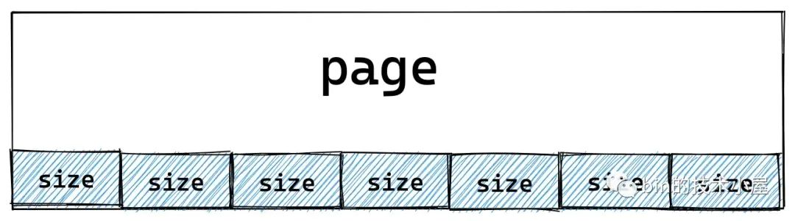
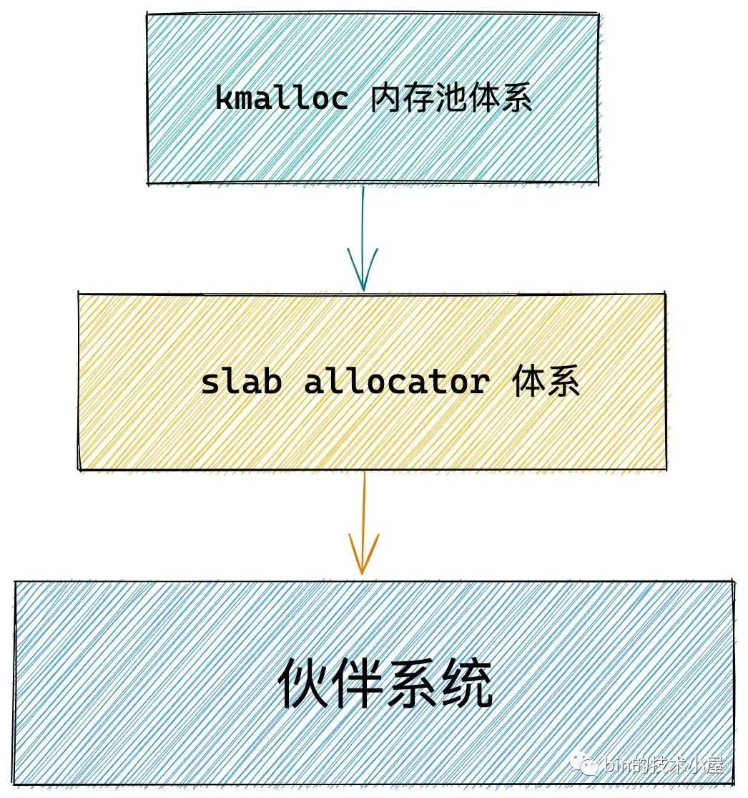
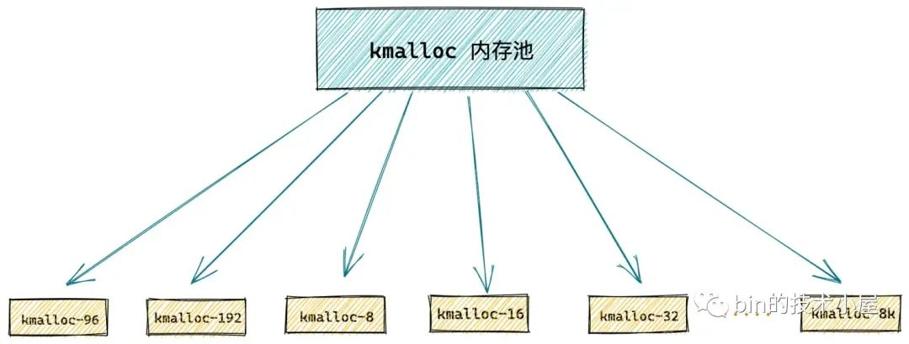
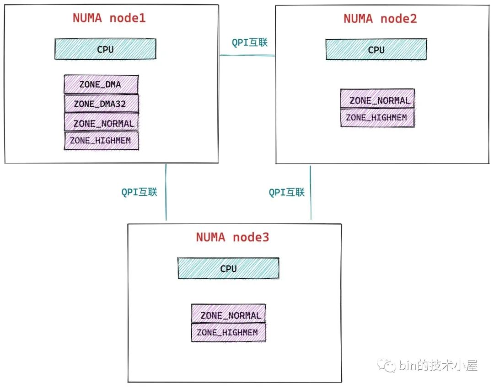
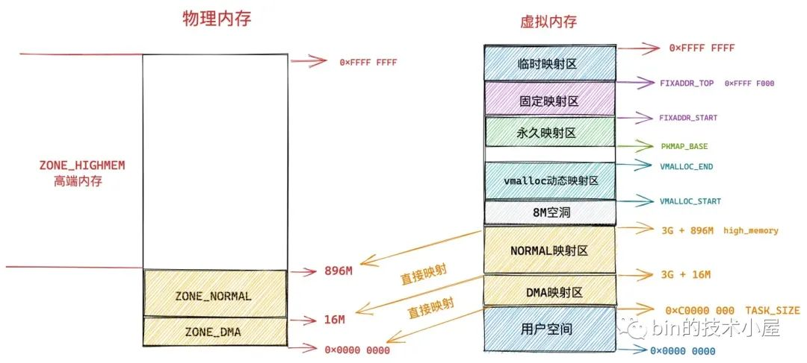
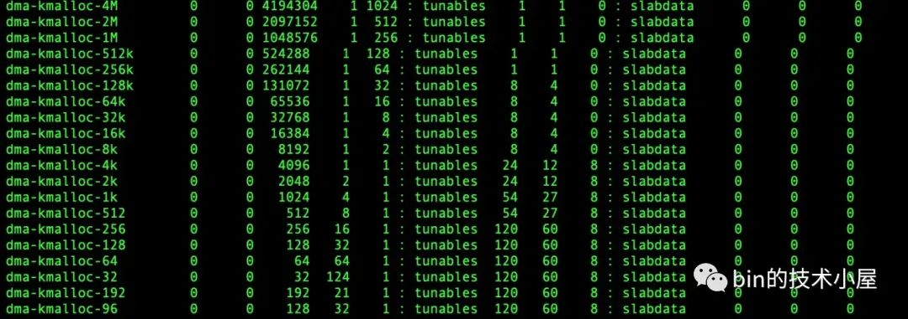
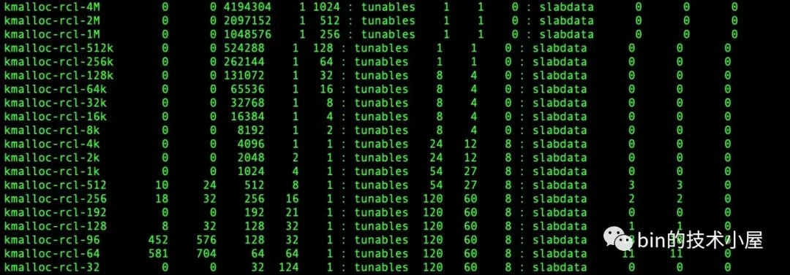
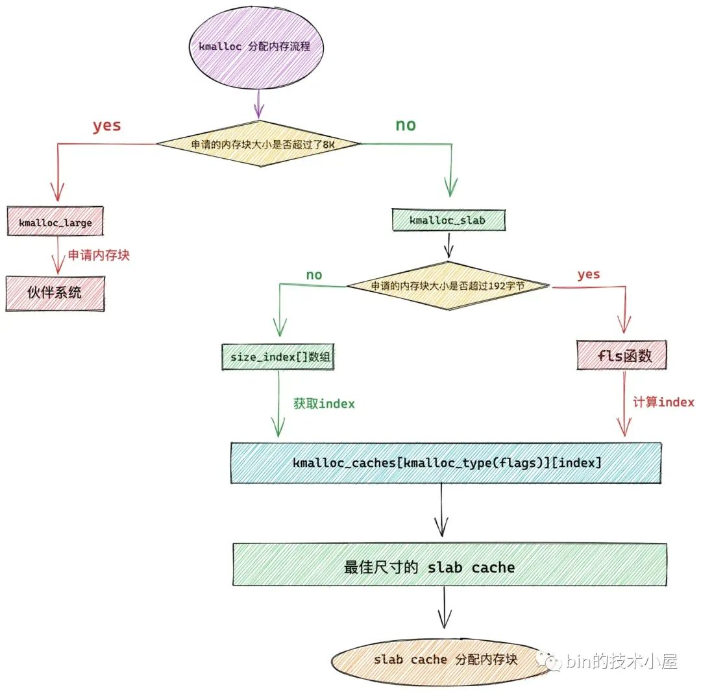
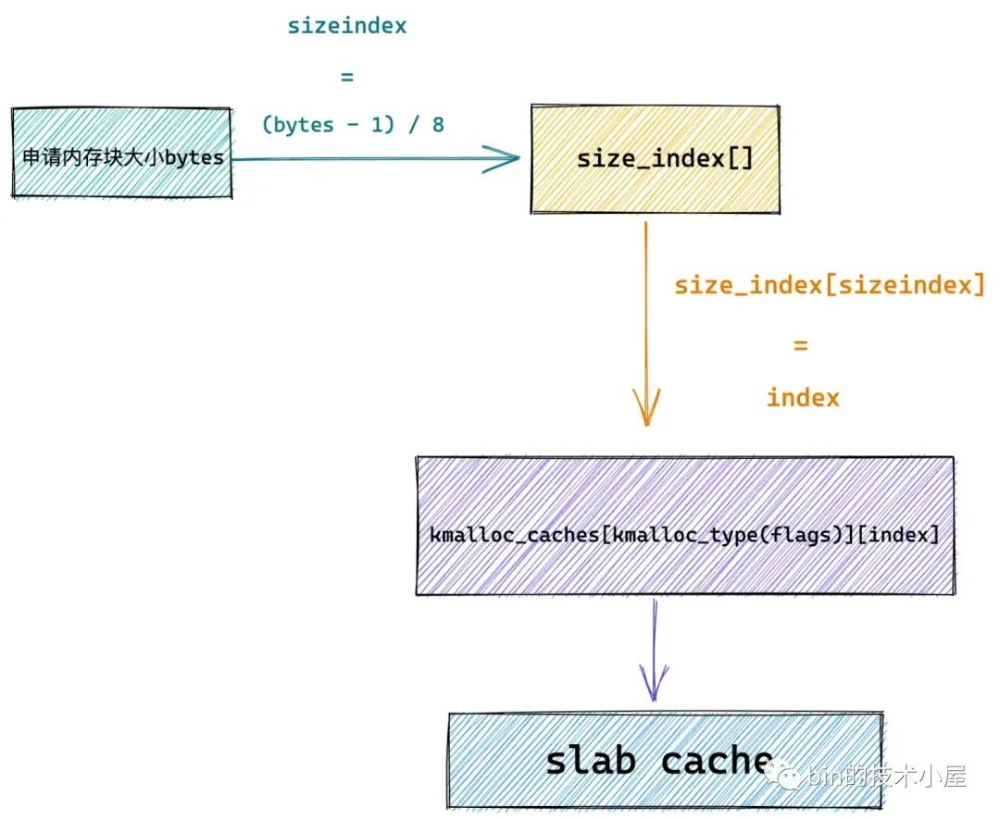
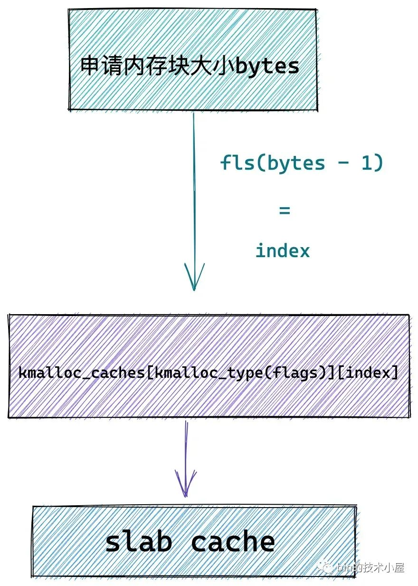

# 深度解读 Linux 内核级通用内存池 —— kmalloc 体系

本文是笔者 slab 系列的最后一篇文章，为了方便大家快速检索，先将相关的文章列举出来：

-   [《细节拉满，80 张图带你一步一步推演 slab 内存池的设计与实现》](https://mp.weixin.qq.com/s?__biz=Mzg2MzU3Mjc3Ng==&mid=2247488319&idx=1&sn=062b7b4e9521bdc6e7050f78229a6cd4&chksm=ce77d578f9005c6e2beb3d60a147c2927542c7e5ebd281e6af2f63d70ffde79322ca634142cb&token=1246371462&lang=zh_CN#rd)
    
-   [《从内核源码看 slab 内存池的创建初始化流程》](https://mp.weixin.qq.com/s?__biz=Mzg2MzU3Mjc3Ng==&mid=2247488095&idx=1&sn=ffc73f33cb03f0be7cf2ab1172fdc448&chksm=ce77d418f9005d0e9d95f223f679198fd2e40377abdcaf2c636962994c3508bcd814f9929937&scene=178&cur_album_id=2559805446807928833#rd)
    
-   [《深入理解 slab cache 内存分配全链路实现》](https://mp.weixin.qq.com/s?__biz=Mzg2MzU3Mjc3Ng==&mid=2247488152&idx=1&sn=7c65f8ee28e9cc14a86e9df92b6d2b93&chksm=ce77d4dff9005dc9003a7df42b6560df13b581e45927bf3ef3e13cc24acc4eb78c2332bd1351&scene=178&cur_album_id=2559805446807928833#rd)
    
-   [《深度解析 slab 内存池回收内存以及销毁全流程》](https://mp.weixin.qq.com/s?__biz=Mzg2MzU3Mjc3Ng==&mid=2247488210&idx=1&sn=61fb6bb2dc19ee3ecf889de0702642d7&chksm=ce77d495f9005d837013fa698914479e5d805040224c2110ba1b8291fb8508b5a6b477f95e09&scene=178&cur_album_id=2559805446807928833#rd)
    

在之前的这四篇文章中，笔者详细的为大家介绍了 slab [内存池](https://so.csdn.net/so/search?q=%E5%86%85%E5%AD%98%E6%B1%A0&spm=1001.2101.3001.7020)的整体架构演化过程，随后基于这个演化过程，介绍了整个 slab alloactor 体系的创建，内存分配，内存释放以及销毁等相关复杂流程在内核中的实现。

我们知道 slab 内存池是专门为了应对内核中关于小[内存分配](https://so.csdn.net/so/search?q=%E5%86%85%E5%AD%98%E5%88%86%E9%85%8D&spm=1001.2101.3001.7020)需求而应运而生的，内核会为每一个核心数据结构创建一个专属的 slab 内存池，专门用于内核核心对象频繁分配和释放的场景。比如，内核中的 task\_struct 结构，mm\_struct 结构，struct page 结构，struct file 结构，socket 结构等等，在内核中都有一个属于自己的专属 slab 内存池。

而之前介绍的这些都属于专有的 slab 内存池，slab 在向[伙伴系统](https://so.csdn.net/so/search?q=%E4%BC%99%E4%BC%B4%E7%B3%BB%E7%BB%9F&spm=1001.2101.3001.7020)申请若干物理内存页 page 之后，内核会按照需要被池化的专有数据结构在内存中的布局 size，从这些物理内存页中划分出多个大小相同的内存块出来，然后将这些划分出来的内存块统一交给其所属的 slab 内存池管理。每个内存块用来专门存储特定结构的内核对象，不能用作其他用途。

内核中除了上述这些专有内存的分配需求之外，其实更多的是通用小内存的分配需求，比如说，内核会申请一些 8 字节，16 字节，32 字节等特定尺寸的通用内存块，内核并不会限制这些通用内存块的用途，可以拿它们来存储任何信息。

内核为了应对这些通用小内存的频繁分配释放需求，于是本文的主题 —— kmalloc 内存池体系就应用而生了，在内核启动初始化的时候，通过 kmem\_cache\_create 接口函数预先创建多个特定尺寸的 slab cache 出来，用以应对不同尺寸的通用内存块的申请。

    struct kmem_cache *
    kmem_cache_create(const char *name, unsigned int size, unsigned int align,
            slab_flags_t flags, void (*ctor)(void *))

我们可以通过 kmem\_cache\_create 函数中的 size 参数来指定要创建的通用内存块尺寸，相关的创建流程细节，感兴趣的同学可以回看下这篇文章 [《从内核源码看 slab 内存池的创建初始化流程》](https://mp.weixin.qq.com/s?__biz=Mzg2MzU3Mjc3Ng==&mid=2247488095&idx=1&sn=ffc73f33cb03f0be7cf2ab1172fdc448&chksm=ce77d418f9005d0e9d95f223f679198fd2e40377abdcaf2c636962994c3508bcd814f9929937&scene=178&cur_album_id=2559805446807928833#rd)。

kmalloc 内存池体系的底层基石是基于 slab alloactor 体系构建的，其本质其实就是各种不同尺寸的通用 slab cache。

我们可以通过 `cat /proc/slabinfo` 命令来查看系统中不同尺寸的通用 slab cache：

`kmalloc-32` 是专门为 32 字节的内存块定制的 slab cache，用于应对 32 字节小内存块的分配与释放。`kmalloc-64` 是专门为 64 字节的内存块定制的 slab cache，`kmalloc-1k` 是专门为 1K 大小的内存块定制的 slab cache 等等。那么 kmalloc 体系究竟包含了哪些尺寸的通用 slab cache 呢 ？

### 1\. kmalloc 内存池中都有哪些尺寸的内存块

> 本文内核源码部分基于 5.4 版本讨论

内核将这些不同尺寸的 slab cache 分类信息定义在 `kmalloc_info[]` 数组中，数组中的元素类型为 kmalloc\_info\_struct 结构，里边定义了对应尺寸通用内存池的相关信息。

    const struct kmalloc_info_struct kmalloc_info[];
    
    /* A table of kmalloc cache names and sizes */
    extern const struct kmalloc_info_struct {
        // slab cache 的名字
        const char *name;
        // slab cache 提供的内存块大小，单位为字节
        unsigned int size;
    } kmalloc_info[];

-   size 用于指定该 slab cache 中所管理的通用内存块尺寸。
-   name 为该通用 slab cache 的名称，名称形式为 `kmalloc-内存块尺寸（单位字节）`，这一点我们可以通过 `cat /proc/slabinfo` 命令查看。

    const struct kmalloc_info_struct kmalloc_info[] __initconst = {
        {NULL,                      0},     {"kmalloc-96",             96},
        {"kmalloc-192",           192},     {"kmalloc-8",               8},
        {"kmalloc-16",             16},     {"kmalloc-32",             32},
        {"kmalloc-64",             64},     {"kmalloc-128",           128},
        {"kmalloc-256",           256},     {"kmalloc-512",           512},
        {"kmalloc-1k",           1024},     {"kmalloc-2k",           2048},
        {"kmalloc-4k",           4096},     {"kmalloc-8k",           8192},
        {"kmalloc-16k",         16384},     {"kmalloc-32k",         32768},
        {"kmalloc-64k",         65536},     {"kmalloc-128k",       131072},
        {"kmalloc-256k",       262144},     {"kmalloc-512k",       524288},
        {"kmalloc-1M",        1048576},     {"kmalloc-2M",        2097152},
        {"kmalloc-4M",        4194304},     {"kmalloc-8M",        8388608},
        {"kmalloc-16M",      16777216},     {"kmalloc-32M",      33554432},
        {"kmalloc-64M",      67108864}
    };
    

从 kmalloc\_info\[\] 数组中我们可以看出，kmalloc 内存池体系理论上最大可以支持 64M 尺寸大小的通用内存池。

**kmalloc\_info\[\] 数组中的 index 有一个特点**，从 index = 3 开始一直到数组的最后一个 index，这其中的每一个 index 都表示其对应的 kmalloc\_info\[index\] 指向的通用 slab cache 尺寸，也就是说 kmalloc 内存池体系中的每个通用 slab cache 中内存块的尺寸由其所在的 kmalloc\_info\[\] 数组 index 决定，对应内存块大小为：`2^index` 字节，比如：

-   kmalloc\_info\[3\] 对应的通用 slab cache 中所管理的内存块尺寸为 8 字节。
-   kmalloc\_info\[5\] 对应的通用 slab cache 中所管理的内存块尺寸为 32 字节。
-   kmalloc\_info\[9\] 对应的通用 slab cache 中所管理的内存块尺寸为 512 字节。
-   kmalloc\_info\[index\] 对应的通用 slab cache 中所管理的内存块尺寸为 2^index 字节。

但是这里的 index = 1 和 index = 2 是个例外，内核单独支持了 kmalloc-96 和 kmalloc-192 这两个通用 slab cache。它们分别管理了 96 字节大小和 192 字节大小的通用内存块。这些内存块的大小都不是 2 的次幂。

那么内核为什么会单独支持这两个尺寸而不是其他尺寸的通用 slab cache 呢？

因为在内核中，对于内存块的申请需求大部分情况下都在 96 字节或者 192 字节附近，如果内核不单独支持这两个尺寸的通用 slab cache。那么当内核申请一个尺寸在 64 字节到 96 字节之间的内存块时，内核会直接从 kmalloc-128 中分配一个 128 字节大小的内存块，这样就导致了内存块内部碎片比较大，浪费宝贵的内存资源。

同理，当内核申请一个尺寸在 128 字节到 192 字节之间的内存块时，内核会直接从 kmalloc-256 中分配一个 256 字节大小的内存块。

当内核申请超过 256 字节的内存块时，一般都是会按照 2 的次幂来申请的，所以这里只需要单独支持 kmalloc-96 和 kmalloc-192 即可。

在我们清楚了 kmalloc 体系中通用内存块的尺寸分布之后，那么当内核向 kmalloc 申请通用内存块的时候，在 kmalloc 的内部又是如何查找出一个最合适的尺寸呢 ？

### 2\. kmalloc 内存池如何选取合适尺寸的内存块

既然 kmalloc 体系中通用内存块的尺寸分布信息可以通过一个数组 kmalloc\_info\[\] 来定义，那么同理，最佳内存块尺寸的选取规则也可以被定义在一个数组中。

内核通过定义一个 `size_index[24]` 数组来存放申请**内存块大小在 192 字节以下**的 kmalloc 内存池选取规则。

其中 `size_index[24]` 数组中每个元素后面跟的注释部分为内核要申请的字节数，`size_index[24]` 数组中每个元素表示最佳合适尺寸的通用 slab cache 在 kmalloc\_info\[\] 数组中的索引。

    static u8 size_index[24] __ro_after_init = {
        3,  /* 8 */
        4,  /* 16 */
        5,  /* 24 */
        5,  /* 32 */
        6,  /* 40 */
        6,  /* 48 */
        6,  /* 56 */
        6,  /* 64 */
        1,  /* 72 */
        1,  /* 80 */
        1,  /* 88 */
        1,  /* 96 */
        7,  /* 104 */
        7,  /* 112 */
        7,  /* 120 */
        7,  /* 128 */
        2,  /* 136 */
        2,  /* 144 */
        2,  /* 152 */
        2,  /* 160 */
        2,  /* 168 */
        2,  /* 176 */
        2,  /* 184 */
        2   /* 192 */
    };

-   size\_index\[0\] 存储的信息表示，如果内核申请的内存块低于 8 字节时，那么 kmalloc 将会到 kmalloc\_info\[3\] 所指定的通用 slab cache —— kmalloc-8 中分配一个 8 字节大小的内存块。
    
-   size\_index\[16\] 存储的信息表示，如果内核申请的内存块在 128 字节到 136 字节之间时，那么 kmalloc 将会到 kmalloc\_info\[2\] 所指定的通用 slab cache —— kmalloc-192 中分配一个 192 字节大小的内存块。
    
-   同样的道理，申请 144，152，160 … 192 等字节尺寸的内存块对应的最佳 slab cache 选取规则也是如此，都是通过 size\_index 数组中的值找到 kmalloc\_info 数组的索引，然后通过 kmalloc\_info\[index\] 指定的 slab cache，分配对应尺寸的内存块。
    

**size\_index 数组只是定义申请内存块在 192 字节以下的 kmalloc 内存池选取规则**，当申请内存块的尺寸超过 192 字节时，内核会通过 fls 函数来计算 kmalloc\_info 数组中的通用 slab cache 索引。这一点我们在后续源码分析中还会在提到，这里大家有个大概印象即可。

> 关于 fls 函数笔者在之前的文章中已经多次提到过，fls 可以获取参数的最高有效 bit 的位数，比如： fls(0)=0，fls(1)=1，fls(4) = 3。

### 3\. kmalloc 内存池的整体架构

kmalloc 内存池的本质其实还是 slab 内存池，底层依赖于 slab alloactor 体系，在 kmalloc 体系的内部，管理了多个不同尺寸的 slab cache，kmalloc 只不过负责根据内核申请的内存块尺寸大小来选取一个最佳合适尺寸的 slab cache。

最终内存块的分配和释放还需要由底层的 slab cache 来负责，经过前两个小节的介绍，现在我们已经对 kmalloc 内存池架构有了一个初步的认识。

    const struct kmalloc_info_struct kmalloc_info[] __initconst = {
        {NULL,                      0},     {"kmalloc-96",             96},
        {"kmalloc-192",           192},     {"kmalloc-8",               8},
        {"kmalloc-16",             16},     {"kmalloc-32",             32},
        {"kmalloc-64",             64},     {"kmalloc-128",           128},
        {"kmalloc-256",           256},     {"kmalloc-512",           512},
        {"kmalloc-1k",           1024},     {"kmalloc-2k",           2048},
        {"kmalloc-4k",           4096},     {"kmalloc-8k",           8192},
        {"kmalloc-16k",         16384},     {"kmalloc-32k",         32768},
        {"kmalloc-64k",         65536},     {"kmalloc-128k",       131072},
        {"kmalloc-256k",       262144},     {"kmalloc-512k",       524288},
        {"kmalloc-1M",        1048576},     {"kmalloc-2M",        2097152},
        {"kmalloc-4M",        4194304},     {"kmalloc-8M",        8388608},
        {"kmalloc-16M",      16777216},     {"kmalloc-32M",      33554432},
        {"kmalloc-64M",      67108864}
    };

我们看到 kmalloc\_info\[\] 数组中定义的内存块尺寸非常的多，但实际上 kmalloc 体系所支持的内存块尺寸与 slab allocator 体系的实现有关，在 Linux 内核中 slab allocator 体系的实现分为三种：slab 实现，slub 实现，slob 实现。

而在被大规模运用的服务器 Linux 操作系统中，slab allocator 体系采用的是 slub 实现，所以本文我们还是以 slub 实现来讨论。

kmalloc 体系所能支持的内存块尺寸范围由 KMALLOC\_SHIFT\_LOW 和 KMALLOC\_SHIFT\_HIGH 决定，它们被定义在 `/include/linux/slab.h` 文件中：

    #ifdef CONFIG_SLUB
    // slub 最大支持分配 2页 大小的对象，对应的 kmalloc 内存池中内存块尺寸最大就是 2页
    // 超过 2页 大小的内存块直接向伙伴系统申请
    #define KMALLOC_SHIFT_HIGH  (PAGE_SHIFT + 1)
    #define KMALLOC_SHIFT_LOW   3
    
    #define PAGE_SHIFT      12

其中 kmalloc 支持的最小内存块尺寸为：`2^KMALLOC_SHIFT_LOW`，在 slub 实现中 KMALLOC\_SHIFT\_LOW = 3，kmalloc 支持的最小内存块尺寸为 8 字节大小。

kmalloc 支持的最大内存块尺寸为：`2^KMALLOC_SHIFT_HIGH`，在 slub 实现中 KMALLOC\_SHIFT\_HIGH = 13，kmalloc 支持的最大内存块尺寸为 8K ，也就是两个内存页大小。

> KMALLOC\_SHIFT\_LOW，KMALLOC\_SHIFT\_HIGH 在 slab 实现，slob 实现中的配置值均不一样，这里笔者就不详细展开了。

所以，实际上，在内核的 slub 实现中，kmalloc 所能支持的内存块大小在 8 字节到 8K 之间。

好了，现在 kmalloc 体系中的内存块尺寸我们已经划分好了，那么 kmalloc 体系中的这些不同尺寸的内存块究竟来自于哪些物理内存区域呢 ？

笔者在 [《一步一图带你深入理解 Linux 物理内存管理》](https://mp.weixin.qq.com/s?__biz=Mzg2MzU3Mjc3Ng==&mid=2247486879&idx=1&sn=0bcc59a306d59e5199a11d1ca5313743&chksm=ce77cbd8f90042ce06f5086b1c976d1d2daa57bc5b768bac15f10ee3dc85874bbeddcd649d88&scene=178&cur_album_id=2559805446807928833#rd)一文中的 “4.3 NUMA 节点物理内存区域的划分” 小节中曾介绍到，内核会根据各个物理内存区域的功能不同，将 NUMA 节点内的物理内存划分为以下几个物理内存区域：

    // 定义在文件： /include/linux/mmzone.h
    enum zone_type {
    #ifdef CONFIG_ZONE_DMA
     ZONE_DMA,
    #endif
    #ifdef CONFIG_ZONE_DMA32
     ZONE_DMA32,
    #endif
     ZONE_NORMAL,
    #ifdef CONFIG_HIGHMEM
     ZONE_HIGHMEM,
    #endif
     ZONE_MOVABLE,
    #ifdef CONFIG_ZONE_DEVICE
     ZONE_DEVICE,
    #endif
     // 充当结束标记, 在内核中想要迭代系统中所有内存域时, 会用到该常量
     __MAX_NR_ZONES
    
    };

**而 kmalloc 内存池中的内存来自于上面的 ZONE\_DMA 和 ZONE\_NORMAL 物理内存区域**，也就是内核虚拟内存空间中的直接映射区域。

kmalloc 内存池中的内存来源类型定义在 `/include/linux/slab.h` 文件中：

    enum kmalloc_cache_type {
        // 规定 kmalloc 内存池的内存需要在 NORMAL 直接映射区分配
        KMALLOC_NORMAL = 0,
        // 规定 kmalloc 内存池中的内存是可以回收的，比如文件页缓存，匿名页
        KMALLOC_RECLAIM,
    #ifdef CONFIG_ZONE_DMA
        // kmalloc 内存池中的内存用于 DMA，需要在 DMA 区域分配
        KMALLOC_DMA,
    #endif
        NR_KMALLOC_TYPES
    };

-   KMALLOC\_NORMAL 表示 kmalloc 需要从 ZONE\_NORMAL 物理内存区域中分配内存。
    
-   KMALLOC\_DMA 表示 kmalloc 需要从 ZONE\_DMA 物理内存区域中分配内存。
    
-   KMALLOC\_RECLAIM 表示需要分配可以被回收的内存，RECLAIM 类型的内存页，不能移动，但是可以直接回收，比如文件缓存页，它们就可以直接被回收掉，当再次需要的时候可以从磁盘中读取生成。或者一些生命周期比较短的内存页，比如 DMA 缓存区中的内存页也是可以被直接回收掉。
    

现在我们在把 kmalloc 内存池中的内存来源加上，kmalloc 的总体架构又有了新的变化：

上图中所展示的 kmalloc 内存池整体架构体系，内核将其定义在一个 kmalloc\_caches 二维数组中，位于文件：`/include/linux/slab.h` 中。

    struct kmem_cache *
    kmalloc_caches[NR_KMALLOC_TYPES][KMALLOC_SHIFT_HIGH + 1]；

-   第一维数组用于表示 kmalloc 内存池中的内存来源于哪些物理内存区域中，也就是前边介绍的 `enum kmalloc_cache_type`。
    
-   第二维数组中的元素一共 KMALLOC\_SHIFT\_HIGH 个，用于存储每种内存块尺寸对应的 slab cache。在 slub 实现中，kmalloc 内存池中的内存块尺寸在 8字节到 8K 之间，其中还包括了两个特殊的尺寸分别为 96 字节 和 192 字节。
    

> 第二维数组中的 index 表示的含义和 kmalloc\_info\[\] 数组中的 index 含义一模一样，均是表示对应 slab cache 中内存块尺寸的分配阶（2 的次幂）。96 和 192 这两个内存块尺寸除外，它们的 index 分别是 1 和 2，单独特殊指定。

好了，到现在我们已经清楚了 kmalloc 内存池的整体架构，那么这个架构体系又是如何被创建出来的呢 ？我们带着这个疑问，接着往下看~~~

### 4\. kmalloc 内存池的创建

由于 kmalloc 体系底层依赖的是 slab allocator 体系，所以 kmalloc 体系的创建是在 slab allocator 体系创建之后进行的，关于 slab allocator 体系创建的详细内容笔者已经在 [《从内核源码看 slab 内存池的创建初始化流程》](https://mp.weixin.qq.com/s?__biz=Mzg2MzU3Mjc3Ng==&mid=2247488095&idx=1&sn=ffc73f33cb03f0be7cf2ab1172fdc448&chksm=ce77d418f9005d0e9d95f223f679198fd2e40377abdcaf2c636962994c3508bcd814f9929937&scene=178&cur_album_id=2559805446807928833#rd)一文的 “12. 内核第一个 slab cache 是如何被创建出来的” 小节介绍过了，在内核初始化内存管理子系统的时候，会在 kmem\_cache\_init 函数中完成 slab alloactor 体系的创建初始化工作，之后紧接着就会创建初始化 kmalloc 体系。

    asmlinkage __visible void __init start_kernel(void)
    {     
          ........ 省略 .........
          // 初始化内存管理子系统
          mm_init();
          
          ........ 省略 .........
    }
    
    /*
     * Set up kernel memory allocators
     */
    static void __init mm_init(void)
    {
          ........ 省略 .........
          // 创建并初始化 slab allocator 体系
          kmem_cache_init();
    
          ........ 省略 .........
    }
    
    void __init kmem_cache_init(void)
    {
        ........... 省略 slab allocator 体系的创建初始化过程 ......
    
        /* Now we can use the kmem_cache to allocate kmalloc slabs */
        // 初始化上边提到的 size_index 数组
        setup_kmalloc_cache_index_table();
        // 创建 kmalloc_info 数组中保存的各个内存块大小对应的 slab cache
        // 最终将这些不同尺寸的 slab cache 缓存在 kmalloc_caches 中
        create_kmalloc_caches(0);
    }

kmalloc 体系的初始化工作核心分为两个部分：

1.  setup\_kmalloc\_cache\_index\_table 初始化我们在本文 《2. kmalloc 内存池如何选取合适尺寸的内存块》小节中介绍的 `size_index` 数组，后续 kmalloc 在分配 192 字节以下的内存块时，内核会利用该数组选取最佳合适尺寸的 slab cache。
    
2.  create\_kmalloc\_caches 创建初始化上一小节中介绍的 kmalloc\_caches 二维数组，这个二维数组正式 kmalloc 体系的核心。内核会利用 kmalloc\_caches 直接找到对应的 slab cache 进行内存块的分配和释放。
    

#### 4.1 kmalloc\_caches 的创建

    struct kmem_cache *
    kmalloc_caches[NR_KMALLOC_TYPES][KMALLOC_SHIFT_HIGH + 1]；

create\_kmalloc\_caches 函数的主要任务就是创建和初始化这个二维数组，它会为每一个 `enum kmalloc_cache_type` 分别创建 `2^KMALLOC_SHIFT_LOW（8 字节）` 到 `2^KMALLOC_SHIFT_HIGH（8K）` 范围内的 slab cache。当然也包括两个特殊的 slab cache 尺寸，他俩分别是：kmalloc-96，kmalloc-192，剩下的 slab cache 尺寸必须是 2 的次幂。

    #define PAGE_SHIFT      12
    #define KMALLOC_SHIFT_HIGH  (PAGE_SHIFT + 1)
    #define KMALLOC_SHIFT_LOW   3
    
    void __init create_kmalloc_caches(slab_flags_t flags)
    {
        int i, type;
        // 初始化二维数组 kmalloc_caches，为每一个 kmalloc_cache_type 类型创建内存块尺寸从 KMALLOC_SHIFT_LOW 到 KMALLOC_SHIFT_HIGH 大小的 kmalloc 内存池
        for (type = KMALLOC_NORMAL; type <= KMALLOC_RECLAIM; type++) {
            // 这里会从 8B 尺寸的内存池开始创建，一直到创建完 8K 尺寸的内存池
            for (i = KMALLOC_SHIFT_LOW; i <= KMALLOC_SHIFT_HIGH; i++) {
                if (!kmalloc_caches[type][i])
                    // 创建对应尺寸的 kmalloc 内存池，其中内存块大小为 2^i 字节
                    new_kmalloc_cache(i, type, flags);
    
                // 创建 kmalloc-96 内存池管理 96B 尺寸的内存块
                // 专门特意创建一个 96字节尺寸的内存池的目的是为了，应对 64B 到 128B 之间的内存分配需求，要不然超过 64B 就分配一个 128B 的内存块有点浪费
                if (KMALLOC_MIN_SIZE <= 32 && i == 6 &&
                        !kmalloc_caches[type][1])
                    new_kmalloc_cache(1, type, flags);
                // 创建 kmalloc-192 内存池管理 192B 尺寸的内存块
                // 这里专门创建一个 192字节尺寸的内存池.是为了分配 128B 到 192B 之间的内存分配需求
                // 要不然超过 128B 直接分配一个 256B 的内存块太浪费了
                if (KMALLOC_MIN_SIZE <= 64 && i == 7 &&
                        !kmalloc_caches[type][2])
                    new_kmalloc_cache(2, type, flags);
            }
        }
    
        // 当 kmalloc 体系全部创建完毕之后，slab 体系的状态就变为 up 状态了
        slab_state = UP;
    
    #ifdef CONFIG_ZONE_DMA
        // 如果配置了 DMA 内存区域，则需要为该区域也创建对应尺寸的内存池
        for (i = 0; i <= KMALLOC_SHIFT_HIGH; i++) {
            struct kmem_cache *s = kmalloc_caches[KMALLOC_NORMAL][i];
    
            if (s) {
                unsigned int size = kmalloc_size(i);
                const char *n = kmalloc_cache_name("dma-kmalloc", size);
    
                BUG_ON(!n);
                kmalloc_caches[KMALLOC_DMA][i] = create_kmalloc_cache(
                    n, size, SLAB_CACHE_DMA | flags, 0, 0);
            }
        }
    #endif
    }

create\_kmalloc\_caches 函数的逻辑不复杂，比较容易理解，但是这里有几个特殊的点，笔者还是要给大家交代清楚。

在第一个 for 循环体内的二重循环里，当 `i = 6` 时，表示现在准备要创建 `2^6 = 64` 字节尺寸的 slab cache —— kmalloc-64，当创建完 kmalloc-64 时，需要紧接着特殊创建 kmalloc-96，而 kmalloc-96 在 kmalloc\_info 数组和 kmalloc\_caches 二维数组中的索引均是 1，所以调用 new\_kmalloc\_cache 创建具体尺寸的 slab cache 时候，第一个参数指的是 slab cache 在 kmalloc\_caches 数组中的 index，这里传入的是 1。

同样的道理，在 当 `i = 7` 时，表示现在准备要创建 `2^7 = 128` 字节尺寸的 slab cache —— kmalloc-128，然后紧接着就需要特殊创建 kmalloc-192，而 kmalloc-192 在 kmalloc\_caches 二维数组中的索引是 2，所以 new\_kmalloc\_cache 第一个参数传入的是 2。

当 KMALLOC\_NORMAL 和 KMALLOC\_RECLAIM 这两个类型的 kmalloc 内存池建立起来之后，slab\_state 就变成了 UP 状态，表示现在 slab allocator 体系已经建立起来了，可以正常运转了。

    enum slab_state {
        DOWN,           /* No slab functionality yet */
        PARTIAL,        /* SLUB: kmem_cache_node available */
        UP,         /* Slab caches usable but not all extras yet */
        FULL            /* Everything is working */
    };

> 关于 slab allocator 体系状态变迁的详细内容，感兴趣的同学可以回看下[《从内核源码看 slab 内存池的创建初始化流程》](https://mp.weixin.qq.com/s?__biz=Mzg2MzU3Mjc3Ng==&mid=2247488095&idx=1&sn=ffc73f33cb03f0be7cf2ab1172fdc448&chksm=ce77d418f9005d0e9d95f223f679198fd2e40377abdcaf2c636962994c3508bcd814f9929937&scene=178&cur_album_id=2559805446807928833#rd)》一文中的 “4. slab allocator 整个体系的状态变迁” 小节。

最后一步就是创建 KMALLOC\_DMA 类型的 kmalloc 内存池，这里会将 KMALLOC\_NORMAL 类型的内存池复刻一遍，内存池中 slab cache 的尺寸还是一样的，只不过名称加了 `dma-` 前缀，还有就是在创建相应 slab cache 的时候指定了 `SLAB_CACHE_DMA` ，表示 slab cache 中的内存页需要来自于 ZONE\_DMA 区域。

#### 4.2 new\_kmalloc\_cache 创建具体尺寸的 slab cache

上一小节介绍的 create\_kmalloc\_caches 函数，是根据 kmalloc\_info\[ \] 数组中的 index 来创建对应尺寸的 slab cache 的。

    const struct kmalloc_info_struct kmalloc_info[] __initconst = {
        {NULL,                      0},     {"kmalloc-96",             96},
        {"kmalloc-192",           192},     {"kmalloc-8",               8},
        {"kmalloc-16",             16},     {"kmalloc-32",             32},
        {"kmalloc-64",             64},     {"kmalloc-128",           128},
        {"kmalloc-256",           256},     {"kmalloc-512",           512},
        {"kmalloc-1k",           1024},     {"kmalloc-2k",           2048},
        {"kmalloc-4k",           4096},     {"kmalloc-8k",           8192},
        {"kmalloc-16k",         16384},     {"kmalloc-32k",         32768},
        {"kmalloc-64k",         65536},     {"kmalloc-128k",       131072},
        {"kmalloc-256k",       262144},     {"kmalloc-512k",       524288},
        {"kmalloc-1M",        1048576},     {"kmalloc-2M",        2097152},
        {"kmalloc-4M",        4194304},     {"kmalloc-8M",        8388608},
        {"kmalloc-16M",      16777216},     {"kmalloc-32M",      33554432},
        {"kmalloc-64M",      67108864}
    };

而具体尺寸的 slab cache 的创建工作由 new\_kmalloc\_cache 函数负责。

    static void __init
    new_kmalloc_cache(int idx, int type, slab_flags_t flags)

该函数的参数含义如下：

-   int idx 表示 kmalloc\_info\[ \] 数组中的 index，对应 slab cache 的尺寸为 2^index 字节，96 字节 和 192 字节这两个尺寸除外，它俩在 kmalloc\_info\[ \] 数组中的 index 分别为 1 和 2。在 create\_kmalloc\_caches 函数中会特殊指定。该 idx 也表示 slab cache 在 kmalloc\_caches 二维数组中的索引。
    
-   int type 表示对应的 kmalloc 内存池类型，指定内存来源于哪个物理内存区域，取值范围来自于 enum kmalloc\_cache\_type 。
    
-   slab\_flags\_t flags 指定创建 slab cache 时的标志位，这里主要用来指定 slab cache 中的内存来源于哪个内存区域。
    

    static void __init
    new_kmalloc_cache(int idx, int type, slab_flags_t flags)
    {
        // 参数 idx，即为 kmalloc_info 数组中的下标
        // 根据 kmalloc_info 数组中的信息创建对应的 kmalloc 内存池
        const char *name;
       // 为 slab cache 创建名称
        if (type == KMALLOC_RECLAIM) {
            flags |= SLAB_RECLAIM_ACCOUNT;
            // kmalloc_cache_name 就是做简单的字符串拼接
            name = kmalloc_cache_name("kmalloc-rcl",
                            kmalloc_info[idx].size);
            BUG_ON(!name);
        } else {
            name = kmalloc_info[idx].name;
        }
        
        // 底层调用 __kmem_cache_create 创建 kmalloc_info[idx].size 尺寸的 slab cache
        kmalloc_caches[type][idx] = create_kmalloc_cache(name,
                        kmalloc_info[idx].size, flags, 0,
                        kmalloc_info[idx].size);
    }
    

如果我们创建的是 KMALLOC\_RECLAIM 类型的 kmalloc 内存池，那么其下所管理的各种尺寸的 slab cache 名称需要加上 `kmalloc-rcl` 前缀。

最后调用 create\_kmalloc\_cache 根据 kmalloc\_info\[idx\].size 和 kmalloc\_info\[idx\].name 指定的尺寸和名称创建 slab cache。关于 slab cache 的详细创建过程，感兴趣的同学可以回看下[《从内核源码看 slab 内存池的创建初始化流程》](https://mp.weixin.qq.com/s?__biz=Mzg2MzU3Mjc3Ng==&mid=2247488095&idx=1&sn=ffc73f33cb03f0be7cf2ab1172fdc448&chksm=ce77d418f9005d0e9d95f223f679198fd2e40377abdcaf2c636962994c3508bcd814f9929937&scene=178&cur_album_id=2559805446807928833#rd)。

### 5\. kmalloc 内存池如何进行内存的分配与回收

现在 kmalloc 内存池的整体架构我们已经创建出来了，内核后续会基于这个架构从 kmalloc 内存池中申请内存块，下面我们一起来看下内存块分配的过程：

    static __always_inline void *kmalloc(size_t size, gfp_t flags)
    {
        return __kmalloc(size, flags);
    }
    
    #define KMALLOC_MAX_CACHE_SIZE	(1UL << KMALLOC_SHIFT_HIGH)
    #define PAGE_SHIFT      12
    #define KMALLOC_SHIFT_HIGH  (PAGE_SHIFT + 1)
    
    void *__kmalloc(size_t size, gfp_t flags)
    {
        struct kmem_cache *s;
        void *ret;
        // KMALLOC_MAX_CACHE_SIZE 规定 kmalloc 内存池所能管理的内存块最大尺寸，在 slub 实现中是 2页 大小
        // 如果使用 kmalloc 申请超过 2页 大小的内存，则直接走伙伴系统
        if (unlikely(size > KMALLOC_MAX_CACHE_SIZE))
            // 底层调用 alloc_pages 向伙伴系统申请超过 2页 的内存块
            return kmalloc_large(size, flags);
        // 根据申请内存块的尺寸 size，在 kmalloc_caches 缓存中选择合适尺寸的内存池
        s = kmalloc_slab(size, flags);
        // 向选取的 slab cache 申请内存块
        ret = slab_alloc(s, flags, _RET_IP_);
        return ret;
    }

当内核向 kmalloc 内存池申请的内存块尺寸 size 超过了 `KMALLOC_MAX_CACHE_SIZE` 的限制时，内核会绕过 kmalloc 内存池直接到伙伴系统中去申请内存页。

kmalloc\_large 函数里边会调用 alloc\_pages，随后会进入伙伴系统中申请内存块。关于 alloc\_pages 函数的详细内容，感兴趣的同学可以回看下笔者之前的文章 [《深入理解 Linux 物理内存分配全链路实现》](https://mp.weixin.qq.com/s?__biz=Mzg2MzU3Mjc3Ng==&mid=2247487111&idx=1&sn=e57371f9c3e6910f4f4721aa0787e537&chksm=ce77c8c0f90041d67b2d344d413a2573f3662a1a64a802b41d4618982fcbff1617d9a5da9f7b&scene=178&cur_album_id=2559805446807928833#rd)。

KMALLOC\_MAX\_CACHE\_SIZE 在 slub 的实现中，配置为 8K 大小，**也就是说在 slub 的实现中，向 kmalloc 内存池申请的内存块超过了 8K 就会直接走伙伴系统**。

如果申请的内存块尺寸 size 低于 8k，那么内核就会从 kmalloc\_caches 中选取一个最佳尺寸的 slab cache，然后通过这个 slab cache 进行内存块的分配。关于 slab cache 内存分配的详细过程，感兴趣的同学可以回看下 [《深入理解 slab cache 内存分配全链路实现》](https://mp.weixin.qq.com/s?__biz=Mzg2MzU3Mjc3Ng==&mid=2247488152&idx=1&sn=7c65f8ee28e9cc14a86e9df92b6d2b93&chksm=ce77d4dff9005dc9003a7df42b6560df13b581e45927bf3ef3e13cc24acc4eb78c2332bd1351&scene=178&cur_album_id=2559805446807928833#rd)。

> 从这里可以看出，kmalloc 内存池在 slub 的实现中，最大能申请的内存块尺寸为 8K，也就是两个物理内存页大小。

#### 5.1 如何从 kmalloc\_caches 中选取最佳尺寸的 slab cache

    struct kmem_cache *kmalloc_slab(size_t size, gfp_t flags)
    {
        unsigned int index;
        // 如果申请的内存块 size 在 192 字节以下，则通过 size_index 数组定位 kmalloc_caches 缓存索引
        // 从而获取到最佳合适尺寸的内存池 slab cache
        if (size <= 192) {
            if (!size)
                return ZERO_SIZE_PTR;
            // 根据申请的内存块 size，定义 size_index 数组索引，从而获取 kmalloc_caches 缓存的 index
            index = size_index[size_index_elem(size)];
        } else {
             // 如果申请的内存块 size 超过 192 字节，则通过 fls 定位 kmalloc_caches 缓存的 index
             // fls 可以获取参数的最高有效 bit 的位数，比如 fls(0)=0，fls(1)=1，fls(4) = 3
            index = fls(size - 1);
        }
        // 根据 kmalloc_type 以及 index 获取最佳尺寸的内存池 slab cache
        return kmalloc_caches[kmalloc_type(flags)][index];
    }

kmalloc 内存池分配内存块的核心就是需要在 kmalloc\_caches 二维数组中查找到最佳合适尺寸的 slab cache，所以目前摆在我们面前最紧迫的一个问题就是如何找到这个最佳的 slab cache 在 kmalloc\_caches 中的索引 index。

当申请内存块的尺寸在 192 字节以下的时候，通过本文 《2. kmalloc 内存池如何选取合适尺寸的内存块》小节的介绍我们知道，内核会通过 size\_index 数组来定位 kmalloc\_caches 中 slab cache 的 index。

> size\_index 数组中存放的值正是 kmalloc\_caches 中的索引 index

    static u8 size_index[24] __ro_after_init = {
        3,  /* 8 */
        4,  /* 16 */
        5,  /* 24 */
        5,  /* 32 */
        6,  /* 40 */
        6,  /* 48 */
        6,  /* 56 */
        6,  /* 64 */
        1,  /* 72 */
        1,  /* 80 */
        1,  /* 88 */
        1,  /* 96 */
        7,  /* 104 */
        7,  /* 112 */
        7,  /* 120 */
        7,  /* 128 */
        2,  /* 136 */
        2,  /* 144 */
        2,  /* 152 */
        2,  /* 160 */
        2,  /* 168 */
        2,  /* 176 */
        2,  /* 184 */
        2   /* 192 */
    };

如果我们能通过申请内存块的大小 size，定位到 size\_index 数组本身的索引 sizeindex，那么我们就可以通过 size\_index\[sizeindex\] 找到 kmalloc\_caches 中的最佳 slab cache 了。

在内核中通过 size\_index\_elem 函数来根据申请内存块的尺寸 bytes，定位 size\_index 数组的索引 sizeindex。

    static inline unsigned int size_index_elem(unsigned int bytes)
    {
        // sizeindex
        return (bytes - 1) / 8;
    }

然后根据 size\_index\[sizeindex\] 的值以及 gfp\_t flags 中指定的 kmalloc\_type 从 kmalloc\_caches 中直接查找出最佳合适尺寸的 slab cahe 出来。

当申请内存块的尺寸在 192 字节以上的时候，内核直接通过 `fls(size - 1)` 来定位 kmalloc\_caches 数组中的索引 index。

目前，我们已经清楚了 slab cache 在 kmalloc\_caches 数组中二维索引 index 的获取逻辑，那么一维索引也就是 kmalloc 内存池中的内存来源类型我们该如何获取呢？

    struct kmem_cache *
    kmalloc_caches[NR_KMALLOC_TYPES][KMALLOC_SHIFT_HIGH + 1]；

一维索引的获取逻辑内核将它封装在 kmalloc\_type 函数中，在这里会将 kmalloc 接口函数中 `gfp_t flags` 掩码中指定的物理内存区域转换为 `enum kmalloc_cache_type`。

    static __always_inline void *kmalloc(size_t size, gfp_t flags)

下面我们就来一起看下这个转换过程~~~

#### 5.2 kmalloc\_cache\_type 的选择

这里的逻辑比较简单，核心就是以下三个规则：

1.  如果 gfp\_t flags 没有特殊指定，那么在默认情况下，内核向 kmalloc 内存池申请的内存均来自于 ZONE\_NORMAL 物理内存区域。
    
2.  如果 gfp\_t flags 明确指定了 \_\_GFP\_DMA，则内核向 kmalloc 内存池申请的内存均来自于 ZONE\_DMA 物理内存区域。
    
3.  如果 gfp\_t flags 明确指定了 \_\_GFP\_RECLAIMABLE，则内核向 kmalloc 内存池申请的内存均是可以被回收的。
    

    static __always_inline enum kmalloc_cache_type kmalloc_type(gfp_t flags)
    {
    #ifdef CONFIG_ZONE_DMA
    
        // 通常情况下 kmalloc 内存池中的内存都来源于 NORMAL 直接映射区
        // 如果没有特殊设定，则从 NORMAL 直接映射区里分配
        if (likely((flags & (__GFP_DMA | __GFP_RECLAIMABLE)) == 0))
            return KMALLOC_NORMAL;
        
        // DMA 区域中的内存是非常宝贵的，如果明确指定需要从 DMA 区域中分配内存
        // 则选取 DMA 区域中的 kmalloc 内存池
        return flags & __GFP_DMA ? KMALLOC_DMA : KMALLOC_RECLAIM;
    #else
        // 明确指定了从 RECLAIMABLE 区域中获取内存，则选取 RECLAIMABLE 区域中 kmalloc 内存池，该区域中的内存页是可以被回收的，比如：文件页缓存
        return flags & __GFP_RECLAIMABLE ? KMALLOC_RECLAIM : KMALLOC_NORMAL;
    #endif
    }
    

#### 5.3 kmalloc 内存池回收内存

内核提供了 kfree 函数来释放由 kmalloc 内存池分配的内存块，参数 x 表示释放内存块的虚拟内存地址。

    void kfree(const void *x)
    {
        struct page *page;
        // x 为要释放的内存块的虚拟内存地址
        void *object = (void *)x;
        // 通过虚拟内存地址找到内存块所在的 page
        page = virt_to_head_page(x);
        // 如果 page 不在 slab cache 的管理体系中，则直接释放回伙伴系统
        if (unlikely(!PageSlab(page))) {
            __free_pages(page, order);
            return;
        }
        // 将内存块释放回其所在的 slub 中
        slab_free(page->slab_cache, page, object, NULL, 1, _RET_IP_);
    }

首先内核需要通过 virt\_to\_head\_page 函数，根据内存块的虚拟内存地址 x 找到其所在的物理内存页 page。

通过 `PageSlab(page)` 检查释放内存块所在物理内存页 struct page 结构中的 flag 属性是否设置了 PG\_slab 标识。

    struct page {
        unsigned long flags;
    } 

> 关于内存页 page 中 flag 属性的详细内容介绍，感兴趣的读者可以回看下[《深入理解 Linux 物理内存管理》](https://mp.weixin.qq.com/s?__biz=Mzg2MzU3Mjc3Ng==&mid=2247486879&idx=1&sn=0bcc59a306d59e5199a11d1ca5313743&chksm=ce77cbd8f90042ce06f5086b1c976d1d2daa57bc5b768bac15f10ee3dc85874bbeddcd649d88&scene=178&cur_album_id=2559805446807928833#rd) 一文中的 “6.3 物理内存页属性和状态的标志位 flag” 小节。

如果 page->flag 没有设置 PG\_slab 标识，说明该物理内存页没有被 slab cache 管理，说明当初调用 kmalloc 分配的时候直接走的是伙伴系统，并没有从 kmalloc 内存池中分配。

那么在这种情况下，可以直接调用 \_\_free\_pages 将物理内存页释放回伙伴系统中。关于伙伴系统回收内存的详细内容，感兴趣的读者可以回看下 [《深度剖析 Linux 伙伴系统的设计与实现》](https://mp.weixin.qq.com/s?__biz=Mzg2MzU3Mjc3Ng==&mid=2247487228&idx=1&sn=85e44fa5b090b29ab23ca6abf98da221&chksm=ce77c8bbf90041ad4958a3871a880a3f6d812e282530ea047d9eaf76d9f03aafb4b987a64ae9&scene=178&cur_album_id=2559805446807928833#rd) 一文中的 “7. 内存释放源码实现” 小节。

如果 page->flag 设置了 PG\_slab 标识，说明内存块分配走的是 kmalloc 内存池，这种情况下，就需要将内存块释放回 kmalloc 内存池中相应的 slab cache 中。

    struct page {
        struct kmem_cache *slab_cache;
    } 

我们可以通过 struct page 结构的 slab\_cache 属性，获取 page 所属的 slab cache。近而通过内核提供的 kmem\_cache\_free 接口，将内存块释放回对应的 slab cache 中。

    void kmem_cache_free(struct kmem_cache *s, void *x)

关于 slab cache 回收内存块的详细内容，感兴趣的读者可以回看下 [《深度解析 slab 内存池回收内存以及销毁全流程》](https://mp.weixin.qq.com/s?__biz=Mzg2MzU3Mjc3Ng==&mid=2247488210&idx=1&sn=61fb6bb2dc19ee3ecf889de0702642d7&chksm=ce77d495f9005d837013fa698914479e5d805040224c2110ba1b8291fb8508b5a6b477f95e09&scene=178&cur_album_id=2559805446807928833#rd) 一文中的内容。

### 总结

整个 kmalloc 通用内存池体系的核心是围绕着 kmalloc\_caches 这个二维数组召开的。

    struct kmem_cache *
    kmalloc_caches[NR_KMALLOC_TYPES][KMALLOC_SHIFT_HIGH + 1]；

其中一维数组中定义的是 kmalloc 内存池中的内存来源，在内核中使用 `enum kmalloc_cache_type` 来表示：

    enum kmalloc_cache_type {
        // 规定 kmalloc 内存池的内存需要在 NORMAL 直接映射区分配
        KMALLOC_NORMAL = 0,
        // 规定 kmalloc 内存池中的内存是可以回收的，比如文件页缓存，匿名页
        KMALLOC_RECLAIM,
    #ifdef CONFIG_ZONE_DMA
        // kmalloc 内存池中的内存用于 DMA，需要在 DMA 区域分配
        KMALLOC_DMA,
    #endif
        NR_KMALLOC_TYPES
    };

我们可以通过 kmalloc\_type 函数从用户指定的 gfp\_t flags 标记位中提取出 kmalloc\_cache\_type。

    static __always_inline enum kmalloc_cache_type kmalloc_type(gfp_t flags)

> 通常情况下 kmalloc 内存池中的内存都来源于 NORMAL 直接映射区。

这样我们就定位到了 kmalloc\_caches 中的一维数组，二维数组中定义的是 kmalloc 内存池所支持的内存块尺寸的范围，二维数组中的 index 表示的含义比较巧妙，它表示了对应 slab cache 中所管理的内存块尺寸的分配阶（2 的次幂），96 和 192 这两个内存块尺寸除外，它们的 index 分别是 1 和 2，单独特殊指定。

kmalloc 内存池所能支持的内存块尺寸范围定义在 kmalloc\_info 数组中：

    const struct kmalloc_info_struct kmalloc_info[] __initconst = {
        {NULL,                      0},     {"kmalloc-96",             96},
        {"kmalloc-192",           192},     {"kmalloc-8",               8},
        {"kmalloc-16",             16},     {"kmalloc-32",             32},
        {"kmalloc-64",             64},     {"kmalloc-128",           128},
        {"kmalloc-256",           256},     {"kmalloc-512",           512},
        {"kmalloc-1k",           1024},     {"kmalloc-2k",           2048},
        {"kmalloc-4k",           4096},     {"kmalloc-8k",           8192},
        {"kmalloc-16k",         16384},     {"kmalloc-32k",         32768},
        {"kmalloc-64k",         65536},     {"kmalloc-128k",       131072},
        {"kmalloc-256k",       262144},     {"kmalloc-512k",       524288},
        {"kmalloc-1M",        1048576},     {"kmalloc-2M",        2097152},
        {"kmalloc-4M",        4194304},     {"kmalloc-8M",        8388608},
        {"kmalloc-16M",      16777216},     {"kmalloc-32M",      33554432},
        {"kmalloc-64M",      67108864}
    };

但实际上 kmalloc 体系所支持的内存块尺寸与 slab allocator 体系的实现有关，在 slub 实现中，kmalloc 所能支持的最小内存块为 8 字节，所能支持的最大内存块为 8K，超过了 8K 就会直接到伙伴系统中去申请。

    #ifdef CONFIG_SLUB
    // slub 最大支持分配 2页 大小的对象，对应的 kmalloc 内存池中内存块尺寸最大就是 2页
    // 超过 2页 大小的内存块直接向伙伴系统申请
    #define KMALLOC_SHIFT_HIGH  (PAGE_SHIFT + 1)
    #define KMALLOC_SHIFT_LOW   3
    
    #define PAGE_SHIFT      12

当申请的内存块尺寸在 192 字节以下时，我们可以通过 size\_index\[\] 数组中定义的规则，找到 kmalloc\_caches 二维数组中的 index，从而定位到最佳合适尺寸的 slab cache。

当申请内存块的尺寸在 192 字节以上的时候，内核直接通过 fls(size - 1) 来定位 kmalloc\_caches 数组中的索引 index。

当我们定位到具体的 slab cache 之后，剩下的事情就好办了，直接从该 slab cache 中分配指定大小的内存块，在使用完之后通过 kfree 函数在释放回对应的 slab cache 中。

好了，关于 kmalloc 体系的全部内容到这里就全部介绍完了，感谢大家的收看，我们下篇文章见~~~