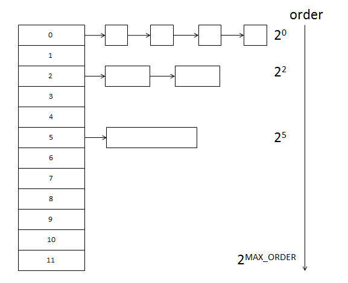
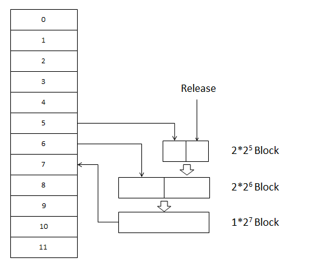
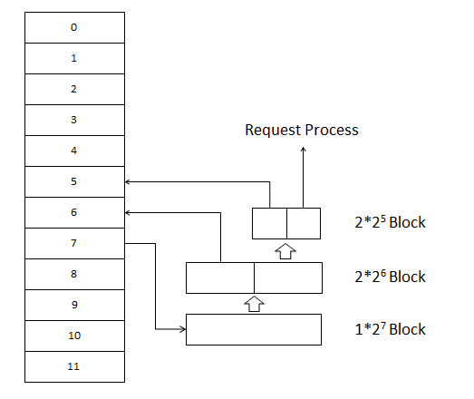

[Linux-3.14.12内存管理笔记【伙伴管理算法（3）】](http://blog.chinaunix.net/uid-26859697-id-4882194.html)

前面分析了伙伴管理算法的初始化，在切入分析代码实现之前，例行先分析一下其实现原理。

伙伴管理算法（也称之为Buddy算法），该算法将所有空闲的页面分组划分为MAX_ORDER个页面块链表进行管理，其中MAX_ORDER定义：

```
【file:/include/linux/mmzone.h】
#ifndef CONFIG_FORCE_MAX_ZONEORDER
#define MAX_ORDER 11
#else
#define MAX_ORDER CONFIG_FORCE_MAX_ZONEORDER
#endif
```

通常该值都是定义为11，而CONFIG_FORCE_MAX_ZONEORDER定义：

```
【file:/arch/tile/include/asm/page.h】
/*
 * If the Kconfig doesn't specify, set a maximum zone order that
 * is enough so that we can create huge pages from small pages given
 * the respective sizes of the two page types. See <linux/mmzone.h>.
 */
#ifndef CONFIG_FORCE_MAX_ZONEORDER
#define CONFIG_FORCE_MAX_ZONEORDER (HPAGE_SHIFT - PAGE_SHIFT + 1)
#endif
```

该值具体多少没细入分析。其中tile是指Tilera处理器，顺带介绍一下：Tilera公司是位于硅谷的新创无晶圆半导体公司，该公司创始人之一是麻省理工学院（MIT）教授阿南特·阿加瓦尔（Anant Agarwal），他在2004年创建了该公司，因为在多核技术方面拥有独家的先进技术，该公司曾被美国知名媒体EETIMES评为全球最有希望的60家新兴企业之一。该公司的处理器功耗据说很低，但是性能却是杠杠滴。迄今为止本人还没接触过该公司的处理器，惭愧惭愧，路漫漫其修远兮。

接着，基于MAX_ORDER为11的情况，伙伴管理算法每个页面块链表分别包含了：1、2、4、8、16、32、64、128、256、512、1024个连续的页面，每个页面块的第一个页面的物理地址是该块大小的整数倍。假设连续的物理内存，各页面块左右的页面，要么是等同大小，要么就是整数倍，而且还是偶数，形同伙伴。

其管理起来如图：



伙伴管理算法的释放过程是，满足条件的两个页面块称之为伙伴：两个页面块的大小相同且两者的物理地址连续。当某块页面被释放时，且其存在空闲的伙伴页面块，则算法会将其两者合并为一个大的页面块，合并后的页面块如果还可以找到伙伴页面块，则将会继续与相邻的块进行合并，直至到大小为2^MAX_ORDER个页面为止。

释放如图：



而伙伴管理算法的申请过程则相反，如果申请指定大小的页面在其页面块链表中不存在，则会往高阶的页面块链表进行查找，如果依旧没找到，则继续往高阶进行查找，直到找到为止，否则就是申请失败了。如果在高阶的页面块链表找到空闲的页面块，则会将其拆分为两块，如果拆分后仍比需要的大，那么继续拆分，直至到大小刚好为止，这样避免了资源浪费。

具体的申请如图：



## 参考

[Linux-3.14.12内存管理笔记【伙伴管理算法（3）】-Jean_Leo-ChinaUnix博客](http://blog.chinaunix.net/uid-26859697-id-4882194.html)