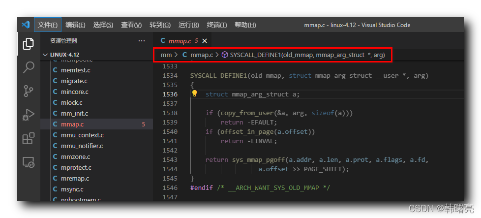

【Linux 内核 内存管理】mmap 系统调用源码分析 ① ( mmap 与 mmap2 系统调用 | Linux 内核中的 mmap 系统调用源码 )

#### 文章目录

-   [一、mmap 与 mmap2 系统调用](https://cloud.tencent.com/developer?from_column=20421&from=20421)
-   [二、Linux 内核中的 mmap 系统调用源码](https://cloud.tencent.com/developer?from_column=20421&from=20421)

## 一、mmap 与 mmap2 系统调用

* * *

`mmap` 创建 " 内存映射 " 的 系统调用 有

2

种实现 , `mmap` 和 `mmap2` ;

2

者区别是 :

`mmap` 偏移单位是 " 字节 " ,

`mmap2` 偏移单位是 " 页 " ,

但是在 arm 64 体系架构中 , 没有实现 `mmap2` , 只实现了 `mmap` 系统调用 ;

## 二、Linux 内核中的 mmap 系统调用源码

* * *

arm64 架构体系中 , 使用 `mmap` 系统调用 创建 " 内存映射 " ,

调用 `mmap` 系统调用函数 , 执行如下操作 :

先检查 " 偏移 " 是否是 " 内存页大小 " 的 " 整数倍 " ,

-   如果偏移不是内存页大小的整数倍 , 返回 `-EINVAL` 错误 ;
-   如果偏移是内存页大小的整数倍 , 则调用 `sys_mmap_pgoff` 函数 , 继续向下执行 ;

`mmap` 系统调用代码如下 :

代码语言：javascript

复制

    SYSCALL_DEFINE1(old_mmap, struct mmap_arg_struct __user *, arg)
    {
    	struct mmap_arg_struct a;
    
    	if (copy_from_user(&a, arg, sizeof(a)))
    		return -EFAULT;
    	if (offset_in_page(a.offset))
    		return -EINVAL;
    
    	return sys_mmap_pgoff(a.addr, a.len, a.prot, a.flags, a.fd,
    			      a.offset >> PAGE_SHIFT);
    }

**参考路径 :** linux-4.12\\mm\\mmap.c#1534

在这里插入图片描述

## 参考

[【Linux 内核 内存管理】mmap 系统调用源码分析 ① ( mmap 与 mmap2 系统调用 | Linux 内核中的 mmap 系统调用源码 )-腾讯云开发者社区-腾讯云 (tencent.com)](https://cloud.tencent.com/developer/article/2253486)

[韩曙亮 - 个人中心 - 腾讯云开发者社区-腾讯云 (tencent.com)](https://cloud.tencent.com/developer/user/2542479/articles)