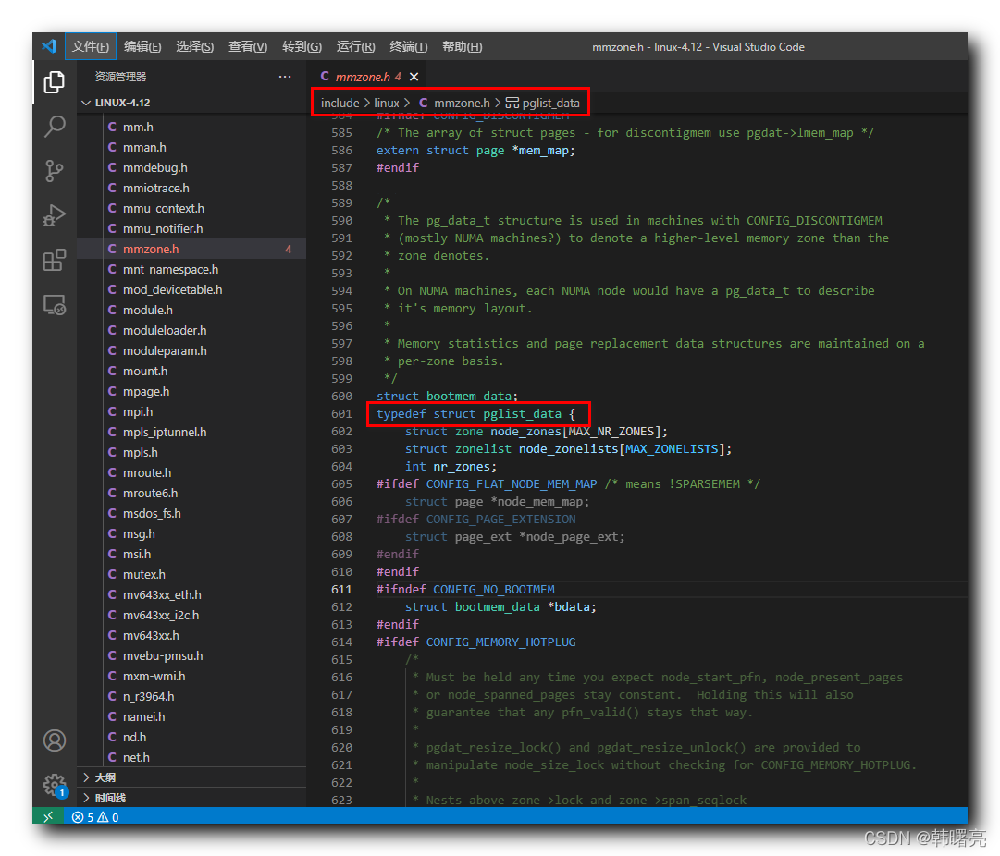

【Linux 内核 内存管理】物理内存组织结构 ③ ( 内存管理系统三级结构 | 内存节点描述 | 内存节点 pglist_data 结构体 | pglist_data 结构体源码 )

#### 文章目录

-   [一、内存节点描述](https://cloud.tencent.com/developer?from_column=20421&from=20421)
-   [二、内存节点 pglist\_data 结构体](https://cloud.tencent.com/developer?from_column=20421&from=20421)
-   [三、pglist\_data 结构体源码](https://cloud.tencent.com/developer?from_column=20421&from=20421)

**内存管理****系统**

33

**级结构 :**

① 节点 Node ,

② 区域 Zone ,

③ 页 Page ,

Linux 内核中 , 使用 上述

33

级结构 描述 和 管理 " 物理内存 " ;

## 一、内存节点描述

* * *

Linux 内核中 , 内存节点 ( Node ) 是 " 内存管理 " 的 最顶层的结构 , 下层分别是 区域 和 页 ;

在 NUMA 非一致内存访问架构 中, 将 CPU 划分为多个节点 , 每个节点都有自己的 " 内存控制器 " 和 " 内存插槽 " , CPU 访问自己的节点上的 内存 很快 , 但是访问其它 CPU 的内存 很慢 ;

UMA 统一内存访问架构 / SMP 对称多处理器架构 , 就是当做

11

个节点的 NUMA 架构的系统 ;

NUMA 非一致内存访问结构 中 的 " 内存节点 " , 根据 " 处理器与内存的距离 " 划分 " 内存节点 " ;

在 不连续内存 的 NUMA 架构中 , 根据 " 物理地址是否连续 " 划分 " 内存节点 " , 每个 物理地址连续 的内存块 是一个 " 内存节点 " ;

## 二、内存节点 pglist\_data 结构体

* * *

Linux 内核中 , 使用 `pglist_data` 结构体 描述 " 内存节点 " , 该结构体定义在 Linux 内核源码中的 linux-4.12\\include\\linux\\mmzone.h#601 位置 ;

其中 :

`node_zones` 是 内存区域数组 ;

代码语言：javascript

复制

    struct zone node_zones[MAX_NR_ZONES];

`node_zonelists` 是 备用区域列表 ;

代码语言：javascript

复制

    struct zonelist node_zonelists[MAX_ZONELISTS];

`nr_zones` 是 该 " 内存节点 " 包含 多少个 " 内存区域 " ;

代码语言：javascript

复制

    // 该 " 内存节点 " 包含 多少个 " 内存区域 "
    int nr_zones;

`CONFIG_FLAT_NODE_MEM_MAP` 宏定义指的是 " 除 稀疏内存模型 之外 " 的情况 , 该情况下 声明 `struct page *node_mem_map` 页描述数组 ;

`struct page_ext *node_page_ext` 是 内存页的扩展属性 ;

代码语言：javascript

复制

    #ifdef CONFIG_FLAT_NODE_MEM_MAP	/* means !SPARSEMEM */
    	// 页描述数组
    	struct page *node_mem_map;
    #ifdef CONFIG_PAGE_EXTENSION
    	// 内存页的扩展属性
    	struct page_ext *node_page_ext;
    #endif
    #endif

`node_start_pfn` 是 该 " 内存节点 " 的 起始物理页 编号 ;

`node_present_pages` 是 物理页 的总数 ;

`node_spanned_pages` 是 物理页 的区间范围 总大小 , 该大小包括 " 内存空洞 " 大小 ;

`node_id` 是 节点标识符 ;

代码语言：javascript

复制

    	// 该 " 内存节点 " 的 起始物理页 编号
    	unsigned long node_start_pfn;
    	// 物理页 的总数
    	unsigned long node_present_pages; /* total number of physical pages */
    	//  物理页 的区间范围 总大小 , 该大小包括 " 内存空洞 " 大小
    	unsigned long node_spanned_pages; /* total size of physical page
    					     range, including holes */
    	// 节点标识符
    	int node_id;

## 三、pglist\_data 结构体源码

* * *

Linux 内核中 , 使用 `pglist_data` 结构体 描述 " 内存节点 " , 该结构体定义在 Linux 内核源码中的 linux-4.12\\include\\linux\\mmzone.h#601 位置 ;

**`pglist_data` 结构体源码 如下 :**

在这里插入图片描述

代码语言：javascript

复制

    /*
     * The pg_data_t structure is used in machines with CONFIG_DISCONTIGMEM
     * (mostly NUMA machines?) to denote a higher-level memory zone than the
     * zone denotes.
     *
     * On NUMA machines, each NUMA node would have a pg_data_t to describe
     * it's memory layout.
     *
     * Memory statistics and page replacement data structures are maintained on a
     * per-zone basis.
     */
    struct bootmem_data;
    typedef struct pglist_data {
    	struct zone node_zones[MAX_NR_ZONES];
    	struct zonelist node_zonelists[MAX_ZONELISTS];
    	int nr_zones;
    #ifdef CONFIG_FLAT_NODE_MEM_MAP	/* means !SPARSEMEM */
    	struct page *node_mem_map;
    #ifdef CONFIG_PAGE_EXTENSION
    	struct page_ext *node_page_ext;
    #endif
    #endif
    #ifndef CONFIG_NO_BOOTMEM
    	struct bootmem_data *bdata;
    #endif
    #ifdef CONFIG_MEMORY_HOTPLUG
    	/*
    	 * Must be held any time you expect node_start_pfn, node_present_pages
    	 * or node_spanned_pages stay constant.  Holding this will also
    	 * guarantee that any pfn_valid() stays that way.
    	 *
    	 * pgdat_resize_lock() and pgdat_resize_unlock() are provided to
    	 * manipulate node_size_lock without checking for CONFIG_MEMORY_HOTPLUG.
    	 *
    	 * Nests above zone->lock and zone->span_seqlock
    	 */
    	spinlock_t node_size_lock;
    #endif
    	unsigned long node_start_pfn;
    	unsigned long node_present_pages; /* total number of physical pages */
    	unsigned long node_spanned_pages; /* total size of physical page
    					     range, including holes */
    	int node_id;
    	wait_queue_head_t kswapd_wait;
    	wait_queue_head_t pfmemalloc_wait;
    	struct task_struct *kswapd;	/* Protected by
    					   mem_hotplug_begin/end() */
    	int kswapd_order;
    	enum zone_type kswapd_classzone_idx;
    
    	int kswapd_failures;		/* Number of 'reclaimed == 0' runs */
    
    #ifdef CONFIG_COMPACTION
    	int kcompactd_max_order;
    	enum zone_type kcompactd_classzone_idx;
    	wait_queue_head_t kcompactd_wait;
    	struct task_struct *kcompactd;
    #endif
    #ifdef CONFIG_NUMA_BALANCING
    	/* Lock serializing the migrate rate limiting window */
    	spinlock_t numabalancing_migrate_lock;
    
    	/* Rate limiting time interval */
    	unsigned long numabalancing_migrate_next_window;
    
    	/* Number of pages migrated during the rate limiting time interval */
    	unsigned long numabalancing_migrate_nr_pages;
    #endif
    	/*
    	 * This is a per-node reserve of pages that are not available
    	 * to userspace allocations.
    	 */
    	unsigned long		totalreserve_pages;
    
    #ifdef CONFIG_NUMA
    	/*
    	 * zone reclaim becomes active if more unmapped pages exist.
    	 */
    	unsigned long		min_unmapped_pages;
    	unsigned long		min_slab_pages;
    #endif /* CONFIG_NUMA */
    
    	/* Write-intensive fields used by page reclaim */
    	ZONE_PADDING(_pad1_)
    	spinlock_t		lru_lock;
    
    #ifdef CONFIG_DEFERRED_STRUCT_PAGE_INIT
    	/*
    	 * If memory initialisation on large machines is deferred then this
    	 * is the first PFN that needs to be initialised.
    	 */
    	unsigned long first_deferred_pfn;
    	unsigned long static_init_size;
    #endif /* CONFIG_DEFERRED_STRUCT_PAGE_INIT */
    
    #ifdef CONFIG_TRANSPARENT_HUGEPAGE
    	spinlock_t split_queue_lock;
    	struct list_head split_queue;
    	unsigned long split_queue_len;
    #endif
    
    	/* Fields commonly accessed by the page reclaim scanner */
    	struct lruvec		lruvec;
    
    	/*
    	 * The target ratio of ACTIVE_ANON to INACTIVE_ANON pages on
    	 * this node's LRU.  Maintained by the pageout code.
    	 */
    	unsigned int inactive_ratio;
    
    	unsigned long		flags;
    
    	ZONE_PADDING(_pad2_)
    
    	/* Per-node vmstats */
    	struct per_cpu_nodestat __percpu *per_cpu_nodestats;
    	atomic_long_t		vm_stat[NR_VM_NODE_STAT_ITEMS];
    } pg_data_t;

**源码路径 :** linux-4.12\\include\\linux\\mmzone.h#601

## 参考

[【Linux 内核 内存管理】物理内存组织结构 ③ ( 内存管理系统三级结构 | 内存节点描述 | 内存节点 pglist_data 结构体 | pglist_data 结构体源码 )-腾讯云开发者社区-腾讯云 (tencent.com)](https://cloud.tencent.com/developer/article/2253500)