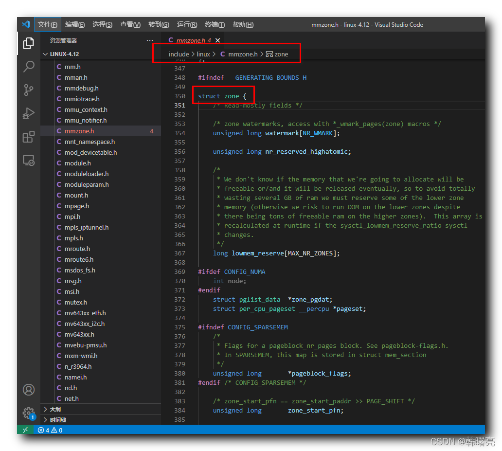

【Linux 内核 内存管理】物理内存组织结构 ④ ( 内存区域 zone 简介 | zone 结构体源码分析 | zone 结构体源码 )

#### 文章目录

-   [一、内存区域 zone 简介](https://cloud.tencent.com/developer?from_column=20421&from=20421)
-   [二、zone 结构体源码分析](https://cloud.tencent.com/developer?from_column=20421&from=20421)
-   -   [1、watermark 成员](https://cloud.tencent.com/developer?from_column=20421&from=20421)
    -   [2、lowmem\_reserve 成员](https://cloud.tencent.com/developer?from_column=20421&from=20421)
    -   [3、zone\_pgdat 成员](https://cloud.tencent.com/developer?from_column=20421&from=20421)
    -   [4、pageset 成员](https://cloud.tencent.com/developer?from_column=20421&from=20421)
    -   [5、zone\_start\_pfn 成员](https://cloud.tencent.com/developer?from_column=20421&from=20421)
    -   [6、managed\_pages、spanned\_pages、present\_pages成员](https://cloud.tencent.com/developer?from_column=20421&from=20421)
    -   [7、name 成员](https://cloud.tencent.com/developer?from_column=20421&from=20421)
    -   [8、free\_area 成员](https://cloud.tencent.com/developer?from_column=20421&from=20421)
-   [三、zone 结构体源码](https://cloud.tencent.com/developer?from_column=20421&from=20421)

**内存管理****系统**

33

**级结构 :**

① 内存节点 Node ,

② 内存区域 Zone ,

③ 内存页 Page ,

Linux 内核中 , 使用 上述

33

级结构 描述 和 管理 " 物理内存 " ;

## 一、内存区域 zone 简介

* * *

" 内存节点 " 是内存管理的 最顶层结构 ,

" 内存节点 " 再向下划分 , 就是 " 内存区域 " zone ,

" 内存区域 " 在 Linux 内核中使用 `struct zone` 结构体类型进行描述 , `zone` 枚举定义在 Linux 内核源码的 linux-4.12\\include\\linux\\mmzone.h#350 位置 ;

每个 " 内存区域 " , 都使用

11

个 `zone` 结构体 描述 ;

在这里插入图片描述

## 二、zone 结构体源码分析

* * *

### 1、watermark 成员

`watermark` 表示 " 页分配器 " 使用的 水线 ;

代码语言：javascript

复制

    	/* zone watermarks, access with *_wmark_pages(zone) macros */
    	unsigned long watermark[NR_WMARK];

### 2、lowmem\_reserve 成员

`lowmem_reserve` 表示 页分配器 使用的 区域 , 这些区域 必须 保留 , 不能借给高区域类型 ;

代码语言：javascript

复制

    	/*
    	 * We don't know if the memory that we're going to allocate will be
    	 * freeable or/and it will be released eventually, so to avoid totally
    	 * wasting several GB of ram we must reserve some of the lower zone
    	 * memory (otherwise we risk to run OOM on the lower zones despite
    	 * there being tons of freeable ram on the higher zones).  This array is
    	 * recalculated at runtime if the sysctl_lowmem_reserve_ratio sysctl
    	 * changes.
    	 */
    	long lowmem_reserve[MAX_NR_ZONES];

### 3、zone\_pgdat 成员

`zone_pgdat` 指向 " 内存节点 " 的 `pglist_data` 实例 ;

代码语言：javascript

复制

    	struct pglist_data	*zone_pgdat;

### 4、pageset 成员

`pageset` 表示 每个 " 处理页 " 的集合 ;

代码语言：javascript

复制

    	struct per_cpu_pageset __percpu *pageset;

### 5、zone\_start\_pfn 成员

`zone_start_pfn` 表示当前 " 内存区域 zone " 的 " 起始物理页 " 编号 ;

代码语言：javascript

复制

    	/* zone_start_pfn == zone_start_paddr >> PAGE_SHIFT */
    	unsigned long		zone_start_pfn;

### 6、managed\_pages、spanned\_pages、present\_pages成员

`managed_pages` 表示 " 伙伴分配器 " 管理的 物理页数量 ;

`spanned_pages` 表示 当前的 " 内存区域 " 跨越的 物理页 个数 , 包含 " 内存空洞 " ;

`present_pages` 表示 当前的 " 内存区域 " 包含的 物理页 个数 , 不包含 " 内存空洞 " ;

代码语言：javascript

复制

    	/*
    	 * spanned_pages is the total pages spanned by the zone, including
    	 * holes, which is calculated as:
    	 * 	spanned_pages = zone_end_pfn - zone_start_pfn;
    	 *
    	 * present_pages is physical pages existing within the zone, which
    	 * is calculated as:
    	 *	present_pages = spanned_pages - absent_pages(pages in holes);
    	 *
    	 * managed_pages is present pages managed by the buddy system, which
    	 * is calculated as (reserved_pages includes pages allocated by the
    	 * bootmem allocator):
    	 *	managed_pages = present_pages - reserved_pages;
    	 *
    	 * So present_pages may be used by memory hotplug or memory power
    	 * management logic to figure out unmanaged pages by checking
    	 * (present_pages - managed_pages). And managed_pages should be used
    	 * by page allocator and vm scanner to calculate all kinds of watermarks
    	 * and thresholds.
    	 *
    	 * Locking rules:
    	 *
    	 * zone_start_pfn and spanned_pages are protected by span_seqlock.
    	 * It is a seqlock because it has to be read outside of zone->lock,
    	 * and it is done in the main allocator path.  But, it is written
    	 * quite infrequently.
    	 *
    	 * The span_seq lock is declared along with zone->lock because it is
    	 * frequently read in proximity to zone->lock.  It's good to
    	 * give them a chance of being in the same cacheline.
    	 *
    	 * Write access to present_pages at runtime should be protected by
    	 * mem_hotplug_begin/end(). Any reader who can't tolerant drift of
    	 * present_pages should get_online_mems() to get a stable value.
    	 *
    	 * Read access to managed_pages should be safe because it's unsigned
    	 * long. Write access to zone->managed_pages and totalram_pages are
    	 * protected by managed_page_count_lock at runtime. Idealy only
    	 * adjust_managed_page_count() should be used instead of directly
    	 * touching zone->managed_pages and totalram_pages.
    	 */
    	unsigned long		managed_pages;
    	unsigned long		spanned_pages;
    	unsigned long		present_pages;

### 7、name 成员

`name` 表示 " 内存区域 " 名称 ;

代码语言：javascript

复制

    	const char		*name;

### 8、free\_area 成员

`free_area` 表示 不同长度的 内存空间区域 ;

代码语言：javascript

复制

    	/* free areas of different sizes */
    	struct free_area	free_area[MAX_ORDER];

## 三、zone 结构体源码

* * *

**`zone` 结构体源码 :**

代码语言：javascript

复制

    struct zone {
    	/* Read-mostly fields */
    
    	/* zone watermarks, access with *_wmark_pages(zone) macros */
    	unsigned long watermark[NR_WMARK];
    
    	unsigned long nr_reserved_highatomic;
    
    	/*
    	 * We don't know if the memory that we're going to allocate will be
    	 * freeable or/and it will be released eventually, so to avoid totally
    	 * wasting several GB of ram we must reserve some of the lower zone
    	 * memory (otherwise we risk to run OOM on the lower zones despite
    	 * there being tons of freeable ram on the higher zones).  This array is
    	 * recalculated at runtime if the sysctl_lowmem_reserve_ratio sysctl
    	 * changes.
    	 */
    	long lowmem_reserve[MAX_NR_ZONES];
    
    #ifdef CONFIG_NUMA
    	int node;
    #endif
    	struct pglist_data	*zone_pgdat;
    	struct per_cpu_pageset __percpu *pageset;
    
    #ifndef CONFIG_SPARSEMEM
    	/*
    	 * Flags for a pageblock_nr_pages block. See pageblock-flags.h.
    	 * In SPARSEMEM, this map is stored in struct mem_section
    	 */
    	unsigned long		*pageblock_flags;
    #endif /* CONFIG_SPARSEMEM */
    
    	/* zone_start_pfn == zone_start_paddr >> PAGE_SHIFT */
    	unsigned long		zone_start_pfn;
    
    	/*
    	 * spanned_pages is the total pages spanned by the zone, including
    	 * holes, which is calculated as:
    	 * 	spanned_pages = zone_end_pfn - zone_start_pfn;
    	 *
    	 * present_pages is physical pages existing within the zone, which
    	 * is calculated as:
    	 *	present_pages = spanned_pages - absent_pages(pages in holes);
    	 *
    	 * managed_pages is present pages managed by the buddy system, which
    	 * is calculated as (reserved_pages includes pages allocated by the
    	 * bootmem allocator):
    	 *	managed_pages = present_pages - reserved_pages;
    	 *
    	 * So present_pages may be used by memory hotplug or memory power
    	 * management logic to figure out unmanaged pages by checking
    	 * (present_pages - managed_pages). And managed_pages should be used
    	 * by page allocator and vm scanner to calculate all kinds of watermarks
    	 * and thresholds.
    	 *
    	 * Locking rules:
    	 *
    	 * zone_start_pfn and spanned_pages are protected by span_seqlock.
    	 * It is a seqlock because it has to be read outside of zone->lock,
    	 * and it is done in the main allocator path.  But, it is written
    	 * quite infrequently.
    	 *
    	 * The span_seq lock is declared along with zone->lock because it is
    	 * frequently read in proximity to zone->lock.  It's good to
    	 * give them a chance of being in the same cacheline.
    	 *
    	 * Write access to present_pages at runtime should be protected by
    	 * mem_hotplug_begin/end(). Any reader who can't tolerant drift of
    	 * present_pages should get_online_mems() to get a stable value.
    	 *
    	 * Read access to managed_pages should be safe because it's unsigned
    	 * long. Write access to zone->managed_pages and totalram_pages are
    	 * protected by managed_page_count_lock at runtime. Idealy only
    	 * adjust_managed_page_count() should be used instead of directly
    	 * touching zone->managed_pages and totalram_pages.
    	 */
    	unsigned long		managed_pages;
    	unsigned long		spanned_pages;
    	unsigned long		present_pages;
    
    	const char		*name;
    
    #ifdef CONFIG_MEMORY_ISOLATION
    	/*
    	 * Number of isolated pageblock. It is used to solve incorrect
    	 * freepage counting problem due to racy retrieving migratetype
    	 * of pageblock. Protected by zone->lock.
    	 */
    	unsigned long		nr_isolate_pageblock;
    #endif
    
    #ifdef CONFIG_MEMORY_HOTPLUG
    	/* see spanned/present_pages for more description */
    	seqlock_t		span_seqlock;
    #endif
    
    	int initialized;
    
    	/* Write-intensive fields used from the page allocator */
    	ZONE_PADDING(_pad1_)
    
    	/* free areas of different sizes */
    	struct free_area	free_area[MAX_ORDER];
    
    	/* zone flags, see below */
    	unsigned long		flags;
    
    	/* Primarily protects free_area */
    	spinlock_t		lock;
    
    	/* Write-intensive fields used by compaction and vmstats. */
    	ZONE_PADDING(_pad2_)
    
    	/*
    	 * When free pages are below this point, additional steps are taken
    	 * when reading the number of free pages to avoid per-cpu counter
    	 * drift allowing watermarks to be breached
    	 */
    	unsigned long percpu_drift_mark;
    
    #if defined CONFIG_COMPACTION || defined CONFIG_CMA
    	/* pfn where compaction free scanner should start */
    	unsigned long		compact_cached_free_pfn;
    	/* pfn where async and sync compaction migration scanner should start */
    	unsigned long		compact_cached_migrate_pfn[2];
    #endif
    
    #ifdef CONFIG_COMPACTION
    	/*
    	 * On compaction failure, 1<<compact_defer_shift compactions
    	 * are skipped before trying again. The number attempted since
    	 * last failure is tracked with compact_considered.
    	 */
    	unsigned int		compact_considered;
    	unsigned int		compact_defer_shift;
    	int			compact_order_failed;
    #endif
    
    #if defined CONFIG_COMPACTION || defined CONFIG_CMA
    	/* Set to true when the PG_migrate_skip bits should be cleared */
    	bool			compact_blockskip_flush;
    #endif
    
    	bool			contiguous;
    
    	ZONE_PADDING(_pad3_)
    	/* Zone statistics */
    	atomic_long_t		vm_stat[NR_VM_ZONE_STAT_ITEMS];
    } ____cacheline_internodealigned_in_smp;

**源码路径 :** linux-4.12\\include\\linux\\mmzone.h#350

## 参考

[【Linux 内核 内存管理】物理内存组织结构 ④ ( 内存区域 zone 简介 | zone 结构体源码分析 | zone 结构体源码 )-腾讯云开发者社区-腾讯云 (tencent.com)](https://cloud.tencent.com/developer/article/2253501)