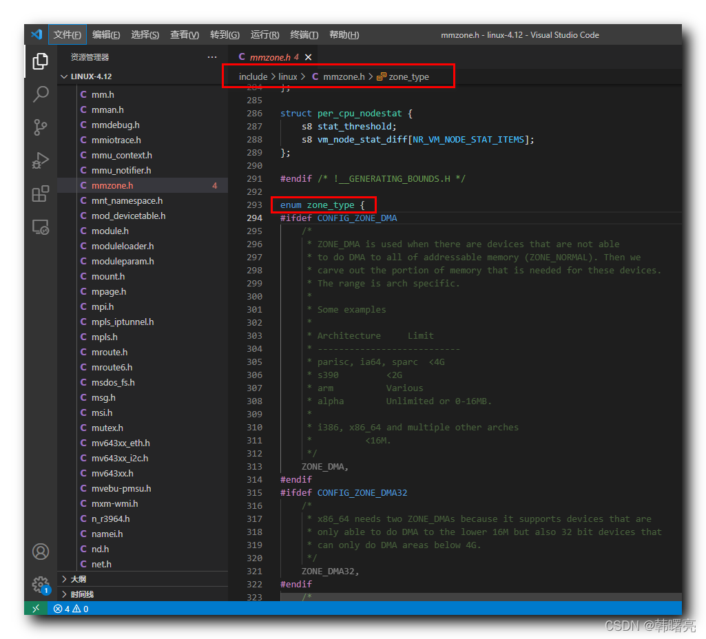

#### 文章目录

-   [一、内存区域 zone 类型简介](https://cloud.tencent.com/developer?from_column=20421&from=20421)
-   [二、内存区域类型 zone\_type 枚举源码分析](https://cloud.tencent.com/developer?from_column=20421&from=20421)
-   -   [1、ZONE\_DMA 直接内存访问区域](https://cloud.tencent.com/developer?from_column=20421&from=20421)
    -   [2、ZONE\_DMA32 内存区域](https://cloud.tencent.com/developer?from_column=20421&from=20421)
    -   [3、ZONE\_NORMAL 普通内存区域](https://cloud.tencent.com/developer?from_column=20421&from=20421)
    -   [4、ZONE\_HIGHMEM 高端内存区域](https://cloud.tencent.com/developer?from_column=20421&from=20421)
    -   [5、ZONE\_MOVABLE 可移动区域](https://cloud.tencent.com/developer?from_column=20421&from=20421)
    -   [6、ZONE\_DEVICE 设备区域](https://cloud.tencent.com/developer?from_column=20421&from=20421)
-   [三、zone\_type 枚举源码](https://cloud.tencent.com/developer?from_column=20421&from=20421)

**内存管理****系统**

33

**级结构 :**

① 内存节点 Node ,

② 内存区域 Zone ,

③ 内存页 Page ,

Linux 内核中 , 使用 上述

33

级结构 描述 和 管理 " 物理内存 " ;

## 一、内存区域 zone 类型简介

* * *

" 内存节点 " 是内存管理的 最顶层结构 ,

" 内存节点 " 再向下划分 , 就是 " 内存区域 " ,

" 内存区域 " 的类型 在 Linux 内核中使用 `enum zone_type` 枚举类型进行描述 , `zone_type` 枚举定义在 Linux 内核源码的 linux-4.12\\include\\linux\\mmzone.h#293 位置 ;

在这里插入图片描述

## 二、内存区域类型 zone\_type 枚举源码分析

* * *

### 1、ZONE\_DMA 直接内存访问区域

`ZONE_DMA` 其中的 DMA 是 Direct Memory Access , 直接内存访问 区域 ;

**使用 DMA 内存情况 :** 有些设备架构比较老 , 无法直接访问整个内存 , 需要使用 DMA 直接内存访问区域 ;

如 ISA 总线 , ( Industry Standard Architecture 工业标准体系结构 ) , 只支持

1616

位的 I/O 设备访问 ,

代码语言：javascript

复制

    #ifdef CONFIG_ZONE_DMA
    	/*
    	 * ZONE_DMA is used when there are devices that are not able
    	 * to do DMA to all of addressable memory (ZONE_NORMAL). Then we
    	 * carve out the portion of memory that is needed for these devices.
    	 * The range is arch specific.
    	 *
    	 * Some examples
    	 *
    	 * Architecture		Limit
    	 * ---------------------------
    	 * parisc, ia64, sparc	<4G
    	 * s390			<2G
    	 * arm			Various
    	 * alpha		Unlimited or 0-16MB.
    	 *
    	 * i386, x86_64 and multiple other arches
    	 * 			<16M.
    	 */
    	ZONE_DMA,
    #endif

### 2、ZONE\_DMA32 内存区域

`ZONE_DMA32` 中的 `DMA32` 是 DMA32 内存区域 ,

对应的是

6464

位系统 , DMA32 区域 可以支持 以下两种设备的访问 :

① 只能直接访问 16 MB 以下的内存设备 ;

② 只能直接访问 4 GB 以下的内存设备 ;

如果要同时满足上述两个条件 , 必须使用 `ZONE_DMA32` 内存区域 ;

代码语言：javascript

复制

    #ifdef CONFIG_ZONE_DMA32
    	/*
    	 * x86_64 needs two ZONE_DMAs because it supports devices that are
    	 * only able to do DMA to the lower 16M but also 32 bit devices that
    	 * can only do DMA areas below 4G.
    	 */
    	ZONE_DMA32,
    #endif

### 3、ZONE\_NORMAL 普通内存区域

`ZONE_NORMAL` 是 " 普通内存区域 " , 该内存区域 可以 直接映射到 " 内核虚拟地址空间 " ;

代码语言：javascript

复制

    	/*
    	 * Normal addressable memory is in ZONE_NORMAL. DMA operations can be
    	 * performed on pages in ZONE_NORMAL if the DMA devices support
    	 * transfers to all addressable memory.
    	 */
    	ZONE_NORMAL,

### 4、ZONE\_HIGHMEM 高端内存区域

`ZONE_HIGHMEM` 中的 `HIGHMEM` 是 " 高端内存区域 " , 这是

3232

位架构中的概念 ,

`DMA` 和 `DMA32` 又称为 " 低端内存区域 " ,

内核空间 与 用户空间 比例为

1:31:3

, 内核空间 1 GB , 因此不能将 1 GB 以上的内存 , 映射到 内核地址 中 ;

代码语言：javascript

复制

    #ifdef CONFIG_HIGHMEM
    	/*
    	 * A memory area that is only addressable by the kernel through
    	 * mapping portions into its own address space. This is for example
    	 * used by i386 to allow the kernel to address the memory beyond
    	 * 900MB. The kernel will set up special mappings (page
    	 * table entries on i386) for each page that the kernel needs to
    	 * access.
    	 */
    	ZONE_HIGHMEM,
    #endif

### 5、ZONE\_MOVABLE 可移动区域

`ZONE_MOVABLE` 是 " 可移动区域 " , 这是为了防止 " 内存碎片 " 的 伪内存区 ;

代码语言：javascript

复制

    	ZONE_MOVABLE,

### 6、ZONE\_DEVICE 设备区域

`ZONE_DEVICE` 是 " 设备区域 " , 这是为了支持 " 内存热插拔 " 而设置的内存区域 , 每个 设备区域 使用 zone 结构体表示 ;

代码语言：javascript

复制

    #ifdef CONFIG_ZONE_DEVICE
    	ZONE_DEVICE,
    #endif

## 三、zone\_type 枚举源码

* * *

代码语言：javascript

复制

    enum zone_type {
    #ifdef CONFIG_ZONE_DMA
    	/*
    	 * ZONE_DMA is used when there are devices that are not able
    	 * to do DMA to all of addressable memory (ZONE_NORMAL). Then we
    	 * carve out the portion of memory that is needed for these devices.
    	 * The range is arch specific.
    	 *
    	 * Some examples
    	 *
    	 * Architecture		Limit
    	 * ---------------------------
    	 * parisc, ia64, sparc	<4G
    	 * s390			<2G
    	 * arm			Various
    	 * alpha		Unlimited or 0-16MB.
    	 *
    	 * i386, x86_64 and multiple other arches
    	 * 			<16M.
    	 */
    	ZONE_DMA,
    #endif
    #ifdef CONFIG_ZONE_DMA32
    	/*
    	 * x86_64 needs two ZONE_DMAs because it supports devices that are
    	 * only able to do DMA to the lower 16M but also 32 bit devices that
    	 * can only do DMA areas below 4G.
    	 */
    	ZONE_DMA32,
    #endif
    	/*
    	 * Normal addressable memory is in ZONE_NORMAL. DMA operations can be
    	 * performed on pages in ZONE_NORMAL if the DMA devices support
    	 * transfers to all addressable memory.
    	 */
    	ZONE_NORMAL,
    #ifdef CONFIG_HIGHMEM
    	/*
    	 * A memory area that is only addressable by the kernel through
    	 * mapping portions into its own address space. This is for example
    	 * used by i386 to allow the kernel to address the memory beyond
    	 * 900MB. The kernel will set up special mappings (page
    	 * table entries on i386) for each page that the kernel needs to
    	 * access.
    	 */
    	ZONE_HIGHMEM,
    #endif
    	ZONE_MOVABLE,
    #ifdef CONFIG_ZONE_DEVICE
    	ZONE_DEVICE,
    #endif
    	__MAX_NR_ZONES
    
    };

**源码路径 :** linux-4.12\\include\\linux\\mmzone.h#293

## 参考

[【Linux 内核 内存管理】物理内存组织结构 ⑤ ( 内存区域 zone 类型简介 | 内存区域类型zone_type 枚举源码分析 | zone_type 枚举源码 )-腾讯云开发者社区-腾讯云 (tencent.com)](https://cloud.tencent.com/developer/article/2253502)