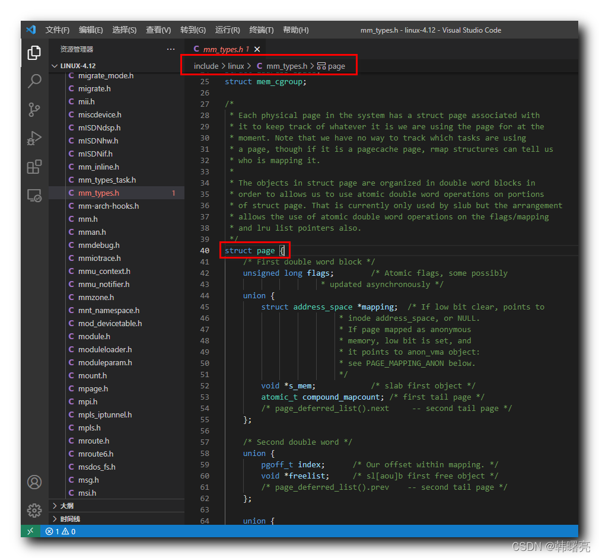

【Linux 内核 内存管理】物理内存组织结构 ⑥ ( 物理页 page 简介 | 物理页 page 与 MMU 内存管理单元 | 内存节点 pglist_data 与 物理页 page 联系 )

#### 文章目录

-   [一、物理页 page 简介](https://cloud.tencent.com/developer?from_column=20421&from=20421)
-   -   [1、物理页 page 引入](https://cloud.tencent.com/developer?from_column=20421&from=20421)
    -   [2、物理页 page 与 MMU 内存管理单元](https://cloud.tencent.com/developer?from_column=20421&from=20421)
    -   [3、物理页 page 结构体](https://cloud.tencent.com/developer?from_column=20421&from=20421)
    -   [4、Linux 内核源码中的 page 结构体](https://cloud.tencent.com/developer?from_column=20421&from=20421)
-   [二、内存节点 pglist\_data 与 物理页 page 联系](https://cloud.tencent.com/developer?from_column=20421&from=20421)

**内存管理****系统**

33

**级结构 :**

① 内存节点 Node ,

② 内存区域 Zone ,

③ 物理页 Page ,

Linux 内核中 , 使用 上述

33

级结构 描述 和 管理 " 物理内存 " ;

## 一、物理页 page 简介

* * *

### 1、物理页 page 引入

" 内存节点 " node 是内存管理的 最顶层结构 ,

" 内存节点 " 再向下划分 , 就是 " 内存区域 " zone ,

" 内存区域 " 再向下划分 , 就是 " 物理页 " page ;

### 2、物理页 page 与 MMU 内存管理单元

在 Linux 内核中 , MMU 内存管理单元 , 主要作用是 将 " 虚拟地址 " 映射到 真实的 " 物理地址 " 中 ,

MMU 将 物理页 page 作为内存管理基本单位 ,

不同体系结构的支持的 物理页 大小也不同 ,

3232

位体系结构中 , 支持的物理页大小为

44

kb ,

6464

位体系结构中 , 支持的物理页大小为

88

kb ,

-   MIPS

6464

位体系结构中 , 支持的物理页大小为

1616

kb ,

### 3、物理页 page 结构体

" 物理页 " `page` 是 Linux 内核 " 内存管理 " 中的 最小单位 ,

物理页 中的 " 物理地址 " 是连续的 ,

每个 " 物理页 " 使用 `struct page` 结构体 进行描述 ;

为了节省 " 内存管理 " 的内存开销 , 物理页的描述符 page 中都是 union 联合体 , 如 :

代码语言：javascript

复制

    struct page {
    	union {
    		struct address_space *mapping;	/* If low bit clear, points to
    						 * inode address_space, or NULL.
    						 * If page mapped as anonymous
    						 * memory, low bit is set, and
    						 * it points to anon_vma object:
    						 * see PAGE_MAPPING_ANON below.
    						 */
    		void *s_mem;			/* slab first object */
    		atomic_t compound_mapcount;	/* first tail page */
    		/* page_deferred_list().next	 -- second tail page */
    	};
    }

### 4、Linux 内核源码中的 page 结构体

" 物理页 " 使用 `page` 结构体 进行描述 , 该结构体又称为 " 页描述符 " ;

该 `page` 结构体 定义在 Linux 内核源码的 linux-4.12\\include\\linux\\mm\_types.h#40 位置 ;

在这里插入图片描述

## 二、内存节点 pglist\_data 与 物理页 page 联系

* * *

**" 内存节点 " `pglist_data` 结构体 与 " 物理页 " `page` 结构体 的联系 :**

在 " 内存节点 " `pglist_data` 结构体 中的 `node_mem_map` 成员 就是 该 " 内存节点 " 中所有的 " 物理页 " 描述符 `page` 结构体 数组 ;

`CONFIG_FLAT_NODE_MEM_MAP` 宏定义指的是 " 除 稀疏内存模型 之外 " 的情况 , 该情况下 声明 `struct page *node_mem_map` 页描述数组 ;

代码语言：javascript

复制

    typedef struct pglist_data {
    #ifdef CONFIG_FLAT_NODE_MEM_MAP	/* means !SPARSEMEM */
    	// 页描述数组
    	struct page *node_mem_map;
    #endif
    }

参考 [【Linux 内核 内存管理】物理内存组织结构 ③ ( 内存管理系统三级结构 | 内存节点描述 | 内存节点 pglist\_data 结构体 | pglist\_data 结构体源码 )](https://cloud.tencent.com/developer/tools/blog-entry?target=https%3A%2F%2Fblog.csdn.net%2Fshulianghan%2Farticle%2Fdetails%2F124243959&source=article&objectId=2253504) 博客 ;

## 参考

[【Linux 内核 内存管理】物理内存组织结构 ⑥ ( 物理页 page 简介 | 物理页 page 与 MMU 内存管理单元 | 内存节点 pglist_data 与 物理页 page 联系 )-腾讯云开发者社区-腾讯云 (tencent.com)](https://cloud.tencent.com/developer/article/2253504)