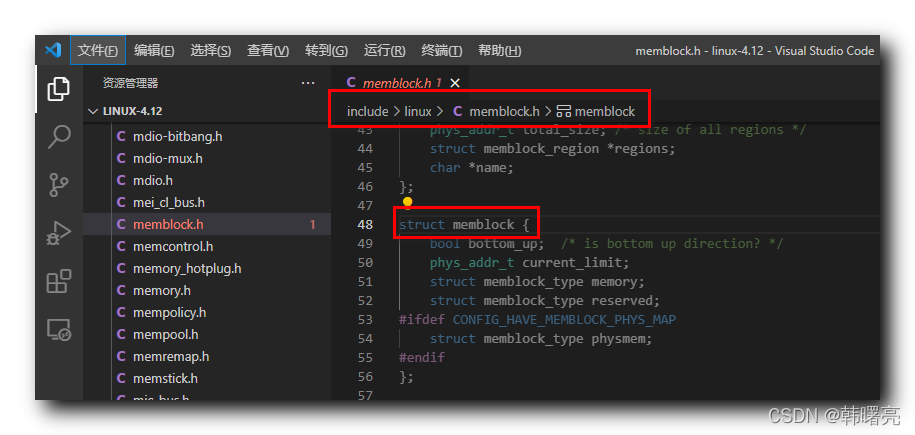

【Linux 内核 内存管理】memblock 分配器 ① ( memblock 分配器简介 | memblock 结构体成员分析 | 物理内存类型 与 内存类型 )

#### 文章目录

-   [一、memblock 分配器](https://cloud.tencent.com/developer?from_column=20421&from=20421)
-   [二、memblock 结构体分析](https://cloud.tencent.com/developer?from_column=20421&from=20421)
-   -   [1、bottom\_up 成员](https://cloud.tencent.com/developer?from_column=20421&from=20421)
    -   [2、current\_limit 成员](https://cloud.tencent.com/developer?from_column=20421&from=20421)
    -   [3、memory 成员](https://cloud.tencent.com/developer?from_column=20421&from=20421)
    -   [4、reserved 成员](https://cloud.tencent.com/developer?from_column=20421&from=20421)
    -   [5、physmem 成员](https://cloud.tencent.com/developer?from_column=20421&from=20421)
-   [三、物理内存类型 与 内存类型](https://cloud.tencent.com/developer?from_column=20421&from=20421)

**ARM64 架构体系中 , 不能使用 `bootmem` 引导内存分配器 , 使用的是 `memblock` 分配器 ;**

## 一、memblock 分配器

* * *

memblock 分配器 定义在 Linux 内核源码的 linux-4.12\\include\\linux\\memblock.h#48 位置 ;

代码语言：javascript

复制

    struct memblock {
    	bool bottom_up;  /* is bottom up direction? */
    	phys_addr_t current_limit;
    	struct memblock_type memory;
    	struct memblock_type reserved;
    #ifdef CONFIG_HAVE_MEMBLOCK_PHYS_MAP
    	struct memblock_type physmem;
    #endif
    };

**源码路径 :** linux-4.12\\include\\linux\\memblock.h#48

在这里插入图片描述

## 二、memblock 结构体分析

* * *

### 1、bottom\_up 成员

`bottom_up` 成员表示 内存分配方式 ,

-   TRUE , 表示 从 " 低地址向上分配 " ,
-   FALSE , 表示 从 " 高地址向下分配 " ;

代码语言：javascript

复制

    	bool bottom_up;  /* is bottom up direction? */

### 2、current\_limit 成员

`current_limit` 成员表示 可分配内存的 最大物理地址 ;

代码语言：javascript

复制

    	phys_addr_t current_limit;

### 3、memory 成员

`memory` 成员 表示 内存类型 , 该内存 包括 已分配 和 未分配 的内存 ;

代码语言：javascript

复制

    	struct memblock_type memory;

### 4、reserved 成员

`reserved` 成员 表示 预留类型 , 该内存只包含 已分配内存 ;

代码语言：javascript

复制

    	struct memblock_type reserved;

### 5、physmem 成员

`physmem` 成员 表示 物理内存类型 ;

代码语言：javascript

复制

    #ifdef CONFIG_HAVE_MEMBLOCK_PHYS_MAP
    	struct memblock_type physmem;
    #endif

## 三、物理内存类型 与 内存类型

* * *

**物理内存类型 与 内存类型 :**

-   **包含关系 :** 物理内存类型 包含 内存类型 ;
-   **内存类型 :** 在 内核 引导启动时 , 只能使用 `mem` 内核参数 指定可用内存大小范围 , 该范围之外的内存不可使用 , 即内核无法使用所有的内存 ;
-   **物理类型 :** 包含所有的内存范围 ;

## 参考

[【Linux 内核 内存管理】memblock 分配器 ① ( memblock 分配器简介 | memblock 结构体成员分析 | 物理内存类型 与 内存类型 )-腾讯云开发者社区-腾讯云 (tencent.com)](https://cloud.tencent.com/developer/article/2253522)