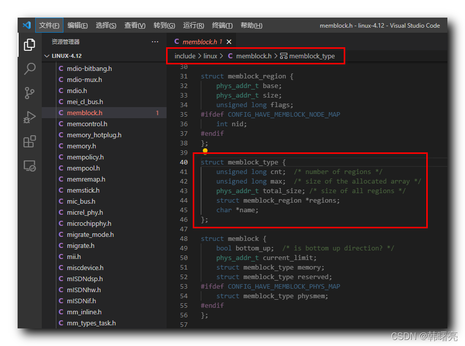

【Linux 内核 内存管理】memblock 分配器 ② ( memblock_type 内存块类型 | memblock_type 结构体成员分析 )

#### 文章目录

-   [一、memblock\_type 内存块类型](https://cloud.tencent.com/developer?from_column=20421&from=20421)
-   [二、memblock\_type 结构体成员分析](https://cloud.tencent.com/developer?from_column=20421&from=20421)
-   -   [1、cnt 成员](https://cloud.tencent.com/developer?from_column=20421&from=20421)
    -   [2、max 成员](https://cloud.tencent.com/developer?from_column=20421&from=20421)
    -   [3、total\_size 成员](https://cloud.tencent.com/developer?from_column=20421&from=20421)
    -   [4、regions 成员](https://cloud.tencent.com/developer?from_column=20421&from=20421)
    -   [5、name 成员](https://cloud.tencent.com/developer?from_column=20421&from=20421)

## 一、memblock\_type 内存块类型

* * *

`memblock` 分配器 涉及到 内存块 类型 , 在 Linux 内核中 , 使用 `struct memblock_type` 结构体 描述 ,

`struct memblock_type` 结构体 定义在 Linux 内核源码的 linux-4.12\\include\\linux\\memblock.h#40 位置 ;

代码语言：javascript

复制

    struct memblock_type {
    	unsigned long cnt;	/* number of regions */
    	unsigned long max;	/* size of the allocated array */
    	phys_addr_t total_size;	/* size of all regions */
    	struct memblock_region *regions;
    	char *name;
    };

**源码路径 :** linux-4.12\\include\\linux\\memblock.h#40

在这里插入图片描述

## 二、memblock\_type 结构体成员分析

* * *

**`memblock_type` 结构体成员分析 :**

### 1、cnt 成员

`cnt` 成员 表示 当前 管理的 " 内存区域 " 个数 ;

代码语言：javascript

复制

    	unsigned long cnt;	/* number of regions */

### 2、max 成员

`max` 成员 表示 当前 管理的 " 内存区域 " 最大个数 ;

代码语言：javascript

复制

    	unsigned long max;	/* size of the allocated array */

### 3、total\_size 成员

`total_size` 成员 表示 当前 所有内存块 的总大小 ;

代码语言：javascript

复制

    	phys_addr_t total_size;	/* size of all regions */

### 4、regions 成员

`regions` 成员 表示 的指针 指向 " 执行内存区域 " ;

代码语言：javascript

复制

    	struct memblock_region *regions;

### 5、name 成员

`name` 成员 表示 " 内存块类型 " 的名称 ;

代码语言：javascript

复制

    	char *name;